# OciDeck

> **Status:** current-state project overview · **Status last reviewed:** 2026-08-30 · **Published by:** Stichting LibreKAT

> **Alpha — releases are now tagged (latest: `0.4.10`, 2026-08-25).** You can
> build from source, or download a release build; either way the file format is
> the part meant to be stable ([FILE_FORMAT.md](docs/FILE_FORMAT.md)), while the
> application is not yet. What is missing, rough or untested is collected in
> [KNOWN_LIMITATIONS.md](docs/KNOWN_LIMITATIONS.md).

A desktop and web application for building [Marp](https://marp.app/)-compatible
presentations through a structured, slide-by-slide editor — no raw Markdown
wrangling required. Compose decks from typed slide templates, preview them live,
present them fullscreen across two screens, and export to Marp Markdown, PDF,
PPTX, OpenDocument (ODP), LaTeX/Beamer, offline HTML or a portable package.

Alongside presentations it also edits a **flowing Markdown document** — a report,
a memo, a note — in the same window: a plain `.md` that any Markdown reader
opens, with a visual and a source view, exported to `.md`, HTML, PDF, LaTeX,
ePub or ODT, and convertible either way between a document and a presentation
([ARCHITECTURE.md](docs/ARCHITECTURE.md#document-mode)).

> **Try it in your browser:** <https://ocideck.librekat.nl/> — the web build,
> running entirely in your own tab; nothing you type or open is uploaded. It is
> the smaller half of the two: no local video, no local CVE database, no WebDAV
> browsing, and a URL import that a browser blocks on CORS grounds is retried
> through a proxy on that host — which then sees the address you typed
> ([the full list](docs/KNOWN_LIMITATIONS.md#the-web-build-does-less-than-the-desktop-build)).
> For everything, build the desktop app — [BUILD.md](docs/BUILD.md).


And because a deck is something you hand to other people, OciDeck reads it back
to you before you do: it flags the personal data it can recognise, and — if you
ask it to — removes that data from everything you show and export, while your
Markdown keeps the original.

Built with Flutter for macOS, Windows, Linux, and **web**.

> **What's in a name?** *OciDeck* is a small wink: **Oci** is borrowed from the *Ocicats* — the initiator's cats — and **Deck** is short for a presentation deck. So: the cats' presentation tool. (Who that is, and who publishes this, is in [`AUTHORS.md`](AUTHORS.md).)

> **Independent of Marp.** OciDeck reads and writes Marp-compatible Markdown,
> but it is not affiliated with, endorsed by, or a product of the Marp Team, and
> it does not embed Marp Core. The renderer is its own, built on `marked` — see
> [ARCHITECTURE.md](docs/ARCHITECTURE.md). Compatibility with the Marp CLI is a
> design goal that has not yet been verified against the real tool.

> **Runs on your device, not on a server.** No application backend for editing,
> no telemetry, no analytics, no phoning home; the privacy scan runs on your
> device too. Most outbound calls are ones you start and point where you choose,
> but four are not — the web CORS fetch-proxy, the CVE mirror, the local CVE
> database's bulk download, and an embedded YouTube or Vimeo player. All of
> them, with what each one sends, are listed in
> [PRIVACY.md](docs/PRIVACY.md#what-leaves-your-device--and-only-when-you-ask);
> the mechanics are in
> [ARCHITECTURE.md](docs/ARCHITECTURE.md#runtime--network-model). The demo above
> is the one place where the *device* is a page the publisher serves: the work
> still happens in your tab and no deck is uploaded, but the origin is ours —
> [what that means](docs/PRIVACY.md#the-servers-the-publisher-runs).

## What it does

- **Structured slide editors** — a dedicated editor per slide type: title, bullets, images, quote, table, code, video, audio, and more.
- **Document mode** — edits a plain, flowing `.md` document next to presentations, with a visual and a source view, an insert palette and a formatting toolbar; exports to `.md`, one continuous HTML file, a typeset PDF, LaTeX, ePub or ODT, and converts either way between a document and a presentation.
- **Privacy check and redaction (OciWacht)** — every slide is read for personal data, and what you mark is left out of display and export, not painted over.
- **Live preview and fullscreen presenter** — presenter view, dual screens, a rehearsal clock, an annotation layer, and live table editing.
- **Charts, timelines and quiz slides** — fourteen chart types from CSV or an in-app grid (eight statistical ones join them with the process-improvement module on), animated timelines, and interactive question slides.
- **Cockpit dashboards** — up to six aviation-style instruments, with an authentic panel look, a classic fallback and a staged power-on sequence in the presenter.
- **Traffic Light Protocol** — deck-wide and per-slide classification, WYSIWYG marking, and optional export policy that fails closed.
- **Import and export** — round-trips Marp Markdown, and exports to PDF, PPTX with speaker notes, OpenDocument (ODP), LaTeX/Beamer, and a self-contained offline HTML deck.
- **Storage** — local project folders, a portable `.ocideck` package, Nextcloud/WebDAV, S3, or a git repository with history and releases.
- **Theming, 32 languages and accessibility** — style profiles that travel as a file, a dark interface, and interface text scaling to 200%.

The full account of each — every slide type, every option, and the limits — is
in the [User Guide](docs/USER_GUIDE.md).

A few of those, seen rather than described:

| Privacy scan (OciWacht) | Export for a recipient |
|---|---|
| 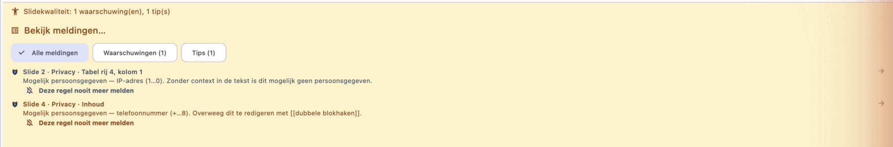 | 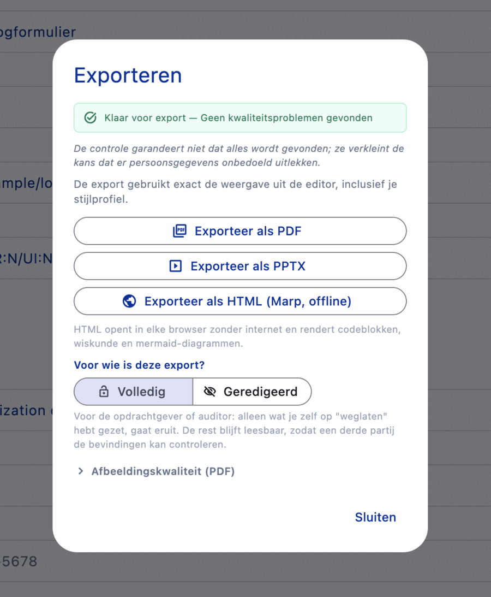 |

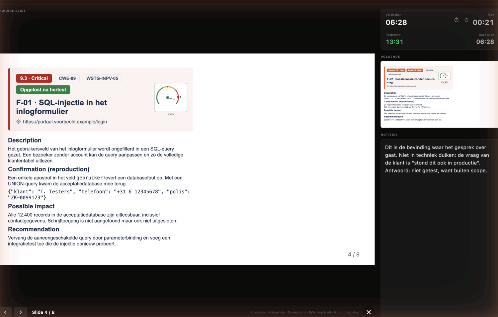

| A chart is data, not a picture | The slide that grid renders |
|---|---|
| 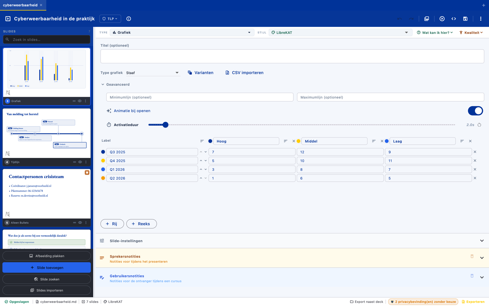 | 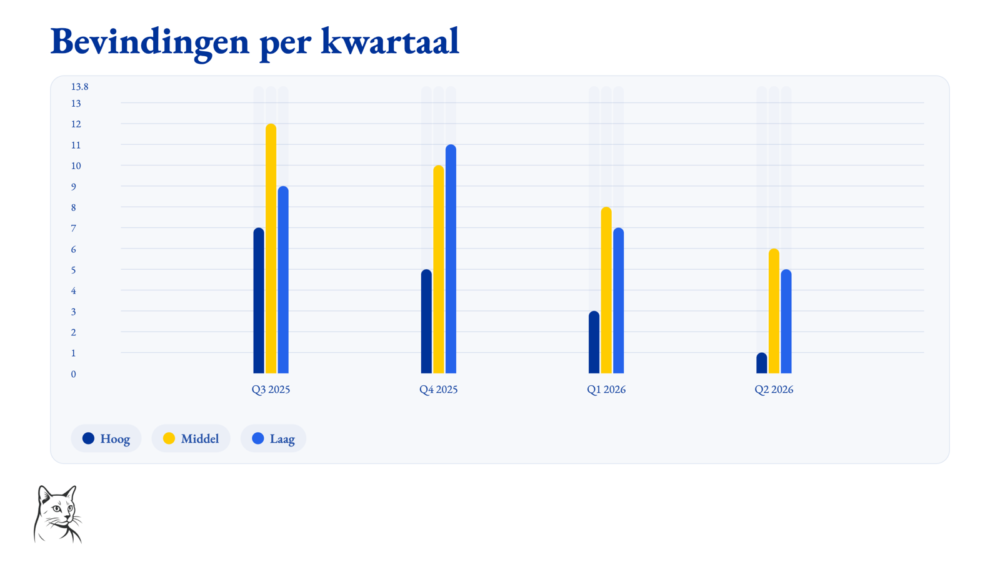 |

| A heatmap as a risk matrix | A cockpit dashboard |
|---|---|
| 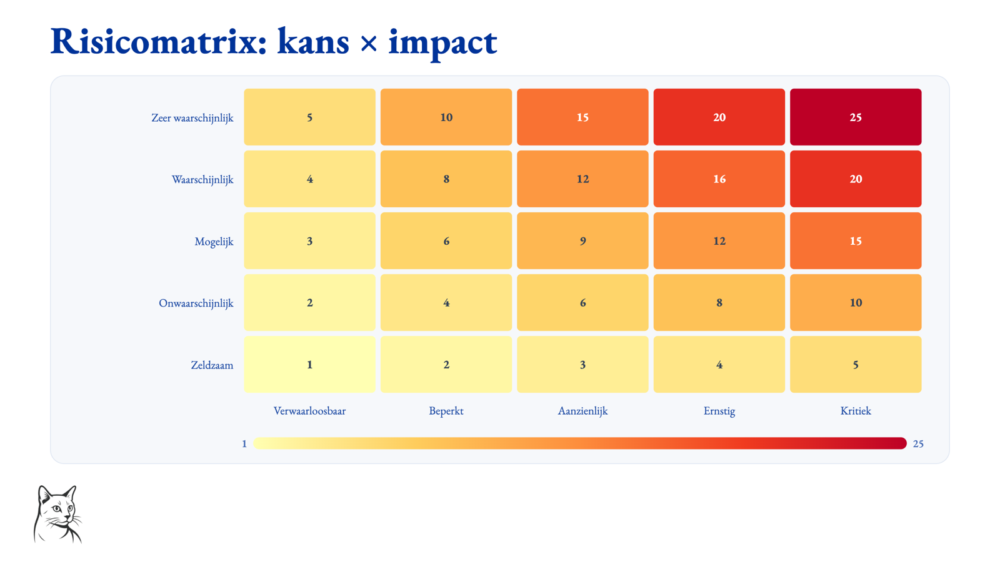 | 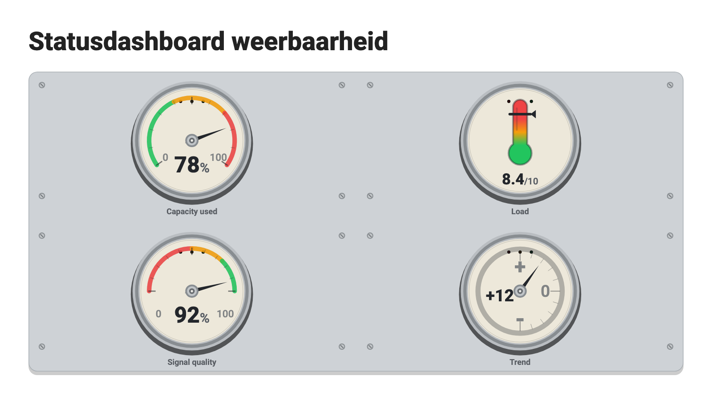 |

| A timeline from a plain Markdown list | A question slide, answered live |
|---|---|
| 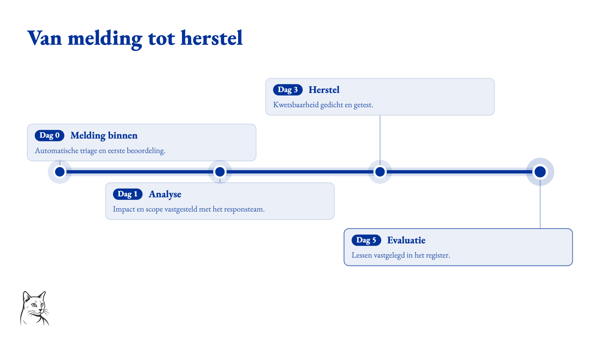 | 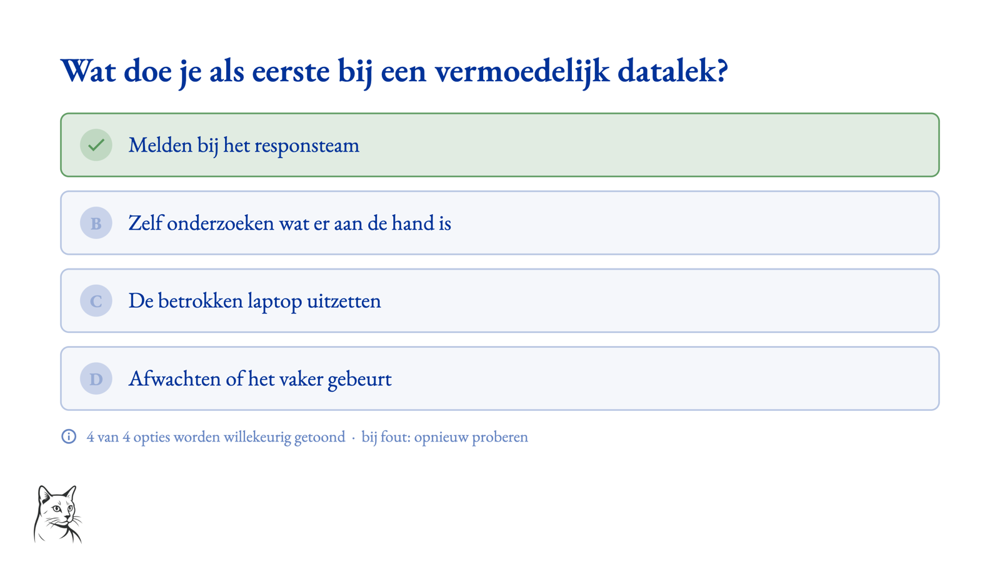 |

| Classification that travels with the slide | The same editor, dark |
|---|---|
| 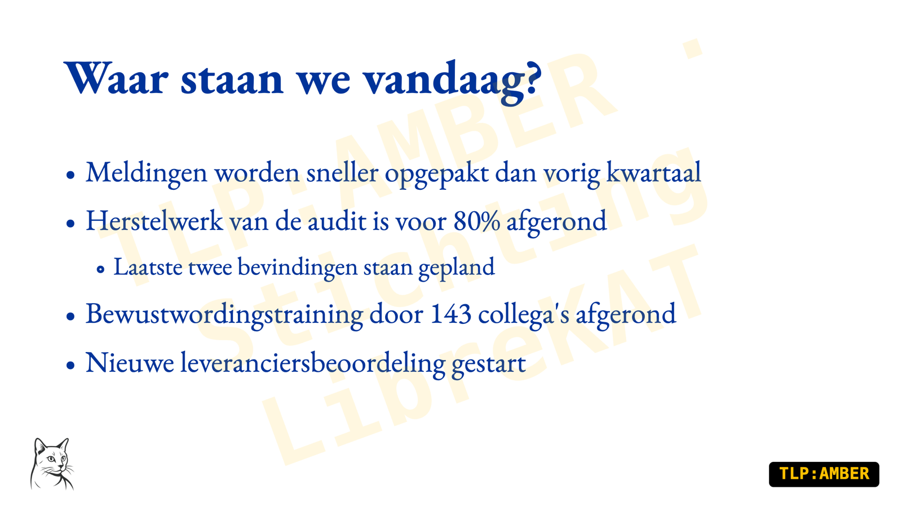 | 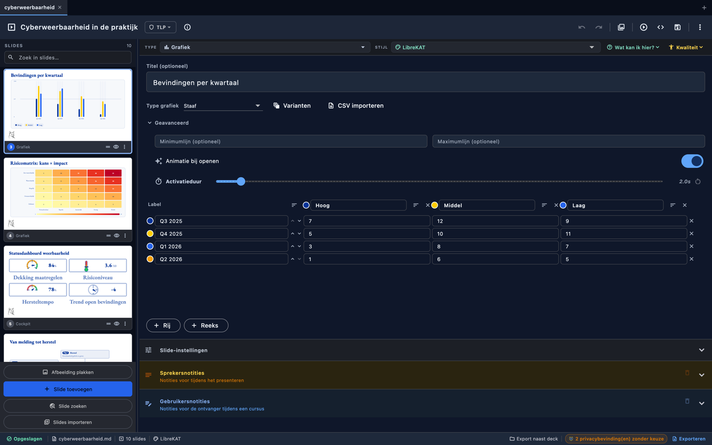 |

*(These are the desktop build. The web build in your browser runs the same
renderer; a few things are desktop-only — video, the CVE lookup, the local CVE
database.)*

### Specialist modules (off by default)

Hidden in the interface until you switch them on under *Settings → Extensions*,
so they cost the ordinary user nothing.

- **Information-security reporting (MIAUW)** — reports structured to the MIAUW methodology: finding, checklist, scope-matrix and sign-off slides, a CVSS 4.0 builder, an offline CWE picker, sealing and an encrypted audit dossier. All reference data ships with the app; nothing goes out. See [the User Guide](docs/USER_GUIDE.md#information-security-module-pentest-reports).
- **AI assistance** — an optional local model or consented endpoint that drafts finding text and image alt-text. AI-drafted content is marked and blocks sealing until a human reviews it. See [AI_ASSIST.md](docs/design/AI_ASSIST.md).
- **Image-rights check** — locally flags repository images that may need a
  copyright or licence review, then stores the administrator's decision beside
  the shared asset. It is an indication, never a legal conclusion. See [the
  User Guide](docs/USER_GUIDE.md#image-rights-check).

## Requirements

- Flutter **3.47.1** (stable) — the pinned toolchain (see `.tool-versions`),
  bundling Dart 3.13.1. The `pubspec.yaml` Dart SDK constraint is `^3.12.0`;
  building tolerates Flutter 3.44+, but `make format-check` is version-sensitive
  (see [BUILD.md](docs/BUILD.md)).
- A desktop target enabled: macOS, Windows, or Linux — or run in a browser via Flutter web

## Getting started

**Download OciDeck** for macOS, Windows, Linux or the web from the
[releases page](https://pawprint.vigilis.online/LibreKAT/Ocideck/releases). Every
release carries the app for all four platforms, both SBOM formats and a
`SHA256SUMS` to verify what you downloaded. On **Linux** take your pick of an
AppImage, a `.deb` (Debian/Ubuntu/Mint), an `.rpm` (Fedora/openSUSE) or the
portable tarball — all the same build. The macOS build is signed and notarised
and opens normally; the Windows and Linux binaries are unsigned, so they warn on
first launch — the release notes explain how to open them on each platform.

On macOS you can also install with [Homebrew](https://brew.sh/), tapping our own
forge — the canonical source for the cask as well as the app:

```sh
brew tap librekat/ocideck https://pawprint.vigilis.online/LibreKAT/homebrew-ocideck.git
brew install --cask librekat/ocideck/ocideck
```

If the forge is unreachable, the GitHub mirror is the backup. It needs no tap
step, because Homebrew's shorthand resolves to GitHub by definition:

```sh
brew install --cask brennodewinter/ocideck/ocideck
```

Either way Homebrew downloads the release from our forge and verifies its
checksum; update later with `brew upgrade --cask ocideck`. The cask is only a
pointer to the same signed, notarised release — see
[BUILD.md](docs/BUILD.md#homebrew-cask-macos).

Or build and run from source:

```sh
make setup      # flutter pub get
flutter run -d macos   # or -d windows / -d linux / -d chrome
```

## Development

The `Makefile` is the entry point for all quality checks. Run `make help` for the full list.

```sh
make check        # format + analysis + conventions + method length + dead code + tests & coverage
make check-full   # check + licences + SBOM freshness + web hardening + dependency report
make format       # auto-format all Dart code
make analyze      # flutter analyze only
make test         # full test suite only
```

Targeted test groups speed up focused work:

| Target | Covers |
| --- | --- |
| `make test-contracts` | Markdown generation/parsing, save-load round-trips, field migration |
| `make test-preview`   | Slide rendering, footers, TLP, inline Markdown, text styles |
| `make test-export`    | PDF/PPTX export and project file-save behavior |
| `make test-state`     | Providers, undo/redo, search/replace, settings, recovery |
| `make test-services`  | Image, caption, and description sidecar services |
| `make test-presenter` | Fullscreen presenter navigation and keyboard shortcuts |

Run `make check` before pushing — it is the same quality gate (format check,
static analysis, full test suite) you would wire into CI. `make check-full` adds
licence compliance (`make licenses`), the vendored-JS security check
(`make deps-check`), and the SBOM freshness gate (`make sbom-verify`). For the
full reference — every check, what it covers, and how it is enforced — see
[`docs/CHECKS.md`](docs/CHECKS.md).

OciDeck ships a machine-readable **Software Bill of Materials** (CycloneDX 1.6 +
SPDX 2.3) covering every component, as described in the EU Cyber Resilience Act.
We are not a manufacturer under that regulation and are not obliged to; we do it
because it is part of building software properly — see
[`docs/SBOM.md`](docs/SBOM.md).

## Project layout

```
lib/
  models/     # Deck, Slide, Settings data models
  services/   # Markdown, export, file, image, caption, recovery, rasterizer,
              # privacy, git/S3 sources, and one directory per export format
  state/      # Riverpod providers (deck, editor, settings, tabs, clipboard)
  collab/     # Co-authoring: op model, transport seam, session authority
  xmpp/       # The XMPP transport collab and calls ride on
  meetings/   # Call session: typed events, participants, media core
  platform/   # Conditional-import platform abstraction (io/web halves)
  widgets/    # UI: app shell, panels, dialogs, per-type editors, presenter
  l10n/       # AppLocalizations (32 languages)
  theme/      # App theming
  utils/      # Small shared helpers (clipboard table parsing, URL launching)
```

*(Corrected 2026-08-30: four top-level directories were missing here, including
the whole co-authoring and calls layer. The fuller map is
[ARCHITECTURE.md](docs/ARCHITECTURE.md#module-layout); the file-by-file one is
[SOURCE_MAP.md](docs/SOURCE_MAP.md), which a test holds to the tree.)*

State is managed with [Riverpod](https://riverpod.dev/).

## File format

Presentations are saved as standard, Marp-compatible Markdown (`.md`) with a
defined project folder layout and an optional portable `.ocideck` package.
Anything that isn't plain Marp is kept in side files so the `.md` stays pure and
portable: image captions, the annotation layer (`.ink.json`), and linked chart
data (`data/*.csv`). A style profile also travels on its own as a
`.ocideckstyle` file (JSON, with any custom logo embedded). The full
specification — front matter, per-slide markup, style profile, sidecars, and the
package format — is documented in
[`docs/FILE_FORMAT.md`](docs/FILE_FORMAT.md).

## Documentation

**Full documentation index: [`docs/README.md`](docs/README.md)** — the five
reader paths (user, developer, host, auditor, assistive technology) start there,
and it also indexes the design documents. The current-state documents:

| Document | What it covers |
| --- | --- |
| [API documentation](docs/API_DOCUMENTATION.md) | The internal APIs and seams a contributor works with to extend the app |
| [Architecture](docs/ARCHITECTURE.md) | How the code fits together (for contributors) |
| [Audit response](AUDIT_RESPONSE.md) | Point-by-point response to the external code audits, each verdict weighed against the code |
| [Build & release](docs/BUILD.md) | Building from source and producing distributables |
| [Changelog](CHANGELOG.md) | Notable changes (nothing is released yet) |
| [Checks & CI](docs/CHECKS.md) | Every automated check, what it covers, and how each is enforced |
| [Compliance attestation](COMPLIANCE.md) | Voluntary security attestation (ORC WG light-weight checklist), including the rows we cannot tick |
| [Contributing](CONTRIBUTING.md) | Setup, the quality gate, and how to propose changes |
| [Contributing guidelines](docs/CONTRIBUTING_GUIDELINES.md) | The fuller contribution workflow: reporting issues, pull requests, and coding standards |
| [Contributors](CONTRIBUTORS.md) | A word of thanks to the people who have helped shape OciDeck |
| [Development setup](docs/DEVELOPMENT_SETUP_GUIDE.md) | Setting up a development environment from scratch, step by step |
| [FAQ](docs/FAQ.md) | Common questions about features, security, and privacy |
| [File format](docs/FILE_FORMAT.md) | The Marp Markdown, front matter, sidecars, the `.ocideck` package, and the `.ocideckstyle` style profile |
| [Glossary](docs/GLOSSARY.md) | OciDeck-specific terms and the acronyms that recur in the code and docs |
| [Hosting](docs/HOSTING.md) | Building and serving the web build safely — the desktop apps need no hosting |
| [Keyboard shortcuts](docs/SHORTCUTS.md) | Editor and presenter shortcuts |
| [Known limitations](docs/KNOWN_LIMITATIONS.md) | What this alpha does not do yet, in one place |
| [Licence compliance](docs/LICENSE_COMPLIANCE.md) | Open-source policy and the `make licenses` check |
| [Migration guide](docs/MIGRATION_GUIDE.md) | Moving between versions — no breaking changes between releases yet |
| [Performance](docs/PERFORMANCE_GUIDE.md) | Performance characteristics and the hard limits enforced in code |
| [Privacy](docs/PRIVACY.md) | What stays local, what leaves, and on whose action |
| [SBOM](docs/SBOM.md) | The machine-readable Software Bill of Materials and its CRA mapping |
| [Security design](docs/SECURITY_DESIGN.md) | The security design principles and the concrete mechanisms that enforce them |
| [Security review (APT)](docs/SECURITY_REVIEW_APT.md) | The APT-resilience review findings and their status |
| [Security policy](SECURITY.md) | How to report a vulnerability |
| [Source availability](SOURCE.md) | The EUPL source indication shipped in the web build — where the source lives and how to build it |
| [Source map](docs/SOURCE_MAP.md) | An index of the files under `lib/`, grouped per directory |
| [Third-party notices](THIRD_PARTY_NOTICES.md) | Bundled components and their licences, and the owners of the trademarks OciDeck names |
| [Troubleshooting](docs/TROUBLESHOOTING_GUIDE.md) | Fixes for common problems |
| [Accessibility](docs/ACCESSIBILITY.md) | What is accessible, and — the longer half — what is not |
| [User Guide](docs/USER_GUIDE.md) | Using the app: slide types, charts, presenting, exporting, theming, the privacy check and redaction, and the information-security (pentest) module |

### Design documents

The design rationale and chosen architecture, kept separate from the
current-state documents above. All eleven are listed with their real status in
[`docs/README.md`](docs/README.md#design-notes-design) — each carries its own
status banner, and where a design disagrees with the code, the code wins. That
list is maintained in one place so it cannot go stale in two.

## Where this lives

| | |
| --- | --- |
| **Repository** | <https://pawprint.vigilis.online/LibreKAT/Ocideck> |
| **Issues and pull requests** | [the tracker there](https://pawprint.vigilis.online/LibreKAT/Ocideck/issues) — registration is open to anyone |
| **Security reports** | `security@librekat.nl` — see [`SECURITY.md`](SECURITY.md) |

The forge has an Actions runner (since 2026-07-23). It runs the quality gate on
a `v*` tag (`.forgejo/workflows/ci.yml`) — not per pull request, and on a Mac
runner rather than the server, because the same gate took 46 minutes there
against 2.5 minutes on the Mac. It runs `make check-no-coverage`: the whole test
suite, without the coverage floors. **So run `make check` locally before you
push: it is very nearly the only thing standing between a change and `main`, and
the only place the coverage floors run at all.** The one exception is
`.forgejo/workflows/scans.yml` (#778), which runs the secret and SAST scans on
every pull request and push — seconds rather than minutes, and for a credential
the moment it is found is not interchangeable. The Linux gate
(`.forgejo/workflows/linux-gate.yml`) runs nightly on the tip of `main` and on
demand; the desktop bundles (`linux-build.yml`, `macos-build.yml`) run after a
merge that can break them, and on demand. See
[`docs/CHECKS.md`](docs/CHECKS.md).

A `v*` tag runs `.forgejo/workflows/release.yml`: web, macOS and Linux builds
here, the Windows build on the GitHub mirror, and all of them published as one
release with the SBOM and `SHA256SUMS` — see
[`docs/BUILD.md`](docs/BUILD.md#cutting-a-release). Apart from that Windows lane,
the workflow files under `.github/` are reference definitions; Forgejo reads
`.forgejo/workflows/` instead.

## Contributing

Contributions are welcome! Please read [`CONTRIBUTING.md`](CONTRIBUTING.md) and our
[`CODE_OF_CONDUCT.md`](CODE_OF_CONDUCT.md). In short: `make check` must pass, new
UI strings must be translated in all languages, and file-format changes must be
reflected in `docs/FILE_FORMAT.md`. For security issues, see
[`SECURITY.md`](SECURITY.md).

**About the 32 languages:** the interface runs in Dutch, English, German,
French, Italian, Spanish, Portuguese, Polish, Czech, Slovak, Slovenian,
Croatian, Bulgarian, Romanian, Hungarian, Greek, Danish, Swedish, Finnish,
Estonian, Latvian, Lithuanian, Maltese, Irish, Ukrainian, Turkish, Indonesian,
Frisian, Swiss German, Latin, Papiamento, and Klingon. That is roughly 71,500
translations, and they were produced during AI-assisted development — 289 of the
314 commits touching `lib/l10n/translations/` carry an AI co-author trailer.
**No native speaker has reviewed them word by word.** Two tests fail the build:
one if a string is missing in any language, and one — since #677 — if a
"translation" is still the English sentence. Together they catch absence and the
most visible form of neglect, not quality. Corrections for a single language are
among the most useful contributions this project can receive.

**The 32 languages are the interface. The documentation is English.** Every
bundled document — user guide, privacy, security and the rest of the curated
in-app set — exists only in English, and the reader says so above any document
you open in another language. The machinery for a translation is already there:
drop `docs/USER_GUIDE.de.md` beside the original and the app picks it up.
*(Written down 2026-07-22, #626: a translated title on an untranslated document
raises an expectation the project does not meet, and that asymmetry is sharper
than plainly having no documentation in your language.)* *(Corrected 2026-07-31:
this said "All 24 bundled documents … the lot"; the in-app reader now ships a
curated subset of `docs/` — the developer and design docs live in the repository
— so a fixed count and "the lot" no longer fit.)*

## License

Copyright © 2026 Stichting LibreKAT.

OciDeck was initiated and conceived by Brenno de Winter and is developed as an
open-source project.

OciDeck is licensed under the **European Union Public Licence v. 1.2 (EUPL-1.2)**.
You may use, study, share, and modify the software under the terms of that
licence. The full text is in [`LICENSE.md`](LICENSE.md); the official versions in
all EU languages are available from the
[EUPL collection](https://joinup.ec.europa.eu/collection/eupl/eupl-text-eupl-12).

SPDX-License-Identifier: `EUPL-1.2`

## Errata

Corrections to this page, kept here rather than in the running text so the
paragraphs above read as statements. Inside `docs/` the house rule is the
opposite — a correction stays where the error was; see *How these documents are
maintained* in [`docs/README.md`](docs/README.md).

- **2026-07-21, network traffic.** This page said "the only outbound calls are
  ones you start", and listed neither the web fetch-proxy nor the
  publisher-run CVE mirror. It now names all four calls you do not choose.
- **2026-07-22, video embeds.** Both YouTube and Vimeo were described as
  loading a player script. Since that date the YouTube embed loads none, and it
  never touches `youtube.com`.
- **2026-07-21, translations.** The localisation line said "every interface
  string is translated in all of them, enforced by tests", which was then untrue
  for about fifty editor labels reaching the layer indirectly.
  *(Superseded 2026-07-22: those fifty are done. `check_hardcoded_text` now
  fails on **every** violation with no ceiling, and the 244 keys that travel
  indirectly are checked for translation coverage in
  `test/app_localizations_test.dart`. What remains is narrower and structural:
  a handful of **interpolated** Dutch strings built in services — a
  classification refusal names the level in the message — cannot be keyed on a
  literal and so cannot be looked up at all. Tracked in #576.)*
- **2026-07-22, feature list.** The features section was 24 bullets of up to
  1,300 characters each, and gave the optional MIAUW module the same weight as
  the editor itself. It is now eight lines plus a modules section, with the
  detail in the User Guide.
- **2026-08-05, macOS signing.** *Getting started* said "the binaries are
  unsigned, so macOS and Windows will warn on first launch". The macOS build is
  signed with an Apple Developer ID and notarised and opens normally; only the
  Windows and Linux binaries are unsigned. The same section now also documents
  the Homebrew cask.
