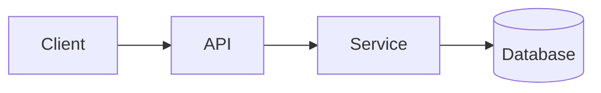

<!-- _class: title -->

# Технически обяснител

---

# Контекст и цел

- За какво служи този компонент: …
- За кого е това обяснение: …
- Какво ще разберете накрая: …

---

### Преглед на архитектурата



---

<!-- _class: table -->

# Компоненти и отговорности

| Компонент | Отговорност | Собственик |
| --- | --- | --- |
| Клиент | Презентация и въвеждане | Отбор А |
| API | Валидиране и маршрутизиране | Отбор Б |
| Обслужване | Бизнес логика | Отбор Б |
| База данни | Съхранение | Отбор C |

---

# Поток от данни или поток от процеси
<!-- ocideck_list_style: numbered -->

1. Потребителят прави заявка
2. API я валидира и маршрутизира
3. Услугата я обработва и съхранява
4. Резултатът се връща при потребителя

---

<!-- _class: code -->

# Примерен код

```dart
/// Заменете този пример с кода, който искате да обясните.
Future<Result> handleRequest(Request request) async {
  final input = validate(request);
  final result = await service.process(input);
  return result;
}
```

---

# Рискове и компромиси

- Избрано решение: … — защото: …
- Отхвърлена алтернатива: … — защото: …
- Известен риск: …

---

# Контролен списък за изпълнение
<!-- ocideck_list_style: checklist -->

- [ ] Дизайн, обсъден с екипа
- [ ] Писмени тестове
- [ ] Актуализирана документация
- [ ] Настроен мониторинг
