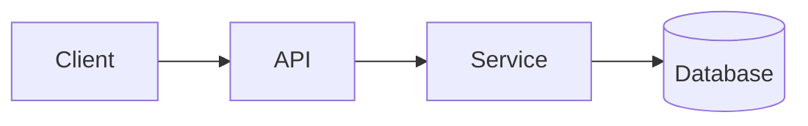

<!-- _class: title -->

# Technický vysvětlovač

---

# Kontext a cíl

- K čemu je tato součástka:…
- Komu je toto vysvětlení určeno: …
- Co pochopíte na konci:…

---

### Architecture overview



---

<!-- _class: table -->

# Komponenty a odpovědnosti

| Komponenta | Zodpovědnost | vlastník |
| --- | --- | --- |
| Klient | Prezentace a vstup | Tým A |
| API | Validace a směrování | Tým B |
| servis | Obchodní logika | Tým B |
| databáze | Skladování | Tým C |

---

# Datový tok nebo procesní tok
<!-- ocideck_list_style: numbered -->

1. The user makes a request
2. The API validates and routes it
3. The service processes and stores it
4. The result goes back to the user

---

<!-- _class: code -->

# Příklad kódu

```dart
/// Replace this example with the code you want to explain.
Future<Result> handleRequest(Request request) async {
  final input = validate(request);
  final result = await service.process(input);
  return result;
}
```

---

# Rizika a kompromisy

- Zvolené řešení: … — protože: …
- Zamítnutá alternativa: … — protože: …
- Známé riziko:…

---

# Kontrolní seznam implementace
<!-- ocideck_list_style: checklist -->

- [ ] Design projednán s týmem
- [ ] Napsané testy
- [ ] Dokumentace aktualizována
- [ ] Nastavení monitorování
