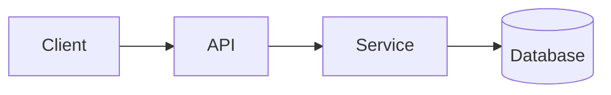

<!-- _class: title -->

# Teknisk forklarer

---

# Kontekst og mål

- Hvad er denne komponent til:...
- Hvem er denne forklaring til: …
- Hvad du vil forstå til sidst: …

---

### Architecture overview



---

<!-- _class: table -->

# Komponenter og ansvar

| Komponent | Ansvar | Ejer |
| --- | --- | --- |
| klient | Præsentation og input | Hold A |
| API | Validering og routing | Hold B |
| Service | Forretningslogik | Hold B |
| Database | Opbevaring | Hold C |

---

# Dataflow eller procesflow
<!-- ocideck_list_style: numbered -->

1. The user makes a request
2. The API validates and routes it
3. The service processes and stores it
4. The result goes back to the user

---

<!-- _class: code -->

# Kode eksempel

```dart
/// Replace this example with the code you want to explain.
Future<Result> handleRequest(Request request) async {
  final input = validate(request);
  final result = await service.process(input);
  return result;
}
```

---

# Risici og afvejninger

- Valgt løsning: … — fordi: …
- Afvist alternativ: … — fordi: …
- Kendt risiko: …

---

# Implementeringstjekliste
<!-- ocideck_list_style: checklist -->

- [ ] Design diskuteret med teamet
- [ ] Skrevne prøver
- [ ] Dokumentation opdateret
- [ ] Opsætning af overvågning
