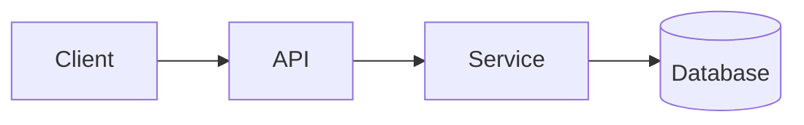

<!-- _class: title -->

# Technische Erläuterung

---

# Kontext und Ziel

- Wozu dient diese Komponente: …
- Für wen ist diese Erklärung gedacht: …
- Was Sie am Ende verstehen werden: …

---

### Architekturübersicht



---

<!-- _class: table -->

# Bestandteile und Verantwortlichkeiten

| Komponente | Verantwortung | Besitzer |
| --- | --- | --- |
| Kunde | Präsentation und Input | Team A |
| API | Validierung und Routing | Team B |
| Service | Geschäftslogik | Team B |
| Datenbank | Lagerung | Team C |

---

# Datenfluss oder Prozessfluss
<!-- ocideck_list_style: numbered -->

1. Der Nutzer stellt eine Anfrage
2. Die API validiert und leitet sie weiter
3. Der Dienst verarbeitet und speichert sie
4. Das Ergebnis geht zurück an den Nutzer

---

<!-- _class: code -->

# Codebeispiel

```dart
/// Ersetzen Sie dieses Beispiel durch den Code, den Sie erläutern möchten.
Future<Result> handleRequest(Request request) async {
  final input = validate(request);
  final result = await service.process(input);
  return result;
}
```

---

# Risiken und Kompromisse

- Gewählte Lösung: … – weil: …
- Abgelehnte Alternative: … – weil: …
- Bekanntes Risiko: …

---

# Checkliste für die Umsetzung
<!-- ocideck_list_style: checklist -->

- [ ] Design mit dem Team besprochen
- [ ] Tests geschrieben
- [ ] Dokumentation aktualisiert
- [ ] Überwachung eingerichtet
