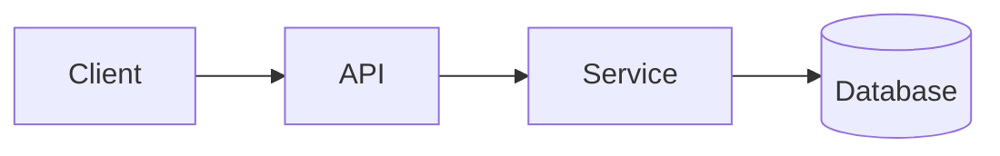

<!-- _class: title -->

# Τεχνική επεξήγηση

---

# Πλαίσιο και στόχος

- Για ποιο στοιχείο είναι αυτό: …
- Για ποιον είναι αυτή η επεξήγηση: …
- Τι θα κατανοείτε στο τέλος: …

---

### Επισκόπηση αρχιτεκτονικής



---

<!-- _class: table -->

# Συστατικά και αρμοδιότητες

| Συστατικό | Αρμοδιότητα | Υπεύθυνος |
| --- | --- | --- |
| Client | Παρουσίαση και εισαγωγή | Team A |
| API | Επικύρωση και δρομολόγηση | Team B |
| Service | Επιχειρησιακή λογική | Team B |
| Database | Αποθήκευση | Team C |

---

# Ροή δεδομένων ή ροή διεργασίας
<!-- ocideck_list_style: numbered -->

1. Ο χρήστης κάνει ένα αίτημα
2. Το API επικυρώνει και το δρομολογεί
3. Η υπηρεσία επεξεργάζεται και το αποθηκεύει
4. Το αποτέλεσμα επιστρέφει στον χρήστη

---

<!-- _class: code -->

# Παράδειγμα κώδικα

```dart
/// Replace this example with the code you want to explain.
Future<Result> handleRequest(Request request) async {
  final input = validate(request);
  final result = await service.process(input);
  return result;
}
```

---

# Κίνδυνοι και συμβιβασμοί

- Επιλεγμένη λύση: … — επειδή: …
- Απορριφθείσα εναλλακτική: … — επειδή: …
- Γνωστός κίνδυνος: …

---

# Λίστα ελέγχου υλοποίησης
<!-- ocideck_list_style: checklist -->

- [ ] Σχεδιασμός συζητημένος με την ομάδα
- [ ] Τεστ γραμμένα
- [ ] Τεκμηρίωση ενημερωμένη
- [ ] Παρακολούθηση ρυθμισμένη