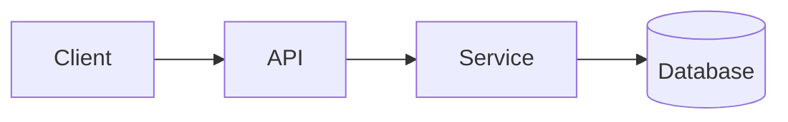

<!-- _class: title -->

# Explicación técnica

---

# Contexto y objetivo

- Para qué sirve este componente: …
- Para quién es esta explicación: …
- Qué entenderás al final: …

---

### Visión general de la arquitectura



---

<!-- _class: table -->

# Componentes y responsabilidades

| Componente | Responsabilidad | Propietario |
| --- | --- | --- |
| Cliente | Presentación e entrada | Equipo A |
| API | Validación y enrutamiento | Equipo B |
| Servicio | Lógica de negocio | Equipo B |
| Base de datos | Almacenamiento | Equipo C |

---

# Flujo de datos o proceso
<!-- ocideck_list_style: numbered -->

1. El usuario hace una petición
2. La API la valida y la enruta
3. El servicio la procesa y la almacena
4. El resultado vuelve al usuario

---

<!-- _class: code -->

# Ejemplo de código

```dart
/// Reemplaza este ejemplo con el código que quieres explicar.
Future<Result> handleRequest(Request request) async {
  final input = validate(request);
  final result = await service.process(input);
  return result;
}
```

---

# Riesgos y contrapartidas

- Solución elegida: … — porque: …
- Alternativa descartada: … — porque: …
- Riesgo conocido: …

---

# Lista de verificación de implementación
<!-- ocideck_list_style: checklist -->

- [ ] Diseño discutido con el equipo
- [ ] Pruebas escritas
- [ ] Documentación actualizada
- [ ] Monitorización configurada
