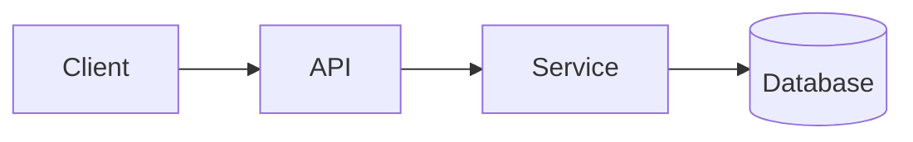

<!-- _class: title -->

# Tehniline selgitaja

---

# Kontekst ja eesmärk

- Milleks see komponent on mõeldud:…
- Kellele see selgitus on mõeldud:…
- Mida sa lõpuks aru saad:…

---

### Arhitektuuri ülevaade



---

<!-- _class: table -->

# Komponendid ja kohustused

| Komponent | Vastutus | Omanik |
| --- | --- | --- |
| Klient | Esitlus ja sisend | Meeskond A |
| API | Valideerimine ja marsruutimine | Meeskond B |
| Teenindus | Äriloogika | Meeskond B |
| Andmebaas | Säilitamine | Meeskond C |

---

# Andmevoog või protsessivoog
<!-- ocideck_list_style: numbered -->

1. Kasutaja esitab päringu
2. API valideerib ja suunab selle
3. Teenus töötleb ja salvestab selle
4. Tulemus liigub tagasi kasutajale

---

<!-- _class: code -->

# Koodi näide

```dart
/// Replace this example with the code you want to explain.
Future<Result> handleRequest(Request request) async {
  final input = validate(request);
  final result = await service.process(input);
  return result;
}
```

---

# Riskid ja kompromissid

- Valitud lahendus: … — kuna: …
- Tagasilükatud alternatiiv: … — kuna: …
- Teadaolev risk:…

---

# Rakenduse kontrollnimekiri
<!-- ocideck_list_style: checklist -->

- [ ] Disain arutati meeskonnaga läbi
- [ ] Testid kirja pandud
- [ ] Dokumentatsioon uuendatud
- [ ] Järelevalve seadistamine
