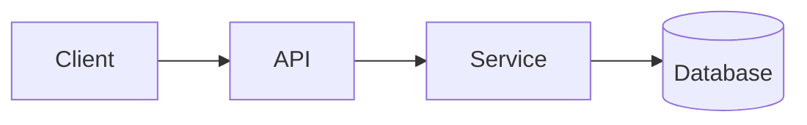

<!-- _class: title -->

# Tekninen selittäjä

---

# Konteksti ja tavoite

- Mihin tämä komponentti on tarkoitettu:…
- Kenelle tämä selitys on tarkoitettu:…
- Mitä ymmärrät lopussa:…

---

### Architecture overview



---

<!-- _class: table -->

# Komponentit ja vastuut

| Komponentti | Vastuullisuus | Omistaja |
| --- | --- | --- |
| Asiakas | Esittely ja syöttö | Joukkue A |
| API | Validointi ja reititys | Joukkue B |
| Palvelu | Liiketoiminnan logiikkaa | Joukkue B |
| Tietokanta | Varastointi | Joukkue C |

---

# Tietovirta tai prosessivirta
<!-- ocideck_list_style: numbered -->

1. The user makes a request
2. The API validates and routes it
3. The service processes and stores it
4. The result goes back to the user

---

<!-- _class: code -->

# Esimerkki koodista

```dart
/// Replace this example with the code you want to explain.
Future<Result> handleRequest(Request request) async {
  final input = validate(request);
  final result = await service.process(input);
  return result;
}
```

---

# Riskit ja kompromissit

- Valittu ratkaisu: … — koska: …
- Hylätty vaihtoehto: … – koska: …
- Tunnettu riski:…

---

# Toteutuksen tarkistuslista
<!-- ocideck_list_style: checklist -->

- [ ] Suunnittelusta keskusteltiin joukkueen kanssa
- [ ] Testit kirjoitettu
- [ ] Dokumentaatio päivitetty
- [ ] Valvonta asetettu
