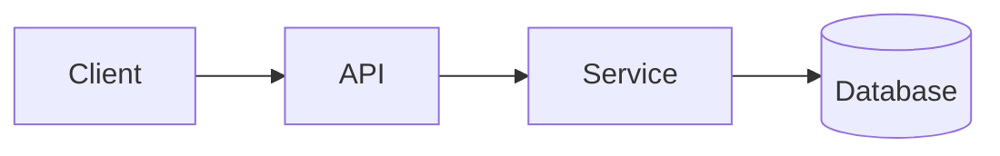

<!-- _class: title -->

# Explication technique

---

# Contexte et objectif

- A quoi sert ce composant : …
- À qui s’adresse cette explication : …
- Ce que vous comprendrez à la fin : …

---

### Vue d'ensemble de l'architecture



---

<!-- _class: table -->

# Composants et responsabilités

| Composant | Responsabilité | Propriétaire |
| --- | --- | --- |
| Client | Présentation et contribution | Équipe A |
| API | Validation et routage | Équipe B |
| Service | Logique métier | Équipe B |
| Base de données | Stockage | Équipe C |

---

# Flux de données ou flux de processus
<!-- ocideck_list_style: numbered -->

1. L'utilisateur envoie une requête
2. L'API la valide et l'achemine
3. Le service la traite et l'enregistre
4. Le résultat revient à l'utilisateur

---

<!-- _class: code -->

# Exemple de code

```dart
/// Remplacez cet exemple par le code que vous voulez expliquer.
Future<Result> handleRequest(Request request) async {
  final input = validate(request);
  final result = await service.process(input);
  return result;
}
```

---

# Risques et compromis

- Solution retenue : … — parce que : …
- Alternative rejetée: … — parce que: …
- Risque connu : …

---

# Liste de contrôle de mise en œuvre
<!-- ocideck_list_style: checklist -->

- [ ] Design discuté avec l'équipe
- [ ] Tests écrits
- [ ] Documentation mise à jour
- [ ] Mise en place d'une surveillance
