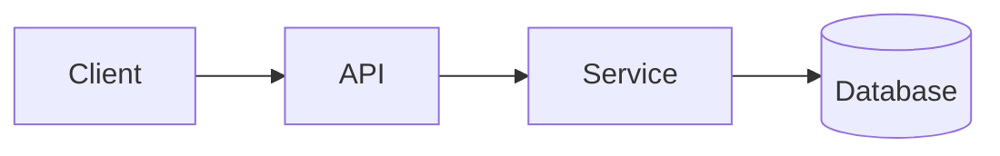

<!-- _class: title -->

# Technyske útlis

---

# Kontekst en doel

- Waarfoar is dizze komponint foar: ...
- Foar wa is dizze útlis: ...
- Wat jo oan it ein sille begripe: ...

---

### Architecture overview



---

<!-- _class: table -->

# Komponinten en ferantwurdlikheden

| Komponint | Ferantwurdlikens | Eigner |
| --- | --- | --- |
| Client | Presintaasje en ynfier | Team A |
| API | Validaasje en routing | Team B |
| Service | Business logika | Team B |
| Databank | Storage | Team C |

---

# Datastream of prosesstream
<!-- ocideck_list_style: numbered -->

1. The user makes a request
2. The API validates and routes it
3. The service processes and stores it
4. The result goes back to the user

---

<!-- _class: code -->

# Koade foarbyld

```dart
/// Replace this example with the code you want to explain.
Future<Result> handleRequest(Request request) async {
  final input = validate(request);
  final result = await service.process(input);
  return result;
}
```

---

# Risiko's en trade-offs

- Gekozen oplossing: … — omdat: …
- Ofwiisd alternatyf: … — omdat: …
- Bekend risiko: …

---

# Ymplemintaasje checklist
<!-- ocideck_list_style: checklist -->

- [ ] Untwerp besprutsen mei it team
- [ ] Tests skreaun
- [ ] Dokumintaasje bywurke
- [ ] Monitoring opset
