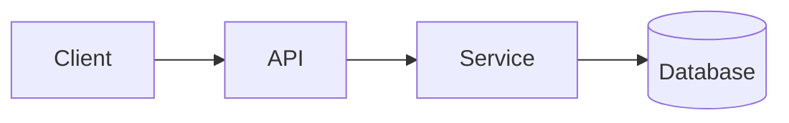

<!-- _class: title -->

# Mínitheoir teicniúil

---

# Comhthéacs agus sprioc

- Cad atá leis an gcomhpháirt seo: …
- Cé dó a bhfuil an míniú seo: …
- Cad a thuigfidh tú faoin deireadh: …

---

### Architecture overview



---

<!-- _class: table -->

# Comhpháirteanna agus freagrachtaí

| Comhpháirt | Freagracht | Úinéir |
| --- | --- | --- |
| Cliant | Cur i láthair agus ionchur | Foireann A |
| API | Bailíochtú agus ródú | Foireann B |
| Seirbhís | Loighic gnó | Foireann B |
| Bunachar Sonraí | Stóráil | Foireann C |

---

# Sreabhadh sonraí nó sreabhadh próisis
<!-- ocideck_list_style: numbered -->

1. The user makes a request
2. The API validates and routes it
3. The service processes and stores it
4. The result goes back to the user

---

<!-- _class: code -->

# Sampla cód

```dart
/// Replace this example with the code you want to explain.
Future<Result> handleRequest(Request request) async {
  final input = validate(request);
  final result = await service.process(input);
  return result;
}
```

---

# Rioscaí agus comhbhabhtáil

- Réiteach roghnaithe: … — mar gheall ar: …
- Rogha eile a diúltaíodh: … — mar gheall ar: …
- Riosca aitheanta: …

---

# Seicliosta forfheidhmithe
<!-- ocideck_list_style: checklist -->

- [ ] Dearadh pléite leis an bhfoireann
- [ ] Tástálacha scríofa
- [ ] Nuashonraíodh an doiciméadú
- [ ] Monatóireacht a dhéanamh ar bun
