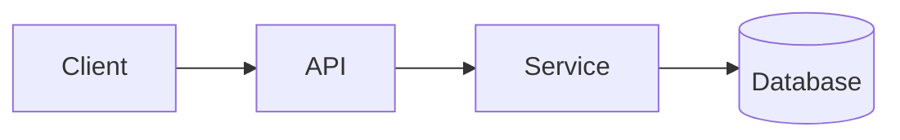

<!-- _class: title -->

# Tehnički objašnjavač

---

# Kontekst i cilj

- Čemu služi ova komponenta: …
- Za koga je ovo objašnjenje: …
- Što ćete shvatiti na kraju: …

---

### Pregled arhitekture



---

<!-- _class: table -->

# Komponente i odgovornosti

| komponenta | Odgovornost | Vlasnik |
| --- | --- | --- |
| Klijent | Prezentacija i unos | Tim A |
| API | Validacija i usmjeravanje | Tim B |
| Usluga | Poslovna logika | Tim B |
| Baza podataka | Skladištenje | Tim C |

---

# Tijek podataka ili tijek procesa
<!-- ocideck_list_style: numbered -->

1. Korisnik šalje zahtjev
2. API ga potvrđuje i usmjerava
3. Usluga ga obrađuje i pohranjuje
4. Rezultat se vraća korisniku

---

<!-- _class: code -->

# Primjer koda

```dart
/// Replace this example with the code you want to explain.
Future<Result> handleRequest(Request request) async {
  final input = validate(request);
  final result = await service.process(input);
  return result;
}
```

---

# Rizici i kompromisi

- Izabrano rješenje: … — jer: …
- Odbijena alternativa: … — jer: …
- Poznati rizik: …

---

# Kontrolni popis za provedbu
<!-- ocideck_list_style: checklist -->

- [ ] O dizajnu razgovarano s timom
- [ ] Testovi pismeni
- [ ] Dokumentacija ažurirana
- [ ] Postavljen nadzor
