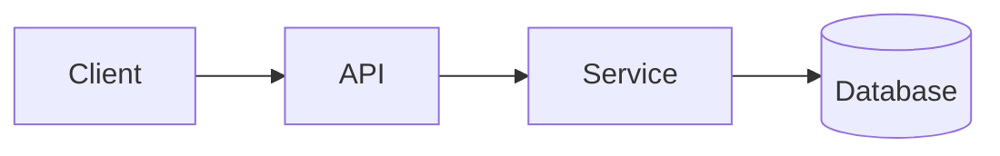

<!-- _class: title -->

# Műszaki magyarázat

---

# Kontextus és cél

- Mire való ez a komponens:…
- Kinek szól ez a magyarázat:…
- Amit a végére megértesz:…

---

### Architektúra áttekintése



---

<!-- _class: table -->

# Összetevők és felelősségek

| Összetevő | Felelősség | Tulajdonos |
| --- | --- | --- |
| Ügyfél | Bemutatás és bemenet | A csapat |
| API | Érvényesítés és útválasztás | B csapat |
| Szolgáltatás | Üzleti logika | B csapat |
| Adatbázis | Tárolás | C csapat |

---

# Adatáramlás vagy folyamatfolyamat
<!-- ocideck_list_style: numbered -->

1. A felhasználó kérést indít
2. Az API ellenőrzi és továbbítja
3. A szolgáltatás feldolgozza és tárolja
4. Az eredmény visszakerül a felhasználóhoz

---

<!-- _class: code -->

# Kódpélda

```dart
/// Cseréld ezt a példát arra a kódra, amelyet el akarsz magyarázni.
Future<Result> handleRequest(Request request) async {
  final input = validate(request);
  final result = await service.process(input);
  return result;
}
```

---

# Kockázatok és kompromisszumok

- Választott megoldás: … — mert: …
- Elutasított alternatíva: … – mert: …
- Ismert kockázat:…

---

# Megvalósítási ellenőrző lista
<!-- ocideck_list_style: checklist -->

- [ ] A tervezést megbeszéltük a csapattal
- [ ] Írott tesztek
- [ ] A dokumentáció frissítve
- [ ] Monitoring beállítása
