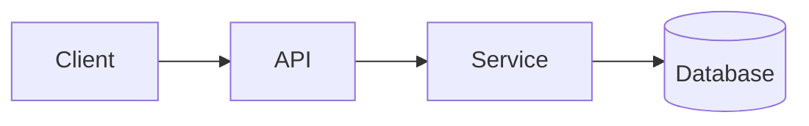

<!-- _class: title -->

# Penjelasan teknis

---

# Konteks dan tujuan

- Kegunaan komponen ini: …
- Untuk siapa penjelasan ini: …
- Apa yang akan Anda pahami pada akhirnya: …

---

### Architecture overview



---

<!-- _class: table -->

# Komponen dan tanggung jawab

| Komponen | Tanggung jawab | Pemilik |
| --- | --- | --- |
| Klien | Presentasi dan masukan | Tim A |
| API | Validasi dan perutean | Tim B |
| Layanan | Logika bisnis | Tim B |
| Basis data | Penyimpanan | Tim C |

---

# Aliran data atau aliran proses
<!-- ocideck_list_style: numbered -->

1. The user makes a request
2. The API validates and routes it
3. The service processes and stores it
4. The result goes back to the user

---

<!-- _class: code -->

# Contoh kode

```dart
/// Replace this example with the code you want to explain.
Future<Result> handleRequest(Request request) async {
  final input = validate(request);
  final result = await service.process(input);
  return result;
}
```

---

# Risiko dan trade-off

- Solusi yang dipilih: … — karena: …
- Alternatif yang ditolak: … — karena: …
- Risiko yang diketahui:…

---

# Daftar periksa implementasi
<!-- ocideck_list_style: checklist -->

- [ ] Desain didiskusikan dengan tim
- [ ] Tes tertulis
- [ ] Dokumentasi diperbarui
- [ ] Pengaturan pemantauan
