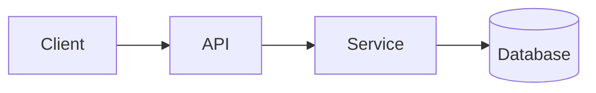

<!-- _class: title -->

# Spiegatore tecnico

---

# Contesto e obiettivo

- A cosa serve questo componente: …
- A chi è rivolta questa spiegazione: …
- Cosa capirai alla fine:...

---

### Panoramica dell'architettura



---

<!-- _class: table -->

# Componenti e responsabilità

| Componente | Responsabilità | Proprietario |
| --- | --- | --- |
| Cliente | Presentazione e input | Squadra A |
| API | Validazione e instradamento | Squadra B |
| Servizio | Logica aziendale | Squadra B |
| Banca dati | Stoccaggio | Squadra C |

---

# Flusso di dati o flusso di processi
<!-- ocideck_list_style: numbered -->

1. L'utente effettua una richiesta
2. L'API la convalida e la instrada
3. Il servizio la elabora e la memorizza
4. Il risultato torna all'utente

---

<!-- _class: code -->

# Esempio di codice

```dart
/// Replace this example with the code you want to explain.
Future<Result> handleRequest(Request request) async {
  final input = validate(request);
  final result = await service.process(input);
  return result;
}
```

---

# Rischi e compromessi

- Soluzione scelta: … — perché: …
- Alternativa respinta: … — perché: …
- Rischio noto: …

---

# Lista di controllo per l'implementazione
<!-- ocideck_list_style: checklist -->

- [ ] Design discusso con il team
- [ ] Test scritti
- [ ] Documentazione aggiornata
- [ ] Impostazione del monitoraggio
