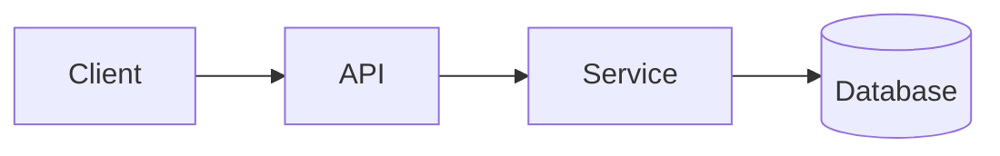

<!-- _class: title -->

# Explicatio technica

---

# Contextus et finis

- Quae haec pars est pro: ...
- Quis haec explicatio est pro: ...
- Quid scies in fine: ...

---

### Conspectus architecturae



---

<!-- _class: table -->

# Components et officia

| Component | Cura | dominus |
| --- | --- | --- |
| Client | Praesentatio et initus | Team A |
| API | Sanatio et profectus | Team B |
| Service | Negotia logica | Team B |
| Database | Repono | Team C |

---

# Data fluxus seu processus influunt
<!-- ocideck_list_style: numbered -->

1. Usor petitionem facit
2. API eam probat et dirigit
3. Servitium eam tractat et servat
4. Effectus ad usorem redit

---

<!-- _class: code -->

# exemplum codicis

```dart
/// Substitue hoc exemplum codice quem explicare vis.
Future<Result> handleRequest(Request request) async {
  final input = validate(request);
  final result = await service.process(input);
  return result;
}
```

---

# Pericula et commercia-peracti

- Solutio electa: ... - quia: ...
- Reprobavit alternative: ... - quia: ...
- Periculum notum: …

---

# Genus exsequendam
<!-- ocideck_list_style: checklist -->

- [ ] Consilium tractatum cum bigas
- [ ] Testis scriptum
- [ ] Documenta updated
- [ ] Cras extruxerat
