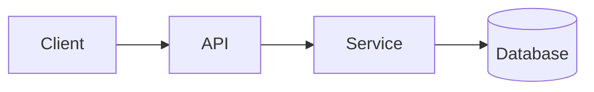

<!-- _class: title -->

# Techninis paaiškinėjas

---

# Kontekstas ir tikslas

- Kam skirtas šis komponentas:…
- Kam skirtas šis paaiškinimas:…
- Ką suprasite pabaigai:…

---

### Architektūros apžvalga



---

<!-- _class: table -->

# Komponentai ir pareigos

| Komponentas | Atsakomybė | Savininkas |
| --- | --- | --- |
| Klientas | Pristatymas ir įvestis | A komanda |
| API | Patvirtinimas ir maršruto parinkimas | B komanda |
| Aptarnavimas | Verslo logika | B komanda |
| Duomenų bazė | Sandėliavimas | C komanda |

---

# Duomenų srautas arba proceso srautas
<!-- ocideck_list_style: numbered -->

1. Naudotojas pateikia užklausą
2. API ją patvirtina ir nukreipia
3. Paslauga ją apdoroja ir išsaugo
4. Rezultatas grįžta naudotojui

---

<!-- _class: code -->

# Kodo pavyzdys

```dart
/// Replace this example with the code you want to explain.
Future<Result> handleRequest(Request request) async {
  final input = validate(request);
  final result = await service.process(input);
  return result;
}
```

---

# Rizika ir kompromisai

- Pasirinktas sprendimas: … – nes:…
- Atmesta alternatyva: … – nes: …
- Žinoma rizika:…

---

# Įgyvendinimo kontrolinis sąrašas
<!-- ocideck_list_style: checklist -->

- [ ] Dizainas aptartas su komanda
- [ ] Testai parašyti
- [ ] Dokumentacija atnaujinta
- [ ] Stebėjimo nustatymas
