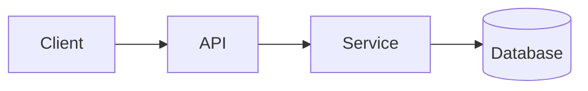

<!-- _class: title -->

# Tehniskais skaidrotājs

---

# Konteksts un mērķis

- Kam šis komponents ir paredzēts:…
- Kam šis skaidrojums ir paredzēts:…
- Ko jūs sapratīsit beigās:…

---

### Arhitektūras pārskats



---

<!-- _class: table -->

# Sastāvdaļas un pienākumi

| Komponents | Atbildība | Īpašnieks |
| --- | --- | --- |
| Klients | Prezentācija un ievade | A komanda |
| API | Validācija un maršrutēšana | B komanda |
| Serviss | Biznesa loģika | B komanda |
| Datu bāze | Uzglabāšana | C komanda |

---

# Datu plūsma vai procesa plūsma
<!-- ocideck_list_style: numbered -->

1. Lietotājs nosūta pieprasījumu
2. API to validē un maršrutē
3. Pakalpojums to apstrādā un saglabā
4. Rezultāts nonāk atpakaļ pie lietotāja

---

<!-- _class: code -->

# Koda piemērs

```dart
/// Aizstājiet šo piemēru ar kodu, kuru vēlaties izskaidrot.
Future<Result> handleRequest(Request request) async {
  final input = validate(request);
  final result = await service.process(input);
  return result;
}
```

---

# Riski un kompromisi

- Izvēlētais risinājums: … — jo: …
- Noraidīta alternatīva: … — jo: …
- Zināmais risks:…

---

# Īstenošanas kontrolsaraksts
<!-- ocideck_list_style: checklist -->

- [ ] Dizains apspriests ar komandu
- [ ] Rakstīti testi
- [ ] Dokumentācija atjaunināta
- [ ] Uzraudzības iestatīšana
