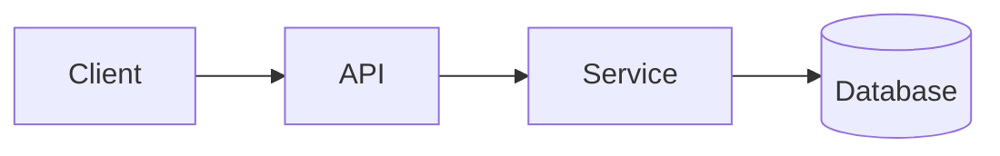

<!-- _class: title -->

# Spjegatur tekniku

[[OCIDECK_SEG]]] 

Għalxiex hu dan il-komponent: …

[[OCIDECK_SEG]]] 

Għal min hi din l-ispjegazzjoni:…

[[OCIDECK_SEG]]] 

Dak li ser tifhem sa l-aħħar:...

[[OCIDECK_SEG]]] 

Kuntest u għan

[[OCIDECK_SEG]]] 

Komponenti u responsabbiltajiet

[[OCIDECK_SEG]]] 

Komponent

[[OCIDECK_SEG]]] 

Responsabbiltà

[[OCIDECK_SEG]]] 

Sid

[[OCIDECK_SEG]]] 

Klijent

[[OCIDECK_SEG]]] 

Preżentazzjoni u input

[[OCIDECK_SEG]]] 

Tim A

[[OCIDECK_SEG]]] 

API

[[OCIDECK_SEG]]] 

Validazzjoni u rotta

[[OCIDECK_SEG]]] 

Tim B

[[OCIDECK_SEG]]] 

Servizz

[[OCIDECK_SEG]]] 

Loġika tan-negozju

[[OCIDECK_SEG]]] 

Tim B

[[OCIDECK_SEG]]] 

Database

[[OCIDECK_SEG]]] 

Ħażna

[[OCIDECK_SEG]]] 

Tim C

[[OCIDECK_SEG]]] 

Fluss tad-dejta jew fluss tal-proċess

[[OCIDECK_SEG]]] 

Eżempju tal-kodiċi

[[OCIDECK_SEG]]] 

Soluzzjoni magħżula: … — għaliex: …

[[OCIDECK_SEG]]] 

Alternattiva miċħuda: … — għaliex: …

[[OCIDECK_SEG]]] 

Riskju magħruf:…

[[OCIDECK_SEG]]] 

Riskji u kompromessi

[[OCIDECK_SEG]]] 

Disinn diskuss mat-tim

[[OCIDECK_SEG]]] 

Testijiet bil-miktub

[[OCIDECK_SEG]]] 

Dokumentazzjoni aġġornata

[[OCIDECK_SEG]]] 

Monitoraġġ stabbilit

[[OCIDECK_SEG]]] 

Lista ta' kontroll tal-implimentazzjoni

[[OCIDECK_SEG]]] 

Spjegatur tekniku

---

# Context and goal

- What this component is for: …
- Who this explanation is for: …
- What you'll understand by the end: …

---

### Architecture overview



---

<!-- _class: table -->

# Components and responsibilities

| Component | Responsibility | Owner |
| --- | --- | --- |
| Client | Presentation and input | Team A |
| API | Validation and routing | Team B |
| Service | Business logic | Team B |
| Database | Storage | Team C |

---

# Data flow or process flow
<!-- ocideck_list_style: numbered -->

1. The user makes a request
2. The API validates and routes it
3. The service processes and stores it
4. The result goes back to the user

---

<!-- _class: code -->

# Code example

```dart
/// Replace this example with the code you want to explain.
Future<Result> handleRequest(Request request) async {
  final input = validate(request);
  final result = await service.process(input);
  return result;
}
```

---

# Risks and trade-offs

- Chosen solution: … — because: …
- Rejected alternative: … — because: …
- Known risk: …

---

# Implementation checklist
<!-- ocideck_list_style: checklist -->

- [ ] Design discussed with the team
- [ ] Tests written
- [ ] Documentation updated
- [ ] Monitoring set up
