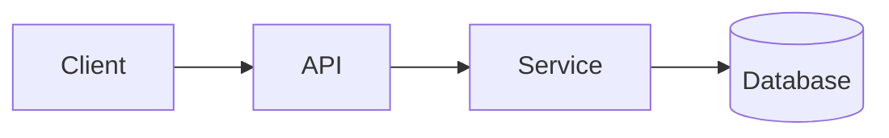

<!-- _class: title -->

# Spjegatur tekniku

---

# Kuntest u għan

- Għalxiex hu dan il-komponent: …
- Għal min hi din l-ispjegazzjoni:…
- Dak li ser tifhem sa l-aħħar:...

---

### Ħarsa ġenerali lejn l-arkitettura



---

<!-- _class: table -->

# Komponenti u responsabbiltajiet

| Komponent | Responsabbiltà | Sid |
| --- | --- | --- |
| Klijent | Preżentazzjoni u input | Tim A |
| API | Validazzjoni u rotta | Tim B |
| Servizz | Loġika tan-negozju | Tim B |
| Database | Ħażna | Tim C |

---

# Fluss tad-dejta jew fluss tal-proċess
<!-- ocideck_list_style: numbered -->

1. L-utent jagħmel talba
2. L-API tivvalidaha u tirrottaha
3. Is-servizz jipproċessaha u jaħżinha
4. Ir-riżultat imur lura għand l-utent

---

<!-- _class: code -->

# Eżempju tal-kodiċi

```dart
/// Replace this example with the code you want to explain.
Future<Result> handleRequest(Request request) async {
  final input = validate(request);
  final result = await service.process(input);
  return result;
}
```

---

# Riskji u kompromessi

- Soluzzjoni magħżula: … — għaliex: …
- Alternattiva miċħuda: … — għaliex: …
- Riskju magħruf:…

---

# Lista ta' kontroll tal-implimentazzjoni
<!-- ocideck_list_style: checklist -->

- [ ] Disinn diskuss mat-tim
- [ ] Testijiet bil-miktub
- [ ] Dokumentazzjoni aġġornata
- [ ] Monitoraġġ stabbilit
