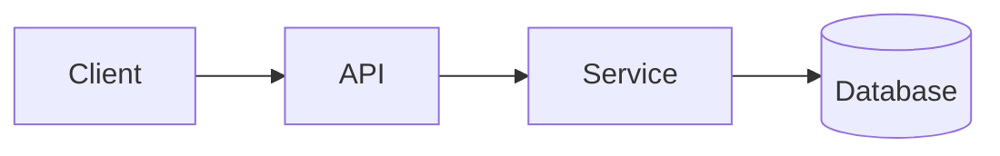

<!-- _class: title -->

# Technische uitleg

---

# Context en doel

- Waar dit onderdeel voor dient: …
- Voor wie deze uitleg is: …
- Wat je na afloop begrijpt: …

---

### Architectuuroverzicht



---

<!-- _class: table -->

# Componenten en verantwoordelijkheden

| Component | Verantwoordelijkheid | Eigenaar |
| --- | --- | --- |
| Client | Presentatie en invoer | Team A |
| API | Validatie en routering | Team B |
| Service | Bedrijfslogica | Team B |
| Database | Opslag | Team C |

---

# Datastroom of procesflow
<!-- ocideck_list_style: numbered -->

1. De gebruiker doet een aanvraag
2. De API valideert en routeert
3. De service verwerkt en slaat op
4. Het resultaat gaat terug naar de gebruiker

---

<!-- _class: code -->

# Codevoorbeeld

```dart
/// Vervang dit voorbeeld door de code die je wilt toelichten.
Future<Result> handleRequest(Request request) async {
  final input = validate(request);
  final result = await service.process(input);
  return result;
}
```

---

# Risico's en trade-offs

- Gekozen oplossing: … — omdat: …
- Afgevallen alternatief: … — omdat: …
- Bekend risico: …

---

# Implementatiechecklist
<!-- ocideck_list_style: checklist -->

- [ ] Ontwerp besproken met het team
- [ ] Tests geschreven
- [ ] Documentatie bijgewerkt
- [ ] Monitoring ingericht

