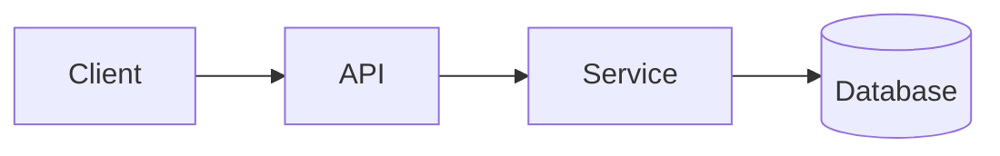

<!-- _class: title -->

# Splikadó tékniko

---

# Konteksto i meta

- Pa kiko e komponente aki ta: …
- Pa ken e splikashon aki ta: …
- Loke bo lo komprondé na final: …

---

### Architecture overview



---

<!-- _class: table -->

# Komponentenan i responsabilidatnan

| Komponente | Responsabilidat | Doño |
| --- | --- | --- |
| Kliente | Presentashon i entrada | Tim A |
| API | Validashon i enrutamentu | Tim B |
| Servisio | Lógika di negoshi | Tim B |
| Base di Dato | Almasenamentu | Tim C |

---

# Fluho di dato òf fluho di proseso
<!-- ocideck_list_style: numbered -->

1. The user makes a request
2. The API validates and routes it
3. The service processes and stores it
4. The result goes back to the user

---

<!-- _class: code -->

# Ehèmpel di kódigo

```dart
/// Replace this example with the code you want to explain.
Future<Result> handleRequest(Request request) async {
  final input = validate(request);
  final result = await service.process(input);
  return result;
}
```

---

# Riesgonan i kompromisonan

- Solushon skohé: … — pasobra: …
- Alternativa rechasá: … — pasobra: …
- Riesgo konosí: …

---

# Lista di kòntròl di implementashon
<!-- ocideck_list_style: checklist -->

- [ ] Diseño a wòrdu diskutí ku e tim
- [ ] Pruebanan skirbí
- [ ] Dokumentashon aktualisá
- [ ] Konfigurashon di monitoreo
