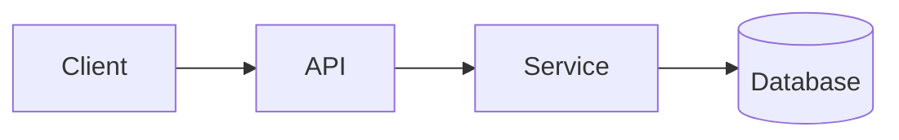

<!-- _class: title -->

# Wyjaśnienie techniczne

---

# Kontekst i cel

- Do czego służy ten komponent:…
- Dla kogo jest to wyjaśnienie:…
- Co zrozumiesz na końcu:…

---

### Architecture overview



---

<!-- _class: table -->

# Komponenty i obowiązki

| Część | Odpowiedzialność | Właściciel |
| --- | --- | --- |
| Klient | Prezentacja i wprowadzenie | Zespół A |
| API | Walidacja i routing | Zespół B |
| Praca | Logika biznesowa | Zespół B |
| Baza danych | Składowanie | Zespół C |

---

# Przepływ danych lub przepływ procesów
<!-- ocideck_list_style: numbered -->

1. The user makes a request
2. The API validates and routes it
3. The service processes and stores it
4. The result goes back to the user

---

<!-- _class: code -->

# Przykład kodu

```dart
/// Replace this example with the code you want to explain.
Future<Result> handleRequest(Request request) async {
  final input = validate(request);
  final result = await service.process(input);
  return result;
}
```

---

# Ryzyko i kompromisy

- Wybrane rozwiązanie: … — ponieważ: …
- Odrzucona alternatywa: … — ponieważ: …
- Znane ryzyko: …

---

# Lista kontrolna wdrożenia
<!-- ocideck_list_style: checklist -->

- [ ] Projekt omówiony z zespołem
- [ ] Testy napisane
- [ ] Dokumentacja zaktualizowana
- [ ] Konfiguracja monitorowania
