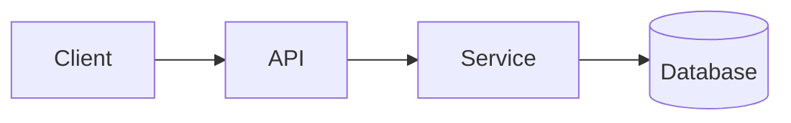

<!-- _class: title -->

# Explicador técnico

---

# Contexto e objetivo

- Para que serve este componente:…
- A quem se destina esta explicação:…
- O que você entenderá no final:…

---

### Architecture overview



---

<!-- _class: table -->

# Componentes e responsabilidades

| Componente | Responsabilidade | Proprietário |
| --- | --- | --- |
| Cliente | Apresentação e entrada | Equipe A |
| API | Validação e roteamento | Equipe B |
| Serviço | Lógica de negócios | Equipe B |
| Banco de dados | Armazenar | Equipe C |

---

# Fluxo de dados ou fluxo de processo
<!-- ocideck_list_style: numbered -->

1. The user makes a request
2. The API validates and routes it
3. The service processes and stores it
4. The result goes back to the user

---

<!-- _class: code -->

# Exemplo de código

```dart
/// Replace this example with the code you want to explain.
Future<Result> handleRequest(Request request) async {
  final input = validate(request);
  final result = await service.process(input);
  return result;
}
```

---

# Riscos e compensações

- Solução escolhida: … — porque: …
- Alternativa rejeitada: … — porque: …
- Risco conhecido:…

---

# Lista de verificação de implementação
<!-- ocideck_list_style: checklist -->

- [ ] Design discutido com a equipe
- [ ] Testes escritos
- [ ] Documentação atualizada
- [ ] Configuração de monitoramento
