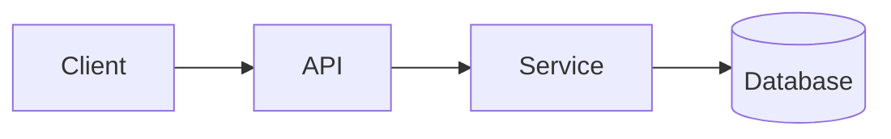

<!-- _class: title -->

# Explicator tehnic

---

# Context și scop

- Pentru ce este această componentă:...
- Pentru cine este această explicație:...
- Ce vei înțelege până la sfârșit:...

---

### Architecture overview



---

<!-- _class: table -->

# Componente și responsabilități

| Componentă | Responsabilitate | Proprietar |
| --- | --- | --- |
| Client | Prezentare și intrare | Echipa A |
| API | Validare și rutare | Echipa B |
| Serviciu | Logica de afaceri | Echipa B |
| Baza de date | Depozitare | Echipa C |

---

# Flux de date sau flux de proces
<!-- ocideck_list_style: numbered -->

1. The user makes a request
2. The API validates and routes it
3. The service processes and stores it
4. The result goes back to the user

---

<!-- _class: code -->

# Exemplu de cod

```dart
/// Replace this example with the code you want to explain.
Future<Result> handleRequest(Request request) async {
  final input = validate(request);
  final result = await service.process(input);
  return result;
}
```

---

# Riscuri și compromisuri

- Soluția aleasă: … — deoarece: …
- Alternativă respinsă: … — deoarece: …
- Risc cunoscut:...

---

# Lista de verificare a implementării
<!-- ocideck_list_style: checklist -->

- [ ] Design discutat cu echipa
- [ ] Teste scrise
- [ ] Documentația actualizată
- [ ] Configurare monitorizare
