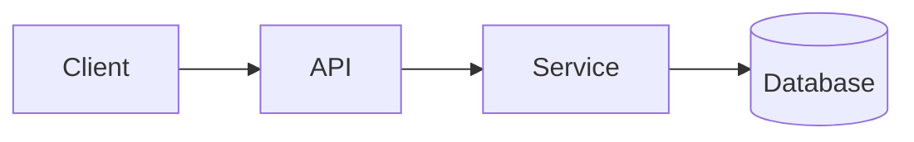

<!-- _class: title -->

# Technický vysvetľovač

---

# Kontext a cieľ

- Na čo slúži tento komponent:…
- Pre koho je toto vysvetlenie:…
- Čo pochopíte na konci:…

---

### Prehľad architektúry



---

<!-- _class: table -->

# Komponenty a zodpovednosti

| Komponent | Zodpovednosť | Vlastník |
| --- | --- | --- |
| Klient | Prezentácia a vstup | Tím A |
| API | Validácia a smerovanie | Tím B |
| servis | Obchodná logika | Tím B |
| Databáza | Skladovanie | Tím C |

---

# Dátový tok alebo procesný tok
<!-- ocideck_list_style: numbered -->

1. Používateľ odošle požiadavku
2. API ju overí a nasmeruje
3. Služba ju spracuje a uloží
4. Výsledok sa vracia používateľovi

---

<!-- _class: code -->

# Príklad kódu

```dart
/// Nahraďte tento príklad kódom, ktorý chcete vysvetliť.
Future<Result> handleRequest(Request request) async {
  final input = validate(request);
  final result = await service.process(input);
  return result;
}
```

---

# Riziká a kompromisy

- Zvolené riešenie: … — pretože: …
- Zamietnutá alternatíva: … — pretože: …
- Známe riziko:…

---

# Kontrolný zoznam implementácie
<!-- ocideck_list_style: checklist -->

- [ ] Dizajn prediskutovaný s tímom
- [ ] Napísané testy
- [ ] Dokumentácia bola aktualizovaná
- [ ] Nastavenie monitorovania
