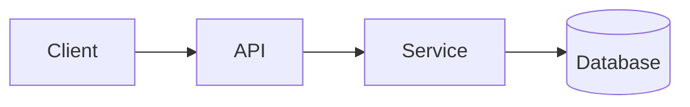

<!-- _class: title -->

# Tehnični razlagalec

---

# Kontekst in cilj

- Čemu je ta komponenta namenjena: …
- Komu je ta razlaga namenjena: …
- Kaj boste razumeli na koncu: …

---

### Architecture overview



---

<!-- _class: table -->

# Sestavine in odgovornosti

| Komponenta | Odgovornost | Lastnik |
| --- | --- | --- |
| Stranka | Predstavitev in vnos | Ekipa A |
| API | Validacija in usmerjanje | Ekipa B |
| Storitev | Poslovna logika | Ekipa B |
| Baza podatkov | Shranjevanje | Ekipa C |

---

# Tok podatkov ali tok procesa
<!-- ocideck_list_style: numbered -->

1. The user makes a request
2. The API validates and routes it
3. The service processes and stores it
4. The result goes back to the user

---

<!-- _class: code -->

# Primer kode

```dart
/// Replace this example with the code you want to explain.
Future<Result> handleRequest(Request request) async {
  final input = validate(request);
  final result = await service.process(input);
  return result;
}
```

---

# Tveganja in kompromisi

- Izbrana rešitev: … — ker: …
- Zavrnjena alternativa: … — ker: …
- Znano tveganje: …

---

# Kontrolni seznam za izvajanje
<!-- ocideck_list_style: checklist -->

- [ ] O oblikovanju smo razpravljali z ekipo
- [ ] Pisni testi
- [ ] Dokumentacija posodobljena
- [ ] Nastavljen nadzor
