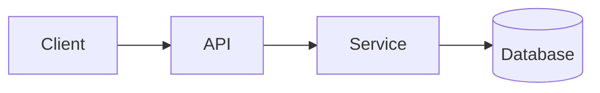

<!-- _class: title -->

# Teknisk förklarare

---

# Sammanhang och mål

- Vad den här komponenten är till för: …
- Vem är denna förklaring till: …
- Vad du kommer att förstå i slutet: …

---

### Arkitekturöversikt



---

<!-- _class: table -->

# Komponenter och ansvar

| Komponent | Ansvar | Ägare |
| --- | --- | --- |
| Klient | Presentation och input | Lag A |
| API | Validering och routing | Lag B |
| Service | Affärslogik | Lag B |
| Databas | Lagring | Lag C |

---

# Dataflöde eller processflöde
<!-- ocideck_list_style: numbered -->

1. Användaren gör en förfrågan
2. API:et validerar och dirigerar den
3. Tjänsten bearbetar och lagrar den
4. Resultatet går tillbaka till användaren

---

<!-- _class: code -->

# Kodexempel

```dart
/// Ersätt det här exemplet med koden du vill förklara.
Future<Result> handleRequest(Request request) async {
  final input = validate(request);
  final result = await service.process(input);
  return result;
}
```

---

# Risker och avvägningar

- Vald lösning: … — eftersom: …
- Avvisat alternativ: … — på grund av: …
- Känd risk: …

---

# Checklista för implementering
<!-- ocideck_list_style: checklist -->

- [ ] Design diskuteras med teamet
- [ ] Tester skrivna
- [ ] Dokumentationen uppdaterad
- [ ] Uppsättning av övervakning
