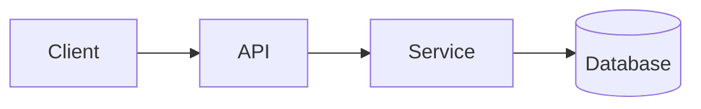

<!-- _class: title -->

# Teknik açıklayıcı

---

# Bağlam ve amaç

- Bu bileşen ne işe yarar:…
- Bu açıklama kimin için:…
- Sonunda ne anlayacaksınız: …

---

### Architecture overview



---

<!-- _class: table -->

# Bileşenler ve sorumluluklar

| Bileşen | Sorumluluk | Mal sahibi |
| --- | --- | --- |
| Müşteri | Sunum ve girdi | A Takımı |
| API'si | Doğrulama ve yönlendirme | Takım B |
| Hizmet | İş mantığı | Takım B |
| Veritabanı | Depolamak | Takım C |

---

# Veri akışı veya süreç akışı
<!-- ocideck_list_style: numbered -->

1. The user makes a request
2. The API validates and routes it
3. The service processes and stores it
4. The result goes back to the user

---

<!-- _class: code -->

# Kod örneği

```dart
/// Replace this example with the code you want to explain.
Future<Result> handleRequest(Request request) async {
  final input = validate(request);
  final result = await service.process(input);
  return result;
}
```

---

# Riskler ve ödünleşimler

- Seçilen çözüm: … — çünkü: …
- Reddedilen alternatif: … — çünkü: …
- Bilinen risk:…

---

# Uygulama kontrol listesi
<!-- ocideck_list_style: checklist -->

- [ ] Tasarım ekiple tartışıldı
- [ ] Yazılan testler
- [ ] Dokümantasyon güncellendi
- [ ] İzleme kurulumu
