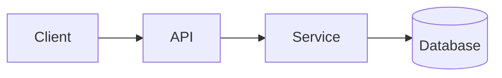

<!-- _class: title -->

# Технічний пояснювач

---

# Контекст і мета

- Для чого цей компонент: …
- Для кого це пояснення: …
- Що ви зрозумієте в кінці: …

---

### Architecture overview



---

<!-- _class: table -->

# Компоненти та обов'язки

| компонент | Відповідальність | Власник |
| --- | --- | --- |
| Клієнт | Презентація та введення | Команда А |
| API | Перевірка та маршрутизація | Команда Б |
| Сервіс | Бізнес-логіка | Команда Б |
| База даних | Зберігання | Команда С |

---

# Потік даних або потік процесу
<!-- ocideck_list_style: numbered -->

1. The user makes a request
2. The API validates and routes it
3. The service processes and stores it
4. The result goes back to the user

---

<!-- _class: code -->

# Приклад коду

```dart
/// Replace this example with the code you want to explain.
Future<Result> handleRequest(Request request) async {
  final input = validate(request);
  final result = await service.process(input);
  return result;
}
```

---

# Ризики та компроміси

- Вибране рішення: … — тому що: …
- Відхилена альтернатива: … — тому що: …
- Відомий ризик: …

---

# Контрольний список впровадження
<!-- ocideck_list_style: checklist -->

- [ ] Дизайн обговорюється з командою
- [ ] Письмові контрольні роботи
- [ ] Документацію оновлено
- [ ] Налаштування моніторингу
