# OciDeck — Architecture

> **Status:** current-state description of the system and its layering · **Status last reviewed:** 2026-07-22 · **Published by:** Stichting LibreKAT

A high-level map of how OciDeck is put together, for contributors. For how files
are stored on disk, see [`FILE_FORMAT.md`](FILE_FORMAT.md). For a one-line
description of the files under `lib/`, see [`SOURCE_MAP.md`](SOURCE_MAP.md).

## Stack

- **Flutter** desktop and web app (macOS, Windows, Linux, web), Dart 3.12+.
- **State**: [Riverpod](https://riverpod.dev/).
- **Storage**: standard Marp Markdown (`.md`) as the single source of truth, with
  sidecars for anything that isn't plain Marp.

## Runtime & network model

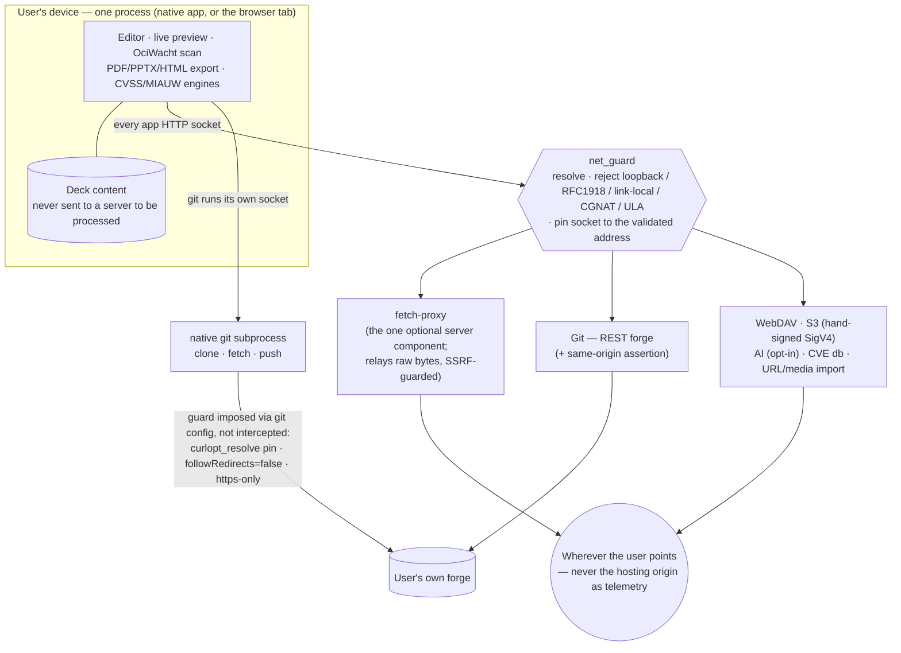

*Read the hexagon as the single choke every app socket passes; the native git
subprocess is the one path `net_guard` cannot hook, so the same outcome is
imposed on `git` by configuration instead.*

OciDeck is a **client-side app with no application backend**. On every platform —
desktop and web alike — the editor, live preview, the on-device privacy scan
(OciWacht), export to PDF/PPTX/HTML, and the CVSS/MIAUW engines run **in the
process the user is looking at**: the native app on desktop, and on web the
browser tab, into which the whole Dart-compiled bundle is downloaded and then
run. Deck content is never shipped to a server to be processed.

There is **no telemetry, analytics, or tracking** of any kind. The only HTTP
client dependency is `http` (see `pubspec.yaml`) — no Firebase/Sentry/GA/PostHog.
`video_player` and `webview_flutter` also reach the network, for remote media
behind the Online-media gate. The optional, default-off *Videovergaderingen*
module (`docs/design/NATIVE_CALLS.md`) adds a **second outbound stack**: an
XMPP-over-WebSocket (`wss://`) connection to a **user-configured** server (Jitsi's
Prosody or a Matrix bridge), opened via `dart:io`'s `WebSocket`/`HttpClient` — not
the `http` package — and reached only when that module is on and the user connects.
It is NetGuard-guarded like every other egress (TLS pinned to the validated
address, internal targets refused unless the user opts in per server as for WebDAV,
stream redirects rejected) and is desktop-only —
the web build fails closed, so it never touches the CSP below. The same module's
**media plane** — WebRTC via `flutter_webrtc` (libwebrtc), added for native calls
(`docs/design/NATIVE_CALLS.md` §3, `assurance/ketenkeuring-flutter-webrtc.md`) — is
a further outbound stack, and the **one class of traffic that does not pass through
NetGuard**: ICE/STUN/TURN over UDP and the SRTP media streams are opened by
libwebrtc, not by an `http` client, so they are neither resolve-guarded nor pinned.
This is a real, acknowledged gap (documented in `SECURITY.md`). The design bounds
it — media is to follow the NetGuard-validated signalling origin and reach only the
TURN/SFU origins that signalling hands it, never an arbitrary host — but that
enforcement lands with the Jitsi media join (a later step); this slice opens no
media at all. What already holds: the module is default-off, so no media code runs
until the user turns it on, and if signalling fails no media channel opens. Media
E2EE is off on iOS/macOS (a known `flutter_webrtc` crash) and OciDeck says so rather
than claim it. And
`web/index.html` ships a strict CSP (`default-src 'self'`; `connect-src 'self'
https:`) with no third-party scripts. The app never phones home. (The only
`tracking` strings in `lib/` belong to the *privacy detector*, which flags
trackers found in the user's own slides — not tracking of the user.)

**What a web host can and cannot see.** A server that *serves* the web bundle sees
only what any static host sees — ordinary HTTP access logs (IP, timestamp, which
assets were fetched, user-agent). It has **no application-level insight**: not the
deck, its content, the edits, or what the user does inside the tab. Everything
above the transport stays in the browser.

**Outbound calls are user-initiated and go where the user points them**, never to
the hosting origin as telemetry:

- **fetch-proxy** (`server/fetch-proxy/`) — the *one* optional server-side
  component. When the web app opens a deck from a URL whose host sends no CORS
  headers, it falls back to the same-origin `/fetch-proxy?url=…` and the proxy
  fetches those bytes server-side, relaying **raw bytes only** (no content
  inspection). So in that one case the host does see the fetched URL. It is
  SSRF-guarded, mirroring `utils/net_guard.dart` (public-routable targets only,
  socket pinned to the validated address against DNS rebind, no redirects, hard
  byte cap). Without it deployed the web app still works for same-origin and
  CORS-friendly sources.
- **Optional AI assistance** (`services/ai_*`, off by default) — a local model or
  a *consented* outbound endpoint the user configures.
- **Nextcloud/WebDAV** (`services/webdav_service.dart`) — the user's own server.
- **S3** (`services/s3/s3_service.dart`) — the endpoint the user configured. There
  is no AWS SDK and no default endpoint: SigV4 is signed by hand precisely so the
  request goes out over the guarded `HttpClient` rather than an SDK's own stack.
- **Git** (`services/git/`) — the user's own forge, over two different transports
  (REST, and a native `git` subprocess); see below for how each is guarded.
- **CVE database** — an opt-in download.
- **URL import / remote media** — a link the user pastes.

Every outbound request from the app funnels through `utils/net_guard.dart`, which
rejects internal targets (loopback, RFC1918, link-local incl. cloud metadata,
CGNAT, ULA, IPv4-in-IPv6) and pins the socket to the validated address. The one
opt-in exception is a WebDAV, S3 or git host the user has ticked as a *trusted
internal server* (`NetGuard.safeResolveTrusted`, `WebdavServer.trustedInternal`),
which allows a private/LAN address over plain `http`.

**The native git path is guarded differently, because it is not our socket.**
Git storage has two transports. The REST forge path
(`services/git/git_transport_io.dart`) is guarded the usual way — resolve, pin
via `connectionFactory`, no redirects, plus a same-origin assertion. The native
path (`services/git/native_git_mirror_io.dart`) spawns a real `git` subprocess
for `clone`/`fetch`/`push`, so there is no `connectionFactory` to hook: git does
its own DNS and opens its own connection.

It is therefore guarded by *imposing the outcome* on git rather than by
intercepting it (`_networkConfig`):

- `http.curloptResolve` binds the hostname to the address `NetGuard` approved, so
  a DNS rebind cannot move the destination. TLS still validates against the
  hostname, so no certificate has to be issued to an IP.
- `http.followRedirects=false` turns any redirect into an error instead of a
  second, unvalidated host. That matters more here than elsewhere: the token
  travels as `http.extraHeader`, and a header follows a redirect.
- The same scheme rule as WebDAV and S3 — `https`, unless the server is
  deliberately marked *trusted internal*. `file://` is exempt (it never reaches
  the network); `ssh://` and `git://` are refused outright.

`test/git_network_guard_test.dart` checks both halves: that the app passes this
config, and that `git` actually honours it — offline, by pinning
`example.invalid` (a name that by RFC 2606 never resolves) at a local server, so
a connection that arrives at all can only have come from the pin.

## Module layout

```
lib/
  models/     # Deck, Slide, Settings/ThemeProfile, Chart, Annotation
  services/   # mostly loose files, one subject each: markdown,
              # markdown_validator, file, export, classification_policy,
              # classification_enforcement_policy, export_metadata, image,
              # caption, description, image_dedup (md5 duplicates),
              # image_reference (.md rewrites), recovery, rasterizer,
              # marp_html, annotation_codec, rehearsal_controller,
              # webdav (Nextcloud source), secret_store (keychain)
              #
              # …plus the subdirectories that are a subject of their own:
              #   privacy/             detect, weigh, redact, gate the export
              #   git/                 forge source (docs/design/GIT_STORAGE.md)
              #   s3/                  bucket source (SigV4 + pinned client)
              #   cve/                 the offline CVE corpus
              #   cvss/                the CVSS v4.0 scoring engine
              #   finding_templates/   template content, one file per language
              #   presentation_search/ the network sources 'Slide zoeken' scans
              #   info_safety/         what reference data is locally present
              #   parts/               `part of` spillover, not a cluster
              #
              # Each of those (except parts/) carries a header comment naming
              # what belongs in it and what does not; SOURCE_MAP.md lists which
              # file holds it.
  state/      # Riverpod providers (top-level + parts/): deck, editor,
              # settings, tabs, clipboard, webdav, s3, git, consent, privacy,
              # info_safety, local_cve, deck_quality, …
  platform/   # conditional-import platform abstraction (io/web halves)
  widgets/    # app shell, panels, dialogs, per-type editors, slides, presenter
  l10n/       # AppLocalizations + translations/<lang>.dart (32 languages)
  theme/      # app theming
  utils/      # small shared helpers (clipboard table parsing, URL launching)
```

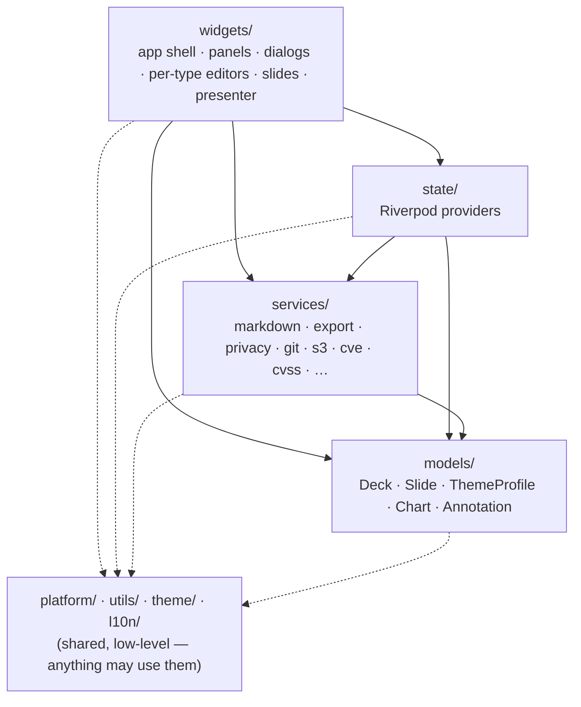

*Arrows point the only direction an import may go. Every upward edge is a hard
zero the build refuses (`models/`→`state/`|`widgets/`, `services/`→`state/`,
`state/`→`widgets/`); the sole tolerated exception is the handful of
`services/`→`widgets/` imports in `slide_rasterizer`, which paints real widgets
into an image.*

The direction of traffic between those layers is enforced, not just intended: a
`check_conventions` guard (`layerRules`) fails the build when `models/` imports
`state/` or `widgets/`, when `services/` imports `state/`, or when `state/`
imports `widgets/`. All three are a hard zero. A separate ratchet
(`serviceUiImportBaseline`, now 4) counts UI imports inside `services/`; the
remaining four are in `slide_rasterizer`, which paints real widgets into an
image and therefore has the widget tree as its subject.

Together those keep the core headless: runnable and testable without pumping a
widget tree, and acyclic between layers. They held on discipline alone until
2026-07-22, which is exactly the kind of invariant a reviewer eventually misses.

## OpenKAT reporting engine

The OpenKAT reporting engine is a pure, headless layer between canonical
`OpenKatOrganization`/`OpenKatSnapshot` facts and ordinary `Deck`/`Slide`
composition. `OpenKatReportEngine.generate` accepts a fully typed
`OpenKatReportRequest`: a scenario ID, portfolio or organisation scope, current
and optional previous *as-of* dates, optional CVE ID, Dutch or English, an
optional title, and policy (`maximumSnapshotAge` and a positive table-row
limit). It has no picker, wizard, provider or widget dependency.

`OpenKatReportFacts` is the sole selection/query layer. For every organisation
it chooses the latest usable snapshot on or before each requested date; an
implicit previous measurement is the latest usable snapshot before the selected
current one. It also emits the measurements actually used and source traces
(organisation, role, report date, source filename, hash and schema). Scenario
code cannot silently substitute a different definition of “previous”.
An explicit previous as-of date must be strictly earlier than the current date,
and a historical capability exists only when the selected previous snapshot is
itself strictly older than the selected current snapshot.

`OpenKatReportScenarioRegistry` supplies 22 declarative recipes, grouped by the
wizard into four families. `management-overview`, `weekly-comparison`,
`organization-overview`, `cve-exposure`, `monitoring-changes` and `data-quality`
remain stable compatibility IDs. The complete catalog is:

| Family | Scenario IDs |
| --- | --- |
| Organisations and management | `management-overview`, `organization-comparison`, `portfolio-trend`, `finding-type-prevalence`, `critical-high-concentration`, `control-coverage`, `recommendations-overview` |
| One organisation and progress | `organization-overview`, `weekly-comparison`, `finding-lifecycle`, `finding-age`, `system-hotspots`, `system-changes`, `control-changes`, `asset-inventory`, `monitoring-coverage`, `monitoring-changes` |
| CVEs | `cve-exposure`, `cve-landscape`, `cve-changes` |
| Data quality and accountability | `data-quality`, `measurement-accountability` |

A recipe is an ordered list of registered blocks, not a class full of custom
branching. The block registry contains portfolio summary, organisation
comparison, severity concentration, portfolio trend, finding-type prevalence,
measurement availability/accountability, finding lifecycle/age, system
hotspots/changes, CVE exposure/landscape/changes, control coverage/changes,
recommendations, asset inventory, monitoring coverage/changes and organisation
overview. The composer turns the validated plan into normal OciDeck slides; it
does not introduce a deck format or a slide type. Every block owns intrinsic
scope, capability, previous-date/CVE, omission, construction-budget and
view-limit conditions. The engine validates them after composition, so an
injected scenario cannot weaken a CVE, monitoring or historical-data gate.

Each block has a construction budget, bounded further by `tableRowLimit`;
queries stop before materialising unlimited result rows and report an omission
where applicable. Tables retain the ordinary non-destructive `DisplayWindowSpec`
projection (normally seven rows; selected availability/accountability and
system/control/asset blocks use eight). The engine validates the policy limit at
runtime against a fixed maximum. A separate
`historicalFindingWorkLimit` bounds the lifecycle identity scan before its set
is materialised; exceeding it yields a typed error rather than a silently
incomplete lifecycle classification.

Capability assessment is deliberately separate from values that happen to be
present in a snapshot. It assesses multiple organisations, chronological
history, adapter-declared CVE/monitoring/opened-at reliability, stable asset and
finding identity, comparable measurement coverage, control denominators and an
optional freshness policy. The engine records typed assessments and stable
diagnostic codes, returns warnings for incomplete portfolios, stale snapshots
and incomparable coverage, and returns no deck on an error. A required
capability yields `missingCapability` and fails closed; optional blocks can only
be omitted under their registry contract.

Thus CVE exposure/landscape require adapter-declared
`reliableCveReferences`; CVE changes also require chronological snapshots and
comparable coverage. Monitoring coverage requires
`reliableMonitoringStatus`; monitoring changes also require history and stable
asset identity. Finding age requires reliable `openedAt`; lifecycle requires
stable finding identity; control changes require denominators and comparable
coverage. A monitoring mutation needs the same stable asset in both snapshots
and two explicit, different statuses. Missing assets, `null` statuses, absent
dates and unproven identities remain unknown. “No longer observed” is a
historical observation, never an automatic resolution. Current import adapters
do **not** declare reliable CVE references or monitoring status, so the affected
recipes are visible to the wizard but unavailable rather than inferred from
incidental fields.

Management comparisons are also projection-gated. A previous value, direction,
delta colour or improvement ranking is composed only when both selected
snapshots declare comparable measurement coverage with the same scope identity.
Without that evidence, the deck retains neutral current standings and adds a
visible warning; raw source text is neutralised for its Markdown, table or chart
context before any slide is composed.

`OpenKatReportFacts` selects the latest usable snapshot on or before an as-of
date and derives the implicit previous selection strictly before current. It is
the single source of rankings and deduplication: organisation ranking is
critical descending, high descending, affected systems descending, then name;
finding-type and CVE rankings start with affected organisations and use stable
ties; CVE landscape data is deduplicated by CVE, organisation, system and
finding. Every result carries measurement usages and source traces (organisation,
role, report date, source filename, hash and schema) for diagnostics and
accountability blocks. Ordinary scenario decks show the used measurement dates;
source filenames, hashes and schemas appear only where the selected
accountability block calls for them.

Trend conclusions carry typed direction and metric deltas. Dutch and English
wording is projected from those facts in the composer; no locale is parsed back
out of free text. OpenKAT recommendation text is neutralised as literal text at
the Markdown boundary.

`OpenKatDeckGenerator` remains the compatibility façade for directory import and
re-import. It builds the legacy `management-overview` plan and preserves the
existing `ocideck_openkat_view` marker semantics. A separate durable
`ocideck_openkat_generated_origin: <sha512>` marker fingerprints the canonical
Markdown of the generated original across save/reopen; `Slide.duplicate`
removes only that origin marker. A copy made in another Marp tool may retain
the marker, but an edit invalidates its fingerprint and therefore stops the
update fail-closed. Proven generated originals are refreshed or removed when
they are no longer in the selected scenario, while manual slides and copies
remain in place. Legacy decks whose origin cannot be proven stop fail-closed.

On desktop, `OpenKatReportWizard` is the UI boundary above this core. Its
platform action owns the directory picker; `OpenKatWizardController` owns the
three wizard stages and delegates to the injectable `OpenKatWizardGateway`.
`OpenKatWizardService` is the concrete gateway: it prepares the directory via
the import service, translates the four UI questions into typed report requests,
uses the engine for preview and generation, and asks the deck generator to merge
generated views when updating. Thus scanner/map access stays at the IO edge,
the controller contains no OpenKAT calculation, and the registry, engine and
composer remain UI-free. The web action is deliberately absent: this route
requires a local directory.

The wizard's scenario availability is a UI projection of source evidence, not a
weaker policy: organisation progress needs an organisation with two usable
measurements, while CVE exposure needs CVE options **and** every latest selected
source to declare `reliableCveReferences`. The current concrete adapters do not
make that declaration, so the CVE question is unavailable rather than inferred
from incidental values.

## Data model

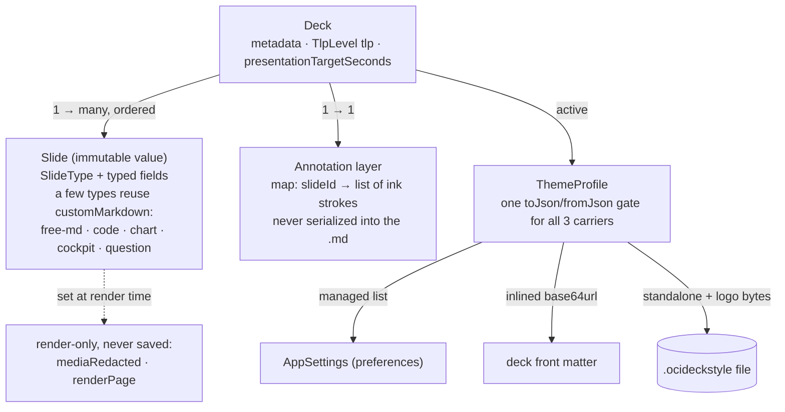

*Slide ids are regenerated on every parse, so anything persisted that must
survive a reload (annotations) re-anchors by slide order + a content
fingerprint, not by id.*

- **`Deck`** holds metadata, a list of **`Slide`**s, the active **`ThemeProfile`**,
  the deck-wide TLP level, and an **annotation layer** (`Map<slideId,
  List<InkStroke>>`) that is *never* serialized into the Markdown — it goes to
  its own sidecar on save, and into the autosave snapshot in between.
- **`Slide`** is a single immutable value with a `SlideType` and typed fields. A
  few types reuse `customMarkdown` for their payload: free-Markdown (raw),
  `code` (the source), `chart` (the JSON spec), `cockpit` (the JSON spec of
  its instrument meters), and `question` (the JSON quiz spec — kind, prompt,
  answers, option count, time limit, and the match threshold for a typed answer).
  answers, option count, time limit).
- A couple of `Slide` fields exist **only for rendering** and never reach a saved
  file: `mediaRedacted`, set by the privacy projection because an emptied image
  path alone cannot tell the renderer whether a photo was removed or never chosen,
  and `renderPage`, set by `expandRichTextForRender` to say which page of a
  paginated rich-text body this copy draws. `renderPage` is not serialized at all;
  `mediaRedacted` is written as `<!-- ocideck_media_redacted -->` under `forExport`
  only, so the HTML export can draw the black block the rasterized exports draw
  themselves. Neither is carried over by `Slide.duplicate`.
- **"Which images does this slide use" has one definition**,
  `services/slide_image_refs.dart` (added 2026-07-22), and it is not
  `imagePath` + `imagePath2`: a rich-text body may carry `` of its own
  (FILE_FORMAT § *Rich text*), and those are slide images too. `slideImageRefs` /
  `slideImagePaths` read the set; `rewriteSlideImagePaths` /
  `rewriteInlineImagePaths` rewrite it — a caller that can enumerate must be able
  to rewrite, or it leaves an inline path pointing nowhere. A dozen or so files
  had spelled the field pair out by hand, and each one that missed the body
  failed in its own direction: the privacy projection let a redacted slide keep
  its picture, the git pool wrote a path into `deck.md` that only the author's
  machine could resolve, the web `mem:` sweep freed bytes still being drawn, the
  save and package paths shipped a deck with a hole in it, and the library's
  "0 slides use this" invited a deletion.
  `services/image_usage.dart` sits on top of it for the library's two questions
  (who uses this file, and repoint them), which existed twice with the same blind
  spot.
- **Question slides** are interactive. The authored `QuestionSpec` round-trips in
  `customMarkdown`; the live per-presentation state (`QuestionView` — the options
  drawn, the pick or the typed text, correct/wrong, timer) is **session-only** and
  never serialized. During presentation the presenter window is the single source
  of truth: the audience window forwards clicks (`answerSelected` /
  `answerSubmit`) and the presenter pushes the resulting `QuestionView` back over
  the window channel, the same pattern as the checklist/table sync.

  Two consequences of that split are load-bearing rather than incidental. First,
  the `QuestionView` is a **render state**, so whatever it holds is on screen: an
  `openText` round therefore carries no `expectedAnswer` until the reveal, and the
  presenter fills it in at the moment it resolves the answer. This is not a
  confidentiality boundary — `buildBeamerMarkdown` hands the audience window the
  whole deck markdown, `question` block and `correct` flags and all, so the answer
  key is already over there. It is a display rule: the view decides what is
  painted, and painting the answer before it is given would spoil the question.
  (*Corrected 2026-07-21: this paragraph claimed the answer key does not travel to
  the beamer window. It does.*) Second, typing must not be possible in two places
  at once, so the audience window passes no `onAnswerTextChanged` and its input
  field mirrors read-only; `presenter_keys.dart` hands the keyboard to the field
  while such a round is open, keeping only `Enter`, `PageUp`/`PageDown`, `Esc` and
  `Ctrl/Cmd+W` as shortcuts.
- **Timeline slides** keep their events in the normal `bullets` field as
  `marker :: title :: description` list items (no `customMarkdown`), so the `.md`
  stays a readable Markdown list. The layout (`TimelineLayout`) and animation
  (`TimelineReveal`) are typed `Slide` fields that round-trip as extra `_class`
  tokens (`timeline-horizontal/-vertical/-steps/-static`) rather than in the
  content. In *step* mode the revealed-event count is **session-only**, mirroring
  the `_richTextPage` pattern: the presenter intercepts next/prev and pushes a
  `timelineStep` over the window channel so the audience window reveals in sync.
- Slide ids are **regenerated on every parse**, so they are stable only within a
  session. Anything persisted that must survive a reload (annotations) re-anchors
  by slide order + a content fingerprint rather than by id.
- **`CockpitColorScheme`** is a named set of cockpit status colours (good /
  warning / critical / cold, plus horizon sky / ground). Schemes live in
  `AppSettings` as a managed list plus a globally selected name, mirroring
  `ThemeProfile`/`AppAppearanceProfile`. **`CockpitVisualStyle`** is the
  separate global appearance choice: `authentic` is the fallback/default and
  `classic` preserves the earlier card-style painter. `SettingsNotifier`
  persists it under `cockpitVisualStyle`; `AppSettings.cockpitColorScheme`
  resolves the selected palette and copies the global visual style onto that
  effective scheme. Neither choice belongs to the deck — both are styling.
  The effective scheme is threaded into `SlidePreviewWidget` and the export
  chain alongside `themeProfile`; for the beamer window it travels in the
  transient audience payload, like the inlined style profile.
- **Cockpit activation is render state, not document state.** In presentation
  mode `_CockpitPreviewState` drives one controller and staggers each meter.
  The authentic painter runs its lamp test, minimum→maximum→target sweep (a
  360° sweep for heading) and rolling read-out; outside presentation mode the
  controller stays at its settled value. `animateOnEnter` and an optional
  duration override remain in `CockpitSpec`. PDF/PPTX rasterise the settled
  Flutter widget. HTML writes the effective style as an SVG class and uses
  `cockpitPowerOn` for the authentic stagger, with a
  `prefers-reduced-motion` fallback.
- **`ThemeProfile` travels three ways**, all through the same `toJson` /
  `fromJson` pair: in `AppSettings` as the managed list of profiles (persisted to
  preferences), inlined in a deck's front matter (base64url), and — since it must
  also be shareable on its own — as a standalone `.ocideckstyle` file
  (`file/file_service_style_profile.dart`, FILE_FORMAT §3.3). `fromJson` is
  deliberately the single hardened gate for all three: two of them are untrusted
  input, so validating at the model rather than per call site means a new carrier
  cannot forget to. The standalone file is the only carrier that embeds the logo
  bytes, because it is the only one that travels without a project folder to
  resolve a path against.

## Markdown round-trip

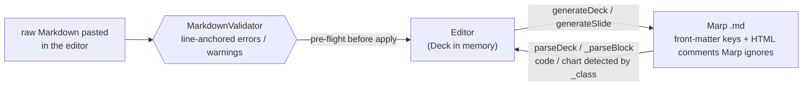

`MarkdownService` is the contract:

- `generateDeck` / `generateSlide` write Marp Markdown. OciDeck extras live in
  front-matter keys and `<!-- … -->` comments that Marp ignores.
- `parseDeck` / `_parseBlock` read it back. `code` and `chart` slides are detected
  by their `_class` and parsed separately (their fenced block would otherwise
  confuse the generic line parser).

`MarkdownValidator` (`lib/services/markdown_validator.dart`) performs a
structural pre-flight before applying raw markdown in the editor: it reports line-
anchored errors/warnings for the same shapes the parser expects (front matter,
slide separators, `_class`, fences, OciDeck HTML fragments, chart JSON, etc.).
See `docs/FILE_FORMAT.md` §10 and `docs/USER_GUIDE.md` (Markdown mode).

This service is heavily covered by the round-trip tests — treat it as the
source-of-truth for the file format and keep `FILE_FORMAT.md` in sync.

## The two rendering worlds

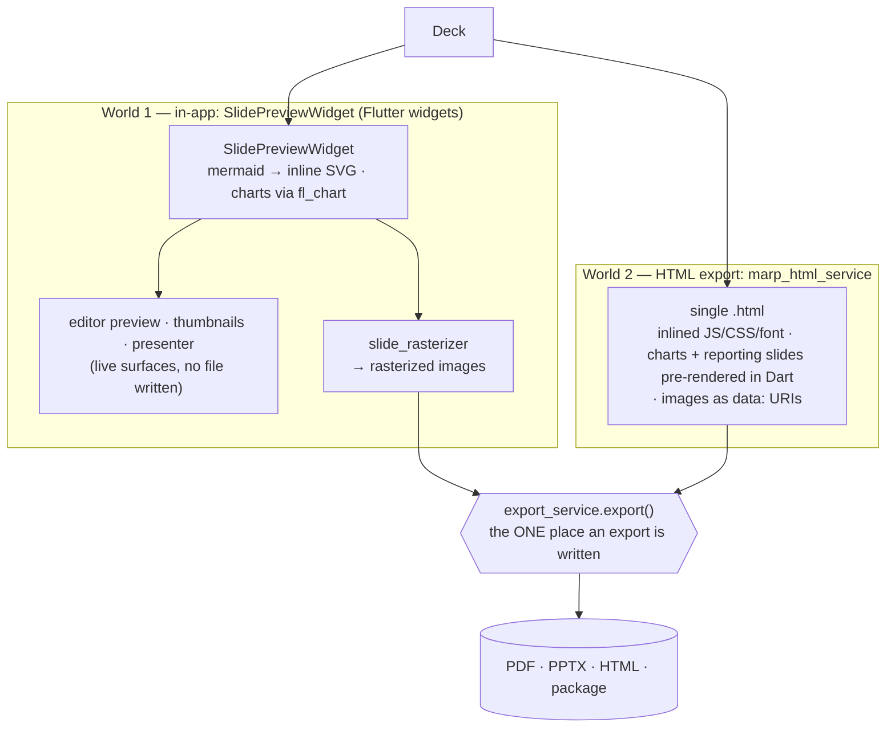

*The load-bearing consequence: anything that must appear in PDF/PPTX has to
render in World 1's `SlidePreviewWidget`, because that is what the rasterizer
walks. The two worlds are independent renderers that converge only at
`export_service`.*

Charts, diagrams, and slides are rendered in **two independent places**, which is
the key thing to understand before touching rendering:

1. **In-app** — `widgets/slides/slide_preview.dart` (`SlidePreviewWidget`) renders
   a slide as Flutter widgets. Free-Markdown ` ```mermaid ` blocks are rendered
   to inline SVG via `services/mermaid_render_service.dart` (shared WebView +
   bundled `mermaid.min.js`). The *same* widget is used for the editor preview,
   thumbnails, the fullscreen presenter, and — via `services/slide_rasterizer.dart`
   — the **PDF and PPTX** exports (rasterized to images). So anything that must
   appear in PDF/PPTX must render here. Charts use `fl_chart`.
   Video sources are classified once by `models/video_source.dart`
   (`VideoSource`: local file / remote file / YouTube / Vimeo) so the preview,
   markdown serializer and exporter agree. Local and remote files play through
   the shared `_MediaPlaybackHost` (`video_player`, file vs `networkUrl`), which
   also seeks to the segment start and stops at the segment end (the per-slide
   trim window that powers "cut a video across slides"). YouTube/Vimeo play in a
   second on-screen WebView (`_VideoEmbedPreview`, the same pattern as the
   Mermaid host); remote rendering is gated by the **Online media** setting. Both
   embeds are a bare iframe on the URL `VideoSource.embedUri` builds. End
   detection and playhead reporting come from the provider: Vimeo through its
   `player.js` API, YouTube through the player's own `postMessage` channel
   (`enablejsapi=1`) with **no** script fetched from YouTube — that script came
   from `www.youtube.com` and put the player itself on that origin, which is the
   one the `youtube-nocookie.com` variant exists to avoid (*corrected
   2026-07-22*). `_youTubePlayerNavigationAllowed` matches on host, not
   substring, and refuses `www.youtube.com` so the player's "Watch on YouTube"
   link cannot navigate the slide there.
2. **HTML export** — `services/marp_html_service.dart` produces a single `.html`
   that renders in a browser using inlined JavaScript (marked, highlight.js,
   mermaid, MathJax), inlined CSS and an inlined font. Charts, the cockpit and
   the six reporting slide types (`scorecard`, `assets`, `discoveries`,
   `checklist`, `scope-matrix`, `findings-summary`) are pre-rendered **in Dart**
   here — SVG for the charts, HTML+CSS for the rest — so no JS chart library is
   needed and the MIAUW slides keep their shape instead of falling back to a
   bare table.

   **Slide images are inlined as `data:` URIs** (updated 2026-07-22). The
   service itself never touches the filesystem: `build()` takes an
   `HtmlImageResolver` and `ExportService` supplies one that resolves the path
   inside the deck's project folder (same containment as the preview) and hands
   the bytes to `services/html_image_embedder.dart`, which caps the long edge at
   `kHtmlEmbedMaxEdge`, re-encodes (JPEG, or PNG when the image really has
   transparent pixels), and strips EXIF. Each source is embedded **once**,
   behind a `#ocideck-img-N` placeholder the render script swaps back, so a
   background repeated across slides costs one copy. An image that cannot be
   embedded becomes a visible notice, never a dangling reference.

   Two things still differ from the in-app renderer by design: theme fidelity
   (this is `marked`, not Marp Core) and **video** — a local `<video src>` is
   *not* inlined (size), and a YouTube/Vimeo `<iframe>` is blocked by the
   export's `frame-src 'none'`.

Both worlds converge at one chokepoint: `services/export_service.dart`
(`ExportService.export()`) is the only place that writes an export.

### Render-time pagination

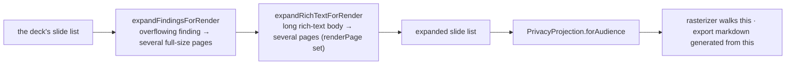

*Both transforms are pure and leave the deck itself alone — what the export
enumerates is the expanded list, not the edited one.*

What an export enumerates is not the deck's slide list.
`_MainLayoutState._expandForExport` (`widgets/app_shell_main_layout.dart`) runs
`expandFindingsForRender` (`services/finding_pagination.dart`) and then
`expandRichTextForRender` (`services/rich_text_layout.dart`) over the chosen
slides, and that expanded list is the deck the privacy projection is taken of —
so it is what the rasterizer walks and what the export's markdown is generated
from. Both transforms are pure and leave the deck itself alone.

The reason is the same in both cases: a finding whose prose overflows, and a
rich-text body longer than one slide, are *edited* as one slide but must be
*rendered* as several at full size. The editor preview and the presenter page
through those pages themselves; a surface that enumerates slides cannot, and
until 2026-07-22 the export therefore rendered the first page of a paginated
rich-text slide and left the rest out of the file.

Two consequences worth knowing:

- The footer's page number is the slide's **position in the expanded list**
  (`SlideRasterizer` hands `SlidePreviewWidget` `i + 1` and `slides.length`), so
  continuation pages are counted like any other slide.
- Each rich-text page copy keeps the *whole* body and the original slide id, and
  carries only `renderPage`. The page split and the shared font scale are
  properties of the body as a whole — one page's markdown in isolation would be
  scaled on its own and the text would jump from page to page. Presenting expands
  findings only (`widgets/shell/shell_actions.dart`), because the presenter pages
  through a rich-text slide itself; `SlidePreviewWidget._effectivePage` lets a set
  `renderPage` win over the page a surface paged to, and the two never occur
  together.

### Classification enforcement

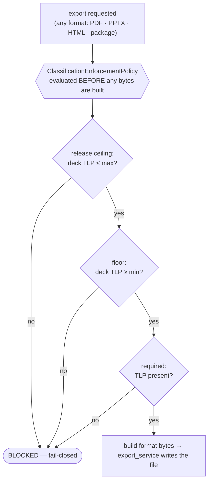

*Each of the three rules is optional (drawn here in the order they are checked
when all are set). The gate lives inside `export_service.export()` before any
bytes exist, so no format can slip past it.*

Export blocking is decided by `ClassificationEnforcementPolicy`
(`services/classification_enforcement_policy.dart`), evaluated inside
`ExportService.export()` **before** any file bytes are built — fail-closed, so no
format (PDF/PPTX/HTML/package) can bypass the gate. The export dialog and status
bar run the same policy up front for UX (explain early, disable misleading work).

The policy combines three optional rules from `AppSettings`:

| Setting key | Rule |
| --- | --- |
| `maxReleaseExportTlpKey` | Release **ceiling** — deck TLP must not exceed this level. |
| `minRequiredExportTlpKey` | **Floor** — deck TLP must be at least this level. |
| `requireClassificationOnExport` | Deck must have a TLP level (`TlpLevel.none` is rejected). |

`ClassificationPolicy` remains as a thin wrapper around the ceiling only
(backward compatible); new code should use `ClassificationEnforcementPolicy`.
The gate evaluates **deck-wide** `Deck.tlp`, not per-slide levels (those still
control visibility via `slideVisibleAtTlp`).

`ExportDocumentMetadata` (`services/export_metadata.dart`) is built from deck
metadata and passed into PDF (`pw.Document` title/author/subject/keywords/creator/producer),
PPTX core properties, and HTML `<meta>` tags. HTML also gets a fixed
`.tlp-export-banner` when classified.

The same object carries the **unreviewed-AI declaration**, counted from
`Slide.aiAssistedFields` (`unreviewedAiSlideCount`). It rides the existing
channels rather than adding a new one: the keyword `kAiDraftKeyword` joins
`exportKeywords()`, `kAiDraftSubjectNote` is appended to `subject()` behind the
TLP prefix, `htmlAiMarking` emits `<meta name="ai-generated">` beside
`ai-generated-slides`, `MarpHtmlService._aiBanner` renders an
`.ai-export-banner` (offset below the TLP banner when there is one, at the top
when there is not), and `fileSuffix` puts `-ai-concept` in the filename that
`ExportService.export` composes. Every one of them is empty when the count is
zero, so a reviewed deck exports exactly as before. The count is taken from the
**projected** deck the export dialog holds, so the redacted copy declares it too.

### Visual TLP marking

In-app slides (`SlidePreviewWidget`) compute `effectiveTlp(deckTlp, slideTlp)` —
the stricter of deck and slide — and render FIRST TLP 2.0 markings from
`widgets/slides/previews/overlays.dart`:

- `_TlpOverlay` — bottom-right (or bottom-left) badge
- `_ClassificationWatermark` — optional diagonal watermark (`TLP · organisation`),
  controlled by `AppSettings.classificationWatermarkEnabled`

The same widget tree is rasterized for PDF/PPTX (`slide_rasterizer.dart`), so
markings are WYSIWYG. The watermark setting is threaded through preview, presenter,
audience window, thumbnails, and export dialog.

## Presenter

`widgets/presentation/fullscreen_presenter.dart` drives presenting:

- Keyboard navigation, presenter view, blank screen, grid overview, auto-advance,
  and the **annotation tools** (pen/highlighter/eraser/laser).
- The single `_FullscreenPresenterState` is split for navigability into
  `widgets/presentation/parts/presenter_*.dart` (questions, table, ink, playback,
  displays, navigation, keys, notes, overlays). Each is a `part of` the main file
  and adds one `extension _PresenterX on _FullscreenPresenterState`, so the state
  and all imports stay in the main library. Two rules for this pattern: extensions
  can't call the protected `setState`, so they go through the main class's
  `_rebuild(fn)` wrapper; and `static` members used by a part must live at
  top-level (e.g. `_questionTickMs`, `_digits`), since extensions don't see class
  statics. The main file keeps the fields, lifecycle (`initState`/`dispose`/
  `build`), `_slideCanvas`, and the shared getters.
- Neighbour slide images are **precached** and `gaplessPlayback` is on, so slide
  changes never flash black (important for screen recording).
- **Rehearsal timing** lives in `services/rehearsal_controller.dart` — a plain,
  unit-testable controller (injectable clock) that the presenter feeds via a
  cheap, idempotent `observe(id, index)` on every build, so it captures every
  navigation path. It measures only: elapsed, remaining against a target,
  per-slide time, and — through the explicit `startQuestion`/`finishQuestion`
  pair, which the question logic calls — the duration and verdict of each
  *answered* question attempt. No pacing logic. State is **session-only** (no
  prefs, no `.md`); `_exit` shows a summary (`rehearsal_summary.dart`) and
  discards it. The default target lives in `Deck.presentationTargetSeconds`
  (front matter: `ocideck_target_seconds`).

  Whether that summary appears at all is decided in `FullscreenPresenter`, not at
  the call site: a `playOnly` deck is refused before the `showRehearsalSummary`
  switch is even consulted. Putting the gate in the widget means every route into
  the presenter is covered by it, which is the point — the switch travels in the
  recipient's copy of the file, so a caller-side check would only cover the
  callers we happened to think of.

### Dual-screen mode

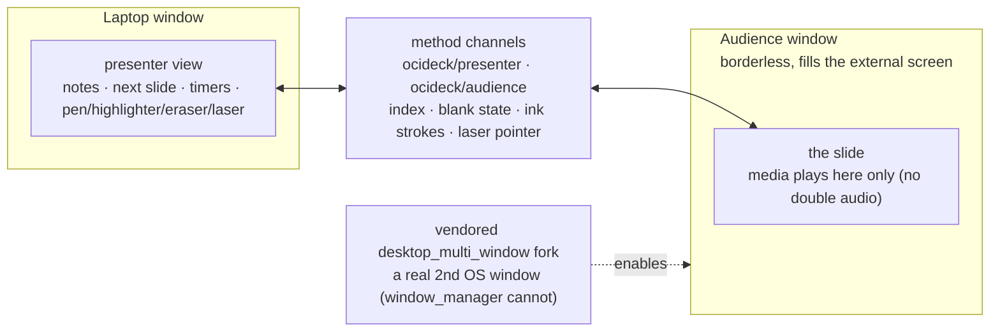

When a second display is present (`shouldUseDualScreen` on macOS, Windows, or
Linux), the presenter runs in two OS windows:

- The **laptop** window shows the presenter view.
- A borderless **audience** window (`audience_window.dart`) fills the external
  screen with the slide.
- They sync over method channels (`ocideck/audience`, `ocideck/presenter`):
  current index, blank state, ink strokes, and the laser pointer. Media plays only
  on the beamer to avoid double audio.

This needs a real second window, which `window_manager` (single-window) can't do,
hence the vendored multi-window fork below.

## Sidecars (separate layers)

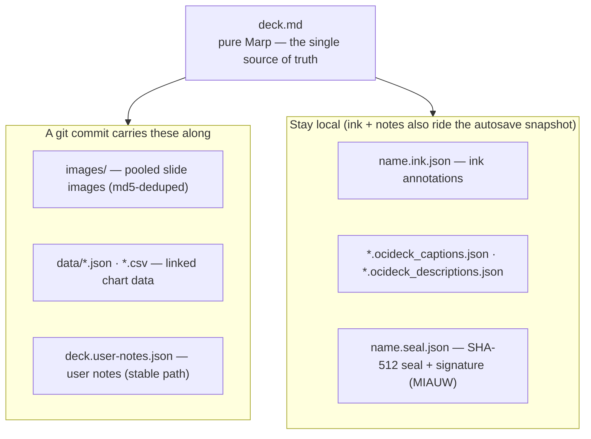

*The ink sidecar is the notable omission: nothing in `services/git/` writes it,
so the save path asks before committing. See the paragraph below and
`design/GIT_STORAGE.md` §9.1.*

To keep the `.md` pure Marp, five kinds of data live beside it (see
`FILE_FORMAT.md` §6):

- **Captions** — `.ocideck_captions.json` (per image, in `images/`).
- **Descriptions/tags** — `.ocideck_descriptions.json` (searchable image
  metadata, used by the library's search and the untagged filter).
- **Annotations** — `<name>.ink.json` (`services/annotation_codec.dart`).
- **User notes** — `<name>.user-notes.json` (`services/user_notes_codec.dart`).
  In the visual editor, slides with user notes are marked on thumbnails in the
  slide list (`widgets/slides/slide_thumbnail.dart`).
- **Linked chart data** — `data/*.json` for anything new, `data/*.csv` for a deck
  that already links one (the living source for a chart).

These carry a consequence worth stating where the layers are listed: a commit to
a git repository takes `deck.md`, the pooled images, the chart data and the user
notes (`<deckDir>/deck.user-notes.json`, on a stable path so a change reads as a
change) — and **not** the ink sidecar, since nothing in `services/git/` writes
it. `gitDeckOmissions` counts what stays behind and the save path asks before
committing (`design/GIT_STORAGE.md` §9.1). The ink and the notes *are* carried in
an autosave snapshot, because both live outside the markdown and drawing alone
already makes a deck dirty.

The notes are written indented rather than compact, which is the only reason the
"ordinary text merge" of D7 is true: on one line every edit collides with every
other. That formatting difference between the disk sidecar and the repo copy is
deliberate, and `UserNotesCodec.encode(forTextMerge:)` is where it lives.

## Git storage (`services/git/`)

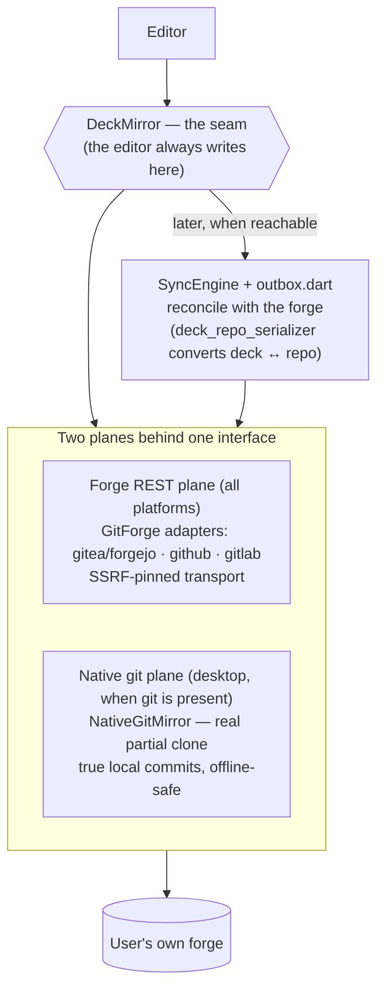

*The seam is the point: losing the connection must never lose work, so edits
land in the mirror first and the forge is reconciled afterwards.*

A deck source that is "WebDAV with version history". Two planes sit behind one
interface:

- **Forge REST plane** (all platforms) — `GitForge` with three adapters
  (`gitea_forge.dart` for Gitea/Forgejo, `github_forge.dart`, `gitlab_forge.dart`).
  Transport is SSRF-pinned (`git_transport_io.dart` / `_web.dart`): https-only
  unless the server is marked trusted-internal, resolve-then-pin against DNS
  rebinding, no redirects, byte caps.
- **Native git plane** (desktop, when `git` is present) — `NativeGitMirror` over a
  real partial clone. It makes true local commits (`hasRealHistory == true`), so
  work survives offline and the history dialog and release/version chooser have
  something real to show.

`DeckMirror` is the seam between them: the editor always writes to the mirror, and
`SyncEngine` + `outbox.dart` reconcile with the forge later — losing the connection
must never lose work. Deck↔repo conversion lives in `deck_repo_serializer.dart`;
`deck_search.dart` adds cross-deck search. State: `state/git_provider.dart` and the
`tabs_provider_git*` files; UI: the `shell_actions_git*` family. Design rationale:
[`design/GIT_STORAGE.md`](design/GIT_STORAGE.md).

## The privacy projection boundary

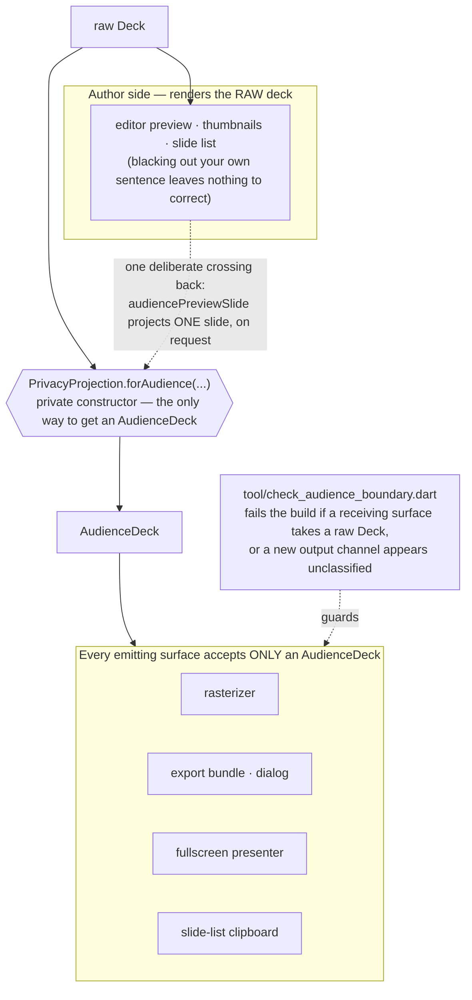

`services/privacy/privacy_projection.dart` is a type-enforced chokepoint, not a
convention. `PrivacyProjection.forAudience(...)` is the only way to obtain an
`AudienceDeck` (its constructor is private), and every surface that can *emit*
content — the rasterizer, the export bundle and dialog, the fullscreen presenter,
the slide-list clipboard — accepts an `AudienceDeck` rather than a raw `Deck`. The
`tool/check_audience_boundary.dart` gate fails the build if a registered
receiving surface takes a raw `Deck`/`List<Slide>`, and also if a *new* output
channel appears without being classified at all — so redaction cannot be
bypassed by forgetting a call, nor by adding a surface nobody thought to list. `forExternalProcessing(...)` is the stricter variant for
hand-off outside the app.

The boundary is about what *leaves*, so the author's own editor sits on the
source side: the preview, the thumbnails and the slide list render the raw deck,
because a screen that blacks out your own sentence leaves you nothing to correct.
`services/privacy/privacy_preview.dart` is the one deliberate crossing back —
`audiencePreviewSlide` runs a *single* slide through `forAudience` and hands the
projected `Slide` to the preview, on request, so the author can look at the
recipient's version. It projects one slide rather than the deck because the
projection scans, and rescanning a deck on every keystroke in the editor beside
it would make the preview unusable; the scanner escalates within a slide, so the
result for that slide is the same either way.

The type says a deck went through the boundary; it does not say the boundary
looked at every field. That second half is a list written by hand in three
places — the scanner's fragments, the projection, and the redaction manifest —
and the compiler connects none of them. When one lags, the export gate reports a
finding that *Redact* cannot clear and the value travels anyway, which is how six
deck fields and a slide's checklist scope stayed unredacted until July 2026.
`test/privacy_scan_redact_parity_test.dart` is the ratchet that holds the three
lists together; it names the field that is missing rather than only failing.

Adjacent egress control: `services/ai_security_gate.dart` is a pure, I/O-free
decision run before every AI request (mode, consent, loopback/trusted-internal/
cloud rules, fail-closed on web); `utils/zip_encryption.dart` backs encrypted
`.ocideck` packages; `services/cve/` holds the desktop-only offline CVE index.

## Vendored forks

Two upstream plugins are forked into `third_party/` and wired via `pubspec.yaml`
(path dependency / `dependency_overrides`):

- **`desktop_multi_window`** (MixinNetwork, **Apache-2.0**) — vendored fork with
  `window_setFrame`, `window_coverScreen` (borderless fill of a chosen screen),
  and `window_close` on **macOS, Windows, and Linux**. macOS additionally tracks
  the mouse for non-key windows so chart hover works on the beamer.
- **`screen_retriever_macos`** (leanflutter, MIT) — a Swift Package Manager
  layout added for recent Xcode/CocoaPods; no upstream file edited.

Each fork carries a `MODIFICATIONS.md` naming the upstream commit it descends
from and every local change, and — for the Apache-2.0 one — each changed file
opens with the §4(b) notice that licence requires. The SBOM records the same
commit plus a SHA-256 tree hash of the directory.

If you bump either upstream, re-apply the local changes, update
`MODIFICATIONS.md` and `_forkOrigins` in `tool/sbom_build.dart`, run `make sbom`,
and re-test the dual-screen presenter.

## Information-security module (optional, off by default)

The MIAUW pentest-reporting module (design: `docs/design/PENTEST_MIAUW.md`) is
gated behind `state/info_safety_provider.dart`: `infoSafetyRevealProvider` stays
false until the user enables it in Settings, so its UI (a dedicated slide-picker
tab, command-palette actions, the report template) is hidden otherwise. It rides
the existing rails rather than adding a parallel stack:

- **Slide types** — `finding`, `findingsSummary`, `checklist`, `scopeMatrix` and
  `signOff` are ordinary entries in the `slideTypeMeta` registry
  (`models/slide.dart`); each carries a `_class` token and round-trips its
  structured data as `<!-- ocideck_* -->` comments like every other type. A
  **finding** is authored as a *group*: a header slide plus detail / evidence
  slides sharing one `ocideck_finding_id` and a `FindingRole`.
- **Domain services** (pure, network-free) — the native **CVSS 4.0** engine
  (`services/cvss/`), the offline **CWE** and **MIAUW EIS** catalogs, the finding
  numbering / evidence hashing / scope-coverage / management-summary /
  compliance-analyzer derivations, and the audit-dossier index builder
  (`services/audit_dossier.dart`).
- **Document integrity** — `services/document_integrity.dart` seals a finalised
  deck with a SHA-512 hash over the **bytes of the `.md`**, recorded beside the
  file in `<name>.seal.json` (`services/seal_codec.dart`) together with the
  visible signature. Because the seal sits outside the file it covers, a
  recipient recomputes it with `sha512sum` — no OciDeck, no specification to
  replay. Re-verified on open by comparing that value with the hash of the bytes
  just read. An optional **RFC 3161** token
  (`services/rfc3161_timestamp.dart`, with a hand-rolled ASN.1 DER codec in
  `utils/asn1_der.dart` — no new dependency) binds the hash to a claimed time;
  OciDeck compares the token's imprint and nothing else — no CMS signature, no
  certificate chain — and never contacts a TSA itself.
- **Audit dossier** — `file/file_service_dossier.dart` reuses the AES-256
  package builder to bundle the sealed report, its evidence and the hash tables
  into one encrypted `.ocideck` archive plus an `AUDIT_DOSSIER.md` index.
- **Optional AI** — a shared, off-by-default backend (`services/ai_*`) drafts
  finding text and image alt-text behind the outbound-privacy consent; drafts are
  marked `ocideck_ai_assisted` and block sealing until a human reviews them. The
  marker also survives the file boundary: while it is present, every PDF, PPTX
  and HTML export declares it in its document properties and its filename (see
  § Classification enforcement). Export itself is not blocked — sealing is a statement,
  sending a draft to a reviewer is the normal way to get it cleared.

## Localization

Dutch is the source language: UI code calls `d('Nederlandse brontekst')` (literal
source) or `t('key')` (keyed). `l10n/app_localizations.dart` keeps only the
`AppLocalizations` class and delegate, and **assembles** the three lookup maps
(`_strings`, `_dutchSourceStrings`, `_dutchSourceStringAdditions`) from one file
per language. The translation data lives in `l10n/translations/<lang>.dart` (32
languages), each a `part of '../app_localizations.dart'` that declares
`_strings<Lang>`, `_dutchSource<Lang>`, and (for the languages that need later
additions) `_dutchSourceAdd<Lang>` (Dutch only needs `_stringsNl`, being the
source). For a Dutch source string `d()` reads the additions map before the
primary map, so a key must never live in both (guarded by
`test/l10n_duplicate_keys_test.dart`); every `d()`/`t()` string is required in all
languages by `test/app_localizations_test.dart`.

**Homographs — use `t()`, not `d()`.** Because `d('bron')` keys on the Dutch
text, a word that spells the same but means different things in different
contexts collapses to one translation. Reach for a keyed `t('...')` string in
that case, so each meaning gets its own value. Concrete example: the cockpit
artificial-horizon roll angle `d('Bank')` (translated as aviation *Roulis /
Rollen / Alabeo*) and the financial bank on the About page (`t('bankLabel')` →
*Banque / Banco / …*) — one Dutch word, two meanings, two keys. This is the one
class the shadowing guard cannot catch, because it is a semantic collision, not a
data duplicate.

- **Translate or add a string:** edit the relevant language file(s). A test
  (`test/app_localizations_test.dart`) fails unless every literal `d('…')` has a
  translation in *every* language.
- **Add a language:** create `translations/<lang>.dart`, add its `part` directive
  and its entry in each of the three assembly maps in `app_localizations.dart`,
  and register it in `supportedLocales` and `languageNames`.
