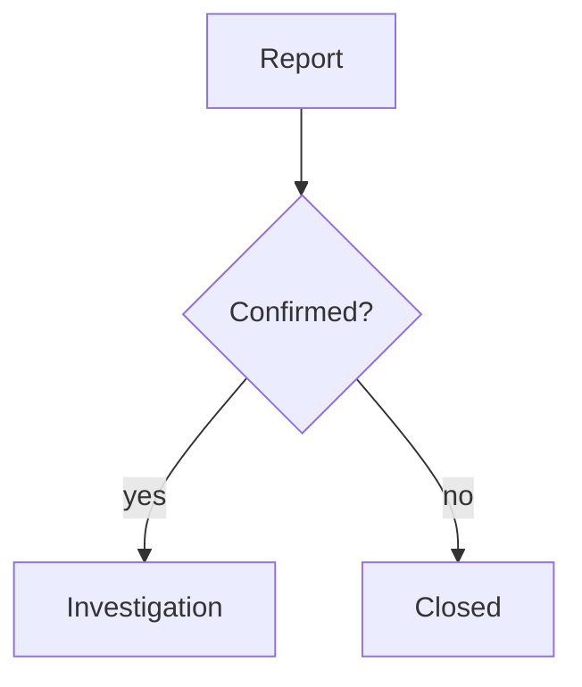

# OciDeck — File Format

> **Status:** specification of the on-disk format — the stable contract · **Status last reviewed:** 2026-08-19 · **Published by:** Stichting LibreKAT

## Contents

- [1. Project Folder Layout](#1-project-folder-layout)
- [2. Markdown Structure at a Glance](#2-markdown-structure-at-a-glance)
- [3. Front Matter](#3-front-matter)
- [4. Slide Classes and Behavior](#4-slide-classes-and-behavior)
- [5. Per-Slide-Type Markdown Representation](#5-per-slide-type-markdown-representation)
- [6. Sidecars and Separate Data](#6-sidecars-and-separate-data)
- [7. Portable Package (`.ocideck`)](#7-portable-package-ocideck)
- [8. Special Per-Slide Comments (Overview)](#8-special-per-slide-comments-overview)
- [9. Round-Trip and Compatibility](#9-round-trip-and-compatibility)
- [10. Markdown Mode and Syntax Checking](#10-markdown-mode-and-syntax-checking)
- [11. Export Metadata (Not in `.md`)](#11-export-metadata-not-in-md)
- [12. Redaction Manifest Files (Beside an Export)](#12-redaction-manifest-files-beside-an-export)
- [13. Accepted Files and Their Limits](#13-accepted-files-and-their-limits)
- [14. Documents (Plain `.md`, Not a Deck)](#14-documents-plain-md-not-a-deck)

*(Added 2026-07-22: this document had no way in other than scrolling. In the app the documentation reader has full search; on the repository page it did not. The note used to give a line count — around 2,253 — which had quietly grown to roughly 3,280 by 2026-08-16; a figure nobody updates is better left out than left wrong.)*

OciDeck stores presentations as **standard [Marp](https://marp.app/) Markdown**
(`.md`). There is no custom binary format: a saved presentation is *designed* to
be processed directly with the Marp CLI or the VS Code Marp extension. *(Corrected
2026-08-27: this used to say compatibility was "not verified against the real
tools." It now is — a pinned, repository-native real-Marp check
(`tool/marp-check`, `make check-marp`) renders a minimal split fixture with the
real Marp CLI and asserts the `section.split` layout survives in DOM/CSS and a
screenshot, including after moving the folder and on paths with spaces. The
verified invocation is `marp deck.md -o out.html` run **from the project
folder**, where the saved `.marprc.yml` registers the generated theme — see §1.
Marp does not auto-discover a stylesheet placed beside the deck, so that config
file is what makes the plain invocation work; running Marp from elsewhere or with
`--no-config-file` falls back to the default theme and loses the split layout,
which is the documented limitation.)* OciDeck has its own renderer built on
`marked` and does not embed Marp Core, which is exactly why the promise needed
testing rather than asserting. OciDeck-specific
information is written in places Marp ignores (front-matter keys and HTML
comments), so the file remains fully Marp-compatible while still round-tripping
losslessly in OciDeck.

There are also two derived forms:

- a **project folder** around the `.md` file with copied assets, and
- a **portable package** (`.ocideck`, a zip file) for exchanging a presentation as
  a single file.

---

## 1. Project Folder Layout

When saving (`Save` / `Save as...`), OciDeck writes more than the `.md` file: it
also creates a fixed folder structure next to it and copies all used assets
there. Paths in the Markdown are then **relative** to the folder containing the
`.md` file.

```
my_presentation/
├── My_presentation.md              # the presentation (Marp Markdown)
├── .marprc.yml                     # Marp CLI config: registers the theme (see §1.1)
├── My_presentation.ink.json        # annotation-layer sidecar (see §6.2)
├── My_presentation.user-notes.json # user-notes sidecar (see §6.3)
├── My_presentation.miauw.json      # MIAUW-disposition sidecar (see §6.5)
├── My_presentation.seal.json       # seal + signature sidecar (see §6.6)
├── images/                         # copied images
│   ├── photo.png
│   └── .ocideck_captions.json      # caption sidecar (see §6.1)
├── data/                           # linked chart data files (see §6.4)
│   └── revenue.json
├── logos/                          # copied logo from the style profile
│   └── logo.png
├── media/                          # video/audio, created on save (see §7)
└── themes/
    └── ocideck.css                 # generated theme CSS (see §5)
```

### 1.1 Marp CLI config (`.marprc.yml`)

Marp CLI does **not** auto-discover a stylesheet placed beside the deck — merely
saving `themes/ocideck.css` next to the `.md` is not enough for a plain
`marp deck.md` to pick it up. OciDeck therefore writes a `.marprc.yml` next to
the `.md` that registers the generated theme through Marp's standard `themeSet`
option:

```yaml
themeSet:
  - themes/ocideck.css
```

With that file present, the documented invocation — run **from the project
folder** — loads the theme with no extra flags:

```sh
marp deck.md -o out.html
```

The path inside `.marprc.yml` is relative, so moving or renaming the project
folder does not break theme discovery. The limitation is honest: run Marp from
elsewhere, or pass `--no-config-file`, and Marp falls back to its default theme
and the `section.split` two-column layout is lost. This is verified by a pinned
real-Marp check (`tool/marp-check`, `make check-marp`). *(Added 2026-08-27, #1804.)*

> The `.md` filename is derived from the presentation title: non-alphanumeric
> characters are removed and spaces become `_`.

**Before the first save** there is no project folder yet, so an inserted image
or video is copied to a per-session **staging folder** under the OS temp
directory, laid out the same way (`images/`, `media/`). The bytes are therefore
safe from the moment you insert them — moving or renaming the original no longer
breaks the deck — and the ordinary save-time copy moves them into the project
folder because the layout already matches. Until then the editor marks such an
asset as *not yet saved*.

The staging folder is housekeeping, not storage: at startup OciDeck deletes
session folders nothing has touched for the same period recovery files are kept
(7 days), so heavy use without saving does not quietly pile up. The two periods
share one constant on purpose — a recovered draft points at its old session
folder, so staging must never be cleared before recovery is.

When a copy would land on a name that is already taken, the existing file is
reused only if its contents are byte-identical; otherwise the newcomer gets a
numbered suffix (`screenshot_2.png`). Two different pictures that happen to
share a filename therefore stay two pictures.

The folders `images/`, `logos/`, `themes/` (and `node_modules/`, `build/`,
`.git/`, `.dart_tool/`) are skipped when OciDeck scans a folder for
presentations.

> **Security — asset paths are confined to the project folder.** Because a
> `.md` may come from an untrusted source, every asset reference
> (`` images, `logoPath`, video/audio, chart `source`) is resolved
> strictly inside the project folder. Absolute paths and `../` escapes are
> ignored when previewing, presenting, exporting, or analysing a deck — a
> deck cannot read files elsewhere on disk. See `SECURITY.md` →
> *Untrusted deck handling*.

> Next to the `.md` file, OciDeck writes **sidecars** that deliberately are not
> part of the Marp Markdown (so the `.md` stays clean and exchangeable): the
> annotation layer (`<name>.ink.json`, §6.2), user notes
> (`<name>.user-notes.json`, §6.3), captions (`.ocideck_captions.json`, §6.1),
> linked chart data (`data/*.json`, `data/*.csv`, §6.4), the MIAUW
> disposition (`<name>.miauw.json`, §6.5) and the document seal plus visible
> signature (`<name>.seal.json`, §6.6).

> **No base64 in the `.md`.** As of 0.1.0 nothing OciDeck writes into a
> presentation file is opaque. Whatever is unreadable to a human, or is *about*
> the document rather than part of it, lives in a sidecar next to it. What
> remains in the Markdown as an HTML comment is plain text a reader can
> understand and edit (`tlp`, `skip`, `advance`, `ocideck_bullet_marker`,
> `ocideck_image_focus`, `ocideck_title_text_color`, …). The promise this
> upholds: someone with only a text editor and Marp can keep working. See §3.6
> for what moved, and where it went.

---

## 2. Markdown Structure at a Glance

```markdown
---
marp: true
theme: ocideck
paginate: true
... (other metadata) ...
---

<!-- _class: title -->

# First slide

---

<!-- _class: ... -->

(second slide)
```

- The document starts with **YAML front matter** between `---` lines (§3).
- Slides are separated by a line containing exactly `---`. A `---` line **inside
  a fenced code block** (```` ``` ```` or `~~~`) is code content, not a
  separator, so a code sample, diff hunk or embedded YAML document that contains
  `---` no longer splits the slide.
- Each slide can optionally start with a `<!-- _class: ... -->` line that
  determines the slide type and behavior (§4).

---

## 3. Front Matter

### 3.0 The format contract

Four rules govern the front matter. They are written down because a file
outlives the build that wrote it, and because the last of them is a promise made
to future versions of OciDeck rather than to the reader.

**1. Keys OciDeck does not know are kept.** On save, OciDeck does not
regenerate the front matter — it updates the lines that were already there. The
keys it owns (every key in the table below, `marp` included) are replaced,
removed or appended; **every other line stays exactly where it was**, including
`#` comments, blank lines, indented blocks, the original order and the original
quoting. A hand-written key OciDeck does not own, such as `size:` or `style:`,
therefore survives an OciDeck save unchanged. The five supported Marp visual
keys (`color`, `backgroundColor`, `backgroundImage`, `header`, `footer`) are
owned: OciDeck reads them into the deck model and writes their current values
back in standard Marp syntax. Their meaning survives, but their original scalar
spelling or quoting need not. *(Corrected 2026-08-10: these keys became owned
when OciDeck started editing and synchronising them.)*
The implementation is in
`lib/services/front_matter_merge.dart`; the owned keys live there in one list,
which the markdown checker (§10) reads as well.

Two boundaries are worth knowing. Only keys at column 0 count as keys — an
indented `key: value` is read as the inside of the block above it, which is what
keeps a nested `style: |` block intact. And a key OciDeck *does* own is replaced
together with any lines indented underneath it, because leaving those behind
would produce front matter that is no longer valid YAML.

**2. `ocideck_format` is the format version.** One monotonically increasing
integer, not `major.minor`: the only question to answer is "is this file older
than I am?". A file **without** the key is version 1 — that is the normal state
of every hand-written Marp file, never an error, and an unreadable value is read
as version 1 for the same reason.

**3. A reader never lowers the version, and never upgrades on open.** If this
build reads `ocideck_format: 2` it writes `2` back, not `1` — otherwise the file
would lie about itself after one save. That is only safe because rule 1 keeps
the keys of that newer version in place. Upgrading happens **on save, never on
open**: looking at someone else's file must not change it. This is the existing
"migrate on read, persist on first write" policy — see
[MIGRATION_GUIDE.md](MIGRATION_GUIDE.md) and §6.4. An older file always opens
and is never made read-only.

**Version 2** is written when a deck first saves an `ocideck_callouts` block
(IMAGE_CALLOUTS.md §2). A version-1 file without callouts stays version 1;
opening a version-2 file in a build that does not know callouts leaves the
block in place (rule 1) and writes `2` back (rule 3).

**4. The meaning of an existing key never changes.** A changed meaning gets a
new key. This is the precondition that makes "skip what you do not know" safe
forever: a reader that ignores an unknown key must be able to trust that the
keys it *does* recognise still mean what they meant. Renaming or repurposing a
key would break every older build silently, which is the worst way to break
something.

**The version line is inside the seal, because the seal is over the file.**
Since 0.1.0 the seal hashes the `.md`'s bytes (§6.6), and `ocideck_format` is
one of those bytes. A build that writes a higher version therefore changes the
file and breaks the seal. That is strict on purpose and it is the honest
answer — the file *did* change — but it only bites if something rewrites a
sealed deck, and OciDeck does not: a finalised deck is read-only, so nothing in
the app produces a save. A future format upgrade must skip sealed decks, or
accept that it re-issues them; silently rewriting one and calling the result
intact is the thing this design refuses to do. (Before 0.1.0 the version was
excluded from the hash, because the hash was over a canonicalisation instead of
over the file. See §6.6 for why that changed.)

| Key | Type | Meaning |
| --- | --- | --- |
| `marp` | `true` | Fixed Marp marker. |
| `ocideck_format` | int | The format version of this file (§3.0). Absent means version 1. Written on save; never lowered. |
| `title` | string | Deck title. Written and parsed; also used as the export document title. |
| `theme` | string | Theme name; defaults to `ocideck`. Refers to `themes/<theme>.css`. |
| `paginate` | `true`/absent | Written only when pagination is enabled. |
| `color` | Marp/CSS color/absent | Deck-wide text color. An explicitly empty scalar is distinct from an absent key. |
| `backgroundColor` | Marp/CSS color/absent | Deck-wide slide background color. An explicitly empty scalar is distinct from an absent key. |
| `backgroundImage` | string/absent | Deck-wide background image in standard Marp/CSS form. |
| `header` | Markdown string/absent | Deck-wide header rendered as inline Markdown. |
| `footer` | Markdown string/absent | Deck-wide footer rendered as inline Markdown. |
| `author` | string | Author. |
| `organization` | string | Organization. |
| `version` | string | Version. |
| `date` | string | Date (free text). |
| `description` | string | Description. |
| `keywords` | string | Keywords. |
| `language` | string | The language the report is written in, as a language code (`nl`, `en`, …). This is the **report's** language, not the interface language: a Dutch tester writing for an international client produces an English report from a Dutch UI. Written only when recorded. Findings render their section headings in it while the Markdown keeps its stable English anchors (§4.x / PENTEST_MIAUW §12.3), and recording it satisfies MIAUW EIS 2.3. |
| `standards` | string | Standards the test was carried out against, comma-separated as `name@version` (e.g. `OWASP WSTG@4.2`). MIAUW EIS 4.3.2. The **version is frozen here on purpose**: a report is a record of what was actually used, so reopening it in a build that bundles a newer standard must not silently restate the new version. |
| `tool` | string | One **per line, repeated**, as `name@version \| url \| description` (e.g. `Burp Suite@2026.4 \| https://portswigger.net \| Web proxy`). The tools used during the test — MIAUW EIS 4.8.2 (.1 description, .2 version, .3 public reference). A different list from `standards`: these are the tester's tools, not the standards tested against. Only the name is required; the rest may be filled in later. |
| `tlp` | enum | Traffic Light Protocol level (§3.1). Written only when not `none`. |
| `ocideck_target_seconds` | int | Target duration for the presenter countdown, in seconds. Written only when `> 0`. |
| `ocideck_show_rehearsal_summary` | `false`/absent | Opt-out of the post-presentation timing summary. Default (shown) stays out of the file; only `false` is written. Overruled by `ocideck_play_only`: a play-only deck never shows the summary, whatever this key says. |
| `ocideck_play_only` | `true`/absent | Play-only lock. When `true`, the deck opens locked: no editor, toolbar, menus, or export — only the first slide with a play button, presented full screen. Closing the deck restores normal editing. Default (unlocked) stays out of the file; only `true` is written. Removing this key unlocks the deck. |
| `ocideck_improvement_framework` | string/absent | Process-improvement framework for this deck: `dmaic`, `dmadv`, `kaizen`, `a3` or `8d`. Empty/absent = not set. |
| `ocideck_improvement_y01` | string/absent | Free-text name/description of the primary Y metric (**Y-01**). Empty/absent = not set. |
| `ocideck_improvement_y01_unit` | string/absent | Unit for Y-01 (e.g. `days`). Empty/absent = not set. |
| `ocideck_improvement_y01_usl` | number/absent | Upper specification limit for Y-01. Charts with `"yRef": "Y-01"` resolve this at draw time — it is not copied into the chart JSON. |
| `ocideck_improvement_y01_lsl` | number/absent | Lower specification limit for Y-01. Same resolve-at-draw rule as USL. |
| `ocideck_improvement_y01_target` | number/absent | Process target for Y-01. |
| `ocideck_improvement_y01_baseline` | number/absent | Baseline value for Y-01 (project charter). |
| `ocideck_improvement_y01_goal` | number/absent | Goal value for Y-01 (project charter). |
| `ocideck_callouts` | nested block/absent | Image callouts (IMAGE_CALLOUTS.md §2). A nested map keyed by slide anchor, each containing `mode:` / `reveal:` directives and `A: point 0.4 0.2 \| description` entry lines. Written only when at least one slide has callouts; writing it bumps `ocideck_format` to `2`. The codec owns this block: on save, only edited entries go through canonical form — comments, malformed entries and unknown tokens are preserved byte-voor-byte (§2.5 nested merge). |

**Migration (Y-01).** A deck that only has `ocideck_improvement_y01` (name, no
limit keys) remains valid forever; missing limit keys mean `null`. Charts that
store local `usl`/`lsl` without `yRef` keep using those local values. Setting
`yRef: "Y-01"` is opt-in (or the default for *new* histogram/control charts when
the deck already has Y-01 limits). Opening a file never rewrites chart JSON
silently.

| Key | Type | Meaning |
| --- | --- | --- |
| `ocideck_style_profile` · `ocideck_miauw_waivers` · `ocideck_miauw_confirmations` · `ocideck_finalized` · `ocideck_seal_hash` · `ocideck_seal_algo` · `ocideck_seal_at` · `ocideck_seal_tsr` · `ocideck_sig_name` · `ocideck_sig_role` · `ocideck_sig_cert` · `ocideck_sig_date` · `ocideck_sig_statement` · `ocideck_sig_typed` · `ocideck_sig_image` | *retired* | **No longer written** as of 0.1.0 (§3.6). Still read, so an older file opens correctly; removed from the file on the next save. The seal and signature blocks now live in `<name>.seal.json` (§6.6). |

Metadata fields are written only when they are not empty. Text is written as a
YAML scalar and quoted only when needed (empty value, leading/trailing
whitespace, special characters such as `: # "`, or a YAML indicator at the
start). OciDeck does not use a full YAML parser when reading; it uses a simple
line-by-line parser, so keep front matter flat (one key per line).

The local forms of the five standard Marp visual keys (`_color`,
`_backgroundColor`, `_backgroundImage`, `_header`, `_footer`) are read from a
slide comment and written back as standard Marp syntax. Their presence is stored
separately from their value, so an explicitly empty local value can suppress a
deck-wide value instead of accidentally inheriting it. A Marp header/footer is
the text source for OciDeck's overlay; it does not create a second competing
footer. Inline Markdown is rendered in both.

Other front-matter keys — a typo, or an option OciDeck does not implement such
as `size` or `style` — have no effect inside OciDeck but are **kept on save**.
Likewise, an unknown body directive is retained verbatim and the checker explains
that it remains editable as source instead of claiming it was ignored. Plain
prose comments remain speaker notes.

### 3.6 Retired keys — what moved out of the front matter, and where it went

Fifteen keys left the front matter in 0.1.0. None of them are written any more.
They are still **read**, so an existing file opens exactly as before, and they
are **removed from the file on the next save** — the deck is written back in the
new shape without the author doing anything.

| Retired key | Where it lives now |
| --- | --- |
| `ocideck_style_profile` | Never on disk to begin with; only in the transient beamer stream. Now travels beside that markdown as plain JSON (§3.2). |
| `ocideck_miauw_waivers` | `<name>.miauw.json`, key `waivers` (§6.5). |
| `ocideck_miauw_confirmations` | `<name>.miauw.json`, key `confirmations` (§6.5). |
| `ocideck_finalized` · `ocideck_seal_hash` · `ocideck_seal_algo` · `ocideck_seal_at` · `ocideck_seal_tsr` | `<name>.seal.json` (§6.6). |
| `ocideck_sig_name` · `ocideck_sig_role` · `ocideck_sig_cert` · `ocideck_sig_date` · `ocideck_sig_statement` · `ocideck_sig_typed` · `ocideck_sig_image` | `<name>.seal.json`, key `signature` (§6.6). |

Two of these carried base64 (`ocideck_seal_tsr` is a DER timestamp token,
`ocideck_sig_image` a PNG), which is reason enough on its own. But the seal
block had a second, larger reason to move: as long as the seal lived *inside*
the file, the hash could not be a hash *of* the file. Moving it out is what made
the integrity check reproducible by a third party — see §6.6.

**Migrating a sealed deck.** A deck sealed before 0.1.0 opens normally, its seal
still verifies, and its seal block moves into `<name>.seal.json` on the first
save. What does **not** happen is a recomputation: the sidecar records the old
hash together with `"form": "canonical-v1"`, and OciDeck keeps verifying it the
old way. Re-issuing that hash would invalidate any RFC 3161 token the report
carries — the token timestamps that exact value — and a real notarisation is
worth more than the convenience of one uniform format.

The removal is what makes this a migration rather than a rename. In
`front_matter_merge.dart` these keys did not simply disappear from the owned
list — they moved to a second list, `kRetiredFrontMatterKeys`. A key on
*neither* list falls under rule 1 above ("keys OciDeck does not know are kept")
and would sit in the file forever. Being on the retired list means the opposite:
the line is dropped on save and never written back. The markdown checker (§10)
knows them too, so it does not report them as unknown keys.

### 3.1 TLP Levels

Stored under the `tlp` key with these stable values:

| `tlp` value | Slide marking |
| --- | --- |
| `none` *(not written)* | — |
| `clear` | `TLP:CLEAR` |
| `green` | `TLP:GREEN` |
| `amber` | `TLP:AMBER` |
| `amber+strict` | `TLP:AMBER+STRICT` |
| `red` | `TLP:RED` |

**Effective marking.** In the app, each slide shows the **strictest** level: the
maximum of the deck-level TLP (`tlp` in front matter) and the per-slide TLP
(`<!-- tlp: ... -->`). That determines the banner, badge, and optional watermark
in preview, presenter, and raster export. It is not stored as extra Markdown; it
is calculated while rendering (`effectiveTlp` in `lib/models/deck.dart`).

**Visibility vs. export gate.** Per-slide TLP determines which slides are held
back during presenting/exporting (`slideVisibleAtTlp`). The **export enforcement**
(ceiling, minimum, mandatory classification) only looks at the deck-wide `tlp`
field in front matter, not at per-slide levels.

**Documents.** A flowing document uses the same `tlp` key, but has exactly one
level for the entire document: there is no page- or section-level TLP. When set,
OciDeck repeats the official label in both the header and footer on screen and
in continuous HTML/print output; LaTeX output does the same. A projected
Markdown export carries the single `tlp:` key and never writes per-slide
`<!-- tlp: … -->` directives. Only a top-level key counts; an indented `tlp:`
belongs to its surrounding YAML value. If a hand-written file contains more
than one top-level `tlp:`, OciDeck displays the strictest recognised level and a
deliberate TLP change canonises the block to one line. Inline YAML comments do
not become part of the value. The same ceiling, minimum and mandatory-
classification export policy as for presentations applies to document export.

### 3.1b Privacy disposition — `privacy:` / `<!-- ocideck_privacy: … -->`

What happens to privacy findings. Four stable values: `warn` (the default, never
written), `accept`, `shield`, `redact`.

```markdown
---
marp: true
theme: ocideck
privacy: accept
---

# Suspect

<!-- ocideck_privacy: redact -->
```

**A slide overrides the deck** — deliberately unlike `tlp`, where the stricter
level wins. A deck on `accept` (the whole briefing is known) with one slide on
`redact` (this one detail is for nobody) must work; the author of that slide knows
best. `effectivePrivacyDisposition` in `lib/models/privacy_disposition.dart`.

`shield` shows a **PERSONAL DATA** badge on the slide, next to the TLP marking,
and it rasterises into PDF/PPTX like any other overlay. `redact` replaces every
detected value with blocks in everything rendered or exported — see §3.1a; the
Markdown on disk is untouched either way.

Note that `redact` is honoured **regardless of the "warn about possible personal
data" setting**. That setting governs warnings, not redaction: otherwise silencing
the messages would silently stop the redaction too.

### 3.1c Quality disposition — `<!-- ocideck_quality: … -->`

What happens to the quality findings on a slide. Two stable values: `warn` (the
default, never written) and `accept`.

```markdown
# Cover image

<!-- ocideck_quality: accept -->
```

`accept` says *this is how the slide is meant to be*: a title image that
deliberately contrasts softly, a table that genuinely has that many rows. The
findings do not disappear — the thumbnail badge turns grey and the export gate
stops counting them, but they stay readable. Accepting must not become a way of
hiding.

**Slide-level only; there is no deck-wide counterpart.** Unlike `privacy:`, a
deck that accepts every contrast error in one go is not a judgement about the
content but a switch, and that switch already exists under *Settings → General*.
A quality verdict is about *this* slide.

An unrecognised value falls back to `warn`, not to `accept`. A deck written by a
newer OciDeck must never cause an older one to silently suppress findings it does
not understand; at worst the author makes the choice again.

### 3.1a Redaction markers — `[[…]]`

Text between double square brackets is **redacted**: replaced by a fixed run of
`█` in everything the deck renders or exports.

```markdown
The suspect, [[Jan de Vries]], was arrested at [[Kalverstraat 12]].
```

It is inline body text, not a directive, so it needs no escaping rule and
round-trips through parse/generate untouched. The regex is
`\[\[([^\[\]]*)\]\]` — no nested brackets, so an ordinary Markdown link
(`[text](url)`) never matches.

**The marker stays in the file.** Redaction is applied by `PrivacyProjection`
(`lib/services/privacy/privacy_projection.dart`) at the boundary between the
source deck and every receiving surface — preview, presenter, audience window,
rasteriser (PDF/PPTX), HTML, speaker notes, and document metadata. The Markdown
on disk is never rewritten, so the same source can produce a full version and a
redacted one.

**The replacement has a fixed width** (8 blocks) regardless of the original
length. Mirroring the length would tell the reader what kind of value was
removed and how long it was, which for short structured values (a BSN, a phone
number) comes uncomfortably close to reconstructable.

Two consequences worth knowing about:

- A slide containing a redaction has `tableEditable` forced off in the
  projection. The presenter writes a live table edit back as a whole slide, and
  it only ever saw the blocks.
- Redaction covers slide fields (title, subtitle, bullets, column titles,
  captions, alt text, quotes, free Markdown, table cells, the checklist scope,
  **speaker notes**) and every deck field the scanner reads: title, author,
  organisation, description, keywords, version, date, standards used, tools used,
  and the two MIAUW justification maps (waivers and confirmations). The last six
  were scanned but not redacted until 2026-07-21, which meant the export gate
  reported a finding that *Redact* could not clear while the value still
  travelled. Media is handled differently: on a redacted slide the whole image,
  video or audio reference is dropped rather than blacked out, because a path
  with blocks in it is a broken reference.
- Redaction deliberately does **not** cover `userNotes` — those are the
  recipient's own sidecar notes, they reach no export artefact, and projecting
  them would let the presenter write blocks over someone's own annotations.

### 3.2 The Style Profile

**No file ever contains the style profile.** Styling is deliberately kept out of
the `.md`: the file holds content, and the app applies the active style profile
when it opens the deck. Styling travels as `themes/<theme>.css` and the app's
own profile; a standalone profile can be exchanged as `.ocideckstyle` (§9).

Until 0.1.0 there was one exception: the transient markdown streamed to the
audience (beamer) window carried the profile as `ocideck_style_profile`,
base64url-encoded, because that window has no other way to learn the styling.
It now travels **next to** that markdown, as plain JSON in the `styleProfile`
field of the window's opening message. That was the last thing in OciDeck that
could put base64 into a Markdown document.

A file that still carries the old key opens fine — the key is simply ignored,
and it is removed on the next save (§3.6). The profile itself is JSON with
these fields (with defaults):

| Field | Default | Meaning |
| --- | --- | --- |
| `name` | `"Standaard"` | Profile name. |
| `slideBackgroundColor` | `#FFFFFF` | Background for normal slides. |
| `textColor` | `#222222` | Text color. |
| `accentColor` | `#2E7D64` | Accent (bullet marker, table borders/header). |
| `bulletMarker` | `dot` | Default bullet-list marker: `dot` or `paw` (a cat-paw drawn in the accent colour). A slide may override it (see §8). |
| `checklistCheckedColor` | `#2E7D64` | Tick colour of a checked checklist item. |
| `checklistUncheckedColor` | `#64748B` | Box colour of an unchecked checklist item. Reaches 4.8:1 on the default white background and stays above 3:1 on a dark one, so the box is visible whichever way the author sets the slide. *(Was `#CBD5E1` until 2026-08-27; at 1.5:1 it failed OciDeck's own 3:1 floor, so every deck with a checklist opened on a warning the author could not act on — #1818.)* |
| `checklistStrikeThrough` | `true` | Strike through the text of a checked item. |
| `tableTextColor` | = `textColor` | Text color in tables. |
| `tableHeaderTextColor` | `#FFFFFF` | Table header text color. |
| `tableHeaderBackgroundColor` | = `accentColor` | Table header background. |
| `tableBorderStyle` | `boxed` | **Documents.** Border form: `lined` (horizontal rules only, booktabs-like), `boxed` (every cell framed) or `none` (white space and header fill carry the table). |
| `tableBorderColor` | `#CBD5E1` | **Documents.** Border colour for the styles that draw one. |
| `tableZebraStriped` | `false` | **Documents.** Alternating row background. |
| `tableZebraColor` | `#F1F5F9` | **Documents.** The alternating row colour, used when `tableZebraStriped` is on. |
| `tableCellPaddingPx` | `8.0` | **Documents.** Cell padding in px. |
| `tableAccentHeaderBorder` | `false` | **Documents.** Draw an extra accent-coloured rule under the header row. |
| `titleBackgroundColor` | `#1C2B47` | Title-slide background. |
| `titleTextColor` | `#FFFFFF` | Text on title/section slides. |
| `sectionBackgroundColor` | `#2E7D64` | Section-slide background. |
| `codeBackgroundColor` | `#282C34` | Source-code slide background. |
| `codeTextColor` | `#ABB2BF` | Source-code slide text color. |
| `codeHighlightSyntax` | `true` | Syntax highlighting on/off. Off = everything in one color (for example green on black for a CRT look). |
| `codeFontFamily` | `monospace` | Font family for source-code slides (for example `Courier New`). |
| `logoPath` | `null` | Path to the logo (relative path in `logos/`). |
| `logoPosition` | `bottom-right` | `top-left`/`top-right`/`bottom-left`/`bottom-right`. |
| `logoSize` | `96` | Logo size in px. |
| `documentLogoPath` | `null` | Document logo override. `null` shares `logoPath`; `""` deliberately disables the logo for documents. |
| `documentLogoPosition` | `top-right` | Position of the effective document logo in its header/footer band. |
| `documentLogoSize` | `null` | Document-logo width in px (`32`–`480`). `null` follows `logoSize`. |
| `documentBodyFontSize` | `11` | Base body-text size of a document, in px (`9`–`28`). Headings, footnotes and timeline cards are proportions of it, in the reader, the visual editor, the page-break calculation and the HTML export alike. A slide is unaffected: it scales its text to the 16:9 frame. |
| `documentHeaderText` | `""` | Repeating, multi-line document header with inline Markdown. |
| `documentFooterText` | `""` | Repeating, multi-line document footer with inline Markdown. |
| `documentHeadingColor` | `null` | Colour of a document's headings, all levels. `null` keeps the split that was always there: a chapter heading follows `textColor` and a subheading `accentColor`. |
| `documentBandTextColor` | `null` | Header/footer text colour. `null` follows `textColor`. |
| `documentBandBackgroundColor` | `null` | Header/footer background colour. `null` follows `slideBackgroundColor`. |
| `documentShowPageNumbers` | `false` | Show the page number at the bottom right of document pages. |
| `fontFamily` | `Arial` | Font family for documents and presentations alike. |
| `footerText` | `""` | Free footer text; tokens: `{page}`, `{total}`, `{date}`, `{title}`. |
| `footerShowPageNumbers` | `false` | Show "page / total" at the bottom right. |
| `footerPosition` | `right` | `left`/`center`/`right`. |
| `closingSlideEnabled` | `false` | Automatically add a closing slide during presenting/exporting. |
| `closingSlideMarkdown` | `"# Bedankt\n\nVragen?"` | Markdown for that closing slide. |
| `severityCriticalColor` | `#B91C1C` | Finding/CVSS colour for the Critical band. |
| `severityHighColor` | `#EA580C` | Finding/CVSS colour for the High band. |
| `severityMediumColor` | `#D97706` | Finding/CVSS colour for the Medium band. |
| `severityLowColor` | `#15803D` | Finding/CVSS colour for the Low band. |
| `severityNoneColor` | `#475569` | Finding/CVSS colour for the Informational band. |

Unknown or missing fields fall back to defaults, so older files migrate cleanly.

*(Added 2026-08-19: the three `checklist…` fields and the six document
table-style fields were in the profile — and therefore in a `.ocideckstyle`
(§3.3) — but had never been listed here. The fields marked **Documents** are read
by the document surfaces only: the *Pagina's* view, the continuous HTML export
and the LaTeX export (§14). A deck's table slide draws its own borders and takes
only the colours above.)*

> **Cockpit appearance and status colours are not part of the style profile or
> the file.** The authentic/classic look and the named *cockpit colour scheme*
> (good / warning / critical / cold / sky / ground) are app-level settings,
> selected globally and applied at render time. They are intentionally kept out
> of the deck `.md` so the file stays pure content. Therefore the same editable
> deck may follow another installation's cockpit settings; an exported
> PDF/PPTX/HTML freezes the choices that were active during that export.

### 3.3 Standalone Style Profile (`.ocideckstyle`)

A style profile also travels on its own, so a profile can be shared without a
deck around it. The settings dialog exports the profile currently in the editor
and imports one back (the buttons next to the profile name).

The file is plain UTF-8 JSON — an envelope around the same profile JSON as
§3.2:

```json
{
  "ocideck": "style-profile",
  "version": 1,
  "profile": { "name": "…", "accentColor": "#2E7D64", "…": "…" },
  "logo": { "mime": "image/png", "data": "<base64>" },
  "documentLogo": { "mime": "image/png", "data": "<base64>" }
}
```

| Key | Meaning |
| --- | --- |
| `ocideck` | Format marker; must be `style-profile`. Import refuses anything else, so an arbitrary `.json` cannot be mistaken for a profile. |
| `version` | Envelope version (currently `1`). A higher number is refused rather than half-read. |
| `profile` | The profile, exactly the §3.2 field set. Unknown/missing fields fall back to defaults. |
| `logo` | **Optional.** An embedded custom logo. `mime` is informational — the importer re-derives the type from the bytes themselves. |
| `documentLogo` | **Optional.** The separately configured custom document logo, with the same validation and limits as `logo`. |

Import accepts the `.ocideckstyle` and `.json` extensions. Caps: 16 MiB per
file, 8 MiB per embedded logo.

**How the logo travels.** `logoPath` is a local path and means nothing to the
receiver, so it is handled by kind:

- **No logo** (`null`) — nothing to do.
- **Built-in logo** (`asset:…`) — stays a reference; every install carries the
  same bundle.
- **Custom logo** — the image bytes are embedded as base64 in `logo` and
  `profile.logoPath` is written as `null`. This keeps the file portable and
  avoids leaking the sender's local path (which contains their user name).

`documentLogoPath: null` means the document shares `logoPath`; an explicit empty
string means no document logo. A custom override travels in `documentLogo` just
like the presentation logo travels in `logo`.

On import the embedded bytes are written back to real files and both path fields
point at them: a `data:` URI is never left in either path, because none of the
consumers (slide preview, rasterizer, presenter) resolve one.

> **Web caveat.** On desktop the restored logo lands in a `style_logos/` folder
> under the app-support directory and survives a restart. On web there is no
> persistent byte store, so the logo goes into the in-memory store and is gone
> after a reload — the profile itself (all colours, fonts, footer, …) stays
> intact and only the logo falls back to a placeholder.

**Security.** An imported profile is untrusted input and goes through the same
hardened `ThemeProfile.fromJson` gate as a profile from a deck: colours are
validated to strict `#RRGGBB` and font families are whitelisted, because these
values are interpolated into a `<style>` block on export. A profile without an
embedded image but *with* a bare `logoPath` has that path dropped — it points at
the sender's disk and would not resolve anyway.

---

## 4. Slide Classes and Behavior

Immediately after a separator, a slide can contain a class comment:

```markdown
<!-- _class: <typeclass> [logo-safe] [no-logo] [no-footer] [custom-classes] -->
```

The first class determines (together with the content) the **slide type**:

| Type | `_class` token | Detection without token |
| --- | --- | --- |
| Title page | `title` | — |
| Section divider | `section` | — |
| Two bullet columns | `two-bullets` | — |
| Bullets + image | `split` | bullets **and** image present |
| Quote | `quote` | a `>` line is present |
| Video | `video` | a `<video>` tag or an `<iframe class="ocideck-embed">` is present |
| Table | `table` | only a table, no heading/bullets/text |
| Source code | `code` | — |
| Chart | `chart` | — |
| Cockpit | `cockpit` | — |
| Question | `question` | — |
| Timeline | `timeline` | — |
| Scorecard | `scorecard` | — |
| Menu (#1162) | `menu` (+ optional `menu-list` / `menu-circle`) | — (blocks are link-bullets; without the token it reads back as ordinary `bullets`) |
| Asset overview | `assets` | — |
| Discoveries | `discoveries` | — |
| Finding | `finding` | — |
| Findings summary | `findings-summary` | — |
| Checklist | `checklist` | — |
| Scope matrix | `scope-matrix` | — |
| Sign-off | `sign-off` | — |
| Matrix (process improvement) | `matrix` | Markdown table + `ocideck_template` |
| Canvas (process improvement) | `canvas` | Markdown with `##` regions + `ocideck_template` |
| Tree (process improvement) | `tree` | Nested bullets + `ocideck_template` + `ocideck_layout` |
| Flow (process improvement) | `flow` | Bullet steps + `ocideck_template` + `ocideck_layout` |
| Phase gate (process improvement) | `phase-gate` | Gate checklist as bullets |
| Control status (management system) | `control-status` | — (a plain table falls back to `table`) |
| Gantt (process improvement) | `gantt` | — (a plain table falls back to `table`) |
| Bullets only | *(none)* | bullets present |
| Two images | *(none)* | two background images |
| Large image | *(none)* | one image, no bullets |
| Free Markdown | *(none)* | no heading/bullets/image/quote |

> `code`, `chart`, `cockpit`, and `question` slides contain fenced code blocks
> that would confuse the generic line parser, so they are recognized separately
> through their `_class`.

> **Information-security classes and the module.** `finding`, `findings-summary`,
> `checklist`, `scope-matrix` and `sign-off` are the slide types of the optional
> **Informatieveiligheid** module (§ "Information security module" in the User
> Guide). Their handling in the file format is **unconditional and does not
> depend on the module**: OciDeck always parses these classes, and always renders
> them, whether or not the module is enabled — the file is the source of truth, so
> a report authored elsewhere opens and presents fully on any install. The module
> toggle governs **authoring only**: these types are offered in the add-slide and
> change-type pickers, and the MIAUW template appears in the new-presentation
> dialog, only while the module is enabled. A slide that is already one of these
> types can still be re-typed among them with the module off, so an imported
> report is never a dead-end.

> **Process-improvement classes and the module.** `matrix`, `canvas`, `tree`,
> `flow` and `phase-gate` are the slide types of the optional
> **Procesverbetering** module. Parsing and rendering are unconditional — a
> deck that already carries them always opens. The module toggle governs
> **authoring only**: these types appear in the add-slide and change-type
> pickers only while the module is enabled.

> **Management-system class.** `control-status` is the slide type of the
> **Managementsysteem** module (ISO 27001/9001/42001 progress reporting,
> § "Management-system module" in the User Guide). Unlike the two modules above
> it is **not** behind an authoring toggle: `control-status` is always offered,
> in a dedicated *Managementsysteem* tab of the add-slide picker. Its
> `_class` token is `control-status`; without that token a plain table reads back
> as an ordinary `table`, so the token is what preserves the type across a
> round-trip.

Additional behavior classes:

- `logo-safe` — reserve space so the logo does not overlap content. Added
  automatically when a logo exists **and** the slide shows it.
- `no-logo` — hide the logo on this slide (`showLogo = false`).
- `no-footer` — hide the footer on this slide (`showFooter = false`). If this
  token is absent (older files), the footer remains visible.
- `table-editable` — allow this table to be edited live during a presentation
  (`tableEditable = true`). Only meaningful on `table` slides. If the token is
  absent (older files, or the default), the table is read-only while presenting.

When reading, OciDeck recognizes and removes the type and behavior classes; what
remains is preserved as the slide's custom `cssClass`.

### 4.1 Standard Marp visual directives

The structured renderer recognises `![bg fit]` and `![bg contain]` as contain
fit, plus the image filters `blur:`, `brightness:`, `saturate:`, `grayscale`,
`sepia` and `invert`. `<!-- fit -->` directly after a heading enlarges that
heading. Common `:emoji_shortcodes:` are expanded from a compact, bundled
Unicode table: rendering never calls an emoji CDN and unknown shortcodes remain
literal text. These semantics are shared by the app preview, presenter, PDF and
PPTX raster output; the self-contained HTML export applies the corresponding
CSS/markup where the HTML path supports that image.

OciDeck models the first background image. If a composition contains a later
filtered/contained background, a third background layer, or another fragment
that typed serialisation would move or reinterpret, the whole affected slide is
kept as free Markdown. This preserves the authored order and syntax instead of
flattening the composition into incomplete typed fields.

---

## 5. Per-Slide-Type Markdown Representation

The generated form for each type is shown below. Image captions (§6) are written,
where applicable, as `<div class="image-caption">...</div>` directly below the
image.

**Title** (`title`)
```markdown
   <!-- optional background -->
# Title
## Subtitle
```

**Title with image columns** (`title`, #1405) — one or two image columns beside
the title text, using native Marp `![bg left:W%]` / `![bg right:W%]` syntax (no
OciDeck token). `imagePath` is the left column, `imagePath2` the right. The
column width `W` is a percentage (10–40, default 25).
```markdown


# Title
## Subtitle
```

**Section** (`section`)
```markdown
# Section title

Optional explanatory paragraph
```

**Bullets** (no class) — optionally a **subheading** (`## ...`, stored in
`subtitle`), and indentation with tabs in the model -> two spaces per level in
Markdown:
```markdown
# Heading
## Subheading (optional)

- First point
  - Subpoint
```

A bullet list can be broken into visually separated groups with **group
headings** ("tussenkoppen"): a labelled break, or an empty one that renders as
just a divider rule. Like the redaction marker (§3.1a), it is an inline sentinel,
not a comment: a heading is an ordinary `bullets` entry whose text starts with
the private-use marker `U+E010`, so it rides the normal list
read/write path and keeps its position in the list; it never carries a checkbox
or a number and never consumes a list number. It is written as a plain list item
(`- ␀Ochtend`, where `␀` is the marker) — valid Marp, and in OciDeck's own
rendering/exports it draws as an accent-coloured label above a thin rule:

```markdown
- ␀Ochtend
- Inloop
- Keynote
- ␀Middag        (a second group)
- Workshops
- ␀             (an empty heading = a wordless divider)
- Borrel
```

**Rich text** (`<!-- ocideck_list_style: richText -->`) — a bullets or
bullets-with-image slide whose body is free Markdown instead of a list. After the
heading lines the comment is written, then a blank line, then the body as it was
typed:
```markdown
# Heading
<!-- ocideck_list_style: richText -->

A paragraph, **bold**, a `- list` if you want one, all of it ordinary Markdown.
```

**An `` alone on a line in such a body is an image**, drawn in the
flow of the text rather than left as literal Markdown (since 2026-07-22). It is
written and read back verbatim — there is no OciDeck marker around it — so this
costs the format nothing; what changed is that OciDeck now looks at it. Two
reading rules:

- The image must be the **whole line**. A `` inside a paragraph stays part
  of that paragraph's text, so a sentence is never broken in half.
- `w:` and `h:` **inside the alt text** set its size, following Marp's own
  convention: ``. They count against
  a slide 1280 wide — Marp's measure, and the width the HTML export uses — not
  against OciDeck's internal 960 layout unit, so the same directive means the
  same thing in the app and in the export. Without `w:` the image spans the text
  column; without `h:` it gets a fixed box of `kMarkdownImageDefaultHeightFraction`
  (a quarter) of the reference width, and is scaled to fit inside it. A value that
  is not a positive finite number is ignored rather than honoured. To any other
  Markdown reader the whole of `Login screen w:600 h:400` is just alt text.

The box is derived from the Markdown alone and never from the image file:
pagination is synchronous and cannot wait for a decode, so the height a line
reserves must be readable off the text. `lib/services/markdown_body_blocks.dart`
holds both the parse and the box, and the paginator and the renderer call the
same function — the reserved and the drawn height cannot drift apart.

An empty path (``) is deliberately kept as an image block: that is what
the privacy projection leaves behind when it removes the picture of a redacted
slide, and keeping the block keeps the layout from shifting.

**The page split of such a body is not in the file.** Text that would have to
shrink below the readable floor to fit one slide is broken into pages while
rendering, worked out from the theme (the font, and the reserve a logo or footer
claims) at the reference 16:9 geometry — `lib/services/rich_text_layout.dart`. The
same file can therefore be one page under one theme and three under another, and
there is no page marker to hand-edit. `Slide.renderPage`, which says which page a
rendered copy draws, exists only for surfaces that enumerate slides instead of
paging through them (the export; see ARCHITECTURE § *Render-time pagination*). It
is never written and never read: a slide that came from a file always has it at 0.

**Two bullet columns** (`two-bullets`) — **the visible HTML is the content.**
Until 0.1.0 both columns were also stored as base64 in four comments above the
grid, and those comments won; the `<ul><li>` below them was decoration. Worse:
the parser skipped every non-heading line on a `two-bullets` slide, so a
hand-written two-column slide did not lose to the comments — it was never read
at all, and arrived as two empty columns. Both are gone. What you see is what is
stored:

```markdown
<!-- _class: two-bullets -->

# Heading
## Subheading (optional)

<div class="ocideck-two-bullets">
<div>
<h3>Left column heading</h3>
<ul>
<li>First point</li>
<li style="margin-left:1.4em;">Subpoint</li>
</ul>
</div>
<div>
<h3>Right column heading</h3>
<ul><li>Other point</li></ul>
</div>
</div>
```

Reading rules, all of them tolerant of hand-written markup (the style
attributes OciDeck writes are optional):

| What you write | What it means |
| --- | --- |
| `<ul>` / `<ol>` | Starts a column. The first is the left column, the second the right; a third is ignored. |
| `<ol>`, or `<li value="…">` | The list is **numbered**. |
| `<h3>…</h3>` before a list | The heading above that column. Written only when filled. |
| `<li>…</li>` | One list item, in the column it sits in. |
| `<li style="margin-left:1.4em;">` | One indentation level (`1.4em` per level). |
| `<li>☑ …` / `<li>☐ …` | A **checklist** item, ticked or not. Stored as `[x] …` / `[ ] …`. |
| `<li style="list-style:none; …">Label</li>` | A group heading (§ above). With no text: a wordless divider. |

Text inside an `<li>` or `<h3>` is HTML-escaped on write and unescaped on read,
so a bullet may contain `<`, `>`, `&`, `"` **and a pipe** — the very cases the
base64 was introduced for. `&lt;b&gt;bold&lt;/b&gt;` reads back as the literal
text `<b>bold</b>`.

The list style follows the visible markup in **both** directions. `<ol>`/`value=`
makes it numbered, a `☑`/`☐` makes it a checklist, and items carrying neither
make it a plain bullet list — so deleting the tick boxes by hand actually turns
the checklist off. `<!-- ocideck_list_style: … -->` is still written and read,
but only as the starting value; the markup overrules it. (The same downgrade
applies to a single-column bullet list: a `checklist` comment with no `[x]`/`[ ]`
items left reads as plain bullets.)

For a file written by an older OciDeck the old comments are still read, but only
as a fallback for when there is no visible list at all — a file whose grid was
cut out by hand. When both are present the visible markup wins, and on the next
save the comments are gone.

**Bullets + image** (`split`) — panel width and text scale are stored in a
`_style` comment; the image is inside a `split-image` div:
```markdown
<!-- _style: --image-width: 40%; --split-text-scale: 1.85; -->

<div class="split-text" style="font-size: 1.85em">

# Heading

- Point

</div>

<div class="split-image">


</div>
```

**The `split-image` div decides which image is the side image.** On a slide whose
body is rich text (§ *Rich text*), only a `` **inside** that div becomes
`imagePath`; one in the `split-text` half is an image in the running text and
stays in the body. The rule used to be "the first `![…]` on a split slide is the
side image"; since a body may hold pictures of its own (2026-07-22) that rule
would swallow one the author put in the text. Leaning on the scaffolding is safe
here because this branch only runs for a
body carrying `<!-- ocideck_list_style: richText -->`, a marker only OciDeck
writes — so the div is there too; a hand-written Marp split slide has no rich-text
body and is read down the bullet path.

**Two images** (no class) — as left/right backgrounds:
```markdown


# Optional heading
```

**Large image** (no class)
```markdown


# Optional heading
```

**Video** (`video`)

The source is a local file, an online `http(s)` URL to a direct video file
(`.mp4`/`.mov`/…), or a YouTube/Vimeo link. Local and remote files use a
`<video>` tag; YouTube/Vimeo use an `<iframe class="ocideck-embed">`.

```markdown
# Optional heading

<video src="media/clip.mp4" controls autoplay muted loop style="..."></video>
```

Online file by URL:
```markdown
<video src="https://example.com/clip.mp4" controls style="..."></video>
```

YouTube/Vimeo embed (`data-src` keeps the original URL; the player `src` is the
embeddable form):
```markdown
<iframe class="ocideck-embed" data-src="https://youtu.be/ID" src="https://www.youtube-nocookie.com/embed/ID?..." style="width:100%; aspect-ratio:16/9; border:0;" allow="autoplay; fullscreen; picture-in-picture" allowfullscreen></iframe>
```

**Splitting a video across slides (trim window).** A video can be watched in
parts: each slide plays one segment `[start, end]` of the same source. The trim
window is stored in seconds. For `<video>` it rides in a
[media fragment](https://www.w3.org/TR/media-frags/) on the `src`
(`#t=START,END`, or `#t=START` when there is no end). For embeds it rides in
`data-start`/`data-end` attributes (seconds). `start = 0` plays from the
beginning; a missing end plays to the natural end.

```markdown
<video src="media/clip.mp4#t=5,12" controls style="..."></video>
```

> Online media (URL files and embeds) is only loaded live when the
> **Online media** security setting is on (off by default). When off, the slide
> shows a placeholder with the URL instead of fetching anything. On **export**,
> a remote source also gets a clickable literal URL link.

**Quote** (`quote`)
```markdown
   <!-- optional -->
> The quote text

— Author
```

**Table** (`table`) — GitHub-flavored Markdown; the first row is the header.
Inside cells, `|` is written as `\|` and line endings as `<br>`:
```markdown
# Optional heading

| Header 1 | Header 2 |
| --- | --- |
| a | b |
```
Add the `table-editable` behavior class (see §4) to let the table be edited live
while presenting; without it the table is read-only during a presentation.

Add `table-overdue` (see §4) to mark expired dates: a body cell whose entire
content is an ISO `yyyy-mm-dd` date earlier than the day the deck is shown
renders red and bold. Nothing on disk records *that* a cell is late — only the
date is stored, and lateness is judged at render time, so a deck presented months
later marks itself. Only the strict ISO form is recognised; a cell that is not a
bare date is never marked. Absent by default, so an existing table never changes
appearance.

**Free Markdown** (no class) — content is written verbatim.

**Source code** (`code`) — an optional heading plus a fenced code block; the info
string is the programming language (highlight.js id, empty = plain text). The
code itself is stored verbatim in the block:
````markdown
# Optional heading

```dart
void main() => print('hi');
```
````

**Chart** (`chart`) — a fenced ```chart``` block with the chart specification as
**JSON**. The data may sit inline, or in a data file in `data/` that `source`
points at (see §6.4). When saving, the values move out as soon as a `source`
exists; when opening, that file is read back in. Styling — colours, title,
bounds — always stays in the block, never in the data file.
````markdown
```chart
{
  "type": "bar",            // see the type list below; defaults to bar
  "title": "Revenue",
  "source": "data/revenue.json",  // optional; otherwise inline x/series
  "x": ["Q1", "Q2"],
  "rowColors": ["#003399", "#FFCC00"],  // optional; color per label (pie/donut/radar)
  "minBound": 0,            // optional; cartesian/radar only
  "maxBound": 20,           // optional; cartesian/radar only
  "animateOnEnter": false,  // optional; only written when false
  "animationDurationMs": 600,  // optional; omitted = inherit the theme
  "showSliceLabels": false, // optional; pie/donut only, written only when off
  "startAngle": 90,         // optional; pie/donut only, degrees clockwise from top
  "series": [ { "name": "2025", "data": [10, 14], "color": "#2563EB" } ]
}
```
````

Fields:

- `type` — defaults to `bar`. One of:
  - `bar`, `stackedBar`, `line`, `area`, `scatter` — cartesian (labels on the
    x-axis, values on the y-axis). `area` is a filled line.
  - `horizontalBar` — bars laid out left-to-right; good for rankings and long
    labels.
  - `horizontalStackedBar` — a `stackedBar` on its side: one bar per label with
    the series stacked left-to-right; part-to-whole with long labels.
  - `combo` — bars for every series except the **last**, which is drawn as a
    line on its own right-hand axis (e.g. revenue bars + growth-% line).
    Falls back to a plain bar chart with a single series.
  - `waterfall` — reads the **first** series only; each value is an up/down
    step floating from the previous running total (green up, red down).
  - `pie`, `donut` — proportional; the labels are the segments. `donut` prints
    the series total in the centre hole. Both show at most the first two series.
  - `radar` — spider chart; needs at least three labels (axes).
  - `bullet` — target-and-actual: one row per label with grey background bands
    for the scale you judge against, a thin measure bar for the actual value,
    and a tick where the agreed target sits. Reads the **first** series only.
    The point is that the target is drawn *as a target* — a mark on the ruler —
    rather than as a second bar; for an SLA story that is the difference between
    "two numbers" and "met or not met". Without `targets` it degrades to a plain
    horizontal bar, so a half-filled chart still says something.
  - `heatmap` — a grid: each series is a **row**, each label a **column**, the
    cell colour a ramp over the data range. Label the axes likelihood and
    impact and it reads as a risk matrix. Unlike every other type, a heatmap
    is *not* tinted with the deck's accent: it uses a fixed, theme-independent
    heat ramp (pale→red on a light slide, dark→bright on a dark one), so a
    heatmap reads as magnitude rather than as the theme. `rowColors` and the
    per-series `color` are therefore ignored for this type.
  - `controlChart`, `histogram`, `pareto`, `runChart`, `boxPlot`,
    `probabilityPlot`, `mainEffects`, `interaction` — the
    statistical plots of the *Procesverbetering* module
    (`docs/design/PROCESS_IMPROVEMENT.md`). They only appear in the editor's
    type picker while that module is switched on, but a deck that already
    carries one always opens and renders: the file is the source of truth, the
    switch only governs authoring. `controlChart`, `histogram`, `runChart`,
    `boxPlot` and `probabilityPlot` read the **first** series (`boxPlot` draws
    one box per series that has at least four values); `pareto` reads the first
    series and sorts the labels by descending value, colouring the vital few that
    reach 80%. `mainEffects` and `interaction` expect one series per factor with
    coded levels −1/+1 and a final **Y** response series; run count must match a
    full or published fractional 2^(k−p) design (rows may be in any order).
    A plot that cannot be computed from the data present says so on the slide
    instead of drawing a misleading picture.

  **Nothing statistical is ever stored.** Control limits, the centre line, the
  out-of-control flags, bin edges, Cpk, the Anderson-Darling p-value, Pareto
  ranks, box-plot hinges, factorial effects and interaction cell means are all
  written to neither the block nor the data file. That is deliberate: a stored
  limit is a limit that can disagree with the numbers beside it — replace the
  data file and a written-down UCL becomes a lie the file states with a
  straight face. What *is* stored is only what the author decided and the data
  cannot tell you: which Shewhart pair to draw, and what "in spec" means.
- `controlChart` — **`controlChart` only**: `{"kind": "imr"}`, the Shewhart pair
  the author chose. One of `imr`, `xbarR`, `xbarS`, `p`, `np`, `c`, `u`;
  anything else reads back as `imr`. Written for this type only, so switching a
  chart to another type leaves no stray choice behind.
- `usl` / `lsl` / `processTarget` — **`histogram` and `controlChart` only**: the
  upper and lower specification limits and the process target. Specification
  limits are *author intent* (what counts as in spec) and therefore stored when
  they are **local** to the chart; they are not control limits, which follow from
  the data and are not. Without at least one effective limit no capability figure
  is shown at all.
- `yRef` — **`histogram` and `controlChart` only**: when set to `"Y-01"`, the
  chart resolves USL/LSL/target from the deck's flat
  `ocideck_improvement_y01_*` keys at draw time (same idea as MIAUW CIA →
  environmental CVSS). Local `usl`/`lsl`/`processTarget` then do not drive
  capability or the preview. Absent `yRef` keeps the historical local-limits
  behaviour. Limits are never write-through-copied from the deck into the chart
  JSON on save.
- `x` — labels; for `pie`/`donut`/`radar` these are the segments/axes (radar
  requires at least three); for `heatmap` they are the columns.
- `series` — named series with `data` (aligned with `x`) and optionally a
  `color` (hex). `pie`/`donut` show at most the first two series; `waterfall`
  uses only the first; `heatmap` treats each series as a row.
- `targets` — **`bullet` only**: the agreed norm per label, parallel to `x`.
  A target belongs to an x position rather than to a series, which is why it is
  its own list and not a `ChartSeries` — the one thing this chart type needed
  the model widened for. A shorter list simply leaves the later rows without a
  marker; not every row has an agreed norm.
- `bands` — **`bullet` only**: qualitative thresholds shared by every row, drawn
  as background bands. `[60, 80]` reads as poor below 60, satisfactory 60–80,
  good above. Shared rather than per row on purpose: bands express the scale you
  judge against, and a scale that changes per row is not a scale.
  Both are written to the block **only** for `bullet`, so switching a chart to
  another type does not leave a stray target behind.
- `rowColors` — optional color per label (used by `pie`/`donut`/`radar`).
- `minBound` / `maxBound` — optional; only for the cartesian types and `radar`.
  On `bar`/`stackedBar`/`line`/`area`/`scatter`/`combo`/`waterfall` they are
  horizontal **reference lines**; for `radar` they set the **scale**
  (inner/outer ring) with even spacing; for `bullet` `maxBound` pins the axis
  (e.g. to 100 for a percentage) instead of letting it follow the data. Ignored
  for `pie`, `donut`, `horizontalBar`, `horizontalStackedBar`, and `heatmap`.
- `animateOnEnter` — whether the chart draws itself in (values growing from the
  baseline) when the slide comes up in presentation mode. Defaults to `true` and
  is only written to the block when turned **off**, so a clean chart stays clean.
- `animationDurationMs` — per-slide override of that draw-in duration. Omitted
  means inherit the theme's `animationDurationMs`; it is only written when set.
- `showSliceLabels` — `pie`/`donut` only: whether each slice prints its share as
  a percentage on the slice. Defaults to `true`; written to the block only when
  turned **off**, and only for a pie-like type (so the flag never lingers after a
  type switch). Off gives a clean, number-free circle — handy when the pie is
  used as a drawing rather than a data read.
- `startAngle` — `pie`/`donut` only: the chart's rotation in degrees, clockwise
  from the top (12 o'clock). `0` (default) starts the first slice at the top,
  like PowerPoint/Impress' "angle of first slice"; written only when non-zero and
  for a pie-like type. Lets you place a slice exactly without splitting a series
  in two.
- `source` — optional path to a data file holding `x` and `series` (§6.4). When
  present, the values are omitted from the block on save. `x` disappears
  entirely; `series` disappears too *unless* a series carries a `color`, in
  which case the block keeps a stripped `series` array of names and colours
  (no `data`) — the colours are styling and have nowhere else to live.

**Cockpit** (`cockpit`) — an optional heading plus a fenced
```cockpit``` JSON block. The block stores the instruments and their
behaviour, but deliberately not the globally selected authentic/classic look or
cockpit colour scheme (see §3.2).

````markdown
# Operational overview

```cockpit
{
  "layout": "auto",
  "animateOnEnter": true,
  "animationDurationMs": 2800,
  "meters": [
    {
      "type": "speedometer",
      "label": "Capacity used",
      "unit": "%",
      "min": 0,
      "max": 100,
      "greenFrom": 0,
      "greenTo": 40,
      "redFrom": 70,
      "value": 78
    },
    {
      "type": "horizon",
      "label": "Stability",
      "pitch": 8,
      "bank": -12
    },
    {
      "type": "heading",
      "label": "Course",
      "value": 187,
      "heading": 90,
      "markerLabel": "Target"
    }
  ]
}
```
````

- `meters` contains at most six objects. Extra objects are ignored on parse
  and are not written back.
- `type` is one of `speedometer`, `voltmeter`, `thermometer`,
  `altimeter`, `climbDescent`, `horizon` or `heading`; an unknown value
  falls back to `speedometer`.
- The four scalar gauge types use `min`, `max`, `greenFrom`, `greenTo`,
  `redFrom` and `value`. `label` and `unit` are optional strings.
  A non-increasing range is normalised to a one-unit span, and values and band
  boundaries are clamped into the range.
- `climbDescent` uses `min`, `max`, `neutralFrom`, `neutralTo` and
  `value`. `horizon` uses `pitch` (clamped to −45…45) and `bank`
  (−60…60). `heading` uses `value` for the current course, `heading` for
  the target marker and optional `markerLabel`; both angles wrap at 360°.
- `animateOnEnter` defaults to `true`. `animationDurationMs` is an optional
  per-slide override, clamped to 600…30,000 ms; when absent the slide inherits
  the style profile's `animationDurationMs`.
- `layout` round-trips and defaults to `auto`. Current renderers arrange the
  instruments from their count (one column for one, two through four in two
  columns, five or six in three); non-`auto` values are retained for
  compatibility but do not currently change that grid.

**Question** (`question`) — a fenced ```question``` block with the quiz
specification as **JSON**, optionally preceded by a `# title`, an ``
with caption, and an `<!-- _style: --image-width: N%; -->` comment when an image
is present. The block is the round-trip source of truth.
````markdown
```question
{
  "kind": "multipleChoice",      // see the six kinds below
  "prompt": "What is the capital of the Netherlands?",
  "optionCount": 4,              // multipleChoice + ordering only
  "timeLimitSeconds": 0,         // 0 = no limit
  "onWrong": "retry",            // retry | lockAndContinue
  "statementIsTrue": true,       // trueFalse only
  "similarityThreshold": 0.85,   // openText only
  "answers": [
    { "text": "Amsterdam", "correct": true },
    { "text": "Rotterdam", "correct": false }
  ]
}
```
````

Fields:

- `kind` — one of six values, defaulting to `multipleChoice`:
  - `multipleChoice` — one correct answer plus a random pick of wrong ones; pick one.
  - `trueFalse` — the prompt is a statement; pick true/false.
  - `multipleCorrect` — several may be correct; pick all. **Every** filled-in
    answer is shown, in random order (*corrected 2026-07-21: this used to be a
    random subset, and this section described it as one*).
  - `ordering` — put the options in the right order.
  - `imagePair` — two pictures side by side, pick the right one. Which picture
    lands left and which right is redrawn every round.
  - `openText` — the viewer types the answer; it counts as right when it is
    close enough to one of the answers marked `correct`.
- `prompt` — the question, or the statement for `trueFalse`.
- `answers` — the full, bounded pool; each record has `text`, `correct` and
  optionally `image`. `multipleChoice`, `ordering`, `imagePair` and `openText`
  allow at most **32** records because a round shows only a subset or keeps the
  bank off-screen. `multipleCorrect` allows at most **eight**, because every
  answer is shown; `trueFalse` ignores the records and applies the same safety
  limit of eight. A hand-edited block above the applicable limit is preserved
  but is invalid and is not executed: the editor, preview, presenter and export
  do not build answer options from it.
  Storage operations still retain every record, unknown JSON field and referenced
  image; rewriting an image path may reformat the JSON. `answers` is ignored for
  `trueFalse`. For `multipleChoice` and `ordering` the presentation draws a random
  subset of `optionCount` from it; `multipleCorrect` shows every filled-in answer,
  shuffled. For `ordering` the **list order is the correct order** and the
  `correct` flags are ignored; the drawn subset keeps its relative order as the
  right answer and is shown shuffled. For `imagePair` each round draws **one**
  `correct: true` and **one** `correct: false` answer and shuffles the pair, so
  the editor's two slots are the common case and a valid pool of up to 32 can
  provide a fresh pair every round. For `openText` the entries with `correct:
  true` are the accepted answers and the rest are ignored.
- `answers[].image` — a deck-relative image path, for `imagePair`: there the
  picture *is* the answer and `text` is only its caption. **Written only when it
  has a value**, so a text-only question keeps the two-key answer objects it
  always had. An `imagePair` question counts an answer as filled in when it has an
  image, not when it has text; every other kind still goes by `text`.
- `optionCount` — how many options are shown (2–8, default 4). Only used by
  `multipleChoice` and `ordering`; the other kinds show every filled-in answer or
  no option list at all. Always written.
- `timeLimitSeconds` — optional countdown; running out counts as wrong.
- `onWrong` — `retry` (cannot continue; a fresh set is drawn on the next click) or
  `lockAndContinue` (reveal the answer, lock the slide, allow advancing).
- `statementIsTrue` — for `trueFalse`, whether the statement is true. Written for
  that kind only.
- `similarityThreshold` — for `openText`, how much a typed answer must resemble an
  accepted one (Jaro-Winkler over the normalised strings, `0.5`–`1.0`, default
  `0.85`). Written for that kind only; a value outside the range is clamped when
  the block is read.

> The live answer state (which options were drawn, what the viewer picked, what
> was typed, correct/wrong) is **session-only** and never written to the file. A
> static export renders the question without interactivity; in the HTML export an
> `imagePair` question emits its two pictures as ordinary Markdown images after
> the question card (so their paths resolve like any other deck image) and an
> `openText` question emits no options at all, because its accepted answers are
> the answer key.

**Timeline** (`timeline`) — a normal Markdown list, optionally preceded by a
`# title`. Each list item is one event in the form
`marker :: title :: description`, where `marker` (a date/phase label) and
`description` are optional — a single segment is treated as the title. Because it
is an ordinary list, the slide renders sensibly in plain Marp too.

```markdown
<!-- _class: timeline timeline-vertical timeline-steps -->
# Van idee tot beursgang

- 2019 :: Oprichting :: Drie mensen, één zolderkamer.
- 2021 :: Lancering :: 1.000 gebruikers in zes weken.
- Nu :: Vandaag
```

The layout and animation are **presentation options**, not content, so they
round-trip as extra `_class` tokens alongside the base `timeline` token:

- `timeline-horizontal` / `timeline-vertical` — force a layout; absent = *auto*
  (horizontal for ≤ 14 events, vertical otherwise).
- `timeline-steps` — reveal one event per click while presenting; absent = the
  whole timeline draws itself in when the slide opens.
- `timeline-static` — no animation; everything is shown at once.

The draw-in **speed** (only meaningful for the default on-enter animation) is the
one numeric option, so it round-trips in an HTML comment rather than a class
token, and only when it differs from the 1600 ms default:

```markdown
<!-- ocideck_timeline_duration: 2600 -->
```

It is the full draw-in duration in milliseconds, clamped to 400–30000 ms.

One event can be highlighted as the **current point** ("where we are now", e.g.
a project's present phase): its card gets a solid accent border and glow, and
its node grows with a halo ring. It round-trips as an HTML comment holding the
**1-based** event number (the Nth list item), and only when a current point is
set:

```markdown
<!-- ocideck_timeline_current: 2 -->
```

A number that does not point at an existing event is ignored (no highlight).
Without a current point the *last* event carries a subtle emphasis by default;
an explicit current point takes that highlight over, so exactly one "you are
here" shows.

> The reveal step (how many events are currently shown in step mode) is
> **session-only** and never written to the file.

**Scorecard** (`scorecard`) — a handful of headline figures, each with the figure
from the previous report beside it, so a recurring report leads with what
changed. Stored as a normal Markdown table (like `checklist` / `scope-matrix`) so
it round-trips losslessly and a generator can write one without the app. The
heading is the title:

```markdown
<!-- _class: scorecard -->
# Sinds de vorige rapportage
| Label | Value | Previous | Unit | Polarity |
| --- | --- | --- | --- | --- |
| Assets in beeld | 412 | 375 |  | neutral |
| Open bevindingen | 96 | 120 |  | lower-better |
| Gemiddeld openstaand | 62 | 73 | dagen | lower-better |
```

- **`Value` / `Previous`** are the figure now and the figure it replaces. The
  *previous value* is stored rather than a computed delta, so the difference
  always agrees with the two numbers and the file stays verifiable. `Previous` is
  written as an **empty cell** when there is no earlier measurement — distinct
  from a zero — and the slide then shows no change at all, rather than claiming a
  figure held steady when it was never measured before.
- **`Polarity`** is one of the stable English tokens `lower-better`,
  `higher-better` or `neutral` (an unrecognised value reads as `neutral`). It
  decides only the **colour** of a change; the direction of the arrow always
  follows the numbers. The deck cannot derive this — more assets in view is good
  news when you are inventorying and bad news when you are decommissioning.
- **`Unit`** is optional free text shown beside the figure.
- At most **five** rows are kept, on both read and write. Numbers accept a comma
  as the decimal mark when unambiguous (one comma, no dot); thousands separators
  are refused rather than guessed at. A row that is entirely blank is dropped at
  both ends, so writing and reading agree.

**Menu** (`menu`) — a choice menu (#1162): an optional `# title` plus an ordinary
Markdown list, where every list item is one *block*. A block that jumps is a link
to the target slide's anchor, a block without a link is a plain text block, and
either may carry a one-line description and a small image:

```markdown
<!-- _class: menu menu-list -->
# Waar wil je heen?

- ␀Producten
- [Prijzen](#prijzen) — Wat het kost, per maand 
- [Demo](#demo) — Tien minuten meekijken
- ␀Over ons
- [Team](#team)
- Alleen tekst, geen sprong
```

- The **link target** is the `ocideck_slide_anchor` of the target slide (§8),
  never a heading id. Because the anchor is frozen on first assignment, renaming
  or reordering the target slide leaves the block pointing at it; a target that no
  longer exists simply stops jumping.
- The **description** is whatever follows the label, separated by a spaced em
  dash (` — `). That is what OciDeck writes. On read, a block **with** a link
  takes everything inside the `[…]` as the label and the whole tail as the
  description, so a plain `-`, an en dash or a `:` in front of that tail is
  stripped just as well — that is what a hand types — and a dash inside the label
  is harmless. A block **without** a link has no brackets to go by and is split on
  the spaced em dash only; a label that contains one therefore falls apart into
  the two fields. No text is ever lost, and the second save equals the first, so
  the round trip settles either way — but it does not always give back what you
  typed. A block *with* a link normalises its tail: `[Prijzen](#prijzen): what it
  costs` and `[Prijzen](#prijzen) (new)` come back as `[Prijzen](#prijzen) — what
  it costs` and `[Prijzen](#prijzen) — (new)`. A block *without* a link is the
  only one that writes back byte-for-byte.
- The **image** is a trailing ``, the same `mem:`/deck-relative path as
  any other slide image. It is drawn as a small square beside the text *(the block
  image moved from a full-bleed background to a thumbnail beside the label on
  2026-08-18; the file format did not change)*.
- **Categories** are the group headings of the bullets section above (`␀` is the
  `U+E010` marker): a heading opens a category and the blocks after it belong to
  it. Blocks before the first heading form a nameless first group. There is no
  second list — the categories *are* those bullets, so reordering, deleting and
  the round trip all run over one list. While presenting, a category bar switches
  between them; in the HTML export they become headings with their blocks under
  them, and in the LaTeX (Beamer) export a bold line above an `itemize`.

The **layout** is a presentation option rather than content, so — exactly like the
timeline above — it round-trips as an extra `_class` token beside the base `menu`
token:

- `menu-list` — one wide block per row, under each other.
- `menu-circle` — the blocks on a ring around the middle of the slide.
- absent, or `menu-grid` — the default grid of cards. OciDeck writes **no** token
  for the grid, so a menu slide written before the layouts existed does not change
  a byte; `menu-grid` is accepted on read so a hand-written deck may name the
  default out loud — though OciDeck drops it again on the next save, since the
  grid writes no token. An unrecognised `menu-…` token — from a newer version, say —
  still draws the grid instead of failing, though the structure check (§10) does
  warn that it does not know the token.

*(Added 2026-08-18: descriptions, categories and the two layout tokens. Before
that a menu slide was a grid of link-bullets with an optional image and nothing
else; such a file reads unchanged.)*

**Asset overview** (`assets`) — the attack surface broken into the kinds of
object it consists of. Stored as a normal Markdown table, like `scorecard`:

```markdown
<!-- _class: assets -->
# Ons aanvalsoppervlak
| Group | Total | AtRisk | New | Unowned |
| --- | --- | --- | --- | --- |
| Webapplicaties | 182 | 12 | 7 | 3 |
| Mailservers | 24 | 1 | 0 | 0 |
| VPN-endpoints | 3 | 2 | 0 | 0 |
```

- A row is a **kind** of exposed object, not one object. A scan returns hundreds
  and a management slide carries eight lines; listing individual hosts turns the
  slide into an appendix. The per-object detail belongs in the tool that produced
  it.
- **`Total`** is how many were found; **`AtRisk`**, **`New`** and **`Unowned`**
  are subsets of it — carrying an open finding, first seen in this scan, and
  having nobody's name against them. That last one is a governance figure rather
  than a technical one: an object without an owner has nobody to fix it.
- Deck-wide totals are **derived, never stored**, so they cannot disagree with
  the rows above them. Same rule as the findings summary's total.
- A count that exceeds its group's total is **shown as given**; only the drawn
  bar is clamped so it cannot overrun its row. Silently correcting it would hide
  the fault in whatever produced the number. The editor flags it.
- Counts are whole numbers; a negative or unreadable value reads as zero. At most
  **eight** rows are kept, on both read and write, and an entirely blank row is
  dropped at both ends.
- Note that "asset" here means an exposed object. Elsewhere in the format (the
  `.ocideck` package, `data/`, image paths) "asset" means a media file.

**Discoveries** (`discoveries`) — the named objects a scan turned up that were
not in any inventory beforehand. Stored as a normal Markdown table, like
`assets` and `scorecard`:

```markdown
<!-- _class: discoveries -->
# Wat we niet wisten te hebben
| Discovery | Kind | DaysUnnoticed | Owner |
| --- | --- | --- | --- |
| betaalportaal-acc.example.nl | Webapplicatie | 412 | Team Betalen |
| oud-intranet.example.nl | Webapplicatie | 280 |  |
| mail-relay-03.example.nl | Mailserver | 190 | Infrastructuur |
```

- Deliberately narrower than "new asset". The asset overview already counts what
  is new per category; this is the **named list** of the ones nobody knew about
  — shadow IT, a forgotten acceptance environment, a certificate issued by a team
  that has since been reorganised away.
- **`DaysUnnoticed`** is how long the object was reachable before anyone noticed.
  Written as an **empty cell** when it is not known — distinct from a zero, which
  would claim the object was found the day it appeared. An unknown exposure draws
  no bar and the row reads "onbekend"; that is the common case for a first scan,
  which has no history to measure against. A negative or unreadable figure reads
  as unknown for the same reason.
- **`Owner`** is who owns it now that it is known. An empty cell means nobody
  does, and the slide says so in red — the governance problem, and the reason a
  discovery can still be a discovery next quarter.
- The **longest exposure** is the headline the slide leads with, and the scale
  every bar is drawn to. Both are **derived, never stored**: a stored headline is
  a second number that can disagree with the rows under it, and per-row bar
  scaling would draw three days the width of four hundred.
- The slide is not simply a `table` because of that derivation. A table can hold
  the same four columns; it cannot say which row is the problem.
- At most **six** rows are kept, on both read and write — more names make an
  appendix rather than a slide, and the generator picks the ones worth naming.
  An entirely blank row is dropped at both ends, so writing and reading agree.

**Actions** (`actions`) — **retired.** This was a `table` with a fixed header
row and a typed editor over it; the rows always lived on disk as an ordinary
Markdown table. A file carrying the token still opens: the parser reads `actions`
as `table` and the rows come through unchanged, so no conversion step exists or
is needed. New decks write `table`.

**Finding** (`finding`) — a pentest finding's **header card**, stored as plain,
human-readable Markdown so it reads like a report page rather than a machine
block. All structured fields are inline and re-parsed on load:

```markdown
<!-- _class: finding -->
<!-- ocideck_finding_id: F-03 -->
<!-- ocideck_finding_role: header -->
# F-03 · SQL injection in the login form

**Scope object:** `https://app.client.example/login`
**CVSS 4.0:** 9.3 (Critical) · `CVSS:4.0/AV:N/AC:L/AT:N/PR:N/UI:N/VC:H/VI:H/VA:L/SC:N/SI:N/SA:N`
**CWE:** [CWE-89 — Improper Neutralization of SQL](https://cwe.mitre.org/data/definitions/89.html)
`**MASWE:** [MASWE-0005 — Insertion of Sensitive Data into Logs](https://mas.owasp.org/MASWE/MASVS-STORAGE/MASWE-0005/)` — the mobile weakness (OWASP MASWE), written alongside `**CWE:**` rather than instead of it. Only the **id** is authoritative: the title and the category in the URL are resolved from the bundled catalogue when writing, so a weakness whose title OWASP later adjusts is not frozen in the report. An id the bundled catalogue does not know is kept verbatim, without a link.
**CVE:** [CVE-2024-1234](https://nvd.nist.gov/vuln/detail/CVE-2024-1234)
**Test:** `WSTG-ATHN-07`
**Retest:** Resolved — hertest 2026-07-20, patch toegepast

## Description
…
## Confirmation (reproduction)
…
## Possible impact
…
## Recommendation
…
```

**Uitvoering testen conform standaard** (`checklist` — the UI label was renamed
from "Checklist"; the class token is unchanged) — a standard-driven test list,
stored as a normal Markdown table so it aligns with the `table` slide and
round-trips losslessly.
The heading is the standard label; the table has a fixed five-column shape:

A checklist may be **linked to a scope object** (the scope element it covers) via
an `<!-- ocideck_checklist_scope: … -->` comment carrying the plain object string
(matched to the scope matrix by the same normalisation as the finding↔scope link).
It is written only for `checklist` slides and only when set:

```markdown
<!-- _class: checklist -->
<!-- ocideck_checklist_scope: https://app.example/login -->
# Checklist — OWASP WSTG
| ID | Test | Status | Finding | Note |
| --- | --- | --- | --- | --- |
| WSTG-ATHN-07 | Testing for Weak Password Policy | Anomaly | F-03 | |
| WSTG-CRYP-04 | Testing for Weak Encryption | Not testable | — | functionality absent |
| WSTG-SESS-01 | Testing for Session Management |  | — | |
```

**Scope matrix** (`scope-matrix`) — the scope objects and the extent of testing,
stored as a normal Markdown table (like `checklist`) so it round-trips
losslessly. The heading is the title; the table has a fixed eight-column shape:

```markdown
<!-- _class: scope-matrix -->
# Scope
| Object | Type | Standard | Status | Note | C | I | A |
| --- | --- | --- | --- | --- | --- | --- | --- |
| https://app.example | Web | WSTG | Tested | | H | M | L |
| 10.0.0.0/24 | Infra | PTES | Deviation | one host down | | | |
| firmware.bin | Firmware | FSTM |  | | | | |
```

The last three columns are the object's **CIA rating** — how important it is on
Confidentiality (`C`), Integrity (`I`) and Availability (`A`) — each `H`/`M`/`L`
or empty (not rated). They map to the CVSS 4.0 Environmental Security
Requirements (`CR`/`IR`/`AR`) and give every finding on this object a **context
(environmental) score** derived from its base vector — the weighting lives here,
not in the finding. The `C`/`I`/`A` columns are **appended after `Note`**, so a
matrix written by an older version (five columns, no rating) still parses: the
missing cells simply read as "not rated".

**Matrix** (`matrix`) — a typed grid for the optional **Procesverbetering**
module (SIPOC, FMEA, RACI, …). Stored as a normal Markdown table; which
artefact it is rides in a comment. Column headers on disk are the English
contract of the template (they must not follow the UI language). Derived
columns such as FMEA's RPN are **never written** — they are computed when the
slide is drawn:

```markdown
<!-- _class: matrix -->
<!-- ocideck_template: fmea -->
# FMEA — Order intake
| Process step | Failure mode | Effect | S | Cause | O | Control | D |
| --- | --- | --- | --- | --- | --- | --- | --- |
| Intake | Missed lead | Delay | 7 | Rush | 6 | Dual check | 5 |
```

Unknown template ids still open: the stored header becomes the column list.
Parsing and rendering do not depend on the module being enabled.

**Canvas** (`canvas`) — fixed regions of Markdown for the optional
**Procesverbetering** module (A3, project charter, Impact/Effort, SWOT, board,
…). Stored as ordinary Markdown: a `#` title and `##` headings as regions; which
artefact it is rides in a comment. Region headings on disk follow the English
contract of the template (they must not follow the UI language). Parsing and
rendering do not depend on the module being enabled:

```markdown
<!-- _class: canvas -->
<!-- ocideck_template: a3 -->
# A3 — Order intake
## Background

## Current situation
Late leads from the web form.

## Goal
Same-day response.
```

Unknown template ids still open: each `##` heading becomes a region. Switching
templates remaps regions by key so work that still belongs is kept.

**Tree** (`tree`) — a nested list or Ishikawa fishbone for the optional
**Procesverbetering** module (5× Why, CTQ tree, fishbone). Depth is leading
tabs on each bullet line; layout (`tree` / `fishbone`) and template ride in
comments. Golden-thread ids like `**X-01**` may appear inline in bullet text:

```markdown
<!-- _class: tree -->
<!-- ocideck_template: five-whys -->
<!-- ocideck_layout: tree -->
# Why analysis

- Problem
	- Why 1
		- Why 2 — **X-01**
```

**Flow** (`flow`) — a process map, swimlane or value-stream map for the optional
**Procesverbetering** module. Each bullet is `title :: kind :: attrs` (e.g.
`pt=12m; lt=2d; lane=Ops`); layout (`flow` / `swimlane` / `vsm`) and template
ride in comments. Derived totals (PCE, bottleneck) are computed at render time,
never stored:

```markdown
<!-- _class: flow -->
<!-- ocideck_template: vsm -->
<!-- ocideck_layout: vsm -->
# Order flow

- Enter order :: process :: pt=12m; lt=2d
- :: inventory :: wip=45
- Pick & pack :: process :: pt=35m; lt=3d
```

**Findings summary** (`findings-summary`) — a management overview of how many
findings fall in each CVSS severity band, stored as a normal Markdown table (like
`checklist` / `scope-matrix`) so it round-trips losslessly. The heading is the
title; the table is a fixed two-column count, one row per band:

```markdown
<!-- _class: findings-summary -->
# Bevindingenoverzicht
| Severity | Count |
| --- | --- |
| Critical | 1 |
| High | 2 |
| Medium | 0 |
| Low | 1 |
| None | 0 |
| Resolved | 1 |
```

The last `Resolved` row is the **retest-resolved total** ("x opgelost na
hertest") — a separate figure from the bands (resolved findings still count as
found). It is appended after the five bands; a table without it reads `0`. Each
finding's own retest outcome lives on its header via a `**Retest:**` meta line
(`Resolved` / `NotResolved` / `PartiallyResolved`, optionally `— <note>`; absent
when not retested). A finding may also carry a `**Test:**` meta line with the
checklist test id it evidences (e.g. `` `WSTG-ATHN-07` ``, backtick-wrapped); it
mirrors the `Finding` column of that test's row in the scope object's checklist.

- The first column holds the **stable English FIRST band names** (`Critical`,
  `High`, `Medium`, `Low`, `None`) so the table round-trips regardless of
  interface language; the editor and preview localise them (the `None` band is
  presented as "Informational") and colour them per severity.
- The counts are a **deliberate snapshot**: the editor's **Vernieuw uit deck**
  ("refresh from deck") recomputes them from the deck's `finding` header slides
  (each finding's severity is derived from its CVSS vector; an absent vector
  counts as informational), but they remain hand-editable and are stored so the
  slide is self-contained. The **total** shown is derived, never stored.

**Sign-off** (`sign-off`) — the report's truthful-reporting attestation (MIAUW
1.6). The slide itself carries **no body of its own** — only an optional heading;
the attestation is the **deck-level visual signature** and the document seal,
which live together in `<name>.seal.json` beside the file (§6.6):

```markdown
<!-- _class: sign-off -->
# Ondertekening
```

The editor authors the deck signature (statement, rapporteur name/role,
certification, typed signature) and offers **Afronden & verzegelen**; the preview
renders the signature plus the seal status. Because the signature is deck-level,
one report has one signer, and the sign-off page round-trips as just its class
token and heading — the signer's details live once, in the seal sidecar. The
HTML export therefore gets them handed to it rather than reading them back out
of the front matter, which is where they used to be.

Rules:

- The **score and severity band** shown on the `**CVSS 4.0:**` line are always
  **derived** from the vector string by the native CVSS 4.0 engine and rewritten
  on save — they are never a separate stored value. The CWE id/name and the CVE
  ids are likewise parsed back from the inline links; there is no duplicated
  machine block.
- The section headings (`## Description`, `## Confirmation (reproduction)`,
  `## Possible impact`, `## Recommendation`) are **stable English anchors** —
  they are finding *content*, not localised UI, so a finding round-trips
  identically regardless of interface language. On parse, common short forms
  (`## Confirmation`, `## Impact`) and the Dutch source headings (`## Beschrijving`,
  `## Aanbeveling`, …) are recognised case-insensitively as aliases of the right
  anchor, so a hand-authored or imported finding does not silently drop out of the
  view and export; the editor writes the canonical English heading back on the next
  save. A `## …` heading that is neither an anchor nor a recognised alias (e.g.
  `## Notes`, `## References`) does **not** render or export — the content stays in
  the `.md`, but the quality check warns about it so the gap between the file and a
  delivered report is never silent (rename the heading to one of the four anchors).
- The whole body rides on the free-Markdown rails in `customMarkdown`, so a
  hand-edited finding is preserved verbatim (file = truth); the structured fields
  are a parsed *view* used by the editor and the severity-card preview.

A finding is authored as a **group**: a header card plus its detail slides
(description, reproduction, impact, recommendation) and evidence slides — a
screenshot (`image`) or a video (`video`), added from the finding editor's
evidence section. Every slide in the group carries the same id and its role — a
`finding`-typed header, plus ordinary `bullets`/`image`/`video` detail and
evidence slides:

```markdown
<!-- ocideck_finding_id: F-03 -->
<!-- ocideck_finding_role: header | detail | evidence -->
```

Both comments are written on any slide with a non-empty finding id (empty = the
slide is not part of a finding). The group carries **one id and one severity**
(derived once from the header's CVSS vector) and moves, deletes and round-trips
as a unit.
- The **Status** column holds the MIAUW status as a **stable English word** —
  one of `Tested`, `Anomaly`, `Not testable`, or empty (not yet tested) — so the table
  round-trips regardless of interface language; the editor and preview localise
  it for display. Columns are read **by position**, so a translated or reordered
  header never misroutes a value.
- The **Finding** column links a test to a finding id (e.g. `F-03`); `—` means
  none.
- The header line's tested/total count (shown as a progress bar in the app) is
  **derived** from the rows and is not stored.
- The **Type** column drives the **Standard** column: the mapping is fixed
  (Web→WSTG, Infra→PTES, IoT→ISTG, Firmware→FSTM, API→WSTG, Mobile→MASTG, Other→
  none, §10.7), so the standard is **derived from the type** and rewritten on
  save — the type is the source of truth. Type and Status are stable English
  words; columns are read **by position**.
- The **Status** column holds one of four values: `Tested`, `Deviation`,
  `Unreachable`, or empty (not yet tested). Note that this is **not** the same
  vocabulary as the checklist slide, which uses `Anomaly` and `Not testable`;
  `ScopeStatus.fromToken` silently falls back to *not tested* for anything it
  does not recognise, so a copied `Anomaly` loses the status without a warning.
- The tested/total coverage (shown as a progress bar in the app) is **derived**
  from the rows and is not stored.

**Control status** (`control-status`) — the per-control implementation status of
one management-system standard (ISO 27001/9001/42001), for the **Managementsysteem**
module. Stored as a normal Markdown table (like `checklist` / `scope-matrix`) so
it round-trips losslessly. The heading is the slide title (the section heading,
e.g. `ISO 27001 · Annex A — Organisatorisch (A.5)`); the table has a fixed
eight-column shape:

```markdown
<!-- _class: control-status -->
# ISO 27001 · Annex A — Organisatorisch (A.5)
| ID | Control | Status | Maturity | Owner | Target | Evidence | Note |
| --- | --- | --- | --- | --- | --- | --- | --- |
| A.5.1 | Policies for information security | Implemented | 4 | CISO | — | policy-repo#12 | — |
| A.5.7 | Threat intelligence | Partial | 2 | SOC | 2026-Q4 | — | pilot loopt |
| A.5.23 | Information security for use of cloud services | Planned | — | IT | 2027-Q1 | — | — |
```

- The **column headers** (`ID … Note`) and the **Status** words are **stable
  English anchors** so the table round-trips regardless of interface language;
  the editor and preview localise them for display. Cells are read **by column
  position**, so a localised or reordered header never misroutes a value.
- The **Status** column holds one of `NotStarted`, `Planned`, `Partial`,
  `Implemented` or `NotApplicable`. An em-dash or empty cell reads as
  `NotStarted`; anything unrecognised also falls back to `NotStarted`, so a
  hand-edited table never throws. `NotApplicable` is a Statement-of-Applicability
  exclusion and wants its reason in `Note`.
- **Maturity** is optional (0–5). `0` means *not rated* and is written as an
  em-dash; the progress tally counts status, never maturity.
- **Owner**, **Target** and **Evidence** are optional; an empty value is written
  as an em-dash so the table stays rectangular.
- The **progress** shown in the app (implemented as a share of the *applicable*
  controls, i.e. everything except `NotApplicable`) is **derived** from the rows
  and is not stored. The *Genereer voortgangsoverzicht* action rolls this up
  across every `control-status` slide into a plain `table` slide; that overview is
  likewise derived, never a second stored figure.

The canonical titles in the `Control` column come from the bundled ISO index
(`lib/services/management_system_catalog.dart`) when the editor's *Load controls*
action fills them; an author may overwrite them (e.g. a Dutch translation), and
the `ID` stays the key the overview joins on.

### Image Size (`imageSize`)

One integer field with type-dependent meaning: for `image`/`title`/`quote`, it
is the background percentage (`![bg N%]`); for `split`, it is the panel width
(clamped to 20-70%); for two images, it is the `left:`/`right:` split. `0` =
automatic.

For a single **image** slide the percentage controls how the picture fits:

| `imageSize` | Result |
| --- | --- |
| `0` | **Slide-filling (cover)** — fills the whole slide, cropping the overflow. Emitted as a plain `![bg]` with no percentage. |
| `100` | The full image is shown (contain), with letterboxing if the aspect differs. |
| `> 100` | Zoomed in past contain; the excess is cropped. |
| `< 100` (and `> 0`) | Zoomed out, smaller than contain. |

The editor exposes the cover case as an **"Afbeelding slidevullend"**
(slide-filling) checkbox that sets `imageSize` to `0` (ticked) or `100`
(unticked); the zoom control is hidden while it is ticked.

### View limit (`ocideck_view_*`) — non-destructive display windows

A data-driven slide (bullets, table, chart, and the table-backed specials) may
carry an optional **view limit** (#672): show only part of the data without
discarding any of it. A generator importing thousands of rows can make a
readable slide while the full dataset stays in the file; opening, saving and
reopening never drops hidden items. The limit is applied at render and export
time only — preview, presenter, PDF, PPTX and HTML all show the same
selection.

Stored as plain, readable per-slide HTML comments; absent comments mean the
existing behaviour (show everything):

```markdown
<!-- ocideck_view_limit: 8 -->
<!-- ocideck_view_mode: top -->
<!-- ocideck_view_key: 2 -->
<!-- ocideck_view_remainder: other -->
<!-- ocideck_view_show_count: true -->
```

- `limit` — maximum number of visible items; `0` or absent = show everything.
- `mode` — `first` | `last` (source order) or `top` | `bottom` (by value).
  Bullets support only `first`/`last`; a line/time-series chart uses `last`
  rather than value-sorting, so chronology is never silently destroyed.
- `key` — for tables the column index (or stable column name) to rank on; for
  charts the series name. Not applicable to bullets.
- `remainder` — `hide` (keep but do not show) or `other` (aggregate the hidden
  values into one *Overig* bucket; only where values can honestly be summed —
  bar/pie/donut-style charts and numeric table columns).
- `show_count` — whether the slide renders an "N of total" indicator, in the
  app language. The indicator is ordinary slide content, so it travels into
  every export the same way the rest of the slide does. On a table it is
  appended as a trailing row holding the text in the first cell and nothing in
  the others — a Markdown table has no merged cells, so there is no other place
  to put it. The renderer lifts that row back out and draws it as a caption
  *below* the table: left in the grid it counted as content of the first
  column, which widened a column of plain rank numbers to a quarter of the
  slide.

Ties are broken deterministically: value, then original source position, so a
deck shows the same top-N on every reopen. The **saved** markdown always
carries the full data plus these comments; only the **export** path writes the
projected selection, and it strips the `ocideck_view_*` comments while doing
so — an already-applied projection must not carry a live directive, or
reopening the exported file would apply the limit a second time, over the
baked-in caption and *Overig* row. A malformed comment (say, a key without a
value) is ignored; it never makes the file unreadable.

---

## 6. Sidecars and Separate Data

Four kinds of data deliberately live **next to** the `.md` file instead of
inside it, so the Marp Markdown remains clean and exchangeable. (The redaction
manifests of §12 are not among them: those sit beside an *export*, not beside the
deck.)

### 6.1 Image Captions

Captions are stored in **two** places:

1. **In the Markdown**, as a visible line below the image:
   ```markdown
   <div class="image-caption">My caption</div>
   ```
   For two images, both captions are joined with ` | `. HTML characters are
   escaped.

2. **As a JSON sidecar** `.ocideck_captions.json` in the image folder, so the
   caption belongs to the *file* (and can be shared between presentations).
   Format: key is the filename, value is the caption:
   ```json
   {
     "photo.png": "My caption",
     "chart.png": "Quarterly revenue"
   }
   ```
   An empty caption removes the key; an empty file is deleted.

Alongside captions, there is a second sidecar with the same shape:
`.ocideck_descriptions.json` for **descriptions/tags**. It stores searchable free
text per image, used by the search box and the "without tags" filter in the
image library (and merged when cleaning up md5-identical duplicates). It uses the
same format and the same empty-cleanup rules as the captions sidecar.

### 6.2 Annotation Layer (`<name>.ink.json`)

Freehand annotations (pen, highlighter) made while presenting are stored in a
separate JSON sidecar next to the `.md` file (and inside the package, §7). The
Marp `.md` is never touched by annotations.

- Coordinates are **normalized** (0-1) inside the 16:9 canvas, so a stroke scales
  identically on a laptop and projector.
- Because slide ids are regenerated every time a file is read, strokes are
  stored **per slide by order + a content fingerprint**. When reopening, they
  are reattached to the slide with the same fingerprint (preferably at the same
  index); strokes for changed/deleted slides are dropped.

```json
{
  "version": 2,
  "slides": [
    {
      "index": 2,
      "fp": "a1b2c3d4",
      "strokes": [
        { "id": "9f2c1a84-…", "tool": "pen", "color": 4294198070,
          "width": 0.004, "points": [0.1, 0.2, 0.15, 0.22] },
        { "id": "b7e03d51-…", "tool": "pen", "color": 4294198070,
          "width": 0.004, "points": [0.4, 0.5, 0.45, 0.52],
          "erased": true }
      ]
    }
  ]
}
```

`points` is a flat list `[x0, y0, x1, y1, ...]`; `color` is an ARGB int; `tool`
is `pen` or `highlighter` (laser pointers are transient and are not stored).

Since version 2 (#541) every stroke carries a stable **`id`**, and an erased
stroke stays in the file marked **`"erased": true`** — a tombstone, not a
deletion. Both exist for the merge: when two copies of a deck come together the
stroke sets are **unioned by id** (two people drawing did not disagree), and a
tombstone wins over the same stroke un-erased, so an erasure survives a merge
with someone who still had the stroke. `erased` is only written when true. A
version-1 file still reads — every stroke is dealt a fresh id — and a tool that
writes this sidecar should write version 2 with ids, or its strokes will union
into duplicates.

`version` is a single increasing integer, and every sidecar in this chapter
handles it the same way (`lib/services/sidecar_format.dart`): **a file declaring
a higher version than this build understands is not loaded, and not
overwritten.** Both halves matter. Reading half of a file you do not understand
and then writing back what you did understand deletes the rest; and refusing to
read it while still saving over it deletes all of it — the deck would hold no
strokes in memory, and the save would take that as "there is nothing here".
A missing `version` is version 1.

The same payload rides along in an **autosave/recovery snapshot**, since drawing
marks a deck as changed and the strokes are not in the markdown: without it a
deck that had only been drawn on came back after a crash with the drawings gone.
A snapshot that carries an unreadable ink payload still restores the text.

**A commit to a git repository carries this sidecar** (since #541, part 2): it
is written as `deck.ink.json` next to `deck.md`, indented so line-based diffs
and merges stay readable. Inside OciDeck a merge unions the stroke sets as
described above; a clone made by another tool has no merge driver and falls
back to git's ordinary text merge, which OciDeck's read side treats as
untouchable when it left conflict markers behind — it will not load half a
file, and it will not delete or overwrite what it could not read. See
`design/GIT_STORAGE.md` §9.1 and §9.7.

### 6.3 User Notes (`<name>.user-notes.json`)

Personal notes for the recipient or learner while following a presentation. They
are fully separate from speaker notes (`Slide.notes` in the `.md`, HTML comments)
and from the annotation layer. They are hidden by default during presenting; the
presenter opens them locally with `Ctrl/Cmd + N` (never on the projector/audience
screen). In the visual editor, speaker notes and user notes each live in a
collapsible block with a header row (title + discard button); slides with user
notes show a blue badge on the thumbnail in the slide list.

Because slide ids are regenerated every time a file is read, notes are stored
**per slide by order + a content fingerprint** (the same hash as in §6.2). When
reopening, they are reattached to the slide with the same fingerprint (preferably
at the same index); notes for changed/deleted slides are dropped. Empty notes are
not stored; when there are no notes, the sidecar file is deleted or not written.

```json
{
  "version": 1,
  "slides": [
    { "index": 1, "fp": "a1b2c3d4", "text": "Ask a question about the diagram" }
  ]
}
```

Like the annotation layer, user notes ride along in an autosave/recovery
snapshot. Unlike it, they **are** carried by a commit to a git repository — see
below. *(Corrected 2026-07-22: this said they were not, and that the warning
before the commit counted them. Both stopped being true with #541.)*

#### 6.3.1 In a git repository

A deck in a repository keeps its notes at **`<deckDir>/deck.user-notes.json`** —
the same file name as on disk, on a stable path next to `deck.md`, deliberately
not in the content-addressed asset pool (a pool path *is* the hash of the
contents, so every typed character would mint a new blob and orphan the last).

**The repository copy is written indented, one field per line.** Same schema,
same `version`, and it decodes identically — `jq .` makes the two forms equal.
The difference exists because the storage design has git's ordinary text merge
resolve this file (`design/GIT_STORAGE.md` D7), and a line-based merge over a
single line makes every edit a collision. If you write this file from another
tool, either form is read; write the indented one if you expect anyone to merge
it.

Two consequences worth knowing if you build on this format:

- **A conflicted file is not valid JSON.** Git leaves conflict markers, which
  no JSON parser accepts. OciDeck then opens the deck *without* its notes rather
  than with mangled ones — and deliberately leaves the file alone instead of
  rewriting or deleting it, so the markers stay there for a human to resolve.
- **Notes in a repository are as readable as the repository.** On disk they sit
  next to your own file; in a shared repo everyone with read access has them,
  under your name in the commit log. See §6.3 above for what the layer is meant
  to hold.

### 6.4 Chart Data (`data/*.json`, `data/*.csv`)

A chart slide (§5) can keep its data inline in the `chart` block, or point via
`"source": "data/<name>.json"` to a data file in a separate **`data/`** folder
next to the deck. That folder keeps all linked data files together, separate
from `images/`/`media/`. When opening, the file is read and attached to the
chart in memory; the `.md` keeps the `source` reference and the styling, so the
markdown stays about the *shape* of the chart while the file holds the values.

The `data/` prefix is a convention for files OciDeck creates, not a rule it
enforces: any project-relative path is read and written, and the reader is
chosen purely on the extension — `.json` is parsed as JSON, everything else as
CSV. A `source` that points outside the project folder is refused rather than
followed (§1); it is never read and never written, and the reference is left in
the deck untouched.

The file is copied along during save/`Save as...` and included in packages
(§7). A package is written from the deck **in memory**, not by copying the file
from disk, so an export made before saving carries the numbers you see on
screen rather than the older ones still in the file. Anywhere there is no
folder to resolve a reference against, the data is inlined instead: HTML/PDF
export, the browser's "download as `.md`", the presenter/beamer hand-off, and
the HTML preview.

**Two forms.** New data files are written as **JSON**; **CSV** is still read,
and a deck that already links a `.csv` keeps getting CSV on save — silently
rewriting it as JSON would break whatever points at it from outside. The reader
is chosen on the extension.

```json
{
  "x": ["Jan", "Feb", "Mrt"],
  "series": [
    { "name": "Omzet", "data": [120.0, 138.0, 95.0] }
  ]
}
```

Values are read as `double` and written back as such, so a whole number comes
out of the app as `120.0` even when it was typed as `120`. A hand-written
`120` reads back identically; the form only matters if something outside
compares the file byte for byte.

That the *extension* survives a rewrite does not mean the file comes back
byte-for-byte in its original dialect. A CSV that OciDeck rewrites is written
with a `,` separator and a dot decimal, whatever it used before — so a
semicolon-and-comma file from a Dutch spreadsheet stays a `.csv`, but its
dialect flips on the first save that changes a value. If something outside
reads that file with a fixed separator, link it as JSON instead.

CSV shape: first row = series names (first cell = label column), every next row
is `label, value1, value2, ...`.

**What the CSV reader accepts.** The separator is detected per file — `,`, `;`
or tab — so a spreadsheet that exports semicolons (which every locale with a
decimal comma does) loads without conversion. Fields follow RFC 4180: a value in
double quotes may hold the separator, and `""` inside it is one literal quote,
so `"Amsterdam, NL"` is a single label. A line break *inside* a quoted field is
deliberately **not** supported: rows are split on newlines before fields are
parsed, which keeps a stray quote from swallowing the rest of the file.

How numbers are written is deduced from the file as a whole rather than per
cell: `1.234,56` settles itself (the last mark is the decimal one), and a `10,5`
elsewhere settles a bare `1,234` in the same file. Nothing is assumed from the
reader's locale. A file that genuinely does not say — every comma followed by
exactly three digits — is asked about when the file is **imported** in the chart
editor. On deck open there is no one to ask, so the same file is read with the
fallback convention and no question: a `,`-separated file is read dot-decimal,
a `;`- or tab-separated one comma-decimal, on the reasoning that a file that
uses `;` to separate had a reason to. Ambiguity is therefore only ever raised
on import, never on open.

A cell that is no number at all (`12%`, `€ 1.000`) is charted as 0 and named
after the import. An empty cell is also charted as 0 — it is simply not
reported as unreadable, because blank is a normal thing for a spreadsheet to
contain. There is no separate "missing value": a gap in a series and a zero in
a series are the same thing to the chart.

New files are still written as JSON: it needs no such reading rules, and it
round-trips a `double` exactly.

**Values only.** The data file carries `x` and `series` and nothing else. Row
and series colours, the title and the bounds stay in the `chart` block, because
they are styling rather than data. That split is what lets the data file be
regenerated wholesale — from a spreadsheet, a script, an export — without the
chart losing its look.

**In a git repository** the data file sits next to `deck.md` at the path the
`source` names, deliberately *not* in the content-addressed asset pool that
images use. A pool path is the hash of its contents, so every changed cell would
produce a new file and orphan the old one — no diff to read. On a fixed path, a
change reads as what it is.

That fixed path is where the git route's involvement ends. A commit only ever
*writes* data files; it does not delete the orphans a local save would clean up,
and it does not compare against a baseline first, so the housekeeping described
above is specific to saving a project folder on disk. OciDeck's own three-way
merge and version comparison do not look inside `data/*` either: a data file is
carried along as a file, and a conflicting edit to one is settled by git's own
line-based merge on the raw JSON rather than by anything chart-aware.

**Automatic.** A chart that still carries its data inline is moved to a data
file **on save**, and the block is left with the reference. Decks written before
data files existed therefore convert on their next save, with nothing for the
user to do. The conversion runs on save and never on open — opening must not
rewrite a deck that was only looked at.

The file is named after the chart title, slugged down to letters, digits,
spaces and hyphens with the rest collapsed to `_` (`Omzet 2025` →
`data/Omzet_2025.json`), or `grafiek.json` when the chart has no title. A name
already taken — by another chart in the deck or by a file already on disk —
gets a numeric suffix: `Omzet_2025-2.json`, `-3`, and so on. Once assigned, a
`source` never changes again, even if the title does: renaming on every title
edit would churn the file and its history for no gain. A chart with no data yet
gets no file. Copying a chart slide copies its `source` too, so on the next save
the copy is given a file of its own rather than overwriting its twin's.

Writing a **package** (§7) is the one exception to "a `source` never changes".
Package members are re-slugged into `data/` and collide under a different
scheme (`Omzet_2025 (2).json`), and the slide's `source` in the packaged `.md`
is rewritten to match. A deck that is exported and imported again can therefore
come back with different data filenames than it left with. The values ride
along unchanged; only the paths move.

On save, data files that nothing references any more — from a deleted chart,
say — are removed. Eligibility is deliberately narrow: only a `.json` that
**this deck** read or wrote in this session, and only inside its own folder.
Anything else in `data/`, and every `.csv`, is left alone. A file OciDeck has
never touched is never deleted, so a folder shared with other tooling survives
a save — and so does the data file of another deck that happens to live in the
same folder, which is why the bookkeeping is per deck rather than per folder.

**Editing.** Both directions work. The grid in the app edits a linked chart just
like an inline one and writes the file back on save; the file can equally be
edited outside the app. To keep those from fighting, a save only rewrites a data
file whose values actually changed in the app: an untouched chart leaves its
file completely alone, so an edit made elsewhere while the deck was open
survives.

If **both** sides changed, neither wins: the file on disk is left as it became
outside the app, and the save reports the clash. Until 21-07-2026 the app
overwrote it and only wrote a line to the log — a lost update, which is exactly
the failure this comparison exists to prevent. Nothing in the editor is lost by
refusing; the numbers are simply not on disk yet, and the user can save elsewhere
or reopen the deck. The recorded baseline is deliberately *not* advanced on a
refusal, so the next save meets the same clash instead of silently resolving it.

**A data file that cannot be written at all** — a `source` outside the project
folder, a full disk, missing permissions — is reported the same way, and it
matters more than it looks: the conversion described under *Automatic* has just
taken the values out of the `.md`, so at that point they exist only in memory.
Both cases come back from `saveDeckDetailed`/`saveDeckAsDetailed` as
`chartWarnings` and are shown as an error, mirroring the warning the *open* path
already gave. *(Before 21-07-2026 the save path only logged this.)*

Two shapes fall outside that baseline comparison. A chart that arrives with inline data
*and* a `source` is not hydrated from the file — the block already has values —
so there is nothing to compare against and its file is overwritten on save. And
a chart whose rows are all deleted stops counting as having data at all, so its
file is left as it was rather than emptied; the old numbers come back on the
next open. Clear a chart by deleting the slide, not by clearing the grid.

A missing or unparseable data file leaves the chart's data empty rather than
failing the open, and never causes the reference to be dropped. A missing file
is reported to the user; a file that is present but malformed leaves the chart
untouched without a warning.

---

### 6.5 MIAUW Disposition (`<name>.miauw.json`)

The compliance decisions made **about** a report: requirements the client
excluded (with a mandatory reason) and requirements the client confirmed. They
drive the compliance overview (PENTEST_MIAUW §9).

Until 0.1.0 both maps lived in the front matter as base64 (§3.6). They are two
things at once that the `.md` should not carry: unreadable to anyone opening the
file in an editor, and *about* the document rather than part of it — the same
argument that already put annotations and user notes beside the file.

Keyed by EIS id; a key is written only when its map is non-empty, and the file
is deleted when everything is. Same `version` rule as §6.2.

```json
{
  "version": 2,
  "waivers": {
    "1.3": { "text": "Certification not required by the client",
             "at": "2026-07-23T16:41:00.000Z" }
  },
  "confirmations": {
    "2.1": { "text": "Intake held on 2026-07-01",
             "at": "2026-07-23T16:42:30.000Z" }
  },
  "revoked": {
    "waivers": { "1.6": "2026-07-23T17:02:11.000Z" },
    "confirmations": {}
  }
}
```

Version 2 *(2026-07-23, #756)* adds two things version 1 lacked, both needed
the moment the file travels to a git repository (§9.7 of GIT_STORAGE) where two
reviewers can edit it independently:

- **A timestamp per entry** (`at`, ISO-8601 UTC): the merge keeps, per EIS id,
  the decision taken last.
- **Tombstones** (`revoked`): withdrawing a waiver or confirmation is itself a
  review decision and must survive a merge. Without it, a plain union would
  silently resurrect an exclusion a reviewer had just undone — for a waiver
  that is a security-relevant wrong answer. A tombstone records *when* the
  entry was withdrawn; on a timestamp tie the tombstone wins, because the
  strict reading (no waiver without a standing decision) is the safe one.

**Tombstones count as content**: a disposition holding only `revoked` entries
still writes a file — "withdraw everything" must not delete the sidecar, or
the withdrawn waiver returns from the other side at the next merge, which is
the exact failure version 2 exists to prevent. The copy that lives in a git
repository is written indented, one field per line, so git's own text merge
can work line-wise (the same deal as the notes and the set-asides). And the
entries deliberately carry **no author**: this file rides along in git
history, packages, the bin and autosave — a name in it would be a second copy
of personal data with its own lifetime. The audit trail lives where it
belongs: git commits carry authorship once the deck lives in a repository,
and the attested artefact is the seal with its signer (§6.6).

Version 1 files (plain `{ "id": "text" }` maps, no `revoked`) are still read;
their entries carry no timestamp and are treated as older than any version-2
decision. The app writes version 2.

The sidecar travels with the deck wherever the `.md` alone would not be enough:
it is a member of the `.ocideck` package (§7), it moves along to the bin with
the deck, and it rides in the autosave/recovery snapshot. A web download of a
bare `.md` (§1) does not carry it, exactly as it does not carry annotations or
user notes; export the deck as a package to take everything.

---

### 6.6 Document Seal and Signature (`<name>.seal.json`)

Everything that is *about* the report rather than part of it: the read-only
lock, the seal, an optional RFC 3161 timestamp token, and the visible signature
of whoever attested to it. Until 0.1.0 all of this sat in the front matter
(§3.6).

```json
{
  "version": 1,
  "finalized": true,
  "hash": "76f87f10…5c8936f",
  "algo": "sha-512",
  "form": "file-bytes-v1",
  "at": "2026-07-22T09:12:33.000Z",
  "timestamp_token": "MIIF…",
  "signature": {
    "name": "Jan Jansen",
    "role": "Onderzoeker",
    "certification": "OSCP",
    "date": "2026-07-10",
    "statement": "Naar waarheid opgesteld.",
    "typed": "J. Jansen",
    "image": "data:image/png;base64,…"
  }
}
```

The file is written when there is something to record and deleted when there is
not. Same `version` rule as §6.2. It travels with the deck the way the other
sidecars do: as a member of the `.ocideck` package (§7), into the bin, in
the autosave/recovery snapshot, and — since #541 — in a commit to a git
repository, as `deck.seal.json` next to `deck.md`. A web download of a bare
`.md` (§1) does not carry it.

**In a git repository the seal is metadata, not a verification that succeeds
there.** The hash covers the bytes of the original `.md` (see below), and the
repo copy of the deck rewrites asset references, so verifying against the repo
copy would cry tamper on an honest file. A deck opened from git therefore
reports its seal as present but not verifiable *here* — the same behaviour as
an `.ocideck` package. Verify against the original `.md` file. The file is
written compact (one line), unlike the other repo sidecars: a seal is set in
one act and never merged, so there is no per-line diff to keep readable, and
two versions of one seal is a mistake rather than a conflict (GIT_STORAGE
§9.7, D13).

**Seal and signature share one file on purpose.** They are one act — *I attest
to this, and this is the fixing of what I attested to* — and a recipient needs
them together: a signature with no seal has nothing to anchor it, and a seal
with no signer does not say who stands behind it. Two files would mainly mean
one of them can go missing.

**Cryptographic provenance (`provenance` key).** An optional owner
*herkomstbewijs*: an Ed25519 signature from the collaboration device identity over
this same `hash`, so a recipient who verified that identity's fingerprint
out-of-band can confirm the deck was signed by that holder. Opaque → it lives in
this sidecar beside the file, never in the `.md`, and is added **without raising
`version`** (an older build reads per key and ignores it, so the seal never goes
missing over a key it does not need). Independent of the human `signature` block
above. It is *herkomstbewijs*, **not** an eIDAS electronic signature — a
self-generated key with no third-party identity binding.

```json
"provenance": {
  "alg": "ed25519",
  "preimage": "ocideck-provenance-v1",
  "identity_key": "base64(Ed25519 public key)",
  "signature": "base64(signature)",
  "signed_at": "2026-08-01T12:00:00.000Z"
}
```

The signature covers a documented, reproducible byte string — a JSON array of the
domain tag and the seal's own fields, so a third party rebuilds it verbatim:

```
utf8( ["ocideck-provenance-v1", form, algo, hash, signed_at] )
```

(the array serialised as compact JSON). `form`/`algo`/`hash` are the seal fields
above; `signed_at` is signed too, so the shown date cannot be altered without
breaking the signature. To verify: recompute `hash` with `sha512sum` (see below),
rebuild that array, and `Ed25519-verify(signature, identity_key)`. A valid
signature proves *this exact sealed deck was signed by the holder of that key*;
who that is becomes trustworthy only once you have compared the key's fingerprint
out-of-band. Full design and rationale:
[`design/PROVENANCE_SIGNATURE.md`](design/PROVENANCE_SIGNATURE.md) (COLLABORATION
Phase 2, issue #978).

#### How to verify the seal yourself

For `"form": "file-bytes-v1"` the hash is a plain SHA-512 over the **bytes of
the `.md` file**. No canonicalisation, no line-ending conversion, no field
selection, no BOM handling, no OciDeck:

```console
$ sha512sum rapport.md
76f87f10…5c8936f  rapport.md
```

Compare that to `hash` in `rapport.seal.json`. Equal means the report is
byte-for-byte what was sealed; different means it changed. `shasum -a 512`,
`openssl dgst -sha512`, `certutil -hashfile … SHA512` and any other SHA-512
implementation give the same answer, because there is nothing to reproduce
beyond the hash function itself.

That absence of steps is the design. Every normalisation step would be a step
the recipient has to replay, and therefore a step where an honest file can be
declared tampered with. There are none.

**Test vector.** This is the smallest deck OciDeck writes — a single title
slide, no metadata beyond the title. `test/document_integrity_test.dart` asserts
both halves, so if this ever stops being true the build fails.

`rapport.md` (118 bytes, LF line endings, no trailing whitespace, final blank
line included):

```markdown
---
marp: true
ocideck_format: 1
theme: ocideck
paginate: true
title: Rapport
---

<!-- _class: title -->

# Rapport

```

SHA-512:

```
76f87f10084f69911d3742e2e64eb9b9f2ac99d90686e1f24e3c6c3d14e34ed7
d637fefa0252f49ece0e3fb9bbccd0803877c9d050ab87a616ae4af9d5c8936f
```

(one line in the file; wrapped here for width).

#### What the seal does and does not prove

- It proves the `.md` is unchanged since sealing — **tamper-evidence**, relative
  to a hash you obtained by another route (the audit dossier, an email, the
  timestamp token). It is not tamper-*proof*: there is no signing key, so anyone
  who edits the `.md` can also rewrite the sidecar. That was equally true when
  the seal lived in the front matter.
- It covers the `.md` only. Images, chart data files, annotations and notes are
  separate files and are not in the hash. Evidence images have their own hash
  table in the audit dossier (PENTEST_MIAUW §10.11).
- It no longer covers the visible signature, which moved out of the `.md` in the
  same step. The signature now sits next to the hash in this file rather than
  under it. That is a real narrowing of the seal's reach: what the hash proves
  is that the *report* is unchanged, and the attestation beside it is worth
  what the channel that delivered it is worth.
- Any change to the `.md` breaks it, including one that changes no content —
  converting line endings, adding a trailing newline, or a future OciDeck
  writing a higher `ocideck_format` (§3.0). **A sealed deck is frozen**, and
  OciDeck enforces that by making a finalised deck read-only, so it never
  rewrites one on its own.
- **Your own front-matter lines are inside the hash again**, and this reverses a
  deliberate exemption made a day earlier. When the seal still lived in the
  front matter it skipped the lines OciDeck does not own — your `style:` block,
  your comments, a hand-placed `header:` — because editing your own CSS in a
  sealed deck raised a tamper alarm that was simply wrong (*fixed 2026-07-21*).

  A hash over the file cannot make that exemption: the recipient runs
  `sha512sum` over the whole file, so any line the app excluded would make the
  app's verdict disagree with theirs — and a verdict only OciDeck can reproduce
  is the thing this change exists to eliminate. The exemption is not lost so
  much as made unnecessary: a finalised deck is read-only, so there is no way to
  adjust your CSS inside a sealed report and be surprised afterwards. Edit it
  outside the app and you no longer hold the sealed artefact — which is the
  literal truth, and now the recipient sees exactly what you see.

For `"form": "canonical-v1"` — only ever produced before 0.1.0 — the hash is
over OciDeck's own serialiser output instead, and **cannot** be recomputed
outside the application. Such a seal is kept as it is rather than converted; see
§3.6.

#### The RFC 3161 timestamp

`timestamp_token` is a base64url DER token from an external TSA (obtained
out-of-band; OciDeck makes no network connection). OciDeck checks **one** thing
about it: that its message imprint equals `hash` — does this token belong to
this document?

It does **not** verify the token's CMS signature and does **not** validate the
TSA's certificate chain or its timestamping EKU. So `genTime` is a *claim made
by the token*, not an established fact: whoever holds the deck can mint a token
with an arbitrary time and a matching imprint. The interface says so and shows
no "verified" badge, and the audit dossier repeats it. For non-repudiable time
anchoring, verify the token against the TSA; OciDeck stores it unaltered so that
stays possible.

The exported `.tsq` **does** carry a random RFC 3161 nonce, and §2.4.2 obliges
the TSA to echo it back in the token. That echo is what binds one request to one
token — without it, any valid token for the same imprint is interchangeable with
any other, and re-submitting an old one goes unnoticed. Anyone holding both
files can check the echo (`openssl ts -reply -in … -text`, or
`timeStampEchoesNonce`).

**OciDeck cannot check it on import**, because it does not keep the nonce: the
request travels to the TSA outside the app, and after a restart the other half
is gone. A token whose imprint matches is therefore accepted whatever its nonce
says. The original reason for not storing it — that an extra front-matter key
would clash with the ongoing move of the seal into a sidecar — no longer holds:
that move is done, and this file is exactly where such a nonce belongs (it is
opaque, and it is *about* the document rather than part of it). What remains is
the decision to build it.

---

### 6.7 Set-aside Privacy Findings (`<name>.dismissals.json`)

*Designed for [#651](https://pawprint.vigilis.online/LibreKAT/Ocideck/issues/651)
before the build, because it changes the file format and this project settles a
format on paper first. Built since: the codec and store, the set-aside action on
the finding card, the undo list in Settings → Security, and — last — the git
write path, so the sidecar travels with the deck into a repository
(`deck.dismissals.json` next to `deck.md`, merged as described under *Merging*
below).*

Today a privacy finding offers one action: **never report this rule again**. That
is a global switch for a local judgement. Someone who has looked at one hit and
decided it is fine — a colleague's name that belongs on the slide, an address
that is the client's own — must choose between living with the warning forever
and turning the rule off for every deck they will ever make. Turning a rule off
is the loudest possible answer to the quietest possible problem, and it fails in
the direction that matters: the next real hit of that class never appears.

**Per deck, not per user.** A set-aside is a judgement about *this* document, so
it belongs to the document. Move the deck to another machine or hand it to a
second reviewer and the judgement travels with it; leave it in preferences and
the second reviewer re-litigates every hit the first one already settled, while
the first reviewer sees hits suppressed on *other* decks they never looked at.

**In a sidecar, not in the `.md`.** Same boundary as the annotations, the notes
and the seal: the markdown stays maximally interchangeable, and what is *about*
the document sits beside it.

```json
{
  "version": 1,
  "salt": "9f8a3c2e1b7d4056",
  "dismissals": [
    {
      "rule": "nl.name",
      "commitment": "f1a2…b9c0",
      "at": "2026-07-23T11:42:07.000Z",
      "seen_at": { "slide": 4, "field": "bullets", "fragment": 2 }
    }
  ],
  "revocations": [
    { "rule": "fin.iban", "commitment": "77de…12ab", "at": "2026-07-23T12:03:00.000Z" }
  ]
}
```

#### What identifies a set-aside

`rule` plus a **commitment over the matched text**: `SHA-256(salt ‖ text)`, hex.
The salt is per deck and lives in this same file.

**Not the position.** `PrivacyFinding` carries `slideIndex`, `field`,
`fragmentIndex`, `start` and `end`, and every one of them moves when the author
types a word above it. A set-aside keyed to a position would quietly expire on
the next edit. `seen_at` is therefore written for the undo list to say *where you
judged this*, and is explicitly **not** part of the identity: a reader that
matches on it is wrong.

Keying on the value instead means a name judged fine on slide 4 stays quiet if it
also appears on slide 9. That is the intent, not a side effect — the judgement
was about the name in this deck, not about one paragraph.

#### Why a commitment, when the value is in the `.md` anyway

The redaction manifest (§ `redaction_manifest.dart`) hides values because they
have been *removed* from the artefact. Here they have not: anyone holding this
sidecar holds the deck as well, so the commitment buys no confidentiality
against them, and this section must not pretend otherwise.

It earns its place for two other reasons, and they are the honest ones:

1. **A privacy tool must not create a second copy of a personal datum.** The
   `.md` is the document the author manages, backs up and eventually cleans.
   This file is machinery. Writing `Jan Jansen` into it makes a second copy with
   its own lifetime — one that follows the deck into git history, sync folders
   and package exports, and that keeps the name **after the author has removed
   it from the slide**. A value that outlives its own deletion is the failure
   this project exists to prevent.
2. **The salt stops cross-deck correlation.** Per deck, so the same name in two
   decks yields two unrelated commitments. Nobody can line up a stack of
   sidecars and see which decks mention the same person.

The salt is *not* a secret and this file does not pretend it is: it sits right
here, so anyone with the file can test a guess. Against a holder of the deck
that costs nothing, because they can read the slide. State it plainly rather
than implying a protection that is not there.

#### Two points settled on 23-07-2026 (#651)

**A set-aside does not expire when the *rule* changes.** The commitment is over
the matched text, not over the rule's version, so tightening a rule until it no
longer fires simply means the set-aside is never consulted, and widening one so
it matches a longer span means the commitment misses and the finding returns.
Returning is the safe direction and it costs one click; the alternative —
anchoring on a rule version so every catalogue refresh expires every set-aside —
was considered and rejected. Somebody will propose it again; this is the answer.

**Still open: what the export gate does with a set-aside.** "Hidden in the panel"
and "not resolved" are settled above. Whether the *export* gate lets a deck
through whose only outstanding findings are set aside is not, and it is a real
fork: treat it as unresolved and an author faces a permanently blocked export
whose only escape is the global rule switch — the very thing this feature
replaces; treat it as resolved and the gate reports a cleanliness that the
compliance count deliberately refuses to report. Decide before wiring the gate.

#### The scan must keep finding it

A set-aside **hides**, it does not unscan. `privacyRawScanProvider` keeps
returning the full set, and the compliance count that MIAUW EIS 1.1 reads keeps
counting it. Only the panel filters. A dismissed finding is also not "resolved":
the two must stay distinguishable, or the quality panel starts reporting a
cleanliness the deck does not have.

**The export gate is a second reader, and forgetting that was a bug (#740).**
The first build filtered set-asides in the panel provider only. The gate read
the same findings by another route, still counted them as unresolved, and
interrupted the export over something the panel no longer showed — a block with
no way to find what it was about, which is exactly the kind of prompt people
learn to click away.

The resolution is not "count it as resolved". The gate and the compliance
counter answer different questions, and both answers are correct:

| Asks | Set-aside counts as |
| --- | --- |
| Export gate: *did you look at this?* | looked at — it does not block |
| MIAUW EIS 1.1: *how much is in this document?* | still there — it counts |

So the gate lets it through, `PrivacyExportSummary.setAside` counts it
separately (not folded into `accepted`, which is a whole-slide decision), and
the export message names it. Both readers now share one predicate,
`setAsidePredicate` in `privacy_scanner_dismissals.dart`: a third reader must
use it rather than restate it.

#### Undoing

`revocations` exists because a set-aside you cannot find again is a deletion.
The panel gets a *set aside* list with an undo, and undoing writes a revocation
rather than dropping the entry — which is what makes merging work.

#### Merging (git, and the same deck edited twice)

Both lists are merged as a **union keyed by `rule` + `commitment`**, and where an
id appears in both lists the **later `at` wins**. That gives one rule for every
case: two reviewers setting aside different findings keep both; one setting aside
what the other revoked resolves by clock, and re-revoking is always possible.

**Diverging salts do not merge.** The salt is per deck, and two sides of the
same deck are expected to carry the same one; when they do not, *ours* wins and
the other side's lists are dropped entirely. That is deliberate, not an
oversight: a commitment is `SHA-256(salt ‖ text)`, so entries under another
salt can never match anything in this deck — carrying them along would be
carrying judgements that can no longer be checked. The way to get there is for
two reviewers to each set aside their *first* finding on copies that had no
sidecar yet, minting two fresh salts; the failure direction is the safe one
(the dropped side's findings become visible again and can be re-set-aside).
A second implementation of this format should do the same rather than attempt
a two-salt union.

Since #651's git write path this is running behaviour, not only design: the
sidecar is committed next to `deck.md` (indented, so line-based merges outside
OciDeck stay readable), `mergeDeckVersions` applies exactly this union when two
copies of a deck come together, and the repository read side refuses to load or
overwrite a file it cannot read — conflict markers or a newer version leave the
file untouched, the same rule every sidecar in this chapter follows.

Timestamps are UTC, ISO 8601, millisecond precision — same as §6.6.

Dropping the tombstones and merging only the set-asides would be simpler and
wrong: a revocation would vanish on the next merge and the finding would stay
hidden, which is the quiet failure direction. See `design/GIT_STORAGE.md` §D7
for the same question on notes.

#### Reading an older or newer file

Same rule as every sidecar in this chapter (`lib/services/sidecar_format.dart`):
a file declaring a higher `version` than this build understands is **not loaded
and not overwritten**. A missing `version` is 1. A deck written before this
section existed simply has no such file, which reads as "nothing set aside" —
there is no migration, and the format version in the front matter does not move.

#### Where it travels

With the deck wherever the `.md` alone would not be enough: a member of the
`.ocideck` package (§7), along to the bin, and in the autosave/recovery snapshot.
A bare `.md` download on the web carries it no more than it carries annotations
or notes.

**Unlike the annotation layer, this one does belong in a git commit.** Ink is a
personal mark on a copy; a set-aside is a review decision about the report, and a
reviewer pulling the deck should not be shown findings a colleague has already
judged. That is a deliberate difference from §6.2 and needs its write path in
`services/git/`.

#### Cost, before anyone starts

Two new interface strings — which means 31 translations beside the Dutch
source, 32 languages in all — one new sidecar reader/writer, a second
action on the finding card plus the set-aside list, the git write path, and the
merge. The scanner itself does not change.

---

### 6.8 Repository Asset-rights Assessments

A repository may carry one assessment per content-addressed image at
`.ocideck/asset-assessments/<sha256>.json`. The filename and the `asset.sha256`
field must both match the bytes in `assets/<sha256>.<ext>`.

The version-1 object records technical metadata, optional provenance, the local
scanner version and timestamp, stable signals, and append-only administrative
dispositions. A disposition identifies one signal by `rule + fingerprint`;
therefore accepting one observation does not suppress a different observation
found by a later scan. `accepted` and `resolved` remove the active warning,
while the record remains available for audit. `rejected` and `deferred` remain
visible.

This is a risk indication, not a claim that infringement occurred. The local
scanner does not upload image bytes. An unreadable or newer sidecar is not
overwritten and never counts as an accepted assessment.

```json
{
  "version": 1,
  "asset": {
    "sha256": "<64 lowercase hex characters>",
    "mime_type": "image/png",
    "bytes": 12345,
    "width": 1280,
    "height": 720
  },
  "provenance": {
    "source_url": "https://example.invalid/image",
    "creator": "Example creator",
    "license": "Example licence",
    "license_evidence": "invoice-or-register-reference",
    "license_expires_at": "2027-01-01T00:00:00.000Z"
  },
  "assessment": {
    "scanner_version": "local-1",
    "scanned_at": "2026-08-02T10:00:00.000Z",
    "signals": [{
      "rule": "rights.missing_evidence",
      "risk": "review",
      "message": "Er is geen licentie met bewijsstuk vastgelegd.",
      "fingerprint": "<sha256 of rule and observed evidence>"
    }]
  },
  "dispositions": [{
    "signal": "rights.missing_evidence <fingerprint>",
    "status": "accepted",
    "reason": "licensed",
    "note": "Optional administrator note",
    "decided_by": "Optional actor label",
    "decided_at": "2026-08-02T11:00:00.000Z"
  }]
}
```

`width`, `height`, every provenance field, `evidence` on a signal, `note`,
`decided_by`, `revoked`, and the complete `dispositions` member are optional.
Known risks are `clear`, `review`, and `high`; known disposition states are
`accepted`, `resolved`, `rejected`, and `deferred`. Readers select the latest
disposition by `decided_at` for one signal key. A revoked disposition never
suppresses a warning. The asset identity is the bytes, not the extension or
original filename, so renaming an identical pooled image does not create a
second assessment.

---

## 7. Portable Package (`.ocideck`)

`Export package` writes one **zip file** (extension `.ocideck`; `.zip` is also
accepted on import) containing the presentation and all used assets, with
relative paths between them. This also works when the deck has not been saved
yet.

```
<title>.ocideck   (zip)
├── <title>.md                # Marp Markdown
├── .marprc.yml               # Marp CLI config: registers the theme (§1.1)
├── <title>.ink.json          # annotation layer (if present, §6.2)
├── <title>.user-notes.json   # user notes (if present, §6.3)
├── <title>.miauw.json        # MIAUW disposition (if present, §6.5)
├── <title>.seal.json         # seal + signature (if present, §6.6)
├── images/...                # all used images
├── data/...                  # linked chart data files (§6.4)
├── media/...                 # used video/audio
├── logos/...                 # logo from the style profile
└── themes/<theme>.css        # generated theme CSS (usable by Marp/CLI)
```

The package carries the same `.marprc.yml` at its root as a saved project folder
(§1.1), so extracting it and running `marp <title>.md` from the extracted folder
loads the theme the same way. *(Added 2026-08-27, #1804.)*

On import:

- The zip is extracted into a **new**, unique subfolder (name derived from the
  main `.md`; on collision, `name (2)`, `name (3)`, ...).
- The `.md` file with the **shallowest** path is chosen as the main file.
- A package can also be imported from a URL: if the download starts with zip
  magic `PK\x03\x04`, it is treated as a package; otherwise it is saved as plain
  Markdown.

Export honours the same ceiling as import. *(Added 2026-08-01.)* A package this
version writes must be one this version can reopen, so building a package
enforces a cumulative budget aligned to `FileService.maxPackageBytes` (512 MiB).
Every file asset is `stat`'d before it is read, so an oversized one fails fast —
with the user-facing `packageBudgetMessage` — instead of first being pulled fully
into memory; the running total covers the Markdown, sidecars, theme CSS and chart
data on top of the assets. Overshooting throws `PackageBudgetExceeded`. Without
this a single (individually allowed) large video could produce a package OciDeck
itself then refused to reopen (#1046).

### 7.1 Encrypted packages (optional)

When exporting a package you may protect it with a password. Encryption is
**optional** and off by default; an unencrypted package is a plain zip as above.

- **Cipher.** Every file in the zip is encrypted with **AES-256** in the
  **WinZip AES (AE-1)** format (general-purpose-bit-flag bit 0 set, extra field
  `0x9901`). Any AES-zip-aware tool (7-Zip, Keka, WinZip) can open it; the
  built-in macOS Archive Utility cannot.
- **Detection on open.** OciDeck inspects the zip header (no password needed) to
  see whether the package is encrypted, then prompts for the password and
  retries on a wrong one. The central directory (file **names** and structure)
  is *not* encrypted — only file **contents** are. Worth knowing when the names
  themselves are telling: image filenames come along as they were, and a chart's
  data file is named after the chart's **title** (§6.4), so `Omzet_2025.json` is
  readable from an encrypted package without the password. Retitle a chart
  before exporting if its title is the sensitive part.
- **Key derivation.** WinZip AES derives the key with **PBKDF2-HMAC-SHA1, 1000
  iterations**. This iteration count is fixed by the WinZip AES spec and is low
  by modern standards, so a short/guessable password is the weak link. The
  export dialog therefore shows an entropy-based strength meter and offers a
  generator (32 or 256 random characters); with a long or generated password the
  weak KDF is irrelevant.
- **Keep the password to ASCII if you type it yourself.** *(Added 2026-07-22;
  this was documented nowhere.)* The ZIP-AES key derivation takes the password's
  bytes as `Uint8List.fromList(password.codeUnits)` — it truncates every UTF-16
  code unit to its low 8 bits. For plain ASCII that is exact and nothing is lost.
  For anything above U+00FF it is not: Cyrillic, Greek, Hebrew, Arabic, CJK and
  emoji characters are silently folded onto whichever byte their low half
  happens to be, and different characters collapse onto the same byte. Two
  consequences, both quiet. You lose entropy you thought you had — a
  twelve-character Cyrillic passphrase is not worth what its length suggests —
  and the derived key depends on a truncation rule that other tools need not
  share, so 7-Zip or WinZip may refuse a password OciDeck accepted, or the
  reverse. Nothing warns you; the package simply will not open.

  This is a property of the format's key derivation as implemented, not of
  OciDeck's own code, and it cannot be fixed from here without producing
  packages other tools cannot read. **A generated password is unaffected**:
  `passwordAlphabet` is printable ASCII by construction, so the generator route
  never meets this at all.
- **Caveat.** Because file names stay visible and the KDF is weak, ZIP-AES suits
  "keep casual readers out". For strong confidentiality of sensitive material,
  wrap the package in a container with a modern KDF and hidden names (age, GPG,
  or 7-Zip `-mhe=on`).

---

## 8. Special Per-Slide Comments (Overview)

Besides `_class`, OciDeck uses these HTML comments (all ignored by Marp, except
for presenter notes). *(Completed 2026-08-19: eleven markers the writer emits were
missing from this table — the section promised an overview and was not one. They
are listed below in the same order the serializer writes them.)*

| Comment | Meaning |
| --- | --- |
| `<!-- _class: ... -->` | Slide type + behavior (§4). |
| `<!-- _style: --image-width: N%; --split-text-scale: x; -->` | Layout of a `split` slide. |
| `<!-- ocideck_two_bullets_left/right[_title]: <base64url> -->` | **Retired (0.1.0).** Was the canonical storage for the two bullet columns; the visible `<ul><li>` now carries them (§5). Still read from older files, dropped on save. |
| `<!-- ocideck_bullet_marker: dot\|paw -->` | Per-slide bullet-marker override (bullets/two-bullets/bullets+image). Absent = inherit the theme's `bulletMarker` (§3.2). |
| `<!-- ocideck_image_focus: x,y -->` | Image crop focal point (0..1 per axis, `0.5,0.5` = centre) for the slide's image. Decides which part stays in view when the picture is cropped (fill/zoom, or a fixed image panel). Written only when not centred. |
| `<!-- ocideck_image_focus2: x,y -->` | Same, for the **second** image of a two-images slide. Written only when not centred. |
| `<!-- ocideck_image_alt: text -->` | Per-usage WCAG alt-text (accessibility description) for the slide's image. Preferred over the visible caption as the screen-reader label. Written only when set; `-->` inside is escaped like presenter notes. |
| `<!-- ocideck_image_alt2: text -->` | Same, for the **second** image of a two-images slide. |
| `<!-- ocideck_finding_id: F-03 -->` · `<!-- ocideck_finding_role: header\|detail\|evidence -->` | Finding-group link: ties a header card to its detail/evidence slides (§5). Written on any slide with a non-empty finding id. |
| `<!-- ocideck_ai_assisted: field1, field2 -->` | The slide's fields whose text was drafted by AI and not yet human-reviewed. While any slide carries this marker the deck **cannot be finalised/sealed** (the EIS 1.6 attestation must cover human-verified text), and any PDF/PPTX/HTML export declares it in its document properties, its filename, and — in HTML — a banner (§11). Written only when non-empty; AI drafting sets it and clears it on review. |
| `<!-- ocideck_slide_anchor: prijzen -->` | **Non-linear navigation (#1162).** A stable in-deck anchor this slide can be *jumped to* by (a menu block or another slide's jump-out). Seeded from a slug of the heading on first assignment but then frozen — renaming the heading never breaks a link. Unique within the deck; unlike the ephemeral parse-time slide id it round-trips. Written only when the slide is actually a target. |
| `<!-- ocideck_next: hoofdmenu -->` | **Non-linear navigation (#1162).** Per-slide jump-out: the anchor of the slide to advance to instead of the next slide in source order. Absent = ordinary linear order. A jump to an anchor that no longer exists falls back to linear (fail-safe). Written only when set. |
| `<!-- ocideck_openkat_view: view-id -->` | Stable OpenKAT report-view identity. Other Marp tools ignore the comment. |
| `<!-- ocideck_openkat_generated_origin: <sha512> -->` | Marks the generated original of an OpenKAT view and fingerprints its canonical slide Markdown. A manual duplicate deliberately loses this marker; an external copy may keep it, but any content edit then invalidates the fingerprint. Legacy or changed decks without provable provenance stop the update instead of risking user-authored content. |
| `<!-- advance: N.N -->` | Auto-advance after N.N seconds (0 = off). |
| `<!-- ocideck_detail -->` | Verdiepingsslide: valt weg in de beknopte export, blijft in de volledige. Alleen geschreven als de vlag aanstaat. |
| `<!-- skip -->` | Skip slide during both presenting and export. |
| `<!-- tlp: <key> -->` | Per-slide TLP level (see §3.1). The slide is held back if the presentation TLP is lower. Written only when not `none`. |
| `<!-- ocideck_list_style: numbered\|checklist\|richText -->` | List style of a bullets/bulletsImage/twoBullets slide (§5). Absent = plain bullets. |
| `<!-- ocideck_checklist_progress: true -->` | Checklist slide: show the progress bar ("3 of 7 done") above the list. Written only when on. |
| `<!-- ocideck_continue_numbering: true -->` | A numbered list that keeps counting where the previous slide left off (1–6, then 7–9) instead of restarting at 1. Only meaningful when the previous slide is numbered too. |
| `<!-- ocideck_continue_split: true -->` | Marks a slide as a continuation half of a **split run**: the original plus its continuations render at one shared font scale, so the reader does not see the same list change size across pages. Written on every half after the first, and independent of `ocideck_continue_numbering` (sizing vs numbering). |
| `<!-- ocideck_image_zoom: N -->` | Zoom of the *panel* image on a bullets+image or two-images slide: `0` = cover (fills the slot, crops), `100` = the whole picture in view (contain), `>100` = zoom in. Full-bleed slots (image/title/section) use `imageSize` for this instead (§5). |
| `<!-- ocideck_title_image_overlay: false -->` | Title/section slide with a background image: turn **off** the darkening overlay that keeps the heading readable. Written only when off — the overlay is the default. |
| `<!-- ocideck_table_num_cols: 1,3 -->` | Table slide: which columns are formatted as numbers when rendered, language-aware (`1234.5` shows as `1.234,5` in a Dutch deck). The raw cell text stays in the `.md`; the formatting is purely visual, so the file reads the same without OciDeck. |
| `<!-- ocideck_gantt_scale: auto\|day\|week\|month -->` | Gantt slide: granularity of the time axis. |
| `<!-- ocideck_gantt_sections: true -->` | Gantt slide: a row whose *Task* cell starts with `## ` unfolds as a Mermaid `section` heading instead of a task. Written only when on. |
| `<!-- ocideck_ms_review -->` | Invisible guard on the first slide of an appended ISO 9.3 **management-review** template, so running the action again never appends a second copy over the author's answers. Carries no data; it round-trips as part of the slide's free Markdown. |
| `<!-- ocideck_page:N -->` | **Inside the presenter-note block**, not beside it: separates the notes per rich-text *page* of one slide, numbered from 1. Written only when a slide carries notes on more than one page. Because the note block is itself one big `<!--  -->`, the marker's own closing is escaped to `--\>` on disk, exactly like any other `-->` a note contains; reading undoes that before the pages are split. |
| `<!-- ocideck_media_redacted -->` | **Export only, never in a saved file.** Marks a slide whose image was removed by the privacy projection, so the HTML renderer can draw a redaction block where the picture was instead of silently showing a gap. It exists only in a projected artefact (§11), and the writer is gated on the export path as well as on the flag. |
| `<!-- ... (free text) ... -->` | **Presenter notes** — any other comment that does not start with `_` and does not name a Marp directive (see below). |

**A note is prose; a directive is a name Marp knows.** The two are told apart by
one rule: a single-line comment whose key is one of Marpit's own directive names
(`paginate`, `header`, `footer`, `class`, `color`, `backgroundColor`,
`backgroundImage`, `backgroundPosition`, `backgroundRepeat`, `backgroundSize`,
`size`, `transition`, `theme`, `style`, `headingDivider`, `math`, `lang`, `marp`)
is a **directive**; anything else is a note. The comparison is case-sensitive,
because Marpit's own is: `footer:` is a directive, `Footer:` is not.

Because OciDeck does not model those bare (non-`_`) forms — they apply from that
slide onward, which its typed fields cannot express — a slide carrying one is
kept whole as free Markdown (§9), and the structure check (§10) says so rather
than letting the slide lose its type quietly.

*(Corrected 2026-08-27, #1815: the rule used to be "any word followed by a
colon", which is also the shape of an ordinary sentence. A note reading
`Antwoord: onwaar.` or `Pareto: de balken staan gesorteerd.` was read as an
unknown directive and took its whole slide down to free Markdown — a chart
rendered as a code block, a question stopped being playable — and the structure
check reported nothing. Marpit ignores keys it does not know, so preserving a
block for one was never useful in the first place.)*

---

## 9. Round-Trip and Compatibility

- **Lossless in OciDeck:** everything the editor can set is stored either as real
  Markdown or as OciDeck comments/front-matter keys and read back when opening.
  Parsing is "best effort": if it fails completely, the parser returns `null`;
  an empty document produces one empty title slide.
- **Marp-compatible:** the file remains valid Marp Markdown. External tools see
  normal headings, bullets, tables, background images, and HTML; OciDeck extras
  live in ignored comments and custom front-matter keys.
- **Marp-compatible the other way round too:** front-matter keys OciDeck does
  not know — Marp options it has not implemented, or a note the author put
  there — survive an open-and-save unchanged (§3.0). Unknown local directives
  are retained. When typed serialisation cannot preserve an authored Marp body
  construct without moving or changing it — an unsupported background
  composition, a complex `fit` placement, or a bare Marp directive comment (§8)
  — OciDeck keeps the whole affected slide as free Markdown. It remains
  source-editable and round-trips without silently discarding the construct.
  What triggers this is now **named** rather than guessed at: only Marpit's own
  directive keys count, and the structure check (§10) reports the slide, because
  losing a slide type is not something a file should do quietly.
  *(Corrected 2026-08-10: the old typed-only body path did lose unmodelled
  markup; #1436 replaced that path with preservation. Narrowed 2026-08-27,
  #1815: the directive test matched any `word:`, so ordinary presenter notes
  triggered it.)*
- **Forward migration:** missing front-matter fields and style-profile fields
  fall back to defaults, and the absence of the `no-footer` token means (for
  older files) "footer visible". A file that declares a *newer* format version
  (§3.0) still opens: the keys of that version are unknown but preserved, and
  the version is written back unchanged rather than lowered.
- **Chart data:** inline `x`/`series` in a `chart` block stays valid and is
  read unchanged — it is still the only possible form where there is no project
  folder (web). A `source` pointing at a `.csv` keeps being read *and written*
  as CSV; only newly linked data files are JSON (§6.4).
- **What left the file in 0.1.0** still reads: the three retired front-matter
  keys (§3.6) and the four `ocideck_two_bullets_*` comments (§5). None of them
  is written any more, and all of them are dropped from the file on the first
  save — a one-way migration that needs no action from the author. For the two
  columns the visible `<ul><li>` wins over the old comment when both are
  present, which is the whole point: what is on screen is what is stored.
- **Hand-writing works.** A two-column slide typed by hand, with plain
  `<ul><li>` and no style attributes, now reads correctly. Before 0.1.0 it
  parsed as two empty columns.

---

## 10. Markdown Mode and Syntax Checking

In the editor, the code icon in the toolbar switches to **Markdown mode**: the
entire presentation is shown as one Marp Markdown document (the same structure as
on disk). **Apply** parses the text back into typed slides; **Cancel** returns
without applying changes.

One deliberate difference from the file on disk: a chart with a linked data file
(§6.4) is shown here with its `x` and `series` **inline**, so the numbers can be
read and edited in place instead of pointing at a file the text editor cannot
open. The `source` stays in the block, and applying the text writes the values
back to the data file on the next save.

### Find and Replace

In Markdown mode, an **in-editor find bar** searches the live Markdown text
(including front matter, `---` separators, HTML comments, and unapplied changes).
This differs from the **Find and replace** dialog in visual mode (`Ctrl/Cmd + H`),
which only searches through slide fields.

| Shortcut | Action |
| --- | --- |
| `Ctrl/Cmd + F` | Open find bar |
| `Ctrl/Cmd + H` | Open find bar with replace field |
| `Enter` / `Shift + Enter` (in find field) | Next / previous match |
| `Esc` | Close find bar |

The bar shows a match counter (`1 / 3`), previous/next buttons, a case-sensitive
toggle, **Replace** (current match), and **Replace all**. Each match is selected
in the editor so you can quickly jump to a title, slide separator, or other
part.

### When to Check

- **Check** — at any time while editing; results appear in a summary bar with an
  expandable list. Line numbers on the left are marked red (error) or yellow
  (warning); click a message to jump to that line.
- **Apply** — always runs the check first. If findings exist, a dialog appears
  with **Back to editor**, **Cancel**, or **Apply anyway**.

The check is **structural**: it follows the same rules as `MarkdownService`
(front matter, `\n---\n` as separator, `_class` comments, fenced blocks, and the
HTML fragments OciDeck itself generates). Valid Marp syntax that OciDeck does
not model is not reported.

### Checks Performed

| Area | Severity | Check |
| --- | --- | --- |
| **Document** | warning | Presentation is empty. |
| **Document** | error | No slide content after front matter. |
| **Document** | error | `parseDeck` fails completely (`null`). |
| **Front matter** | error | Opening `---` without a closing `---` line. |
| **Front matter** | warning | Line without `key: value` shape. |
| **Front matter** | warning | Key OciDeck does not know: it has no effect, but it is kept on save (§3.0). |
| **Front matter** | error | Unknown `tlp:` value. |
| **Comment** | error | `<!--` without `-->` on the same line. |
| **Comment** | warning | Comment without `_class:`, `_style:`, `ocideck_...`, `skip`, `tlp:`, or `advance:`. |
| **Comment** | warning | A bare Marp directive (`paginate:`, `footer:`, `backgroundPosition:`, …). OciDeck does not model it, so the whole slide stays free Markdown and gets no slide type (§8, §9). *(Added 2026-08-27, #1815 — this fallback used to happen without a word.)* |
| **Code blocks** | error | Odd number of ` ``` ` lines (not closed). |
| **`_class`** | error | Malformed `<!-- _class: ... -->`. |
| **`_class`** | warning | Unknown token in `_class`. Known: the type tokens `title`, `section`, `two-bullets`, `split`, `quote`, `video`, `table`, `code`, `chart`, `cockpit`, `question`, `timeline`, `scorecard`, `actions` (read-only, migrates to `table`), `menu`, `assets`, `discoveries`, `finding`, `findings-summary`, `checklist`, `scope-matrix`, `sign-off`, `matrix`, `canvas`, `tree`, `flow`, `phase-gate`, `control-status`, `gantt`; the option tokens `menu-grid`, `menu-list`, `menu-circle`, `timeline-horizontal`, `timeline-vertical`, `timeline-steps`, `timeline-static`, `table-editable`, `table-overdue`, `image-title-above`; and the rendering tokens `logo-safe`, `no-logo`, `no-footer`. *(Corrected 2026-08-18: the list here named 28 tokens and omitted twelve the checker really knows — `cockpit`, `question`, `timeline`, `menu`, `control-status`, `gantt`, the four `timeline-…` options, `table-overdue` and `image-title-above`. The last two were added to the vocabulary the same day; see below.)* |
| **Slide metadata** | error | Unknown `<!-- tlp: ... -->`, non-numeric `<!-- advance: ... -->`, or invalid `<!-- ocideck_list_style: ... -->` (`bullets`, `numbered`, `checklist`, `richText`). |
| **Two columns** | error | Invalid base64/JSON in a legacy `ocideck_two_bullets_*` comment (retired; §5). |
| **Images** | error | ``. |
| **Video/audio** | error | Incomplete `<video>`/`<audio>` tag, or `<video>` without `src="..."`. |
| **`code` slide** | error | No closed fenced ``` block. |
| **`chart` slide** | error | No ` ```chart ` block, not closed, or invalid JSON (not a `{...}` object). |
| **`chart` slide** | warning | Empty JSON in a closed ` ```chart ` block. |
| **`split` slide** | error | Missing or unclosed `<div class="split-text">` / `split-image`. |
| **`two-bullets` slide** | error | Missing or unclosed `<div class="ocideck-two-bullets">`. |
| **`table` slide** | warning | No table rows. |
| **`table` slide** | error | No separator row (`\| --- \|`) or second row is not a valid GFM separator. |
| **HTML** | error | Unbalanced `<div>`/`</div>` inside a slide. |

> **Fixed 2026-08-18.** `table-overdue` and `image-title-above` (§4) are tokens
> OciDeck *writes* but the checker's vocabulary did not carry, so the structure
> check warned about slides the app itself produced. Adding them to the
> vocabulary exposed a second, worse fault behind the first: the reader did not
> strip `table-overdue` either, so it landed in the slide's free-form class —
> which *replaces* the type token on write. `table table-overdue` became
> `table-overdue table-overdue` after one save and grew by one token every save
> after that, losing `table` entirely, so the slide no longer read back as a
> table. Reader and writer now share one list
> (`isOcideckWrittenClassToken`), and a test saves three times over and requires
> every `_class` line to come back identical.

Implementation: `lib/services/markdown_validator.dart`; tests:
`test/markdown_validator_test.dart`. See also [`USER_GUIDE.md`](USER_GUIDE.md)
(§ Markdown mode).

---

## 11. Export Metadata (Not in `.md`)

For PDF, PPTX, and HTML export, OciDeck writes **document properties** derived
from the deck — mostly from front matter (`author`, `organization`,
`description`, `keywords`, `tlp`, title), plus one property counted over the
slides (§8, the unreviewed-AI markers). This metadata is **not** stored in the
`.md` file and does not change the round-trip format; it is set only during
export (`ExportDocumentMetadata` in `lib/services/export_metadata.dart`).

| Source | PDF / PPTX | HTML |
| --- | --- | --- |
| Title | `Title` | `<title>` |
| `author`, otherwise `organization` | `Author` / `dc:creator` | `<meta name="author">` |
| OciDeck (fixed) | `Creator` | `<meta name="generator">` |
| OciDeck + version (fixed) | `Producer` / `Application` / `lastModifiedBy` | — |
| `description` | — | `<meta name="description">` |
| `keywords` + TLP + AI marking + `OciDeck` | `Keywords` / `cp:keywords` | `<meta name="keywords">` |
| `tlp` (when not `none`) | `Subject`: `TLP:... — title` | `<meta name="classification">`, `<meta name="tlp">`, fixed `.tlp-export-banner` at the top |
| any slide carrying `<!-- ocideck_ai_assisted: … -->` (§8) | `Subject` gains ` — contains AI-drafted text that no human has checked`; `Keywords` gains `AI-generated (unreviewed)` | `<meta name="ai-generated">`, `<meta name="ai-generated-slides">` (the count), fixed `.ai-export-banner` — at `top:2.4em` under the TLP banner, at `top:0` when there is none |

The AI keyword and Subject note are fixed English strings, like `Creator` and the
TLP labels: they are read by tools, and a value that varied with the interface
language would not be findable. The `.ai-export-banner` is a sentence for a
reader and is written in Dutch, as is the rest of the text the HTML export
generates itself.

The AI marking also reaches the **filename**: the export is written as
`…-ai-concept.<ext>`, after the redaction-profile suffix (`-geredigeerd`) and the
depth suffix (`-beknopt`). All of it is absent once every AI-drafted field has
been reviewed and the markers are gone from the `.md`. *(Added 22-07-2026; before
that the marker existed in the `.md` and blocked sealing, but nothing about it
survived into an exported file.)*

Visual TLP marking (banner, badge, optional watermark) is **rasterized** into
PDF/PPTX slides and is separate from these document properties. There is no
equivalent rasterized AI marking: the PDF and PPTX carry the declaration in the
document properties and the filename only. See
[`USER_GUIDE.md`](USER_GUIDE.md) (§ Traffic Light Protocol, § Exporting) and
[`ARCHITECTURE.md`](ARCHITECTURE.md) (§ Classification enforcement).

---

## 12. Redaction Manifest Files (Beside an Export)

When an export actually removes something (§3.1a), OciDeck writes two JSON files
into the same folder as the export. On the web there is no folder: the report and
both JSON files arrive together in one ZIP named after the export (#1902 — offered
one by one, the browser stopped everything after the first). They are export
artefacts, not deck sidecars: nothing reads them back in, and they never appear
next to the `.md`.

| File | Contains | Travels with the report |
| --- | --- | --- |
| `<name>-redactions.json` | One entry per redaction, without salts | Yes |
| `<name>-redaction-keys.json` | The same entries **plus the salts** | **No** — it stays with the source |

The second file is only written when there is something to protect (a manifest
carrying salts). Both suffixes are constants in
`lib/models/redaction_manifest.dart`; they are English on purpose, because the
whole point is that a recipient in any language can tell the two apart. They were
`-redacties.json` and `-redacties-verificatiesleutels.json` until 2026-07-21 —
two Dutch names that look alike while needing opposite handling.

```json
{
  "format": "ocideck-redaction-manifest/1",
  "notice": "This file lists what was redacted in the accompanying document, without the values. It carries no salts and reverses nothing.",
  "derived_from": "9f1c…",
  "algorithm": "sha-256(salt || value)",
  "redactions": [
    { "id": "a3f1e2b7", "commitment": "a3f1e2b7…", "rule": "nl.bsn", "slide": 4, "field": "bullets" },
    { "id": "77bd", "commitment": "77bd…", "rule": "contact.email", "slide": -1, "field": "author" }
  ]
}
```

- `notice` is the one-line statement of what the file is and whether it may be
  sent on. It is there because a filename does not survive being renamed, zipped
  or forwarded, and the keys file is the one you must not attach.
- `derived_from` is the seal hash (§6.6) of the source deck, empty
  when the deck is not sealed. It pins provenance; it does **not** put the
  manifest under the seal, which is impossible — the manifest is made at export,
  after the seal, with fresh random salts.
- `id` is a prefix of the commitment — at least **eight** hex characters, and
  longer whenever eight would not tell two entries in the same manifest apart.
  Enough to name one redaction in a conversation ("I dispute a3f1e2b7"), too
  little to reveal anything. Every entry in one manifest uses the same length,
  the way git abbreviates its hashes. *(Corrected 2026-07-22: this was four
  characters — 16 bits, so by the birthday bound a document with ~300 redactions
  had an even chance of two entries sharing an id, and a dispute then pointed at
  both.)* Older manifests keep their shorter ids; nothing verifies against the
  id, only against the full `commitment`.
- `commitment` is `SHA-256(salt ‖ value)` in hex. The values themselves are never
  in either file.
- `salt` appears only in the keys file. Without it a commitment over a short,
  structured value is trivially reversible, which is exactly why the two files
  are separate.
- `slide` is the slide index, or `-1` for a redaction in the deck-wide fields
  (the front matter that feeds document metadata). Deck-wide entries come first
  and in the order the projection applies them, because verification compares
  entry by entry against a fresh projection of the source.
- `field` is the field the redaction fell in. There is no free-text reason field:
  a reason written by the author could describe the value that was just removed.

An entry exists for a redaction that is actually in the document, and for no
other. Findings that are not redactable (an *indicator* such as the word
"diagnosis" with nobody attached to it) and findings with an empty span (a
notice that *something* is in the speaker notes, pointing nowhere) produce no
entry — before 2026-07-21 they did, which sent recipients looking for blocks
that were not there. See [`design/OCIWACHT.md`](design/OCIWACHT.md) §6.6 for the
reasoning and [`USER_GUIDE.md`](USER_GUIDE.md) (*The two manifest files*) for
what to do with them.

---

## 13. Accepted Files and Their Limits

*Added 2026-07-22.* Every number here was already enforced by the code and stated
somewhere — scattered across §7, `SECURITY.md` under *Untrusted deck handling*,
and the constants themselves. What was missing was the one place a reader can
check "will OciDeck take this file, and how big may it be" without reading three
documents. The constant name is given for each so a changed limit can be found
rather than guessed.

Every limit is a **refusal**, not a truncation: a file over its cap is rejected
whole, with a reason, and nothing partial is ever read into a deck.

### Files you open or import

| What | Accepted as | Cap | Constant |
|---|---|---:|---|
| Deck | `.md` | 32 MiB | `FileService.maxDeckMarkdownBytes` |
| Package | `.ocideck` (`.zip` also accepted on import) | 512 MiB, 10 000 entries, path ≤ 512 chars | `maxPackageBytes`, `maxPackageEntries`, `maxZipEntryPathLength` |
| Package, **unpacked** | — | 512 MiB total across all entries | same `maxPackageBytes`, applied to the running total |
| Style profile | `.ocideckstyle` | 16 MiB | `maxStyleProfileBytes` |
| Logo embedded in a style profile | PNG/JPEG/GIF/BMP/WebP by magic bytes | 8 MiB | `maxStyleProfileLogoBytes` |

The package cap is not only an import guard: *(added 2026-08-01)* writing a
package enforces the same 512 MiB budget so an export cannot produce a file the
importer would then refuse (`PackageBudgetExceeded`, §7). Assets are `stat`'d
before being read, so an oversized package is rejected before its bytes reach
memory.

The unpacked cap deserves its own row because it is the one a crafted archive
attacks. A zip bomb understates its declared size, so the declared figure is only
a cheap early reject; the real guard inflates each entry into a capped stream
that aborts mid-decompression the moment the running total would exceed the
budget. An encrypted package is the exception — WinZip-AES members must be
decrypted whole before they can be measured, so there the guard falls back to the
declared size plus the running total. That is accepted deliberately: the user
encrypted and unlocked that package themselves.

### Assets you add to a deck

| What | Accepted as | Cap | Constant |
|---|---|---:|---|
| Image (picked or pasted) | PNG, JPEG, GIF, BMP, WebP — validated by **magic bytes**, not by the file extension | 64 MiB | `ImageService.maxImageBytes` |
| Video / audio | Size-checked only; no magic-byte validation | 1 GiB | `ImageService.maxMediaBytes` |
| Image offered to the face scan | As above | 24 MiB | `kFaceScanMaxBytes` |

Every image is additionally decoded with its dimensions capped
(`cappedFileImage` / `kMaxImageDecodeDimension`), so a small file that declares
enormous dimensions cannot exhaust memory on display or export.

### Files that arrive over the network

| Route | What it accepts | Cap | Constant |
|---|---|---:|---|
| URL import | Sniffs the bytes: zip magic `PK\x03\x04` → package, otherwise plain Markdown | 512 MiB on the download (checked on `Content-Length` **and** while streaming), then the `.md` or package cap above | `maxPackageBytes`, then `maxDeckMarkdownBytes` |
| WebDAV / Nextcloud | Deck or package, through the same gate as a local import | 512 MiB per file; PROPFIND listing capped at 16 MiB and by entry count | `WebdavService.maxDownloadBytes`, `maxListingBytes` |
| S3 | As WebDAV | 512 MiB per object; listing capped at 16 MiB across **all** pages together | `S3Service.maxDownloadBytes`, `maxListingBytes` |
| Git (REST) | Deck files from a forge | Listing responses capped at 16 MiB per forge adapter | `maxListingBytes` in `gitea_forge.dart`, `github_forge.dart`, `gitlab_forge.dart` |
| Git (native subprocess) | As above | Subprocess output capped at 8 MiB | `_maxOutputBytes` in `git_cli_io.dart` |
| AI backend response | JSON from an OpenAI-compatible `/v1` endpoint | 8 MiB | `AiClientService.maxResponseBytes` |
| CVE lookup | JSON | 2 MiB | `_maxBytes` in `cve_transport_io.dart` |

Note what the first row means in practice: extension does not decide anything on
the URL route. A file served as `deck.md` that begins with zip magic is treated
as a package, and one served as `deck.ocideck` that does not is treated as
Markdown. The bytes decide, which is the safer way round — but it is worth
knowing if you are the one serving the file.

A deck arriving by any of these routes passes the same `MarkdownSafetyScanner`
gate as a local one; none of them is a shortcut past it.

---

## 14. Documents (Plain `.md`, Not a Deck)

*(Added 2026-08-06.)* Besides presentations, OciDeck edits **documents**: a
flowing Markdown file that is **not** a deck of slides. The design — the disk
contract, what round-trips and what does not — is written up in
[`docs/design/DOCUMENT_MODE.md`](design/DOCUMENT_MODE.md); this section states the
on-disk facts.

### 14.1 Recognition — the absence of `marp: true`

A document on disk is a **plain `.md`** with no slide structure. There is **no
new on-disk marker** to claim a file as OciDeck's — no `kind:` key, no
`ocideck:` front-matter key. The discriminator is the **absence of
`marp: true`**: a `.md` that carries the Marp directive opens as a deck, one that
does not opens as a document. This keeps an ordinary README or note maximally
interchangeable and means a document is a file any Markdown tool reads without
knowing anything about OciDeck. A document may legitimately carry the front
matter its author wrote (for example Jekyll, Hugo or Obsidian keys).

**OciDeck invents no `ocideck:`-prefixed front-matter vocabulary of its own.**
It writes a small, closed set of structural keys when you ask it to (§14.5):
`theme:` (Pandoc, Obsidian, GitHub Pages), `tlp:` with the standard FIRST
Traffic Light Protocol 2.0 values (§3.1),
since 2026-08-17 `papersize:` and `geometry:` (Pandoc, which passes them to the
LaTeX `geometry` package), and since 2026-08-18 `reference-location:` (Pandoc and
Quarto, §14.9). A document may additionally carry author-chosen, one-line
string fields such as `title:`, `subtitle:` and `author:` (§14.12). Those are
ordinary YAML data, not an OciDeck namespace. Running the same file through your
own Pandoc still gives you the page and metadata those keys describe, without
OciDeck in the loop. What is absent — and stays absent — is a key that only
means something *inside* OciDeck: there is no `kind:`, no `ocideck:` block and
no `ocideck_`-prefixed key anywhere in the format. That is the line: OciDeck may
join a vocabulary, it may not create a private one and call it interchangeable.

### 14.2 Working directory

A document uses the **same working-directory concept as a deck** (§1): images in
`images/` and chart data in `data/*.json`, **beside** the `.md`. There is no
separate backend and no new folder scheme. A ` ```chart ` block references its
numbers as `source: data/<name>.json`, exactly as on a slide, and the same
containment guard applies — a data reference that tries to escape the project
folder with `../` or an absolute path is refused, not followed.

### 14.3 Byte-faithful round-trip

Open → (no edit) → Save yields a **byte-identical** file. Unlike the deck path,
the document path injects **no** front matter of its own, forces **no** slide
`---` separators, builds **no** `themes/`/`logos/` scaffold, and applies **none**
of the byte-changing normalisation (CRLF→LF, NBSP→space, invisible-character
strip) that deck slide bodies go through. The `.md` you save is the byte-faithful
master you keep, back up and eventually clean — the same role §9 describes for a
deck's Markdown, held to a stricter no-normalisation rule.

What the document path can write into the front matter is a short, closed set of
structural keys — the document **style** (`theme:`), the **page setup** (`papersize:`,
`geometry:`), the one document-wide **TLP classification** (`tlp:`, §3.1) and
the **footnote placement** (`reference-location:`) — plus the open set of
one-line document fields its author creates (§14.12). Each is written only when
you deliberately ask for it. Every write is opt-in, byte-surgical, and leaves
unrelated front matter and the body alone (§14.5, §14.8, §14.9, §14.12). A
document you never style, classify, give properties, pin a page setup on or move
the notes of carries no front matter at all, so the byte-identity above holds
unchanged.

### 14.4 Export is a derived, projected artefact — on a new file

Exporting a document is **not** saving it. Export writes a **derived, redacted
copy for a recipient** onto a **new** file and never touches the source, so it
falls **outside** the byte-faithful guarantee of §14.3. **Three** output forms
exist (`DocumentExportFormat` in
[`lib/services/document_export_service.dart`](../lib/services/document_export_service.dart)):
a projected `.md` (a redacted copy of the plain text), one **continuous**
self-contained HTML document, and a LaTeX `article` (`.tex`). A portable
`.ocideck` is deliberately not offered here: that package stores a presentation
deck and would silently change the document mode and its free fields. All three
forms carry the privacy-projected (OciWacht) content rather than
the raw source, along the same audience boundary as a deck export; the chosen
privacy profile is written into the export's filename. There is still no built-in
PDF *writer*: a PDF comes either from printing the exported HTML from the
browser, or from compiling the `.tex` — and only that second route can carry a
bleed with crop marks (§14.7). See the [User Guide](USER_GUIDE.md#documents).

*(Corrected 2026-08-19: this said there were two output forms and no PDF route at
all. The LaTeX export had landed on 2026-08-07; a presentation package was
briefly and incorrectly shown as a document format and is no longer offered.)*

**What travels into the projected `.md`, and what does not** *(settled
2026-08-17)*. The export is a copy for someone else's machine, so the question
per key is whether it still means anything there.

- **The page setup travels.** The projected `.md` opens with the page setup that
  applied at the moment of export, in `papersize:`/`geometry:` (§14.8) — the same
  arithmetic, including the explicit millimetres when there is a bleed. It is
  written even when the setup came from the *settings* rather than from the file:
  the recipient does not have those settings, and without the keys the document
  would be laid out on whatever sheet their machine happens to be set to. The
  order of precedence is not re-decided here; the export writes the outcome of
  `effectiveDocumentPageSetup`
  ([`lib/services/document_style.dart`](../lib/services/document_style.dart)),
  which is the same value the editor shows.
- **The style does not travel.** `theme:` names a *style profile*, and a profile
  is resolved by name against the profiles on the machine that opens the file. At
  the recipient the name would point at nothing, or — worse — at a different
  profile with the same name. So the style is resolved before export and rendered
  into the output itself (§14.5).
- **The contents list travels, its marker does not.** A `<!-- toc -->` marker
  (§14.10) is resolved on the way out, and each format gets its own dialect: the
  projected `.md` drops the marker and leaves the generated list in its place,
  the HTML export keeps the marker and renders the list as navigation, and the
  LaTeX export turns it into `\tableofcontents`. The list is generated *after*
  the projection, from the projected body, so a contents page can never name a
  heading the recipient is not allowed to see.
- **Document fields travel after privacy projection.** The projected `.md`
  carries the same one-line fields as front matter. Continuous HTML and LaTeX
  resolve those projected values into the document style's header and footer
  templates. OciWacht scans and, where required, redacts the values before any
  of those three forms is built, so a field cannot be safe in one export and raw
  in another (§14.12).
- **The footnote placement travels** *(since 2026-08-19, #1569)*. The notes
  themselves are ordinary text in the body (§14.9); where they land is
  `reference-location:`, and the projected `.md` carries that key again — the
  export starts from the projected *body*, which no longer has the source's front
  matter, so the choice has to be set once more, exactly as the page setup is.
  The reasoning below decides it: this key is a Pandoc and Quarto instruction
  that means the same on any machine, so it is a measure and not a reference.
  **The default still writes nothing.** Notes at the foot of the page is what
  every reader does without being told, so a document that wants nothing unusual
  is exported without front matter — the promise §14.9 makes about the source
  holds for the copy as well.

  *(This bullet said the opposite until 2026-08-19, and called it an open end
  rather than a decision. It was tracked as #1569 and is now closed.)*

The difference is not that one key is more important than the other: it is that a
paper size is a **measure**, complete on its own in millimetres any toolchain
reads, while a style name is a **reference** into a local register. A measure can
be copied; a reference cannot. That is also why the page setup is content of the
export and not a preference of the reader — a bleed belongs to *this* print job
(§14.7). The source is untouched either way: this is a fresh file, and §14.3's
byte-faithfulness for the original holds.

### 14.5 Document style — the `theme:` front-matter key *(added 2026-08-08)*

A document may carry one **style**: a `theme: <profile-name>` key in a leading
YAML front-matter block of the plain `.md`. The name refers to a style profile
(the built-ins `LibreKAT`, `Standaard`, `Security`, `Vigilis`, or a profile you made — the
same profiles a deck uses, §3.2), which carries a font and styling. It looks like:

```
---
theme: LibreKAT
---

# Report
…
```

`theme:` is one of the keys the document path writes, and it is written **only on
request** (the Style picker in the document editor), never automatically.

*(Corrected 2026-08-17: until then this paragraph said `theme:` was the **only**
key the document path would ever write. Page setup can now travel in the file as
well (§14.8), so it is a set, not a single key.)* The set is a register in the
code rather than a habit spread over the call sites:
`kDocumentOwnedKeys` in
[`lib/utils/document_front_matter.dart`](../lib/utils/document_front_matter.dart)
lists exactly `theme`, `tlp`, `papersize`, `geometry` and
`reference-location` (§14.9), and the generic writer asserts against it, so a
sixth key cannot slip in on the side. Beside it sits `kDocumentRetiredKeys`, the
place where a key OciDeck *stops* writing is to be recorded — the exit route, so
a withdrawn key can be cleaned out of existing files instead of sitting in them
forever. That route is built rather than merely declared: every deliberate write
also strips the retired keys from the block it touches, so a withdrawn key
disappears from a file at its next styling or page-setup change. The set is empty
today — nothing has been withdrawn — so nothing depends on it yet.

*(Corrected 2026-08-19: this named three keys and said the retirement route was
"declared, not yet built". Both were overtaken — by the footnote key and by
`withDocumentFrontMatterKey`, which has swept the retired keys since it became
the generic writer.)*

Facts that matter on disk:

- **It is not a recognition marker.** Recognition stays the *absence* of
  `marp: true` (§14.1); a document that carries only `theme:` still opens as a
  document, never a deck, and the `theme:` key never drags `marp:`/`paginate:`
  along.
- **Byte-surgical.** Choosing a style prepends a minimal `---`/`theme:`/`---`
  block; choosing "Geen" ("None") removes it. When `theme:` was the only key, the
  whole block is dropped and the exact plain body returns; any front-matter keys
  you wrote by hand (Jekyll, Hugo, Obsidian) and the body are preserved verbatim,
  and only the `theme:` line is touched. Setting a style and clearing it again
  round-trips to the original bytes.
- **A missing profile is not an error.** If the named profile does not exist
  (renamed, removed, a typo), the document falls back to the default/app style
  rather than failing.
- **The style does not travel on conversion.** Converting a document to a
  presentation (§14.4 / [User Guide](USER_GUIDE.md#documents)) reads the body, not
  the front matter, so the `theme:` line is dropped; export likewise renders with
  the resolved profile rather than copying `theme:` into the output.

The design — the resolver precedence (enforce → per-document `theme:` → settings
default → project profile) and why the write is byte-surgical — is in
[`docs/design/DOCUMENT_MODE.md`](design/DOCUMENT_MODE.md) §12.

### 14.6 Page break — a `---` thematic break *(added 2026-08-08)*

A `---` line in a document body is a **page break**: a plain Markdown thematic
break, the same construct any Markdown reader renders as a horizontal rule. There
is **no** OciDeck-specific syntax and no new front-matter key — a foreign reader
just sees a divider line, and the file stays maximally interchangeable. On disk it
is a literal `---` in the body; on-disk recognition of the file as a document is
unchanged (the *absence* of `marp: true`, §14.1). Because a document is **never**
split on `---` (unlike a deck, §3), the break stays a byte-clean thematic break
and never triggers the deck path's zero-width-space dash-escape.

Where the break has an effect is **export**, not the byte layout:

- The **continuous HTML** export renders each `---` as a real `<hr>`; on screen it
  reads as a rule, but when the recipient prints it (or saves it as PDF) the
  content after each break starts on a **new sheet** (`.document hr` carries
  `page-break-after:always` under `@media print`).
- The **LaTeX (`.tex`)** export maps every thematic break (`---`, `- - -`, `***`)
  to `\newpage`, so the compiled PDF begins a fresh page there instead of drawing
  a rule.

Making every new `H1` chapter start on a new page can also be turned on **without
placing any break in the file**: the setting *Nieuw hoofdstuk op een nieuwe
pagina* (Settings → General → Document style; `AppSettings.documentChapterPageBreak`,
default off) *(added 2026-08-08)*. Like the `---` break it is purely an
export/print choice and writes **nothing** to disk — the `.md` is unchanged
whether the setting is on or off. When it is on, the HTML/PDF export carries a
print-only `.document h1{page-break-before:always}` rule (the first chapter
excepted, so the export does not open with a blank sheet) and the LaTeX export
puts a `\newpage` before every `\section` but the first. The design is in
[`docs/design/DOCUMENT_MODE.md`](design/DOCUMENT_MODE.md) §13 (the setting in
§13.5), and the author-facing description is in the
[User Guide](USER_GUIDE.md#inserting-a-page-break).

**The same intent, but written into the file** *(added 2026-08-17, #1545)*.
Beside that setting sits a one-off action — *Invoegen → Hoofdstukken op nieuwe
pagina* ("Insert → Chapters on new pages") — which does not set a preference but
**rewrites the source**: it puts a
`---` before every `H1` except the first. That is the portable form of the same
wish. A setting exists only in this app; a `---` is honoured by every reader —
OciDeck, Pandoc, and the recipient's printer. Facts on disk:

- **The first chapter never gets one**, because a break before the first line
  would produce an empty opening sheet — the same rule the page view applies.
- **A blank line is inserted before the `---` when the preceding line carries
  text.** A `---` directly under a text line is not a thematic break in Markdown
  but a setext `H2` of that line, which would silently turn a paragraph into a
  heading.
- **It is idempotent.** A heading that already has a thematic break above it
  (blank lines in between allowed) is left alone byte-for-byte, so running the
  action twice does not double the breaks.
- **Headings inside a fenced block do not count** — the count comes from the same
  grammar the renderer uses (`DocumentMarkdownView.chapterHeadingLines`).

Because the result is an ordinary `---`, everything in this section applies to it
unchanged; there is nothing new on disk to recognise.

### 14.7 Page size, margins and bleed — the settings side *(added 2026-08-16, scope narrowed 2026-08-17)*

> **Course change, 2026-08-17.** This section used to be titled *"settings, not
> file content"* and closed with two consequences it called deliberate: **the
> sheet does not travel with the file**, and **the settings are app-wide, not per
> document**. Both are now half-truths, so they are not quietly rewritten into
> their opposite here — they are withdrawn on the record.
>
> What stood, and why: writing nothing to the `.md` was the cheapest way to keep
> the byte-faithful round trip of §14.3 intact, and page setup looked like a
> viewing preference of the kind §12.5 keeps in settings.
>
> What changed: bleed proved that reading wrong. A bleed is not a preference of
> the reader — it is a property of *this* print job, and an app-wide bleed keeps
> applying to the next document until someone remembers to set it back. A file
> handed to a printer, or to a colleague on another machine, then silently came
> out on a different sheet than the author saw. That is the failure mode the old
> text described as a deliberate choice.
>
> What holds now: page setup **may** travel in the file, in the Pandoc keys
> `papersize:` and `geometry:` — see §14.8, which is where the on-disk facts now
> live. It is opt-in and written only on request, so the round trip of §14.3 is
> still intact for anyone who does not ask; the settings below remain the
> fallback for every document that says nothing.

The sheet a document is laid out on — its **page size** (any of the 66 ISO 216
formats: series A, B or C, number 0 through 10, portrait or landscape), its four
**margins** and the printer's **bleed** — is an application setting
(`AppSettings.documentPageSize` and `AppSettings.documentPageMargins`, the latter
carrying `bleedMm`, default `0`), reached under *Settings → General →
Pagina-instellingen export*. Nothing about them is written to the `.md` by
itself: the settings are what applies to a document that says nothing, and a
document only carries a page setup once you ask for it (§14.8). There is still no
`page-size:`, `margin:` or `bleed:` key — where a document does carry its setup,
it does so in Pandoc's own `papersize:`/`geometry:` (§14.1).

Two things follow, and they are the reason the file-side route in §14.8 exists:

- **The settings are app-wide, not per document.** A bleed set for one print job
  keeps applying to every document exported afterwards until it is put back to 0.
  That is why the editor shows a non-zero bleed beside the page size instead of
  keeping it quiet.
- **What is not pinned in the file does not travel with it.** Hand a `.md` that
  carries no page setup to someone else, or open it on another machine, and it is
  laid out on *their* settings, not yours.

Where the settings *do* land is the paged outputs. The continuous HTML export
writes them into a single `@page` rule — `size` (the format name, or an explicit
millimetre sheet when there is a bleed, because a name can no longer describe an
enlarged sheet), `margin` (with the bleed added to each side so the text block
keeps its place relative to the trim line) and, with a bleed, a `bleed`
declaration for an engine that implements CSS Paged Media. The LaTeX export puts
the same figures into `geometry` (`paperwidth`/`paperheight` when there is a
bleed, otherwise the paper name from `\documentclass`, plus the margins).
**Crop marks are emitted by the LaTeX export, and only there** *(since
2026-08-17)*. They are off by default (`AppSettings.documentCropMarks`, under the
same page settings) and are drawn only when there is also a bleed to point at —
without one the switch is greyed out rather than offered as a control that does
nothing, and `articlePreamble`
([`lib/services/latex/latex_preamble.dart`](../lib/services/latex/latex_preamble.dart))
writes nothing. The HTML route cannot do it: printing it from the browser would
need the CSS `marks` property, which no browser implements. A recipient who gets
a bleed sheet along that route is still told the trim size out of band.

*(Corrected 2026-08-19: this section said crop marks were emitted by no output
path and that OciDeck offered no setting for them. Both were true when written
and were overtaken the next day by the LaTeX crop-mark support.)*

On screen, the document editor's **Pagina's** view lays the document out on these
sheets, measured against its own render. It is a view, not a promise about the
export: three different engines paginate (OciDeck's renderer, the browser
printing the HTML, LaTeX compiling the `.tex`) and they need not break in the
same place. See the
[User Guide](USER_GUIDE.md#page-size-margins-bleed-and-writing-width).

### 14.8 Page setup in the file — `papersize:` and `geometry:` *(added 2026-08-17)*

A document may carry the sheet it is meant for. It does so in two keys Pandoc
already reads and hands to the LaTeX `geometry` package, so the file describes
its page to any toolchain, not only to OciDeck (§14.1). An ordinary A4 document
looks like this:

```
---
papersize: a4
geometry: top=25mm,bottom=25mm,left=20mm,right=20mm
---

# Report
…
```

**With a bleed, or in landscape, `papersize:` is dropped and explicit
millimetres carry the sheet.** A paper *name* can only describe a trim format; a
sheet enlarged for the printer is no longer A4, and Pandoc's `papersize:` has no
orientation. So the same route the LaTeX export already takes is taken here — the
sheet goes into `geometry` as `paperwidth`/`paperheight`. A4 with a 3 mm bleed:

```
---
geometry: paperwidth=216mm,paperheight=303mm,top=28mm,bottom=28mm,left=23mm,right=23mm
---
```

210 × 297 mm plus 3 mm on all four sides is 216 × 303 mm, and the margins are
measured from the edge of that enlarged sheet, so 25 mm from the trim line is
28 mm here. This is the same arithmetic as `PageMargins.latexMargin` and the
LaTeX preamble, and it means an author can hand the plain `.md` to a printer's
Pandoc and get the sheet the author saw.

Facts that matter on disk:

- **Written only on request.** The page-size indicator in the bottom-right corner
  of the visual editor is the control: clicking it asks, in a confirmation
  dialog, whether the current page setup should be recorded in this document or
  come from your settings. Nothing is written by opening, editing or saving a
  document, and there is no automatic migration of existing files.
- **Byte-surgical, like `theme:`.** Pinning a page setup and taking it back out
  returns the original bytes; a hand-written key next to it (`title:`, Jekyll,
  Hugo, Obsidian) survives verbatim, and when the page-setup keys were the only
  ones in the block, the block itself is dropped and the bare body returns
  (§14.3). Both keys live in the same register as `theme:` (§14.5).
- **The values are plain, unquoted scalars.** `geometry` is written without
  quotes even though it contains commas: in YAML block context a comma is an
  ordinary character in a plain scalar, and a quoted string reads worse in a file
  people open by hand.
- **Reading is forgiving, not strict.** `papersize: a4` and `papersize: a4paper`
  are both read, case-insensitively, for the A, B and C series. A value OciDeck
  does not recognise is not an error: it falls back to the setting, the same way
  an unknown `theme:` profile does (§14.5). From a `geometry` value OciDeck reads
  the `top`, `bottom`, `left`, `right`, `paperwidth` and `paperheight` fields it
  finds and ignores the rest of the `geometry` package's vocabulary; a margin
  field that is absent falls back to the shipped default for that side
  (25/25/20/20 mm), not to your setting, since the value that *is* there is taken
  as the author's description of the page.
- **It travels on export.** The projected `.md` export (§14.4) writes these two
  keys, with the setup that applies at that moment — also when that setup came
  from the settings and the file itself said nothing. A recipient therefore gets
  the sheet the author saw, not their own default.
- **Size and margins apply independently.** A document that carries only
  `papersize:` keeps the margins from the settings, and one that carries only
  `geometry:` keeps the size from the settings. The precedence, per field, is
  document → settings (`effectiveDocumentPageSetup`,
  [`lib/services/document_style.dart`](../lib/services/document_style.dart)).
- **The bleed is inferred on the way back in.** OciDeck reads an explicit
  `paperwidth`/`paperheight` and, when the sheet is evenly larger than a known
  ISO 216 format on both axes (by the same amount, up to 20 mm), treats that
  difference as the bleed and subtracts it from the margins again, so the editor
  can show "A4 · 25/25/20/20mm · +3mm". That is a convenience for the interface,
  not a meaning stored in the file: what stands in the file is the effective
  sheet, and it is complete on its own. A sheet that matches no ISO format is
  simply a free size with no bleed.

**A gap that has since been closed** *(2026-08-17)*. This section used to record
that OciDeck derived the *format* only from `papersize:` — so a document pinned in
landscape or with a bleed reproduced its margins everywhere but took its format
from the receiving machine's setting, and the indicator did not mark such a
document as pinned. Both are fixed, and the fix is what the bullets above already
describe: the read path infers the format from an explicit
`paperwidth`/`paperheight` as well, matching the sheet against every ISO 216
format in both orientations (`_inferPaper` in
[`lib/services/document_page_setup.dart`](../lib/services/document_page_setup.dart)),
and the "this page setup is in this document" state keys on **both** keys
(`documentCarriesPageSetup`) instead of on the paper name alone. An A4-plus-3 mm
document therefore opens as A4 plus 3 mm on a machine set to A5. What has not
changed is what stands in the file: the effective sheet in millimetres, complete
on its own.

The design — why Pandoc's vocabulary instead of an owned prefix, and why the
bleed goes as explicit millimetres — is in
[`docs/design/DOCUMENT_MODE.md`](design/DOCUMENT_MODE.md) §15.

### 14.9 Footnotes — `[^1]` and `reference-location:` *(added 2026-08-18)*

A document may carry footnotes. On disk they are Pandoc's footnote syntax, which
GitHub, Obsidian and most other readers also understand:

```
Een zin met een noot [^1] erin.

[^1]: De tekst van de noot.
```

Nothing here is owned by OciDeck (§14.1): the marker and the definition are the
same bytes any Markdown tool reads, and a reader that does not know footnotes
still shows both as plain text rather than losing them.

Facts that matter on disk:

- **The definition stays where the author put it.** OciDeck lifts it out of the
  running text for display, never out of the file. Even the visual editor keeps
  the position: the marker travels as an inline embed and the definition as a
  block embed, so a round trip through the rich-text layer returns the same bytes
  (§14.3). The one thing that does change there is a definition wrapped over
  several indented lines: it comes back as one line. The text is identical; only
  the line breaks in the source are not.
- **The label is the author's, the number is the reader's.** `[^1]` and
  `[^bron]` are equally valid and both stay verbatim in the file. What is shown
  — on screen and in every export — is the position in reading order: 1, 2, 3.
  That is what Pandoc does too, and it means inserting a note between two others
  renumbers nothing by hand.
- **A reference without a definition is text.** `[^abc]` with no `[^abc]:` line
  is left exactly as written, so a character class in a technical document does
  not silently become a marker. A definition nothing refers to keeps its place in
  the file but is not rendered: a note with a number and no marker is a riddle.
- **Where they land is one optional key.** `reference-location: document` in the
  front matter puts the notes at the end of the document; without it they sit at
  the foot of the page the reference falls on. The default therefore writes
  **nothing** — a document that wants nothing unusual stays a `.md` with no front
  matter at all. The key is Pandoc's and Quarto's, and they execute it; OciDeck
  also reads their `section` and `block` values as "at the end", since both are
  nearer to that than to the foot of a page. It is written byte-surgically like
  `theme:` and the page setup, and it lives in the same register (§14.5). It also
  travels: the projected `.md` export writes the key again when it is set, so the
  recipient gets the notes where the author put them (§14.4).

```
---
reference-location: document
---

Een zin met een noot [^1] erin.

[^1]: De tekst van de noot.
```

- **What each surface can do with it.** The **Pagina's** view and the LaTeX
  export honour the choice literally — a real note at the foot of the sheet the
  reference falls on (`\footnote`), or a numbered list at the back. The HTML
  export always puts them at the back with a link there and back, because an
  HTML page has no pages and the CSS that could do it (`float: footnote`) is
  implemented by no browser; see `KNOWN_LIMITATIONS.md`. The continuous editor
  views have no sheets either and show them at the end for the same reason.

### 14.10 Table of contents — the `<!-- toc -->` marker *(written up 2026-08-19; in the app since 2026-08-16)*

A document may carry a contents page. On disk that is **one HTML comment on a
line of its own**, and nothing else:

```
# Report

<!-- toc -->

## First chapter
…
```

The *Invoegen → Inhoudsopgave* ("Insert → Contents") button writes exactly that
line at the cursor.

**How this sits against §14.1**, stated precisely rather than waved away: the
*syntax* is not OciDeck's — an HTML comment is a construct every Markdown reader
knows and skips — but the *meaning* is. That is a weaker claim than "OciDeck adds
no vocabulary", and the weaker claim is the true one. What §14.1 forbids is still
respected: no key carries OciDeck's name, no reader is asked to understand
anything, and a tool that does not know the marker shows exactly what it would
show if the line were absent. What an author can lose by leaving OciDeck is the
*generated* list — and that is regenerable from the headings by any contents
tool, or by hand. The semantics live in the app; the file keeps one line that
costs a foreign reader nothing.

Facts that matter on disk:

- **The file stores the marker, never the generated list.** That is the whole
  point of the marker: a contents page kept in the file goes stale the moment a
  heading is renamed, and then the file no longer agrees with itself. The list is
  built afresh wherever it is needed, from the headings present at that moment —
  `H1` through `H3` (`generateTocMarkdown`, `maxDepth: 3`), as a GFM list with
  anchor links to the headings' slugs.
- **On export it is generated after the privacy projection.** The list is built
  from the *projected* body, never from the source, so a contents page cannot
  name a heading the recipient is not allowed to see
  ([`lib/services/table_of_contents.dart`](../lib/services/table_of_contents.dart)).
- **Each output takes it in its own dialect** (§14.4). The projected `.md` drops
  the marker and leaves the list in its place — an HTML comment means nothing to
  a plain Markdown recipient, and a stray one is litter. The HTML export keeps the
  marker and renders the list under it as clickable navigation. The LaTeX export
  replaces it with `\tableofcontents` and lets TeX do the work.
- **A list already under the marker is replaced, not doubled.** The block that is
  regenerated is the marker plus any GFM list items directly beneath it
  (indentation allowed), so re-exporting a file that already went through an
  export does not stack contents pages on top of each other.
- **Recognition is per line.** The marker counts when it is the only thing on its
  line; the export path requires it at the start of the line, while the
  visual-mode gate and the editor embed also tolerate leading whitespace.
- **In the editor it is live, and it does not force source mode.** The reader and
  the *Pagina's* view render the marker as the list generated from the document's
  own headings, so the author sees what the export will produce instead of an HTML
  comment. In the visual mode it travels as a block embed (`x-embed-toc`) rather
  than as raw HTML — without that, inserting a contents page would throw the whole
  document back into protected source mode. The byte-faithful round trip of §14.3
  holds either way: what comes back out is the same one line.

The author-facing description is in the
[User Guide](USER_GUIDE.md#documents); the code map is in
[`SOURCE_MAP.md`](SOURCE_MAP.md) under `table_of_contents.dart` and
`toc_embed_syntax.dart`.

### 14.11 Timeline view of a GFM table *(added 2026-08-19)*

A document timeline is not a new data format. It is a two- or three-column GFM
table immediately preceded by one marker on a line of its own:

```markdown
<!-- timeline -->
| Tijd | Gebeurtenis | Status |
| --- | --- | --- |
| 12:02 | Eerste melding | Gemeld |
```

The comment applies only to the directly following table. A blank line breaks
the association. Two columns mean marker and event; a third is displayed as
neutral metadata under its original header. Header names have no prescribed
meaning and values are never converted into red/amber/green status. Tables with
another column count remain ordinary tables.

Removing only `<!-- timeline -->` is the complete inverse operation: the table
bytes and all cells stay in place. Older or different Markdown readers ignore
the comment and show the table. OciDeck keeps marker plus table atomic through
the visual editor, document/deck projection and export. Table sorting is a
separate generic visual-table operation: it reorders complete raw body rows,
stably, while preserving the header, delimiter, cell bytes and positional line
endings.

**Recognition, stated as precisely as the code reads it.** The marker must be
the only thing on its line, but leading and trailing whitespace around it is
tolerated (`^\s*<!-- timeline -->\s*$`), so an indented marker inside a list
still counts. The spelling *inside* the comment is not forgiving: `<!--timeline-->`
or `<!-- Timeline -->` is an ordinary HTML comment and the table below it stays
an ordinary table. That is deliberate — the strictness is what keeps a stray
comment from silently reshaping someone's table.

**What each surface does with it** — the same rundown §14.9 and §14.10 give,
because what a reader of the file format wants to know is what happens to these
bytes on the way out:

- The **projected `.md`** keeps both the marker and the table, byte for byte
  (minus whatever the OciWacht projection redacts inside the cells). The
  recipient therefore has the same file: a plain GFM table in any reader, a
  timeline in OciDeck. Nothing has to be understood to read it.
- The **HTML export** renders the rows as a timeline list rather than a table,
  and each entry carries `break-inside: avoid`, so printing the page does not
  cut an event in half at a sheet boundary.
- The **LaTeX export** writes a `description` list, not a `tabular`. A third
  column is written after the event as `Header: value`, which is why the header
  name matters for the reader and not for OciDeck.
- The **editor and the Pagina's view** show the timeline. In the visual mode the
  marker and its table travel as one embed, so inserting or deleting a timeline
  is a single document action and cannot leave a marker behind without its
  table — the failure the atomicity above exists to prevent.

The timeline is therefore the one chronology form that works in **every**
view: reader, preview, Pagina's, PDF, HTML export and the visual editor all
render it, on every platform, because it is drawn in Dart and needs no
renderer of its own. A ```mermaid `gantt` is the richer picture; a marked GFM
table is the one that always arrives.

### 14.12 Document fields and chrome templates *(added 2026-08-19)*

A document can carry an open set of one-line string fields in its leading YAML
front matter. `title`, `subtitle` and `author` have fixed controls in the
document-properties window; an author may add further fields. They use the same
plain form:

```yaml
---
title: Incident report
subtitle: Public summary
author: Jane Example
case-id: IR-2026-08
---
```

A field key must match `[a-z][a-z0-9_-]*`. The structural keys `theme`, `tlp`,
`papersize`, `geometry` and `reference-location` are reserved, as is every key
beginning with `ocideck_`; they cannot be repurposed as a user field. A value is
one YAML string scalar on the same line. Multi-line (`|`/`>`), nested, sequence
and mapping values are not document fields and OciDeck preserves their bytes as
foreign front matter. It likewise preserves comments and unknown syntax. A
document can define at most 100 fields and each value can contain at most 4096
characters; OciDeck refuses a larger edit or export instead of risking an
unbounded preview or a partly scanned value. Existing larger source remains
readable and byte-faithful until the author deliberately edits its fields. Field
edits touch only field lines, keep LF or CRLF, and remove the front-matter fences
when the removed field was the entire block. If a hand-written file repeats a
field key, the first scalar value is read and the duplicate is reported; the
properties window shows repeated values as separate rows and refuses to save
until the author removes or renames the duplicates; the successful write then
leaves one field line.

A document style's header and footer text may contain `{key}` placeholders:

```text
{title} — {author}
Case {case-id}
```

Known placeholders are replaced with the document's value in the editor,
continuous HTML and LaTeX. An unknown placeholder stays literally visible — a
renamed or missing field must be noticeable, not turn into unexplained blank
space. Values are inserted as literal text: they cannot introduce Markdown
formatting, a link or HTML through a field value. The template belongs to the
style profile; the values belong to the document. Consequently the projected
Markdown export carries the fields but not a machine-local style reference,
while HTML and LaTeX render the resolved header and footer.

All field values cross the same OciWacht audience boundary as the body. The
standard three fields use the title/description/author privacy paths and custom
fields use the document-field path. The projected field map — never the source
map — then feeds projected Markdown, HTML and LaTeX, which keeps privacy and
export behaviour equal across all three outputs.

### 14.13 Mermaid diagram — a ```mermaid fence *(added 2026-09-02)*

A diagram is not a new data format either. It is an ordinary fenced code block
whose language is `mermaid`:

````markdown

````

Any Markdown reader that does not know Mermaid shows the source as a code
block, which is the whole point of choosing a fence: the file stays readable
and no OciDeck-specific syntax is introduced. Removing nothing is the inverse
operation — there is no marker to strip.

OciDeck draws the diagram in the reader, the preview, the Pagina's view, the
PDF export, the HTML export and the visual editor. The source travels
byte-faithfully through all of them; the rich-text layer never rewrites it.

**Rendering rules.** The renderer is Mermaid itself, initialised from one
shared configuration (`kMermaidInitConfig`), and the resulting SVG is passed
through the same allow-list sanitiser as every other drawing:

- `htmlLabels` is **off**. A line break inside a label is `<br/>`; HTML in a
  label is not rendered.
- `securityLevel` is `strict`, and a per-diagram `%%{init: …}%%` directive is
  honoured **except** for the six locked keys `secure`, `securityLevel`,
  `startOnLoad`, `maxTextSize`, `suppressErrorRendering` and `htmlLabels`. A
  diagram can therefore set its own theme or theme variables, but cannot loosen
  the security posture of the document that carries it.
- The SVG allow-list keeps containers, references and shapes. `<style>` is
  inlined before sanitising; `<marker>`, `<filter>` and `<foreignObject>` are
  removed, which is why arrowheads arrive as baked polygons rather than marker
  references.
- In the reader the diagram is drawn at its **natural size** and its block
  scrolls horizontally when it is wider than the column, so a wide flowchart
  can be reached in full without a second vertical scroller fighting the page.
  In the **Pagina's view and the PDF** the diagram is instead **scaled down** to
  the text column, because a sheet has a fixed width and a scrollbar would clip
  it. Keeping a diagram within the text column (642 px at A4 with 20 mm
  margins) therefore avoids any scaling at all.
- Where no renderer is available the fence falls back to the ordinary code
  block, so the source is visible rather than an empty frame. On screen that is
  **Windows and Linux**, where the hidden WebView the renderer needs has no
  platform implementation; macOS, Android, iOS and the web build (which draws
  through the bundled `mermaid.min.js` directly) all render. For the **PDF** the
  set is different again — see KNOWN_LIMITATIONS.md.
