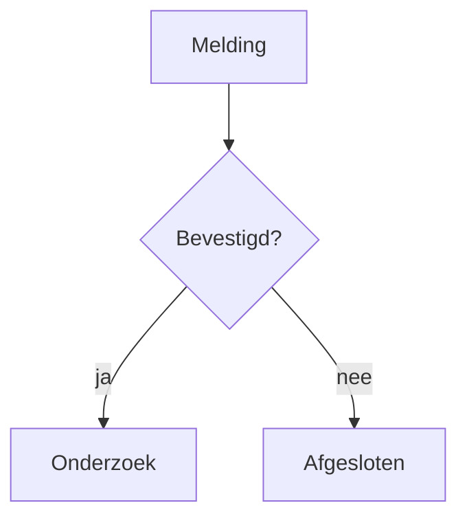

> 🤖 Machinevertaling — het Engelse bronbestand is leidend.
>
> _Machine translation — the English source document is authoritative. _

# OciDeck — Bestandsformaat

> **Status:** specificatie van het bestandsformaat op schijf — het stabiele contract · **Status laatst nagekeken:** 2026-08-19 · **Uitgegeven door:** Stichting LibreKAT

## Inhoud

- [1. Indeling van de projectmap](#1-indeling-van-de-projectmap)
- [2. Markdown-structuur in één oogopslag](#2-markdown-structuur-in-n-oogopslag)
- [3. Front matter](#3-front-matter)
- [4. Slideklassen en gedrag](#4-slideklassen-en-gedrag)
- [5. Markdown-weergave per slidetype](#5-markdown-weergave-per-slidetype)
- [6. Sidecars en losse data](#6-sidecars-en-losse-data)
- [7. Draagbaar pakket (`.ocideck`)](#7-overdraagbaar-pakket-ocideck)
- [8. Bijzondere commentaren per slide (overzicht)](#8-bijzondere-per-slide-commentaren-overzicht)
- [9. Rondgang en compatibiliteit](#9-round-trip-en-compatibiliteit)
- [10. Markdown-modus en syntaxiscontrole](#10-markdown-modus-en-syntaxiscontrole)
- [11. Exportmetadata (niet in `.md`)](#11-exportmetadata-niet-in-md)
- [12. Redactiemanifest-bestanden (naast een export)](#12-redactie-manifestbestanden-naast-een-export)
- [13. Aanvaarde bestanden en hun grenzen](#13-geaccepteerde-bestanden-en-hun-grenzen)
- [14. Documenten (gewone `.md`, geen deck)](#14-documenten-gewone-md-geen-deck)

*(Toegevoegd 2026-07-22: dit document had geen andere ingang dan scrollen. In de app heeft de documentatielezer volledige zoekfunctie; op de repository-pagina niet. De noot gaf vroeger een regelaantal — ongeveer 2.253 — dat stilletjes was doorgegroeid naar ruwweg 3.280 op 2026-08-16; een getal dat niemand bijwerkt kun je beter weglaten dan verkeerd laten staan.)*

OciDeck slaat presentaties op als **standaard [Marp](https://marp.app/)-Markdown**
(`.md`). Er is geen eigen binair formaat: een opgeslagen presentatie is *ontworpen*
om rechtstreeks te worden verwerkt met de Marp CLI of de VS Code Marp-extensie. *(Gecorrigeerd
2026-08-27: hier stond dat compatibiliteit "niet getoetst was tegen de echte
gereedschappen". Dat is nu wel het geval — een gepinde, repo-eigen echte-Marp-controle
(`tool/marp-check`, `make check-marp`) rendert een minimaal split-fixture met de
echte Marp CLI en stelt dat de `section.split`-lay-out overleeft in DOM/CSS en een
schermafbeelding, ook na verhuizen van de map en op paden met spaties. De
geverifieerde aanroep is `marp deck.md -o out.html` **uitgevoerd vanuit de
projectmap**, waar de opgeslagen `.marprc.yml` het gegenereerde thema registreert
— zie §1. Marp ontdekt een stylesheet naast de deck niet automatisch, dus dat
configbestand is wat de gewone aanroep laat werken; Marp elders draaien of met
`--no-config-file` valt terug op het standaardthema en verliest de split-lay-out,
wat de gedocumenteerde beperking is.)* OciDeck heeft een eigen renderer
op basis van `marked` en bevat Marp Core niet, wat precies de reden is dat de belofte
getoetst moest worden in plaats van beweerd. OciDeck-specifieke
informatie wordt weggeschreven op plekken die Marp negeert (front-matter-sleutels en HTML-
commentaren), zodat het bestand volledig Marp-compatibel blijft en toch verliesloos
rondgaat in OciDeck.

Er zijn ook twee afgeleide vormen:

- een **projectmap** rond het `.md`-bestand met gekopieerde assets, en
- een **draagbaar pakket** (`.ocideck`, een zip-bestand) om een presentatie als
  één bestand uit te wisselen.

---

## 1. Indeling van de projectmap

Bij het opslaan (`Save` / `Save as...`) schrijft OciDeck meer dan alleen het `.md`-bestand: het
maakt er ook een vaste mapstructuur naast en kopieert alle gebruikte assets
daarheen. Paden in de Markdown zijn dan **relatief** ten opzichte van de map met het
`.md`-bestand.

```
my_presentation/
├── My_presentation.md              # the presentation (Marp Markdown)
├── .marprc.yml                     # Marp CLI-config: registreert het thema (zie §1.1)
├── My_presentation.ink.json        # annotation-layer sidecar (see §6.2)
├── My_presentation.user-notes.json # user-notes sidecar (see §6.3)
├── My_presentation.miauw.json      # MIAUW-disposition sidecar (see §6.5)
├── My_presentation.seal.json       # seal + signature sidecar (see §6.6)
├── images/                         # copied images
│   ├── photo.png
│   └── .ocideck_captions.json      # caption sidecar (see §6.1)
├── data/                           # linked chart data files (see §6.4)
│   └── revenue.json
├── logos/                          # copied logo from the style profile
│   └── logo.png
├── media/                          # video/audio, created on save (see §7)
└── themes/
    └── ocideck.css                 # generated theme CSS (see §5)
```

### 1.1 Marp CLI-config (`.marprc.yml`)

Marp CLI ontdekt een stylesheet naast de deck **niet** automatisch — alleen
`themes/ocideck.css` naast de `.md` zetten is niet genoeg voor een gewone
`marp deck.md` om het te laden. OciDeck schrijft daarom een `.marprc.yml` naast
de `.md` die het gegenereerde thema via Marp's standaard `themeSet`-optie
registreert:

```yaml
themeSet:
  - themes/ocideck.css
```

Met dat bestand aanwezig laadt de gedocumenteerde aanroep — **uitgevoerd vanuit
de projectmap** — het thema zonder extra vlaggen:

```sh
marp deck.md -o out.html
```

Het pad in `.marprc.yml` is relatief, dus verhuizen of hernoemen van de
projectmap breekt de thema-ontdekking niet. De beperking is eerlijk: draai Marp
elders, of met `--no-config-file`, dan valt het terug op zijn standaardthema en
gaat de `section.split`-tweekolomslay-out verloren. Dit is geverifieerd door een
gepinde echte-Marp-controle (`tool/marp-check`, `make check-marp`). *(Toegevoegd
2026-08-27, #1804.)*

> De `.md`-bestandsnaam wordt afgeleid van de presentatietitel: niet-alfanumerieke
> tekens worden verwijderd en spaties worden `_`.

**Vóór de eerste keer opslaan** is er nog geen projectmap, dus een ingevoegde afbeelding
of video wordt gekopieerd naar een **tussenmap** per sessie onder de tijdelijke map
van het besturingssysteem, met dezelfde indeling (`images/`, `media/`). De bytes zijn daardoor
veilig vanaf het moment dat je ze invoegt — het verplaatsen of hernoemen van het origineel breekt
het deck niet meer — en de gewone kopie bij het opslaan verplaatst ze naar de projectmap
omdat de indeling al klopt. Tot dan markeert de editor zo'n asset als *nog niet opgeslagen*.

De tussenmap is opruimwerk, geen opslag: bij het opstarten verwijdert OciDeck
sessiemappen waar niets aan is geraakt gedurende dezelfde periode dat herstelbestanden worden
bewaard (7 dagen), zodat intensief gebruik zonder opslaan niet stilletjes opstapelt. De twee
periodes delen bewust één constante — een hersteld concept verwijst naar zijn oude sessiemap,
dus de tussenmap mag nooit worden geleegd voordat het herstel dat is.

Wanneer een kopie op een naam terecht zou komen die al bezet is, wordt het bestaande bestand
alleen hergebruikt als de inhoud byte-identiek is; anders krijgt de nieuwkomer een
genummerd achtervoegsel (`screenshot_2.png`). Twee verschillende afbeeldingen die toevallig
een bestandsnaam delen, blijven daardoor twee afbeeldingen.

De mappen `images/`, `logos/`, `themes/` (en `node_modules/`, `build/`,
`.git/`, `.dart_tool/`) worden overgeslagen wanneer OciDeck een map doorzoekt op
presentaties.

> **Beveiliging — assetpaden blijven binnen de projectmap.** Omdat een
> `.md` uit een onvertrouwde bron kan komen, wordt elke assetverwijzing
> (``-afbeeldingen, `logoPath`, video/audio, grafiek-`source`) strikt
> binnen de projectmap opgelost. Absolute paden en `../`-uitbraken worden
> genegeerd bij het bekijken, presenteren, exporteren of analyseren van een deck — een
> deck kan geen bestanden elders op schijf lezen. Zie `SECURITY.md` →
> *Onvertrouwde decks verwerken*.

> Naast het `.md`-bestand schrijft OciDeck **sidecars** die bewust geen deel uitmaken
> van de Marp-Markdown (zodat de `.md` schoon en uitwisselbaar blijft): de
> annotatielaag (`<name>.ink.json`, §6.2), gebruikersnotities
> (`<name>.user-notes.json`, §6.3), bijschriften (`.ocideck_captions.json`, §6.1),
> gekoppelde grafiekdata (`data/*.json`, `data/*.csv`, §6.4), de MIAUW-
> dispositie (`<name>.miauw.json`, §6.5) en het documentzegel plus de zichtbare
> handtekening (`<name>.seal.json`, §6.6).

> **Geen base64 in de `.md`.** Sinds 0.1.0 is niets wat OciDeck in een
> presentatiebestand schrijft ondoorzichtig. Alles wat onleesbaar is voor een mens, of
> *over* het document gaat in plaats van er deel van uit te maken, staat in een sidecar
> ernaast. Wat als HTML-commentaar in de Markdown achterblijft, is platte tekst die een
> lezer kan begrijpen en bewerken (`tlp`, `skip`, `advance`, `ocideck_bullet_marker`,
> `ocideck_image_focus`, `ocideck_title_text_color`, …). De belofte die dit
> waarmaakt: iemand met alleen een teksteditor en Marp kan blijven werken. Zie §3.6
> voor wat is verplaatst en waarheen.

---

## 2. Markdown-structuur in één oogopslag

```markdown
---
marp: true
theme: ocideck
paginate: true
... (other metadata) ...
---

<!-- _class: title -->

# First slide

---

<!-- _class: ... -->

(second slide)
```

- Het document begint met **YAML-front-matter** tussen `---`-regels (§3).
- Slides worden gescheiden door een regel die exact `---` bevat. Een `---`-regel **binnen
  een afgebakend codeblok** (```` ``` ```` of `~~~`) is code-inhoud, geen
  scheiding, zodat een codevoorbeeld, diff-fragment of ingebed YAML-document dat
  `---` bevat de slide niet meer splitst.
- Elke slide kan optioneel beginnen met een `<!-- _class: ... -->`-regel die
  het slidetype en gedrag bepaalt (§4).

---

## 3. Front matter

### 3.0 Het formaatcontract

Vier regels beheersen de front matter. Ze staan opgeschreven omdat een bestand
de build overleeft die het schreef, en omdat de laatste ervan een belofte is aan
toekomstige versies van OciDeck in plaats van aan de lezer.

**1. Sleutels die OciDeck niet kent, blijven behouden.** Bij het opslaan genereert
OciDeck de front matter niet opnieuw — het werkt de regels bij die er al stonden. De
sleutels die het bezit (elke sleutel in de tabel hieronder, `marp` inbegrepen) worden
vervangen, verwijderd of toegevoegd; **elke andere regel blijft precies waar hij stond**,
inclusief `#`-commentaren, lege regels, ingesprongen blokken, de oorspronkelijke volgorde
en de oorspronkelijke aanhalingstekens. Een met de hand geschreven sleutel die OciDeck
niet bezit, zoals `size:` of `style:`, overleeft daardoor een OciDeck-opslag
ongewijzigd. De vijf ondersteunde visuele Marp-sleutels (`color`,
`backgroundColor`, `backgroundImage`, `header`, `footer`) zijn wél eigendom van
OciDeck: de app leest ze in het deckmodel en schrijft hun actuele waarde terug in
standaard Marp-syntaxis. Hun betekenis blijft behouden, maar hun oorspronkelijke
scalar-notatie of aanhalingstekens hoeven dat niet. *(Gecorrigeerd 2026-08-10:
deze sleutels werden eigendom toen OciDeck ze ging bewerken en synchroniseren.)*
De implementatie
staat in `lib/services/front_matter_merge.dart`; de eigen sleutels staan daar in één lijst,
die ook de markdown-controle (§10) leest.

Twee grenzen zijn het weten waard. Alleen sleutels op kolom 0 tellen als sleutels — een
ingesprongen `key: value` wordt gelezen als de binnenkant van het blok erboven, en dat
houdt een genest `style: |`-blok intact. En een sleutel die OciDeck *wél* bezit, wordt
vervangen samen met alle regels die eronder zijn ingesprongen, want die laten staan zou
front matter opleveren die geen geldige YAML meer is.

**2. `ocideck_format` is de formaatversie.** Eén monotoon oplopend geheel
getal, geen `major.minor`: de enige vraag die beantwoord moet worden is "is dit bestand ouder
dan ik?". Een bestand **zonder** de sleutel is versie 1 — dat is de normale toestand
van elk met de hand geschreven Marp-bestand, nooit een fout, en een onleesbare waarde wordt
om dezelfde reden als versie 1 gelezen.

**3. Een lezer verlaagt de versie nooit en werkt bij het openen nooit bij.** Als deze
build `ocideck_format: 2` leest, schrijft hij `2` terug, niet `1` — anders zou het bestand
na één keer opslaan over zichzelf liegen. Dat is alleen veilig omdat regel 1 de sleutels
van die nieuwere versie op hun plek houdt. Bijwerken gebeurt **bij het opslaan, nooit bij
het openen**: naar andermans bestand kijken mag het niet veranderen. Dit is het bestaande
beleid "migreren bij lezen, vastleggen bij eerste schrijven" — zie
[MIGRATION_GUIDE.md](MIGRATION_GUIDE.md) en §6.4. Een ouder bestand opent altijd
en wordt nooit alleen-lezen gemaakt.

**4. De betekenis van een bestaande sleutel verandert nooit.** Een gewijzigde betekenis krijgt een
nieuwe sleutel. Dit is de voorwaarde die "sla over wat je niet kent" voor altijd veilig
maakt: een lezer die een onbekende sleutel negeert, moet erop kunnen vertrouwen dat de
sleutels die hij *wél* herkent nog steeds betekenen wat ze betekenden. Een sleutel hernoemen
of een andere functie geven zou elke oudere build stilletjes breken, en dat is de ergste
manier om iets te breken.

**De versieregel zit binnen het zegel, omdat het zegel over het bestand gaat.**
Sinds 0.1.0 hasht het zegel de bytes van de `.md` (§6.6), en `ocideck_format` is
een van die bytes. Een build die een hogere versie schrijft, verandert daardoor het
bestand en verbreekt het zegel. Dat is bewust streng en het is het eerlijke
antwoord — het bestand *is* veranderd — maar het bijt alleen als iets een verzegeld
deck herschrijft, en OciDeck doet dat niet: een afgerond deck is alleen-lezen, dus niets in
de app leidt tot een opslag. Een toekomstige formaatopwaardering moet verzegelde decks
overslaan, of aanvaarden dat ze opnieuw worden uitgegeven; er stilletjes een herschrijven en
het resultaat intact noemen is precies wat dit ontwerp weigert. (Vóór 0.1.0 werd de versie
uitgesloten van de hash, omdat de hash over een canonicalisatie ging in plaats van over
het bestand. Zie §6.6 voor waarom dat veranderd is.)

| Sleutel | Type | Betekenis |
| --- | --- | --- |
| `marp` | `true` | Vaste Marp-markering. |
| `ocideck_format` | int | De formaatversie van dit bestand (§3.0). Afwezig betekent versie 1. Wordt bij opslaan geschreven; nooit verlaagd. |
| `title` | string | Decktitel. Wordt geschreven en gelezen; ook gebruikt als de documenttitel bij export. |
| `theme` | string | Themanaam; standaard `ocideck`. Verwijst naar `themes/<theme>.css`. |
| `paginate` | `true`/afwezig | Alleen geschreven wanneer paginering is ingeschakeld. |
| `color` | Marp-/CSS-kleur/afwezig | Deckbrede tekstkleur. Een expliciet lege scalar verschilt van een afwezige sleutel. |
| `backgroundColor` | Marp-/CSS-kleur/afwezig | Deckbrede achtergrondkleur. Een expliciet lege scalar verschilt van een afwezige sleutel. |
| `backgroundImage` | string/afwezig | Deckbrede achtergrondafbeelding in standaard Marp-/CSS-vorm. |
| `header` | Markdown-string/afwezig | Deckbrede koptekst, gerenderd als inline Markdown. |
| `footer` | Markdown-string/afwezig | Deckbrede voettekst, gerenderd als inline Markdown. |
| `author` | string | Auteur. |
| `organization` | string | Organisatie. |
| `version` | string | Versie. |
| `date` | string | Datum (vrije tekst). |
| `description` | string | Beschrijving. |
| `keywords` | string | Trefwoorden. |
| `language` | string | De taal waarin het rapport is geschreven, als taalcode (`nl`, `en`, …). Dit is de taal van het **rapport**, niet de interfacetaal: een Nederlandse tester die voor een internationale klant schrijft, levert een Engelstalig rapport vanuit een Nederlandse interface. Alleen geschreven wanneer vastgelegd. Bevindingen tonen hun sectiekoppen erin, terwijl de Markdown zijn stabiele Engelse ankers behoudt (§4.x / PENTEST_MIAUW §12.3), en het vastleggen ervan voldoet aan MIAUW EIS 2.3. |
| `standards` | string | Standaarden waartegen de test is uitgevoerd, kommagescheiden als `name@version` (bijv. `OWASP WSTG@4.2`). MIAUW EIS 4.3.2. De **versie is hier bewust bevroren**: een rapport is een vastlegging van wat daadwerkelijk is gebruikt, dus het heropenen in een build die een nieuwere standaard meelevert, mag de nieuwe versie niet stilletjes herformuleren. |
| `tool` | string | Eén **per regel, herhaald**, als `name@version \| url \| description` (bijv. `Burp Suite@2026.4 \| https://portswigger.net \| Web proxy`). De gereedschappen die tijdens de test zijn gebruikt — MIAUW EIS 4.8.2 (.1 beschrijving, .2 versie, .3 openbare verwijzing). Een andere lijst dan `standards`: dit zijn de gereedschappen van de tester, niet de standaarden waartegen is getest. Alleen de naam is verplicht; de rest kan later worden ingevuld. |
| `tlp` | enum | Traffic Light Protocol-niveau (§3.1). Alleen geschreven wanneer niet `none`. |
| `ocideck_target_seconds` | int | Doelduur voor het aftellen van de presentator, in seconden. Alleen geschreven wanneer `> 0`. |
| `ocideck_show_rehearsal_summary` | `false`/afwezig | Afmelden voor de tijdsamenvatting na de presentatie. Standaard (getoond) blijft uit het bestand; alleen `false` wordt geschreven. Wordt overschreven door `ocideck_play_only`: een alleen-afspelen-deck toont de samenvatting nooit, wat deze sleutel ook zegt. |
| `ocideck_play_only` | `true`/afwezig | Alleen-afspelen-vergrendeling. Wanneer `true`, opent het deck vergrendeld: geen editor, werkbalk, menu's of export — alleen de eerste slide met een afspeelknop, schermvullend gepresenteerd. Het deck sluiten herstelt het normale bewerken. Standaard (ontgrendeld) blijft uit het bestand; alleen `true` wordt geschreven. Deze sleutel verwijderen ontgrendelt het deck. |
| `ocideck_improvement_framework` | string/afwezig | Procesverbeteringskader voor dit deck: `dmaic`, `dmadv`, `kaizen`, `a3` of `8d`. Leeg/afwezig = niet ingesteld. |
| `ocideck_improvement_y01` | string/afwezig | Vrije-tekstnaam/-beschrijving van de primaire Y-metriek (**Y-01**). Leeg/afwezig = niet ingesteld. |
| `ocideck_improvement_y01_unit` | string/afwezig | Eenheid voor Y-01 (bijv. `days`). Leeg/afwezig = niet ingesteld. |
| `ocideck_improvement_y01_usl` | number/afwezig | Bovenste specificatielimiet voor Y-01. Grafieken met `"yRef": "Y-01"` lossen dit op bij het tekenen — het wordt niet gekopieerd naar de grafiek-JSON. |
| `ocideck_improvement_y01_lsl` | number/afwezig | Onderste specificatielimiet voor Y-01. Zelfde opgelost-bij-tekenen-regel als USL. |
| `ocideck_improvement_y01_target` | number/afwezig | Procesdoel voor Y-01. |
| `ocideck_improvement_y01_baseline` | number/afwezig | Basislijnwaarde voor Y-01 (projectcharter). |
| `ocideck_improvement_y01_goal` | number/afwezig | Doelwaarde voor Y-01 (projectcharter). |

**Migratie (Y-01).** Een deck dat alleen `ocideck_improvement_y01` heeft (naam, geen
limietsleutels) blijft voor altijd geldig; ontbrekende limietsleutels betekenen `null`.
Grafieken die lokale `usl`/`lsl` opslaan zonder `yRef` blijven die lokale waarden
gebruiken. `yRef: "Y-01"` instellen is opt-in (of de standaard voor *nieuwe*
histogram-/regelkaarten wanneer het deck al Y-01-limieten heeft). Een bestand openen
herschrijft nooit stilletjes grafiek-JSON.

| Sleutel | Type | Betekenis |
| --- | --- | --- |
| `ocideck_style_profile` · `ocideck_miauw_waivers` · `ocideck_miauw_confirmations` · `ocideck_finalized` · `ocideck_seal_hash` · `ocideck_seal_algo` · `ocideck_seal_at` · `ocideck_seal_tsr` · `ocideck_sig_name` · `ocideck_sig_role` · `ocideck_sig_cert` · `ocideck_sig_date` · `ocideck_sig_statement` · `ocideck_sig_typed` · `ocideck_sig_image` | *teruggetrokken* | **Niet meer geschreven** sinds 0.1.0 (§3.6). Nog wel gelezen, zodat een ouder bestand correct opent; bij de volgende opslag uit het bestand verwijderd. De zegel- en handtekeningblokken staan nu in `<name>.seal.json` (§6.6). |

Metadatavelden worden alleen geschreven wanneer ze niet leeg zijn. Tekst wordt geschreven als een
YAML-scalar en alleen tussen aanhalingstekens gezet wanneer dat nodig is (lege waarde, voor-/
achterliggende witruimte, speciale tekens zoals `: # "`, of een YAML-indicator aan het
begin). OciDeck gebruikt bij het lezen geen volledige YAML-parser; het gebruikt een eenvoudige
parser die regel voor regel werkt, dus houd de front matter plat (één sleutel per regel).

De lokale vormen van de vijf visuele Marp-sleutels (`_color`,
`_backgroundColor`, `_backgroundImage`, `_header`, `_footer`) worden uit een
slidecommentaar gelezen en als standaard Marp-syntaxis teruggeschreven. Hun
aanwezigheid wordt los van hun waarde opgeslagen, zodat een expliciet lege lokale
waarde een deckbrede waarde kan onderdrukken in plaats van die per ongeluk te
erven. Een Marp-koptekst of -voettekst is de tekstbron voor OciDecks overlay; er
ontstaat geen tweede concurrerende voettekst. Inline Markdown wordt in beide
gerenderd.

Andere front-matter-sleutels — een typefout of een Marp-optie die OciDeck niet
implementeert, zoals `size` of `style` — hebben geen effect binnen OciDeck maar
blijven **bij opslaan behouden**. Ook een onbekende bodydirective blijft
letterlijk behouden; de controle legt uit dat die als bron bewerkbaar blijft in
plaats van te beweren dat hij wordt genegeerd. Gewone prozacommentaren blijven
presentatienotities.

### 3.6 Teruggetrokken sleutels — wat de front matter verliet, en waar het heen ging

Vijftien sleutels verlieten de front matter in 0.1.0. Geen ervan wordt nog geschreven.
Ze worden nog wel **gelezen**, zodat een bestaand bestand precies als voorheen opent, en ze
worden **bij de volgende opslag uit het bestand verwijderd** — het deck wordt in de
nieuwe vorm teruggeschreven zonder dat de auteur iets doet.

| Teruggetrokken sleutel | Waar het nu staat |
| --- | --- |
| `ocideck_style_profile` | Om te beginnen nooit op schijf; alleen in de tijdelijke beamerstroom. Reist nu naast die markdown als platte JSON (§3.2). |
| `ocideck_miauw_waivers` | `<name>.miauw.json`, sleutel `waivers` (§6.5). |
| `ocideck_miauw_confirmations` | `<name>.miauw.json`, sleutel `confirmations` (§6.5). |
| `ocideck_finalized` · `ocideck_seal_hash` · `ocideck_seal_algo` · `ocideck_seal_at` · `ocideck_seal_tsr` | `<name>.seal.json` (§6.6). |
| `ocideck_sig_name` · `ocideck_sig_role` · `ocideck_sig_cert` · `ocideck_sig_date` · `ocideck_sig_statement` · `ocideck_sig_typed` · `ocideck_sig_image` | `<name>.seal.json`, sleutel `signature` (§6.6). |

Twee hiervan droegen base64 (`ocideck_seal_tsr` is een DER-tijdstempeltoken,
`ocideck_sig_image` een PNG), wat op zichzelf al reden genoeg is. Maar het zegelblok
had een tweede, grotere reden om te verhuizen: zolang het zegel *binnen* het
bestand stond, kon de hash geen hash *van* het bestand zijn. Het eruit halen is wat
de integriteitscontrole reproduceerbaar maakte voor een derde partij — zie §6.6.

**Een verzegeld deck migreren.** Een deck dat vóór 0.1.0 is verzegeld, opent normaal, zijn zegel
verifieert nog steeds, en zijn zegelblok verhuist bij de eerste opslag naar `<name>.seal.json`.
Wat **niet** gebeurt, is een herberekening: de sidecar legt de oude hash vast samen met
`"form": "canonical-v1"`, en OciDeck blijft het op de oude manier verifiëren. Die hash
opnieuw uitgeven zou elk RFC 3161-token dat het rapport draagt ongeldig maken — het token
voorziet precies die waarde van een tijdstempel — en een echte notarisatie is
meer waard dan het gemak van één uniform formaat.

De verwijdering is wat dit tot een migratie maakt in plaats van een hernoeming. In
`front_matter_merge.dart` verdwenen deze sleutels niet zomaar uit de eigen lijst — ze
verhuisden naar een tweede lijst, `kRetiredFrontMatterKeys`. Een sleutel op
*geen van beide* lijsten valt onder regel 1 hierboven ("sleutels die OciDeck niet kent, blijven behouden")
en zou voor altijd in het bestand blijven staan. Op de teruggetrokken lijst staan betekent het tegenovergestelde:
de regel wordt bij opslaan weggelaten en nooit teruggeschreven. De markdown-controle (§10)
kent ze ook, dus die meldt ze niet als onbekende sleutels.

### 3.1 TLP-niveaus

Opgeslagen onder de `tlp`-sleutel met deze stabiele waarden:

| `tlp`-waarde | Slidemarkering |
| --- | --- |
| `none` *(niet geschreven)* | — |
| `clear` | `TLP:CLEAR` |
| `green` | `TLP:GREEN` |
| `amber` | `TLP:AMBER` |
| `amber+strict` | `TLP:AMBER+STRICT` |
| `red` | `TLP:RED` |

**Effectieve markering.** In de app toont elke slide het **strengste** niveau: het
maximum van de TLP op deckniveau (`tlp` in de front matter) en de TLP per slide
(`<!-- tlp: ... -->`). Dat bepaalt de banner, badge en optioneel watermerk
in het voorbeeld, de presentator en de rasterexport. Het wordt niet als extra Markdown
opgeslagen; het wordt tijdens het renderen berekend (`effectiveTlp` in `lib/models/deck.dart`).

**Zichtbaarheid versus exportpoort.** De TLP per slide bepaalt welke slides worden
tegengehouden tijdens presenteren/exporteren (`slideVisibleAtTlp`). De **exporthandhaving**
(plafond, minimum, verplichte classificatie) kijkt alleen naar het deckbrede `tlp`-
veld in de front matter, niet naar niveaus per slide.

### 3.1b Privacydispositie — `privacy:` / `<!-- ocideck_privacy: … -->`

Wat er met privacybevindingen gebeurt. Vier stabiele waarden: `warn` (de standaard, nooit
geschreven), `accept`, `shield`, `redact`.

```markdown
---
marp: true
theme: ocideck
privacy: accept
---

# Suspect

<!-- ocideck_privacy: redact -->
```

**Een slide overheerst het deck** — bewust anders dan bij `tlp`, waar het strengere
niveau wint. Een deck op `accept` (de hele briefing is bekend) met één slide op
`redact` (dit ene detail is voor niemand) moet werken; de auteur van die slide weet
het het beste. `effectivePrivacyDisposition` in `lib/models/privacy_disposition.dart`.

`shield` toont een **PERSOONSGEGEVENS**-badge op de slide, naast de TLP-markering,
en rastert net als elke andere overlay mee in PDF/PPTX. `redact` vervangt elke
gedetecteerde waarde door blokken in alles wat wordt gerenderd of geëxporteerd — zie §3.1a;
de Markdown op schijf blijft hoe dan ook ongemoeid.

Merk op dat `redact` wordt gehonoreerd **ongeacht de instelling "waarschuw voor mogelijke
persoonsgegevens"**. Die instelling beheert waarschuwingen, niet redactie: anders zou het dempen
van de meldingen stilletjes ook de redactie stopzetten.

### 3.1c Kwaliteitsdispositie — `<!-- ocideck_quality: … -->`

Wat er met de kwaliteitsbevindingen op een slide gebeurt. Twee stabiele waarden: `warn` (de
standaard, nooit geschreven) en `accept`.

```markdown
# Cover image

<!-- ocideck_quality: accept -->
```

`accept` zegt *zo is de slide bedoeld*: een titelafbeelding die
bewust zacht contrasteert, een tabel die echt zoveel rijen heeft. De
bevindingen verdwijnen niet — de miniatuurbadge wordt grijs en de exportpoort
telt ze niet meer mee, maar ze blijven leesbaar. Aanvaarden mag geen manier worden om te
verbergen.

**Alleen op slideniveau; er is geen deckbrede tegenhanger.** Anders dan bij `privacy:` is een
deck dat in één keer elke contrastfout aanvaardt geen oordeel over de
inhoud maar een schakelaar, en die schakelaar bestaat al onder *Instellingen → Algemeen*.
Een kwaliteitsoordeel gaat over *deze* slide.

Een niet-herkende waarde valt terug op `warn`, niet op `accept`. Een deck geschreven door een
nieuwere OciDeck mag een oudere nooit stilletjes bevindingen laten onderdrukken die hij niet
begrijpt; in het ergste geval maakt de auteur de keuze opnieuw.

### 3.1a Redactiemarkeringen — `[[…]]`

Tekst tussen dubbele blokhaken wordt **geredigeerd**: vervangen door een vaste reeks
`█` in alles wat het deck rendert of exporteert.

```markdown
The suspect, [[Jan de Vries]], was arrested at [[Kalverstraat 12]].
```

Het is inline lopende tekst, geen directive, dus het heeft geen ontsnappingsregel nodig en
gaat ongewijzigd door parse/generate heen. De reguliere expressie is
`\[\[([^\[\]]*)\]\]` — geen geneste haken, zodat een gewone Markdown-link
(`[text](url)`) er nooit op matcht.

**De markering blijft in het bestand.** Redactie wordt toegepast door `PrivacyProjection`
(`lib/services/privacy/privacy_projection.dart`) op de grens tussen het
brondeck en elk ontvangend oppervlak — voorbeeld, presentator, publieksvenster,
rasteraar (PDF/PPTX), HTML, presentatienotities en documentmetadata. De Markdown
op schijf wordt nooit herschreven, zodat dezelfde bron een volledige versie en een
geredigeerde versie kan opleveren.

**De vervanging heeft een vaste breedte** (8 blokken) ongeacht de oorspronkelijke
lengte. De lengte spiegelen zou de lezer vertellen wat voor soort waarde is
verwijderd en hoe lang die was, wat voor korte gestructureerde waarden (een BSN, een telefoon-
nummer) ongemakkelijk dicht bij reconstrueerbaar komt.

Twee gevolgen die het weten waard zijn:

- Een slide met een redactie heeft `tableEditable` in de
  projectie geforceerd uit. De presentator schrijft een live tabelbewerking terug als een hele slide, en
  die zag alleen ooit de blokken.
- Redactie dekt slidevelden (titel, ondertitel, opsommingstekens, kolomtitels,
  bijschriften, alt-tekst, citaten, vrije Markdown, tabelcellen, de checklistscope,
  **presentatienotities**) en elk deckveld dat de scanner leest: titel, auteur,
  organisatie, beschrijving, trefwoorden, versie, datum, gebruikte standaarden, gebruikte gereedschappen,
  en de twee MIAUW-motiveringskaarten (waivers en confirmations). De laatste zes
  werden gescand maar niet geredigeerd tot 2026-07-21, waardoor de exportpoort
  een bevinding meldde die *Redact* niet kon opheffen terwijl de waarde nog
  meereisde. Media wordt anders behandeld: op een geredigeerde slide wordt de hele afbeeldings-,
  video- of audioverwijzing weggelaten in plaats van zwartgemaakt, omdat een pad
  met blokken erin een kapotte verwijzing is.
- Redactie dekt bewust **niet** `userNotes` — dat zijn de eigen
  sidecarnotities van de ontvanger, ze bereiken geen exportartefact, en ze projecteren
  zou de presentator blokken over iemands eigen aantekeningen laten schrijven.

### 3.2 Het stijlprofiel

**Geen enkel bestand bevat ooit het stijlprofiel.** Vormgeving wordt bewust buiten
de `.md` gehouden: het bestand bevat inhoud, en de app past het actieve stijlprofiel
toe wanneer het het deck opent. Vormgeving reist als `themes/<theme>.css` en de app's
eigen profiel; een losstaand profiel kan worden uitgewisseld als `.ocideckstyle` (§9).

Tot 0.1.0 was er één uitzondering: de tijdelijke markdown die naar het
publieksvenster (beamer) werd gestreamd, droeg het profiel als `ocideck_style_profile`,
base64url-gecodeerd, omdat dat venster geen andere manier heeft om de vormgeving te leren kennen.
Het reist nu **naast** die markdown, als platte JSON in het `styleProfile`-
veld van het openingsbericht van het venster. Dat was het laatste in OciDeck dat
base64 in een Markdown-document kon zetten.

Een bestand dat de oude sleutel nog draagt, opent prima — de sleutel wordt gewoon genegeerd,
en bij de volgende opslag verwijderd (§3.6). Het profiel zelf is JSON met
deze velden (met standaardwaarden):

| Veld | Standaard | Betekenis |
| --- | --- | --- |
| `name` | `"Standaard"` | Profielnaam. |
| `slideBackgroundColor` | `#FFFFFF` | Achtergrond voor normale slides. |
| `textColor` | `#222222` | Tekstkleur. |
| `accentColor` | `#2E7D64` | Accent (opsommingsmarkering, tabelranden/-koptekst). |
| `checklistCheckedColor` | `#2E7D64` | Vinkkleur van een afgevinkt checklist-item. |
| `checklistUncheckedColor` | `#64748B` | Vakkleur van een niet-afgevinkt checklist-item. Haalt 4,8:1 op de standaard witte achtergrond en blijft boven 3:1 op een donkere, zodat het vakje zichtbaar is hoe de auteur zijn dia ook zet. *(Was `#CBD5E1` tot 2026-08-27; met 1,5:1 zakte dat door OciDecks eigen 3:1-ondergrens, waardoor elk deck met een checklist opende op een waarschuwing waar de auteur niets aan kon doen — #1818.)* |
| `checklistStrikeThrough` | `true` | Zet de tekst van een afgevinkt item door. |
| `bulletMarker` | `dot` | Standaardmarkering voor opsommingslijsten: `dot` of `paw` (een kattenpoot getekend in de accentkleur). Een slide kan die overschrijven (zie §8). |
| `tableTextColor` | = `textColor` | Tekstkleur in tabellen. |
| `tableHeaderTextColor` | `#FFFFFF` | Tekstkleur van tabelkoptekst. |
| `tableHeaderBackgroundColor` | = `accentColor` | Achtergrond van de koprij. |
| `tableBorderStyle` | `boxed` | **Documenten.** Randvorm: `lined` (alleen horizontale lijnen, booktabs-achtig), `boxed` (elke cel omkaderd) of `none` (witruimte en kopvulling dragen de tabel). |
| `tableBorderColor` | `#CBD5E1` | **Documenten.** Randkleur voor de stijlen die een rand tekenen. |
| `tableZebraStriped` | `false` | **Documenten.** Om en om een achtergrondkleur per rij. |
| `tableZebraColor` | `#F1F5F9` | **Documenten.** De afwisselende rijkleur, gebruikt als `tableZebraStriped` aanstaat. |
| `tableCellPaddingPx` | `8.0` | **Documenten.** Celopvulling in px. |
| `tableAccentHeaderBorder` | `false` | **Documenten.** Trek een extra lijn in de accentkleur onder de koprij. |
| `titleBackgroundColor` | `#1C2B47` | Achtergrond van titelslide. |
| `titleTextColor` | `#FFFFFF` | Tekst op titel-/sectieslides. |
| `sectionBackgroundColor` | `#2E7D64` | Achtergrond van sectieslide. |
| `codeBackgroundColor` | `#282C34` | Achtergrond van broncodeslide. |
| `codeTextColor` | `#ABB2BF` | Tekstkleur van broncodeslide. |
| `codeHighlightSyntax` | `true` | Syntaxiskleuring aan/uit. Uit = alles in één kleur (bijvoorbeeld groen op zwart voor een CRT-look). |
| `codeFontFamily` | `monospace` | Lettertypefamilie voor broncodeslides (bijvoorbeeld `Courier New`). |
| `logoPath` | `null` | Pad naar het logo (relatief pad in `logos/`). |
| `logoDarkPath` | `null` | Donkere variant van het logo, getoond op donkere dia-achtergronden (#1931). `null` voor gebundelde merk-logo's (die schakelen automatisch). |
| `logoPosition` | `bottom-right` | `top-left`/`top-right`/`bottom-left`/`bottom-right`. |
| `logoSize` | `96` | Logogrootte in px. |
| `documentLogoPath` | `null` | Afwijkend documentlogo. `null` deelt `logoPath`; `""` schakelt het logo voor documenten bewust uit. |
| `documentLogoPosition` | `top-right` | Positie van het effectieve documentlogo in de kop- of voettekst. |
| `documentLogoSize` | `null` | Breedte van het documentlogo in px (`32`–`480`). `null` volgt `logoSize`. |
| `documentBodyFontSize` | `11` | Basisgrootte van de broodtekst van een document, in typografische punten (`9`–`28`) — dezelfde eenheid als de PDF. Koppen, voetnoten en tijdlijnkaarten zijn verhoudingen daarvan. De visuele editor, de lezer, de pagina-eindeberekening en de HTML-export zetten die puntmaat om naar CSS-pixels met 96/72 (dus 11 pt op het scherm is dezelfde fysieke maat als 11 pt in de PDF). Een dia blijft onaangetast: die schaalt haar tekst naar het 16:9-kader. |
| `documentHeaderText` | `""` | Herhalende meerregelige documentkop met inline Markdown. |
| `documentFooterText` | `""` | Herhalende meerregelige documentfooter met inline Markdown. |
| `documentHeadingColor` | `null` | Kleur van de koppen van een document, alle niveaus. `null` houdt de verdeling die er altijd was: een hoofdstukkop volgt `textColor`, een subkop `accentColor`. |
| `documentBandTextColor` | `null` | Tekstkleur van kop en footer. `null` volgt `textColor`. |
| `documentBandBackgroundColor` | `null` | Achtergrondkleur van kop en footer. `null` volgt `slideBackgroundColor`. |
| `documentShowPageNumbers` | `false` | Toon het paginanummer rechtsonder op documentpagina's. |
| `fontFamily` | `Arial` | Lettertypefamilie van de presentatie. |
| `footerText` | `""` | Vrije voettekst; tokens: `{page}`, `{total}`, `{date}`, `{title}`. |
| `footerShowPageNumbers` | `false` | Toon "pagina / totaal" rechtsonder. |
| `footerPosition` | `right` | `left`/`center`/`right`. |
| `closingSlideEnabled` | `false` | Voeg automatisch een afsluitende slide toe tijdens presenteren/exporteren. |
| `closingSlideMarkdown` | `"# Bedankt\n\nVragen?"` | Markdown voor die afsluitende slide. |
| `severityCriticalColor` | `#B91C1C` | Bevindings-/CVSS-kleur voor de band Kritiek. |
| `severityHighColor` | `#EA580C` | Bevindings-/CVSS-kleur voor de band Hoog. |
| `severityMediumColor` | `#D97706` | Bevindings-/CVSS-kleur voor de band Middel. |
| `severityLowColor` | `#15803D` | Bevindings-/CVSS-kleur voor de band Laag. |
| `severityNoneColor` | `#475569` | Bevindings-/CVSS-kleur voor de band Informatief. |

Onbekende of ontbrekende velden vallen terug op standaardwaarden, zodat oudere bestanden schoon migreren.

*(Toegevoegd 2026-08-19: de drie `checklist…`-velden en de zes tabelhuisstijlvelden
voor documenten zaten in het profiel — en dus ook in een `.ocideckstyle` (§3.3) —
maar stonden hier nooit vermeld. De velden met **Documenten** worden alleen door de
documentoppervlakken gelezen: de weergave *Pagina's*, de doorlopende HTML-export en
de LaTeX-export (§14). Een tabeldia van een deck tekent zijn eigen randen en neemt
alleen de kleuren hierboven over.)*

> **Cockpituiterlijk en statuskleuren maken geen deel uit van het stijlprofiel of
> het bestand.** De authentieke/klassieke look en het benoemde *cockpitkleurenschema*
> (good / warning / critical / cold / sky / ground) zijn instellingen op app-niveau,
> globaal gekozen en bij het renderen toegepast. Ze worden bewust buiten
> de deck-`.md` gehouden zodat het bestand pure inhoud blijft. Daardoor kan hetzelfde bewerkbare
> deck de cockpitinstellingen van een andere installatie volgen; een geëxporteerde
> PDF/PPTX/HTML bevriest de keuzes die tijdens die export actief waren.

### 3.3 Losstaand stijlprofiel (`.ocideckstyle`)

Een stijlprofiel reist ook op zichzelf, zodat een profiel gedeeld kan worden zonder een
deck eromheen. Het instellingenvenster exporteert het profiel dat nu in de editor staat
en importeert er een terug (de knoppen naast de profielnaam).

Het bestand is platte UTF-8-JSON — een envelop rond dezelfde profiel-JSON als
§3.2:

```json
{
  "ocideck": "style-profile",
  "version": 1,
  "profile": { "name": "…", "accentColor": "#2E7D64", "…": "…" },
  "logo": { "mime": "image/png", "data": "<base64>" },
  "documentLogo": { "mime": "image/png", "data": "<base64>" }
}
```

| Sleutel | Betekenis |
| --- | --- |
| `ocideck` | Formaatmarkering; moet `style-profile` zijn. De import weigert al het andere, zodat een willekeurige `.json` niet voor een profiel kan worden aangezien. |
| `version` | Envelopversie (momenteel `1`). Een hoger getal wordt geweigerd in plaats van half gelezen. |
| `profile` | Het profiel, precies de veldenset uit §3.2. Onbekende/ontbrekende velden vallen terug op standaardwaarden. |
| `logo` | **Optioneel.** Een ingebed eigen logo. `mime` is informatief — de importeur leidt het type opnieuw af uit de bytes zelf. |
| `documentLogo` | **Optioneel.** Het afzonderlijk ingestelde eigen documentlogo, met dezelfde validatie en grenzen als `logo`. |

De import aanvaardt de extensies `.ocideckstyle` en `.json`. Grenzen: 16 MiB per
bestand, 8 MiB per ingebed logo.

**Hoe het logo reist.** `logoPath` is een lokaal pad en betekent niets voor de
ontvanger, dus het wordt per soort behandeld:

- **Geen logo** (`null`) — niets te doen.
- **Ingebouwd logo** (`asset:…`) — blijft een verwijzing; elke installatie draagt
  dezelfde bundel.
- **Eigen logo** — de afbeeldingsbytes worden als base64 in `logo` ingebed en
  `profile.logoPath` wordt als `null` geschreven. Dit houdt het bestand draagbaar en
  voorkomt dat het lokale pad van de afzender uitlekt (dat hun gebruikersnaam bevat).

`documentLogoPath: null` betekent dat het document `logoPath` deelt; een expliciet
lege string betekent geen documentlogo. Een eigen afwijking reist in `documentLogo`,
zoals het presentatielogo in `logo` reist.

Bij de import worden de ingebedde bytes teruggeschreven naar echte bestanden en wijzen
beide padvelden daarnaar: een `data:`-URI blijft nooit in een van beide paden staan, omdat geen van de
gebruikers (slidevoorbeeld, rasteraar, presentator) er een oplost.

> **Webvoorbehoud.** Op desktop belandt het herstelde logo in een map `style_logos/`
> onder de app-support-map en overleeft het een herstart. Op het web is er geen
> blijvende byte-opslag, dus het logo gaat naar de in-memory-opslag en is
> na een herlaadbeurt weg — het profiel zelf (alle kleuren, lettertypen, voettekst, …) blijft
> intact en alleen het logo valt terug op een tijdelijke aanduiding.

**Beveiliging.** Een geïmporteerd profiel is onvertrouwde invoer en gaat door dezelfde
geharde `ThemeProfile.fromJson`-poort als een profiel uit een deck: kleuren worden
gevalideerd op strikt `#RRGGBB` en lettertypefamilies staan op een witte lijst, omdat deze
waarden bij de export in een `<style>`-blok worden geïnterpoleerd. Een profiel zonder een
ingebedde afbeelding maar *met* een kaal `logoPath` krijgt dat pad geschrapt — het wijst naar
de schijf van de afzender en zou toch niet oplossen.

---

## 4. Slideklassen en gedrag

Direct na een scheiding kan een slide een klassecommentaar bevatten:

```markdown
<!-- _class: <typeclass> [logo-safe] [no-logo] [no-footer] [custom-classes] -->
```

De eerste klasse bepaalt (samen met de inhoud) het **slidetype**:

| Type | `_class`-token | Detectie zonder token |
| --- | --- | --- |
| Titelpagina | `title` | — |
| Sectiescheiding | `section` | — |
| Twee opsommingskolommen | `two-bullets` | — |
| Opsomming + afbeelding | `split` | opsomming **en** afbeelding aanwezig |
| Citaat | `quote` | een `>`-regel is aanwezig |
| Video | `video` | een `<video>`-tag of een `<iframe class="ocideck-embed">` is aanwezig |
| Tabel | `table` | alleen een tabel, geen kop/opsomming/tekst |
| Broncode | `code` | — |
| Grafiek | `chart` | — |
| Cockpit | `cockpit` | — |
| Vraag | `question` | — |
| Tijdlijn | `timeline` | — |
| Scorekaart | `scorecard` | — |
| Menu (#1162) | `menu` (+ optioneel `menu-list` / `menu-circle`) | — (blokken zijn link-opsommingen; zonder het token wordt het als gewone `bullets` teruggelezen) |
| Assetoverzicht | `assets` | — |
| Ontdekkingen | `discoveries` | — |
| Bevinding | `finding` | — |
| Bevindingensamenvatting | `findings-summary` | — |
| Checklist | `checklist` | — |
| Scopematrix | `scope-matrix` | — |
| Aftekening | `sign-off` | — |
| Matrix (procesverbetering) | `matrix` | Markdown-tabel + `ocideck_template` |
| Canvas (procesverbetering) | `canvas` | Markdown met `##`-regio's + `ocideck_template` |
| Boom (procesverbetering) | `tree` | Geneste opsommingen + `ocideck_template` + `ocideck_layout` |
| Flow (procesverbetering) | `flow` | Opsommingsstappen + `ocideck_template` + `ocideck_layout` |
| Fasepoort (procesverbetering) | `phase-gate` | Poortchecklist als opsomming |
| Beheersmaatregelstatus (managementsysteem) | `control-status` | — (een gewone tabel valt terug op `table`) |
| Gantt (procesverbetering) | `gantt` | — (een gewone tabel valt terug op `table`) |
| Alleen opsomming | *(geen)* | opsomming aanwezig |
| Twee afbeeldingen | *(geen)* | twee achtergrondafbeeldingen |
| Grote afbeelding | *(geen)* | één afbeelding, geen opsomming |
| Vrije Markdown | *(geen)* | geen kop/opsomming/afbeelding/citaat |

> `code`-, `chart`-, `cockpit`- en `question`-slides bevatten afgebakende codeblokken
> die de generieke regelparser in de war zouden brengen, dus ze worden apart herkend
> via hun `_class`.

> **Informatieveiligheidsklassen en de module.** `finding`, `findings-summary`,
> `checklist`, `scope-matrix` en `sign-off` zijn de slidetypes van de optionele
> module **Informatieveiligheid** (§ "Information security module" in de gebruikershandleiding).
> Hun verwerking in het bestandsformaat is **onvoorwaardelijk en hangt niet
> van de module af**: OciDeck parseert deze klassen altijd, en rendert
> ze altijd, of de module nu aan staat of niet — het bestand is de bron van waarheid, zodat
> een elders opgesteld rapport volledig opent en presenteert op elke installatie. De moduleschakelaar
> beheert **alleen het opstellen**: deze types worden aangeboden in de kiezers voor slide toevoegen
> en type wijzigen, en het MIAUW-sjabloon verschijnt in het nieuwe-presentatievenster,
> alleen zolang de module is ingeschakeld. Een slide die al een van deze types is, kan met de
> module uit nog steeds onderling van type worden veranderd, zodat een geïmporteerd
> rapport nooit een doodlopende weg is.

> **Procesverbeteringsklassen en de module.** `matrix`, `canvas`, `tree`,
> `flow` en `phase-gate` zijn de slidetypes van de optionele
> module **Procesverbetering**. Parsen en renderen zijn onvoorwaardelijk — een
> deck dat ze al draagt, opent altijd. De moduleschakelaar beheert
> **alleen het opstellen**: deze types verschijnen alleen in de kiezers voor slide toevoegen en
> type wijzigen zolang de module is ingeschakeld.

> **Managementsysteemklasse.** `control-status` is het slidetype van de
> module **Managementsysteem** (voortgangsrapportage voor ISO 27001/9001/42001,
> § "Management-system module" in de gebruikershandleiding). Anders dan de twee modules hierboven
> zit het **niet** achter een opstelschakelaar: `control-status` wordt altijd aangeboden,
> in een aparte tab *Managementsysteem* van de slide-toevoegen-kiezer. Het
> `_class`-token is `control-status`; zonder dat token wordt een gewone tabel
> als een gewone `table` teruggelezen, dus het token is wat het type over een rondgang heen bewaart.

Aanvullende gedragsklassen:

- `logo-safe` — reserveer ruimte zodat het logo de inhoud niet overlapt. Automatisch
  toegevoegd wanneer er een logo bestaat **en** de slide het toont.
- `no-logo` — verberg het logo op deze slide (`showLogo = false`).
- `no-footer` — verberg de voettekst op deze slide (`showFooter = false`). Als dit
  token ontbreekt (oudere bestanden), blijft de voettekst zichtbaar.
- `table-editable` — sta toe dat deze tabel live wordt bewerkt tijdens een presentatie
  (`tableEditable = true`). Alleen zinvol op `table`-slides. Als het token
  ontbreekt (oudere bestanden, of de standaard), is de tabel alleen-lezen tijdens het presenteren.

Bij het lezen herkent en verwijdert OciDeck de type- en gedragsklassen; wat
overblijft wordt bewaard als de eigen `cssClass` van de slide.

### 4.1 Standaard visuele Marp-directives

De gestructureerde renderer herkent `![bg fit]` en `![bg contain]` als
contain-passend, plus de afbeeldingsfilters `blur:`, `brightness:`, `saturate:`,
`grayscale`, `sepia` en `invert`. `<!-- fit -->` direct na een kop vergroot die
kop. Veelgebruikte `:emoji_shortcodes:` worden uitgebreid vanuit een compacte,
meegeleverde Unicode-tabel: renderen benadert nooit een emoji-CDN en onbekende
shortcodes blijven letterlijke tekst. Deze semantiek wordt gedeeld door het
appvoorbeeld, de presentator en de rasteruitvoer voor PDF en PPTX; de
zelfstandige HTML-export past de overeenkomstige CSS/markup toe waar het
HTML-pad die afbeelding ondersteunt.

OciDeck modelleert de eerste achtergrondafbeelding. Bevat een compositie een
latere gefilterde/contain-achtergrond, een derde achtergrondlaag of een ander
fragment dat getypeerde serialisatie zou verplaatsen of herinterpreteren, dan
blijft de hele getroffen slide vrije Markdown. Zo blijven de geschreven
volgorde en syntaxis behouden in plaats van dat de compositie wordt afgevlakt
tot onvolledige getypeerde velden.

---

## 5. Markdown-weergave per slidetype

De gegenereerde vorm voor elk type staat hieronder. Afbeeldingsbijschriften (§6) worden,
waar van toepassing, geschreven als `<div class="image-caption">...</div>` direct onder de
afbeelding.

**Titel** (`title`)
```markdown
   <!-- optional background -->
# Title
## Subtitle
```

**Titel met beeldkolommen** (`title`, #1405) — één of twee beeldkolommen naast de
titeltekst, met de eigen Marp-syntaxis `![bg left:W%]` / `![bg right:W%]` (geen
OciDeck-token). `imagePath` is de linkerkolom, `imagePath2` de rechter. De
kolombreedte `W` is een percentage (10–40, standaard 25).
```markdown


# Title
## Subtitle
```

**Sectie** (`section`)
```markdown
# Section title

Optional explanatory paragraph
```

**Opsomming** (geen klasse) — optioneel een **subkop** (`## ...`, opgeslagen in
`subtitle`), en inspringen met tabs in het model -> twee spaties per niveau in
Markdown:
```markdown
# Heading
## Subheading (optional)

- First point
  - Subpoint
```

Een opsommingslijst kan met **groepskoppen** ("tussenkoppen") in visueel gescheiden
groepen worden opgedeeld: een gelabelde onderbreking, of een lege die enkel als scheidingslijn
rendert. Net als de redactiemarkering (§3.1a) is het een inline sentinel,
geen commentaar: een kop is een gewone `bullets`-vermelding waarvan de tekst begint met
de private-use-markering `U+E010`, dus hij volgt het normale lees-/schrijfpad van de lijst
en behoudt zijn positie in de lijst; hij draagt nooit een selectievakje
of een nummer en verbruikt nooit een lijstnummer. Hij wordt geschreven als een gewoon lijstitem
(`- ␀Ochtend`, waarbij `␀` de markering is) — geldige Marp, en in OciDecks eigen
rendering/exports tekent hij als een accentgekleurd label boven een dunne lijn:

```markdown
- ␀Ochtend
- Inloop
- Keynote
- ␀Middag        (a second group)
- Workshops
- ␀             (an empty heading = a wordless divider)
- Borrel
```

**Rich text** (`<!-- ocideck_list_style: richText -->`) — een opsomming- of
opsomming-met-afbeelding-slide waarvan de body vrije Markdown is in plaats van een lijst. Na de
kopregels wordt het commentaar geschreven, dan een lege regel, dan de body zoals hij is
getypt:
```markdown
# Heading
<!-- ocideck_list_style: richText -->

A paragraph, **bold**, a `- list` if you want one, all of it ordinary Markdown.
```

**Een `` alleen op een regel in zo'n body is een afbeelding**, getekend in de
loop van de tekst in plaats van als letterlijke Markdown gelaten (sinds 2026-07-22). Hij wordt
letterlijk geschreven en teruggelezen — er zit geen OciDeck-markering omheen — dus dit
kost het formaat niets; wat veranderde is dat OciDeck er nu naar kijkt. Twee
leesregels:

- De afbeelding moet de **hele regel** zijn. Een `` binnen een alinea blijft deel
  van de tekst van die alinea, zodat een zin nooit in tweeën wordt gebroken.
- `w:` en `h:` **in de alt-tekst** bepalen de grootte, volgens Marps eigen
  conventie: ``. Ze tellen ten opzichte van
  een slide van 1280 breed — Marps maat, en de breedte die de HTML-export gebruikt — niet
  ten opzichte van OciDecks interne layout-eenheid van 960, zodat dezelfde directive hetzelfde betekent
  in de app en in de export. Zonder `w:` beslaat de afbeelding de tekstkolom;
  zonder `h:` krijgt hij een vast kader van `kMarkdownImageDefaultHeightFraction`
  (een kwart) van de referentiebreedte, en wordt hij geschaald om erin te passen. Een waarde die
  geen positief eindig getal is, wordt genegeerd in plaats van gehonoreerd. Voor elke andere
  Markdown-lezer is de hele `Login screen w:600 h:400` gewoon alt-tekst.

Het kader wordt uitsluitend uit de Markdown afgeleid en nooit uit het afbeeldingsbestand:
paginering is synchroon en kan niet op een decodering wachten, dus de hoogte die een regel
reserveert moet uit de tekst af te lezen zijn. `lib/services/markdown_body_blocks.dart`
bevat zowel het parsen als het kader, en de pagineerder en de renderer roepen dezelfde
functie aan — de gereserveerde en de getekende hoogte kunnen niet uit elkaar lopen.

Een leeg pad (``) wordt bewust als afbeeldingsblok behouden: dat is wat
de privacyprojectie achterlaat wanneer ze de afbeelding van een geredigeerde slide verwijdert, en
het blok behouden voorkomt dat de layout verschuift.

**De pagina-opdeling van zo'n body zit niet in het bestand.** Tekst die onder de
leesbare ondergrens zou moeten krimpen om op één slide te passen, wordt tijdens het renderen in pagina's
opgedeeld, uitgerekend op basis van het thema (het lettertype, en de ruimte die een logo of voettekst
opeist) bij de referentiegeometrie 16:9 — `lib/services/rich_text_layout.dart`. Het
hetzelfde bestand kan daardoor onder het ene thema één pagina zijn en onder het andere drie, en
er is geen paginamarkering om met de hand te bewerken. `Slide.renderPage`, dat aangeeft welke pagina een
gerenderde kopie tekent, bestaat alleen voor oppervlakken die slides opsommen in plaats van erdoorheen
te pagineren (de export; zie ARCHITECTURE § *Render-time pagination*). Het
wordt nooit geschreven en nooit gelezen: een slide die uit een bestand kwam, heeft hem altijd op 0.

**Twee opsommingskolommen** (`two-bullets`) — **de zichtbare HTML is de inhoud.**
Tot 0.1.0 werden beide kolommen ook als base64 opgeslagen in vier commentaren boven het
raster, en die commentaren wonnen; de `<ul><li>` eronder was decoratie. Erger:
de parser sloeg elke niet-kopregel op een `two-bullets`-slide over, dus een
met de hand geschreven tweekolomsslide verloor niet van de commentaren — hij werd helemaal niet gelezen,
en kwam aan als twee lege kolommen. Beide zijn verdwenen. Wat je ziet is wat is
opgeslagen:

```markdown
<!-- _class: two-bullets -->

# Heading
## Subheading (optional)

<div class="ocideck-two-bullets">
<div>
<h3>Left column heading</h3>
<ul>
<li>First point</li>
<li style="margin-left:1.4em;">Subpoint</li>
</ul>
</div>
<div>
<h3>Right column heading</h3>
<ul><li>Other point</li></ul>
</div>
</div>
```

Leesregels, alle verdraagzaam tegenover handgeschreven opmaak (de
style-attributen die OciDeck schrijft zijn optioneel):

| Wat je schrijft | Wat het betekent |
| --- | --- |
| `<ul>` / `<ol>` | Begint een kolom. De eerste is de linkerkolom, de tweede de rechter; een derde wordt genegeerd. |
| `<ol>`, of `<li value="…">` | De lijst is **genummerd**. |
| `<h3>…</h3>` vóór een lijst | De kop boven die kolom. Wordt alleen geschreven als hij is ingevuld. |
| `<li>…</li>` | Eén lijstitem, in de kolom waar het staat. |
| `<li style="margin-left:1.4em;">` | Eén inspringniveau (`1.4em` per niveau). |
| `<li>☑ …` / `<li>☐ …` | Een **checklist**-item, aangevinkt of niet. Opgeslagen als `[x] …` / `[ ] …`. |
| `<li style="list-style:none; …">Label</li>` | Een groepskop (§ hierboven). Zonder tekst: een woordloze scheiding. |

Tekst binnen een `<li>` of `<h3>` wordt bij het schrijven HTML-escaped en bij het lezen ge-unescaped,
zodat een bullet `<`, `>`, `&`, `"` **en een pipe** mag bevatten — precies de gevallen waarvoor
base64 was ingevoerd. `&lt;b&gt;bold&lt;/b&gt;` leest terug als de letterlijke
tekst `<b>bold</b>`.

De lijststijl volgt de zichtbare opmaak in **beide** richtingen. `<ol>`/`value=`
maakt hem genummerd, een `☑`/`☐` maakt er een checklist van, en items die geen van beide dragen
maken er een gewone bulletlijst van — dus met de hand de vinkvakjes verwijderen zet
de checklist daadwerkelijk uit. `<!-- ocideck_list_style: … -->` wordt nog steeds geschreven en gelezen,
maar alleen als startwaarde; de opmaak overrulet het. (Dezelfde degradatie
geldt voor een enkelkoloms bulletlijst: een `checklist`-commentaar zonder resterende `[x]`/`[ ]`-
items leest als gewone bullets.)

Voor een bestand dat door een oudere OciDeck is geschreven, worden de oude commentaren nog gelezen, maar alleen
als terugval voor wanneer er helemaal geen zichtbare lijst is — een bestand waarvan het raster
met de hand is weggehaald. Als beide aanwezig zijn, wint de zichtbare opmaak, en bij de volgende
opslag zijn de commentaren weg.

**Bullets + afbeelding** (`split`) — paneelbreedte en tekstschaal worden opgeslagen in een
`_style`-commentaar; de afbeelding zit in een `split-image`-div:
```markdown
<!-- _style: --image-width: 40%; --split-text-scale: 1.85; -->

<div class="split-text" style="font-size: 1.85em">

# Heading

- Point

</div>

<div class="split-image">


</div>
```

**De `split-image`-div bepaalt welke afbeelding de zijafbeelding is.** Op een slide waarvan de
inhoud rijke tekst is (§ *Rijke tekst*), wordt alleen een `` **binnen** die div de
`imagePath`; een in de `split-text`-helft is een afbeelding in de lopende tekst en
blijft in de inhoud. De regel was ooit "de eerste `![…]` op een split-slide is de
zijafbeelding"; sinds een inhoud eigen afbeeldingen mag bevatten (2026-07-22) zou die regel
er een opslokken die de auteur in de tekst plaatste. Leunen op de steigers is hier veilig
omdat deze tak alleen draait voor een
inhoud die `<!-- ocideck_list_style: richText -->` draagt, een markering die alleen OciDeck
schrijft — dus de div is er ook; een handgeschreven Marp-split-slide heeft geen rijke-tekst-
inhoud en wordt langs het bullet-pad gelezen.

**Twee afbeeldingen** (geen class) — als linker/rechter achtergronden:
```markdown


# Optional heading
```

**Grote afbeelding** (geen class)
```markdown


# Optional heading
```

**Video** (`video`)

De bron is een lokaal bestand, een online `http(s)`-URL naar een direct videobestand
(`.mp4`/`.mov`/…), of een YouTube-/Vimeo-link. Lokale en externe bestanden gebruiken een
`<video>`-tag; YouTube/Vimeo gebruiken een `<iframe class="ocideck-embed">`.

```markdown
# Optional heading

<video src="media/clip.mp4" controls autoplay muted loop style="..."></video>
```

Online bestand via URL:
```markdown
<video src="https://example.com/clip.mp4" controls style="..."></video>
```

YouTube-/Vimeo-embed (`data-src` behoudt de oorspronkelijke URL; de speler-`src` is de
inbedbare vorm):
```markdown
<iframe class="ocideck-embed" data-src="https://youtu.be/ID" src="https://www.youtube-nocookie.com/embed/ID?..." style="width:100%; aspect-ratio:16/9; border:0;" allow="autoplay; fullscreen; picture-in-picture" allowfullscreen></iframe>
```

**Een video over slides splitsen (bijsnijvenster).** Een video kan in
delen worden bekeken: elke slide speelt één segment `[start, end]` van dezelfde bron. Het bijsnij-
venster wordt in seconden opgeslagen. Voor `<video>` rijdt het mee in een
[media fragment](https://www.w3.org/TR/media-frags/) op de `src`
(`#t=START,END`, of `#t=START` als er geen einde is). Voor embeds rijdt het mee in
`data-start`/`data-end`-attributen (seconden). `start = 0` speelt vanaf het
begin; een ontbrekend einde speelt tot het natuurlijke einde.

```markdown
<video src="media/clip.mp4#t=5,12" controls style="..."></video>
```

> Online media (URL-bestanden en embeds) wordt alleen live geladen wanneer de
> beveiligingsinstelling **Online media** aanstaat (standaard uit). Als hij uit staat, toont de slide
> een placeholder met de URL in plaats van iets op te halen. Bij **export** krijgt
> een externe bron ook een klikbare letterlijke URL-link.

**Citaat** (`quote`)
```markdown
   <!-- optional -->
> The quote text

— Author
```

**Tabel** (`table`) — GitHub-flavored Markdown; de eerste rij is de kop.
Binnen cellen wordt `|` geschreven als `\|` en regeleinden als `<br>`:
```markdown
# Optional heading

| Header 1 | Header 2 |
| --- | --- |
| a | b |
```
Voeg de gedragsklasse `table-editable` toe (zie §4) om de tabel live te laten bewerken
tijdens het presenteren; zonder deze is de tabel alleen-lezen tijdens een presentatie.

Voeg `table-overdue` (zie §4) toe om verlopen datums te markeren: een inhoudscel waarvan de hele
inhoud een ISO-`yyyy-mm-dd`-datum is die eerder valt dan de dag waarop het deck wordt getoond,
rendert rood en vet. Niets op schijf legt vast *dát* een cel te laat is — alleen de
datum wordt opgeslagen, en de laatheid wordt beoordeeld bij het renderen, zodat een deck dat maanden
later wordt gepresenteerd zichzelf markeert. Alleen de strikte ISO-vorm wordt herkend; een cel die geen
kale datum is, wordt nooit gemarkeerd. Standaard afwezig, zodat een bestaande tabel nooit van
uiterlijk verandert.

**Vrije Markdown** (geen class) — de inhoud wordt letterlijk geschreven.

**Broncode** (`code`) — een optionele kop plus een omheind codeblok; de info-
string is de programmeertaal (highlight.js-id, leeg = platte tekst). De
code zelf wordt letterlijk in het blok opgeslagen:
````markdown
# Optional heading

```dart
void main() => print('hi');
```
````

**Grafiek** (`chart`) — een omheind ```chart```-blok met de grafiekspecificatie als
**JSON**. De data mag inline staan, of in een databestand in `data/` waar `source`
naar wijst (zie §6.4). Bij het opslaan verhuizen de waarden eruit zodra er een `source`
bestaat; bij het openen wordt dat bestand teruggelezen. Vormgeving — kleuren, titel,
grenzen — blijft altijd in het blok, nooit in het databestand.
````markdown
```chart
{
  "type": "bar",            // see the type list below; defaults to bar
  "title": "Revenue",
  "source": "data/revenue.json",  // optional; otherwise inline x/series
  "x": ["Q1", "Q2"],
  "rowColors": ["#003399", "#FFCC00"],  // optional; color per label (pie/donut/radar)
  "minBound": 0,            // optional; cartesian/radar only
  "maxBound": 20,           // optional; cartesian/radar only
  "animateOnEnter": false,  // optional; only written when false
  "animationDurationMs": 600,  // optional; omitted = inherit the theme
  "showSliceLabels": false, // optional; pie/donut only, written only when off
  "startAngle": 90,         // optional; pie/donut only, degrees clockwise from top
  "series": [ { "name": "2025", "data": [10, 14], "color": "#2563EB" } ]
}
```
````

Velden:

- `type` — standaard `bar`. Een van:
  - `bar`, `stackedBar`, `line`, `area`, `scatter` — cartesisch (labels op de
    x-as, waarden op de y-as). `area` is een gevulde lijn.
  - `horizontalBar` — balken van links naar rechts uitgelegd; goed voor ranglijsten en lange
    labels.
  - `horizontalStackedBar` — een `stackedBar` op zijn kant: één balk per label met
    de reeksen van links naar rechts gestapeld; deel-tot-geheel met lange labels.
  - `combo` — balken voor elke reeks behalve de **laatste**, die wordt getekend als een
    lijn op zijn eigen rechteras (bijv. omzetbalken + groei-%-lijn).
    Valt terug op een gewone staafgrafiek met één reeks.
  - `waterfall` — leest alleen de **eerste** reeks; elke waarde is een op/neer-
    stap die zweeft vanaf het vorige lopende totaal (groen omhoog, rood omlaag).
  - `pie`, `donut` — proportioneel; de labels zijn de segmenten. `donut` drukt
    het reekstotaal in het middengat af. Beide tonen hoogstens de eerste twee reeksen.
  - `radar` — spinnenweb-grafiek; heeft ten minste drie labels (assen) nodig.
  - `bullet` — doel-en-werkelijk: één rij per label met grijze achtergrondbanden
    voor de schaal waartegen je oordeelt, een dunne meetbalk voor de werkelijke waarde,
    en een streepje waar het afgesproken doel ligt. Leest alleen de **eerste** reeks.
    Het punt is dat het doel *als doel* wordt getekend — een markering op de liniaal —
    in plaats van als een tweede balk; voor een SLA-verhaal is dat het verschil tussen
    "twee getallen" en "gehaald of niet gehaald". Zonder `targets` degradeert het naar een gewone
    horizontale balk, zodat een half gevulde grafiek toch iets zegt.
  - `heatmap` — een raster: elke reeks is een **rij**, elk label een **kolom**, de
    celkleur een verloop over het databereik. Label de assen kans en
    impact en het leest als een risicomatrix. Anders dan elk ander type wordt een heatmap
    *niet* getint met het accent van het deck: hij gebruikt een vast, thema-onafhankelijk
    hitteverloop (bleek→rood op een lichte slide, donker→fel op een donkere), zodat een
    heatmap als grootte leest in plaats van als het thema. `rowColors` en de
    per-reeks-`color` worden voor dit type dan ook genegeerd.
  - `controlChart`, `histogram`, `pareto`, `runChart`, `boxPlot`,
    `probabilityPlot`, `mainEffects`, `interaction` — de
    statistische plots van de module *Procesverbetering*
    (`docs/design/PROCESS_IMPROVEMENT.md`). Ze verschijnen alleen in de type-
    kiezer van de editor terwijl die module aanstaat, maar een deck dat er al
    een draagt, opent en rendert altijd: het bestand is de bron van waarheid, de
    schakelaar bestuurt alleen het schrijven. `controlChart`, `histogram`, `runChart`,
    `boxPlot` en `probabilityPlot` lezen de **eerste** reeks (`boxPlot` tekent
    één box per reeks die ten minste vier waarden heeft); `pareto` leest de eerste
    reeks en sorteert de labels aflopend op waarde, en kleurt de vitale weinige die
    80% bereiken. `mainEffects` en `interaction` verwachten één reeks per factor met
    gecodeerde niveaus −1/+1 en een afsluitende **Y**-responsreeks; het aantal runs moet passen bij een
    volledig of gepubliceerd fractioneel 2^(k−p)-ontwerp (rijen mogen in willekeurige volgorde staan).
    Een plot die niet uit de aanwezige data te berekenen is, zegt dat op de slide
    in plaats van een misleidend beeld te tekenen.

  **Er wordt nooit iets statistisch opgeslagen.** Controlelimieten, de middenlijn, de
  buiten-controle-vlaggen, binranden, Cpk, de Anderson-Darling-p-waarde, Pareto-
  rangen, box-plot-scharnieren, factoriële effecten en interactie-celgemiddelden worden
  in noch het blok noch het databestand geschreven. Dat is opzettelijk: een opgeslagen
  limiet is een limiet die kan afwijken van de getallen ernaast — vervang het
  databestand en een opgeschreven UCL wordt een leugen die het bestand met een
  stalen gezicht verkondigt. Wat *wel* wordt opgeslagen is alleen wat de auteur besloot en de data
  je niet kan vertellen: welk Shewhart-paar te tekenen, en wat "binnen spec" betekent.
- `controlChart` — **alleen `controlChart`**: `{"kind": "imr"}`, het Shewhart-paar
  dat de auteur koos. Een van `imr`, `xbarR`, `xbarS`, `p`, `np`, `c`, `u`;
  al het overige leest terug als `imr`. Wordt alleen voor dit type geschreven, zodat het omschakelen van een
  grafiek naar een ander type geen verdwaalde keuze achterlaat.
- `usl` / `lsl` / `processTarget` — **alleen `histogram` en `controlChart`**: de
  boven- en onderspecificatielimieten en het procesdoel. Specificatie-
  limieten zijn *auteursbedoeling* (wat als binnen spec telt) en worden daarom opgeslagen wanneer
  ze **lokaal** aan de grafiek zijn; het zijn geen controlelimieten, die uit
  de data volgen en dat niet worden. Zonder ten minste één effectieve limiet wordt er helemaal geen capabiliteitscijfer
  getoond.
- `yRef` — **alleen `histogram` en `controlChart`**: als ingesteld op `"Y-01"`,
  haalt de grafiek USL/LSL/target uit de platte
  `ocideck_improvement_y01_*`-sleutels van het deck op het moment van tekenen (zelfde idee als MIAUW CIA →
  omgevings-CVSS). Lokale `usl`/`lsl`/`processTarget` sturen dan niet
  de capabiliteit of de voorbeeldweergave aan. Bij afwezigheid van `yRef` blijft het historische lokale-limieten-
  gedrag gelden. Limieten worden bij het opslaan nooit als kopie doorgeschreven vanuit het deck naar de grafiek-
  JSON.
- `x` — labels; voor `pie`/`donut`/`radar` zijn dit de segmenten/assen (radar
  vereist ten minste drie); voor `heatmap` zijn het de kolommen.
- `series` — benoemde reeksen met `data` (uitgelijnd met `x`) en optioneel een
  `color` (hex). `pie`/`donut` tonen hoogstens de eerste twee reeksen; `waterfall`
  gebruikt alleen de eerste; `heatmap` behandelt elke reeks als een rij.
- `targets` — **alleen `bullet`**: de afgesproken norm per label, parallel aan `x`.
  Een doel hoort bij een x-positie in plaats van bij een reeks, en daarom is het
  een eigen lijst en geen `ChartSeries` — het enige waarvoor dit grafiektype
  het model verbreed nodig had. Een kortere lijst laat de latere rijen simpelweg zonder
  markering; niet elke rij heeft een afgesproken norm.
- `bands` — **alleen `bullet`**: kwalitatieve drempels die door elke rij worden gedeeld, getekend
  als achtergrondbanden. `[60, 80]` leest als slecht onder 60, voldoende 60–80,
  goed daarboven. Bewust gedeeld in plaats van per rij: banden drukken de schaal uit waartegen je
  oordeelt, en een schaal die per rij verandert is geen schaal.
  Beide worden **alleen** voor `bullet` naar het blok geschreven, zodat het omschakelen van een grafiek naar
  een ander type geen verdwaald doel achterlaat.
- `rowColors` — optionele kleur per label (gebruikt door `pie`/`donut`/`radar`).
- `minBound` / `maxBound` — optioneel; alleen voor de cartesische types en `radar`.
  Op `bar`/`stackedBar`/`line`/`area`/`scatter`/`combo`/`waterfall` zijn het
  horizontale **referentielijnen**; voor `radar` stellen ze de **schaal** in
  (binnen-/buitenring) met gelijkmatige spatiëring; voor `bullet` verankert `maxBound` de as
  (bijv. op 100 voor een percentage) in plaats van hem de data te laten volgen. Genegeerd
  voor `pie`, `donut`, `horizontalBar`, `horizontalStackedBar` en `heatmap`.
- `animateOnEnter` — of de grafiek zichzelf intekent (waarden groeien vanaf de
  basislijn) wanneer de slide in presentatiemodus opkomt. Standaard `true` en
  wordt alleen naar het blok geschreven wanneer **uit**gezet, zodat een schone grafiek schoon blijft.
- `animationDurationMs` — per-slide-override van die intekenduur. Weggelaten
  betekent de `animationDurationMs` van het thema erven; wordt alleen geschreven wanneer ingesteld.
- `showSliceLabels` — alleen `pie`/`donut`: of elke punt zijn aandeel als
  percentage op de punt afdrukt. Standaard `true`; wordt alleen naar het blok
  geschreven wanneer **uit**gezet, en alleen voor een taartachtig type (zo blijft
  de vlag niet hangen na een typewissel). Uit geeft een schone cirkel zonder
  getallen — handig wanneer de taart als tekening dient in plaats van als
  gegevensweergave.
- `startAngle` — alleen `pie`/`donut`: de rotatie van de taart in graden,
  kloksgewijs vanaf de bovenkant (12 uur). `0` (standaard) laat de eerste punt
  bovenaan beginnen — als de "hoek van eerste segment" in PowerPoint/Impress.
  Alleen weggeschreven wanneer niet-nul én het type pie-like. Waarmee je een punt
  precies plaatst zonder een reeks in tweeën te hoeven splitsen.
- `source` — optioneel pad naar een databestand met `x` en `series` (§6.4). Wanneer
  aanwezig, worden de waarden bij het opslaan uit het blok weggelaten. `x` verdwijnt
  helemaal; `series` verdwijnt ook *tenzij* een reeks een `color` draagt, in
  welk geval het blok een gestript `series`-array van namen en kleuren behoudt
  (zonder `data`) — de kleuren zijn vormgeving en hebben nergens anders onderdak.

**Cockpit** (`cockpit`) — een optionele kop plus een omheind
```cockpit``` JSON-blok. Het blok slaat de instrumenten en hun
gedrag op, maar bewust niet het globaal gekozen authentieke/klassieke uiterlijk of
cockpitkleurenschema (zie §3.2).

````markdown
# Operational overview

```cockpit
{
  "layout": "auto",
  "animateOnEnter": true,
  "animationDurationMs": 2800,
  "meters": [
    {
      "type": "speedometer",
      "label": "Capacity used",
      "unit": "%",
      "min": 0,
      "max": 100,
      "greenFrom": 0,
      "greenTo": 40,
      "redFrom": 70,
      "value": 78
    },
    {
      "type": "horizon",
      "label": "Stability",
      "pitch": 8,
      "bank": -12
    },
    {
      "type": "heading",
      "label": "Course",
      "value": 187,
      "heading": 90,
      "markerLabel": "Target"
    }
  ]
}
```
````

- `meters` bevat hoogstens zes objecten. Extra objecten worden bij het parsen genegeerd
  en niet teruggeschreven.
- `type` is een van `speedometer`, `voltmeter`, `thermometer`,
  `altimeter`, `climbDescent`, `horizon` of `heading`; een onbekende waarde
  valt terug op `speedometer`.
- De vier scalaire meterstypes gebruiken `min`, `max`, `greenFrom`, `greenTo`,
  `redFrom` en `value`. `label` en `unit` zijn optionele strings.
  Een niet-stijgend bereik wordt genormaliseerd naar een spanne van één eenheid, en waarden en band-
  grenzen worden binnen het bereik geklemd.
- `climbDescent` gebruikt `min`, `max`, `neutralFrom`, `neutralTo` en
  `value`. `horizon` gebruikt `pitch` (geklemd op −45…45) en `bank`
  (−60…60). `heading` gebruikt `value` voor de huidige koers, `heading` voor
  de doelmarkering en optioneel `markerLabel`; beide hoeken lopen rond op 360°.
- `animateOnEnter` is standaard `true`. `animationDurationMs` is een optionele
  per-slide-override, geklemd op 600…30.000 ms; bij afwezigheid erft de slide
  de `animationDurationMs` van het stijlprofiel.
- `layout` gaat heen en terug en is standaard `auto`. Huidige renderers rangschikken de
  instrumenten op hun aantal (één kolom voor één, twee tot en met vier in twee
  kolommen, vijf of zes in drie); niet-`auto`-waarden worden voor
  compatibiliteit behouden maar veranderen dat raster op dit moment niet.

**Vraag** (`question`) — een omheind ```question```-blok met de quiz-
specificatie als **JSON**, optioneel voorafgegaan door een `# title`, een ``
met bijschrift, en een `<!-- _style: --image-width: N%; -->`-commentaar wanneer er een afbeelding
aanwezig is. Het blok is de heen-en-terug-bron van waarheid.
````markdown
```question
{
  "kind": "multipleChoice",      // see the six kinds below
  "prompt": "What is the capital of the Netherlands?",
  "optionCount": 4,              // multipleChoice + ordering only
  "timeLimitSeconds": 0,         // 0 = no limit
  "onWrong": "retry",            // retry | lockAndContinue
  "statementIsTrue": true,       // trueFalse only
  "similarityThreshold": 0.85,   // openText only
  "answers": [
    { "text": "Amsterdam", "correct": true },
    { "text": "Rotterdam", "correct": false }
  ]
}
```
````

Velden:

- `kind` — een van zes waarden, standaard `multipleChoice`:
  - `multipleChoice` — één juist antwoord plus een willekeurige greep foute; kies er één.
  - `trueFalse` — de vraagstelling is een stelling; kies waar/onwaar.
  - `multipleCorrect` — meerdere kunnen juist zijn; kies alle. **Elk** ingevuld
    antwoord wordt getoond, in willekeurige volgorde (*gecorrigeerd 2026-07-21: dit was
    vroeger een willekeurige deelverzameling, en deze paragraaf beschreef het als zodanig*).
  - `ordering` — zet de opties in de juiste volgorde.
  - `imagePair` — twee afbeeldingen naast elkaar, kies de juiste. Welke afbeelding
    links en welke rechts belandt, wordt elke ronde opnieuw getekend.
  - `openText` — de kijker typt het antwoord; het telt als juist wanneer het
    dicht genoeg bij een van de als `correct` gemarkeerde antwoorden ligt.
- `prompt` — de vraag, of de stelling voor `trueFalse`.
- `answers` — de volledige, begrensde pool; elk record heeft `text`, `correct` en
  optioneel `image`. `multipleChoice`, `ordering`, `imagePair` en `openText`
  staan hoogstens **32** records toe omdat een ronde slechts een deelverzameling toont of
  de bank buiten beeld houdt. `multipleCorrect` staat hoogstens **acht** toe, omdat elk
  antwoord wordt getoond; `trueFalse` negeert de records en past dezelfde veiligheids-
  limiet van acht toe. Een handmatig bewerkt blok boven de geldende limiet blijft behouden
  maar is ongeldig en wordt niet uitgevoerd: de editor, voorbeeldweergave, presentator en export
  bouwen er geen antwoordopties uit.
  Opslaghandelingen behouden nog steeds elk record, onbekend JSON-veld en verwezen
  afbeelding; het herschrijven van een afbeeldingspad kan de JSON herformatteren. `answers` wordt genegeerd voor
  `trueFalse`. Voor `multipleChoice` en `ordering` tekent de presentatie een willekeurige
  deelverzameling van `optionCount` eruit; `multipleCorrect` toont elk ingevuld antwoord,
  geschud. Voor `ordering` is de **lijstvolgorde de juiste volgorde** en worden de
  `correct`-vlaggen genegeerd; de getekende deelverzameling behoudt zijn relatieve volgorde als het
  juiste antwoord en wordt geschud getoond. Voor `imagePair` tekent elke ronde **één**
  `correct: true`- en **één** `correct: false`-antwoord en schudt het paar, zodat
  de twee slots van de editor het gebruikelijke geval zijn en een geldige pool van maximaal 32 kan
  zorgen voor een vers paar elke ronde. Voor `openText` zijn de items met `correct:
  true` de aanvaarde antwoorden en worden de rest genegeerd.
- `answers[].image` — een deck-relatief afbeeldingspad, voor `imagePair`: daar *is*
  de afbeelding het antwoord en is `text` alleen het bijschrift. **Alleen geschreven wanneer het
  een waarde heeft**, zodat een tekst-alleen-vraag de tweesleutel-antwoordobjecten behoudt die het
  altijd had. Een `imagePair`-vraag rekent een antwoord als ingevuld wanneer het een
  afbeelding heeft, niet wanneer het tekst heeft; elke andere soort gaat nog steeds op `text`.
- `optionCount` — hoeveel opties worden getoond (2–8, standaard 4). Alleen gebruikt door
  `multipleChoice` en `ordering`; de andere soorten tonen elk ingevuld antwoord of
  helemaal geen optielijst. Altijd geschreven.
- `timeLimitSeconds` — optionele aftelling; op raken telt als fout.
- `onWrong` — `retry` (kan niet doorgaan; bij de volgende klik wordt een verse set getekend) of
  `lockAndContinue` (onthul het antwoord, vergrendel de slide, sta verdergaan toe).
- `statementIsTrue` — voor `trueFalse`, of de stelling waar is. Alleen voor
  die soort geschreven.
- `similarityThreshold` — voor `openText`, hoezeer een getypt antwoord op een
  aanvaard moet lijken (Jaro-Winkler over de genormaliseerde strings, `0.5`–`1.0`, standaard
  `0.85`). Alleen voor die soort geschreven; een waarde buiten het bereik wordt geklemd wanneer
  het blok wordt gelezen.

> De live antwoordstatus (welke opties werden getekend, wat de kijker koos, wat
> er werd getypt, juist/fout) is **alleen-sessie** en wordt nooit naar het bestand geschreven. Een
> statische export rendert de vraag zonder interactiviteit; in de HTML-export zendt een
> `imagePair`-vraag zijn twee afbeeldingen uit als gewone Markdown-afbeeldingen na
> de vraagkaart (zodat hun paden net als elke andere deck-afbeelding oplossen) en zendt een
> `openText`-vraag helemaal geen opties uit, omdat zijn aanvaarde antwoorden de
> antwoordsleutel zijn.

**Tijdlijn** (`timeline`) — een normale Markdown-lijst, optioneel voorafgegaan door een
`# title`. Elk lijstitem is één gebeurtenis in de vorm
`marker :: title :: description`, waarbij `marker` (een datum-/faselabel) en
`description` optioneel zijn — een enkel segment wordt als de titel behandeld. Omdat het
een gewone lijst is, rendert de slide ook in gewone Marp verstandig.

```markdown
<!-- _class: timeline timeline-vertical timeline-steps -->
# Van idee tot beursgang

- 2019 :: Oprichting :: Drie mensen, één zolderkamer.
- 2021 :: Lancering :: 1.000 gebruikers in zes weken.
- Nu :: Vandaag
```

De lay-out en animatie zijn **presentatie-opties**, geen inhoud, dus ze
gaan heen en terug als extra `_class`-tokens naast het basis-`timeline`-token:

- `timeline-horizontal` / `timeline-vertical` — dwing een lay-out af; afwezig = *auto*
  (horizontaal bij ≤ 14 gebeurtenissen, anders verticaal).
- `timeline-steps` — onthul één gebeurtenis per klik tijdens het presenteren; afwezig = de
  hele tijdlijn tekent zichzelf in wanneer de slide opent.
- `timeline-static` — geen animatie; alles wordt in één keer getoond.

De intekek**snelheid** (alleen zinvol voor de standaard on-enter-animatie) is de
enige numerieke optie, dus hij gaat heen en terug in een HTML-commentaar in plaats van een class-
token, en alleen wanneer hij afwijkt van de standaard van 1600 ms:

```markdown
<!-- ocideck_timeline_duration: 2600 -->
```

Het is de volledige intekenduur in milliseconden, geklemd op 400–30000 ms.

Eén gebeurtenis kan worden uitgelicht als het **huidige punt** ("waar we nu zijn", bijv.
de huidige fase van een project): zijn kaart krijgt een massieve accentrand en gloed, en
zijn knooppunt groeit met een halo-ring. Het gaat heen en terug als een HTML-commentaar met het
**1-gebaseerde** gebeurtenisnummer (het N-de lijstitem), en alleen wanneer een huidig punt is
ingesteld:

```markdown
<!-- ocideck_timeline_current: 2 -->
```

Een nummer dat niet naar een bestaande gebeurtenis wijst, wordt genegeerd (geen uitlichting).
Zonder een huidig punt draagt de *laatste* gebeurtenis standaard een subtiele nadruk;
een expliciet huidig punt neemt die uitlichting over, zodat er precies één "je bent
hier" wordt getoond.

> De onthulstap (hoeveel gebeurtenissen op dit moment in stapmodus worden getoond) is
> **alleen-sessie** en wordt nooit naar het bestand geschreven.

**Scorekaart** (`scorecard`) — een handvol kopcijfers, elk met het cijfer
uit de vorige rapportage ernaast, zodat een terugkerende rapportage leidt met wat er
veranderde. Opgeslagen als een normale Markdown-tabel (zoals `checklist` / `scope-matrix`) zodat het
verliesvrij heen en terug gaat en een generator er een kan schrijven zonder de app. De
kop is de titel:

```markdown
<!-- _class: scorecard -->
# Sinds de vorige rapportage
| Label | Value | Previous | Unit | Polarity |
| --- | --- | --- | --- | --- |
| Assets in beeld | 412 | 375 |  | neutral |
| Open bevindingen | 96 | 120 |  | lower-better |
| Gemiddeld openstaand | 62 | 73 | dagen | lower-better |
```

- **`Value` / `Previous`** zijn het cijfer nu en het cijfer dat het vervangt. De
  *vorige waarde* wordt opgeslagen in plaats van een berekend verschil, zodat het verschil
  altijd overeenkomt met de twee getallen en het bestand verifieerbaar blijft. `Previous` wordt
  geschreven als een **lege cel** wanneer er geen eerdere meting is — onderscheiden
  van een nul — en de slide toont dan helemaal geen verandering, in plaats van te beweren
  dat een cijfer stabiel bleef terwijl het nooit eerder is gemeten.
- **`Polarity`** is een van de stabiele Engelse tokens `lower-better`,
  `higher-better` of `neutral` (een niet-herkende waarde leest als `neutral`). Het
  bepaalt alleen de **kleur** van een verandering; de richting van de pijl volgt altijd
  de getallen. Het deck kan dit niet afleiden — meer assets in beeld is goed
  nieuws wanneer je inventariseert en slecht nieuws wanneer je uitfaseert.
- **`Unit`** is optionele vrije tekst die naast het cijfer wordt getoond.
- Hoogstens **vijf** rijen worden behouden, bij zowel lezen als schrijven. Getallen aanvaarden een komma
  als decimaalteken wanneer eenduidig (één komma, geen punt); duizendtalscheidingen
  worden geweigerd in plaats van geraden. Een rij die helemaal leeg is, wordt aan
  beide kanten weggelaten, zodat schrijven en lezen overeenkomen.

**Menu** (`menu`) — een keuzemenu (#1162): een optionele `# titel` plus een gewone
Markdown-lijst, waarbij elk lijstitem één *blok* is. Een blok dat springt is een link
naar het anker van de doelslide, een blok zonder link is een gewoon tekstblok, en
beide mogen een uitleg van één regel en een kleine afbeelding dragen:

```markdown
<!-- _class: menu menu-list -->
# Waar wil je heen?

- ␀Producten
- [Prijzen](#prijzen) — Wat het kost, per maand 
- [Demo](#demo) — Tien minuten meekijken
- ␀Over ons
- [Team](#team)
- Alleen tekst, geen sprong
```

- Het **linkdoel** is het `ocideck_slide_anchor` van de doelslide (§8), nooit een
  kop-id. Omdat het anker bij de eerste toewijzing bevriest, blijft het blok naar
  die slide wijzen als je hem hernoemt of het deck herordent; een doel dat niet
  meer bestaat springt gewoon niet meer.
- De **uitleg** is wat er na het label komt, gescheiden door een gedachtestreepje
  met spaties eromheen (` — `). Dat is wat OciDeck schrijft. Bij het lezen neemt
  een blok **met** een link alles binnen de `[…]` als label en de hele staart als
  uitleg, dus een gewoon `-`, een half streepje of een `:` vóór die staart telt
  net zo goed — dat is wat een mens typt — en een streepje ín het label kan geen
  kwaad. Een blok **zonder** link heeft geen haken om op af te gaan en splitst
  alleen op het gedachtestreepje met spaties; een label waar er zelf een in staat
  valt daardoor in de twee velden uiteen. Er gaat nooit tekst verloren, en de
  tweede opslag is gelijk aan de eerste, dus de rondgang komt in beide gevallen
  tot rust — maar hij geeft niet altijd terug wat je typte. Een blok *met* een
  link normaliseert zijn staart: `[Prijzen](#prijzen): wat het kost` en
  `[Prijzen](#prijzen) (nieuw)` komen terug als `[Prijzen](#prijzen) — wat het
  kost` en `[Prijzen](#prijzen) — (nieuw)`. Alleen een blok *zonder* link schrijft
  byte voor byte hetzelfde terug.
- De **afbeelding** is een afsluitende ``, hetzelfde `mem:`- of
  deck-relatieve pad als bij elke andere slide-afbeelding. Hij wordt als klein
  vierkantje naast de tekst getekend *(de blokafbeelding ging op 2026-08-18 van
  een vullende achtergrond naar een duimnagel naast het label; het bestandsformaat
  veranderde niet)*.
- **Categorieën** zijn de groepskoppen uit de opsommingsparagraaf hierboven (`␀`
  is de `U+E010`-markering): een tussenkop opent een categorie en de blokken
  erna horen erbij. Blokken vóór de eerste tussenkop vormen een naamloze eerste
  groep. Er is geen tweede lijst — de categorieën *zijn* die bullets, dus
  herordenen, verwijderen en de rondgang lopen allemaal over één lijst. Tijdens
  het presenteren wisselt een categoriebalk ertussen; in de HTML-export worden het
  kopjes met hun blokken eronder, en in de LaTeX-export (Beamer) een vetgedrukte
  regel boven een `itemize`.

De **indeling** is een presentatie-optie en geen inhoud, dus hij rijdt — net als bij
de tijdlijn hierboven — mee als extra `_class`-token naast het basistoken `menu`:

- `menu-list` — één breed blok per regel, onder elkaar.
- `menu-circle` — de blokken in een ring rond het midden van de slide.
- afwezig, of `menu-grid` — het standaardraster van kaarten. OciDeck schrijft
  **geen** token voor het raster, zodat een menuslide van vóór de indelingen geen
  byte verandert; `menu-grid` wordt bij het lezen wél geaccepteerd, zodat een
  handgeschreven deck de standaard hardop mag noemen — al haalt OciDeck hem er
  bij de eerstvolgende opslag weer uit, want het raster schrijft geen token. Een onbekend `menu-…`-token —
  uit een nieuwere versie bijvoorbeeld — tekent gewoon het raster in plaats van te
  stranden, al waarschuwt de structuurcontrole (§10) wel dat ze het token niet kent.

*(Toegevoegd 2026-08-18: uitleg, categorieën en de twee indelingstokens. Daarvóór
was een menuslide een raster van link-opsommingen met een optionele afbeelding en
verder niets; zo'n bestand leest ongewijzigd terug.)*

**Assetoverzicht** (`assets`) — het aanvalsoppervlak opgesplitst in de soorten
object waaruit het bestaat. Opgeslagen als een normale Markdown-tabel, zoals `scorecard`:

```markdown
<!-- _class: assets -->
# Ons aanvalsoppervlak
| Group | Total | AtRisk | New | Unowned |
| --- | --- | --- | --- | --- |
| Webapplicaties | 182 | 12 | 7 | 3 |
| Mailservers | 24 | 1 | 0 | 0 |
| VPN-endpoints | 3 | 2 | 0 | 0 |
```

- Een rij is een **soort** blootgesteld object, niet één object. Een scan geeft honderden
  terug en een managementslide draagt acht regels; individuele hosts opsommen verandert de
  slide in een bijlage. Het detail per object hoort in het gereedschap dat het produceerde.
- **`Total`** is hoeveel er zijn gevonden; **`AtRisk`**, **`New`** en **`Unowned`**
  zijn deelverzamelingen ervan — met een open bevinding, voor het eerst gezien in deze scan, en
  zonder iemands naam eraan. Dat laatste is een governance-cijfer in plaats van een
  technisch: een object zonder eigenaar heeft niemand om het op te lossen.
- Deck-brede totalen zijn **afgeleid, nooit opgeslagen**, zodat ze niet kunnen afwijken
  van de rijen erboven. Zelfde regel als het totaal van het bevindingenoverzicht.
- Een telling die het totaal van zijn groep overschrijdt, wordt **getoond zoals opgegeven**; alleen de getekende
  balk wordt geklemd zodat hij zijn rij niet kan overschrijden. Het stilzwijgend corrigeren zou de
  fout verbergen in wat het getal produceerde. De editor markeert het.
- Tellingen zijn hele getallen; een negatieve of onleesbare waarde leest als nul. Hoogstens
  **acht** rijen worden behouden, bij zowel lezen als schrijven, en een geheel lege rij wordt
  aan beide kanten weggelaten.
- Merk op dat "asset" hier een blootgesteld object betekent. Elders in het formaat (het
  `.ocideck`-pakket, `data/`, afbeeldingspaden) betekent "asset" een mediabestand.

**Ontdekkingen** (`discoveries`) — de benoemde objecten die een scan opleverde en die vooraf
in geen enkele inventaris stonden. Opgeslagen als een normale Markdown-tabel, zoals
`assets` en `scorecard`:

```markdown
<!-- _class: discoveries -->
# Wat we niet wisten te hebben
| Discovery | Kind | DaysUnnoticed | Owner |
| --- | --- | --- | --- |
| betaalportaal-acc.example.nl | Webapplicatie | 412 | Team Betalen |
| oud-intranet.example.nl | Webapplicatie | 280 |  |
| mail-relay-03.example.nl | Mailserver | 190 | Infrastructuur |
```

- Bewust smaller dan "nieuw asset". Het assetoverzicht telt al wat er
  nieuw is per categorie; dit is de **benoemde lijst** van degene die niemand kende
  — schaduw-IT, een vergeten acceptatieomgeving, een certificaat uitgegeven door een team
  dat sindsdien is weggereorganiseerd.
- **`DaysUnnoticed`** is hoe lang het object bereikbaar was voordat iemand het opmerkte.
  Geschreven als een **lege cel** wanneer het niet bekend is — onderscheiden van een nul, die
  zou beweren dat het object werd gevonden op de dag dat het verscheen. Een onbekende blootstelling tekent
  geen balk en de rij leest "onbekend"; dat is het gebruikelijke geval voor een eerste scan,
  die geen geschiedenis heeft om tegen te meten. Een negatief of onleesbaar cijfer leest
  om dezelfde reden als onbekend.
- **`Owner`** is wie het bezit nu het bekend is. Een lege cel betekent dat niemand
  dat doet, en de slide zegt dat in rood — het governance-probleem, en de reden dat een
  ontdekking volgend kwartaal nog steeds een ontdekking kan zijn.
- De **langste blootstelling** is de kop waarmee de slide leidt, en de schaal
  waartegen elke balk wordt getekend. Beide zijn **afgeleid, nooit opgeslagen**: een opgeslagen kop is
  een tweede getal dat kan afwijken van de rijen eronder, en per-rij-balk-
  schaling zou drie dagen de breedte van vierhonderd tekenen.
- De slide is niet simpelweg een `table` vanwege die afleiding. Een tabel kan
  dezelfde vier kolommen bevatten; hij kan niet zeggen welke rij het probleem is.
- Hoogstens **zes** rijen worden behouden, bij zowel lezen als schrijven — meer namen maken een
  bijlage in plaats van een slide, en de generator kiest die het benoemen waard zijn.
  Een geheel lege rij wordt aan beide kanten weggelaten, zodat schrijven en lezen overeenkomen.

**Acties** (`actions`) — **uitgefaseerd.** Dit was een `table` met een vaste kop-
rij en een getypte editor eroverheen; de rijen leefden altijd op schijf als een gewone
Markdown-tabel. Een bestand dat het token draagt, opent nog: de parser leest `actions`
als `table` en de rijen komen ongewijzigd door, zodat er geen conversiestap bestaat of
nodig is. Nieuwe decks schrijven `table`.

**Bevinding** (`finding`) — de **kopkaart** van een pentestbevinding, opgeslagen als platte,
door mensen leesbare Markdown zodat het leest als een rapportpagina in plaats van een machine-
blok. Alle gestructureerde velden zijn inline en worden bij het laden opnieuw geparsed:

```markdown
<!-- _class: finding -->
<!-- ocideck_finding_id: F-03 -->
<!-- ocideck_finding_role: header -->
# F-03 · SQL injection in the login form

**Scope object:** `https://app.client.example/login`
**CVSS 4.0:** 9.3 (Critical) · `CVSS:4.0/AV:N/AC:L/AT:N/PR:N/UI:N/VC:H/VI:H/VA:L/SC:N/SI:N/SA:N`
**CWE:** [CWE-89 — Improper Neutralization of SQL](https://cwe.mitre.org/data/definitions/89.html)
`**MASWE:** [MASWE-0005 — Insertion of Sensitive Data into Logs](https://mas.owasp.org/MASWE/MASVS-STORAGE/MASWE-0005/)` — de mobiele zwakte (OWASP MASWE), geschreven naast `**CWE:**` in plaats van in plaats ervan. Alleen de **id** is gezaghebbend: de titel en de categorie in de URL worden bij het schrijven opgelost uit de gebundelde catalogus, zodat een zwakte waarvan OWASP de titel later bijstelt, niet in het rapport wordt bevroren. Een id die de gebundelde catalogus niet kent, wordt letterlijk behouden, zonder link.
**CVE:** [CVE-2024-1234](https://nvd.nist.gov/vuln/detail/CVE-2024-1234)
**Test:** `WSTG-ATHN-07`
**Retest:** Resolved — hertest 2026-07-20, patch toegepast

## Description
…
## Confirmation (reproduction)
…
## Possible impact
…
## Recommendation
…
```

**Uitvoering testen conform standaard** (`checklist` — het UI-label werd hernoemd
van "Checklist"; het class-token is ongewijzigd) — een standaardgedreven testlijst,
opgeslagen als een normale Markdown-tabel zodat hij aansluit bij de `table`-slide en
verliesvrij heen en terug gaat.
De kop is het standaardlabel; de tabel heeft een vaste vijfkolomsvorm:

Een checklist kan **gekoppeld worden aan een scope-object** (het scope-element dat het dekt) via
een `<!-- ocideck_checklist_scope: … -->`-commentaar dat de platte objectstring draagt
(gematcht aan de scope-matrix door dezelfde normalisatie als de bevinding↔scope-koppeling).
Het wordt alleen voor `checklist`-slides geschreven en alleen wanneer ingesteld:

```markdown
<!-- _class: checklist -->
<!-- ocideck_checklist_scope: https://app.example/login -->
# Checklist — OWASP WSTG
| ID | Test | Status | Finding | Note |
| --- | --- | --- | --- | --- |
| WSTG-ATHN-07 | Testing for Weak Password Policy | Anomaly | F-03 | |
| WSTG-CRYP-04 | Testing for Weak Encryption | Not testable | — | functionality absent |
| WSTG-SESS-01 | Testing for Session Management |  | — | |
```

**Scope-matrix** (`scope-matrix`) — de scope-objecten en de omvang van het testen,
opgeslagen als een normale Markdown-tabel (zoals `checklist`) zodat hij verliesvrij heen en terug
gaat. De kop is de titel; de tabel heeft een vaste achtkolomsvorm:

```markdown
<!-- _class: scope-matrix -->
# Scope
| Object | Type | Standard | Status | Note | C | I | A |
| --- | --- | --- | --- | --- | --- | --- | --- |
| https://app.example | Web | WSTG | Tested | | H | M | L |
| 10.0.0.0/24 | Infra | PTES | Deviation | one host down | | | |
| firmware.bin | Firmware | FSTM |  | | | | |
```

De laatste drie kolommen zijn de **CIA-rating** van het object — hoe belangrijk het is op
Vertrouwelijkheid (`C`), Integriteit (`I`) en Beschikbaarheid (`A`) — elk `H`/`M`/`L`
of leeg (niet beoordeeld). Ze mappen naar de CVSS 4.0 Environmental Security
Requirements (`CR`/`IR`/`AR`) en geven elke bevinding op dit object een **context-
(omgevings)score** afgeleid van zijn basisvector — de weging leeft hier,
niet in de bevinding. De `C`/`I`/`A`-kolommen worden **na `Note` toegevoegd**, zodat een
matrix geschreven door een oudere versie (vijf kolommen, geen rating) nog steeds parseert: de
ontbrekende cellen lezen simpelweg als "niet beoordeeld".

**Matrix** (`matrix`) — een getypt raster voor de optionele module **Procesverbetering**
(SIPOC, FMEA, RACI, …). Opgeslagen als een normale Markdown-tabel; welk
artefact het is, rijdt mee in een commentaar. Kolomkoppen op schijf zijn het Engelse
contract van het sjabloon (ze mogen de UI-taal niet volgen). Afgeleide
kolommen zoals FMEA's RPN worden **nooit geschreven** — ze worden berekend wanneer de
slide wordt getekend:

```markdown
<!-- _class: matrix -->
<!-- ocideck_template: fmea -->
# FMEA — Order intake
| Process step | Failure mode | Effect | S | Cause | O | Control | D |
| --- | --- | --- | --- | --- | --- | --- | --- |
| Intake | Missed lead | Delay | 7 | Rush | 6 | Dual check | 5 |
```

Onbekende sjabloon-id's openen nog steeds: de opgeslagen kop wordt de kolomlijst.
Parsen en renderen hangen niet af van het ingeschakeld zijn van de module.

**Canvas** (`canvas`) — vaste regio's van Markdown voor de optionele module
**Procesverbetering** (A3, project charter, Impact/Effort, SWOT, board,
…). Opgeslagen als gewone Markdown: een `#`-titel en `##`-koppen als regio's; welk
artefact het is, rijdt mee in een commentaar. Regiokoppen op schijf volgen het Engelse
contract van het sjabloon (ze mogen de UI-taal niet volgen). Parsen en
renderen hangen niet af van het ingeschakeld zijn van de module:

```markdown
<!-- _class: canvas -->
<!-- ocideck_template: a3 -->
# A3 — Order intake
## Background

## Current situation
Late leads from the web form.

## Goal
Same-day response.
```

Onbekende sjabloon-id's openen nog steeds: elke `##`-kop wordt een regio. Het wisselen van
sjablonen mapt regio's opnieuw op sleutel zodat werk dat nog thuishoort behouden blijft.

**Boom** (`tree`) — een geneste lijst of Ishikawa-visgraat voor de optionele module
**Procesverbetering** (5× Waarom, CTQ-boom, visgraat). Diepte is voorafgaande
tabs op elke bulletregel; lay-out (`tree` / `fishbone`) en sjabloon rijden mee in
commentaren. Rode-draad-id's zoals `**X-01**` mogen inline in bullettekst verschijnen:

```markdown
<!-- _class: tree -->
<!-- ocideck_template: five-whys -->
<!-- ocideck_layout: tree -->
# Why analysis

- Problem
	- Why 1
		- Why 2 — **X-01**
```

**Stroom** (`flow`) — een proceskaart, swimlane of value-stream map voor de optionele module
**Procesverbetering**. Elke bullet is `title :: kind :: attrs` (bijv.
`pt=12m; lt=2d; lane=Ops`); lay-out (`flow` / `swimlane` / `vsm`) en sjabloon
rijden mee in commentaren. Afgeleide totalen (PCE, bottleneck) worden bij het renderen berekend,
nooit opgeslagen:

```markdown
<!-- _class: flow -->
<!-- ocideck_template: vsm -->
<!-- ocideck_layout: vsm -->
# Order flow

- Enter order :: process :: pt=12m; lt=2d
- :: inventory :: wip=45
- Pick & pack :: process :: pt=35m; lt=3d
```

**Bevindingenoverzicht** (`findings-summary`) — een managementoverzicht van hoeveel
bevindingen in elke CVSS-ernstband vallen, opgeslagen als een normale Markdown-tabel (zoals
`checklist` / `scope-matrix`) zodat het verliesvrij heen en terug gaat. De kop is de
titel; de tabel is een vaste tweekolomstelling, één rij per band:

```markdown
<!-- _class: findings-summary -->
# Bevindingenoverzicht
| Severity | Count |
| --- | --- |
| Critical | 1 |
| High | 2 |
| Medium | 0 |
| Low | 1 |
| None | 0 |
| Resolved | 1 |
```

De laatste `Resolved`-rij is het **hertest-opgelost-totaal** ("x opgelost na
hertest") — een apart cijfer van de banden (opgeloste bevindingen tellen nog steeds als
gevonden). Het wordt na de vijf banden toegevoegd; een tabel zonder deze leest `0`. Elke
bevindings eigen hertestuitkomst leeft op zijn kop via een `**Retest:**`-metaregel
(`Resolved` / `NotResolved` / `PartiallyResolved`, optioneel `— <note>`; afwezig
wanneer niet hertest). Een bevinding kan ook een `**Test:**`-metaregel dragen met de
checklist-test-id die het onderbouwt (bijv. `` `WSTG-ATHN-07` ``, backtick-omwikkeld); het
spiegelt de `Finding`-kolom van de rij van die test in de checklist van het scope-object.

- De eerste kolom bevat de **stabiele Engelse FIRST-bandnamen** (`Critical`,
  `High`, `Medium`, `Low`, `None`) zodat de tabel heen en terug gaat ongeacht de
  interfacetaal; de editor en voorbeeldweergave lokaliseren ze (de `None`-band wordt
  gepresenteerd als "Informational") en kleuren ze per ernst.
- De tellingen zijn een **bewuste momentopname**: de **Vernieuw uit deck** van de editor
  ("refresh from deck") herberekent ze uit de `finding`-kopslides van het deck
  (de ernst van elke bevinding wordt afgeleid uit zijn CVSS-vector; een afwezige vector
  telt als informatief), maar ze blijven handmatig bewerkbaar en worden opgeslagen zodat de
  slide op zichzelf staat. Het getoonde **totaal** is afgeleid, nooit opgeslagen.

**Ondertekening** (`sign-off`) — de waarheidsgetrouwe-rapportage-attestatie van het rapport (MIAUW
1.6). De slide zelf draagt **geen eigen inhoud** — alleen een optionele kop;
de attestatie is de **deck-brede visuele handtekening** en het documentzegel,
die samen leven in `<name>.seal.json` naast het bestand (§6.6):

```markdown
<!-- _class: sign-off -->
# Ondertekening
```

De editor stelt de deck-handtekening op (verklaring, naam/rol van de rapporteur,
certificering, getypte handtekening) en biedt **Afronden & verzegelen**; de voorbeeldweergave
rendert de handtekening plus de zegelstatus. Omdat de handtekening deck-breed is,
heeft één rapport één ondertekenaar, en gaat de ondertekeningspagina heen en terug als slechts zijn class-
token en kop — de gegevens van de ondertekenaar leven eenmaal, in de zegel-sidecar. De
HTML-export krijgt ze daarom aangereikt in plaats van ze terug te lezen uit
de front matter, waar ze vroeger stonden.

Regels:

- De **score en ernstband** die op de `**CVSS 4.0:**`-regel worden getoond, zijn altijd
  **afgeleid** van de vectorstring door de native CVSS 4.0-engine en worden bij het opslaan
  herschreven — ze zijn nooit een aparte opgeslagen waarde. De CWE-id/naam en de CVE-
  id's worden eveneens teruggeparsed uit de inline links; er is geen gedupliceerd
  machineblok.
- De sectiekoppen (`## Description`, `## Confirmation (reproduction)`,
  `## Possible impact`, `## Recommendation`) zijn **stabiele Engelse ankers** —
  ze zijn bevindings*inhoud*, geen gelokaliseerde UI, zodat een bevinding identiek
  heen en terug gaat ongeacht de interfacetaal. Bij het inlezen worden gangbare
  korte vormen (`## Confirmation`, `## Impact`) en de Nederlandse bronkoppen
  (`## Beschrijving`, `## Aanbeveling`, …) hoofdletterongevoelig als alias van het
  juiste anker herkend, zodat een handgeschreven of geïmporteerde bevinding niet
  stil uit de weergave en de export valt; bij de eerstvolgende opslag schrijft de
  editor de canonieke Engelse kop terug. Een `## …`-kop die géén anker en geen
  herkende alias is (bijvoorbeeld `## Notes` of `## References`) rendert en
  exporteert **niet** — de inhoud blijft wel in de `.md`, maar de
  kwaliteitscontrole waarschuwt ervoor zodat het verschil tussen bestand en
  uitgeleverd rapport nooit stil is (hernoem de kop naar één van de vier ankers).
- De hele inhoud rijdt op de vrije-Markdown-rails in `customMarkdown`, zodat een
  handmatig bewerkte bevinding letterlijk behouden blijft (bestand = waarheid); de gestructureerde velden
  zijn een geparsede *weergave* die door de editor en de ernstkaart-voorbeeldweergave wordt gebruikt.

Een bevinding wordt opgesteld als een **groep**: een kopkaart plus zijn detailslides
(beschrijving, reproductie, impact, aanbeveling) en bewijsslides — een
screenshot (`image`) of een video (`video`), toegevoegd vanuit de bewijssectie van de
bevindingseditor. Elke slide in de groep draagt dezelfde id en zijn rol — een
`finding`-getypte kop, plus gewone `bullets`/`image`/`video`-detail- en
bewijsslides:

```markdown
<!-- ocideck_finding_id: F-03 -->
<!-- ocideck_finding_role: header | detail | evidence -->
```

Beide commentaren worden geschreven op elke slide met een niet-lege bevinding-id (leeg = de
slide maakt geen deel uit van een bevinding). De groep draagt **één id en één ernst**
(eenmaal afgeleid uit de CVSS-vector van de kop) en verplaatst, verwijdert en gaat heen en terug
als een eenheid.
- De **Status**-kolom bevat de MIAUW-status als een **stabiel Engels woord** —
  een van `Tested`, `Anomaly`, `Not testable`, of leeg (nog niet getest) — zodat de tabel
  heen en terug gaat ongeacht de interfacetaal; de editor en voorbeeldweergave lokaliseren
  het voor weergave. Kolommen worden **op positie** gelezen, zodat een vertaalde of herordende
  kop nooit een waarde verkeerd routeert.
- De **Finding**-kolom koppelt een test aan een bevinding-id (bijv. `F-03`); `—` betekent
  geen.
- De geteste/totaal-telling van de kopregel (getoond als een voortgangsbalk in de app) is
  **afgeleid** van de rijen en wordt niet opgeslagen.
- De **Type**-kolom stuurt de **Standard**-kolom aan: de mapping is vast
  (Web→WSTG, Infra→PTES, IoT→ISTG, Firmware→FSTM, API→WSTG, Mobile→MASTG, Other→
  geen, §10.7), zodat de standaard wordt **afgeleid uit het type** en bij het opslaan wordt
  herschreven — het type is de bron van waarheid. Type en Status zijn stabiele Engelse
  woorden; kolommen worden **op positie** gelezen.
- De **Status**-kolom bevat een van vier waarden: `Tested`, `Deviation`,
  `Unreachable`, of leeg (nog niet getest). Merk op dat dit **niet** hetzelfde
  vocabulaire is als de checklist-slide, die `Anomaly` en `Not testable` gebruikt;
  `ScopeStatus.fromToken` valt stilzwijgend terug op *niet getest* voor alles wat het
  niet herkent, zodat een gekopieerde `Anomaly` de status zonder waarschuwing verliest.
- De geteste/totaal-dekking (getoond als een voortgangsbalk in de app) is **afgeleid**
  van de rijen en wordt niet opgeslagen.

**Beheersmaatregelstatus** (`control-status`) — de per-beheersmaatregel-implementatiestatus van
één managementsysteemstandaard (ISO 27001/9001/42001), voor de module **Managementsysteem**.
Opgeslagen als een normale Markdown-tabel (zoals `checklist` / `scope-matrix`) zodat
het verliesvrij heen en terug gaat. De kop is de slidetitel (de sectiekop,
bijv. `ISO 27001 · Annex A — Organisatorisch (A.5)`); de tabel heeft een vaste
achtkolomsvorm:

```markdown
<!-- _class: control-status -->
# ISO 27001 · Annex A — Organisatorisch (A.5)
| ID | Control | Status | Maturity | Owner | Target | Evidence | Note |
| --- | --- | --- | --- | --- | --- | --- | --- |
| A.5.1 | Policies for information security | Implemented | 4 | CISO | — | policy-repo#12 | — |
| A.5.7 | Threat intelligence | Partial | 2 | SOC | 2026-Q4 | — | pilot loopt |
| A.5.23 | Information security for use of cloud services | Planned | — | IT | 2027-Q1 | — | — |
```

- De **kolomkoppen** (`ID … Note`) en de **Status**-woorden zijn **stabiele
  Engelse ankers** zodat de tabel heen en terug gaat ongeacht de interfacetaal;
  de editor en voorbeeldweergave lokaliseren ze voor weergave. Cellen worden **op kolom-
  positie** gelezen, zodat een gelokaliseerde of herordende kop nooit een waarde verkeerd routeert.
- De **Status**-kolom bevat een van `NotStarted`, `Planned`, `Partial`,
  `Implemented` of `NotApplicable`. Een em-streepje of lege cel leest als
  `NotStarted`; alles wat niet wordt herkend valt eveneens terug op `NotStarted`, zodat een
  handmatig bewerkte tabel nooit gooit. `NotApplicable` is een Statement-of-Applicability-
  uitsluiting en wil zijn reden in `Note`.
- **Maturity** is optioneel (0–5). `0` betekent *niet beoordeeld* en wordt geschreven als een
  em-streepje; de voortgangstelling telt status, nooit maturity.
- **Owner**, **Target** en **Evidence** zijn optioneel; een lege waarde wordt geschreven
  als een em-streepje zodat de tabel rechthoekig blijft.
- De **voortgang** die in de app wordt getoond (geïmplementeerd als een aandeel van de *toepasselijke*
  beheersmaatregelen, d.w.z. alles behalve `NotApplicable`) is **afgeleid** van de rijen
  en wordt niet opgeslagen. De actie *Genereer voortgangsoverzicht* rolt dit
  over elke `control-status`-slide op tot een gewone `table`-slide; dat overzicht is
  eveneens afgeleid, nooit een tweede opgeslagen cijfer.

De canonieke titels in de `Control`-kolom komen uit de gebundelde ISO-index
(`lib/services/management_system_catalog.dart`) wanneer de actie *Load controls* van de editor
ze invult; een auteur mag ze overschrijven (bijv. een Nederlandse vertaling), en
de `ID` blijft de sleutel waarop het overzicht joint.

### Afbeeldingsgrootte (`imageSize`)

Eén integer-veld met typeafhankelijke betekenis: voor `image`/`title`/`quote` is het
het achtergrondpercentage (`![bg N%]`); voor `split` is het de paneelbreedte
(geklemd op 20-70%); voor twee afbeeldingen is het de `left:`/`right:`-splitsing. `0` =
automatisch.

Voor een enkele **image**-slide bepaalt het percentage hoe de afbeelding past:

| `imageSize` | Resultaat |
| --- | --- |
| `0` | **Slidevullend (cover)** — vult de hele slide, snijdt de overloop af. Uitgezonden als een gewone `![bg]` zonder percentage. |
| `100` | De volledige afbeelding wordt getoond (contain), met letterboxing als de verhouding verschilt. |
| `> 100` | Ingezoomd voorbij contain; de overmaat wordt afgesneden. |
| `< 100` (en `> 0`) | Uitgezoomd, kleiner dan contain. |

De editor toont het cover-geval als een **"Afbeelding slidevullend"**-
(slidevullend) checkbox die `imageSize` op `0` (aangevinkt) of `100`
(niet aangevinkt) zet; de zoom-besturing is verborgen terwijl deze is aangevinkt.

### Weergavelimiet (`ocideck_view_*`) — niet-destructieve weergavevensters

Een datagedreven slide (bullets, tabel, grafiek, en de tabel-onderbouwde specials) mag
een optionele **weergavelimiet** dragen (#672): toon slechts een deel van de data zonder er
iets van weg te gooien. Een generator die duizenden rijen importeert kan een
leesbare slide maken terwijl de volledige dataset in het bestand blijft; openen, opslaan en
heropenen laat nooit verborgen items vallen. De limiet wordt alleen bij het renderen en exporteren
toegepast — voorbeeldweergave, presentator, PDF, PPTX en HTML tonen allemaal dezelfde
selectie.

Opgeslagen als platte, leesbare per-slide-HTML-commentaren; afwezige commentaren betekenen het
bestaande gedrag (alles tonen):

```markdown
<!-- ocideck_view_limit: 8 -->
<!-- ocideck_view_mode: top -->
<!-- ocideck_view_key: 2 -->
<!-- ocideck_view_remainder: other -->
<!-- ocideck_view_show_count: true -->
```

- `limit` — maximaal aantal zichtbare items; `0` of afwezig = alles tonen.
- `mode` — `first` | `last` (bronvolgorde) of `top` | `bottom` (op waarde).
  Bullets ondersteunen alleen `first`/`last`; een lijn-/tijdreeksgrafiek gebruikt `last`
  in plaats van op waarde te sorteren, zodat chronologie nooit stilzwijgend wordt vernietigd.
- `key` — voor tabellen de kolomindex (of stabiele kolomnaam) om op te rangschikken; voor
  grafieken de reeksnaam. Niet van toepassing op bullets.
- `remainder` — `hide` (behoud maar toon niet) of `other` (aggregeer de verborgen
  waarden in één *Overig*-bak; alleen waar waarden eerlijk kunnen worden opgeteld —
  staaf-/pie-/donut-achtige grafieken en numerieke tabelkolommen).
- `show_count` — of de slide een "N van totaal"-indicator rendert, in de
  app-taal. De indicator is gewone slide-inhoud, dus hij reist mee naar
  elke export op dezelfde manier als de rest van de slide. Op een tabel wordt hij
  toegevoegd als een afsluitende rij die de tekst in de eerste cel bevat en niets in
  de andere — een Markdown-tabel heeft geen samengevoegde cellen, dus er is geen andere plek
  om hem te zetten. De renderer tilt die rij er weer uit en tekent hem als een bijschrift
  *onder* de tabel: in het raster gelaten telde hij als inhoud van de eerste
  kolom, wat een kolom van kale rangnummers tot een kwart van de
  slide verbreedde.

Gelijkspel wordt deterministisch verbroken: waarde, dan oorspronkelijke bronpositie, zodat een
deck bij elke heropening dezelfde top-N toont. De **opgeslagen** markdown draagt altijd
de volledige data plus deze commentaren; alleen het **export**-pad schrijft de
geprojecteerde selectie, en het strookt daarbij de `ocideck_view_*`-commentaren — een
reeds toegepaste projectie mag geen live directive dragen, anders zou het
heropenen van het geëxporteerde bestand de limiet een tweede keer toepassen, over het
ingebakken bijschrift en de *Overig*-rij. Een misvormd commentaar (zeg, een sleutel zonder
waarde) wordt genegeerd; het maakt het bestand nooit onleesbaar.

---

## 6. Sidecars en losse data

Vier soorten data leven bewust **naast** het `.md`-bestand in plaats van
erin, zodat de Marp-Markdown schoon en uitwisselbaar blijft. (De redactie-
manifesten van §12 horen daar niet bij: die staan naast een *export*, niet naast het
deck.)

### 6.1 Afbeeldingsbijschriften

Bijschriften worden op **twee** plekken bewaard:

1. **In de Markdown**, als een zichtbare regel onder de afbeelding:
   ```markdown
   <div class="image-caption">My caption</div>
   ```
   Bij twee afbeeldingen worden beide bijschriften samengevoegd met ` | `. HTML-tekens worden
   ge-escaped.

2. **Als een JSON-sidecar** `.ocideck_captions.json` in de afbeeldingsmap, zodat het
   bijschrift bij het *bestand* hoort (en tussen presentaties gedeeld kan worden).
   Formaat: de sleutel is de bestandsnaam, de waarde is het bijschrift:
   ```json
   {
     "photo.png": "My caption",
     "chart.png": "Quarterly revenue"
   }
   ```
   Een leeg bijschrift verwijdert de sleutel; een leeg bestand wordt verwijderd.

Naast de bijschriften is er een tweede sidecar met dezelfde vorm:
`.ocideck_descriptions.json` voor **beschrijvingen/tags**. Die bewaart per afbeelding
doorzoekbare vrije tekst, gebruikt door het zoekvak en het filter "zonder tags" in de
afbeeldingsbibliotheek (en samengevoegd bij het opruimen van md5-identieke duplicaten). Hij gebruikt
hetzelfde formaat en dezelfde leeg-opruimregels als de bijschriften-sidecar.

### 6.2 Annotatielaag (`<name>.ink.json`)

Vrije-handannotaties (pen, markeerstift) die tijdens het presenteren worden gezet, worden in een
apart JSON-sidecar naast het `.md`-bestand bewaard (en binnen het pakket, §7). Het
Marp-`.md` wordt door annotaties nooit aangeraakt.

- Coördinaten zijn **genormaliseerd** (0-1) binnen het 16:9-canvas, zodat een streek
  identiek schaalt op een laptop en op een beamer.
- Omdat slide-id's elke keer opnieuw gegenereerd worden bij het lezen van een bestand, worden streken
  **per slide op volgorde + een inhoudsvingerafdruk** bewaard. Bij het heropenen worden ze
  opnieuw gekoppeld aan de slide met dezelfde vingerafdruk (bij voorkeur op dezelfde
  index); streken van gewijzigde/verwijderde slides vervallen.

```json
{
  "version": 2,
  "slides": [
    {
      "index": 2,
      "fp": "a1b2c3d4",
      "strokes": [
        { "id": "9f2c1a84-…", "tool": "pen", "color": 4294198070,
          "width": 0.004, "points": [0.1, 0.2, 0.15, 0.22] },
        { "id": "b7e03d51-…", "tool": "pen", "color": 4294198070,
          "width": 0.004, "points": [0.4, 0.5, 0.45, 0.52],
          "erased": true }
      ]
    }
  ]
}
```

`points` is een platte lijst `[x0, y0, x1, y1, ...]`; `color` is een ARGB-int; `tool`
is `pen` of `highlighter` (laserpointers zijn vluchtig en worden niet bewaard).

Sinds versie 2 (#541) draagt elke streek een stabiele **`id`**, en een gewiste
streek blijft in het bestand gemarkeerd met **`"erased": true`** — een grafsteen, geen
verwijdering. Beide bestaan voor de samenvoeging: als twee kopieën van een deck samenkomen worden de
streeksets **per id verenigd** (twee mensen die tekenen waren het niet oneens), en een
grafsteen wint van dezelfde streek ongewist, zodat een uitwissing een samenvoeging overleeft
met iemand die de streek nog wel had. `erased` wordt alleen geschreven als het waar is. Een
versie-1-bestand leest nog steeds — elke streek krijgt een verse id toebedeeld — en een tool die
deze sidecar schrijft hoort versie 2 met id's te schrijven, anders verenigen zijn streken zich
tot duplicaten.

`version` is één oplopend geheel getal, en elke sidecar in dit hoofdstuk
behandelt het op dezelfde manier (`lib/services/sidecar_format.dart`): **een bestand dat een
hogere versie verklaart dan deze bouw begrijpt, wordt niet geladen, en niet
overschreven.** Beide helften doen ertoe. De helft lezen van een bestand die je niet begrijpt
en dan terugschrijven wat je wél begreep, verwijdert de rest; en weigeren om het
te lezen terwijl je er tóch overheen opslaat, verwijdert het geheel — het deck zou geen
streken in het geheugen houden, en de opslag zou dat opvatten als "hier is niets".
Een ontbrekende `version` is versie 1.

Dezelfde payload rijdt mee in een **automatische opslag/herstel-momentopname**, aangezien tekenen
een deck als gewijzigd markeert en de streken niet in de markdown staan: zonder dat kwam een
deck waarop alleen getekend was na een crash terug met de tekeningen weg. Een
momentopname die een onleesbare inkt-payload draagt, herstelt nog steeds de tekst.

**Een commit naar een git-repository draagt deze sidecar mee** (sinds #541, deel 2): hij
wordt geschreven als `deck.ink.json` naast `deck.md`, ingesprongen zodat regelgebaseerde diffs
en samenvoegingen leesbaar blijven. Binnen OciDeck verenigt een samenvoeging de streeksets zoals
hierboven beschreven; een kloon gemaakt door een ander tool heeft geen merge-driver en valt
terug op git's gewone tekstsamenvoeging, die de leeskant van OciDeck als
onaantastbaar behandelt zodra die conflictmarkeringen achterliet — hij laadt geen halve
bestanden, en verwijdert of overschrijft niet wat hij niet kon lezen. Zie
`design/GIT_STORAGE.md` §9.1 en §9.7.

### 6.3 Gebruikersnotities (`<name>.user-notes.json`)

Persoonlijke notities voor de ontvanger of leerling terwijl die een presentatie volgt. Ze
staan volledig los van de sprekersnotities (`Slide.notes` in het `.md`, HTML-commentaren)
en van de annotatielaag. Ze zijn tijdens het presenteren standaard verborgen; de
presentator opent ze lokaal met `Ctrl/Cmd + N` (nooit op het beamer-/publieksscherm).
In de visuele editor leven sprekersnotities en gebruikersnotities elk in een
inklapbaar blok met een kopregel (titel + weggooiknop); slides met gebruikers-
notities tonen een blauwe badge op de miniatuur in de slidelijst.

Omdat slide-id's elke keer opnieuw gegenereerd worden bij het lezen van een bestand, worden notities
**per slide op volgorde + een inhoudsvingerafdruk** bewaard (dezelfde hash als in §6.2). Bij het
heropenen worden ze opnieuw gekoppeld aan de slide met dezelfde vingerafdruk (bij voorkeur
op dezelfde index); notities van gewijzigde/verwijderde slides vervallen. Lege notities worden
niet bewaard; als er geen notities zijn, wordt het sidecarbestand verwijderd of niet geschreven.

```json
{
  "version": 1,
  "slides": [
    { "index": 1, "fp": "a1b2c3d4", "text": "Ask a question about the diagram" }
  ]
}
```

Net als de annotatielaag rijden gebruikersnotities mee in een automatische opslag/herstel-
momentopname. Anders dan die worden ze **wél** meegedragen door een commit naar een git-repository — zie
hieronder. *(Gecorrigeerd 2026-07-22: hier stond dat dat niet zo was, en dat de waarschuwing
vóór de commit ze meetelde. Beide zijn met #541 opgehouden waar te zijn.)*

#### 6.3.1 In een git-repository

Een deck in een repository houdt zijn notities in **`<deckDir>/deck.user-notes.json`** —
dezelfde bestandsnaam als op schijf, op een stabiel pad naast `deck.md`, bewust
niet in de inhoudsgeadresseerde asset-pool (een poolpad *is* de hash van de
inhoud, dus elk getypt teken zou een nieuwe blob munten en de vorige verwezen).

**De repository-kopie wordt ingesprongen geschreven, één veld per regel.** Hetzelfde schema,
dezelfde `version`, en het decodeert identiek — `jq .` maakt de twee vormen gelijk.
Het verschil bestaat omdat het opslagontwerp git's gewone tekstsamenvoeging dit
bestand laat oplossen (`design/GIT_STORAGE.md` D7), en een regelgebaseerde samenvoeging over een
enkele regel maakt van elke bewerking een botsing. Als je dit bestand vanuit een ander
tool schrijft, wordt elke vorm gelezen; schrijf de ingesprongen vorm als je verwacht dat iemand hem samenvoegt.

Twee gevolgen die het waard zijn te kennen als je op dit formaat voortbouwt:

- **Een bestand met een conflict is geen geldige JSON.** Git laat conflictmarkeringen achter, die
  geen enkele JSON-parser accepteert. OciDeck opent het deck dan *zonder* zijn notities in plaats van
  met verminkte — en laat het bestand bewust met rust in plaats van het te
  herschrijven of verwijderen, zodat de markeringen daar blijven staan voor een mens om op te lossen.
- **Notities in een repository zijn zo leesbaar als de repository.** Op schijf staan ze
  naast je eigen bestand; in een gedeelde repo heeft iedereen met leestoegang ze,
  onder jouw naam in het commitlogboek. Zie §6.3 hierboven voor wat de laag geacht wordt
  te bevatten.

### 6.4 Grafiekdata (`data/*.json`, `data/*.csv`)

Een grafiekslide (§5) kan zijn data inline houden in het `chart`-blok, of via
`"source": "data/<name>.json"` verwijzen naar een databestand in een aparte **`data/`**-map
naast het deck. Die map houdt alle gekoppelde databestanden bij elkaar, gescheiden
van `images/`/`media/`. Bij het openen wordt het bestand gelezen en in het geheugen aan de
grafiek gekoppeld; het `.md` houdt de `source`-verwijzing en de opmaak, zodat de
markdown over de *vorm* van de grafiek blijft gaan terwijl het bestand de waarden bevat.

De `data/`-prefix is een conventie voor bestanden die OciDeck maakt, geen regel die het
afdwingt: elk projectrelatief pad wordt gelezen en geschreven, en de lezer wordt
puur op de extensie gekozen — `.json` wordt als JSON geparseerd, al het andere als
CSV. Een `source` die buiten de projectmap wijst, wordt geweigerd in plaats van
gevolgd (§1); hij wordt nooit gelezen en nooit geschreven, en de verwijzing wordt
onaangeroerd in het deck gelaten.

Het bestand wordt meegekopieerd bij opslaan/`Opslaan als...` en opgenomen in pakketten
(§7). Een pakket wordt geschreven vanuit het deck **in het geheugen**, niet door het bestand
van schijf te kopiëren, zodat een export gemaakt vóór het opslaan de getallen draagt die je op het
scherm ziet in plaats van de oudere die nog in het bestand staan. Overal waar geen
map is om een verwijzing tegen op te lossen, wordt de data in plaats daarvan inline gezet: HTML/PDF-
export, de "downloaden als `.md`" van de browser, de presentator/beamer-overdracht, en
de HTML-voorvertoning.

**Twee vormen.** Nieuwe databestanden worden als **JSON** geschreven; **CSV** wordt nog steeds gelezen,
en een deck dat al een `.csv` koppelt, blijft CSV krijgen bij opslaan — het stilzwijgend
als JSON herschrijven zou breken wat er van buitenaf naar wijst. De lezer wordt
op de extensie gekozen.

```json
{
  "x": ["Jan", "Feb", "Mrt"],
  "series": [
    { "name": "Omzet", "data": [120.0, 138.0, 95.0] }
  ]
}
```

Waarden worden als `double` gelezen en als zodanig teruggeschreven, dus een geheel getal komt
als `120.0` uit de app, ook als het als `120` was getypt. Een met de hand geschreven
`120` leest identiek terug; de vorm doet er alleen toe als iets buiten
het bestand byte voor byte vergelijkt.

Dat de *extensie* een herschrijving overleeft, betekent niet dat het bestand byte-voor-byte
terugkomt in zijn oorspronkelijke dialect. Een CSV die OciDeck herschrijft, wordt geschreven
met een `,`-scheidingsteken en een puntdecimaal, wat het ook eerder gebruikte — dus een
puntkomma-en-komma-bestand uit een Nederlandse spreadsheet blijft een `.csv`, maar zijn
dialect klapt om bij de eerste opslag die een waarde wijzigt. Als iets buiten
dat bestand met een vast scheidingsteken leest, koppel het dan als JSON.

CSV-vorm: eerste rij = reeksnamen (eerste cel = labelkolom), elke volgende rij
is `label, waarde1, waarde2, ...`.

**Wat de CSV-lezer accepteert.** Het scheidingsteken wordt per bestand gedetecteerd — `,`, `;`
of tab — zodat een spreadsheet die puntkomma's exporteert (wat elke locale met een
decimale komma doet) zonder conversie laadt. Velden volgen RFC 4180: een waarde tussen
dubbele aanhalingstekens mag het scheidingsteken bevatten, en `""` daarbinnen is één letterlijk
aanhalingsteken, zodat `"Amsterdam, NL"` één enkel label is. Een regeleinde *binnen* een geciteerd
veld wordt bewust **niet** ondersteund: rijen worden op regeleinden gesplitst vóór de velden
geparseerd worden, wat voorkomt dat een verdwaald aanhalingsteken de rest van het bestand opslokt.

Hoe getallen geschreven zijn, wordt uit het bestand als geheel afgeleid in plaats van per
cel: `1.234,56` regelt zichzelf (de laatste markering is de decimale), en een `10,5`
elders regelt een kaal `1,234` in hetzelfde bestand. Er wordt niets aangenomen uit de
locale van de lezer. Een bestand dat het echt niet zegt — elke komma gevolgd door
precies drie cijfers — wordt bevraagd wanneer het bestand in de grafiekeditor wordt
**geïmporteerd**. Bij het openen van een deck is er niemand om te vragen, dus hetzelfde bestand wordt gelezen met
de terugvalconventie en zonder vraag: een `,`-gescheiden bestand wordt puntdecimaal gelezen,
een `;`- of tabgescheiden bestand kommadecimaal, op de redenering dat een bestand dat
`;` gebruikt om te scheiden daar een reden voor had. Ambiguïteit wordt daarom alleen ooit opgeworpen
bij importeren, nooit bij openen.

Een cel die helemaal geen getal is (`12%`, `€ 1.000`) wordt als 0 in de grafiek gezet en genoemd
naar de import. Een lege cel wordt ook als 0 in de grafiek gezet — hij wordt gewoon niet
als onleesbaar gemeld, omdat leeg iets normaals is voor een spreadsheet om
te bevatten. Er is geen aparte "ontbrekende waarde": een gat in een reeks en een nul in
een reeks zijn hetzelfde voor de grafiek.

Nieuwe bestanden worden nog steeds als JSON geschreven: dat heeft zulke leesregels niet nodig, en het
rondrijdt een `double` exact.

**Alleen waarden.** Het databestand draagt `x` en `series` en niets anders. Rij-
en reekskleuren, de titel en de grenzen blijven in het `chart`-blok, omdat
het opmaak is in plaats van data. Die scheiding is wat het databestand in zijn geheel
laat regenereren — vanuit een spreadsheet, een script, een export — zonder dat de
grafiek zijn uiterlijk verliest.

**In een git-repository** staat het databestand naast `deck.md` op het pad dat de
`source` noemt, bewust *niet* in de inhoudsgeadresseerde asset-pool die
afbeeldingen gebruiken. Een poolpad is de hash van zijn inhoud, dus elke gewijzigde cel zou
een nieuw bestand opleveren en het oude verwijzen — geen diff om te lezen. Op een vast pad leest een
wijziging als wat hij is.

Dat vaste pad is waar de betrokkenheid van de git-route eindigt. Een commit *schrijft*
alleen ooit databestanden; hij verwijdert niet de wezen die een lokale opslag zou opruimen,
en hij vergelijkt niet eerst tegen een basislijn, dus het huishoudelijke werk hierboven beschreven
is specifiek voor het opslaan van een projectmap op schijf. OciDeck's eigen driewegs-
samenvoeging en versievergelijking kijken evenmin in `data/*`: een databestand wordt
als bestand meegedragen, en een conflicterende bewerking aan één wordt beslecht door git's eigen
regelgebaseerde samenvoeging op de ruwe JSON in plaats van door iets grafiekbewusts.

**Automatisch.** Een grafiek die zijn data nog inline draagt, wordt **bij het opslaan** naar een data-
bestand verplaatst, en het blok blijft achter met de verwijzing. Decks geschreven vóór
databestanden bestonden, converteren daarom bij hun volgende opslag, zonder dat de
gebruiker iets hoeft te doen. De conversie loopt bij opslaan en nooit bij openen —
openen mag geen deck herschrijven dat alleen bekeken werd.

Het bestand wordt genoemd naar de grafiektitel, geslugd tot letters, cijfers,
spaties en koppeltekens met de rest samengeklapt tot `_` (`Omzet 2025` →
`data/Omzet_2025.json`), of `grafiek.json` als de grafiek geen titel heeft. Een naam
die al bezet is — door een andere grafiek in het deck of door een bestand al op schijf —
krijgt een numeriek achtervoegsel: `Omzet_2025-2.json`, `-3`, enzovoort. Eenmaal toegewezen verandert een
`source` nooit meer, ook al verandert de titel: hernoemen bij elke titel-
bewerking zou het bestand en zijn geschiedenis voor niets doen aanwakkeren. Een grafiek zonder data nog
krijgt geen bestand. Het kopiëren van een grafiekslide kopieert ook zijn `source`, zodat bij de volgende opslag
de kopie een eigen bestand krijgt in plaats van dat van zijn tweeling te overschrijven.

Een **pakket** schrijven (§7) is de enige uitzondering op "een `source` verandert nooit".
Pakketleden worden opnieuw geslugd in `data/` en botsen onder een ander
schema (`Omzet_2025 (2).json`), en de `source` van de slide in het verpakte `.md`
wordt herschreven om overeen te komen. Een deck dat geëxporteerd en opnieuw geïmporteerd wordt, kan daarom
terugkomen met andere databestandsnamen dan waarmee het vertrok. De waarden rijden
onveranderd mee; alleen de paden verschuiven.

Bij het opslaan worden databestanden waar niets meer naar verwijst — van een verwijderde grafiek,
zeg — verwijderd. De geschiktheid is bewust smal: alleen een `.json` die
**dit deck** in deze sessie las of schreef, en alleen binnen zijn eigen map.
Al het andere in `data/`, en elke `.csv`, wordt met rust gelaten. Een bestand dat OciDeck
nooit heeft aangeraakt, wordt nooit verwijderd, dus een map die met andere tooling gedeeld wordt, overleeft
een opslag — en dat geldt ook voor het databestand van een ander deck dat toevallig in
dezelfde map leeft, en dat is waarom de boekhouding per deck is in plaats van per map.

**Bewerken.** Beide richtingen werken. Het raster in de app bewerkt een gekoppelde grafiek net
als een inline exemplaar en schrijft het bestand bij het opslaan terug; het bestand kan evengoed
buiten de app worden bewerkt. Om die twee uit elkaar te houden, herschrijft een opslag alleen een data-
bestand waarvan de waarden werkelijk in de app veranderden: een ongewijzigde grafiek laat zijn
bestand volledig met rust, zodat een elders gemaakte bewerking terwijl het deck open stond
overleeft.

Als **beide** kanten veranderden, wint geen van beide: het bestand op schijf wordt gelaten zoals het
buiten de app werd, en de opslag meldt de botsing. Tot 21-07-2026 overschreef de app
het en schreef alleen een regel naar het logboek — een verloren update, wat precies
de fout is die deze vergelijking bestaat om te voorkomen. Niets in de editor gaat verloren door
te weigeren; de getallen staan simpelweg nog niet op schijf, en de gebruiker kan elders opslaan
of het deck heropenen. De vastgelegde basislijn wordt bewust *niet* opgeschoven bij een
weigering, zodat de volgende opslag dezelfde botsing tegenkomt in plaats van hem stilzwijgend op te lossen.

**Een databestand dat helemaal niet geschreven kan worden** — een `source` buiten de project-
map, een volle schijf, ontbrekende rechten — wordt op dezelfde manier gemeld, en het
doet er meer toe dan het lijkt: de conversie beschreven onder *Automatisch* heeft net
de waarden uit het `.md` gehaald, dus op dat punt bestaan ze alleen in het geheugen.
Beide gevallen komen terug uit `saveDeckDetailed`/`saveDeckAsDetailed` als
`chartWarnings` en worden als een fout getoond, spiegelend aan de waarschuwing die het *open*-pad
al gaf. *(Vóór 21-07-2026 logde het opslagpad dit alleen.)*

Twee vormen vallen buiten die basislijnvergelijking. Een grafiek die met inline data
*en* een `source` aankomt, wordt niet uit het bestand gehydrateerd — het blok heeft al waarden —
dus er is niets om tegen te vergelijken en zijn bestand wordt bij opslaan overschreven. En
een grafiek waarvan alle rijen verwijderd zijn, telt helemaal niet meer als data hebbend, dus zijn
bestand wordt gelaten zoals het was in plaats van geleegd; de oude getallen komen terug bij de
volgende opening. Wis een grafiek door de slide te verwijderen, niet door het raster te wissen.

Een ontbrekend of niet-parseerbaar databestand laat de data van de grafiek leeg in plaats van
de opening te laten mislukken, en veroorzaakt nooit dat de verwijzing wordt weggegooid. Een ontbrekend bestand
wordt aan de gebruiker gemeld; een bestand dat aanwezig maar misvormd is, laat de grafiek
onaangeroerd zonder waarschuwing.

---

### 6.5 MIAUW-dispositie (`<name>.miauw.json`)

De nalevingsbesluiten genomen **over** een rapport: eisen die de klant
uitsloot (met een verplichte reden) en eisen die de klant bevestigde. Ze
sturen het nalevingsoverzicht (PENTEST_MIAUW §9).

Tot 0.1.0 leefden beide maps in de front matter als base64 (§3.6). Ze zijn twee
dingen tegelijk die het `.md` niet zou moeten dragen: onleesbaar voor wie het bestand
in een editor opent, en *over* het document in plaats van er deel van — hetzelfde
argument dat annotaties en gebruikersnotities al naast het bestand plaatste.

Gesleuteld op EIS-id; een sleutel wordt alleen geschreven wanneer zijn map niet-leeg is, en het bestand
wordt verwijderd wanneer alles leeg is. Dezelfde `version`-regel als §6.2.

```json
{
  "version": 2,
  "waivers": {
    "1.3": { "text": "Certification not required by the client",
             "at": "2026-07-23T16:41:00.000Z" }
  },
  "confirmations": {
    "2.1": { "text": "Intake held on 2026-07-01",
             "at": "2026-07-23T16:42:30.000Z" }
  },
  "revoked": {
    "waivers": { "1.6": "2026-07-23T17:02:11.000Z" },
    "confirmations": {}
  }
}
```

Versie 2 *(2026-07-23, #756)* voegt twee dingen toe die versie 1 miste, beide nodig
op het moment dat het bestand naar een git-repository reist (§9.7 van GIT_STORAGE) waar twee
beoordelaars het onafhankelijk kunnen bewerken:

- **Een tijdstempel per invoer** (`at`, ISO-8601 UTC): de samenvoeging houdt, per EIS-id,
  het besluit dat als laatste genomen is.
- **Grafstenen** (`revoked`): het intrekken van een vrijstelling of bevestiging is zelf een
  beoordelingsbesluit en moet een samenvoeging overleven. Zonder dat zou een gewone vereniging
  stilzwijgend een uitsluiting doen herrijzen die een beoordelaar net ongedaan had gemaakt — voor een vrijstelling
  is dat een beveiligingsrelevant fout antwoord. Een grafsteen legt vast *wanneer* de
  invoer werd ingetrokken; bij een tijdstempel-gelijkspel wint de grafsteen, omdat de
  strikte lezing (geen vrijstelling zonder een staand besluit) de veilige is.

**Grafstenen tellen als inhoud**: een dispositie die alleen `revoked`-invoeren bevat,
schrijft nog steeds een bestand — "trek alles in" mag de sidecar niet verwijderen, anders
keert de ingetrokken vrijstelling bij de volgende samenvoeging terug van de andere kant, wat
precies de fout is die versie 2 bestaat om te voorkomen. De kopie die in een git-
repository leeft, wordt ingesprongen geschreven, één veld per regel, zodat git's eigen tekstsamenvoeging
regelgewijs kan werken (dezelfde afspraak als de notities en de terzijdeleggingen). En de
invoeren dragen bewust **geen auteur**: dit bestand rijdt mee in git-
geschiedenis, pakketten, de prullenbak en automatische opslag — een naam erin zou een tweede kopie
van persoonsgegevens zijn met een eigen levensduur. Het auditspoor leeft waar het
hoort: git-commits dragen auteurschap zodra het deck in een repository leeft,
en het geattesteerde artefact is het zegel met zijn ondertekenaar (§6.6).

Versie-1-bestanden (gewone `{ "id": "text" }`-maps, geen `revoked`) worden nog steeds gelezen;
hun invoeren dragen geen tijdstempel en worden als ouder behandeld dan elk versie-2-
besluit. De app schrijft versie 2.

De sidecar reist met het deck mee waar het `.md` alleen niet genoeg zou zijn:
het is een lid van het `.ocideck`-pakket (§7), het gaat mee naar de prullenbak met
het deck, en het rijdt in de automatische opslag/herstel-momentopname. Een webdownload van een
kaal `.md` (§1) draagt het niet, precies zoals het geen annotaties of
gebruikersnotities draagt; exporteer het deck als een pakket om alles mee te nemen.

---

### 6.6 Documentzegel en handtekening (`<name>.seal.json`)

Alles wat *over* het rapport gaat in plaats van er deel van: het alleen-lezen-
slot, het zegel, een optioneel RFC 3161-tijdstempeltoken, en de zichtbare handtekening
van wie het geattesteerd heeft. Tot 0.1.0 zat dit allemaal in de front matter
(§3.6).

```json
{
  "version": 1,
  "finalized": true,
  "hash": "76f87f10…5c8936f",
  "algo": "sha-512",
  "form": "file-bytes-v1",
  "at": "2026-07-22T09:12:33.000Z",
  "timestamp_token": "MIIF…",
  "signature": {
    "name": "Jan Jansen",
    "role": "Onderzoeker",
    "certification": "OSCP",
    "date": "2026-07-10",
    "statement": "Naar waarheid opgesteld.",
    "typed": "J. Jansen",
    "image": "data:image/png;base64,…"
  }
}
```

Het bestand wordt geschreven wanneer er iets vast te leggen is en verwijderd wanneer er niets
is. Dezelfde `version`-regel als §6.2. Het reist met het deck mee zoals de andere
sidecars dat doen: als een lid van het `.ocideck`-pakket (§7), naar de prullenbak, in
de automatische opslag/herstel-momentopname, en — sinds #541 — in een commit naar een git-
repository, als `deck.seal.json` naast `deck.md`. Een webdownload van een kaal
`.md` (§1) draagt het niet.

**In een git-repository is het zegel metadata, geen verificatie die daar slaagt.**
De hash dekt de bytes van het originele `.md` (zie hieronder), en de
repo-kopie van het deck herschrijft asset-verwijzingen, dus verifiëren tegen de repo-
kopie zou geknoei roepen bij een eerlijk bestand. Een deck geopend vanuit git meldt
daarom zijn zegel als aanwezig maar niet verifieerbaar *hier* — hetzelfde gedrag als
een `.ocideck`-pakket. Verifieer tegen het originele `.md`-bestand. Het bestand wordt
compact geschreven (één regel), anders dan de andere repo-sidecars: een zegel wordt in
één handeling gezet en nooit samengevoegd, dus er is geen per-regel-diff om leesbaar te houden, en
twee versies van één zegel is een vergissing in plaats van een conflict (GIT_STORAGE
§9.7, D13).

**Zegel en handtekening delen bewust één bestand.** Ze zijn één handeling — *ik atteseer
dit, en dit is het vastleggen van wat ik attesteerde* — en een ontvanger heeft ze
samen nodig: een handtekening zonder zegel heeft niets om zich aan te verankeren, en een zegel
zonder ondertekenaar zegt niet wie erachter staat. Twee bestanden zouden vooral betekenen
dat een van beide kwijt kan raken.

**Cryptografisch herkomstbewijs (`provenance`-sleutel).** Een optioneel
*herkomstbewijs* van de eigenaar: een Ed25519-handtekening van de samenwerkingsapparaat-identiteit over
deze zelfde `hash`, zodat een ontvanger die de vingerafdruk van die identiteit
out-of-band heeft geverifieerd, kan bevestigen dat het deck door die houder is ondertekend.
Opaak → het leeft in deze sidecar naast het bestand, nooit in het `.md`, en wordt toegevoegd
**zonder `version` te verhogen** (een oudere bouw leest per sleutel en negeert het, zodat het zegel nooit
verloren gaat over een sleutel die het niet nodig heeft). Onafhankelijk van het menselijke `signature`-blok
hierboven. Het is *herkomstbewijs*, **geen** eIDAS elektronische handtekening — een
zelf gegenereerde sleutel zonder identiteitsbinding door een derde partij.

```json
"provenance": {
  "alg": "ed25519",
  "preimage": "ocideck-provenance-v1",
  "identity_key": "base64(Ed25519 public key)",
  "signature": "base64(signature)",
  "signed_at": "2026-08-01T12:00:00.000Z"
}
```

De handtekening dekt een gedocumenteerde, reproduceerbare bytereeks — een JSON-array van de
domeintag en de eigen velden van het zegel, zodat een derde partij het letterlijk herbouwt:

```
utf8( ["ocideck-provenance-v1", form, algo, hash, signed_at] )
```

(de array geserialiseerd als compacte JSON). `form`/`algo`/`hash` zijn de zegelvelden
hierboven; `signed_at` wordt ook ondertekend, zodat de getoonde datum niet gewijzigd kan worden zonder
de handtekening te breken. Om te verifiëren: herbereken `hash` met `sha512sum` (zie hieronder),
herbouw die array, en `Ed25519-verify(signature, identity_key)`. Een geldige
handtekening bewijst *dat dit exact verzegelde deck door de houder van die sleutel is ondertekend*;
wie dat is, wordt pas betrouwbaar zodra je de vingerafdruk van de sleutel
out-of-band hebt vergeleken. Volledig ontwerp en onderbouwing:
[`design/PROVENANCE_SIGNATURE.md`](design/PROVENANCE_SIGNATURE.md) (COLLABORATION
Fase 2, issue #978).

#### Hoe je het zegel zelf verifieert

Voor `"form": "file-bytes-v1"` is de hash een gewone SHA-512 over de **bytes van
het `.md`-bestand**. Geen canonicalisatie, geen regeleindeconversie, geen veld-
selectie, geen BOM-afhandeling, geen OciDeck:

```console
$ sha512sum rapport.md
76f87f10…5c8936f  rapport.md
```

Vergelijk dat met `hash` in `rapport.seal.json`. Gelijk betekent dat het rapport
byte-voor-byte is wat verzegeld werd; verschillend betekent dat het veranderd is. `shasum -a 512`,
`openssl dgst -sha512`, `certutil -hashfile … SHA512` en elke andere SHA-512-
implementatie geven hetzelfde antwoord, omdat er niets te reproduceren is
buiten de hashfunctie zelf.

Die afwezigheid van stappen is het ontwerp. Elke normalisatiestap zou een stap zijn
die de ontvanger moet naspelen, en daarmee een stap waar een eerlijk bestand
tot geknoei verklaard kan worden. Die zijn er niet.

**Testvector.** Dit is het kleinste deck dat OciDeck schrijft — een enkele titel-
slide, geen metadata voorbij de titel. `test/document_integrity_test.dart` bevestigt
beide helften, dus als dit ooit niet meer waar is, faalt de bouw.

`rapport.md` (118 bytes, LF-regeleinden, geen nalopende witruimte, laatste lege
regel inbegrepen):

```markdown
---
marp: true
ocideck_format: 1
theme: ocideck
paginate: true
title: Rapport
---

<!-- _class: title -->

# Rapport

```

SHA-512:

```
76f87f10084f69911d3742e2e64eb9b9f2ac99d90686e1f24e3c6c3d14e34ed7
d637fefa0252f49ece0e3fb9bbccd0803877c9d050ab87a616ae4af9d5c8936f
```

(één regel in het bestand; hier voor de breedte afgebroken).

#### Wat het zegel wel en niet bewijst

- Het bewijst dat het `.md` onveranderd is sinds het verzegelen — **geknoei-detecteerbaarheid**, relatief
  aan een hash die je via een andere route hebt verkregen (het auditdossier, een e-mail, het
  tijdstempeltoken). Het is niet geknoei-*bestendig*: er is geen ondertekensleutel, dus iedereen
  die het `.md` bewerkt, kan ook de sidecar herschrijven. Dat was evenzeer waar toen
  het zegel in de front matter leefde.
- Het dekt alleen het `.md`. Afbeeldingen, grafiekdatabestanden, annotaties en notities zijn
  aparte bestanden en zitten niet in de hash. Bewijsafbeeldingen hebben hun eigen hash-
  tabel in het auditdossier (PENTEST_MIAUW §10.11).
- Het dekt niet langer de zichtbare handtekening, die in dezelfde stap uit het `.md` verhuisde.
  De handtekening zit nu naast de hash in dit bestand in plaats van
  eronder. Dat is een echte versmalling van het bereik van het zegel: wat de hash bewijst
  is dat het *rapport* onveranderd is, en de attestatie ernaast is waard
  wat het kanaal dat het aanleverde waard is.
- Elke wijziging aan het `.md` breekt het, inclusief een die geen inhoud wijzigt —
  regeleinden converteren, een nalopende nieuwe regel toevoegen, of een toekomstige OciDeck die
  een hoger `ocideck_format` schrijft (§3.0). **Een verzegeld deck is bevroren**, en
  OciDeck dwingt dat af door een gefinaliseerd deck alleen-lezen te maken, zodat het er nooit
  uit zichzelf een herschrijft.
- **Je eigen front-matter-regels zitten weer binnen de hash**, en dit keert een
  bewuste vrijstelling om die een dag eerder gemaakt was. Toen het zegel nog in de
  front matter leefde, sloeg het de regels over die OciDeck niet bezit — je `style:`-blok,
  je commentaren, een met de hand geplaatste `header:` — omdat het bewerken van je eigen CSS in een
  verzegeld deck een geknoei-alarm opwierp dat simpelweg fout was (*gerepareerd 2026-07-21*).

  Een hash over het bestand kan die vrijstelling niet maken: de ontvanger draait
  `sha512sum` over het hele bestand, dus elke regel die de app uitsloot zou het
  oordeel van de app doen verschillen van het hunne — en een oordeel dat alleen OciDeck kan reproduceren
  is precies het ding dat deze wijziging bestaat om te elimineren. De vrijstelling gaat niet zozeer
  verloren als wel onnodig gemaakt: een gefinaliseerd deck is alleen-lezen, dus er is geen manier om
  je CSS binnen een verzegeld rapport aan te passen en er achteraf door verrast te worden.
  Bewerk het buiten de app en je houdt niet langer het verzegelde artefact — wat de
  letterlijke waarheid is, en nu ziet de ontvanger precies wat jij ziet.

Voor `"form": "canonical-v1"` — alleen ooit geproduceerd vóór 0.1.0 — is de hash
over OciDeck's eigen serialiseer-uitvoer in plaats daarvan, en **kan niet** herberekend worden
buiten de applicatie. Zo'n zegel wordt behouden zoals het is in plaats van geconverteerd; zie
§3.6.

#### Het RFC 3161-tijdstempel

`timestamp_token` is een base64url DER-token van een externe TSA (verkregen
out-of-band; OciDeck maakt geen netwerkverbinding). OciDeck controleert **één** ding
eraan: dat zijn message imprint gelijk is aan `hash` — hoort dit token bij
dit document?

Het verifieert **niet** de CMS-handtekening van het token en valideert **niet**
de certificaatketen van de TSA of zijn tijdstempelings-EKU. Dus `genTime` is een *claim gemaakt
door het token*, geen vastgesteld feit: wie het deck houdt, kan een token munten
met een willekeurige tijd en een overeenkomende imprint. De interface zegt dat en toont
geen "geverifieerd"-badge, en het auditdossier herhaalt het. Voor onweerlegbare tijd-
verankering, verifieer het token tegen de TSA; OciDeck bewaart het ongewijzigd zodat
dat mogelijk blijft.

De geëxporteerde `.tsq` **draagt** wel een willekeurige RFC 3161-nonce, en §2.4.2 verplicht
de TSA om die terug te echoën in het token. Die echo is wat één verzoek aan één
token bindt — zonder dat is elk geldig token voor dezelfde imprint uitwisselbaar met
elk ander, en het opnieuw indienen van een oud gaat onopgemerkt. Wie beide
bestanden houdt, kan de echo controleren (`openssl ts -reply -in … -text`, of
`timeStampEchoesNonce`).

**OciDeck kan het niet bij import controleren**, omdat het de nonce niet bewaart: het
verzoek reist buiten de app naar de TSA, en na een herstart is de andere helft
weg. Een token waarvan de imprint overeenkomt, wordt daarom aanvaard wat zijn nonce ook
zegt. De oorspronkelijke reden om het niet te bewaren — dat een extra front-matter-sleutel
zou botsen met de lopende verhuizing van het zegel naar een sidecar — geldt niet meer:
die verhuizing is klaar, en dit bestand is precies waar zo'n nonce hoort (het is
opaak, en het is *over* het document in plaats van er deel van). Wat overblijft is
het besluit om het te bouwen.

---

### 6.7 Terzijdegelegde privacybevindingen (`<name>.dismissals.json`)

*Ontworpen voor [#651](https://pawprint.vigilis.online/LibreKAT/Ocideck/issues/651)
vóór de bouw, omdat het het bestandsformaat wijzigt en dit project een formaat op
papier eerst beslecht. Sindsdien gebouwd: de codec en de opslag, de terzijde-actie op
de bevindingkaart, de ongedaan-maken-lijst in Instellingen → Beveiliging, en — als laatste — het git-
schrijfpad, zodat de sidecar met het deck een repository in reist
(`deck.dismissals.json` naast `deck.md`, samengevoegd zoals beschreven onder *Samenvoegen*
hieronder).*

Vandaag biedt een privacybevinding één actie: **rapporteer deze regel nooit meer**. Dat
is een globale schakelaar voor een lokaal oordeel. Iemand die één hit heeft bekeken en
besloten dat die in orde is — de naam van een collega die op de slide hoort, een adres
dat het klanteneigene is — moet kiezen tussen eeuwig met de waarschuwing leven
en de regel uitzetten voor elk deck dat ze ooit zullen maken. Een regel uitzetten
is het luidste mogelijke antwoord op het stilste mogelijke probleem, en het faalt in
de richting die ertoe doet: de volgende echte hit van die klasse verschijnt nooit.

**Per deck, niet per gebruiker.** Een terzijdelegging is een oordeel over *dit* document, dus
het hoort bij het document. Verplaats het deck naar een andere machine of geef het aan een
tweede beoordelaar en het oordeel reist mee; laat het in voorkeuren en de tweede beoordelaar
herbeoordeelt elke hit die de eerste al beslecht had, terwijl de eerste beoordelaar hits
onderdrukt ziet op *andere* decks die ze nooit bekeken.

**In een sidecar, niet in het `.md`.** Dezelfde grens als de annotaties, de notities
en het zegel: de markdown blijft maximaal uitwisselbaar, en wat *over* het
document gaat, zit ernaast.

```json
{
  "version": 1,
  "salt": "9f8a3c2e1b7d4056",
  "dismissals": [
    {
      "rule": "nl.name",
      "commitment": "f1a2…b9c0",
      "at": "2026-07-23T11:42:07.000Z",
      "seen_at": { "slide": 4, "field": "bullets", "fragment": 2 }
    }
  ],
  "revocations": [
    { "rule": "fin.iban", "commitment": "77de…12ab", "at": "2026-07-23T12:03:00.000Z" }
  ]
}
```

#### Wat een terzijdelegging identificeert

`rule` plus een **commitment over de gematchte tekst**: `SHA-256(salt ‖ text)`, hex.
De salt is per deck en leeft in dit zelfde bestand.

**Niet de positie.** `PrivacyFinding` draagt `slideIndex`, `field`,
`fragmentIndex`, `start` en `end`, en elk daarvan beweegt wanneer de auteur
een woord erboven typt. Een terzijdelegging gesleuteld op een positie zou stilzwijgend vervallen bij
de volgende bewerking. `seen_at` wordt daarom geschreven voor de ongedaan-maken-lijst om te zeggen *waar je
dit beoordeeld hebt*, en is uitdrukkelijk **geen** deel van de identiteit: een lezer die
erop matcht is fout.

Sleutelen op de waarde in plaats daarvan betekent dat een naam die op slide 4 in orde bevonden is, stil blijft als hij
ook op slide 9 verschijnt. Dat is de bedoeling, geen neveneffect — het oordeel
ging over de naam in dit deck, niet over één paragraaf.

#### Waarom een commitment, als de waarde toch in het `.md` staat

Het redactiemanifest (§ `redaction_manifest.dart`) verbergt waarden omdat ze
uit het artefact *verwijderd* zijn. Hier zijn ze dat niet: iedereen die deze
sidecar houdt, houdt ook het deck, dus de commitment koopt geen vertrouwelijkheid
tegen hen, en dit gedeelte mag niet anders doen voorkomen.

Het verdient zijn plaats om twee andere redenen, en die zijn de eerlijke:

1. **Een privacytool mag geen tweede kopie van een persoonsgegeven maken.** Het
   `.md` is het document dat de auteur beheert, back-upt en uiteindelijk opruimt.
   Dit bestand is machinerie. `Jan Jansen` erin schrijven maakt een tweede kopie met
   een eigen levensduur — een die het deck volgt de git-geschiedenis, sync-mappen
   en pakketexporten in, en die de naam behoudt **nadat de auteur hem van de
   slide heeft verwijderd**. Een waarde die zijn eigen verwijdering overleeft, is de fout
   die dit project bestaat om te voorkomen.
2. **De salt stopt kruis-deck-correlatie.** Per deck, zodat dezelfde naam in twee
   decks twee onverwante commitments oplevert. Niemand kan een stapel
   sidecars naast elkaar leggen en zien welke decks dezelfde persoon noemen.

De salt is *geen* geheim en dit bestand doet niet alsof het dat is: hij zit precies
hier, dus iedereen met het bestand kan een gok toetsen. Tegen een houder van het deck
kost dat niets, want ze kunnen de slide lezen. Zeg het botweg in plaats van een
bescherming te impliceren die er niet is.

#### Twee punten beslecht op 23-07-2026 (#651)

**Een terzijdelegging vervalt niet wanneer de *regel* verandert.** De commitment is over
de gematchte tekst, niet over de versie van de regel, dus een regel aanscherpen tot hij niet
meer afgaat, betekent simpelweg dat de terzijdelegging nooit geraadpleegd wordt, en een verbreden zodat
hij een langere reeks matcht, betekent dat de commitment mist en de bevinding terugkeert.
Terugkeren is de veilige richting en het kost één klik; het alternatief —
verankeren op een regelversie zodat elke catalogus-verversing elke terzijdelegging doet vervallen —
is overwogen en verworpen. Iemand zal het opnieuw voorstellen; dit is het antwoord.

**Nog open: wat de exportpoort met een terzijdelegging doet.** "Verborgen in het paneel"
en "niet opgelost" zijn hierboven beslecht. Of de *export*poort een deck erdoor laat
waarvan de enige openstaande bevindingen terzijdegelegd zijn, is dat niet, en het is een echte
splitsing: behandel het als onopgelost en een auteur staat voor een permanent geblokkeerde export
waarvan de enige uitweg de globale regelschakelaar is — precies het ding dat deze functie
vervangt; behandel het als opgelost en de poort meldt een schoonheid die de
nalevingstelling bewust weigert te melden. Beslis voordat je de poort bedraadt.

#### De scan moet het blijven vinden

Een terzijdelegging **verbergt**, hij on-scant niet. `privacyRawScanProvider` blijft
de volledige set teruggeven, en de nalevingstelling die MIAUW EIS 1.1 leest, blijft
hem tellen. Alleen het paneel filtert. Een terzijdegelegde bevinding is ook niet "opgelost":
de twee moeten onderscheidbaar blijven, of het kwaliteitspaneel begint een
schoonheid te melden die het deck niet heeft.

**De exportpoort is een tweede lezer, en dat vergeten was een bug (#740).**
De eerste bouw filterde terzijdeleggingen alleen in de paneelprovider. De poort las
dezelfde bevindingen via een andere route, telde ze nog steeds als onopgelost, en
onderbrak de export over iets dat het paneel niet meer toonde — een blokkade zonder
manier om te vinden waar het over ging, wat precies het soort prompt is dat mensen
leren weg te klikken.

De oplossing is niet "tel het als opgelost". De poort en de nalevings-
teller beantwoorden verschillende vragen, en beide antwoorden zijn correct:

| Vraagt | Terzijdelegging telt als |
| --- | --- |
| Exportpoort: *heb je hiernaar gekeken?* | bekeken — het blokkeert niet |
| MIAUW EIS 1.1: *hoeveel staat er in dit document?* | nog steeds aanwezig — het telt |

Dus de poort laat het erdoor, `PrivacyExportSummary.setAside` telt het
apart (niet gevouwen in `accepted`, wat een hele-slide-besluit is), en de
exportboodschap noemt het. Beide lezers delen nu één predicaat,
`setAsidePredicate` in `privacy_scanner_dismissals.dart`: een derde lezer moet
het gebruiken in plaats van het opnieuw te formuleren.

#### Ongedaan maken

`revocations` bestaat omdat een terzijdelegging die je niet meer kunt terugvinden een verwijdering is.
Het paneel krijgt een *terzijdegelegd*-lijst met een ongedaan-maken, en het ongedaan maken schrijft een revocatie
in plaats van de invoer te laten vallen — wat is wat samenvoegen doet werken.

#### Samenvoegen (git, en hetzelfde deck twee keer bewerkt)

Beide lijsten worden samengevoegd als een **vereniging gesleuteld op `rule` + `commitment`**, en waar een
id in beide lijsten verschijnt, **wint de latere `at`**. Dat geeft één regel voor elk
geval: twee beoordelaars die verschillende bevindingen terzijdeleggen, houden beide; één die terzijdelegt
wat de ander introk, lost op via de klok, en opnieuw intrekken is altijd mogelijk.

**Uiteenlopende salts voegen niet samen.** De salt is per deck, en twee kanten van
hetzelfde deck worden verwacht dezelfde te dragen; wanneer ze dat niet doen, wint *de onze* en
worden de lijsten van de andere kant volledig gedropt. Dat is bewust, geen
vergissing: een commitment is `SHA-256(salt ‖ text)`, dus invoeren onder een andere
salt kunnen nooit iets in dit deck matchen — ze meedragen zou betekenen dat je
oordelen meedraagt die niet meer gecontroleerd kunnen worden. De weg daarnaartoe is dat
twee beoordelaars elk hun *eerste* bevinding terzijdeleggen op kopieën die nog geen
sidecar hadden, en zo twee verse salts munten; de faalrichting is de veilige
(de bevindingen van de gedropte kant worden weer zichtbaar en kunnen opnieuw terzijdegelegd worden).
Een tweede implementatie van dit formaat zou hetzelfde moeten doen in plaats van
een twee-salt-vereniging te proberen.

Sinds het git-schrijfpad van #651 is dit lopend gedrag, niet alleen ontwerp: de
sidecar wordt naast `deck.md` gecommit (ingesprongen, zodat regelgebaseerde samenvoegingen buiten
OciDeck leesbaar blijven), `mergeDeckVersions` past precies deze vereniging toe wanneer twee
kopieën van een deck samenkomen, en de repository-leeskant weigert een bestand te laden of
te overschrijven dat het niet kan lezen — conflictmarkeringen of een nieuwere versie laten het
bestand onaangeroerd, dezelfde regel die elke sidecar in dit hoofdstuk volgt.

Tijdstempels zijn UTC, ISO 8601, milliseconde-precisie — hetzelfde als §6.6.

De grafstenen droppen en alleen de terzijdeleggingen samenvoegen zou eenvoudiger en
fout zijn: een revocatie zou bij de volgende samenvoeging verdwijnen en de bevinding zou verborgen
blijven, wat de stille faalrichting is. Zie `design/GIT_STORAGE.md` §D7
voor dezelfde vraag over notities.

#### Een ouder of nieuwer bestand lezen

Dezelfde regel als elke sidecar in dit hoofdstuk (`lib/services/sidecar_format.dart`):
een bestand dat een hogere `version` verklaart dan deze bouw begrijpt, wordt **niet geladen
en niet overschreven**. Een ontbrekende `version` is 1. Een deck geschreven vóór dit
gedeelte bestond, heeft simpelweg zo'n bestand niet, wat leest als "niets terzijdegelegd" —
er is geen migratie, en de formaatversie in de front matter beweegt niet.

#### Waar het reist

Met het deck mee waar het `.md` alleen niet genoeg zou zijn: een lid van het
`.ocideck`-pakket (§7), mee naar de prullenbak, en in de automatische opslag/herstel-momentopname.
Een kaal `.md`-download op het web draagt het niet meer dan het annotaties
of notities draagt.

**Anders dan de annotatielaag hoort deze wél thuis in een git-commit.** Inkt is een
persoonlijke markering op een kopie; een terzijdelegging is een beoordelingsbesluit over het rapport, en een
beoordelaar die het deck trekt zou geen bevindingen getoond moeten krijgen die een collega al
beoordeeld heeft. Dat is een bewust verschil met §6.2 en heeft zijn schrijfpad nodig in
`services/git/`.

#### Kosten, voordat iemand begint

Twee nieuwe interfaceteksten — wat 31 vertalingen naast de Nederlandse
bron betekent, 32 talen in totaal — één nieuwe sidecar-lezer/schrijver, een tweede
actie op de bevindingkaart plus de terzijdelegging-lijst, het git-schrijfpad, en de
samenvoeging. De scanner zelf verandert niet.

---

### 6.8 Repository-asset-rechtenbeoordelingen

Een repository mag één beoordeling per inhoudsgeadresseerde afbeelding dragen op
`.ocideck/asset-assessments/<sha256>.json`. De bestandsnaam en het `asset.sha256`-
veld moeten beide overeenkomen met de bytes in `assets/<sha256>.<ext>`.

Het versie-1-object legt technische metadata vast, optioneel herkomstbewijs, de lokale
scannerversie en tijdstempel, stabiele signalen, en alleen-toevoegende administratieve
disposities. Een dispositie identificeert één signaal met `rule + fingerprint`;
daarom onderdrukt het accepteren van één waarneming niet een andere waarneming
die door een latere scan gevonden wordt. `accepted` en `resolved` verwijderen de actieve waarschuwing,
terwijl het record beschikbaar blijft voor audit. `rejected` en `deferred` blijven
zichtbaar.

Dit is een risico-indicatie, geen claim dat inbreuk plaatsvond. De lokale
scanner uploadt geen afbeeldingsbytes. Een onleesbare of nieuwere sidecar wordt niet
overschreven en telt nooit als een aanvaarde beoordeling.

```json
{
  "version": 1,
  "asset": {
    "sha256": "<64 lowercase hex characters>",
    "mime_type": "image/png",
    "bytes": 12345,
    "width": 1280,
    "height": 720
  },
  "provenance": {
    "source_url": "https://example.invalid/image",
    "creator": "Example creator",
    "license": "Example licence",
    "license_evidence": "invoice-or-register-reference",
    "license_expires_at": "2027-01-01T00:00:00.000Z"
  },
  "assessment": {
    "scanner_version": "local-1",
    "scanned_at": "2026-08-02T10:00:00.000Z",
    "signals": [{
      "rule": "rights.missing_evidence",
      "risk": "review",
      "message": "Er is geen licentie met bewijsstuk vastgelegd.",
      "fingerprint": "<sha256 of rule and observed evidence>"
    }]
  },
  "dispositions": [{
    "signal": "rights.missing_evidence <fingerprint>",
    "status": "accepted",
    "reason": "licensed",
    "note": "Optional administrator note",
    "decided_by": "Optional actor label",
    "decided_at": "2026-08-02T11:00:00.000Z"
  }]
}
```

`width`, `height`, elk herkomstveld, `evidence` op een signaal, `note`,
`decided_by`, `revoked`, en het volledige `dispositions`-lid zijn optioneel.
Bekende risico's zijn `clear`, `review` en `high`; bekende dispositiestatussen zijn
`accepted`, `resolved`, `rejected` en `deferred`. Lezers selecteren de laatste
dispositie op `decided_at` voor één signaalsleutel. Een ingetrokken dispositie onderdrukt nooit
een waarschuwing. De asset-identiteit is de bytes, niet de extensie of
oorspronkelijke bestandsnaam, dus het hernoemen van een identieke gepoolde afbeelding maakt geen
tweede beoordeling.

---

## 7. Overdraagbaar pakket (`.ocideck`)

`Pakket exporteren` schrijft één **zip-bestand** (extensie `.ocideck`; bij het
importeren wordt ook `.zip` geaccepteerd) met daarin de presentatie en alle
gebruikte assets, met relatieve paden ertussen. Dit werkt ook wanneer het deck
nog niet is opgeslagen.

```
<title>.ocideck   (zip)
├── <title>.md                # Marp Markdown
├── .marprc.yml               # Marp CLI-config: registreert het thema (§1.1)
├── <title>.ink.json          # annotation layer (if present, §6.2)
├── <title>.user-notes.json   # user notes (if present, §6.3)
├── <title>.miauw.json        # MIAUW disposition (if present, §6.5)
├── <title>.seal.json         # seal + signature (if present, §6.6)
├── images/...                # all used images
├── data/...                  # linked chart data files (§6.4)
├── media/...                 # used video/audio
├── logos/...                 # logo from the style profile
└── themes/<theme>.css        # generated theme CSS (usable by Marp/CLI)
```

Het pakket draagt dezelfde `.marprc.yml` aan zijn root mee als een opgeslagen
projectmap (§1.1), dus uitpakken en `marp <title>.md` draaien vanuit de
uitgepakte map laadt het thema op dezelfde manier. *(Toegevoegd 2026-08-27, #1804.)*

Bij het importeren:

- De zip wordt uitgepakt naar een **nieuwe**, unieke submap (naam afgeleid van
  de hoofd-`.md`; bij een botsing `name (2)`, `name (3)`, ...).
- Het `.md`-bestand met het **ondiepste** pad wordt gekozen als hoofdbestand.
- Een pakket kan ook vanaf een URL worden geïmporteerd: begint de download met
  de zip-magie `PK\x03\x04`, dan wordt het als pakket behandeld; anders wordt het
  als gewone Markdown opgeslagen.

Het exporteren eerbiedigt hetzelfde plafond als het importeren. *(Toegevoegd
2026-08-01.)* Een pakket dat deze versie schrijft, moet er een zijn die deze
versie ook weer kan openen, dus het bouwen van een pakket dwingt een cumulatief
budget af dat overeenkomt met `FileService.maxPackageBytes` (512 MiB). Elke
bestand-asset wordt `stat`'d voordat hij wordt gelezen, zodat een te grote asset
snel faalt — met de gebruikersgerichte melding `packageBudgetMessage` — in plaats
van eerst volledig in het geheugen te worden getrokken; het lopende totaal dekt
de Markdown, de sidecars, de thema-CSS en de grafiekdata bovenop de assets. Bij
overschrijding wordt `PackageBudgetExceeded` geworpen. Zonder dit zou één
(op zichzelf toegestane) grote video een pakket kunnen opleveren dat OciDeck zelf
vervolgens weigerde te heropenen (#1046).

### 7.1 Versleutelde pakketten (optioneel)

Bij het exporteren van een pakket mag je het met een wachtwoord beschermen.
Versleuteling is **optioneel** en standaard uit; een onversleuteld pakket is een
gewone zip zoals hierboven.

- **Cipher.** Elk bestand in de zip wordt versleuteld met **AES-256** in het
  formaat **WinZip AES (AE-1)** (general-purpose-bit-flag bit 0 gezet, extra veld
  `0x9901`). Elk AES-zip-bewust hulpmiddel (7-Zip, Keka, WinZip) kan het openen;
  de ingebouwde macOS Archiefhulpprogramma kan dat niet.
- **Detectie bij het openen.** OciDeck inspecteert de zip-header (zonder
  wachtwoord nodig) om te zien of het pakket versleuteld is, vraagt vervolgens om
  het wachtwoord en probeert het bij een verkeerd wachtwoord opnieuw. De centrale
  directory (bestands**namen** en structuur) is *niet* versleuteld — alleen de
  bestands**inhoud**. Goed om te weten wanneer de namen zelf al iets prijsgeven:
  beeldbestandsnamen gaan mee zoals ze waren, en het gegevensbestand van een
  grafiek is vernoemd naar de **titel** van de grafiek (§6.4), dus `Omzet_2025.json`
  is zonder wachtwoord leesbaar vanuit een versleuteld pakket. Hernoem een grafiek
  vóór het exporteren als de titel het gevoelige deel is.
- **Sleutelafleiding.** WinZip AES leidt de sleutel af met **PBKDF2-HMAC-SHA1,
  1000 iteraties**. Dit iteratieaantal ligt vast in de WinZip AES-specificatie en
  is naar moderne maatstaven laag, dus een kort/raadbaar wachtwoord is de zwakke
  schakel. De exportdialoog toont daarom een op entropie gebaseerde sterktemeter
  en biedt een generator (32 of 256 willekeurige tekens); met een lang of
  gegenereerd wachtwoord is de zwakke KDF irrelevant.
- **Houd het wachtwoord bij ASCII als je het zelf typt.** *(Toegevoegd
  2026-07-22; dit stond nergens gedocumenteerd.)* De ZIP-AES-sleutelafleiding
  neemt de bytes van het wachtwoord als `Uint8List.fromList(password.codeUnits)`
  — dat kapt elke UTF-16-code-eenheid af tot de lage 8 bits. Voor gewone ASCII is
  dat exact en gaat er niets verloren. Voor alles boven U+00FF niet: Cyrillische,
  Griekse, Hebreeuwse, Arabische, CJK- en emoji-tekens worden stil gevouwen op
  welke byte hun lage helft ook toevallig is, en verschillende tekens klappen op
  dezelfde byte. Twee gevolgen, allebei stil. Je verliest entropie waarvan je
  dacht dat je die had — een twaalftekens-lange Cyrillische wachtwoordzin is niet
  waard wat de lengte suggereert — en de afgeleide sleutel hangt af van een
  afkapregel die andere hulpmiddelen niet hoeven te delen, dus 7-Zip of WinZip kan
  een wachtwoord weigeren dat OciDeck accepteerde, of andersom. Niets waarschuwt
  je; het pakket gaat simpelweg niet open.

  Dit is een eigenschap van de sleutelafleiding van het formaat zoals
  geïmplementeerd, niet van OciDecks eigen code, en het valt van hieruit niet te
  repareren zonder pakketten te produceren die andere hulpmiddelen niet kunnen
  lezen. **Een gegenereerd wachtwoord heeft er geen last van**: `passwordAlphabet`
  is per constructie printbare ASCII, dus de generatorroute komt dit nooit tegen.
- **Kanttekening.** Omdat bestandsnamen zichtbaar blijven en de KDF zwak is, is
  ZIP-AES geschikt voor "toevallige lezers buitenhouden". Voor sterke
  vertrouwelijkheid van gevoelig materiaal verpak je het pakket in een container
  met een moderne KDF en verborgen namen (age, GPG of 7-Zip `-mhe=on`).

---

## 8. Bijzondere per-slide-commentaren (overzicht)

Naast `_class` gebruikt OciDeck deze HTML-commentaren (allemaal genegeerd door
Marp, behalve de sprekersnotities). *(Aangevuld 2026-08-19: elf markers die de
schrijver wél zet, ontbraken in deze tabel — de paragraaf beloofde een overzicht
te zijn en was er geen. Ze staan hieronder in dezelfde volgorde waarin de
serializer ze schrijft.)*

| Commentaar | Betekenis |
| --- | --- |
| `<!-- _class: ... -->` | Slidetype + gedrag (§4). |
| `<!-- _style: --image-width: N%; --split-text-scale: x; -->` | Layout van een `split`-slide. |
| `<!-- ocideck_two_bullets_left/right[_title]: <base64url> -->` | **Vervallen (0.1.0).** Was de canonieke opslag voor de twee bulletkolommen; de zichtbare `<ul><li>` draagt ze nu (§5). Wordt nog uit oudere bestanden gelezen, verdwijnt bij het opslaan. |
| `<!-- ocideck_bullet_marker: dot\|paw -->` | Per-slide overschrijving van de bulletmarkering (bullets/two-bullets/bullets+image). Afwezig = neem de `bulletMarker` van het thema over (§3.2). |
| `<!-- ocideck_image_focus: x,y -->` | Brandpunt voor het bijsnijden van het beeld (0..1 per as, `0.5,0.5` = midden) voor het beeld van de slide. Bepaalt welk deel in beeld blijft wanneer het plaatje wordt bijgesneden (fill/zoom, of een vast beeldpaneel). Alleen geschreven wanneer niet gecentreerd. |
| `<!-- ocideck_image_focus2: x,y -->` | Hetzelfde, voor het **tweede** beeld van een twee-beelden-slide. Alleen geschreven wanneer niet gecentreerd. |
| `<!-- ocideck_image_alt: text -->` | Per-gebruik WCAG-alt-tekst (toegankelijkheidsbeschrijving) voor het beeld van de slide. Krijgt de voorkeur boven het zichtbare bijschrift als schermlezerlabel. Alleen geschreven wanneer ingesteld; `-->` erin wordt geëscaped zoals sprekersnotities. |
| `<!-- ocideck_image_alt2: text -->` | Hetzelfde, voor het **tweede** beeld van een twee-beelden-slide. |
| `<!-- ocideck_finding_id: F-03 -->` · `<!-- ocideck_finding_role: header\|detail\|evidence -->` | Bevindingsgroep-koppeling: verbindt een kopkaart met zijn detail-/bewijsslides (§5). Geschreven op elke slide met een niet-lege bevindings-id. |
| `<!-- ocideck_ai_assisted: field1, field2 -->` | De velden van de slide waarvan de tekst door AI is opgesteld en nog niet door een mens is nagekeken. Zolang enige slide deze markering draagt, kan het deck **niet worden afgerond/verzegeld** (de EIS 1.6-attestatie moet door mensen geverifieerde tekst dekken), en elke PDF-/PPTX-/HTML-export vermeldt het in zijn documenteigenschappen, zijn bestandsnaam, en — in HTML — een banner (§11). Alleen geschreven wanneer niet-leeg; het AI-opstellen zet het en wist het bij nakijken. |
| `<!-- ocideck_slide_anchor: prijzen -->` | **Niet-lineaire navigatie (#1162).** Een stabiel anker binnen het deck waarnaar deze slide *gesprongen* kan worden (door een menublok of de sprong-uit van een andere slide). Bij eerste toewijzing gezaaid uit een slug van de kop, maar daarna bevroren — het hernoemen van de kop breekt nooit een koppeling. Uniek binnen het deck; anders dan de vluchtige slide-id uit het parsen keert dit terug. Alleen geschreven wanneer de slide werkelijk een doel is. |
| `<!-- ocideck_next: hoofdmenu -->` | **Niet-lineaire navigatie (#1162).** Per-slide sprong-uit: het anker van de slide waarnaar wordt doorgeschakeld in plaats van de volgende slide in bronvolgorde. Afwezig = gewone lineaire volgorde. Een sprong naar een anker dat niet meer bestaat valt terug op lineair (faalveilig). Alleen geschreven wanneer ingesteld. |
| `<!-- ocideck_openkat_view: view-id -->` | Stabiele identiteit van een OpenKAT-rapportweergave. Andere Marp-hulpmiddelen negeren het commentaar. |
| `<!-- ocideck_openkat_generated_origin: <sha512> -->` | Markeert het gegenereerde origineel van een OpenKAT-weergave en neemt een vingerafdruk van de canonieke slide-Markdown. Een handmatige duplicatie verliest deze markering opzettelijk; een externe kopie mag hem houden, maar elke inhoudsbewerking maakt de vingerafdruk dan ongeldig. Oude of gewijzigde decks zonder aantoonbare herkomst stoppen de update in plaats van door de gebruiker geschreven inhoud te riskeren. |
| `<!-- advance: N.N -->` | Automatisch doorgaan na N.N seconden (0 = uit). |
| `<!-- ocideck_detail -->` | Verdiepingsslide: valt weg in de beknopte export, blijft in de volledige. Alleen geschreven als de vlag aanstaat. |
| `<!-- skip -->` | Slide overslaan bij zowel presenteren als exporteren. |
| `<!-- tlp: <key> -->` | Per-slide TLP-niveau (zie §3.1). De slide wordt achtergehouden als de TLP van de presentatie lager is. Alleen geschreven wanneer niet `none`. |
| `<!-- ocideck_list_style: numbered\|checklist\|richText -->` | Lijststijl van een bullets-/bullets+beeld-/twee-bullets-slide (§5). Afwezig = gewone bullets. |
| `<!-- ocideck_checklist_progress: true -->` | Checklist-slide: toon de voortgangsbalk ("3 van 7 gedaan") boven de lijst. Alleen geschreven wanneer hij aanstaat. |
| `<!-- ocideck_continue_numbering: true -->` | Een genummerde lijst die doortelt waar de vorige slide ophield (1–6, dan 7–9) in plaats van opnieuw bij 1 te beginnen. Alleen zinvol als de vorige slide ook genummerd is. |
| `<!-- ocideck_continue_split: true -->` | Merkt een slide als vervolghelft van een **splitsrun**: het origineel en zijn vervolgen renderen op één gedeelde tekstschaal, zodat de lezer dezelfde lijst niet van grootte ziet veranderen tussen pagina's. Op elke helft na de eerste geschreven, en los van `ocideck_continue_numbering` (grootte tegenover nummering). |
| `<!-- ocideck_image_zoom: N -->` | Zoom van het *paneel*beeld op een bullets+beeld- of twee-beelden-slide: `0` = cover (vult het vak, snijdt bij), `100` = het hele plaatje in beeld (contain), `>100` = inzoomen. Vullende vakken (beeld/titel/sectie) gebruiken hiervoor `imageSize` (§5). |
| `<!-- ocideck_title_image_overlay: false -->` | Titel-/sectieslide met een achtergrondbeeld: zet de verdonkerende overlay **uit** die de kop leesbaar houdt. Alleen geschreven wanneer hij uit staat — de overlay is de standaard. |
| `<!-- ocideck_table_num_cols: 1,3 -->` | Tabelslide: welke kolommen bij het renderen als getal worden opgemaakt, taalbewust (`1234.5` wordt `1.234,5` in een Nederlands deck). De ruwe celtekst blijft in de `.md` staan; de opmaak is puur visueel, dus het bestand leest hetzelfde zonder OciDeck. |
| `<!-- ocideck_gantt_scale: auto\|day\|week\|month -->` | Gantt-slide: de granulariteit van de tijdas. |
| `<!-- ocideck_gantt_sections: true -->` | Gantt-slide: een rij waarvan de *Taak*-cel met `## ` begint, klapt uit als een Mermaid-`section`-kop in plaats van een taak. Alleen geschreven wanneer het aanstaat. |
| `<!-- ocideck_ms_review -->` | Onzichtbare bewaker op de eerste slide van een toegevoegd ISO 9.3-**directiebeoordelingssjabloon**, zodat de actie opnieuw uitvoeren nooit een tweede exemplaar over de antwoorden van de auteur heen zet. Draagt geen gegevens; hij reist mee als deel van de vrije Markdown van de slide. |
| `<!-- ocideck_page:N -->` | **Binnen het sprekersnotitieblok**, niet ernaast: scheidt de notities per rijke-tekst*pagina* van één slide, genummerd vanaf 1. Alleen geschreven wanneer een slide op meer dan één pagina notities draagt. Omdat het notitieblok zelf één groot `<!--  -->` is, wordt de eigen afsluiting van de marker op schijf geëscapet tot `--\>`, net als elke andere `-->` in een notitie; bij het lezen wordt dat eerst weer ongedaan gemaakt. |
| `<!-- ocideck_media_redacted -->` | **Alleen in een export, nooit in een bewaard bestand.** Merkt een slide waarvan het beeld door de privacyprojectie is verwijderd, zodat de HTML-renderer er een redactievlak kan tekenen in plaats van stilzwijgend een gat te tonen. Bestaat alleen in een geprojecteerd artefact (§11), en de schrijver hangt niet alleen aan de vlag maar ook aan het exportpad. |
| `<!-- ... (vrije tekst) ... -->` | **Sprekersnotities** — elk ander commentaar dat niet met `_` begint en dat geen Marp-richtlijn noemt (zie hieronder). |

**Een notitie is proza; een richtlijn is een naam die Marp kent.** Het onderscheid
loopt langs één regel: een commentaar van één regel waarvan de sleutel een van
Marpits eigen richtlijnnamen is (`paginate`, `header`, `footer`, `class`, `color`,
`backgroundColor`, `backgroundImage`, `backgroundPosition`, `backgroundRepeat`,
`backgroundSize`, `size`, `transition`, `theme`, `style`, `headingDivider`,
`math`, `lang`, `marp`) is een **richtlijn**; al het andere is een notitie. De
vergelijking is hoofdlettergevoelig, want die van Marpit is dat ook: `footer:` is
een richtlijn, `Footer:` niet.

Omdat OciDeck die kale vormen (zonder `_`) niet modelleert — ze gelden vanaf díe
slide, en dat kunnen zijn getypeerde velden niet uitdrukken — blijft een slide die
er een draagt in zijn geheel vrije Markdown (§9), en de structuurcontrole (§10)
zegt dat, in plaats van de slide stil zijn type te laten verliezen.

*(Gecorrigeerd 2026-08-27, #1815: de regel luidde "elk woord gevolgd door een
dubbele punt", en dat is ook de vorm van een gewone zin. Een notitie als
`Antwoord: onwaar.` of `Pareto: de balken staan gesorteerd.` werd gelezen als een
onbekende richtlijn en trok zijn hele slide mee naar vrije Markdown — een grafiek
rendeerde als codeblok, een vraag was niet meer speelbaar — en de
structuurcontrole meldde niets. Marpit negeert sleutels die het niet kent, dus een
blok bewaren om zo'n notitie had sowieso geen nut.)*

---

## 9. Round-trip en compatibiliteit

- **Verliesloos in OciDeck:** alles wat de editor kan instellen wordt opgeslagen
  hetzij als echte Markdown, hetzij als OciDeck-commentaren/front-matter-sleutels,
  en bij het openen weer teruggelezen. Het parsen is "best effort": lukt het
  volledig niet, dan geeft de parser `null` terug; een leeg document levert één
  lege titelslide op.
- **Marp-compatibel:** het bestand blijft geldige Marp Markdown. Externe
  hulpmiddelen zien normale koppen, bullets, tabellen, achtergrondbeelden en HTML;
  de OciDeck-extra's leven in genegeerde commentaren en eigen
  front-matter-sleutels.
- **Marp-compatibel ook andersom:** front-matter-sleutels die OciDeck niet kent —
  Marp-opties die het niet heeft geïmplementeerd, of een notitie die de auteur
  daar plaatste — overleven een openen-en-opslaan ongewijzigd (§3.0). Onbekende
  lokale directives blijven behouden. Wanneer getypeerde serialisatie een
  geschreven Marp-bodyconstructie niet kan bewaren zonder die te verplaatsen of
  te veranderen — een niet-ondersteunde achtergrondcompositie, een complexe
  `fit`-plaatsing, of een kaal Marp-richtlijncommentaar (§8) — houdt OciDeck de
  hele getroffen slide als vrije Markdown. Die blijft als bron bewerkbaar en gaat
  rond zonder de constructie stilletjes weg te gooien. Wat dit in gang zet is nu
  **benoemd** in plaats van geraden: alleen Marpits eigen richtlijnsleutels
  tellen mee, en de structuurcontrole (§10) meldt de slide, want een slide die
  zijn type verliest hoort dat niet stil te doen. *(Gecorrigeerd 2026-08-10: het
  oude uitsluitend getypeerde bodypad verloor niet-gemodelleerde markup; #1436
  verving dat pad door behoud. Versmald 2026-08-27, #1815: de richtlijntoets
  matchte elk `woord:`, waardoor gewone sprekersnotities hem in gang zetten.)*
- **Voorwaartse migratie:** ontbrekende front-matter-velden en
  stijlprofielvelden vallen terug op standaardwaarden, en de afwezigheid van het
  token `no-footer` betekent (voor oudere bestanden) "footer zichtbaar". Een
  bestand dat een *nieuwere* formaatversie declareert (§3.0) opent nog steeds: de
  sleutels van die versie zijn onbekend maar blijven behouden, en de versie wordt
  ongewijzigd teruggeschreven in plaats van verlaagd.
- **Grafiekdata:** inline `x`/`series` in een `chart`-blok blijft geldig en
  wordt ongewijzigd gelezen — het is nog steeds de enige mogelijke vorm waar geen
  projectmap is (web). Een `source` die naar een `.csv` wijst, wordt *gelezen én
  geschreven* als CSV; alleen nieuw gekoppelde gegevensbestanden zijn JSON (§6.4).
- **Wat in 0.1.0 uit het bestand verdween** wordt nog steeds gelezen: de drie
  vervallen front-matter-sleutels (§3.6) en de vier `ocideck_two_bullets_*`
  -commentaren (§5). Geen ervan wordt nog geschreven, en alle worden bij het
  eerste opslaan uit het bestand verwijderd — een eenrichtingsmigratie die geen
  actie van de auteur vergt. Voor de twee kolommen wint de zichtbare `<ul><li>`
  van het oude commentaar als beide aanwezig zijn, en dat is de hele bedoeling:
  wat op het scherm staat is wat wordt opgeslagen.
- **Met de hand schrijven werkt.** Een tweekolommenslide die met de hand is
  getypt, met gewone `<ul><li>` en zonder stijlattributen, wordt nu correct
  gelezen. Vóór 0.1.0 werd hij als twee lege kolommen geparst.

---

## 10. Markdown-modus en syntaxiscontrole

In de editor schakelt het code-icoon in de werkbalk naar de **Markdown-modus**:
de hele presentatie wordt getoond als één Marp Markdown-document (dezelfde
structuur als op schijf). **Toepassen** parst de tekst terug naar getypeerde
slides; **Annuleren** keert terug zonder de wijzigingen toe te passen.

Eén bewust verschil met het bestand op schijf: een grafiek met een gekoppeld
gegevensbestand (§6.4) wordt hier getoond met zijn `x` en `series` **inline**,
zodat de getallen ter plekke gelezen en bewerkt kunnen worden in plaats van naar
een bestand te wijzen dat de teksteditor niet kan openen. De `source` blijft in
het blok, en het toepassen van de tekst schrijft de waarden bij het volgende
opslaan terug naar het gegevensbestand.

### Zoeken en vervangen

In de Markdown-modus doorzoekt een **zoekbalk in de editor** de live
Markdown-tekst (inclusief front matter, `---`-scheidingstekens, HTML-commentaren
en niet-toegepaste wijzigingen). Dit verschilt van de dialoog **Zoeken en
vervangen** in de visuele modus (`Ctrl/Cmd + H`), die alleen door slidevelden
zoekt.

| Sneltoets | Actie |
| --- | --- |
| `Ctrl/Cmd + F` | Zoekbalk openen |
| `Ctrl/Cmd + H` | Zoekbalk openen met vervangveld |
| `Enter` / `Shift + Enter` (in het zoekveld) | Volgende / vorige treffer |
| `Esc` | Zoekbalk sluiten |

De balk toont een trefferteller (`1 / 3`), knoppen vorige/volgende, een
hoofdlettergevoelig-schakelaar, **Vervangen** (huidige treffer) en **Alles
vervangen**. Elke treffer wordt in de editor geselecteerd zodat je snel naar een
titel, slidescheidingsteken of ander onderdeel kunt springen.

### Wanneer controleren

- **Controleren** — op elk moment tijdens het bewerken; de resultaten
  verschijnen in een samenvattingsbalk met een uitklapbare lijst. Regelnummers
  links worden rood (fout) of geel (waarschuwing) gemarkeerd; klik op een melding
  om naar die regel te springen.
- **Toepassen** — draait altijd eerst de controle. Zijn er bevindingen, dan
  verschijnt een dialoog met **Terug naar editor**, **Annuleren** of **Toch
  toepassen**.

De controle is **structureel**: hij volgt dezelfde regels als `MarkdownService`
(front matter, `\n---\n` als scheidingsteken, `_class`-commentaren, afgebakende
blokken, en de HTML-fragmenten die OciDeck zelf genereert). Geldige
Marp-syntaxis die OciDeck niet modelleert, wordt niet gemeld.

### Uitgevoerde controles

| Gebied | Zwaarte | Controle |
| --- | --- | --- |
| **Document** | waarschuwing | Presentatie is leeg. |
| **Document** | fout | Geen slide-inhoud na de front matter. |
| **Document** | fout | `parseDeck` faalt volledig (`null`). |
| **Front matter** | fout | Openende `---` zonder een afsluitende `---`-regel. |
| **Front matter** | waarschuwing | Regel zonder `key: value`-vorm. |
| **Front matter** | waarschuwing | Sleutel die OciDeck niet kent: heeft geen effect, maar blijft bij het opslaan behouden (§3.0). |
| **Front matter** | fout | Onbekende `tlp:`-waarde. |
| **Commentaar** | fout | `<!--` zonder `-->` op dezelfde regel. |
| **Commentaar** | waarschuwing | Commentaar zonder `_class:`, `_style:`, `ocideck_...`, `skip`, `tlp:` of `advance:`. |
| **Commentaar** | waarschuwing | Een kale Marp-richtlijn (`paginate:`, `footer:`, `backgroundPosition:`, …). OciDeck modelleert die niet, dus de hele slide blijft vrije Markdown en krijgt geen slidetype (§8, §9). *(Toegevoegd 2026-08-27, #1815 — deze terugval gebeurde eerder zonder één woord uitleg.)* |
| **Codeblokken** | fout | Oneven aantal ` ``` `-regels (niet gesloten). |
| **`_class`** | fout | Misvormde `<!-- _class: ... -->`. |
| **`_class`** | waarschuwing | Onbekend token in `_class`. Bekend zijn de typetokens `title`, `section`, `two-bullets`, `split`, `quote`, `video`, `table`, `code`, `chart`, `cockpit`, `question`, `timeline`, `scorecard`, `actions` (alleen-lezen, migreert naar `table`), `menu`, `assets`, `discoveries`, `finding`, `findings-summary`, `checklist`, `scope-matrix`, `sign-off`, `matrix`, `canvas`, `tree`, `flow`, `phase-gate`, `control-status`, `gantt`; de optietokens `menu-grid`, `menu-list`, `menu-circle`, `timeline-horizontal`, `timeline-vertical`, `timeline-steps`, `timeline-static`, `table-editable`, `table-overdue`, `image-title-above`; en de rendertokens `logo-safe`, `no-logo`, `no-footer`. *(Gecorrigeerd 2026-08-18: deze lijst noemde 28 tokens en liet er twaalf weg die de controle wél kent — `cockpit`, `question`, `timeline`, `menu`, `control-status`, `gantt`, de vier `timeline-…`-opties, `table-overdue` en `image-title-above`. Die laatste twee zijn diezelfde dag aan de woordenlijst toegevoegd; zie hieronder.)* |
| **Slide-metadata** | fout | Onbekende `<!-- tlp: ... -->`, niet-numerieke `<!-- advance: ... -->`, of ongeldige `<!-- ocideck_list_style: ... -->` (`bullets`, `numbered`, `checklist`, `richText`). |
| **Twee kolommen** | fout | Ongeldige base64/JSON in een verouderd `ocideck_two_bullets_*`-commentaar (vervallen; §5). |
| **Beelden** | fout | ``. |
| **Video/audio** | fout | Onvolledige `<video>`/`<audio>`-tag, of `<video>` zonder `src="..."`. |
| **`code`-slide** | fout | Geen gesloten afgebakend ```-blok. |
| **`chart`-slide** | fout | Geen ` ```chart `-blok, niet gesloten, of ongeldige JSON (geen `{...}`-object). |
| **`chart`-slide** | waarschuwing | Lege JSON in een gesloten ` ```chart `-blok. |
| **`split`-slide** | fout | Ontbrekende of niet-gesloten `<div class="split-text">` / `split-image`. |
| **`two-bullets`-slide** | fout | Ontbrekende of niet-gesloten `<div class="ocideck-two-bullets">`. |
| **`table`-slide** | waarschuwing | Geen tabelrijen. |
| **`table`-slide** | fout | Geen scheidingsrij (`\| --- \|`) of de tweede rij is geen geldig GFM-scheidingsteken. |
| **HTML** | fout | Ongebalanceerde `<div>`/`</div>` binnen een slide. |

> `table-overdue` (§4) is een token dat OciDeck wél **schrijft** maar dat niet in
> de woordenlijst van de controle staat, dus de structuurcontrole waarschuwt over
> een slide die de app zelf heeft gemaakt. Vastgesteld 2026-08-18; het is een gat
> in `markdown_validator_vocabulary.dart`, niet in het bestandsformaat — het token
> werkt gewoon.

Implementatie: `lib/services/markdown_validator.dart`; tests:
`test/markdown_validator_test.dart`. Zie ook [`USER_GUIDE.md`](USER_GUIDE.md)
(§ Markdown-modus).

---

## 11. Exportmetadata (niet in `.md`)

Voor PDF-, PPTX- en HTML-export schrijft OciDeck **documenteigenschappen** die
zijn afgeleid van het deck — meestal uit de front matter (`author`,
`organization`, `description`, `keywords`, `tlp`, titel), plus één eigenschap die
over de slides is geteld (§8, de niet-nagekeken-AI-markeringen). Deze metadata
wordt **niet** in het `.md`-bestand opgeslagen en verandert het round-trip-formaat
niet; ze wordt alleen tijdens het exporteren gezet (`ExportDocumentMetadata` in
`lib/services/export_metadata.dart`).

| Bron | PDF / PPTX | HTML |
| --- | --- | --- |
| Titel | `Title` | `<title>` |
| `author`, anders `organization` | `Author` / `dc:creator` | `<meta name="author">` |
| OciDeck (vast) | `Creator` | `<meta name="generator">` |
| OciDeck + versie (vast) | `Producer` / `Application` / `lastModifiedBy` | — |
| `description` | — | `<meta name="description">` |
| `keywords` + TLP + AI-markering + `OciDeck` | `Keywords` / `cp:keywords` | `<meta name="keywords">` |
| `tlp` (wanneer niet `none`) | `Subject`: `TLP:... — titel` | `<meta name="classification">`, `<meta name="tlp">`, vaste `.tlp-export-banner` bovenaan |
| elke slide die `<!-- ocideck_ai_assisted: … -->` draagt (§8) | `Subject` krijgt ` — contains AI-drafted text that no human has checked` erbij; `Keywords` krijgt `AI-generated (unreviewed)` erbij | `<meta name="ai-generated">`, `<meta name="ai-generated-slides">` (het aantal), vaste `.ai-export-banner` — op `top:2.4em` onder de TLP-banner, op `top:0` wanneer er geen is |

Het AI-trefwoord en de Subject-notitie zijn vaste Engelse strings, net als
`Creator` en de TLP-labels: ze worden door hulpmiddelen gelezen, en een waarde die
met de interfacetaal meevarieerde zou niet vindbaar zijn. De `.ai-export-banner`
is een zin voor een lezer en wordt in het Nederlands geschreven, net als de rest
van de tekst die de HTML-export zelf genereert.

De AI-markering bereikt ook de **bestandsnaam**: de export wordt geschreven als
`…-ai-concept.<ext>`, na het redactieprofiel-achtervoegsel (`-geredigeerd`) en het
diepte-achtervoegsel (`-beknopt`). Dat alles is afwezig zodra elk door AI
opgesteld veld is nagekeken en de markeringen uit de `.md` verdwenen zijn.
*(Toegevoegd 22-07-2026; daarvóór bestond de markering in de `.md` en blokkeerde
ze het verzegelen, maar niets ervan overleefde tot in een geëxporteerd bestand.)*

Visuele TLP-markering (banner, badge, optioneel watermerk) wordt in de PDF-/PPTX-
slides **gerasterd** en staat los van deze documenteigenschappen. Er is geen
gelijkwaardige gerasterde AI-markering: de PDF en PPTX dragen de declaratie alleen
in de documenteigenschappen en de bestandsnaam. Zie
[`USER_GUIDE.md`](USER_GUIDE.md) (§ Traffic Light Protocol, § Exporteren) en
[`ARCHITECTURE.md`](ARCHITECTURE.md) (§ Classification enforcement).

---

## 12. Redactie-manifestbestanden (naast een export)

Wanneer een export daadwerkelijk iets verwijdert (§3.1a), schrijft OciDeck twee
JSON-bestanden in dezelfde map als de export. Op het web is er geen map: het
rapport en beide JSON-bestanden komen samen aan in één ZIP, genoemd naar de
export (#1902 — één voor één aangeboden hield de browser alles ná de eerste
tegen). Het zijn exportartefacten, geen deck-sidecars: niets leest ze weer in, en
ze verschijnen nooit naast de `.md`.

| Bestand | Bevat | Reist mee met het rapport |
| --- | --- | --- |
| `<name>-redactions.json` | Eén regel per redactie, zonder salts | Ja |
| `<name>-redaction-keys.json` | Dezelfde regels **plus de salts** | **Nee** — het blijft bij de bron |

Het tweede bestand wordt alleen geschreven wanneer er iets te beschermen valt
(een manifest dat salts draagt). Beide achtervoegsels zijn constanten in
`lib/models/redaction_manifest.dart`; ze zijn met opzet Engels, omdat het hele
punt is dat een ontvanger in welke taal dan ook de twee uit elkaar kan houden. Ze
heetten `-redacties.json` en `-redacties-verificatiesleutels.json` tot 2026-07-21
— twee Nederlandse namen die op elkaar lijken terwijl ze een tegengestelde
behandeling nodig hebben.

```json
{
  "format": "ocideck-redaction-manifest/1",
  "notice": "This file lists what was redacted in the accompanying document, without the values. It carries no salts and reverses nothing.",
  "derived_from": "9f1c…",
  "algorithm": "sha-256(salt || value)",
  "redactions": [
    { "id": "a3f1e2b7", "commitment": "a3f1e2b7…", "rule": "nl.bsn", "slide": 4, "field": "bullets" },
    { "id": "77bd", "commitment": "77bd…", "rule": "contact.email", "slide": -1, "field": "author" }
  ]
}
```

- `notice` is de eenregelige verklaring van wat het bestand is en of het mag
  worden doorgestuurd. Het staat er omdat een bestandsnaam het hernoemen, zippen
  of doorsturen niet overleeft, en het sleutelbestand is het bestand dat je niet
  mag meesturen.
- `derived_from` is de zegelhash (§6.6) van het bronrapport, leeg wanneer het deck
  niet verzegeld is. Het verankert de herkomst; het brengt het manifest **niet**
  onder het zegel, wat onmogelijk is — het manifest wordt bij het exporteren
  gemaakt, na het zegel, met verse willekeurige salts.
- `id` is een prefix van de commitment — minstens **acht** hex-tekens, en langer
  wanneer acht twee regels in hetzelfde manifest niet uit elkaar zou houden.
  Genoeg om één redactie in een gesprek te benoemen ("ik betwist a3f1e2b7"), te
  weinig om iets prijs te geven. Elke regel in één manifest gebruikt dezelfde
  lengte, zoals git zijn hashes afkort. *(Gecorrigeerd 2026-07-22: dit was vier
  tekens — 16 bits, dus volgens de verjaardagsgrens had een document met ~300
  redacties een even grote kans dat twee regels een id deelden, en een geschil
  wees dan naar allebei.)* Oudere manifesten houden hun kortere ids; niets
  verifieert tegen de id, alleen tegen de volledige `commitment`.
- `commitment` is `SHA-256(salt ‖ value)` in hex. De waarden zelf staan nooit in
  een van beide bestanden.
- `salt` verschijnt alleen in het sleutelbestand. Zonder salt is een commitment
  over een korte, gestructureerde waarde triviaal omkeerbaar, en dat is precies
  waarom de twee bestanden gescheiden zijn.
- `slide` is de slide-index, of `-1` voor een redactie in de deckbrede velden (de
  front matter die de documentmetadata voedt). Deckbrede regels komen eerst en in
  de volgorde waarin de projectie ze toepast, omdat de verificatie regel voor
  regel vergelijkt tegen een verse projectie van de bron.
- `field` is het veld waarin de redactie viel. Er is geen vrijetekstveld voor een
  reden: een reden die de auteur opschrijft zou de waarde kunnen beschrijven die
  net is verwijderd.

Er bestaat een regel voor een redactie die daadwerkelijk in het document staat, en
voor geen andere. Bevindingen die niet redigeerbaar zijn (een *indicator* zoals
het woord "diagnose" zonder dat er iemand aan hangt) en bevindingen met een lege
strekking (een melding dat er *iets* in de sprekersnotities staat, zonder ergens
naar te wijzen) leveren geen regel op — vóór 2026-07-21 deden ze dat wel, wat
ontvangers naar blokken liet zoeken die er niet waren. Zie
[`design/OCIWACHT.md`](design/OCIWACHT.md) §6.6 voor de redenering en
[`USER_GUIDE.md`](USER_GUIDE.md) (*The two manifest files*) voor wat je ermee moet
doen.

---

## 13. Geaccepteerde bestanden en hun grenzen

*Toegevoegd 2026-07-22.* Elk getal hier werd al door de code afgedwongen en stond
ergens vermeld — verspreid over §7, `SECURITY.md` onder *Untrusted deck
handling*, en de constanten zelf. Wat ontbrak, was de ene plek waar een lezer
"neemt OciDeck dit bestand aan, en hoe groot mag het zijn" kan nagaan zonder drie
documenten te lezen. De naam van de constante is bij elk gegeven, zodat een
gewijzigde grens teruggevonden kan worden in plaats van geraden.

Elke grens is een **weigering**, geen afkapping: een bestand boven zijn plafond
wordt in zijn geheel afgewezen, met een reden, en er wordt nooit iets gedeeltelijks
in een deck ingelezen.

### Bestanden die je opent of importeert

| Wat | Geaccepteerd als | Plafond | Constante |
|---|---|---:|---|
| Deck | `.md` | 32 MiB | `FileService.maxDeckMarkdownBytes` |
| Pakket | `.ocideck` (`.zip` wordt bij importeren ook geaccepteerd) | 512 MiB, 10 000 regels, pad ≤ 512 tekens | `maxPackageBytes`, `maxPackageEntries`, `maxZipEntryPathLength` |
| Pakket, **uitgepakt** | — | 512 MiB totaal over alle regels | zelfde `maxPackageBytes`, toegepast op het lopende totaal |
| Stijlprofiel | `.ocideckstyle` | 16 MiB | `maxStyleProfileBytes` |
| Logo ingebed in een stijlprofiel | PNG/JPEG/GIF/BMP/WebP op magic bytes | 8 MiB | `maxStyleProfileLogoBytes` |

Het pakketplafond is niet alleen een importbewaking: *(toegevoegd 2026-08-01)*
het schrijven van een pakket dwingt hetzelfde budget van 512 MiB af, zodat een
export geen bestand kan produceren dat de importeur vervolgens zou weigeren
(`PackageBudgetExceeded`, §7). Assets worden `stat`'d voordat ze worden gelezen,
zodat een te groot pakket wordt afgewezen voordat de bytes het geheugen bereiken.

Het uitgepakte plafond verdient een eigen rij omdat het de rij is die een
gemaakt archief aanvalt. Een zipbom geeft zijn opgegeven grootte te laag op, dus
het opgegeven cijfer is slechts een goedkope vroege afwijzing; de echte bewaking
blaast elke regel op tot een begrensde stroom die halverwege het decomprimeren
afbreekt zodra het lopende totaal het budget zou overschrijden. Een versleuteld
pakket is de uitzondering — WinZip-AES-leden moeten volledig worden ontsleuteld
voordat ze gemeten kunnen worden, dus daar valt de bewaking terug op de opgegeven
grootte plus het lopende totaal. Dat wordt bewust geaccepteerd: de gebruiker heeft
dat pakket zelf versleuteld en ontgrendeld.

### Assets die je aan een deck toevoegt

| Wat | Geaccepteerd als | Plafond | Constante |
|---|---|---:|---|
| Beeld (gekozen of geplakt) | PNG, JPEG, GIF, BMP, WebP — gevalideerd op **magic bytes**, niet op de bestandsextensie | 64 MiB | `ImageService.maxImageBytes` |
| Video / audio | Alleen op grootte gecontroleerd; geen magic-byte-validatie | 1 GiB | `ImageService.maxMediaBytes` |
| Beeld aangeboden aan de gezichtsscan | Als hierboven | 24 MiB | `kFaceScanMaxBytes` |

Elk beeld wordt daarnaast gedecodeerd met zijn afmetingen begrensd
(`cappedFileImage` / `kMaxImageDecodeDimension`), zodat een klein bestand dat
enorme afmetingen opgeeft het geheugen niet kan uitputten bij het weergeven of
exporteren.

### Bestanden die over het netwerk binnenkomen

| Route | Wat het accepteert | Plafond | Constante |
|---|---|---:|---|
| URL-import | Snuffelt aan de bytes: zip-magie `PK\x03\x04` → pakket, anders gewone Markdown | 512 MiB op de download (gecontroleerd op `Content-Length` **en** tijdens het streamen), daarna het `.md`- of pakketplafond hierboven | `maxPackageBytes`, daarna `maxDeckMarkdownBytes` |
| WebDAV / Nextcloud | Deck of pakket, door dezelfde poort als een lokale import | 512 MiB per bestand; PROPFIND-lijst begrensd op 16 MiB en op aantal regels | `WebdavService.maxDownloadBytes`, `maxListingBytes` |
| S3 | Als WebDAV | 512 MiB per object; lijst begrensd op 16 MiB over **alle** pagina's samen | `S3Service.maxDownloadBytes`, `maxListingBytes` |
| Git (REST) | Deckbestanden van een forge | Lijstresponses begrensd op 16 MiB per forge-adapter | `maxListingBytes` in `gitea_forge.dart`, `github_forge.dart`, `gitlab_forge.dart` |
| Git (native subproces) | Als hierboven | Subprocesuitvoer begrensd op 8 MiB | `_maxOutputBytes` in `git_cli_io.dart` |
| AI-backendrespons | JSON van een OpenAI-compatibel `/v1`-eindpunt | 8 MiB | `AiClientService.maxResponseBytes` |
| CVE-opzoeking | JSON | 2 MiB | `_maxBytes` in `cve_transport_io.dart` |

Let op wat de eerste rij in de praktijk betekent: de extensie beslist niets op de
URL-route. Een bestand dat als `deck.md` wordt geserveerd en met zip-magie begint,
wordt als pakket behandeld, en een bestand dat als `deck.ocideck` wordt geserveerd
en dat niet doet, wordt als Markdown behandeld. De bytes beslissen, wat de
veiligere kant is — maar het is goed om te weten als jij degene bent die het
bestand serveert.

Een deck dat via een van deze routes binnenkomt, passeert dezelfde
`MarkdownSafetyScanner`-poort als een lokaal deck; geen ervan is een sluiproute
eromheen.

---

## 14. Documenten (gewone `.md`, geen deck)

*(Toegevoegd 2026-08-06.)* Naast presentaties bewerkt OciDeck **documenten**: een
doorlopend Markdown-bestand dat **geen** deck met slides is. Het ontwerp — het
schijfcontract, wat een rondgang overleeft en wat niet — staat beschreven in
[`docs/design/DOCUMENT_MODE.md`](design/DOCUMENT_MODE.md); deze sectie legt de
feiten op schijf vast.

### 14.1 Herkenning — de afwezigheid van `marp: true`

Een document op schijf is een **gewoon `.md`** zonder diastructuur. Er is **geen
nieuwe markering op schijf** die een bestand als dat van OciDeck opeist — geen
`kind:`-sleutel, geen `ocideck:`-front-matter-sleutel. Het onderscheid is de
**afwezigheid van `marp: true`**: een `.md` dat de Marp-directive draagt opent als
deck, een dat dat niet doet opent als document. Zo blijft een gewone README of
notitie maximaal uitwisselbaar en is een document een bestand dat elk
Markdown-gereedschap leest zonder iets van OciDeck te weten. Een document mag met
recht de front matter dragen die de auteur zelf schreef (bijvoorbeeld sleutels van
Jekyll, Hugo of Obsidian).

**OciDeck verzint geen eigen front-matter-vocabulaire.** Het schrijft wel een
kleine, gesloten verzameling sleutels als je erom vraagt (§14.5), maar elke sleutel
daarvan is er een die andere gereedschappen al lezen en waar ze naar handelen:
`theme:` (Pandoc, Obsidian, GitHub Pages), `tlp:` met de standaardwaarden van
FIRST Traffic Light Protocol 2.0 (§3.1), sinds 2026-08-17 `papersize:` en
`geometry:` (Pandoc, dat ze doorgeeft aan het LaTeX-pakket `geometry`), en sinds
2026-08-18 `reference-location:` (Pandoc en Quarto, §14.9). Datzelfde
bestand door je eigen Pandoc halen levert je de pagina op die die sleutels
beschrijven, zonder OciDeck ertussen. Een document mag daarnaast gewone,
eenregelige stringvelden zoals `title:`, `subtitle:` en `author:` dragen
(§14.12). Wat ontbreekt — en ontbreken blijft — is een
sleutel die alleen *binnen* OciDeck iets betekent: er is geen `kind:`, geen
`ocideck:`-blok en nergens in het formaat een sleutel met het voorvoegsel
`ocideck_`. Dat is de grens: OciDeck mag zich bij een vocabulaire aansluiten, het
mag er geen eigen verzinnen en dat uitwisselbaar noemen.

### 14.2 Werkmap

Een document gebruikt **hetzelfde werkmapbegrip als een deck** (§1): afbeeldingen
in `images/` en grafiekdata in `data/*.json`, **naast** het `.md`. Er is geen
aparte backend en geen nieuw mapschema. Een ` ```chart `-blok verwijst naar zijn
cijfers met `source: data/<name>.json`, precies zoals op een slide, en dezelfde
insluitingswacht geldt — een dataverwijzing die met `../` of een absoluut pad uit
de projectmap probeert te ontsnappen wordt geweigerd, niet gevolgd.

### 14.3 Byte-getrouwe rondgang

Openen → (niets bewerken) → Opslaan levert een **byte-identiek** bestand op. Anders
dan het deckpad injecteert het documentpad **geen** eigen front matter, dwingt het
**geen** `---`-diascheidingen af, bouwt het **geen** `themes/`/`logos/`-steigerwerk
en past het **niets** toe van de byte-veranderende normalisatie (CRLF→LF,
NBSP→spatie, het strippen van onzichtbare tekens) die de bodies van deckslides
ondergaan. Het `.md` dat je opslaat is het byte-getrouwe origineel dat je bewaart,
back-upt en uiteindelijk opschoont — dezelfde rol die §9 beschrijft voor de
Markdown van een deck, gehouden aan een strengere regel van geen normalisatie.

Wat het documentpad wél in de front matter kan schrijven is een korte, gesloten
verzameling sleutels — de **stijl** van het document (`theme:`), de
**paginaopmaak** (`papersize:`, `geometry:`), de ene documentbrede
**TLP-classificatie** (`tlp:`, §3.1), de **documentvelden** (§14.12) en de
**plaatsing van de voetnoten**
(`reference-location:`) — en elk daarvan alleen als je er bewust om vraagt. Elke
schrijfactie is opt-in, byte-chirurgisch en laat de rest van het bestand met rust
(§14.5, §14.8, §14.9). Een document dat je nooit een stijl geeft, waarin je nooit
een paginaopmaak vastlegt en waarvan je de noten nooit verplaatst draagt helemaal
geen front matter, dus de byte-identiteit hierboven blijft onveranderd gelden.

### 14.4 Export is een afgeleid, geprojecteerd artefact — op een nieuw bestand

Een document exporteren is **niet** het opslaan ervan. Export schrijft een
**afgeleide, geredigeerde kopie voor een ontvanger** naar een **nieuw** bestand en
raakt het origineel nooit aan, en valt dus **buiten** de byte-getrouwe garantie van
§14.3. Er bestaan **drie** uitvoervormen (`DocumentExportFormat` in
[`lib/services/document_export_service.dart`](../lib/services/document_export_service.dart)):
een geprojecteerd `.md` (een geredigeerde kopie van de platte tekst), één
**doorlopend** zelfstandig HTML-document en een LaTeX-`article` (`.tex`). Een
`.ocideck` wordt bewust niet aangeboden: dat pakket bewaart een presentatie en
zou documentmodus en vrije velden verliezen. Alle drie dragen de privacygeprojecteerde
(OciWacht) inhoud in plaats van de ruwe bron, langs dezelfde publieksgrens als een
deckexport; het gekozen privacyprofiel wordt in de bestandsnaam van de export
geschreven. Een ingebouwde PDF-*schrijver* is er nog steeds niet: een PDF komt
ofwel uit het afdrukken van de geëxporteerde HTML vanuit de browser, ofwel uit het
compileren van de `.tex` — en alleen die tweede route kan een afloop met
snijtekens dragen (§14.7). Zie de
[Gebruikershandleiding](USER_GUIDE.md#documents).

*(Gecorrigeerd 2026-08-19: hier stond dat er twee uitvoervormen waren en helemaal
geen PDF-route. De LaTeX- en pakketexport landden op 2026-08-07 en deze alinea is
nooit meegegaan.)*

**Wat er in het geprojecteerde `.md` meereist en wat niet** *(vastgesteld
2026-08-17)*. De export is een kopie voor de machine van iemand anders, dus de
vraag per sleutel is of hij daar nog iets betekent.

- **De paginaopmaak reist mee.** Het geprojecteerde `.md` opent met de
  paginaopmaak die op het moment van exporteren gold, in
  `papersize:`/`geometry:` (§14.8) — dezelfde rekensom, inclusief de expliciete
  millimeters als er een afloop is. Hij wordt ook geschreven wanneer de opmaak uit
  de *instellingen* kwam en niet uit het bestand: de ontvanger heeft die
  instellingen niet, en zonder de sleutels zou het document worden opgemaakt op
  het vel waar hun machine toevallig op staat. De voorrang wordt hier niet opnieuw
  bepaald; de export schrijft de uitkomst van `effectiveDocumentPageSetup`
  ([`lib/services/document_style.dart`](../lib/services/document_style.dart)),
  dezelfde waarde die de bewerker toont.
- **De stijl reist niet mee.** `theme:` noemt een *stijlprofiel*, en een profiel
  wordt op naam opgezocht tussen de profielen op de machine die het bestand opent.
  Bij de ontvanger zou de naam nergens naar wijzen, of — erger — naar een ander
  profiel met dezelfde naam. Daarom wordt de stijl vóór de export opgelost en in
  de uitvoer zelf gerenderd (§14.5).
- **De inhoudsopgave reist mee, de marker niet.** Een `<!-- toc -->`-marker
  (§14.10) wordt op de weg naar buiten opgelost, en elk formaat krijgt zijn eigen
  dialect: het geprojecteerde `.md` laat de marker weg en zet de gegenereerde
  lijst op die plek, de HTML-export houdt de marker en rendert de lijst als
  navigatie, en de LaTeX-export maakt er `\tableofcontents` van. De lijst wordt
  *na* de projectie gemaakt, uit de geprojecteerde body, zodat een inhoudsopgave
  nooit een kop kan noemen die de ontvanger niet mag zien.
- **Documentvelden reizen mee na de privacyprojectie.** Het geprojecteerde `.md`
  draagt dezelfde eenregelige velden als front matter. Doorlopende HTML en LaTeX
  vullen die geprojecteerde waarden in de kop- en voetsjablonen van de
  documentstijl in. OciWacht scant en redigeert waar nodig de waarden voordat
  een van die drie vormen wordt gebouwd, zodat een veld niet veilig kan zijn in
  de ene export en rauw in een andere (§14.12).
- **De plaatsing van de voetnoten reist mee** *(sinds 2026-08-19, #1569)*. De
  noten zelf zijn gewone tekst in de body (§14.9); waar ze belanden staat in
  `reference-location:`, en het geprojecteerde `.md` draagt die sleutel opnieuw —
  de export gaat uit van de geprojecteerde *body*, die de front matter van de
  bron niet meer heeft, dus moet de keuze net als de paginaopmaak nog een keer
  gezet worden. De redenering hieronder beslist het: deze sleutel is een
  instructie van Pandoc en Quarto die op elke machine hetzelfde betekent, dus een
  maat en geen verwijzing. **De standaard schrijft nog steeds niets.** Noten
  onderaan de bladzijde is wat elke lezer uit zichzelf al doet, dus een document
  dat niets bijzonders wil wordt zonder front matter geëxporteerd — de belofte
  die §14.9 over de bron doet, geldt ook voor de kopie.

  *(Hier stond tot 2026-08-19 het tegenovergestelde, met de kanttekening dat het
  een open eind was en geen besluit. Dat stond als #1569 op de tracker en is nu
  gesloten.)*

Het verschil is niet dat de ene sleutel belangrijker is dan de andere: het is dat
een papiermaat een **maat** is, op zichzelf compleet in millimeters die elke
gereedschapsketen leest, terwijl een stijlnaam een **verwijzing** is naar een
plaatselijk register. Een maat laat zich kopiëren, een verwijzing niet. Dat is ook
waarom de paginaopmaak inhoud van de export is en geen voorkeur van de lezer — een
afloop hoort bij *deze* drukopdracht (§14.7). De bron blijft hoe dan ook
onaangeroerd: dit is een vers bestand, en de byte-getrouwheid van §14.3 voor het
origineel blijft gelden.

### 14.5 Documentstijl — de front-matter-sleutel `theme:` *(toegevoegd 2026-08-08)*

Een document mag één **stijl** dragen: een sleutel `theme: <profielnaam>` in een
YAML-front-matter-blok vooraan het gewone `.md`. De naam verwijst naar een
stijlprofiel (de ingebouwde `LibreKAT`, `Standaard`, `Security`, `Vigilis`, of een
profiel dat je zelf maakte — dezelfde profielen die een deck gebruikt, §3.2), dat
een lettertype en vormgeving draagt. Het ziet er zo uit:

```
---
theme: LibreKAT
---

# Report
…
```

`theme:` is een van de sleutels die het documentpad schrijft, en hij wordt **alleen
op verzoek** geschreven (de stijlkiezer in de documentbewerker), nooit automatisch.

*(Gecorrigeerd 2026-08-17: tot dan zei deze alinea dat `theme:` de **enige** sleutel
was die het documentpad ooit zou schrijven. De paginaopmaak kan nu ook in het
bestand meereizen (§14.8), dus het is een verzameling, geen enkele sleutel.)* Die
verzameling is een register in de code en geen gewoonte verspreid over de
aanroepplekken: `kDocumentOwnedKeys` in
[`lib/utils/document_front_matter.dart`](../lib/utils/document_front_matter.dart)
somt precies `theme`, `papersize`, `geometry` en — sinds 2026-08-18 —
`reference-location` (§14.9) op, en de generieke schrijver asserteert daartegen,
zodat er niet stilletjes een vijfde sleutel bij kan glippen. Ernaast staat
`kDocumentRetiredKeys`, de plek waar een sleutel die OciDeck *niet langer* schrijft
moet worden vastgelegd — de uitgang, zodat een teruggetrokken sleutel uit bestaande
bestanden kan worden opgeruimd in plaats van er voor altijd in te blijven staan.
Die route is gebouwd en niet alleen verklaard: elke bewuste schrijfactie haalt de
teruggetrokken sleutels ook uit het blok dat hij aanraakt, zodat zo'n sleutel bij de
eerstvolgende stijl- of paginaopmaakwijziging uit het bestand verdwijnt. De
verzameling is vandaag leeg — er is niets teruggetrokken — dus er hangt nog niets
van af.

*(Gecorrigeerd 2026-08-19: hier stonden drie sleutels en de mededeling dat de
uitgang "verklaard, nog niet gebouwd" was. Beide zijn ingehaald — door de
voetnootsleutel en door `withDocumentFrontMatterKey`, dat de teruggetrokken
sleutels opruimt sinds het de generieke schrijver werd.)*

Feiten die op schijf tellen:

- **Het is geen herkenningsmarkering.** Herkenning blijft de *afwezigheid* van
  `marp: true` (§14.1); een document dat alleen `theme:` draagt opent nog steeds als
  document, nooit als deck, en de sleutel `theme:` sleept nooit `marp:`/`paginate:`
  mee.
- **Byte-chirurgisch.** Een stijl kiezen zet er een minimaal
  `---`/`theme:`/`---`-blok voor; "Geen" kiezen haalt het weg. Was `theme:` de enige
  sleutel, dan verdwijnt het hele blok en keert precies de platte body terug;
  front-matter-sleutels die je zelf schreef (Jekyll, Hugo, Obsidian) en de body
  blijven letterlijk behouden, en alleen de `theme:`-regel wordt aangeraakt. Een
  stijl instellen en weer wissen keert terug naar de oorspronkelijke bytes.
- **Een ontbrekend profiel is geen fout.** Bestaat het genoemde profiel niet
  (hernoemd, verwijderd, een typefout), dan valt het document terug op de
  standaard-/appstijl in plaats van te falen.
- **De stijl reist niet mee bij conversie.** Een document omzetten naar een
  presentatie (§14.4 / [Gebruikershandleiding](USER_GUIDE.md#documents)) leest de
  body, niet de front matter, dus de `theme:`-regel vervalt; de export rendert
  eveneens met het opgeloste profiel in plaats van `theme:` naar de uitvoer te
  kopiëren.

Het ontwerp — de voorrangsorde van de resolver (afdwingen → `theme:` per document →
standaard uit de instellingen → projectprofiel) en waarom de schrijfactie
byte-chirurgisch is — staat in
[`docs/design/DOCUMENT_MODE.md`](design/DOCUMENT_MODE.md) §12.

### 14.6 Pagina-einde — een thematische scheiding `---` *(toegevoegd 2026-08-08)*

Een `---`-regel in een documentbody is een **pagina-einde**: een gewone thematische
scheiding uit Markdown, dezelfde constructie die elke Markdown-lezer als een
horizontale streep rendert. Er is **geen** OciDeck-eigen syntaxis en geen nieuwe
front-matter-sleutel — een vreemde lezer ziet gewoon een scheidingslijn, en het
bestand blijft maximaal uitwisselbaar. Op schijf is het een letterlijke `---` in de
body; de herkenning van het bestand als document op schijf verandert niet (de
*afwezigheid* van `marp: true`, §14.1). Omdat een document **nooit** op `---` wordt
gesplitst (anders dan een deck, §3), blijft het einde een byte-schone thematische
scheiding en veroorzaakt het nooit de streepjes-ontsnapping met een breedteloze
spatie van het deckpad.

Waar het einde effect heeft is de **export**, niet de byte-indeling:

- De **doorlopende HTML**-export rendert elke `---` als een echte `<hr>`; op het
  scherm leest dat als een streep, maar drukt de ontvanger het af (of bewaart hij het
  als PDF), dan begint de inhoud na elk einde op een **nieuw vel** (`.document hr`
  draagt `page-break-after:always` onder `@media print`).
- De **LaTeX (`.tex`)**-export vertaalt elke thematische scheiding (`---`, `- - -`,
  `***`) naar `\newpage`, zodat de gecompileerde PDF daar een verse pagina begint in
  plaats van een streep te tekenen.

Elk nieuw `H1`-hoofdstuk op een nieuwe pagina laten beginnen kan ook worden
aangezet **zonder ook maar één einde in het bestand te zetten**: de instelling
*Nieuw hoofdstuk op een nieuwe pagina* (Instellingen → Algemeen → Documentstijl;
`AppSettings.documentChapterPageBreak`, standaard uit) *(toegevoegd 2026-08-08)*.
Net als het `---`-einde is dit puur een export-/drukkeuze en schrijft het **niets**
naar schijf — het `.md` is onveranderd, of de instelling nu aan of uit staat. Staat
hij aan, dan draagt de HTML/PDF-export een alleen-voor-druk-regel
`.document h1{page-break-before:always}` (het eerste hoofdstuk uitgezonderd, zodat de
export niet met een blanco vel opent) en zet de LaTeX-export een `\newpage` vóór elke
`\section` behalve de eerste. Het ontwerp staat in
[`docs/design/DOCUMENT_MODE.md`](design/DOCUMENT_MODE.md) §13 (de instelling in
§13.5), en de beschrijving voor de auteur staat in de
[Gebruikershandleiding](USER_GUIDE.md#inserting-a-page-break).

**Dezelfde bedoeling, maar dan in het bestand geschreven** *(toegevoegd
2026-08-17, #1545)*. Naast die instelling staat een eenmalige bewerking —
*Invoegen → Hoofdstukken op nieuwe pagina* — die geen voorkeur zet maar **de bron
herschrijft**: hij zet een `---` vóór elk `H1` behalve het eerste. Dat is de
draagbare vorm van dezelfde wens. Een instelling bestaat alleen in deze app; een
`---` wordt door elke lezer gehonoreerd — OciDeck, Pandoc en de printer van de
ontvanger. Wat er op schijf gebeurt:

- **De eerste kop krijgt er nooit een**, want een einde vóór de eerste regel zou
  een leeg openingsvel opleveren — dezelfde regel die de paginaweergave hanteert.
- **Er komt een lege regel vóór de `---` als de regel ervoor tekst draagt.** Een
  `---` direct onder een tekstregel is in Markdown geen thematische scheiding maar
  een setext-`H2` van die regel, en dat zou stilletjes een alinea in een kop
  veranderen.
- **De bewerking is idempotent.** Een kop met al een thematische scheiding erboven
  (lege regels ertussen mogen) blijft byte-getrouw staan, dus twee keer uitvoeren
  verdubbelt de einden niet.
- **Koppen binnen een fenced blok tellen niet mee** — de telling komt uit dezelfde
  grammatica die de weergave gebruikt (`DocumentMarkdownView.chapterHeadingLines`).

Omdat de uitkomst een gewone `---` is, geldt alles in deze paragraaf er
onveranderd voor; er staat niets nieuws op schijf om te herkennen.

### 14.7 Paginamaat, marges en afloop — de instellingenkant *(toegevoegd 2026-08-16, reikwijdte versmald 2026-08-17)*

> **Koerswijziging, 2026-08-17.** Deze sectie heette eerder *"instellingen, geen
> bestandsinhoud"* en sloot af met twee gevolgen die ze bewust noemde: **het vel
> reist niet mee met het bestand**, en **de instellingen zijn appbreed, niet per
> document**. Beide zijn nu halve waarheden, dus ze worden hier niet stilzwijgend
> in hun tegendeel herschreven — ze worden voor de goede orde ingetrokken.
>
> Wat er stond, en waarom: niets naar het `.md` schrijven was de goedkoopste manier
> om de byte-getrouwe rondgang van §14.3 heel te houden, en de paginaopmaak zag
> eruit als een weergavevoorkeur van het soort dat §12.5 in de instellingen houdt.
>
> Wat er veranderde: de afloop bewees dat die lezing verkeerd was. Een afloop is
> geen voorkeur van de lezer — het is een eigenschap van *dit* drukwerk, en een
> appbrede afloop blijft op het volgende document van toepassing tot iemand eraan
> denkt hem terug te zetten. Een bestand dat je aan een drukker gaf, of aan een
> collega op een andere machine, kwam er dan stil op een ander vel uit dan de auteur
> zag. Dat is de faalwijze die de oude tekst als een bewuste keuze beschreef.
>
> Wat nu geldt: de paginaopmaak **mag** in het bestand meereizen, in de
> Pandoc-sleutels `papersize:` en `geometry:` — zie §14.8, waar de feiten op schijf
> nu staan. Het is opt-in en wordt alleen op verzoek geschreven, dus de rondgang van
> §14.3 is nog steeds heel voor wie er niet om vraagt; de instellingen hieronder
> blijven de terugval voor elk document dat niets zegt.

Het vel waarop een document wordt opgemaakt — zijn **paginamaat** (elk van de 66
ISO 216-formaten: serie A, B of C, nummer 0 tot en met 10, staand of liggend), zijn
vier **marges** en de **afloop** voor de drukker — is een applicatie-instelling
(`AppSettings.documentPageSize` en `AppSettings.documentPageMargins`, waarbij de
laatste `bleedMm` draagt, standaard `0`), te bereiken onder *Instellingen →
Algemeen → Pagina-instellingen export*. Uit zichzelf wordt daar niets van naar het
`.md` geschreven: de instellingen zijn wat geldt voor een document dat niets zegt,
en een document draagt pas een paginaopmaak zodra je erom vraagt (§14.8). Er is nog
steeds geen sleutel `page-size:`, `margin:` of `bleed:` — waar een document zijn
opmaak wél draagt, doet het dat in Pandocs eigen `papersize:`/`geometry:` (§14.1).

Twee dingen volgen daaruit, en ze zijn de reden dat de bestandsroute in §14.8
bestaat:

- **De instellingen zijn appbreed, niet per document.** Een afloop die voor één
  drukwerk is gezet blijft gelden voor elk document dat daarna wordt geëxporteerd,
  tot hij weer op 0 staat. Daarom toont de bewerker een afloop die niet 0 is naast
  de paginamaat in plaats van erover te zwijgen.
- **Wat niet in het bestand is vastgelegd, reist er niet mee.** Geef een `.md` dat
  geen paginaopmaak draagt aan iemand anders, of open het op een andere machine, en
  het wordt opgemaakt op *diens* instellingen, niet de jouwe.

Waar de instellingen wél landen zijn de gepagineerde uitvoeren. De doorlopende
HTML-export schrijft ze in één `@page`-regel — `size` (de formaatnaam, of een
expliciet millimetervel als er een afloop is, omdat een naam een vergroot vel niet
meer kan beschrijven), `margin` (met de afloop aan elke kant erbij opgeteld, zodat
de tekstspiegel zijn plek ten opzichte van de snijlijn houdt) en, met een afloop,
een `bleed`-declaratie voor een engine die CSS Paged Media implementeert. De
LaTeX-export zet dezelfde cijfers in `geometry` (`paperwidth`/`paperheight` als er
een afloop is, anders de papiernaam uit `\documentclass`, plus de marges).
**Snijtekens worden door de LaTeX-export geschreven, en alleen daar** *(sinds
2026-08-17)*. Ze staan standaard uit (`AppSettings.documentCropMarks`, onder
dezelfde pagina-instellingen) en worden alleen getekend als er ook een afloop is om
naar te wijzen — zonder afloop staat de schakelaar uit het grijs in plaats van dat
hij een knop aanbiedt die niets doet, en schrijft `articlePreamble`
([`lib/services/latex/latex_preamble.dart`](../lib/services/latex/latex_preamble.dart))
niets. De HTML-route kan het niet: die afdrukken vanuit de browser zou de
CSS-eigenschap `marks` vergen, en geen enkele browser implementeert die. Een
ontvanger die langs die route een vel met afloop krijgt, hoort het snijformaat nog
steeds buiten het bestand om.

*(Gecorrigeerd 2026-08-19: hier stond dat snijtekens door geen enkel uitvoerpad
werden geschreven en dat OciDeck er geen instelling voor bood. Beide klopten toen
ze werden opgeschreven en werden de dag erna ingehaald door de snijtekens in de
LaTeX-export.)*

Op het scherm legt de weergave **Pagina's** van de documentbewerker het document op
deze vellen op, gemeten tegen zijn eigen render. Het is een weergave, geen belofte
over de export: drie verschillende engines pagineren (de renderer van OciDeck, de
browser die de HTML afdrukt, LaTeX die de `.tex` compileert) en ze hoeven niet op
dezelfde plek af te breken. Zie de
[Gebruikershandleiding](USER_GUIDE.md#page-size-margins-bleed-and-writing-width).

### 14.8 Paginaopmaak in het bestand — `papersize:` en `geometry:` *(toegevoegd 2026-08-17)*

Een document mag het vel dragen waarvoor het bedoeld is. Het doet dat in twee
sleutels die Pandoc al leest en doorgeeft aan het LaTeX-pakket `geometry`, zodat het
bestand zijn pagina aan elke gereedschapsketen beschrijft en niet alleen aan OciDeck
(§14.1). Een gewoon A4-document ziet er zo uit:

```
---
papersize: a4
geometry: top=25mm,bottom=25mm,left=20mm,right=20mm
---

# Report
…
```

**Met een afloop, of in liggende stand, vervalt `papersize:` en dragen expliciete
millimeters het vel.** Een papier*naam* kan alleen een snijformaat beschrijven; een
vel dat voor de drukker is vergroot is geen A4 meer, en Pandocs `papersize:` kent
geen oriëntatie. Daarom wordt hier dezelfde route genomen die de LaTeX-export al
neemt — het vel gaat als `paperwidth`/`paperheight` in `geometry`. A4 met 3 mm
afloop:

```
---
geometry: paperwidth=216mm,paperheight=303mm,top=28mm,bottom=28mm,left=23mm,right=23mm
---
```

210 × 297 mm plus 3 mm aan alle vier de kanten is 216 × 303 mm, en de marges worden
gemeten vanaf de rand van dat vergrote vel, dus 25 mm vanaf de snijlijn is hier
28 mm. Dit is dezelfde rekensom als `PageMargins.latexMargin` en de LaTeX-preambule,
en het betekent dat een auteur het gewone `.md` aan de Pandoc van een drukker kan
geven en het vel krijgt dat de auteur zag.

Feiten die op schijf tellen:

- **Alleen op verzoek geschreven.** De paginamaat-indicator rechtsonder in de
  visuele bewerker is de bediening: erop klikken vraagt, in een
  bevestigingsdialoog, of de huidige paginaopmaak in dit document moet worden
  vastgelegd of uit je instellingen moet komen. Er wordt niets geschreven door een
  document te openen, te bewerken of op te slaan, en er is geen automatische
  migratie van bestaande bestanden.
- **Byte-chirurgisch, net als `theme:`.** Een paginaopmaak vastleggen en er weer
  uithalen levert de oorspronkelijke bytes op; een sleutel die je er zelf naast
  schreef (`title:`, Jekyll, Hugo, Obsidian) blijft letterlijk staan, en waren de
  paginaopmaak-sleutels de enige in het blok, dan verdwijnt het blok zelf en keert
  de kale body terug (§14.3). Beide sleutels staan in hetzelfde register als
  `theme:` (§14.5).
- **De waarden zijn platte, ongequote scalairen.** `geometry` wordt zonder
  aanhalingstekens geschreven, ook al staan er komma's in: in YAML-blokcontext is
  een komma een gewoon teken in een platte scalair, en een gequote tekenreeks leest
  slechter in een bestand dat mensen met de hand openen.
- **Lezen is inschikkelijk, niet streng.** `papersize: a4` en `papersize: a4paper`
  worden allebei gelezen, hoofdletterongevoelig, voor de series A, B en C. Een
  waarde die OciDeck niet herkent is geen fout: hij valt terug op de instelling,
  net zoals een onbekend `theme:`-profiel doet (§14.5). Uit een `geometry`-waarde
  leest OciDeck de velden `top`, `bottom`, `left`, `right`, `paperwidth` en
  `paperheight` die het aantreft en negeert het de rest van het vocabulaire van het
  `geometry`-pakket; een margeveld dat ontbreekt valt terug op de meegeleverde
  standaard voor die kant (25/25/20/20 mm), niet op jouw instelling, omdat de
  waarde die er wél staat wordt opgevat als de beschrijving van de pagina door de
  auteur.
- **Het reist mee bij export.** De geprojecteerde `.md`-export (§14.4) schrijft
  deze twee sleutels, met de opmaak die op dat moment geldt — ook wanneer die
  opmaak uit de instellingen kwam en het bestand zelf niets zei. Een ontvanger
  krijgt dus het vel dat de auteur zag, niet zijn eigen standaard.
- **Maat en marges gelden onafhankelijk van elkaar.** Een document dat alleen
  `papersize:` draagt houdt de marges uit de instellingen, en een dat alleen
  `geometry:` draagt houdt de maat uit de instellingen. De voorrang is, per veld,
  document → instellingen (`effectiveDocumentPageSetup`,
  [`lib/services/document_style.dart`](../lib/services/document_style.dart)).
- **De afloop wordt op de terugweg afgeleid.** OciDeck leest een expliciete
  `paperwidth`/`paperheight` en behandelt, als het vel op beide assen gelijkmatig
  groter is dan een bekend ISO 216-formaat (met hetzelfde bedrag, tot 20 mm), dat
  verschil als de afloop en trekt het weer van de marges af, zodat de bewerker
  "A4 · 25/25/20/20mm · +3mm" kan tonen. Dat is een gemak voor de interface, geen
  betekenis die in het bestand is opgeslagen: wat in het bestand staat is het
  effectieve vel, en dat is op zichzelf compleet. Een vel dat met geen enkel
  ISO-formaat overeenkomt is eenvoudig een vrije maat zonder afloop.

**Een gat dat inmiddels gedicht is** *(2026-08-17)*. Hier stond dat OciDeck het
*formaat* alleen uit `papersize:` afleidde — waardoor een document dat liggend of
met een afloop was vastgelegd overal zijn marges reproduceerde maar zijn formaat
uit de instelling van de ontvangende machine nam, en de indicator zo'n document
niet als vastgelegd markeerde. Beide zijn hersteld, en de herstelling is wat de
opsomming hierboven al beschrijft: het leespad leidt het formaat ook af uit een
expliciete `paperwidth`/`paperheight`, door het vel te leggen naast elk ISO
216-formaat in beide richtingen (`_inferPaper` in
[`lib/services/document_page_setup.dart`](../lib/services/document_page_setup.dart)),
en de toestand "deze paginaopmaak zit in dit document" hangt aan **beide** sleutels
(`documentCarriesPageSetup`) in plaats van aan de papiernaam alleen. Een document
van A4-plus-3 mm opent dus als A4 plus 3 mm op een machine die op A5 staat. Wat
niet veranderd is, is wat er in het bestand staat: het effectieve vel in
millimeters, op zichzelf compleet.

Het ontwerp — waarom Pandocs vocabulaire in plaats van een eigen voorvoegsel, en
waarom de afloop als expliciete millimeters gaat — staat in
[`docs/design/DOCUMENT_MODE.md`](design/DOCUMENT_MODE.md) §15.

### 14.9 Voetnoten — `[^1]` en `reference-location:` *(toegevoegd 2026-08-18)*

Een document mag voetnoten dragen. Op schijf is dat de voetnootsyntaxis van
Pandoc, die GitHub, Obsidian en de meeste andere lezers ook begrijpen:

```
Een zin met een noot [^1] erin.

[^1]: De tekst van de noot.
```

Niets hiervan is eigendom van OciDeck (§14.1): het merkteken en de definitie zijn
dezelfde bytes die elk Markdown-gereedschap leest, en een lezer die geen
voetnoten kent toont ze allebei als gewone tekst in plaats van ze kwijt te raken.

Wat er op schijf toe doet:

- **De definitie blijft staan waar de auteur hem zette.** OciDeck tilt hem voor de
  weergave uit de lopende tekst, nooit uit het bestand. Zelfs de visuele bewerker
  houdt de plaats aan: het merkteken reist als inline-embed en de definitie als
  blok-embed, zodat een rondgang door de rijke-tekstlaag dezelfde bytes teruggeeft
  (§14.3). Het enige dat daar wél verandert is een definitie die over meerdere
  ingesprongen regels loopt: die komt terug als één regel. De tekst is gelijk;
  alleen de regelovergangen in de bron zijn dat niet.
- **Het label is van de auteur, het nummer van de lezer.** `[^1]` en `[^bron]` zijn
  allebei geldig en blijven allebei letterlijk in het bestand staan. Wat wordt
  getoond — op het scherm en in elke export — is de plaats in de leesvolgorde: 1,
  2, 3. Dat doet Pandoc ook, en het betekent dat een noot tussenvoegen niets met de
  hand hoeft te worden hernummerd.
- **Een verwijzing zonder definitie is tekst.** `[^abc]` zonder een regel `[^abc]:`
  blijft precies staan zoals het geschreven is, zodat een tekenklasse in een
  technisch document niet stilletjes een merkteken wordt. Een definitie waar niets
  naar verwijst houdt zijn plek in het bestand maar wordt niet gerenderd: een noot
  met een nummer en zonder merkteken is een raadsel.
- **Waar ze belanden is één optionele sleutel.** `reference-location: document` in
  de front matter zet de noten achterin het document; zonder die sleutel staan ze
  onderaan de bladzijde waar de verwijzing op valt. De standaard schrijft dus
  **niets** — een document dat niets bijzonders wil blijft een `.md` zonder ook
  maar enige front matter. De sleutel is van Pandoc en Quarto, en die voeren hem
  uit; OciDeck leest hun waarden `section` en `block` ook als "achterin", omdat
  beide daar dichter bij liggen dan bij de voet van een bladzijde. Hij wordt
  byte-chirurgisch geschreven, net als `theme:` en de paginaopmaak, en staat in
  hetzelfde register (§14.5). Hij reist ook mee: de geprojecteerde `.md`-export
  schrijft de sleutel opnieuw wanneer hij gezet is, zodat de ontvanger de noten
  krijgt waar de auteur ze zette (§14.4).

```
---
reference-location: document
---

Een zin met een noot [^1] erin.

[^1]: De tekst van de noot.
```

- **Wat elk oppervlak ermee kan.** De weergave **Pagina's** en de LaTeX-export
  honoreren de keuze letterlijk — een echte noot onderaan het vel waar de
  verwijzing op valt (`\footnote`), of een genummerde lijst achterin. De
  HTML-export zet ze altijd achterin, met een sprong heen en terug, omdat een
  HTML-pagina geen bladzijden heeft en de CSS die het zou kunnen (`float:
  footnote`) door geen enkele browser is geïmplementeerd; zie
  `KNOWN_LIMITATIONS.md`. De doorlopende weergaven in de bewerker hebben evenmin
  vellen en tonen ze om dezelfde reden achterin.

### 14.10 Inhoudsopgave — de marker `<!-- toc -->` *(opgeschreven 2026-08-19; in de app sinds 2026-08-16)*

Een document mag een inhoudsopgave dragen. Op schijf is dat **één HTML-commentaar
op een eigen regel**, en verder niets:

```
# Rapport

<!-- toc -->

## Eerste hoofdstuk
…
```

De knop *Invoegen → Inhoudsopgave* schrijft precies die regel op de cursorpositie.

**Hoe dit zich verhoudt tot §14.1**, scherp gezegd in plaats van weggewuifd: de
*syntaxis* is niet van OciDeck — een HTML-commentaar is een constructie die elke
Markdown-lezer kent en overslaat — maar de *betekenis* wel. Dat is een zwakkere
bewering dan "OciDeck voegt geen vocabulaire toe", en de zwakkere is de ware. Wat
§14.1 verbiedt blijft overeind: geen sleutel draagt de naam van OciDeck, aan geen
enkele lezer wordt gevraagd iets te begrijpen, en een gereedschap dat de marker
niet kent toont precies wat het zou tonen als de regel er niet stond. Wat een
auteur bij vertrek uit OciDeck kwijtraakt is de *gegenereerde* lijst — en die
maakt elk inhoudsopgavegereedschap opnieuw uit de koppen, of de auteur zelf. De
betekenis woont in de app; het bestand houdt één regel over die een vreemde lezer
niets kost.

Wat er op schijf toe doet:

- **Het bestand bewaart de marker, nooit de gegenereerde lijst.** Dat is de hele
  bedoeling van de marker: een inhoudsopgave die in het bestand blijft staan is
  verouderd zodra een kop wordt hernoemd, en dan klopt het bestand niet meer met
  zichzelf. De lijst wordt opnieuw gemaakt waar hij nodig is, uit de koppen die er
  op dat moment zijn — `H1` tot en met `H3` (`generateTocMarkdown`, `maxDepth: 3`),
  als een GFM-lijst met ankerverwijzingen naar de slugs van de koppen.
- **Bij export wordt hij ná de privacyprojectie gemaakt.** De lijst komt uit de
  *geprojecteerde* body, nooit uit de bron, zodat een inhoudsopgave geen kop kan
  noemen die de ontvanger niet mag zien
  ([`lib/services/table_of_contents.dart`](../lib/services/table_of_contents.dart)).
- **Elke uitvoer krijgt zijn eigen dialect** (§14.4). Het geprojecteerde `.md` laat
  de marker weg en zet de lijst op die plek — een HTML-commentaar betekent niets
  voor een gewone Markdown-ontvanger, en een achtergebleven commentaar is rommel.
  De HTML-export houdt de marker en rendert de lijst eronder als klikbare
  navigatie. De LaTeX-export vervangt hem door `\tableofcontents` en laat TeX het
  werk doen.
- **Een lijst die al onder de marker staat wordt vervangen, niet verdubbeld.** Het
  blok dat opnieuw wordt gemaakt is de marker plus de GFM-lijstregels die er direct
  onder staan (inspringing toegestaan), zodat een bestand dat al eens door een
  export ging bij een volgende export geen inhoudsopgaven op elkaar stapelt.
- **Herkenning gaat per regel.** De marker telt wanneer hij het enige op zijn regel
  is; het exportpad eist hem aan het begin van de regel, terwijl de poort van de
  visuele modus en de embed in de bewerker ook voorloopwitruimte toestaan.
- **In de bewerker is hij levend, en hij dwingt geen brontekstmodus af.** De lezer
  en de weergave *Pagina's* renderen de marker als de lijst uit de eigen koppen van
  het document, zodat de auteur ziet wat de export zal opleveren in plaats van een
  HTML-commentaar. In de visuele modus reist hij als blok-embed (`x-embed-toc`) en
  niet als rauwe HTML — zonder dat zou een inhoudsopgave invoegen het hele document
  terugwerpen in de beschermde brontekstmodus. De byte-getrouwe rondgang van §14.3
  blijft hoe dan ook gelden: wat eruit komt is dezelfde ene regel.

De beschrijving voor de auteur staat in de
[Gebruikershandleiding](USER_GUIDE.md#documents); de plek in de code staat in
[`SOURCE_MAP.md`](SOURCE_MAP.md) onder `table_of_contents.dart` en
`toc_embed_syntax.dart`.

### 14.11 Tijdlijnweergave van een GFM-tabel *(toegevoegd 2026-08-19)*

Een documenttijdlijn is geen nieuw gegevensformaat. Het is een GFM-tabel van
twee of drie kolommen met daar direct boven één marker op een eigen regel:

```markdown
<!-- timeline -->
| Tijd | Gebeurtenis | Status |
| --- | --- | --- |
| 12:02 | Eerste melding | Gemeld |
```

Het commentaar geldt alleen voor de tabel die er direct op volgt; een lege regel
ertussen verbreekt de koppeling. Twee kolommen betekenen merkteken en
gebeurtenis; een derde wordt als neutrale metadata onder zijn eigen kopnaam
getoond. Kopnamen hebben geen voorgeschreven betekenis en waarden worden nooit
omgezet in een stoplichtkleur. Een tabel met een ander aantal kolommen blijft een
gewone tabel.

Alleen de regel `<!-- timeline -->` weghalen is de volledige omkering: de
tabelbytes en alle cellen blijven staan. Oudere of andere Markdown-lezers negeren
het commentaar en tonen de tabel. OciDeck houdt marker en tabel atomair bijeen
door de visuele bewerker, de document/deck-projectie en de export heen. Het
sorteren van een tabel is een losse, algemene bewerking in de visuele modus: hij
herschikt hele rauwe rijen, stabiel, en laat de koprij, de scheidingsregel, de
celbytes en de regeleindes op hun plaats.

**Herkenning, zo precies gezegd als de code hem leest.** De marker moet het enige
op zijn regel zijn, maar witruimte ervoor en erna is toegestaan
(`^\s*<!-- timeline -->\s*$`), dus een ingesprongen marker in een opsomming telt
ook mee. De schrijfwijze *binnen* het commentaar is niet inschikkelijk:
`<!--timeline-->` of `<!-- Timeline -->` is gewoon HTML-commentaar en de tabel
eronder blijft een gewone tabel. Dat is met opzet — juist die strengheid houdt
tegen dat een toevallig commentaar stilletjes iemands tabel omvormt.

**Wat elk oppervlak ermee doet** — hetzelfde rijtje dat §14.9 en §14.10 geven,
omdat een lezer van het bestandsformaat wil weten wat er met déze bytes gebeurt
op de weg naar buiten:

- Het **geprojecteerde `.md`** houdt de marker én de tabel, byte voor byte
  (op na wat de OciWacht-projectie in de cellen redigeert). De ontvanger heeft dus
  hetzelfde bestand: een gewone GFM-tabel in elke lezer, een tijdlijn in OciDeck.
  Er hoeft niets begrepen te worden om het te lezen.
- De **HTML-export** rendert de rijen als een tijdlijnlijst in plaats van een
  tabel, en elk item draagt `break-inside: avoid`, zodat het afdrukken van de
  pagina geen gebeurtenis doormidden knipt op een velgrens.
- De **LaTeX-export** schrijft een `description`-lijst, geen `tabular`. Een derde
  kolom komt achter de gebeurtenis te staan als `Kop: waarde` — en dáárom doet de
  kopnaam ertoe voor de lezer, en niet voor OciDeck.
- De **bewerker en de weergave Pagina's** tonen de tijdlijn. In de visuele modus
  reizen de marker en zijn tabel als één embed, zodat een tijdlijn invoegen of
  verwijderen één documenthandeling is en er nooit een marker zonder tabel kan
  achterblijven — precies het gebrek waartegen de atomiciteit hierboven bestaat.

De tijdlijn is daarmee de één chronologievorm die in **elke** weergave werkt:
lezer, voorvertoning, Pagina's, PDF, HTML-export en de visuele bewerker tekenen
hem allemaal, op elk platform, omdat hij in Dart getekend wordt en geen eigen
renderer nodig heeft. Een `gantt` in mermaid is het rijkere plaatje; een
gemarkeerde GFM-tabel is degene die altijd aankomt.

### 14.12 Documentvelden en sjablonen voor kop en voet *(toegevoegd 2026-08-19)*

Een document kan in zijn leidende YAML-front-matter een open verzameling
eenregelige stringvelden dragen. `title`, `subtitle` en `author` hebben vaste
invoervelden in het venster met documenteigenschappen; een auteur kan zelf
velden toevoegen. Ze gebruiken dezelfde platte vorm:

```yaml
---
title: Incidentrapport
subtitle: Openbare samenvatting
author: Jane Example
case-id: IR-2026-08
---
```

Een veldnaam moet passen op `[a-z][a-z0-9_-]*`. De structurele sleutels `theme`,
`tlp`, `papersize`, `geometry` en `reference-location` zijn gereserveerd, net als
elke sleutel die met `ocideck_` begint. Een waarde is één YAML-stringscalar op
dezelfde regel. Meerregelige (`|`/`>`), geneste, reeks- en mappingwaarden zijn
geen documentvelden; OciDeck bewaart zulke vreemde front matter bytegetrouw. Dat
geldt ook voor commentaar en onbekende syntaxis. Een document kan maximaal 100
velden hebben en elke waarde maximaal 4096 tekens. Een grotere bewuste bewerking
of export wordt geweigerd; een bestaand groter bronbestand blijft wel leesbaar
en bytegetrouw totdat de auteur de velden bewerkt.

Veldbewerkingen raken alleen de veldregels, behouden LF of CRLF en verwijderen
de front-matter-hekken wanneer het gewiste veld de hele kop vormde. Herhaalt een
handgeschreven bestand een veldnaam, dan wordt de eerste scalaire waarde gelezen
en worden alle waarden als afzonderlijke rijen getoond. Het eigenschappenvenster
weigert op te slaan totdat de auteur de dubbeling verwijdert of hernoemt.

De kop- en voettekst van een documentstijl mag `{key}`-plaatsaanduidingen bevatten:

```text
{title} — {author}
Zaak {case-id}
```

Bekende plaatsaanduidingen worden in de bewerker, doorlopende HTML en LaTeX
vervangen door de documentwaarde. Een onbekende plaatsaanduiding blijft letterlijk
zichtbaar, zodat een hernoemd of ontbrekend veld niet in een onverklaarde leegte
verandert. Waarden worden als letterlijke tekst ingevoegd: ze kunnen via een
veldwaarde geen Markdown-opmaak, koppeling of HTML introduceren. Het sjabloon
hoort bij het stijlprofiel; de waarden horen bij het document. Daarom draagt de
geprojecteerde Markdown-export wel de velden maar geen verwijzing naar een lokaal
stijlprofiel, terwijl HTML en LaTeX de opgeloste kop en voet renderen.

Alle veldwaarden, veldnamen en de uiteindelijke samengestelde kop en voet passeren
dezelfde OciWacht-publieksgrens als de body. De drie standaardvelden gebruiken de
bestaande titel-/beschrijving-/auteurpaden; eigen velden gebruiken het
documentveldpad. Alleen de geprojecteerde veldmap voedt daarna Markdown, HTML en
LaTeX. Een te groot veld wordt niet gedeeltelijk gescand maar laat de export
gesloten mislukken.

### 14.13 Mermaid-diagram — een mermaid-fence *(toegevoegd 2026-09-02)*

Ook een diagram is geen nieuw gegevensformaat. Het is een gewoon afgebakend
codeblok met `mermaid` als taal:

````markdown

````

Elke Markdown-lezer die mermaid niet kent, toont de bron als codeblok — en daar
is de fence om gekozen: het bestand blijft leesbaar en er komt geen
OciDeck-eigen syntaxis bij. De omgekeerde handeling is niets verwijderen; er is
geen marker om weg te halen.

OciDeck tekent het diagram in de lezer, de voorvertoning, de weergave Pagina's,
de PDF-export, de HTML-export en de visuele bewerker. De bron reist er
byte-getrouw doorheen; de rijke-tekstlaag herschrijft hem nooit.

**Renderregels.** De renderer is mermaid zelf, geïnitialiseerd vanuit één
gedeelde configuratie (`kMermaidInitConfig`), en de SVG die eruit komt gaat door
dezelfde allow-list-opschoning als elke andere tekening:

- `htmlLabels` staat **uit**. Een regeleinde in een label is `<br/>`; HTML in een
  label wordt niet getekend.
- `securityLevel` is `strict`, en een `%%{init: …}%%`-directive per diagram wordt
  gehonoreerd **behalve** voor de zes vastgezette sleutels `secure`,
  `securityLevel`, `startOnLoad`, `maxTextSize`, `suppressErrorRendering` en
  `htmlLabels`. Een diagram mag dus zijn eigen thema of themavariabelen zetten,
  maar kan de beveiligingshouding van het document dat hem draagt niet oprekken.
- De SVG-allow-list houdt containers, verwijzingen en vormen. `<style>` wordt
  ingelijnd vóór het opschonen; `<marker>`, `<filter>` en `<foreignObject>`
  worden weggehaald — vandaar dat pijlpunten als gebakken polygonen aankomen in
  plaats van als markerverwijzingen.
- In de lezer wordt het diagram op **ware grootte** getekend en schuift zijn blok
  horizontaal zodra het breder is dan de kolom, zodat een brede stroomschema in
  zijn geheel bereikbaar blijft zonder dat een tweede verticale schuiver met de
  paginaschuif vecht. In **Pagina's en de PDF** wordt het diagram juist
  **afgeschaald** naar de tekstkolom, omdat een vel een vaste breedte heeft en
  een schuifbalk het zou afsnijden. Een diagram binnen de tekstkolom houden
  (642 px bij A4 met marges van 20 mm) voorkomt dus elke schaling.
- Waar geen renderer beschikbaar is, valt de fence terug op het gewone codeblok,
  zodat de bron zichtbaar is in plaats van een leeg kader. Op het scherm zijn dat
  **Windows en Linux**, waar de verborgen WebView die de renderer nodig heeft
  geen platformimplementatie kent; macOS, Android, iOS en de webversie (die via
  de gebundelde `mermaid.min.js` rechtstreeks tekent) tekenen allemaal. Voor de
  **PDF** ligt die verzameling weer anders — zie KNOWN_LIMITATIONS.nl.md.
