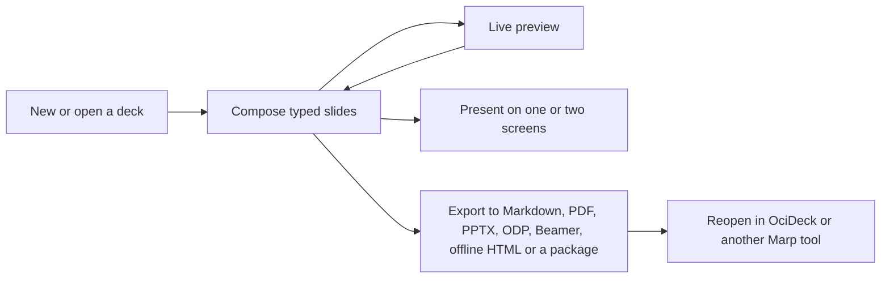

# OciDeck — User Guide

> **Status:** current-state user manual · **Status last reviewed:** 2026-08-30 · **Published by:** Stichting LibreKAT

## Contents

- [Creating and opening decks](#creating-and-opening-decks)
- [Command palette](#command-palette)
- [The menu bar (macOS)](#the-menu-bar-macos)
- [Storage](#storage)
- [S3 bucket](#s3-bucket)
- [Git repository](#git-repository)
- [Image-rights check](#image-rights-check)
- [WebDAV](#webdav)
- [Working on a deck together](#working-on-a-deck-together)
- [Slide types](#slide-types)
- [Organising the slide list](#organising-the-slide-list)
- [Images and media travel with the presentation](#images-and-media-travel-with-the-presentation)
- [Image library](#image-library)
- [Per-slide options](#per-slide-options)
- [Traffic Light Protocol (TLP)](#traffic-light-protocol-tlp)
- [Privacy check](#privacy-check)
- [What to do with a finding](#what-to-do-with-a-finding)
- [Depth — a management version and a technical one](#depth--a-management-version-and-a-technical-one)
- [Two versions from one source](#two-versions-from-one-source)
- [Redaction — leaving data out](#redaction--leaving-data-out)
- [Presenting](#presenting)
- [Exporting](#exporting)
- [Accessibility](#accessibility)
- [Information security module (pentest reports)](#information-security-module-pentest-reports)
- [Management-system module (ISO progress reporting)](#management-system-module-iso-progress-reporting)
- [LibrePlan connector (optional)](#libreplan-connector-optional)
- [Documents](#documents)
- [Markdown mode](#markdown-mode)
- [What the browser version cannot do](#what-the-browser-version-cannot-do)
- [Theming and language](#theming-and-language)

*(Added 2026-07-22: this document is around 5,300 lines and had no way in other than scrolling. In the app the documentation reader has full search; on the repository page it did not. Figure corrected 2026-07-24, 2026-07-30 and 2026-08-30; it said 2,992, then 3,350, then 3,800, each true when written.)*

OciDeck builds [Marp](https://marp.app/) presentations through a structured,
slide-by-slide editor. You compose typed slides, preview them live, present them
(on one or two screens), and export to Markdown, PDF, PPTX, OpenDocument (ODP),
LaTeX/Beamer, a single offline HTML file (one file, images and all), or a portable
`.ocideck` package — see [Exporting](#exporting).
Files stay standard Marp Markdown, so a deck remains usable in other Marp tools.
A saved project writes a `.marprc.yml` next to the `.md` that registers the
generated theme, so the plain Marp CLI invocation — run **from the project
folder** — loads it with no extra flags:

```sh
marp deck.md -o out.html
```

Run Marp from elsewhere (or pass `--no-config-file`) and it falls back to the
default theme, losing the `section.split` two-column layout — that is the
documented limitation, not a bug. See [File Format §1.1](FILE_FORMAT.md#11-marp-cli-config-marprcyml).
*(Verified 2026-08-27 against the real Marp CLI by `make check-marp`, #1804.)*

At a glance, a deck moves through OciDeck like this:



## Creating and opening decks

- **New / Open**: use the welcome screen or `Ctrl/Cmd + O`. Multiple decks open in
  **tabs**. Opening a deck that is already open just jumps to its existing tab —
  the same file is never loaded into two tabs at once, so you can't accidentally
  edit two out-of-sync copies. **Open** accepts both a flat Marp `.md` and a
  portable `.ocideck` package (a zip with the deck and its assets): pick either
  and OciDeck unpacks the package for you — dragging the file onto the window
  does the same. **More than one at a time**: hold `Ctrl/Cmd` (or `Shift` for a
  run) while you click rows in the open dialog, then press *Open (n)* — each
  file lands in its own tab, and the last one becomes the active tab. A plain
  click still opens that one file straight away, as it always did. Behind
  *Browse…* the system file picker takes a multiple selection too. *(Added
  2026-09-02, #1928: dropping a stack of files on the window already worked, but
  the open dialog made you walk through it once per file.)*
- **The welcome screen** answers the question you have before you have any of the
  others. Under the logo, one line says what OciDeck makes (presentations that
  stay ordinary Markdown files). Under *New* sit the two ways to start, side by
  side and in the same accent colour: **New presentation** and **New document**.
  Each button says what it makes, so neither reads as the lesser of the two.
  *(Corrected 2026-08-19: a line under the presentation button used to report how
  many templates were waiting behind it. A count is not what anyone needs at the
  one place where there is a single thing to do — and which templates they are is
  what the picker shows, one click away.)* A **User guide** button beside
  *Settings* opens this document in the
  built-in reader. It used to live three clicks deep under *Settings →
  Documentation*, which is exactly where someone who knows nothing yet does not
  look.
- **Start from a template**: the new-presentation dialog offers a searchable
  catalogue of starting points. *Empty deck* is the default and is exactly that:
  a single blank slide. The title you type stays the deck title (front matter,
  tab label, file name) and is not written onto a slide, so nothing on screen
  says anything until you type it yourself. The rest runs from shift briefings,
  security and privacy work decks, crisis and flight-prep sessions, **decision and
  budget** decks, **role-specific handover and safety** templates, **sector**
  templates for the public sector, education and associations, and
  **conversation-preparation** templates. The decision-and-budget set carries
  the meetings where money and go/no-go are on the table: a business case /
  investment proposal, a budget presentation, a decision-making meeting with a
  decision list and owned actions, a sprint review/demo, and a threat-modeling
  session (scope, data flows, trust boundaries and threats per STRIDE
  category). The role-specific set follows recognised methods from
  safety-critical work: medical, care and social-domain conversations (SBAR,
  (A)MIST trauma, the WHO surgical safety check, nursing shift handover, the
  multidisciplinary team meeting, a family conversation about care
  and caregiving, and an anonymised social-domain case review), the onboarding
  and HR lifecycle (a 30-60-90 onboarding plan, first-day induction,
  buddy/mentor plan, offboarding, and a works-council advice request), aviation
  (the IMSAFE fitness check, a crew/departure briefing, a passenger briefing
  for small aircraft, a flight debrief with a TEM look-back, and a just-culture
  occurrence report), physical security and workplace safety (a toolbox/LMRA
  check, event and crowd-safety briefing, evacuation drill and permit to work),
  emergency services (the METHANE major-incident report, GRIP escalation, a
  fire-service briefing for deployments and exercises, and an after-action
  review/debrief) and the maritime bridge passage briefing. The sector
  templates cover a council/executive proposal and a residents' participation
  meeting for the public sector, a parents' information evening and an
  internship presentation for education, and a general members' assembly (ALV)
  for associations. The **conversation-preparation** family opens with two
  generic starting points — preparing any conversation you want to get right,
  and preparing a *crucial* one (high stakes, strong emotions, following the
  *Crucial Conversations* method) — next to the scenario-specific templates
  (job interview, performance review, salary negotiation, asking for more
  responsibility, raising a workplace issue, resolving a conflict, giving or
  receiving criticism, delivering bad news, setting boundaries, a strained
  relationship, client and sales conversations, supplier negotiations, a pitch,
  or getting buy-in in a meeting). The
  high-stakes, emotional scenarios weave in the same *Crucial Conversations*
  method; each comes with fill-in preparation tables and a progress checklist.
  Everything is placeholder text you overwrite with your own content.

  **The example slides in a template exist in Dutch and English.** A template's
  content is a bundled Markdown document per language, read by the same parser
  that opens any deck: with a Dutch interface you get the Dutch document, with
  any other interface language the English one. When your interface language is
  neither, the picker says so above the list — and on the welcome screen the
  tooltip on *New presentation* says the same: the example slides will be
  English, while the template's name and description still follow your own
  language. That the slide content stops at two languages is a
  decision, not an oversight: template content becomes *your* content the moment
  the deck is created, so it exists as a document per language or not at all —
  running it through the interface-translation layer would make what a document
  says depend on the menu language it happened to be created in. *(Corrected
  2026-07-23: until #622 the example slides existed only in Dutch, as code
  rather than as documents.)*
- **Start from a presentation you already have**: a PowerPoint, Keynote or
  Impress file can be converted into an editable OciDeck deck — see
  [Importing presentations](#importing-presentations-powerpoint-keynote-impress)
  for what does and does not survive that conversion. It lives behind the
  optional *Importeren* module, so you will not see it until you switch that on.
- **Opened from a URL**: a deck fetched from a web address (the URL import, or a
  `?deck=…` share link on the web build) shows an **“Extern”** privacy badge in
  the status bar. Opening such a link made your device contact that server;
  hover the badge to see the source host. Decks you open from your own disk carry
  no badge.
- **Save**: `Ctrl/Cmd + S`. Saving lays out a tidy project folder next to your
  `.md` (`images/`, `data/`, `logos/`, `themes/`) and copies assets in. See
  [`FILE_FORMAT.md`](FILE_FORMAT.md).
- **While a save is running** the save chip on the left of the status bar turns
  into a spinner that names the destination — *Saving…*, *Uploading to WebDAV…*,
  *Uploading to S3…*, *Committing to git…* — and the save button in the toolbar
  is switched off until it finishes. A save to a server is one upload per media
  file, and a git commit is several round trips; on a slow line that used to be
  indistinguishable from a hung app, so people clicked again, and again. The
  destination is named because it tells you whether to blame your disk or your
  connection.
- **Crash recovery**: unsaved work is snapshotted automatically and offered back
  after an unexpected exit. The snapshot carries the deck text, your user notes
  and the drawing layer, so a deck you only drew on comes back with the drawings
  on it. **In the browser there is no crash recovery at all** — no folder to
  write a snapshot to — and the app says so once, as soon as you make your first
  edit. While unsaved work is open the browser also asks for confirmation before
  the tab closes; the wording of that question is the browser's own and cannot be
  set by the app. On desktop the window asks the same thing itself.
- **Traces on this device**: *Settings → Beveiliging → Sporen op dit apparaat* shows what OciDeck keeps locally and lets you remove it: the recent list (which stores the full path and the TLP classification of every deck you opened), the crash-recovery snapshots, and a full reset that also clears the git working copies and the passwords in your keychain. Your presentations are never touched. Removing a git connection now takes its working copy with it — unless commits are still waiting to be pushed, in which case OciDeck names them and asks first.

## Command palette

Press `Ctrl/Cmd + K` for a searchable list of the common actions — present,
export, save, **undo** and **redo**, **find**, add a chart, find & replace, the
image library, toggle markdown/visual mode, full-deck preview, new tab, open,
package/URL import, **presentation properties**, settings, **this user guide**,
**the shortcut sheet**, and setting each TLP level. Start typing to filter
(accents and case don't matter), use `↑`/`↓` to move, `Enter` to run, and `Esc`
to close. Actions that aren't available yet (for example export before you've
saved, or undo with nothing to undo) stay visible but greyed out. The palette is
also in the `⋮` menu.

Undo and redo were the notable absentees: they existed as two small toolbar icons
and nowhere else, while the palette is the place where a function gets found in
this app.

## The menu bar (macOS)

On macOS the app has a real menu bar — **OciDeck, File, Edit, Presentation,
Window, Help** — with the same actions the toolbar and the palette offer, plus
cut/copy/paste/select-all and the standard window items. It exists because on
macOS the menu bar is where you find out what a program can do without already
knowing where to look. Items that need an open presentation stay visible and grey
out instead of disappearing.

Windows and Linux take their window menu from the desktop environment and the
browser build has none, so this bar is macOS-only. The full list of menus and
their keys is in [SHORTCUTS.md](SHORTCUTS.md).

## Storage

Everything about *where your decks live* sits under *Settings → Storage*, as one
list: **File connections**.

A connection is a place your presentations come from and go to. Folders on this
computer, WebDAV servers, S3 buckets and git repositories all sit in that one
list, mixed together — because the question you actually ask is "where does this client's
work live?", not "which protocol is this?". Give each one a name (*Client A –
Nextcloud*, *Private*) so you can tell them apart at a glance.

**The online kinds are a module** (#570). WebDAV, S3 and git live behind the
**Online opslag** card on *Settings → Uitbreidingen (Extensions)*, off by
default, so someone who came to make slides is not offered three server types
before the first slide exists — and because part of those paths has so far
mostly been proven against test environments, choosing them should be a
decision, not an accident; the card says so. With the module off, *Add
connection* offers only local folders; everything local — files, folders,
packages — works unchanged. If you already have an online connection
configured, the module starts **on** (default-off is for new installations,
not for a working setup), and switching it off never hides existing
connections, the git menu, or queued offline work: it only stops *new* online
connections from being added.

The `…` menu follows the same idea: **one** *Open from…* and **one** *Save to…*,
not a pair per protocol. Both start with the same question — which connection —
and that question is skipped entirely when you have only one, so a single-server
setup never sees a picker.

**Saving goes back to where the deck came from.** Open a deck from a WebDAV
server and the ordinary save button (or `Ctrl/Cmd+S`) writes it back to that
server, at the same path, in the same format. The same holds for S3 and git. You
never have to remember which of several save commands matches where you opened
it — getting that wrong would leave the edited version on your laptop while the
server kept the old one, and you would have no way of noticing.

*Save to…* is the exception: it puts the deck somewhere **else**, on purpose.
Use it to move or copy a deck between connections.

- **Add** one with *Add connection* and pick the kind. A folder is done as soon
  as you pick it; a WebDAV server, S3 bucket or git repository opens its
  settings straight away so you can fill them in.
- **Order matters.** Drag connections with the handle on the left. The topmost
  usable connection *of each kind* is the default for that kind: it is the
  library that opening and saving start from, and the server the app reaches for
  when it doesn't ask. So promoting a connection is how you say "this client is
  what I'm working on now" — without deleting anything.
- **Every row shows its status**: the folder name, the server host, the bucket
  name, or `owner/repo`, in green once the connection is usable and grey while it is
  still incomplete. A half-filled connection stays in the list; it just doesn't
  count as a usable source.
- **Export folder** is where exports land. Leave it empty and they land next to
  the presentation file.

When an action needs a server and you have more than one of that kind, OciDeck
asks which. With exactly one it doesn't ask at all, and a deck you opened from a
connection saves back to that same connection without asking either — that goes
for git as much as for WebDAV. Actions that belong to an open deck (its history,
its versions, review, merge, tagging) never ask: they follow the repository the
deck came from. If you deleted that connection, OciDeck says so rather than
guessing at another one.

Upgrading from an older version needs no work: your libraries, your WebDAV
server and your git repository become connections in that order, so the ones
that were the default stay the default.

The network kinds are described in full below.

## S3 bucket

You can keep decks in an S3 bucket: AWS S3, or any S3-compatible service —
MinIO on your own server, Ceph, Wasabi, Scaleway, Hetzner.

- **Set it up** on an S3 connection in *Settings → Storage*: the **endpoint**
  (`https://s3.eu-central-1.amazonaws.com`, or your own
  `https://minio.example.org`), the **bucket**, the **region**, and an **access
  key ID** with its **secret access key**. The secret is stored encrypted in
  your operating system's keychain, never in the settings file.
- **Addressing** decides where the bucket name goes in the URL. AWS wants it in
  the host name; most self-hosted endpoints want it in the path. If a bucket
  that certainly exists comes back as "not found", this is almost always the
  setting to change.
- **Region** matters even when it looks like it shouldn't: a wrong region is
  rejected with the same error as a wrong key. Services that have no regions of
  their own accept `us-east-1`.
- **Prefix** is optional and works like a folder: fill in `presentations` and
  browsing starts there and decks land there.
- **Trusted internal endpoint** is needed when the endpoint runs on a private or
  home network, which is the normal case for your own MinIO. Without it the
  SSRF protection refuses the connection.

**Open and save** through *Open from…* and *Save to…* in the file menu — the
same two entries used for every kind of storage. A deck you opened from a bucket
saves back to that same bucket without asking, just as it does for WebDAV and
git. You choose between one `.ocideck` package and a flat `.md` with its asset
folders, exactly as for WebDAV.

One difference from the other kinds is worth knowing. S3 is object storage, not
a file system, and the guard against two people overwriting each other's work
depends on the endpoint supporting *conditional writes*. AWS has done so since
2024; other implementations vary. Where an endpoint doesn't, OciDeck says so
instead of quietly overwriting — simultaneous editing is less well protected
there than on WebDAV.

## Git repository

You can open decks from a git repository — your own Forgejo, for now. Every
saved version stays retrievable, which a plain folder cannot give you.

- **Set it up** on a git connection in *Settings → Storage*: the server URL
  (`https://git.example.org`), the owner (user or organisation), the repository
  name, and a **personal access token**. Scope the token to just that repository
  where your forge supports it; the panel spells out, per forge, which
  permissions it needs — read and write on the repository, and for GitLab
  `read_api` on top if you want its server-side search. It is stored encrypted in
  your operating system's keychain, not in the plain settings file. A public
  repository needs no token at all.
- **Self-hosted on a private address**: tick **Trusted internal server**, the
  same safeguard as for Nextcloud.
- **The status line of each connection** has three states, not two: *not set
  up* (grey), *set up but never tested* (amber — filling in the fields is not
  the same as knowing they work), and *worked*, with the date and time in the
  tooltip. A successful connection test is remembered across restarts. Changing
  the server clears it, because the earlier result was about something else; a
  *failed* test clears nothing, since it only proves the connection is down
  now.
- **Branch**: leave it empty and the connection test adopts whatever the forge
  reports as its default — that is the common case, and the only way a repo on
  `master` works without you having to know. Fill something in and the test
  will point out a mismatch but leave your choice alone.
- **Test the connection** before saving. One call answers four questions at
  once, and each answer heads off a failure you would otherwise only meet at
  your first save:
  - whether the repository is reachable at all with this token;
  - **what its default branch is called**. There is no field for this, so it
    would otherwise stay `main` — a repository on `master` simply would not
    work. The test adopts whatever the forge reports and says so.
  - whether the repository is still empty (fine — your first save fills it);
  - whether the token may write. A read-only token shows as a warning rather
    than an error: the connection works, but saving would fail later.
- The git entries below only appear in the `…` menu **once a repository is
  configured**. Until then they are hidden rather than shown-but-failing, so the
  menu never offers an action that cannot succeed.
- **Work waiting for a connection** shows in the status bar, in amber, with a
  count across all your git connections. Saving while the forge is unreachable
  keeps the deck on this computer until there is a connection again; the bar is
  what tells you it is still there. It stays quiet when nothing is waiting, and
  it is not clickable — use *Flush queue* in the `…` menu to send it now.
- **Open** via the `…` menu (*Open from…*, then pick the repository): the deck
  is fetched, checked by the same safety scan as any other deck, and opened. A
  repository is untrusted input — coming from your own forge does not make it
  trusted.
- **Save** with the ordinary save button, or *Save to…* to publish somewhere
  else: the deck is written back as one
  commit — the markdown, its images and media, which go into the shared pool
  exactly as opening reads them, the linked chart data files, and your notes.
  A deck you opened from git offers its own name and updates
  in place; a new deck is published by choosing a name (it becomes
  `decks/<name>`). If someone moved the branch since you opened it, the save is
  refused so you do not overwrite their work — reload and save again.
- **Every layer of an ordinary deck travels to git.** A commit carries
  `deck.md`, the images **and** the video and audio in the shared pool, the
  linked chart data files, your notes, the drawings made on your slides
  (`deck.ink.json`, #541), the set-aside privacy findings
  (`deck.dismissals.json`, #651) and — for a pentest report — the MIAUW
  disposition (`deck.miauw.json`, #756). A set-aside is a review decision about
  the report, so a second reviewer opening the deck from the repository does
  not re-litigate what a colleague already judged; two reviewers' judgements
  merge by union, latest change wins per finding. The disposition follows the
  same reasoning: waivers and confirmations merge by union per requirement, the
  decision taken last wins, and withdrawing one is itself a decision that
  survives the merge — a waiver a reviewer just revoked does not quietly come
  back from the other side. The seal and signature travel too
  (`deck.seal.json`, #541): a sealed report that comes back from a repository
  still reads as sealed. Git stores the seal; what the seal *means* — the
  report is settled and read-only — the app itself guards. One honest note:
  the seal's hash covers the original `.md` file, so a deck opened from git
  shows its seal as "not verifiable here" rather than falsely intact —
  verify against the original file, exactly as with an `.ocideck` package.
  *(Corrected 2026-07-23: a sealed deck used to be refused on a work branch
  outright — that left it no way into a repository at all, and the refusal is
  withdrawn.)* *(There used to be a blocking "not everything travels" dialog
  here that counted what stayed behind. It shrank with every layer that
  learned to travel — media, chart data, notes — and with the drawings on
  board it had no true line left for an ordinary deck, so it is gone: a
  warning that lists more than actually goes wrong is one people learn to
  dismiss whole.)*
- **Your notes travel, and your co-authors' notes merge.** The notes live next to
  the deck in the repository as `deck.user-notes.json`, so two people writing
  notes on different slides both keep theirs when their work comes together. Two
  people rewriting the *same* note is a genuine disagreement and git will say so.
  Clearing your last note removes the file, so a note you deleted does not come
  back the next time you open the deck.
- **Your drawings travel, and merge by joining.** The annotation layer lives
  next to the deck as `deck.ink.json`. Two people who drew on the same deck did
  not disagree — they both drew — so when their work comes together the strokes
  of both sides are kept. Erasing is the one exception with teeth: an erased
  stroke is remembered as erased, so it stays gone even after a merge with
  someone who still had it. A deletion that comes back is worse than one that
  does not work, because you saw it disappear.
- **Lose your connection while saving** and the deck's text is kept locally and
  queued instead of failing — you see "saved, syncs when you're back online".
  The queue survives closing the app; it empties on your next successful save
  and via *Sync now* in the `…` menu. An image you add while offline is pooled
  and committed when the queue syncs, so a reconnect gets the whole deck —
  unless you close the app first (an unsaved in-memory image does not survive a
  restart, the same limit a plain saved deck already has). Your text is always
  safe.
- **Which forge**: pick the **forge type** on the git connection in *Settings →
  Storage* — Forgejo/Gitea, GitHub, or GitLab — next to the server URL, owner
  and repository. Everything
  below works the same whichever you choose; only the token differs (a personal
  access token in all three, but each calls it something slightly different). On
  GitLab the deck browser cannot show file sizes: its listing does not include
  them.
- **Layout**: a repository holds many decks under `decks/<name>/deck.md`, with
  images shared in one `assets/` pool so the same picture is stored once.
- **Editing happens on a concept branch — *Uitbrengen ter review…*.** When you
  edit a deck opened from git, your saves do not land straight on the main
  branch. The first save of an editing round starts a dated *concept* branch
  (`decks/<name>/<date>`) and every save goes there; you never have to name or
  pick it. This works the same on the REST and native-git planes, and stays
  offline-safe — a round can begin on a plane and the branch is created for you on
  reconnect. When it is ready, *Uitbrengen ter review…* in the `…` menu opens a
  pull request from your concept to the main branch, so it can be reviewed before
  it goes out; you get the link back. If your organisation has set a TLP release
  ceiling, the release is checked against the **strictest** classification
  anywhere in the deck (a single `TLP:RED` slide counts), and a deck over the
  ceiling is refused before anything is pushed.
- **Merge the concept and record the version — *Concept mergen…* and *Versie
  vastleggen…*.** Once the review is done, *Concept mergen…* merges the pull
  request into the main branch (you can let it clean up the concept branch) and
  puts your tab back on the main branch, so your next edit starts a fresh round.
  *Versie vastleggen…* then records the version you presented as a release tag
  (`decks/<name>/vX`) on the main branch — the same versions *Versies…* lists and
  opens read-only. Recording a version passes the same classification check as
  releasing for review, so a version can never be tagged past its ceiling.
- **If someone else edited at the same time, it merges.** Saving no longer sends
  you back to reload. OciDeck compares what you started from, what you made of
  it, and what they made of it, and merges the two. Edits to different slides,
  identical edits, and reorderings resolve by themselves and your save simply
  goes through. Only slides you both changed differently — or where one of you
  deleted what the other edited — are put to you as a choice per slide, with your
  own version kept until you pick. Neither side's work is thrown away. If the
  deck's classification differs, the stricter of the two wins. This works both in
  the browser and on desktop with native `git`; on desktop it becomes a real
  merge commit, so `git log` shows the two lines of work coming together.
- **Native git (desktop):** if you have `git` installed (2.19 or newer),
  the git connection in *Settings → Storage* shows it, and OciDeck keeps a real
  clone of the repository.
  Then **each save is a genuine local commit** — durable and offline: edit away
  from a network, save as often as you like, and every commit is waiting to push
  when you reconnect (*Sync now*, or automatically on your next successful save).
  If someone moved the branch while you were offline, your commit is kept safely
  on your machine and the sync is held rather than overwriting their work. On the
  web, or a desktop without `git`, the REST path above is used and nothing
  changes. On macOS the check looks for the Xcode command-line tools first, so it
  never prompts you to install anything. Once a deck is open from git this way,
  *Git history…* in the `…` menu shows its commit timeline, with a badge on each
  commit for whether it is on the forge yet or still waiting to push.
- **Open an earlier version — *Versies…*.** When a deck has been released as a
  version, *Versies…* in the `…` menu lists those versions, newest first. Pick
  one to open it **read-only**: a snapshot of how the deck was at that release,
  to look at — not something you can save over, so reviewing an old version can
  never overwrite your current work. This works in the browser too.
- **Compare two versions — *Vergelijken…*.** In that same list, *Vergelijken…*
  lets you pick two releases and see what changed between them: slides added,
  removed, changed or moved. A deck has no slide IDs, so slides are matched on
  their content — an identical slide is recognised even if it moved, and a
  reworded slide shows up as one *changed* entry instead of an addition plus a
  deletion. For a changed slide, *Verschillen* shows the two side by side with
  the differing fields listed.
- **Search every deck — *Zoeken in alle decks…*.** Find & replace works inside
  the deck you have open; this searches every deck in the repository. Each hit
  names the deck and the slide it is on, with the line it was found in, so you
  can tell a passing mention from the slide you actually wanted. Pick a hit and
  that deck opens. Two things it will tell you rather than hide: if a deck could
  not be read it is named as skipped (the hits you do see are still real), and
  if there were more hits than fit it says so instead of quietly cutting the
  list. On desktop, when the repository is cloned locally, it uses `git grep` to
  read only the decks that actually contain the term — much faster than reading
  every one. Without a local clone (in the browser), on GitLab it asks the
  forge's own code search which decks match and reads only those; that path is
  index-based, so a deck changed moments ago may not be included yet — the dialog
  says so when that is the case. When neither is available it falls back to
  scanning every deck, which is why it runs when you press *Zoeken* — not while
  you type. (Gitea/Forgejo has no code-search API at all, and GitHub's only
  matches whole words, so it would quietly miss a deck you searched for by a
  fragment — both therefore rely on `git grep` or the full scan.)
- **Which decks use an image — *Afbeeldingen in de repository…*.** Images are
  stored once and shared by every deck that uses them, so before you touch one it
  helps to know who else depends on it. This overview lists every image in the
  repository with the decks that reference it. Three answers are possible, and
  the difference matters: a deck uses it; no deck uses it any more but a
  *released version* still does (removing it would break a version you already
  presented); or nothing references it at all. That last group is listed at the
  bottom as a suggestion — it is what this branch can see, and another branch may
  still be using them. If a deck or a released version could not be read, the
  suggestion list is withheld entirely and the overview says which one was
  unreadable, because the unreadable one could be the single user of an image and
  a deletion cannot be undone. Removing an image stays a manual act; this screen
  only tells you what you would be removing.
- **A repository is a trust boundary.** Everyone who can read it reads *every*
  deck in it, so use one repository per client, engagement or classification
  level — the forge's permissions are what separate them, not OciDeck.

Unlike WebDAV, this also works in the browser version.

## Image-rights check

The optional **Afbeeldingsrechten** extension helps a repository administrator
find images that may need a rights review. Enable it under *Settings →
Uitbreidingen (Extensions) → Afbeeldingsrechten*. It is off by default.

This is a warning system, not a copyright verdict. The check runs locally,
does not upload image bytes and does not perform reverse-image search. It can
recognise missing or expired licence evidence, embedded author/copyright/licence
metadata and familiar stock-library markers in filenames. It cannot establish
authorship, the territorial scope of a licence, quotation rights, consent or
fair use. A clean result therefore means only that these local rules found no
reason to warn.

There are two ways an assessment is created:

- **On addition.** While the extension is enabled, an image newly added to the
  shared pool during a git save is assessed in the same commit.
- **Across the repository.** Choose *Afbeeldingsrechten controleren…* in the
  `…` menu, select a configured git repository, and OciDeck checks every
  supported image under `assets/` on its default branch. Missing or outdated
  assessments are committed as *Scan afbeeldingsrechten*; current results are
  reused.

The review dialog is a queue, not a modal blocker. For each exact signal an
administrator can record **Valid rights demonstrated**, **False positive**, or
**Do not use** and may add a note. The first two decisions remove that warning;
*Do not use* deliberately leaves it visible. OciDeck appends the decision to the
assessment and commits it as *Beoordeel afbeeldingsrechten*, so another
administrator sees the same outcome and the audit history remains available.
If a later scan finds a materially different signal, that new signal is not
silenced by the earlier acceptance.

Switching the extension off hides the menu action and stops assessment on newly
added images. Existing assessments and administrator decisions remain in the
repository; turning off a user-interface extension never deletes audit data.
The records live at `.ocideck/asset-assessments/<sha256>.json`, separate from a
deck because one pooled image can be used by several decks.

For maintenance or CI, run `dart run tool/scan_asset_rights.dart [repository]`.
Add `--json` (or `--format=json`) for machine-readable output. Open findings do
not make the command fail: they require human judgement. Exit status 2 means
one or more image files could not be read, so the round was incomplete.

## WebDAV

You can use a folder on a WebDAV server as a source for decks and assets.
Nextcloud is the most common one, but any WebDAV server works.

- **Pick the server type** on the WebDAV connection in *Settings → Storage*.
  This is the only thing that differs between servers — the protocol underneath is plain WebDAV
  either way:
  - **Nextcloud or ownCloud** — enter just the server URL
    (`https://cloud.example.com`). The DAV path
    (`/remote.php/dav/files/<username>`) is derived for you.
  - **Other WebDAV server** — there is no path to guess, so the path you put in
    the server URL *is* the WebDAV root
    (`https://dav.example.com/dav/files`).
- **Pasting the URL Nextcloud shows you** is fine. Nextcloud displays the full
  DAV URL (`https://cloud.example.com/remote.php/dav/files/jan/Presentaties`)
  in its own settings screen, and that is what most people paste here. On the
  *Nextcloud* server type the path would otherwise be discarded silently —
  including a subfolder you meant to keep. OciDeck now spots the shape and
  offers to split it up: server, username and subfolder each into their own
  field. It is a button, not an automatic rewrite, and fields you already
  filled in yourself are left alone.
- **Fill in the rest**: your username, your password, and an optional subfolder.
  On Nextcloud, use an **app password** (create one under *Settings → Security*)
  rather than your login password. Use **Test connection** to check it before
  saving. The password is stored encrypted in your operating system's keychain,
  not in the plain settings file.
- **Self-hosted / home server**: if the server runs on a private or LAN
  address, tick **Trusted internal server** — otherwise the connection is
  refused (the same safeguard that stops a deck from reaching internal hosts).
- **A self-signed certificate** is common on a self-hosted server. If the
  connection test fails on the certificate, use **View certificate**: OciDeck
  shows you who issued it, until when it is valid, and its SHA-256 fingerprint.
  Compare that fingerprint with what your own server reports — if they match,
  you are talking to the right machine — and then choose **Trust**.

  Only that one certificate is trusted, not "anything self-signed": an
  eavesdropper's certificate is self-signed too. When the server replaces its
  certificate later, OciDeck asks again, because from the app's side a renewal
  and an attacker look identical.

  The same applies to a self-hosted S3 endpoint and a self-hosted forge: each
  connection carries its own pinned certificate.
- **Open** via the welcome screen or the `…` menu (*Open from…*, then pick the
  server): browse the folder and pick an `.ocideck` package or a Marp `.md`. The
  file is downloaded, checked by the same safety scan as any other deck, and
  opened in a tab.
- **Save back** with the ordinary save button — a deck from WebDAV goes back to
  WebDAV. Use *Save to…* (`…` menu) to put it somewhere else. Choose a target
  path and a
  format: a single **`.ocideck` package** (one file, assets included) or a
  **flat `.md` plus its asset folders** (`images/`, `themes/`, …) mirrored into
  the same folder. A deck opened from WebDAV remembers where it came from, so
  saving suggests the original location.
- **If someone else got there first**: saving back to the file you opened only
  goes through if that file hasn't changed on the server since. If it has, you
  get a choice — *Save as* (keep both versions) or *Overwrite* (discard theirs).
  Nothing is overwritten silently. Servers that don't report a version (an
  `ETag`) can't be checked; there you keep the old behaviour of a plain write.

## Working on a deck together

Two or more people can edit the same deck at once, as long as it lives on a
**WebDAV** source (Nextcloud, or any other WebDAV server). The command palette
(`Ctrl/Cmd + K`) then offers **“Samenwerking starten”** (start a session others
can join) and **“Deelnemen aan samenwerking”** (join one already started for this
deck); picking *join* when no one has started a session yet simply tells you so.
While a session runs, the palette instead offers only **“Samenwerking verlaten”**
to leave. These entries appear only for a deck opened from WebDAV; a deck on your
own disk, an S3 bucket or a git repository has no shared place to co-author
through.

The edits travel through a small working area beside the deck on the same WebDAV
server, not through the `.md` itself, so the saved file is left untouched while a
session runs. Because that working area is exchanged by polling, a co-author's
change shows up after a short delay rather than the instant they type it. *(Added
2026-07-31: this asynchronous, WebDAV-based form of co-authoring is what exists
today.)*

**Only the person who started the session saves the shared file.** Everyone
else's edits are live in the session, but they reach the shared deck only when
the starter — the *owner* — saves. If you joined and press save, OciDeck tells
you so and keeps your work in the session until the owner saves it.

**If the owner drops out** — closes the app, or loses their connection — one of
the remaining participants steps in and keeps the session going, so the group can
carry on editing. A short message tells that person they are now holding the
session and that their changes are not being saved until the owner is back; in
the meantime nothing is written to the shared file. **When the owner comes back**,
they take the session over again (a message announces it) and saving is theirs
once more. A returning owner does not restart the session or lose the work done
while they were away.

This stand-in is best-effort, not a guarantee. If two people happen to take the
session over in the same moment, one of them can end up with a view that has
quietly drifted from everyone else's until they reopen the deck — so if a handover
felt messy, reload to be sure you are seeing the shared state. And you are never
stuck: a co-author who wants to keep their own copy can **leave the session** —
saving is theirs again immediately — or **export a package** (`.ocideck`), which
carries the full editable deck and its images regardless of who owns the session.

**Verifying who you work with.** In a realtime session, the palette offers
**“Deelnemers verifiëren”**: it lists every device with a **fingerprint** — a
readable rendering of that device's identity key. Compare a co-author's
fingerprint over a channel you trust (read it aloud, or send it a way you know is
theirs); if it matches, mark the device **verified**. That verification is
remembered, so the same device stays verified in later sessions and does not ask
again. If a device you verified before ever shows up with a *different* identity,
OciDeck flags it as **mismatch** — the sign that something is impersonating your
co-author, and a reason to break off the session rather than dismiss it. While any
device is still unverified, a slim banner above the workspace reminds you, and one
tap opens the comparison. *(Added 2026-08-01.)*

**Keeping your identity when you switch devices.** Your device has its own
collaboration identity — the thing co-authors verify. It lives only on this
device, so a new device normally starts fresh (and shows up as unverified to
everyone who had verified you). To carry the *same* identity over, open
*Settings → Realtime samenwerken → Identiteit & herstelsleutel* and **show the
recovery key** — a short grouped code. Save it somewhere safe, such as your
password manager; it is the only way to restore this identity, so keep it and
share it with no one. On the new device, open the same place and **restore** from
that key: co-authors who verified you before recognise your fingerprint again.
Removing the Matrix account also removes this identity and your saved
verifications from the keychain. *(Added 2026-08-01.)*

**Table cell edits do not sync.** When you edit a cell in a table slide during
a session, that change does not reach the other participants — the title and
all other fields of the same slide do, but the cell content itself does not.
A new slide you insert arrives complete; it is only *edits* to existing cells
that stay local. The editor shows a warning when this applies. This is a known
limitation: cell-level sync needs finer-grained operations than the current
model provides, and is planned for a later phase. *(Added 2026-08-27.)*

## Slide types

Add a slide and pick a type: **title**, **section** divider, **bullets**, **two
bullet columns**, **bullets + image**, **two images**, **large image**, **video**,
**quote**, **table**, **source code**, **chart** (bar, horizontal
bar, stacked bar, horizontal stacked bar, combo, line, area, pie, donut,
spider/radar, scatter, waterfall, heatmap/risk matrix, or target-and-actual — plus
eight statistical types when the Procesverbetering module is on; *corrected
2026-08-30, this said six while `chartTypeRequiresProcesverbetering` named eight,
and the module's own section further down says eight*), **cockpit** (a
dashboard of aviation-style instrument gauges),
**question** (an interactive quiz slide, in six kinds), **timeline** (an animated timeline of
dated events), **scorecard** (a few headline figures, each beside the figure from
the previous report), **choice menu** (blocks that each jump to another
slide, as a grid, a list or a ring, #1162), and
**free Markdown**. Each card in the chooser shows a miniature
wireframe of the layout, and **below the grid stands the explanation of whatever
the mouse or the keyboard focus is pointing at** — so you choose on a sentence
rather than on a wireframe and a single word. The same sentence is what a screen
reader announces on the card itself. The dialog works entirely with the keyboard
(`Tab`/`Enter` to choose, `Esc` to cancel). Each type has a dedicated editor on
the left and a live preview on the right. You can change an existing slide's type
at any time from the **TYPE** control in the editor header: it opens the same
chooser, so adding and re-typing a slide always offer exactly the same set of
types. (Both pickers are category-filtered: the seven Informatieveiligheid types
— asset overview, discoveries, finding, findings-summary, checklist, scope matrix
and sign-off — appear only once the security module is enabled; see the
pentest-reporting section below.)

Not sure what a slide type is for? The chooser already tells you before you pick
(above), and afterwards the small **"What can I do here?"**
button at the top of the editor repeats the hint for the selected type (for
example, how to import CSV data into a chart, how to trim a video, or how to
paste a table from a spreadsheet). The info icon next to a slide's **TLP** picker
explains that slides classified above the deck's level are left out when you
present or export. The editor header keeps everything on one strip: the type and
style pickers, that hint, a compact **Quality** chip (its colour shows the
status; hover or open it for the counts) and a gear button for **Slide
settings** — the less-used per-slide options (audio, logo, footer, timing, the
[jump to another slide](#non-linear-order-jump-to-another-slide-1162), TLP).
Each expands just below the strip; a set per-slide TLP shows as a small badge on
the gear so the classification stays visible at a glance.

Text fields support inline Markdown (`**bold**`, `*italic*`, `` `code` ``,
`[links](…)`). Free-Markdown slides also render fenced code with syntax
highlighting, `$…$` / `$$…$$` LaTeX math, and ` ```mermaid ` diagrams (rendered
in preview, presenter, PDF/PPTX, and HTML export).

### Bullets and lists

A bullets slide has an optional title and subheading and a list you edit row by
row: **Enter** adds a bullet, **Tab** / **Shift+Tab** indents, drag the handle to
reorder. The list style picker switches the whole list between plain **bullets**,
**numbered**, a **checklist** (tick-boxes with an optional progress bar), and
**rich text** (a free-Markdown body). Plain bullets can use a dot or a cat-paw
marker.

**A rich-text body that does not fit runs on to a next page.** The text is first
scaled to fill the slide; only when it would have to shrink past the readable
floor is it broken into pages. All pages share one font size — the size of the
fullest page — so paging through does not make the letters jump, and the title
and subheading appear on the first page only. The split is worked out while
rendering, from the theme (the font, and the room a logo or footer claims) at the
fixed 16:9 slide size, so nothing about it is stored in the `.md`: change the
theme and the same text may need one page more or fewer.

Which page you are looking at is shown in the program's own chrome, never on the
slide: the preview header reads `7 / 24 · Pagina 2 / 3`, the presenter's control
bar shows the same beside the slide number, and both the preview's arrow keys and
the presenter's next/previous step through the pages before moving on to the next
slide. *Until 2026-07-22 a `1 / 3` badge was drawn in the top-right corner of the
slide itself. It counted from one again on every slide while the audience was
looking at slide 7 of 24, and it has been removed.*

In the **PDF and PPTX** export each page is written as a full-size slide of its
own, so a footer with page numbers counts the continuation pages along with
everything else. *Corrected 2026-07-22: before that, the export rendered the
first page of such a slide and left the rest out of the file without saying so.*
Presenting is unaffected — there the pages remain pages of one slide. The **HTML**
export writes such a slide **once**, with the whole body in it: the page split is
a property of OciDeck's own rendering and there is nothing about it in the
Markdown to reproduce.

**A picture inside the text.** Put an image on a line of its own in a rich-text
body and it is drawn there, in the flow of the text:

```markdown
What we found on the third day:


The message names a user account that does not exist.
```

Size it the way Marp does, with `w:` and `h:` in the square brackets —
``. Those numbers count in Marp's
own measure, where a slide is 1280 wide, so the same `w:600` means the same
thing in the app and in the HTML export. Leave `w:` out and the picture uses the
full width of the text column; leave `h:` out and it gets a fixed box a quarter
of the slide width high. That box is deliberately worked out from the Markdown
and not from the picture: the page split has to know how much room the image
takes before any file has been read, and a box that changed once the picture
arrived would make the text jump. Inside the box the picture is scaled to fit —
never cropped, never stretched — so `h:` is how you make it taller or shorter.
Everything else between the brackets is ordinary alt text, which is also what
other Markdown readers make of the `w:`/`h:` part.

Only an image that sits alone on its line is drawn this way; one in the middle
of a sentence stays text, so a sentence is never broken in half by a picture.
The image travels with the deck like any other (see *Images and media travel
with the presentation*), and on a slide set to **redact** it is removed along
with the slide's other media.

**Splitting a pasted document into chapters.** Paste a long document into a
rich-text body and its `#` headings end up in the middle of one slide. In Marp a
`#` *is* a slide's title, so such a heading looks like a title without being one,
and you cannot move, skip or present that chapter on its own.

A line above the text box therefore says how many slides splitting would produce,
with a **Splits op hoofdstukken** (Split by chapters) button. Each chapter becomes
its own slide with the heading as its title; a `##` directly under such a heading
becomes that slide's subheading. Whatever came before the first chapter stays on
the slide you were already on, with its existing title. It is one edit, so one
undo puts everything back.

It only happens when you ask. A deck that has headings in a body today opens
unchanged tomorrow — restructuring while reading the file would quietly change
what you wrote. A `##` stays a heading *inside* the slide, and a `#` inside a
fenced code block is source code and does not split. The button is not offered on
a bullets-with-image slide: where that picture should go is a choice only you can
make.

**Group headings ("tussenkoppen").** To split one slide's bullets into visually
separated groups — an agenda's *morning* and *afternoon*, pros versus cons —
click **Tussenkop toevoegen** (Add group heading), or turn any row into one with
the divider button on its left. A group heading renders as a bold accent label
above a thin rule; leave its text empty for a **wordless divider** — just the
rule, a plain break between two groups. Headings carry no bullet, checkbox or
number, and don't count toward the list. They work the same on plain, numbered
and checklist lists and in two-column and bullets-with-image layouts, and they
travel with the deck in the `.md` (see FILE_FORMAT § Bullets).

**Image callouts.** On a bullets-with-image slide you can link each bullet to a
marker on the image — a pin (numbered dot) or a region (outlined rectangle).
Open the **Callout** editor from the bullets-with-image editor, click a bullet,
then click the image to place its target. Each callout gets a reference letter
(A–Z) that appears at the end of the bullet as `(A)`; the marker on the image
carries the same letter.

The **description** field is what a screen reader reads. It is not drawn on the
slide, but it is not a private note either: it is ordinary content. OciWacht
scans it like any bullet, redacting it when the slide is set to *redigeren*, and
it travels into the HTML export, the LaTeX notes and — new — the alt-text slot of
PPTX and ODP, so the meaning is not lost on a recipient who cannot see the
picture. Write it as something you would be happy to send.

Three presentation modes are available: **Pins** (numbered dots), **Gebieden**
(Regions — outlined rectangles with dimming outside), and **Pijlen** (Arrows —
arrows from a fixed rail at the left edge of the image to each target). In
arrow mode, a point target gets an arrow to the point; a region target gets an
outlined rectangle with the arrow ending on its left edge. The LaTeX/Beamer
export degrades arrows to pins plus the textual reference.

By default every bullet and its markers are visible from the moment the slide
appears. Switch the reveal mode to **Stap-voor-stap** (Step by step) to reveal
them one click at a time during a presentation: the slide opens with just the
title and image, and each forward click brings up one bullet plus all of its
markers at once. Backward hides them in reverse. Static exports (PDF, PPTX,
HTML, LaTeX) always show everything — the step state is session-only.

### Large image

A single image fills the slide as a background. Tick **Afbeelding slidevullend**
(slide-filling) to have the image **cover** the whole slide, cropping whatever
falls outside the frame — handy for full-bleed photos. Leave it off to show the
**full** image (letterboxed if its aspect differs); the **Zoom** control then
scales it from edge-to-edge fit down to smaller, or zoomed in past the frame.
An optional title overlay can sit on top.

**Adjusting the picture.** When a picture is cropped (slide-filling or zoomed
in) and the wrong part shows, click **Afbeelding aanpassen** (Adjust image). A
live editor opens with the image inside its slot: **drag** the picture to choose
which part stays in view, **zoom** with the slider between the two magnifier
icons, and turn the picture a quarter at a time with **Linksom** / **Rechtsom**
(anticlockwise / clockwise). The same button is on the title background, the
bullets-and-image panel, and each image of a two-images slide (remote/URL images
can't be adjusted this way).

**None of the three touches your picture.** The crop and the zoom store a focal
point and a scale in the deck's `.md`. **Rotating writes a turned copy** next to
the original — `foto.jpg` becomes `foto.r90.jpg` — and points the slide at it,
so the file you brought in is still there, and any other slide or deck using it
is unaffected. The copy is written when you press **Klaar** (Done); **Annuleren**
(Cancel) writes nothing.

Turn the same picture again and the angle accumulates in one copy rather than
stacking: another quarter from `foto.r90.jpg` gives `foto.r180.jpg`, never
`foto.r90.r90.jpg`. Turn it all the way back and the slide simply points at the
original again. Rotation is offered only for a picture OciDeck can write beside:
not for a bundled sample image and not for one loaded from a URL, where the
buttons are absent rather than failing.

*(Until 2026-08-30 rotating overwrote your file — no undo, no copy, and a picture
shared by several decks turned in all of them. That is what changed; the
reasoning is in [design/IMAGE_ROTATION.md](design/IMAGE_ROTATION.md).)*

**One thing rotation does not carry: image callouts.** A callout's target is
stored against the picture as it was, so after a turn its markers point at the
wrong parts. Place the callouts after you have settled the orientation, or move
them afterwards.

*(Corrected 2026-08-30: this paragraph told you to click **Bijsnijden**, a button
that has not carried that label in any of the five editors, and said the dialog
"never rewrites the image file" while the rotate buttons in that same dialog do
exactly that.)*

### Choice menu slides (#1162)

A **choice menu** turns a slide into a set of *blocks* that each jump to another
slide — the interactive counterpart of the [jump-out](#non-linear-order-jump-to-another-slide-1162).
In the editor you build the blocks one by one: type a **label**, add a one-line
**Uitleg** ("Description") under it if it helps, pick the target slide under
**Springt naar** ("Jumps to") from a list of the deck's slides by heading, and
optionally add an image. A block you leave without a target is just a text block.
You never type or see an anchor — you pick a slide, and the app keeps the link
stable even if you rename that slide's heading or reorder the deck.

**The layout.** At the top of the editor, **Indeling** ("Layout") offers three
shapes for the same blocks: **Raster** ("Grid" — cards in a grid, the default and
the one that fits the most blocks on a slide), **Onder elkaar** ("List" — one wide
block per row, calm and easy to read) and **In een cirkel** ("Circle" — the blocks
on a ring around the middle, like a dial). It is a presentation choice, not content: switching it
rearranges the blocks and changes nothing you typed. *(Added 2026-08-18.)*

**Categories.** A long menu can be split into groups with the same **tussenkoppen**
(group headings) the bullet slides use. **Categorie toevoegen** ("Add category")
adds one; the first time you do, the blocks you already had are gathered under a
category called *Algemeen* ("General"), so the bar never opens with a group nobody
named. Each block then gets a **Categorie** ("Category") dropdown to move it. Dissolving a
category (the folder button beside its name) keeps its blocks and moves them into
the neighbouring category — removing a heading should not throw work away. While
presenting, a bar of category pills above the blocks switches between the groups,
and the beamer window follows the presenter's choice. A menu without any group
heading shows no bar at all. *(Added 2026-08-18.)*

While presenting, the blocks show in the theme's colours (blocks that jump carry a
subtle accent border and an arrow); a block's image sits as a small square beside
its label with the explanation under it. **Click or tap a block and the
presentation jumps to that slide.** Because a jump uses the same route history as
the jump-out, **back** returns you to the menu you came from. If the target slide
is later deleted, the block simply stops jumping — no error, but the quality check
does tell you, so you do not find out on stage. Moving to another slide resets the
menu to its first category.

**From the keyboard.** While presenting, `Tab` (and `Shift + Tab` to go back)
walks the categories and then the blocks; `Enter` or the space bar follows the jump
or switches category, and `Escape` hands the keys back to the slide so you can page
on straight away. Whatever has focus gets a clear accent ring. A menu is therefore
usable without a mouse — with a clicker, or with a screen reader, which announces
the blocks as buttons. *(Added 2026-08-18.)*

**More blocks than fit.** Every layout keeps its text readable. When no further
block fits without the type becoming too small, the slide shows the ones that do fit
and puts a **+n** tile after them for the rest. Read that as a sign the menu is too
full for this shape: pick **Grid** (which holds the most blocks on one slide) or
split it into **categories**. Nothing you typed is lost — the blocks stay in the
file and reappear as soon as there is room. *(Added 2026-08-18: sixteen blocks used
to be squeezed down to a four-pixel type size — intact, and unreadable.)*

In the `.md` file the blocks are ordinary Markdown link-bullets — a `- [Label]`
bullet whose link points at the target slide's anchor, optionally followed by
` — the description` and by `` for the image — so a menu stays a
readable list of links in any Markdown viewer; only the `<!-- _class: menu -->`
token marks it as a menu for OciDeck, with `menu-list` or `menu-circle` beside it
when you pick one of the other two layouts. A menu you made before the layouts
existed keeps its file exactly as it was.

The **HTML export** draws the same blocks in the same layout, and there they are
real in-page links: click a block and the page scrolls to that slide. Categories
become headings with their blocks under them rather than pills — an exported page
has no presenter to press them. (The PDF export shows the same picture, printed
rather than clickable; the LaTeX export writes the blocks as a list per category,
without the block images.)

### Source-code slides

Choose a programming language for syntax highlighting (or "plain text") and paste
your code. It renders as a "code sheet" whose background, text colour and
**monospace font** come from the active **style profile** (e.g. Courier). Turn
**syntax colouring** off to show the whole block in a single colour — e.g. bright
green on black for a classic CRT-terminal look. The text is sized to fill the
panel — larger when there's room, smaller for long fragments. Stored as a fenced
code block in the Markdown.

### Tables

The first row is the header. Press `Enter` inside a cell for a new line within
that cell. To bring in existing data, **paste a table into any cell** with
`Ctrl/Cmd+V` (or `Shift+Insert`): a selection copied from a spreadsheet (Excel,
Numbers, LibreOffice Calc, Google Sheets), CSV text (comma- or
semicolon-separated), or a markdown table fills the grid from that cell onward,
adding rows and columns as needed. Ordinary text — even a sentence with a comma
in it — still pastes into just the one cell.

While the table is still empty the editor offers a **preset**: one click lays
down the columns of an action list (Action, Owner, Deadline, Status) and switches
on the date marking below. The button disappears as soon as the table carries
anything, so it can never overwrite what you typed. This replaces the separate
*Actions and decisions* slide type, which gave you those columns at the cost of
everything else a table can do.

Tick **Mark expired dates** in *Per-slide options* to colour any cell holding a
date before today red. OciDeck works this out against the day you present, so a
deck that comes back three months later marks its own lapsed deadlines instead
of going on claiming everything is on schedule — there is no "overdue" you can
type, because a flag you type freezes at whatever was true the day you wrote it.
Only **yyyy-mm-dd** counts as a date; `05-08-2026` is two different days
depending on who wrote it, and a deadline is a bad place to be wrong by three
months. The setting is off by default, since a table of historical dates would
otherwise turn entirely red, and a warning that is everywhere warns of nothing.

By default a table can only be changed in the builder. To also let it be edited
live during a presentation, tick **Table editable while presenting** in
*Per-slide options* (shown only on table slides). See
[Editing a table while presenting](#editing-a-table-while-presenting).

### Charts

Pick a type and a title, then enter data in the grid: the first column is the
labels, each further column is a named series. Use **Row** and **Series** to add
data; the small ✕ removes a row/column. Each series and (for pie/donut/radar)
each label can be given its own colour.

The available types:

- **Bar**, **stacked bar**, **line**, **area** (a filled line), **scatter** —
  cartesian charts (labels on the x-axis, values on the y-axis).
- **Horizontal bar** — bars laid left-to-right; best for rankings and long
  category names.
- **Horizontal stacked bar** — a stacked bar turned a quarter turn: one bar per
  label with the series stacked left-to-right. Best for part-to-whole
  comparisons with long category names; a wide enough segment prints its value.
- **Combo** — bars for every series **except the last**, which is drawn as a
  line on its own right-hand axis (e.g. revenue bars + a growth-% line). With a
  single series it falls back to a plain bar chart.
- **Pie** / **Donut** — proportional slices; the labels are the segments. A
  donut prints the series total in its centre hole; a pie is solid to the
  centre. Both show at most the first two series. In **Geavanceerd** you can hide
  the on-slice percentages (a clean circle) and set a **start angle** in degrees
  — rotating the pie so a slice sits where you want it, handy when you use a pie
  as a drawing rather than a data read.
- **Spider/radar** — needs at least three labels (axes); each series is a
  filled area.
- **Waterfall** — uses the **first** series; each value is an up or down step
  that builds on the previous running total (green up, red down). Good for
  budget/bridge stories.
- **Heatmap** — a coloured grid: each series is a row, each label a column, the
  cell colour follows the value. Label the axes *likelihood* and *impact* and it
  serves as a **risk matrix**.

- **CSV import** — click **CSV importeren** to fill the grid from a CSV file.
  Where the data ends up is not something you have to decide: see below.
- **A separate data file** — chart data is kept in a file in the deck's `data/`
  directory, and the presentation itself keeps only a reference to it. That is
  what keeps a `.md` readable when a chart has forty rows, and what makes its
  changes legible in version history.

  This happens by itself when you save; older presentations move over the first
  time you save them, and you should not notice anything. The file is named
  after the chart's title, and keeps that name afterwards even if you rename the
  chart. A chart you have not put any numbers in yet gets no file.

  You lose nothing by linking. The grid stays fully editable — edit it and the
  file is rewritten when you save. You can just as well edit the file itself, in
  a spreadsheet or by hand, and the app picks it up next time the deck opens.
  The two do not fight: saving only rewrites a data file whose numbers you
  actually changed in the app, so an edit you made elsewhere while the deck was
  open is still there afterwards. And if you changed the numbers on *both* sides,
  the file is left as it became outside the app and you are told about the clash
  — your grid still holds what you typed, it is just not on disk yet, so you can
  save elsewhere or reopen the deck and decide.

  If a data file cannot be written at all — the `source` points outside the
  project folder, the disk is full, the permissions are not there — you get an
  error naming the charts it happened to. That is not a detail: the numbers have
  just been taken out of the `.md`, so at that moment they exist only in this
  window. Save somewhere the file can be written, or use **Ontkoppelen** to drop
  the reference — the next save then gives the chart a fresh file inside the
  project folder.

  New data files are written as JSON. A deck that already uses a `.csv` keeps
  using CSV, so anything else pointing at that file keeps working. Colours,
  title and min/max stay with the slide, never in the data file — so you can
  replace the file wholesale without the chart losing its look.

  **Ontkoppelen** (unlink) brings the numbers back into the slide.
- **What the CSV may look like** — comma, semicolon and tab separated files are
  all read; the separator is detected per file, so a Dutch Excel export (which
  uses `;`) needs no conversion. A value may be wrapped in double quotes to hold
  a comma, as in `"Amsterdam, NL"`, and `""` inside such a value is one literal
  quote. A line break *inside* a quoted value is not supported. With a semicolon
  or tab separator a comma is read as a decimal mark, so `10,5` is ten and a
  half.
- **Thousands and decimals** — `1,234` is one thousand two hundred thirty-four
  in one country and one-point-two-three-four in another. OciDeck works it out
  from the file as a whole rather than from the one cell: a `10,5` somewhere in
  the same file proves the comma is a decimal mark, a `10.5` proves it groups
  thousands, and `1.234,56` settles itself because the last mark is always the
  decimal one. Nothing is assumed from your language or your region.

  When the file genuinely does not say — every comma followed by exactly three
  digits, so `1,234 · 2,500 · 12,000` reads equally well either way — the import
  **asks**, showing what those very numbers become under each reading. Closing
  that question cancels the import rather than picking one for you.
- **Values that are not numbers** — a cell such as `12%` or `€ 1.000` cannot be
  read as a number at all. It is charted as 0 **and named after the import**, so
  you can correct it at the source rather than discovering a wrong chart on
  stage. An empty cell is left alone — that is a missing value, not a mistake.
- **Min/max** (optional) — offered for the cartesian types (bar, line, area,
  scatter, combo, waterfall) and radar. On the cartesian charts they draw
  horizontal **reference lines**; on a spider/radar chart they fix the **scale**
  (centre to outer ring). They are not shown for pie, donut, horizontal bar,
  horizontal stacked bar, or heatmap. Leave them empty to scale automatically.
- **Reading values** — hovering a legend entry highlights its series (or pie
  slice). On a line chart the tooltip belongs to the dot under the cursor and
  shows every overlapping dot at once; on a spider/radar chart hovering a point
  shows its value in a tooltip too. For screen readers every chart also carries
  a text alternative with its type, title, and the values per series.
- Charts render in the preview, presenter, PDF, and PPTX, and as inline SVG in the
  HTML export.

### Cockpit dashboards

A cockpit slide puts several KPIs on one instrument panel. Add, remove and
reorder the instruments in the slide editor; the counter beside
**Cockpit meters** shows how many of the maximum **six** places are in use.
Each instrument has its own label and the fields that make sense for its type:

- **Speedometer**, **voltmeter**, **thermometer** and **altimeter** show a value
  inside a minimum/maximum range, with a unit and green, amber, red and
  below-range zones.
- **Climb/descent** shows movement around a neutral band — useful for a trend
  that may rise or fall.
- **Artificial horizon** uses pitch and bank instead of a scalar value.
- **Heading indicator** shows the current course, a separate target heading and
  an optional marker label.

**How a cell is laid out.** Every instrument gets the same three zones, and no
free text is ever painted on the dial face: the dial carries only its scale,
colour bands, needle and the two scale numerals (the thermometer shows its
range beside the tube, the climb/descent dial reads "+max / 0 / min"). The
value and its unit sit in a **read-out window** beside the dial — in the flank
that used to stay empty — with one number size per slide, derived from the
longest number on it, so all read-outs line up and the rolling read-out never
changes size. A short unit such as "%" or "/10" sits inline behind the number;
a longer one ("ml per hour") gets its own line or two underneath. The label
spans the full width of the cell below the group and grows with the cell: on a
1080p beamer with six meters it is over 30 px, on one line up to some thirty
characters, then two lines. Long text shrinks a little, then wraps, and only as
a last resort ends in an ellipsis. Cells narrower than 1.35 : 1 (two meters on
a 16:9 slide, or three on one row) stack the read-out under the dial instead.
Three meters share one row and five meters centre their second row, so a
dashboard never shows an empty place. The same rules drive the HTML export, so
the exported page breaks lines where the app does.

The look is an application setting, not a property of one slide. Go to
**Settings → Cockpit → Display** and choose:

- **Authentic cockpit** — the default: a dark material panel, round machined
  bezels, screw heads, instrument glass, ivory markings and small test lamps.
- **Classic** — the previous lighter card-style gauges, retained for existing
  visual preferences and decks designed around that appearance.

The selected look applies immediately to every cockpit slide. The colour scheme
below it is independent: it controls the semantic good, warning, critical,
cold, sky and ground colours. You can copy the built-in scheme and name your own
variant.

**Power-on sequence.** With **Animate on enter** enabled, an authentic cockpit
does not simply fade in. When the slide enters presenter mode, the instruments
come alive one after another: their warning lamps test briefly, scalar needles
sweep from minimum to maximum and settle on the real value, and the heading
indicator makes a full turn before stopping on its course. The value read-outs
follow the sweep. Use the duration control below the animation switch to inherit
the style profile's shared duration or set one for this slide; switching the
animation off shows the final readings immediately. The classic look keeps its
original, simpler needle movement.

The editor preview and static exports show the settled state. PDF and PPTX use
the same Flutter renderer as the preview. Offline HTML embeds the selected look
and colours as SVG; the authentic look performs a short, staggered
brightness/power-up effect and honours the viewer's reduced-motion preference.
Because the look and colour scheme are app settings, they are **not written to
the deck Markdown**: an export freezes the current choice, while opening the
same editable deck on another installation uses that installation's cockpit
settings.

### Question slides

A question slide turns the presentation into a short quiz. Pick **Question** in
the chooser, then choose the **kind** in the editor:

- **Multiple choice** — one correct answer is shown together with a random pick of
  wrong ones. Build a bank of up to 32 answers and tick the correct ones; set
  **how many options are shown** (2–8, default 4). At presentation time one
  correct answer plus random wrong ones are drawn, so each run differs without
  putting the whole bank on screen.
- **True / false** — the prompt is a statement; a switch in the editor sets whether
  it is **true or false**. The viewer picks *Juist* (true) or *Onjuist* (false).
- **Multiple correct answers** — several answers may be correct. **Every** answer
  you filled in (up to eight) is shown, in a random order; the viewer ticks
  **all** correct ones and presses **Confirm**, and it is only right when exactly
  the correct set is selected. Nothing is left out here, because "tick all correct ones" is
  unanswerable in a set that had some of them randomly removed — so *how many
  options are shown* does not apply to this kind (*corrected 2026-07-21: it used
  to draw a random subset, which is what this guide described*).
- **Ordering** — enter the answers **in the correct order** in the editor (the
  up/down arrows rearrange them; the bank may hold up to 32). At presentation
  time a subset of at most eight is drawn (keeping its relative order as the
  right answer) and shown shuffled — never
  accidentally already in the right order. The viewer taps the options in the
  order they think is correct — each tap assigns the next position number,
  tapping again removes it — and presses **Confirm** once every option has a
  place. On a wrong answer the options are revealed **in the correct order**:
  correctly placed ones turn green, misplaced ones turn red with an explicit
  *Your order: n* line showing where the viewer had put them.
- **Two images** — two pictures side by side; the viewer taps the right one. Pick
  the two images in the editor, give each an optional caption, and set which one
  is correct with the **Image 1 / Image 2** switch. The caption shows under the
  picture and doubles as its alt text — for screen readers and in the HTML
  export. Each picture also carries an **A**/**B** badge, which turns into a ✓ or
  ✗ once the answer is in, so you can refer to them out loud. At presentation
  time **left and right swap at random each round**, so do not write "the left
  one" in a caption. This kind has no separate decorative image: the two answers
  *are* the pictures.

  The editor offers two slots, but Markdown may contain a pool of at most 32
  answer images. Each round then draws **one correct and one wrong** picture from
  the pool, so a longer pool gives a fresh pair every time instead of always the
  first two. A missing answer image is reported by the file check like any other
  missing image — an empty tile where an answer belongs is something you would
  otherwise only notice in the room.
- **Typed answer** — the viewer types instead of picking. Tick every answer that
  should count as right (more than one is allowed, up to 32) and set **how
  closely the typed answer must match** with the slider: 85% by default, which
  lets a typo through but not a different word. Capitals, leading/trailing spaces
  and doubled spaces are ignored before comparing; punctuation is kept, because
  it is sometimes part of the answer — a stray full stop rarely drops you below the threshold. The
  viewer types on **your** screen; the beamer window mirrors what is typed but
  cannot be typed into.

  Once the answer is in, a **correction** takes the place of the input field:
  *Your answer* and *The right answer* on two lines, with the differences marked.
  What was there too much is red and struck through; what was missing is green
  and underlined. The strike-through and underline sit *beside* the colour on
  purpose, so the marking still reads for anyone who tells red and green apart
  poorly. Under it, the score names the bar it was measured against —
  *Match: 62% · needed: 85%* — because a bare percentage is a number rather than
  a verdict. The comparison ignores capitals and collapses doubled spaces, the
  same leniency used to mark the answer right, so it never points at a difference
  that did not count. An answer that was literally right (after that leniency)
  gets no comparison at all — there is nothing to point at. With several accepted
  answers, the correction is against the **closest** one, not the first in the
  list.

Common options for every kind:

- **Answer limits** — the number shown in one round remains at most eight.
  Question kinds that draw from a bank (`multipleChoice`, `ordering` and
  `imagePair`) or keep accepted answers off-screen (`openText`) may store up to
  32 records. `multipleCorrect` remains capped at eight because it shows every
  answer; `trueFalse` does not use answer records. The add button follows the
  active kind. A hand-edited deck that exceeds that kind's limit is shown as an
  invalid question before answer controls or slide options are built; OciDeck
  reports the actual and allowed counts and preserves every source record and
  unknown JSON field instead of silently dropping them. Saving may normalise the
  surrounding fence, whitespace or JSON formatting; storage operations that
  rewrite image paths preserve the fields but may likewise reformat the JSON.

- **Answer time** (optional) — a countdown starts the moment the slide appears;
  running out counts as a wrong answer. A question that cannot be got right as it
  stands — nothing ticked as correct, or too few answers for the kind — gets no
  countdown and never blocks you from moving on.
- **On a wrong answer** — *try again* (you cannot continue; a click shows a fresh
  random set for another attempt) or *allow continuing* (the right answer is
  revealed, the slide locks, and you may move on without a retry).
- **How many options are shown** — only for **multiple choice** and **ordering**,
  the two kinds that genuinely draw from a pool. For the other kinds the field is
  hidden rather than shown doing nothing. The grey line at the foot of the slide
  preview spells out per kind what the presentation will randomise — "n of m
  options are shown at random" for those two, and something else for the rest.
- **Image** (optional) — shown beside the question with a split bar, with a
  magnifier button that opens a **pan-and-zoom** detail view of the photo. Not
  offered for *two images*, which already has its own two.

While presenting, you **cannot advance** past a question until it is answered
correctly (or answered and locked). A correct answer turns green and lets you
continue; a wrong answer turns red and highlights the correct one. On a
**two-screen** setup the audience window is interactive: clicks there register the
answer and both screens stay in sync. The answer state is session-only — it is
never written to the `.md` file.

While a **typed answer** is open the keys go into the input field instead of to
the shortcuts — otherwise a `3` in the answer would jump to slide 3. Four keys
keep working: `Enter` confirms the answer, `Page Up`/`Page Down` still page (so a
presentation clicker does not go dead), `Esc` exits the presentation as always,
and `Ctrl/Cmd + W` closes it. Nothing of the answer appears on either screen
before it is given, but treat that as staging rather than secrecy: the beamer
window is handed the whole deck, so a question slide is not a place to hide
something from whoever can reach that machine (*corrected 2026-07-22: this
paragraph said the accepted answers only travel to the beamer window after the
question is answered*).

A **static export** shows the question without interactivity. In the **HTML**
export that works out per kind: multiple choice, true/false, multiple correct and
ordering print their options as a list; a *two images* question prints the two
pictures as ordinary Markdown images after the question card, without saying
which is the right one; and a *typed answer* prints the question alone, because
there the accepted answers *are* the answer key. The right answer is never
printed for any kind.

### Timeline slides

A timeline slide turns a list of dated events into an animated visual. Pick
**Timeline** in the type chooser, give the slide a title, then add events; each
event has a **marker** (a year or phase, optional), a **title** and an optional
**description**. Drag the handle to reorder, and use the buttons to add or remove
events. **PTES-fasen laden (Load PTES phases)** seeds the seven Penetration
Testing Execution Standard phases (Voorafgaande afspraken → Rapportage) as
ready-to-edit events, keeping any events you already have.

Two display options sit above the event list:

- **Layout** — *Automatic* lays the events out as a horizontal rail, stacking
  the cards onto extra levels when there are many so they stay readable; you can
  also force *Horizontal* or a *Vertical* spine (cards alternating left/right).
- **Animation** — *Draw in on open* first draws the line, then places the events
  onto it one after another when the slide appears; *Step by step* reveals one more event on each click while
  presenting (and stays in sync on the audience window); *No animation* shows
  everything at once. With *Draw in on open* selected, an **Animation speed**
  slider sets how long the draw-in takes (from ~0.4 s up to 30 s).

Cards size themselves to what you wrote: the renderer measures your actual text
and picks the largest type size at which every marker, title and description
still fits whole, wrapping a long title onto a second line and a description onto
up to three. There is no length limit on the fields, but a card can only grow so
far — at the upper end (ten or more events, each with a long title *and* a long
description) something has to give, and the text is shortened with an ellipsis.
If you see a `…` on a timeline, split the events across two slides or shorten the
titles; the descriptions have far more room than the titles, which share their
line with the marker badge.

The timeline picks up the active style profile (accent colour, fonts and slide
background), so it matches the rest of the deck. Events are stored as an ordinary
Markdown list, so the slide stays readable and Marp-compatible in the `.md` file.

### Scorecard slides

A scorecard shows up to **five headline figures**, each with the figure from the
previous report beside it. It is built for a report you send every month or
quarter: the number itself is context, and the *change* is the news.

Per figure you fill in:

- a **label** — what it is, in plain words;
- **Now** — the figure in this report;
- **Previous report** — the same figure last time. Leave it **empty** when there
  was no earlier measurement. The slide then shows the number with no change
  beside it, instead of claiming it held steady;
- an optional **unit** ("days", "%"), shown next to the figure;
- a **direction**: *Lower is better*, *Higher is better*, or *Neutral*.

That last one is the one worth pausing on. OciDeck cannot know whether a rise is
good news — more assets in view is progress when you are inventorying and a
problem when you are decommissioning. So direction sets only the **colour** of a
change; the arrow itself always follows the numbers. A fall stays a downward
arrow whether it is coloured green or red. Choose *Neutral* and the change is
still shown, just without a verdict attached.

Where the change has no colour to carry, it is still **signed** (`+37`, `-24`),
so the direction survives a greyscale print. An unchanged figure says
"unchanged" rather than showing a zero.

Each figure gets its own card, and **how many figures there are decides the
layout**: one figure fills the slide as a single hero number, two or three sit
side by side, four form a 2×2 block and five sit three above two. The type is
sized from the card each figure actually gets, so a scorecard with one or two
numbers is read from the back of the room without you setting anything.

Below the change, the card also names what the figure replaced ("was 375"). On a
crowded five-figure slide that line is dropped in favour of a bigger number — the
change above it already says what moved.

Keep labels to a few words. A label wraps onto a second line and is cut there,
and a long figure with a unit beside it shrinks to fit its card — the layout
gives way before it pushes anything off the slide, but a sentence where a label
belongs will still read badly.

The scorecard follows the deck's style profile for background, text and fonts;
the card tint and the rule along the top of each card are the profile's **accent
colour**, so the slide picks up the house style instead of introducing a second
one. Green and red are the deliberate exception: they mean something rather than
decorate, so they stay recognisable whatever the house palette is — the same
reasoning as the heatmap's own colour ramp.

In the editor a figure is one compact card of two rows, with the change shown as
a coloured chip in its header exactly as the slide will draw it — so the effect
of the direction setting is visible while you type. Reorder the figures by
dragging the handle on the left, the same as bullets, timeline events and slides.

Figures are stored as an ordinary Markdown table, so the slide stays readable in
the `.md` file and a script that already produces your numbers can write the
table directly. See [FILE_FORMAT.md](FILE_FORMAT.md) §5 for the columns.

### Asset overview slides

An asset-overview slide belongs to the [information security
module](#information-security-module-pentest-reports) and is offered only while
that module is on; an existing deck that uses one always renders it regardless.

An asset-overview slide shows your **attack surface** — the objects reachable
from outside — broken into up to eight **kinds**: web applications, mail servers,
VPN endpoints, APIs, certificates, whatever your estate consists of.

A row is a kind, not a single object. That is the point: a scan hands you
hundreds of hosts, and a slide that lists them is an appendix nobody reads. Per
kind you give four figures:

- **Found** — how many there are;
- **Needs work** — how many carry an open finding;
- **New** — how many were seen for the first time in this scan;
- **No owner** — how many have nobody's name against them.

The last one tends to be the one the meeting is actually about. An object with no
owner is not a technical problem but a governance one: there is nobody to fix it,
and often nobody who knew it existed.

Each kind is drawn as a bar with the "needs work" share filled in. All bars share
**one scale**, set by the largest kind on the slide, so a category of three does
not draw as wide as a category of three hundred. The totals line at the bottom is
summed from the rows, never typed in, so it cannot contradict them.

OciDeck does not scan anything — the figures come from whatever tool produced the
report. The editor adds them up as you type, so a mistyped figure shows up there
rather than on the projector, and it warns when a subset is larger than the total
it belongs to. It does **not** correct that for you: quietly fixing a number
would hide the fault in whatever generated it, and that is exactly the kind of
error a report should surface.

Storage is an ordinary Markdown table, so the tool that has your numbers can
write the slide directly — see [FILE_FORMAT.md](FILE_FORMAT.md) §5.

### Discovery slides

A discoveries slide belongs to the [information security
module](#information-security-module-pentest-reports) and is offered only while
that module is on; an existing deck that uses one always renders it regardless.

Where the asset overview *counts* what is new, a discoveries slide **names** it:
the handful of objects the scan turned up that were not in any inventory
beforehand. Shadow IT, a forgotten acceptance environment, a certificate issued
by a team that has since been reorganised away.

Per discovery you give four things:

- **What was found** — the hostname or service, as the reader will recognise it;
- **Kind** — web application, mail server, certificate;
- **Days unnoticed** — how long it was reachable before anyone noticed;
- **Owner** — who owns it now that it is known.

The days are what the slide exists for. "We found twelve new things" is a scan
result and reads as housekeeping; "one of them had been open for fourteen months"
is the sentence the room remembers. So the slide **leads with the longest
exposure**, not with the count, and restates it in months once it passes two —
420 days means nothing at a glance, fourteen months lands immediately.

Each discovery is drawn as a bar of its exposure, all on **one scale** set by the
longest, so three days does not draw as wide as four hundred. Leave the days
empty when you do not know: a first scan has no history to measure against, and
the slide says "onbekend" rather than drawing a zero-length bar that would claim
you caught it immediately.

An empty owner reads as **"geen eigenaar"** and stands out in red. Exposure and
ownership are two separate facts and get two separate marks, so both survive a
greyscale print.

At most six discoveries fit on one slide. That is deliberate: name more and you
have written an appendix. Let whatever produced the report pick the six worth
naming — longest unnoticed, or unowned.

Storage is an ordinary Markdown table, exactly like the asset overview — see
[FILE_FORMAT.md](FILE_FORMAT.md) §5.

### Actions and decisions

There is no separate slide type for this. There used to be, and it was a
mistake: it was a table with fixed columns and a form bolted over it, so you
edited a table without having a table's conveniences. Use a **table** slide.

The *Actions and decisions* preset gives you the columns to start from, and a
table can mark expired deadlines for you — see [Tables](#tables). What you gain
over the old type is everything the table already had: paste a block straight
out of a spreadsheet, add and remove columns as the report needs them, and edit
cells while presenting.

A file that still carries the old `actions` type opens unchanged and becomes an
ordinary table; nothing is converted and nothing is lost.

### Video slides

A video slide plays a clip from a **local file** or, when you enable **Online
media** in *Settings → Beveiliging* (Security), from an **online source**: paste a direct
`http(s)` link to an `.mp4`/`.mov`, or a **YouTube/Vimeo** link to embed the
official player. Image fields accept an online URL the same way. Online media is
off by default for your privacy — until you turn it on, an online slide shows a
placeholder with the URL instead of loading anything, and on export an online
source is written as a clickable link.

That placeholder now names the reason it is not playing, and — while you are
editing — offers a one-click way out. If the **Online media** setting is off, it
says so and shows an **Enable in settings** button that jumps straight to
*Settings → Beveiliging*; that button appears only in the editor preview, not in
the presenter, the slide rail, or an export, where the setting cannot be reached.
In the **web version** the placeholder explains that the browser blocks external
media regardless of the setting (open the presentation in the app to see it), and
if the setting is on but the source URL was refused by the security check, it says
that too.

When an embedded video does not play, the slide now **says why** instead of
showing a blank rectangle: the owner disabled embedding (by far the most common —
the clip can only be watched on YouTube/Vimeo itself), the video was removed or is
private, the link is invalid, or there is no connection to the source. While a
valid embed is still loading you see a small spinner, so a slow load is no longer
mistaken for a broken one.

A **YouTube** embed is played on `youtube-nocookie.com`, and only there: the
player frame fetches no script from `youtube.com`, and the "Watch on YouTube"
logo inside the player is refused rather than followed, so a stray click during
a presentation cannot replace your slide with YouTube's own watch page. That
does not make the embed invisible — YouTube still sees that the video is being
requested, and the picture still comes from its media servers. See
[PRIVACY.md](PRIVACY.md#what-leaves-your-device--and-only-when-you-ask). *(This
was corrected on 22-07-2026; before that the player loaded a script from
`youtube.com` and ended up running there.)*

The same Security tab has **CVE opzoeken (online)** for the finding editor's
**Zoek CVE…** action — also off by default, and additionally gated on your
consent. When on, you can set the **CVE mirror** base URL (default
`https://cveapi.librekat.nl`). The lookup is SSRF-safe and desktop-only.

A **privacy badge** (the PrivacyKat shield) sits next to that switch, and hovering
it says what turning it on costs you: your search term goes to the configured
mirror, and *if that mirror finds nothing, the same term is then sent to ENISA and
MITRE as well*. Whoever runs those servers can infer which specific vulnerability
you are looking for — which, for a pentester, is often the most sensitive thing
they know. The badge blocks nothing; it makes the trade visible before you take it.

### The local CVE database (offline lookup)

The way to not disclose which vulnerability you are researching is to stop asking
anyone. Under *Settings → Beveiliging → **Lokale CVE-database*** you can put the
**whole CVE list on your own device**. Once it is there, **Zoek CVE…** searches
locally and **nothing leaves your machine** — no search term, to nobody. It does
not even need the online-lookup switch: offline search needs no permission,
because it sends nothing.

It also does **not** quietly fall back to the internet when a local search finds
nothing. That would leak the very term you kept local, at exactly the moment you
were looking for something unusual.

**What it costs you — read this before you press the button.** The source is
**CVE List V5**, the official CVE Program list, published on GitHub:

| | |
| --- | --- |
| **Download** | ~500 MB (the full daily archive) |
| **Disk, during the build** | ~1.5 GB temporarily (it is a zip inside a zip) |
| **Disk, afterwards** | a few hundred MB (the index; the archives are deleted) |
| **Time** | ten to thirty minutes, depending on your connection and machine |
| **Records** | 300,000+ CVEs |

On a metered connection, don't. The app asks you to confirm, with those numbers,
before it starts — and shows a progress bar with the phase it is in (finding the
latest release, downloading, unpacking, indexing) and a **Afbreken** (Cancel)
button. Cancelling or failing part-way leaves **nothing** half-installed: a
partial index is thrown away and an existing working one is left untouched.

Once built, the card shows how many CVEs you have, how big the index is, which
release it came from and when it was built. **Bijwerken** rebuilds it from the
latest release; **Verwijderen** removes it.

**Desktop only.** The feature does not appear on the web build at all — there is
no filesystem there for an index of this size, and a 550 MB download has no
business in a browser tab. Rather than show a button that cannot work, the web
build hides the section.

**Watching a video in parts (cutting).** You can split a video so you watch it in
pieces across slides. Play the video in the preview, then click **Knip hier**
(Cut here): the part up to that point stays on this slide, and the remainder
becomes a **new slide** with the same source — which you can cut again. You can
also type the start/end seconds by hand. When presenting with autoplay, each
segment stops at its cut point and advances to the next slide. Cutting works for
local files, online files and YouTube/Vimeo embeds.

## Organising the slide list

The rail on the left lists every slide as a thumbnail.

- **Select** a slide by clicking it. Hold **Shift** to select a range, or
  **Ctrl/Cmd** to add/remove individual slides; **Ctrl/Cmd+A** selects them all.
- **Reorder** by dragging a thumbnail's drag handle. With several slides
  selected, dragging any one of them moves the **whole selection** as a single
  block (keeping its order); a scattered selection is gathered together at the
  drop point. The selection follows to the new position.
- **Add, paste, find or import** slides with the buttons under the list. New
  slides are inserted **right after the current slide**, not at the end, so they
  land where you are working. Bulk actions (delete, skip, copy to another deck)
  apply to the whole selection.

## Images and media travel with the presentation

You cannot assume that whoever receives your presentation has the same drives,
network shares or permissions as you. So whenever you insert a picture, video or
audio file — through the file picker, by pasting, by dragging it onto the app, or
by choosing it from the image library — OciDeck **copies** it into the
presentation's own folder instead of pointing at wherever it happened to live.

If the presentation has not been saved yet there is no such folder, so the copy
goes to a temporary staging area with the same layout; saving moves it to its
final place. Either way the file is safe from the moment you insert it: moving or
renaming the original afterwards no longer breaks the slide.

A picture you typed into a rich-text body yourself — ``, see *Bullets and
lists* — counts as one of the slide's images everywhere this guide mentions them:
it is copied into the presentation folder on save, packed into a `.ocideck`
package, pooled into a git repository's shared assets, pre-loaded for PDF/PPTX
export, reported by the quality panel when it is missing or lies outside the
presentation, counted as a use by the image library, repointed when duplicates are
cleaned up, and made absolute when you take the slide over from another deck.
*Added 2026-07-22: until then all of those looked only at the image fields, so an
image that existed solely in the text was skipped by each of them.*

Next to the file path in the editor a **badge** tells you what will happen when
you pass the presentation on. It stays quiet for material that simply travels
along, and speaks up otherwise:

| Badge | What it means |
| --- | --- |
| **Not yet saved** | Copied and safe; it gets its place in the presentation folder as soon as you save. Nothing to fix. |
| **Outside the presentation** | The file lies outside the presentation folder and will *not* travel with it. Save to make a copy. |
| **From the internet** | The file lives online and is not part of the presentation. Without a connection, or if the source disappears, it is gone. |
| **Only in this session** | Web version only: the file lives in browser memory and is gone after a page reload. |

The badge shows the slide you are on. For a deck-wide view, the quality panel
lists every asset that lies outside the presentation, alongside files that are
missing altogether.

When a slide cannot show its picture, the placeholder says why — *File not
found*, *Outside the presentation*, *Gone after reload* — rather than leaving an
anonymous grey box.

## Image library

Image fields open a library that shows every image found in the deck's
directories, with a grid and a coverflow view, search, and a preview pane. Per
image you can store a **caption** (source/credit line, shown on the slide) and a
searchable **description** — in practice your tags. The search box matches file
names and descriptions.

You can also open the library **without any presentation open**, straight from
the start screen: once you have one or more library folders configured, a
desktop-only **Manage images** button appears there. Opened this way it runs in a
**management mode** — there is no slide to pick an image *for*, so the *Choose*
and *Browse* actions fall away and only the maintenance actions remain: cleaning
up duplicates and deleting images. It searches your configured library folders,
so you can tidy them between jobs without first opening a throwaway deck. Any
decks open in other tabs are still respected, so a clean-up never breaks their
references. *(Added 2026-08-02.)*

Supported formats are PNG, JPEG, **GIF (including animated)**, BMP and WebP.
Animated GIFs (and animated WebP) play in the preview, presentation and audience
window. Very large images are decoded at a capped size to protect memory; a
picture within that limit — which covers virtually all animations — plays at
native resolution. PDF/PPTX export captures one still frame.

- **Filter untagged images** — the label toggle next to the search box shows
  only images that have no description/tags yet, so you can see at a glance
  which ones still need attention.
- **Auto-tag with AI** — when the optional AI backend is on, an auto-tag button
  walks every image that still has **no** tags, asks a local vision model for a
  handful of searchable keyword tags in your interface language, and saves them to
  the description sidecar so the picture becomes findable. It only fills empty
  descriptions — a tag you (or an earlier run) wrote is never overwritten — and an
  **Ongedaan maken** action clears exactly the tags that run wrote, so a bad bulk
  pass is fully reversible.
- **Clean up duplicates** — the button in the footer finds byte-identical
  images by md5 checksum. Per group one file is kept (preferring the one used
  in slides, then the oldest), tags and captions of the copies are merged onto
  it, slides that referenced a copy are repointed to the kept file, and the
  copies are deleted — after a confirmation that lists exactly what will
  happen. References are updated in the open decks *and* in `.md`
  presentations found on disk in the search directories, so presentations
  that are not currently open keep working too.
- **Deleting an image** warns when it is still in use — in open decks (per
  slide) and in presentations on disk that are not currently open (per file,
  marked "not open").

## Per-slide options

Below each editor you can set:

- **Auto-advance** after N seconds.
- **TLP of this slide** — a Traffic Light Protocol level (see below).
- Show/hide the **logo** and **footer** on this slide.
- **Table editable while presenting** (table slides only) — off by default;
  when on, the table can be changed live during a presentation.
- **Speaker notes** — collapsible amber block at the bottom of the editor (stored
  in the Marp Markdown and included in PPTX export). Use the discard button in the
  header to clear the field; undo restores cleared speaker notes.
- **User notes** — collapsible blue block below speaker notes (stored in a
  sidecar, not in the Markdown). Use the discard button in the header to remove
  them for that slide. Slides with user notes show a blue badge on the thumbnail
  in the slide list.

Both notes blocks **start collapsed on a slide that has none, and start expanded
on a slide that has them** — so the block is open exactly when there is something
to read. Expanding or collapsing by hand sticks while you stay on that slide (and
on that page of a multi-page rich-text slide); moving to another slide asks the
question again for that slide.
- An optional **audio** attachment.

## Traffic Light Protocol (TLP)

**What it is, in one sentence:** the Traffic Light Protocol is a shared way of
saying *how widely may this material be shared* — a convention from
incident-response work (FIRST TLP 2.0), not something OciDeck invented. Least to
most restrictive: `CLEAR` (no restriction) · `GREEN` (the wider community) ·
`AMBER` (your organisation and its clients, need-to-know) · `AMBER+STRICT` (your
organisation only) · `RED` (the named people in the room, and nobody else).

**By itself it is a marking, not a lock.** Choosing a level puts the official
marking on every slide and carries it into exports and file metadata, which is
what the protocol asks for — the recipient is told what the rules are. It does
not by itself stop you from exporting. Turning it into a threshold is a separate
switch: *Settings → General → Classification enforcement*, described below. The
export dialog says which of the two you are in, because a `TLP:RED` that quietly
does nothing raises an expectation it does not meet. *(Said out loud here and in
the interface on 2026-07-22, #627: the chip sat in the second-most prominent
place in the app with no explanation at all.)*

A deck has an overall TLP level (set from the **TLP** chip in the title bar, or
under *Presentation properties*). Each slide can *also* carry its own level
(*Per-slide options*). When you present or export, slides whose level is
**stricter** than the level chosen for the deck are **withheld** — so the same
deck can be shown safely to audiences with different clearances. Order, least to
most restrictive: none < CLEAR < GREEN < AMBER < AMBER+STRICT < RED.

**A withheld slide is marked while you edit**, because the consequence is
invisible otherwise: it is simply not there when you present, export or package.
In the slide rail such a slide is dimmed like a skipped one and carries its own
**Achtergehouden** flag, in its own colour, with a tooltip naming the level that
holds it back. Above the list a bar counts how many there are. Skipping and
withholding are deliberately kept apart, even though both end in the slide not
being shown: skipping is a choice you made per slide, withholding follows from a
classification you may never have set — both levels default to *none*, so a
single AMBER slide drops out of a deck whose own level was never chosen. There is
no button on the bar: raising the deck's level is a classification decision, and
it belongs with the TLP chip, not in a tidy-up action in a sidebar.

When *nothing* is left to show or export, the message names the actual cause —
skipped, withheld, or both. It used to say "all slides are skipped" in every
case, which pointed at *Alles tonen* on the skip bar — a button that changes
nothing about a classification. *(Corrected 21-07-2026.)*

Classifying a deck is **optional** by default. An organisation can tighten that
with the **classification enforcement** settings under *Settings → General →
Classification enforcement* (see *Exporting* below).

### Visual marking (WYSIWYG)

When a slide is classified, OciDeck shows the official FIRST TLP 2.0 marking in
the preview, presenter, audience window, thumbnails, and raster exports (PDF/PPTX).
What you see on screen is what leaves the app — the marking is not a separate
overlay added only at export time.

For each visible slide, the **effective** level is the **stricter** of the deck
level and that slide's own level. On top of that:

- **Banner** — a full-width black bar at the top with the coloured TLP label
  (e.g. `TLP:AMBER`).
- **Badge** — the same label in a compact box at the bottom-right (or bottom-left
  when the logo sits bottom-right), so the footer text can step aside.
- **Watermark** (optional, off by default) — a faint diagonal repeat of the TLP
  label and the deck's **organisation** field across the slide. Enable it under
  *Settings → General → Classification enforcement → Classification watermark*.

Slides with no classification show none of the above. Per-slide TLP that is
stricter than the deck still contributes to the effective marking on slides that
are shown.

## Privacy check

OciDeck reads your slides for data that may be privacy-sensitive — identification
numbers, contact details, addresses and names, bank accounts — and reports what it finds in the
**quality panel**, alongside the contrast and readability checks. Each privacy
row carries the **PrivacyKat shield** mark instead of the generic warning icon,
so at a glance you can tell a personal-data finding from a contrast or density
one. It is on by default and can be switched off under *Settings → Security →
Privacy check*.

It runs **entirely on this device**. Slide content is not sent anywhere, no
findings are kept outside the session, and no statistics leave your machine.

### It never shows you the value it found

A finding says *what kind* of data it saw and where, with a masked fragment
(`j…l`) — never the value itself. A privacy check that lists the citizen service
numbers it found has moved the problem, not solved it.

### Why some findings are only a hint

The BSN check is the clearest example of the design. A citizen service number is
validated by the *elevenproof*, but roughly **one in eleven random nine-digit
numbers passes that test** — order numbers, invoice numbers, customer numbers.
A scanner that warned on all of those would be switched off within a week, and
then it detects nothing at all.

So the check needs both the checksum **and** a context word nearby ("BSN",
"burgerservicenummer"):

- checksum **and** context → a real warning;
- checksum but no context → an informational hint, which interrupts nobody.

Phone numbers follow the same three-step logic. In international form (`+CC`
followed by the national number) the calling code is checked against the list of
*assigned* ITU country codes together with a valid E.164 length — that is a real
validation, so it becomes a proper warning. A national number needs a separator
(`06-00000000`); a bare run of digits needs a context word ("tel", "mobiel",
"phone"), because `0400000000` on its own is just as likely to be an old bank
account number.

(You will notice this manual never prints a real-looking international number.
That is deliberate — and the check would flag it if it did.)

The same reasoning runs through everything: known example values are ignored on
purpose. The example IBAN from every Dutch banking manual, the official test-BSN
range, the card schemes' test numbers, `example.com` addresses, the reserved
"drama" phone ranges that films and manuals use (`555-01xx`, `+49 30 23125 xx`) —
none of them belong to anyone, and a deck that lights up red on its own demo
content destroys your trust in every other finding.

### Which countries it knows

The check is not limited to Europe. It knows the national identification numbers
of most of the EU, the EEA, Switzerland and the UK, and beyond that the United
States, Canada, Australia, India, Brazil, South Africa, Curaçao and Aruba. **All
of them are on by default.**

"Most of" is deliberate. Cyprus, Luxembourg, Latvia, Malta, Iceland and
Liechtenstein have no rule yet, so they are **not** in the list — a country pack
you can switch on that then finds nothing is worse than no pack at all, because
it turns "nobody looked" into "nothing found". They come back the day their rule
exists. Lithuania and Slovakia *are* covered: their national numbers share a
format and a checksum with the Estonian and Czech ones, so one rule serves both
countries rather than reporting the same number twice.

That last part is a deliberate decision rather than a convenience. Turning a
country pack on costs almost nothing in noise, because every rule carries either
a checksum or a context-word gate — a Brazilian CPF has two independent mod-11
checks, and a US social security number says nothing at all unless the words
"SSN" or "social security" stand next to it. But the reason it *must* be on by
default is not technical. Protection should not depend on whether the author knew
there was a checkbox. Whoever opens a deck with American or South African
personal data in it needs the check most at the moment they are least likely to
think of it.

You can still switch individual countries off under *Settings → Security* if a
pack turns out to be noisy for your work.

For the Netherlands the check goes beyond the BSN: the old VAT number of a sole
trader, the foreign national number (V-number), the BRP administration number
(A-number), a care professional's BIG number, the AGB code and a police report
number. Only the first of those stands on its own. `NL` + nine digits + `B` +
two digits is a shape that occurs nowhere else, and when those nine digits pass
the elevenproof they *are* the owner's BSN — which is exactly what makes the old
number worth flagging and the post-2020 replacement harmless. The other five are
bare runs of eight, ten or eleven digits, so they need a context word for the
same reason the BSN does: `Order number 20250131` has the shape of an AGB code.

The A-number deliberately has no checksum. One is often claimed for it, but no
public source from RvIG documents one, and guessing would make the check reject
real A-numbers. For a privacy check a missed personal number costs more than one
warning too many.

### Keys, tokens and password hashes

Most secrets are recognised by their shape: an AWS key starts with `AKIA`, a
GitLab token with `glpat-`, a private key with `-----BEGIN`. Those prefixes occur
nowhere else, so they need no further evidence. The check also reads Azure
connection strings and SAS tokens, password hashes (bcrypt, argon2, sha512-crypt,
and NTLM in the form a dump produces), and the TOTP seed behind a two-factor QR
code — that last one matters because whoever has the seed generates the same
codes you do.

One rule works differently. **Possibly a key or password** has no prefix to go
on; it measures randomness. Because randomness is everywhere in a technical deck,
it only reports when a word like "key", "token" or "password" stands nearby, and
it never rises above an informational hint. Commit hashes, UUIDs and checksums
are excluded outright — they are random too, and reporting them would teach you
to ignore the whole family.

### Making certain findings block the export

By default even a *certain* finding — a BSN, an IBAN, an email address — is a
warning you can read and move past. Under *Settings → Security* you can switch on
**Treat certain findings as errors**. Combined with the setting that blocks
export on errors, that turns the privacy check into a real gate.

It is off by default on purpose. Turning it on changes what an existing setting
means, and nobody should discover that their export suddenly stops because they
updated the app. Only *certain* findings move; likely and possible ones stay
where they are, because blocking on a false positive costs you an export you
cannot force through.

### Why the yardstick is the GDPR, not the local law

For countries outside Europe, OciDeck deliberately does not follow the local
definition of personal data. US law, for instance, is sectoral — different rules
for health, for finance, for education — and works from an *enumerated* list.
The GDPR works from an open norm: any information relating to an identifiable
natural person.

That difference is not academic; it changes what gets flagged:

- **Health identifiers count as special-category data.** A Medicare number or a
  provider number is routine administration in the US and Australia. Under the
  GDPR it is data concerning health, and OciDeck treats it that way.
- **A masked number is still a number.** "Last 4 of SSN" passes as adequately
  masked in American practice. Under an open norm those four digits, next to a
  name or a date of birth, still point at one person — so `XXX-XX-1234` is
  reported.
- **A tax number can say more than tax.** A US ITIN identifies someone who pays
  tax without being entitled to a social security number, which touches on
  residence status.

The reverse also applies. An Indian PAN encodes the *kind* of holder in its
fourth letter, and only one of those values means a natural person — so a
company's PAN is not reported at all. Being right about what is personal data
cuts both ways.

### Beyond identification numbers

The country packs cover national identification numbers. Several other families
run regardless of which countries you have enabled, because the thing they
recognise has no nationality.

**Payment cards.** A card number is caught on three tests at once: it must be
13 to 19 digits, it must match a real scheme's issuer range *at that scheme's
exact length* (Visa, Mastercard, Amex, Discover, JCB, UnionPay, Maestro), and it
must pass the Luhn check. Luhn alone is far too weak — roughly one in ten random
digit runs passes it — and a number that passes Luhn while belonging to no scheme
at all is not a card number but a coincidence. The schemes' official test numbers
are ignored, like every other known example value.

A security code is only reported when a valid card number stands in the same
piece of text. Three digits after the word "cvv" mean nothing on their own; three
digits after "cvv" *next to a card number* are a usable payment instruction, and
that is when you hear about it.

**Travel documents.** The machine-readable zone at the bottom of a passport or ID
card is recognised in all three ICAO layouts — two lines of 44, two of 36, three
of 30. Every check digit has to be right, including the composite one that runs
over the others, and no context word is needed: four interlocking check digits do
not let ordinary text through. The flip side is that one wrong digit means no
match at all. A hand-copied or OCR'd zone with a typo goes unnoticed, which is the
trade that was chosen on purpose — better a missed scan than a scanner that
shouts "passport!" at every table of capital letters.

**Digital traces.** IP addresses (v4 and v6), MAC addresses, IMEI and SIM numbers,
advertising identifiers and social profiles.

The ranges that exist precisely so documentation can use them are skipped —
`192.0.2.x`, `2001:db8::`, loopback, broadcast, multicast, link-local. A scanner
that flags `192.0.2.1` is flagging the examples in its own manual. Version numbers
are skipped too: `v1.2.3.4` and `versie 10.0.19041.1` look exactly like addresses
and turn up far more often in a technical deck than real ones do.

A private address (`10.x`, `192.168.x`, and the carrier-grade range) is reported
as a hint rather than a warning. It is internal infrastructure, not a person — but
an internal address plan on a public slide is still a leak, so it is not silently
dropped either.

Two collisions are worth knowing about, because they explain apparent gaps. An
IMEI is fifteen digits with a valid Luhn; so is an American Express card number,
and Amex is the only fifteen-digit scheme. Numbers starting `34` or `37` are
therefore left to the card rule, which means a real IMEI in that range is not
reported as one. And a SIM subscriber number has no checksum at all, so it needs
a context word ("imsi", "sim", "abonnee", "subscriber") nearby before it counts.

An advertising identifier is a UUID, and a bare UUID is just as likely to be a
session key, a filename or a database row. It is only reported when "idfa",
"gaid", "advertising" or a device-id label stands next to it.

For social profiles, links to LinkedIn, X, Facebook, Instagram, Telegram and
Mastodon count, and so does a bare `@handle`. **GitHub deliberately does not.** A
`github.com/…` link in a technical deck is nearly always a repository rather than
a person — the false-positive corpus proved it immediately by flagging this
project's own documentation. Code annotations such as `@Override` and `@param`
are excluded for the same reason. A profile is reported as *likely* and not
*certain*, because that a profile exists is certain but that it belongs to a
natural person is not — organisations have accounts too, and that also means a
profile URL does not on its own make a slide an article 9 case.

**Vehicle registrations.** Dutch plates, in the hyphenated sidecodes, and only
with a context word in front: "kenteken", "nummerbord", "voertuig", "auto" —
also in English, German, French, Spanish and Italian, since a deck may be
written in any of them. The context word is mandatory rather than merely helpful,
because `XX-99-99` is equally an article code, a version marker or a room number;
the pattern on its own excludes almost nothing. Combinations the RDW never issues
(letter groups that read as words) are dropped. Two of the newest sidecodes are
not covered yet.

**Coordinates.** A decimal pair counts when it carries at least four decimals on
both sides. That is the whole gate, and it is enough: four decimals is about
eleven metres, and nobody writes a revenue figure or a measurement that way.
Fewer decimals points at a village rather than a front door, and then it is no
longer personal data. `geo:` URIs, plus-codes and what3words addresses
(three dot-separated words behind a triple slash) are recognised as well; a
plus-code stays a hint, because its alphabet can collide with a product code. Exactly `0,0` is ignored — that is
"no location known" in nearly every system. Coordinates in chart data are not
scanned, because chart values live in their own field and do not have to be
guessed out of prose.

**Dates of birth.** These need a context word within the words just before them —
"geboortedatum", "born", "date of birth", "dob" and their equivalents in the
other guide languages. A date is the most common number form in a business deck:
releases, deadlines, quarters, meetings. A check that reported every date would
mostly be reporting the calendar. Both `31-12-1980` and `12 maart 1980` are
understood; the year must be four digits and fall between 1900 and 2035, which
keeps historical lists and typing errors out.

### Who a criminal-law finding is about

When the check reports criminal-law data, it tries to say *whose* role it is
reading: **suspect**, **reporter or victim**, or **witness**. Naming someone as a
suspect and naming them as the person who reported the offence used to produce an
identical notice, while legally and humanly those are two completely different
things — and the second is the person a leak hurts most.

Three things keep this honest. It only applies to criminal-law findings, because
only there does the question mean anything: a diagnosis has no suspect. The role
is read from the statement the value sits in, cut short at "but", "however",
"although" and their equivalents, so *"the suspect stated that the complainant
was lying"* does not smear one role across the whole sentence. And when triggers
for more than one role appear in the same statement, the answer is **no role at
all** — *"the suspect and the complainant knew each other"* names two, so it
names neither.

That last choice is the important one. The tempting design is a two-way split,
suspect or not, and it is exactly wrong: if you have to guess, the expensive
mistake is not "I don't know" but "I called a complainant a suspect", and a
two-way split forces that mistake because there is no third box to land in.
Measurements of this kind of role detection put it around half the accuracy of
recognising the data itself, which is not a basis for being confident about
someone's part in a criminal case.

The role changes the wording of the notice and nothing else — same severity, same
redaction, same export gate.

### A special-category datum is a statement, not a word

When health, criminal, religious or union data is traceable to a person on the
same slide, redaction takes the **whole line**, not just the keyword that fired.
Blanking only the word would leave you with

> Marieke de Vries reported sick with a ████████

— the name is still there, the sick note is still there. Nothing was removed; a
word was covered. So the whole statement goes.

The same rule governs addresses, for the same reason. A home address is redacted
from the street through to the town in one go, never in pieces — so you get

> Home address: ████████

and never a blanked postcode with the street and the town still legible on either
side of it. A postcode on its own is a hint; a postcode with a house number
points at one front door. So when a postcode follows a house number, the whole
address is taken — and it is taken whether or not the street name ends in
something the app recognises as a street. The label stays visible on purpose:
you are meant to be able to see *that* an address was removed.

(You will not find a complete specimen address anywhere in this manual. The test
suite scans these documents with the scanner itself, and a real-looking address
in a manual is not something a scanner can tell apart from a real one.)

### A redacted photo looks redacted

Pictures, video and audio cannot be inspected — the image check finds *faces*,
and demonstrably misses some. So a slide set to *leave out* loses its media
entirely rather than having a box drawn over part of it.

What you get in its place is a black redaction block reading **Redacted**, in the
same visual language as the `████` blocks in the text. Not the light-grey
"Image" placeholder you see on a slide where you simply have not picked a picture
yet — that would read as forgetfulness rather than as a decision, and the person
receiving the deck would have no way to tell the two apart. Your own file keeps
its picture; this only affects what is shown and exported.

### It is an aid, not a guarantee

**The check does not guarantee that everything is found; it reduces the chance
that personal data leaks out unintentionally.** That sentence is the whole promise,
and it is deliberately the smaller of the two you might have expected.

The check does not read text inside **images**, does not open **linked files**,
and cannot see sensitive information without a recognisable pattern. A slide with
no findings is a slide in which *we* found nothing — not a slide that is proven
clean. The green *Ready to export* means the checks we run found nothing to say;
it does not mean the deck is safe to send.

So the decision about what you share, and the responsibility for it, stay with
you. A tool that let you outsource that judgement would be more dangerous than no
tool at all — you would stop looking.

### Images: recognisable faces

The check also looks at the **images** on your slides. An image in which someone
is recognisable is personal data, even with no name attached — and the text
scanner can never find that, because all it sees is `mem:11162735-…`.

It runs on this device, and it detects **presence, never identity**: OciDeck keeps
only the number of faces and throws the rest away. Nothing is stored and nothing is
compared. That is what keeps this out of Article 9 biometrics — see PRIVACY.md.

Read the wording carefully, because it is precise. It says **face**, not person.
Someone photographed from behind, in profile, or with their head outside the crop
is missed. Because it therefore undercounts and never overcounts, the message says
"at least N" rather than a number that sounds exact.

And an image in a format the check cannot read — **HEIC**, the iPhone default —
is reported as *not checked*, never as *nothing found*. A green result must never
be mistaken for "there is nobody in this picture".

This is the heaviest check OciDeck runs, so it has its own switch under
*Settings → Security*, next to the main one. Turning it off leaves the text check
running.

**In a browser this check does not run at all.** It needs a native library that
the web platform does not have, so the web version of OciDeck checks text only.
The switch is not the reason and turning it on changes nothing there. Rather than
quietly reporting zero faces, the app leaves the image check out of the list of
checks it performed — but you have to look at that list to see it. If you work
with photographs of people, use a desktop build for this. See "What the browser
version cannot do" below.

Found something you want gone? Wrap it in double square brackets — see below.

## What to do with a finding

A finding is not a verdict. A police briefing contains personal data by
definition; a pentest report contains captured credentials by definition. The
tool should not fight you about that — but it should let you say what you decided,
and it should let the *recipient* know what they are holding.

Under **Slide settings** (the gear in the editor header), each slide offers:

| Setting | What happens |
| --- | --- |
| **Follow the presentation** | Inherit the deck-wide setting (the default). |
| **Only report** | Findings stay in the quality panel; nothing shows on the slide. |
| **Accept** | The data belongs here. The notice disappears. Nothing changes on the slide. |
| **Accept + warn** | The data stays, and the slide gets a **PERSONAL DATA** badge — the PrivacyKat shield mark next to the TLP marking, travelling into the PDF, the PPTX and the HTML. Whoever receives the deck knows what they have. |
| **Leave out of display and export** | The data found is redacted in the presentation, the audience window, PDF, PPTX, HTML, the speaker notes and the document metadata. Your Markdown keeps the original text. The editor preview keeps showing *your* text so you can still edit it — see below for the switch that shows the other version. |

The same four values exist deck-wide (`privacy:` in the front matter). A slide
**overrides** the deck — unlike TLP, where the stricter level wins. A deck set to
*accept* (the whole briefing is known) with one slide set to *leave out* (this one
detail is for nobody) has to just work, and the author of that slide knows best.

### Importing OpenKAT reports (desktop)

*(Changed 2026-08-03, #1158: OpenKAT is now its own integration with its own
switch on the Integraties tab. Until then it shared the Importeren module's
single switch.)*

OpenKAT is an integration: **Instellingen → Integraties**, off by default. On
the Integraties tab each connection has its own on/off switch (plus an *Alles
inschakelen* / *Alles uitschakelen* control for all of them at once). Switch
OpenKAT on and two blocks appear below the switch: **Vanuit een map** (folder
import) and **Vanuit een OpenKAT-server** (live connection to one or more Rocky
installations). The folder import only reads the folder you choose — nothing in
it is changed or sent anywhere.

The Integraties tab lists every integration your platform can show. On web the
OpenKAT card stays visible but disabled — the folder picker and OS keychain exist
only on desktop — with a line that the connection works only in the desktop build.

Switching OpenKAT off later does not take the entry point away as long as a
report folder is set **or at least one server is connected**: an existing
OpenKAT deck can still be updated or safely recreated as a new report. What goes
away is the menu item for someone who never imports anything.

#### From a folder

There are three ways to start the same desktop route: **Rapportages
controleren…** in the Integrations tab, **OpenKAT-rapport maken…** on the
opening screen, and the menu item. First choose (or reuse) the report folder.
OciDeck checks it read-only — nothing in the folder is changed or sent — and
then opens a short wizard. The opening screen is where you land when no
presentation is open, which is often where you start with yesterday's export.

The wizard asks one question first and derives the report layout from it:

| Question | What you choose next |
| --- | --- |
| **Welke organisaties vragen aandacht?** | The earlier measurement (the newest is current); optionally the organisations, language and title. |
| **Wat veranderde er bij één organisatie?** | The organisation and its earlier measurement (the newest is current); optionally language and title. |
| **Welke systemen zijn kwetsbaar voor een CVE?** | A CVE found in the reports; optionally language and title. |
| **Zijn de metingen compleet en actueel?** | No required extra input; language and title remain optional. |

The side-by-side preview and review step show the selected scenario and the
facts OciDeck actually found. Review warnings identify the affected
organisation; an outdated measurement also shows its age and the configured
freshness limit. A question is unavailable rather than guessed when its
evidence is missing: a comparison needs two measurements, and the CVE question
needs reliable CVE references explicitly declared by the source. The
concrete OpenKAT adapters currently do **not** declare that CVE reliability.
Consequently the CVE card can correctly remain unavailable even when an export
contains values that look like CVE IDs.

With an OpenKAT report open, the wizard first asks whether to **update this
report** or **make a new report**. Updating refreshes only generated OpenKAT
views and keeps slides you added by hand; making a new report opens a new tab.
OciDeck verifies the unchanged generated originals before replacing them. If a
legacy deck or a slide copied and edited in another Markdown tool no longer
proves which block is the generated original, the update stops and offers
**Als nieuw rapport maken**; the existing deck remains unchanged.
If building fails, the choices stay in place and the wizard offers **Opnieuw
proberen**, **Keuzes wijzigen…**, and the import report instead of sending you
back to the beginning.
The resulting report is an ordinary deck, using the same view limits below so
large sources stay readable. Most overview slides keep every row that was
built into the deck and only show a selection. Lifecycle, CVE, and monitoring
tables are deliberately different: the deck contains at most the configured
number of rows plus a visible notice that results were omitted. The OpenKAT
source directory remains complete and unchanged; Markdown and exports contain
only the report data that was actually built for their audience.

For the management question, a portfolio with more than one organisation first
shows where attention is needed, then what changed and the detail. Its
**Deze organisaties vragen aandacht** table is transparently ranked by critical
findings, high findings and the systems vulnerable to those findings. Organisations
without either are omitted; when none qualify, the slide says so directly.
In a Dutch report, severity, finding and control terms are Dutch too:

| Slide | What it says |
| --- | --- |
| Deze organisaties vragen aandacht | Organisations ranked by critical findings, high findings and vulnerable systems. It is absent for one organisation. |
| Wat dit rapport zegt | The conclusion in words ("42 meer middelzware bevindingen"), and better/worse/mixed. It appears only when the measurements are demonstrably comparable; a first report has no change to report. |
| Kerncijfers | A scorecard: each severity band and the number of vulnerable systems, next to what it was, with the change coloured. |
| Verloop over de tijd | A line per severity band across every measurement date. With a single measurement it stays a bar chart of the current distribution. When measurement coverage is not comparable, this slide itself says not to read the series as a trend; no separate warning slide is added. |
| Wat er in beeld is | The inventory — systems, hostnames, IPv4/IPv6, finding types. Kept apart from the figures that colour, because more systems in view is not bad news. |
| Ernst per organisatie | A heatmap, one row per organisation, showing the full severity distribution behind the attention ranking. |
| Meest voorkomende bevindingen | The finding types, worst first, with how many are new since the previous measurement. |
| Wat OpenKAT aanraadt | The recommendation OpenKAT itself gives for the heaviest issues, under a heading each. |
| Langst openstaande bevindingen | Oldest first, with severity and days open — counted against the report date, not today's clock, so the deck still shows the same numbers in six months. |
| Beveiligingscontroles | Per control: the compliant count, assessed total and resulting share. The slide is absent when the source has no usable denominator. |

Then, per organisation: a section slide, its own scorecard, its own trend line
(from its second measurement on), the systems with the most findings, and the
systems that improved.

A slide with nothing to say is left out rather than shown empty: no heatmap for
a single organisation, no recommendation slide when the source carries no
recommendations, no trend line through a single point. And nothing is invented
on top of the measurement — no made-up overall risk score, and no target bands
under the controls chart, because which percentage counts as good enough is not
something OpenKAT measured.
The import is honest about what it did — the message counts what was loaded
and what was skipped (duplicates, unrecognised or invalid files, and files
over the size cap; the folder comes from outside, so it is read within
bounds). Desktop only: the import reads a folder from disk.

#### From an OpenKAT server

*(Added 2026-08-05: live Rocky connection, multi-installation.)*

On desktop you can connect one or more OpenKAT environments (for example
production and acceptance). **Server toevoegen…** opens a short wizard: display
name, Rocky base URL, an optional *Eigen netwerk (LAN)* switch when OpenKAT runs
on your private network (HTTP and private addresses are allowed only with that
switch on; otherwise HTTPS is required), and an API token from your OpenKAT
administrator. The token is stored in the OS keychain on this device — not in
the deck or in app preferences. You test the connection before saving; each
saved server appears as a card with **Testen**, **Bewerken** and **Verwijderen**.

**Rapportage van server…** (Integrations, menu or command palette) walks you
through choosing a server, organisation and aggregate organisation report — the
same report shape the folder import expects. Rocky’s public REST API lists
organisations and reports but does not always expose the full JSON envelope.
OciDeck therefore fetches the report **content** the same way as a manual export:
export the chosen report as JSON in OpenKAT, then pick that JSON file or a folder
of exports in the dialog. If your Rocky version already offers
`GET /api/v1/report/{id}/json/`, OciDeck tries that first and skips the manual
step when it succeeds. There is no recipe scheduling, no direct Octopoes or Bytes
access, and no hidden session login. Each run uses exactly one server; nothing
silently switches the “active” installation.

Two export shapes are recognised, both of which OpenKAT writes today: the
**organisation report** (one flat summary of the whole organisation) and the
**per-asset reports** export (keyed by report type and then by object). In the
per-asset shape the findings live in the sub-reports — `findings-report` is
normally empty — which is where they are read from. Files that are not OpenKAT
reports are skipped and named in the import log rather than half-imported.

The snapshot date comes from the export itself where it carries one
(`created_at`), otherwise from the filename stamp OpenKAT uses
(`<organisation>_20260319200604.json`), and otherwise from the file's
modification date. Never from "now": re-importing the same folder must produce
the same deck, or the trend line becomes a graph of how often you pressed
Import.

#### Headless reporting API and wizard

The same canonical OpenKAT facts can be given to a **headless** reporting API by
another Dart caller. It takes a stable scenario ID, portfolio or organisation
scope, as-of dates, optional CVE ID, Dutch or English, title and bounded policy.
It returns a normal OciDeck deck together with the actual measurements, source
traces and typed warnings or errors; it does not create a report file format.
The desktop wizard is a separate frontend: it prepares a local folder, offers
four understandable starting questions, then asks **Welk rapport beantwoordt
uw vraag?** The engine itself has no picker, provider or widget dependency.

The four wizard families and their recipes are:

| Starting question | Scenario IDs |
| --- | --- |
| **Welke organisaties vragen aandacht?** | `management-overview`, `organization-comparison`, `portfolio-trend`, `finding-type-prevalence`, `critical-high-concentration`, `control-coverage`, `recommendations-overview` |
| **Wat veranderde er bij één organisatie?** | `organization-overview`, `weekly-comparison`, `finding-lifecycle`, `finding-age`, `system-hotspots`, `system-changes`, `control-changes`, `asset-inventory`, `monitoring-coverage`, `monitoring-changes` |
| **Wie is geraakt door een CVE?** | `cve-exposure`, `cve-landscape`, `cve-changes` |
| **Zijn de metingen compleet en actueel?** | `data-quality`, `measurement-accountability` |

The first few recipes in each family are recommended; the rest are behind
**Meer rapportvragen**. A card is either available or gives its concrete
evidence-based reason. It is not enabled merely because a field happens to
look useful.

Every recipe is a declarative ordered selection of reusable report blocks,
such as organisation comparison, portfolio trend, finding prevalence, lifecycle,
age, system hotspots, CVE landscape, controls, recommendations, asset inventory,
monitoring and measurement accountability. The block registry, not the wizard,
owns each block's scope, required capability, previous-date/CVE requirement,
omission behaviour and limits. This is why a new recipe does not require a new
chain of UI conditionals and why an injected recipe cannot weaken a safety gate.

The desktop wizard keeps that route and its choices, while its dialog, cards and
preview follow the selected application appearance profile: its surfaces and
colour roles, the OciDeck accent language, and the same compact rounded corners.

An explicit comparison date must precede the current date and must resolve to a
genuinely older measurement. The configured table limit is a real construction
budget for lifecycle, CVE and monitoring tables; if more rows exist, the final
visible row says that results were omitted. A weekly lifecycle table is left out
when the source cannot prove stable finding identities.

The CVE recipes do not guess CVE IDs from incidental text: they require
adapter-declared `reliableCveReferences`. Monitoring coverage requires
adapter-declared `reliableMonitoringStatus`; monitoring changes also require
history and stable asset identity. CVE changes additionally require comparable
coverage. Finding age requires reliable `openedAt`; lifecycle requires stable
finding identity; control changes require reliable denominators and comparable
coverage. The two current folder-import adapters declare neither reliable CVE
references nor reliable monitoring status. Those questions therefore stay
visible but unavailable and return a typed missing-capability result, rather
than inventing an answer. A missing asset or an unknown status is never called
added, removed or monitored.

“Absent”, “unknown” and “no longer observed” are deliberately different. A
missing selected measurement is reported as missing; a null status, date or
unproven identity is unknown; and a historical comparison may say **niet meer
waargenomen** only for proven comparable observations. It never means solved.
Likewise, few findings do not establish safety, an asset in an export does not
establish monitoring, and a ratio is only shown where its numerator and
denominator are both reliable.

Selection uses the latest usable snapshot on or before each requested date.
Recipes that ask for an earlier comparison date require you to choose that
date explicitly; the engine then verifies that it resolves to a genuinely
older snapshot. The report always records the requested and actually used
dates, age and organisation. Source filename, hash and schema are carried for
diagnostics and are shown only by the source-accountability block. Rankings have deterministic
tie-breakers: organisation comparison is critical, high, affected systems,
then name; finding types and CVEs start with affected organisations; CVEs are
deduplicated per CVE, organisation, system and finding. The composer applies a
construction budget before building rows and a non-destructive display window
to tables; it shows a clear omission notice where rows were not built.

Generated slides carry a stable scenario/block/view marker. Updating replaces
only proven, unchanged generated originals; it removes obsolete generated views
when the recipe changes, but preserves manual slides and copies. A changed or
ambiguous generated origin stops the update fail-closed and leaves the existing
deck unchanged.

### Importing presentations (PowerPoint, Keynote, Impress)

*(Added 2026-07-24.)*

**… → Presentaties importeren…** turns a PowerPoint (`.pptx`), LibreOffice
Impress (`.odp`) or Apple Keynote (`.key`) file into a real OciDeck deck: typed
slides you can edit, in ordinary Marp Markdown, not a stack of pictures of
somebody else's slides. It lives behind the **Importeren** module
(**Instellingen → Uitbreidingen → Importeren**, off by default), so the menu
item appears once that module is switched on. *(Changed 2026-08-03, #1158: the
Importeren module now covers only this presentation import; OpenKAT moved out to
its own integration, described above.)* Unlike the OpenKAT import it reads the
bytes of the file you picked rather than a folder on disk, so this one exists in
the browser version too.

**If you reach for "Openen…" instead, OciDeck points you the right way.**
*(Added 2026-08-03, #1175.)* "Openen…" is for Markdown and `.ocideck` files, so
picking a `.pptx`/`.odp`/`.key` there used to dead-end on "this file is not
readable text — OciDeck opens Markdown", with no hint that an import even exists.
Now that message recognises the presentation and offers a way out: with the
**Importeren** module on, the notice carries an **Importeren** button that starts
the conversion on the file you just picked — no need to find the menu item or
choose the file again. With the module still off, it names what you chose and
sends you to **Instellingen** to switch the module on, rather than silently
enabling it.

**You can also drag presentations straight onto the window.** *(Added
2026-08-03, #1175.)* Dropping one or more `.pptx`/`.odp`/`.key` files onto
OciDeck sends them into the same import — one file opens directly, several go to
the queue dialog (order and destination), exactly like the menu item. A mixed
drop is fine: Markdown, images and presentations each take their own route. With
the **Importeren** module off, a dropped presentation shows the same pointer to
**Instellingen** rather than importing silently. Works on desktop and in the
browser.

The format is decided by looking *inside* the file, not by the extension: a
`.pptx` is recognised by the presentation part it always carries, an `.odp` by
its declared media type, a `.key` by its `Index/` archives. A file that is not a
readable archive is refused with the actual reason ("this file is not a valid
zip archive", "damaged zip archive") instead of the far more confusing "no
slides found". The deck title comes from the source's own document properties,
falling back to the file name.

**The window stays responsive, and you can stop.** Reading a presentation —
unzipping, parsing, decompressing, reconstructing, classifying — is real work,
and a large or hostile file used to freeze the window for seconds with no way to
tell a long import from a hung one. That work now runs on a background worker, so
the interface keeps drawing and taking input while it goes. A single-file import
shows a small progress window with a *Stoppen* button; stopping ends the read
within a moment and produces nothing — no half-built deck, nothing written to
disk. The browser version has no second thread, so there the same work runs in
the page, still with the progress window and the *Stoppen* button and still
bounded by the import's own size and time limits.

**It is not a one-to-one copy, and it says so before it starts.** OciDeck's
slide model is deliberately simpler than PowerPoint's — fixed layouts, one
chart or one table per slide, no free positioning — so a conversion always
loses something. A dialog says that up front, together with the advice to keep
imported presentations in a folder of their own, and offers *Niet meer tonen*
once you have read it. Telling someone afterwards what was lost is not the same
promise as telling them beforehand.

**What does not fit becomes a slide you can read.** After each source slide that
lost something, the import inserts a free-Markdown note slide — *Niet
overgenomen van slide 7* — naming every dropped feature and, where part of it
was rescued, where that part went. Losses that belong to the document as a whole
rather than to one slide get one such note at the end of the deck. Nothing
disappears quietly: you read the note, decide what to do, and delete it. The
message after the import counts how many slides carried real loss, so you know
whether there is anything to look at at all.

**You decide per slide what a half conversion should become.** Importing a
single file stops once, after reading the file and before building the deck, and
asks — but only when there are slides that genuinely lose something. A slide
that converts cleanly is never part of the question and is never touched by the
answer, however you answer it: one choice may not empty a whole deck. Each
problem slide is listed by its source number and title with the reasons
underneath, because without knowing *what* went wrong the choice is a guess, and
each offers:

- **Zo volledig mogelijk** — the slide is carried over as completely as it can
  be, with the "not carried over" note beside it. This is the behaviour
  described above, and it stays the fallback wherever the question is not put:
  in the queue, after *Niet meer vragen*, and for any slide the answer does not
  mention.
- **Alleen de afbeelding** — the pictures the slide already contained (one, or
  two) become an image slide and the text is dropped. **This does not render the
  source slide.** OciDeck starts no external program and takes no external
  dependency to turn a slide into a bitmap; what you keep is what was in the
  file as a picture, nothing more. Only offered for a slide that has an image —
  and if you set it for everything at once, a slide without an image is skipped
  instead, because an image slide without an image is nothing.
- **Overslaan** — the slide itself is not created at all; what stays is the note
  saying which slide this was and why it is gone. For a slide whose layout
  carried the meaning, half a conversion can be worse than none.

The note slide's heading follows the choice, so the deck itself says what
happened: *Niet overgenomen van slide 7*, *Dia 7 overgeslagen*, or *Dia 7:
alleen de afbeelding overgenomen*. Each slide starts on the import's own
proposal — *Alleen de afbeelding* where the slide has a picture, *Zo volledig
mogelijk* where it does not — and one row of buttons sets every slide at once,
which is the only workable answer at twenty problem slides. *Niet meer vragen*
skips the question from then on and takes *Zo volledig mogelijk* every time; it
is remembered only when you go on to import, not when you cancel.

**Cancelling cancels the import.** *Import afbreken*, or closing the dialog,
produces no deck at all — not a silently best-effort one. A question you can
answer with "no" and still get the thing anyway is not a question.

**The queue does not ask.** Importing more than one file at once always carries
everything over as completely as possible. Ten files times a question per slide
is not a route, so the bulk path keeps the old, lossless-by-note behaviour
without interruption.

| Comes across | Left behind |
| --- | --- |
| Titles and subtitles; section slides. | Animations and slide transitions — OciDeck has neither. |
| Bullet lists, including their nesting level. | Free positioning. Independently placed text boxes are merged in reading order, and the note slide says how many there were. |
| Two text columns, recognised from how the text boxes sit side by side. | Merged table cells. GFM tables have no spans, so the cells are flattened and the merge is reported. |
| One or two images per slide, with their captions, as the author placed them: a picture rotated, mirrored or cropped in PowerPoint, Impress or Keynote arrives that way, because the crop and the flip are baked into the pixels rather than dropped. Identical images are stored once. | Audio. There is no audio slide type to put it on, so the file name ends up in the note. |
| Tables, first row as the header. | A table *and* a chart on the same slide: one of the two per slide, and the note says which one was dropped. |
| Charts — type, categories and numeric series. | The source's colours and fonts. An imported deck takes OciDeck's own styling. |
| Video (PowerPoint and Keynote), quotes, and timelines where the bullets read as `marker :: event`. | |
| Speaker notes, and hyperlinks — added as items of their own rather than woven back into the sentence they came from. A link with an executable scheme (`javascript:`, `data:`, `vbscript:`, `file:`) is neutralised instead of carried over. | |
| Hidden slides, which stay hidden: they arrive as skipped slides rather than being dropped or silently shown. | |

**Long lists and big tables are limited, not cut.** A source table of five
hundred rows would make an unreadable slide, but throwing rows away to fix that
is exactly what OciDeck does not do. Above eight bullets or twelve table rows
the imported slide gets a [view limit](#showing-part-of-the-data-without-losing-any-of-it-view-limits):
every item stays in the deck and only the *display* is bounded, with the "N of
total" line telling the audience it is looking at a selection. The limit follows
the source order rather than picking a top N — an importer has no grounds to
decide which rows matter most — and you switch it off in the slide settings when
you want everything shown.

**Keynote is a special case.** A `.key` holds no XML at all; its content is
compressed protocol-buffer data whose meaning lives in Apple's own application.
OciDeck reconstructs what it can recognise, which in practice is the slide text,
the slide order, notes, and — where the structures are recognisable — tables,
charts and media. Where the object graph cannot be reconstructed at all, the
import falls back to the preview image stored in the file plus a *Geredde tekst*
slide of the text it could recover, which is noisy and labelled as such. Either
way a document-wide note slide says which route was taken, so a thin Keynote
import never looks like a complete one.

**One file, or several.** Picking a single file opens the result as a new tab,
unsaved: where an import belongs on disk is your call, not the app's. Picking
more than one opens a queue instead, because ten tabs is not a result. In the
queue you set the order (up, down, or take a file out again), point at one
target folder, and watch the row run file by file. Each deck is saved there as
its own `.md` with its own `images/` folder beside it, under a name that never
overwrites anything — a second deck with the same title becomes `-2`. A file
that fails does not stop the row; it is marked, named, and the next one starts.
*Stoppen* takes effect immediately — it breaks off the file being read as well
as the ones not yet started — and never leaves a half-written deck behind: the
file it interrupts counts as not-reached, not as failed.
Afterwards the dialog counts what succeeded, what failed, how many slides need
attention and how many never came up, and — most importantly — names the folder,
because these decks do not open in tabs and without that path nobody knows where
their work went. **The queue is desktop-only**: it writes each deck as a file
into a folder you point at, and a browser has no folder to point at. The dialog
says so instead of offering a button that cannot work.

**Why a separate folder.** The advice appears twice, in the warning and again
above the folder picker, and it is not filler. Conversion quality differs per
source file and per format, so imported material needs checking in a way your
own work does not. Keeping it apart means you always know which is which.

### Showing part of the data without losing any of it (view limits)

A bullets, table or chart slide built from a large dataset — an import of
thousands of rows, a year of measurements — cannot readably show everything,
and until #672 the only way to a usable slide was deleting data. **Weergave
beperken** in the slide settings is the non-destructive answer: pick a maximum
number of visible items, choose *which* items (first or last in source order;
highest or lowest by a chosen table column or chart series), and decide what
happens to the rest — hidden but kept, or summed into one *Overig* bucket where
that is honest (bar/pie-style charts, numeric columns). An optional "N of
total" line tells the audience the slide is a selection; the same text feeds
the accessibility label and every export. On a table it sits under the grid as
a caption rather than in a cell of its own, so it neither reads as data nor
pushes the columns out of proportion.

The limit is a *projection*: preview, presenter, PDF, PPTX and HTML all show
the same selection, while the file keeps the full data — save, reopen, and
everything is still there to edit. The editor says how much there is and how
much is shown, warns when a sort column holds no numbers, and a time-series
chart set to "highest" quietly ranks by *last* instead, because value-sorting
a timeline would destroy its chronology. Equal values keep their source order,
so a deck shows the same top-N on every reopen.

### Seeing it before you send it

A slide set to *leave out* now says so above the preview, and the notice states
both halves of what will happen: the data found is blacked out, **and all of that
slide's pictures, video and audio drop out** — the second is the more expensive
surprise, because a slide that is suddenly empty in the export looks like a
mistake rather than a decision. Your Markdown file keeps everything.

Beside the notice sits a **What they see / My text** switch. It runs the slide you
are looking at through the same projection the presentation and the export use,
so you can check the result before the file exists rather than after. It is **off
by default**, it appears only on slides where there is something to check, and it
is meant as a check rather than a working mode: an author who cannot see his own
sentence cannot correct it. The editor fields beside the preview always show your
own text.

This closes a gap that was easy to miss. Until now the label promised redaction,
the screen changed nothing, and the first honest answer came out of the PDF — at
which point the file had already been written.
*(Added 2026-07-22.)*

### Before you export

If the deck still holds findings you have not decided about, OciDeck says so
before writing the file: how many are unresolved, and — just as important — how
many you *did* handle (accepted, warned, redacted). You can go past it deliberately.

Under *Settings → Security* you can also set this to **do nothing**, or to **block
the export** until every certain finding has a choice. Blocking is enforced at the
export chokepoint itself, not only in the dialog: a gate that lives only in a
dialog is not a gate.

The **status bar** carries this gate too, next to the classification and quality
gates: it counts the findings still without a choice, and turns red when the gate
is set to block. Before, that corner could read a green *Ready to export* while a
blocking privacy gate was waiting one click away — the status bar promised the
opposite of what the export would do. It no longer can.

The point of the gate is narrow, and worth stating: **it does not punish personal
data, it punishes *unnoticed* personal data.** A police briefing where everything
is deliberately accepted goes through without a peep — otherwise you would learn
exactly one thing, which is that this dialog can be clicked away. Informational
hints never hold up an export either: we said ourselves that we are not sure about
those.

### Switching off a single rule

If one rule keeps misfiring on your content — an order-number format that trips the
BSN check, say — click **Never report this rule again** on the finding itself. The
rule is switched off and stays off, and you can turn it back on under
*Settings → Security*, where the disabled rules appear as chips.

This escape hatch matters more than it looks. Without it, the only way out of a
noisy rule is switching off the whole check — and in practice that is a one-way
door: once it is off, nobody turns it back on. A surgical switch keeps everything
else working.

**A disabled rule is not redacted either.** That is deliberate, and it is the
opposite of the master switch below. The master switch says *don't bother me*,
which is not a judgement about your content, so a deck set to *leave out* keeps
redacting. Switching off a rule says *this rule is wrong about my content* — and
honouring that means we must not black it out either. Someone who disables the BSN
check because their order numbers trip it does not want those order numbers blacked
out in the export.

### Rules that start out off

Three of the heaviest article-9 categories — political opinion, ethnic origin and
sexual orientation — are **off by default**. Not because they matter less; because
their keywords appear far too often in ordinary business language. A slide about
diversity policy is *about* ethnicity without containing any ethnic data.

They are there, and one tap under *Settings → Security* turns them on. That choice
belongs to you, not to us.

### Turning the warnings off does not turn redaction off

The privacy check can be switched off under *Settings → Security*. That switches
off **warnings** — it does not switch off redaction. A deck that says *leave out*
keeps leaving data out, even for someone who never wants to see a notice.
Otherwise you could silence the messages and leak your briefing without noticing.

**And with the check off, the export verdict stops being green.** The status-bar
chip reads *Ready — privacy not checked*, in grey, and the export dialog's banner
says the same in words: nothing was looked at for personal data, special-category
data or secrets, and the switch is under *Settings → Security*. Nothing is
blocked — you turned the check off yourself, so this is not an alarm — but the
reassurance is withdrawn. With the check off the scanner returns an empty result,
and from the outside "we found nothing" and "we did not look" are the same empty
result; a green *Ready to export* on top of that is a promise nobody made. Grey
rather than amber for the same reason the panel already says which checks ran
when the bar is green.

### Accepting is not consent for an AI backend

If you use the optional AI assistance, everything the scanner finds is stripped
before the text leaves your device — **even on a slide you marked as accepted**.
Deciding that a room may see a name is not deciding that a language model may.

## Depth — a management version and a technical one

Mark a slide as **Depth** in *Per-slide options* and it travels with the full
export but drops out of the condensed one. The export dialog then offers **With
depth** / **Condensed**, and the choice lands in the filename (`…-beknopt.pdf`)
for the same reason the redaction profile does: sending the wrong version is a
mistake you should be able to *see*, not have to remember.

This is a **third, independent axis**, and that is the point:

| Axis | The question it answers |
| --- | --- |
| TLP | *Who* may see this slide? |
| Redaction | *Which data* may leave the building? |
| Depth | *How much detail* did this reader come for? |

A slide can be perfectly public and still be more than a management audience
wants. Folding depth into TLP would make that slide impossible to express — you
would have to classify your appendix as confidential to keep it out of the short
version, which is a lie that later bites whoever relies on the classification.

The choice appears only when the deck actually has both kinds of slide;
otherwise "condensed" would produce the same file, or an empty one.

**Presenting is unaffected** — it always shows everything. The condensed version
is a property of what you hand over, and discovering halfway through a talk that
your deck is missing slides is not an improvement. If you want to present the
short version, export it and present that.

## Two versions from one source

When a deck holds findings, the export dialog asks **who this export is for**:

| Profile | What comes out |
| --- | --- |
| **Full** | Only what you set to *leave out* is removed. Everything else stays readable — so the client or auditor can actually verify the findings. |
| **Redacted** | Everything the check finds is removed, including on slides you accepted. "This room may see it" is not the same as "everyone may see it". |

This is the heart of the pentest-report case, and without it you would have to
choose *between* those two — at which point the full version always wins, because
that is the one that has to go out the door.

The profile lands in the **filename** (`report-geredigeerd.pdf`). That is not
cosmetic: the most expensive mistake you can make with this feature is sending the
full copy to the wider circle. A mix-up should be something you can *see*, not
something you have to remember.

The redaction manifest follows the profile too, so a redacted report stays
verifiable against the source. That manifest is two files, and one of them must
not travel — see *The two manifest files* below.

### The two manifest files

Whenever an export actually removes something, OciDeck writes two extra files
into the same folder as the export. In the browser there is no folder, so the
report and both manifest files arrive together in **one ZIP** — named after the
export with `.zip` on the end. That is not a cosmetic choice: browsers stop the
second automatic download in a row, and until then the manifest and the keys
were the two that silently never arrived while the app said the export had
succeeded. *(Corrected 2026-09-01, #1902.)*

| File | What is in it | Does it go with the report? |
| --- | --- | --- |
| `<name>-redactions.json` | One entry per redaction: a short id (`a3f1e2b7`), the rule that found it, the slide and field, and a cryptographic commitment. **No values, no keys.** | **Yes.** It is what lets a recipient say "I dispute redaction a3f1e2b7" and lets you prove what it hid — without opening any of the others. |
| `<name>-redaction-keys.json` | The same entries **plus the salts**. | **No. Never.** |

The salts are the whole security of this scheme. A commitment is a SHA-256 over
`salt ‖ value`; without the salt a citizen service number has only a billion
candidates and falls in seconds. Hand someone the keys file alongside the
redacted report and you have handed them the redacted values — you have undone
your own redaction, and the document still *looks* redacted.

So: keep `-redaction-keys.json` with the source, in the same place you keep the
unredacted deck. Send it to nobody by default. When a specific redaction is
disputed, open **that one** — reveal its salt and its value, and the recipient
can recompute the commitment themselves. Every other redaction stays shut.

The export dialog names both files before you export, and each file says what it
is in its own `notice` field, because a filename does not survive being renamed
or zipped.

The names are deliberately in English, unlike the `-geredigeerd` suffix on the
export itself: these files travel to recipients in any language, and telling the
two apart is the point.

## Redaction — leaving data out

Some decks carry things the room should not see: a citizen service number in a
police briefing, a captured credential in a pentest report, a customer's address
in a training deck. Wrap that text in **double square brackets** and OciDeck
leaves it out of everything it shows and exports.

```markdown
The suspect, [[Jan de Vries]], was arrested at [[Kalverstraat 12]].
```

In the presentation, in the audience window, in the PDF, the PPTX and the HTML
you get `████████`. Anywhere a reader other than you can end up.

**Your own editor preview is the exception, and deliberately so.** It shows the
text as you typed it, brackets and all, because a preview that blacks out your
own sentence leaves you nothing to edit. On a slide set to *leave out* you can
switch the preview to the recipient's version — see *Seeing it before you send
it* above. *Corrected 2026-07-22: this paragraph opened with "On the slide", which
read as though the editor blacked things out too; the thumbnails and the slide
list also show your own text.*

### It is left out, not covered up

This is the part that matters, and it is where most redaction goes wrong. A black
rectangle drawn over text is not redaction — the text is still in the file, one
copy-paste away. OciDeck removes the characters *before* anything is rendered or
written, so:

- the PDF has **no text layer** under the blocks — they are pixels;
- the PPTX **speaker notes** (`ppt/notesSlides/…`) do not contain the value,
  even though they are plain text in the file and invisible on the slide;
- the HTML **source** does not contain it — not in the embedded Markdown, not in
  a `<meta>` tag, not behind a CSS rule;
- the **document metadata** (title, author, keywords in the PDF/PPTX properties)
  does not contain it either;
- a **screen reader** cannot read it, because it never reaches the widget tree.

A test in the suite exports a deck with a known value and searches for it in
every one of those places. If it ever shows up, the build fails.

### A marked value stops being reported

Marking is the strongest decision the feature has: it leaves the value out
unconditionally, whatever rule fired and whatever state the slide is in. So the
check stops warning about what you marked. Wrap an address, a citizen service
number, an IBAN, a coordinate pair or an IP address in brackets and the finding
for that value disappears from the quality panel — asking you to act on something
you have just done is exactly the kind of notice that makes people switch the
whole check off.

It goes quiet **per spot, not per value**. If the same email address appears twice
on a slide and you bracket only the first, the second is still reported — and
that is the point. Matching on text instead
would let one pair of brackets silence every occurrence, and a value you forgot
to mark would vanish from the panel without anyone noticing — the kind of miss
that leaves nothing behind to see.

Half a marker is not a marker: `[[value` or `value]]` is scanned as ordinary
text, so a typo in the markup cannot quietly hide something. An ordinary Markdown
link `[text](url)` has single brackets and is unaffected.

### What stays reported: what the slide is *about*

Marking hides a value. It does not change what the slide is about, and the
article 9 and 10 warnings are about exactly that. Take the example above:

```markdown
The suspect, [[Jan de Vries]], was arrested at [[Kalverstraat 12]].
```

The name and the address are gone from the panel. The slide is still reported as
containing criminal-law context — because `suspect` and `arrested` are what
trigger that warning, and they are still there in plain sight. That is the right
outcome: the sentence remains a sentence about a criminal case, and bracketing
the words that say so would only hide the topic from you, not from the reader.

So a slide that is fully marked up can still carry an article 9 or 10 notice.
Read it as "this slide is about a sensitive subject", not as "you missed
something".

### Your file keeps the original

Redaction applies to what you *share*, never to what you *store*. The Markdown on
disk keeps `[[Jan de Vries]]` exactly as you typed it, so you can lift the
brackets later, or produce a full version for the client and a redacted one for
wider distribution from the same source. Saving a deck after redacting changes
nothing about its contents.

### Live table editing is off on a redacted slide

A slide with a redaction cannot be table-edited during a presentation. The
presenter writes a live edit back to the deck as a whole slide, and it only ever
saw the blocks — writing that back would overwrite your own data. A surface that
cannot see the data may not write it back either.

### What it does not do

Redaction only removes what you mark. It does not read your images: a screenshot
with a name in it stays a screenshot with a name in it. And a `~~strikethrough~~`
is not a redaction — it is styling, and the text travels with the file.

Nor does marking make a slide "clean". It silences the finding for the value you
marked, and nothing more: the subject-matter warnings stay, and a value you did
not mark is still found and still reported.

## Presenting

Start the fullscreen presenter from the toolbar. **It begins at the slide you
were on** — hit play while working on slide 12 and you present from slide 12, not
from the start. If that slide is skipped or withheld it moves on to the next
visible one. To present from a different slide without navigating to it first,
right-click a slide in the strip and choose **Present from here**. The
**play-only** screen always starts at the first slide, since there is no editing
context there. *(Changed 2026-07-25, #846: the toolbar play button used to
always start at slide 1 (#607); starting where you were turned out to match
expectations better.)* See
[`SHORTCUTS.md`](SHORTCUTS.md) for the full key list; highlights: arrows to move,
`G` for the grid overview, `B`/`W` to blank, `P` for presenter view, `K` for the
countdown, `R` to reset the timing, `H` for the in-app cheatsheet.

**Move the mouse and a small bar appears for three seconds**, at the bottom of
the screen: an arrow each way and a close button. It fades again by itself. That
is deliberate — a projected image should not carry permanent buttons, because
those end up in every photo of the room — but it means you never have to remember
a key to get out. `Esc` does the same thing, and the close button says so.

The bar deliberately shows **no slide number** (#864): the count is a distraction
on the projected image and would end up in every photo of the room. You keep it —
the audience does not. Switch to the presenter view (`P`) and the slide position
is right there, on your own screen.

*Added 2026-07-22 (#607): there was no bar. Full screen, no arrows, no way out
that the screen mentioned. Someone presenting for the first time had to guess, in
front of an audience, which is the worst possible moment to be guessing. (The bar
originally also showed the slide number; that was removed in #864.)*

### Non-linear order: jump to another slide (#1162)

A presentation does not have to run straight through. Any slide can say **"go
here next"** — after it, the presentation jumps to a slide you pick instead of
the next one in the list. Open the slide's **per-slide settings**, and under *During
presenting* set **Hierna** ("After this") to the target slide. The list shows the
slides by their heading; leave it on **Next slide** for the ordinary linear order.

This is what lets a side-track return to where it branched from: put a menu-like
slide early, let a slide near it jump forward, and let the end of the side-track
jump back. In the presenter, **back retraces the route you actually took** — after
a jump, ← (or Backspace) returns you to the slide you jumped *from*, not to the
previous slide in the file. A linear deck is unaffected: back is still just the
previous slide.

A slide with a jump shows a small **Sprong** ("Jump") badge on its collapsed
settings. If the target slide is later deleted, the jump is not an error — the
editor warns that the target is gone and the presentation simply continues in
normal order. Under the hood the target carries a stable, hidden anchor, so the
link survives renaming its heading or reordering the deck; you never type or see
that anchor — you pick a slide.

### Play-only decks

You can hand out a deck **locked for presenting only**. Turn on **Play only
(locked)** under *Presentation properties* (or add `ocideck_play_only: true` to
the file's front matter by hand). When such a deck is opened, OciDeck shows a
stripped-down screen: **just the first slide and a Play button** — no editor, no
toolbar, no menus, no export, and the editing shortcuts are gone. Pressing
**Play** switches the app to full screen and runs the presentation exactly as
usual.

The lock is part of the file, so it stays with the deck when you share it.
**Closing the deck always brings back the normal working of the app** — you can
open and edit other decks as usual. To *unlock* a play-only deck for editing,
remove the `ocideck_play_only` key from its markdown.

A play-only deck also **never shows the rehearsal summary** afterwards, even when
the deck carries the *show timing summary* switch turned on. Time is still
measured while presenting, but the timing screen belongs to the person preparing
the talk, not to the person the deck was handed to. Turning on *Play only* in
*Presentation properties* therefore greys out the *Show timing summary* switch
right there, with the reason under it — a switch that looks on while doing
nothing is worse than no switch. Your stored choice is left alone, so unlocking
the deck gives it back.

### Rehearsing and timing

The presenter view (`P`) is also a rehearsal clock — it measures, it does not
nag. The clock bar shows four things:

- **Elapsed** — time since the run started (or since the last `R`).
- **Remaining** — a countdown against a **target time**. It turns red and shows a
  minus sign once you go over; there is no "speed up" coaching, just the number.
- **This slide** — how long you have spent on the current slide. Time accumulates
  per slide across the whole run, even if you jump back and forth.
- **Clock** — the wall-clock time.

Set the target time up front under *Presentation properties → Target time*, or change
it live while presenting with **`K`** (type the minutes and seconds as `MMSS`,
`Enter` to confirm, `0` to switch the countdown off). **`R`** resets the run —
elapsed time and per-slide timings — while keeping the target.

When you leave the presenter, a **summary** can show the total time against the
target and the time spent per slide, with a button to copy the times to the
clipboard. It is **off by default** and turned on per deck under *Presentation
properties → Show timing summary* — the summary is a rehearsal aid, and being
handed a timing report the moment you finish in front of a room is the opposite
of one. When on, it is still **session-only**: nothing is written to disk or into
the `.md` file. *(Default flipped to off 2026-07-23, #607: it used to appear
automatically, which read as the app grading your performance at the point of
most stress.)*

Under the per-slide list the summary also lists the **questions** you answered:
one line per answered attempt, with the time that attempt took and whether it was
right. Attempts are listed separately rather than added up — a question set to
*try again* may be answered as often as needed, and three attempts in five
seconds says something different from one attempt of two minutes. A repeat
attempt on the same question carries its number in parentheses. A question you paged
past without answering does not appear. **Copy** takes the question block along.

A deck locked as **play only** never shows this summary, whatever the per-deck
switch says: it is meant to be played, and whoever plays it should not be handed
a measurement report about themselves.

When you return to the editor, the **slide you stopped on** is selected — the one
that was on screen when you pressed `Esc`, not the one you started from. If you
paused on a particular slide to check or fix something, that is where you land. A
long finding that presented across several pages returns to its single source
slide, and a slide deleted mid-presentation leaves the selection where it was.

### Two screens (beamer + laptop)

When a second display is connected on **macOS, Windows, or Linux**, OciDeck
automatically shows the **slide on the beamer** and the **presenter view on your
laptop** (current slide, next slide, notes, clock). Use an *extended* (not
mirrored) display. Notes:

- Shortcuts work from either window: whichever one has the keyboard focus, the
  keys end up in the presentation. Click on the beamer image and `Esc`, the
  arrows and the rest keep working.
- Clicking the beamer also advances.
- Hovering a chart is mirrored between the two screens. Point at a bar, a line
  point, or a pie slice — or a legend entry — and the beamer highlights the same
  one and shows its tooltip; hovering on the beamer does the same on your laptop.
  It works whichever screen you touch, and moving to another slide clears it.
- On macOS the "external" screen is the one without the menu bar.

### Zooming a large diagram

A big Mermaid diagram (a detailed flowchart, a wide Gantt) shows at a readable
size during the presentation and can be **zoomed and panned** to bring a part up
close: pinch on the trackpad, scroll with the mouse, press `+` and `-` on the
keyboard, or use the three buttons on the diagram — **zoom in**, **zoom out**,
and **fit** (back to the readable default). With a beamer connected, the
audience window follows along: your zoom and scroll position are mirrored, so the
room sees exactly the part you are looking at. Moving to another slide resets the
zoom.

*(The keyboard route was left out of this paragraph and out of SHORTCUTS.md until
2026-08-30; it is the only one of the four that works without a pointing
device.)*

### Annotating while presenting

Draw on the slide live with **D** pen, **T** highlighter, **⇧E** eraser, **X**
laser pointer, and **C** to clear; `Esc` puts the tool away. Drawings are a
separate layer (never written into the Marp Markdown), mirror live to the beamer,
and are saved in a `<name>.ink.json` sidecar so they persist with the deck.

### Editing a table while presenting

Tables marked **editable while presenting** (see *Per-slide options*) can be
changed live without leaving the presentation — handy for filling in figures or
ticking items in front of an audience. On such a slide a subtle pencil icon
appears top-right: dimmed when off, highlighted when on. Click it, or press
**E**, to toggle editing (read-only tables keep **E** as the eraser). While
editing, the **arrow keys** move the text cursor inside the cell, **Tab** /
**⇧Tab** jump to the next / previous cell (a new row is added past the last
cell), and `Esc` leaves editing. Changes are written back to the deck and mirror
to the beamer in dual-screen mode.

### User notes (recipient / course)

Separate from **speaker notes** (the collapsible amber block above). User notes
are for the person following the presentation — for example during a course. They
are stored in a `<name>.user-notes.json` sidecar, never written into the Marp
Markdown, and hidden by default while presenting. Press `N` (or `Ctrl/Cmd + N`)
in the presenter to open a local **My notes** panel on the laptop only (never
mirrored to the beamer). `Esc` closes the panel before other layers; a bare `N`
types a letter once the panel has the cursor, so closing it takes `Ctrl/Cmd + N`.

Files beside your presentation. OciDeck keeps three things next to the `.md`
rather than inside it: your drawings (`<name>.ink.json`), these user notes
(`<name>.user-notes.json`), and — for a pentest report — the agreements with the
client about which requirements apply (`<name>.miauw.json`). They travel with
the deck: they move along when you delete it, they sit inside an exported
`.ocideck` package, they come back after a crash, and they follow the deck
into a git repository — the last of the three learned that on 2026-07-23
(#756). The reason they are not in
the `.md` is the same for all three: that file should stay something you can
open in a text editor and understand. A drawing is a list of coordinates, and an
agreement with a client is about the document rather than part of it.

If you copy only the `.md` somewhere, those three stay behind. Copy the whole
folder, or export a package.

**Who can read your notes.** Next to a file on your own disk, only you. They are
never shown on the projector, never in a PDF, PPTX or HTML export, and the
privacy scan does not read them — so nothing you write here is checked before it
goes anywhere. That last point matters more once the deck lives in a **git
repository**: since these notes travel there too, everyone with read access to
that repository can read them, under your name in the commit log. That is what
makes shared notes on a shared deck work, and it is worth knowing before you use
this field for something you would not say out loud in the room. For a private
thought about a deck you share, keep a file of your own.

In the visual editor, expand **User notes** below **Speaker notes** to author them
per slide. Both blocks share the same layout: a collapsible header (icon, title,
discard button) and the markdown editor underneath. The discard button is enabled
only when the field has content. Clearing user notes is immediate and is not part
of undo/redo; clearing speaker notes can be undone.

Slides that carry user notes show a **blue badge** on their thumbnail in the slide
list so you can spot them without opening each slide.

## Exporting

Export to:

- **PDF** and **PPTX** (PPTX includes speaker notes) — rendered from the in-app
  slide renderer.
- **OpenDocument (ODP)** — the same one-picture-per-slide approach as PPTX, in
  the open OpenDocument format that LibreOffice Impress reads. The recipient sees
  the deck exactly as it looks in the app; an image callout's description travels
  as the picture's alt text. *(Added 2026-08-24, #1769; listed here 2026-08-30 —
  the export dialog had offered it for six days while this list went straight
  from PPTX to LaTeX.)*
- **LaTeX (Beamer)** — a `.tex` file with a Beamer preamble and one frame per
  slide. Maths (`$...$` / `$$...$$`) passes through natively; images are
  referenced by relative path (keep them next to the `.tex`). Compile with
  `pdflatex` or `xelatex` using a standard TeX Live installation. All 32 slide
  types have a dedicated handler: simple types get their own Beamer layout
  (title, section, bullets, two-column, image, quote, code, table); table-backed
  types (checklist, scorecard, scope matrix, findings summary, discoveries,
  assets, Gantt, control status, improvement matrix) share a `tabular`
  converter; canvas and finding go through the Markdown-to-LaTeX converter;
  chart and cockpit show their data as a code listing; timeline uses a list
  with markers; a choice menu becomes one list per category with the category
  name in bold above it, keeping label, link and explanation and leaving the
  block images out *(2026-08-18)*; tree/flow/phase-gate use nested lists; video
  becomes a hyperlink. *(Added 2026-08-07.)*
- **HTML** — one file, with the JavaScript (marked, highlight.js, MathJax,
  mermaid), the CSS, the bundled EB Garamond font **and your images** inlined,
  and charts pre-rendered to inline SVG, so code highlighting, math, charts,
  diagrams and pictures all render offline with no network fetch. Mail the
  `.html` on its own and it still shows everything.

  **What happens to your images.** Each one is re-encoded to screen size (at
  most 1920 pixels on the long edge — wider than a slide, so zooming into a
  screenshot stays sharp) and embedded once, however many slides use it. A deck
  of twenty photos therefore costs a few megabytes rather than tens of them.
  Transparency is kept, an animated GIF keeps animating, and an SVG travels as
  it is. The **EXIF is stripped**: a phone photo carries its GPS location, the
  time it was taken and the camera's serial number, and none of that belongs in
  a report you hand to someone else. An image the export cannot read — missing,
  or outside the deck's own folder — becomes a visible "image not embedded" note
  rather than a silent gap.

  **Video is the exception.** A video file is not embedded (it would make the
  document hundreds of megabytes), and a YouTube or Vimeo player cannot work in
  a document that by design fetches nothing from the internet. For a deck built
  around video, hand over the portable package.

  **The reporting slides keep their shape.** Scorecard, attack surface,
  discoveries, checklist, scope matrix and findings summary render as the cards,
  bars and coverage counters you see in the app, not as the plain table they are
  stored as. *Updated 2026-07-22: images and those six slide types used to be
  the export's blind spots.*

  **Most on-slide overlays are left off.** The HTML export renders the slide
  content, the theme's colours and the style profile's logo (in the same corner
  and size as in the app, on every slide that shows it), but not the rest of the
  layer OciDeck draws *over* each slide: the footer (its text and page numbers),
  the diagonal watermark and the per-slide TLP badge. That remaining layer
  belongs to the app's own renderer, not to the Markdown, so it is absent from
  the `.html`; the deck's classification travels as a banner across the top
  instead. The **PDF and PPTX** exports keep the footer and page numbers — reach
  for those when the recipient needs them. → [KNOWN_LIMITATIONS.md](KNOWN_LIMITATIONS.md#the-web-html-export-leaves-off-the-on-slide-overlays)
  *(Added 2026-08-07, #1330; the logo now travels too, 2026-08-13.)*
- **Portable package** (`.ocideck`) — a single zip with the Markdown and all
  assets, to hand the whole deck to someone else. A package this version writes
  is one it can reopen: if the assets together would push it past the 512 MB the
  importer accepts, the export stops with a message before it fills memory
  (*added 2026-08-01*). Use fewer or smaller images, videos or audio files if you
  hit it.

**Password-protecting a package (optional).** When you export a package, a dialog
lets you switch on **AES-256 encryption** and set a password. Encryption is off by
default. A strength meter gives honest, entropy-based feedback — a long passphrase
beats a short password with symbols, and nothing is forced — and a **Generate
strong password** button creates a random 32- or 256-character password you can
**copy** to pass along separately. Keep the password safe: if you lose it, the
package can no longer be opened. Opening an encrypted package (from a file, drag &
drop, URL, or Nextcloud) prompts for the password, with a clear message on a wrong
one. Note that the file *names* inside the package stay visible, and the WinZip-AES
key derivation is weak, so a strong password is what actually protects it — see
[FILE_FORMAT.md](FILE_FORMAT.md) §7.1.

**Classification enforcement (optional).** Under *Settings → General →
Accessibility → Classification enforcement* an organisation can configure up to
four independent rules. All are off by default; together they form a single
**export gate** that applies to PDF, PPTX, HTML, and the portable package.
When a rule blocks export, **no file is written** (fail-closed) and the export
dialog shows the reason. The status bar export button tooltip repeats that reason
when the deck is saved and clean.

| Setting | Effect |
| --- | --- |
| **Release ceiling** | Blocks export when the deck's TLP is **higher** than the chosen maximum (same as before — a deck at RED cannot export when the ceiling is AMBER). |
| **Required minimum level** | Blocks export when the deck's TLP is **lower** than the chosen minimum (e.g. minimum GREEN rejects CLEAR and unclassified decks). |
| **Classification required** | Blocks export when the deck has **no** TLP level set, even if no minimum is configured. |
| **Classification watermark** | Does not block export; adds the diagonal watermark described under *Traffic Light Protocol*. |

The gate evaluates the **deck-wide** TLP from front matter, not per-slide levels.
Per-slide stricter levels still affect which slides appear in the export (they are
withheld), but they do not satisfy "classification required" on their own — set
the deck level explicitly.

When export is blocked because the deck is unclassified, the **TLP** chip in the
title bar gets an orange border and its tooltip explains that a level is required.

**Export metadata.** PDF, PPTX, and HTML exports embed document properties derived
from the deck: title, author (falling back to organisation), description, keywords,
and TLP. When a TLP level is set, it is prefixed in the PDF/PPTX **Subject**
(`TLP:GREEN — My deck`), added to **Keywords** (`TLP`, the label, and the stable
key), and written to HTML `<meta name="classification">` and `<meta name="tlp">`.
HTML exports also show a fixed top banner with the TLP label when classified.
These properties are for discovery and handling downstream — they do not replace
the visible banner, badge, and optional watermark on the slides themselves.

**Unreviewed AI text is declared in the file.** When any slide still carries an
AI-drafted field you have not pressed **Nagekeken** on (see *AI drafting for
finding text* below), the export says so — in more than one place, because no
single one reaches every reader:

| Where | What it looks like |
| --- | --- |
| PDF **Keywords** / PPTX `cp:keywords` | `AI-generated (unreviewed)`, alongside the deck's own keywords and the TLP entries |
| PDF **Subject** / PPTX `dc:subject` | appended after the title: `TLP:GREEN — My deck — contains AI-drafted text that no human has checked` |
| HTML `<head>` | `<meta name="ai-generated">` with that same marking, plus `<meta name="ai-generated-slides">` with the number of slides it applies to |
| HTML page | a fixed banner at the top, directly under the TLP banner when the deck is classified and in its place when it is not |
| Filename | `-ai-concept` before the extension, after `-geredigeerd` and `-beknopt` |

The keyword and the Subject note are deliberately **not** translated: they are
fields a tool reads, not sentences on screen, and a value that changes with the
interface language cannot be searched for. The banner in the HTML is a sentence,
and like the rest of the text the HTML export generates itself (the redacted-media
box, the sign-off page) it is written in Dutch regardless of your interface
language.

There is no banner on the PDF or PPTX slides. A slide-level stamp would have to
be repeated on every page of a printed hand-out, where it competes with your
content; the document properties and the filename carry it instead.

Only the HTML gets a visible banner, for the mirror-image reason: it is read on
a screen, where a bar at the top is already how this deck says something about
the whole document.

**Exporting is not blocked by this.** *Afronden & verzegelen* stays blocked
until every AI-drafted field is reviewed — sealing is a statement about the
content. Exporting is not: the normal way to get something reviewed is to send
it to someone. The export dialog shows a line about it *before* you pick a
format, so the changed filename is not a surprise afterwards.

The **redacted** export keeps the marking too. Redaction removes personal data,
not the provenance of the text — and that copy is the one that reaches the
widest circle.

Press **Nagekeken** on the last field and the export declares nothing: no
keyword, no banner, no suffix. That is not an omission; it is what the review
button is for.

**Third-party notices in an HTML export.** An HTML export is a single file that
carries five JavaScript libraries and, when your theme uses the bundled EB
Garamond, the font itself. Forwarding that file makes *you* the distributing
party, so the notices travel inside it: every inlined library opens with a
licence line, and the very bottom of the file holds a collapsed **Licenties van
derden** block with the full licence texts. It is collapsed by default and is
not printed, so it never shows up on a slide. Leave it in place when you pass
the file on — that is what lets you pass it on.

The same texts, plus the licence of every package OciDeck is built from, are in
the app under **Settings → Over OciDeck → Alle licentieteksten tonen**.

That same panel opens with the application **version**. Quote it if you ever
report a security issue (see `SECURITY.md`) — it is the one place in the app
where the number appears.

**Slide quality at export.** When the deck has open quality issues, the export
dialog shows a summary banner with a link to the full issue list. Depending on
your settings (see *Slide quality* below), export may ask for
confirmation or be blocked entirely.

| Setting | Effect |
| --- | --- |
| **Warn on export** (on by default) | When there are warnings or errors, a confirmation dialog lists the issues before export proceeds. Choose **Export anyway** to continue. Informational tips alone do not trigger this dialog. |
| **Block export on serious quality issues** (off by default) | When any issue is at **error** severity, export is blocked until you fix the deck. The export dialog shows the reason and the issue list; there is no "Export anyway". Warnings and tips alone do not block. |

These gates apply to PDF, PPTX, HTML, and the portable package. They are
independent of classification enforcement — both can apply at once.

## Accessibility

OciDeck aims for WCAG 2.1 **in the editor**, and does not reach it in the
exports: PDF and PPTX are rendered as one image per slide, so they carry no text
layer, no alt-text and no structure. [ACCESSIBILITY.md](ACCESSIBILITY.md) sets
out what is in place and what is not, limitations included; the list below is
the editor half of it.

- **Interface text size** — Settings → General → Accessibility offers 100–200%
  text scaling for the whole editing environment, on top of what the operating
  system asks for. Slides keep their fixed 16:9 design size, so what you see is
  still exactly what you present and export.
- **Document reader** — the in-app reader for the bundled guides uses the full
  window width, so wide tables get room instead of being squeezed into a narrow
  column, while running text stays at a comfortable line length. ` ```mermaid `
  diagrams are drawn as diagrams (the same way the slides render them), scrolling
  sideways when a flowchart is wider than the column; where a diagram cannot be
  drawn its source is shown instead, so nothing is lost. Its app bar has a subtle
  **A−/A+** control to enlarge or shrink the document text; the choice is
  remembered and is independent of the interface text size above. The search icon
  opens a **find-in-page** bar that searches within the open document: it shows a
  *position / total* counter, steps through the matches with the up/down arrows
  (wrapping around at the ends), and scrolls the current match into view.
- **Links in the reader** — a link inside a document now goes somewhere. A link
  to another bundled document opens that document in the reader (the back button
  walks the trail back); a link to a document that ships only on the repository
  opens the repository version in your browser; a `#section` link scrolls to
  that heading; and an ordinary web or `mailto:` link opens externally. The same
  goes for a link written in slide text — it opens in your default browser while
  you present.
- **Curated in-app set** — *Settings → Documentation* ships a selected set of
  documents rather than everything under `docs/`: the user guides and reference,
  the licence and compliance documents, and the technical documents that bear on
  using and running OciDeck (performance, security design, hosting, migration).
  The developer-internal documents (architecture, build, checks, source map, API,
  contributing, development setup) and the forward-looking design notes are not
  carried in the app; a footer under the list — **Meer documentatie op de
  repository** — links to the repository, where the full documentation lives.
- **Searching the documentation** — the same *Settings → Documentation* pane has
  a search box above the list. Type one or more words and the list narrows to the
  documents whose title or body contains **all** of them, with a short excerpt
  showing where each match sits and the words highlighted. Clearing the box
  restores the full grouped list, and the repository footer stays visible even
  when nothing matches. The search runs over the documents in your current
  interface language.
- **The thank-you page** — the people who helped shape OciDeck are named on a
  page of their own, and it has three doors. *Settings → Documentation* closes
  its list with an **Over OciDeck** section holding **Met dank aan**; the
  *Settings → Over OciDeck* tab carries the same tile under **Mogelijk gemaakt
  door**, on the same line as the Vigilis logo and against the right edge of the
  card; and the heart next to the OciDeck name in
  that tab's banner opens it too. Contributed and would like to be listed? Add
  yourself in your first pull request. Named there and would rather not be?
  Write to stichting@librekat.nl and it comes off — no reason needed.
- **Keyboard** — the panel divider between the slide list and the editor can be
  focused with `Tab` and resized with `←`/`→`; the add-slide dialog is fully
  keyboard-operable.
- **Screen readers** — slide thumbnails announce a concise label ("Slide 3/12:
  title", including skipped state and whether the slide has user notes), charts
  read out their data as a text alternative, and the fullscreen presenter
  announces every slide change. Icon-only buttons carry a label so their purpose
  is read aloud.
- **Image alt-text (WCAG 1.1.1)** — the image, two-images and bullets-with-image
  editors have a dedicated **Alt-tekst** field, separate from the visible caption.
  A screen reader announces the alt-text when set, falling back to the caption and
  then a generic "image"; the slide-quality check nudges until either is present.
  Alt-text travels in the `.md` (see [FILE_FORMAT.md](FILE_FORMAT.md) §8). When the
  optional AI backend is on, a **Stel alt-tekst voor (AI)** button drafts one with
  the configured AI backend — draft-only, marked as an AI concept and cleared for
  sealing only after you review it; a **Wis AI-alt-teksten** command removes every
  still-unreviewed AI draft in one undoable step.
- **Slide quality** — while you edit, OciDeck continuously checks the deck for
  accessibility and readability problems. See the subsection below.

### Slide quality

The **Slide quality** bar sits below the editor preview. It summarises open
issues and can be expanded to browse them.

One warning holds its tongue at the start: *this slide is empty*. On a deck you
have not touched yet — freshly created, never saved, nothing to undo — an empty
slide is exactly what *Empty deck* promised, and pointing at it would be
correcting you for what you just asked for. The moment you do anything (a single
keystroke is an undo step) or save the file, the warning counts again — which is
the point at which an empty slide is worth knowing about before you export.
Every other finding shows from the first second: those are about what *is*
there, never about what you have yet to do. Filter chips let you show **All
issues** or only **Errors**, **Warnings**, or **Tips**. Click a slide-specific
issue to jump to that slide and focus the relevant editor field; click a **theme
(entire presentation)** issue to open *Settings → Style profile* with the matching
colour field scrolled into view and highlighted — on the surface that colour
lives on (General for a shared colour, Presentation for a title or section
colour).

Many findings carry a **one-click fix** beside them. On an overfull bullet slide
that is always **Split slide** first — spreading the bullets over pages keeps
every word on screen. **Explanation to notes** (moving the text behind a
*label: explanation* bullet into the speaker notes) only appears once the slide
is down to **eight bullets or fewer**: while a slide still has too many bullets,
moving text to the notes would not reduce their number, so splitting leads.
Anything moved to the speaker notes is written as a dashed list, so it reads as
bullet points there too.

When you would rather not decide, **Fix all problems** — at the top of the panel,
shown only when something can actually be fixed automatically — works through
them in the safe order (split overfull slides, cut multi-sentence bullets apart,
detach a page dragged small by its split run), always choosing the option that
keeps every word visible and never removing content from a slide. Splitting now
also kicks in when a slide renders too small because its bullets are *long*
rather than *many*: a handful of long bullets that shrink the text below the
readable size is spread over pages too, so the font grows — as long as there are
enough bullets to make two real pages. It is a single
undo step. What is left needs a human choice — alt text, theme contrast, a
privacy finding — and stays in the list. The same safe fix is a keystroke away
while presenting: press **`F`** to fix the slide on screen without interrupting
(see [Keyboard shortcuts](SHORTCUTS.md)).

Not every deck-wide finding is about the theme, and the panel no longer pretends
it is. A privacy finding on a **front-matter field** — author, organisation,
description, keywords, version, date, the standards and tools used, or a MIAUW
motivation — is headed *Presentation info*, and its button says **Open
presentation info** and opens that window. It used to be labelled as a theme
issue and sent you into the colour pickers to look for a field that is not there.
*(Corrected 2026-07-22.)*

Findings inside a **table** now say where they sit: *Table row 4, column 2*, or
*Table header row, column 2* for the top row, counted the way you count them on
the slide. They used to read *Table 14* — the scanner's running cell number,
which appears nowhere on the slide and cannot be converted back without knowing
the table's width.

Issues also appear as badges on slide thumbnails, as a blue badge when a slide
has **user notes**, and as inline hints on relevant editor fields (for example
image captions).

### The two thumbnail badges

A thumbnail carries up to **two** badges, top right. The left one is quality
(the accessibility mark); the right one is privacy (the PrivacyKat shield).

They used to be one. That made the badge unreadable: the same amber dot could
mean contrast, or text density, or a citizen service number in the text. Someone
checking a deck for personal data could not see which slides were about that —
and someone looking at a contrast warning could think it was about personal data.

| Colour | Quality | Privacy |
| --- | --- | --- |
| **Red** | An error is included | — |
| **Amber** | Warnings | A finding we are reasonably sure about |
| **Slate** | — | A finding we are *not* sure about |
| **Grey** | You accepted these findings | You handled these findings (accepted, marked for the recipient, or left out) |
| *(none)* | Only tips, or nothing found | Nothing found |

The asymmetry in the slate row is deliberate. A quality tip is advice about
craft — "this bullet holds two sentences" — and a badge on every slide with a tip
makes the whole rail loud without telling anyone anything. An uncertain privacy
finding is a *possible personal datum*. Those are not the same stakes, so they do
not get the same threshold.

**Grey means found-and-decided, not clean.** Before, accepting a finding made the
slide go silent everywhere: the notice left the panel *and* the badge left the
thumbnail, and afterwards that slide looked exactly like a slide with nothing on
it. Accepting had become the same as hiding. The badge now stays and turns grey —
it says *there is something here, and you know about it*. The panel does go quiet,
which is right: a decision already made should not keep nagging.

For privacy the grey badge also **names the decision you made**. Hovering it reads
*Personal data accepted*, *Personal data flagged for the recipient*, or *Personal
data left out*, matching the disposition set on that slide. Those are not the same
thing — a slide whose data is *left out* is not one you accepted — so the badge
does not claim you did.

### Reading and answering a badge

**Click** a badge to see what is behind it: the findings on that slide, each with
the rule, the field it sits in and a masked fragment — *"bank account number
(N…6), Bullets 3"* rather than a coloured dot. The list reads the raw results, so
a grey badge opens a full list too. A grey badge you cannot read would be as
uninformative as no badge at all.

Clicking a finding in the **quality panel** goes one step further: it jumps to the
slide, focuses the field and *selects the reported text*, so you see exactly which
characters the finding is about.

**Double-click** decides. On a coloured badge you accept what is there; on a grey
one you take that acceptance back. It works both ways on purpose — a decision you
cannot undo with the same gesture is one you do not dare to make.

Two exceptions, both deliberate: double-clicking does nothing on a slide set to
*leave out of display and export* or *accept + warn*. Those settings do something
to the data itself or to the recipient, and undoing them with a double-click would
put redacted personal data back into your export without anyone asking for it.
That choice belongs in **Slide settings**, where you can see what you are picking.

### Accepting quality findings

Quality findings can be accepted per slide, the same way privacy findings can. A
title image that deliberately contrasts softly, a table that genuinely has that
many rows — until now there was nothing to say about those. The notice stayed, the
badge stayed amber, and the only thing you learned was that badges can be ignored.

Accepting turns the badge grey, keeps the findings readable, and takes them out of
the export gate. It is stored per slide as `<!-- ocideck_quality: accept -->`; see
FILE_FORMAT.md §3.1c. There is no deck-wide equivalent — a deck that accepts every
contrast error at once is not a judgement, it is a switch, and that switch already
lives under *Settings*.

When the green bar shows no issues, expand it to see **which checks ran** —
contrast, alt text, media files, text density, and (when it is switched on) the
privacy check. If the privacy check is **off**, the panel says so there rather
than silently leaving it out: a green "nothing found" must never be mistaken for
"nothing was looked for".

Skipped slides are not checked. Export and presentation use the same analyser on
the slides that will actually be shown.

#### Severity

| Severity | Meaning | Export (default settings) |
| --- | --- | --- |
| **Tip** | Good practice, not a hard readability problem | Ignored at export |
| **Warning** | Likely problem; review recommended | Confirmation dialog when *Warn on export* is on |
| **Error** | Serious problem (very low contrast or extreme text density) | Confirmation dialog when *Warn on export* is on; hard block when *Block export on serious quality issues* is on |

#### Checks performed

Issues are grouped in three categories. The table lists what the analyser looks
for (`lib/services/slide_quality_analyzer.dart`).

| Category | Severity | What is checked |
| --- | --- | --- |
| **Contrast** | error / warning | Style profile: body text, title, table text, table header, code colours, and accent colour against their backgrounds (WCAG 2.1 AA). The three pairs that only exist on the document surface are checked too, but only once you set the colour yourself: the **heading colour** against the paper (at the large-text threshold, since a heading is set in display size), the **header/footer band** text against the band background, and the **accent colour on that band** — a link in a header or footer is drawn in the accent, so a dark house-style band can swallow it while both colours read perfectly on their own. The two band pairs use the normal-text threshold. Leave a colour unset and the document falls back on the text, accent and background colours, which the rows above already measure — as strictly or more so. Footer text at 70% opacity against the slide background when a footer is configured. Checklist marker colours against the slide background when the deck contains checklist slides. Section slides: title colour against the section background. |
| **Alt text** | tip / warning | Charts: no title, series names, or linked data description. Images: no alt text, caption, title, or speaker notes describing the content. Video slides are **not** nudged for a description — a clip that speaks for itself needs no title. Missing image captions are not reported as quality issues. Missing image or video **files on disk** when the deck is saved in a project folder (path in the slide points to a file that is not there). An **online** source (`http(s)` URL, including YouTube/Vimeo) is never reported as a missing file. |
| **Text density** | error / warning | Bullet slides (one column, two columns, bullets + image): auto-fit shrinks text below 70% of design size (warning) or 20% (error), or the slide has too many bullets/words, long prose-like bullets, multiple sentences in a bullet, deep nesting, or strongly imbalanced two-column content. Also a slide that is *dragged down by its split run* (see below). Rich-text and free-Markdown list items use the same bullet readability checks. Tables: cell text at the minimum readable size. Source-code and free-Markdown slides: very long content. Title slides: long title + subtitle combined. Quote slides: long quote + author combined. |

Theme-wide contrast issues are listed once for the whole deck; slide-specific
issues name the slide number.

A too-dense bullet slide offers a one-click **Split slide** fix (also available
from the slide thumbnail's menu). It spreads the bullets over as many evenly-sized
pages as needed so no page is left over-full: a list twice the readable optimum
splits in two, a longer one into three or more, and a list whose bullets barely
fit (only a couple at full size) into pages of just those few. Page breaks land on
group headings, so whole **tussenkoppen** groups stay together on a page rather
than being cut in half. Splitting a **bullets + image** slide keeps the image on
every continuation page too, so all pages match and share one font size; because
the text column next to the image is narrower, the split also makes
proportionally smaller pages (at 40% image width about five bullets instead of
eight), so the shared font size grows to fill the column instead of being pinned
down by an over-full page. Swap a
follow-up to a plain bullets page via the slide **type** picker if you prefer.
Two-column slides spread both columns across the same set of pages. Each page of a
split run shows a small, dimmed **`page/total`** counter beside its title (`1/3`,
`2/3`, `3/3`), so a listener knows the list continues and where they are; a
standalone slide shows nothing extra. The counter is a render decoration: it
appears everywhere the app draws the slide — the editor, the rail, presenting,
the audience window and the rasterised **PDF** export — but not in the
Markdown-faithful **HTML/Marp** export, which renders the slide from the `.md`
heading itself and deliberately leaves derived decorations out.

**Split slide** is offered only when splitting would actually relieve the slide —
when there are enough bullets to make two real pages. On a slide with just a few
long bullets (where splitting would only leave scraps of one or two), the button
stays away and **Explanation to notes** is offered instead, because there the
problem is wordiness, which splitting does not cure.

A bullet slide with multi-sentence or overly long bullets offers two more
one-click fixes in the quality panel. **Split sentences into bullets** turns each
multi-sentence bullet into one bullet per sentence — every word stays on the
slide, and the line as it was is copied into the **speaker notes** (with its
sub-heading and indent level for context), because the connection between those
sentences lived in the full sentence you just took apart. It is offered only
while the result stays within the readability threshold: splitting produces
*more* bullets, so on a slide that already sits at the limit it would make things
worse — there **Split slide** is the one fix left standing.
**Explanation to notes** does the opposite: for a bullet shaped like
*label : explanation* (split on a colon, a spaced hyphen, or the first full stop,
when the explanation is at least a few words) it keeps just the label on the slide
and moves the full original line to the speaker notes — the point survives where
you can still say it, and one undo brings it back.

#### One warning for a whole split run

**Split slide** spreads the bullets over pages, but it does not make them shorter.
A list of long, prose-like bullets still reads as *many words*, *bullets that are
long on average*, *a bullet with several sentences* or *deep nesting* on every page
it lands on, and the *font shrunk below design size* warning travels with each page
too. Splitting relieves the density that comes from *how many* bullets share a page,
not the length of the bullets themselves — so, left alone, the panel would repeat
each of those length warnings on every page of the run, and taking the panel's own
advice to split would multiply the warnings instead of clearing them.

The panel therefore folds them together. A length-driven density warning that
returns on **two or more** pages of the same split run — the same kind of bullet
slide, joined as continuations — is listed **once** for the whole run, and the line
adds that it *applies to all N slides of this split run*, so the single entry is not
mistaken for a one-page problem. What splitting further *would* relieve is left on
every page: a warning about too *many* bullets, and any **error**-severity density
flag (a page over the hard limit), because there another split is still the right
move and the run is not yet done. A single stray hit is left alone too — the folding
starts only once a warning is a property of the run rather than of one page.

This is only what the panel *shows*. The thumbnail badges and the badge popover read
the full analysis, so every page that carries a folded warning still shows its own
mark; and **Fix all problems** — and the same fix while presenting — re-analyses the
deck from scratch, so it keeps acting page by page. Folding the warnings changes how
many the panel lists, not what the deck contains.

#### A slide that is dragged down by its split run

The pages of a split run share **one** font size — the size of the fullest page —
so a list spread over several slides does not change size halfway through. That is
the point of a split, but it has a failure mode: if one page in the run is far
fuller than the rest, it pulls every other page down with it. A short slide with
five bullets can end up rendering at 20% of design size while its own content
would comfortably allow 85%, and the ordinary density check stays silent, because
the text *on that slide* is fine.

OciDeck reports this separately. The warning lands on the slide that renders too
small, names the size it gets and the size it would have on its own, and points at
the page responsible. The one-click fix **Take the full page out of the run**
detaches that page: the run is cut before and after it, so the over-full page
stands alone and every other page returns to its own size. Nothing moves and
nothing is merged — only the continuation markers change, so a single undo puts it
back.

Because this is the one warning you would not think to go looking for — the slide
on your screen looks broken while its own text is fine — the fix also sits in the
editor header, as a **Fix slide** button next to the **Quality** chip. It appears
only while the slide you are editing is being dragged down, and disappears once
you press it; the tooltip carries the full explanation. Every other fix stays in
the quality panel.

You do not have to wait for the warning. The continuation state is an ordinary
editor setting: bullet slides (one column, two columns, bullets + image) carry a
**Continuation of the previous slide** switch, shown whenever the slide before
could form a run with this one (same type, same list style). It states what it
costs — the slide shares one font size with the fullest page of the run — so you
can join or detach a page deliberately, without opening Markdown mode. Switching
the slide to a type or list style that cannot continue a run clears the flag
rather than leaving it behind invisibly.

This most often happens when a page was marked as a continuation by hand in
Markdown mode, or when one page of an existing split was later filled with pasted
prose. The over-full page keeps its own density warning and its own fixes (**Split
slide**, **Split sentences into bullets**, **Explanation to notes**) — detaching
tells OciDeck the page is not part of the list; it does not make the page shorter.

#### Settings

Under *Settings → General → Accessibility*:

| Setting | Default | Effect |
| --- | --- | --- |
| **Warn on export** | On | Ask for confirmation before exporting when warnings or errors are open. Informational tips do not count. |
| **Block export on serious quality issues** | Off | Refuse export entirely while any **error**-severity issue remains. Works together with *Warn on export* — when blocking is on, errors cannot be overridden with **Export anyway**. |

When *Warn on export* is off, quality issues are ignored at export time (they
still show while editing).

## Information security module (pentest reports)

OciDeck has an optional module for writing penetration-test reports
**structured to the MIAUW methodology** ("Informatieveiligheidsonderzoek"). It
is **off by default** and adds a
set of security slide types, a guided finding flow, a compliance overview and
report-automation commands. Everything below is offline; the AI helpers are the
same optional, off-by-default backend used elsewhere.

> **"Structured to", not "conforming".** *(Reworded 2026-07-22: this said
> "MIAUW-conforming".)* The compliance overview is a gap analysis and never a
> hard gate — every requirement is waivable with a mandatory reason, as the
> *MIAUW compliance overview* section below sets out. So the tool cannot, and
> does not, certify that a delivered report conforms to anything; what it does
> is give the report MIAUW's structure and show you where the gaps are. The
> methodology itself is published separately under EUPL-1.2, and its author is
> also OciDeck's initiator — see the *Trademarks* table in
> [`THIRD_PARTY_NOTICES.md`](../THIRD_PARTY_NOTICES.md).

### Enabling the module

Turn it on under **Settings → Uitbreidingen (Extensions)**. Once enabled, the
security slide types appear in a dedicated *Informatieveiligheid* tab of the
add-slide and **change-type** pickers, and the MIAUW report plus the specialised
information-security templates appear in the new-presentation catalogue. Each
of those templates carries an **Informatieveiligheid** badge, so its dependency
is visible before you choose it; while the module is off, none is offered.
The module's command-palette actions also become available. A report that
already uses those types always opens and renders correctly regardless (the file
is the source of truth; the toggle only governs *authoring*).

### Procesverbetering (process improvement)

A fifth optional module on **Settings → Uitbreidingen (Extensions)**, off by
default. It provides authoring tools for methods such as DMAIC, DMADV, Kaizen,
A3, 8D, SIPOC, FMEA and RACI — see
[`docs/design/PROCESS_IMPROVEMENT.md`](design/PROCESS_IMPROVEMENT.md). The
module is named *Procesverbetering*; it makes no certification, conformance or
affiliation claim.

**Statistical chart types.** With the module on, the chart slide's type list
gains eight entries beside the ordinary ones:

- **Regelkaart (control chart)** — your measurements in order, with the centre
  line and the upper and lower control limits drawn from the data itself. Points
  that break a control rule are marked in red, so "is this process behaving, or
  did something change" is answered on sight. The Shewhart pair (I-MR by
  default) is yours to pick; everything else follows from the numbers.
- **Histogram** — the shape of the spread. Give it an upper and/or lower
  specification limit and it draws them, with a Cpk figure and the
  Anderson-Darling normality verdict beside it — that second number is not
  decoration: a capability figure on skewed data flatters the process, and
  seeing both keeps you honest.
- **Pareto** — the categories sorted from largest to smallest with the running
  cumulative line, and the "vital few" that together reach 80% highlighted.
- **Run chart** — the simplest: the measurements in order against their mean.
  Useful before you have enough data for a control chart.
- **Boxplot** — median, quartiles, whiskers and outliers, one box per series, so
  several groups can be compared side by side.
- **Probability plot** — a normal Q-Q plot of the first series: sorted values
  against theoretical normal quantiles, with an optional Anderson-Darling
  p-value when there are at least eight points.
- **Hoofdeffecten (main effects)** — one line per factor from coded low (−1) to
  high (+1). The grid holds one series per factor (values −1 or +1) plus a final
  **Y** response column; run order does not matter. **DOE-proefopzet…** in the
  chart editor generates a full or fractional factorial table in Yates order.
- **Interactie (interaction)** — paired lines for each two-factor pair at the
  same grid convention.

Most types read the **first** series (box plot: one box per series with at least
four values; DOE plots: factor columns plus **Y**). Enter numbers by hand, link a
data file, or **paste from the clipboard** — a spreadsheet column lands as a
series without a detour.

Two things are worth knowing about how these are stored. First, **not one
computed value ends up in your file**: control limits, Cpk, bin edges, Pareto
ranks, box hinges, factorial effects and interaction cell means are all worked
out afresh each time the slide is drawn. Edit the data and derived lines move
with it. What *is* saved is only what you decided — which control chart kind,
and your specification limits. Second, **a deck that already contains one of
these charts always opens and renders**, module on or off. The switch only
governs what the type picker offers you; the file is the source of truth.

When there is too little data to compute a chart honestly, the slide says so
instead of drawing something. That is deliberate: a control chart from three
measurements looks exactly as authoritative as one from a hundred.

**Analysis tools (Phase 8).** With the module on, Settings → Uitbreidingen also
offers three read-only calculators over the same local stats engine — no data
leaves the device:

- **Gage R&R…** — paste a Part × Operator × replicate table (or open from the
  chart editor when the grid is laid out that way) and read % study variation,
  ndc and optional % tolerance.
- **Hypothesetoets…** — one-sample t, two-sample t (Welch) or one-way ANOVA;
  too few observations yields a refusal message, not a number.
- **Regressie…** — paste X and Y columns for slope, intercept and R².

**Matrix slides.** With the module on, the add-slide picker also offers
**Matrix** — a typed grid for improvement artefacts. Pick a template (SIPOC,
FMEA, or RACI to start with); the columns come from the template, and anything
the numbers can tell you is derived on the slide rather than stored. An FMEA's
RPN (= S×O×D) is the clearest example: it appears in the preview and in the
HTML export, sorted high-first so the risk is visible, but it is **never**
written into the Markdown. Switching templates remaps cells by column key so a
mis-click does not wipe work that still belongs. On disk the slide is a normal
Markdown table plus `<!-- ocideck_template: fmea -->` (or `sipoc` / `raci`).
A deck that already contains a matrix always opens and renders, module on or
off — same rule as the statistical chart types.

**Canvas slides.** With the module on, the add-slide picker also offers
**Canvas** — fixed regions of Markdown for improvement artefacts. Pick a
template (A3, project charter, Impact/Effort, SWOT, or a Kanban-style board);
each region is a `##` heading in the file. On disk the slide is ordinary
Markdown plus `<!-- ocideck_template: a3 -->` (or `charter` /
`impact-effort` / `swot` / `board`). The engine lays out one Scene; preview and
HTML export draw the same SVG. A deck that already contains a canvas always
opens and renders, module on or off — same rule as matrix and the statistical
chart types.

**Tree slides.** With the module on, the add-slide picker also offers
**Tree** — nested cause analysis or a fishbone diagram. Pick a template (5× Why,
CTQ tree, or Ishikawa); depth is leading tabs on each bullet. Mark root causes
inline as `**X-01**` (or `**Y-01**` for CTQ). On disk the slide is a bullet list
plus `<!-- ocideck_template: five-whys -->` and `<!-- ocideck_layout: tree -->`
(or `fishbone`). The engine lays out one Scene; preview and HTML export draw the
same SVG. A deck that already contains a tree always opens and renders, module on
or off — same rule as matrix and canvas.

**Flow slides.** With the module on, the add-slide picker also offers
**Flow** — a process map, swimlane or VSM. Pick a template (process map,
swimlane or VSM); each step is one bullet as `title :: kind :: pt=…; lt=…`.
On disk the slide is a bullet list plus `<!-- ocideck_template: process-map -->`
and `<!-- ocideck_layout: flow -->` (or `swimlane` / `vsm`). Totals such as PCE
and the bottleneck are derived when the slide is drawn, not stored. The engine
lays out one Scene; preview and HTML export draw the same SVG. A deck that
already contains a flow always opens and renders, module on or off — same rule
as matrix, canvas and tree.

**Phase gate slides.** With the module on, the add-slide picker also offers
**Fasepoort** (`phaseGate`) — a gate checklist stored as bullets (`_class:
phase-gate`). Use it at DMAIC phase boundaries to record scope, stakeholder
sign-off and go/no-go before the next section. It serialises like an ordinary
bullet slide and never blocks export on its own.

**Project framework and golden thread (Phase 7).** A deck can declare its
improvement framework (`dmaic`, `dmadv`, `kaizen`, `a3`, `8d`) and the primary
**Y-01** metric in flat front-matter keys: `ocideck_improvement_y01` (name) plus
optional `ocideck_improvement_y01_unit` / `_usl` / `_lsl` / `_target` /
`_baseline` / `_goal`. Nested YAML is not used — the file stays one key per
line. Inline ids `**Y-01**` / `**X-03**` on tree slides remain the canonical
definitions in the body; the quality panel warns when an id is referenced
elsewhere but missing on a tree (orphan) or defined on a tree but unused
(informational).

**Y-01 on charts.** A histogram or control chart may set `"yRef": "Y-01"` in its
```chart``` JSON. Spec limits then come from the deck keys above at draw time —
change USL once, every linked chart follows. Charts without `yRef` keep using
their own local `usl`/`lsl` (older files and secondary plots). The chart editor
offers **Y-01 (deck)** vs **local limits**; linking is never applied silently on
open.

**Artefact templates.** SIPOC, FMEA, A3, 5× Why and the other starters live as
Markdown files under `assets/improvement/templates/`. Rebuild
`assets/improvement/templates.json` with
`dart run tool/build_improvement_templates.dart` after adding a file — no Dart
catalog edit. Unknown `ocideck_template` ids still open from the stored table /
headings.

**Starting templates.** With the module on, **New presentation** exposes its
process-improvement starting points in the ordinary template catalogue, each
with a **Procesverbetering** badge. *Procesverbetering: DMAIC-project* supplies
the DMAIC skeleton; DMADV, Kaizen, A3 and 8D are available in the same place.
After choosing one of these project templates, record the optional primary
Y-metric and its limits before the deck opens. Each project template then keeps
you moving with a short **skipped guidance slide after every phase divider**.
Those slides ask for the concrete evidence, decision, owner and result that
belong in that phase. Use them as checklists and add ordinary slides directly
after them for your answers. The charter regions explain what belongs in each
field, the **Measurable customer requirements (CTQ tree)** starter turns the
customer need into measurable criteria, and a SIPOC guide sits directly before
the empty matrix. Replace the charter and CTQ prompt text with project content.
Guidance slides remain visible while editing, but because they start skipped
they do not appear in presentation or export. Turn **Skip** off only when a
guidance slide should reach the audience.

*SIPOC-procesoverzicht* is a standalone nine-slide overview: it explains
supplier, input, process, output and customer; provides editable process,
start-point and end-point fields; shows what precise boundaries and one coherent
example row look like; guides you from customer back to supplier before the
typed, editable SIPOC matrix; and compares the overview with a detailed
flowchart. Keep the process column to 4–7 high-level activities, then fill the
matrix from right to left. Its four slides labelled **Skipped** are working
instructions and stay outside presentation and export by default. The method
explanation and flowchart comparison are ordinary slides; switch **Skip** on for
either one when your audience does not need it.

**AI wording assist (Phase 10).** When **both** the AI-assistentie module and
Procesverbetering are on, canvas, tree and flow editors show **Tekst voorstellen
(AI)** under each text field. The model may polish wording only — never invent
causes, conclusions or numbers. Any **X-nn** / **Y-nn** id, statistic (Cpk, RPN,
%, measurements) or cause-list pattern the model emits is stripped or rejected;
tree/fishbone fields get the strictest filter. Drafts carry the same **AI-concept**
badge and `ocideck_ai_assisted` marker as pentest finding fields, so sealing
stays blocked until you press **Nagekeken** on each one. See *AI drafting for
finding text* under Informatieveiligheid for the shared backend settings.

The same applies to the module's MIAUW record-keeping surfaces, so an ordinary
presentation is not asked for pentest metadata it has no use for:

- **Standards used** and **Tools used** (MIAUW EIS 4.3.2 / 4.8.2) in
  *Presentation properties*. A deck that already carries either value keeps
  showing both fields even with the module off — the data is never hidden from
  the person who entered it.
- **Insert tools appendix…** in the `…` menu, which turns *Tools used* into a
  table slide.
- **Afronden & verzegelen**, both in the `…` menu and on a sign-off slide's own
  editor. Sealing is a document-integrity function of this module — it sits
  behind the same toggle as the RFC3161 timestamp that follows it, so the
  sealing trail is never half-reachable with the module off. The sign-off
  slide's signature fields stay editable regardless: that data belongs to the
  deck, not to the toggle.

**Opening a security report while the module is off** surfaces a one-time
prompt — a banner at the top of the window — so you can turn the module on right
there instead of hunting through settings. It gives you all three answers:
**Naar de slide (Go to slide)** jumps to the first security slide so you can see
for yourself what the message is about, **Inschakelen (Enable)** turns the module
on, and the **✕** dismisses it. Looking does not close the banner; you looked in
order to decide. The banner appears only when a deck you open actually contains
security slide types and the module is off, once per open (never while you edit),
and it disappears by itself as soon as its claim stops holding: when you switch
to another tab, close the presentation, or delete the last security slide. It is
a statement about *that* presentation and *that* content, so it never lingers
over something it no longer describes. The slides render either way; this is
purely a way to discover the module.

The module's reference data is **part of the app itself**, so enabling it works
**offline and out of the box** — nothing is downloaded, there is no server, and
no outbound traffic is involved. You do not need to grant the outbound-traffic
consent for it, and turning the module on cannot fail: the data is already there,
so the switch is the whole story.

**What you actually have.** Once the module is on, the card lists **what is
available locally, in counts** — how many CWE weaknesses, WSTG test cases, MIAUW
requirements, MASTG test cases, MASWE mobile weaknesses, CVSS score-table rows
and finding templates the app can serve you,
with the upstream standard each one follows. The counts are taken from the
catalogues the app *actually* queries, so an empty list would show up as empty
rather than hiding behind a reassuring tick.

The data travels with the app version, which means it also updates with it:
there is no separate update, no cache to clean up and no pack to import. Upgrade
OciDeck and you have the newer reference data; that is the only path, and the
card no longer offers buttons suggesting otherwise.

### Starting from the MIAUW report template

Once the module is on, the new-presentation dialog gains a
**MIAUW-pentestrapport** template. It scaffolds a complete report structured to
the MIAUW methodology in one step: a cover page, the four MIAUW parts as section dividers
(*Algemeen*, *Plan van aanpak*, *Executie*, *Rapportage*), a document-management
overview, a sign-off page, a scope matrix, a management summary, a research
timeline, an example finding, a per-standard checklist and an appendix list.
Overwrite the placeholders with your own content, then fill the structured
slides with the wizard and the automation commands below. The template stays
hidden until the module is enabled, so the catalogue is unchanged for everyone
else.

### Security slide types

- **Finding** — one vulnerability, authored as a **group**: a structured header
  card plus optional detail and evidence slides that share one finding id, so the
  whole finding moves and round-trips as a unit. The header carries the scope
  object, the CVSS 4.0 vector (with a live, derived score and severity band), CWE
  and CVE references, and the description / reproduction / impact / recommendation
  sections. Severity is always **derived** from the vector, never typed. On the
  rendered slide a **cockpit speedometer** sits next to the finding header — a
  green→amber→red gauge with the needle at the effective score (the CIA-weighted
  context score when the scope object is rated, else the base score) — so the
  reader sees the severity at a glance. A
  **Hertest (Retest)** dropdown records the retest outcome — *Opgelost* / *Nog
  aanwezig* / *Deels opgelost* (with an optional note); a resolved finding shows a
  green **Opgelost na hertest** badge on its card while keeping its severity. A
  **Gekoppelde test (Linked test)** picker links the finding to a test from the
  checklist(s) covering its scope object; picking one shows the test id as a chip
  on the finding card and marks that checklist row as an anomaly linked to the
  finding (changing or clearing the choice moves or removes the link). The
  finding editor also has an **Bewijs (Evidence)** section: **Screenshot
  toevoegen** and **Video toevoegen** attach a screenshot or a video as evidence.
  Each piece of evidence becomes its own slide right after the finding (part of
  the same finding group, so it moves and exports with the finding); the section
  lists them with a thumbnail and lets you jump to or remove each one. Give the
  finding an id first — evidence links to the finding by that id.

  A finding is authored as **one** slide, but when its prose is too long for a
  single slide it is **rendered** across several full-size slides — so the text
  stays full-size and full-width instead of shrinking to fit. Page 1 keeps the
  header card (with the meta) plus the finding's first section, so it always
  carries content rather than stranding the header on a near-empty slide; the
  remaining sections continue on the pages after it. Each further page repeats
  the heading with a small "(i/N)" marker —
  drawn as a plain line rather than the severity card, so the section fills the
  slide width — and carries the next sections. You page through them with the
  arrow keys and the page indicator reads "Pagina i / N", the presenter does the
  same, and the PDF/PPTX export writes each page as its own slide. This is
  render-time only: the finding is still edited as one slide and nothing about the
  split is stored in the `.md`. *(Corrected 2026-07-28: a long finding used to
  scale down to about a third of the slide width instead of splitting across
  slides.)*
- **Uitvoering testen conform standaard** (the checklist slide type; the file
  format keeps the `checklist` class) — a standard-driven test list with a MIAUW
  status per item, one of four
  (*Getoetst* / *Afwijking* / *Niet toetsbaar* / *Niet getoetst*) and an optional
  link to a finding id. **WSTG-testen laden (Load WSTG tests)** fills the list in
  one click with the complete **OWASP WSTG v4.2** checklist (97 tests across 12
  categories); the version is shown next to the button and lands in the standard
  label so it appears on the slide. Loading is non-destructive — it only adds the
  tests you don't have yet, keeping any rows and statuses already filled in — so
  you can re-load after editing without losing progress.
  A checklist can also be **linked to a scope object** via the **Scope-object**
  field at the top of the editor (free text, or pick one from the scope matrix);
  the linked object is shown in the checklist preview, so each scope element has
  its own test list. Beyond WSTG you can load your **own checklist templates**:
  create them under **Settings → Checklists** (a name, a standard label and its
  test items) and load them with the **Sjabloon laden…** menu next to the WSTG
  button. Templates are saved in the settings, so they are available in every
  deck.
- **Scope matrix** — the scope objects, each with a type (Web / Infra / IoT /
  Firmware / API / Mobile / Other) that automatically fixes its test standard
  (Web→WSTG, Infra→PTES, …), a coverage status, a note, and a **CIA rating**
  (Confidentiality / Integrity / Availability, each `H`/`M`/`L` or left empty).
  The rating captures how important the object is per dimension and drives the
  **context score** of every finding on that object (see below); leave it empty
  when the weighting is not known. A new matrix starts with one object; add,
  remove or reorder objects (move up/down) as you go.
  **Genereer checklists voor scope-objecten (Generate checklists for scope
  objects)** creates, in one click, a checklist slide for every scope object that
  does not have one yet — the full WSTG list for Web/API objects, and for the
  other objects either an empty checklist titled with the object's standard or,
  when you have templates, one you pick to pre-fill them. It skips objects that
  are already linked to a checklist, so you can re-run it after adding more
  objects.
- **Findings summary** — a management overview: the number of findings per CVSS
  severity band, rendered as a severity-coloured bar chart, plus an always-shown
  **Opgelost na hertest (Resolved after retest)** total. **Vernieuw uit deck**
  recomputes both from the deck's findings.
- **Sign-off** — the truthful-reporting page (MIAUW 1.6) with the deck-wide visual
  signature and certification, and **Afronden & verzegelen** to seal the report.
  The signature can be **typed** or **drawn**: click **Handtekening tekenen (Draw
  signature)** — in the sign-off editor or the seal dialog — to sign on a pad with
  the mouse, trackpad, touch or stylus. A drawn signature is stored as an embedded
  image beside the report, in the seal file, and takes precedence over the typed
  name wherever the sign-off is shown.

#### What sealing does, and how the recipient checks it

Sealing does two things: it locks the report — a finalised deck is read-only, so
nothing in OciDeck edits or rewrites it again — and it records a **SHA-512 hash
of the report file** in `<naam>.seal.json` next to it, together with the
signature and the seal time.

The hash is over the **bytes of the `.md`**, with no processing of any kind in
between. That makes the check something anyone can do, with no OciDeck and no
specification to follow:

```console
$ sha512sum rapport.md
76f87f10…5c8936f  rapport.md
```

Compare that with `hash` in `rapport.seal.json`. Equal means the report is
exactly what was sealed. (`shasum -a 512` on macOS, `certutil -hashfile rapport.md
SHA512` on Windows, and `openssl dgst -sha512` all give the same answer.) The
same recipe is printed inside the audit dossier, so a recipient does not need
this guide either.

The trade-off is strictness: **any** change to the file breaks the seal, even
one that changes nothing you would call content — converting line endings, for
instance. That is the point of *frozen*. It also means the two files belong
together: send `rapport.md` and `rapport.seal.json` (or export a package, which
puts both inside).

Until you save, the status bar shows **Zegel nog niet vastgelegd**: the hash is
of a file, and the file does not exist yet. Save once, and the badge turns into
**Integriteit intact**.

Sealing is **tamper-evidence, not tamper-proof.** There is no signing key, so
someone who alters the report can also rewrite the seal file. What the seal buys
you is that alteration cannot happen *unnoticed* by anyone holding the hash from
another route — the audit dossier, an email, a timestamp token.

**What the seal covers, precisely** *(stated 2026-07-22)*: the bytes of the
stored `.md`. A recipient can re-check it with `sha512sum` and needs nothing from
us to do so. It does **not** cover the files beside it — the drawings
(`.ink.json`), the speaker notes, chart data under `data/`, the evidence images,
or the seal sidecar itself. Replace a chart's CSV or an evidence screenshot and
the seal stays green.

That is worth knowing before you rely on it in a dispute. If the integrity of the
evidence matters as much as the text, hand over the **encrypted audit dossier**
rather than the loose folder: that is one file, and one hash covers all of it.

### The finding wizard

Adding a **Bevinding** opens a step-by-step wizard instead of a blank slide:

1. **Basis** — title, finding id, scope object.
2. **CVSS 4.0** — a per-metric builder (a dropdown per metric) with a live
   **base** score and severity read-out. When the chosen scope object carries a
   CIA rating in the scope matrix, a **context** (CIA-weighted) score is shown
   next to the base score. Only the **base vector** is stored on the finding; the
   context score is derived from the scope object's rating, so re-rating the
   object re-scores every finding on it.
3. **CWE & CVE** — a searchable **CWE picker** over the full, offline MITRE CWE
   list (~970 weaknesses; the curated ones add a description/recommendation
   snippet). Picking one sets the CWE and, only when they are still empty, fills
   the description and recommendation — a good starting point written without an
   LLM. The **Zoek CVE…** button looks a CVE up online by id pattern (e.g.
   `2021-44228`) and appends the chosen id; it is off by default — enable **CVE
   opzoeken (online)** under Settings → Security (see below). A CVE field also
   accepts ids typed by hand.
4. **Inhoud** — the four narrative sections, and a choice to add a detail and/or
   evidence placeholder.

On finish the wizard inserts the whole finding group in one step. The same CWE
picker is also available from the finding editor's **Kies CWE…** button.

The same guided builder is available when editing an existing finding: the
finding editor's **CVSS-wizard** button opens the per-metric builder (seeded from
the current vector and the linked scope object's CIA rating) and writes the base
vector back. The **Scope-object** field there is a picker that lists the scope
matrix's objects (free text still allowed), and the score read-out shows the base
score plus the context score when the object is rated. The context score then
flows everywhere — the finding card, the previews and the PDF/PPTX export, and the
findings-summary and management-summary counts use the context severity band.

### AI drafting for finding text (optional)

When the optional AI backend is on, the finding editor shows a **Tekst voorstellen
(AI)** button under the *Beschrijving*, *Mogelijke impact* and *Aanbeveling*
fields. It drafts that field with your configured AI backend — local, self-hosted
or cloud, as configured under *Settings → AI-assistentie* (the module itself is
switched on under *Settings → Uitbreidingen (Extensions)*) — grounded **only** on your own
facts for this finding (title, scope object, CVSS, CWE/CVE and the fields you have
already filled) — and it is forbidden to invent identifiers: any CWE, CVE or CVSS
id the model emits that is not already in your facts is stripped out
(PENTEST_MIAUW §16). It is **draft-only**: an AI-drafted field is marked with an
**AI-concept** badge and **Afronden & verzegelen** stays blocked until you press
**Nagekeken** on each one, so the truthful-reporting signature always covers
human-verified text. Off by default; desktop only.

The badge does not stop at the app. Export a deck that still holds an unreviewed
AI-drafted field and the PDF, PPTX or HTML says so in its document properties,
the HTML shows a banner, and the filename gets `-ai-concept` — see *Export
metadata* under *Exporting*. Reviewing the last field removes all of it.

### MIAUW compliance overview

The **MIAUW-compliance** command (command palette) opens a gap-analysis panel that
scores each MIAUW requirement (EIS) as **Voldaan** / **Openstaand** / **Uitgesloten
door klant**, grouped by the four parts. Content-derivable requirements are checked
automatically from the deck (does every finding carry a CVSS vector, scope, CWE and
sections; is there a management summary, scope matrix, checklist, timeline and
sign-off; is the deck sealed); organisational requirements are tagged *Handmatig*.
**Every requirement is waivable** with a mandatory reason — it is a gap analysis,
never a hard gate, that only *warns* when a foundational requirement (1.1, 1.6) is
excluded. Waivers and manual confirmations live in the `<name>.miauw.json`
sidecar next to the deck (see *Files beside your presentation*), and they travel
with it — into a package, to the bin, and since 2026-07-23 also to a git
repository (#756). *(Corrected 2026-07-23: this line said waivers travel in the
deck front matter, which stopped being true when the sidecar replaced the
base64 front-matter keys.)*

### Report automation

Four more command-palette actions remove mechanical bookkeeping:

- **Bevindingen hernummeren** — renumbers every finding sequentially (`F-01`,
  `F-02`, … in deck order), rewriting each group's shared id and its heading
  prefix in one undoable step (skipped on a sealed deck).
- **Scope-dekking controleren** — lists scope objects that are in scope but neither
  tested nor referenced by any finding — the "did you test everything you scoped"
  guardrail.
- **Bewijs-hashes kopiëren** — computes the MIAUW-required SHA1 (plus SHA-256) of
  every evidence image and copies the appendix hash table to the clipboard.
- **Managementsamenvatting** — shows the management overview derived live from the
  deck: the number of findings per severity band, how many scope objects were
  tested, and the test standards used (WSTG, PTES, MASTG, … from the scope objects
  and checklists). It regenerates from the deck, so it always matches the report.

### Timestamp (RFC 3161)

Once a report is finalised and sealed, its content is protected by a SHA-512 hash.
To anchor that hash to a point in time, the **RFC3161-tijdstempel** command opens a
small dialog that lets you:

- **Export a request (`.tsq`)** — a timestamp request over the seal hash, which you
  hand to OpenKAT or any RFC 3161 timestamp authority (TSA) out-of-band.
- **Import the token (`.tsr`)** — the token the TSA returns. OciDeck compares its
  message imprint with the current seal hash and, when the two match, stores it
  beside the deck in `<name>.seal.json` and shows the timestamp.

This keeps OciDeck a *producer of hashes* — it never has to contact the TSA itself.

**What the check does and does not do.** Two limits, both worth knowing before
you lean on a timestamp in a report (*corrected 2026-07-21; this passage used to
say the token "is verified again every time the deck opens"*):

- It is an **imprint comparison**, not a signature check — the function is even
  called `timeStampImprintMatchesHash`. It parses the token far enough to read
  the hashed value and the generation time and compares that value with the seal
  hash. It does not validate the TSA's CMS signature, its certificate, or the
  chain behind it. A token whose imprint matches will therefore be accepted even
  if it was never signed by anyone you trust, and its time is a claim rather
  than a checked fact. Establishing *who* issued it, and when, is out-of-band
  work with the TSA's own tooling.
- The request you export **does** carry a random nonce that the timestamp
  service has to repeat in the token, which is what ties the token you get back
  to the request you sent. OciDeck cannot check that on import — it does not
  keep your request, so after a restart the other half is gone — but you can,
  with both files in hand: `openssl ts -reply -in token.tsr -text` shows the
  nonce it echoed.
- It runs **when you look**, not on open. The comparison happens in the timestamp
  dialog (and again when an audit dossier is built). Opening a deck stores and
  displays the token without re-checking it, so no "does not match" warning
  appears unless you open that dialog. The seal hash itself *is* recomputed on
  open — that part is unchanged, and it is what tells you whether the content
  was altered.

### One-click audit dossier

The **Auditdossier exporteren** command bundles a delivered report into a single
hand-off archive (PENTEST_MIAUW §10.11). It only runs once the report is
**finalised and sealed**; otherwise it asks you to finalise first. The dossier is
an ordinary `.ocideck` package — the report source (`.md`) with all its assets and
evidence images — plus an `AUDIT_DOSSIER.md` index that restates, in one place:

- the report identity (title, author, organisation, version, date, TLP);
- the seal facts — finalised state, SHA-512 seal hash, seal time, and whether an
  RFC 3161 timestamp is attached — with a short note on how to verify integrity;
- the management summary (findings per severity, scope coverage, standards used);
- the MIAUW compliance tally (Voldaan / Openstaand / Uitgesloten);
- the evidence hash table (SHA1 + SHA-256 per evidence image).

Like the normal package export, you can protect the whole dossier with a password
(WinZip **AES-256**), so the report, its evidence and the hash tables travel
together as one encrypted, auditor-ready file.

### Security theme

A built-in **Security** theme profile ships a clean, professional report look and
severity colour tokens (Critical / High / Medium / Low / Informational). The
tokens drive finding cards, CVSS badges and the findings-summary chart, and can be
retuned per profile under *Settings → presentation style → Severity (bevindingen)*.

## Management-system module (ISO progress reporting)

OciDeck can report the **progress of your own management system** against an ISO
standard: ISO/IEC 27001 (information security), ISO 9001 (quality) or ISO/IEC
42001 (AI). It is aimed at a periodic report to the board, management or a
certification body — which controls are implemented, which are still planned, who
owns them and what the evidence is. Everything is offline; nothing is downloaded.

Like the other optional modules, it is **off by default**. Switch it on under
**Settings → Uitbreidingen (Extensions) → Managementsysteem**. Once enabled, the
**Add slide** dialog shows a **Managementsysteem** tab with **Beheersmaatregel-status**
(control status). A deck that already carries such a slide reveals the tab even
with the module off, so switching it off never strands existing work.

> **What is bundled, and what is not.** OciDeck ships only the **index** of the
> three standards — the clause/control numbers with their short canonical titles.
> ISO standards are copyrighted and sold by ISO/NEN, so the **normative
> requirement text is deliberately not included**; to read a requirement, buy the
> standard. The bundled index covers ISO/IEC 27001:2022 (the 93 Annex A controls
> in four themes), ISO 9001:2015 (clauses 4–10, no Annex A) and ISO/IEC 42001:2023
> (the 38 Annex A controls). See
> [`docs/LICENSE_COMPLIANCE.md`](LICENSE_COMPLIANCE.md).

### Loading the controls of a standard

Add a **Beheersmaatregel-status** slide and give it a heading (the section it
covers, e.g. *ISO 27001 · Annex A — Organisatorisch (A.5)*). Rather than typing
93 control ids by hand, press **Beheersmaatregelen laden…**: pick a standard, then
either **Alle secties** (all sections) or one section (e.g. *A.5 · Organizational
controls*). OciDeck appends every control from the bundled index whose id is not
already on the slide — existing rows are never touched, and a single empty starter
row is replaced so a fresh slide fills cleanly. Each added row arrives with its id
and canonical title filled in and its status at *not started*, for you to work
through. You can also add, remove and reorder rows by hand.

### Filling in the status

Each control row carries a **status**, an optional **maturity**, an **owner**, a
**target** date or period, an **evidence** reference and a free **note**:

- **Status** is one of *Niet gestart* (not started), *Gepland* (planned), *Deels*
  (partial), *Geïmplementeerd* (implemented) or *Niet van toepassing* (not
  applicable). Choose *Niet van toepassing* for a control you exclude — a
  Statement-of-Applicability exclusion — and put the reason in the note.
- **Niveau (maturity)** is optional, 0–5; *Niet gescoord* (0) means no one has
  rated it yet. It is a second, finer view — the progress figure counts status,
  never maturity.
- **Owner**, **target** and **evidence** are free text and may be left blank.

On disk the slide is a plain Markdown table with stable English status words
(`NotStarted` / `Planned` / `Partial` / `Implemented` / `NotApplicable`), so a
report round-trips regardless of interface language and opens and renders on any
install — the file is the source of truth. The preview shows a **progress bar**:
the share of controls that are implemented, out of the ones that are *applicable*
(not-applicable controls are left out of the sum, so excluding a control never
flatters or deflates the figure).

### Generating a progress overview

**Genereer voortgangsoverzicht** rolls up every Beheersmaatregel-status slide in
the deck and draws **two** derived slides. The first is the **overview table**
("Voortgang managementsysteem"): one row per section with its applicable count,
implemented count and percentage, plus a totals row. The second is a **burn-up
chart** ("Voortgang per sectie"): a horizontal stacked bar per section, its length
the section's applicable controls, split into the part that is implemented (green)
and the part still to do (grey), so at a glance you see how far each section has
burned up toward done. Not-applicable controls are already out of the applicable
base, so a section that is entirely out of scope shows an empty bar rather than a
misleadingly full one.

Both are **derived** from the detail slides — regenerate them after a change and
they stay consistent; there is no second figure that can drift. Running the action
again refreshes the existing table and chart in place rather than adding a second
copy (the chart is matched on its own title, "Voortgang per sectie"). If there are
no control-status slides yet, it tells you so instead of writing empty slides. The
burn-up is a **snapshot** of the deck as it stands, not a trend over time; a
comparison against a previous review period is part of the period/trend work that
is not built yet (see below).

### Generating a management review (clause 9.3)

**Genereer managementreview (9.3)** adds a two-slide template for the ISO
management review, pre-filled with the current progress. The first slide is the
**input** following clause 9.3.2 (status of earlier actions, changes in the
organisation's context and in the stakeholders, performance and effectiveness —
with the percentage implemented and the implemented-of-applicable count filled in
— adequacy of resources, effectiveness against risks and opportunities, and
opportunities for improvement). The second is the **output** following clause
9.3.3 (decisions on continual improvement, on changes to the management system,
and on the resources needed).

These are ordinary editable slides (free Markdown), not a locked form, so you
write your decisions, actions and owners straight into them. Running the action
again does **not** add a second copy: an invisible marker on the first slide
guards your answers, and OciDeck tells you a review is already present instead of
overwriting it. If you want a fresh template, delete the existing review slides
first.

> **Not yet built.** Period/trend metadata — which review period a deck reports
> on, and comparing progress against the previous period — is on the roadmap but
> not in the app yet; see
> [`docs/design/ISO_MANAGEMENTSYSTEEM.md`](design/ISO_MANAGEMENTSYSTEEM.md).
> OciDeck reports progress — it makes no certification or conformance claim and is
> not a substitute for an auditor.

## LibrePlan connector (optional)

The LibrePlan connector is an optional module that pulls a snapshot of a project
from a [LibrePlan](https://www.libreplan.dev/) instance and turns it into OciDeck
slides. It is **read-only**: the connector only fetches (HTTP GET) and never
writes anything back to LibrePlan. Like the other optional modules it is **off by
default**, and it is only available in the desktop version — on the web build the
tab explains that and offers nothing, because the connector keeps its password in
the operating-system keychain, which the browser build cannot use safely.
*(Added 2026-08-07.)*

### Enabling and configuring

Turn it on under **Settings → Uitbreidingen (Extensions)** with the
**LibrePlan-connector** switch. Once enabled, a **LibrePlan-connector** tab
appears in the settings sidebar. On that tab you fill in:

- the **server URL** of the LibrePlan instance (for example
  `https://libreplan.example.org/libreplan/`);
- a **username** and **password**. The password is stored in your operating
  system's keychain, keyed on the server URL and username — never in the deck and
  never in the app's preferences.

For a server on your own network you can switch on **Vertrouwde interne server**
(trusted internal server). That allows plain HTTP and lets private addresses
through the NetGuard, which OciDeck otherwise refuses; with it off, HTTPS is
required. Press **Verbinding testen** (test connection) to check the settings —
it performs a single read against the server and reports success or the failure
reason.

### Importing

Press **Importeren uit LibrePlan** on the LibrePlan tab. A dialog lets you tick
which slides to produce; all are on by default:

- **Gantt-planning** — the project plan with dates, dependencies and milestones.
- **WBS** — the work-breakdown structure as a hierarchical tree.
- **Projectstatus** — a cockpit with a progress gauge and a planned-hours gauge.
- **Milestones** — a timeline of the project's milestones.
- **Kritieke pad** — a flow diagram of the longest dependency chain.
- **Resources** — a table of machines and workers.
- **Timesheet** — a table of logged hours drawn from the work reports.
- **Resourcebelasting** — a bar chart of hours per resource per day over the last
  30 days.

The resulting slides are inserted into the current deck. If an individual part
fails — say one endpoint is unavailable — the connector reports that as a warning
but carries on, so the remaining slides are still produced.

### Limits

- The connector imports **one project per run**: it reads the project list from
  the server and takes the first project. When the server holds several projects
  it says so in a warning, but there is currently no way to pick a different one —
  choosing a specific project is not built yet.
- The Gantt slide is capped at 30 tasks, the WBS at 50 nodes and tables at 100
  rows. A slide is a summary, not a plan file; a larger project is truncated.
- The critical path is an **approximation** — the longest dependency chain — not
  the CPM calculation LibrePlan performs server-side.
- Durations are estimated at 8 working hours per day, because LibrePlan's calendar
  is not available through the REST export.

## Documents

Alongside presentations, OciDeck edits **documents**: a flowing, plain Markdown
file rather than a deck of slides. A document is an ordinary `.md` with no slide
structure and no Marp front matter, so it opens and reads fine in any Markdown
tool. This is a distinct file kind from a deck; both live side by side in tabs,
and a document tab carries a small document icon so you can tell the two apart at
a glance. *(Added 2026-08-06.)*

The design behind this mode — the disk contract, what round-trips and what does
not, and why conversion is deliberately lossy — is written up in
[`docs/design/DOCUMENT_MODE.md`](design/DOCUMENT_MODE.md).

### Creating, opening and saving a document

- **New document** from the menu bar or the welcome screen starts an empty
  document in a new tab. A plain `.md` you **Open** the ordinary way (the welcome
  screen or `Ctrl/Cmd + O`) opens as a document rather than a deck; OciDeck tells
  the two apart by the absence of `marp: true`, so nothing on disk marks a file
  as "OciDeck's".
- **Finding them again**: the open dialog (`Ctrl/Cmd + O`) and *Search this
  computer* list documents alongside presentations, in one list. Every row says
  with an icon and a label which of the two it is, and the *All · Presentations ·
  Documents* buttons — counts included — narrow the list to one kind. Besides
  `.md`, both `.markdown` and `.txt` count. To see what is inside before you
  open it, switch on *Settings → Storage → Open → Show a preview when
  opening*: a rendered preview of the file you point at appears next to the list
  — the first slide of a presentation, the opening text of a document. That
  setting is off by default, because the preview reads a file you have not chosen
  yet. It also reads through exactly the same gate as opening itself, so a file
  OciDeck refuses to open is not drawn here either. *(Added 2026-08-19: the
  search lists showed Marp presentations only, so your own documents could not be
  found there.)*
- **Save** (`Ctrl/Cmd + S`) writes your **byte-faithful master**: opening a
  document and saving it again without editing yields a byte-identical file.
  OciDeck injects no front matter, forces no slide separators, and applies no
  normalisation of its own. This is the copy you keep, back up and eventually
  clean. `Ctrl/Cmd + S` and the *File → Save* menu item save a document in
  **every mode** — Visual as well as Source — exactly the way they save a
  presentation. A document that has no file yet, or one whose file can no longer
  be written (moved, read-only, no permission), falls back to *Save as…* so your
  work is always kept as a copy rather than lost. *(Changed 2026-08-08: saving on
  a document tab, most visibly in Visual, used to do nothing because the shortcut
  only knew how to save a deck.)*
- **Crash recovery covers documents too.** An unsaved document that was open when
  OciDeck exited unexpectedly is offered back on the next start, exactly like a
  presentation. The snapshot is the document's own source (including any style
  front matter) and nothing else; a document you had already saved and not
  changed since is not kept. As with a presentation, there is no crash recovery
  in the browser build — there is no folder to write a snapshot to. *(Added
  2026-08-08.)*
- A document has a **working directory** exactly like a deck: images live in
  `images/` and chart data in `data/*.json` **beside** the `.md`. An image you
  insert before the first save lives in memory until you save, then materialises
  into `images/` — the same "you will lose this image" warning applies as for a
  deck.
- A document can carry one **TLP classification** for the whole file. Choose it
  from the **TLP** control in the document toolbar. Unlike a presentation there
  is no separate level per page or section. With a level selected, its official
  label appears in both the header and footer in Visual, Source and Pages, and
  travels into Markdown, continuous HTML and LaTeX exports. Choose **Geen** to
  remove the `tlp:` line again; an otherwise plain document becomes plain
  Markdown again byte for byte.

### Document properties in the header and footer

Open **Document · Properties** from the document toolbar to set the values that
belong to this document. **Title**, **Subtitle** and **Author** are always ready;
use **Add** for another field such as `case-id` or `version`. A custom name starts
with a lowercase letter and then uses only lowercase letters, digits, `_` or
`-`. Names used for page setup, style and TLP — and names beginning with
`ocideck_` — are reserved. Values stay on one line, with at most 100 fields and
4096 characters per value. Leaving a value empty removes that field when you
save the window. If a hand-written file contains the same name twice, both
values appear as rows and the window asks you to remove or rename the duplicate
before saving.

In *Settings → Presentation → Style profile → Document*, put `{title}`,
`{subtitle}`, `{author}` or a custom `{case-id}` in the **Header** or **Footer
text**. The style is the reusable template; each document supplies its own
values. If a placeholder has no matching field, OciDeck leaves `{name}` visible
so a missing property cannot pass unnoticed. A value is treated as literal text,
not as Markdown of its own, so text entered as a value cannot add a link or
formatting to the template.

The same result appears in Visual, the live Source preview and Pages. On export,
Markdown keeps the one-line fields in front matter; continuous HTML and LaTeX
put their resolved values in the header and footer. OciWacht checks these values
along with the document body and applies the chosen privacy projection before
any of the three outputs is made.

The document export deliberately does not offer `.ocideck`: that package is a
presentation format and would change a document into slides. Use **Save** for
the byte-faithful document master, and Markdown, HTML or LaTeX for a projected
recipient copy.

### The editor: Visual, Source and Pages

A toggle at the top of the document editor chooses how you work. *(A third
setting, **Pagina's** ("Pages"), was added 2026-08-16.)*

- **Visual** is a rich-text writing surface — you type directly on the document
  as it renders, with tables and images shown as editable blocks and Mermaid
  diagrams drawn in place as read-only cards *(since 2026-09-02; a ` ```chart `
  fence is still shown as its source there, and is edited in Source).* On a wide enough window an **outline rail** of the document's
  headings appears beside it; clicking a heading scrolls to it. If the file
  contains a construct the visual bridge cannot round-trip losslessly (raw HTML,
  escaped punctuation), Visual does **not** lock you out: it keeps you
  editing the source text directly, with the same formatting toolbar, and shows a
  short note that this part is edited as source. The rich possibilities stay
  within reach — OciDeck offers them and warns, rather than deciding the document
  is read-only for you. The note is a clear bar above the writing surface: you
  should know you are in the source, otherwise you cannot know how to get back.
  Inside a **table** every cell reads the way it prints — `**bold**` is bold and
  `` `code` `` sits on a code chip. Only the cell the caret is in shows its
  Markdown, because that is what you are editing at that moment. Typing,
  Backspace and navigation keep that cell, caret and scroll position in place;
  the table is not reopened for every keystroke.
  *(Changed 2026-08-08, extended 2026-08-24.)*
- **Source** puts the raw Markdown next to a live rendered preview (stacked when
  the window is too narrow for two readable columns), with double-click editing of
  charts and tables in the preview. Each line has a **line number** on the left:
  it counts newlines in the file, you cannot select or type over it, and it does
  not travel in the `.md`. Every keystroke flows straight through — there is no
  separate "Apply" step, unlike the deck-oriented
  [Markdown mode](#markdown-mode) below.
- **Switching leaves you where you were.** Going from Visual to Source or back
  puts the caret at the matching place in the other view, not at the top of the
  document — switching is exactly what you do when you want to see or set
  something in the source *at one spot*. Character-exact precision is not always
  possible; if you sit inside a formatting marker the caret lands at its start.
  *(Added 2026-08-19.)*
- **Find and replace works from anywhere in the document tab.** Ctrl/Cmd+F
  opens Find and Ctrl/Cmd+H opens Find and replace, even when the tab bar or
  toolbar still has focus. Replacing text keeps the caret and view at the place
  where you were working instead of returning to the top.
- **Paste keeps structure from a web editor.** Cmd/Ctrl+V in Visual and Source
  still prefers an image, then a spreadsheet table. After that it reads the
  **HTML** variant of the clipboard when a web page put one there (nested lists,
  headings, links) and turns that into Markdown. The HTML itself is never kept
  and never rendered. If there is no HTML, or the conversion yields nothing
  useful, the plain-text clipboard is used, cleaned of the usual website noise.
  Word styles, colours and classes do not come along — only the document
  structure. *(Added 2026-08-20, #1595.)*
- **Pagina's** ("Pages") lays the document out on real sheets: the
  [page size and margins](#page-size-margins-bleed-and-writing-width) you chose,
  and — when the document carries a style — that style's repeating header and
  footer band, with the page number in the footer if the style shows page
  numbers. A set TLP level also creates those two bands when the document has no
  style, because the classification may not disappear with the decoration. An
  unclassified document without a style shows a bare sheet. This is a reading and
  checking view, not a third writing surface: you type in Visual or Source. The
  page breaks are **measured**, not estimated — the document is rendered once
  and the height of every block is taken from that render, so a break falls
  where the text really ends. A block that still fits is never cut in half; it
  moves on whole to the next sheet. Only a block that fits on no sheet at all (a
  table or image taller than the text area) is cut, across as many sheets as it
  needs, and the block after it starts fresh again. A **heading** is never left
  alone at the foot of a sheet: if at least two lines of text do not fit below it
  on the same page, it moves along with them — two headings in a row as a group,
  and an oversized table takes the heading above it with it. *(Added 2026-08-16;
  the heading rule 2026-08-18.)*

  **What it is not:** an exact preview of the export. Three different engines
  break the pages — OciDeck's own on-screen renderer here, your browser when you
  print the HTML export, and LaTeX when you compile the `.tex` — and they do not
  necessarily break in the same place. Use this view to see roughly how the
  document falls on paper and where a heading lands awkwardly, not to count on a
  break to the line.

A **formatting toolbar** for the common inline marks is always in reach — the
rich-text toolbar in Visual, the Markdown one over the source in Source and in
the Visual source fallback. An **insert palette** adds the richer blocks as
portable Markdown: a **chart** (a ` ```chart ` fence with its data in
`data/*.json`), a **table** (a GFM pipe table), a **timeline** (a marked GFM
table, edited first in the ordinary table editor), a **Mermaid** diagram, an
**image** (copied into `images/`), a **page break** (a `---` thematic break), or a
**footnote**. Each stays plain, parseable text so the file keeps opening
elsewhere. *(Page break added 2026-08-08 — see
[Inserting a page break](#inserting-a-page-break) below; footnote 2026-08-18 —
see [Footnotes](#footnotes).)*

### Tables, sorting and timelines

In **Visual**, click a table cell to expose the table controls. The two sort
buttons order the active column ascending or descending. **Sorteren als…** lets
you select **Automatisch**, **Tekst**, **Getal**, **Datum** or **Tijd**, and then
choose **Oplopend** or **Aflopend**. OciDeck recognises values locally. If a
chosen reading leaves values unrecognised, it first explains that those rows
stay together at the bottom in their original order. Select **Waarden bekijken**
to see their row numbers and literal values, **Sorteren toepassen** to continue,
or **Annuleren** to leave the table alone. Sorting moves whole source rows and
does not rewrite their cell contents. With the caret in a cell, keyboard users
can sort the active column with `Alt+Shift+↑` or `Alt+Shift+↓`, and open
**Sorteren als…** with `Alt+Shift+S`.

**Invoegen → Tijdlijn** opens the normal table editor with `Tijd`,
`Gebeurtenis` and `Status`; nothing is inserted until you choose **Toepassen**.
If every event cell is still empty, OciDeck leaves the document unchanged and
returns to the same editor with the entered marker/status values intact, asking
for at least one event instead of inserting an empty card.
A table with two or three columns also offers **Als tijdlijn weergeven**. This
is an explicit choice: a table is never promoted because its headers happen to
say “time” or “event”. Before creating it, OciDeck previews the first column as
the marker, the second as the event card, the optional third as neutral metadata,
and the number of events found. If marker values are not ascending, choose
**Huidige volgorde behouden** or **Sorteren en tijdlijn maken**. The first keeps
your source order; the second sorts that marker column before marking the table.

All rows remain visible, without a presentation-style item limit or status
colours. A marked table that is unsuitable (for example, with four columns)
stays visually editable and explains the issue. **Als tabel weergeven** removes
the marker and keeps the table contents. In **Pagina's**, a new sheet that
starts with a following timeline event restarts its rail and marks the
continuation in the top margin as **Tijdlijn · vervolg**, followed by that
event's first-column marker (for example `Tijd · 13:41` or `Fase · Herstel`).
When the marker is empty, only the translated continuation label is shown. A
card normally moves in full to the next sheet. Only a card that
is itself taller than the available page area is continued over more sheets;
each of those sheets repeats the same marker so no content is hidden
or made artificially smaller.

On disk the timeline is still an ordinary GFM table with one HTML comment
directly above it. Remove that comment and every Markdown reader simply sees the
table again:

```markdown
<!-- timeline -->
| Tijd | Gebeurtenis | Status |
| --- | --- | --- |
| 13:41 | Herstelclaim weerlegd | Vastgesteld |
```

#### When Visual falls back to Source *(added 2026-08-20)*

**Visual** protects your Markdown: when a document contains something the
rich-text bridge cannot convert back without changing your text, OciDeck shows
the source instead, with a bar saying so. Two things used to trigger that
wrongly, and no longer do.

A **line break inside a table cell** (`Shift+Enter`) is stored as `<br>`, and a
typed backslash is stored as `\\`. Those are the table's own spelling — a table
travels through Visual as one indivisible block — so they no longer count as raw
HTML or as an escape. Typing in a table keeps you in Visual.

What *does* still fall back is a **line starting with a pipe that is not part of
a real table**: a header row and a dash row of different widths, or a stray
`| … |` line on its own. Such a line is not carried as a table block, and
converting it would leave stray backslashes in your text — so OciDeck shows you
the source rather than quietly damaging the line. Give the header and the dash
row the same number of columns and Visual takes it again.

#### Images in a document *(added 2026-08-20, changed 2026-08-20)*

An image is written the ordinary Markdown way, ``. In
**Visual**, in the **Source** preview and in **Pages** OciDeck draws the picture
itself — the same one the **HTML** and **PDF** output produce. You see what you
get, including where pagination must account for the picture's height. Your
`` text, including the description, is kept exactly as you typed it.

When the path does not resolve — the file is missing, or it points outside the
document folder — a marker with the description (or the file name) stands in for
the picture. A missing file should be visible, not blank.

On the **web build** OciDeck resolves only a `mem:` path (an image inserted this
session and held in memory) and a bundled `asset:` path. A relative path to a
file next to the document cannot render there: the browser has no file system.
The HTML output still carries the picture, by a different route.

### Footnotes

*(Added 2026-08-18.)* **Invoegen → Voetnoot** puts a marker at the cursor and an
empty note line at the end of the document, with the cursor already in it. On
disk that is plain Pandoc footnote syntax, which GitHub and Obsidian read too:

```
A sentence with a note [^1] in it.

[^1]: The text of the note.
```

What you see is a small sequence number in the text; what is in the file is the
label. The two need not match: write `[^source]` yourself and it stays
`[^source]`, while the number simply follows reading order. Insert one between
two others and nothing needs renumbering. A `[^1]` with no matching `[^1]:` line
stays literal text — a character class in a technical document does not silently
become a marker.

**Where the notes land is a per-document choice** under the ⋮ menu: *Voetnoten
achterin het document* (footnotes at the end of the document). Off — the default
— means at the foot of the page the reference falls on, and writes nothing into
your file, because that is what every reader does without being told. On writes a
single front-matter line (`reference-location: document`), a key Pandoc and
Quarto execute themselves, so the file carries its own choice outside OciDeck.

What each surface can do:

| Where | At the foot of the page | At the end |
|---|---|---|
| **Pages** view | yes, really on the sheet | yes, at the end |
| **Visual** and **Source** | continuous, so at the end | at the end |
| **LaTeX** (`.tex`) | yes (`\footnote`) | numbered list under its own heading |
| **HTML** (and the PDF you print from it) | at the end, with a link there and back | same |

That last row is a real limitation, not an oversight: an HTML page has no pages,
and the CSS that could do it is implemented by no browser. If you want notes
truly at the foot of the sheet in a PDF, take the LaTeX output.

### Inserting a page break

*(Added 2026-08-08.)* The insert palette has a **Page break** item that drops a
`---` — an ordinary Markdown thematic break — at the cursor. It stays plain,
portable text: a document keeps opening in any Markdown reader, where `---` shows
as a horizontal rule. In OciDeck's own visual editor the same `---` is drawn as a
horizontal line, so you can see where the break sits while you write.

On screen a document stays **continuous** — a page break does not chop the
writing surface into pages. Where it takes effect is **export and print**:

- **HTML** (and the **PDF** you make by printing that HTML) reads continuously in
  a browser, but when you actually print it — or choose *Save as PDF* — each `---`
  forces the content after it onto a **new sheet**.
- **LaTeX (`.tex`)** turns each thematic break into a `\newpage`, so the compiled
  PDF starts a fresh page there rather than drawing a rule.

Any thematic-break form the Markdown reader recognises (`---`, `- - -`, `***`)
counts as a page break on export; the palette inserts the plain `---`.

If you would rather **not** place breaks by hand, you can have every **new
chapter (an `H1` heading) start on a new page** for you. *(Added 2026-08-08.)*
Turn on **New chapter on a new page** (*Nieuw hoofdstuk op een nieuwe pagina*)
under *Settings → General → Document style*. It is off by default and, like the
`---` break, changes only what you export or print — the document still reads
continuously on screen and the setting writes nothing into the file. With it on,
each chapter heading begins a fresh sheet when you print the HTML or *Save as
PDF*, and the LaTeX export starts a new page there; the very first chapter is left
where it is, so the export does not open with a blank page. The two work together:
the setting breaks before every chapter, and any `---` you place breaks where you
put it.

**Writing those chapter breaks into the document.** *(Added 2026-08-17.)* The
setting above lives in your app, not in your file: send the `.md` to someone else
and their chapters run on. If you want the breaks to travel with the document,
choose **Hoofdstukken op nieuwe pagina** ("Chapters on a new page") from the
**Invoegen** (Insert) palette. It is a one-off edit of your text, not a
setting: it writes a plain `---` in front of every chapter heading except the
first, exactly where you would have typed one yourself. Because it is an ordinary
break, every reader honours it — OciDeck, Pandoc, GitHub, and the printer of
whoever you sent the file to.

You can see the change in the **Source** view, and **Undo** takes it straight
back. Running it a second time changes nothing: a chapter that already has a
break in front of it is left alone, so you never end up with a double `---` (and
the message says so). A `---` or a `#` inside a fenced code block is code, not a
break or a heading, and is left untouched — as is the front matter.

### Giving a document a style

A **Style** button in the toolbar picks one document-wide style — a font-and-styling
profile, the same profiles the slide side uses (*LibreKAT*, *Standaard*, *Security*,
*Vigilis*, or one you made yourself). The chosen style colours the visual writing
surface and the live document preview as you type, so a memo can look like your house
style rather than the default. The **Source** editor deliberately stays neutral,
monospaced Markdown: the source remains readable as text instead of pretending to be
the finished document. Choosing a style writes a small `theme:` line into the file's front matter,
and nothing else; **Geen (platte tekst)** ("None") takes that line back out. A
document you never style — and never pin a
[page setup](#letting-the-page-setup-travel-with-the-document) on — stays a plain
`.md` with no front matter at all; opening and saving it again is byte-for-byte
the same file, and setting a style and then choosing *Geen* returns you to the
original bytes. A style is only styling: it never
turns a document into a presentation, and if it names a profile that no longer exists
the document falls back to the default rather than failing. *(Added 2026-08-08.)*

### Building a document style

Use *Settings → Presentation* to manage the profiles used by both documents and
presentations. The built-in **Vigilis** profile is available there alongside the
other built-in profiles. Profile cards show the profile logo when available and
select a profile or start a new one. The
Choose **Document** or **Presentation** above the editor. Document shows the compact
surface-colour, text-colour, accent and font controls beside a live A4 title/content
preview. Presentation restores the complete font, colour, animation, logo, footer and
closing-slide controls beside a real 16:9 slide preview. A selected logo is shown next
to the file chooser and is shared by presentations and documents by default. In the
document controls you can unlink it and choose a different document logo, or deliberately
use no document logo. The document logo width can be set from 32 to 480 px and follows
the presentation logo size until changed. The same controls set its position, the
**header**, **footer text** and **page numbers**. Header and footer accept several lines
and inline Markdown (`**bold**`, `*italic*`, `` `code` ``, `~~strike~~` and links).
Their shared text and background colours can be set independently; until changed,
they follow the document text and paper colours.
The A4 preview updates immediately; the visual editor and live
preview show the same page furniture. HTML places it around the document and repeats it
at the top and bottom of every sheet when printing or saving as PDF, with the text below
it rather than hidden under it. The page number is the one part a printed HTML leaves
out: a browser does not tell the content which page it is printing (see
[KNOWN_LIMITATIONS](KNOWN_LIMITATIONS.md)). Markdown content stays unchanged:
these values travel in the style profile, not in the document body. The presentation
editor itself remains deliberately sober and presentation-focused.

The profile's colours also carry the **table style**: the border style (*Lijnen
(horizontaal)*, thin horizontal rules in the manner of a typeset book, *Omrand
(volledig)* fully boxed, or *Geen randen* no borders at all), the border colour,
**zebra striping** with a colour of its own, the **cell padding** in px, and an
**accent rule under the header row**. It is a house style, not per-table
formatting: every table in a document or presentation follows it, and because it
sits in the style profile it travels with the file — the recipient sees the table
you styled. The writing surface, the preview, the HTML export and the LaTeX
export all draw it.

A table wider than the space it is given is neither cut off nor allowed to run
off the page: the columns take their natural widths as long as they fit, and are
otherwise scaled down proportionally until the table sits inside the measure.

Under *Settings → General → Document style* you can set a **default document style**
for documents that do not choose their own, and switch on **Deze stijl afdwingen**
("Enforce this style") to use that one style everywhere as a house style, ignoring
each document's own `theme:`. Both are display-and-export choices only — they write
nothing into any file; only the per-document Style button in the editor does that.
Enforcing is available once a default style is set.

For an HTML export, OciDeck passes the resolved effective style (enforced style,
document choice, then default) to the renderer. A Markdown export remains Markdown
content rather than a style carrier.

### Exporting a document

**Export is not Save.** Save writes your byte-faithful original; **Export** makes
a *derived, redacted copy for a recipient* on a **new** file, and never touches
your source. The export dialog asks two things:

- **For whom** — the profile. **Volledig** (full) leaves everything readable
  except what you yourself marked to leave out; **Geredigeerd** (redacted) takes
  out everything the privacy check finds. The chosen profile is written into the
  export's filename, so a mix-up between the two is visible. If the privacy check
  is switched off (under Beveiliging), the dialog says so plainly: a redacted
  copy has then not actually been checked for personal data.
- **Which format** — **Markdown (`.md`)** is a redacted copy of the plain text
  that opens in any Markdown reader; **HTML** is one self-contained, accessible
  HTML file that opens in any browser without internet, with its tables, maths,
  Mermaid diagrams and charts rendered in place; **PDF** is a finished sheet with
  a real text layer (see below); **LaTeX (`.tex`)** is a LaTeX
  `article` document — maths (`$...$` / `$$...$$`) passes through natively, and
  images are referenced by relative path (keep them next to the `.tex`). Task
  lists keep checked and unchecked boxes distinct, and numbered lists keep their
  chosen starting number, including in nested lists. GFM column alignment and
  the document style's table colours, borders, zebra striping, cell padding and
  header accent rule are written into the LaTeX source too. Header and footer
  text keeps supported inline Markdown (bold, italic, code, strike-through and
  safe links) and uses the band's text and background colours; inserted document
  field values remain literal text. Compile with `pdflatex` or `xelatex` using a
  standard TeX Live installation. *(Added 2026-08-07; list, table and document
  band parity corrected 2026-08-22.)* **ePub (`.epub`)** is an EPUB 3 document
  with reflowable text for e-readers, tablets and phones — the headings become
  the navigation tree, the notes sit at the back as a numbered list, and images
  travel as separate files inside the ePub. The text is readable XHTML in a ZIP,
  so a redacted value that slips in anyway is as readable there as in the `.md`.
  *(Added 2026-08-24, #1761.)* **ODT (`.odt`)** is an OpenDocument Text file that
  opens in LibreOffice or Word — editable, with native footnotes and headings
  carrying outline levels. It is the open counterpart of a Word file.
  *(Added 2026-08-24, #1768.)*

  *(Corrected 2026-08-30: this list named four formats while the export dialog
  has offered six since 2026-08-24. ePub had been written into the Dutch variant
  only, where the next `make translate-docs` run would have overwritten it — a
  new format belongs in this English source first.)*

#### The PDF

**The text stays text.** This is not the same PDF a *presentation* exports. A
deck's PDF is one bitmap per slide: nothing to select, nothing to search, nothing
a screen reader can read. A document's PDF is **typeset** — the text is real
text, so you can select and copy it, search it, and have it read aloud, and the
headings become the bookmark tree that most readers show in a side panel.
*(Added 2026-08-20.)*

**What it carries.** The page size, margins and bleed you set under *Settings →
General → Export page setup*; the header and footer band from the style profile,
including the page number and the classification marking; your `---`
[page breaks](#inserting-a-page-break) as real new sheets, and a new sheet per
chapter when *New chapter on a new page* is on; the table of contents with page
numbers and clickable entries; links you can click; images embedded in the file
itself. A marked document timeline keeps its time rail, column labels, event
cards and metadata in PDF and flowing HTML; it is not flattened into a numbered
list or a plain table. *(Updated 2026-08-22.)*

**The header and footer band carries its Markdown**, the same as on screen and in
the HTML export: `**VERTROUWELIJK**` prints bold, not with the asterisks around
it. Headings print bold, and a block quote gets the same tinted panel with an
accent rule that the document view shows on screen. If the logo file is too small
for the size it is placed at, the export says so after writing, naming the file's
pixel size and the width that would print cleanly; it cannot add detail that is
not in the file. *(Added 2026-08-21.)*

**Formulas, diagrams and charts are drawn** — as vector art, not as pictures, so
they stay sharp at any zoom and the text inside them (a chart's title, its axis
labels, its legend) stays real text. Charts are drawn by the same generator the
HTML export and the on-screen document view use, so the three agree by
construction. Mermaid diagrams and formulas are rendered once each while the
export runs. *(Added 2026-08-20.)*

When one of them cannot be drawn, the PDF prints its **source** in a monospaced
block with a line above saying what it is, rather than leaving an empty space —
whoever needs the diagram at least sees what should be there. That happens when a
chart's numbers live in an external `data/*.json` that did not travel, when a
diagram or formula fails to render, and always on the **web build**, which has no
hidden renderer for them. A formula on its own lines (`$$…$$`) is drawn as a
block; a formula inside a sentence (`$…$`) is drawn as inline vector art and
flows with the surrounding words. If that inline drawing fails, its `$…$` source
stays readable in the sentence instead of becoming an empty gap. *(Updated
2026-08-22.)*

**What it does not carry.** **Footnotes go at the back**, not at the foot of the
sheet: which note lands on which page only becomes clear after the layout, and by
then the sheet is set. The LaTeX export does put them at the foot.

**The typeface is not your document's typeface.** The PDF is set in a serif or a
sans depending on which one your style profile uses, but not in the exact font —
the same line the LaTeX export draws, which also leaves the typeface to the
compiler. What travels is the structure and the page setup, not the typography of
this screen.

**Characters outside Latin-1.** Polish, Greek and Cyrillic are covered by a
bundled font. Anything beyond that — Chinese, Japanese, Korean, Arabic, Hebrew —
has no shape available and would vanish from the text layer without complaint.
It does not vanish quietly: the export says which characters could not be set and
suggests HTML or LaTeX, both of which handle them.

The HTML route to a PDF still works: open the exported HTML and print it from
your browser (*Save as PDF*). OciDeck makes no promise about the accessibility of
a PDF produced that way — that is the browser's doing.

Every export runs through the same privacy projection (OciWacht) as a deck
export, so what leaves is the redacted content, never the raw source.

### Page size, margins, bleed and writing width

Under *Settings → General → Pagina-instellingen export* ("Export page setup") you
choose the **page size** and the four **margins** in millimetres. The size is
picked in three parts — the **series** (A for documents, B for posters and books,
C for envelopes), the **number** (0 through 10, listed with its dimensions, so
`B7 — 88 × 125 mm` rather than a bare `B7`) and the **orientation** (portrait or
landscape). That covers all 66 ISO 216 sizes; until 2026-08-16 the setting was a
single dropdown with ten common formats, so anyone printing on B1 or C6 could not
get there. *(Changed 2026-08-16.)*

Size and margins decide the sheet the export lands on: the HTML gets an `@page`
rule from them, so printing or *Save as PDF* from the browser comes out on the
chosen format, and the LaTeX export puts the same size into `\documentclass` and
`geometry`. The default is A4 with 25 mm top and bottom and 20 mm left and right
— as of 2026-08-16 those 20 mm apply to the LaTeX export too, which until then
quietly kept 25 mm all round and so produced a different sheet than the HTML of
the same document. In visual mode the chosen size shows in the bottom-right
corner, so you can see what you are writing towards while you write; that corner
is an awareness indicator, and the
[Pages view](#the-editor-visual-source-and-pages) is where you actually see the
document fall onto sheets.

**Afloop voor de drukker** ("Bleed for the printer") is the millimetre field
below the margins, and it is **0** unless you set it. With a bleed the page
becomes that much larger than the chosen format on every side, and the text block
shifts along so it keeps its place relative to the trim line; ink that runs to
the edge then runs *through* where the printer cuts, instead of leaving a white
sliver when the cut lands a hair off. Three millimetres is what a printer usually
asks for. It reaches both paged outputs: the HTML export writes the enlarged
sheet into its `@page` rule (with a `bleed` declaration beside it for engines
that know CSS Paged Media), and the LaTeX export sets `paperwidth`/`paperheight`
through `geometry`. In the Pages view the bleed is drawn as a rim around the
sheet with the trim line marked, so you can see what gets cut away.

Two things to know about it. **There are no crop marks** — no output path emits
them, so OciDeck does not offer a switch that would promise printing work nobody
delivers; tell your printer what the trim size is. And the bleed is an
**app-wide** setting unless you record it in the document itself (see below):
once set it applies to every next document you export until you put it back to 0. To keep that from
happening quietly, a non-zero bleed is shown beside the page size in the
bottom-right corner of the visual editor. *(Added 2026-08-16.)*

The **writing width** beside it (*Schrijfbreedte editor*: narrow 860 px, standard
1100 px, wide 1400 px) is not about the export but about your own screen — how
wide the reading column in Visual is. Narrow reads more calmly, wide uses a large
screen. It is a display choice only and never reaches your file.

#### Width and zoom while you write *(added 2026-08-18)*

*Which* width applies is a choice in the document editor's toolbar rather than in
the settings — it is a choice you make while working, not once up front:

- **Paginabreedte** (page width) — the sheet's text width. Only here do the
  dashed page-break lines mean anything, because only here does a line wrap on
  screen where it wraps on paper.
- **Leeskolom** (reading column) — the width from the setting above, for writing
  without thinking about the sheet.
- **Volledige breedte** (full width) — the whole window, for a wide table or a
  second screen.

Outside *Paginabreedte* the page-break lines are not drawn: they would point at
something that does not happen. The button says so rather than falling silent.

Beside it sits the **zoom** (− / +, with the percentage itself as the button back
to actual size) and **Cmd/Ctrl +**, **−** and **0** as shortcuts. In Visual it
scales the text *and* the column, so the line wrap — and therefore every page
break — stays exactly as it is on paper. In the Pages view it scales the sheet
itself; the layout on it does not change.

#### Letting the page setup travel with the document

The settings above are what applies to a document that does not say otherwise.
That is fine for everyday work, and awkward the moment a document is *meant* for
a particular sheet: hand the `.md` to a colleague whose settings say A5, or to a
printer, and it comes out on their format instead of yours. So a document can
carry its own page setup. *(Added 2026-08-17; until then none of this was written
to the file.)*

The control is the size indicator in the bottom-right corner of the writing
surface — the one that shows, say, `A4 · 25/25/20/20mm`. It is now clickable, and
it also tells you **where the current setup comes from**: with a pin and a
coloured border when the document itself carries it, plain when it comes from
your settings. Click it and OciDeck asks once, in a dialog, before doing
anything: *In dit document vastleggen* ("Record in this document") writes the
current size and margins into the file, and *Uit het document halen* ("Take out
of the document") removes them again so your settings apply.

What lands in your `.md` is two lines of ordinary front matter:

```
---
papersize: a4
geometry: top=25mm,bottom=25mm,left=20mm,right=20mm
---
```

Those are not OciDeck's own invention — they are the keys **Pandoc** reads, so
anyone who runs your document through their own tooling gets the same page
without OciDeck. Nothing else is touched: any front matter you wrote by hand
stays exactly as it was, and taking the setup out again returns the file to the
bytes it had before. A document you never pin keeps no front matter at all.

With a bleed, or on a landscape sheet, the lines look different — the paper
*name* is dropped and the sheet is written out in millimetres, because "A4" would
be untrue of a sheet that has been enlarged for the printer, and `papersize:` has
no way to say "landscape":

```
---
geometry: paperwidth=216mm,paperheight=303mm,top=28mm,bottom=28mm,left=23mm,right=23mm
---
```

That is A4 (210 × 297 mm) with 3 mm on every side. When OciDeck opens such a file
again it recognises the enlarged sheet and shows it as *A4 · +3mm*.

**Exporting to `.md` always takes the page setup along.** *(Added 2026-08-17.)*
The exported copy — a new file, your own document is never touched — opens with
these same two lines, filled in with the setup that applies at that moment. You
do not have to pin the document first: if the size and margins came from your
settings, they are written into the export anyway, because the person receiving
it does not have your settings. What you saw is what they print. The **style** is
the one thing that does not travel this way — a style is a profile living on your
machine, so instead of sending its name OciDeck renders the style into the
exported HTML or `.tex` itself.

Two limitations worth knowing before you rely on it. **Only what is in the file
travels** — pinning a document does not pin the writing width, the chapter page
break or the style, and it changes nothing about documents you pinned earlier.
And **a pinned bleed or landscape document currently keeps its margins and bleed
but takes its format from the opening machine**: an A4-plus-3 mm document opened
where the setting says A5 lays out on A5 plus 3 mm, and the corner indicator does
not show the pin for those documents. Pandoc reads the file correctly; it is
OciDeck's own reading that is incomplete here, and it is recorded as an open
point in [FILE_FORMAT.md](FILE_FORMAT.md) §14.8.

### A table of contents

The **Inhoudsopgave** ("Contents") button on the insert bar puts one line into
your document at the cursor:

```markdown
<!-- toc -->
```

That is all — the list itself is not stored. Deliberately so: a contents list kept
in the file goes stale the moment you rename a heading, and then the file no
longer agrees with itself. OciDeck recognises the marker and builds the list anew
every time, from the headings present at that moment (H1 through H3). The visual
mode and the preview show it immediately; any other Markdown reader sees an HTML
comment and ignores it.

On export each format gets the shape that belongs there. **HTML** keeps the marker
and renders a clickable list under it. The **Markdown** export drops the marker
and writes the list in its place, since a recipient outside OciDeck has no use for
a marker. **LaTeX** turns the marker into `\tableofcontents` and lets TeX build
the contents itself, with page numbers. The list is generated *after* the privacy
projection, so a heading removed from the redacted copy is absent from that copy's
contents as well.

### Converting between a presentation and a document

You can convert either way, and the result is **always a copy in a new tab** —
your original file is left untouched, and a confirmation dialog says what is lost
before anything happens:

- **Presentation → document** flattens the slides into one flowing document. The
  slide structure, the per-slide `_class`/theme, and the **seal** are dropped: a
  converted file is new and carries no seal, because a sealed copy would be a
  false integrity claim.
- **Document → presentation** proposes a slide count (splitting on headings) and
  turns thematic `---` breaks into slide breaks. The dialog is honest that a
  presentation and a document are not a perfect mirror of each other — the split
  is a proposal, not a bijection.

## Markdown mode

The toolbar code icon switches the editor to **Markdown mode**: the whole deck is
shown as one Marp Markdown document (the same structure OciDeck writes to disk).
Use this for bulk edits, copy-paste from another tool, or tweaks that are faster
in raw text. Switch back with **Apply** (to parse the text back into typed slides)
or **Cancel** (discard your edits and return to the visual editor).

A **Source** chip (code icon) in the structured editor's header does the same
thing, but jumps straight to the *This slide* scope (below) so you land on the raw
markdown of the slide you were editing. It is a shortcut into the existing
markdown editor, not a separate mode: the same Apply, validation and way back
apply. *(Added 2026-08-03, #1160.)*

### Whole presentation or a single slide

A sliding toggle at the top of the markdown editor chooses the **scope**:

- **Full presentation** — the entire deck as one document (the default), for
  bulk edits and front-matter changes.
- **This slide** — only the currently selected slide, shown without front matter.
  The label carries the slide number (e.g. `This slide · 3/12`). Selecting a
  different slide in the rail reloads its markdown; switching scope is animated.

Both scopes edit and check the same way. **Apply** in *This slide* scope parses
just that fragment back into the deck, replacing the one slide — and if you add
`---` separators it splits into several slides. Editing and applying discard the
same way as the whole-deck view: unapplied fragment edits are lost when you
switch slides or scope, and only what you **Apply** changes the deck. User notes
and ink annotations re-anchor to the reparsed slide exactly as in whole-deck
mode.

### Marp visual directives

Markdown mode is also where you can use standard Marp styling that has no
separate visual control. OciDeck renders deck-wide `color`, `backgroundColor`,
`backgroundImage`, `header` and `footer` front matter, and their per-slide local
forms such as `<!-- _color: red -->`. Marp's ``,
`<!-- fit -->` after a heading, and common shortcodes such as `:smile:` work in
the preview, presentation and PDF/PPTX. The self-contained HTML export applies
contain and filters to its existing image element, but does not add a separate
general Marpit `![bg]` layout engine.

Headers and footers support inline Markdown. A Marp footer replaces the text of
the OciDeck footer overlay instead of appearing beside it; `no-footer` still
hides the overlay for that slide. Emoji are converted to local Unicode glyphs,
so this feature makes no network request. Syntax OciDeck does not model stays in
the Markdown unchanged and remains available for source editing.

### Find & replace

Markdown mode has an **in-editor find bar** (IDE-style) that searches the live
markdown buffer — including front matter, `\n---\n` separators, HTML comments, and
any text you have not yet applied back to the deck. This is separate from the
**Find & replace** dialog in visual mode (`Ctrl/Cmd + H`), which searches
individual slide fields.

- **`Ctrl/Cmd + F`** — open the find bar and focus the search field.
- **`Ctrl/Cmd + H`** — open the find bar with the replace row visible.
- **Enter** / **Shift + Enter** (in the find field) — jump to the next or
  previous match (wraps around).
- **Esc** — close the find bar.

The bar shows a match counter (`1 / 3`), previous/next buttons, a case-sensitivity
toggle, **Replace** (current match only), and **Replace all**. Each match is
selected in the editor so you can jump quickly to a slide title, separator, or
other section. You can also open find from the **More** menu (⋯) while in
markdown mode.

### Syntax check

Markdown mode includes a **syntax check** that validates your text against what
OciDeck's parser (`MarkdownService`) can read reliably. Broken structure often
does not fail loudly — the deck may load with the wrong slide types or missing
content — so the check catches problems before you apply.

- **Check** — run validation at any time while editing. Results appear in a
  summary bar; expand it for a list of issues. Line numbers in the gutter are
  highlighted (red = error, amber = warning). Click an issue or a line number to
  jump to that line.
- **Apply** — always runs the check first. If anything is found, a dialog lists
  the problems and offers **Back to editor**, **Cancel**, or **Apply anyway**.
  Choosing **Apply anyway** proceeds despite the warnings (you may still see the
  existing "Markdown could not be processed" banner if parsing returns `null`).

The check is **structural**, not a full Marp linter: it mirrors OciDeck's own
splitting rules (front matter, `\n---\n` slide separators, `_class` comments,
fenced blocks, and the HTML fragments OciDeck generates). Valid Marp that OciDeck
does not model (e.g. arbitrary directives) is not reported.

#### Checks performed

Issues are reported with a **line number**, a **severity**, and a short message.

| Area | Severity | What is checked |
| --- | --- | --- |
| **Document** | warning | The file is empty. |
| **Document** | error | No slide content after the front matter. |
| **Document** | error | `MarkdownService.parseDeck` returns `null` (unrecoverable parse failure). |
| **Front matter** | error | Opening `---` without a closing `---` line. |
| **Front matter** | warning | A line inside the block is not `key: value`. |
| **Front matter** | error | `tlp:` value is not a known key (`clear`, `green`, `amber`, `amber+strict`, `red`, or empty/`none`). |
| **Comments** | error | `<!--` without a matching `-->` on the same line. |
| **Comments** | warning | A comment looks like metadata but lacks `_class:`, `_style:`, `ocideck_…`, `skip`, `tlp:`, or `advance:`. |
| **Fenced code** | error | An odd number of ` ``` ` lines in the file (unclosed fence). |
| **Slide class** | error | A malformed `<!-- _class: … -->` (present but not parseable). |
| **Slide class** | warning | An unknown token in `_class` (only `title`, `section`, `two-bullets`, `split`, `quote`, `video`, `table`, `code`, `chart`, `logo-safe`, `no-logo`, `no-footer` are recognised; other tokens are kept as custom CSS classes but may change auto-detection). |
| **Per-slide metadata** | error | `<!-- tlp: … -->` with an unknown level. |
| **Per-slide metadata** | error | `<!-- advance: … -->` where the value is not a number. |
| **Per-slide metadata** | error | `<!-- ocideck_list_style: … -->` not `bullets`, `numbered`, or `checklist`. |
| **Two-column bullets** | error | A legacy `ocideck_two_bullets_left/right` or `*_title` comment with invalid base64/JSON. Those comments are no longer written — the visible `<ul><li>` carries the columns — but a file from an older version still reads. |
| **Images** | error | ``. |
| **Video / audio** | error | `<video>` / `<audio>` tag incomplete, or `<video>` without `src="…"`. |
| **`code` slides** | error | `_class: code` but fewer than two fence lines (no closed fenced block). |
| **`chart` slides** | error | Missing ` ```chart ` block, unclosed fence, or JSON that is not a valid `{…}` object. |
| **`chart` slides** | warning | Empty JSON inside a closed ` ```chart ` block. |
| **`split` slides** | error | Missing or unclosed `<div class="split-text">` or `<div class="split-image">`. |
| **`two-bullets` slides** | error | Missing or unclosed `<div class="ocideck-two-bullets">`. |
| **`table` slides** | warning | `_class: table` but no `\| … \|` rows. |
| **`table` slides** | error | Table present but no separator row (`\| --- \|`), or the second row is not a valid GFM separator. |
| **HTML layout** | error | Unbalanced `<div>` / `</div>` within a slide (extra closing tag, or an opening tag left open). |

Implementation: `lib/services/markdown_validator.dart` (unit tests in
`test/markdown_validator_test.dart`).

## What the browser version cannot do

OciDeck also runs entirely inside a browser tab, with no application backend
behind it. That version is not the desktop app on a web page: a browser has no
filesystem, no subprocesses and no native libraries, so some things are simply
not there. They are not switched off somewhere — there is no setting to find.

You can try that version without installing anything: the publisher serves it at
<https://ocideck.librekat.nl/>. Your deck still stays in your tab there, but the
origin is the publisher's rather than yours, and *Import from URL* on that host
is fetched by the publisher's server — see
[the servers the publisher runs](PRIVACY.md#the-servers-the-publisher-runs)
before you open a client's deck on it. Hosting the same bundle yourself is
[HOSTING.md](HOSTING.md).

| What | In the browser |
|---|---|
| Local project folders and sidecar files | Absent. Opening and saving go through the browser, and your deck lives in the tab. |
| WebDAV / Nextcloud as a deck source | Absent. |
| An S3 bucket as a deck source | Absent. |
| A git repository as a deck source | **Works**, over the forge's REST interface — see *Git repository* above; opening, saving, review, merging and versions are all there. What is absent is the local clone, which needs the real `git` program: no durable offline commit history, and no `git grep` to speed up cross-deck search. *(Corrected 21-07-2026; this row said "absent", which contradicted the git section of this same guide.)* |
| The second-screen presenter view | Absent — it needs a real second window. |
| **Recovery after a crash** | Absent. There is no folder to write a snapshot to, so nothing is autosaved and a browser crash loses unsaved work. The app says this once, at your first edit, and the browser asks for confirmation before you close a tab that holds unsaved work. |
| **The image half of the privacy check** | Absent. See below. |
| The offline CVE database | Absent — and so is the online lookup, which is desktop-only (SSRF-safe subprocess). The **Zoek CVE…** button reports "niet beschikbaar in de webversie". |
| Image caption sidecars | Absent — they are files beside the image. |
| The "missing media" warning | Absent — it looks on disk. |
| Cloud AI | Blocked on purpose, not by the browser. |
| Importing a deck from a URL | **Works**, through the same security gate as on desktop. |
| Importing OpenKAT reports | Visible on Integraties but **disabled** — folder import and server tokens need desktop (keychain and local folders). |
| Importing **one** PowerPoint, Keynote or Impress file | **Works**. The conversion runs on the bytes you picked and the result opens in a tab. |
| Importing **several** presentations at once | Absent. The queue writes each converted deck as a file into a folder you choose, and the browser has no folder to choose. The dialog says so rather than offering a button that cannot work. |
| Exporting, sealing, encrypted packages | **Works**, delivered as downloads. An export that consists of more than one file (a redacted report with its manifest, a session with a file per slide) arrives as one ZIP, because a browser stops the second automatic download in a row. And the wording is different on purpose: the browser version says *offered as a download* rather than *exported to*, because a page cannot see whether the file actually reached your downloads folder. |

**The privacy check is the one to be careful with.** It has two halves — it reads
your text, and it looks at your images for recognisable faces. In a browser only
the text half runs. The same deck that warns a desktop user about a face on slide
4 gives no image warning at all in a browser.

OciDeck will not pretend otherwise: the list of checks that ran leaves the image
check out rather than showing it as passed, because "we found nothing" and
"nobody looked" must never look the same. But you have to read that list to
notice. If your slides contain photographs of people, check them on a desktop
build.

Everything else — all slide types, the editor, TLP, redaction, exports, theming
— works the same in both.

## Theming and language

**Finding a setting.** There are around sixty settings across twelve tabs, so the
settings window has a **search box** in its header. Type a word and you get the
matching settings, each with the tab and section it lives in; click one and the
window jumps to that tab, scrolls the section into view and briefly highlights it.
Search also matches **synonyms that aren't printed on screen** — `youtube`,
`vimeo` or `mp4` all lead you to **Online media**, and `lettergrootte` to the
interface text size. You don't need to know what the app calls a thing in order to
find it.

- **Style profiles** control deck colours (including the source-code background,
  text, font and an optional syntax-colouring toggle), fonts, logo, and footer.
  Every colour can be picked from the presets or entered as a custom hex value. The
  Colours and Logo tabs show which profile you're editing. As you edit, a warning
  appears beneath any colour whose contrast the quality panel would flag — e.g. a
  white title on a white title background, which would make the heading
  invisible, or a document heading so pale it disappears into the paper. The
  check mirrors the deck-level quality report (same analyser and contrast
  threshold), amber for a warning and red for a hard error, with the exact
  contrast ratio shown inline and the full details on hover. The bundled Marp
  theme is `assets/themes/ocideck.css`.
- **One profile, three surfaces.** A style profile carries settings of three
  kinds, and *Settings → Style profile* keeps them strictly apart with a
  three-way switch above the editor:
  - **General** — everything a document and a presentation share: the font,
    background, text and accent colours, the bullet marker, the checklist
    colours, the whole table style, the source-code block and the severity
    colours for findings. Change something here and both surfaces follow.
  - **Document** — what only exists on a page: the **base font size**, the
    **heading colour**, the document logo (shared with the presentation logo by
    default, or set separately), the header and footer text with their band
    colours, and page numbering.
  - **Presentation** — what only exists on a slide: the title and section
    backgrounds, the slide logo, the slide footer, the optional closing slide
    and the animation duration.

  The **base font size** is the size ordinary body text is set in, from 9 to
  28 pt, 11 pt by default — a page size rather than a screen size.
  Headings, footnotes and timeline cards are proportions of it, so one slider
  resets a document's whole typography. It is a document setting because only a
  page has a fixed type size: a slide scales its text to the 16:9 frame. The
  size travels with the profile, so it holds in the reader, in the visual
  editor, in where the page breaks fall, and in the HTML/PDF export. The visual
  view converts the point size to CSS pixels (96/72) so 11 pt on screen matches
  11 pt in the PDF; without that conversion the same number was 11 CSS pixels
  on screen and 11 pt on paper, and the page read a third smaller than it
  printed.

  The **heading colour** is the colour a document's headings are set in. Leave it
  unset and it stays as it always was: a chapter heading (`#`) follows the text
  colour and a subheading (`##` and deeper) the accent. Set it and every heading
  level carries that one colour — the case it exists for is a report with quiet,
  dark body text and headings in the house colour, which 'text' and 'accent'
  alone could not express: turning the body text down left a grey `#` above a
  coloured `##`. Pick a heading colour that vanishes into the paper, or band
  text that vanishes into its band, and the same inline contrast warning appears
  here as beneath the shared colours — these pairs exist nowhere on a slide, so
  nothing else would have caught them. The band background carries a warning of
  its own for a third pair: a link in the header or footer text is drawn in the
  **accent** colour, which a dark band can swallow even when that accent reads
  perfectly on the paper.

  Every field lives on exactly one surface, so the setting you are looking at
  always tells you where it lands. The line under the switch repeats it in
  words, and the preview beside the editor shows that surface and no other — the
  shared preview is a page *without* header and footer bands, because those
  belong to the document surface. Jumping in from the settings search or from a
  contrast warning in the quality panel opens the surface that setting lives on.
- **Sharing a style profile.** Next to the profile name sit an **export** and an
  **import** button. Export writes the profile you are editing to a
  `.ocideckstyle` file (on the web build it downloads) — so a house style can be
  passed to a colleague or kept in a repository without a deck around it. Import
  reads such a file back, adds it as a new profile and selects it; an existing
  name is never overwritten, the import gets a unique name instead. A **custom
  logo travels inside the file**, so the profile arrives complete; the local path
  to your logo is deliberately left out. Built-in logos stay a reference. On the
  web build a restored custom logo lives only until you reload the page (there is
  no persistent file storage in the browser) — everything else in the profile
  keeps working. Anything that isn't a valid profile file is refused with an
  explanation.
- **App appearance** (a dark interface, the accent and panel colours, and the
  **interface font** — Roboto, Inter, Lora or EB Garamond, all bundled so the
  choice also holds on the web build) is configurable in settings. Create a
  custom app theme (the built-ins are read-only) to change them.
- **Cockpit appearance and colour schemes** are managed on the **Cockpit** tab.
  **Authentic cockpit** is the default appearance; **Classic** retains the
  previous card-style meters. The colour scheme separately sets *good* (green),
  *warning* (amber), *critical* (red) and *too low/cold* (blue, used below a
  meter's lower bound), plus the artificial horizon's *sky* (blue) and *ground*
  (brown). The built-in *Standaard* scheme keeps the original semantic colours,
  and you can make a copy to create and name your own variants. Both choices
  apply to every cockpit slide — in the editor, presenter and exports — and are
  app settings, not fields stored in the `.md` file. See
  [Cockpit dashboards](#cockpit-dashboards) for the instruments and power-on
  sequence.
- The interface is available in 32 languages — among them Dutch, English,
  German, French, Spanish, Italian, Portuguese, Polish, Ukrainian, Turkish,
  Greek, the Nordic and Baltic languages, Frisian and Papiamento. *Settings →
  General → Language* has the full list.
