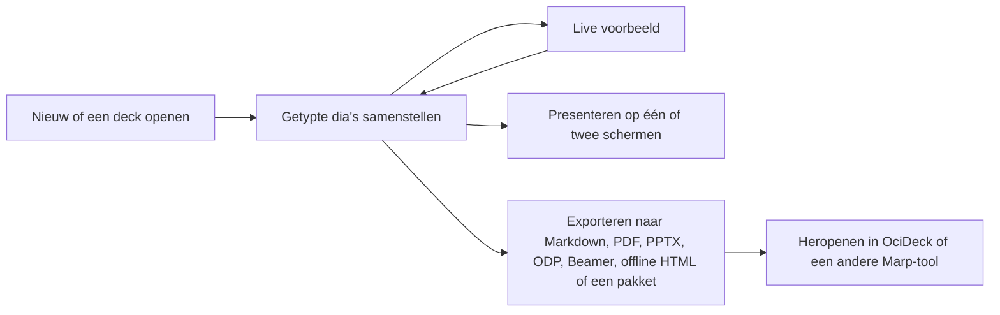

> 🤖 Machinevertaling — het Engelse bronbestand is leidend.
>
> _Machine translation — the English source document is authoritative. _

# OciDeck — Gebruikershandleiding

> **Status:** actuele gebruikershandleiding · **Status laatst nagekeken:** 2026-08-30 · **Uitgegeven door:** Stichting LibreKAT

## Inhoud

- [Decks maken en openen](#decks-maken-en-openen)
- [Opdrachtenpalet](#opdrachtenpalet)
- [De menubalk (macOS)](#de-menubalk-macos)
- [Opslag](#opslag)
- [S3-bucket](#s3-bucket)
- [Git-repository](#git-repository)
- [Afbeeldingsrechtencontrole](#afbeeldingsrechtencontrole)
- [WebDAV](#webdav)
- [Samen aan een deck werken](#samen-aan-een-deck-werken)
- [Slidetypes](#slidetypes)
- [De slidelijst ordenen](#de-slidelijst-organiseren)
- [Afbeeldingen en media reizen mee met de presentatie](#afbeeldingen-en-media-reizen-mee-met-de-presentatie)
- [Afbeeldingsbibliotheek](#afbeeldingsbibliotheek)
- [Opties per slide](#opties-per-slide)
- [Traffic Light Protocol (TLP)](#traffic-light-protocol-tlp)
- [Privacycontrole](#privacycontrole)
- [Wat te doen met een bevinding](#wat-te-doen-met-een-bevinding)
- [Diepgang — een managementversie en een technische](#diepgang--een-managementversie-en-een-technische)
- [Twee versies uit één bron](#twee-versies-uit-n-bron)
- [Redactie — gegevens weglaten](#redactie--gegevens-weglaten)
- [Presenteren](#presenteren)
- [Exporteren](#exporteren)
- [Toegankelijkheid](#toegankelijkheid)
- [Informatiebeveiligingsmodule (pentestrapporten)](#informatiebeveiligingsmodule-pentestrapporten)
- [Managementsysteemmodule (ISO-voortgangsrapportage)](#managementsysteemmodule-iso-voortgangsrapportage)
- [LibrePlan-connector (optioneel)](#libreplan-connector-optioneel)
- [Documenten](#documenten)
- [Markdown-modus](#markdown-modus)
- [Wat de browserversie niet kan](#wat-de-browserversie-niet-kan)
- [Thema's en taal](#themas-en-taal)

*(Toegevoegd 2026-07-22: dit document telt zo'n 5.300 regels en had geen andere ingang dan scrollen. In de app heeft de documentatielezer volledige zoekfunctie; op de repositorypagina niet. Getal gecorrigeerd 2026-07-24, 2026-07-30 en 2026-08-30; er stond 2.992, daarna 3.350, daarna 3.800, elk kloppend op het moment van schrijven.)*

OciDeck bouwt [Marp](https://marp.app/)-presentaties via een gestructureerde,
slide-voor-slide-editor. Je stelt getypeerde slides samen, bekijkt ze live,
presenteert ze (op één of twee schermen) en exporteert naar Markdown, PDF, PPTX,
OpenDocument (ODP), LaTeX/Beamer, een enkel offline HTML-bestand (één bestand, inclusief
afbeeldingen) of een portable `.ocideck`-pakket — zie [Exporteren](#exporteren).
Bestanden blijven standaard Marp-Markdown, dus een deck blijft bruikbaar in andere Marp-tools.
Een opgeslagen project schrijft een `.marprc.yml` naast de `.md` die het
gegenereerde thema registreert, dus de gewone Marp CLI-aanroep — **uitgevoerd
vanuit de projectmap** — laadt het zonder extra vlaggen:

```sh
marp deck.md -o out.html
```

Draai je Marp elders (of met `--no-config-file`), dan valt het terug op het
standaardthema en gaat de `section.split`-tweekolomslay-out verloren — dat is de
gedocumenteerde beperking, geen bug. Zie [Bestandsformaat §1.1](FILE_FORMAT.nl.md#11-marp-cli-config-marprcyml).
*(Geverifieerd 2026-08-27 tegen de echte Marp CLI door `make check-marp`, #1804.)*

In het kort verplaatst een deck zich als volgt door OciDeck:



## Decks maken en openen

- **Nieuw / Openen**: gebruik het welkomstscherm of `Ctrl/Cmd + O`. Meerdere decks
  openen in **tabbladen**. Een deck openen dat al open is, springt gewoon naar het
  bestaande tabblad — hetzelfde bestand wordt nooit in twee tabbladen tegelijk
  geladen, zodat je niet per ongeluk twee niet-gesynchroniseerde kopieën bewerkt.
  **Openen** accepteert zowel een plat Marp-`.md`-bestand als een draagbaar
  `.ocideck`-pakket (een zip met het deck en de bijbehorende assets): kies er een
  en OciDeck pakt het pakket voor je uit — het bestand op het venster slepen doet
  hetzelfde.
- **Het welkomstscherm** beantwoordt de vraag die je hebt vóór je een van de
  andere hebt. Onder het logo zegt één regel wat OciDeck maakt (presentaties die
  gewone Markdown-bestanden blijven). Onder *Nieuw* staan de twee manieren om te
  beginnen naast elkaar, in dezelfde accentkleur: **Nieuwe presentatie** en
  **Nieuw document**. Elke knop zegt zelf wat hij maakt, zodat geen van beide
  leest als de mindere van de twee. *(Gecorrigeerd 19-08-2026: onder de
  presentatieknop stond hoeveel sjablonen er klaarstonden. Een getal is niet wat
  iemand nodig heeft op de plek waar één handeling hoort — en wélke sjablonen het
  zijn, laat de kiezer zien, één klik verderop.)* Een knop
  **Gebruikershandleiding** naast *Instellingen* opent dit document in de
  ingebouwde lezer. Het zat vroeger drie
  klikken diep onder *Instellingen → Documentatie*, precies waar iemand die nog
  niets weet niet kijkt.
- **Beginnen vanuit een sjabloon**: het nieuwe-presentatiedialoogvenster biedt een
  doorzoekbare catalogus met vertrekpunten. *Leeg deck* is de standaardkeuze en
  is precies dat: één lege dia. De titel die je intypt blijft de deck-titel
  (front matter, tabbladlabel, bestandsnaam) en wordt niet op een dia gezet, dus
  er staat niets op het scherm totdat je het zelf typt. De rest loopt van
  ploegbriefings, beveiligings- en privacywerkdecks, crisis- en
  vluchtvoorbereidingssessies, **besluit- en budget**-decks, **rolspecifieke
  overdracht- en veiligheidssjablonen**, **sector**-sjablonen voor de publieke
  sector, het onderwijs en verenigingen, en **gespreksvoorbereiding**-sjablonen.
  De besluit-en-budgetset draagt de vergaderingen waar geld en go/no-go op tafel
  liggen: een businesscase / investeringsvoorstel, een budgetpresentatie, een
  besluitvormingsvergadering met een besluitenlijst en toegewezen acties, een
  sprintreview/demo, en een threat-modelingsessie (scope, dataflows,
  vertrouwensgrenzen en dreigingen per STRIDE-categorie). De rolspecifieke set
  volgt erkende methoden uit veiligheidskritisch werk: medische, zorg- en
  sociaaldomeingesprekken (SBAR, (A)MIST-trauma, de WHO-checklist voor veilige
  chirurgie, de verpleegkundige ploegoverdracht, het multidisciplinair overleg,
  een familiegesprek over zorg en mantelzorg, en een geanonimiseerde
  casusbespreking in het sociaal domein), de onboarding- en HR-levenscyclus (een
  30-60-90-onboardingplan, introductie op de eerste dag, buddy-/mentorplan,
  offboarding, en een adviesaanvraag aan de ondernemingsraad), luchtvaart (de
  IMSAFE-fitheidscheck, een crew-/vertrekbriefing, een passagiersbriefing voor
  kleine vliegtuigen, een vluchtdebrief met een TEM-terugblik, en een
  just-culture-voorvalmelding), fysieke beveiliging en werkplekveiligheid (een
  toolbox-/LMRA-check, evenement- en crowdsafety-briefing, ontruimingsoefening en
  werkvergunning), hulpdiensten (de METHANE-grootschaligincidentmelding,
  GRIP-opschaling, een brandweerbriefing voor inzetten en oefeningen, en een
  after-actionreview/debrief) en de maritieme brugvaartbriefing. De
  sectorsjablonen dekken een raads-/collegevoorstel en een
  bewonersparticipatiebijeenkomst voor de publieke sector, een
  ouderinformatieavond en een stagepresentatie voor het onderwijs, en een
  algemene ledenvergadering (ALV) voor verenigingen. De familie
  **gespreksvoorbereiding** opent met twee generieke vertrekpunten — het
  voorbereiden van elk gesprek dat je goed wilt doen, en het voorbereiden van een
  *cruciaal* gesprek (hoge belangen, sterke emoties, volgens de methode *Crucial
  Conversations*) — naast de scenariospecifieke sjablonen (sollicitatiegesprek,
  functioneringsgesprek, salarisonderhandeling, vragen om meer
  verantwoordelijkheid, een werkkwestie aankaarten, een conflict oplossen, kritiek
  geven of ontvangen, slecht nieuws brengen, grenzen stellen, een gespannen
  relatie, klant- en verkoopgesprekken, leveranciersonderhandelingen, een pitch,
  of draagvlak krijgen in een vergadering). De emotionele scenario's met hoge
  belangen verweven dezelfde methode *Crucial Conversations*; elk komt met
  invulbare voorbereidingstabellen en een voortgangschecklist. Alles is
  plaatshoudertekst die je overschrijft met je eigen inhoud.

  **De voorbeeldslides in een sjabloon bestaan in het Nederlands en het Engels.**
  De inhoud van een sjabloon is een meegeleverd Markdown-document per taal, gelezen
  door dezelfde parser die elk deck opent: met een Nederlandstalige interface krijg
  je het Nederlandse document, met elke andere interfacetaal het Engelse. Wanneer
  je interfacetaal geen van beide is, zegt de kiezer dat boven de lijst — en op
  het welkomstscherm zegt de zweeftekst op *Nieuwe presentatie* hetzelfde: de voorbeeldslides zijn Engels, terwijl de naam en beschrijving
  van het sjabloon nog steeds je eigen taal volgen. Dat de slide-inhoud bij twee
  talen stopt is een keuze, geen omissie: sjablooninhoud wordt *jouw* inhoud op het
  moment dat het deck wordt gemaakt, dus het bestaat als een document per taal of
  helemaal niet — het door de interfacevertaallaag halen zou wat een document zegt
  laten afhangen van de menutaal waarin het toevallig is gemaakt. *(Gecorrigeerd
  2026-07-23: tot #622 bestonden de voorbeeldslides alleen in het Nederlands, als
  code in plaats van als documenten.)*
- **Beginnen vanuit een presentatie die je al hebt**: een PowerPoint-, Keynote- of
  Impress-bestand kan worden omgezet naar een bewerkbaar OciDeck-deck — zie
  [Presentaties importeren](#presentaties-importeren-powerpoint-keynote-impress)
  voor wat die omzetting wel en niet overleeft. Het zit achter de optionele module
  *Importeren*, dus je ziet het pas als je die inschakelt.
- **Geopend vanuit een URL**: een deck opgehaald van een webadres (de URL-import,
  of een `?deck=…`-deellink op de webbuild) toont een privacybadge **“Extern”** in
  de statusbalk. Het openen van zo'n link heeft je apparaat contact met die server
  laten leggen; beweeg over de badge om de bronhost te zien. Decks die je van je
  eigen schijf opent, dragen geen badge.
- **Opslaan**: `Ctrl/Cmd + S`. Bij het opslaan wordt een nette projectmap naast je
  `.md` neergezet (`images/`, `data/`, `logos/`, `themes/`) en worden assets erin
  gekopieerd. Zie [`FILE_FORMAT.md`](FILE_FORMAT.md).
- **Terwijl een opslag loopt** verandert de opslagchip links in de statusbalk in
  een draaiend pictogram dat de bestemming noemt — *Opslaan…*, *Uploaden naar
  WebDAV…*, *Uploaden naar S3…*, *Committen naar git…* — en de opslagknop in de
  werkbalk staat uitgeschakeld tot het klaar is. Opslaan naar een server is één
  upload per mediabestand, en een git-commit is meerdere heen-en-weertjes; op een
  trage lijn was dat vroeger niet te onderscheiden van een vastgelopen app, dus
  klikten mensen opnieuw, en nog eens. De bestemming wordt genoemd omdat die je
  vertelt of je je schijf of je verbinding de schuld moet geven.
- **Crashherstel**: onopgeslagen werk wordt automatisch als momentopname bewaard en
  na een onverwachte afsluiting weer aangeboden. De momentopname draagt de
  decktekst, je gebruikersnotities en de tekenlaag mee, zodat een deck waar je
  alleen op hebt getekend terugkomt met de tekeningen erop. **In de browser is er
  helemaal geen crashherstel** — geen map om een momentopname naar weg te schrijven
  — en de app zegt dat één keer, zodra je je eerste bewerking maakt. Zolang
  onopgeslagen werk open is, vraagt de browser ook om bevestiging voordat het
  tabblad sluit; de formulering van die vraag is die van de browser zelf en kan
  niet door de app worden ingesteld. Op desktop stelt het venster dezelfde vraag
  zelf.
- **Sporen op dit apparaat**: *Instellingen → Beveiliging → Sporen op dit apparaat*
  toont wat OciDeck lokaal bewaart en laat je het verwijderen: de recent-lijst (die
  het volledige pad en de TLP-classificatie bewaart van elk deck dat je opende), de
  crashherstelmomentopnamen, en een volledige reset die ook de git-werkkopieën en
  de wachtwoorden in je sleutelbos wist. Je presentaties worden nooit aangeraakt.
  Een git-verbinding verwijderen neemt nu de werkkopie mee — tenzij er nog commits
  wachten om gepusht te worden, in welk geval OciDeck ze noemt en eerst vraagt.

## Opdrachtenpalet

Druk op `Ctrl/Cmd + K` voor een doorzoekbare lijst met de gangbare acties —
presenteren, exporteren, opslaan, **ongedaan maken** en **opnieuw**, **zoeken**,
een grafiek toevoegen, zoeken en vervangen, de afbeeldingsbibliotheek,
markdown-/visuele modus schakelen, volledige-deckvoorbeeld, nieuw tabblad, openen,
pakket-/URL-import, **presentatie-eigenschappen**, instellingen, **deze
gebruikershandleiding**, **het sneltoetsenoverzicht**, en het instellen van elk
TLP-niveau. Begin te typen om te filteren (accenten en hoofdletters doen er niet
toe), gebruik `↑`/`↓` om te verplaatsen, `Enter` om uit te voeren, en `Esc` om te
sluiten. Acties die nog niet beschikbaar zijn (bijvoorbeeld exporteren voordat je
hebt opgeslagen, of ongedaan maken zonder dat er iets ongedaan te maken is)
blijven zichtbaar maar grijs. Het palet zit ook in het `⋮`-menu.

Ongedaan maken en opnieuw waren de opvallende afwezigen: ze bestonden als twee
kleine werkbalkpictogrammen en nergens anders, terwijl het palet de plek is waar
een functie in deze app wordt gevonden.

## De menubalk (macOS)

Op macOS heeft de app een echte menubalk — **OciDeck, Bestand, Bewerken,
Presentatie, Venster, Help** — met dezelfde acties die de werkbalk en het palet
bieden, plus knippen/kopiëren/plakken/alles selecteren en de standaard
vensteritems. Die bestaat omdat op macOS de menubalk de plek is waar je ontdekt
wat een programma kan zonder al te weten waar je moet kijken. Items die een open
presentatie vereisen, blijven zichtbaar en worden grijs in plaats van te
verdwijnen.

Windows en Linux nemen hun venstermenu over van de desktopomgeving en de
browserbuild heeft er geen, dus deze balk is alleen voor macOS. De volledige lijst
met menu's en hun toetsen staat in [SHORTCUTS.md](SHORTCUTS.md).

## Opslag

Alles over *waar je decks leven* zit onder *Instellingen → Opslag*, als één lijst:
**Bestandsverbindingen**.

Een verbinding is een plek waar je presentaties vandaan komen en naartoe gaan.
Mappen op deze computer, WebDAV-servers, S3-buckets en git-repository's staan
allemaal in die ene lijst, door elkaar — omdat de vraag die je eigenlijk stelt is
"waar leeft het werk van deze klant?", niet "welk protocol is dit?". Geef elke een
naam (*Klant A – Nextcloud*, *Privé*) zodat je ze in één oogopslag uit elkaar kunt
houden.

**De online soorten zijn een module** (#570). WebDAV, S3 en git leven achter de
kaart **Online opslag** op *Instellingen → Uitbreidingen (Extensions)*, standaard
uit, zodat iemand die kwam om slides te maken niet drie servertypes voorgeschoteld
krijgt voordat de eerste slide bestaat — en omdat een deel van die routes tot nu
toe vooral tegen testomgevingen is beproefd, hoort het kiezen ervan een beslissing
te zijn, geen ongeluk; de kaart zegt dat. Met de module uit biedt *Verbinding
toevoegen* alleen lokale mappen; alles lokaal — bestanden, mappen, pakketten —
werkt ongewijzigd. Als je al een online verbinding hebt geconfigureerd, start de
module **aan** (standaard-uit is voor nieuwe installaties, niet voor een werkende
opzet), en het uitschakelen verbergt nooit bestaande verbindingen, het git-menu of
in de wachtrij staand offline werk: het stopt alleen dat er *nieuwe* online
verbindingen worden toegevoegd.

Het `…`-menu volgt hetzelfde idee: **één** *Openen vanuit…* en **één** *Opslaan
naar…*, niet een paar per protocol. Beide beginnen met dezelfde vraag — welke
verbinding — en die vraag wordt volledig overgeslagen wanneer je er maar één hebt,
zodat een opzet met één server nooit een kiezer ziet.

**Opslaan gaat terug naar waar het deck vandaan kwam.** Open een deck van een
WebDAV-server en de gewone opslagknop (of `Ctrl/Cmd+S`) schrijft het terug naar
die server, op hetzelfde pad, in hetzelfde formaat. Hetzelfde geldt voor S3 en git.
Je hoeft nooit te onthouden welke van meerdere opslagopdrachten past bij waar je
opende — dat verkeerd hebben zou de bewerkte versie op je laptop laten terwijl de
server de oude hield, en je zou geen manier hebben om dat te merken.

*Opslaan naar…* is de uitzondering: het zet het deck ergens **anders** neer,
opzettelijk. Gebruik het om een deck tussen verbindingen te verplaatsen of te
kopiëren.

- **Voeg** er een toe met *Verbinding toevoegen* en kies de soort. Een map is klaar
  zodra je hem kiest; een WebDAV-server, S3-bucket of git-repository opent
  meteen zijn instellingen zodat je ze kunt invullen.
- **Volgorde doet ertoe.** Sleep verbindingen met de greep aan de linkerkant. De
  bovenste bruikbare verbinding *van elke soort* is de standaard voor die soort:
  het is de bibliotheek waar openen en opslaan vanaf beginnen, en de server waar de
  app naar reikt wanneer hij het niet vraagt. Dus een verbinding naar boven halen
  is hoe je zegt "dit is de klant waar ik nu aan werk" — zonder iets te
  verwijderen.
- **Elke rij toont zijn status**: de mapnaam, de serverhost, de bucketnaam, of
  `eigenaar/repo`, in het groen zodra de verbinding bruikbaar is en grijs terwijl
  hij nog onvolledig is. Een halfingevulde verbinding blijft in de lijst staan; hij
  telt alleen niet als bruikbare bron.
- **Exportmap** is waar exports terechtkomen. Laat het leeg en ze komen naast het
  presentatiebestand terecht.

Wanneer een actie een server nodig heeft en je hebt er meer dan één van die soort,
vraagt OciDeck welke. Met precies één vraagt hij helemaal niet, en een deck dat je
van een verbinding opende slaat zonder vragen terug op naar diezelfde verbinding —
dat geldt voor git net zo goed als voor WebDAV. Acties die bij een open deck horen
(zijn geschiedenis, zijn versies, review, merge, taggen) vragen nooit: ze volgen de
repository waar het deck vandaan kwam. Als je die verbinding hebt verwijderd, zegt
OciDeck dat in plaats van naar een andere te gissen.

Upgraden vanaf een oudere versie kost geen werk: je bibliotheken, je WebDAV-server
en je git-repository worden verbindingen in die volgorde, zodat de verbindingen die
de standaard waren de standaard blijven.

De netwerksoorten worden hieronder volledig beschreven.

## S3-bucket

Je kunt decks bewaren in een S3-bucket: AWS S3, of elke S3-compatibele dienst —
MinIO op je eigen server, Ceph, Wasabi, Scaleway, Hetzner.

- **Stel het in** op een S3-verbinding in *Instellingen → Opslag*: het
  **endpoint** (`https://s3.eu-central-1.amazonaws.com`, of je eigen
  `https://minio.example.org`), de **bucket**, de **regio**, en een **access key
  ID** met de bijbehorende **secret access key**. De secret wordt versleuteld
  opgeslagen in de sleutelbos van je besturingssysteem, nooit in het
  instellingenbestand.
- **Adressering** bepaalt waar de bucketnaam in de URL komt. AWS wil hem in de
  hostnaam; de meeste zelfgehoste endpoints willen hem in het pad. Als een bucket
  die zeker bestaat als "niet gevonden" terugkomt, is dit bijna altijd de
  instelling die je moet veranderen.
- **Regio** doet ertoe, zelfs als het niet zo lijkt: een verkeerde regio wordt
  afgewezen met dezelfde fout als een verkeerde sleutel. Diensten die geen eigen
  regio's hebben, accepteren `us-east-1`.
- **Prefix** is optioneel en werkt als een map: vul `presentations` in en bladeren
  begint daar en decks komen daar terecht.
- **Vertrouwd intern endpoint** is nodig wanneer het endpoint op een privé- of
  thuisnetwerk draait, wat het normale geval is voor je eigen MinIO. Zonder dat
  weigert de SSRF-bescherming de verbinding.

**Openen en opslaan** via *Openen vanuit…* en *Opslaan naar…* in het
bestandsmenu — dezelfde twee ingangen die voor elke soort opslag worden gebruikt.
Een deck dat je uit een bucket opende slaat zonder vragen terug op naar diezelfde
bucket, net zoals bij WebDAV en git. Je kiest tussen één `.ocideck`-pakket en een
plat `.md` met zijn assetmappen, precies zoals bij WebDAV.

Eén verschil met de andere soorten is het weten waard. S3 is objectopslag, geen
bestandssysteem, en de bescherming tegen twee mensen die elkaars werk overschrijven
hangt af van of het endpoint *conditionele schrijfacties* ondersteunt. AWS doet dat
sinds 2024; andere implementaties variëren. Waar een endpoint dat niet doet, zegt
OciDeck dat in plaats van stil te overschrijven — gelijktijdig bewerken is daar
minder goed beschermd dan op WebDAV.

## Git-repository

Je kunt decks openen vanuit een git-repository — je eigen Forgejo, voorlopig. Elke
opgeslagen versie blijft opvraagbaar, wat een gewone map je niet kan geven.

- **Stel het in** op een git-verbinding in *Instellingen → Opslag*: de server-URL
  (`https://git.example.org`), de eigenaar (gebruiker of organisatie), de
  repositorynaam, en een **personal access token**. Beperk het token tot alleen
  die repository waar je forge dat ondersteunt; het paneel spelt per forge uit
  welke rechten het nodig heeft — lezen en schrijven op de repository, en voor
  GitLab daarbovenop `read_api` als je zijn server-side zoekfunctie wilt. Het wordt
  versleuteld opgeslagen in de sleutelbos van je besturingssysteem, niet in het
  platte instellingenbestand. Een openbare repository heeft helemaal geen token
  nodig.
- **Zelfgehost op een privéadres**: vink **Vertrouwde interne server** aan,
  dezelfde waarborg als voor Nextcloud.
- **De statusregel van elke verbinding** heeft drie toestanden, niet twee: *niet
  ingesteld* (grijs), *ingesteld maar nooit getest* (oranje — de velden invullen is
  niet hetzelfde als weten dat ze werken), en *werkte*, met de datum en tijd in de
  tooltip. Een geslaagde verbindingstest wordt onthouden over herstarts heen. De
  server veranderen wist hem, omdat het eerdere resultaat over iets anders ging;
  een *mislukte* test wist niets, want die bewijst alleen dat de verbinding nú weg
  is.
- **Branch**: laat hem leeg en de verbindingstest neemt over wat de forge als zijn
  standaard rapporteert — dat is het gangbare geval, en de enige manier waarop een
  repo op `master` werkt zonder dat je het hoeft te weten. Vul iets in en de test
  wijst op een mismatch maar laat je keuze staan.
- **Test de verbinding** voordat je opslaat. Eén aanroep beantwoordt vier vragen
  tegelijk, en elk antwoord voorkomt een storing die je anders pas bij je eerste
  opslag zou tegenkomen:
  - of de repository überhaupt bereikbaar is met dit token;
  - **hoe zijn standaardbranch heet**. Hier is geen veld voor, dus het zou anders
    op `main` blijven staan — een repository op `master` zou simpelweg niet werken.
    De test neemt over wat de forge rapporteert en zegt dat.
  - of de repository nog leeg is (prima — je eerste opslag vult hem);
  - of het token mag schrijven. Een alleen-lezen token toont als een waarschuwing
    in plaats van een fout: de verbinding werkt, maar opslaan zou later mislukken.
- De git-ingangen hieronder verschijnen pas in het `…`-menu **zodra een repository
  is geconfigureerd**. Tot dan zijn ze verborgen in plaats van getoond-maar-falend,
  zodat het menu nooit een actie biedt die niet kan slagen.
- **Werk dat op een verbinding wacht** toont in de statusbalk, in oranje, met een
  telling over al je git-verbindingen. Opslaan terwijl de forge onbereikbaar is
  houdt het deck op deze computer tot er weer een verbinding is; de balk is wat je
  vertelt dat het er nog staat. Hij blijft stil als er niets wacht, en hij is niet
  klikbaar — gebruik *Wachtrij legen* in het `…`-menu om het nu te versturen.
- **Openen** via het `…`-menu (*Openen vanuit…*, dan de repository kiezen): het
  deck wordt opgehaald, gecontroleerd door dezelfde veiligheidsscan als elk ander
  deck, en geopend. Een repository is niet-vertrouwde invoer — dat het van je eigen
  forge komt maakt het niet vertrouwd.
- **Opslaan** met de gewone opslagknop, of *Opslaan naar…* om ergens anders te
  publiceren: het deck wordt teruggeschreven als één commit — de markdown, zijn
  afbeeldingen en media, die precies zo in de gedeelde pool gaan als het openen ze
  leest, de gekoppelde grafiekgegevensbestanden, en je notities. Een deck dat je uit
  git opende biedt zijn eigen naam aan en werkt ter plekke bij; een nieuw deck wordt
  gepubliceerd door een naam te kiezen (het wordt `decks/<naam>`). Als iemand de
  branch heeft verplaatst sinds je het opende, wordt het opslaan geweigerd zodat je
  hun werk niet overschrijft — herlaad en sla opnieuw op.
- **Elke laag van een gewoon deck reist naar git.** Een commit draagt `deck.md`, de
  afbeeldingen **en** de video en audio in de gedeelde pool, de gekoppelde
  grafiekgegevensbestanden, je notities, de tekeningen op je slides
  (`deck.ink.json`, #541), de terzijde gelegde privacybevindingen
  (`deck.dismissals.json`, #651) en — voor een pentestrapport — de
  MIAUW-beslissing (`deck.miauw.json`, #756). Een terzijde legging is een
  reviewbeslissing over het rapport, zodat een tweede reviewer die het deck uit de
  repository opent niet opnieuw beoordeelt wat een collega al oordeelde; twee
  reviewersoordelen mergen per unie, laatste wijziging wint per bevinding. De
  beslissing volgt dezelfde redenering: waivers en bevestigingen mergen per unie
  per eis, de als laatste genomen beslissing wint, en er een intrekken is zelf een
  beslissing die de merge overleeft — een waiver die een reviewer net herriep komt
  niet stilletjes van de andere kant terug. Het zegel en de handtekening reizen ook
  mee (`deck.seal.json`, #541): een verzegeld rapport dat uit een repository
  terugkomt leest nog steeds als verzegeld. Git bewaart het zegel; wat het zegel
  *betekent* — het rapport is afgerond en alleen-lezen — bewaakt de app zelf. Eén
  eerlijke noot: de hash van het zegel dekt het originele `.md`-bestand, dus een
  deck dat uit git wordt geopend toont zijn zegel als "hier niet verifieerbaar" in
  plaats van vals-intact — verifieer tegen het originele bestand, precies zoals bij
  een `.ocideck`-pakket. *(Gecorrigeerd 2026-07-23: een verzegeld deck werd vroeger
  op een werkbranch ronduit geweigerd — dat liet het geen enkele weg een repository
  in, en de weigering is ingetrokken.)* *(Hier stond vroeger een blokkerend
  "niet-alles-reist-mee"-dialoogvenster dat telde wat achterbleef. Het kromp met
  elke laag die leerde mee te reizen — media, grafiekgegevens, notities — en met de
  tekeningen aan boord had het voor een gewoon deck geen echte regel meer, dus het
  is weg: een waarschuwing die meer opsomt dan er daadwerkelijk misgaat, is er een
  die mensen leren in zijn geheel weg te klikken.)*
- **Je notities reizen mee, en de notities van je co-auteurs mergen.** De notities
  leven naast het deck in de repository als `deck.user-notes.json`, zodat twee
  mensen die notities op verschillende slides schrijven allebei de hunne houden
  wanneer hun werk samenkomt. Twee mensen die *dezelfde* notitie herschrijven is een
  echte onenigheid en git zal dat zeggen. Je laatste notitie wissen verwijdert het
  bestand, zodat een notitie die je verwijderde niet terugkomt de volgende keer dat
  je het deck opent.
- **Je tekeningen reizen mee, en mergen door samenvoegen.** De annotatielaag leeft
  naast het deck als `deck.ink.json`. Twee mensen die op hetzelfde deck tekenden
  waren het niet oneens — ze tekenden allebei — dus wanneer hun werk samenkomt
  worden de streken van beide kanten bewaard. Wissen is de ene uitzondering met
  tanden: een gewiste streek wordt als gewist onthouden, zodat hij weg blijft, ook
  na een merge met iemand die hem nog had. Een verwijdering die terugkomt is erger
  dan een die niet werkt, omdat je hem zag verdwijnen.
- **Verlies je verbinding tijdens het opslaan** en de tekst van het deck wordt
  lokaal bewaard en in de wachtrij gezet in plaats van te falen — je ziet
  "opgeslagen, synchroniseert wanneer je weer online bent". De wachtrij overleeft
  het sluiten van de app; hij leegt bij je volgende geslaagde opslag en via *Nu
  synchroniseren* in het `…`-menu. Een afbeelding die je offline toevoegt wordt
  gepoold en gecommit wanneer de wachtrij synchroniseert, zodat een herverbinding
  het hele deck krijgt — tenzij je de app eerst sluit (een onopgeslagen afbeelding
  in het geheugen overleeft geen herstart, dezelfde beperking die een gewoon
  opgeslagen deck al heeft). Je tekst is altijd veilig.
- **Welke forge**: kies het **forgetype** op de git-verbinding in *Instellingen →
  Opslag* — Forgejo/Gitea, GitHub of GitLab — naast de server-URL, eigenaar en
  repository. Alles hieronder werkt hetzelfde welke je ook kiest; alleen het token
  verschilt (een personal access token in alle drie, maar elk noemt het net iets
  anders). Op GitLab kan de deckbrowser geen bestandsgroottes tonen: zijn overzicht
  bevat ze niet.
- **Indeling**: een repository bevat veel decks onder `decks/<naam>/deck.md`, met
  afbeeldingen gedeeld in één `assets/`-pool zodat dezelfde afbeelding één keer
  wordt opgeslagen.
- **Bewerken gebeurt op een conceptbranch — *Uitbrengen ter review…*.** Wanneer je
  een deck bewerkt dat uit git is geopend, komen je opslagacties niet meteen op de
  main-branch terecht. De eerste opslag van een bewerkingsronde start een gedateerde
  *concept*-branch (`decks/<naam>/<datum>`) en elke opslag gaat daarheen; je hoeft
  hem nooit te benoemen of te kiezen. Dit werkt hetzelfde op het REST- en het
  native-git-vlak, en blijft offline-veilig — een ronde kan op een vlak beginnen en
  de branch wordt bij herverbinding voor je aangemaakt. Wanneer het klaar is, opent
  *Uitbrengen ter review…* in het `…`-menu een pull request van je concept naar de
  main-branch, zodat het kan worden gereviewd voordat het naar buiten gaat; je krijgt
  de link terug. Als je organisatie een TLP-uitgifteplafond heeft ingesteld, wordt de
  uitgifte getoetst aan de **strengste** classificatie waar dan ook in het deck (een
  enkele `TLP:RED`-slide telt), en een deck boven het plafond wordt geweigerd voordat
  er iets wordt gepusht.
- **Merge het concept en leg de versie vast — *Concept mergen…* en *Versie
  vastleggen…*.** Zodra de review klaar is, mergt *Concept mergen…* de pull request
  in de main-branch (je kunt hem de conceptbranch laten opruimen) en zet je tabblad
  terug op de main-branch, zodat je volgende bewerking een verse ronde start.
  *Versie vastleggen…* legt vervolgens de versie die je presenteerde vast als een
  release-tag (`decks/<naam>/vX`) op de main-branch — dezelfde versies die
  *Versies…* opsomt en alleen-lezen opent. Een versie vastleggen doorstaat dezelfde
  classificatietoets als uitbrengen ter review, zodat een versie nooit voorbij zijn
  plafond kan worden getagd.
- **Als iemand anders tegelijkertijd bewerkte, wordt het gemerged.** Opslaan stuurt
  je niet langer terug om te herladen. OciDeck vergelijkt waarvan je begon, wat je
  ervan maakte, en wat zij ervan maakten, en mergt de twee. Bewerkingen aan
  verschillende slides, identieke bewerkingen en herordeningen lossen zichzelf op en
  je opslag gaat gewoon door. Alleen slides die jullie allebei anders wijzigden — of
  waar een van jullie verwijderde wat de ander bewerkte — worden je per slide als
  keuze voorgelegd, met je eigen versie behouden tot je kiest. Geen van beider werk
  wordt weggegooid. Als de classificatie van het deck verschilt, wint de strengere
  van de twee. Dit werkt zowel in de browser als op desktop met native `git`; op
  desktop wordt het een echte merge-commit, zodat `git log` de twee werklijnen laat
  zien die samenkomen.
- **Native git (desktop):** als je `git` geïnstalleerd hebt (2.19 of nieuwer),
  toont de git-verbinding in *Instellingen → Opslag* dat, en houdt OciDeck een echte
  kloon van de repository bij. Dan **is elke opslag een echte lokale commit** —
  duurzaam en offline: bewerk weg van een netwerk, sla zo vaak op als je wilt, en
  elke commit staat klaar om te pushen wanneer je herverbindt (*Nu synchroniseren*,
  of automatisch bij je volgende geslaagde opslag). Als iemand de branch verplaatste
  terwijl je offline was, wordt je commit veilig op je machine bewaard en de
  synchronisatie aangehouden in plaats van hun werk te overschrijven. Op het web, of
  een desktop zonder `git`, wordt de REST-route hierboven gebruikt en verandert er
  niets. Op macOS kijkt de controle eerst naar de Xcode-command-line-tools, zodat
  hij je nooit vraagt iets te installeren. Zodra een deck op deze manier uit git
  open is, toont *Git-geschiedenis…* in het `…`-menu zijn committijdlijn, met een
  badge op elke commit voor of hij al op de forge staat of nog wacht om te pushen.
- **Een eerdere versie openen — *Versies…*.** Wanneer een deck als versie is
  uitgebracht, somt *Versies…* in het `…`-menu die versies op, nieuwste eerst. Kies
  er een om hem **alleen-lezen** te openen: een momentopname van hoe het deck bij die
  release was, om naar te kijken — niet iets waar je overheen kunt opslaan, zodat het
  reviewen van een oude versie nooit je huidige werk kan overschrijven. Dit werkt ook
  in de browser.
- **Vergelijk twee versies — *Vergelijken…*.** In diezelfde lijst laat
  *Vergelijken…* je twee releases kiezen en zien wat er tussenin veranderde: slides
  toegevoegd, verwijderd, gewijzigd of verplaatst. Een deck heeft geen slide-ID's,
  dus slides worden op hun inhoud gematcht — een identieke slide wordt herkend, zelfs
  als hij verplaatste, en een geherformuleerde slide verschijnt als één
  *gewijzigd*-item in plaats van een toevoeging plus een verwijdering. Voor een
  gewijzigde slide toont *Verschillen* de twee naast elkaar met de afwijkende velden
  opgesomd.
- **Doorzoek elk deck — *Zoeken in alle decks…*.** Zoeken en vervangen werkt binnen
  het deck dat je open hebt; dit doorzoekt elk deck in de repository. Elke treffer
  noemt het deck en de slide waar hij op staat, met de regel waarin hij is gevonden,
  zodat je een terloopse vermelding kunt onderscheiden van de slide die je
  daadwerkelijk wilde. Kies een treffer en dat deck opent. Twee dingen die het je
  vertelt in plaats van te verbergen: als een deck niet kon worden gelezen wordt het
  als overgeslagen genoemd (de treffers die je wél ziet zijn nog steeds echt), en als
  er meer treffers waren dan pasten zegt het dat in plaats van de lijst stil af te
  kappen. Op desktop, wanneer de repository lokaal is gekloond, gebruikt het
  `git grep` om alleen de decks te lezen die de term daadwerkelijk bevatten — veel
  sneller dan elk deck te lezen. Zonder een lokale kloon (in de browser) vraagt het
  op GitLab de eigen codezoekfunctie van de forge welke decks matchen en leest het
  alleen die; die route is index-gebaseerd, dus een deck dat momenten geleden is
  gewijzigd is misschien nog niet meegenomen — het dialoogvenster zegt dat wanneer
  dat het geval is. Wanneer geen van beide beschikbaar is, valt het terug op het
  scannen van elk deck, en daarom draait het wanneer je op *Zoeken* drukt — niet
  terwijl je typt. (Gitea/Forgejo heeft helemaal geen code-zoek-API, en die van
  GitHub matcht alleen hele woorden, zodat het stilletjes een deck zou missen dat je
  op een fragment zocht — beide vertrouwen daarom op `git grep` of de volledige
  scan.)
- **Welke decks een afbeelding gebruiken — *Afbeeldingen in de repository…*.**
  Afbeeldingen worden één keer opgeslagen en gedeeld door elk deck dat ze gebruikt,
  dus voordat je er een aanraakt helpt het te weten wie er nog meer van afhangt. Dit
  overzicht somt elke afbeelding in de repository op met de decks die ernaar
  verwijzen. Drie antwoorden zijn mogelijk, en het verschil doet ertoe: een deck
  gebruikt hem; geen deck gebruikt hem meer maar een *uitgebrachte versie* nog wel
  (hem verwijderen zou een versie breken die je al presenteerde); of niets verwijst
  er überhaupt naar. Die laatste groep staat onderaan opgesomd als suggestie — het is
  wat deze branch kan zien, en een andere branch gebruikt ze misschien nog. Als een
  deck of een uitgebrachte versie niet kon worden gelezen, wordt de suggestielijst
  helemaal achtergehouden en zegt het overzicht welke onleesbaar was, omdat de
  onleesbare de enige gebruiker van een afbeelding zou kunnen zijn en een
  verwijdering niet ongedaan kan worden gemaakt. Een afbeelding verwijderen blijft een
  handmatige handeling; dit scherm vertelt je alleen wat je zou verwijderen.
- **Een repository is een vertrouwensgrens.** Iedereen die hem kan lezen leest
  *elk* deck erin, dus gebruik één repository per klant, opdracht of
  classificatieniveau — de rechten van de forge zijn wat ze scheiden, niet OciDeck.

Anders dan WebDAV werkt dit ook in de browserversie.

## Afbeeldingsrechtencontrole

De optionele uitbreiding **Afbeeldingsrechten** helpt een repositorybeheerder
afbeeldingen te vinden die mogelijk een rechtentoets nodig hebben. Schakel hem in
onder *Instellingen → Uitbreidingen (Extensions) → Afbeeldingsrechten*. Hij is
standaard uit.

Dit is een waarschuwingssysteem, geen auteursrechtelijk oordeel. De controle draait
lokaal, uploadt geen afbeeldingsbytes en voert geen reverse-image-zoekactie uit. Hij
kan ontbrekend of verlopen licentiebewijs, ingebedde
auteur-/copyright-/licentiemetadata en bekende stockbibliotheekmarkeringen in
bestandsnamen herkennen. Hij kan geen auteurschap, de territoriale reikwijdte van een
licentie, citaatrecht, toestemming of fair use vaststellen. Een schoon resultaat
betekent daarom alleen dat deze lokale regels geen reden vonden om te waarschuwen.

Er zijn twee manieren waarop een beoordeling wordt gemaakt:

- **Bij toevoeging.** Terwijl de uitbreiding is ingeschakeld, wordt een afbeelding
  die nieuw aan de gedeelde pool wordt toegevoegd tijdens een git-opslag in dezelfde
  commit beoordeeld.
- **Over de repository heen.** Kies *Afbeeldingsrechten controleren…* in het
  `…`-menu, selecteer een geconfigureerde git-repository, en OciDeck controleert elke
  ondersteunde afbeelding onder `assets/` op zijn standaardbranch. Ontbrekende of
  verouderde beoordelingen worden gecommit als *Scan afbeeldingsrechten*; actuele
  resultaten worden hergebruikt.

Het reviewdialoogvenster is een wachtrij, geen modale blokkade. Voor elk exact
signaal kan een beheerder **Rechten aangetoond**, **Valse positief** of **Niet
gebruiken** vastleggen en een notitie toevoegen. De eerste twee beslissingen
verwijderen die waarschuwing; *Niet gebruiken* laat hem bewust zichtbaar. OciDeck
voegt de beslissing toe aan de beoordeling en commit die als *Beoordeel
afbeeldingsrechten*, zodat een andere beheerder dezelfde uitkomst ziet en de
audithistorie beschikbaar blijft. Als een latere scan een wezenlijk ander signaal
vindt, wordt dat nieuwe signaal niet gesmoord door de eerdere acceptatie.

De uitbreiding uitschakelen verbergt de menuactie en stopt de beoordeling van nieuw
toegevoegde afbeeldingen. Bestaande beoordelingen en beheerdersbeslissingen blijven
in de repository; het uitschakelen van een interface-uitbreiding verwijdert nooit
auditgegevens. De registraties leven op
`.ocideck/asset-assessments/<sha256>.json`, gescheiden van een deck omdat één
gepoolde afbeelding door meerdere decks kan worden gebruikt.

Voor onderhoud of CI draai je `dart run tool/scan_asset_rights.dart [repository]`.
Voeg `--json` toe (of `--format=json`) voor machineleesbare uitvoer. Openstaande
bevindingen laten het commando niet falen: ze vereisen menselijk oordeel. Exitstatus
2 betekent dat een of meer afbeeldingsbestanden niet konden worden gelezen, dus de
ronde was onvolledig.

## WebDAV

Je kunt een map op een WebDAV-server als bron voor decks en assets gebruiken.
Nextcloud is de meest voorkomende, maar elke WebDAV-server werkt.

- **Kies het servertype** op de WebDAV-verbinding in *Instellingen → Opslag*. Dit is
  het enige dat verschilt tussen servers — het protocol eronder is gewoon WebDAV in
  beide gevallen:
  - **Nextcloud of ownCloud** — voer alleen de server-URL in
    (`https://cloud.example.com`). Het DAV-pad
    (`/remote.php/dav/files/<gebruikersnaam>`) wordt voor je afgeleid.
  - **Andere WebDAV-server** — er is geen pad te raden, dus het pad dat je in de
    server-URL zet *is* de WebDAV-root
    (`https://dav.example.com/dav/files`).
- **De URL plakken die Nextcloud je toont** is prima. Nextcloud toont de volledige
  DAV-URL (`https://cloud.example.com/remote.php/dav/files/jan/Presentaties`) in zijn
  eigen instellingenscherm, en dat is wat de meeste mensen hier plakken. Op het
  servertype *Nextcloud* zou het pad anders stilletjes worden weggegooid — inclusief
  een submap die je wilde behouden. OciDeck herkent nu de vorm en biedt aan hem op te
  splitsen: server, gebruikersnaam en submap elk in hun eigen veld. Het is een knop,
  geen automatische herschrijving, en velden die je zelf al invulde worden met rust
  gelaten.
- **Vul de rest in**: je gebruikersnaam, je wachtwoord, en een optionele submap. Op
  Nextcloud gebruik je een **app-wachtwoord** (maak er een aan onder *Instellingen →
  Beveiliging*) in plaats van je inlogwachtwoord. Gebruik **Verbinding testen** om
  het te controleren voordat je opslaat. Het wachtwoord wordt versleuteld opgeslagen
  in de sleutelbos van je besturingssysteem, niet in het platte instellingenbestand.
- **Zelfgehost / thuisserver**: als de server op een privé- of LAN-adres draait, vink
  **Vertrouwde interne server** aan — anders wordt de verbinding geweigerd (dezelfde
  waarborg die voorkomt dat een deck interne hosts bereikt).
- **Een zelfondertekend certificaat** is gebruikelijk op een zelfgehoste server. Als
  de verbindingstest faalt op het certificaat, gebruik dan **Certificaat bekijken**:
  OciDeck toont je wie het uitgaf, tot wanneer het geldig is, en de
  SHA-256-vingerafdruk. Vergelijk die vingerafdruk met wat je eigen server rapporteert
  — als ze overeenkomen, praat je met de juiste machine — en kies dan **Vertrouwen**.

  Alleen dat ene certificaat wordt vertrouwd, niet "alles wat zelfondertekend is":
  het certificaat van een afluisteraar is ook zelfondertekend. Wanneer de server zijn
  certificaat later vervangt, vraagt OciDeck opnieuw, omdat vanuit de app gezien een
  vernieuwing en een aanvaller er identiek uitzien.

  Hetzelfde geldt voor een zelfgehost S3-endpoint en een zelfgehoste forge: elke
  verbinding draagt zijn eigen vastgepinde certificaat.
- **Openen** via het welkomstscherm of het `…`-menu (*Openen vanuit…*, dan de server
  kiezen): blader door de map en kies een `.ocideck`-pakket of een Marp-`.md`. Het
  bestand wordt gedownload, gecontroleerd door dezelfde veiligheidsscan als elk ander
  deck, en in een tabblad geopend.
- **Terugschrijven** met de gewone opslagknop — een deck van WebDAV gaat terug naar
  WebDAV. Gebruik *Opslaan naar…* (`…`-menu) om het ergens anders neer te zetten. Kies
  een doelpad en een formaat: één **`.ocideck`-pakket** (één bestand, assets inbegrepen)
  of een **plat `.md` plus zijn assetmappen** (`images/`, `themes/`, …) gespiegeld in
  dezelfde map. Een deck dat uit WebDAV is geopend onthoudt waar het vandaan kwam,
  dus opslaan stelt de oorspronkelijke locatie voor.
- **Als iemand anders er eerder was**: terugschrijven naar het bestand dat je opende
  gaat alleen door als dat bestand sindsdien niet op de server is veranderd. Is dat
  wel zo, dan krijg je een keuze — *Opslaan als* (beide versies behouden) of
  *Overschrijven* (die van hen weggooien). Niets wordt stil overschreven. Servers die
  geen versie rapporteren (een `ETag`) kunnen niet worden gecontroleerd; daar houd je
  het oude gedrag van een gewone schrijfactie.

## Samen aan een deck werken

Twee of meer mensen kunnen tegelijk aan hetzelfde deck werken, zolang het op een
**WebDAV**-bron leeft (Nextcloud, of elke andere WebDAV-server). Het opdrachtenpalet
(`Ctrl/Cmd + K`) biedt dan **“Samenwerking starten”** (een sessie starten waar
anderen aan mee kunnen doen) en **“Deelnemen aan samenwerking”** (deelnemen aan een
sessie die al voor dit deck is gestart); *deelnemen* kiezen terwijl nog niemand een
sessie is gestart vertelt je dat gewoon. Terwijl een sessie loopt, biedt het palet in
plaats daarvan alleen **“Samenwerking verlaten”** om te vertrekken. Deze ingangen
verschijnen alleen voor een deck dat uit WebDAV is geopend; een deck op je eigen
schijf, een S3-bucket of een git-repository heeft geen gedeelde plek om samen aan te
schrijven.

De bewerkingen reizen via een kleine werkruimte naast het deck op dezelfde
WebDAV-server, niet via het `.md` zelf, zodat het opgeslagen bestand onaangeroerd
blijft terwijl een sessie loopt. Omdat die werkruimte via polling wordt uitgewisseld,
verschijnt de wijziging van een co-auteur na een korte vertraging in plaats van op
het moment dat ze typen. *(Toegevoegd 2026-07-31: deze asynchrone, op WebDAV
gebaseerde vorm van samen schrijven is wat er vandaag bestaat.)*

**Alleen de persoon die de sessie startte slaat het gedeelde bestand op.** De
bewerkingen van alle anderen zijn live in de sessie, maar ze bereiken het gedeelde
deck pas wanneer de starter — de *eigenaar* — opslaat. Als je bent toegetreden en op
opslaan drukt, vertelt OciDeck je dat en houdt het je werk in de sessie tot de
eigenaar het opslaat.

**Als de eigenaar afhaakt** — de app sluit, of zijn verbinding verliest — stapt een
van de overige deelnemers in en houdt de sessie gaande, zodat de groep kan
doorwerken. Een kort bericht vertelt die persoon dat hij nu de sessie draagt en dat
zijn wijzigingen niet worden opgeslagen totdat de eigenaar terug is; ondertussen
wordt er niets naar het gedeelde bestand geschreven. **Wanneer de eigenaar
terugkomt**, neemt hij de sessie weer over (een bericht kondigt het aan) en is het
opslaan weer aan hem. Een terugkerende eigenaar herstart de sessie niet en verliest
het werk niet dat is gedaan terwijl hij weg was.

Deze invaller is best-effort, geen garantie. Als twee mensen toevallig op hetzelfde
moment de sessie overnemen, kan een van hen eindigen met een beeld dat stilletjes is
afgedreven van dat van alle anderen tot ze het deck heropenen — dus als een overdracht
rommelig aanvoelde, herlaad om zeker te weten dat je de gedeelde staat ziet. En je zit
nooit vast: een co-auteur die zijn eigen kopie wil houden kan **de sessie verlaten** —
opslaan is meteen weer aan hem — of **een pakket exporteren** (`.ocideck`), dat het
volledige bewerkbare deck en zijn afbeeldingen meedraagt, ongeacht wie de sessie
bezit.

**Verifiëren met wie je werkt.** In een realtime-sessie biedt het palet
**“Deelnemers verifiëren”**: het somt elk apparaat op met een **vingerafdruk** — een
leesbare weergave van de identiteitssleutel van dat apparaat. Vergelijk de
vingerafdruk van een co-auteur via een kanaal dat je vertrouwt (lees hem hardop voor,
of stuur hem op een manier waarvan je weet dat die van hen is); als hij overeenkomt,
markeer het apparaat als **geverifieerd**. Die verificatie wordt onthouden, zodat
hetzelfde apparaat in latere sessies geverifieerd blijft en niet opnieuw vraagt. Als
een apparaat dat je eerder verifieerde ooit opduikt met een *andere* identiteit,
markeert OciDeck het als **mismatch** — het teken dat iets zich voordoet als je
co-auteur, en een reden om de sessie af te breken in plaats van het weg te klikken.
Zolang een apparaat nog niet is geverifieerd, herinnert een smalle banner boven de
werkruimte je eraan, en één tik opent de vergelijking. *(Toegevoegd 2026-08-01.)*

**Je identiteit behouden wanneer je van apparaat wisselt.** Je apparaat heeft zijn
eigen samenwerkingsidentiteit — datgene wat co-auteurs verifiëren. Die leeft alleen op
dit apparaat, dus een nieuw apparaat begint normaal gesproken opnieuw (en verschijnt
als niet-geverifieerd voor iedereen die je had geverifieerd). Om *dezelfde* identiteit
mee te nemen, open je *Instellingen → Realtime samenwerken → Identiteit &
herstelsleutel* en **toon de herstelsleutel** — een korte gegroepeerde code. Bewaar
hem ergens veilig, zoals in je wachtwoordmanager; het is de enige manier om deze
identiteit te herstellen, dus bewaar hem en deel hem met niemand. Op het nieuwe
apparaat open je dezelfde plek en **herstel** je vanuit die sleutel: co-auteurs die je
eerder verifieerden herkennen je vingerafdruk weer. Het Matrix-account verwijderen
verwijdert ook deze identiteit en je opgeslagen verificaties uit de sleutelbos.
*(Toegevoegd 2026-08-01.)*

**Tabelcel-bewerkingen synchroniseren niet.** Als je een cel in een tabeldia
bewerkt tijdens een sessie, komt die wijziging niet aan bij de andere deelnemers
— de titel en alle andere velden van dezelfde dia wel, maar de celinhoud zelf
niet. Een nieuwe dia die je invoegt komt compleet aan; het zijn alleen
*bewerkingen* aan bestaande cellen die lokaal blijven. De editor toont een
waarschuwing wanneer dit van toepassing is. Dit is een bekende beperking:
sync per cel vraagt fijnere operaties dan het huidige model biedt, en is
gepland voor een latere fase. *(Toegevoegd 2026-08-27.)*

## Slidetypes

Voeg een slide toe en kies een type: **titel**, **sectie**scheiding, **opsomming**,
**twee opsommingskolommen**, **opsomming + afbeelding**, **twee afbeeldingen**, **grote
afbeelding**, **video**, **citaat**, **tabel**, **broncode**, **grafiek** (staaf, horizontale
staaf, gestapelde staaf, horizontale gestapelde staaf, combo, lijn, vlak, taart, ring,
spider/radar, spreiding, waterval, heatmap/risicomatrix, of streef-en-werkelijk — plus
acht statistische types wanneer de module Procesverbetering aanstaat; *gecorrigeerd
2026-08-30, hier stond zes terwijl `chartTypeRequiresProcesverbetering` er acht noemt,
en de sectie over de module zelf verderop zegt acht*), **cockpit** (een
dashboard van vliegtuigachtige instrumentmeters),
**vraag** (een interactieve quizslide, in zes soorten), **tijdlijn** (een geanimeerde tijdlijn van
gedateerde gebeurtenissen), **scorekaart** (een paar kerncijfers, elk naast het cijfer uit
het vorige rapport), **keuzemenu** (blokken die elk naar een andere slide
springen, als raster, lijst of ring, #1162), en
**vrije Markdown**. Elke kaart in de kiezer toont een miniatuur-
draadmodel van de layout, en **onder het raster staat de uitleg van datgene waar
de muis of de toetsenbordfocus naar wijst** — zodat je kiest op een zin
in plaats van op een draadmodel en één woord. Diezelfde zin is wat een schermlezer
op de kaart zelf voorleest. De dialoog werkt volledig met het toetsenbord
(`Tab`/`Enter` om te kiezen, `Esc` om te annuleren). Elk type heeft een eigen editor aan
de linkerkant en een live voorbeeld aan de rechterkant. Je kunt het type van een bestaande slide
op elk moment wijzigen via de **TYPE**-knop in de editorkop: die opent dezelfde
kiezer, zodat het toevoegen en het omtypen van een slide altijd precies dezelfde reeks
types bieden. (Beide kiezers zijn op categorie gefilterd: de zeven Informatieveiligheid-types
— assetoverzicht, ontdekkingen, bevinding, bevindingensamenvatting, checklist, scopematrix
en aftekening — verschijnen pas zodra de beveiligingsmodule is ingeschakeld; zie het
onderdeel over pentestrapportage hieronder.)

Weet je niet zeker waar een slidetype voor dient? De kiezer vertelt het je al voordat je kiest
(hierboven), en achteraf herhaalt de kleine **"Wat kan ik hier?"**-
knop bovenaan de editor de hint voor het geselecteerde type (bijvoorbeeld,
hoe je CSV-data in een grafiek importeert, hoe je een video inkort, of hoe je
een tabel uit een spreadsheet plakt). Het info-icoon naast de **TLP**-kiezer van een slide
legt uit dat slides die boven het niveau van het deck zijn geclassificeerd worden weggelaten wanneer je
presenteert of exporteert. De editorkop houdt alles op één strook: de type- en
stijlkiezers, die hint, een compacte **Kwaliteit**-chip (de kleur toont de
status; beweeg erover of open hem voor de aantallen) en een tandwielknop voor **Slide-
instellingen** — de minder gebruikte opties per slide (audio, logo, voettekst, timing, de
[sprong naar een andere slide](#niet-lineaire-volgorde-springen-naar-een-andere-dia-1162), TLP).
Elk klapt net onder de strook uit; een ingestelde TLP per slide verschijnt als een klein badge op
het tandwiel zodat de classificatie in één oogopslag zichtbaar blijft.

Tekstvelden ondersteunen inline Markdown (`**vet**`, `*cursief*`, `` `code` ``,
`[links](…)`). Vrije-Markdown-slides tonen ook afgebakende code met syntax-
kleuring, `$…$` / `$$…$$` LaTeX-wiskunde, en ` ```mermaid `-diagrammen (weergegeven
in voorbeeld, presentator, PDF/PPTX en HTML-export).

### Opsommingen en lijsten

Een opsommingsslide heeft een optionele titel en subkop en een lijst die je rij voor rij
bewerkt: **Enter** voegt een opsommingsteken toe, **Tab** / **Shift+Tab** springt in, sleep de greep om te
herordenen. De lijststijlkiezer schakelt de hele lijst tussen gewone **opsommingstekens**,
**genummerd**, een **checklist** (aanvinkvakjes met een optionele voortgangsbalk), en
**rijke tekst** (een vrije-Markdown-tekst). Gewone opsommingstekens kunnen een stip of een kattenpoot-
markering gebruiken.

**Een rijke-tekstbody die niet past loopt door naar een volgende pagina.** De tekst wordt eerst
geschaald om de slide te vullen; pas wanneer hij verder zou moeten krimpen dan de leesbare
ondergrens wordt hij over pagina's verdeeld. Alle pagina's delen één lettergrootte — de grootte van de
volste pagina — zodat het doorbladeren de letters niet laat springen, en de titel
en subkop verschijnen alleen op de eerste pagina. De verdeling wordt tijdens het
renderen berekend, uit het thema (het lettertype, en de ruimte die een logo of voettekst opeist) op het
vaste 16:9-slideformaat, zodat er niets over wordt opgeslagen in de `.md`: wijzig het
thema en dezelfde tekst heeft misschien één pagina meer of minder nodig.

Welke pagina je bekijkt wordt getoond in de chrome van het programma zelf, nooit op de
slide: de voorbeeldkop leest `7 / 24 · Pagina 2 / 3`, de bedieningsbalk van de presentator
toont hetzelfde naast het slidenummer, en zowel de pijltoetsen van het voorbeeld als
de volgende/vorige van de presentator stappen door de pagina's voordat ze naar de volgende
slide gaan. *Tot 2026-07-22 werd een `1 / 3`-badge in de rechterbovenhoek van de
slide zelf getekend. Die telde op elke slide weer vanaf één terwijl het publiek naar
slide 7 van 24 keek, en hij is verwijderd.*

In de **PDF- en PPTX**-export wordt elke pagina als een eigen slide op volledig formaat
geschreven, zodat een voettekst met paginanummers de vervolgpagina's meetelt met
al het andere. *Gecorrigeerd 2026-07-22: daarvoor renderde de export de
eerste pagina van zo'n slide en liet de rest zonder melding uit het bestand.*
Presenteren wordt niet beïnvloed — daar blijven de pagina's pagina's van één slide. De **HTML**-
export schrijft zo'n slide **één keer**, met de hele body erin: de paginaverdeling is
een eigenschap van OciDecks eigen weergave en er is niets in de
Markdown om te reproduceren.

**Een afbeelding binnen de tekst.** Zet een afbeelding op een eigen regel in een rijke-tekst-
body en hij wordt daar getekend, in de doorloop van de tekst:

```markdown
Wat we op de derde dag vonden:


De melding noemt een gebruikersaccount dat niet bestaat.
```

Geef het formaat op zoals Marp dat doet, met `w:` en `h:` tussen de vierkante haken —
``. Die getallen tellen in Marps
eigen maat, waar een slide 1280 breed is, dus dezelfde `w:600` betekent hetzelfde
in de app en in de HTML-export. Laat `w:` weg en de afbeelding gebruikt de
volledige breedte van de tekstkolom; laat `h:` weg en hij krijgt een vaste kader ter hoogte van
een kwart van de slidebreedte. Dat kader wordt bewust berekend uit de Markdown
en niet uit de afbeelding: de paginaverdeling moet weten hoeveel ruimte de afbeelding
inneemt voordat er een bestand is gelezen, en een kader dat zou veranderen zodra de afbeelding
binnenkwam zou de tekst laten springen. Binnen het kader wordt de afbeelding passend geschaald —
nooit bijgesneden, nooit uitgerekt — dus `h:` is hoe je hem hoger of lager maakt.
Al het overige tussen de haken is gewone alt-tekst, wat ook is wat
andere Markdown-lezers van het `w:`/`h:`-deel maken.

Alleen een afbeelding die alleen op zijn regel staat wordt op deze manier getekend; een
in het midden van een zin blijft tekst, zodat een zin nooit door een afbeelding
in tweeën wordt gebroken. De afbeelding reist met het deck mee zoals elke andere (zie *Afbeeldingen en media reizen
mee met de presentatie*), en op een slide die op **redacteren** staat wordt hij verwijderd samen
met de overige media van de slide.

**Een geplakt document in hoofdstukken splitsen.** Plak een lang document in een
rijke-tekstbody en de `#`-koppen belanden midden in één slide. In Marp *is* een
`#` de titel van een slide, dus zo'n kop lijkt op een titel zonder er een te zijn,
en je kunt dat hoofdstuk niet apart verplaatsen, overslaan of presenteren.

Een regel boven het tekstvak vertelt daarom hoeveel slides splitsen zou opleveren,
met een knop **Splits op hoofdstukken**. Elk hoofdstuk wordt
een eigen slide met de kop als titel; een `##` direct onder zo'n kop
wordt de subkop van die slide. Wat vóór het eerste hoofdstuk kwam blijft op
de slide waar je al was, met de bestaande titel. Het is één bewerking, dus één
ongedaanmaking zet alles terug.

Het gebeurt alleen wanneer je erom vraagt. Een deck dat vandaag koppen in een body heeft opent
morgen onveranderd — herstructureren tijdens het lezen van het bestand zou stilletjes veranderen
wat je schreef. Een `##` blijft een kop *binnen* de slide, en een `#` binnen een
afgebakend codeblok is broncode en splitst niet. De knop wordt niet aangeboden op
een opsomming-met-afbeelding-slide: waar die afbeelding moet komen is een keuze die alleen jij kunt
maken.

**Groepskoppen ("tussenkoppen").** Om de opsommingstekens van één slide te verdelen in visueel
gescheiden groepen — de *ochtend* en *middag* van een agenda, voors versus tegens —
klik je op **Tussenkop toevoegen**, of verander je een willekeurige rij in één met
de scheidingsknop links ervan. Een groepskop wordt weergegeven als een vet accentlabel
boven een dunne lijn; laat de tekst leeg voor een **woordloze scheiding** — alleen
de lijn, een simpele breuk tussen twee groepen. Koppen dragen geen opsommingsteken, aanvinkvakje of
nummer, en tellen niet mee in de lijst. Ze werken hetzelfde op gewone, genummerde
en checklist-lijsten en in tweekoloms- en opsomming-met-afbeelding-layouts, en ze
reizen met het deck mee in de `.md` (zie FILE_FORMAT § Bullets).

**Afbeeldingsverwijzingen.** Op een opsomming-met-afbeelding-slide kun je elke
opsommingsregel koppelen aan een markering op de afbeelding — een pin (genummerde
stip) of een gebied (omlijnd rechthoek). Open de **Callout**-editor vanuit de
opsomming-met-afbeelding-editor, klik op een opsommingsregel, en klik dan op de
afbeelding om het doel te plaatsen. Elke verwijzing krijgt een referentieletter
(A–Z) die aan het eind van de opsommingsregel verschijnt als `(A)`; de markering
op de afbeelding draagt dezelfde letter.

Het **beschrijvingsveld** is wat een schermlezer voorleest. Het staat niet op de
dia, maar het is ook geen privé-aantekening: het is gewone inhoud. OciWacht
scant het als elke andere opsommingsregel en redigeert het wanneer de dia op
*redigeren* staat, en het reist mee naar de HTML-export, de LaTeX-notities en —
nieuw — de alt-tekstsleuf van PPTX en ODP, zodat de betekenis niet verloren gaat
bij een ontvanger die het beeld niet ziet. Schrijf er dus iets in dat je met een
gerust hart verstuurt.

Drie presentatiemodi zijn beschikbaar: **Pins** (genummerde stippen), **Gebieden**
(omlijnde rechthoeken met dimming erbuiten), en **Pijlen** (pijlen vanaf een vaste
rail aan de linkerrand van de afbeelding naar elk doel). In de pijlmodus krijgt
een punt-doel een pijl naar het punt; een gebiedsdoel krijgt een omlijnde
rechthoek met de pijl eindigend op zijn linkerrand. De LaTeX/Beamer-export
degradeert pijlen tot pins plus de tekstuele referentie.

Standaard zijn alle opsommingen en hun markeringen zichtbaar vanaf het moment
dat de slide verschijnt. Schakel de onthullingsmodus naar **Stap-voor-stap** om
ze één voor één te onthullen tijdens een presentatie: de slide opent met alleen
de titel en afbeelding, en elke voorwaartse klik brengt één opsommingsregel plus
al zijn markeringen in één keer tevoorschijn. Achterwaarts verbergt ze in
omgekeerde volgorde. Statische exports (PDF, PPTX, HTML, LaTeX) tonen altijd
alles — de stapstatus is sessie-lokaal.

### Grote afbeelding

Eén afbeelding vult de slide als achtergrond. Vink **Afbeelding slidevullend**
aan om de afbeelding de hele slide te laten **bedekken**, waarbij wat
buiten het kader valt wordt bijgesneden — handig voor full-bleed-foto's. Laat het uit om de
**volledige** afbeelding te tonen (met zwarte balken als de verhouding afwijkt); de **Zoom**-knop
schaalt hem dan van rand-tot-rand passend tot kleiner, of ingezoomd voorbij het kader.
Een optionele titeloverlay kan er bovenop liggen.

**De afbeelding aanpassen.** Wanneer een afbeelding is bijgesneden (diavullend of
ingezoomd) en het verkeerde deel toont, klik je op **Afbeelding aanpassen**. Een live
editor opent met de afbeelding in zijn vak: **sleep** de afbeelding om te kiezen welk
deel in beeld blijft, **zoom** met de schuif tussen de twee vergrootglazen, en draai de
afbeelding per kwartslag met **Linksom** / **Rechtsom**. Dezelfde knop zit op de
titelachtergrond, het opsomming-en-afbeelding-paneel, en elke afbeelding van een
twee-afbeeldingen-dia (afbeeldingen op afstand/via URL kunnen zo niet worden aangepast).

**Geen van de drie raakt je afbeelding aan.** Het bijsnijden en de zoom bewaren een
focuspunt en een schaal in de `.md` van het deck. **Draaien schrijft een gedraaide
kopie** naast het origineel — `foto.jpg` wordt `foto.r90.jpg` — en laat de dia daarnaar
wijzen, dus het bestand dat je hebt binnengehaald staat er nog, en elke andere dia of
elk ander deck dat het gebruikt merkt niets. De kopie wordt geschreven op **Klaar**;
**Annuleren** schrijft niets.

Draai je dezelfde afbeelding nog eens, dan telt de hoek op in één kopie in plaats van
zich te stapelen: nog een kwartslag vanaf `foto.r90.jpg` geeft `foto.r180.jpg`, nooit
`foto.r90.r90.jpg`. Draai je helemaal terug, dan wijst de dia gewoon weer naar het
origineel. Draaien wordt alleen aangeboden bij een afbeelding waar OciDeck naast kan
schrijven: niet bij een meegeleverde voorbeeldafbeelding en niet bij één van een URL —
daar ontbreken de knoppen in plaats van dat ze falen.

*(Tot 2026-08-30 overschreef draaien je bestand — geen undo, geen kopie, en een
afbeelding die meer decks deelden draaide in allemaal mee. Dát is wat er veranderd is;
de afweging staat in [design/IMAGE_ROTATION.md](design/IMAGE_ROTATION.md).)*

**Eén ding reist niet mee met de draai: beeldverwijzingen.** Het doel van een callout
staat vast tegen de afbeelding zoals die was, dus na een draai wijzen de markeringen
naar de verkeerde plek. Plaats de callouts nadat je de oriëntatie hebt vastgezet, of
verplaats ze erna.

*(Gecorrigeerd 2026-08-30: deze alinea stuurde je naar een knop **Bijsnijden**, die in
geen van de vijf editors dat opschrift draagt, en zei dat de dialoog "nooit het
afbeeldingsbestand herschrijft" terwijl de draaiknoppen in diezelfde dialoog precies dat
doen.)*

### Keuzemenu-slides (#1162)

Een **keuzemenu** verandert een slide in een reeks *blokken* die elk naar een andere
slide springen — de interactieve tegenhanger van de [uitsprong](#niet-lineaire-volgorde-springen-naar-een-andere-dia-1162).
In de editor bouw je de blokken één voor één op: typ een **label**, zet er zo nodig
een **Uitleg** van één regel onder, kies de doelslide onder **Springt naar** uit een
lijst van de slides van het deck op kop, en voeg eventueel een afbeelding toe. Een
blok dat je zonder doel laat is gewoon een tekstblok. Je typt of ziet nooit een
anker — je kiest een slide, en de app houdt de link stabiel, zelfs als je de kop van
die slide hernoemt of het deck herordent.

**De indeling.** Bovenaan de editor biedt **Indeling** drie vormen voor dezelfde
blokken: **Raster** (een raster van kaarten, de standaard en de vorm waar de meeste
blokken op één slide passen), **Onder elkaar** (één breed blok per regel, rustig en
goed leesbaar) en **In een cirkel** (de blokken in een ring rond het midden, als een
keuzewiel). Het is een presentatiekeuze en geen inhoud: omschakelen herschikt de
blokken en verandert niets aan wat je hebt getypt. *(Toegevoegd 2026-08-18.)*

**Categorieën.** Een lang menu kun je opdelen met dezelfde **tussenkoppen** die de
opsommingsslides gebruiken. **Categorie toevoegen** maakt er een; doe je dat voor het
eerst, dan komen de blokken die je al had onder een categorie *Algemeen* te staan,
zodat de balk nooit begint met een groep die niemand een naam heeft gegeven. Elk blok
krijgt dan een keuzelijst **Categorie** om het te verplaatsen. Een categorie opheffen
(de mapknop naast de naam) behoudt de blokken en zet ze in de categorie ernaast —
een kopje weghalen hoort geen werk weg te gooien. Tijdens het presenteren staat er
een balk met categoriepillen boven de blokken, en het beamervenster volgt de keuze
van de presentator. Een menu zonder tussenkop toont helemaal geen balk.
*(Toegevoegd 2026-08-18.)*

Tijdens het presenteren tonen de blokken zich in de kleuren van het thema (blokken
die springen dragen een subtiele accentrand en een pijl); de afbeelding van een blok
staat als klein vierkantje naast het label, met de uitleg eronder. **Klik of tik op
een blok en de presentatie springt naar die slide.** Omdat een sprong dezelfde
routegeschiedenis gebruikt als de uitsprong, brengt **terug** je terug naar het menu
waar je vandaan kwam. Als de doelslide later wordt verwijderd, stopt het blok
simpelweg met springen — geen fout, maar de kwaliteitscontrole zegt het je wél, zodat
je het niet pas op het podium merkt. Ga je naar een andere slide, dan begint het menu
weer bij zijn eerste categorie.

**Met het toetsenbord.** Tijdens het presenteren loop je met `Tab` (en
`Shift + Tab` terug) langs de categorieën en daarna langs de blokken; `Enter` of de
spatiebalk volgt de sprong of wisselt van categorie, en `Escape` geeft de toetsen
terug aan de dia zodat je meteen weer kunt bladeren. Wat de focus heeft krijgt een
duidelijke accentring. Een menu is dus ook zonder muis te bedienen — met een
klikker, of met een schermlezer, die de blokken als knop aankondigt.
*(Toegevoegd 2026-08-18.)*

**Meer blokken dan er passen.** Elke indeling houdt zijn tekst leesbaar. Passen er
niet meer blokken bij zonder dat de letter te klein wordt, dan toont de slide er
zoveel als er wél passen en zet er een blokje **+n** achter voor de rest. Dat is een
teken dat het menu te vol is voor deze vorm: kies **Raster** (daar passen de meeste
blokken op één slide) of deel het op in **categorieën**. Je typt niets kwijt — de
blokken staan gewoon in het bestand en verschijnen zodra er ruimte voor is.
*(Toegevoegd 2026-08-18: eerder werd bij zestien blokken alles geperst tot een letter
van vier pixels — heel, en onleesbaar.)*

In het `.md`-bestand zijn de blokken gewone Markdown-link-opsommingen — een `- [Label]`-
opsomming waarvan de link naar het anker van de doelslide wijst, eventueel gevolgd
door ` — de uitleg` en door `` voor de afbeelding — zodat een menu een
leesbare lijst met links blijft in elke Markdown-viewer; alleen het
`<!-- _class: menu -->`-token markeert het als een menu voor OciDeck, met daarnaast
`menu-list` of `menu-circle` als je een van de twee andere indelingen kiest. Een menu
dat je maakte vóór de indelingen bestonden houdt zijn bestand precies zoals het was.

De **HTML-export** tekent dezelfde blokken in dezelfde indeling, en daar zijn het
echte in-pagina-links: klik op een blok en de pagina scrolt naar die slide.
Categorieën worden er kopjes met hun blokken eronder in plaats van pillen — een
geëxporteerde pagina heeft geen presentator die erop drukt. (De PDF-export toont
hetzelfde beeld, geprint in plaats van klikbaar; de LaTeX-export schrijft de blokken
als een lijst per categorie, zonder de blokafbeeldingen.)

### Broncode-slides

Kies een programmeertaal voor syntax-kleuring (of "platte tekst") en plak
je code. Hij wordt weergegeven als een "codevel" waarvan de achtergrond, tekstkleur en
**monospace-lettertype** afkomstig zijn van het actieve **stijlprofiel** (bijv. Courier). Zet
**syntax-kleuring** uit om het hele blok in één kleur te tonen — bijv. felgroen
op zwart voor een klassieke CRT-terminallook. De tekst wordt op maat gemaakt om het paneel
te vullen — groter als er ruimte is, kleiner voor lange fragmenten. Opgeslagen als een afgebakend
codeblok in de Markdown.

### Tabellen

De eerste rij is de kop. Druk op `Enter` binnen een cel voor een nieuwe regel binnen
die cel. Om bestaande data binnen te halen, **plak een tabel in een willekeurige cel** met
`Ctrl/Cmd+V` (of `Shift+Insert`): een selectie gekopieerd uit een spreadsheet (Excel,
Numbers, LibreOffice Calc, Google Sheets), CSV-tekst (komma- of
puntkomma-gescheiden), of een markdown-tabel vult het raster vanaf die cel,
en voegt rijen en kolommen toe waar nodig. Gewone tekst — zelfs een zin met een komma
erin — plakt nog steeds in slechts die ene cel.

Zolang de tabel nog leeg is biedt de bewerker een **voorzet**: één klik legt de
kolommen van een actielijst neer (Actie, Eigenaar, Deadline, Status) en zet de
datummarkering hieronder aan. De knop verdwijnt zodra de tabel iets bevat, zodat hij
nooit kan overschrijven wat je hebt getypt. Dit vervangt het aparte diatype *Acties en
besluiten*, dat je die kolommen gaf ten koste van alles wat een tabel verder kan.

Vink **Verlopen datums markeren** aan in *Opties per slide* om elke cel met een
datum vóór vandaag rood te kleuren. OciDeck berekent dit tegen de dag waarop je presenteert, zodat een
deck dat drie maanden later terugkomt zijn eigen verlopen deadlines markeert in plaats
van te blijven beweren dat alles op schema ligt — er is geen "achterstallig" dat je kunt
typen, want een vlag die je typt bevriest op wat op de dag dat je hem schreef waar was.
Alleen **jjjj-mm-dd** telt als datum; `05-08-2026` zijn twee verschillende dagen
afhankelijk van wie het schreef, en een deadline is een slechte plek om er drie
maanden naast te zitten. De instelling staat standaard uit, aangezien een tabel met historische datums anders
helemaal rood zou worden, en een waarschuwing die overal staat waarschuwt voor niets.

Standaard kan een tabel alleen in de bouwer worden gewijzigd. Om hem ook live tijdens een
presentatie te laten bewerken, vink je **Tabel bewerkbaar tijdens presenteren** aan in
*Opties per slide* (alleen op tabelslides getoond). Zie
[Een tabel bewerken tijdens het presenteren](#een-tabel-bewerken-tijdens-het-presenteren).

### Grafieken

Kies een type en een titel, en voer dan data in het raster in: de eerste kolom bevat de
labels, elke verdere kolom is een genoemde reeks. Gebruik **Rij** en **Reeks** om
data toe te voegen; de kleine ✕ verwijdert een rij/kolom. Elke reeks en (voor taart/ring/radar)
elk label kan een eigen kleur krijgen.

De beschikbare types:

- **Staaf**, **gestapelde staaf**, **lijn**, **vlak** (een gevulde lijn), **spreiding** —
  cartesiaanse grafieken (labels op de x-as, waarden op de y-as).
- **Horizontale staaf** — staven van links naar rechts; het beste voor ranglijsten en lange
  categorienamen.
- **Horizontale gestapelde staaf** — een gestapelde staaf een kwartslag gedraaid: één staaf per
  label met de reeksen van links naar rechts gestapeld. Het beste voor deel-tot-geheel-
  vergelijkingen met lange categorienamen; een segment dat breed genoeg is print zijn waarde.
- **Combo** — staven voor elke reeks **behalve de laatste**, die wordt getekend als een
  lijn op zijn eigen rechteras (bijv. omzetstaven + een groei-%-lijn). Met een
  enkele reeks valt hij terug op een gewone staafgrafiek.
- **Taart** / **Ring** — proportionele partjes; de labels zijn de segmenten. Een
  ring print het reekstotaal in het centrale gat; een taart is dicht tot het
  midden. Beide tonen ten hoogste de eerste twee reeksen. In **Geavanceerd** kun
  je de percentages op de partjes verbergen (een schone cirkel) en een
  **starthoek** in graden instellen — de taart draaien zodat een partje op de
  gewenste plek komt, handig wanneer je een taart als tekening gebruikt in plaats
  van als gegevensweergave.
- **Spider/radar** — heeft minstens drie labels (assen) nodig; elke reeks is een
  gevuld vlak.
- **Waterval** — gebruikt de **eerste** reeks; elke waarde is een op- of neerwaartse stap
  die voortbouwt op het vorige lopende totaal (groen omhoog, rood omlaag). Goed voor
  budget/brugverhalen.
- **Heatmap** — een gekleurd raster: elke reeks is een rij, elk label een kolom, de
  celkleur volgt de waarde. Label de assen *waarschijnlijkheid* en *impact* en het
  dient als **risicomatrix**.

- **CSV-import** — klik op **CSV importeren** om het raster uit een CSV-bestand te vullen.
  Waar de data belandt hoef je niet te beslissen: zie hieronder.
- **Een apart databestand** — grafiekdata wordt bewaard in een bestand in de `data/`-
  map van het deck, en de presentatie zelf houdt er alleen een verwijzing naar bij. Dat is
  wat een `.md` leesbaar houdt wanneer een grafiek veertig rijen heeft, en wat de
  wijzigingen ervan leesbaar maakt in de versiegeschiedenis.

  Dit gebeurt vanzelf wanneer je opslaat; oudere presentaties verhuizen mee de eerste
  keer dat je ze opslaat, en je zou er niets van moeten merken. Het bestand wordt genoemd
  naar de titel van de grafiek, en houdt die naam daarna zelfs als je de
  grafiek hernoemt. Een grafiek waar je nog geen cijfers in hebt gezet krijgt geen bestand.

  Je verliest niets door te koppelen. Het raster blijft volledig bewerkbaar — bewerk het en het
  bestand wordt herschreven wanneer je opslaat. Je kunt net zo goed het bestand zelf bewerken, in
  een spreadsheet of met de hand, en de app pikt het op zodra het deck weer opent.
  De twee vechten niet: opslaan herschrijft alleen een databestand waarvan je de cijfers
  daadwerkelijk in de app hebt gewijzigd, dus een bewerking die je elders maakte terwijl het deck
  open was staat er daarna nog. En als je de cijfers aan *beide* kanten wijzigde,
  wordt het bestand gelaten zoals het buiten de app werd en word je op het conflict gewezen
  — je raster bevat nog steeds wat je typte, het staat alleen nog niet op schijf, dus je kunt
  elders opslaan of het deck heropenen en beslissen.

  Als een databestand helemaal niet geschreven kan worden — de `source` wijst buiten de
  projectmap, de schijf is vol, de rechten ontbreken — krijg je een
  fout die de grafieken noemt waar het gebeurde. Dat is geen detail: de cijfers zijn zojuist
  uit de `.md` gehaald, dus op dat moment bestaan ze alleen in dit
  venster. Sla op op een plek waar het bestand geschreven kan worden, of gebruik **Ontkoppelen** om de
  verwijzing te laten vallen — de volgende opslag geeft de grafiek dan een vers bestand binnen de
  projectmap.

  Nieuwe databestanden worden als JSON geschreven. Een deck dat al een `.csv` gebruikt blijft
  CSV gebruiken, zodat iets anders dat naar dat bestand wijst blijft werken. Kleuren,
  titel en min/max blijven bij de slide, nooit in het databestand — zodat je het
  bestand in zijn geheel kunt vervangen zonder dat de grafiek zijn uiterlijk verliest.

  **Ontkoppelen** brengt de cijfers terug in de slide.
- **Hoe de CSV eruit mag zien** — komma-, puntkomma- en tab-gescheiden bestanden worden
  allemaal gelezen; het scheidingsteken wordt per bestand herkend, zodat een Nederlandse Excel-export (die
  `;` gebruikt) geen conversie nodig heeft. Een waarde mag in dubbele aanhalingstekens worden gezet om
  een komma te bevatten, zoals in `"Amsterdam, NL"`, en `""` binnen zo'n waarde is één letterlijk
  aanhalingsteken. Een regeleinde *binnen* een aangehaalde waarde wordt niet ondersteund. Met een puntkomma
  of tab als scheidingsteken wordt een komma als decimaalteken gelezen, zodat `10,5` tienenhalf is.
- **Duizendtallen en decimalen** — `1,234` is duizend tweehonderdvierendertig
  in het ene land en één-komma-tweedrie-vier in het andere. OciDeck berekent het
  uit het bestand als geheel in plaats van uit die ene cel: een `10,5` ergens in
  hetzelfde bestand bewijst dat de komma een decimaalteken is, een `10.5` bewijst dat hij
  duizendtallen groepeert, en `1.234,56` beslist zichzelf omdat het laatste teken altijd de
  decimale is. Er wordt niets aangenomen op basis van je taal of je regio.

  Wanneer het bestand het echt niet zegt — elke komma gevolgd door precies drie
  cijfers, zodat `1,234 · 2,500 · 12,000` even goed op beide manieren leest — **vraagt**
  de import het, en toont wat die getallen precies onder elke lezing worden. Het sluiten
  van die vraag annuleert de import in plaats van er een voor je te kiezen.
- **Waarden die geen getallen zijn** — een cel zoals `12%` of `€ 1.000` kan helemaal niet
  als getal worden gelezen. Hij wordt als 0 in de grafiek gezet **en na de import genoemd**, zodat
  je hem bij de bron kunt corrigeren in plaats van een verkeerde grafiek op het
  podium te ontdekken. Een lege cel wordt met rust gelaten — dat is een ontbrekende waarde, geen fout.
- **Min/max** (optioneel) — aangeboden voor de cartesiaanse types (staaf, lijn, vlak,
  spreiding, combo, waterval) en radar. Op de cartesiaanse grafieken tekenen ze
  horizontale **referentielijnen**; op een spider/radar-grafiek leggen ze de **schaal** vast
  (midden tot buitenring). Ze worden niet getoond voor taart, ring, horizontale staaf,
  horizontale gestapelde staaf, of heatmap. Laat ze leeg om automatisch te schalen.
- **Waarden aflezen** — over een legenda-item bewegen markeert de reeks ervan (of taart-
  partje). Op een lijngrafiek hoort de tooltip bij de stip onder de cursor en
  toont elke overlappende stip tegelijk; op een spider/radar-grafiek toont het bewegen over een punt
  de waarde ervan ook in een tooltip. Voor schermlezers draagt elke grafiek ook
  een tekstalternatief met het type, de titel, en de waarden per reeks.
- Grafieken worden weergegeven in het voorbeeld, de presentator, PDF en PPTX, en als inline SVG in de
  HTML-export.

### Cockpit-dashboards

Een cockpit-slide zet meerdere KPI's op één instrumentenpaneel. Voeg de instrumenten toe,
verwijder en herorden ze in de slide-editor; de teller naast
**Cockpitmeters** toont hoeveel van de maximaal **zes** plaatsen in gebruik zijn.
Elk instrument heeft een eigen label en de velden die passen bij zijn type:

- **Snelheidsmeter**, **voltmeter**, **thermometer** en **hoogtemeter** tonen een waarde
  binnen een minimum/maximumbereik, met een eenheid en groene, oranje, rode en
  onder-bereik-zones.
- **Klim/daling** toont beweging rond een neutrale band — nuttig voor een trend
  die kan stijgen of dalen.
- **Kunsthorizon** gebruikt pitch en bank in plaats van een scalaire waarde.
- **Koersindicator** toont de huidige koers, een aparte streefkoers en
  een optioneel markeringslabel.

**Hoe een cel is ingedeeld.** Elk instrument krijgt dezelfde drie zones, en op
de wijzerplaat staat nooit vrije tekst: de plaat draagt alleen schaal,
kleurbanden, naald en de twee schaalcijfers (de thermometer toont zijn bereik
naast de buis, de klim-/daalmeter leest "+max / 0 / min"). Waarde en eenheid
staan in een **uitleesvenster** naast de wijzerplaat — in de flank die vroeger
leeg bleef — met één getalmaat per slide, afgeleid van het langste getal erop,
zodat alle uitlezingen op één lijn staan en de rollende uitlezing nooit van
maat verandert. Een korte eenheid als "%" of "/10" staat inline achter het
getal; een langere ("ml per uur") krijgt er een of twee regels onder. Het label
spant de volle celbreedte onder de groep en groeit met de cel mee: op een
1080p-beamer met zes meters is het ruim 30 px, op één regel tot ongeveer dertig
tekens, daarna twee regels. Lange tekst krimpt eerst iets, wikkelt dan, en
eindigt alleen in uiterste nood in een ellipsis. Cellen smaller dan 1,35 : 1
(twee meters op een 16:9-slide, of drie op één rij) zetten de uitlezing onder
de wijzerplaat. Drie meters delen één rij en vijf meters centreren hun tweede
rij, zodat een dashboard nooit een leeg vak toont. Dezelfde regels sturen de
HTML-export, dus de geëxporteerde pagina breekt regels waar de app dat doet.

Het uiterlijk is een applicatie-instelling, geen eigenschap van één slide. Ga naar
**Instellingen → Cockpit → Weergave** en kies:

- **Authentieke cockpit** — de standaard: een donker materiaalpaneel, ronde bewerkte
  ringen, schroefkoppen, instrumentglas, ivoren markeringen en kleine testlampjes.
- **Klassiek** — de vorige lichtere meters in kaartstijl, behouden voor bestaande
  visuele voorkeuren en decks die rond dat uiterlijk zijn ontworpen.

Het gekozen uiterlijk geldt onmiddellijk voor elke cockpit-slide. Het kleurenschema
eronder is onafhankelijk: het bepaalt de semantische goed-, waarschuwings-, kritieke-,
koude-, lucht- en grondkleuren. Je kunt het ingebouwde schema kopiëren en je eigen
variant benoemen.

**Opstartsequentie.** Met **Animeren bij binnenkomst** ingeschakeld, doet een authentieke cockpit
niet simpelweg in-faden. Wanneer de slide de presentatormodus binnenkomt, komen de instrumenten
één voor één tot leven: hun waarschuwingslampen testen kort, scalaire naalden
zwiepen van minimum naar maximum en komen tot rust op de echte waarde, en de koers-
indicator maakt een volledige draai voordat hij op zijn koers stopt. De waarde-uitlezingen
volgen de zwiep. Gebruik de duurregeling onder de animatieschakelaar om de
gedeelde duur van het stijlprofiel over te nemen of er één voor deze slide in te stellen; de animatie
uitschakelen toont de eindwaarden onmiddellijk. Het klassieke uiterlijk houdt zijn
oorspronkelijke, eenvoudigere naaldbeweging.

Het editorvoorbeeld en de statische exports tonen de tot rust gekomen toestand. PDF en PPTX gebruiken
dezelfde Flutter-renderer als het voorbeeld. Offline HTML sluit het gekozen uiterlijk
en de kleuren in als SVG; het authentieke uiterlijk voert een kort, gefaseerd
helderheids-/opstarteffect uit en respecteert de reduced-motion-voorkeur van de kijker.
Omdat het uiterlijk en het kleurenschema app-instellingen zijn, worden ze **niet naar
de deck-Markdown geschreven**: een export bevriest de huidige keuze, terwijl het openen van
hetzelfde bewerkbare deck op een andere installatie de cockpit-instellingen van die
installatie gebruikt.

### Vraag-slides

Een vraag-slide verandert de presentatie in een korte quiz. Kies **Vraag** in
de kiezer, en kies dan de **soort** in de editor:

- **Meerkeuze** — één juist antwoord wordt samen met een willekeurige selectie van
  foute getoond. Bouw een bank van maximaal 32 antwoorden en vink de juiste aan; stel
  **hoeveel opties getoond worden** in (2–8, standaard 4). Bij de presentatie worden één
  juist antwoord plus willekeurig foute getrokken, zodat elke ronde verschilt zonder
  de hele bank in beeld te zetten.
- **Juist / onjuist** — de vraag is een stelling; een schakelaar in de editor bepaalt of
  hij **juist of onjuist** is. De kijker kiest *Juist* of *Onjuist*.
- **Meerdere juiste antwoorden** — meerdere antwoorden kunnen juist zijn. **Elk** antwoord
  dat je hebt ingevuld (tot acht) wordt getoond, in willekeurige volgorde; de kijker vinkt
  **alle** juiste aan en drukt op **Bevestigen**, en het is alleen goed wanneer precies
  de juiste set is geselecteerd. Er wordt hier niets weggelaten, want "vink alle juiste aan" is
  onbeantwoordbaar in een set waaruit sommige willekeurig zijn verwijderd — dus *hoeveel
  opties getoond worden* is niet van toepassing op deze soort (*gecorrigeerd 2026-07-21: het trok
  vroeger een willekeurige deelverzameling, wat is wat deze gids beschreef*).
- **Ordenen** — voer de antwoorden **in de juiste volgorde** in de editor in (de
  omhoog/omlaag-pijlen herschikken ze; de bank mag maximaal 32 bevatten). Bij de presentatie
  wordt een deelverzameling van ten hoogste acht getrokken (met behoud van de relatieve volgorde als het
  juiste antwoord) en geschud getoond — nooit
  per ongeluk al in de juiste volgorde. De kijker tikt de opties in de
  volgorde die hij juist acht — elke tik kent het volgende positienummer toe,
  nogmaals tikken verwijdert het — en drukt op **Bevestigen** zodra elke optie een
  plaats heeft. Bij een fout antwoord worden de opties **in de juiste volgorde** onthuld:
  juist geplaatste worden groen, verkeerd geplaatste worden rood met een expliciete
  *Jouw volgorde: n*-regel die toont waar de kijker ze had gezet.
- **Twee afbeeldingen** — twee afbeeldingen naast elkaar; de kijker tikt op de juiste. Kies
  de twee afbeeldingen in de editor, geef elk een optioneel bijschrift, en stel in welke
  juist is met de **Afbeelding 1 / Afbeelding 2**-schakelaar. Het bijschrift verschijnt onder de
  afbeelding en dient tevens als alt-tekst — voor schermlezers en in de HTML-
  export. Elke afbeelding draagt ook een **A**/**B**-badge, die in een ✓ of
  ✗ verandert zodra het antwoord binnen is, zodat je er hardop naar kunt verwijzen. Bij de presentatie
  **wisselen links en rechts elke ronde willekeurig**, dus schrijf niet "de linker"
  in een bijschrift. Deze soort heeft geen aparte decoratieve afbeelding: de twee antwoorden
  *zijn* de afbeeldingen.

  De editor biedt twee vakken, maar Markdown mag een pool van ten hoogste 32
  antwoordafbeeldingen bevatten. Elke ronde trekt dan **één juiste en één foute** afbeelding uit de
  pool, zodat een langere pool elke keer een vers paar geeft in plaats van altijd de
  eerste twee. Een ontbrekende antwoordafbeelding wordt door de bestandscontrole gemeld zoals elke andere
  ontbrekende afbeelding — een leeg vak waar een antwoord hoort is iets dat je anders
  pas in de zaal zou opmerken.
- **Getypt antwoord** — de kijker typt in plaats van te kiezen. Vink elk antwoord aan dat
  als juist moet tellen (meer dan één is toegestaan, tot 32) en stel **hoe
  nauwkeurig het getypte antwoord moet overeenkomen** in met de schuif: standaard 85%, wat
  een typefout doorlaat maar geen ander woord. Hoofdletters, voorloop-/naloopspaties
  en dubbele spaties worden voor het vergelijken genegeerd; leestekens blijven behouden, omdat
  ze soms deel van het antwoord uitmaken — een verdwaalde punt laat je zelden onder de drempel zakken. De
  kijker typt op **jouw** scherm; het beamervenster spiegelt wat wordt getypt maar
  kan niet worden ingetypt.

  Zodra het antwoord binnen is, neemt een **correctie** de plaats van het invoerveld in:
  *Jouw antwoord* en *Het juiste antwoord* op twee regels, met de verschillen gemarkeerd.
  Wat er te veel was is rood en doorgestreept; wat ontbrak is groen
  en onderstreept. De doorstreping en onderstreping staan opzettelijk *naast* de kleur,
  zodat de markering ook leesbaar blijft voor wie rood en groen slecht onderscheidt. Eronder
  noemt de score de lat waartegen hij is gemeten —
  *Overeenkomst: 62% · nodig: 85%* — omdat een kaal percentage een getal is in plaats van
  een oordeel. De vergelijking negeert hoofdletters en klapt dubbele spaties in, dezelfde
  soepelheid die wordt gebruikt om het antwoord goed te rekenen, zodat hij nooit een verschil
  aanwijst dat niet meetelde. Een antwoord dat letterlijk juist was (na die soepelheid)
  krijgt helemaal geen vergelijking — er is niets om aan te wijzen. Bij meerdere geaccepteerde
  antwoorden is de correctie tegen het **dichtstbijzijnde**, niet het eerste in de
  lijst.

Gemeenschappelijke opties voor elke soort:

- **Antwoordlimieten** — het aantal dat in één ronde wordt getoond blijft ten hoogste acht.
  Vraagsoorten die uit een bank trekken (`multipleChoice`, `ordering` en
  `imagePair`) of geaccepteerde antwoorden buiten beeld houden (`openText`) mogen tot
  32 records opslaan. `multipleCorrect` blijft gemaximeerd op acht omdat het elk
  antwoord toont; `trueFalse` gebruikt geen antwoordrecords. De toevoegknop volgt de
  actieve soort. Een handmatig bewerkt deck dat de limiet van die soort overschrijdt wordt getoond als een
  ongeldige vraag voordat de antwoordknoppen of slide-opties worden gebouwd; OciDeck
  meldt de daadwerkelijke en toegestane aantallen en behoudt elk bronrecord en
  onbekend JSON-veld in plaats van ze stil te laten vallen. Opslaan kan de
  omringende afbakening, witruimte of JSON-opmaak normaliseren; opslagbewerkingen die
  afbeeldingspaden herschrijven behouden de velden maar kunnen de JSON eveneens herformatteren.

- **Antwoordtijd** (optioneel) — een aftelling begint op het moment dat de slide verschijnt;
  opraken telt als een fout antwoord. Een vraag die zoals hij staat niet goed kan worden
  beantwoord — niets aangevinkt als juist, of te weinig antwoorden voor de soort — krijgt geen
  aftelling en blokkeert je nooit in het doorgaan.
- **Bij een fout antwoord** — *opnieuw proberen* (je kunt niet doorgaan; een klik toont een verse
  willekeurige set voor een nieuwe poging) of *doorgaan toestaan* (het juiste antwoord wordt
  onthuld, de slide vergrendelt, en je mag doorgaan zonder nieuwe poging).
- **Hoeveel opties getoond worden** — alleen voor **meerkeuze** en **ordenen**,
  de twee soorten die werkelijk uit een pool trekken. Voor de andere soorten wordt het veld
  verborgen in plaats van nutteloos getoond. De grijze regel onderaan het slide-
  voorbeeld spelt per soort uit wat de presentatie zal randomiseren — "n van m
  opties worden willekeurig getoond" voor die twee, en iets anders voor de rest.
- **Afbeelding** (optioneel) — getoond naast de vraag met een splitsbalk, met een
  vergrootknop die een **pan-en-zoom**-detailweergave van de foto opent. Niet
  aangeboden voor *twee afbeeldingen*, dat al zijn eigen twee heeft.

Tijdens het presenteren kun je **niet verder** voorbij een vraag totdat hij juist is
beantwoord (of beantwoord en vergrendeld). Een juist antwoord wordt groen en laat je
doorgaan; een fout antwoord wordt rood en markeert het juiste. Bij een
**tweeschermsopstelling** is het publieksvenster interactief: klikken daar registreren het
antwoord en beide schermen blijven synchroon. De antwoordtoestand is alleen voor de sessie — hij wordt
nooit naar het `.md`-bestand geschreven.

Terwijl een **getypt antwoord** openstaat gaan de toetsen naar het invoerveld in plaats van naar
de sneltoetsen — anders zou een `3` in het antwoord naar slide 3 springen. Vier toetsen
blijven werken: `Enter` bevestigt het antwoord, `Page Up`/`Page Down` bladeren nog steeds (zodat een
presentatieklikker niet dood raakt), `Esc` verlaat de presentatie zoals altijd,
en `Ctrl/Cmd + W` sluit hem. Er verschijnt niets van het antwoord op een van beide schermen
voordat het is gegeven, maar behandel dat als voorbereiding in plaats van geheimhouding: het beamer-
venster krijgt het hele deck aangereikt, dus een vraag-slide is geen plek om iets te verbergen
voor wie die machine kan bereiken (*gecorrigeerd 2026-07-22: deze
alinea zei dat de geaccepteerde antwoorden pas naar het beamervenster reizen nadat de
vraag is beantwoord*).

Een **statische export** toont de vraag zonder interactiviteit. In de **HTML**-
export werkt dat per soort uit: meerkeuze, juist/onjuist, meerdere juiste en
ordenen printen hun opties als een lijst; een *twee afbeeldingen*-vraag print de twee
afbeeldingen als gewone Markdown-afbeeldingen na de vraagkaart, zonder te zeggen
welke de juiste is; en een *getypt antwoord* print de vraag alleen, omdat
daar de geaccepteerde antwoorden *de* antwoordsleutel zijn. Het juiste antwoord wordt nooit
voor enige soort geprint.

### Tijdlijn-slides

Een tijdlijn-slide verandert een lijst van gedateerde gebeurtenissen in een geanimeerd beeld. Kies
**Tijdlijn** in de typekiezer, geef de slide een titel, en voeg dan gebeurtenissen toe; elke
gebeurtenis heeft een **markering** (een jaar of fase, optioneel), een **titel** en een optionele
**beschrijving**. Sleep de greep om te herordenen, en gebruik de knoppen om gebeurtenissen toe te voegen of te
verwijderen. **PTES-fasen laden** zaait de zeven Penetration
Testing Execution Standard-fasen (Voorafgaande afspraken → Rapportage) als
kant-en-klaar bewerkbare gebeurtenissen in, met behoud van eventuele gebeurtenissen die je al hebt.

Twee weergaveopties staan boven de gebeurtenissenlijst:

- **Layout** — *Automatisch* legt de gebeurtenissen uit als een horizontale rail, waarbij de
  kaarten op extra niveaus worden gestapeld wanneer er veel zijn zodat ze leesbaar blijven; je kunt
  ook *Horizontaal* of een *Verticale* ruggengraat afdwingen (kaarten die links/rechts afwisselen).
- **Animatie** — *Intekenen bij openen* tekent eerst de lijn, en plaatst dan de gebeurtenissen
  er één voor één op wanneer de slide verschijnt; *Stap voor stap* onthult één gebeurtenis meer bij elke klik tijdens het
  presenteren (en blijft synchroon op het publieksvenster); *Geen animatie* toont
  alles tegelijk. Met *Intekenen bij openen* geselecteerd stelt een **Animatiesnelheid**-
  schuif in hoe lang het intekenen duurt (van ~0,4 s tot 30 s).

Kaarten maken zichzelf op maat van wat je schreef: de renderer meet je werkelijke tekst
en kiest de grootste lettergrootte waarbij elke markering, titel en beschrijving
nog heel past, waarbij een lange titel op een tweede regel wordt afgebroken en een beschrijving op
maximaal drie. Er is geen lengtelimiet op de velden, maar een kaart kan maar zo ver
groeien — aan de bovengrens (tien of meer gebeurtenissen, elk met een lange titel *en* een lange
beschrijving) moet er iets wijken, en de tekst wordt met beletseltekens ingekort.
Zie je een `…` op een tijdlijn, verdeel de gebeurtenissen dan over twee slides of kort de
titels in; de beschrijvingen hebben veel meer ruimte dan de titels, die hun
regel delen met het markeringsbadge.

De tijdlijn neemt het actieve stijlprofiel over (accentkleur, lettertypen en slide-
achtergrond), zodat hij bij de rest van het deck past. Gebeurtenissen worden opgeslagen als een gewone
Markdown-lijst, zodat de slide leesbaar en Marp-compatibel blijft in het `.md`-bestand.

### Scorekaart-slides

Een scorekaart toont maximaal **vijf kerncijfers**, elk met het cijfer uit het
vorige rapport ernaast. Hij is gebouwd voor een rapport dat je elke maand of
elk kwartaal verstuurt: het getal zelf is context, en de *verandering* is het nieuws.

Per cijfer vul je in:

- een **label** — wat het is, in gewone woorden;
- **Nu** — het cijfer in dit rapport;
- **Vorig rapport** — hetzelfde cijfer de vorige keer. Laat het **leeg** wanneer er
  geen eerdere meting was. De slide toont dan het getal zonder verandering
  ernaast, in plaats van te beweren dat het gelijk bleef;
- een optionele **eenheid** ("dagen", "%"), getoond naast het cijfer;
- een **richting**: *Lager is beter*, *Hoger is beter*, of *Neutraal*.

Die laatste is degene om even bij stil te staan. OciDeck kan niet weten of een stijging
goed nieuws is — meer assets in beeld is vooruitgang wanneer je inventariseert en een
probleem wanneer je uit gebruik neemt. Dus richting bepaalt alleen de **kleur** van een
verandering; de pijl zelf volgt altijd de getallen. Een daling blijft een neerwaartse
pijl of hij nu groen of rood gekleurd is. Kies *Neutraal* en de verandering wordt
nog steeds getoond, alleen zonder een oordeel eraan verbonden.

Waar de verandering geen kleur heeft om te dragen, is hij nog steeds **getekend** (`+37`, `-24`),
zodat de richting een grijswaardenafdruk overleeft. Een ongewijzigd cijfer zegt
"ongewijzigd" in plaats van een nul te tonen.

Elk cijfer krijgt een eigen kaart, en **hoeveel cijfers er zijn bepaalt de
layout**: één cijfer vult de slide als een enkel heldengetal, twee of drie staan
naast elkaar, vier vormen een 2×2-blok en vijf staan drie boven twee. Het lettertype wordt
op maat gemaakt van de kaart die elk cijfer daadwerkelijk krijgt, zodat een scorekaart met één of twee
getallen achter uit de zaal wordt gelezen zonder dat je iets instelt.

Onder de verandering noemt de kaart ook wat het cijfer verving ("was 375"). Op een
volle vijf-cijfer-slide wordt die regel weggelaten ten gunste van een groter getal — de
verandering erboven zegt al wat er bewoog.

Houd labels beperkt tot een paar woorden. Een label loopt door naar een tweede regel en wordt daar
afgekapt, en een lang cijfer met een eenheid ernaast krimpt om in zijn kaart te passen — de layout
wijkt voordat hij iets van de slide af duwt, maar een zin waar een label
hoort leest nog steeds slecht.

De scorekaart volgt het stijlprofiel van het deck voor achtergrond, tekst en lettertypen;
de kaarttint en de lijn langs de bovenkant van elke kaart zijn de **accentkleur** van het
profiel, zodat de slide de huisstijl overneemt in plaats van een tweede
te introduceren. Groen en rood zijn de bewuste uitzondering: ze betekenen iets in plaats van
te decoreren, dus ze blijven herkenbaar wat het huispalet ook is — dezelfde
redenering als de eigen kleurschaal van de heatmap.

In de editor is een cijfer één compacte kaart van twee rijen, met de verandering getoond als
een gekleurde chip in de kop, precies zoals de slide hem zal tekenen — zodat het effect
van de richtinginstelling zichtbaar is terwijl je typt. Herorden de cijfers door
de greep aan de linkerkant te slepen, hetzelfde als opsommingstekens, tijdlijngebeurtenissen en slides.

Cijfers worden opgeslagen als een gewone Markdown-tabel, zodat de slide leesbaar blijft in
het `.md`-bestand en een script dat je getallen al produceert de tabel direct kan
schrijven. Zie [FILE_FORMAT.md](FILE_FORMAT.md) §5 voor de kolommen.

### Assetoverzicht-slides

Een assetoverzicht-slide hoort bij de [informatiebeveiligings-
module](#informatiebeveiligingsmodule-pentestrapporten) en wordt alleen aangeboden terwijl
die module aanstaat; een bestaand deck dat er een gebruikt rendert hem altijd, ongeacht.

Een assetoverzicht-slide toont je **aanvalsoppervlak** — de objecten die van
buitenaf bereikbaar zijn — opgedeeld in maximaal acht **soorten**: webapplicaties, mailservers,
VPN-eindpunten, API's, certificaten, waar je landschap ook uit bestaat.

Een rij is een soort, geen enkel object. Dat is het punt: een scan levert je
honderden hosts, en een slide die ze opsomt is een bijlage die niemand leest. Per
soort geef je vier cijfers:

- **Gevonden** — hoeveel er zijn;
- **Aandacht nodig** — hoeveel er een openstaande bevinding dragen;
- **Nieuw** — hoeveel er voor het eerst in deze scan zijn gezien;
- **Geen eigenaar** — hoeveel er niemands naam tegen zich hebben.

De laatste is meestal degene waar de vergadering eigenlijk over gaat. Een object zonder
eigenaar is geen technisch probleem maar een bestuurlijk: er is niemand om het te repareren,
en vaak niemand die wist dat het bestond.

Elke soort wordt getekend als een staaf met het "aandacht nodig"-aandeel ingevuld. Alle staven delen
**één schaal**, ingesteld door de grootste soort op de slide, zodat een categorie van drie niet zo
breed wordt getekend als een categorie van driehonderd. De totalenregel onderaan wordt
uit de rijen opgeteld, nooit ingetypt, zodat hij ze niet kan tegenspreken.

OciDeck scant niets — de cijfers komen van welk hulpmiddel het rapport ook
produceerde. De editor telt ze op terwijl je typt, zodat een verkeerd getypt cijfer daar
opduikt in plaats van op de projector, en hij waarschuwt wanneer een deelverzameling groter is dan het totaal
waar hij bij hoort. Hij **corrigeert** dat niet voor je: een getal stil repareren
zou de fout verbergen in wat het ook genereerde, en dat is precies het soort
fout dat een rapport zou moeten blootleggen.

Opslag is een gewone Markdown-tabel, zodat het hulpmiddel dat je cijfers heeft de slide
direct kan schrijven — zie [FILE_FORMAT.md](FILE_FORMAT.md) §5.

### Ontdekking-slides

Een ontdekkingen-slide hoort bij de [informatiebeveiligings-
module](#informatiebeveiligingsmodule-pentestrapporten) en wordt alleen aangeboden terwijl
die module aanstaat; een bestaand deck dat er een gebruikt rendert hem altijd, ongeacht.

Waar het assetoverzicht *telt* wat nieuw is, **benoemt** een ontdekkingen-slide het:
de handvol objecten die de scan opleverde die vooraf in geen enkele inventaris
stonden. Schaduw-IT, een vergeten acceptatieomgeving, een certificaat uitgegeven
door een team dat sindsdien is wegreorganiseerd.

Per ontdekking geef je vier dingen:

- **Wat werd gevonden** — de hostnaam of dienst, zoals de lezer die zal herkennen;
- **Soort** — webapplicatie, mailserver, certificaat;
- **Dagen onopgemerkt** — hoe lang het bereikbaar was voordat iemand het merkte;
- **Eigenaar** — wie het bezit nu het bekend is.

De dagen zijn waar de slide voor bestaat. "We vonden twaalf nieuwe dingen" is een scan-
resultaat en leest als huishouding; "een ervan stond veertien maanden open"
is de zin die de zaal onthoudt. Dus de slide **leidt met de langste
blootstelling**, niet met het aantal, en herformuleert hem in maanden zodra hij twee passeert —
420 dagen betekent in één oogopslag niets, veertien maanden landt onmiddellijk.

Elke ontdekking wordt getekend als een staaf van zijn blootstelling, allemaal op **één schaal** ingesteld door de
langste, zodat drie dagen niet zo breed wordt getekend als vierhonderd. Laat de dagen
leeg wanneer je het niet weet: een eerste scan heeft geen geschiedenis om tegen te meten, en
de slide zegt "onbekend" in plaats van een staaf van lengte nul te tekenen die zou beweren
dat je het onmiddellijk ving.

Een lege eigenaar leest als **"geen eigenaar"** en springt in het rood in het oog. Blootstelling en
eigendom zijn twee aparte feiten en krijgen twee aparte markeringen, zodat beide een
grijswaardenafdruk overleven.

Ten hoogste zes ontdekkingen passen op één slide. Dat is bewust: benoem er meer en je hebt
een bijlage geschreven. Laat wat het rapport ook produceerde de zes kiezen die het waard zijn te
benoemen — langst onopgemerkt, of zonder eigenaar.

Opslag is een gewone Markdown-tabel, precies als het assetoverzicht — zie
[FILE_FORMAT.md](FILE_FORMAT.md) §5.

### Acties en besluiten

Hier is geen apart slidetype voor. Dat was er, en het was een
vergissing: het was een tabel met vaste kolommen en een formulier eroverheen gebouwd, zodat je
een tabel bewerkte zonder het gemak van een tabel te hebben. Gebruik een **tabel**-slide.

Een tabel kan verlopen deadlines voor je markeren — zie [Tabellen](#tabellen). Wat je wint
ten opzichte van het oude type is alles wat de tabel al had: plak een blok rechtstreeks
uit een spreadsheet, voeg kolommen toe en verwijder ze zoals het rapport ze nodig heeft, en bewerk
cellen tijdens het presenteren.

Een bestand dat nog het oude `actions`-type draagt opent onveranderd en wordt een
gewone tabel; er wordt niets geconverteerd en niets gaat verloren.

### Video-slides

Een video-slide speelt een clip af van een **lokaal bestand** of, wanneer je **Online
media** inschakelt in *Instellingen → Beveiliging*, van een **online bron**: plak een directe
`http(s)`-link naar een `.mp4`/`.mov`, of een **YouTube/Vimeo**-link om de
officiële speler in te sluiten. Afbeeldingsvelden accepteren op dezelfde manier een online URL. Online media staat
standaard uit voor je privacy — totdat je het inschakelt toont een online slide een
plaatshouder met de URL in plaats van iets te laden, en bij export wordt een online
bron als een klikbare link geschreven.

Die plaatshouder noemt nu de reden dat hij niet afspeelt, en — terwijl je aan het
bewerken bent — biedt een uitweg met één klik. Als de **Online media**-instelling uit staat,
zegt hij dat en toont een **Inschakelen in instellingen**-knop die rechtstreeks naar
*Instellingen → Beveiliging* springt; die knop verschijnt alleen in het editorvoorbeeld, niet in
de presentator, de slidestrook, of een export, waar de instelling niet bereikt kan worden.
In de **webversie** legt de plaatshouder uit dat de browser externe media blokkeert
ongeacht de instelling (open de presentatie in de app om hem te zien), en
als de instelling aan staat maar de bron-URL door de beveiligingscontrole is geweigerd, zegt hij
dat ook.

Wanneer een ingesloten video niet afspeelt, **zegt** de slide nu **waarom** in plaats van
een lege rechthoek te tonen: de eigenaar heeft insluiten uitgeschakeld (veruit het meest voorkomend —
de clip kan alleen op YouTube/Vimeo zelf worden bekeken), de video is verwijderd of is
privé, de link is ongeldig, of er is geen verbinding met de bron. Terwijl een
geldige insluiting nog laadt zie je een klein draaiwieltje, zodat een trage lading niet langer
wordt aangezien voor een kapotte.

Een **YouTube**-insluiting wordt afgespeeld op `youtube-nocookie.com`, en alleen daar: het
spelerframe haalt geen script van `youtube.com`, en het "Bekijk op YouTube"-
logo binnen de speler wordt geweigerd in plaats van gevolgd, zodat een verdwaalde klik tijdens
een presentatie je slide niet kan vervangen door YouTubes eigen kijkpagina. Dat
maakt de insluiting niet onzichtbaar — YouTube ziet nog steeds dat de video wordt
opgevraagd, en het beeld komt nog steeds van zijn mediaservers. Zie
[PRIVACY.md](PRIVACY.md#what-leaves-your-device--and-only-when-you-ask). *(Dit
werd gecorrigeerd op 22-07-2026; daarvoor laadde de speler een script van
`youtube.com` en draaide uiteindelijk daar.)*

Hetzelfde Beveiliging-tabblad heeft **CVE opzoeken (online)** voor de **Zoek CVE…**-actie van de
bevindingeneditor — ook standaard uit, en bovendien afhankelijk van jouw
toestemming. Wanneer aan, kun je de basis-URL van de **CVE-spiegel** instellen (standaard
`https://cveapi.librekat.nl`). Het opzoeken is SSRF-veilig en alleen voor desktop.

Een **privacy-badge** (het PrivacyKat-schild) staat naast die schakelaar, en erover bewegen
zegt wat het inschakelen je kost: je zoekterm gaat naar de geconfigureerde
spiegel, en *als die spiegel niets vindt, wordt dezelfde term vervolgens ook naar ENISA en
MITRE gestuurd*. Wie die servers draait kan afleiden welke specifieke kwetsbaarheid
je zoekt — wat, voor een pentester, vaak het gevoeligste is dat ze
weten. De badge blokkeert niets; hij maakt de ruil zichtbaar voordat je hem aangaat.

### De lokale CVE-database (offline opzoeken)

De manier om niet prijs te geven welke kwetsbaarheid je onderzoekt is om
niemand meer te vragen. Onder *Instellingen → Beveiliging → **Lokale CVE-database*** kun je de
**hele CVE-lijst op je eigen apparaat** zetten. Zodra hij er staat, zoekt **Zoek CVE…**
lokaal en **verlaat er niets je machine** — geen zoekterm, naar niemand. Het
heeft zelfs de online-opzoekschakelaar niet nodig: offline zoeken heeft geen toestemming nodig,
omdat het niets verstuurt.

Het valt ook **niet** stil terug op internet wanneer een lokale zoekopdracht niets
vindt. Dat zou juist de term lekken die je lokaal hield, precies op het moment dat je
naar iets ongewoons zocht.

**Wat het je kost — lees dit voordat je op de knop drukt.** De bron is
**CVE List V5**, de officiële CVE-programmalijst, gepubliceerd op GitHub:

| | |
| --- | --- |
| **Download** | ~500 MB (het volledige dagelijkse archief) |
| **Schijf, tijdens het bouwen** | ~1,5 GB tijdelijk (het is een zip in een zip) |
| **Schijf, daarna** | een paar honderd MB (de index; de archieven worden verwijderd) |
| **Tijd** | tien tot dertig minuten, afhankelijk van je verbinding en machine |
| **Records** | 300.000+ CVE's |

Op een verbinding met datalimiet: niet doen. De app vraagt je te bevestigen, met die getallen,
voordat hij begint — en toont een voortgangsbalk met de fase waarin hij zit (het vinden van
de nieuwste release, downloaden, uitpakken, indexeren) en een **Afbreken**-
knop. Halverwege afbreken of falen laat **niets** halfgeïnstalleerd achter: een
gedeeltelijke index wordt weggegooid en een bestaande werkende wordt onaangeroerd gelaten.

Eenmaal gebouwd toont de kaart hoeveel CVE's je hebt, hoe groot de index is, uit welke
release hij kwam en wanneer hij werd gebouwd. **Bijwerken** bouwt hem opnieuw uit de
nieuwste release; **Verwijderen** verwijdert hem.

**Alleen desktop.** De functie verschijnt helemaal niet op de webbuild — daar is
geen bestandssysteem voor een index van dit formaat, en een download van 550 MB heeft niets
te zoeken in een browsertabblad. In plaats van een knop te tonen die niet kan werken, verbergt de web-
build de sectie.

**Een video in delen bekijken (knippen).** Je kunt een video splitsen zodat je hem in
stukken over slides bekijkt. Speel de video af in het voorbeeld, en klik dan op **Knip hier**:
het deel tot dat punt blijft op deze slide, en de rest
wordt een **nieuwe slide** met dezelfde bron — die je opnieuw kunt knippen. Je kunt
ook de start-/eindseconden met de hand typen. Bij presenteren met autoplay stopt elk
segment op zijn knippunt en gaat door naar de volgende slide. Knippen werkt voor
lokale bestanden, online bestanden en YouTube/Vimeo-insluitingen.

## De slidelijst organiseren

De rail aan de linkerkant somt elke slide op als een miniatuur.

- **Selecteer** een slide door erop te klikken. Houd **Shift** ingedrukt om een bereik te selecteren, of
  **Ctrl/Cmd** om individuele slides toe te voegen/verwijderen; **Ctrl/Cmd+A** selecteert ze allemaal.
- **Herorden** door de sleepgreep van een miniatuur te slepen. Met meerdere slides
  geselecteerd verplaatst het slepen van een ervan de **hele selectie** als één
  blok (met behoud van de volgorde); een verspreide selectie wordt samengebracht op het
  neerzetpunt. De selectie volgt naar de nieuwe positie.
- **Voeg toe, plak, zoek of importeer** slides met de knoppen onder de lijst. Nieuwe
  slides worden **direct na de huidige slide** ingevoegd, niet aan het einde, zodat ze
  landen waar je aan het werk bent. Bulkacties (verwijderen, overslaan, naar een ander deck kopiëren)
  gelden voor de hele selectie.

## Afbeeldingen en media reizen mee met de presentatie

Je kunt er niet van uitgaan dat wie je presentatie ontvangt dezelfde schijven,
netwerkschijven of rechten heeft als jij. Dus telkens wanneer je een afbeelding, video of
audiobestand invoegt — via de bestandskiezer, door plakken, door het op de app te slepen, of
door het uit de afbeeldingsbibliotheek te kiezen — **kopieert** OciDeck het naar de
eigen map van de presentatie in plaats van te wijzen naar waar het toevallig stond.

Als de presentatie nog niet is opgeslagen is er geen zo'n map, dus de kopie
gaat naar een tijdelijk opstelgebied met dezelfde indeling; opslaan verplaatst het naar zijn
uiteindelijke plek. Hoe dan ook is het bestand veilig vanaf het moment dat je het invoegt: het origineel daarna
verplaatsen of hernoemen breekt de slide niet meer.

Een afbeelding die je zelf in een rijke-tekstbody typte — ``, zie *Opsommingen en
lijsten* — telt als een van de afbeeldingen van de slide overal waar deze gids ze noemt:
hij wordt bij het opslaan naar de presentatiemap gekopieerd, in een `.ocideck`-
pakket gepakt, in de gedeelde assets van een git-repository gepoold, voorgeladen voor PDF/PPTX-
export, door het kwaliteitspaneel gemeld wanneer hij ontbreekt of buiten de
presentatie ligt, als gebruik geteld door de afbeeldingsbibliotheek, opnieuw gericht wanneer duplicaten worden
opgeschoond, en absoluut gemaakt wanneer je de slide van een ander deck overneemt.
*Toegevoegd 2026-07-22: tot dan keken al die alleen naar de afbeeldingsvelden, zodat een
afbeelding die alleen in de tekst bestond door elk ervan werd overgeslagen.*

Naast het bestandspad in de editor vertelt een **badge** je wat er zal gebeuren wanneer je
de presentatie doorgeeft. Hij blijft stil voor materiaal dat gewoon
meereist, en spreekt anders op:

| Badge | Wat het betekent |
| --- | --- |
| **Nog niet opgeslagen** | Gekopieerd en veilig; het krijgt zijn plek in de presentatiemap zodra je opslaat. Niets te repareren. |
| **Buiten de presentatie** | Het bestand ligt buiten de presentatiemap en zal er *niet* mee meereizen. Sla op om een kopie te maken. |
| **Van internet** | Het bestand staat online en is geen deel van de presentatie. Zonder verbinding, of als de bron verdwijnt, is het weg. |
| **Alleen in deze sessie** | Alleen webversie: het bestand staat in het browsergeheugen en is weg na een paginaherlaad. |

De badge toont de slide waar je op bent. Voor een deck-brede weergave somt het kwaliteitspaneel
elk asset op dat buiten de presentatie ligt, naast bestanden die
helemaal ontbreken.

Wanneer een slide zijn afbeelding niet kan tonen, zegt de plaatshouder waarom — *Bestand niet
gevonden*, *Buiten de presentatie*, *Weg na herladen* — in plaats van een
anonieme grijze doos achter te laten.

## Afbeeldingsbibliotheek

Afbeeldingsvelden openen een bibliotheek die elke afbeelding toont die in de
mappen van het deck is gevonden, met een raster- en een coverflow-weergave, zoeken, en een voorbeeldpaneel. Per
afbeelding kun je een **bijschrift** (bron-/creditregel, getoond op de slide) en een
doorzoekbare **beschrijving** opslaan — in de praktijk je tags. Het zoekvak zoekt op bestands-
namen en beschrijvingen.

Je kunt de bibliotheek ook **zonder een presentatie open** openen, rechtstreeks vanuit
het startscherm: zodra je een of meer bibliotheekmappen hebt geconfigureerd, verschijnt daar een
alleen-desktop **Afbeeldingen beheren**-knop. Zo geopend draait hij in een
**beheermodus** — er is geen slide om een afbeelding *voor* te kiezen, dus de *Kiezen*-
en *Bladeren*-acties vervallen en alleen de onderhoudsacties blijven: opschonen
van duplicaten en afbeeldingen verwijderen. Hij doorzoekt je geconfigureerde bibliotheekmappen,
zodat je ze tussen klussen door kunt opruimen zonder eerst een wegwerpdeck te openen. Eventuele
decks die in andere tabbladen open zijn worden nog steeds gerespecteerd, zodat een opschoning nooit hun
verwijzingen breekt. *(Toegevoegd 2026-08-02.)*

Ondersteunde formaten zijn PNG, JPEG, **GIF (inclusief geanimeerd)**, BMP en WebP.
Geanimeerde GIF's (en geanimeerde WebP) spelen af in het voorbeeld, de presentatie en het publieks-
venster. Zeer grote afbeeldingen worden op een begrensd formaat gedecodeerd om geheugen te beschermen; een
afbeelding binnen die grens — wat vrijwel alle animaties dekt — speelt op
native resolutie. PDF/PPTX-export legt één stilstaand beeld vast.

- **Ongetagde afbeeldingen filteren** — de labelschakelaar naast het zoekvak toont
  alleen afbeeldingen die nog geen beschrijving/tags hebben, zodat je in één oogopslag ziet
  welke nog aandacht nodig hebben.
- **Automatisch taggen met AI** — wanneer de optionele AI-backend aanstaat, loopt een auto-tag-knop
  elke afbeelding langs die nog **geen** tags heeft, vraagt een lokaal visiemodel om een
  handvol doorzoekbare trefwoordtags in je interfacetaal, en slaat ze op in
  de beschrijvingssidecar zodat de afbeelding vindbaar wordt. Het vult alleen lege
  beschrijvingen — een tag die jij (of een eerdere ronde) schreef wordt nooit overschreven — en een
  **Ongedaan maken**-actie wist precies de tags die die ronde schreef, zodat een slechte bulk-
  ronde volledig omkeerbaar is.
- **Duplicaten opschonen** — de knop in de voettekst vindt byte-identieke
  afbeeldingen via md5-controlesom. Per groep wordt één bestand behouden (met voorkeur voor het bestand dat wordt gebruikt
  in slides, dan het oudste), tags en bijschriften van de kopieën worden erop
  samengevoegd, slides die naar een kopie verwezen worden naar het behouden bestand gericht, en de
  kopieën worden verwijderd — na een bevestiging die precies opsomt wat er zal
  gebeuren. Verwijzingen worden bijgewerkt in de open decks *en* in `.md`-
  presentaties die op schijf in de zoekmappen worden gevonden, zodat presentaties
  die op dit moment niet open zijn ook blijven werken.
- **Een afbeelding verwijderen** waarschuwt wanneer hij nog in gebruik is — in open decks (per
  slide) en in presentaties op schijf die op dit moment niet open zijn (per bestand,
  gemarkeerd "niet open").

## Opties per slide

Onder elke editor kun je instellen:

- **Automatisch doorgaan** na N seconden.
- **TLP van deze slide** — een Traffic Light Protocol-niveau (zie hieronder).
- Het **logo** en de **voettekst** op deze slide tonen/verbergen.
- **Tabel bewerkbaar tijdens presenteren** (alleen tabelslides) — standaard uit;
  indien aan kan de tabel live tijdens een presentatie worden gewijzigd.
- **Sprekersnotities** — inklapbaar amberkleurig blok onderaan de editor (opgeslagen
  in de Marp-Markdown en meegenomen in PPTX-export). Gebruik de wegwerpknop in de
  kop om het veld te wissen; ongedaan maken herstelt gewiste sprekersnotities.
- **Gebruikersnotities** — inklapbaar blauw blok onder de sprekersnotities (opgeslagen in een
  sidecar, niet in de Markdown). Gebruik de wegwerpknop in de kop om ze
  voor die slide te verwijderen. Slides met gebruikersnotities tonen een blauw badge op de miniatuur
  in de slidelijst.

Beide notitieblokken **starten ingeklapt op een slide die er geen heeft, en starten uitgeklapt
op een slide die ze wel heeft** — zodat het blok precies open is wanneer er iets
te lezen is. Met de hand uitklappen of inklappen blijft hangen zolang je op die slide blijft (en
op die pagina van een meerpagina-rijke-tekst-slide); naar een andere slide gaan stelt de
vraag opnieuw voor die slide.
- Een optionele **audio**-bijlage.

## Traffic Light Protocol (TLP)

**Wat het is, in één zin:** het Traffic Light Protocol is een gedeelde manier om te
zeggen *hoe breed dit materiaal gedeeld mag worden* — een conventie uit
incidentresponswerk (FIRST TLP 2.0), niet iets dat OciDeck heeft uitgevonden. Minst tot
meest beperkend: `CLEAR` (geen beperking) · `GREEN` (de bredere gemeenschap) ·
`AMBER` (je organisatie en haar klanten, need-to-know) · `AMBER+STRICT` (je
organisatie alleen) · `RED` (de genoemde mensen in de zaal, en niemand anders).

**Op zichzelf is het een markering, geen slot.** Een niveau kiezen zet de officiële
markering op elke slide en draagt hem in exports en bestandsmetadata, wat is
wat het protocol vraagt — de ontvanger krijgt te horen wat de regels zijn. Het
weerhoudt je op zichzelf niet van exporteren. Het in een drempel veranderen is een aparte
schakelaar: *Instellingen → Algemeen → Classificatiehandhaving*, hieronder beschreven. De
exportdialoog zegt in welke van de twee je zit, omdat een `TLP:RED` die stilletjes
niets doet een verwachting wekt die hij niet waarmaakt. *(Hier en in
de interface hardop uitgesproken op 2026-07-22, #627: de chip zat op de op één na prominentste
plek in de app zonder enige uitleg.)*

Een deck heeft een algemeen TLP-niveau (ingesteld vanaf de **TLP**-chip in de titelbalk, of
onder *Presentatie-eigenschappen*). Elke slide kan *ook* een eigen niveau
dragen (*Opties per slide*). Wanneer je presenteert of exporteert, worden slides waarvan het niveau
**strenger** is dan het niveau dat voor het deck is gekozen **achtergehouden** — zodat hetzelfde
deck veilig getoond kan worden aan publiek met verschillende autorisaties. Volgorde, minst tot
meest beperkend: geen < CLEAR < GREEN < AMBER < AMBER+STRICT < RED.

**Een achtergehouden slide wordt gemarkeerd terwijl je bewerkt**, omdat het gevolg anders
onzichtbaar is: hij is simpelweg niet aanwezig wanneer je presenteert, exporteert of pakt.
In de slidestrook wordt zo'n slide gedimd zoals een overgeslagene en draagt hij zijn eigen
**Achtergehouden**-vlag, in zijn eigen kleur, met een tooltip die het niveau noemt dat hem
tegenhoudt. Boven de lijst telt een balk hoeveel het er zijn. Overslaan en
achterhouden worden bewust uit elkaar gehouden, ook al eindigen beide met de slide die niet
getoond wordt: overslaan is een keuze die je per slide maakte, achterhouden volgt uit een
classificatie die je misschien nooit hebt ingesteld — beide niveaus staan standaard op *geen*, zodat een
enkele AMBER-slide uit een deck valt waarvan het eigen niveau nooit is gekozen. Er is
geen knop op de balk: het niveau van het deck verhogen is een classificatiebeslissing, en
hij hoort bij de TLP-chip, niet in een opruimactie in een zijbalk.

Wanneer er *niets* meer te tonen of te exporteren is, noemt de melding de werkelijke oorzaak —
overgeslagen, achtergehouden, of beide. Vroeger zei hij in elk geval "alle slides zijn
overgeslagen", wat naar *Alles tonen* op de overslabalk wees — een knop die niets
verandert aan een classificatie. *(Gecorrigeerd 21-07-2026.)*

Een deck classificeren is standaard **optioneel**. Een organisatie kan dat aanscherpen
met de **classificatiehandhaving**-instellingen onder *Instellingen → Algemeen →
Classificatiehandhaving* (zie *Exporteren* hieronder).

### Visuele markering (WYSIWYG)

Wanneer een slide is geclassificeerd, toont OciDeck de officiële FIRST TLP 2.0-markering in
het voorbeeld, de presentator, het publieksvenster, miniaturen en rasterexports (PDF/PPTX).
Wat je op het scherm ziet is wat de app verlaat — de markering is geen aparte
overlay die alleen bij het exporteren wordt toegevoegd.

Voor elke zichtbare slide is het **effectieve** niveau het **strengere** van het deck-
niveau en het eigen niveau van die slide. Daar bovenop:

- **Banner** — een zwarte balk over de volle breedte bovenaan met het gekleurde TLP-label
  (bijv. `TLP:AMBER`).
- **Badge** — hetzelfde label in een compacte doos rechtsonder (of linksonder
  wanneer het logo rechtsonder zit), zodat de voetteksttekst opzij kan gaan.
- **Watermerk** (optioneel, standaard uit) — een vage diagonale herhaling van het TLP-
  label en het **organisatie**-veld van het deck over de slide. Schakel het in onder
  *Instellingen → Algemeen → Classificatiehandhaving → Classificatiewatermerk*.

Slides zonder classificatie tonen niets van het bovenstaande. TLP per slide die
strenger is dan het deck draagt nog steeds bij aan de effectieve markering op slides die
getoond worden.
## Privacycontrole

OciDeck leest je dia's op zoek naar gegevens die privacygevoelig kunnen zijn —
identificatienummers, contactgegevens, adressen en namen, bankrekeningen — en
meldt wat het vindt in het **kwaliteitspaneel**, naast de controles op contrast
en leesbaarheid. Elke privacyregel draagt het **PrivacyKat-schildmerk** in plaats
van het algemene waarschuwingspictogram, zodat je in één oogopslag een
persoonsgegeven-bevinding kunt onderscheiden van een contrast- of dichtheidsregel.
Hij staat standaard aan en is uit te zetten onder *Instellingen → Beveiliging →
Privacycontrole*.

Hij draait **volledig op dit apparaat**. Dia-inhoud wordt nergens naartoe
verstuurd, geen enkele bevinding wordt buiten de sessie bewaard, en er verlaten
geen statistieken je machine.

### Hij toont je nooit de waarde die hij vond

Een bevinding zegt *welk soort* gegeven het zag en waar, met een gemaskeerd
fragment (`j…l`) — nooit de waarde zelf. Een privacycontrole die de
burgerservicenummers opsomt die hij vond, heeft het probleem verplaatst, niet
opgelost.

### Waarom sommige bevindingen slechts een hint zijn

De BSN-controle is het duidelijkste voorbeeld van het ontwerp. Een
burgerservicenummer wordt gevalideerd met de *elfproef*, maar ruwweg **één op de
elf willekeurige negencijferige getallen doorstaat die toets** — ordernummers,
factuurnummers, klantnummers. Een scanner die op al die getallen zou
waarschuwen, is binnen een week uitgezet, en dan detecteert hij helemaal niets
meer.

Dus de controle heeft zowel de controlesom **als** een contextwoord in de buurt
nodig ("BSN", "burgerservicenummer"):

- controlesom **en** context → een echte waarschuwing;
- controlesom maar geen context → een informatieve hint, die niemand
  onderbreekt.

Telefoonnummers volgen dezelfde logica in drie stappen. In internationale vorm
(`+CC` gevolgd door het nationale nummer) wordt de landcode getoetst aan de lijst
met *toegewezen* ITU-landcodes, samen met een geldige E.164-lengte — dat is een
echte validatie, dus het wordt een echte waarschuwing. Een nationaal nummer heeft
een scheidingsteken nodig (`06-00000000`); een kale reeks cijfers heeft een
contextwoord nodig ("tel", "mobiel", "phone"), want `0400000000` op zichzelf is
net zo goed een oud bankrekeningnummer.

(Je zult merken dat deze handleiding nooit een echt ogend internationaal nummer
afdrukt. Dat is met opzet — en de controle zou het aanmerken als hij het wél
deed.)

Dezelfde redenering loopt door alles heen: bekende voorbeeldwaarden worden met
opzet genegeerd. Het voorbeeld-IBAN uit elke Nederlandse bankhandleiding, het
officiële test-BSN-bereik, de testnummers van de kaartschema's,
`example.com`-adressen, de gereserveerde "drama"-telefoonbereiken die films en
handleidingen gebruiken (`555-01xx`, `+49 30 23125 xx`) — geen daarvan behoort
iemand toe, en een deck dat rood oplicht op zijn eigen demo-inhoud vernietigt je
vertrouwen in elke andere bevinding.

### Welke landen hij kent

De controle is niet beperkt tot Europa. Hij kent de nationale
identificatienummers van het grootste deel van de EU, de EER, Zwitserland en het
VK, en daarnaast de Verenigde Staten, Canada, Australië, India, Brazilië,
Zuid-Afrika, Curaçao en Aruba. **Ze staan allemaal standaard aan.**

"Het grootste deel van" is met opzet. Cyprus, Luxemburg, Letland, Malta, IJsland
en Liechtenstein hebben nog geen regel, dus zij staan **niet** in de lijst — een
landenpakket dat je kunt aanzetten en dat dan niets vindt, is erger dan geen
pakket, want het maakt van "niemand heeft gekeken" een "niets gevonden". Ze komen
terug op de dag dat hun regel bestaat. Litouwen en Slowakije *zijn* wél gedekt:
hun nationale nummers delen een formaat en een controlesom met de Estse en
Tsjechische nummers, zodat één regel beide landen bedient in plaats van hetzelfde
nummer twee keer te melden.

Dat laatste is een bewuste beslissing en geen gemaksoplossing. Een landenpakket
aanzetten kost bijna niets aan ruis, want elke regel draagt ofwel een controlesom
ofwel een contextwoord-poort — een Braziliaans CPF heeft twee onafhankelijke
mod-11-controles, en een Amerikaans social-securitynummer zegt helemaal niets
tenzij de woorden "SSN" of "social security" ernaast staan. Maar de reden dat het
standaard aan *moet* staan, is niet technisch. Bescherming zou niet mogen afhangen
van de vraag of de auteur wist dat er een aankruisvakje was. Wie een deck opent
met Amerikaanse of Zuid-Afrikaanse persoonsgegevens erin, heeft de controle het
hardst nodig op het moment dat hij er het minst aan denkt.

Je kunt afzonderlijke landen alsnog uitzetten onder *Instellingen → Beveiliging*
als een pakket voor jouw werk ruizig blijkt.

Voor Nederland gaat de controle verder dan het BSN: het oude btw-nummer van een
zzp'er, het vreemdelingennummer (V-nummer), het BRP-administratienummer
(A-nummer), het BIG-nummer van een zorgverlener, de AGB-code en een
proces-verbaalnummer. Alleen de eerste daarvan staat op zichzelf. `NL` + negen
cijfers + `B` + twee cijfers is een vorm die nergens anders voorkomt, en als die
negen cijfers de elfproef doorstaan *zijn* ze het BSN van de eigenaar — wat het
oude nummer precies het melden waard maakt en de vervanger van na 2020 onschadelijk.
De andere vijf zijn kale reeksen van acht, tien of elf cijfers, dus ze hebben een
contextwoord nodig om dezelfde reden als het BSN: `Ordernummer 20250131` heeft de
vorm van een AGB-code.

Het A-nummer heeft met opzet geen controlesom. Er wordt er vaak een voor
geclaimd, maar geen enkele openbare bron van RvIG documenteert er een, en gokken
zou de controle echte A-nummers doen afwijzen. Voor een privacycontrole kost een
gemist persoonsnummer meer dan één waarschuwing te veel.

### Sleutels, tokens en wachtwoordhashes

De meeste geheimen worden herkend aan hun vorm: een AWS-sleutel begint met
`AKIA`, een GitLab-token met `glpat-`, een privésleutel met `-----BEGIN`. Die
voorvoegsels komen nergens anders voor, dus ze hebben geen verder bewijs nodig.
De controle leest ook Azure-verbindingsstrings en SAS-tokens, wachtwoordhashes
(bcrypt, argon2, sha512-crypt, en NTLM in de vorm die een dump oplevert), en het
TOTP-zaad achter een tweefactor-QR-code — dat laatste is van belang omdat wie het
zaad heeft dezelfde codes genereert als jij.

Eén regel werkt anders. **Mogelijk een sleutel of wachtwoord** heeft geen
voorvoegsel om op af te gaan; het meet willekeur. Omdat willekeur overal zit in
een technisch deck, meldt hij alleen als een woord als "key", "token" of
"password" in de buurt staat, en hij stijgt nooit boven een informatieve hint
uit. Commit-hashes, UUID's en controlesommen zijn ronduit uitgesloten — die zijn
ook willekeurig, en ze melden zou je leren de hele familie te negeren.

### Zekere bevindingen de export laten blokkeren

Standaard is zelfs een *zekere* bevinding — een BSN, een IBAN, een e-mailadres —
een waarschuwing die je kunt lezen en voorbij kunt lopen. Onder *Instellingen →
Beveiliging* kun je **Zekere bevindingen als fouten behandelen** aanzetten. In
combinatie met de instelling die export blokkeert bij fouten, maakt dat van de
privacycontrole een echte poort.

Hij staat met opzet standaard uit. Hem aanzetten verandert wat een bestaande
instelling betekent, en niemand hoort te ontdekken dat zijn export ineens stopt
omdat hij de app heeft bijgewerkt. Alleen *zekere* bevindingen verschuiven;
waarschijnlijke en mogelijke blijven waar ze zijn, want blokkeren op een valse
positief kost je een export die je er niet doorheen kunt forceren.

### Waarom de maatstaf de AVG is, niet het lokale recht

Voor landen buiten Europa volgt OciDeck met opzet niet de lokale definitie van
persoonsgegevens. Het Amerikaanse recht is bijvoorbeeld sectoraal — andere regels
voor gezondheidszorg, voor financiën, voor onderwijs — en werkt vanuit een
*opgesomde* lijst. De AVG werkt vanuit een open norm: alle informatie over een
identificeerbare natuurlijke persoon.

Dat verschil is niet academisch; het verandert wat er wordt aangemerkt:

- **Gezondheidsidentificatoren gelden als bijzondere categorie gegevens.** Een
  Medicare-nummer of een zorgverlenersnummer is routineadministratie in de VS en
  Australië. Onder de AVG is het een gegeven over gezondheid, en OciDeck behandelt
  het zo.
- **Een gemaskeerd nummer is nog steeds een nummer.** "Laatste 4 van het SSN"
  gaat in de Amerikaanse praktijk door voor voldoende gemaskeerd. Onder een open
  norm wijzen die vier cijfers, naast een naam of een geboortedatum, nog steeds
  naar één persoon — dus `XXX-XX-1234` wordt gemeld.
- **Een belastingnummer kan meer zeggen dan belasting.** Een Amerikaans ITIN
  identificeert iemand die belasting betaalt zonder recht te hebben op een
  social-securitynummer, wat raakt aan verblijfsstatus.

Het omgekeerde geldt ook. Een Indiaas PAN codeert het *soort* houder in zijn
vierde letter, en slechts één van die waarden betekent een natuurlijke persoon —
dus het PAN van een bedrijf wordt helemaal niet gemeld. Gelijk hebben over wat
een persoonsgegeven is, snijdt aan twee kanten.

### Verder dan identificatienummers

De landenpakketten dekken nationale identificatienummers. Verscheidene andere
families draaien ongeacht welke landen je hebt ingeschakeld, want datgene wat ze
herkennen heeft geen nationaliteit.

**Betaalkaarten.** Een kaartnummer wordt gevangen op drie toetsen tegelijk: het
moet 13 tot 19 cijfers hebben, het moet passen bij het uitgiftebereik van een echt
schema *op de exacte lengte van dat schema* (Visa, Mastercard, Amex, Discover,
JCB, UnionPay, Maestro), en het moet de Luhn-controle doorstaan. Luhn alleen is
veel te zwak — ruwweg één op de tien willekeurige cijferreeksen doorstaat hem —
en een nummer dat Luhn doorstaat maar bij geen enkel schema hoort, is geen
kaartnummer maar toeval. De officiële testnummers van de schema's worden
genegeerd, net als elke andere bekende voorbeeldwaarde.

Een beveiligingscode wordt alleen gemeld als er een geldig kaartnummer in
hetzelfde stuk tekst staat. Drie cijfers na het woord "cvv" betekenen op zichzelf
niets; drie cijfers na "cvv" *naast een kaartnummer* zijn een bruikbare
betaalinstructie, en dán hoor je erover.

**Reisdocumenten.** De machineleesbare zone onderaan een paspoort of ID-kaart
wordt herkend in alle drie de ICAO-indelingen — twee regels van 44, twee van 36,
drie van 30. Elk controlecijfer moet kloppen, inclusief het samengestelde cijfer
dat over de andere loopt, en er is geen contextwoord nodig: vier in elkaar
grijpende controlecijfers laten geen gewone tekst door. De keerzijde is dat één
verkeerd cijfer helemaal geen match betekent. Een met de hand overgetypte of
ge-OCR'de zone met een typefout blijft onopgemerkt, wat de afweging is die met
opzet is gekozen — liever een gemiste scan dan een scanner die "paspoort!" roept
bij elke tabel van hoofdletters.

**Digitale sporen.** IP-adressen (v4 en v6), MAC-adressen, IMEI- en SIM-nummers,
advertentie-identificatoren en sociale profielen.

De bereiken die juist bestaan zodat documentatie ze kan gebruiken, worden
overgeslagen — `192.0.2.x`, `2001:db8::`, loopback, broadcast, multicast,
link-local. Een scanner die `192.0.2.1` aanmerkt, merkt de voorbeelden in zijn
eigen handleiding aan. Versienummers worden ook overgeslagen: `v1.2.3.4` en
`versie 10.0.19041.1` zien er precies uit als adressen en komen veel vaker voor in
een technisch deck dan echte.

Een privéadres (`10.x`, `192.168.x`, en het carrier-grade-bereik) wordt gemeld als
hint in plaats van waarschuwing. Het is interne infrastructuur, geen persoon —
maar een intern adresplan op een openbare dia is nog steeds een lek, dus het wordt
ook niet stilletjes weggelaten.

Twee botsingen zijn het weten waard, want ze verklaren schijnbare gaten. Een IMEI
is vijftien cijfers met een geldige Luhn; een American Express-kaartnummer ook, en
Amex is het enige vijftiencijferige schema. Nummers die met `34` of `37` beginnen
worden daarom overgelaten aan de kaartregel, wat betekent dat een echte IMEI in
dat bereik niet als zodanig wordt gemeld. En een SIM-abonneenummer heeft helemaal
geen controlesom, dus het heeft een contextwoord ("imsi", "sim", "abonnee",
"subscriber") in de buurt nodig voordat het meetelt.

Een advertentie-identificator is een UUID, en een kale UUID is net zo goed een
sessiesleutel, een bestandsnaam of een databaserij. Hij wordt alleen gemeld als
"idfa", "gaid", "advertising" of een device-id-label ernaast staat.

Voor sociale profielen tellen links naar LinkedIn, X, Facebook, Instagram,
Telegram en Mastodon, en een kale `@handle` ook. **GitHub met opzet niet.** Een
`github.com/…`-link in een technisch deck is bijna altijd een repository in plaats
van een persoon — het corpus van valse positieven bewees het meteen door de eigen
documentatie van dit project aan te merken. Code-annotaties als `@Override` en
`@param` zijn om dezelfde reden uitgesloten. Een profiel wordt gemeld als
*waarschijnlijk* en niet *zeker*, want dat een profiel bestaat is zeker maar dat
het aan een natuurlijke persoon toebehoort niet — organisaties hebben ook
accounts, en dat betekent ook dat een profiel-URL op zichzelf van een dia nog geen
artikel 9-geval maakt.

**Kentekens.** Nederlandse kentekens, in de sidecodes met streepjes, en alleen
met een contextwoord ervoor: "kenteken", "nummerbord", "voertuig", "auto" — ook in
het Engels, Duits, Frans, Spaans en Italiaans, aangezien een deck in elk daarvan
geschreven kan zijn. Het contextwoord is verplicht in plaats van slechts nuttig,
want `XX-99-99` is evengoed een artikelcode, een versiemarkering of een
kamernummer; het patroon op zichzelf sluit bijna niets uit. Combinaties die de RDW
nooit uitgeeft (lettergroepen die als woorden lezen) worden weggelaten. Twee van
de nieuwste sidecodes zijn nog niet gedekt.

**Coördinaten.** Een decimaal paar telt als het aan beide kanten minstens vier
decimalen draagt. Dat is de hele poort, en het is genoeg: vier decimalen is
ongeveer elf meter, en niemand schrijft een omzetcijfer of een meting zo. Minder
decimalen wijzen naar een dorp in plaats van een voordeur, en dan is het geen
persoonsgegeven meer. `geo:`-URI's, plus-codes en what3words-adressen (drie door
punten gescheiden woorden achter een drievoudige slash) worden eveneens herkend;
een plus-code blijft een hint, want zijn alfabet kan botsen met een productcode.
Precies `0,0` wordt genegeerd — dat is in bijna elk systeem "geen locatie bekend".
Coördinaten in grafiekdata worden niet gescand, want grafiekwaarden leven in hun
eigen veld en hoeven niet uit proza geraden te worden.

**Geboortedata.** Deze hebben een contextwoord nodig binnen de woorden er vlak
voor — "geboortedatum", "born", "date of birth", "dob" en hun tegenhangers in de
andere gidstalen. Een datum is de meest voorkomende getalvorm in een zakelijk
deck: releases, deadlines, kwartalen, vergaderingen. Een controle die elke datum
zou melden, zou grotendeels de kalender melden. Zowel `31-12-1980` als `12 maart
1980` worden begrepen; het jaar moet vier cijfers hebben en tussen 1900 en 2035
vallen, wat historische lijsten en typefouten buitenhoudt.

### Over wie een strafrechtbevinding gaat

Als de controle strafrechtelijke gegevens meldt, probeert hij te zeggen *wiens*
rol hij leest: **verdachte**, **aangever of slachtoffer**, of **getuige**. Iemand
als verdachte noemen en iemand noemen als degene die aangifte deed leverde vroeger
een identieke melding op, terwijl dat juridisch en menselijk twee volkomen
verschillende dingen zijn — en de tweede is de persoon die een lek het hardst
raakt.

Drie dingen houden dit eerlijk. Het geldt alleen voor strafrechtbevindingen, want
alleen daar betekent de vraag iets: een diagnose heeft geen verdachte. De rol
wordt gelezen uit de uitspraak waarin de waarde staat, afgekapt bij "maar",
"echter", "hoewel" en hun tegenhangers, zodat *"de verdachte verklaarde dat de
aangeefster loog"* niet één rol over de hele zin uitsmeert. En als er in dezelfde
uitspraak triggers voor meer dan één rol verschijnen, is het antwoord **helemaal
geen rol** — *"de verdachte en de aangeefster kenden elkaar"* noemt er twee, dus
het noemt er geen.

Die laatste keuze is de belangrijke. Het verleidelijke ontwerp is een
tweewegsplitsing, verdachte of niet, en dat is precies verkeerd: als je moet
gokken, is de dure fout niet "ik weet het niet" maar "ik noemde een aangeefster
een verdachte", en een tweewegsplitsing dwingt die fout af omdat er geen derde vak
is om in te landen. Metingen van dit soort roldetectie plaatsen hem rond de helft
van de nauwkeurigheid van het herkennen van het gegeven zelf, wat geen basis is om
zeker te zijn over iemands aandeel in een strafzaak.

De rol verandert de bewoording van de melding en niets anders — dezelfde zwaarte,
dezelfde redactie, dezelfde exportpoort.

### Een bijzonder gegeven is een uitspraak, geen woord

Als gezondheids-, straf-, religieuze of vakbondsgegevens op dezelfde dia
herleidbaar zijn tot een persoon, neemt de redactie de **hele regel**, niet alleen
het trefwoord dat afging. Alleen het woord zwart maken zou je achterlaten met

> Marieke de Vries meldde zich ziek met een ████████

— de naam staat er nog, het ziektebriefje staat er nog. Er is niets verwijderd; een
woord is afgedekt. Dus de hele uitspraak gaat eraan.

Dezelfde regel geldt voor adressen, om dezelfde reden. Een woonadres wordt van de
straat tot en met de plaats in één keer geredigeerd, nooit in stukjes — zodat je
krijgt

> Woonadres: ████████

en nooit een zwartgemaakte postcode met de straat en de plaats er aan weerszijden
nog leesbaar naast. Een postcode op zichzelf is een hint; een postcode met een
huisnummer wijst naar één voordeur. Dus als een postcode op een huisnummer volgt,
wordt het hele adres genomen — en het wordt genomen of de straatnaam nu wel of
niet eindigt op iets wat de app als straat herkent. Het label blijft met opzet
zichtbaar: je hoort te kunnen zien *dát* er een adres is verwijderd.

(Je zult nergens in deze handleiding een compleet voorbeeldadres vinden. De
testsuite scant deze documenten met de scanner zelf, en een echt ogend adres in
een handleiding is niet iets wat een scanner van een echt kan onderscheiden.)

### Een geredigeerde foto ziet er geredigeerd uit

Foto's, video en audio kunnen niet worden geïnspecteerd — de beeldcontrole vindt
*gezichten*, en mist er aantoonbaar sommige. Dus een dia die op *weglaten* staat
verliest zijn media volledig in plaats van dat er een vakje over een deel wordt
getekend.

Wat je in plaats daarvan krijgt is een zwart redactieblok met de tekst
**Geredigeerd**, in dezelfde visuele taal als de `████`-blokken in de tekst. Niet
de lichtgrijze "Afbeelding"-tijdelijke aanduiding die je ziet op een dia waar je
simpelweg nog geen foto hebt gekozen — dat zou lezen als vergeetachtigheid in
plaats van als een beslissing, en de ontvanger van het deck zou de twee niet
kunnen onderscheiden. Je eigen bestand behoudt zijn foto; dit raakt alleen wat er
wordt getoond en geëxporteerd.

### Het is een hulpmiddel, geen garantie

**De controle garandeert niet dat alles wordt gevonden; hij verkleint de kans dat
persoonsgegevens onbedoeld weglekken.** Die zin is de hele belofte, en het is met
opzet de kleinere van de twee die je misschien had verwacht.

De controle leest geen tekst binnen **afbeeldingen**, opent geen **gekoppelde
bestanden**, en kan geen gevoelige informatie zien zonder een herkenbaar patroon.
Een dia zonder bevindingen is een dia waarin *wij* niets vonden — geen dia die
bewezen schoon is. Het groene *Klaar om te exporteren* betekent dat de controles
die we uitvoeren niets te melden vonden; het betekent niet dat het deck veilig is
om te versturen.

Dus de beslissing over wat je deelt, en de verantwoordelijkheid ervoor, blijven
bij jou. Een hulpmiddel dat je dat oordeel liet uitbesteden zou gevaarlijker zijn
dan helemaal geen hulpmiddel — je zou stoppen met kijken.

### Afbeeldingen: herkenbare gezichten

De controle kijkt ook naar de **afbeeldingen** op je dia's. Een afbeelding waarin
iemand herkenbaar is, is een persoonsgegeven, ook zonder naam eraan — en de
tekstscanner kan dat nooit vinden, want alles wat hij ziet is `mem:11162735-…`.

Hij draait op dit apparaat, en hij detecteert **aanwezigheid, nooit identiteit**:
OciDeck bewaart alleen het aantal gezichten en gooit de rest weg. Er wordt niets
opgeslagen en niets vergeleken. Dat is wat dit buiten de biometrie van artikel 9
houdt — zie PRIVACY.md.

Lees de bewoording zorgvuldig, want ze is precies. Er staat **gezicht**, niet
persoon. Iemand die van achteren, en profil, of met het hoofd buiten de uitsnede
is gefotografeerd, wordt gemist. Omdat hij daardoor onderschat en nooit overschat,
zegt de melding "ten minste N" in plaats van een getal dat exact klinkt.

En een afbeelding in een formaat dat de controle niet kan lezen — **HEIC**, de
standaard van de iPhone — wordt gemeld als *niet gecontroleerd*, nooit als *niets
gevonden*. Een groen resultaat mag nooit worden aangezien voor "er staat niemand
op deze foto".

Dit is de zwaarste controle die OciDeck uitvoert, dus hij heeft zijn eigen
schakelaar onder *Instellingen → Beveiliging*, naast de hoofdschakelaar. Hem
uitzetten laat de tekstcontrole draaien.

**In een browser draait deze controle helemaal niet.** Hij heeft een native
bibliotheek nodig die het webplatform niet heeft, dus de webversie van OciDeck
controleert alleen tekst. De schakelaar is niet de reden en hem aanzetten
verandert daar niets. In plaats van stilletjes nul gezichten te melden, laat de
app de beeldcontrole weg uit de lijst met controles die hij uitvoerde — maar je
moet naar die lijst kijken om het te zien. Als je met foto's van mensen werkt,
gebruik hiervoor dan een desktopbouw. Zie "Wat de browserversie niet kan"
hieronder.

Iets gevonden dat je weg wilt? Zet er dubbele vierkante haken omheen — zie
hieronder.

## Wat te doen met een bevinding

Een bevinding is geen oordeel. Een politiebriefing bevat per definitie
persoonsgegevens; een pentestrapport bevat per definitie buitgemaakte
inloggegevens. Het hulpmiddel hoort je daar niet over tegen te spreken — maar het
hoort je wel te laten zeggen wat je hebt besloten, en het hoort de *ontvanger* te
laten weten wat hij in handen heeft.

Onder **Dia-instellingen** (het tandwiel in de editorkop) biedt elke dia:

| Instelling | Wat er gebeurt |
| --- | --- |
| **Volg de presentatie** | Neem de deckbrede instelling over (de standaard). |
| **Alleen melden** | Bevindingen blijven in het kwaliteitspaneel; er verschijnt niets op de dia. |
| **Accepteren** | Het gegeven hoort hier. De melding verdwijnt. Er verandert niets op de dia. |
| **Accepteren + waarschuwen** | Het gegeven blijft, en de dia krijgt een **PERSOONSGEGEVENS**-badge — het PrivacyKat-schildmerk naast de TLP-markering, dat meereist naar de PDF, de PPTX en de HTML. Wie het deck ontvangt, weet wat hij heeft. |
| **Weglaten uit weergave en export** | Het gevonden gegeven wordt geredigeerd in de presentatie, het publieksvenster, PDF, PPTX, HTML, de sprekersnotities en de documentmetadata. Je Markdown behoudt de originele tekst. De editorvoorbeeldweergave blijft *jouw* tekst tonen zodat je hem nog kunt bewerken — zie hieronder voor de schakelaar die de andere versie toont. |

Dezelfde vier waarden bestaan deckbreed (`privacy:` in de front matter). Een dia
**overschrijft** het deck — anders dan bij TLP, waar het strengere niveau wint.
Een deck op *accepteren* (de hele briefing is bekend) met één dia op *weglaten*
(dit ene detail is voor niemand) moet gewoon werken, en de auteur van die dia weet
het het beste.

### OpenKAT-rapporten importeren (desktop)

*(Gewijzigd 2026-08-03, #1158: OpenKAT is nu een eigen integratie met een eigen
schakelaar op het tabblad Integraties. Tot dan deelde het de enkele schakelaar van
de Importeren-module.)*

OpenKAT is een integratie: **Instellingen → Integraties**, standaard uit. Op het
tabblad Integraties heeft elke verbinding een eigen aan/uit-schakelaar (plus een
*Alles inschakelen* / *Alles uitschakelen*-knop voor allemaal tegelijk). Zet
OpenKAT aan en verschijnen onder de schakelaar twee blokken: **Vanuit een map**
(map-import) en **Vanuit een OpenKAT-server** (live koppeling met één of meer
Rocky-installaties). De map-import leest alleen de map die u kiest — er wordt
niets in gewijzigd of ergens naartoe verstuurd.

Het tabblad Integraties toont elke integratie die op uw platform zichtbaar mag
zijn. In de webversie blijft de OpenKAT-kaart zichtbaar maar uitgeschakeld — de
mapkiezer en de sleutelhanger van het besturingssysteem bestaan alleen op
desktop — met een regel dat de koppeling alleen in de desktopversie werkt.

OpenKAT later uitzetten haalt het startpunt niet weg zolang er een rapportmap is
ingesteld **of minstens één server is aangesloten**: een bestaand OpenKAT-deck
kan nog worden bijgewerkt of veilig opnieuw worden aangemaakt als een nieuw
rapport. Wat wegvalt is het menu-item voor iemand die nooit iets importeert.

#### Vanuit een map

Er zijn drie manieren om dezelfde desktoproute te starten: **Rapportages
controleren…** op het tabblad Integraties, **OpenKAT-rapport maken…** op het
openingsscherm, en het menu-item. Kies eerst (of hergebruik) de rapportmap. OciDeck
controleert hem alleen-lezen — er wordt niets in de map gewijzigd of verstuurd — en
opent daarna een korte assistent. Het openingsscherm is waar je belandt als er geen
presentatie open is, wat vaak is waar je begint met de export van gisteren.

De assistent stelt eerst één vraag en leidt daaruit de rapportindeling af:

| Vraag | Wat je daarna kiest |
| --- | --- |
| **Welke organisaties vragen aandacht?** | De eerdere meting (de nieuwste is de huidige); optioneel de organisaties, taal en titel. |
| **Wat veranderde er bij één organisatie?** | De organisatie en haar eerdere meting (de nieuwste is de huidige); optioneel taal en titel. |
| **Welke systemen zijn kwetsbaar voor een CVE?** | Een CVE die in de rapporten is gevonden; optioneel taal en titel. |
| **Zijn de metingen compleet en actueel?** | Geen verplichte extra invoer; taal en titel blijven optioneel. |

De naast-elkaar-voorbeeldweergave en de controlestap tonen het gekozen scenario en
de feiten die OciDeck daadwerkelijk vond. Controlewaarschuwingen benoemen de
betrokken organisatie; een verouderde meting toont ook zijn leeftijd en de
ingestelde versheidsgrens. Een vraag is onbeschikbaar in plaats van geraden als
zijn bewijs ontbreekt: een vergelijking heeft twee metingen nodig, en de CVE-vraag
heeft betrouwbare CVE-verwijzingen nodig die de bron expliciet verklaart. De
concrete OpenKAT-adapters verklaren die CVE-betrouwbaarheid op dit moment **niet**.
Bijgevolg kan de CVE-kaart terecht onbeschikbaar blijven, zelfs als een export
waarden bevat die op CVE-ID's lijken.

Met een OpenKAT-rapport open vraagt de assistent eerst of je **dit rapport wilt
bijwerken** of **een nieuw rapport wilt maken**. Bijwerken vernieuwt alleen
gegenereerde OpenKAT-weergaven en behoudt dia's die je met de hand hebt toegevoegd;
een nieuw rapport maken opent een nieuw tabblad. OciDeck verifieert de
ongewijzigde gegenereerde originelen voordat het ze vervangt. Als een verouderd
deck of een dia die in een ander Markdown-hulpmiddel is gekopieerd en bewerkt niet
langer bewijst welk blok het gegenereerde origineel is, stopt de bijwerking en
biedt **Als nieuw rapport maken**; het bestaande deck blijft ongewijzigd. Als het
bouwen mislukt, blijven de keuzes staan en biedt de assistent **Opnieuw proberen**,
**Keuzes wijzigen…** en het importrapport in plaats van je terug te sturen naar
het begin. Het resulterende rapport is een gewoon deck, dat dezelfde
weergavegrenzen hieronder gebruikt zodat grote bronnen leesbaar blijven. De meeste
overzichtsdia's behouden elke rij die in het deck werd ingebouwd en tonen alleen
een selectie. Levenscyclus-, CVE- en monitoringtabellen zijn met opzet anders: het
deck bevat hoogstens het ingestelde aantal rijen plus een zichtbare melding dat
resultaten zijn weggelaten. De OpenKAT-bronmap blijft compleet en ongewijzigd;
Markdown en exports bevatten alleen de rapportgegevens die daadwerkelijk voor hun
publiek zijn gebouwd.

Voor de managementvraag toont een portefeuille met meer dan één organisatie eerst
waar aandacht nodig is, dan wat er veranderde en het detail. De tabel **Deze
organisaties vragen aandacht** is transparant gerangschikt op kritieke
bevindingen, hoge bevindingen en de systemen die kwetsbaar zijn voor die
bevindingen. Organisaties zonder een van beide worden weggelaten; als er geen in
aanmerking komen, zegt de dia dat rechtstreeks. In een Nederlands rapport zijn ook
de termen voor zwaarte, bevinding en controle Nederlands:

| Dia | Wat hij zegt |
| --- | --- |
| Deze organisaties vragen aandacht | Organisaties gerangschikt op kritieke bevindingen, hoge bevindingen en kwetsbare systemen. Afwezig bij één organisatie. |
| Wat dit rapport zegt | De conclusie in woorden ("42 meer middelzware bevindingen"), en beter/slechter/gemengd. Verschijnt alleen als de metingen aantoonbaar vergelijkbaar zijn; een eerste rapport heeft geen verandering te melden. |
| Kerncijfers | Een scorekaart: elke zwaarteklasse en het aantal kwetsbare systemen, naast wat het was, met de verandering gekleurd. |
| Verloop over de tijd | Een lijn per zwaarteklasse over elke meetdatum. Bij één meting blijft het een staafdiagram van de huidige verdeling. Als de meetdekking niet vergelijkbaar is, zegt deze dia zelf dat je de reeks niet als trend moet lezen; er wordt geen aparte waarschuwingsdia toegevoegd. |
| Wat er in beeld is | De inventaris — systemen, hostnamen, IPv4/IPv6, bevindingstypen. Los gehouden van de cijfers die kleuren, want meer systemen in beeld is geen slecht nieuws. |
| Ernst per organisatie | Een heatmap, één rij per organisatie, die de volledige zwaarteverdeling achter de aandachtsrangschikking toont. |
| Meest voorkomende bevindingen | De bevindingstypen, ergste eerst, met hoeveel er nieuw zijn sinds de vorige meting. |
| Wat OpenKAT aanraadt | De aanbeveling die OpenKAT zelf geeft voor de zwaarste kwesties, elk onder een eigen kop. |
| Langst openstaande bevindingen | Oudste eerst, met zwaarte en aantal dagen open — geteld tegen de rapportdatum, niet de klok van vandaag, zodat het deck over zes maanden nog dezelfde getallen toont. |
| Beveiligingscontroles | Per controle: het conforme aantal, het beoordeelde totaal en het resulterende aandeel. De dia is afwezig als de bron geen bruikbare noemer heeft. |

Daarna, per organisatie: een sectiedia, een eigen scorekaart, een eigen trendlijn
(vanaf de tweede meting), de systemen met de meeste bevindingen, en de systemen
die verbeterden.

Een dia zonder iets te zeggen wordt weggelaten in plaats van leeg getoond: geen
heatmap voor één organisatie, geen aanbevelingsdia als de bron geen aanbevelingen
draagt, geen trendlijn door één punt. En er wordt niets verzonnen bovenop de
meting — geen verzonnen overkoepelende risicoscore, en geen streefwaardebanden
onder de controlegrafiek, want welk percentage als goed genoeg geldt is niet iets
wat OpenKAT heeft gemeten. De import is eerlijk over wat hij deed — de melding telt
wat er is geladen en wat er is overgeslagen (dubbelen, onherkende of ongeldige
bestanden, en bestanden boven de groottelimiet; de map komt van buiten, dus hij
wordt binnen grenzen gelezen). Alleen desktop: de import leest een map van schijf.

#### Vanuit een OpenKAT-server

*(Toegevoegd 2026-08-05: live Rocky-koppeling, meerdere installaties.)*

Op desktop kunt u één of meer OpenKAT-omgevingen aansluiten (bijvoorbeeld
productie en acceptatie). **Server toevoegen…** opent een korte wizard:
weergavenaam, Rocky-basis-URL, optioneel de schakelaar *Eigen netwerk (LAN)* wanneer
OpenKAT op uw privénetwerk draait (HTTP en privé-adressen zijn alleen met die
schakelaar aan toegestaan; anders is HTTPS verplicht), en een API-token van uw
OpenKAT-beheerder. Het token wordt op dit apparaat in de sleutelhanger bewaard —
niet in het deck of in app-voorkeuren. U test de verbinding vóór opslaan; elke
opgeslagen server verschijnt als kaart met **Testen**, **Bewerken** en
**Verwijderen**.

**Rapportage van server…** (Integraties, menu of commandopalet) leidt u langs het
kiezen van een server, organisatie en aggregaat-organisatierapport — dezelfde
rapportvorm die de map-import verwacht. De publieke Rocky REST-API toont
organisaties en rapporten, maar levert niet altijd de volledige JSON-envelope.
OciDeck haalt de rapport**inhoud** daarom op dezelfde manier binnen als bij een
handmatige export: exporteer het gekozen rapport als JSON in OpenKAT en wijs
daarna dat JSON-bestand of een map met exports aan in het dialoog. Als uw
Rocky-versie al `GET /api/v1/report/{id}/json/` biedt, probeert OciDeck dat eerst
en slaat de handmatige stap over wanneer het lukt. Er is geen recipe-planning,
geen directe Octopoes- of Bytes-toegang, en geen verborgen sessie-login. Elke
run gebruikt precies één server; niets wisselt stil de "actieve" installatie.

Twee exportvormen worden herkend, die OpenKAT allebei vandaag schrijft: het
**organisatierapport** (één platte samenvatting van de hele organisatie) en de
export met **per-asset-rapporten** (gesleuteld op rapporttype en dan op object). In
de per-asset-vorm leven de bevindingen in de subrapporten — `findings-report` is
normaal leeg — en dáár worden ze uit gelezen. Bestanden die geen OpenKAT-rapporten
zijn worden overgeslagen en benoemd in het importlogboek in plaats van half
geïmporteerd.

De momentopnamedatum komt uit de export zelf waar die er een draagt (`created_at`),
anders uit de bestandsnaamstempel die OpenKAT gebruikt
(`<organisatie>_20260319200604.json`), en anders uit de wijzigingsdatum van het
bestand. Nooit uit "nu": dezelfde map opnieuw importeren moet hetzelfde deck
opleveren, anders wordt de trendlijn een grafiek van hoe vaak je op Importeren
drukte.

#### Headless rapportage-API en assistent

Dezelfde canonieke OpenKAT-feiten kunnen aan een **headless** rapportage-API worden
gegeven door een andere Dart-aanroeper. Die neemt een stabiel scenario-ID, een
portefeuille- of organisatiebereik, peildata, een optioneel CVE-ID, Nederlands of
Engels, een titel en een begrensd beleid. Hij levert een normaal OciDeck-deck terug
samen met de daadwerkelijke metingen, bronsporen en getypeerde waarschuwingen of
fouten; hij maakt geen rapportbestandsformaat. De desktopassistent is een aparte
frontend: hij bereidt een lokale map voor, biedt vier begrijpelijke startvragen, en
vraagt dan **Welk rapport beantwoordt uw vraag?** De engine zelf heeft geen kiezer-,
provider- of widgetafhankelijkheid.

De vier assistentfamilies en hun recepten zijn:

| Startvraag | Scenario-ID's |
| --- | --- |
| **Welke organisaties vragen aandacht?** | `management-overview`, `organization-comparison`, `portfolio-trend`, `finding-type-prevalence`, `critical-high-concentration`, `control-coverage`, `recommendations-overview` |
| **Wat veranderde er bij één organisatie?** | `organization-overview`, `weekly-comparison`, `finding-lifecycle`, `finding-age`, `system-hotspots`, `system-changes`, `control-changes`, `asset-inventory`, `monitoring-coverage`, `monitoring-changes` |
| **Wie is geraakt door een CVE?** | `cve-exposure`, `cve-landscape`, `cve-changes` |
| **Zijn de metingen compleet en actueel?** | `data-quality`, `measurement-accountability` |

De eerste paar recepten in elke familie zijn aanbevolen; de rest zit achter **Meer
rapportvragen**. Een kaart is ofwel beschikbaar ofwel geeft zijn concrete, op
bewijs gebaseerde reden. Hij wordt niet ingeschakeld enkel omdat een veld toevallig
nuttig lijkt.

Elk recept is een declaratieve, geordende selectie van herbruikbare rapportblokken,
zoals organisatievergelijking, portefeuilletrend, bevindingprevalentie,
levenscyclus, leeftijd, systeemhotspots, CVE-landschap, controles, aanbevelingen,
asset-inventaris, monitoring en meetverantwoording. Het blokregister, niet de
assistent, bezit het bereik, de vereiste capaciteit, de vereiste vorige-datum/CVE,
het weglaatgedrag en de grenzen van elk blok. Daarom vergt een nieuw recept geen
nieuwe keten van UI-voorwaarden en kan een geïnjecteerd recept geen veiligheidspoort
verzwakken.

De desktopassistent behoudt die route en zijn keuzes, terwijl zijn dialoog, kaarten
en voorbeeldweergave het geselecteerde profiel voor het uiterlijk van de applicatie
volgen: zijn oppervlakken en kleurrollen, de OciDeck-accenttaal, en dezelfde
compacte, afgeronde hoeken.

Een expliciete vergelijkingsdatum moet vóór de huidige datum liggen en moet
oplossen naar een werkelijk oudere meting. De ingestelde tabellimiet is een echt
constructiebudget voor levenscyclus-, CVE- en monitoringtabellen; als er meer rijen
bestaan, zegt de laatste zichtbare rij dat resultaten zijn weggelaten. Een
wekelijkse levenscyclustabel wordt weggelaten als de bron geen stabiele
bevindingsidentiteiten kan bewijzen.

De CVE-recepten raden geen CVE-ID's uit toevallige tekst: ze vereisen
adapter-verklaarde `reliableCveReferences`. Monitoringdekking vereist
adapter-verklaarde `reliableMonitoringStatus`; monitoringwijzigingen vereisen ook
historie en stabiele asset-identiteit. CVE-wijzigingen vereisen daarnaast
vergelijkbare dekking. Bevindingsleeftijd vereist betrouwbare `openedAt`;
levenscyclus vereist stabiele bevindingsidentiteit; controlewijzigingen vereisen
betrouwbare noemers en vergelijkbare dekking. De twee huidige
mapimport-adapters verklaren noch betrouwbare CVE-verwijzingen noch betrouwbare
monitoringstatus. Die vragen blijven daarom zichtbaar maar onbeschikbaar en leveren
een getypeerd ontbrekende-capaciteit-resultaat op, in plaats van een antwoord te
verzinnen. Een ontbrekende asset of een onbekende status wordt nooit toegevoegd,
verwijderd of gemonitord genoemd.

"Afwezig", "onbekend" en "niet meer waargenomen" zijn met opzet verschillend. Een
ontbrekende geselecteerde meting wordt gemeld als ontbrekend; een null-status,
-datum of onbewezen identiteit is onbekend; en een historische vergelijking mag
alleen **niet meer waargenomen** zeggen voor bewezen vergelijkbare waarnemingen.
Het betekent nooit opgelost. Evenzo bewijzen weinig bevindingen geen veiligheid,
bewijst een asset in een export geen monitoring, en wordt een verhouding alleen
getoond waar zowel teller als noemer betrouwbaar zijn.

De selectie gebruikt de nieuwste bruikbare momentopname op of vóór elke gevraagde
datum. Recepten die om een eerdere vergelijkingsdatum vragen, vereisen dat je die
datum expliciet kiest; de engine verifieert vervolgens dat hij oplost naar een
werkelijk oudere momentopname. Het rapport legt altijd de gevraagde en de
daadwerkelijk gebruikte data, de leeftijd en de organisatie vast. Bronbestandsnaam,
hash en schema worden meegevoerd voor diagnostiek en worden alleen getoond door het
bronverantwoordingsblok. Rangschikkingen hebben deterministische gelijkspelbrekers:
organisatievergelijking is kritiek, hoog, betrokken systemen, dan naam;
bevindingstypen en CVE's beginnen met betrokken organisaties; CVE's worden
ontdubbeld per CVE, organisatie, systeem en bevinding. De samensteller past een
constructiebudget toe voordat rijen worden gebouwd en een niet-destructief
weergavevenster op tabellen; hij toont een duidelijke weglaatmelding waar rijen niet
zijn gebouwd.

Gegenereerde dia's dragen een stabiele scenario/blok/weergave-markering. Bijwerken
vervangt alleen bewezen, ongewijzigde gegenereerde originelen; het verwijdert
verouderde gegenereerde weergaven als het recept verandert, maar behoudt handmatige
dia's en kopieën. Een gewijzigde of dubbelzinnige gegenereerde herkomst stopt de
bijwerking fail-closed en laat het bestaande deck ongewijzigd.

### Presentaties importeren (PowerPoint, Keynote, Impress)

*(Toegevoegd 2026-07-24.)*

**… → Presentaties importeren…** maakt van een PowerPoint- (`.pptx`), LibreOffice
Impress- (`.odp`) of Apple Keynote-bestand (`.key`) een echt OciDeck-deck:
getypeerde dia's die je kunt bewerken, in gewone Marp-Markdown, geen stapel foto's
van andermans dia's. Het zit achter de **Importeren**-module (**Instellingen →
Uitbreidingen → Importeren**, standaard uit), dus het menu-item verschijnt zodra
die module is aangezet. *(Gewijzigd 2026-08-03, #1158: de Importeren-module dekt nu
alleen deze presentatie-import; OpenKAT is verhuisd naar zijn eigen integratie,
hierboven beschreven.)* Anders dan de OpenKAT-import leest hij de bytes van het
bestand dat je koos in plaats van een map op schijf, dus deze bestaat ook in de
browserversie.

**Als je in plaats daarvan naar "Openen…" grijpt, wijst OciDeck je de goede kant
op.** *(Toegevoegd 2026-08-03, #1175.)* "Openen…" is voor Markdown- en
`.ocideck`-bestanden, dus daar een `.pptx`/`.odp`/`.key` kiezen liep vroeger dood
op "dit bestand is geen leesbare tekst — OciDeck opent Markdown", zonder enige hint
dat een import überhaupt bestaat. Nu herkent die melding de presentatie en biedt
een uitweg: met de **Importeren**-module aan draagt de melding een
**Importeren**-knop die de conversie op het net gekozen bestand start — geen noodzaak
het menu-item te vinden of het bestand opnieuw te kiezen. Met de module nog uit
benoemt hij wat je koos en stuurt je naar **Instellingen** om de module aan te
zetten, in plaats van hem stilletjes in te schakelen.

**Je kunt presentaties ook rechtstreeks op het venster slepen.** *(Toegevoegd
2026-08-03, #1175.)* Een of meer `.pptx`/`.odp`/`.key`-bestanden op OciDeck laten
vallen stuurt ze naar dezelfde import — één bestand opent direct, meerdere gaan naar
het wachtrijdialoog (volgorde en bestemming), precies als het menu-item. Een
gemengde sleep is prima: Markdown, afbeeldingen en presentaties nemen elk hun eigen
route. Met de **Importeren**-module uit toont een neergelaten presentatie dezelfde
wijzer naar **Instellingen** in plaats van stilletjes te importeren. Werkt op
desktop en in de browser.

Het formaat wordt bepaald door *in* het bestand te kijken, niet aan de extensie:
een `.pptx` wordt herkend aan het presentatiedeel dat het altijd draagt, een `.odp`
aan zijn verklaarde mediatype, een `.key` aan zijn `Index/`-archieven. Een bestand
dat geen leesbaar archief is, wordt geweigerd met de werkelijke reden ("dit bestand
is geen geldig zip-archief", "beschadigd zip-archief") in plaats van het veel
verwarrender "geen dia's gevonden". De decktitel komt uit de eigen
documenteigenschappen van de bron, met de bestandsnaam als terugval.

**Het venster blijft reageren, en je kunt stoppen.** Een presentatie lezen —
uitpakken, ontleden, decomprimeren, reconstrueren, classificeren — is echt werk, en
een groot of vijandig bestand bevroor vroeger het venster seconden lang zonder
manier om een lange import van een vastgelopen te onderscheiden. Dat werk draait nu
op een achtergrondwerker, zodat de interface blijft tekenen en invoer aanneemt
terwijl het loopt. Een import van één bestand toont een klein voortgangsvenster met
een *Stoppen*-knop; stoppen beëindigt het lezen binnen een moment en levert niets op
— geen half gebouwd deck, niets naar schijf geschreven. De browserversie heeft geen
tweede thread, dus daar draait hetzelfde werk in de pagina, nog steeds met het
voortgangsvenster en de *Stoppen*-knop en nog steeds begrensd door de eigen
grootte- en tijdslimieten van de import.

**Het is geen één-op-één-kopie, en het zegt dat voordat het begint.** Het
diamodel van OciDeck is met opzet eenvoudiger dan dat van PowerPoint — vaste
indelingen, één grafiek of één tabel per dia, geen vrije plaatsing — dus een
conversie verliest altijd iets. Een dialoog zegt dat vooraf, samen met het advies
om geïmporteerde presentaties in een eigen map te houden, en biedt *Niet meer
tonen* zodra je het hebt gelezen. Iemand achteraf vertellen wat verloren ging is
niet dezelfde belofte als het hem vooraf vertellen.

**Wat niet past wordt een dia die je kunt lezen.** Na elke brondia die iets
verloor, voegt de import een vrije-Markdown-notitiedia in — *Niet overgenomen van
slide 7* — die elke weggelaten functie benoemt en, waar een deel ervan gered is,
waar dat deel heen ging. Verliezen die aan het document als geheel toebehoren in
plaats van aan één dia krijgen zo'n notitie aan het eind van het deck. Er verdwijnt
niets stilletjes: je leest de notitie, beslist wat te doen, en verwijdert hem. De
melding na de import telt hoeveel dia's echt verlies droegen, zodat je weet of er
überhaupt iets te bekijken valt.

**Je beslist per dia wat een halve conversie moet worden.** Eén bestand importeren
stopt één keer, na het lezen van het bestand en vóór het bouwen van het deck, en
vraagt — maar alleen als er dia's zijn die werkelijk iets verliezen. Een dia die
schoon converteert is nooit onderdeel van de vraag en wordt nooit door het antwoord
geraakt, hoe je ook antwoordt: één keuze mag geen heel deck legen. Elke
probleemdia wordt vermeld met zijn bronnummer en titel met de redenen eronder, want
zonder te weten *wat* er misging is de keuze een gok, en elk biedt:

- **Zo volledig mogelijk** — de dia wordt zo compleet mogelijk overgenomen, met de
  "niet overgenomen"-notitie ernaast. Dit is het gedrag dat hierboven is
  beschreven, en het blijft de terugval overal waar de vraag niet wordt gesteld: in
  de wachtrij, na *Niet meer vragen*, en voor elke dia die het antwoord niet
  noemt.
- **Alleen de afbeelding** — de foto's die de dia al bevatte (één, of twee) worden
  een afbeeldingsdia en de tekst valt weg. **Dit rendert de brondia niet.** OciDeck
  start geen extern programma en neemt geen externe afhankelijkheid om een dia in
  een bitmap te veranderen; wat je behoudt is wat als foto in het bestand zat, meer
  niet. Alleen aangeboden voor een dia die een afbeelding heeft — en als je het voor
  alles tegelijk instelt, wordt een dia zonder afbeelding in plaats daarvan
  overgeslagen, want een afbeeldingsdia zonder afbeelding is niets.
- **Overslaan** — de dia zelf wordt helemaal niet aangemaakt; wat blijft is de
  notitie die zegt welke dia dit was en waarom hij weg is. Voor een dia waarvan de
  indeling de betekenis droeg, kan een halve conversie erger zijn dan geen.

De kop van de notitiedia volgt de keuze, zodat het deck zelf zegt wat er gebeurde:
*Niet overgenomen van slide 7*, *Dia 7 overgeslagen*, of *Dia 7: alleen de
afbeelding overgenomen*. Elke dia begint op het eigen voorstel van de import —
*Alleen de afbeelding* waar de dia een foto heeft, *Zo volledig mogelijk* waar hij
er geen heeft — en één rij knoppen stelt elke dia tegelijk in, wat het enige
werkbare antwoord is bij twintig probleemdia's. *Niet meer vragen* slaat de vraag
vanaf dan over en neemt elke keer *Zo volledig mogelijk*; het wordt alleen onthouden
als je doorgaat met importeren, niet als je annuleert.

**Annuleren annuleert de import.** *Import afbreken*, of het dialoog sluiten, levert
helemaal geen deck op — geen stilletjes best-mogelijke. Een vraag die je met "nee"
kunt beantwoorden en dan alsnog het ding krijgt, is geen vraag.

**De wachtrij vraagt niet.** Meer dan één bestand tegelijk importeren neemt altijd
alles zo compleet mogelijk over. Tien bestanden maal een vraag per dia is geen
route, dus het bulkpad behoudt het oude, verliesloos-per-notitie-gedrag zonder
onderbreking.

| Komt mee | Blijft achter |
| --- | --- |
| Titels en ondertitels; sectiedia's. | Animaties en dia-overgangen — OciDeck heeft geen van beide. |
| Opsommingslijsten, inclusief hun nestingsniveau. | Vrije plaatsing. Onafhankelijk geplaatste tekstvakken worden samengevoegd in leesvolgorde, en de notitiedia zegt hoeveel het er waren. |
| Twee tekstkolommen, herkend aan hoe de tekstvakken naast elkaar staan. | Samengevoegde tabelcellen. GFM-tabellen hebben geen spans, dus de cellen worden afgevlakt en de samenvoeging wordt gemeld. |
| Een of twee afbeeldingen per dia, met hun bijschriften, zoals de auteur ze plaatste: een plaatje dat in PowerPoint, Impress of Keynote is gedraaid, gespiegeld of bijgesneden komt zo binnen, omdat de bijsnede en de spiegeling in de pixels zijn gebakken in plaats van te vervallen. Identieke afbeeldingen worden één keer opgeslagen. | Audio. Er is geen audiodiatype om het op te zetten, dus de bestandsnaam belandt in de notitie. |
| Tabellen, eerste rij als de kop. | Een tabel *én* een grafiek op dezelfde dia: één van de twee per dia, en de notitie zegt welke werd weggelaten. |
| Grafieken — type, categorieën en numerieke reeksen. | De kleuren en lettertypen van de bron. Een geïmporteerd deck neemt OciDecks eigen styling. |
| Video (PowerPoint en Keynote), citaten, en tijdlijnen waar de opsommingen lezen als `marker :: gebeurtenis`. | |
| Sprekersnotities, en hyperlinks — toegevoegd als eigen items in plaats van teruggeweven in de zin waaruit ze kwamen. Een link met een uitvoerbaar schema (`javascript:`, `data:`, `vbscript:`, `file:`) wordt onschadelijk gemaakt in plaats van overgenomen. | |
| Verborgen dia's, die verborgen blijven: ze komen aan als overgeslagen dia's in plaats van weggelaten of stilletjes getoond te worden. | |

**Lange lijsten en grote tabellen worden begrensd, niet afgekapt.** Een brontabel
van vijfhonderd rijen zou een onleesbare dia maken, maar rijen weggooien om dat op
te lossen is precies wat OciDeck niet doet. Boven acht opsommingen of twaalf
tabelrijen krijgt de geïmporteerde dia een [weergavegrens](#een-deel-van-de-gegevens-tonen-zonder-er-iets-van-te-verliezen-weergavegrenzen):
elk item blijft in het deck en alleen de *weergave* wordt begrensd, met de "N van
totaal"-regel die het publiek vertelt dat het naar een selectie kijkt. De grens
volgt de bronvolgorde in plaats van een top-N te kiezen — een importeur heeft geen
grond om te beslissen welke rijen het belangrijkst zijn — en je zet hem uit in de
dia-instellingen als je alles getoond wilt hebben.

**Keynote is een bijzonder geval.** Een `.key` bevat helemaal geen XML; zijn inhoud
is gecomprimeerde protocol-buffer-data waarvan de betekenis in Apples eigen
applicatie leeft. OciDeck reconstrueert wat het kan herkennen, wat in de praktijk
de diatekst, de diavolgorde, notities en — waar de structuren herkenbaar zijn —
tabellen, grafieken en media is. Waar de objectgraaf helemaal niet kan worden
gereconstrueerd, valt de import terug op de voorbeeldafbeelding die in het bestand
is opgeslagen plus een *Geredde tekst*-dia van de tekst die het kon herstellen, wat
rommelig is en als zodanig gelabeld. Hoe dan ook zegt een documentbrede notitiedia
welke route werd genomen, zodat een dunne Keynote-import er nooit als een complete
uitziet.

**Eén bestand, of meerdere.** Eén bestand kiezen opent het resultaat als een nieuw
tabblad, niet opgeslagen: waar een import op schijf thuishoort is jouw keuze, niet
die van de app. Meer dan één kiezen opent in plaats daarvan een wachtrij, want tien
tabbladen is geen resultaat. In de wachtrij stel je de volgorde in (omhoog, omlaag,
of een bestand er weer uit halen), wijs je één doelmap aan, en kijk je hoe de rij
bestand voor bestand loopt. Elk deck wordt daar opgeslagen als zijn eigen `.md` met
zijn eigen `images/`-map ernaast, onder een naam die nooit iets overschrijft — een
tweede deck met dezelfde titel wordt `-2`. Een bestand dat mislukt stopt de rij
niet; het wordt gemarkeerd, benoemd, en de volgende begint. *Stoppen* treedt
onmiddellijk in werking — het breekt zowel het bestand dat wordt gelezen als de nog
niet gestarte af — en laat nooit een half geschreven deck achter: het bestand dat
het onderbreekt telt als niet-bereikt, niet als mislukt. Achteraf telt het dialoog
wat slaagde, wat mislukte, hoeveel dia's aandacht nodig hebben en hoeveel er nooit
ter sprake kwamen, en — het belangrijkste — benoemt de map, want deze decks openen
niet in tabbladen en zonder dat pad weet niemand waar zijn werk heen ging. **De
wachtrij is alleen desktop**: hij schrijft elk deck als een bestand in een map die
je aanwijst, en een browser heeft geen map om aan te wijzen. Het dialoog zegt dat
in plaats van een knop te bieden die niet kan werken.

**Waarom een aparte map.** Het advies verschijnt twee keer, in de waarschuwing en
opnieuw boven de mapkiezer, en het is geen opvulling. De conversiekwaliteit
verschilt per bronbestand en per formaat, dus geïmporteerd materiaal moet worden
gecontroleerd op een manier die je eigen werk niet hoeft. Het apart houden betekent
dat je altijd weet wat wat is.

### Een deel van de gegevens tonen zonder er iets van te verliezen (weergavegrenzen)

Een opsommings-, tabel- of grafiekdia gebouwd uit een grote dataset — een import
van duizenden rijen, een jaar aan metingen — kan niet alles leesbaar tonen, en
tot #672 was de enige weg naar een bruikbare dia gegevens verwijderen. **Weergave
beperken** in de dia-instellingen is het niet-destructieve antwoord: kies een
maximumaantal zichtbare items, kies *welke* items (eerste of laatste in
bronvolgorde; hoogste of laagste op een gekozen tabelkolom of grafiekreeks), en
beslis wat er met de rest gebeurt — verborgen maar bewaard, of opgeteld in één
*Overig*-emmer waar dat eerlijk is (staaf-/taartgrafieken, numerieke kolommen). Een
optionele "N van totaal"-regel vertelt het publiek dat de dia een selectie is;
dezelfde tekst voedt het toegankelijkheidslabel en elke export. Bij een tabel staat
hij onder het raster als bijschrift in plaats van in een eigen cel, zodat hij noch
als gegeven leest noch de kolommen uit verhouding duwt.

De grens is een *projectie*: voorbeeldweergave, presentator, PDF, PPTX en HTML
tonen allemaal dezelfde selectie, terwijl het bestand de volledige gegevens behoudt
— opslaan, heropenen, en alles staat er nog om te bewerken. De editor zegt hoeveel
er is en hoeveel er wordt getoond, waarschuwt als een sorteerkolom geen getallen
bevat, en een tijdreeksgrafiek op "hoogste" rangschikt stilletjes op *laatste* in
plaats daarvan, want een tijdlijn op waarde sorteren zou zijn chronologie
vernietigen. Gelijke waarden behouden hun bronvolgorde, zodat een deck bij elke
heropening dezelfde top-N toont.

### Het zien voordat je het verstuurt

Een dia op *weglaten* zegt dat nu boven de voorbeeldweergave, en de melding vermeldt
beide helften van wat er gaat gebeuren: het gevonden gegeven wordt zwartgemaakt,
**en alle foto's, video en audio van die dia vallen weg** — het tweede is de
duurdere verrassing, want een dia die in de export ineens leeg is ziet eruit als een
fout in plaats van een beslissing. Je Markdown-bestand behoudt alles.

Naast de melding zit een schakelaar **Wat zij zien / Mijn tekst**. Die haalt de dia
waar je naar kijkt door dezelfde projectie die de presentatie en de export
gebruiken, zodat je het resultaat kunt controleren voordat het bestand bestaat in
plaats van erna. Hij staat **standaard uit**, verschijnt alleen op dia's waar iets
te controleren valt, en is bedoeld als controle in plaats van een werkmodus: een
auteur die zijn eigen zin niet kan zien, kan hem niet corrigeren. De editorvelden
naast de voorbeeldweergave tonen altijd je eigen tekst.

Dit dicht een gat dat gemakkelijk te missen was. Tot nu beloofde het label
redactie, veranderde het scherm niets, en kwam het eerste eerlijke antwoord uit de
PDF — op welk moment het bestand al was geschreven.
*(Toegevoegd 2026-07-22.)*

### Voordat je exporteert

Als het deck nog bevindingen bevat waarover je niet hebt beslist, zegt OciDeck dat
voordat het het bestand schrijft: hoeveel er onopgelost zijn, en — even belangrijk —
hoeveel je er *wél* hebt afgehandeld (geaccepteerd, gewaarschuwd, geredigeerd). Je
kunt er bewust langs.

Onder *Instellingen → Beveiliging* kun je dit ook instellen op **niets doen**, of op
**de export blokkeren** tot elke zekere bevinding een keuze heeft. Blokkeren wordt
afgedwongen op het exportknelpunt zelf, niet alleen in het dialoog: een poort die
alleen in een dialoog leeft is geen poort.

De **statusbalk** draagt deze poort ook, naast de classificatie- en
kwaliteitspoorten: hij telt de bevindingen die nog zonder keuze zijn, en wordt rood
als de poort op blokkeren staat. Voorheen kon die hoek een groen *Klaar om te
exporteren* tonen terwijl een blokkerende privacypoort één klik verderop wachtte —
de statusbalk beloofde het tegenovergestelde van wat de export zou doen. Dat kan hij
niet meer.

Het punt van de poort is smal, en het is het waard om te zeggen: **hij bestraft geen
persoonsgegevens, hij bestraft *onopgemerkte* persoonsgegevens.** Een politiebriefing
waar alles met opzet is geaccepteerd gaat er zonder kik doorheen — anders zou je
precies één ding leren, namelijk dat dit dialoog weggeklikt kan worden. Informatieve
hints houden een export ook nooit op: we zeiden zelf dat we het over die niet zeker
weten.

### Eén enkele regel uitzetten

Als één regel op jouw inhoud blijft misvuren — een ordernummerformaat dat de
BSN-controle laat struikelen, bijvoorbeeld — klik dan op **Deze regel nooit meer
melden** op de bevinding zelf. De regel wordt uitgezet en blijft uit, en je kunt hem
weer aanzetten onder *Instellingen → Beveiliging*, waar de uitgezette regels als
chips verschijnen.

Deze ontsnappingsklep is belangrijker dan hij lijkt. Zonder hem is de enige uitweg
uit een ruizige regel de hele controle uitzetten — en in de praktijk is dat een
eenrichtingsdeur: eenmaal uit, zet niemand hem meer aan. Een chirurgische schakelaar
houdt al het andere werkend.

**Een uitgezette regel wordt ook niet geredigeerd.** Dat is met opzet, en het is het
tegenovergestelde van de hoofdschakelaar hieronder. De hoofdschakelaar zegt *val me
niet lastig*, wat geen oordeel over je inhoud is, dus een deck op *weglaten* blijft
redigeren. Een regel uitzetten zegt *deze regel heeft het mis over mijn inhoud* — en
dat eren betekent dat we het ook niet mogen zwartmaken. Iemand die de BSN-controle
uitzet omdat zijn ordernummers hem laten struikelen, wil die ordernummers niet
zwartgemaakt in de export.

### Regels die uit beginnen

Drie van de zwaarste artikel 9-categorieën — politieke opvatting, etnische afkomst
en seksuele geaardheid — staan **standaard uit**. Niet omdat ze minder belangrijk
zijn; omdat hun trefwoorden veel te vaak voorkomen in gewone zakelijke taal. Een
dia over diversiteitsbeleid gáát over etniciteit zonder enig etnisch gegeven te
bevatten.

Ze zijn er, en één tik onder *Instellingen → Beveiliging* zet ze aan. Die keuze
hoort bij jou, niet bij ons.

### De waarschuwingen uitzetten zet de redactie niet uit

De privacycontrole kan worden uitgezet onder *Instellingen → Beveiliging*. Dat zet
de **waarschuwingen** uit — het zet de redactie niet uit. Een deck dat *weglaten*
zegt blijft gegevens weglaten, ook voor iemand die nooit een melding wil zien.
Anders zou je de meldingen kunnen dempen en je briefing lekken zonder het te
merken.

**En met de controle uit is het exportoordeel niet meer groen.** De
statusbalkchip leest *Klaar — privacy niet gecontroleerd*, in grijs, en de banner
van het exportdialoog zegt hetzelfde in woorden: er is niets bekeken op
persoonsgegevens, bijzondere categorie gegevens of geheimen, en de schakelaar staat
onder *Instellingen → Beveiliging*. Er wordt niets geblokkeerd — je hebt de controle
zelf uitgezet, dus dit is geen alarm — maar de geruststelling wordt ingetrokken. Met
de controle uit levert de scanner een leeg resultaat op, en van buitenaf zijn "we
vonden niets" en "we hebben niet gekeken" hetzelfde lege resultaat; een groen *Klaar
om te exporteren* daarbovenop is een belofte die niemand deed. Grijs in plaats van
oranje om dezelfde reden dat het paneel al zegt welke controles draaiden wanneer de
balk groen is.

### Accepteren is geen toestemming voor een AI-backend

Als je de optionele AI-ondersteuning gebruikt, wordt alles wat de scanner vindt
verwijderd voordat de tekst je apparaat verlaat — **ook op een dia die je als
geaccepteerd markeerde**. Beslissen dat een zaal een naam mag zien is niet beslissen
dat een taalmodel dat mag.

## Diepgang — een managementversie en een technische

Markeer een dia als **Diepgang** in *Opties per dia* en hij reist mee met de
volledige export maar valt weg uit de beknopte. Het exportdialoog biedt dan **Met
diepgang** / **Beknopt**, en de keuze belandt in de bestandsnaam (`…-beknopt.pdf`)
om dezelfde reden als het redactieprofiel: de verkeerde versie versturen is een fout
die je moet kunnen *zien*, niet moet hoeven onthouden.

Dit is een **derde, onafhankelijke as**, en dat is het punt:

| As | De vraag die hij beantwoordt |
| --- | --- |
| TLP | *Wie* mag deze dia zien? |
| Redactie | *Welke gegevens* mogen het gebouw verlaten? |
| Diepgang | *Hoeveel detail* kwam deze lezer halen? |

Een dia kan volkomen openbaar zijn en toch meer zijn dan een managementpubliek wil.
Diepgang in TLP vouwen zou die dia onmogelijk uit te drukken maken — je zou je
bijlage als vertrouwelijk moeten classificeren om hem uit de korte versie te houden,
wat een leugen is die later bijt wie op de classificatie vertrouwt.

De keuze verschijnt alleen als het deck werkelijk beide soorten dia heeft; anders
zou "beknopt" hetzelfde bestand opleveren, of een leeg.

**Presenteren blijft onaangetast** — het toont altijd alles. De beknopte versie is
een eigenschap van wat je overhandigt, en halverwege een talk ontdekken dat je deck
dia's mist is geen verbetering. Als je de korte versie wilt presenteren, exporteer
hem en presenteer die.

## Twee versies uit één bron

Als een deck bevindingen bevat, vraagt het exportdialoog **voor wie deze export
is**:

| Profiel | Wat eruit komt |
| --- | --- |
| **Volledig** | Alleen wat je op *weglaten* zette wordt verwijderd. Al het andere blijft leesbaar — zodat de klant of auditor de bevindingen daadwerkelijk kan verifiëren. |
| **Geredigeerd** | Alles wat de controle vindt wordt verwijderd, ook op dia's die je accepteerde. "Deze zaal mag het zien" is niet hetzelfde als "iedereen mag het zien". |

Dit is de kern van het pentestrapport-geval, en zonder dit zou je *tussen* die twee
moeten kiezen — op welk moment de volledige versie altijd wint, want dat is degene
die de deur uit moet.

Het profiel belandt in de **bestandsnaam** (`rapport-geredigeerd.pdf`). Dat is niet
cosmetisch: de duurste fout die je met deze functie kunt maken is de volledige kopie
naar de bredere kring sturen. Een vergissing hoort iets te zijn dat je kunt *zien*,
niet iets dat je moet onthouden.

Het redactiemanifest volgt het profiel ook, zodat een geredigeerd rapport
verifieerbaar blijft tegen de bron. Dat manifest is twee bestanden, en een ervan mag
niet meereizen — zie *De twee manifestbestanden* hieronder.

### De twee manifestbestanden

Telkens als een export daadwerkelijk iets verwijdert, schrijft OciDeck twee extra
bestanden in dezelfde map als de export. In de browser is er geen map, dus komen
het rapport en beide manifestbestanden samen aan in **één ZIP** — genoemd naar de
export met `.zip` erachter. Dat is geen cosmetische keuze: browsers houden de
tweede automatische download op rij tegen, en tot dan waren het manifest en de
sleutels juist de twee die stilzwijgend nooit aankwamen terwijl de app meldde dat
de export gelukt was. *(Gecorrigeerd 01-09-2026, #1902.)*

| Bestand | Wat erin zit | Gaat het mee met het rapport? |
| --- | --- | --- |
| `<naam>-redactions.json` | Eén item per redactie: een korte id (`a3f1e2b7`), de regel die het vond, de dia en het veld, en een cryptografische toezegging. **Geen waarden, geen sleutels.** | **Ja.** Het is wat een ontvanger laat zeggen "ik betwist redactie a3f1e2b7" en jou laat bewijzen wat het verborg — zonder een van de andere te openen. |
| `<naam>-redaction-keys.json` | Dezelfde items **plus de salts**. | **Nee. Nooit.** |

De salts zijn de hele beveiliging van dit schema. Een toezegging is een SHA-256 over
`salt ‖ waarde`; zonder de salt heeft een burgerservicenummer slechts een miljard
kandidaten en valt in seconden. Overhandig iemand het sleutelbestand naast het
geredigeerde rapport en je hebt hem de geredigeerde waarden overhandigd — je hebt je
eigen redactie ongedaan gemaakt, en het document *ziet er* nog steeds geredigeerd
uit.

Dus: houd `-redaction-keys.json` bij de bron, op dezelfde plek waar je het
ongeredigeerde deck bewaart. Stuur het standaard naar niemand. Als een specifieke
redactie wordt betwist, open dan **die ene** — onthul zijn salt en zijn waarde, en de
ontvanger kan de toezegging zelf herberekenen. Elke andere redactie blijft dicht.

Het exportdialoog benoemt beide bestanden voordat je exporteert, en elk bestand zegt
wat het is in zijn eigen `notice`-veld, want een bestandsnaam overleeft het niet om
hernoemd of gezipt te worden.

De namen zijn met opzet in het Engels, anders dan het `-geredigeerd`-achtervoegsel op
de export zelf: deze bestanden reizen naar ontvangers in elke taal, en de twee uit
elkaar houden is het punt.
## Redactie — gegevens weglaten

Sommige decks bevatten dingen die de zaal niet mag zien: een burgerservicenummer in
een politiebriefing, een buitgemaakte inloggegeven in een pentestrapport, het adres van een klant
in een cursusdeck. Zet die tekst tussen **dubbele vierkante haken** en OciDeck
laat het weg uit alles wat het toont en exporteert.

```markdown
The suspect, [[Jan de Vries]], was arrested at [[Kalverstraat 12]].
```

In de presentatie, in het publieksvenster, in de PDF, de PPTX en de HTML
krijg je `████████`. Overal waar een andere lezer dan jij terecht kan komen.

**Je eigen editorvoorbeeld is de uitzondering, en dat is met opzet.** Het toont de
tekst zoals je hem typte, haken en al, want een voorbeeld dat je eigen zin
zwartlakt, laat je niets over om te bewerken. Op een dia die op *weglaten* staat kun je
het voorbeeld omzetten naar de versie van de ontvanger — zie *Zien voordat je het
verstuurt* hierboven. *Gecorrigeerd 2026-07-22: deze alinea begon met "Op de dia", wat
las alsof de editor ook dingen zwartlakte; de miniaturen en de
dialijst tonen eveneens je eigen tekst.*

### Het wordt weggelaten, niet afgedekt

Dit is het deel dat ertoe doet, en het is waar de meeste redactie misgaat. Een zwarte
rechthoek over tekst is geen redactie — de tekst zit nog steeds in het bestand, één
kopieer-plak verwijderd. OciDeck verwijdert de tekens *voordat* er iets wordt weergegeven of
weggeschreven, dus:

- de PDF heeft **geen tekstlaag** onder de blokken — het zijn pixels;
- de PPTX-**sprekersnotities** (`ppt/notesSlides/…`) bevatten de waarde niet,
  ook al zijn ze platte tekst in het bestand en onzichtbaar op de dia;
- de HTML-**bron** bevat hem niet — niet in de ingebedde Markdown, niet in
  een `<meta>`-tag, niet achter een CSS-regel;
- de **documentmetadata** (titel, auteur, trefwoorden in de PDF/PPTX-eigenschappen)
  bevat hem evenmin;
- een **schermlezer** kan hem niet lezen, want hij bereikt de widgetboom nooit.

Een test in de suite exporteert een deck met een bekende waarde en zoekt ernaar op
elk van die plekken. Als hij ooit opduikt, faalt de build.

### Een gemarkeerde waarde wordt niet meer gemeld

Markeren is de sterkste beslissing die de functie heeft: het laat de waarde
onvoorwaardelijk weg, welke regel er ook afging en in welke staat de dia ook staat. Dus de
controle waarschuwt niet meer over wat je markeerde. Zet een adres, een burgerservicenummer,
een IBAN, een coördinatenpaar of een IP-adres tussen haken en de bevinding
voor die waarde verdwijnt uit het kwaliteitspaneel — je vragen om iets aan te pakken
wat je zojuist hebt gedaan, is precies het soort melding waardoor mensen de
hele controle uitzetten.

Het wordt stil **per plek, niet per waarde**. Als hetzelfde e-mailadres twee keer voorkomt
op een dia en je alleen de eerste tussen haken zet, wordt de tweede nog steeds gemeld — en
dat is de bedoeling. Matchen op tekst in plaats daarvan
zou één paar haken elke voorkomst laten stilzwijgen, en een waarde die je vergat
te markeren zou uit het paneel verdwijnen zonder dat iemand het merkt — het soort misser
dat niets nalaat om te zien.

Een halve marker is geen marker: `[[value` of `value]]` wordt gescand als gewone
tekst, dus een typefout in de opmaak kan niet stilletjes iets verbergen. Een gewone Markdown-
link `[text](url)` heeft enkele haken en blijft ongemoeid.

### Wat gemeld blijft: waar de dia *over gaat*

Markeren verbergt een waarde. Het verandert niet waar de dia over gaat, en de
waarschuwingen over artikel 9 en 10 gaan juist daarover. Neem het voorbeeld hierboven:

```markdown
The suspect, [[Jan de Vries]], was arrested at [[Kalverstraat 12]].
```

De naam en het adres zijn weg uit het paneel. De dia wordt nog steeds gemeld als
bevattend strafrechtelijke context — want `suspect` en `arrested` zijn wat
die waarschuwing activeert, en ze staan nog volop in het zicht. Dat is de juiste
uitkomst: de zin blijft een zin over een strafzaak, en de woorden die dat zeggen
tussen haken zetten zou het onderwerp alleen voor jou verbergen, niet voor de lezer.

Dus een dia die volledig van markeringen is voorzien kan nog steeds een melding over artikel 9 of 10 dragen.
Lees het als "deze dia gaat over een gevoelig onderwerp", niet als "je hebt iets
gemist".

### Je bestand houdt het origineel

Redactie geldt voor wat je *deelt*, nooit voor wat je *opslaat*. De Markdown op
schijf houdt `[[Jan de Vries]]` precies zoals je hem typte, zodat je de
haken later kunt weghalen, of een volledige versie voor de klant en een geredigeerde voor
bredere verspreiding uit dezelfde bron kunt maken. Een deck opslaan na redactie verandert
niets aan de inhoud.

### Live tabel bewerken staat uit op een geredigeerde dia

Een dia met een redactie kan tijdens een presentatie niet in de tabel worden bewerkt. De
presentator schrijft een live bewerking terug naar het deck als een hele dia, en hij zag alleen ooit
de blokken — dat terugschrijven zou je eigen gegevens overschrijven. Een oppervlak dat
de gegevens niet kan zien, mag ze ook niet terugschrijven.

### Wat het niet doet

Redactie verwijdert alleen wat je markeert. Het leest je afbeeldingen niet: een schermafbeelding
met een naam erin blijft een schermafbeelding met een naam erin. En een `~~doorhaling~~`
is geen redactie — het is opmaak, en de tekst reist met het bestand mee.

Markeren maakt een dia evenmin "schoon". Het zwijgt de bevinding voor de waarde die je
markeerde, en niets meer: de onderwerpwaarschuwingen blijven, en een waarde die je niet
markeerde wordt nog steeds gevonden en nog steeds gemeld.

## Presenteren

Start de schermvullende presentator vanuit de werkbalk. **Hij begint bij de dia waar je
op stond** — druk op play terwijl je aan dia 12 werkt en je presenteert vanaf dia 12, niet
vanaf het begin. Als die dia is overgeslagen of achtergehouden, gaat hij door naar de volgende
zichtbare. Om vanaf een andere dia te presenteren zonder er eerst naartoe te navigeren,
klik je met de rechtermuisknop op een dia in de strip en kies je **Vanaf hier presenteren**. Het
**alleen-afspelen**-scherm begint altijd bij de eerste dia, want daar is geen
bewerkcontext. *(Gewijzigd 2026-07-25, #846: de play-knop in de werkbalk begon vroeger
altijd bij dia 1 (#607); beginnen waar je stond bleek beter aan te sluiten bij
de verwachting.)* Zie
[`SHORTCUTS.md`](SHORTCUTS.md) voor de volledige toetsenlijst; hoogtepunten: pijltjes om te bewegen,
`G` voor het rasteroverzicht, `B`/`W` om zwart te maken, `P` voor het presentatoraanzicht, `K` voor het
aftellen, `R` om de timing te resetten, `H` voor het spiekbriefje in de app.

**Beweeg de muis en er verschijnt drie seconden een klein balkje**, onderaan
het scherm: een pijl elke kant op en een sluitknop. Het vervaagt vanzelf weer. Dat
is met opzet — een geprojecteerd beeld hoort geen permanente knoppen te dragen, want
die belanden op elke foto van de zaal — maar het betekent dat je nooit een toets hoeft te
onthouden om eruit te komen. `Esc` doet hetzelfde, en de sluitknop zegt dat.

Het balkje toont met opzet **geen dianummer** (#864): de telling leidt af
op het geprojecteerde beeld en zou op elke foto van de zaal belanden. Jij houdt hem —
het publiek niet. Schakel over naar het presentatoraanzicht (`P`) en de diapositie
staat er meteen, op je eigen scherm.

*Toegevoegd 2026-07-22 (#607): er was geen balkje. Volledig scherm, geen pijlen, geen uitweg
die het scherm noemde. Iemand die voor het eerst presenteerde moest gokken, voor
een publiek, wat het slechtst denkbare moment is om te gokken. (Het balkje toonde
oorspronkelijk ook het dianummer; dat is verwijderd in #864.)*

### Niet-lineaire volgorde: springen naar een andere dia (#1162)

Een presentatie hoeft niet recht door te lopen. Elke dia kan zeggen **"ga
hierheen"** — daarna springt de presentatie naar een dia die jij kiest in plaats van
de volgende in de lijst. Open de **per-dia-instellingen** van de dia, en zet onder *Tijdens
het presenteren* **Hierna** op de doeldia. De lijst toont de
dia's aan hun kop; laat hem op **Volgende dia** staan voor de gewone lineaire volgorde.

Dit is wat een zijspoor laat terugkeren naar waar het aftakte: zet een menu-achtige
dia vroeg, laat een dia daar in de buurt vooruitspringen, en laat het einde van het zijspoor
terugspringen. In de presentator **volgt terug de route die je werkelijk nam** — na
een sprong brengt ← (of Backspace) je terug naar de dia waar je *vandaan* sprong, niet naar de
vorige dia in het bestand. Een lineair deck blijft ongemoeid: terug is nog steeds gewoon de
vorige dia.

Een dia met een sprong toont een klein **Sprong**-plaatje op zijn ingeklapte
instellingen. Als de doeldia later wordt verwijderd, is de sprong geen fout — de
editor waarschuwt dat het doel weg is en de presentatie gaat gewoon door in
normale volgorde. Onderhuids draagt het doel een stabiel, verborgen anker, zodat de
link het hernoemen van zijn kop of het herordenen van het deck overleeft; je typt of ziet
dat anker nooit — je kiest een dia.

### Alleen-afspelen-decks

Je kunt een deck **vergrendeld alleen om te presenteren** uitdelen. Zet **Alleen afspelen
(vergrendeld)** aan onder *Presentatie-eigenschappen* (of voeg `ocideck_play_only: true` toe aan
de front matter van het bestand met de hand). Wanneer zo'n deck wordt geopend, toont OciDeck een
uitgekleed scherm: **alleen de eerste dia en een play-knop** — geen editor, geen
werkbalk, geen menu's, geen export, en de bewerksneltoetsen zijn weg. Op
**Play** drukken zet de app op volledig scherm en draait de presentatie precies zoals
gewoonlijk.

De vergrendeling is onderdeel van het bestand, dus hij blijft bij het deck wanneer je het deelt.
**Het deck sluiten brengt altijd de normale werking van de app terug** — je kunt
andere decks gewoon openen en bewerken. Om een alleen-afspelen-deck te *ontgrendelen* voor bewerking,
verwijder je de sleutel `ocideck_play_only` uit de markdown.

Een alleen-afspelen-deck **toont ook nooit de repetitiesamenvatting** achteraf, zelfs niet als
het deck de schakelaar *timingsamenvatting tonen* aan heeft staan. De tijd wordt nog steeds
gemeten tijdens het presenteren, maar het timingscherm is voor degene die de
lezing voorbereidt, niet voor degene aan wie het deck werd uitgedeeld. *Alleen afspelen* aanzetten in
*Presentatie-eigenschappen* maakt de schakelaar *Timingsamenvatting tonen* daarom
meteen grijs, met de reden eronder — een schakelaar die aan lijkt te staan terwijl hij niets
doet is erger dan geen schakelaar. Je opgeslagen keuze wordt met rust gelaten, zodat het
deck ontgrendelen hem teruggeeft.

### Repeteren en timen

Het presentatoraanzicht (`P`) is ook een repetitieklok — het meet, het zeurt niet.
De klokbalk toont vier dingen:

- **Verstreken** — tijd sinds het begin van de run (of sinds de laatste `R`).
- **Resterend** — een aftelling tegen een **doeltijd**. Hij wordt rood en toont een
  minteken zodra je eroverheen gaat; er is geen "sneller"-coaching, alleen het getal.
- **Deze dia** — hoe lang je op de huidige dia hebt doorgebracht. De tijd stapelt zich
  per dia op over de hele run, ook als je heen en weer springt.
- **Klok** — de kloktijd.

Stel de doeltijd vooraf in onder *Presentatie-eigenschappen → Doeltijd*, of wijzig
hem live tijdens het presenteren met **`K`** (typ de minuten en seconden als `MMSS`,
`Enter` om te bevestigen, `0` om de aftelling uit te zetten). **`R`** reset de run —
verstreken tijd en per-dia-timings — terwijl het doel behouden blijft.

Wanneer je de presentator verlaat, kan een **samenvatting** de totale tijd tegen het
doel en de tijd per dia tonen, met een knop om de tijden naar het klembord te kopiëren.
Hij staat **standaard uit** en wordt per deck aangezet onder *Presentatie-
eigenschappen → Timingsamenvatting tonen* — de samenvatting is een repetitiehulp, en
een timingrapport in handen krijgen op het moment dat je klaar bent voor een zaal is het
tegendeel daarvan. Als hij aan staat, is hij nog steeds **alleen voor de sessie**: er wordt niets naar schijf of in het
`.md`-bestand geschreven. *(Standaard op uit gezet 2026-07-23, #607: hij verscheen vroeger
automatisch, wat las alsof de app je prestatie beoordeelde op het moment van
de meeste stress.)*

Onder de per-dia-lijst somt de samenvatting ook de **vragen** op die je beantwoordde:
één regel per beantwoorde poging, met de tijd die die poging kostte en of hij
goed was. Pogingen worden apart vermeld in plaats van opgeteld — een vraag die op
*opnieuw proberen* staat mag zo vaak worden beantwoord als nodig, en drie pogingen in vijf
seconden zegt iets anders dan één poging van twee minuten. Een herhaalde
poging op dezelfde vraag draagt zijn nummer tussen haakjes. Een vraag die je
voorbijbladerde zonder te beantwoorden verschijnt niet. **Kopiëren** neemt het vragenblok mee.

Een deck dat vergrendeld is als **alleen afspelen** toont deze samenvatting nooit, wat de
per-deck-schakelaar ook zegt: het is bedoeld om afgespeeld te worden, en wie het afspeelt zou geen
meetrapport over zichzelf in handen gedrukt moeten krijgen.

Wanneer je terugkeert naar de editor, is de **dia waar je op stopte** geselecteerd — die
op het scherm stond toen je op `Esc` drukte, niet die waar je begon. Als je
op een bepaalde dia pauzeerde om iets te controleren of te herstellen, is dat waar je
belandt. Een lange bevinding die over meerdere pagina's presenteerde keert terug naar zijn enkele bron-
dia, en een dia die midden in de presentatie is verwijderd laat de selectie waar hij was.

### Twee schermen (beamer + laptop)

Wanneer een tweede scherm is aangesloten op **macOS, Windows of Linux**, toont OciDeck
automatisch de **dia op de beamer** en het **presentatoraanzicht op je
laptop** (huidige dia, volgende dia, notities, klok). Gebruik een *uitgebreid* (niet
gespiegeld) scherm. Opmerkingen:

- Sneltoetsen werken vanuit beide vensters: welke ook de toetsenbordfocus heeft, de
  toetsen belanden in de presentatie. Klik op het beamerbeeld en `Esc`, de
  pijltjes en de rest blijven werken.
- Op de beamer klikken zet ook door.
- Zweven boven een grafiek wordt tussen de twee schermen gespiegeld. Wijs een
  balk, een lijnpunt of een taartpartje aan — of een legenda-item — en de beamer
  licht hetzelfde element op en toont zijn tooltip; zweven op de beamer doet
  hetzelfde op je laptop. Het werkt vanaf welk scherm je ook aanraakt, en naar een
  andere dia gaan wist het.
- Op macOS is het "externe" scherm het scherm zonder de menubalk.

### Een groot diagram inzoomen

Een groot Mermaid-diagram (een gedetailleerde stroomdiagram, een brede Gantt) verschijnt op een
leesbaar formaat tijdens de presentatie en kan worden **in- en uitgezoomd en versleept** om een deel dichtbij
te halen: knijp op het trackpad, scroll met de muis, druk op `+` en `-` op het
toetsenbord, of gebruik de drie knoppen op het diagram — **inzoomen**, **uitzoomen** en
**passend maken** (terug naar het leesbare standaardformaat). Met een beamer
aangesloten volgt het publieksvenster mee: je zoom- en scrollpositie worden
gespiegeld, zodat de zaal precies het deel ziet dat jij bekijkt. Naar een andere dia
gaan reset de zoom.

*(De route via het toetsenbord ontbrak in deze alinea en in SHORTCUTS.md tot
2026-08-30; het is de enige van de vier die zonder aanwijsapparaat werkt.)*

### Aantekenen tijdens het presenteren

Teken live op de dia met **D** pen, **T** markeerstift, **⇧E** gum, **X**
laserpointer, en **C** om te wissen; `Esc` bergt het gereedschap op. Tekeningen zijn een
aparte laag (nooit in de Marp-Markdown geschreven), spiegelen live naar de beamer,
en worden opgeslagen in een `<name>.ink.json`-sidecar zodat ze bij het deck blijven.

### Een tabel bewerken tijdens het presenteren

Tabellen die als **bewerkbaar tijdens presenteren** zijn gemarkeerd (zie *Per-dia-opties*) kunnen
live worden gewijzigd zonder de presentatie te verlaten — handig om cijfers in te vullen of
items af te vinken voor een publiek. Op zo'n dia verschijnt rechtsboven een subtiel potloodicoon:
gedimd als het uit is, opgelicht als het aan is. Klik erop, of druk op
**E**, om bewerken aan/uit te zetten (alleen-lezen-tabellen houden **E** als de gum). Tijdens
het bewerken verplaatsen de **pijltjestoetsen** de tekstcursor binnen de cel, springen **Tab** /
**⇧Tab** naar de volgende / vorige cel (een nieuwe rij wordt toegevoegd voorbij de laatste
cel), en verlaat `Esc` het bewerken. Wijzigingen worden teruggeschreven naar het deck en spiegelen
naar de beamer in de dubbelschermmodus.

### Gebruikersnotities (ontvanger / cursus)

Los van **sprekersnotities** (het inklapbare amberkleurige blok hierboven). Gebruikersnotities
zijn voor degene die de presentatie volgt — bijvoorbeeld tijdens een cursus. Ze
worden opgeslagen in een `<name>.user-notes.json`-sidecar, nooit in de Marp-
Markdown geschreven, en standaard verborgen tijdens het presenteren. Druk op `N` (of `Ctrl/Cmd + N`)
in de presentator om een lokaal **Mijn notities**-paneel te openen, alleen op de laptop (nooit
gespiegeld naar de beamer). `Esc` sluit het paneel vóór andere lagen; een kale `N`
typt een letter zodra het paneel de cursor heeft, dus het sluiten kost `Ctrl/Cmd + N`.

Bestanden naast je presentatie. OciDeck houdt drie dingen naast het `.md`
in plaats van erin: je tekeningen (`<name>.ink.json`), deze gebruikersnotities
(`<name>.user-notes.json`), en — voor een pentestrapport — de afspraken met de
klant over welke eisen van toepassing zijn (`<name>.miauw.json`). Ze reizen met
het deck mee: ze gaan mee wanneer je het verwijdert, ze zitten in een geëxporteerd
`.ocideck`-pakket, ze komen terug na een crash, en ze volgen het deck
een git-repository in — de laatste van de drie leerde dat op 2026-07-23
(#756). De reden dat ze niet in
het `.md` staan is voor alle drie dezelfde: dat bestand moet iets blijven dat je
kunt openen in een teksteditor en begrijpen. Een tekening is een lijst coördinaten, en een
afspraak met een klant gaat over het document in plaats van er onderdeel van te zijn.

Als je alleen het `.md` ergens naartoe kopieert, blijven die drie achter. Kopieer de hele
map, of exporteer een pakket.

**Wie je notities kan lezen.** Naast een bestand op je eigen schijf, alleen jij. Ze
worden nooit op de projector getoond, nooit in een PDF-, PPTX- of HTML-export, en de
privacyscan leest ze niet — dus niets wat je hier schrijft wordt gecontroleerd voordat het
ergens naartoe gaat. Dat laatste punt telt zwaarder zodra het deck in een **git-
repository** leeft: aangezien deze notities ook daarheen reizen, kan iedereen met leestoegang tot
die repository ze lezen, onder jouw naam in de commitlog. Dat is wat gedeelde
notities op een gedeeld deck laat werken, en het is de moeite waard om te weten voordat je dit
veld gebruikt voor iets wat je niet hardop in de zaal zou zeggen. Voor een privégedachte
over een deck dat je deelt, houd je een eigen bestand bij.

In de visuele editor klap je **Gebruikersnotities** onder **Sprekersnotities** uit om ze
per dia te schrijven. Beide blokken delen dezelfde opmaak: een inklapbare kop (icoon, titel,
weggooiknop) en de markdown-editor eronder. De weggooiknop is alleen ingeschakeld
wanneer het veld inhoud heeft. Gebruikersnotities wissen is onmiddellijk en is geen onderdeel
van ongedaan maken/opnieuw doen; sprekersnotities wissen kan ongedaan worden gemaakt.

Dia's die gebruikersnotities dragen tonen een **blauw plaatje** op hun miniatuur in de dia-
lijst zodat je ze kunt herkennen zonder elke dia te openen.

## Exporteren

Exporteer naar:

- **PDF** en **PPTX** (PPTX bevat sprekersnotities) — weergegeven vanuit de
  slide-renderer in de app.
- **OpenDocument (ODP)** — dezelfde aanpak van één afbeelding per dia als PPTX,
  in het open OpenDocument-formaat dat LibreOffice Impress leest. De ontvanger
  ziet het deck precies zoals het in de app staat; de beschrijving van een
  beeldverwijzing reist mee als alt-tekst van de afbeelding. *(Toegevoegd
  2026-08-24, #1769; hier opgenomen 2026-08-30 — de exportdialoog bood hem zes
  dagen aan terwijl deze lijst van PPTX meteen doorsprong naar LaTeX.)*
- **LaTeX (Beamer)** — een `.tex`-bestand met een Beamer-preambule en één frame per
  dia. Wiskunde (`$...$` / `$$...$$`) gaat er ongewijzigd doorheen; afbeeldingen
  worden met een relatief pad aangehaald (houd ze naast de `.tex`). Compileer met
  `pdflatex` of `xelatex` op een gewone TeX Live-installatie. Alle 32 diatypen
  hebben een eigen behandelaar: eenvoudige typen krijgen hun eigen Beamer-layout
  (titel, sectie, opsomming, twee kolommen, afbeelding, citaat, code, tabel);
  tabelgestuurde typen (checklist, scorekaart, scopematrix,
  bevindingensamenvatting, ontdekkingen, assets, gantt, beheersmaatregelstatus,
  verbetermatrix) delen één `tabular`-omzetter; canvas en bevinding gaan door de
  Markdown-naar-LaTeX-omzetter; grafiek en cockpit tonen hun gegevens als een
  codelisting; de tijdlijn gebruikt een lijst met markeringen; een keuzemenu wordt
  één lijst per categorie met de categorienaam vet erboven, waarbij label, link en
  uitleg meegaan en de blokafbeeldingen wegblijven *(2026-08-18)*;
  boom/stroom/fasepoort gebruiken geneste lijsten; video wordt een hyperlink.
  *(Toegevoegd 2026-08-07.)*
- **HTML** — één bestand, met de JavaScript (marked, highlight.js, MathJax,
  mermaid), de CSS, het gebundelde EB Garamond-lettertype **en je afbeeldingen** inline,
  en grafieken vooraf weergegeven als inline SVG, zodat codemarkering, wiskunde, grafieken,
  diagrammen en afbeeldingen allemaal offline renderen zonder netwerkoproep. Mail de
  `.html` op zichzelf en hij toont nog steeds alles.

  **Wat er met je afbeeldingen gebeurt.** Elke wordt opnieuw gecodeerd naar schermformaat (ten
  hoogste 1920 pixels op de lange rand — breder dan een dia, dus inzoomen op een
  schermafbeelding blijft scherp) en één keer ingebed, hoeveel dia's het ook gebruiken. Een deck
  van twintig foto's kost daarom een paar megabytes in plaats van tientallen.
  Transparantie blijft behouden, een geanimeerde GIF blijft animeren, en een SVG reist zoals
  hij is. De **EXIF wordt gestript**: een telefoonfoto draagt zijn GPS-locatie, de
  tijd waarop hij is genomen en het serienummer van de camera, en niets daarvan hoort in
  een rapport dat je aan iemand anders overhandigt. Een afbeelding die de export niet kan lezen — ontbrekend,
  of buiten de eigen map van het deck — wordt een zichtbare "afbeelding niet ingebed"-melding
  in plaats van een stil gat.

  **Video is de uitzondering.** Een videobestand wordt niet ingebed (het zou het
  document honderden megabytes maken), en een YouTube- of Vimeo-speler kan niet werken in
  een document dat naar ontwerp niets van het internet ophaalt. Voor een deck opgebouwd
  rond video, overhandig je het draagbare pakket.

  **De rapportagedia's houden hun vorm.** Scorekaart, aanvalsoppervlak,
  ontdekkingen, checklist, scopematrix en bevindingensamenvatting renderen als de kaarten,
  balken en dekkingstellers die je in de app ziet, niet als de gewone tabel waarin ze
  zijn opgeslagen. *Bijgewerkt 2026-07-22: afbeeldingen en die zes diatypen waren vroeger
  de blinde vlekken van de export.*

  **De meeste overlays op de dia blijven weg.** De HTML-export rendert de
  dia-inhoud, de kleuren van het thema en het logo van het stijlprofiel (in dezelfde
  hoek en op dezelfde grootte als in de app, op elke dia die het toont), maar niet
  de rest van de laag die OciDeck *over* elke dia tekent: de voettekst (de tekst en
  de paginanummers), het diagonale watermerk en het TLP-plaatje per dia. Die
  resterende laag hoort bij de eigen renderer van de app en niet bij de Markdown,
  dus hij ontbreekt in de `.html`; de classificatie van het deck reist in plaats
  daarvan mee als een banner over de bovenkant. De **PDF- en PPTX**-exports houden
  de voettekst en de paginanummers wél — grijp daarnaar als de ontvanger ze nodig
  heeft. → [KNOWN_LIMITATIONS.md](KNOWN_LIMITATIONS.md#the-web-html-export-leaves-off-the-on-slide-overlays)
  *(Toegevoegd 2026-08-07, #1330; het logo reist sinds 2026-08-13 ook mee.)*
- **Draagbaar pakket** (`.ocideck`) — één zip met de Markdown en alle
  assets, om het hele deck aan iemand anders te overhandigen. Een pakket dat deze versie schrijft
  is er een dat het kan heropenen: als de assets samen het boven de 512 MB zouden duwen die de
  importeur accepteert, stopt de export met een melding voordat het het geheugen
  vult (*toegevoegd 2026-08-01*). Gebruik minder of kleinere afbeeldingen, video's of audiobestanden als je
  het tegenkomt.

**Een pakket met een wachtwoord beschermen (optioneel).** Wanneer je een pakket exporteert, laat een dialoog
je **AES-256-versleuteling** aanzetten en een wachtwoord instellen. Versleuteling staat standaard
uit. Een sterktemeter geeft eerlijke, entropiegebaseerde feedback — een lange wachtwoordzin
verslaat een kort wachtwoord met symbolen, en niets wordt afgedwongen — en een **Sterk
wachtwoord genereren**-knop maakt een willekeurig wachtwoord van 32 of 256 tekens dat je kunt
**kopiëren** om apart door te geven. Bewaar het wachtwoord veilig: als je het verliest, kan het
pakket niet meer worden geopend. Een versleuteld pakket openen (vanuit een bestand, sleep &
neerzet, URL, of Nextcloud) vraagt om het wachtwoord, met een duidelijke melding bij een verkeerd
wachtwoord. Let op: de bestands*namen* in het pakket blijven zichtbaar, en de WinZip-AES-
sleutelafleiding is zwak, dus een sterk wachtwoord is wat het daadwerkelijk beschermt — zie
[FILE_FORMAT.md](FILE_FORMAT.md) §7.1.

**Classificatiehandhaving (optioneel).** Onder *Instellingen → Algemeen →
Toegankelijkheid → Classificatiehandhaving* kan een organisatie tot
vier onafhankelijke regels instellen. Alle staan standaard uit; samen vormen ze één
**exportpoort** die geldt voor PDF, PPTX, HTML en het draagbare pakket.
Wanneer een regel export blokkeert, **wordt er geen bestand geschreven** (fail-closed) en toont de export-
dialoog de reden. De tooltip van de exportknop in de statusbalk herhaalt die reden
wanneer het deck is opgeslagen en schoon.

| Instelling | Effect |
| --- | --- |
| **Vrijgaveplafond** | Blokkeert export wanneer de TLP van het deck **hoger** is dan het gekozen maximum (net als vroeger — een deck op RED kan niet exporteren wanneer het plafond AMBER is). |
| **Vereist minimumniveau** | Blokkeert export wanneer de TLP van het deck **lager** is dan het gekozen minimum (bijv. minimum GREEN weigert CLEAR- en niet-geclassificeerde decks). |
| **Classificatie vereist** | Blokkeert export wanneer het deck **geen** TLP-niveau ingesteld heeft, ook als er geen minimum is ingesteld. |
| **Classificatiewatermerk** | Blokkeert export niet; voegt het diagonale watermerk toe dat beschreven is onder *Traffic Light Protocol*. |

De poort evalueert de **deckbrede** TLP uit front matter, niet de per-dia-niveaus.
Strengere per-dia-niveaus bepalen nog steeds welke dia's in de export verschijnen (ze worden
achtergehouden), maar ze voldoen op zichzelf niet aan "classificatie vereist" — stel
het deckniveau expliciet in.

Wanneer export wordt geblokkeerd omdat het deck niet-geclassificeerd is, krijgt het **TLP**-plaatje in de
titelbalk een oranje rand en legt de tooltip uit dat een niveau vereist is.

**Exportmetadata.** PDF-, PPTX- en HTML-exports betten documenteigenschappen afgeleid
van het deck: titel, auteur (terugvallend op organisatie), beschrijving, trefwoorden,
en TLP. Wanneer een TLP-niveau is ingesteld, wordt het als voorvoegsel opgenomen in het PDF/PPTX-
**onderwerp** (`TLP:GREEN — My deck`), toegevoegd aan **Trefwoorden** (`TLP`, het label, en de stabiele
sleutel), en geschreven naar HTML `<meta name="classification">` en `<meta name="tlp">`.
HTML-exports tonen ook een vaste bovenbanner met het TLP-label wanneer geclassificeerd.
Deze eigenschappen zijn voor vindbaarheid en verwerking verderop — ze vervangen niet
de zichtbare banner, het plaatje en het optionele watermerk op de dia's zelf.

**Onbeoordeelde AI-tekst wordt in het bestand vermeld.** Wanneer een dia nog steeds een
AI-opgesteld veld draagt waar je niet op **Nagekeken** hebt gedrukt (zie *AI-opstellen voor
bevindingtekst* hieronder), zegt de export dat — op meer dan één plek, want geen
enkele bereikt elke lezer:

| Waar | Hoe het eruitziet |
| --- | --- |
| PDF-**Trefwoorden** / PPTX `cp:keywords` | `AI-generated (unreviewed)`, naast de eigen trefwoorden van het deck en de TLP-vermeldingen |
| PDF-**Onderwerp** / PPTX `dc:subject` | toegevoegd na de titel: `TLP:GREEN — My deck — contains AI-drafted text that no human has checked` |
| HTML `<head>` | `<meta name="ai-generated">` met diezelfde markering, plus `<meta name="ai-generated-slides">` met het aantal dia's waarop het van toepassing is |
| HTML-pagina | een vaste banner bovenaan, direct onder de TLP-banner wanneer het deck geclassificeerd is en in plaats daarvan wanneer dat niet zo is |
| Bestandsnaam | `-ai-concept` voor de extensie, na `-geredigeerd` en `-beknopt` |

Het trefwoord en de onderwerpsnotitie worden met opzet **niet** vertaald: het zijn
velden die een tool leest, geen zinnen op het scherm, en een waarde die met de
interfacetaal verandert kan niet worden gezocht. De banner in de HTML is een zin,
en net als de rest van de tekst die de HTML-export zelf genereert (het kader met geredigeerde media,
de afsluitpagina) is hij in het Nederlands geschreven, ongeacht je interfacetaal.

Er is geen banner op de PDF- of PPTX-dia's. Een stempel op dianiveau zou op
elke pagina van een gedrukte hand-out herhaald moeten worden, waar het concurreert met je
inhoud; de documenteigenschappen en de bestandsnaam dragen het in plaats daarvan.

Alleen de HTML krijgt een zichtbare banner, om de spiegelbeeldige reden: hij wordt op
een scherm gelezen, waar een balk bovenaan al de manier is waarop dit deck iets zegt over
het hele document.

**Exporteren wordt hierdoor niet geblokkeerd.** *Afronden & verzegelen* blijft geblokkeerd
totdat elk AI-opgesteld veld is beoordeeld — verzegelen is een uitspraak over de
inhoud. Exporteren is dat niet: de normale manier om iets beoordeeld te krijgen is het
naar iemand te sturen. De exportdialoog toont een regel erover *voordat* je een
formaat kiest, zodat de gewijzigde bestandsnaam achteraf geen verrassing is.

De **geredigeerde** export houdt de markering ook. Redactie verwijdert persoonsgegevens,
niet de herkomst van de tekst — en die kopie is degene die de
breedste kring bereikt.

Druk op **Nagekeken** bij het laatste veld en de export vermeldt niets: geen
trefwoord, geen banner, geen achtervoegsel. Dat is geen omissie; het is waar de beoordelingsknop
voor is.

**Kennisgevingen van derden in een HTML-export.** Een HTML-export is één bestand dat
vijf JavaScript-bibliotheken draagt en, wanneer je thema het gebundelde EB
Garamond gebruikt, het lettertype zelf. Dat bestand doorsturen maakt *jou* de verspreidende
partij, dus de kennisgevingen reizen erin mee: elke inline bibliotheek opent met een
licentieregel, en helemaal onderaan het bestand zit een ingeklapt **Licenties van
derden**-blok met de volledige licentieteksten. Het is standaard ingeklapt en wordt
niet afgedrukt, dus het verschijnt nooit op een dia. Laat het op zijn plek wanneer je
het bestand doorgeeft — dat is wat je in staat stelt het door te geven.

Dezelfde teksten, plus de licentie van elk pakket waaruit OciDeck is opgebouwd, staan in
de app onder **Instellingen → Over OciDeck → Alle licentieteksten tonen**.

Datzelfde paneel opent met de **versie** van de applicatie. Citeer die als je ooit
een beveiligingsprobleem meldt (zie `SECURITY.md`) — het is de enige plek in de app
waar het nummer verschijnt.

**Diakwaliteit bij export.** Wanneer het deck open kwaliteitsproblemen heeft, toont de export-
dialoog een samenvattingsbanner met een link naar de volledige probleemlijst. Afhankelijk van
je instellingen (zie *Diakwaliteit* hieronder) kan export om
bevestiging vragen of geheel geblokkeerd worden.

| Instelling | Effect |
| --- | --- |
| **Waarschuwen bij export** (standaard aan) | Wanneer er waarschuwingen of fouten zijn, somt een bevestigingsdialoog de problemen op voordat export doorgaat. Kies **Toch exporteren** om verder te gaan. Alleen informatieve tips activeren deze dialoog niet. |
| **Export blokkeren bij ernstige kwaliteitsproblemen** (standaard uit) | Wanneer een probleem de zwaarte **fout** heeft, wordt export geblokkeerd totdat je het deck herstelt. De exportdialoog toont de reden en de probleemlijst; er is geen "Toch exporteren". Waarschuwingen en tips alleen blokkeren niet. |

Deze poorten gelden voor PDF, PPTX, HTML en het draagbare pakket. Ze staan
los van classificatiehandhaving — beide kunnen tegelijk gelden.

## Toegankelijkheid

OciDeck streeft naar WCAG 2.1 **in de editor**, en haalt het niet in de
exports: PDF en PPTX worden weergegeven als één afbeelding per dia, dus ze dragen geen tekst-
laag, geen alt-tekst en geen structuur. [ACCESSIBILITY.md](ACCESSIBILITY.md) zet
uiteen wat er is en wat niet, beperkingen inbegrepen; de lijst hieronder is
de editorhelft ervan.

- **Interfacetekstgrootte** — Instellingen → Algemeen → Toegankelijkheid biedt 100–200%
  tekstschaling voor de hele bewerkomgeving, boven op wat het besturingssysteem
  vraagt. Dia's houden hun vaste 16:9-ontwerpformaat, zodat wat je ziet
  nog steeds precies is wat je presenteert en exporteert.
- **Documentlezer** — de lezer in de app voor de gebundelde gidsen gebruikt de volle
  vensterbreedte, zodat brede tabellen ruimte krijgen in plaats van in een smalle
  kolom geperst te worden, terwijl lopende tekst een comfortabele regellengte houdt. ` ```mermaid `
  -diagrammen worden als diagrammen getekend (op dezelfde manier als de dia's ze renderen), zijwaarts
  scrollend wanneer een stroomdiagram breder is dan de kolom; waar een diagram niet kan worden
  getekend wordt in plaats daarvan de bron getoond, zodat er niets verloren gaat. De app-balk heeft een subtiele
  **A−/A+**-knop om de documenttekst te vergroten of te verkleinen; de keuze wordt
  onthouden en staat los van de interfacetekstgrootte hierboven. Het zoekicoon
  opent een **zoeken-in-pagina**-balk die binnen het geopende document zoekt: hij toont een
  *positie / totaal*-teller, stapt met de omhoog/omlaag-pijlen door de treffers
  (rondlopend aan de uiteinden), en scrollt de huidige treffer in beeld.
- **Links in de lezer** — een link binnen een document gaat nu ergens heen. Een link
  naar een ander gebundeld document opent dat document in de lezer (de terugknop
  loopt het spoor terug); een link naar een document dat alleen op de repository staat
  opent de repositoryversie in je browser; een `#section`-link scrollt naar
  die kop; en een gewone web- of `mailto:`-link opent extern. Hetzelfde
  geldt voor een link geschreven in diatekst — hij opent in je standaardbrowser terwijl
  je presenteert.
- **Samengestelde set in de app** — *Instellingen → Documentatie* levert een geselecteerde set
  documenten in plaats van alles onder `docs/`: de gebruikersgidsen en referentie,
  de licentie- en nalevingsdocumenten, en de technische documenten die van belang zijn voor
  het gebruiken en draaien van OciDeck (prestaties, beveiligingsontwerp, hosting, migratie).
  De ontwikkelaarsinterne documenten (architectuur, build, controles, source map, API,
  bijdragen, ontwikkelopzet) en de vooruitkijkende ontwerpnotities worden niet
  in de app meegenomen; een voettekst onder de lijst — **Meer documentatie op de
  repository** — linkt naar de repository, waar de volledige documentatie leeft.
- **De documentatie doorzoeken** — hetzelfde *Instellingen → Documentatie*-paneel heeft
  een zoekvak boven de lijst. Typ een of meer woorden en de lijst versmalt tot de
  documenten waarvan de titel of tekst ze **allemaal** bevat, met een kort fragment dat
  toont waar elke treffer zit en de woorden gemarkeerd. Het vak leegmaken
  herstelt de volledige gegroepeerde lijst, en de repositoryvoettekst blijft zichtbaar zelfs
  wanneer er niets overeenkomt. De zoekopdracht loopt over de documenten in je huidige
  interfacetaal.
- **Toetsenbord** — de paneelscheiding tussen de dialijst en de editor kan met
  `Tab` worden gefocust en met `←`/`→` worden vergroot/verkleind; de dia-toevoegen-dialoog is volledig
  met het toetsenbord te bedienen.
- **Schermlezers** — diaminiaturen kondigen een beknopt label aan ("Dia 3/12:
  titel", inclusief overgeslagen staat en of de dia gebruikersnotities heeft), grafieken
  lezen hun gegevens voor als een tekstalternatief, en de schermvullende presentator
  kondigt elke diawissel aan. Alleen-icoon-knoppen dragen een label zodat hun doel
  wordt voorgelezen.
- **Afbeelding-alt-tekst (WCAG 1.1.1)** — de editors voor afbeelding, twee-afbeeldingen en opsommingen-met-afbeelding
  hebben een apart **Alt-tekst**-veld, los van het zichtbare bijschrift.
  Een schermlezer kondigt de alt-tekst aan wanneer ingesteld, terugvallend op het bijschrift en
  dan een generiek "afbeelding"; de diakwaliteitscontrole spoort aan totdat een van beide aanwezig is.
  Alt-tekst reist mee in het `.md` (zie [FILE_FORMAT.md](FILE_FORMAT.md) §8). Wanneer de
  optionele AI-backend aan staat, stelt een **Stel alt-tekst voor (AI)**-knop er een op met
  de ingestelde AI-backend — alleen-concept, gemarkeerd als een AI-concept en pas vrijgegeven voor
  verzegelen nadat je het hebt beoordeeld; een **Wis AI-alt-teksten**-opdracht verwijdert elk
  nog onbeoordeeld AI-concept in één ongedaan-te-maken stap.
- **Diakwaliteit** — terwijl je bewerkt, controleert OciDeck het deck doorlopend op
  toegankelijkheids- en leesbaarheidsproblemen. Zie de subsectie hieronder.

### Diakwaliteit

De **Diakwaliteit**-balk zit onder het editorvoorbeeld. Hij vat open
problemen samen en kan worden uitgeklapt om ze te bekijken. Filterplaatjes laten je **Alle
problemen** tonen of alleen **Fouten**, **Waarschuwingen** of **Tips**. Klik op een dia-specifiek
probleem om naar die dia te springen en het relevante editorveld te focussen; klik op een **thema
(hele presentatie)**-probleem om *Instellingen → Presentatiestijl → Kleuren* te openen met het bijbehorende
kleurveld in beeld gescrold en gemarkeerd.

Eén waarschuwing houdt aan het begin haar mond: *deze dia is leeg*. Op een deck
dat je nog niet hebt aangeraakt — net aangemaakt, nog nooit opgeslagen, niets om
ongedaan te maken — is een lege dia precies wat *Leeg deck* beloofde, en er dan
naar wijzen is je corrigeren voor wat je zelf net vroeg. Zodra je iets doet (één
toetsaanslag is een ongedaan-maken-stap) of het bestand opslaat, telt de melding
weer mee — en dat is precies het moment waarop een lege dia iets is om te weten
vóór je exporteert. Elke andere melding staat er vanaf de eerste seconde: die
gaan over wat er wél is, nooit over wat je nog moet doen.

Veel bevindingen dragen een **oplossing-met-één-klik** ernaast. Op een overvolle opsommingsdia
is dat altijd eerst **Dia splitsen** — de opsommingen over pagina's spreiden houdt
elk woord op het scherm. **Uitleg naar notities** (de tekst achter een
*label: uitleg*-opsomming naar de sprekersnotities verplaatsen) verschijnt pas zodra de dia
terug is tot **acht opsommingen of minder**: terwijl een dia nog te veel opsommingen heeft,
zou tekst naar de notities verplaatsen hun aantal niet verminderen, dus splitsen gaat voor.
Alles wat naar de sprekersnotities wordt verplaatst wordt als een gestreepte lijst geschreven, zodat het
daar ook als opsommingspunten leest.

Wanneer je liever niet beslist, werkt **Alle problemen oplossen** — bovenaan het paneel,
alleen getoond wanneer er daadwerkelijk iets automatisch kan worden opgelost — ze
in de veilige volgorde af (overvolle dia's splitsen, opsommingen met meerdere zinnen uit elkaar
knippen, een pagina losmaken die door zijn splitsrun klein is getrokken), altijd de optie kiezend die
elk woord zichtbaar houdt en nooit inhoud van een dia verwijdert. Splitsen slaat nu
ook aan wanneer een dia te klein rendert doordat de opsommingen *lang* zijn in plaats van
*veel*: een handjevol lange opsommingen die de tekst onder de leesbare grootte krimpen wordt
ook over pagina's gespreid, zodat het lettertype groeit — zolang er
genoeg opsommingen zijn om twee echte pagina's te maken. Het is één
ongedaan-maken-stap. Wat overblijft heeft een menselijke keuze nodig — alt-tekst, themacontrast, een
privacybevinding — en blijft in de lijst. Dezelfde veilige oplossing is een toetsaanslag verwijderd
tijdens het presenteren: druk op **`F`** om de dia op het scherm te herstellen zonder te onderbreken
(zie [Sneltoetsen](SHORTCUTS.md)).

Niet elke deckbrede bevinding gaat over het thema, en het paneel doet niet langer alsof
dat zo is. Een privacybevinding op een **front-matter-veld** — auteur, organisatie,
beschrijving, trefwoorden, versie, datum, de gebruikte standaarden en tools, of een MIAUW-
motivatie — is getiteld *Presentatie-info*, en zijn knop zegt **Open
presentatie-info** en opent dat venster. Het was vroeger als themaprobleem gelabeld
en stuurde je naar de kleurkiezers om een veld te zoeken dat daar niet is.
*(Gecorrigeerd 2026-07-22.)*

Bevindingen in een **tabel** zeggen nu waar ze zitten: *Tabelrij 4, kolom 2*, of
*Tabelkoprij, kolom 2* voor de bovenste rij, geteld zoals je ze op
de dia telt. Ze lazen vroeger *Tabel 14* — het lopende celnummer van de scanner,
dat nergens op de dia verschijnt en niet terug te rekenen is zonder
de breedte van de tabel te kennen.

Problemen verschijnen ook als plaatjes op diaminiaturen, als een blauw plaatje wanneer een dia
**gebruikersnotities** heeft, en als inline hints op relevante editorvelden (bijvoorbeeld
afbeeldingsbijschriften).

### De twee miniatuurplaatjes

Een miniatuur draagt tot **twee** plaatjes, rechtsboven. De linker is kwaliteit
(het toegankelijkheidsmerk); de rechter is privacy (het PrivacyKat-schild).

Ze waren vroeger één. Dat maakte het plaatje onleesbaar: dezelfde amberkleurige stip kon
contrast betekenen, of tekstdichtheid, of een burgerservicenummer in de tekst. Iemand
die een deck op persoonsgegevens controleerde kon niet zien welke dia's daarover gingen —
en iemand die naar een contrastwaarschuwing keek kon denken dat het over persoonsgegevens ging.

| Kleur | Kwaliteit | Privacy |
| --- | --- | --- |
| **Rood** | Er zit een fout in | — |
| **Amber** | Waarschuwingen | Een bevinding waar we redelijk zeker van zijn |
| **Leisteen** | — | Een bevinding waar we *niet* zeker van zijn |
| **Grijs** | Je hebt deze bevindingen geaccepteerd | Je hebt deze bevindingen afgehandeld (geaccepteerd, gemarkeerd voor de ontvanger, of weggelaten) |
| *(geen)* | Alleen tips, of niets gevonden | Niets gevonden |

De asymmetrie in de leisteenrij is met opzet. Een kwaliteitstip is advies over
vakmanschap — "deze opsomming bevat twee zinnen" — en een plaatje op elke dia met een tip
maakt de hele strip luid zonder iemand iets te vertellen. Een onzekere privacy-
bevinding is een *mogelijk persoonsgegeven*. Dat zijn niet dezelfde belangen, dus ze
krijgen niet dezelfde drempel.

**Grijs betekent gevonden-en-besloten, niet schoon.** Voorheen maakte een bevinding accepteren de
dia overal stil: de melding verliet het paneel *en* het plaatje verliet de
miniatuur, en daarna zag die dia er precies uit als een dia met niets erop.
Accepteren was hetzelfde geworden als verbergen. Het plaatje blijft nu en wordt grijs —
het zegt *hier zit iets, en je weet ervan*. Het paneel wordt wel stil,
wat juist is: een reeds genomen beslissing hoort niet te blijven zeuren.

Voor privacy **noemt** het grijze plaatje ook de beslissing die je nam. Erover zweven leest
*Persoonsgegevens geaccepteerd*, *Persoonsgegevens gemarkeerd voor de ontvanger*, of *Persoons-
gegevens weggelaten*, overeenkomend met de dispositie die op die dia is ingesteld. Dat zijn niet dezelfde
dingen — een dia waarvan de gegevens *zijn weggelaten* is er niet een die je accepteerde — dus het plaatje
beweert niet dat je dat deed.

### Een plaatje lezen en beantwoorden

**Klik** op een plaatje om te zien wat erachter zit: de bevindingen op die dia, elk met
de regel, het veld waarin het zit en een gemaskeerd fragment — *"bankrekeningnummer
(N…6), Opsommingen 3"* in plaats van een gekleurde stip. De lijst leest de ruwe resultaten, dus
een grijs plaatje opent ook een volledige lijst. Een grijs plaatje dat je niet kunt lezen zou net zo
oninformatief zijn als geen plaatje.

Een bevinding aanklikken in het **kwaliteitspaneel** gaat een stap verder: het springt naar de
dia, focust het veld en *selecteert de gemelde tekst*, zodat je precies ziet welke
tekens de bevinding betreft.

**Dubbelklik** beslist. Op een gekleurd plaatje accepteer je wat er is; op een grijs
neem je die acceptatie terug. Het werkt beide kanten op met opzet — een beslissing die je
niet met hetzelfde gebaar ongedaan kunt maken is er een die je niet durft te nemen.

Twee uitzonderingen, beide met opzet: dubbelklikken doet niets op een dia die op
*weglaten uit weergave en export* of *accepteren + waarschuwen* staat. Die instellingen doen iets
aan de gegevens zelf of aan de ontvanger, en ze met een dubbelklik ongedaan maken zou
geredigeerde persoonsgegevens terug in je export zetten zonder dat iemand erom vraagt.
Die keuze hoort in **Dia-instellingen**, waar je kunt zien wat je kiest.

### Kwaliteitsbevindingen accepteren

Kwaliteitsbevindingen kunnen per dia worden geaccepteerd, net zoals privacybevindingen dat kunnen. Een
titelafbeelding die bewust zacht contrasteert, een tabel die echt zo veel rijen heeft — tot
nu was er niets over te zeggen. De melding bleef, het
plaatje bleef amber, en het enige wat je leerde was dat plaatjes genegeerd kunnen worden.

Accepteren maakt het plaatje grijs, houdt de bevindingen leesbaar, en haalt ze uit de
exportpoort. Het wordt per dia opgeslagen als `<!-- ocideck_quality: accept -->`; zie
FILE_FORMAT.md §3.1c. Er is geen deckbrede tegenhanger — een deck dat elke
contrastfout in één keer accepteert is geen oordeel, het is een schakelaar, en die schakelaar
leeft al onder *Instellingen*.

Wanneer de groene balk geen problemen toont, klap hem uit om te zien **welke controles liepen** —
contrast, alt-tekst, mediabestanden, tekstdichtheid, en (wanneer die aan staat) de
privacycontrole. Als de privacycontrole **uit** staat, zegt het paneel dat daar in plaats van het
stilzwijgend weg te laten: een groen "niets gevonden" mag nooit worden aangezien voor
"er is niets gezocht".

Overgeslagen dia's worden niet gecontroleerd. Export en presentatie gebruiken dezelfde analyzer op
de dia's die daadwerkelijk getoond zullen worden.

#### Zwaarte

| Zwaarte | Betekenis | Export (standaardinstellingen) |
| --- | --- | --- |
| **Tip** | Goede praktijk, geen hard leesbaarheidsprobleem | Genegeerd bij export |
| **Waarschuwing** | Waarschijnlijk probleem; beoordeling aanbevolen | Bevestigingsdialoog wanneer *Waarschuwen bij export* aan staat |
| **Fout** | Ernstig probleem (heel laag contrast of extreme tekstdichtheid) | Bevestigingsdialoog wanneer *Waarschuwen bij export* aan staat; harde blokkade wanneer *Export blokkeren bij ernstige kwaliteitsproblemen* aan staat |

#### Uitgevoerde controles

Problemen zijn in drie categorieën gegroepeerd. De tabel somt op waar de analyzer naar
zoekt (`lib/services/slide_quality_analyzer.dart`).

| Categorie | Zwaarte | Wat wordt gecontroleerd |
| --- | --- | --- |
| **Contrast** | fout / waarschuwing | Stijlprofiel: bodytekst, titel, tabeltekst, tabelkop, codekleuren, en accentkleur tegen hun achtergronden (WCAG 2.1 AA). Voettekst op 70% dekking tegen de dia-achtergrond wanneer een voettekst is ingesteld. Checklist-markerkleuren tegen de dia-achtergrond wanneer het deck checklistdia's bevat. Sectiedia's: titelkleur tegen de sectieachtergrond. |
| **Alt-tekst** | tip / waarschuwing | Grafieken: geen titel, reeksnamen, of gekoppelde databeschrijving. Afbeeldingen: geen alt-tekst, bijschrift, titel, of sprekersnotities die de inhoud beschrijven. Videodia's worden **niet** aangespoord voor een beschrijving — een fragment dat voor zichzelf spreekt heeft geen titel nodig. Ontbrekende afbeeldingsbijschriften worden niet als kwaliteitsproblemen gemeld. Ontbrekende afbeeldings- of videobestanden **op schijf** wanneer het deck in een projectmap is opgeslagen (het pad in de dia wijst naar een bestand dat er niet is). Een **online** bron (`http(s)`-URL, inclusief YouTube/Vimeo) wordt nooit als ontbrekend bestand gemeld. |
| **Tekstdichtheid** | fout / waarschuwing | Opsommingsdia's (één kolom, twee kolommen, opsommingen + afbeelding): auto-fit krimpt tekst onder 70% van ontwerpgrootte (waarschuwing) of 20% (fout), of de dia heeft te veel opsommingen/woorden, lange prozaachtige opsommingen, meerdere zinnen in een opsomming, diepe nesting, of sterk onevenwichtige tweekolomsinhoud. Ook een dia die *omlaag getrokken wordt door zijn splitsrun* (zie hieronder). Rich-text- en vrije-Markdown-lijstitems gebruiken dezelfde opsommingsleesbaarheidscontroles. Tabellen: celtekst op de minimaal leesbare grootte. Broncode- en vrije-Markdown-dia's: heel lange inhoud. Titeldia's: lange titel + ondertitel samen. Citaatdia's: lang citaat + auteur samen. |
| **Inhoud** | waarschuwing | Een **lege dia** die niets op het scherm of in de export zou tonen. Een **vraagdia** die tijdens presenteren niet speelbaar is (geen geldig aantal antwoorden). Een **bevindingskop** met een `## …`-sectie waarvan de naam geen standaardsectie is en ook geen herkende korte vorm — zoals `## Notes` of `## References`: die inhoud staat wél in het bronbestand maar rendert en exporteert niet, dus de melding vraagt je de kop te hernoemen naar `Description`, `Confirmation (reproduction)`, `Possible impact` of `Recommendation`. Gangbare korte vormen (`## Confirmation`, `## Impact`) en de Nederlandse bronkoppen worden juist automatisch herkend en geven geen melding. |

Themabrede contrastproblemen worden één keer voor het hele deck vermeld; dia-specifieke
problemen noemen het dianummer.

Een te dichte opsommingsdia biedt een **Dia splitsen**-oplossing-met-één-klik (ook beschikbaar
vanuit het menu van de diaminiatuur). Hij spreidt de opsommingen over zo veel gelijkgrote
pagina's als nodig zodat geen pagina overvol blijft: een lijst die twee keer het leesbare optimum is
splitst in twee, een langere in drie of meer, en een lijst waarvan de opsommingen nauwelijks
passen (maar een paar op volledige grootte) in pagina's van alleen die paar. Paginaovergangen landen op
groepskoppen, zodat hele **tussenkoppen**-groepen op een pagina bij elkaar blijven in plaats van
doormidden gesneden te worden. Een **opsommingen + afbeelding**-dia splitsen houdt de afbeelding op
elke vervolgpagina, zodat alle pagina's overeenkomen en één lettergrootte delen; omdat
de tekstkolom naast de afbeelding smaller is, maakt de splitsing ook evenredig kleinere
pagina's (bij 40% afbeeldingsbreedte ongeveer vijf opsommingen in plaats van acht),
zodat de gedeelde lettergrootte groeit om de kolom te vullen in plaats van te worden
vastgepind door een overvolle pagina. Wissel een
vervolg naar een gewone opsommingspagina via de dia**type**kiezer als je dat liever hebt.
Tweekolomsdia's spreiden beide kolommen over dezelfde set pagina's. Elke pagina van een
splitsrun toont een kleine, gedimde **`pagina/totaal`**-teller naast zijn titel (`1/3`,
`2/3`, `3/3`), zodat een luisteraar weet dat de lijst doorloopt en waar hij is; een
losstaande dia toont niets extra. De teller is een renderdecoratie: hij
verschijnt overal waar de app de dia tekent — de editor, de strip, presenteren,
het publieksvenster en de gerasterde **PDF**-export — maar niet in de
Markdown-getrouwe **HTML/Marp**-export, die de dia rendert vanuit de `.md`-
kop zelf en afgeleide decoraties met opzet weglaat.

**Dia splitsen** wordt alleen aangeboden wanneer splitsen de dia daadwerkelijk zou verlichten —
wanneer er genoeg opsommingen zijn om twee echte pagina's te maken. Op een dia met maar een paar
lange opsommingen (waar splitsen alleen restjes van een of twee zou overlaten), blijft de knop
weg en wordt **Uitleg naar notities** in plaats daarvan aangeboden, want daar is het
probleem wijdlopigheid, wat splitsen niet geneest.

Een opsommingsdia met opsommingen met meerdere zinnen of te lange opsommingen biedt nog twee
oplossingen-met-één-klik in het kwaliteitspaneel. **Zinnen in opsommingen splitsen** zet elke
opsomming met meerdere zinnen om in één opsomming per zin — elk woord blijft op de
dia, en de regel zoals hij was wordt gekopieerd naar de **sprekersnotities** (met zijn
subkop en inspringniveau ter context), want het verband tussen die
zinnen leefde in de volledige zin die je zojuist uit elkaar haalde. Het wordt alleen aangeboden
zolang het resultaat binnen de leesbaarheidsdrempel blijft: splitsen produceert
*meer* opsommingen, dus op een dia die al aan de limiet zit zou het de zaak erger maken —
daar is **Dia splitsen** de enige oplossing die overblijft.
**Uitleg naar notities** doet het tegenovergestelde: voor een opsomming gevormd als
*label : uitleg* (gesplitst op een dubbele punt, een spatie-koppelteken, of de eerste punt,
wanneer de uitleg minstens een paar woorden is) houdt het alleen het label op de dia
en verplaatst het de volledige oorspronkelijke regel naar de sprekersnotities — het punt overleeft waar
je het nog kunt zeggen, en één keer ongedaan maken brengt het terug.

#### Eén waarschuwing voor een hele splitsrun

**Dia splitsen** spreidt de opsommingen over pagina's, maar maakt ze niet korter. Een
lijst met lange, prozaïsche opsommingen leest op elke pagina waar hij belandt nog
steeds als *veel woorden*, *opsommingen die gemiddeld lang zijn*, *een opsomming met
meerdere zinnen* of *diepe nesting*, en de waarschuwing *lettergrootte onder
ontwerpgrootte gezakt* reist ook met elke pagina mee. Splitsen verlicht de dichtheid
die voortkomt uit *hoeveel* opsommingen een pagina delen, niet de lengte van de
opsommingen zelf — dus zonder ingreep zou het paneel elk van die lengtewaarschuwingen
op elke pagina van de run herhalen, en het eigen advies van het paneel om te splitsen
zou de waarschuwingen vermenigvuldigen in plaats van ze weg te nemen.

Daarom vouwt het paneel ze samen. Een lengtegedreven dichtheidswaarschuwing die op
**twee of meer** pagina's van dezelfde splitsrun terugkomt — hetzelfde soort
opsommingsdia, aaneengeschakeld als vervolgen — wordt **één keer** vermeld voor de
hele run, en de regel vermeldt erbij dat hij *geldt voor alle N dia's van deze
splitsrun*, zodat die ene vermelding niet voor een probleem op één pagina wordt
aangezien. Wat verder splitsen wél zou verlichten blijft op elke pagina staan: een
waarschuwing over te *veel* opsommingen, en elke dichtheidsvlag met zwaarte **fout**
(een pagina boven de harde limiet), want daar is nóg een splitsing wel de juiste zet
en is de run nog niet klaar. Eén losse treffer blijft ook staan — het samenvouwen
begint pas zodra een waarschuwing een eigenschap van de run is en niet van één pagina.

Dit gaat alleen over wat het paneel *toont*. De miniatuurplaatjes en de
plaatjes-popover lezen de volledige analyse, dus elke pagina die een samengevouwen
waarschuwing draagt toont nog steeds zijn eigen markering; en **Alle problemen
oplossen** — en dezelfde oplossing tijdens het presenteren — analyseert het deck
opnieuw vanaf nul, dus die blijft pagina voor pagina handelen. Het samenvouwen van de
waarschuwingen verandert hoeveel het paneel er opsomt, niet wat het deck bevat.

#### Een dia die door zijn splitsrun omlaag wordt getrokken

De pagina's van een splitsrun delen **één** lettergrootte — de grootte van de volste pagina —
zodat een lijst die over meerdere dia's is gespreid niet halverwege van grootte verandert. Dat is
het punt van een splitsing, maar het heeft een faalmodus: als één pagina in de run veel
voller is dan de rest, trekt hij elke andere pagina met zich mee omlaag. Een korte dia met
vijf opsommingen kan uiteindelijk op 20% van ontwerpgrootte renderen terwijl zijn eigen inhoud
comfortabel 85% zou toestaan, en de gewone dichtheidscontrole blijft stil, want
de tekst *op die dia* is prima.

OciDeck meldt dit apart. De waarschuwing landt op de dia die te
klein rendert, noemt de grootte die hij krijgt en de grootte die hij op zichzelf zou hebben, en wijst naar
de verantwoordelijke pagina. De oplossing-met-één-klik **De volle pagina uit de run halen**
maakt die pagina los: de run wordt ervoor en erna afgeknipt, zodat de overvolle pagina
op zichzelf staat en elke andere pagina terugkeert naar zijn eigen grootte. Er verschuift niets en
er wordt niets samengevoegd — alleen de vervolgmarkeringen veranderen, zodat één keer ongedaan maken het
terugzet.

Omdat dit de ene waarschuwing is die je niet zou bedenken te gaan zoeken — de dia
op je scherm ziet er kapot uit terwijl zijn eigen tekst prima is — zit de oplossing ook in
de editorkop, als een **Dia herstellen**-knop naast het **Kwaliteit**-plaatje. Hij verschijnt
alleen zolang de dia die je bewerkt omlaag wordt getrokken, en verdwijnt zodra
je erop drukt; de tooltip draagt de volledige uitleg. Elke andere oplossing blijft in
het kwaliteitspaneel.

Je hoeft niet op de waarschuwing te wachten. De vervolgstaat is een gewone
editorinstelling: opsommingsdia's (één kolom, twee kolommen, opsommingen + afbeelding) dragen een
**Vervolg op de vorige dia**-schakelaar, getoond wanneer de dia ervoor
een run zou kunnen vormen met deze (zelfde type, zelfde lijststijl). Hij zegt wat het
kost — de dia deelt één lettergrootte met de volste pagina van de run — zodat je
een pagina bewust kunt aanhaken of losmaken, zonder de Markdown-modus te openen. De
dia omzetten naar een type of lijststijl die geen run kan voortzetten wist de vlag
in plaats van hem onzichtbaar achter te laten.

Dit gebeurt meestal wanneer een pagina met de hand als vervolg is gemarkeerd in
de Markdown-modus, of wanneer één pagina van een bestaande splitsing later is gevuld met geplakte
proza. De overvolle pagina houdt zijn eigen dichtheidswaarschuwing en zijn eigen oplossingen (**Dia
splitsen**, **Zinnen in opsommingen splitsen**, **Uitleg naar notities**) — losmaken
vertelt OciDeck dat de pagina geen onderdeel van de lijst is; het maakt de pagina niet korter.

#### Instellingen

Onder *Instellingen → Algemeen → Toegankelijkheid*:

| Instelling | Standaard | Effect |
| --- | --- | --- |
| **Waarschuwen bij export** | Aan | Vraag om bevestiging voor het exporteren wanneer waarschuwingen of fouten open staan. Informatieve tips tellen niet mee. |
| **Export blokkeren bij ernstige kwaliteitsproblemen** | Uit | Weiger export volledig zolang er een probleem met zwaarte **fout** overblijft. Werkt samen met *Waarschuwen bij export* — wanneer blokkeren aan staat, kunnen fouten niet met **Toch exporteren** worden overschreven. |

Wanneer *Waarschuwen bij export* uit staat, worden kwaliteitsproblemen genegeerd bij het exporteren (ze
tonen nog steeds tijdens het bewerken).
## Informatiebeveiligingsmodule (pentestrapporten)

OciDeck heeft een optionele module voor het schrijven van penetratietestrapporten
**gestructureerd volgens de MIAUW-methodiek** ("Informatieveiligheidsonderzoek"). Hij
staat **standaard uit** en voegt een
set beveiligingsslidetypes, een geleide bevindingenstroom, een nalevingsoverzicht en
rapportautomatiseringscommando's toe. Alles hieronder is offline; de AI-hulpjes zijn
dezelfde optionele, standaard uitgeschakelde backend die elders wordt gebruikt.

> **"Gestructureerd volgens", niet "conform".** *(Herschreven 2026-07-22: dit stond als
> "MIAUW-conform".)* Het nalevingsoverzicht is een gap-analyse en nooit een
> harde poort — elke eis is te verklaren met een verplichte reden, zoals de
> sectie *MIAUW-nalevingsoverzicht* hieronder uiteenzet. De tool kan dus niet, en
> doet dat ook niet, certificeren dat een opgeleverd rapport aan iets voldoet; wat hij wél doet,
> is het rapport de structuur van MIAUW geven en je laten zien waar de gaten zitten. De
> methodiek zelf wordt apart gepubliceerd onder EUPL-1.2, en de auteur ervan is
> tevens de initiatiefnemer van OciDeck — zie de tabel *Trademarks* in
> [`THIRD_PARTY_NOTICES.md`](../THIRD_PARTY_NOTICES.md).

### De module inschakelen

Zet hem aan onder **Settings → Uitbreidingen (Extensions)**. Eenmaal ingeschakeld verschijnen de
beveiligingsslidetypes in een apart tabblad *Informatieveiligheid* van de
slide-toevoegen- en **change-type**-kiezers, en verschijnen het MIAUW-rapport plus de gespecialiseerde
informatiebeveiligingssjablonen in de nieuwe-presentatiecatalogus. Elk
van die sjablonen draagt een badge **Informatieveiligheid**, zodat de afhankelijkheid ervan
zichtbaar is voordat je het kiest; zolang de module uit staat, wordt geen ervan aangeboden.
De palet-acties van de module komen ook beschikbaar. Een rapport dat
die types al gebruikt, opent en rendert altijd correct, ongeacht (het bestand
is de bron van waarheid; de schakelaar bepaalt alleen het *bewerken*).

### Procesverbetering (process improvement)

Een vijfde optionele module op **Settings → Uitbreidingen (Extensions)**, standaard
uit. Hij biedt bewerkgereedschap voor methoden zoals DMAIC, DMADV, Kaizen,
A3, 8D, SIPOC, FMEA en RACI — zie
[`docs/design/PROCESS_IMPROVEMENT.md`](design/PROCESS_IMPROVEMENT.md). De
module heet *Procesverbetering*; hij doet geen enkele claim over certificering, conformiteit of
verbondenheid.

**Statistische grafiektypes.** Met de module aan krijgt de typelijst van de grafiekslide
acht extra items naast de gewone:

- **Regelkaart (control chart)** — je metingen op volgorde, met de middenlijn
  en de bovenste en onderste regelgrenzen afgeleid uit de data zelf. Punten
  die een regelregel doorbreken worden rood gemarkeerd, zodat "gedraagt dit proces zich, of
  is er iets veranderd" in één oogopslag beantwoord is. Het Shewhart-paar (standaard I-MR)
  kies je zelf; de rest volgt uit de getallen.
- **Histogram** — de vorm van de spreiding. Geef hem een boven- en/of onder-
  specificatiegrens en hij tekent ze, met een Cpk-cijfer en het
  Anderson-Darling-normaliteitsoordeel ernaast — dat tweede getal is geen
  decoratie: een capabiliteitscijfer op scheve data vleit het proces, en
  beide zien houdt je eerlijk.
- **Pareto** — de categorieën gesorteerd van groot naar klein met de lopende
  cumulatieve lijn, en de "vitale weinigen" die samen 80% bereiken uitgelicht.
- **Run chart** — de eenvoudigste: de metingen op volgorde tegen hun gemiddelde.
  Nuttig voordat je genoeg data hebt voor een regelkaart.
- **Boxplot** — mediaan, kwartielen, snorharen en uitschieters, één box per reeks, zodat
  meerdere groepen naast elkaar te vergelijken zijn.
- **Probability plot** — een normale Q-Q-plot van de eerste reeks: gesorteerde waarden
  tegen theoretische normale kwantielen, met een optionele Anderson-Darling-
  p-waarde bij ten minste acht punten.
- **Hoofdeffecten (main effects)** — één lijn per factor van gecodeerd laag (−1) naar
  hoog (+1). Het raster bevat één reeks per factor (waarden −1 of +1) plus een laatste
  responskolom **Y**; de uitvoervolgorde doet er niet toe. **DOE-proefopzet…** in de
  grafiekbewerker genereert een volledige of fractionele factoriële tabel in Yates-volgorde.
- **Interactie (interaction)** — gepaarde lijnen voor elk tweefactorenpaar bij dezelfde
  rasterconventie.

De meeste types lezen de **eerste** reeks (boxplot: één box per reeks met ten minste
vier waarden; DOE-plots: factorkolommen plus **Y**). Voer getallen met de hand in, koppel een
databestand, of **plak vanaf het klembord** — een spreadsheetkolom landt als een
reeks zonder omweg.

Twee dingen zijn de moeite waard om te weten over hoe deze worden opgeslagen. Ten eerste: **geen enkele
berekende waarde belandt in je bestand**: regelgrenzen, Cpk, binranden, Pareto-
rangen, boxscharnieren, factoriële effecten en interactie-celgemiddelden worden allemaal
telkens opnieuw uitgerekend wanneer de slide wordt getekend. Bewerk de data en de afgeleide lijnen bewegen
mee. Wat *wel* wordt bewaard is alleen wat jij besloot — welk soort regelkaart,
en je specificatiegrenzen. Ten tweede: **een deck dat al een van
deze grafieken bevat, opent en rendert altijd**, module aan of uit. De schakelaar bepaalt alleen
wat de typekiezer je aanbiedt; het bestand is de bron van waarheid.

Wanneer er te weinig data is om een grafiek eerlijk te berekenen, zegt de slide dat
in plaats van iets te tekenen. Dat is bewust: een regelkaart uit drie
metingen ziet er precies zo gezaghebbend uit als een uit honderd.

**Analysegereedschap (Fase 8).** Met de module aan biedt Settings → Uitbreidingen ook
drie alleen-lezen rekenmachines over dezelfde lokale statistiekmotor — geen data
verlaat het apparaat:

- **Gage R&R…** — plak een tabel Onderdeel × Operator × replicaat (of open vanuit de
  grafiekbewerker wanneer het raster zo is opgezet) en lees % studievariatie,
  ndc en optioneel % tolerantie af.
- **Hypothesetoets…** — one-sample t, two-sample t (Welch) of eenweg-ANOVA;
  te weinig waarnemingen levert een weigeringsmelding op, geen getal.
- **Regressie…** — plak X- en Y-kolommen voor helling, intercept en R².

**Matrixslides.** Met de module aan biedt de slide-toevoegen-kiezer ook
**Matrix** — een getypeerd raster voor verbeterartefacten. Kies een sjabloon (SIPOC,
FMEA, of om te beginnen RACI); de kolommen komen uit het sjabloon, en alles
wat de getallen je kunnen vertellen wordt op de slide afgeleid in plaats van opgeslagen. Het
RPN van een FMEA (= S×O×D) is het duidelijkste voorbeeld: het verschijnt in de preview en in de
HTML-export, hoog-eerst gesorteerd zodat het risico zichtbaar is, maar het wordt **nooit**
in de Markdown weggeschreven. Bij het wisselen van sjabloon worden cellen op kolomsleutel opnieuw toegewezen zodat een
misklik werk dat nog thuishoort niet wist. Op schijf is de slide een gewone
Markdown-tabel plus `<!-- ocideck_template: fmea -->` (of `sipoc` / `raci`).
Een deck dat al een matrix bevat, opent en rendert altijd, module aan of
uit — dezelfde regel als de statistische grafiektypes.

**Canvasslides.** Met de module aan biedt de slide-toevoegen-kiezer ook
**Canvas** — vaste regio's van Markdown voor verbeterartefacten. Kies een
sjabloon (A3, projectcharter, Impact/Effort, SWOT, of een Kanban-achtig bord);
elke regio is een `##`-kop in het bestand. Op schijf is de slide gewone
Markdown plus `<!-- ocideck_template: a3 -->` (of `charter` /
`impact-effort` / `swot` / `board`). De motor legt één Scene op; preview en
HTML-export tekenen dezelfde SVG. Een deck dat al een canvas bevat, opent en
rendert altijd, module aan of uit — dezelfde regel als matrix en de statistische
grafiektypes.

**Boomslides.** Met de module aan biedt de slide-toevoegen-kiezer ook
**Tree** — geneste oorzaakanalyse of een visgraatdiagram. Kies een sjabloon (5× Why,
CTQ-boom, of Ishikawa); diepte is leidende tabs op elk opsommingsteken. Markeer grondoorzaken
inline als `**X-01**` (of `**Y-01**` voor CTQ). Op schijf is de slide een opsommingslijst
plus `<!-- ocideck_template: five-whys -->` en `<!-- ocideck_layout: tree -->`
(of `fishbone`). De motor legt één Scene op; preview en HTML-export tekenen
dezelfde SVG. Een deck dat al een boom bevat, opent en rendert altijd, module aan
of uit — dezelfde regel als matrix en canvas.

**Flowslides.** Met de module aan biedt de slide-toevoegen-kiezer ook
**Flow** — een processchema, swimlane of VSM. Kies een sjabloon (processchema,
swimlane of VSM); elke stap is één opsommingsteken als `title :: kind :: pt=…; lt=…`.
Op schijf is de slide een opsommingslijst plus `<!-- ocideck_template: process-map -->`
en `<!-- ocideck_layout: flow -->` (of `swimlane` / `vsm`). Totalen zoals PCE
en het knelpunt worden afgeleid wanneer de slide wordt getekend, niet opgeslagen. De motor
legt één Scene op; preview en HTML-export tekenen dezelfde SVG. Een deck dat
al een flow bevat, opent en rendert altijd, module aan of uit — dezelfde regel
als matrix, canvas en boom.

**Fasepoortslides.** Met de module aan biedt de slide-toevoegen-kiezer ook
**Fasepoort** (`phaseGate`) — een poortchecklist opgeslagen als opsommingstekens (`_class:
phase-gate`). Gebruik hem bij DMAIC-fasegrenzen om scope, stakeholder-
akkoord en go/no-go vast te leggen vóór de volgende sectie. Hij serialiseert als een gewone
opsommingsslide en blokkeert de export nooit uit zichzelf.

**Projectkader en gouden draad (Fase 7).** Een deck kan zijn
verbeterkader declareren (`dmaic`, `dmadv`, `kaizen`, `a3`, `8d`) en de primaire
metriek **Y-01** in platte front-matter-sleutels: `ocideck_improvement_y01` (naam) plus
optioneel `ocideck_improvement_y01_unit` / `_usl` / `_lsl` / `_target` /
`_baseline` / `_goal`. Geneste YAML wordt niet gebruikt — het bestand blijft één sleutel per
regel. Inline-id's `**Y-01**` / `**X-03**` op boomslides blijven de canonieke
definities in de body; het kwaliteitspaneel waarschuwt wanneer een id elders
wordt gerefereerd maar op een boom ontbreekt (wees) of op een boom is gedefinieerd maar ongebruikt
(informatief).

**Y-01 op grafieken.** Een histogram of regelkaart mag `"yRef": "Y-01"` zetten in zijn
```chart```-JSON. Specificatiegrenzen komen dan bij het tekenen uit de deck-sleutels hierboven —
wijzig USL één keer, elke gekoppelde grafiek volgt. Grafieken zonder `yRef` blijven
hun eigen lokale `usl`/`lsl` gebruiken (oudere bestanden en secundaire plots). De grafiekbewerker
biedt **Y-01 (deck)** versus **local limits**; koppelen wordt nooit stil toegepast bij
het openen.

**Artefactsjablonen.** SIPOC, FMEA, A3, 5× Why en de andere starters leven als
Markdown-bestanden onder `assets/improvement/templates/`. Herbouw
`assets/improvement/templates.json` met
`dart run tool/build_improvement_templates.dart` na het toevoegen van een bestand — geen Dart-
catalogusbewerking. Onbekende `ocideck_template`-id's openen nog steeds vanuit de opgeslagen tabel /
koppen.

**Startsjablonen.** Met de module aan toont **New presentation** zijn
procesverbeteringsstartpunten in de gewone sjablooncatalogus, elk
met een badge **Procesverbetering**. *Procesverbetering: DMAIC-project* levert
het DMAIC-skelet; DMADV, Kaizen, A3 en 8D zijn op dezelfde plek beschikbaar.
Na het kiezen van een van deze projectsjablonen leg je de optionele primaire
Y-metriek en zijn grenzen vast voordat het deck opent. Elk projectsjabloon houdt je daarna
op gang met een korte **overgeslagen begeleidingsslide na elke fasescheiding**.
Die slides vragen om het concrete bewijs, besluit, de eigenaar en het resultaat die
in die fase thuishoren. Gebruik ze als checklists en voeg direct erna gewone slides toe
voor je antwoorden. De charterregio's leggen uit wat in elk
veld thuishoort, de starter **Measurable customer requirements (CTQ tree)** vertaalt
de klantbehoefte naar meetbare criteria, en een SIPOC-gids staat direct vóór
de lege matrix. Vervang de charter- en CTQ-prompttekst door projectinhoud.
Begeleidingsslides blijven zichtbaar tijdens het bewerken, maar omdat ze overgeslagen beginnen
verschijnen ze niet in presentatie of export. Zet **Skip** alleen uit wanneer een
begeleidingsslide het publiek moet bereiken.

*SIPOC-procesoverzicht* is een zelfstandig overzicht van negen slides: het legt
leverancier, input, proces, output en klant uit; biedt bewerkbare proces-,
startpunt- en eindpuntvelden; toont hoe precieze grenzen en één coherente
voorbeeldrij eruitzien; leidt je van klant terug naar leverancier vóór de
getypeerde, bewerkbare SIPOC-matrix; en vergelijkt het overzicht met een gedetailleerd
stroomdiagram. Houd de proceskolom op 4–7 hoofdactiviteiten en vul dan
de matrix van rechts naar links. De vier slides met het label **Skipped** zijn werk-
instructies en blijven standaard buiten presentatie en export. De methode-
uitleg en de stroomdiagramvergelijking zijn gewone slides; zet **Skip** aan voor
een van beide wanneer je publiek die niet nodig heeft.

**AI-woordkeuzehulp (Fase 10).** Wanneer **zowel** de module AI-assistentie als
Procesverbetering aan staan, tonen de canvas-, boom- en floweditors **Tekst voorstellen
(AI)** onder elk tekstveld. Het model mag alleen de woordkeuze bijschaven — nooit oorzaken,
conclusies of getallen verzinnen. Elk **X-nn** / **Y-nn**-id, elke statistiek (Cpk, RPN,
%, metingen) of oorzakenlijstpatroon dat het model uitstoot, wordt weggestript of geweigerd;
boom-/visgraatvelden krijgen het strengste filter. Concepten dragen dezelfde badge **AI-concept**
en `ocideck_ai_assisted`-markering als pentestbevindingsvelden, zodat verzegelen
geblokkeerd blijft totdat je op **Nagekeken** drukt bij elk ervan. Zie *AI drafting for
finding text* onder Informatieveiligheid voor de gedeelde backend-instellingen.

Hetzelfde geldt voor de MIAUW-registratieoppervlakken van de module, zodat een gewone
presentatie niet om pentestmetadata wordt gevraagd waar ze niets aan heeft:

- **Standards used** en **Tools used** (MIAUW EIS 4.3.2 / 4.8.2) in
  *Presentation properties*. Een deck dat een van beide waarden al draagt, blijft
  beide velden tonen, zelfs met de module uit — de data wordt nooit verborgen voor
  de persoon die haar invoerde.
- **Insert tools appendix…** in het `…`-menu, dat *Tools used* omzet in een
  tabelslide.
- **Afronden & verzegelen**, zowel in het `…`-menu als in de eigen editor van een sign-off-
  slide. Verzegelen is een documentintegriteitsfunctie van deze module — het zit
  achter dezelfde schakelaar als de RFC3161-tijdstempel die erop volgt, zodat het
  verzegelspoor nooit half bereikbaar is met de module uit. De handtekeningvelden
  van de sign-off-slide blijven hoe dan ook bewerkbaar: die data hoort bij het
  deck, niet bij de schakelaar.

**Een beveiligingsrapport openen terwijl de module uit staat** roept een eenmalige
prompt op — een banner boven aan het venster — zodat je de module daar ter plekke aan kunt
zetten in plaats van door de instellingen te jagen. Hij geeft je alle drie de antwoorden:
**Naar de slide (Go to slide)** springt naar de eerste beveiligingsslide zodat je zelf kunt
zien waar de melding over gaat, **Inschakelen (Enable)** zet de module
aan, en de **✕** sluit hem weg. Kijken sluit de banner niet; je keek om
te beslissen. De banner verschijnt alleen wanneer een deck dat je opent daadwerkelijk
beveiligingsslidetypes bevat en de module uit staat, één keer per opening (nooit terwijl je bewerkt),
en hij verdwijnt vanzelf zodra zijn bewering niet langer klopt: wanneer je overschakelt
naar een ander tabblad, de presentatie sluit, of de laatste beveiligingsslide verwijdert. Het is
een uitspraak over *die* presentatie en *die* inhoud, dus hij blijft nooit hangen
boven iets wat hij niet meer beschrijft. De slides renderen hoe dan ook; dit is
puur een manier om de module te ontdekken.

De referentiedata van de module is **onderdeel van de app zelf**, zodat inschakelen werkt
**offline en meteen uit de doos** — er wordt niets gedownload, er is geen server, en
er is geen uitgaand verkeer bij betrokken. Je hoeft de uitgaand-verkeer-toestemming er niet
voor te geven, en de module aanzetten kan niet mislukken: de data is er al,
dus de schakelaar is het hele verhaal.

**Wat je daadwerkelijk hebt.** Zodra de module aan is, somt de kaart **wat er lokaal
beschikbaar is, in aantallen** op — hoeveel CWE-zwakheden, WSTG-testgevallen, MIAUW-
eisen, MASTG-testgevallen, MASWE-mobielzwakheden, CVSS-scoretabelrijen
en bevindingssjablonen de app je kan bedienen,
met de bovenliggende standaard die elk ervan volgt. De aantallen komen uit de
catalogi die de app *daadwerkelijk* bevraagt, zodat een lege lijst als leeg zou opduiken
in plaats van zich achter een geruststellend vinkje te verschuilen.

De data reist mee met de app-versie, wat betekent dat hij er ook mee bijwerkt:
er is geen aparte update, geen cache om op te ruimen en geen pack om te importeren. Werk
OciDeck bij en je hebt de nieuwere referentiedata; dat is de enige weg, en de
kaart biedt geen knoppen meer die anders suggereren.

### Beginnen vanuit het MIAUW-rapportsjabloon

Zodra de module aan is, krijgt het nieuwe-presentatiedialoog een
sjabloon **MIAUW-pentestrapport**. Het zet in één stap een compleet rapport op, gestructureerd volgens
de MIAUW-methodiek: een omslagpagina, de vier MIAUW-delen als sectiescheidingen
(*Algemeen*, *Plan van aanpak*, *Executie*, *Rapportage*), een documentbeheer-
overzicht, een sign-off-pagina, een scopematrix, een managementsamenvatting, een onderzoeks-
tijdlijn, een voorbeeldbevinding, een checklist per standaard en een bijlagelijst.
Overschrijf de placeholders met je eigen inhoud en vul dan de gestructureerde
slides met de wizard en de automatiseringscommando's hieronder. Het sjabloon blijft
verborgen totdat de module is ingeschakeld, zodat de catalogus voor iedereen anders
ongewijzigd blijft.

### Beveiligingsslidetypes

- **Finding** — één kwetsbaarheid, opgesteld als een **groep**: een gestructureerde header-
  kaart plus optionele detail- en bewijsslides die één bevindings-id delen, zodat de
  hele bevinding zich als één geheel verplaatst en round-trippt. De header draagt het scope-
  object, de CVSS 4.0-vector (met een live, afgeleide score en ernstband), CWE-
  en CVE-verwijzingen, en de secties beschrijving / reproductie / impact / aanbeveling.
  Ernst wordt altijd **afgeleid** uit de vector, nooit getypt. Op de
  gerenderde slide zit een **cockpitsnelheidsmeter** naast de bevindingsheader — een
  groen→amber→rode meter met de naald op de effectieve score (de CIA-gewogen
  contextscore wanneer het scope-object beoordeeld is, anders de basisscore) —
  zodat de lezer de ernst in één oogopslag ziet. Een
  vervolgkeuzelijst **Hertest (Retest)** legt de hertestuitkomst vast — *Opgelost* / *Nog
  aanwezig* / *Deels opgelost* (met een optionele notitie); een opgeloste bevinding toont een
  groene badge **Opgelost na hertest** op zijn kaart met behoud van zijn ernst. Een
  kiezer **Gekoppelde test (Linked test)** koppelt de bevinding aan een test uit de
  checklist(s) die zijn scope-object dekken; een keuze toont de test-id als een chip
  op de bevindingskaart en markeert die checklistrij als een afwijking gekoppeld aan de
  bevinding (de keuze wijzigen of wissen verplaatst of verwijdert de koppeling). De
  bevindingsbewerker heeft ook een sectie **Bewijs (Evidence)**: **Screenshot
  toevoegen** en **Video toevoegen** hangen een screenshot of een video als bewijs aan.
  Elk bewijsstuk wordt een eigen slide direct na de bevinding (onderdeel van
  dezelfde bevindingsgroep, zodat het meebeweegt en exporteert met de bevinding); de sectie
  somt ze op met een miniatuur en laat je naar elk springen of het verwijderen. Geef
  de bevinding eerst een id — bewijs koppelt via dat id aan de bevinding.

  Een bevinding wordt opgesteld als **één** slide, maar wanneer de prozatekst te lang is voor een
  enkele slide wordt hij **gerenderd** over meerdere slides op volledige grootte — zodat de tekst
  op volledige grootte en volledige breedte blijft in plaats van te krimpen om te passen. Pagina 1 houdt de
  headerkaart (met de meta) plus de eerste sectie van de bevinding, zodat hij
  altijd inhoud draagt in plaats van de header op een bijna lege slide achter te
  laten; de overige secties lopen door op de pagina's erna.
  Elke volgende pagina herhaalt de kop met een kleine "(i/N)"-markering —
  getekend als een gewone regel in plaats van de ernstkaart, zodat de sectie de
  slidebreedte vult — en draagt de volgende secties. Je bladert er met de
  pijltoetsen doorheen en de pagina-aanduiding leest "Pagina i / N", de presentator doet
  hetzelfde, en de PDF/PPTX-export schrijft elke pagina als een eigen slide. Dit is
  alleen bij het renderen: de bevinding wordt nog steeds als één slide bewerkt en niets van de
  splitsing wordt opgeslagen in de `.md`. *(Gecorrigeerd 2026-07-28: een lange bevinding schaalde vroeger
  omlaag naar ongeveer een derde van de slidebreedte in plaats van over slides te splitsen.)*
- **Uitvoering testen conform standaard** (het checklist-slidetype; het bestands-
  formaat houdt de klasse `checklist` aan) — een standaardgedreven testlijst met een MIAUW-
  status per item, één van vier
  (*Getoetst* / *Afwijking* / *Niet toetsbaar* / *Niet getoetst*) en een optionele
  koppeling naar een bevindings-id. **WSTG-testen laden (Load WSTG tests)** vult de lijst in
  één klik met de complete checklist **OWASP WSTG v4.2** (97 tests over 12
  categorieën); de versie wordt naast de knop getoond en landt in het standaard-
  label zodat hij op de slide verschijnt. Laden is niet-destructief — het voegt alleen
  de tests toe die je nog niet hebt, met behoud van eventuele rijen en statussen die al ingevuld zijn —
  zodat je na het bewerken opnieuw kunt laden zonder voortgang te verliezen.
  Een checklist kan ook worden **gekoppeld aan een scope-object** via het veld **Scope-object**
  boven in de bewerker (vrije tekst, of kies er een uit de scopematrix);
  het gekoppelde object wordt getoond in de checklistpreview, zodat elk scope-element zijn
  eigen testlijst heeft. Naast WSTG kun je je **eigen checklistsjablonen** laden:
  maak ze aan onder **Settings → Checklists** (een naam, een standaardlabel en zijn
  testitems) en laad ze met het menu **Sjabloon laden…** naast de WSTG-
  knop. Sjablonen worden in de instellingen bewaard, zodat ze in elk
  deck beschikbaar zijn.
- **Scope matrix** — de scope-objecten, elk met een type (Web / Infra / IoT /
  Firmware / API / Mobile / Other) dat automatisch zijn teststandaard vastlegt
  (Web→WSTG, Infra→PTES, …), een dekkingsstatus, een notitie, en een **CIA-rating**
  (Confidentiality / Integrity / Availability, elk `H`/`M`/`L` of leeg gelaten).
  De rating legt vast hoe belangrijk het object per dimensie is en stuurt de
  **contextscore** van elke bevinding op dat object (zie hieronder); laat hem leeg
  wanneer de weging niet bekend is. Een nieuwe matrix begint met één object; voeg
  objecten toe, verwijder of herorden ze (omhoog/omlaag) terwijl je bezig bent.
  **Genereer checklists voor scope-objecten (Generate checklists for scope
  objects)** maakt in één klik een checklistslide voor elk scope-object dat er nog
  geen heeft — de volledige WSTG-lijst voor Web/API-objecten, en voor de
  andere objecten ofwel een lege checklist getiteld met de standaard van het object, ofwel,
  wanneer je sjablonen hebt, een die je kiest om ze voor te vullen. Het slaat objecten over die
  al aan een checklist gekoppeld zijn, zodat je het opnieuw kunt draaien na het toevoegen van meer
  objecten.
- **Findings summary** — een managementoverzicht: het aantal bevindingen per CVSS-
  ernstband, gerenderd als een ernst-gekleurde staafgrafiek, plus een altijd getoond
  totaal **Opgelost na hertest (Resolved after retest)**. **Vernieuw uit deck**
  herberekent beide uit de bevindingen van het deck.
- **Sign-off** — de pagina voor waarheidsgetrouwe rapportage (MIAUW 1.6) met de deckbrede visuele
  handtekening en certificering, en **Afronden & verzegelen** om het rapport te verzegelen.
  De handtekening kan worden **getypt** of **getekend**: klik **Handtekening tekenen (Draw
  signature)** — in de sign-off-bewerker of het verzegeldialoog — om op een pad te tekenen met
  de muis, trackpad, aanraking of stylus. Een getekende handtekening wordt opgeslagen als een ingebedde
  afbeelding naast het rapport, in het verzegelbestand, en gaat vóór de getypte
  naam waar de sign-off ook maar getoond wordt.

#### Wat verzegelen doet, en hoe de ontvanger het controleert

Verzegelen doet twee dingen: het vergrendelt het rapport — een afgerond deck is alleen-lezen, zodat
niets in OciDeck het nog bewerkt of herschrijft — en het legt een **SHA-512-hash
van het rapportbestand** vast in `<naam>.seal.json` ernaast, samen met de
handtekening en de verzegeltijd.

De hash gaat over de **bytes van de `.md`**, zonder enige tussenliggende bewerking. Dat
maakt de controle iets wat iedereen kan doen, zonder OciDeck en zonder
specificatie om te volgen:

```console
$ sha512sum rapport.md
76f87f10…5c8936f  rapport.md
```

Vergelijk dat met `hash` in `rapport.seal.json`. Gelijk betekent dat het rapport
precies is wat verzegeld werd. (`shasum -a 512` op macOS, `certutil -hashfile rapport.md
SHA512` op Windows, en `openssl dgst -sha512` geven allemaal hetzelfde antwoord.) Hetzelfde
recept staat afgedrukt in het auditdossier, zodat een ontvanger deze gids ook niet
nodig heeft.

De afweging is striktheid: **elke** wijziging aan het bestand breekt het zegel, zelfs
een die niets verandert aan wat je inhoud zou noemen — regeleindes omzetten
bijvoorbeeld. Dat is het punt van *bevroren*. Het betekent ook dat de twee bestanden bij
elkaar horen: stuur `rapport.md` en `rapport.seal.json` (of exporteer een package, dat
beide erin zet).

Totdat je opslaat toont de statusbalk **Zegel nog niet vastgelegd**: de hash is
van een bestand, en het bestand bestaat nog niet. Sla één keer op, en de badge verandert in
**Integriteit intact**.

Verzegelen is **manipulatiedetectie, niet manipulatiebestendig.** Er is geen ondertekensleutel, dus
iemand die het rapport wijzigt kan ook het verzegelbestand herschrijven. Wat het zegel je
oplevert is dat wijziging niet *onopgemerkt* kan gebeuren voor iedereen die de hash langs
een andere weg heeft — het auditdossier, een e-mail, een tijdstempeltoken.

**Wat het zegel precies dekt** *(vastgesteld 2026-07-22)*: de bytes van de
opgeslagen `.md`. Een ontvanger kan het opnieuw controleren met `sha512sum` en heeft daarvoor niets van
ons nodig. Het dekt **niet** de bestanden ernaast — de tekeningen
(`.ink.json`), de sprekersnotities, grafiekdata onder `data/`, de bewijsafbeeldingen,
of de verzegel-sidecar zelf. Vervang de CSV van een grafiek of een bewijs-screenshot en
het zegel blijft groen.

Dat is de moeite waard om te weten voordat je er in een geschil op vertrouwt. Als de integriteit van het
bewijs even belangrijk is als de tekst, overhandig dan het **versleutelde auditdossier**
in plaats van de losse map: dat is één bestand, en één hash dekt het geheel.

### De bevindingswizard

Het toevoegen van een **Bevinding** opent een stapsgewijze wizard in plaats van een lege slide:

1. **Basis** — titel, bevindings-id, scope-object.
2. **CVSS 4.0** — een bouwer per metriek (een vervolgkeuzelijst per metriek) met een live
   **basis**score en ernstaflezing. Wanneer het gekozen scope-object een
   CIA-rating in de scopematrix draagt, wordt een **context**score (CIA-gewogen) getoond
   naast de basisscore. Alleen de **basisvector** wordt op de bevinding opgeslagen; de
   contextscore wordt afgeleid uit de rating van het scope-object, zodat het object opnieuw
   beoordelen elke bevinding erop opnieuw scoort.
3. **CWE & CVE** — een doorzoekbare **CWE-kiezer** over de volledige, offline MITRE-CWE-
   lijst (~970 zwakheden; de gecureerde voegen een beschrijving/aanbevelingsfragment toe).
   Een keuze zet de CWE en vult, alleen wanneer ze nog leeg zijn, de
   beschrijving en aanbeveling — een goed vertrekpunt geschreven zonder een
   LLM. De knop **Zoek CVE…** zoekt een CVE online op via id-patroon (bijv.
   `2021-44228`) en voegt het gekozen id toe; hij staat standaard uit — schakel **CVE
   opzoeken (online)** in onder Settings → Security (zie hieronder). Een CVE-veld accepteert
   ook met de hand getypte id's.
4. **Inhoud** — de vier verhalende secties, en een keuze om een detail- en/of
   bewijs-placeholder toe te voegen.

Bij afronding voegt de wizard de hele bevindingsgroep in één stap in. Dezelfde CWE-
kiezer is ook beschikbaar via de knop **Kies CWE…** van de bevindingsbewerker.

Dezelfde geleide bouwer is beschikbaar bij het bewerken van een bestaande bevinding: de
knop **CVSS-wizard** van de bevindingsbewerker opent de bouwer per metriek (gevoed vanuit de
huidige vector en de CIA-rating van het gekoppelde scope-object) en schrijft de basis-
vector terug. Het veld **Scope-object** daar is een kiezer die de objecten van de scope-
matrix opsomt (vrije tekst nog steeds toegestaan), en de score-aflezing toont de basis-
score plus de contextscore wanneer het object beoordeeld is. De contextscore stroomt dan
overal doorheen — de bevindingskaart, de previews en de PDF/PPTX-export, en de
bevindingssamenvatting- en managementsamenvatting-tellingen gebruiken de contexternstband.

### AI-conceptschrijven voor bevindingstekst (optioneel)

Wanneer de optionele AI-backend aan staat, toont de bevindingsbewerker een knop **Tekst voorstellen
(AI)** onder de velden *Beschrijving*, *Mogelijke impact* en *Aanbeveling*.
Het schrijft een concept voor dat veld met je geconfigureerde AI-backend — lokaal, zelf-gehost
of cloud, zoals geconfigureerd onder *Settings → AI-assistentie* (de module zelf wordt
ingeschakeld onder *Settings → Uitbreidingen (Extensions)*) — gegrond **alleen** op je eigen
feiten voor deze bevinding (titel, scope-object, CVSS, CWE/CVE en de velden die je al
hebt ingevuld) — en het is verboden identifiers te verzinnen: elk CWE-, CVE- of CVSS-
id dat het model uitstoot en dat nog niet in je feiten staat, wordt weggestript
(PENTEST_MIAUW §16). Het is **alleen concept**: een AI-geschreven veld wordt gemarkeerd met een
badge **AI-concept** en **Afronden & verzegelen** blijft geblokkeerd totdat je op
**Nagekeken** drukt bij elk ervan, zodat de waarheidsgetrouwe-rapportagehandtekening altijd
door mensen geverifieerde tekst dekt. Standaard uit; alleen desktop.

De badge stopt niet bij de app. Exporteer een deck dat nog een ongecontroleerd
AI-geschreven veld bevat en de PDF, PPTX of HTML zegt dat in zijn documenteigenschappen,
de HTML toont een banner, en de bestandsnaam krijgt `-ai-concept` — zie *Export
metadata* onder *Exporting*. Het laatste veld nakijken verwijdert dat alles.

### MIAUW-nalevingsoverzicht

Het commando **MIAUW-compliance** (palet) opent een gap-analysepaneel dat
elke MIAUW-eis (EIS) scoort als **Voldaan** / **Openstaand** / **Uitgesloten
door klant**, gegroepeerd per de vier delen. Uit-inhoud-afleidbare eisen worden automatisch
uit het deck gecontroleerd (draagt elke bevinding een CVSS-vector, scope, CWE en
secties; is er een managementsamenvatting, scopematrix, checklist, tijdlijn en
sign-off; is het deck verzegeld); organisatorische eisen krijgen het label *Handmatig*.
**Elke eis is te verklaren** met een verplichte reden — het is een gap-analyse,
nooit een harde poort, die alleen *waarschuwt* wanneer een fundamentele eis (1.1, 1.6) wordt
uitgesloten. Verklaringen en handmatige bevestigingen leven in de sidecar `<name>.miauw.json`
naast het deck (zie *Files beside your presentation*), en ze reizen
mee — een package in, de prullenbak in, en sinds 2026-07-23 ook naar een git-
repository (#756). *(Gecorrigeerd 2026-07-23: deze regel zei dat verklaringen in de
deck-front-matter meereizen, wat niet langer waar was toen de sidecar de
base64-front-matter-sleutels verving.)*

### Rapportautomatisering

Vier extra palet-acties nemen mechanisch boekhouden weg:

- **Bevindingen hernummeren** — hernummert elke bevinding opeenvolgend (`F-01`,
  `F-02`, … in deckvolgorde), en herschrijft in één ongedaan te maken stap het gedeelde id van elke groep
  en zijn kopprefix (overgeslagen op een verzegeld deck).
- **Scope-dekking controleren** — somt scope-objecten op die in scope zijn maar noch
  getest noch gerefereerd door enige bevinding — de vangrail "heb je alles getest wat je scopete".
- **Bewijs-hashes kopiëren** — berekent de MIAUW-vereiste SHA1 (plus SHA-256) van
  elke bewijsafbeelding en kopieert de bijlage-hashtabel naar het klembord.
- **Managementsamenvatting** — toont het managementoverzicht dat live uit het
  deck is afgeleid: het aantal bevindingen per ernstband, hoeveel scope-objecten
  getest zijn, en de gebruikte teststandaarden (WSTG, PTES, MASTG, … uit de scope-objecten
  en checklists). Het regenereert uit het deck, zodat het altijd overeenkomt met het rapport.

### Tijdstempel (RFC 3161)

Zodra een rapport is afgerond en verzegeld, wordt de inhoud beschermd door een SHA-512-hash.
Om die hash aan een tijdstip te verankeren, opent het commando **RFC3161-tijdstempel** een
klein dialoog waarmee je:

- **Een aanvraag exporteert (`.tsq`)** — een tijdstempelaanvraag over de verzegelhash, die je
  buiten OciDeck om aan OpenKAT of aan een willekeurige RFC 3161-tijdstempelautoriteit (TSA) overhandigt.
- **Het token importeert (`.tsr`)** — het token dat de TSA teruggeeft. OciDeck vergelijkt zijn
  message imprint met de huidige verzegelhash en, wanneer de twee overeenkomen, slaat het het
  naast het deck op in `<name>.seal.json` en toont het de tijdstempel.

Dit houdt OciDeck een *producent van hashes* — het hoeft zelf nooit contact te leggen met de TSA.

**Wat de controle wel en niet doet.** Twee grenzen, beide de moeite waard om te weten voordat
je in een rapport op een tijdstempel leunt (*gecorrigeerd 2026-07-21; deze passage zei vroeger
dat het token "elke keer dat het deck opent opnieuw wordt geverifieerd"*):

- Het is een **imprintvergelijking**, geen handtekeningcontrole — de functie heet zelfs
  `timeStampImprintMatchesHash`. Hij ontleedt het token ver genoeg om de gehashte
  waarde en de generatietijd te lezen en vergelijkt die waarde met de verzegel-
  hash. Hij valideert niet de CMS-handtekening van de TSA, zijn certificaat, of de
  keten erachter. Een token waarvan de imprint overeenkomt wordt daarom geaccepteerd, zelfs
  als het nooit is ondertekend door iemand die je vertrouwt, en zijn tijd is een bewering in plaats
  van een gecontroleerd feit. Vaststellen *wie* het uitgaf, en wanneer, is werk buiten OciDeck
  om met het eigen gereedschap van de TSA.
- De aanvraag die je exporteert **draagt wel** een willekeurige nonce die de tijdstempel-
  dienst in het token moet herhalen, wat het token dat je terugkrijgt aan de
  aanvraag die je verstuurde koppelt. OciDeck kan dat niet controleren bij import — het bewaart
  je aanvraag niet, dus na een herstart is de andere helft weg — maar jij kunt dat,
  met beide bestanden in handen: `openssl ts -reply -in token.tsr -text` toont de
  nonce die het echode.
- Hij draait **wanneer je kijkt**, niet bij het openen. De vergelijking gebeurt in het tijdstempel-
  dialoog (en opnieuw wanneer een auditdossier wordt gebouwd). Het openen van een deck slaat het token op en
  toont het zonder het opnieuw te controleren, zodat er geen "komt niet overeen"-waarschuwing
  verschijnt tenzij je dat dialoog opent. De verzegelhash zelf *wordt* opnieuw berekend bij
  het openen — dat deel is ongewijzigd, en het is wat je vertelt of de inhoud
  gewijzigd is.

### Auditdossier in één klik

Het commando **Auditdossier exporteren** bundelt een opgeleverd rapport tot één
overdrachtsarchief (PENTEST_MIAUW §10.11). Het draait pas zodra het rapport is
**afgerond en verzegeld**; anders vraagt het je eerst af te ronden. Het dossier is
een gewoon `.ocideck`-package — de rapportbron (`.md`) met al zijn assets en
bewijsafbeeldingen — plus een index `AUDIT_DOSSIER.md` die op één plek herformuleert:

- de rapportidentiteit (titel, auteur, organisatie, versie, datum, TLP);
- de verzegelfeiten — afgeronde staat, SHA-512-verzegelhash, verzegeltijd, en of er een
  RFC 3161-tijdstempel is bijgevoegd — met een korte notitie over hoe je integriteit verifieert;
- de managementsamenvatting (bevindingen per ernst, scopedekking, gebruikte standaarden);
- de MIAUW-nalevingstelling (Voldaan / Openstaand / Uitgesloten);
- de bewijs-hashtabel (SHA1 + SHA-256 per bewijsafbeelding).

Net als de normale package-export kun je het hele dossier beschermen met een wachtwoord
(WinZip **AES-256**), zodat het rapport, zijn bewijs en de hashtabellen samen
reizen als één versleuteld, auditor-klaar bestand.

### Beveiligingsthema

Een ingebouwd themaprofiel **Security** levert een strakke, professionele rapportlook en
ernstkleurtokens (Critical / High / Medium / Low / Informational). De
tokens sturen bevindingskaarten, CVSS-badges en de bevindingssamenvattingsgrafiek, en kunnen
per profiel worden bijgesteld onder *Settings → presentation style → Severity (bevindingen)*.

## Managementsysteemmodule (ISO-voortgangsrapportage)

OciDeck kan de **voortgang van je eigen managementsysteem** tegen een ISO-
standaard rapporteren: ISO/IEC 27001 (informatiebeveiliging), ISO 9001 (kwaliteit) of ISO/IEC
42001 (AI). Hij is gericht op een periodieke rapportage aan het bestuur, management of een
certificerende instelling — welke beheersmaatregelen zijn geïmplementeerd, welke zijn nog gepland, wie
is er eigenaar van en wat is het bewijs. Alles is offline; er wordt niets gedownload.

Net als de andere optionele modules staat hij **standaard uit**. Zet hem aan onder
**Settings → Uitbreidingen (Extensions) → Managementsysteem**. Eenmaal ingeschakeld toont het
dialoog **Add slide** een tabblad **Managementsysteem** met **Beheersmaatregel-status**
(control status). Een deck dat al zo'n slide draagt, onthult het tabblad zelfs
met de module uit, zodat het uitschakelen bestaand werk nooit laat stranden.

> **Wat is gebundeld, en wat niet.** OciDeck levert alleen de **index** van de
> drie standaarden — de clausule-/beheersmaatregelnummers met hun korte canonieke titels.
> ISO-standaarden zijn auteursrechtelijk beschermd en worden verkocht door ISO/NEN, dus de **normatieve
> eistekst is bewust niet inbegrepen**; om een eis te lezen, koop je
> de standaard. De gebundelde index dekt ISO/IEC 27001:2022 (de 93 Annex A-beheersmaatregelen
> in vier thema's), ISO 9001:2015 (clausules 4–10, geen Annex A) en ISO/IEC 42001:2023
> (de 38 Annex A-beheersmaatregelen). Zie
> [`docs/LICENSE_COMPLIANCE.md`](LICENSE_COMPLIANCE.md).

### De beheersmaatregelen van een standaard laden

Voeg een slide **Beheersmaatregel-status** toe en geef hem een kop (de sectie die hij
dekt, bijv. *ISO 27001 · Annex A — Organisatorisch (A.5)*). In plaats van
93 beheersmaatregel-id's met de hand te typen, druk op **Beheersmaatregelen laden…**: kies een standaard, dan
ofwel **Alle secties** (all sections) of één sectie (bijv. *A.5 · Organizational
controls*). OciDeck voegt elke beheersmaatregel uit de gebundelde index toe waarvan het id nog niet
op de slide staat — bestaande rijen worden nooit aangeraakt, en één lege startrij
wordt vervangen zodat een verse slide netjes vult. Elke toegevoegde rij komt met zijn id
en canonieke titel ingevuld en zijn status op *niet gestart*, om door te werken.
Je kunt ook rijen met de hand toevoegen, verwijderen en herordenen.

### De status invullen

Elke beheersmaatregelrij draagt een **status**, een optionele **maturity**, een **owner**, een
**target**datum of -periode, een **evidence**-verwijzing en een vrije **note**:

- **Status** is één van *Niet gestart* (not started), *Gepland* (planned), *Deels*
  (partial), *Geïmplementeerd* (implemented) of *Niet van toepassing* (not
  applicable). Kies *Niet van toepassing* voor een beheersmaatregel die je uitsluit — een
  Statement-of-Applicability-uitsluiting — en zet de reden in de notitie.
- **Niveau (maturity)** is optioneel, 0–5; *Niet gescoord* (0) betekent dat niemand hem
  nog beoordeeld heeft. Het is een tweede, fijnere kijk — het voortgangscijfer telt status,
  nooit maturity.
- **Owner**, **target** en **evidence** zijn vrije tekst en mogen leeg blijven.

Op schijf is de slide een gewone Markdown-tabel met stabiele Engelse statuswoorden
(`NotStarted` / `Planned` / `Partial` / `Implemented` / `NotApplicable`), zodat een
rapport round-trippt ongeacht interfacetaal en op elke installatie opent en rendert
— het bestand is de bron van waarheid. De preview toont een **voortgangsbalk**:
het aandeel beheersmaatregelen dat geïmplementeerd is, van de maatregelen die *van toepassing* zijn
(niet-van-toepassing-maatregelen blijven buiten de som, zodat het uitsluiten van een maatregel het cijfer nooit
vleit of afzwakt).

### Een voortgangsoverzicht genereren

**Genereer voortgangsoverzicht** rolt elke Beheersmaatregel-status-slide in
het deck op en tekent **twee** afgeleide slides. De eerste is de **overzichtstabel**
("Voortgang managementsysteem"): één rij per sectie met zijn van-toepassing-telling, geïmplementeerd-
telling en percentage, plus een totalenrij. De tweede is een **burn-up-
grafiek** ("Voortgang per sectie"): een horizontale gestapelde balk per sectie, zijn lengte
de van-toepassing-maatregelen van de sectie, gesplitst in het geïmplementeerde deel (groen)
en het nog te doen deel (grijs), zodat je in één oogopslag ziet hoe ver elke sectie naar
klaar is opgebrand. Niet-van-toepassing-maatregelen vallen al buiten de van-toepassing-
basis, zodat een sectie die volledig buiten scope is een lege balk toont in plaats van een
misleidend volle.

Beide zijn **afgeleid** van de detailslides — regenereer ze na een wijziging en
ze blijven consistent; er is geen tweede cijfer dat kan afdrijven. De actie
opnieuw draaien ververst de bestaande tabel en grafiek op hun plek in plaats van een tweede
kopie toe te voegen (de grafiek wordt gematcht op zijn eigen titel, "Voortgang per sectie"). Als er
nog geen beheersmaatregel-status-slides zijn, zegt het dat in plaats van lege slides
te schrijven. De burn-up is een **momentopname** van het deck zoals het er staat, geen trend over de tijd; een
vergelijking tegen een vorige beoordelingsperiode is onderdeel van het periode/trend-werk dat
nog niet gebouwd is (zie hieronder).

### Een managementreview genereren (clausule 9.3)

**Genereer managementreview (9.3)** voegt een sjabloon van twee slides toe voor de ISO-
managementreview, voorgevuld met de huidige voortgang. De eerste slide is de
**input** volgens clausule 9.3.2 (status van eerdere acties, veranderingen in de
context van de organisatie en in de stakeholders, prestatie en effectiviteit —
met het percentage geïmplementeerd en de telling geïmplementeerd-van-toepassing ingevuld —
toereikendheid van middelen, effectiviteit tegen risico's en kansen, en
kansen voor verbetering). De tweede is de **output** volgens clausule
9.3.3 (besluiten over continue verbetering, over veranderingen aan het managementsysteem,
en over de benodigde middelen).

Dit zijn gewone bewerkbare slides (vrije Markdown), geen vergrendeld formulier, zodat je
je besluiten, acties en eigenaren rechtstreeks erin schrijft. De actie
opnieuw draaien voegt **geen** tweede kopie toe: een onzichtbare markering op de eerste slide
bewaakt je antwoorden, en OciDeck vertelt je dat er al een review aanwezig is in plaats van te
overschrijven. Als je een vers sjabloon wilt, verwijder dan eerst de bestaande review-slides.

> **Nog niet gebouwd.** Periode/trend-metadata — over welke beoordelingsperiode een deck
> rapporteert, en het vergelijken van voortgang tegen de vorige periode — staat op de roadmap maar
> zit nog niet in de app; zie
> [`docs/design/ISO_MANAGEMENTSYSTEEM.md`](design/ISO_MANAGEMENTSYSTEEM.md).
> OciDeck rapporteert voortgang — het doet geen enkele claim over certificering of conformiteit en is
> geen vervanging voor een auditor.

## LibrePlan-connector (optioneel)

De LibrePlan-connector is een optionele module die een projectsnapshot uit een
LibrePlan-instantie importeert als OciDeck-slides. Alleen-lezen: de connector
schrijft niets terug naar LibrePlan. Standaard uit; alleen beschikbaar in de
desktopversie.

### Aanzetten en configureren

1. Ga naar **Instellingen → Uitbreidingen** en zet de schakelaar
   **LibrePlan-connector** aan.
2. Het tabblad **Instellingen → LibrePlan-connector** verschijnt in de zijbalk.
3. Vul de server-URL (bijv. `https://libreplan.example.org/libreplan/`),
   gebruikersnaam en wachtwoord in. Het wachtwoord wordt in de
   sleutelhanger van uw besturingssysteem opgeslagen, niet in het deck.
4. Voor servers op het eigen netwerk (LAN) kunt u **Vertrouwde interne server**
   aanzetten — dit staat plain-HTTP toe en staat privé-adressen door de
   NetGuard. Uitgeschakeld: HTTPS is verplicht.
5. Klik **Verbinding testen** om de instellingen te controleren.

### Importeren

Klik op **Importeren uit LibrePlan** op het LibrePlan-tabblad. Kies welke slides
u wilt importeren:

- **Gantt-planning** — projectplanning met datums, afhankelijkheden en milestones
- **WBS** — work breakdown structure als hiërarchische boom
- **Projectstatus** — cockpit met voortgang- en urenmeters
- **Milestones** — tijdlijn met de milestones uit het project
- **Kritieke pad** — flow-diagram met het langste afhankelijkheidsketen
- **Resources** — tabel met machines en medewerkers
- **Timesheet** — tabel met gewerkte uren uit werkrapporten
- **Resourcebelasting** — staafdiagram met uren per resource per dag (laatste 30 dagen)

De slides worden ingevoegd in het huidige deck. Waarschuwingen (bijv. een
falend endpoint) worden getoond maar stoppen de import niet — de rest van
de slides wordt nog steeds geproduceerd.

### Beperkingen

- Eén project per import: de connector leest de projectlijst van de server en
  neemt het eerste project. Staan er meerdere projecten, dan meldt hij dat in een
  waarschuwing, maar een specifiek project kiezen kan nog niet. *(Gecorrigeerd
  2026-08-07: eerder stond hier dat je een specifiek project koos via de
  projectcode in de server-URL; die mogelijkheid bestaat niet in de code.)*
- De Gantt-dia kapt af op 30 taken, de WBS op 50 knopen, tabellen op 100 rijen.
- Het kritieke pad is een benadering (langste afhankelijkheidsketen), niet de
  CPM-berekening die LibrePlan server-side doet.
- Duur wordt geschat op 8 uur per dag — LibrePlan's kalender is niet beschikbaar
  in de REST-export.

## Documenten

Naast presentaties bewerkt OciDeck **documenten**: een doorlopend, plat
Markdown-bestand in plaats van een deck met dia's. Een document is een gewoon
`.md` zonder diastructuur en zonder Marp-front-matter, zodat het in elk
Markdown-gereedschap prima opent en leest. Het is een andere soort bestand dan
een deck; beide staan naast elkaar in tabbladen, en een documenttabblad draagt
een klein document-icoon zodat je de twee in één oogopslag uit elkaar houdt.
*(Toegevoegd 2026-08-06.)*

Het ontwerp achter deze modus — het schijfcontract, wat wel en niet een rondgang
overleeft, en waarom conversie bewust verliesgevend is — staat beschreven in
[`docs/design/DOCUMENT_MODE.md`](design/DOCUMENT_MODE.md).

### Een document maken, openen en opslaan

- **Nieuw document** vanuit de menubalk of het welkomstscherm begint een leeg
  document in een nieuw tabblad. Een plat `.md` dat je op de gewone manier
  **Opent** (het welkomstscherm of `Ctrl/Cmd + O`) opent als een document en niet
  als een deck; OciDeck houdt de twee uit elkaar aan de afwezigheid van
  `marp: true`, dus niets op schijf merkt een bestand als "van OciDeck".
- **Terugvinden**: het openscherm (`Ctrl/Cmd + O`) en *Zoek op deze computer*
  tonen documenten naast presentaties, in dezelfde lijst. Elke rij zegt met een
  pictogram en een label welke van de twee het is, en de knoppen *Alles ·
  Presentaties · Documenten* — met de aantallen erbij — zetten er één soort in
  beeld. Naast `.md` telt ook `.markdown` en `.txt` mee. Wil je vóór het openen
  zien wat erin staat, zet dan *Instellingen → Opslag → Openen → Voorbeeld tonen
  bij openen* aan: naast de lijst verschijnt dan een gerenderd voorbeeld van het
  bestand dat je aanwijst — de eerste dia van een presentatie, de begintekst van
  een document. Die instelling staat standaard uit, want het voorbeeld leest een
  bestand dat je nog niet gekozen hebt. Het leest bovendien langs precies dezelfde
  controle als het openen zelf, dus een bestand dat OciDeck weigert te openen
  wordt hier ook niet getekend. *(Toegevoegd 2026-08-19: de zoeklijsten toonden
  alleen Marp-presentaties, dus je eigen documenten waren er onvindbaar.)*
- **Opslaan** (`Ctrl/Cmd + S`) schrijft je **byte-getrouwe origineel**: een
  document openen en zonder bewerking opnieuw opslaan levert een byte-identiek
  bestand op. OciDeck voegt geen front-matter toe, dwingt geen dia-scheidingen af
  en past geen eigen normalisatie toe. Dit is de kopie die je bewaart, back-upt en
  uiteindelijk opschoont. `Ctrl/Cmd + S` en het menu-item *Bestand → Opslaan* slaan
  een document in **elke stand** op — Visueel net zo goed als Bron — precies zoals ze
  een presentatie opslaan. Een document dat nog geen bestand heeft, of waarvan het
  bestand niet meer geschreven kan worden (verplaatst, alleen-lezen, geen rechten),
  valt terug op *Opslaan als…*, zodat je werk altijd als kopie bewaard blijft in
  plaats van verloren te gaan. *(Gewijzigd 2026-08-08: opslaan op een documenttabblad
  deed, het duidelijkst in Visueel, niets, omdat de sneltoets alleen wist hoe je een
  deck opslaat.)*
- **Crashherstel geldt ook voor documenten.** Een niet-opgeslagen document dat open
  stond toen OciDeck onverwacht afsloot, wordt bij de volgende start weer aangeboden,
  precies als een presentatie. De momentopname is de eigen bron van het document
  (inclusief eventuele stijl-front-matter) en niets anders; een document dat je al
  had opgeslagen en sindsdien niet hebt gewijzigd wordt niet bewaard. Net als bij een
  presentatie is er geen crashherstel in de browserversie — er is geen map om een
  momentopname naar te schrijven. *(Toegevoegd 2026-08-08.)*
- Een document heeft een **werkmap** net als een deck: afbeeldingen staan in
  `images/` en grafiekdata in `data/*.json` **naast** het `.md`. Een afbeelding
  die je invoegt vóór de eerste keer opslaan leeft in het geheugen tot je opslaat
  en verschijnt dan in `images/` — dezelfde waarschuwing "je verliest deze
  afbeelding" geldt als bij een deck.

### De bewerker: Visueel, Bron en Pagina's

Een schakelaar boven aan de documentbewerker kiest hoe je werkt. *(De derde
stand, **Pagina's**, is toegevoegd op 2026-08-16.)*

- **Visueel** is een schrijfoppervlak met opgemaakte tekst — je typt rechtstreeks op
  het document zoals het rendert, met tabellen, grafieken, Mermaid-diagrammen en
  afbeeldingen als bewerkbare blokken. Op een breed genoeg venster verschijnt ernaast
  een **overzichtsrail** met de koppen van het document; op een kop klikken scrolt
  ernaartoe. Bevat het bestand een constructie die de visuele brug niet verliesloos
  kan rondzetten (ruwe HTML, voetnoten, ontsnapte leestekens), dan sluit Visueel je
  **niet** buiten: je bewerkt de brontekst daar rechtstreeks verder, met dezelfde
  opmaak-knoppenbalk, en een korte melding zegt dat dit deel als bron wordt bewerkt.
  De rijke mogelijkheden blijven binnen bereik — OciDeck biedt ze aan en
  waarschuwt, in plaats van voor jou te besluiten dat het document alleen-lezen is.
  De melding is een duidelijke balk boven het schrijfvlak: je hoort te weten dat
  je in de bron staat, anders weet je ook niet hoe je terugkomt.
  In een **tabel** leest elke cel zoals hij gedrukt wordt — `**vet**` is vet en
  `` `code` `` staat op een codevlakje. Alleen de cel waar de cursor in staat
  toont zijn Markdown, want dat is wat je op dat moment bewerkt.
  *(Gewijzigd 2026-08-08, aangevuld 2026-08-19.)*
- **Bron** zet de ruwe Markdown naast een live gerenderde weergave (gestapeld
  wanneer het venster te smal is voor twee leesbare kolommen), waarbij je grafieken
  en tabellen in de weergave met een dubbelklik bewerkt. Links van elke regel
  staat een **regelnummer**: het hoort bij de regel in het bestand, je kunt het
  niet selecteren of overschrijven, en het reist niet mee in de `.md`. Elke
  toetsaanslag loopt meteen door — er is geen aparte "Toepassen"-stap, anders
  dan de deck-gerichte [Markdown-modus](#markdown-modus) hieronder.
- **Wisselen laat je staan waar je stond.** Ga je van Visueel naar Bron of
  terug, dan komt de cursor op de overeenkomstige plek in de andere weergave —
  niet bovenaan het document. Wisselen doe je immers omdat je op één plek iets
  in de bron wilt zien of zetten. Precisie tot op het teken is niet altijd
  haalbaar; sta je middenin een opmaakteken, dan landt de cursor aan het begin
  daarvan. *(Toegevoegd 2026-08-19.)*
- **Plakken houdt de structuur uit een webeditor.** Cmd/Ctrl+V in Visueel en Bron
  kiest nog steeds eerst een afbeelding, dan een spreadsheet-tabel. Daarna leest
  het de **HTML**-variant van het klembord wanneer een webpagina die heeft gezet
  (geneste lijsten, koppen, links) en zet die om naar Markdown. De HTML zelf
  wordt niet bewaard en niet gerenderd. Ontbreekt HTML, of levert de omzetting
  niets bruikbaars, dan geldt de platte-tekstvariant, opgeschoond van de
  gebruikelijke sitereis. Stijlen, kleuren en klassen uit Word gaan niet mee —
  alleen de documentstructuur. *(Toegevoegd 2026-08-20, #1595.)*
- **Pagina's** legt het document op echte vellen: de
  [paginamaat en de marges](#paginamaat-marges-afloop-en-schrijfbreedte) die je
  hebt gekozen, en — als het document een stijl draagt — de herhalende kop- en
  voetband van die stijl, met het paginanummer in de voet wanneer de stijl
  paginanummers toont. Een document zonder stijl krijgt een kaal vel. Dit is een
  lees- en nakijkstand, geen derde schrijfoppervlak: typen doe je in Visueel of
  Bron. De pagina-einden worden **gemeten** en niet geschat — het document wordt
  één keer gerenderd en de hoogte van elk blok komt uit die render, zodat een
  einde valt waar de tekst werkelijk ophoudt. Een blok dat nog past wordt nooit
  doormidden gesneden; het schuift in zijn geheel door naar het volgende vel.
  Alleen een blok dat op géén vel past (een tabel of afbeelding die hoger is dan
  het tekstvlak) wordt gesneden, over zoveel vellen als het nodig heeft, en het
  blok erna begint weer op een vers vel. *(Toegevoegd 2026-08-16.)*

  **Wat het niet is:** een exacte voorvertoning van de export. Er zijn drie
  motoren die pagina's breken — die van OciDeck zelf op het scherm hier, je
  browser wanneer je de HTML-export afdrukt, en LaTeX wanneer je de `.tex`
  compileert — en die breken niet noodzakelijk op dezelfde plek. Gebruik deze
  stand om te zien hoe het document ongeveer op papier valt en waar een kop
  ongelukkig terechtkomt, niet om op een einde tot op de regel te rekenen.

Een **opmaak-knoppenbalk** voor de gewone inline-opmaak is altijd binnen bereik — de
knoppenbalk voor opgemaakte tekst in Visueel, de Markdown-knoppenbalk boven de bron in
Bron én in de bronterugval van Visueel. Een **invoeg-palet** voegt de rijkere blokken
toe als draagbare Markdown: een **grafiek** (een ` ```chart `-fence met de data in
`data/*.json`), een **tabel** (een GFM-pijptabel), een **Mermaid**-diagram, een
**afbeelding** (gekopieerd naar `images/`) of een **pagina-einde** (een thematische
scheiding `---`). Elk blijft platte, parseerbare tekst zodat het bestand elders blijft
openen. *(Pagina-einde toegevoegd 2026-08-08 — zie
[Een pagina-einde invoegen](#een-pagina-einde-invoegen) hieronder.)*

### Tabellen, sorteren en tijdlijnen

Klik in **Visueel** op een tabelcel om de tabelknoppen tevoorschijn te halen. De
twee sorteerknoppen zetten de actieve kolom oplopend of aflopend. OciDeck herkent
tekst, getallen, ISO-datums en tijden lokaal. Zijn de waarden gemengd, dan vraagt
hij hoe hij ze moet lezen; waarden die hij niet herkent blijven bij elkaar
onderaan staan, in hun oorspronkelijke volgorde. Sorteren verplaatst hele
bronregels en herschrijft de inhoud van de cellen niet.

Een tabel met twee of drie kolommen biedt daarnaast **Als tijdlijn weergeven**.
Dat is een uitgesproken keuze: een tabel wordt nooit vanzelf bevorderd omdat er
toevallig "tijd" of "gebeurtenis" boven een kolom staat. De eerste kolom wordt het
merkteken, de tweede de gebeurteniskaart en de eventuele derde een neutrale
metadata-chip. Alle rijen blijven zichtbaar, zonder de itemlimiet of de
statuskleuren van een presentatietijdlijn. **Als tabel weergeven** draait de
weergave terug zonder één cel kwijt te raken. **Invoegen → Tijdlijn** zet dezelfde
draagbare structuur er direct in.

Begint een nieuwe pagina met het vervolg van een tijdlijn, dan herhaalt de
bovenmarge naast **Tijdlijn · vervolg** ook het merkteken van de eerste zichtbare
gebeurtenis, bijvoorbeeld `Tijd · 13:41` of `Fase · Herstel`. Loopt één
uitzonderlijk hoge kaart over meerdere pagina's door, dan blijft hetzelfde
merkteken op iedere vervolgpagina staan. Zonder ingevuld merkteken wordt niets
afgeleid of verzonnen.

Op schijf blijft de tijdlijn een gewone GFM-tabel met één HTML-commentaar er
direct boven. Haal dat commentaar weg en elke Markdown-lezer ziet weer gewoon de
tabel:

```markdown
<!-- timeline -->
| Tijd | Gebeurtenis | Status |
| --- | --- | --- |
| 13:41 | Herstelclaim weerlegd | Vastgesteld |
```

#### Wanneer Visueel terugvalt op de bron *(toegevoegd 2026-08-20)*

**Visueel** beschermt je Markdown: staat er iets in het document dat de
rijke-tekstlaag niet kan terugvertalen zonder je tekst te veranderen, dan toont
OciDeck de bron, met een balk die dat zegt. Twee dingen deden dat ten onrechte,
en doen dat niet meer.

Een **regeleinde in een tabelcel** (`Shift+Enter`) wordt als `<br>` bewaard, en
een getypte backslash als `\\`. Dat is de eigen schrijfwijze van de tabel — die
reist als één ondeelbaar blok door Visueel — en telt dus niet meer als rauwe
HTML of als ontsnapping. Typen in een tabel houdt je in Visueel.

Wat er **wél** nog toe leidt is een **regel die met een pijp begint maar geen
deel is van een echte tabel**: een koprij en een streepjesrij van ongelijke
breedte, of een losse `| … |`-regel. Zo'n regel reist niet als tabelblok, en hem
omzetten zou losse backslashes in je tekst achterlaten — dus OciDeck toont de
bron in plaats van de regel stilletjes te beschadigen. Geef de koprij en de
streepjesrij evenveel kolommen en Visueel neemt hem weer.

#### Afbeeldingen in een document *(toegevoegd 2026-08-20, gewijzigd 2026-08-20)*

Een afbeelding schrijf je op de gewone Markdown-manier, ``.
In **Visueel**, in de **Bron**-weergave en in **Pagina's** tekent OciDeck de
afbeelding zelf — dezelfde als in de **HTML**- en **PDF**-uitvoer. Je ziet dus
wat je krijgt, ook waar de paginering de hoogte van het plaatje moet meerekenen.
Je ``-tekst blijft staan zoals je hem tikte, inclusief de omschrijving.

Lost het pad niet op — het bestand ontbreekt, of het wijst buiten de documentmap
— dan staat er een merkteken met de omschrijving (of de bestandsnaam) op de
plek van de afbeelding. Een ontbrekend bestand hoort zichtbaar te zijn, niet
leeg.

Op de **webversie** lost OciDeck alleen een `mem:`-pad op (een afbeelding die in
deze sessie is ingevoegd en in het geheugen staat) en een gebundeld `asset:`-pad.
Een relatief pad naar een bestand naast het document kan daar niet renderen: de
browser heeft geen bestandssysteem. In de HTML-uitvoer staat de afbeelding wél,
want die loopt via een andere weg.

### Voetnoten

*(Toegevoegd 2026-08-18.)* **Invoegen → Voetnoot** zet een merkteken op de cursor
en een lege nootregel onderaan het document, met de cursor er al in. Op schijf is
dat gewone Pandoc-voetnootsyntaxis, die GitHub en Obsidian ook lezen:

```
Een zin met een noot [^1] erin.

[^1]: De tekst van de noot.
```

Wat je ziet is een klein volgnummer in de tekst; wat er in het bestand staat is
het label. Die twee hoeven niet gelijk te zijn: schrijf zelf `[^bron]` en dat
blijft `[^bron]`, terwijl het nummer eenvoudig de leesvolgorde volgt. Voeg er een
tussen twee andere in en er hoeft niets te worden hernummerd. Een `[^1]` zonder
bijbehorende regel `[^1]:` blijft letterlijke tekst — een tekenklasse in een
technisch document wordt niet stilletjes een merkteken.

**Waar de noten belanden is een keuze per document**, onder het ⋮-menu:
*Voetnoten achterin het document*. Uit — de standaard — betekent onderaan de
bladzijde waar de verwijzing op valt, en schrijft niets in je bestand, want dat is
wat elke lezer uit zichzelf al doet. Aan schrijft één regel front matter
(`reference-location: document`), een sleutel die Pandoc en Quarto zelf uitvoeren,
zodat het bestand zijn eigen keuze buiten OciDeck om meedraagt.

Wat elk oppervlak kan:

| Waar | Onderaan de bladzijde | Achterin |
|---|---|---|
| Weergave **Pagina's** | ja, echt op het vel | ja, achterin |
| **Visueel** en **Bron** | doorlopend, dus achterin | achterin |
| **LaTeX** (`.tex`) | ja (`\footnote`) | genummerde lijst onder een eigen kop |
| **HTML** (en de PDF die je eruit afdrukt) | achterin, met een sprong heen en terug | idem |

Die laatste regel is een echte beperking en geen slordigheid: een HTML-pagina
heeft geen bladzijden, en de CSS die het zou kunnen is door geen enkele browser
geïmplementeerd. Wil je de noten in een PDF écht onderaan het vel, neem dan de
LaTeX-uitvoer.

### Een pagina-einde invoegen

*(Toegevoegd 2026-08-08.)* Het invoeg-palet heeft een item **Pagina-einde** dat een
`---` — een gewone thematische scheiding uit Markdown — op de cursor neerzet. Het
blijft platte, draagbare tekst: een document blijft in elke Markdown-lezer openen,
waar `---` als een horizontale streep verschijnt. In de eigen visuele bewerker van
OciDeck wordt diezelfde `---` als een horizontale lijn getekend, zodat je tijdens het
schrijven ziet waar het einde zit.

Op het scherm blijft een document **doorlopend** — een pagina-einde hakt het
schrijfoppervlak niet in pagina's. Waar het effect heeft is de **export en de druk**:

- **HTML** (en de **PDF** die je maakt door die HTML af te drukken) leest doorlopend
  in een browser, maar zodra je hem echt afdrukt — of *Opslaan als PDF* kiest —
  dwingt elke `---` de inhoud erna op een **nieuw vel**.
- **LaTeX (`.tex`)** maakt van elke thematische scheiding een `\newpage`, zodat de
  gecompileerde PDF daar een verse pagina begint in plaats van een streep te tekenen.

Elke vorm van thematische scheiding die de Markdown-lezer herkent (`---`, `- - -`,
`***`) telt bij de export als pagina-einde; het palet voegt de gewone `---` in.

Zet je de einden liever **niet** met de hand, dan kun je elk **nieuw hoofdstuk (een
`H1`-kop) voor je op een nieuwe pagina laten beginnen**. *(Toegevoegd 2026-08-08.)*
Zet **Nieuw hoofdstuk op een nieuwe pagina** aan onder *Instellingen → Algemeen →
Documentstijl*. Het staat standaard uit en verandert, net als het `---`-einde, alleen
wat je exporteert of afdrukt — het document leest op het scherm nog steeds doorlopend
en de instelling schrijft niets in het bestand. Staat hij aan, dan begint elke
hoofdstukkop een vers vel als je de HTML afdrukt of *Opslaan als PDF* kiest, en begint
de LaTeX-export daar een nieuwe pagina; het allereerste hoofdstuk blijft staan waar het
staat, zodat de export niet met een blanco pagina opent. De twee werken samen: de
instelling breekt vóór elk hoofdstuk, en elke `---` die je zelf zet breekt waar jij
hem neerzet.

### Een document een stijl geven

Met de knop **Stijl** in de werkbalk kies je één documentbrede stijl: hetzelfde
soort profiel dat presentaties gebruiken, bijvoorbeeld *LibreKAT*, *Standaard*,
*Security*, het ingebouwde *Vigilis* of een eigen profiel. De gekozen stijl kleurt
het visuele schrijfoppervlak en de live documentweergave mee terwijl je werkt. De
**Bron**-bewerker blijft bewust neutrale, monospaced Markdown: de bron blijft gewone,
leesbare tekst en doet niet alsof hij het einddocument is.

De keuze schrijft alleen een kleine `theme:`-regel in de front matter. **Geen
(platte tekst)** haalt die regel weer weg. Een document zonder stijl blijft dus een
gewone `.md` zonder front matter; een stijl maakt er nooit een presentatie van. Bestaat
een genoemde profielnaam niet meer, dan valt OciDeck terug op de standaard in plaats
van het document niet meer te openen.

Een document kan ook één **TLP-classificatie** voor het hele bestand dragen. Kies
die met de knop **TLP** in de documentwerkbalk. Anders dan bij een presentatie is
er geen apart niveau per pagina of sectie. Met een niveau gekozen staat het
officiële label in zowel kop als voet in Visueel, Bron en Pagina's, en reist het
mee naar Markdown, doorlopende HTML en LaTeX. Kies **Geen** om de `tlp:`-regel
weer te verwijderen; een verder plat document wordt dan byte voor byte weer
gewone Markdown.

### Documenteigenschappen in kop en voet

Open **Document · Eigenschappen** vanuit de documentwerkbalk om waarden in te
stellen die bij dit document horen. **Titel**, **Ondertitel** en **Auteur** staan
altijd klaar; met **Toevoegen** maak je een veld zoals `zaak-id` of `versie`. Een
eigen naam begint met een kleine letter en gebruikt daarna alleen kleine letters,
cijfers, `_` of `-`. Namen voor paginaopmaak, stijl en TLP — en namen die met
`ocideck_` beginnen — zijn gereserveerd. Waarden blijven op één regel. Er zijn
maximaal 100 velden toegestaan en elke waarde mag hoogstens 4096 tekens bevatten.
Een lege waarde verwijdert het veld bij opslaan. Bevat een handgeschreven bestand
dezelfde naam twee keer, dan toont het venster beide waarden als rijen en moet je
de dubbeling verwijderen of hernoemen voordat je kunt opslaan.

Zet onder *Instellingen → Presentatie → Stijlprofiel → Document* bijvoorbeeld
`{title}`, `{subtitle}`, `{author}` of een eigen `{zaak-id}` in de **Koptekst** of
**Footertekst**. De stijl is het herbruikbare sjabloon; elk document levert zijn
eigen waarden. Zonder passend veld blijft `{naam}` zichtbaar, zodat een ontbrekende
eigenschap niet ongemerkt leeg wordt. Een waarde geldt als letterlijke tekst en
kan dus niet zelf een Markdown-koppeling of opmaak in het sjabloon invoegen.

Hetzelfde resultaat staat in Visueel, de live Bron-weergave en Pagina's. Bij
export houdt Markdown de eenregelige velden in de front matter; doorlopende HTML
en LaTeX zetten de opgeloste waarden in kop en voet. OciWacht controleert zowel de
waarden als de uiteindelijke samengestelde kop en voet voordat een van deze drie
uitvoervormen wordt gemaakt. `.ocideck` wordt hier bewust niet aangeboden: dat is
een presentatiepakket en zou een document stil in dia's veranderen. Gebruik
**Opslaan** voor het byte-getrouwe document en Markdown, HTML of LaTeX voor een
geprojecteerde kopie voor een ontvanger.

### Een documentstijl maken

Onder *Instellingen → Presentatie* beheer je de profielen voor documenten én
presentaties. De profielkaarten tonen waar beschikbaar het logo en kiezen een
bestaand profiel of maken een nieuw profiel.
Daar staat ook het ingebouwde **Vigilis**-profiel. Kies boven de bewerker tussen
**Document** en **Presentatie**. Document toont de compacte instellingen voor
achtergrond, tekst, accent en lettertype naast de live A4-voorvertoning met titelblad
of inhoud. Presentatie toont alle bestaande lettertype-, kleur-, animatie-, logo-,
footer- en slotdia-instellingen naast een echte 16:9-diaweergave. Een gekozen logo
staat ook als miniatuur naast de bestandskiezer en is standaard hetzelfde voor
presentaties en documenten. In de documentinstellingen kun je die koppeling uitzetten
en een ander documentlogo kiezen — of daar bewust geen logo gebruiken. Daar stel je
ook de breedte van het documentlogo in van 32 tot 480 px; tot je die wijzigt volgt deze
de maat van het presentatielogo. Daar staat ook de **kopkleur** van een document.
Zet je die niet, dan blijft het zoals het altijd was: een hoofdstukkop (`#`) volgt
de tekstkleur en een subkop (`##` en dieper) het accent. Zet je hem wél, dan
dragen álle kopniveaus die ene kleur — het geval waarvoor hij bestaat is een
rapport met rustige, donkere broodtekst en koppen in de huisstijlkleur, en dat
kon met alleen 'tekst' en 'accent' niet: wie de broodtekst temperde, kreeg een
grijze `#` boven een gekleurde `##`. Daarnaast stel je de positie, **koptekst**,
**footertekst** en **paginanummers** in. Kop en footer ondersteunen meerdere regels en
inline Markdown (`**vet**`, `*cursief*`, `` `code` ``, `~~doorhalen~~` en links).
Voor beide banden kies je samen een eigen tekst- en achtergrondkleur; zolang je die
niet wijzigt volgen ze de tekst- en papierkleur van het document. De A4-preview
toont deze paginadelen meteen; dezelfde kop en footer staan rond het visuele
schrijfoppervlak en de live preview. In HTML staan ze rond het document en bij
afdrukken/opslaan als PDF herhalen ze boven- en onderaan elk vel, met de tekst
eronder in plaats van eronder verdwenen. Het paginanummer is het enige dat in een
afgedrukte HTML wegblijft: een browser vertelt de inhoud niet welke pagina hij
afdrukt (zie [KNOWN_LIMITATIONS](KNOWN_LIMITATIONS.nl.md)). De Markdownbron
blijft onveranderd; deze gegevens reizen in het stijlprofiel, niet in de inhoud.
De presentatiebewerker zelf blijft bewust sober en presentatiegericht.

Bij de kleuren van het profiel staat ook de **tabelstijl**: de randstijl (*Lijnen
(horizontaal)* in de trant van een gezet boek, *Omrand (volledig)* of *Geen
randen*), de randkleur, **zebrastrepen** met een eigen kleur, de **celopvulling**
in px en een **accentlijn onder de koprij**. Het is huisstijl, geen opmaak per
tabel: alle tabellen in een document of presentatie volgen hem, en omdat hij in
het stijlprofiel zit, reist hij mee met het bestand — de ontvanger ziet dezelfde
tabel als jij. De schrijfbewerker, de voorvertoning, de HTML-export en de
LaTeX-export tekenen hem alle vier.

Een tabel die breder is dan de ruimte die hij krijgt, wordt niet afgekapt en loopt
ook niet buiten de pagina: de kolommen krijgen hun natuurlijke breedte zolang die
past, en anders worden ze evenredig teruggeschaald tot de tabel binnen de maat
valt.

Onder *Instellingen → Algemeen → Documentstijl* kun je daarnaast een
**standaard-documentstijl** kiezen en die desgewenst afdwingen als huisstijl. Dat zijn
weergave- en exportkeuzes; alleen de knop **Stijl** in het document schrijft `theme:`
naar het bestand.

Bij HTML-export geeft OciDeck de effectieve stijl door aan de renderer (afgedwongen
stijl, documentkeuze, daarna standaard). Een Markdown-export blijft alleen
Markdown-inhoud en is geen stijldrager.

### Een document exporteren

**Exporteren is niet Opslaan.** Opslaan schrijft je byte-getrouwe origineel;
**Exporteren** maakt een *afgeleide, geredigeerde kopie voor een ontvanger* op een
**nieuw** bestand, en raakt je bron nooit aan. Het exportvenster vraagt twee
dingen:

- **Voor wie** — het profiel. **Volledig** laat alles leesbaar behalve wat je zelf
  hebt gemarkeerd om weg te laten; **Geredigeerd** haalt eruit wat de
  privacycontrole vindt. Het gekozen profiel wordt in de bestandsnaam van de export
  geschreven, zodat een vergissing tussen de twee zichtbaar is. Als de
  privacycontrole uitstaat (onder Beveiliging), zegt het venster dat ronduit: een
  geredigeerde kopie is dan niet daadwerkelijk op persoonsgegevens gecontroleerd.
- **Welk formaat** — **Markdown (`.md`)** is een geredigeerde kopie van de platte
  tekst die in elke Markdown-lezer opent; **HTML** is één op zichzelf staand,
  toegankelijk HTML-bestand dat in elke browser opent zonder internet, met zijn
  tabellen, wiskunde, Mermaid-diagrammen en grafieken ter plekke gerenderd;
  **PDF** is een afgewerkt vel met een echte tekstlaag (zie hieronder);
  **LaTeX (`.tex`)** is een LaTeX-`article`-document — wiskunde (`$...$` /
  `$$...$$`) gaat er ongewijzigd doorheen, en afbeeldingen worden met een relatief
  pad aangehaald (houd ze naast de `.tex`). Takenlijsten houden aangevinkte en
  open vakjes uit elkaar, en genummerde lijsten behouden ook genest hun gekozen
  startnummer. De GFM-kolomuitlijning en de tabelkleuren, randen, zebra,
  celopvulling en accentkoplijn uit de documentstijl reizen eveneens mee.
  Kop- en voettekst behouden ondersteunde inline-Markdown (vet, cursief, code,
  doorhalen en veilige links) en gebruiken de tekst- en achtergrondkleur van de
  band; ingevoegde documentveldwaarden blijven letterlijke tekst. Compileer met
  `pdflatex` of `xelatex` op een gewone TeX Live-installatie. *(Toegevoegd
  2026-08-07; lijst-, tabel- en documentbandpariteit hersteld 2026-08-22.)*
  **ePub (`.epub`)** is een EPUB 3-document met herflowbare tekst voor
  e-readers, tablets en telefoons — de koppen worden de navigatieboom, de
  noten staan als genummerde lijst achterin, en afbeeldingen reizen als
  aparte bestanden mee in de ePub. De tekst is leesbare XHTML in een ZIP,
  dus een geredigeerd gegeven dat er tóch in belandt is even leesbaar als in
  de `.md`. *(Toegevoegd 2026-08-24, #1761.)* **ODT (`.odt`)** is een
  OpenDocument Text-bestand dat opent in LibreOffice of Word — bewerkbaar, met
  native voetnoten en koppen die outline-niveaus dragen. Het is de open
  tegenhanger van een Word-bestand. *(Toegevoegd 2026-08-24, #1768.)*

  *(Gecorrigeerd 2026-08-30: deze lijst noemde er vijf terwijl de exportdialoog
  er sinds 2026-08-24 zes aanbiedt. ePub stond bovendien alléén in deze
  Nederlandse variant, waar de eerstvolgende `make translate-docs` hem zou
  hebben overschreven — een nieuw formaat hoort eerst in de Engelse bron.)*

#### De PDF

**De tekst blijft tekst.** Dit is niet dezelfde PDF als die van een
*presentatie*. De PDF van een deck is één bitmap per dia: niets om te selecteren,
niets om te doorzoeken, niets wat een voorleesprogramma kan lezen. De PDF van een
document wordt **gezet** — de tekst is echte tekst, dus je kunt hem selecteren en
kopiëren, erin zoeken en hem laten voorlezen, en de koppen worden de
bladwijzerboom die de meeste lezers in een zijpaneel tonen.
*(Toegevoegd 2026-08-20.)*

**Wat er wél in zit.** De paginamaat, marges en afloop die je onder *Instellingen
→ Algemeen → Pagina-instellingen export* koos; de kop- en voetband uit het
stijlprofiel, met het bladzijdenummer en de classificatie-aanduiding; je
[pagina-einden](#een-pagina-einde-invoegen) `---` als echte nieuwe vellen, en een
nieuw vel per hoofdstuk wanneer *Nieuw hoofdstuk op een nieuwe pagina* aanstaat;
de inhoudsopgave met bladzijdenummers en klikbare regels; klikbare links;
afbeeldingen ingesloten in het bestand zelf. Een gemarkeerde documenttijdlijn
houdt in PDF en doorlopende HTML zijn tijdrail, kolomlabels,
gebeurteniskaarten en metadata; hij wordt niet afgevlakt tot een genummerde
lijst of gewone tabel. *(Bijgewerkt 2026-08-22.)*

**Formules, diagrammen en grafieken worden getekend** — als vectortekening en
niet als plaatje, dus scherp op elke zoomstand, en de tekst erin (de titel van
een grafiek, de aslabels, de legenda) blijft echte tekst. Grafieken komen van
dezelfde generator die de HTML-export en de documentweergave op het scherm
gebruiken, dus die drie kunnen niet uit de pas lopen. Mermaid-diagrammen en
formules worden tijdens het exporteren elk één keer gerenderd.
*(Toegevoegd 2026-08-20.)*

Kan er eentje níet getekend worden, dan drukt de PDF zijn **bron** af in een blok
met vaste letterafstand en een regel erboven die zegt wat het is — liever dat dan
een leeg vlak, want wie het diagram nodig heeft ziet zo tenminste wát er hoort te
staan. Dat gebeurt wanneer de cijfers van een grafiek in een los `data/*.json`
staan dat niet meekwam, wanneer een diagram of formule niet rendert, en altijd in
de **webversie**, die daar geen verborgen renderer voor heeft. Een formule op
eigen regels (`$$…$$`) wordt getekend als blok; een formule middenin een zin
(`$…$`) wordt als vectortekening in de tekstregel gezet en loopt met de woorden
mee. Mislukt die inline-tekening, dan blijft de `$…$`-bron leesbaar in de zin in
plaats van een leeg gat te worden. *(Bijgewerkt 2026-08-22.)*

**Wat er niet in zit.** **Voetnoten staan achterin**, niet onderaan het blad:
welke noot op welke bladzijde landt blijkt pas ná de opmaak, en dan staat het vel
er al. De LaTeX-export zet ze wél onderaan.

**De letter is niet de letter van je document.** De PDF wordt gezet in een
schreef- of schreefloze letter, afhankelijk van welke je stijlprofiel gebruikt,
maar niet in het exacte lettertype — dezelfde lijn die de LaTeX-export trekt, die
de letterkeuze ook aan de compiler laat. Wat meereist is de structuur en de
paginaopmaak, niet de typografie van dít scherm.

**Tekens buiten Latin-1.** Pools, Grieks en Cyrillisch worden gedekt door een
meegeleverd lettertype. Wat daarbuiten valt — Chinees, Japans, Koreaans,
Arabisch, Hebreeuws — heeft geen vorm beschikbaar en zou zonder klacht uit de
tekstlaag verdwijnen. Stil gebeurt dat niet: de export zegt welke tekens niet
gezet konden worden en wijst naar HTML of LaTeX, die er wél raad mee weten.

De weg via HTML werkt nog steeds: open de geëxporteerde HTML en druk die vanuit
je browser af (*Opslaan als PDF*). OciDeck doet geen belofte over de
toegankelijkheid van een zo gemaakte PDF — dat is het werk van de browser.

Elke export loopt door dezelfde privacyprojectie (OciWacht) als een deck-export,
zodat wat de deur uit gaat de geredigeerde inhoud is, nooit de rauwe bron.

### Paginamaat, marges, afloop en schrijfbreedte

Onder *Instellingen → Algemeen → Pagina-instellingen export* kies je de
**paginamaat** en de vier **marges** in millimeters. De maat kies je in drie
delen — de **reeks** (A voor documenten, B voor posters en boeken, C voor
enveloppen), het **nummer** (0 tot en met 10, met de afmeting erbij, dus
`B7 — 88 × 125 mm` in plaats van een kaal `B7`) en de **richting** (staand of
liggend). Daarmee zijn alle 66 ISO-216-maten bereikbaar; tot 2026-08-16 was het
één keuzelijst met tien veelgebruikte formaten, zodat wie op B1 of C6 drukte er
niet kwam. *(Gewijzigd 2026-08-16.)*

Maat en marges bepalen het vel waar de export op belandt: de HTML krijgt er een
`@page`-regel van, zodat afdrukken of *Opslaan als PDF* vanuit de browser op het
gekozen formaat uitkomt, en de LaTeX-export zet dezelfde maat in
`\documentclass` en `geometry`. Standaard is A4 met 25 mm boven en onder en
20 mm links en rechts — die 20 mm geldt sinds 2026-08-16 ook voor de
LaTeX-export, die daarvoor stilzwijgend 25 mm rondom aanhield en dus een ander vel
opleverde dan de HTML van hetzelfde document. In de visuele modus staat de gekozen
maat rechtsonder in beeld, zodat je tijdens het schrijven ziet waar je naartoe
schrijft; die hoek is een bewustwordingsindicator, en in de
[Pagina's-stand](#de-bewerker-visueel-bron-en-paginas) zie je het document
werkelijk op vellen vallen.

**Afloop voor de drukker** is het millimeterveld onder de marges, en het staat op
**0** tenzij je het zelf zet. Met een afloop wordt de pagina rondom zoveel groter
dan het gekozen formaat, en schuift de tekstspiegel mee zodat hij zijn plek ten
opzichte van de snijlijn houdt; inkt die tot de rand loopt gaat dan dóór waar de
drukker snijdt, in plaats van een witte streep achter te laten wanneer de snede
een haar naast zit. Drie millimeter is wat een drukker doorgaans vraagt. De
afloop bereikt beide papieren uitvoerpaden: de HTML-export schrijft het vergrote
vel in haar `@page`-regel (met een `bleed`-declaratie ernaast voor een motor die
CSS Paged Media kent), en de LaTeX-export zet `paperwidth`/`paperheight` via
`geometry`. In de Pagina's-stand wordt de afloop als een rand om het vel getekend
met de snijlijn erin, zodat je ziet wat er wegvalt.

Twee dingen om te weten. **Snijtekens zitten er niet in** — geen enkel
uitvoerpad zet ze, dus biedt OciDeck ook geen schakelaar die drukwerk belooft dat
niemand levert; zeg je drukker wat het snijformaat is. En de afloop is een
**app-brede** instelling, tenzij je hem in het document zelf vastlegt (zie
hieronder): eenmaal gezet geldt
hij voor élk volgend document dat je exporteert, tot je hem weer op 0 zet. Om te
voorkomen dat dat stil gebeurt, staat een afloop die niet 0 is naast de
paginamaat rechtsonder in de visuele bewerker. *(Toegevoegd 2026-08-16.)*

De **schrijfbreedte** ernaast (*Schrijfbreedte editor*: smal 860 px, standaard
1100 px, breed 1400 px, of volledige breedte) gaat níet over de export maar over
je eigen scherm: hoe breed het visuele schrijfoppervlak is. Smal leest rustiger,
breed benut een groot scherm. Het is enkel een weergavekeuze en bereikt je bestand
nooit.

#### Breedte en zoom tijdens het schrijven *(toegevoegd 2026-08-18)*

*Welke* breedte geldt, kies je in de werkbalk van de documentbewerker en niet in
de instellingen — het is een keuze die je al werkend maakt, niet één keer vooraf:

- **Paginabreedte** — de tekstbreedte van het vel. Alleen hier betekenen de
  gestippelde pagina-eindelijnen iets, want alleen hier breekt een regel op het
  scherm waar hij op papier breekt.
- **Leeskolom** — de breedte uit de instelling hierboven, om te schrijven zonder
  aan het vel te denken.
- **Volledige breedte** — het hele venster, voor een brede tabel of een tweede
  scherm.

Buiten *Paginabreedte* worden de pagina-eindelijnen niet getekend: ze zouden
wijzen op iets dat daar niet gebeurt. De knop zegt dat ook, in plaats van te
verstommen.

Ernaast staat de **zoom** (− / +, met het percentage zelf als knop terug naar ware
grootte) en **Cmd/Ctrl +**, **−** en **0** als sneltoetsen. In Visueel schaalt hij
de tekst *én* de kolom, zodat de regelval — en daarmee elk pagina-einde — precies
blijft zoals hij op papier is. In de weergave Pagina's schaalt hij het vel zelf;
de opmaak daarop verandert niet.

#### De paginaopmaak met het document laten meereizen

De instellingen hierboven zijn wat geldt voor een document dat niets anders zegt.
Voor dagelijks werk is dat prima, en ongemakkelijk zodra een document voor een
bepaald vel *bedoeld* is: geef de `.md` aan een collega wiens instellingen A5 zeggen,
of aan een drukker, en hij komt op hun formaat uit in plaats van het jouwe. Daarom
kan een document zijn eigen paginaopmaak dragen. *(Toegevoegd 2026-08-17; tot dan
werd hier niets van naar het bestand geschreven.)*

De bediening is de maatindicator rechtsonder in het schrijfoppervlak — die waar
bijvoorbeeld `A4 · 25/25/20/20mm` staat. Je kunt er nu op klikken, en hij vertelt je
ook **waar de huidige opmaak vandaan komt**: met een speld en een gekleurde rand als
het document hem zelf draagt, kaal als hij uit je instellingen komt. Klik erop en
OciDeck vraagt het één keer, in een dialoog, voordat er iets gebeurt: *In dit document
vastleggen* schrijft de huidige maat en marges in het bestand, en *Uit het document
halen* haalt ze er weer uit zodat je instellingen weer gelden.

Wat er in je `.md` belandt zijn twee regels gewone front matter:

```
---
papersize: a4
geometry: top=25mm,bottom=25mm,left=20mm,right=20mm
---
```

Dat is geen eigen vinding van OciDeck — het zijn de sleutels die **Pandoc** leest,
zodat iedereen die jouw document door zijn eigen gereedschap haalt dezelfde pagina
krijgt, zonder OciDeck. Verder wordt er niets aangeraakt: front matter die je zelf
schreef blijft precies zoals hij was, en de opmaak er weer uithalen brengt het bestand
terug op de bytes die het daarvoor had. Een document dat je nooit vastlegt houdt
helemaal geen front matter.

Met een afloop, of op een liggend vel, zien de regels er anders uit — de papier*naam*
vervalt en het vel wordt in millimeters weggeschreven, omdat "A4" niet waar zou zijn
voor een vel dat voor de drukker is vergroot, en `papersize:` geen manier heeft om
"liggend" te zeggen:

```
---
geometry: paperwidth=216mm,paperheight=303mm,top=28mm,bottom=28mm,left=23mm,right=23mm
---
```

Dat is A4 (210 × 297 mm) met 3 mm aan alle kanten. Opent OciDeck zo'n bestand weer,
dan herkent het het vergrote vel en toont het als *A4 · +3mm*.

Twee beperkingen om te kennen voordat je erop bouwt. **Alleen wat in het bestand staat
reist mee** — een document vastleggen legt niet de schrijfbreedte, het
hoofdstuk-pagina-einde of de stijl vast, en het verandert niets aan documenten die je
eerder hebt vastgelegd. En **een vastgelegd document met afloop of in liggende stand
houdt op dit moment wel zijn marges en zijn afloop, maar neemt zijn formaat over van
de openende machine**: een document van A4-plus-3 mm dat wordt geopend waar de
instelling A5 zegt, valt op A5 plus 3 mm, en de hoekindicator toont de speld voor die
documenten niet. Pandoc leest het bestand correct; het is het eigen lezen van OciDeck
dat hier onvolledig is, en dat staat als open punt vastgelegd in
[FILE_FORMAT.md](FILE_FORMAT.md) §14.8.

### Een inhoudsopgave

De knop **Inhoudsopgave** in de invoegbalk zet op de cursorpositie één regel in je
document:

```markdown
<!-- toc -->
```

Meer niet — de opsomming zelf komt er niet in te staan. Dat is met opzet: een
inhoudsopgave die in het bestand wordt opgeslagen, veroudert zodra je een kop
hernoemt, en dan klopt het bestand niet meer met zichzelf. OciDeck herkent de
marker en maakt de lijst elke keer opnieuw, uit de koppen die er op dát moment
staan (H1 tot en met H3). In de visuele modus en het voorbeeld zie je de lijst
meteen; een andere Markdown-lezer ziet een HTML-commentaar en negeert het.

Bij export krijgt elk formaat de vorm die daar hoort. De **HTML** houdt de marker
en zet er een klikbare lijst onder. De **Markdown**-export laat de marker weg en
schrijft de opsomming op die plek, want een ontvanger buiten OciDeck heeft niets
aan een marker. **LaTeX** vertaalt de marker naar `\tableofcontents` en laat TeX
de inhoudsopgave zelf opbouwen, mét paginanummers. De lijst wordt gemaakt ná de
privacyprojectie, dus een kop die uit de geredigeerde kopie is gehaald, staat ook
niet in de inhoudsopgave van die kopie.

### Omzetten tussen een presentatie en een document

Je kunt beide kanten op omzetten, en het resultaat is **altijd een kopie in een
nieuw tabblad** — je oorspronkelijke bestand blijft ongemoeid, en een
bevestigingsvenster zegt wat er verloren gaat voordat er iets gebeurt:

- **Presentatie → document** platst de dia's tot één doorlopend document. De
  diastructuur, de `_class`/het thema per dia en het **zegel** vervallen: een
  omgezet bestand is nieuw en draagt geen zegel, omdat een verzegelde kopie een
  onware integriteitsclaim zou zijn.
- **Document → presentatie** stelt een aantal dia's voor (splitsend op koppen) en
  maakt van thematische `---`-scheidingen dia-scheidingen. Het venster is eerlijk
  dat een presentatie en een document geen perfecte spiegel van elkaar zijn — de
  splitsing is een voorstel, geen bijectie.

## Markdown-modus

Het code-icoon in de werkbalk schakelt de bewerker naar **Markdown-modus**: het hele deck wordt
getoond als één Marp-Markdown-document (dezelfde structuur die OciDeck naar schijf schrijft).
Gebruik dit voor bulkbewerkingen, kopiëren-plakken vanuit een ander gereedschap, of aanpassingen die sneller
zijn in ruwe tekst. Ga terug met **Apply** (om de tekst terug te parsen naar getypeerde slides)
of **Cancel** (je bewerkingen weggooien en terugkeren naar de visuele bewerker).

Een **Source**-chip (code-icoon) in de header van de gestructureerde bewerker doet hetzelfde,
maar springt meteen naar de scope *This slide* (hieronder) zodat je op de ruwe
markdown belandt van de slide die je aan het bewerken was. Het is een snelkoppeling naar de bestaande
markdown-bewerker, geen aparte modus: dezelfde Apply, validatie en weg terug
gelden. *(Toegevoegd 2026-08-03, #1160.)*

### Hele presentatie of één slide

Een schuifschakelaar boven aan de markdown-bewerker kiest de **scope**:

- **Full presentation** — het hele deck als één document (de standaard), voor
  bulkbewerkingen en front-matter-wijzigingen.
- **This slide** — alleen de momenteel geselecteerde slide, getoond zonder front matter.
  Het label draagt het slidenummer (bijv. `This slide · 3/12`). Een andere slide
  in de rail selecteren herlaadt zijn markdown; het wisselen van scope is geanimeerd.

Beide scopes bewerken en controleren op dezelfde manier. **Apply** in de scope *This slide* parseert
alleen dat fragment terug in het deck, en vervangt die ene slide — en als je
`---`-scheidingen toevoegt splitst het in meerdere slides. Bewerken en toepassen worden op dezelfde
manier weggegooid als de hele-deck-weergave: niet-toegepaste fragmentbewerkingen gaan verloren wanneer je
van slide of scope wisselt, en alleen wat je **Apply**t verandert het deck. Gebruikersnotities
en inkt-annotaties her-ankeren aan de opnieuw geparste slide precies als in de hele-deck-
modus.

### Visuele Marp-directives

In de Markdown-modus gebruik je ook de standaard Marp-vormgeving waar geen aparte
visuele bediening voor is. OciDeck rendert de deckbrede front matter `color`,
`backgroundColor`, `backgroundImage`, `header` en `footer`, en hun lokale vormen per
slide zoals `<!-- _color: red -->`. Marps ``,
`<!-- fit -->` na een kop, en veelgebruikte shortcodes zoals `:smile:` werken in het
voorbeeld, de presentatie en PDF/PPTX. De zelfstandige HTML-export past contain en
filters toe op het bestaande afbeeldingselement, maar voegt geen aparte, algemene
Marpit-`![bg]`-layoutmotor toe.

Kop- en voetteksten ondersteunen inline-Markdown. Een Marp-voettekst vervangt de
tekst van de OciDeck-voettekstoverlay in plaats van ernaast te verschijnen;
`no-footer` verbergt de overlay nog steeds voor die slide. Emoji worden omgezet naar
lokale Unicode-tekens, dus deze functie doet geen enkele netwerkoproep. Syntaxis die
OciDeck niet modelleert blijft ongewijzigd in de Markdown staan en blijft beschikbaar
om in de bron te bewerken.

### Zoeken & vervangen

Markdown-modus heeft een **zoekbalk in de bewerker** (IDE-stijl) die de live
markdown-buffer doorzoekt — inclusief front matter, `\n---\n`-scheidingen, HTML-commentaar, en
elke tekst die je nog niet hebt teruggetoepast op het deck. Dit staat los van het
dialoog **Find & replace** in de visuele modus (`Ctrl/Cmd + H`), dat
individuele slidevelden doorzoekt.

- **`Ctrl/Cmd + F`** — open de zoekbalk en focus het zoekveld.
- **`Ctrl/Cmd + H`** — open de zoekbalk met de vervangregel zichtbaar.
- **Enter** / **Shift + Enter** (in het zoekveld) — spring naar de volgende of
  vorige match (loopt rond).
- **Esc** — sluit de zoekbalk.

De balk toont een matchteller (`1 / 3`), vorige/volgende-knoppen, een hoofdlettergevoeligheids-
schakelaar, **Replace** (alleen de huidige match), en **Replace all**. Elke match wordt
in de bewerker geselecteerd zodat je snel naar een slidetitel, scheiding, of
andere sectie kunt springen. Je kunt zoeken ook openen via het menu **More** (⋯) terwijl je in
markdown-modus bent.

### Syntaxcontrole

Markdown-modus bevat een **syntaxcontrole** die je tekst valideert tegen wat
de parser van OciDeck (`MarkdownService`) betrouwbaar kan lezen. Kapotte structuur faalt vaak
niet luidruchtig — het deck kan laden met de verkeerde slidetypes of ontbrekende
inhoud — dus de controle vangt problemen voordat je toepast.

- **Check** — draai validatie op elk moment tijdens het bewerken. Resultaten verschijnen in een
  samenvattingsbalk; klap hem uit voor een lijst met problemen. Regelnummers in de goot worden
  gemarkeerd (rood = error, amber = warning). Klik een probleem of een regelnummer aan om
  naar die regel te springen.
- **Apply** — draait altijd eerst de controle. Als er iets gevonden wordt, somt een dialoog
  de problemen op en biedt **Back to editor**, **Cancel**, of **Apply anyway**.
  **Apply anyway** kiezen gaat door ondanks de waarschuwingen (je kunt nog steeds de
  bestaande banner "Markdown could not be processed" zien als parsen `null` teruggeeft).

De controle is **structureel**, geen volledige Marp-linter: hij spiegelt OciDecks eigen
splitsingsregels (front matter, `\n---\n`-slidescheidingen, `_class`-commentaar,
fenced blocks, en de HTML-fragmenten die OciDeck genereert). Geldige Marp die OciDeck
niet modelleert (bijv. willekeurige directives) wordt niet gerapporteerd.

#### Uitgevoerde controles

Problemen worden gerapporteerd met een **regelnummer**, een **severity**, en een korte melding.

| Gebied | Severity | Wat wordt gecontroleerd |
| --- | --- | --- |
| **Document** | warning | Het bestand is leeg. |
| **Document** | error | Geen slide-inhoud na de front matter. |
| **Document** | error | `MarkdownService.parseDeck` geeft `null` terug (onherstelbare parsefout). |
| **Front matter** | error | Openende `---` zonder een afsluitende `---`-regel. |
| **Front matter** | warning | Een regel binnen het blok is geen `key: value`. |
| **Front matter** | error | `tlp:`-waarde is geen bekende sleutel (`clear`, `green`, `amber`, `amber+strict`, `red`, of leeg/`none`). |
| **Comments** | error | `<!--` zonder een bijpassende `-->` op dezelfde regel. |
| **Comments** | warning | Een commentaar lijkt op metadata maar mist `_class:`, `_style:`, `ocideck_…`, `skip`, `tlp:`, of `advance:`. |
| **Fenced code** | error | Een oneven aantal ` ``` `-regels in het bestand (niet-afgesloten fence). |
| **Slide class** | error | Een misvormde `<!-- _class: … -->` (aanwezig maar niet parseerbaar). |
| **Slide class** | warning | Een onbekend token in `_class` (alleen `title`, `section`, `two-bullets`, `split`, `quote`, `video`, `table`, `code`, `chart`, `logo-safe`, `no-logo`, `no-footer` worden herkend; andere tokens worden als custom CSS-klassen behouden maar kunnen auto-detectie veranderen). |
| **Per-slide metadata** | error | `<!-- tlp: … -->` met een onbekend niveau. |
| **Per-slide metadata** | error | `<!-- advance: … -->` waar de waarde geen getal is. |
| **Per-slide metadata** | error | `<!-- ocideck_list_style: … -->` niet `bullets`, `numbered`, of `checklist`. |
| **Two-column bullets** | error | Een verouderd `ocideck_two_bullets_left/right`- of `*_title`-commentaar met ongeldige base64/JSON. Die commentaren worden niet meer geschreven — de zichtbare `<ul><li>` draagt de kolommen — maar een bestand uit een oudere versie leest nog. |
| **Images** | error | ``. |
| **Video / audio** | error | `<video>`- / `<audio>`-tag onvolledig, of `<video>` zonder `src="…"`. |
| **`code`-slides** | error | `_class: code` maar minder dan twee fence-regels (geen afgesloten fenced block). |
| **`chart`-slides** | error | Ontbrekend ` ```chart `-blok, niet-afgesloten fence, of JSON die geen geldig `{…}`-object is. |
| **`chart`-slides** | warning | Lege JSON binnen een afgesloten ` ```chart `-blok. |
| **`split`-slides** | error | Ontbrekende of niet-afgesloten `<div class="split-text">` of `<div class="split-image">`. |
| **`two-bullets`-slides** | error | Ontbrekende of niet-afgesloten `<div class="ocideck-two-bullets">`. |
| **`table`-slides** | warning | `_class: table` maar geen `\| … \|`-rijen. |
| **`table`-slides** | error | Tabel aanwezig maar geen scheidingsrij (`\| --- \|`), of de tweede rij is geen geldige GFM-scheiding. |
| **HTML layout** | error | Ongebalanceerde `<div>` / `</div>` binnen een slide (extra afsluitende tag, of een openende tag die open bleef). |

Implementatie: `lib/services/markdown_validator.dart` (unit-tests in
`test/markdown_validator_test.dart`).

## Wat de browserversie niet kan

OciDeck draait ook volledig binnen een browsertabblad, zonder applicatiebackend
erachter. Die versie is niet de desktop-app op een webpagina: een browser heeft geen
bestandssysteem, geen subprocessen en geen native bibliotheken, dus sommige dingen zijn er
gewoon niet. Ze staan niet ergens uitgeschakeld — er is geen instelling om te vinden.

Je kunt die versie proberen zonder iets te installeren: de uitgever bedient hem op
<https://ocideck.librekat.nl/>. Je deck blijft daar nog steeds in je tabblad, maar
de oorsprong is die van de uitgever in plaats van die van jou, en *Import from URL* op die host
wordt door de server van de uitgever opgehaald — zie
[de servers die de uitgever draait](PRIVACY.md#the-servers-the-publisher-runs)
voordat je het deck van een klant erop opent. Dezelfde bundle zelf hosten is
[HOSTING.md](HOSTING.md).

| Wat | In de browser |
|---|---|
| Lokale projectmappen en sidecar-bestanden | Afwezig. Openen en opslaan gaan via de browser, en je deck leeft in het tabblad. |
| WebDAV / Nextcloud als deckbron | Afwezig. |
| Een S3-bucket als deckbron | Afwezig. |
| Een git-repository als deckbron | **Werkt**, via de REST-interface van de forge — zie *Git repository* hierboven; openen, opslaan, review, mergen en versies zijn er allemaal. Wat afwezig is, is de lokale kloon, die het echte `git`-programma nodig heeft: geen duurzame offline commitgeschiedenis, en geen `git grep` om cross-deck-zoeken te versnellen. *(Gecorrigeerd 21-07-2026; deze rij zei "afwezig", wat de git-sectie van diezelfde gids tegensprak.)* |
| De presentatorweergave op het tweede scherm | Afwezig — het heeft een echt tweede venster nodig. |
| **Herstel na een crash** | Afwezig. Er is geen map om een momentopname naartoe te schrijven, dus er wordt niets automatisch opgeslagen en een browsercrash verliest niet-opgeslagen werk. De app zegt dit één keer, bij je eerste bewerking, en de browser vraagt om bevestiging voordat je een tabblad met niet-opgeslagen werk sluit. |
| **De beeldhelft van de privacycontrole** | Afwezig. Zie hieronder. |
| De offline CVE-database | Afwezig — en dat is ook de online opzoeking, die alleen desktop is (SSRF-veilig subproces). De knop **Zoek CVE…** meldt "niet beschikbaar in de webversie". |
| Beeldbijschrift-sidecars | Afwezig — het zijn bestanden naast de afbeelding. |
| De waarschuwing "missende media" | Afwezig — het kijkt op schijf. |
| Cloud-AI | Bewust geblokkeerd, niet door de browser. |
| Een deck importeren vanuit een URL | **Werkt**, door dezelfde beveiligingspoort als op desktop. |
| OpenKAT-rapporten importeren | Zichtbaar op Integraties maar **uitgeschakeld** — map-import en servertokens hebben desktop nodig (sleutelhanger en lokale mappen). |
| **Één** PowerPoint-, Keynote- of Impress-bestand importeren | **Werkt**. De conversie draait op de bytes die je koos en het resultaat opent in een tabblad. |
| **Meerdere** presentaties tegelijk importeren | Afwezig. De wachtrij schrijft elk geconverteerd deck als een bestand naar een map die je kiest, en de browser heeft geen map om te kiezen. Het dialoog zegt dat in plaats van een knop aan te bieden die niet kan werken. |
| Exporteren, verzegelen, versleutelde packages | **Werkt**, geleverd als downloads. Een export die uit meer dan één bestand bestaat (een geredigeerd rapport met zijn manifest, een sessie met een bestand per dia) komt aan als één ZIP, omdat een browser de tweede automatische download op rij tegenhoudt. En de bewoording is met opzet anders: de webversie zegt *aangeboden als download* in plaats van *geëxporteerd naar*, omdat een pagina niet kan zien of het bestand werkelijk in je downloadmap terechtkwam. |

**De privacycontrole is degene om voorzichtig mee te zijn.** Hij heeft twee helften — hij leest
je tekst, en hij kijkt naar je afbeeldingen voor herkenbare gezichten. In een browser draait alleen
de teksthelft. Hetzelfde deck dat een desktopgebruiker waarschuwt voor een gezicht op slide
4, geeft in een browser helemaal geen beeldwaarschuwing.

OciDeck doet niet alsof: de lijst met controles die draaiden laat de beeld-
controle weg in plaats van hem als geslaagd te tonen, want "we vonden niets" en
"niemand keek" mogen er nooit hetzelfde uitzien. Maar je moet die lijst lezen om het te
merken. Als je slides foto's van mensen bevatten, controleer ze dan op een desktop-
build.

Al het andere — alle slidetypes, de bewerker, TLP, redactie, exports, thema's
— werkt in beide hetzelfde.

## Thema's en taal

**Een instelling vinden.** Er zijn ongeveer zestig instellingen verdeeld over twaalf tabbladen, dus
het instellingenvenster heeft een **zoekvak** in zijn header. Typ een woord en je krijgt de
bijpassende instellingen, elk met het tabblad en de sectie waar ze in leven; klik er een aan en het
venster springt naar dat tabblad, scrollt de sectie in beeld en licht hem kort op.
Zoeken matcht ook **synoniemen die niet op het scherm staan** — `youtube`,
`vimeo` of `mp4` leiden je allemaal naar **Online media**, en `lettergrootte` naar de
interfacetekstgrootte. Je hoeft niet te weten hoe de app iets noemt om het te
vinden.

- **Stijlprofielen** bepalen deckkleuren (inclusief de broncode-achtergrond,
  tekst, lettertype en een optionele syntaxkleuring-schakelaar), lettertypen, logo, en footer.
  Elke kleur kan uit de presets worden gekozen of als een aangepaste hexwaarde worden ingevoerd. De
  tabbladen Colours en Logo tonen welk profiel je bewerkt. Terwijl je bewerkt, verschijnt een waarschuwing
  onder elke kleur waarvan het kwaliteitspaneel het contrast zou markeren voor een
  presentatie — bijv. een witte titel op een witte titelachtergrond, wat de
  kop onzichtbaar zou maken. De controle spiegelt het kwaliteitsrapport op deckniveau (dezelfde
  analyzer en contrastdrempel), amber voor een waarschuwing en rood voor een harde error,
  met de exacte contrastverhouding inline getoond en de volledige details bij hover. Het
  gebundelde Marp-thema is `assets/themes/ocideck.css`.
- **Een stijlprofiel delen.** Naast de profielnaam zitten een **export**- en een
  **import**-knop. Export schrijft het profiel dat je bewerkt naar een
  `.ocideckstyle`-bestand (op de webbuild downloadt het) — zodat een huisstijl kan worden
  doorgegeven aan een collega of in een repository bewaard zonder een deck eromheen. Import
  leest zo'n bestand terug, voegt het toe als een nieuw profiel en selecteert het; een bestaande
  naam wordt nooit overschreven, de import krijgt in plaats daarvan een unieke naam. Een **aangepast
  logo reist mee in het bestand**, zodat het profiel compleet arriveert; het lokale pad
  naar je logo wordt bewust weggelaten. Ingebouwde logo's blijven een verwijzing. Op de
  webbuild leeft een hersteld aangepast logo alleen tot je de pagina herlaadt (er is
  geen persistente bestandsopslag in de browser) — al het andere in het profiel
  blijft werken. Alles wat geen geldig profielbestand is, wordt geweigerd met een
  uitleg.
- **App-uiterlijk** (een donkere interface, de accent- en paneelkleuren, en het
  **interfacelettertype** — Roboto, Inter, Lora of EB Garamond, allemaal gebundeld zodat de
  keuze ook op de webbuild standhoudt) is instelbaar in de instellingen. Maak een
  aangepast app-thema (de ingebouwde zijn alleen-lezen) om ze te veranderen.
- **Cockpit-uiterlijk en kleurenschema's** worden beheerd op het tabblad **Cockpit**.
  **Authentic cockpit** is het standaarduiterlijk; **Classic** behoudt de
  vorige meters in kaartstijl. Het kleurenschema stelt afzonderlijk *goed* (groen),
  *waarschuwing* (amber), *kritiek* (rood) en *te laag/koud* (blauw, gebruikt onder een
  ondergrens van een meter) in, plus de *lucht* (blauw) en *grond* (bruin) van de
  kunstmatige horizon. Het ingebouwde schema *Standaard* houdt de originele semantische kleuren aan,
  en je kunt er een kopie van maken om je eigen varianten aan te maken en te benoemen. Beide keuzes
  gelden voor elke cockpitslide — in de bewerker, presentator en exports — en zijn
  app-instellingen, geen velden opgeslagen in het `.md`-bestand. Zie
  [Cockpit dashboards](#cockpit-dashboards) voor de instrumenten en power-on-
  sequentie.
- De interface is beschikbaar in 32 talen — daaronder Nederlands, Engels,
  Duits, Frans, Spaans, Italiaans, Portugees, Pools, Oekraïens, Turks,
  Grieks, de Noordse en Baltische talen, Fries en Papiaments. *Settings →
  General → Language* heeft de volledige lijst.
