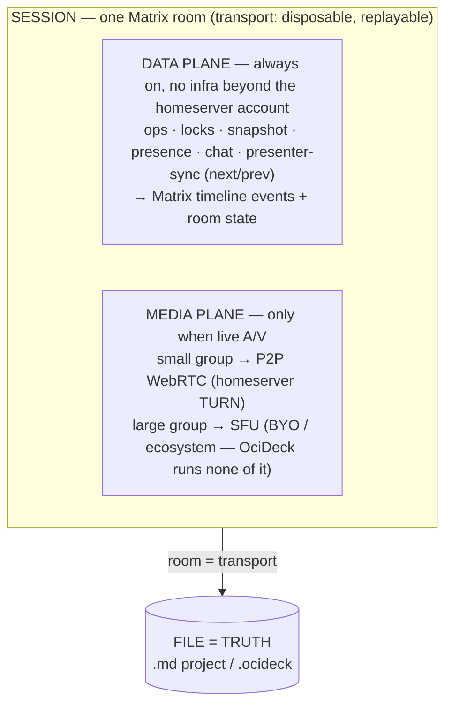
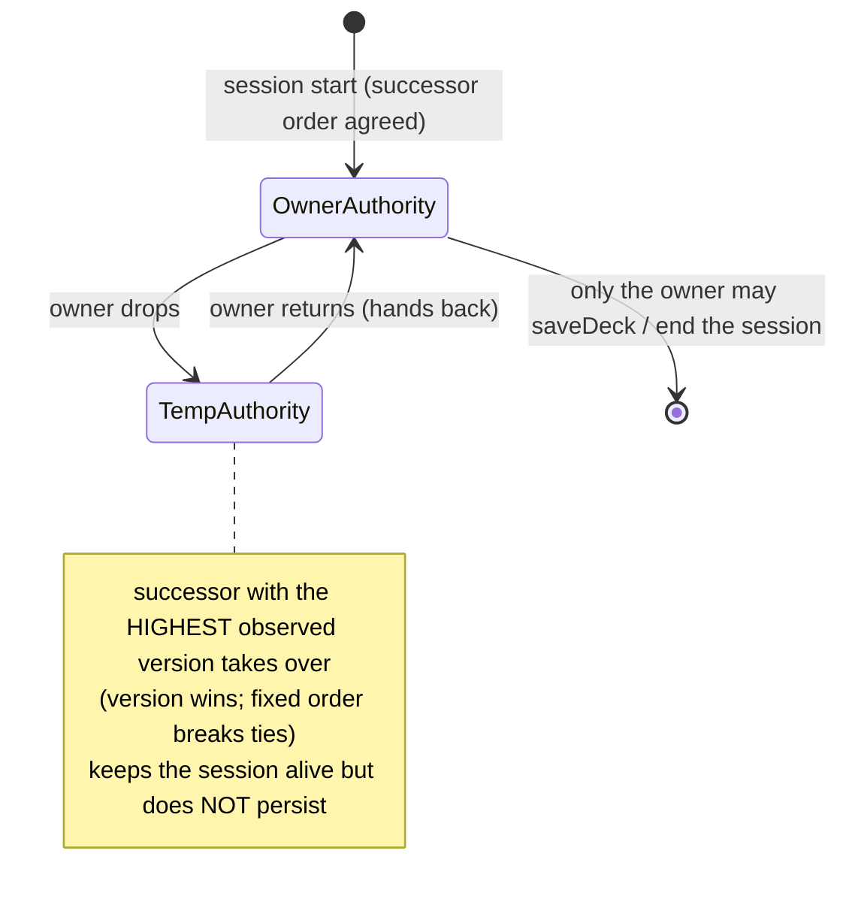
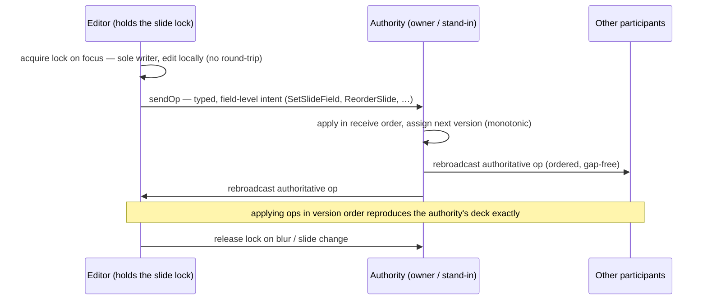

# OciDeck — Real-time Collaboration, Presenting & Calls (Design)

> **Status:** design proposal — unbuilt · **Status last reviewed:** 2026-07-23 · **Published by:** Stichting LibreKAT

> **A design proposal — not yet implemented.**
> This document describes a *future* capability and the architecture chosen for
> it. It is deliberately kept separate from the current-state contributor docs
> ([`ARCHITECTURE.md`](../ARCHITECTURE.md), [`SOURCE_MAP.md`](../SOURCE_MAP.md),
> [`FILE_FORMAT.md`](../FILE_FORMAT.md)) so that those keep describing what
> exists. When (parts of) this lands, fold the relevant sections into those docs
> and the [`USER_GUIDE.md`](../USER_GUIDE.md), and update the
> [`CHANGELOG.md`](../../CHANGELOG.md).
>
> It is written to be **picked up cold**: exact file paths, integration points,
> data shapes, invariants and open questions are spelled out so a later
> implementation session has everything it needs without re-deriving context.
>
> Sibling design doc: [`GIT_STORAGE.md`](GIT_STORAGE.md) (versioned storage in a
> git repository). The two are complementary and split along a clean seam:
> **this document is synchronous collaboration** — authors in the room at the same
> time, live co-editing and presenting in one session; **git is asynchronous
> collaboration** — clone, branch, review, merge, release. A room is a disposable
> sync channel; a git repo is durable versioned storage. Both share the principle
> *file = truth*, and neither depends on the other landing.

> Interoperability sibling: [`TEAMS_GUEST_CLIENT.md`](TEAMS_GUEST_CLIENT.md)
> defines the first concrete external-meeting adapter: an optional ACS-backed
> guest client for joining supported Microsoft Teams work/school meetings
> without a Microsoft account. Section 7.1 generalises that seam for Webex,
> Zoom, Jitsi, BigBlueButton, Nextcloud Talk and smaller/self-hosted systems.
> External meeting adapters remain deliberately **outside** the
> `CollabTransport`/Matrix session defined here and do not relax this document's
> P4 E2EE invariant.

---

## 1. Purpose & scope

OciDeck should be able to put the *presentation* at the centre of remote
collaboration, teaching and webinars — **as a client, never as a server**. Four
capabilities are in scope:

1. **Calls** — audio/video where OciDeck receives the streams and renders them in
   its own presentation-centric interface (not an embedded third-party UI).
2. **A data channel** — presentation control (next/previous slide), real-time
   co-authoring of a deck, and chat.
3. **Teaching / courses / webinars** — one presenter to many, without OciDeck
   building or operating a conferencing system.
4. **Interoperability** — plug into infrastructure that already exists rather
   than standing up our own.

The chosen spine is **Matrix** (an open, federated messaging protocol) for the
data channel and signalling, with **WebRTC** for media and an **SFU** only when
a group is large. OciDeck hosts **nothing**: users authenticate against an
existing (or freely created) homeserver, exactly as the WebDAV/Nextcloud source
lets a user point at their own storage.

---

## 2. Design principles (invariants)

These are non-negotiable. Every phase must preserve them.

- **P1 — OciDeck is a client, never a central dependency.** No OciDeck-operated
  server, relay or account system. Rendezvous, identity and media relaying are
  always the user's own or existing public infrastructure. This is the same
  stance as the WebDAV source (`lib/services/webdav_service.dart`).
- **P2 — Room = transport, file = truth.** The durable artifact is always the
  saved deck (`.md` project / `.ocideck` package). A collaboration "room" is a
  disposable, replayable sync channel. Losing a room never loses a deck.
- **P3 — Owner-authoritative.** Exactly one participant is the authority at any
  moment; it serialises operations, assigns versions, and is the only one that
  persists. This deliberately sidesteps CRDT/OT convergence.
- **P4 — E2EE by default.** Collaboration content and media are end-to-end
  encrypted so the homeserver / SFU cannot read them. This is a *cross-cutting
  principle*, not a later add-on (see §9). It is what makes confidential
  co-authoring and confidential webinars possible on infrastructure we don't
  control.
- **P5 — Sync the deck *model*, not re-parsed Markdown.** Operations act on the
  in-memory `Deck`/`Slide` model. Never serialise → send → re-parse Markdown per
  hop: it would trip the escaping edge cases documented for
  `markdown_service.dart` (caption-pipe sentinel, decimal video seconds, note
  `--\>`, cell `\<br>`).
- **P6 — Transport-agnostic collaboration layer.** The sync/lock/authority logic
  is defined against a thin `CollabTransport` interface. Matrix is the primary
  implementation; a loopback (tests), WebDAV (async), and a raw SFU data channel
  are alternates behind the same interface.
- **P7 — Two modalities, one session.** *Building* (co-authoring) and
  *presenting* have different QoS needs but share one session/room. Only live
  audio/video needs the media plane; everything else is small events on the data
  plane.

---

## 3. Precedent already in the codebase

OciDeck already synchronises presentation state between **two local windows** —
the presenter window and the audience window (`main.dart` routes a second-window
launch to the audience window; the fork lives at
`third_party/desktop_multi_window`). During presentation the presenter window is
the single source of truth and pushes state over a "window channel":

- interactive **question** slides forward `answerSelected` / `answerSubmit` and
  the presenter pushes the resulting `QuestionView` back;
- **timeline** step mode pushes `timelineStep`;
- **checklist / editable table** sync the same way.

**The collaboration layer is the generalisation of this pattern** from two local
windows to N networked participants, with the "single source of truth" becoming
the session *owner* (P3). Reusing this mental model — and, where practical, the
message shapes — keeps the design coherent with what contributors already know.
See [`ARCHITECTURE.md`](../ARCHITECTURE.md) § Data model for the window-channel
description.

---

## 4. Architecture overview



- The **data plane** carries everything except live A/V. It needs no
  infrastructure beyond the user's homeserver account, and it delivers the bulk
  of the value (co-authoring, chat, presenter control).
- The **media plane** is bolted on and is the *only* place infrastructure scales
  with audience size — and even then OciDeck runs none of it.

---

## 5. The collaboration layer (transport-agnostic)

New code, independent of any network. Build and unit-test this **first** against
a loopback transport before touching Matrix.

### 5.1 Operation model

Operations mutate the in-memory `Deck` (`lib/models/deck.dart`, class `Deck` at
line 100) and `Slide` (`lib/models/slide.dart`, class `Slide` at line 127).

```dart
/// A single authoritative change to the deck, ordered by [version].
sealed class DeckOp {
  int get version;          // assigned by the authority, monotonic per session
  String get authorId;      // Matrix user id of the originator
}

// Examples (mirror the typed Slide fields, NOT markdown text):
class SetSlideField extends DeckOp { String slideId; String field; Object? value; ... }
class ReorderSlide  extends DeckOp { String slideId; int newIndex; ... }
class InsertSlide   extends DeckOp { int index; Slide slide; ... }
class RemoveSlide   extends DeckOp { String slideId; ... }
class SetDeckMeta   extends DeckOp { String field; Object? value; ... } // title, tlp, ...
```

- Ops are **field-level** and typed, mirroring `Slide`'s fields (see
  `SOURCE_MAP.md` and `slide.dart`). They are **not** Markdown diffs (P5).
- Each op is idempotent given its `version`; applying in version order
  reproduces the authority's deck exactly.

### 5.2 Snapshot

- A snapshot is the serialised `Deck` *model* at a version, used by joiners and
  periodic re-baselining (so a late joiner never replays the whole op log — P2).
- **Do not** reuse `generateDeck()` → `parseDeck()` for snapshots (P5, and it
  would regenerate slide ids — see §5.5). Use a dedicated model (de)serialiser
  (JSON of the `Deck`/`Slide` fields). This is new code; keep it beside the ops.
- Matrix events are capped at ~64 KiB, so large snapshots must be **chunked** or
  sent as an encrypted attachment, not a single state event (see §6.3).

### 5.3 Authority state machine

The authority (owner, or a temporary stand-in) is the only writer of versions.

- Receives intents, applies them in receive order, assigns the next `version`,
  rebroadcasts the authoritative op.
- Holds the **lock table** (§5.4).
- **Handover (owner drops):** a deterministic successor order is agreed at session
  start; the successor with the **highest observed version** takes over (version
  wins, fixed order breaks ties). The temporary authority hands back when the
  original owner returns. Only the owner may `saveDeck` / end the session; a
  temporary authority keeps the session alive but does not persist.



*The authority is the only writer of versions: it receives intents, applies them
in receive order, assigns the next monotonic `version`, and rebroadcasts the
authoritative op.*

### 5.4 Locking

Per-slide (optionally per-block) **soft locks** eliminate both conflict *and*
edit latency: while you hold a slide's lock you are the sole writer, so you edit
locally with no round-trip and broadcast ops for that slide.

- Acquire on focus, release on blur / slide change.
- `ForceUnlock` is an explicit authoritative op; the losing client receives an
  event ("your edit was ended by the owner") — never a silent drop.



*Soft locks remove both conflict and edit latency: while you hold a slide's lock
you are the sole writer, so you edit locally and only broadcast ops. Ops are
typed fields, never Markdown diffs.*

### 5.5 Invariant: slide ids are session-scoped

**`Slide.id` is a UUID regenerated on every `parseDeck()`** (stable only within a
session — see `ARCHITECTURE.md` § Data model). Consequences the collab layer
**must** honour:

- Fix slide ids at session start from the snapshot and **never re-parse Markdown
  mid-session** (that would regenerate ids and desync every op).
- Annotations (`Deck.annotations`, keyed on slide id) and user notes re-anchor by
  content fingerprint on reload (`annotation_codec.dart`); any annotation sync
  must use the same fingerprint anchoring, not raw ids across a reload boundary.

### 5.6 Transport interface

```dart
abstract class CollabTransport {
  Future<void> join(SessionRef ref, {required Role role});
  Future<void> sendOp(DeckOp op);
  Stream<DeckOp> get ops;                 // ordered, gap-free (see §6.4)
  Future<void> sendSnapshot(Uint8List snapshot, {required String toParticipant});
  Stream<SnapshotChunk> get snapshots;
  Future<void> setLock(String slideId, {required bool held});
  Stream<LockEvent> get locks;
  Future<void> sendChat(String text);
  Stream<ChatMessage> get chat;
  Stream<PresenceEvent> get presence;
  Future<void> leave();
}
```

Implementations: `LoopbackTransport` (tests), `MatrixTransport` (primary),
later `WebdavAsyncTransport`, `SfuDataChannelTransport`.

### 5.7 Wiring into providers

Riverpod is already the state layer (`flutter_riverpod: ^3.3.1`). Follow the
`deck_quality_provider.dart` pattern:

- Add `lib/state/collab_session_provider.dart` exposing a
  `collabSessionProvider` (a `StateNotifierProvider` over a `CollabSession` that
  owns a `CollabTransport` and drives the authority state machine).
- Override it **per tab** in the existing `ProviderScope` overrides list inside
  `lib/widgets/app_shell.dart` (the per-tab `IndexedStack` loop, ~lines 250–270,
  alongside `deckProvider` / `editorProvider` / `deckQualityProvider` overrides).
  A collaborating tab's `deckProvider` is fed by the session; a non-collaborating
  tab behaves exactly as today. This preserves the per-tab provider scoping —
  see [OciDeck per-tab provider-scope] note in the project memory: **any new
  deck-facing provider must also be overridden here** or it silently reads
  `deck == null`.
- Store the active `SessionRef` on `TabInfo` (`lib/state/tabs_provider.dart`,
  cf. `TabInfo.webdavOrigin` at line 44) so "resume session" / "save from
  session" know the context.

---

## 6. Matrix mapping (primary transport)

Proposed dependency: the **`matrix`** Dart SDK (the one FluffyChat uses; mature
on the messaging/E2EE side). Not yet in `pubspec.yaml` (today it has
`flutter_riverpod`, `archive`, `http`, `flutter_secure_storage`, `crypto`; **no
WebRTC/Matrix**).

### 6.1 Concept mapping

| Collab concept            | Matrix mechanism                                   |
|---------------------------|----------------------------------------------------|
| Session                   | a room                                             |
| Operation                 | custom timeline event, type `nl.ocideck.op`        |
| Snapshot                  | targeted encrypted event(s)/attachment (chunked)   |
| Lock / current authority  | room **state** events (`nl.ocideck.lock`, keyed by slide id) |
| Roles (owner/editor/viewer)| **power levels**                                  |
| Chat                      | `m.room.message`                                   |
| Presence / who-views-what | presence + ephemeral `nl.ocideck.viewing` events   |

### 6.2 Ordering & delivery come for free

Matrix is store-and-forward: events are persisted server-side and delivered in a
canonical order; a client that drops offline catches up on the next `/sync` since
its sync token. This means the **transport-level gap detection** described for a
raw WebSocket route is unnecessary — the ordered op stream and reconnect
catch-up are handled by Matrix. App-level `version` numbers are still needed for
the authority/conflict logic (§5.3), not for transport reliability.

### 6.3 Snapshot delivery

Because events cap at ~64 KiB, a full-deck snapshot is sent to a specific joiner
as **chunked** encrypted events or as an encrypted attachment referenced by
event — not crammed into one state event. Re-baseline periodically so late
joiners start from `snapshot + recent ops`.

### 6.4 What lands in Matrix vs the file (P2)

- **In Matrix (transient):** start snapshot, op stream, locks, presence, chat,
  signalling. This is the *replay of a session*.
- **The file (durable):** on session end the owner calls the existing save path
  (`lib/services/file_service.dart` → `saveDeck()` at line 690, or
  `buildPackageBytes()` at line 53 in
  `lib/services/file/file_service_package.dart`) and distributes the final
  version. A gone room / homeserver is never a lost deck.

### 6.5 Session lifecycle

1. **Begin** — owner has an in-memory `Deck`; creates/opens a room; pushes the
   snapshot; fixes slide ids (§5.5).
2. **Live** — ops/locks/chat/presenter-sync flow as events; each client applies
   ops to its in-memory deck via `collabSessionProvider`.
3. **End** — owner persists to file and distributes; room may be closed/left.

---

## 7. Media plane (presenting & calls)

Proposed dependencies: **`flutter_webrtc`** (media on all targets incl. web);
**`livekit_client`** if/when using LiveKit as the SFU.

- **Presenter control** (next/prev, follow-mode, pointer) is **data plane** —
  small events, built on §5–6, no media stack. This alone delivers the "teaching
  control" story.
- **Small group live audio** — P2P WebRTC; signalling as Matrix call events; TURN
  provided by the user's homeserver. **No SFU, no OciDeck infra.** Honest note:
  the VoIP/Dart side is younger than the messaging side; expect more DIY with
  `flutter_webrtc` here.
- **Large audience (course/webinar)** — needs an **SFU**. One presenter → many
  passive viewers is the *favourable* fan-out topology and scales well. OciDeck
  runs no SFU: it follows a **bring-your-own-SFU-URL** config, mirroring the
  WebDAV `trustedInternal` opt-in (`lib/models/webdav_settings.dart`,
  `WebdavServer` at line 10). Options users point at: their org's LiveKit/Jitsi,
  a Matrix homeserver's Element Call / MatrixRTC, public Jitsi, or a managed SFU.
- **Broadcast variant** (optional) — WHIP/WHEP or HLS for one-way lecture to
  hundreds of purely passive viewers.

**Jitsi caveat (why not "just use Jitsi"):** meet.jit.si is the lowest-friction
public option to *use*, but Jitsi is built to be consumed through *its own
client*. Getting raw streams for OciDeck's own interface means either embedding
Jitsi's UI (contradicts the "presentation-central, own interface" goal) or
speaking lib-jitsi-meet signalling from Flutter (significant work). Hence the SFU
is abstracted behind the transport, with LiveKit/MatrixRTC as the cleaner target.

### 7.1 External meeting-provider adapters

OciDeck-owned collaboration and joining somebody else's meeting are related
product experiences but different trust and protocol domains:

- `CollabTransport` carries OciDeck deck operations, authority, locks and
  presenter state. Its P4 E2EE invariant applies.
- `MeetingProvider` joins an external or separately operated conferencing
  system. That provider controls identity, admission, signalling, media,
  recording and feature availability. OciDeck must describe those boundaries
  truthfully and must not inherit an E2EE claim from the collaboration session.

There is no universal "WebRTC meeting link". WebRTC standardises media building
blocks, not each service's signalling, authentication, lobby, consent or roster
protocol. Every supported family therefore needs an explicit adapter. Unknown
links go to a deliberate browser fallback; they are never probed against every
configured provider.

#### 7.1.1 Shared contract

Add the provider-neutral domain under `lib/meetings/`; keep vendor SDK objects in
`lib/meetings/providers/<provider>/` or a local JavaScript bridge. The interface
is intentionally separate from `CollabTransport`:

```dart
abstract interface class MeetingProvider {
  String get id;
  Set<String> get trustedHosts;

  /// Pure local recognition. Must not make a network request.
  MeetingLinkMatch? match(Uri invitation);

  /// Resolves capabilities after disclosure and explicit user action.
  Future<MeetingPreflight> preflight(MeetingLinkMatch link);

  /// Creates one root-scoped session; never a deck/tab-scoped provider.
  Future<MeetingSession> join(MeetingJoinRequest request);
}

abstract interface class MeetingSession {
  MeetingProviderId get provider;
  Stream<MeetingEvent> get events;
  MeetingCapabilities get capabilities;
  MeetingRole get role;

  Future<void> setMicrophone(bool enabled);
  Future<void> setCamera(bool enabled);
  Future<void> startScreenShare();
  Future<void> stopScreenShare();
  Future<void> leave();
}
```

`MeetingPreflight` returns typed support and policy facts, never a boolean:

- `nativeClient`, `embeddedOfficialClient`, `redirectOnly` or `unsupported`;
- account/guest-token requirements and the identity label shown to others;
- lobby, password, registration and host-admission requirements;
- available audio, video, roster, screen-share, chat and consent capabilities;
- provider/broker origins that will receive traffic;
- known E2EE status and an explicit `unknown` value; and
- a stable failure reason such as `guestDisabled`, `accountRequired`,
  `appApprovalRequired`, `meetingTypeUnsupported` or `providerUnavailable`.

**One shell for every adapter.** The joining interface is provider-neutral and
specified once, in `TEAMS_GUEST_CLIENT.md` §6 (invariant T14). An adapter
supplies facts — display name, recognised link family, egress disclosure,
capabilities, role — and never its own screens, wording style or control
layout. Adding a provider must not change what the feature looks like for
users of the
providers already supported. A provider that seems to need a bespoke screen has
found a gap in this contract; widen the contract instead.

**One switch for all of them.** Calling as a whole is an optional module on the
Uitbreidingen tab (T13), not a per-provider preference. Off means no shell
action and no adapter code reached; the register below governs which providers a
revealed module can then recognise.

The UI renders controls only from `MeetingCapabilities`. It must not imitate a
control that an adapter cannot perform. Both capabilities and role are live
state: a host may promote an attendee to presenter, demote a moderator or revoke
screen sharing while the call is running. Adapters emit typed role/capability
changes and the UI removes lost controls immediately without ending the session.
Use a provider-neutral role vocabulary (`guest`, `attendee`, `presenter`,
`moderator`, `organiser`, `unknown`) while retaining the provider's original role
label for diagnostics. Never infer authority merely because a button is visible.

#### 7.1.2 Provider register

The register separates **joining an existing invitation** from **using a media
backend for an OciDeck-created room**. A check mark in one column says nothing
about the other.

| Provider/family | Existing invitation through OciDeck | OciDeck-created room | Initial strategy | Design status |
|---|---|---|---|---|
| Microsoft Teams work/school | Supported target through ACS, subject to tenant and meeting policy | No | Dedicated ACS bridge and least-privilege token broker | Detailed sibling design |
| Cisco Webex | Candidate through the Meetings Web SDK and Service App guest identity | Possible only within Webex's licensed service model | Browser SDK bridge; server-issued guest token; capability-gated UI | Spike required |
| Pexip Infinity | Strong candidate for cooperating enterprise/government deployments | Yes, on a configured Infinity deployment | Official Infinity web packages expose local, remote and presentation streams plus conference signals | High-value spike |
| Zoom Meetings | Candidate through Meeting SDK; external-account meetings require Zoom review and attributed authorisation under current policy | Possible within the app/service account model | Web Meeting SDK plus signature service; do not promise arbitrary links before approval | Policy spike required |
| Jitsi Meet | Strong candidate for public or cooperating deployments | Yes, public, managed or self-hosted | Official IFrame API for the first slice; evaluate `lib-jitsi-meet` only for a fully native OciDeck layout | First proof of concept |
| BigBlueButton | Candidate when the operator supplies a valid join flow; arbitrary third-party server secrets are unavailable | Yes, on a cooperating/self-hosted server | Signed server-side join URL; redirect/embed official HTML5 client before custom media work | Spike required |
| Nextcloud Talk | Candidate for public guest conversations and cooperating instances | Yes, on a configured Nextcloud instance | Talk participant/signalling APIs or a constrained official-client embed | Research |
| OpenTalk | Candidate for a known SaaS or self-hosted deployment | Yes | Controller REST API plus meeting signalling; optional SIP component stays a separate capability | Sovereign-hosting candidate |
| Element Call / MatrixRTC | Candidate inside a configured Matrix ecosystem; guest access depends on homeserver deployment | Yes | Prefer the MatrixRTC/LiveKit path already aligned with this design | Research after Matrix phases |
| Google Meet | No supported production OciDeck client today; official-client redirect only | No | Revisit when the Meet Media API is generally available and suitable for interactive clients | Watch list |
| Whereby | Candidate for rooms created/configured through an embedding customer | Yes, within that customer account | Official embedded experience or browser SDK | Research |
| RingCentral Video, GoTo Meeting, Dialpad Meetings, Zoho Meeting | Link recognition and official-browser fallback until an approved interactive SDK path is proven | Provider-specific | Never automate or reverse-engineer the vendor web client | Watch list |
| Slack Huddles, Discord, FaceTime web guests, Mattermost Calls | Recognise known invitation families; official-client fallback unless a supported participant SDK emerges | No generic OciDeck room path | Provide a specific explanation instead of claiming the link is unknown | Explicit fallback families |
| Daily | Not a generic adapter for unrelated meeting links | Yes | `daily-js` call object for custom UI or Daily Prebuilt for an embedded slice | Backend candidate |
| Vonage Video API | Not a generic adapter for unrelated meeting links | Yes | OpenTok client plus server-created session and short-lived participant token | Backend candidate |
| SignalWire | Not a generic adapter for unrelated meeting links | Yes | Browser `RoomSession` plus server-issued room token | Backend/SIP candidate |
| Amazon Chime SDK | Not the same as joining arbitrary Amazon Chime invitations; the SDK creates application-owned meetings | Yes | JavaScript meeting session plus backend-created attendee and join token | Backend candidate |
| LiveKit | Not a public meeting-link ecosystem | Yes | Native Flutter SDK with backend-issued room JWT | Preferred custom SFU candidate |
| OpenVidu | Only for an OpenVidu deployment that OciDeck is configured to trust | Yes | Embedded Meet component first; client SDK if custom UI is justified | Backend candidate |
| Janus VideoRoom | Only for a known Janus deployment and room contract | Yes | Build signalling/UI around the VideoRoom plug-in | Advanced/backend candidate |
| Galene | Candidate for a known Galene group URL | Yes | JavaScript/TypeScript client library or documented protocol | Lightweight self-hosted candidate |
| MiroTalk and similar packaged WebRTC apps | Only after their stable embed/auth contract is verified | Yes, by operating/forking the package | Treat as an application integration, not a generic WebRTC adapter | Watch list |
| mediasoup or Pion building blocks | No: these are libraries, not invitation ecosystems | Yes, with a new OciDeck service and protocol | Out of scope until operating a conferencing backend is approved | Not planned |
| SIP/H.323 | Only when the invitation exposes a dialable URI and a configured gateway accepts it | Via gateway | Separate gateway adapter; never infer dial strings from arbitrary URLs | Future research |

The table records architectural fit, not a promise that the current code joins
any of these services. Before implementation, verify current vendor terms, SDK
support, browser support, licensing, branding requirements and guest policy.

#### 7.1.3 Resolution and safe fallback

`MeetingLinkResolver` owns a versioned, testable list of exact host and path
rules. Resolution follows this order:

1. parse locally and reject non-HTTPS URLs except explicitly configured local
   development endpoints;
2. strip fragments and known tracking parameters before storing/displaying the
   link, without changing provider-required opaque values;
3. select at most one adapter using an exact or suffix-safe hostname match;
4. show the provider, network destinations, identity type and privacy boundary;
5. perform `preflight()` only after explicit user action;
6. join using the provider adapter, or offer the official browser client when
   the adapter reports `redirectOnly`; and
7. leave unknown links unopened until the user confirms the external origin.

Fallback means opening a top-level official browser page. It never means DOM
automation, credential interception, an unapproved iframe, reverse engineering
of private signalling, or disguising OciDeck as the provider's client.

Meeting links are bearer-like confidential data. They remain device-local unless
a documented provider call requires them. A token/signature broker receives
only the minimum fields required by its provider; where possible, copy the Teams
design's invariant that the broker never receives the invitation URL, display
name, deck or device labels.

#### 7.1.4 Provider lifecycle and release gates

Every register entry has one of four machine-readable release states:

1. `research` — documentation review only; no user-facing join claim;
2. `spike` — isolated prototype against sandbox/test meetings;
3. `experimental` — opt-in UI, pinned SDK, known-limitations page and dated
   real-service evidence; or
4. `supported` — maintained browser/platform matrix, operational owner,
   accessibility/privacy/security review and regression fixtures.

Promotion to `supported` requires all of the following:

- invitation fixtures contain synthetic identifiers and cover malformed,
  deceptive and unsupported URLs;
- guest, account-required, lobby, denied, ended and reconnecting paths have
  typed outcomes;
- the adapter has no background network activity before disclosure and consent;
- credentials and signing secrets stay in an appropriate backend/secret store;
- media, listeners, renderers and temporary identities are disposed on leave;
- recording/transcription indicators and provider consent flows are preserved;
- the audience window cannot expose presenter notes, diagnostics or private
  collaboration state;
- keyboard, screen-reader, 200% text and reduced-motion checks pass;
- licences, SDK integrity, CSP/Permissions-Policy and SBOM entries are current;
- provider naming does not imply affiliation or endorsement; and
- a dated real meeting on every promised browser/platform has passed.

#### 7.1.5 Delivery order

*(Marked 2026-07-29, two decisions taken by the project owner that this order
depends on: for Jitsi the stance on which deployments may be trusted is
**liberal** — a user may add any deployment, with the shape and the limits set
out in §7.1.6 under "Recognising a deployment whose URL carries no marker"; and
a cooperating **Nextcloud** instance is available, so the Talk spike in step 5
is no longer blocked on finding a server.)*

1. Build `MeetingProvider`, `MeetingSession`, `MeetingLinkResolver`, typed events
   and a fake adapter without adding an external SDK.
2. Add **Jitsi** as the smallest end-to-end proof through its official IFrame
   API. This validates link resolution, consent, root-scoped lifetime and common
   controls quickly; it does not yet prove a custom remote-video layout.
3. Implement the already-specified **Teams** vertical slice.
4. Spike **Webex**, including Service App guest issuance and ordinary
   licensed-host meetings.
5. Spike **BigBlueButton** and **Nextcloud Talk** with cooperating self-hosted
   servers; record where only an official-client embed/redirect is supportable.
6. Pursue **Zoom** only after external-meeting app review and identity policy are
   resolved; do not build a demo that works only inside the developer account
   and market it as general support.
7. Reuse **MatrixRTC/LiveKit** for OciDeck-owned rooms if the Matrix media phases
   land. Evaluate Daily/OpenVidu/Galene/Janus only against a concrete deployment
   need, not merely to grow the provider count.
8. Spike **Pexip** and **OpenTalk** when a cooperating organisational deployment
   is available; they are more relevant to public-sector/self-hosted adoption
   than adding another consumer-only redirect.

#### 7.1.6 Near-future hardening

These items are part of the design for the next implementation horizon. They do
not expand the first Jitsi/Teams vertical slices, but the common contract must
leave room for them from day one.

##### Self-hosted provider profiles and discovery

Hard-coded public domains cannot represent an organisation's Jitsi,
BigBlueButton, Nextcloud Talk, OpenTalk, Pexip, Galene or OpenVidu deployment.
Do not identify such a deployment by sending an unknown invitation to a list of
probe endpoints. Add an administrator/user-approved profile:

```dart
class MeetingProviderProfile {
  final String id;
  final MeetingProviderId provider;
  final Uri origin;
  final Set<String> allowedJoinPathPrefixes;
  final Uri? tokenBroker;
  final bool trustedInternal;
  final Set<String> pinnedCapabilities;
}
```

- Store public profile metadata in preferences and secrets in `SecretStore`.
- Validate origins with the same `NetGuard`, redirect refusal, DNS-rebinding and
  private-address posture as WebDAV. `trustedInternal` is an explicit opt-in.
- A configured profile wins only for its exact origin and allowed paths; it
  never claims every subdomain or rewrites an opaque invitation token.
- A future `.well-known` discovery document may suggest a provider type and
  public endpoints, but it is untrusted input: show the result and require
  approval before persisting or contacting a token broker.
- Export/import of profiles excludes credentials and makes the receiving user
  re-approve private-network access.

##### Recognising a deployment whose URL carries no marker (the Jitsi case)

Teams links are recognisable: an exact host family plus a `/l/meetup-join/`
path. Jitsi is the opposite, and it is the harder and more common case. A Jitsi
room is `https://<host>/<RoomName>` — structurally identical to a blog post, a
documentation page or a login screen. **No pattern over the URL can decide that
a link is a Jitsi room.** Any design that claims otherwise is guessing.

Three things therefore must not happen, and each is a rule rather than a
preference:

- **No probing.** Do not fetch the host, `/external_api.js`, or a
  `.well-known` document to find out what a link is. A meeting link is
  bearer-like data: contacting the host to identify it hands the link to that
  host before the user has consented to anything, and §7.1.3 already forbids
  trying an unknown invitation against configured providers.
- **No blanket claim.** An adapter must not declare that it recognises every
  HTTPS URL so that "liberal" becomes "everything is Jitsi". That would make
  the at-most-one-adapter rule meaningless and would send arbitrary links into
  a vendor iframe.
- **No shape-based auto-decision.** A single path segment, no file extension,
  a CamelCase or three-word room name and a `?jwt=` parameter are together a
  decent *hint*. A hint may change which question the interface asks; it may
  never stand in for the answer.

What replaces guessing is three tiers of trust, all resolved locally:

1. **Built-in public deployments** — a versioned list of exact hosts
   (`meet.jit.si`, `8x8.vc`, and other well-known public instances), matched
   suffix-safe on label boundaries as §7.1.3 already requires.
2. **Deployments the user or administrator approved** — a
   `MeetingProviderProfile` (above) naming an origin and its allowed join
   paths. **This is where a liberal stance belongs:** there is no gatekeeping on
   *which* deployment may be added, because an organisation's own Jitsi is as
   legitimate as a public one. What stays strict is the act — a profile is
   added deliberately, wins only for its exact origin, and never claims every
   subdomain.
3. **Unknown** — the interface says so and *asks*. Offering "treat this as a
   Jitsi deployment" with the egress disclosure attached, and remembering it as
   a profile on confirmation, is the honest form of liberal: the user supplies
   the one fact no URL can carry. Declining leaves the official-browser
   fallback, which is what an unrecognised link already gets.

**Recognition runs while the user types, not after a button.** Parsing and
comparing against these tiers costs nothing and touches no service, so the
verdict — which deployment this is, or that it is unknown, or why it was
rejected — belongs on screen as the link is pasted. Only `preflight()` waits for
an explicit action (T8). Keeping those two steps apart is what lets recognition
be immediate without anything leaving the device.

**One Jitsi-specific hazard, in the fragment.** Jitsi honours URL fragment
overrides (`#config.…`, `#userInfo.…`), so a crafted link can preset behaviour —
including unmuting or a display name. `MeetingLinkResolver` strips the fragment
before the link reaches an adapter, and for this family that is a security
property rather than tidiness: the defaults of §13.2 (muted, camera off) must
come from OciDeck, never from whoever sent the invitation.

##### Vendor SDK isolation

A vendor JavaScript SDK running in OciDeck's top-level page could potentially
observe deck DOM/state, intercept browser APIs or widen the application's network
surface. Choose and document one isolation mode per adapter:

1. a cross-origin sandboxed official iframe with the smallest `allow` policy;
2. a dedicated OciDeck meeting page that never loads an open deck;
3. a locally bundled, pinned and reviewed SDK behind a narrow serialisable
   `postMessage`/Dart bridge; or
4. a native SDK isolated behind the platform channel on a separately supported
   target.

Never load vendor code dynamically into the editor page. Each adapter declares
its CSP `connect-src`/`media-src`/`frame-src`, Permissions-Policy, iframe sandbox
flags, Subresource Integrity applicability, bundled hashes and data-access
boundary. The provider bridge may receive only the meeting fields it needs; the
deck model, presenter notes, AI configuration, credentials of other providers
and collaboration keys are outside its interface. Dependency or origin drift
fails closed and disables only that adapter.

##### Invitation ingestion

Pasting one URL is the first slice, not the complete entry surface. The resolver
must later accept:

- a plain URL or copied invitation body;
- an `.ics` event supplied as a local file;
- an operating-system share target/deep link;
- a QR code scanned locally; and
- an optional calendar connector that is separately installed and authorised.

Extraction is local and returns **all** credible meeting candidates with their
provider and displayed origin. It never silently selects the first URL from an
email/calendar body, follows redirects, expands short links or prefers a
tracking link. The user chooses when multiple candidates remain. Calendar
connectors request the narrowest read scope and are not required for manual
joining.

Known but unsupported families (for example Slack Huddles, Discord and
FaceTime-web links) produce `redirectOnly` with a provider-specific explanation.
An unrecognised link remains `unknown`; OciDeck never claims that opening it will
join a meeting safely.

##### Identity, roles and dual-session consent

"No personal account" can mean different things. Preflight and the join screen
must distinguish an anonymous display name, ephemeral provider guest, persistent
service-app guest, host-sponsored identity and signed-in account. Show which
identity other participants and the provider will see and whether the provider
may retain it.

An external meeting and an OciDeck collaboration room may run simultaneously,
but no membership crosses automatically:

```text
external MeetingProvider session = audio, video, roster, provider consent
OciDeck CollabTransport session  = deck ops, locks, chat, presenter control
```

Joining a call never grants access to the deck/Matrix room. Starting a
collaboration room never invites the external roster. A future bridge that maps
presenter state, captions or identities across the boundary requires a separate
design, visible participant consent, minimised mapping and an explicit stop
control. Screen-sharing the audience window remains the safe first bridge.

##### Meeting media and AI are separate consent domains

Meeting audio, video, screen content, captions, transcript fragments, roster and
speaker metadata never enter AI Assist merely because AI Assist is enabled. Any
future transcription, summarisation, translation, action-item or notetaker
feature needs all of:

- a provider-permitted integration route (never an undisclosed bot or raw-media
  workaround);
- a separate feature design and data-flow diagram;
- explicit per-meeting, purpose-specific consent that names the AI destination;
- a persistent in-call indicator and immediate stop control;
- participant/host consent semantics appropriate to the provider and law;
- retention, deletion, access and model-training statements; and
- a deterministic mode that forwards nothing when consent or provider state is
  unknown or revoked.

Local captions are still meeting-derived personal data; on-device processing
removes network egress but not the need for truthful notice and lifecycle rules.
The shipped deck/image AI consumers remain unable to read `MeetingSession`.

##### Operational ownership

Add a maintained provider manifest containing adapter/SDK version, release
state, supported browser/OS versions, tested meeting types, required backend,
credential owner, billing owner, data regions, last real-service test date and
sunset contact. Generate the user-facing capability matrix from this manifest
instead of maintaining a second marketing table by hand.

Provider terms, app review, pricing, guest policy and SDK behaviour change
outside OciDeck's release cycle. A stale manifest moves the adapter back to
`experimental` or `redirectOnly`; it must not silently preserve a support claim.

Primary implementation references (re-check at spike time):

- Jitsi IFrame API: <https://jitsi.github.io/handbook/docs/dev-guide/dev-guide-iframe/>
- Webex Meetings Web SDK: <https://developer.webex.com/meeting/docs/sdks/webex-meetings-sdk-web-join-a-meeting>
- Webex Service App guests: <https://developer.webex.com/create/docs/sa-guest-management>
- Pexip Infinity web client tutorial: <https://developer.pexip.com/docs/infinity/web/tutorials/npm-packages/join-a-conference/index.html>
- Zoom Meeting SDK authorisation: <https://developers.zoom.us/docs/meeting-sdk/auth/>
- BigBlueButton API: <https://docs.bigbluebutton.org/development/api/>
- Nextcloud Talk participant API: <https://nextcloud-talk.readthedocs.io/en/stable/participant/>
- OpenTalk controller HTTP/API surface: <https://docs.opentalk.eu/admin/controller/core/http_server/>
- MatrixRTC configuration: <https://docs.element.io/latest/element-server-suite-pro/configuring-components/matrix-rtc/configuring/>
- LiveKit access tokens and grants: <https://docs.livekit.io/frontends/reference/tokens-grants/>
- Daily call client: <https://docs.daily.co/reference/daily-js/daily-call-client>
- Vonage Video API: <https://developer.vonage.com/en/video/getting-started>
- SignalWire browser RoomSession: <https://developer.signalwire.com/sdks/browser-sdk/video/room-session>
- Amazon Chime SDK meetings: <https://docs.aws.amazon.com/chime-sdk/latest/dg/meetings-sdk.html>
- OpenVidu embedded Meet: <https://openvidu.io/latest/meet/embedded/step-by-step-guide/>
- Janus VideoRoom: <https://janus.conf.meetecho.com/docs/videoroom.html>
- Galene client guide: <https://galene.org/galene-client.html>

---

## 8. Account onboarding — make getting an account easy (requirement)

A broad, open-source tool cannot assume users already have a Matrix account, but
requiring one is accepted as a reality. The friction must be minimised **inside
OciDeck**:

- **In-app registration.** Use Matrix's registration API to let a user create an
  account without leaving OciDeck: pick/confirm a **default suggested
  homeserver**, run the homeserver's registration flow (username, password, and
  whatever stages it requires — email/terms/recaptcha), done. No browser detour.
- **Free choice preserved (P1).** The default is a convenience, not a lock-in:
  advanced users type their own homeserver URL (org or community) and log in.
  Same field pattern as the WebDAV server config.
- **Credential storage.** Store the access token / device keys in the OS keychain
  via the existing `SecretStore` (`lib/services/secret_store.dart`, class at
  line 13; `flutter_secure_storage: ^10.3.1` already present). Add a
  `matrixSession` key alongside the WebDAV password keys; keep the homeserver URL
  and user id in `shared_preferences` (as WebDAV does), secrets in the keychain.
- **Recovery setup prompt.** Guide the user to set up a **Security Key / Phrase**
  (SSSS) at account creation so their cryptographic identity is portable across
  devices (see §9.3). Frame it plainly ("save this recovery key or you can't move
  devices").

Design the "unverified new device" moment explicitly — a fresh login shows as an
unverified device to collaborators until verified; the UI must make verification
(emoji/QR or recovery key) obvious rather than leaving cryptic "unable to
decrypt" states.

---

## 9. End-to-end encryption — a core principle (requirement)

E2EE is **P4**, not a phase: it is what makes private co-authoring *and*
confidential webinars possible on infrastructure OciDeck doesn't control.

### 9.1 What the account provides for free

- A verifiable **cryptographic identity** (Ed25519 signing + Curve25519 keys per
  device).
- **Olm/Megolm E2EE** so the homeserver relays ciphertext it cannot read —
  including custom `nl.ocideck.op` events (any event type can be encrypted).
- **Cross-signing + device verification** to prove a collaborator is who they
  claim — directly reinforcing owner authority (P3): you can prove the owner is
  the real owner, not an impostor.
- A **signed, hash-linked event chain** → tamper-evidence on the op log.

### 9.2 Uses in OciDeck

- **Confidential collaboration & webinars.** Ops, chat and (via SFrame /
  insertable streams) media are end-to-end encrypted; a public homeserver or an
  untrusted SFU sees only ciphertext. This is the reconciliation of *independence*
  (use others' infra) with *confidentiality* (they can't read it), and it is what
  a "private webinar" actually requires.
- **Provenance signing.** On session end the owner may sign the distributed final
  deck with the identity key — tie this to the existing classification gate
  (`lib/services/classification_enforcement_policy.dart`) and package encryption
  (`lib/services/file/file_service_package.dart`, AES-256 with password).

### 9.3 Honest constraints (must be designed for)

- **Device-switch key model.** A fresh device generates new keys and cannot read
  old encrypted history unless **Key Backup + SSSS** were set up beforehand
  (§8). *For OciDeck this is largely a non-issue* because the durable artifact is
  the **file**, not room history (P2): a new device only needs to join the *live*
  session (whose Megolm keys are shared on join) and participate. The one place it
  matters is portable **identity** for provenance/authority signing → require
  SSSS recovery at onboarding.
- **Metadata is not hidden.** E2EE hides content, not the fact: the homeserver
  still sees who is in which room, when, and traffic volume.
- **E2EE UX is famously fiddly** (key management, "unable to decrypt", backup).
  Budget real time for it; do not treat it as a checkbox. Feasible in Flutter —
  FluffyChat does full E2EE via the `matrix` SDK — but the complexity is
  inherited.

---

## 10. Phased roadmap

Each phase stands alone; the boundary "pure client vs leans on ecosystem" is
explicit. **E2EE (§9) is switched on as early as the transport carries content,
not deferred.**

### Phase 0 — Foundation: transport-agnostic collab layer (pure client)
Build §5 with a `LoopbackTransport`; unit-test ops, versioning, locking,
handover with no network. Add `lib/state/collab_session_provider.dart`; wire the
per-tab override in `app_shell.dart`. *No Matrix, no account.*
Phase 0.5 (transport + codec landed, #989): `WebdavAsyncTransport` — async
co-authoring over the Nextcloud a user already configured (`webdav_service.dart`),
built on an append-only log sidecar (`collab_log_store.dart`, a conditional-`PUT`
sequence) with the JSON wire codec in `collab_codec.dart`; near-free given Phase
0, not real-time. Built and tested end to end (#989, #996): the transport, its
(de)serialiser, the session baseline (`collab_snapshot.dart`, §5.2/§5.5 — a joiner
adopts the authority's slides so it shares their ids, plus a snapshot slot on the
store), the session lifecycle (`collab_session_launch.dart` —
`hostCollabSession`/`joinCollabSession` tie snapshot, transport and authority into
start/join, §6.5), the editor→op adapter (`collab_deck_diff.dart` — a wholesale
deck edit back to field-level ops), the bridge that carries edits both ways
without an echo loop (`collab_session_controller.dart`, merging so non-syncable
fields survive), and the app wiring (§5.7): `collab_session_provider.dart` owns a
session per tab (overridden in `app_shell.dart`'s `_tabScope`, like `deckProvider`)
and the command palette hosts/joins/leaves a session for a WebDAV deck. Real-time
Matrix (Phase 1) stays parked on the licence decision (assurance/ketenkeuring-matrix-*.md).
Follow-ups within Fase 0.5: owner-drop handover (§5.3) and non-zero re-baselining
(§5.2).

### Phase 1 — Matrix data plane + easy onboarding (leans on: homeserver account)
Add the `matrix` SDK; in-app registration/login against a default-or-chosen
homeserver (§8); `MatrixTransport` implementing §5.6 with the §6.1 mapping;
session lifecycle (§6.5). Deliver real remote co-authoring + chat + presenter
control. **Turn on room encryption here** (§9) — content is E2EE from the first
networked byte.
Web note: CSP `connect-src` must allow the homeserver `wss:` (see the web-build
hardening note in project memory / `make build-web`).

### Phase 2 — Identity hardening & provenance (pure client)
Cross-signing/verification UX; SSSS recovery flow; optional owner-signature on the
distributed deck tied to the classification gate.

### Phase 3 — Presenting + small-group audio (leans on: homeserver TURN)
Presenter role as broadcast authority (data plane); P2P live audio via
`flutter_webrtc`, signalling over Matrix call events, TURN from the homeserver.
No SFU, no OciDeck infra.

### Phase 4 — Large audience media / webinars (leans on: an SFU it doesn't run)
SFU adapter (LiveKit / MatrixRTC, or org Jitsi) behind the transport;
bring-your-own-SFU-URL config mirroring `trustedInternal`; SFrame media E2EE for
confidential webinars; optional WHIP/WHEP/HLS broadcast.

### Phase 5 — Enrichment & federation (leans on: homeserver + bridges)
Q&A, polls, richer chat (all data-plane events); recording via SFU egress;
federation/bridges so external systems interoperate (requirement 4 in full).

The external `MeetingProvider` track in §7.1 is deliberately orthogonal to
Phases 0–5. Its provider-neutral foundation can start beside Phase 0, and each
adapter advances through `research` → `spike` → `experimental` → `supported`
independently. Joining a Jitsi or Teams invitation does not imply that its room
has become an OciDeck/Matrix collaboration session; deck co-authoring and
presenter control cross that boundary only through an explicitly designed,
consented bridge.

### Coverage against the four goals

| | Calls (1) | Data channel / co-author / chat (2) | Teaching / webinars (3) | Interop (4) | Infra outside OciDeck |
|---|---|---|---|---|---|
| Phase 0–1 | — | ✅ core (E2EE on) | control ✅ | Matrix account | homeserver |
| Phase 2 | — | ✅ + provenance | ✅ trusted | — | homeserver |
| Phase 3 | small ✅ | ✅ | ✅ + voice | — | homeserver TURN |
| Phase 4 | ✅ large | ✅ | ✅ webinar (E2EE) | — | **SFU (ecosystem)** |
| Phase 5 | ✅ | ✅ | ✅ | ✅ federation | homeserver + bridges |

**Recommended evaluation point:** after Phase 1–2 there is remote, encrypted,
independent co-authoring + chat + presenter control — the bulk of the value —
with OciDeck hosting nothing. Phases 3–4 are the video build-out; only Phase 4
introduces an infrastructure dependency (an SFU, still not run by OciDeck).

---

## 11. Implementation reference (paths & integration points)

**Read/extend these existing files:**

| Concern | Path | Anchor |
|---|---|---|
| Deck model | `lib/models/deck.dart` | `Deck` (line 100), `annotations` map |
| Slide model | `lib/models/slide.dart` | `Slide` (line 127), `SlideType` |
| Markdown (de)serialise | `lib/services/markdown_service.dart` (+ `markdown_service_parse.dart`) | `parseDeck` (334), `generateDeck` (40), `generateSlide` (219) |
| Providers | `lib/state/deck_provider.dart`, `editor_provider.dart`, `deck_quality_provider.dart` | `deckProvider`, `editorProvider`, `deckQualityProvider` |
| **Per-tab override site** | `lib/widgets/app_shell.dart` | `ProviderScope` overrides in the tab loop (~250–270) |
| Tab context | `lib/state/tabs_provider.dart` | `TabInfo` (cf. `webdavOrigin`, line 44) |
| File open/save | `lib/services/file_service.dart` (+ `file/file_service_*.dart`) | `openDeckDetailed` (568), `saveDeck` (690) |
| Package build/decode | `lib/services/file/file_service_package.dart` | `buildPackageBytes` (53), `decodePackageEntries` (716) |
| Atomic writes | `lib/utils/atomic_file.dart` | `writeBytesAtomic` (23) |
| BYO-server precedent | `lib/services/webdav_service.dart`, `lib/models/webdav_settings.dart` | `WebdavServer` (10), `trustedInternal`, `NetGuard` |
| Secret storage | `lib/services/secret_store.dart` | `SecretStore` (13), keychain keys |
| Logger | `lib/utils/log.dart` | `logError` / `logWarning` (no `catch(_)`) |
| In-app doc reader | `lib/widgets/reader/`, `lib/services/documentation_service.dart` | asset `.md`, language variants |

**New files to add (proposed):**

- `lib/collab/deck_op.dart` — `DeckOp` sealed hierarchy + `applyOp`.
- `lib/collab/deck_snapshot.dart` — model (de)serialiser (JSON, not Markdown).
- `lib/collab/collab_transport.dart` — the `CollabTransport` interface + `LoopbackTransport`.
- `lib/collab/collab_session.dart` — authority state machine, lock table, handover.
- `lib/collab/matrix_transport.dart` — Matrix implementation (Phase 1).
- `lib/state/collab_session_provider.dart` — Riverpod wiring.
- Media (Phase 3+): `lib/collab/media/…` (WebRTC/SFU adapters).
- `lib/meetings/meeting_provider.dart` — external-provider contract, preflight,
  capabilities, typed events and failure taxonomy (§7.1).
- `lib/meetings/meeting_link_resolver.dart` — local allowlisted URL recognition;
  no speculative network probes.
- `lib/meetings/meeting_provider_profile.dart` — approved self-hosted origin,
  path constraints, broker reference and trust flags; never credentials.
- `lib/meetings/meeting_provider_manifest.dart` — versioned operational support
  facts that drive the capability matrix and stale-support downgrade.
- `lib/meetings/providers/<provider>/…` — one isolated adapter per documented
  provider contract; no vendor SDK objects outside its adapter/bridge.
- `lib/state/meeting_session_provider.dart` — root-scoped meeting lifetime,
  deliberately outside every deck-tab `ProviderScope` override.
- `web/meeting_bridges/…` — pinned JavaScript SDK bridges for providers whose
  supported client surface is browser-only.
- Tests: `test/meetings/meeting_link_resolver_test.dart`,
  `meeting_provider_contract_test.dart`, `meeting_provider_profile_test.dart`
  and synthetic `.ics`/invitation fixtures with no real meeting credentials.

**Dependencies to add (proposed, none present today):**

- `matrix` (Dart SDK) — Phase 1.
- `flutter_webrtc` — Phase 3.
- `livekit_client` (or chosen SFU client) — Phase 4.
- Pin new JS/native bundles in `MANIFEST.json` and keep `make deps-check` (OSV)
  green, per the bundled-JS CVE convention.

**Security caps to mirror** (match the existing defensive posture in
`file_service.dart` / `webdav_service.dart`): bound event/snapshot sizes and
counts; reject oversized inbound ops; no HTTP redirects; keep the WebDAV
`NetGuard`/SSRF stance for any new outbound host; run compression/crypto for
snapshots in an isolate (keep helpers static — see the perf-patterns note).

**Cross-cutting checks** (see [`CHECKS.md`](../CHECKS.md) and the ratchets):
files ≤ 1000 lines / methods ≤ 150 (split with `part`/`part-of` like
`file_service.dart`); no `catch(_)`/`print`; atomic writes only (no bare
`writeAs*`); l10n test requires every user-facing `.d(...)` string in all 30
non-NL languages (single string literal per `.d`); update `USER_GUIDE.md` /
`FILE_FORMAT.md` / `CHANGELOG.md` when a phase ships.

---

## 12. Open questions (decide before/while implementing)

1. **Snapshot format** — plain JSON of `Deck`/`Slide`, or a versioned schema with
   migration? (Affects forward-compat of long-lived sessions.)
2. **Op granularity** — field-level only, or also intra-field text ops for large
   `customMarkdown` / rich-text bodies while a single editor holds the lock?
   (Locking makes field-level sufficient for v1.)
3. **Default homeserver** — which one do we suggest, and do we run a fair-use
   check / show its terms? (Must not become a de-facto OciDeck dependency — P1.)
4. **Presence granularity** — expose "who is viewing which slide" to all, or only
   to the owner?
5. **Federation reach (Phase 5)** — which external systems are first-class bridge
   targets for Matrix data-plane interoperability? This is distinct from the
   external meeting-client adapters in §7.1.
6. **Web parity** — how much of media (Phase 3–4) do we commit to on the web
   target given CSP and `flutter_webrtc` web maturity?

---

## 13. Summary

Matrix as the spine turns "OciDeck is a client" from an aspiration into the
mechanism: users bring an existing (or easily created) account, OciDeck hosts
nothing, E2EE keeps content private on infrastructure we don't control, and the
saved file remains the single source of truth while the room is just a
disposable, replayable sync channel. The data plane — co-authoring, chat,
presenter control, all encrypted — is the high-value, low-infra core; live audio
and video are a later, optional media plane that only leans on an SFU (still run
by someone else) when an audience is large. A separate `MeetingProvider` seam
lets OciDeck recognise and, where an official supported route exists, join
Teams, Webex, Zoom, Jitsi, BigBlueButton, Nextcloud Talk and smaller/self-hosted
systems without pretending that their signalling, identity, consent or E2EE
properties are interchangeable.
