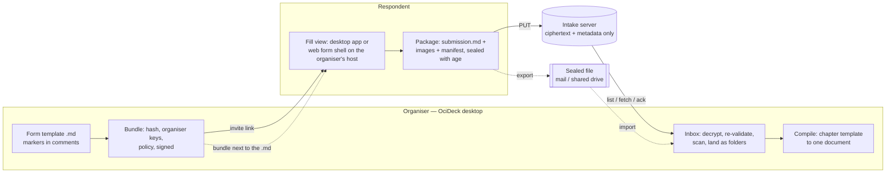
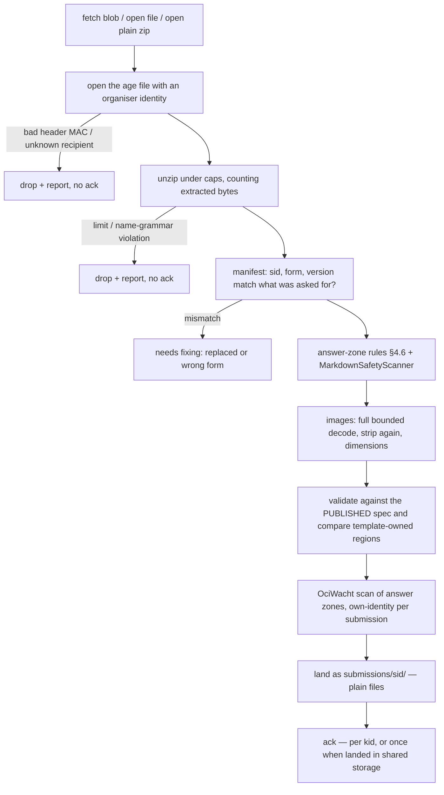

# OciDeck — Form intake: fill-in Markdown forms and sealed submissions (Design)

> **Status:** design proposal, revision 3 — unbuilt · **Status last reviewed:** 2026-10-01 · **Published by:** Stichting LibreKAT

> **A design proposal — not yet implemented.**
> This document describes a *future* capability: a **form** that is an ordinary
> Markdown document, filled in by a respondent in OciDeck (images included),
> checked against rules the form author wrote down (required, minimum and maximum
> words, options, image size), and **delivered** — as a file or through a small
> separate intake server that only ever stores ciphertext. It is kept apart from
> the current-state docs ([`ARCHITECTURE.md`](../ARCHITECTURE.md),
> [`SOURCE_MAP.md`](../SOURCE_MAP.md), [`FILE_FORMAT.md`](../FILE_FORMAT.md)) so
> those keep describing what exists. When a phase ships, fold its facts into them
> and into the user guide, and update the [`CHANGELOG.md`](../../CHANGELOG.md).
>
> **Revision 2 (2026-09-30)** folds in an eight-lens review (keeper of the core
> idea, product, legal, security, usability, test, privacy, architecture). Every
> finding and what was done with it is logged in §18. Five things changed shape and
> are worth knowing before reading on: the **form markers are unprefixed** like
> `<!-- toc -->` (§4.3); sealing is **the `age` file format** instead of a custom
> envelope (§5.6); the **web respondent is served from the organiser's own host,
> never from the intake server or the foundation's demo** (§2.1, §6.6); the
> **organiser side no longer waits for the server or the crypto review** (§12);
> and `status.json`, `ocideck_each`, `reply_key`, receipts-as-proof and RFC 3161
> are **gone**.
>
> **Revision 3 (2026-10-01)** records the owner's decisions **D1–D8** (§15): unprefixed
> markers, a standalone `packages/ocideck_form_core`, the server's maintainer decided
> *later* (a precondition of phase 4), **HEIC converted where the platform can and
> otherwise accepted as-is and flagged unchecked**, CC-BY-4.0 / CC0 for the protocol and
> vectors, open-link invites with limits, **the Kookboek call waits for the sealed route
> (phase 3)**, and a default of *no identity kept* after deletion. Their consequences are
> threaded through §4.3, §4.5, §5.4, §5.5, §7.2, §7.3, §8, §9, §12 and §14.
>
> **Phase 1 has started (2026-10-01):** the standalone package
> `packages/ocideck_form_core` exists with its gates (`make check-packages`,
> `make test-packages`, a first-party SBOM group — see
> [`../CHECKS.md`](../CHECKS.md#make-check-packages)); it so far holds only the
> rule-semantics version of §4.7/§4.8 and, since the parser step, **`parseForm`**
> (§4.3, §4.4): the marker grammar, the ten field types with their rules, and the
> three-state result — and, since the answers step, **answers and validation**: the
> word and character counters with their shared vector file, the named patterns, the
> safety rules for answers (§4.6), `parseAnswer`/`extractAnswers`,
> `validateAnswer`/`validateForm` and the comparison of template-owned text. The
> package, sealing and the app surfaces are still design.
>
> **The document block is in (2026-10-02):** a valid form now travels OciDeck's own
> reader, visual editor, deck bridge and exports as §4.9 prescribes (rows 1–6, 8 and
> 10 of the chain; row 7, pagination, follows from the reader's single parse, and row
> 9, the answer scan, belongs to the fill view). FILE_FORMAT §14.14 holds the format in
> §14.10's terms. One finding from building it, which §4.9 did not foresee: the
> rich-text round trip *normalises the text outside the atomic blocks and used to
> normalise inside them too* (it un-escapes `\*`, drops a soft hyphen, rewrites a
> non-breaking space) — a label that changes is template text that no longer matches the
> published form, so the output normalisation now skips the lines of a form block; and
> the editor writes its own blank lines around a block, so **saving a form in the visual
> editor counts as changing template text**: answers are written by the fill view, which
> touches only answer zones.
>
> **The plain package can be saved (2026-10-02):** the fill page has **Save submission
> as zip…**, which checks that the text outside the answers is still the published
> form's (the check the organiser repeats), cleans every photo once more, and writes the
> §5.2 package. The published form is the one thing the document no longer holds once an
> answer is in it, so the page *remembers* it from the first moment the form was opened
> empty (per form id and version, for the session) and otherwise asks the respondent to
> choose the file they received. That is a **phase-1 stopgap**: a respondent who fills in
> the template in place and reopens it after a restart has to find the original again.
> The landing page and drafts of §6.6/§8 (a fill *session* that keeps the published form
> beside the draft) replace it. Sealing and the organiser side are still design.
>
> **The organiser's judgement is in (2026-10-02):** `reviewFormPackage` in the package
> turns an opened package into a list of problems against the **published** form (§4.11
> run 3), the consent cross-check and every photo cleaned again. It is pure; the I/O
> half of §7.2 (workspace layout, landing the files, the Inbox, the register) is still
> to build. **The register's table is in too** (`form_register.dart`, §7.3): a pure model
> of `overview.md` that never loses what a person wrote in it.
>
> **Importing is in (2026-10-02):** the extension *Formulieren en inzendingen* has an Inbox, first form:
> workspace (§7.1) as files, published forms under `forms/`, and `importFormPackage` — read, really decode, review
> against the published form, land in one step, register row — with `needs-fixing` as the status of a landed
> submission with an error. The Inbox lists every submission and opens up to **what is wrong with it** in plain
> words about the respondent (`formOrganiserMessage`), re-judged from the workspace each time. Plain zips only
> (phase 2). From the Inbox an organiser can **change the status, withdraw and delete** a submission (deleting
> leaves the minimal record and does not wait for a broken register), and **open a working copy**
> (`submission.edit.md`, §7.1) to improve one — what arrived is never opened for editing, and the Inbox judges
> the working copy from then on, and **throw it away** again to go back to what arrived. **Compile is in** (§7.5): the pure core (`form_compile.dart`: chapter template,
> answers inserted whole per field type, balanced fences, empty-line dropping, withdrawn never compiled), the
> writing around it (`form_book.dart`: the register, the submissions as they are now, the photos copied, one new
> document in `book/` with a `<name>.compile.json` beside it that records what the book was made from) and the
> Inbox's **Compile book…** dialog. **The maker check is in** (§7.4): the Inbox's *Maker check…* makes the chapter
> of one submission with the same compile (`onlySid`), opens it for the usual PDF export, prepares the mail to the
> address the maker gave (`makerAddressOf`, `makerCheckMailLink` — the address is percent-encoded, so what a
> respondent typed cannot add a header to the draft) and sets `maker-check-sent`. The PDF is made with the usual
> document export, not a second one: that export carries the privacy profile, the classification and the fonts.
>
> Written to be **picked up cold**: disk contract, grammar, data shapes, protocol,
> crypto contract, threat model, phases and open questions are all spelled out.
> Reference code by **file + symbol name**, never a line number.
>
> **Format-first.** Nothing here is built before §4, §5 and §7.1 (the *formats*: the
> form block, the bundle/package, the organiser's on-disk layout) have been reviewed
> with the owner and frozen (phase 0, §12).
>
> Siblings: [`DOCUMENT_MODE.md`](DOCUMENT_MODE.md) (the plain-`.md` document this
> builds on), [`PENTEST_DOCUMENT.md`](PENTEST_DOCUMENT.md) (the precedent for new
> document blocks, §4.9), [`SELF_ENCRYPTED_RELAY.md`](SELF_ENCRYPTED_RELAY.md) (the
> crypto primitives and posture), [`OCIWACHT.md`](OCIWACHT.md) (the privacy scan).

---

## 1. The idea in one paragraph

A **form template** is a flowing `.md` file. Around each question sit short HTML
comments that state the rules for its answer. A respondent opens the template in
OciDeck — in the desktop app, or in a small web *form shell* hosted by the
organiser — sees one card per question with a live counter ("132 words — needs
150–250"), attaches photos, and is told exactly what is still open. What they hand
in is the *same* Markdown document with the answers filled in plus an `images/`
folder — readable in any text editor and any Markdown reader. It travels as a
**file** (e-mail, shared drive) or, optionally, through a **separate intake
server** that stores ciphertext and cannot read it. The organiser's OciDeck
**re-validates** every submission against the form *it published* (the
respondent's client is never trusted), scans it, lands it as a plain folder, tracks
it in a Markdown table, and compiles the accepted ones into one document (a book, a
report, a register).

The first case is the *Indo IT Kookboek* (§13). The design is deliberately general:
recipes are one set of field definitions; a pentest scoping intake, a conference
call for proposals or an incident report is another. No line of the engine knows
what a recipe is.

### 1.1 Goals

- **G1 — The form is a `.md`.** Open it in any editor or Markdown tool and it reads
  as a normal document; if OciDeck disappears, the forms and everything filled in
  on them remain usable.
- **G2 — Rules are data in the file**, not code in the app: required, min/max words
  or characters, options, counts, image dimensions.
- **G3 — Images travel with the submission**, inside one package.
- **G4 — Delivery is pluggable.** A file is enough; a server is an upgrade, never a
  requirement (§6.7).
- **G5 — What the server stores, it cannot read.** A break-in or a court order
  directed at the server reveals metadata and ciphertext, not the content of stored
  submissions (§9). This is deliberately *not* a claim about code a respondent's
  browser runs — see §2.1 condition 3.
- **G6 — Reproducible.** Another organisation can publish its own form and run its
  own server with no change to OciDeck and no involvement of ours.

### 1.2 Non-goals (v1)

- Not a survey/analytics product; no branching logic, no repeating groups (§4.8).
- Not a hosted service. The foundation runs no intake server and no default one.
- No payment, no login wall, no CAPTCHA.
- No handwritten-signature capture. A checked consent box, recorded with its date
  and the exact text version, is the v1 acceptance record (§9.4 says what that
  record does and does not amount to).
- **No authentication of the respondent as a person** (§5.7), and therefore no
  cryptographic proof of *who* sent a submission.
- No real-time co-filling; no correction loop back to the respondent other than the
  mail-based *maker check* of §7.4.

---

## 2. Principles, and the conditions under which one value bends

The design is held to the *bewaker* questions: can the user take this with them;
what lands in the `.md`; whom must one trust; can someone else take it over; what
happens when we stop.

| Question | Answer |
|---|---|
| Can the user take it with them? | Template and filled document are plain `.md` + `images/`. A sealed package is a standard **`age`** file (§5.6): it opens with the reference `age` tool, without OciDeck. Everything inside is a plain zip. |
| What is added to the `.md`? | Only HTML comments in the established unprefixed style of `<!-- toc -->` and `<!-- finding -->` (§4.3). No front-matter key, no `kind:` marker, no `ocideck_`-prefixed key. A foreign reader ignores them. |
| Whom must we trust? | The organiser's own keys, OciDeck, and **the origin that serves the web form shell** (if the respondent uses the web). The intake server is *not* trusted with content. |
| Can others take it over? | The protocol (§6) is specified; the reference server is a separate open repository; the format is a documented standard plus a documented zip. |
| What if the project stops? | Templates, submissions and the organiser's register are plain files; sealed files open with `age`; a missing server degrades to "send the sealed file by mail". |

### 2.1 The collision: "no backend" versus "an intake server"

A core value of the product is *no backend, no account, no telemetry; outbound
traffic only where the user points it, off by default.* A form that strangers fill
in **cannot** be received by an app that has no inbox. The owner has decided that a
separate server is acceptable to do this safely (2026-09-30).

**Which value yields, and how far.** *"No server at all"* yields for this one
optional feature, under **seven conditions**. Each is a design rule below, and **if
any of them fails, §2.1 re-opens with the owner** — it is not a list of intentions:

1. **Optional and off by default.** The app contains only a *client*. No server code
   ships in the app. With no server configured, OciDeck makes no request.
2. **Never the only route.** Every submission can travel as a file (§5, §6.7).
3. **Blind to stored content, and the code that sees plaintext never comes from the
   intake host.** The server stores age ciphertext (§5.6). The client code that a
   respondent's browser runs is served from **an origin the organiser controls**
   (§6.6), never from the intake server and never from the foundation's public demo.
   If one operator serves both the client and the server, that operator could read
   web respondents' input — and then the documentation must say so, and this
   condition is reported as *not met* for that deployment.
4. **Self-hostable and independent.** The reference server is a separate repository
   under the same licence; nothing in OciDeck names a foundation-run host; there is
   **no default server URL**.
5. **Nothing the respondent entered moves until they press Send**, after the
   destination is shown (§6.6). Tapping an invite link necessarily tells its host
   that the link was opened (IP address, time); that is accepted and stated, not
   hidden.
6. **No accounts and no respondent state on the server** beyond rate-limiting
   (§6.3). The server keeps the hash of a withdrawal secret, never an identity.
7. **No background traffic without a user action.** Retrying a queued submission
   happens only while the app is open and only for something the user pressed Send
   on. There is no polling.

**We would change our mind if** the server ever needs plaintext to function (then
it is a backend — §6.8 refuses that mode), if a default or foundation-run host
appears in the client, or if a condition above cannot be kept.

### 2.2 Why not OciServe (owner's note, 2026-09-30)

OciServe exists and is **learning-oriented**: tenants, accounts, OIDC login, course
packages, progress, exams. Intake is the opposite shape — a write-mostly dropbox
for people who hold a link, with no accounts and no view of the content. Bolting it
onto OciServe would drag accounts and tenancy into something that should have none.
So the intake server is **its own small product** (working name *OciIntake*, §15).

It borrows OciServe's *conventions*, not its code or release cycle: a typed gateway
behind an interface (`OciServeApi` → `IntakeApi`), host acceptance, `NetGuard`. The
**outbox is not borrowed**: `ociserve_exam_outbox.dart` holds small retry records
(bounded to 100 items / 64 KiB in the keychain), which does not fit a package of
tens of megabytes (§6.6). OciServe could later expose the same protocol; that is an
option, not a dependency.

---

## 3. Architecture at a glance

Four artefacts, two roles, one optional server.



| Artefact | What it is | Section |
|---|---|---|
| **Form template** | A plain `.md` with `form` / `field` / `answer` markers carrying the rules | §4 |
| **Bundle** | Signed JSON: template hash, organiser keys, policy. Travels from the server, or as a file beside the template | §5.1 |
| **Submission package** | `submission.md` + `images/` + `manifest.json`, sealed to the organisers' keys as an `age` file | §5.2–§5.6 |
| **Intake protocol** | A small HTTPS API for publishing a form, receiving sealed packages, listing and fetching them | §6 |

Everything in §4, §5 and §7 works **without** the server. The server (§6) is the
last phase.

---

## 4. Part A — The form block (the format)

### 4.1 The disk contract

A form template **is** a document in the sense of DOCUMENT_MODE: a plain `.md`,
opened and saved verbatim. Rules are carried by HTML comments in the body, in the
same family as `<!-- toc -->`, `<!-- timeline -->` and the pentest blocks. MUST:

- **No front-matter key, no `kind:` marker, and no `ocideck_`-prefixed name.**
  FILE_FORMAT §14.1 draws the line: *OciDeck may join a vocabulary, it may not
  create a private one and call it interchangeable.* §14.10 shows how the `toc`
  marker sits against that line: the syntax (an HTML comment) is not OciDeck's, the
  meaning is, and **no key carries OciDeck's name**. The form markers follow that
  precedent exactly, and the weaker claim it makes is the true one here too:
  a foreign reader loses *the checking*, never the text. When this ships,
  FILE_FORMAT gets its own subsection for the form block, written in §14.10's
  honest terms. **Decided by the owner (§15, D1):** unprefixed markers; the
  alternative, an explicit exception to §14.1 for `ocideck_`-prefixed names, was not chosen.
- **Byte-faithful.** The fill view changes **only the bytes inside answer zones**;
  everything else in the file is preserved byte for byte (CRLF, trailing spaces,
  absent final newline, everything), as DOCUMENT_MODE §3.1 requires.
- **A plain reader sees a normal document.** Labels and guidance are visible
  Markdown; rules are comments; answers are visible Markdown. (*Inside OciDeck's own
  reader and visual editor the raw comments would **not** vanish on their own — that
  is what §4.9 fixes.*)
- **The filled document is the template with the answer zones filled in.** It is
  not a different format, and it is what the organiser keeps.
- **Known gap this design must not depend on.** Dart's `readAsString` **drops a
  leading UTF-8 BOM**, so opening and saving a BOM file in document mode is not
  byte-identical today (measured 2026-09-30; DOCUMENT_MODE §3.1 and its round-trip
  test do not cover BOM). The form feature therefore defines its hashes over
  *decoded text* (§5.1) and adds a BOM case to its own round-trip test (§17); fixing
  document mode itself is a separate task.

### 4.2 Shape of a form

```markdown
<!-- form id=kookboek-inzending version=1 rules=1 lang=nl controller="Indo IT Kookboek-team" contact="kookboek@example.org" retain-unused="6 maanden na sluiting" closes=2027-01-31 overview="naam,gerecht,categorie" -->
# Inzending Indo IT Kookboek

Kook jij een gerecht met een verhaal? Dit formulier kost ongeveer 45 minuten.
Houd je recept, je verhaal en drie tot zes originele foto's bij de hand.

<!-- notice -->
Je gegevens worden alleen gebruikt voor het Indo IT Kookboek. Het redactieteam
bewaart ze tot uiterlijk 6 maanden na sluiting van de oproep.
<!-- /notice -->

## A. Contact en profiel

<!-- field id=naam type=text required max-chars=80 -->
**Volledige naam**
<!-- answer -->
Sari Voorbeeld
<!-- /field id=naam -->

<!-- field id=bio type=prose words=..100 -->
**Korte bio**
> Maximaal 100 woorden. Schrijf in de ik-vorm; wij publiceren alleen wat je hier zet.
<!-- answer -->

<!-- /field id=bio -->

<!-- field id=verhaal type=prose required words=150..300 -->
## Het verhaal
> Wie ben je, wat verbindt je met IT en met dit gerecht? Welke herinnering of
> traditie hoort erbij?
<!-- answer -->

<!-- /field id=verhaal -->
```

A field is three markers around ordinary Markdown:

1. **`<!-- field … -->`** opens the field and carries the **rules**.
2. Everything between it and **`<!-- answer -->`** is **template-owned**: the visible
   label (a heading or a bold line), optional **guidance** (a blockquote), and — for
   a consent field — the consent text itself. The fill view shows it read-only.
3. Everything between `answer` and **`<!-- /field id=… -->`** is the **answer zone**,
   the only text a respondent edits. The closing marker repeats the field's id so a
   deleted or duplicated marker is detected at the field it belongs to.

(The example is an excerpt: its `overview=` names fields the excerpt does not show, and
the parser requires every field named by `overview=` and `keep-record=` to exist.)

Text *outside* any field — chapter headings, the introduction, the `notice` region —
is ordinary template-owned content. The text before the first field is the
introduction the web landing page shows (§8).

**Alternatives considered and rejected.** (a) *Label as an attribute* — the filled
document then reads without its questions in any other reader (breaks G1).
(b) *Answer inferred from headings* — short fields have no heading and trailing
static text is swallowed into the previous answer. (c) *A sidecar schema* — splits
the rules from the text they govern, so a renamed or copied file silently loses its
rules; comments travel with the text. (d) *`ocideck_`-prefixed markers* (revision 1)
— contradicts FILE_FORMAT §14.1, see above.

### 4.3 Marker grammar (normative)

Each marker is **one line**. The line pattern follows `pentestMarkerLinePattern`
(`lib/services/pentest_blocks.dart`), which already settled the two traps:

```
line       := [ \t]{0,3} marker [ \t\r]*          ; CR allowed: callers split on "\n"
marker     := "<!--" WS name (WS attrs)? WS "-->"
name       := "form" | "field" | "answer" | "/field" | "notice" | "/notice"
attrs      := attr (WS attr)*
attr       := key "=" value | key                 ; a bare key is a flag
key        := [a-z][a-z0-9-]*
value      := bare | '"' [^"\r\n]* '"'            ; no escapes; no '"' inside a value
bare       := [^\s"=]+                            ; must not contain "-->"
id         := [a-z][a-z0-9-]*
range      := N | N ".." M | N ".." | ".." M      ; inclusive, N and M non-negative ints
```

- Names and keys are **case-sensitive**, like `tocMarkerLinePattern`.
- **No colon** after the name (the `toc`/`finding` style). Options lists use `|`
  inside a quoted value: `options="Makkelijk|Gemiddeld|Gevorderd"`.
- **Attributes of `form`:** `id` (slug), `version` (integer), `rules` (integer, §4.7),
  `lang` (BCP-47, informational), `controller`, `contact`, `retain-unused` (the notice
  of §8 and §9.3), `closes` (ISO date, informational — the server is authoritative),
  `overview` (comma-separated field ids shown as register columns, §7.3), `states`
  (the closed list of workflow states, §7.3) and `keep-record` (comma-separated field
  ids whose values stay in the minimal record after a submission is deleted or
  withdrawn, §7.3; **default none**, and it must be disclosed in the `notice`). **There is no `target` attribute**: the API
  host comes only from the signed bundle (§6.6).
- **`form`** is the first marker in the file: the first marker *after an optional
  BOM and an optional front-matter block* (OciDeck writes front matter above the
  body as soon as a document style is chosen; a form must survive that). At most
  one per file.
- **`/field` carries `id=`**, equal to its `field`'s id, and pairing is by id, not
  only by position.
- Markers **never nest**; `notice` and `field` regions do not overlap.
- **Unknown attributes** on a known marker are preserved and ignored (info note) —
  *unless* the form's `rules=` is higher than the client supports (§4.8).
- **A line that is almost a marker is reported, never silently ignored**, because a
  typo that turns a rule into a plain comment would quietly weaken the form:
  trailing text after `-->`, a comment that does not close on its line, the old colon
  style (`<!-- field: … -->`), a malformed attribute, a duplicate key, attributes on
  a marker that takes none (`answer`, `notice`, `/notice`; `/field` takes exactly
  `id`) are `marker-malformed`; a wrong-case name (`<!-- Field … -->`) is
  `unknown-marker`. An *unrelated* comment (`<!-- toc -->`, `<!-- a note -->`) is none
  of our business.
- A marker-shaped line **inside fenced code in template-owned text** is content,
  not a marker. **Inside an answer zone a marker-shaped line is never allowed, even
  in a fence** (§4.6): structure must be deterministic however the answer is written.

### 4.4 What the parser returns

`parseForm` does not return `null`. It returns one of three states so "not a form"
and "a broken form" are never confused:

```dart
sealed class FormParseResult {}
class NotAForm extends FormParseResult {}                       // no `form` marker
class ParsedForm extends FormParseResult { FormSpec spec; List<FormProblem> notes; }
class BrokenForm extends FormParseResult { List<FormProblem> problems; }   // has a
    // `form` marker, but e.g. duplicate id, unpaired /field, words=300..150
```

How the three states are decided, exactly:

- **`NotAForm`** — no `form` marker, and no sign that one was meant: no `field`,
  `answer` or `/field` marker either. A `notice` marker alone is not a form.
- **`BrokenForm`** — a `form` marker is present, or a structural marker is, or a
  wrong-case `Form` marker is the only trace. `problems` lists **every** error found,
  in order, plus any `unknown-marker` warning, capped at **100**; the completeness
  warnings below are left out until the errors are fixed.
- **`ParsedForm`** — usable. `notes` hold what is worth telling an author but does not
  block: `unknown-rule` (info), `unknown-marker` (warning), and the completeness
  warnings `notice-missing` and `form-attribute-missing` (for `controller`, `contact`,
  `retain-unused`, §7.7).
- A form whose `rules=` is **higher than the engine supports** is not judged at all:
  the result is a `ParsedForm` whose spec carries only the header, with
  `fields` empty and a single error note `rules-too-new` (`canFill` is false). Its
  header must still be valid; a malformed header is `BrokenForm` whatever the version.
- `version=` and `rules=` default to 1 when absent.
- The `form` marker must be the first marker in the file (after an optional BOM and
  front matter); a second `form` marker, a `form` after another marker, a structural
  marker before it, and a second `notice` are `marker-misplaced`. A `notice` open at the
  end of the file or interrupted by a field is `unpaired-marker`
  (`notice-not-closed`).
- A field whose close marker is missing is reported **at the field**
  (`unpaired-marker`, `unclosed-field`) with how many marker lines its zone swallowed
  and which `/field id=…` markers it saw instead.

Author-level problems (`rule-malformed`, `duplicate-field-id`, `unpaired-marker`,
`unknown-type`, `marker-malformed`, `marker-misplaced`) **block publishing**. A *respondent's* client given a published
bundle never meets them, because publishing refused; if it does, the field is shown
as unverifiable and the organiser's re-validation (§4.11 step 3) reports an error.

### 4.5 Field types and their rules

| `type` | Answer is | Rules (besides `required`) | On disk (answer zone) |
|---|---|---|---|
| `text` | one line | `min-chars`, `max-chars`, `pattern` from a **named** set (`email`, `url`, `phone`, `postcode-nl`) — never a free regex | a line |
| `prose` | paragraphs | `words=range`, `max-chars` | Markdown paragraphs (§4.6) |
| `number` | a number | `min`, `max`, `step` | `25` or `2,5` — digits with `.` or `,` as decimal mark, nothing else |
| `date` | a calendar date | `min`, `max` | `2026-11-01`, strictly `YYYY-MM-DD` and a real date |
| `choice` | one of N | `options="A\|B\|C"`, `other` flag | the chosen option, or (with `other`) one line of own text |
| `multichoice` | several | `options`, `count=range`, `other` | GFM task list, `- [x]` chosen / `- [ ]` not |
| `list` | items | `items=range`, `ordered`, `item-words=range` | a GFM list (numbered if `ordered`); pasting several lines yields one item per line |
| `table` | rows | `columns="A\|B"`, `rows=range` | a GFM table with the fixed header row |
| `image` | picture(s) | `count=range`, `min-width`, `max-bytes`, `formats=jpg,png,webp,heic`, `alt`, `credit`, `faces=range` | `` per image |
| `consent` | boolean | — | exactly `- [ ]` or `- [x]` and nothing else; **the consent text is template-owned** |

There is no `scale` type (a `choice` with `options="0|1|2|3"` does the job) and no
`sensitive` flag: the engine has no notion of a sensitive field (§9.3).

`min-width` is a **warning by default** (a photo forwarded through a messaging app
is routinely shrunk below the wanted size); the flag `strict` makes it an error.
Width means the **displayed** width after EXIF orientation (§5.5).

### 4.6 The answer zone: what is allowed inside it

An answer is Markdown — but a *restricted* Markdown, because the submission is
untrusted input that other people will open in other tools. **All** of these apply,
and each has its own issue code:

1. **No marker-shaped line**, in a fence or out of it (`answer-contains-marker`).
   The zone ends at the `/field id=…` line and nowhere else.
2. **No raw HTML outside fenced code** — no tags, no comments (`answer-contains-html`).
   *Inside* a fence HTML is literal code and allowed: a pentest intake legitimately
   contains an HTML proof-of-concept.
3. **Fences close inside the zone.** A fence opened in an answer must be closed
   before the zone ends (`answer-unclosed-fence`); the fill view closes it itself.
   The normative fence predicate is `markdownFenceOpen` (`lib/utils/markdown_blocks.dart`);
   the core package carries an identical one and a parity test over shared vectors
   (§17), because the repo otherwise holds three slightly different fence models.
4. **Images only as `images/<name>`** with the name grammar of §5.4 — no `http(s):`,
   `data:`, absolute or `../` path (`answer-bad-image`). A remote image in a
   submission would make every tool that opens the file phone home.
5. **Links only `https:` and `mailto:`** (`answer-bad-link`).
6. The text also passes `MarkdownSafetyScanner`. That scanner is a blacklist for
   *executable* content; it is **not** the only line of defence — rules 1–5 are, and
   they are a whitelist.

**Template-owned text is immutable, and the organiser enforces it.** Re-validation
blanks every answer zone in the submission and in the *published* template and
requires the two to be **equal** (after normalising CRLF→LF and ignoring a BOM).
A difference is `template-text-altered` with the region named. This also protects
the consent text: it is part of the template-owned region, and the organiser
recomputes its hash from the published template, never from the manifest (§5.3).

In the **raw editor** a respondent can still damage structure; the validator then
reports `structure-damaged` for the field in question and refuses to submit, rather
than guessing.

### 4.7 Rule semantics (normative, pinned by vectors)

A counter that disagrees between respondent and organiser is the most predictable
complaint this feature will get, so the semantics are **defined and pinned by a
shared vector file** (`test/fixtures/form_vectors.json` in the core package, §17),
not borrowed from another function.

- **Word count — `countFormWords`.** Computed over the **plain text of the answer
  zone**: Markdown list markers (`-`, `*`, `+`, `1.`, `1)`), task boxes (`[x]`,
  `[ ]`), blockquote `>`, heading `#`, emphasis markers, code-fence lines, link
  destinations and titles, and image markup are removed first. The text is split on
  Unicode `White_Space` and the ZERO WIDTH SPACE character; a token counts iff it
  contains **at least one letter or digit** (Unicode `L*`/`N*`). A hyphenated word
  (`sambal-ketjap`) is **one** word; `sambal - ketjap` is two. Link text counts, the
  URL does not; fenced-code *content* counts.
  `computeDocumentStats` (`lib/utils/document_stats.dart`) is **not** the
  definition: it counts `1.` and `[x]` as words, counts HTML tags, and is also the
  word counter of the document status bar, which may change for UI reasons. The
  form engine has its own function; `computeDocumentStats` may call it, never the
  reverse. Known limit: scripts written without spaces (CJK) are not segmented.
- **Characters — `max-chars` / `min-chars`** count **grapheme clusters** (the
  `characters` package, pure Dart), not UTF-16 code units: `'Réne'` is four
  characters and a 🌶 is one.
- **Ranges are inclusive.** `..100` = at most 100; `150..` = at least 150; `150..300`
  = 150 to 300. A **malformed range** (`150-300`, `150…300`, `300..150`, `..`, `-5..`)
  is `rule-malformed`, an **author error that blocks publishing** — never silently
  read as "no rule".
- **Numbers** are decimal digits with one optional `.` or `,` decimal mark and an
  optional leading `-`. Hexadecimal, exponent, surrounding spaces and overflow are
  `bad-number`. No `is int` checks on parsed values: dart2js and the VM disagree
  about `25.0`, so validation works on the text, not on a platform number type.
- **Dates** are strictly `YYYY-MM-DD` **and** a real calendar date (`2026-02-30`,
  `2026-13-01`, `20261101` are `bad-date`).
- **`faces=range`** is the number of faces the import expects in an image; it is
  advisory and only *deviations* are reported to a human (§9.3).
- **Semantics version.** `rules=N` on the form marker names the rule semantics
  version. A client that supports a lower version **refuses to fill** with "update
  OciDeck" (§4.8). The manifest records the version the respondent's client used
  (§5.3) and it is not removable by a build flag.

**How the rules are applied** (pinned by tests; the vector file holds the counters and
the patterns):

- **Empty means unanswered**: blank text, no checked option, no item, no data row, no
  image. A field that is not `required` and is empty has **no rule applied** (so
  `words=150..300` on an optional field is not violated by silence); a `required` empty
  field is `required-empty` and nothing else. A consent box is never "empty".
- **Per field, the order is fixed**: problems with the answer's *shape*
  (`answer-malformed`), then the safety rules of §4.6, then the field's rules. A
  malformed answer gets no rule issues, because its value cannot be read.
- **Shape reasons** (`answer-malformed`, with the offending line): `one-line` (text,
  number, date, choice), `not-a-task-list` (multichoice), `not-a-list`,
  `ordered-item` / `unordered-item` (list), `not-a-table`, `header-mismatch` (the header
  must be exactly the declared `columns`), `rule-row`, `row-shape` (table),
  `not-an-image`, `duplicate-image`, `consent-box`, `consent-box-missing`.
- **Dates** outside `min`/`max` are `bad-date` with a `reason` (`before-min`,
  `after-max`); there is no separate code. A **`step`** is counted from `min` (or from
  zero) in exact decimal arithmetic, and a value off the step is `number-out-of-range`
  with reason `step`.
- **Named patterns**: `email` (one `@`, a dotted domain, no blanks or `,;<>`), `url`
  (`http(s)://`, a dotted host, optional port and path), `phone` (digits, blanks,
  `()-.` and an optional leading `+`; 7–15 digits; no blank at either end),
  `postcode-nl` (`1234 AB`, not starting with 0, not `SA`, `SD`, `SS`). They are
  pragmatic rather than RFC-perfect, linear in the input, and an unknown name matches
  nothing.
- **`list`**: `items=` counts the non-empty items and `item-words=` judges each item
  (`too-few-words`/`too-many-words` with the item number). **`table`**: `rows=` counts
  the data rows that are not entirely empty.
- **`image`**: the rules `alt` and `credit` mean that every image must have alt text /
  a credit (the title). `formats=` is judged by extension *and* by content: a file whose
  magic bytes disagree with its name is `image-format` (reason `mismatch`). Everything
  that needs the file — existence, width, size, format, faces — arrives as **input**
  (`FormImageFact`, §4.10); without a fact an image is `image-unchecked`. A HEIC marked
  `unverified` (kept as-is, §5.5) is the warning `image-heic-unverified` and is not
  measured. `min-width` is `image-too-small`, a warning unless the field says `strict`.
  `faces` compares only when a face count is known, and only as information.
### 4.8 Versioning and forward compatibility

The hard rule for any format change: **an older file is always readable and can be
brought up to date**, and an unknown thing is *preserved on write*, not stripped.

- `version=N` on `form` is the **form's** version, set by its author. A submission
  records `form.id`, `form.version` and the **SHA-256 of the template text** it was
  filled from (§5.3); the organiser matches fields **by `id`**, so a reworded label
  or a translated template still maps. A removed field is `field-not-in-form`, a
  missing one `field-missing`.
- **The safe mechanism for future rules is `rules=`, not reserved syntax.** Revision 1
  reserved `if=` and `group` markers and said old readers would "preserve and ignore"
  them. That is **wrong in exactly the dangerous case**: a rule that makes a form
  *more lenient* (`if=`: "only required when…") is *stricter* when ignored — a v1
  client would force an answer the author made optional, and a v1 organiser would
  flag a valid v2 submission. So v1 reserves nothing. A later version that needs
  conditionals **raises `rules=`**; older clients then refuse with a clear message
  instead of misjudging. New markers never appear *inside* an answer zone.
- An **unknown field `type`** is *not* silently read as prose in a form whose
  `rules=` is supported: that combination is an author error (`unknown-type`).
- **Per-language templates** are separate files sharing the same field `id`s and
  **the same rules** — the existing "content per language = a file per language"
  rule. `tool/check_form_templates.dart` compares language variants' rules and
  fails if `words=150..250` in one and `words=150..300` in the other.

### 4.9 How OciDeck's own surfaces treat a form block

HTML comments are invisible to *other* Markdown readers. They are **not** invisible
to OciDeck's document reader or visual editor, which today recognise only `toc`,
`timeline` and the pentest markers: any other `<!--` line renders as a paragraph in
the reader and switches the visual editor off (`markdownVisualLimitations` reports
`rawHtml`). A form block is therefore a **new document block** and takes the full
chain of [`PENTEST_DOCUMENT.md`](PENTEST_DOCUMENT.md) §5.4, including its §5.5
lesson that a block must travel through the visual editor **atomically** — exempting
only the marker lines would let `DeltaToMarkdown` escape the answer text and lose it
silently.

| # | Where | What |
|---|---|---|
| 1 | the core package, `form_blocks.dart` | the marker patterns and the block boundary — **the single owner of the grammar** |
| 2 | `lib/utils/form_block_embed_syntax.dart` | a `md.BlockSyntax` + `BlockEmbed` for a field (wrapped in a `p`, see `toc_embed_syntax.dart`) |
| 3 | `markdown_quill_codec.dart` | `blockSyntaxes`, `customElementToEmbeddable`, `customEmbedHandlers` |
| 4 | `wysiwyg_notes_field.dart` | an `EmbedBuilder` |
| 5 | `markdown_visual_compatibility.dart` | the atomic range is skipped |
| 6 | `document_markdown_view.dart` | a parse branch + render (label, guidance, answer; no marker text) |
| 7 | `paged_document_view` / `document_pagination` | pagination data |
| 8 | `document_deck_bridge.dart` | type the block |
| 9 | `privacy_scanner_fragments.dart` | scan **answers** (§9.3), not the markers |
| 10 | `markdown_to_latex.dart`, `marp_html_service_markup.dart` | the source pre-passes (export hides markers, prints label + answer) |

**Where a form is edited.** A document with a `form` marker opens in a **form view**
instead of the flowing editor: the **fill view** for respondents (§8) and the
**author view** for the form's author (§7.7). The generic visual editor shows each
field as a read-only card; raw source remains one click away for anyone who wants
it. "Open a template and a submission in the reader and the visual editor with no
visible markers" is part of phase 1's *done when*.

### 4.10 The engine

One pure-Dart library with **no Flutter import**, in a **standalone package**
(`packages/ocideck_form_core`, §16) so the app *and* a Dart server can depend on the
same code. (Revision 1 put it under `lib/` and claimed "same code on both sides";
that is impossible, because the app package depends on the Flutter SDK.)

```dart
FormParseResult parseForm(String markdown);                                  // §4.4
FormAnswer parseAnswer(FormFieldSpec field, String zone, {int firstLine});    // one field, shape only
FormAnswers extractAnswers(FormSpec published, String markdown);              // §4.11 step 3
List<FormProblem> validateAnswer(FormFieldSpec, FormAnswer, {Map<String, FormImageFact>? imageFacts});
List<FormProblem> validateForm(FormSpec, FormAnswers, {Map<String, FormImageFact>? imageFacts});
List<FormProblem> templateTextIssues(String published, String submission);   // §4.6
Future<Map<String, FormImageFact>> probeFormImages(...);   // I/O, off the UI isolate — to build (app side)
```

(`FormProblem` is the type the document calls an *issue* when it comes from an answer.)

- **`FormFieldSpec`**, not `FormField` (that name collides with Flutter's
  `FormField<T>`).
- **One descriptor per field type** in a registry (`FormFieldType`): its attributes,
  extract, validate, write and compile behaviour in one place. A test asserts every
  type has a descriptor and — in the widget layer — a card; a new type without
  either fails a test instead of falling through a `switch`. (This is the
  "new-SlideType chain" failure class; eleven types × several `switch` sites would
  also hit the 1000-line ratchet.)
- **Image facts are a separate step.** `validateForm` stays pure and synchronous;
  when `imageFacts` is absent an image rule reports `image-unchecked` (*not checked*,
  which blocks sealing) — never "passed". The one deliberate exception is **HEIC kept
  as-is** (§5.5), which reports the *warning* `image-heic-unverified` instead.
- **Cost.** The fill view re-extracts and re-validates **only the field being edited**,
  memoised on the text identity, not the whole document per keystroke.

### 4.11 Four validation runs — only the third is authoritative

1. live in the fill view (feedback);
2. as a gate before sealing (no package leaves with an error);
3. **on the organiser's side after decryption**, against the **published** `FormSpec`
   and the byte-comparison of template-owned regions (§4.6). A *modified or merely
   old* respondent client cannot weaken a rule by editing the rules in its copy:
   the organiser never calls `parseForm(submission.md)` to decide what the rules
   are. Failures mark the submission *needs fixing*, never "dropped silently";
4. optionally by a server operating in the clear — refused in v1 (§6.8).

**Issue codes** (stable; used by UI, tests, organiser): `required-empty`,
`too-few-words`, `too-many-words`, `too-short`, `too-long`, `not-an-option`,
`count-out-of-range`, `bad-number`, `number-out-of-range`, `bad-date`, `bad-pattern`,
`image-too-small` (warning), `image-too-large`, `image-format`, `image-missing-file`,
`image-missing-alt`, `image-missing-credit`, `image-unchecked`, `image-heic-unverified` (warning),
`image-unexpected-faces` (advisory),
`consent-not-given`, `structure-damaged`, `answer-malformed`, `answer-contains-marker`,
`answer-contains-html`, `answer-unclosed-fence`, `answer-bad-image`, `answer-bad-link`,
`template-text-altered`, `template-unknown` (hash matches no published version),
`field-not-in-form`, `field-missing`, `form-version-mismatch` (warning),
`rules-too-new`, and the author-level `rule-malformed`, `duplicate-field-id`,
`unpaired-marker`, `unknown-type`, `marker-malformed`, `marker-misplaced`,
`notice-missing` (warning), `form-attribute-missing` (warning), `unknown-marker`
(warning) and `unknown-rule` (info).

**Severity:** *error* blocks sending; *warning* asks for confirmation; *info*
informs. Every code has a **message catalogue entry** that says what is wrong and
what to do (§8) — a bare code is never shown.

---

## 5. Part B — Bundle, package, sealing

### 5.1 The bundle: how a respondent learns the organisers' keys

A template `.md` contains **no keys**, so on its own it can never be sealed — and a
loose file carries nothing to check authenticity against. The **bundle** fixes both,
and it is the same artefact whether it comes from the server or sits as a file
beside the template (`<template-name>.bundle.json`, the existing sidecar naming).

```json
{
  "v": 1,
  "fid": "<128-bit random, 26 chars base32 lowercase>",
  "form": { "id": "kookboek-inzending", "version": 1, "rules": 1 },
  "template_sha256": "<sha256 of the template text, defined below>",
  "organisers": [
    { "name": "Redactie", "age": "age1…", "sign": "<ed25519 public key>", "kid": "…" }
  ],
  "policy": {
    "api_host": "intake.example.org",
    "closes": "2027-01-31",
    "max_package_bytes": 62914560,
    "retain_unused": "6 maanden na sluiting"
  },
  "bundle_seq": 3,
  "expires": "2027-03-01",
  "sig": "<ed25519 by the form owner's key>"
}
```

- **Signature.** The *form owner's* Ed25519 key signs the canonical JSON of the
  object without `sig` (RFC 8785 JCS), prefixed with the domain tag
  `ocideck-intake-bundle-v1\n`. Other organisers are listed *inside* the signed
  object.
- **Freshness and binding.** `bundle_seq` is monotonic and `expires` is mandatory;
  a client **pins the highest `bundle_seq` seen per (`fid`, owner fingerprint)** and
  refuses a lower one — so a server cannot replay an older bundle that still lists
  a departed organiser, or an older consent text. `policy.api_host` is signed and
  must equal the host the client actually talks to. Removing an organiser is a new
  bundle with a higher `bundle_seq`.
- **The fingerprint never comes from the same channel as the bundle.** It is the
  SHA-256 of the owner's public key, shown in the invite link (§6.4) and printed in
  the organiser's call text; the client checks the bundle's signing key against it.
  On the **file route** the organiser sends the template, the bundle file, and quotes
  the fingerprint in the message itself. Without an out-of-band fingerprint a bundle
  is **refused** (§6.4), not accepted with a prompt.
- **`template_sha256` is defined over decoded text**: the template as a Unicode
  string with any BOM removed, line endings *as they are*, encoded as UTF-8. Not over
  raw file bytes (which a BOM-dropping round trip would change).
- **A published bundle is plaintext on the server.** It holds the template, the
  organisers' public keys and the policy. The default `fid` is a 128-bit random
  value; a readable alias is optional. A form whose *existence* is sensitive (a
  pentest scoping intake naming a client) must not use a guessable `fid` and must
  treat the bundle as readable by anyone holding the link (§6.2).
- **Retained per form version.** The organiser keeps each published version — the
  template(s), bundle and hash — under `forms/` (§7.1), because "judged against the
  version it names" needs the text to compare with.
- **As built (phase 3), where the text above left a detail open** — `form_bundle.dart`,
  `form_jcs.dart`, `form_base32.dart`:
  - *Encodings.* Every binary field is **lower-case base32 without padding** (RFC 4648, the
    alphabet of a `sid`): `sign` (32-byte public key, 52 characters), `sig` (64 bytes, 103),
    `kid` (16 bytes, 26) and the fingerprint (32 bytes, 52). Hashes stay hex. Decoding is
    canonical: nothing but `[a-z2-7]`, a length a byte string can have, leftover bits zero.
  - *Fingerprint.* The SHA-256 of the owner's 32-byte public key in that base32; written in
    groups of four for people (`abcd-efgh-…`), read back whatever case or separators it was
    typed with.
  - *Who is the owner.* The signer is the **organiser whose `sign` key hashes to the
    fingerprint**; the owner is therefore one of `organisers`, and a bundle that lists no
    such key is a fingerprint mismatch.
  - *`kid`* is derived, never chosen: the first 128 bits of the SHA-256 of the organiser's
    canonical `age1…` recipient, as base32 (the grammar of a `sid`). A bundle that carries
    another value is refused, so a server cannot attribute a key to an organiser who does
    not hold it.
  - *JCS subset.* RFC 8785 for objects, arrays, strings, booleans, `null` and **integers**.
    A number with a fraction or exponent, or an integer beyond ±(2⁵³−1), is refused — no
    bundle field needs one, and ECMAScript's number printing would be a second thing to get
    wrong. A lone surrogate is refused (I-JSON).
  - *Strictness.* Exactly the members of the example above, in the bundle, `form`, `policy`
    and each organiser; an unknown member is refused, not ignored. Caps: ≤ 64 organisers,
    names ≤ 80 characters without control characters, `max_package_bytes` ≤ the 120 MiB hard
    cap, `retain_unused` ≤ 200 characters, the whole bundle ≤ 256 KiB.
  - *Order of checks.* size and JSON → fingerprint → signer → signature → structure →
    template (hash, id, version, rules) → rules supported → expiry → host → pin. Nothing in a
    bundle is believed before the signature, not even "this form is closed". `expires` is the
    last day it is believed (UTC); `bundle_seq` equal to the pin is accepted, lower is a
    rollback; a pin belongs to one (`fid`, owner fingerprint).
  - *Making one.* `createFormBundle` verifies what it made, against the owner's own
    fingerprint, before returning it: a bundle that would not pass what a respondent does is
    not handed out (that includes one already expired, or for rules this engine does not know).
  - *Vector.* `test/fixtures/form_bundle_vector.json` (CC0, D5): a seed, a template, the signed
    bundle, its canonical form and nine cases. Its signature was also verified independently,
    with Node's OpenSSL Ed25519, when it was made.

*As built — the editor card* (`form_editor_card.dart`; added 2026-10-03). A bundle lists several
organisers (§7.6) and only the owner signs it, so a new editor has to hand the owner their name, their
`age` recipient and their Ed25519 public key. They do it as a **card**: `{v: 1, name, age, sign, kid}`,
written as canonical JSON on one line (`FormEditorCard.toText`), with exactly those keys — a card with
another key, or a `kid` that is not the key id of its `age` (§5.1), is not a card.

**The card's fingerprint covers the whole card**: `base32(SHA-256("ocideck-editor-card-v1\n" +
canonical JSON))`, 52 characters, the same shape as a signing key's fingerprint but taken over everything
in it. That is the point. The owner checks it by another road — the new editor reads it out, says it on
the phone — and types it back before listing them. A fingerprint over the signing key alone would leave a
hole: whoever carried the card could swap the `age` recipient for their own, keep the key, and every
submission would be sealed to the wrong person under a fingerprint that still matched. The card is **not
signed**: it need not prove that its maker holds the keys (a card whose keys nobody holds costs the owner a
recipient that opens nothing), and the fingerprint is what ties it to the person who read it out. The text
is read strictly — a name is not trimmed on the way in (spaces round it are refused) because the fingerprint
is taken over what is written and a card that reads one way and hashes another cannot be checked by ear;
the signing key is lower-case base32 like every other encoding here. `test/fixtures/form_editor_card_vector.json`
(CC0, D5) freezes one card and its fingerprint; both were verified independently with Python's `hashlib`
when it was made.

### 5.2 The package

A package is a **plain zip** (the `archive` dependency is already in the app) whose
interior is entirely readable without OciDeck. **No top-level directory, no nesting**:

```
submission.md          # the filled template, verbatim
manifest.json
images/
  portret-1.jpg
  gerecht-1.jpg
  gerecht-2.jpg
```

The **sealed** form is the zip encrypted as an **`age` file** (§5.6): `<sid>.zip.age`.
Decrypting yields the plain zip; from there on nothing is proprietary.

### 5.3 `manifest.json`

```json
{
  "v": 1,
  "submission_id": "<128-bit random, 26 chars base32 lowercase>",
  "form": { "id": "kookboek-inzending", "version": 1, "rules": 1,
            "template_sha256": "…" },
  "created": "2026-10-04",
  "client": { "name": "OciDeck", "version": "0.4.x", "rules": 1 },
  "files": [ { "path": "submission.md", "sha256": "…", "bytes": 4120 },
             { "path": "images/portret-1.jpg", "sha256": "…", "bytes": 1840221 } ],
  "consent": [ { "field": "akkoord-publicatie", "accepted": "2026-10-04",
                 "text_sha256": "…" } ]
}
```

- **The submission id is a 128-bit random value with no time component.** (A ULID,
  as revision 1 implied, encodes its creation time in its first ten characters — and
  the id is visible in filenames, receipts and every book chapter's back-reference.)
  Dates are **day precision** only.
- **Only what the form itself asks for lives here**, plus integrity data: no device
  id, no IP, no telemetry. `client.version` may be omitted by a build flag;
  `client.rules` may not.
- **`consent[].text_sha256` is a cross-check, not the proof.** The organiser
  **recomputes the consent text's hash from the published template** (§4.6); a
  mismatch is `template-text-altered`. The manifest's hash alone is computed by a
  client the organiser does not trust.
- Hashes cover the files *as received*. They make the package verifiable with
  `sha256sum` — the same "no specification needed" property the seal sidecar has. The
  organiser **never edits a received file** (§7.1); redaction happens in a working copy.

### 5.4 Limits and name grammars (fail-closed, enforced on both sides)

| Limit | Default | Why |
|---|---|---|
| Files per package | 64 | bound the work |
| Bytes per image / per package | 25 MB / 120 MB hard cap; open-link forms default to a lower `max_package_bytes` (above: 60 MB) | a 2000 px portrait is 2–8 MB; leave headroom, not a free disk |
| **Extracted bytes** | an absolute cap **counted while extracting** (reuse `ImportBudget`, `lib/services/import/utils/import_budget.dart`) | a ratio alone (20× of 120 MB = 2.4 GB) is not a bound, and zip headers can lie; the existing bomb test builds honest headers only |
| Entry names | `submission.md`, `manifest.json`, or `images/<field-id>-<n>.(jpg\|png\|webp\|heic)` — lower-case, `[a-z0-9-]{1,64}`; **no duplicates after case-fold + NFC**, no reserved Windows names, no symlinks, no `..`, no absolute paths | containment; `A.jpg` and `a.jpg` collide on APFS/NTFS after the hash check |
| Identifiers | `sid` and `fid`: exactly 26 characters `[a-z2-7]`; form `id`: the slug grammar. Enforced by client **and** server; **a landing directory name comes from the validated `sid`, never from an answer** | a client-chosen id is a path |
| Image formats | JPEG, PNG, WebP; **HEIC** as decided in D4 (§5.5) | **no SVG** (active content), no animated formats. Entry names may end in `.heic` |

Defaults are overridable **downwards** by the form and the server policy, never
upwards past the hard caps in the client.

### 5.5 Images: metadata, trailers, dimensions

Photos from phones carry EXIF — GPS position, capture time, device serial,
owner/artist — XMP, and PNG text chunks. The Kookboek even asks for "the original
file", which was read as "original bytes". It does not need location data; it needs
resolution and a colour profile. Therefore:

- **Strip on the respondent's device, before hashing and sealing**, losslessly at the
  segment level (no re-encoding): JPEG APP1 (EXIF, XMP) and APP13, PNG
  `tEXt`/`iTXt`/`zTXt`/`eXIf`, WebP EXIF/XMP. **Keep the ICC profile and the
  orientation** (a minimal EXIF carrying only `Orientation`). The fill view says
  "location data removed".
- **Strip again at import**, because the respondent's client is not trusted; report
  when GPS was present.
- **Remove everything after the end-of-image marker** (JPEG EOI / PNG IEND): a zip or
  payload appended to a valid image survives a header-only probe.
- **Decode fully in a bounded isolate as the gate**, with a pixel cap (a
  decompression-bomb is refused, not decoded) and the existing off-isolate image
  pipeline; a *header-only* probe is not enough, because a polyglot has a valid
  header. Format and extension are decided by **magic bytes**.
- **HEIC (decision D4, 2026-09-30): convert where possible, otherwise keep as-is and say so.**
  iPhones save HEIC by default, and refusing it would block the people the Kookboek is
  for. OciDeck has **no HEIC decoder** (the face scan already reports HEIC as *not
  checked*), so a HEIC file cannot be measured, fully decoded or stripped by us. Therefore:
  - where the platform can convert (macOS, iOS, Safari) the respondent's device turns it
    into a **JPEG**, which then goes through every rule above — measured, stripped;
  - where it cannot, the **original HEIC is sent untouched** and marked *not checked*:
    no dimension check, a **plain-words location warning to the respondent** ("this photo
    may contain where it was taken; OciDeck cannot remove it from this format"), the
    warning code `image-heic-unverified`, and a flag in the organiser's Inbox;
  - **OciDeck never decodes a HEIC file itself.** It checks the container magic bytes
    (the `ftyp` box with a HEIC-family brand) and the size caps only. The organiser can
    convert a kept HEIC on demand where the platform can ("Convert to JPEG"), which
    measures and strips at that point;
  - the risk that remains is on the organiser's machine: a file manager preview or an
    external tool decoding a hostile HEIC. It is listed in §9.1 and the Inbox keeps such
    files out of any automatic preview.
- **Rename to `<field-id>-<n>.<ext>`** (§5.4): an original filename can carry a
  person's name (`oma-sien-met-kleindochter.jpg`) or a messenger's timestamp.
- **`min-width` is the displayed width**: a 2400×1800 photo with EXIF orientation 6
  is 1800 px wide, not 2400.

### 5.6 Sealing: the `age` file format

Revision 1 specified a custom envelope (JSON header, own HKDF parameters, own AAD
string). Review showed three problems: it was **not a strict subset** of the relay's
construction (the relay's wrap is *authenticated*, static-static; the intake wrap
for anonymous respondents is an *anonymous sealed box* — a different construction);
its header was **not authenticated** (a server could drop a recipient's wrap
unnoticed); and its AAD was a bare concatenation (form `x1` version 2 and form `x`
version 12 produce the same bytes). And a bespoke envelope means *opening it needs
OciDeck*, which the keeper-of-the-idea test rejects.

**Decision: a sealed package is an [`age`](https://age-encryption.org) v1 file with
X25519 recipients** (the specification is at C2SP; there are independent
implementations). It gives, for free and already specified: multiple recipients,
an authenticated header (HMAC over the header under a key derived from the file
key — so dropping or swapping a recipient stanza is detected), specified HKDF
salt/info labels, a chunked AEAD (ChaCha20-Poly1305 in 64 KiB chunks) so a
**120 MB package is streamed, not held in memory**, and rejection of low-order
points.

- **No new primitives.** X25519, HKDF-SHA-256, HMAC-SHA-256 and ChaCha20-Poly1305
  are all in `package:cryptography`, which the app already depends on. The age format
  over them is **`dartage` 0.3.0** (MIT, pure Dart, web-ready; decision D9, 2026-10-03),
  pinned exactly and imported by `form_seal.dart` alone. Considered and not chosen: `dage`
  (BSD-3, 1.0.10) — last released February 2024, no web support, a parser-combinator
  dependency for a format that needs none; and writing the format ourselves over
  `package:cryptography`, which is the same work with nobody else's review behind it.
  What was read before choosing it: the whole of its `age.dart`, `header.dart`,
  `stream.dart`, `x25519*.dart` and `primitives.dart` — the header MAC is checked before a
  byte of payload is read and compared without an early exit, an all-zero X25519 shared
  secret is refused, the header is bounded, the final-chunk flag is enforced, random bytes
  come from `Random.secure`. What it brings that this engine does not use: scrypt, armor,
  the hybrid post-quantum and tag recipient types (and `pqcrypto`, MIT, no dependencies,
  under them). `form_seal.dart` therefore **refuses** everything but the binary format with
  native X25519 recipients, rather than ignoring it. Risks accepted: a 0.x release from
  July 2026 with one maintainer — which is why the pin is exact, the corpus below runs on
  every `make check`, and the external review covers it.
- **In a browser, only as WebAssembly (found 2026-10-03).** `dartage` 0.3.0 builds the
  64-bit chunk counter with `ByteData.setUint64`, which **dart2js does not support**: sealing
  and opening throw `Unsupported operation: Uint64 accessor not supported by dart2js`. Under
  dart2wasm in Chrome the whole `form_seal_test.dart` and `form_bundle_test.dart` pass
  (`dart test -p chrome -c dart2wasm`); `form_base32`, `form_jcs` and the bundle pass under
  dart2js too. `make build-web` is a dart2js build, so **the web respondent shell (§6.6) cannot
  seal with this release as it is**: it needs either a wasm build or a fix upstream (two
  `setUint32` calls) before phase 4's web smoke test. This does not touch the desktop app, the
  organiser, or the file route from a desktop respondent.
- **Verified against the world, not against ourselves.** Phase 3's gate includes the
  public `age` test vectors and an **interoperability test** with the reference `age`
  binary (seal here / open there and back). Where the binary is absent the gate
  reports "not run" — it does not pass silently. Run on 2026-10-03 against `age` v1.3.2 (all cases pass);
  `make test-age-interop` builds the pinned binary and repeats it.
- **Binding the plaintext to its context.** `age` has no associated data; binding is
  done by the content: after opening, the organiser's client requires
  `manifest.submission_id`, `manifest.form.id`/`version` to equal what it asked for
  (the `sid` it fetched, the form it is importing for). A ciphertext moved by a
  server from form A to form B of the same organiser opens fine but **fails that
  check**. The organiser's client records `sid → ciphertext_sha256` at first fetch
  and flags a different hash later as `replaced`.
- **One file touches the primitives** (`form_seal.dart`). `CollabCrypto._wrapTo` is
  private, epoch-bound and authority-signed; it cannot be reused for an anonymous
  sender, and pretending it can would produce a second file with its own HKDF
  parameters. Red lines are the relay's: no bespoke primitive, no ratchet.
- **Requires the same external review** as the relay design before it ships
  (phase 3 gate): the `age` implementation, the request/bundle signing of §6.3, and
  key handling.

### 5.7 What is authenticated — and what cannot be

**Sealing gives confidentiality and integrity of the package. It does not
authenticate the sender.** The organisers' public keys are public by design, so
*anyone* — including a compromised server — can create a valid package for any `sid`
and put any name in it. Revision 1 implied more; this is the honest statement:

- A malicious server **can** withhold, delay, delete — and **forge or replace** a
  submission in a respondent's name. Sealing cannot prevent that for anonymous
  respondents.
- **What the design does about it:**
  - the server refuses a second body under the same `sid` (`409`, §6.3), and the
    organiser's client flags a changed hash (`replaced`);
  - the respondent sees the package hash in the arrival note (§5.8) and can quote it;
  - **the maker check (§7.4) is an integrity control, not a courtesy**: before a
    contribution is published, the maker confirms it **through the address they gave
    in the form**, out of band from the server. Compile therefore selects only
    `maker-approved` rows by default.
- A per-submission signing key inside the package was considered and **rejected**: it
  is self-asserted by the very party who could forge it and proves nothing.

### 5.8 Arrival note and withdrawal

On a successful upload the server answers with a small, **unsigned** note: `sid`,
server time, `ciphertext_sha256`, and the organiser's contact address. It is **an
arrival note, not proof against the server** (the server holds its own key and would
sign anything). The fill view offers "keep a copy of your submission": the plain zip
(their own data) plus this note.

**Withdrawal** is a *signal to the controller*, not a deletion (§9.3, art. 7(3) GDPR:
consent can always be withdrawn):

- The client makes a random **withdrawal secret** and sends only its hash with the
  upload; the secret is kept in the copy the respondent saves. (Server-generated
  tokens, as revision 1 had, conflict with idempotent retry: if the first response is
  lost, the retry cannot return a token the server stored only hashed.)
- `POST /v1/submissions/{sid}/withdraw` with the secret deletes the ciphertext *if
  still present* and records a **tombstone** `{sid, at}` that survives the purge. The
  organiser's list shows tombstones; the Inbox marks the local folder **withdrawn**,
  excludes it from compile unconditionally, and offers to delete it (§7.3).
- On the **file route** a withdrawal is a short message to the contact address named
  in the notice; the organiser marks the row withdrawn by hand.
- A withdrawal is accepted **after the form's closing date** too, and then flagged
  "possibly already in print" rather than refused.

### 5.9 Organiser keys

An organiser has an **`age` X25519 identity** (to decrypt) and an **Ed25519 signing
key** (to sign bundles and requests), in `SecretStore` (the OS keychain), generated
in a **visible step** ("Create your editorial key"), not silently on first use. The
age identity is exportable as a standard age identity string, so a sealed file can
be opened without OciDeck. **Losing every organiser key means losing every
unfetched submission** — the price of a blind server — and the UI says so plainly.

The **recovery format carries its own purpose byte.** `collab_recovery_key.dart`'s
payload has none; an organiser pasting a *collab* recovery key into "restore editorial
key" would pass the checksum and install the wrong X25519 key, after which every
submission fails as `unknown kid`. **Publishing is blocked until the form has at least
two organiser keys or a recovery key that has been verified by typing it back** (§7.6).

*As built* (`form_recovery_key.dart`, `form_bech32.dart`): `payload = version(1) ‖ purpose(1) ‖
ed25519 seed(32) ‖ age identity scalar(32)` (66 bytes) `‖ crc16(2)`, written in Crockford base32
in groups of four — 109 characters. The purpose byte is `F`. A collaboration recovery key is 67
bytes with no purpose, so it is **the wrong length** here and — tested from both sides in
`test/form_recovery_key_collab_test.dart` — an editorial key is the wrong length there. A key of
this layout with another purpose is refused as such. The age identity travels as its 32 secret
bytes, not as its 74-character text; that needs the bech32 of age's own key format, which the age
library keeps private and which is a checksummed alphabet, not a primitive, so it lives in
`form_bech32.dart` (BIP-173 test vectors, and age's own identities as round-trip data). What the
decoder says apart: not this key (`format`), a typo (`checksum`), another build (`version`),
made for something else (`purpose`). It forgives `I`/`L` for `1` and `O` for `0`.

*As built — the keys in the app* (`lib/services/form/form_keys.dart`, `form_key_file.dart`,
`lib/widgets/forms/form_keys_dialog.dart`; Inbox → **Editorial key…**): one JSON text in the keychain
under `form_editorial_key` — `{v, identity, signing_seed (base32), created, recovery_verified}`.
The creation step is visible and says what losing the key costs before it creates anything; the
recovery key is shown straight after and the dialog asks for it to be **typed back** (*Check recovery
key*), which sets `recovery_verified`. That flag is the one fact the publishing step (§7.6) asks for;
the second half of the two-key rule — a team with at least two organiser keys — comes with the bundle
editor. Four things the code insists on:

- **A key is never overwritten.** A keychain that cannot be read answers *unreadable*, not *absent*
  (`SecretStore.readFormEditorialKey` rethrows where every other getter swallows), and a stored text that
  cannot be read as a key of this version answers *damaged*; neither offers to create a new one.
- **Creating reads back.** After the write the key is read again and compared; a keychain that
  accepted the call and kept nothing is reported as *not saved*, so the user is not shown a recovery
  key for a key that does not exist.
- **Restoring only fills an empty place**, and a collaboration recovery key is refused as such (§5.9
  above). The typed text is never echoed in a message.
- **Deleting is its own confirmation**, and says again that the submissions sealed to this key and not
  yet fetched go with it.

*Export as age key file…* writes the identity in age's own file format
(`# created` / `# public key` / `AGE-SECRET-KEY-1…`) so a sealed file can be opened with the `age`
command line without OciDeck; it is written next to the target — created exclusively and empty, `chmod 600`, and only then
filled — and moved into place, so an existing file survives a failure and no half-written copy of
the key is left behind. Where there is no keychain (the web build) the dialog says so and
offers nothing: a web page has nowhere to keep this secret (§9).

---

## 6. Part C — The intake server and protocol

### 6.1 Shape and ownership

A **small standalone service**, **separate repository** (working name
`ocideck-intake`, §15), same licence as OciDeck. One process, a directory for blobs
and an embedded database (SQLite) for metadata, TLS in front. Written in **Dart
(`shelf`)** so it can depend on the standalone core package of §4.10 instead of
keeping a second implementation in step. The contract is §6.3; nothing in the app
depends on the server's language.

The server **never parses package contents**: it cannot (ciphertext) and must not try.
It reads only HTTP metadata — `sid`, `fid`, size, invite token, withdrawal hash — and
enforces what it can see: size, count, time window, rate, and who holds a valid invite.
**The detailed server requirements (§6.5) are written here so the contract is reviewed
with the format, and are to be carried over into the server repository's own design**
(product review: a second product should own its own spec).

### 6.2 Who sees what

| Party | Sees | Cannot see |
|---|---|---|
| Respondent | the form, their own answers, their arrival note | other submissions |
| Organiser (key holder) | everything in the packages | — |
| Server operator | `fid`, `sid`, ciphertext size, upload time, **the full form bundle in plaintext** (template, organiser names and public keys, policy), invite-token hashes, withdrawal hashes, tombstones, and — **unless the operator configures otherwise (§6.5) — full IP addresses and user-agents in the reverse proxy's access log** | answers, images, names or e-mail addresses in the form |
| Operator of the **web form shell** origin | what a web respondent types, **before** it is sealed (it serves the code that runs in the tab) | — (hence condition 3: this is the organiser, not a third party) |
| Anyone holding the invite link | the published form (template and policy) | any submission |
| Network observer | TLS metadata, host | content |

### 6.3 Protocol (v1)

HTTPS; JSON except the ciphertext body. The **shape** is the contract; paths are
illustrative.

| Operation | Who | Notes |
|---|---|---|
| `GET /v1/info` | anyone | `{protocol: 1, limits, source_url, operator_contact}`. A client refuses a server that is too old rather than misbehaving. The `source_url` is where EUPL-1.2's source-offer obligation for a modified, network-run server is met. |
| `GET /v1/forms/{fid}` | respondent | `{bundle, template, assets}`; the client checks `sha256(template) == bundle.template_sha256`, the signature against the fingerprint from the invite, `api_host` against the host it called, and `bundle_seq` against its pin (§5.1). |
| `PUT /v1/submissions/{sid}` | respondent | Body: the `age` ciphertext, streamed. Headers: invite token, `fid`, withdrawal-secret **hash**. `201` + arrival note; **same `sid` and same ciphertext hash → `200` and the same note** (idempotent retry); **same `sid`, different hash → `409`**, never overwrite. |
| `POST /v1/submissions/{sid}/withdraw` | respondent | Body: the secret. Deletes the ciphertext if present; records a tombstone (§5.8). |
| `PUT /v1/forms/{fid}` | organiser | Publish/update the signed bundle; set `open`/`closed`. **A new `fid` is accepted only if the signer is on the operator's allowlist of organiser keys** (otherwise the server is an anonymous 120 MB-per-request storage service and a squatting target). An existing `fid` is updated only by its owner key. The ACL for the other operations comes from the signed bundle's organiser list. |
| `GET /v1/forms/{fid}/submissions?after=` | organiser | Metadata list, paged: `sid`, size, time, acknowledged-by `kid`s, **and tombstones**. |
| `GET /v1/submissions/{sid}/blob` | organiser | The sealed package. |
| `POST /v1/submissions/{sid}/ack` | organiser | "Landed safely", per `kid`. The purge rule is in §6.5. |
| `DELETE /v1/submissions/{sid}` | organiser | Remove a server copy **without fetching** it (spam). |
| `PUT /v1/forms/{fid}/token` | organiser | Rotate or revoke the open invite token. |

*As specified in phase 4 (2026-10-03).* The normative text of this section is now
[`INTAKE_PROTOCOL.md`](INTAKE_PROTOCOL.md) (CC-BY-4.0, with CC0 vectors); where it says more than the table
above, it governs. Five things the table left open or got wrong are settled there:
(1) **`GET /v1/forms/{fid}` returns `variants`**, one `{bundle, template}` per template, because a bundle binds
one text and each language is its own (§7.1, as amended); the `assets` member is gone — nothing in a form
references a file in v1. (2) **`PUT /v1/forms/{fid}` publishes the whole set of variants atomically**, and the
server verifies each bundle itself against the signer of the request. (3) **The invite token travels in a
header and is stored only as its hash**: the organiser's client makes it and sends `token_sha256`, so the server
never holds one. (4) **The tombstone keeps the withdrawal hash**, so a withdrawal whose answer was lost can be
repeated; a withdrawal after the organisers collected the submission has nothing to match and the client sends
the respondent to the contact line. (5) **`state` (`open`/`closed`) in the form response is advisory**; the
server enforces it on upload.

**Organiser requests are signed, not bearer-authenticated.** The preimage is
`["ocideck-intake-req-v1", host, method, path, body_sha256, ts, nonce]`, Ed25519
over its canonical JSON, with a ±5 minute window and a server-side **nonce cache**
for replay. The domain tag separates it from bundle signatures and from collab
signatures (`signProvenance` does the same on purpose); the keys are separate where
practicable and the tags are distinct in any case.

**Design rules for the protocol.** No accounts, no sessions, no cookies. Versioned
(`/v1/`). Every cap has a default in the policy, enforced server-side *and*
pre-checked client-side (§5.4). Errors carry a machine code **and** a human sentence
the client shows ("The form closed on 1 November; contact the organiser").

**Caps are per token per time window, not one absolute cap per form.** A single
absolute cap *is* the denial-of-service tool: someone in a forwarded group chat
fills it and real respondents get "form closed". The organiser is warned at 80%
of any cap, and can rotate the open token (above) or delete junk without
downloading it.

### 6.4 Invites, and how a respondent knows the form is genuine

An invite is a link the organiser shares in any channel (WhatsApp, Slack, mail):

```
https://forms.organiser.example/f/<fid>#api=intake.organiser.example&fp=<fingerprint>&t=<token>
```

- The link points at **the organiser's web form shell** (§6.6), which is also the
  landing page a telephone opens. The **fragment is never sent to any server**. It
  carries the API host, the owner-key **fingerprint** and the invite token.
- The client fetches the bundle, verifies the signature against `fp` and all the
  bindings of §5.1.
- **A link without `fp` is treated as incomplete** and stops: "This link is not
  complete. Ask the organiser for the full invitation link." Revision 1 let such a
  link continue with a prompt showing an organiser name taken from the very bundle
  being verified; a layperson cannot answer that, and a hostile template would
  always arrive on that path.
- **A fingerprint mismatch stops hard**, with no continue button: "This form does
  not come from who the invitation names. Do not fill anything in; tell the
  organiser the link is wrong."
- The client **pins (`fid`, host) to the fingerprint** and checks it on every fetch:
  a key change is blocked, like SSH's "host key changed".
- **Modes:** *open link* (one shared token, with a per-window cap and a rate limit —
  the Kookboek starts here) and *single-use tokens* (deferred, §15 D6).

### 6.5 Requirements on the reference server (the minimum bar)

- TLS only; HSTS; no plaintext listener beyond a health check.
- **Streaming uploads with a hard byte ceiling**: the request is cut at the cap, not
  buffered. No decompression, no parsing, no thumbnailing, no scanning of ciphertext.
  Content hygiene happens on the organiser's machine after decryption (§7.2).
- Rate limit per network bucket and per invite token; invite tokens stored hashed.
- **Logs and metadata.** The application keeps no full IP address beyond a short-lived
  truncated form for rate limiting. The **reverse proxy is part of the threat
  surface** (it terminates TLS): the reference server ships a proxy configuration with
  the access log off or IP-truncated and rotation of at most 7 days, and its
  documentation states plainly that without it the operator sees full IP addresses.
- **Retention** (proposed defaults, shown in the bundle policy and the acceptance
  dialog): ciphertext is deleted when **every organiser in the bundle has
  acknowledged it** or — hard cap — **90 days after the form closes**, whichever is
  first; the organiser is warned 14 days before. Metadata rows go with the
  ciphertext; the only survivor is the **tombstone** (`sid`, time) for withdrawals,
  kept 24 months.
- **CORS** allows the web form shell's origin where configured. The app's web CSP
  already allows `connect-src https:`; a **web smoke test against a real server is
  part of phase 4's gate**, because the web branch is otherwise unguarded by
  `flutter test` (where `kIsWeb` is always false).
- The server documents backup/restore, has a `--check-config` mode, ships an SBOM,
  and is **not offered as a hosted service by the foundation**.
- **Licences:** EUPL-1.2 treats giving access to a program's essential functionality
  as communication, so a modified server run as a network service must point at its
  source (hence `source_url` in `/v1/info`). **Decided (D5): the protocol document is
  CC-BY-4.0 and the shared test vectors are CC0**, so a third party can implement a
  compatible server or client without a copyleft question; the code stays EUPL-1.2.

### 6.6 The client: transports, acceptance, outbox, platforms

```dart
abstract interface class IntakeTransport {
  Future<FormBundle> fetchForm(InviteLink invite);
  Future<ArrivalNote> submit(SealedPackage package, InviteLink invite);
  Future<void> withdraw(ArrivalNote note, WithdrawalSecret secret);
}
// FileDropTransport   — writes/reads sealed files (phase 3, no network)
// IntakeHttpTransport — the protocol of §6.3 over guarded HTTPS (phase 4)
```

**The respondent gets in by one of two doors — and the door is designed, not assumed.**
There is no mobile build, and most invite links are opened on a phone.

- **Desktop app.** *Open invitation…* on the start screen reads the link from the
  clipboard. (No URL scheme is registered today.)
- **Web form shell.** A *separate, minimal web target* containing only the landing
  page, fill view, engine, `age` sealing and transport — no editor chrome. It is a
  static bundle **hosted by the organiser** (HOSTING.md describes serving the web
  bundle from any static host). It is tested at 360 px width and 200 % text.
  **It is never served by the intake server and never by the foundation's
  public demo** (`ocideck.librekat.nl`): code that sees plaintext must not come from
  the party that stores ciphertext (condition 3), and the foundation must not become
  a processor of other people's intake by the back door. The web transport **never
  uses the `fetch-proxy`** that the demo's *Import from URL* uses; a CORS refusal is
  a clear error ("use the desktop app, or the file route"), not a detour through
  someone else's server.

**Acceptance is two-step and happens where the respondent can judge it.**

1. *Before any request:* the host in the link is shown — "Open the form from
   intake.organiser.example?". On the web the shell is already loaded from the
   organiser's own host, so this step is the tap itself.
2. *After fetching and verifying* (signature, fingerprint, pin): the organiser's
   name, the notice (§8), and — at **Send** — a single plain confirmation: "Send to
   the editors of {organiser}? Your submission goes encrypted to {host}; only the
   editors can open it." The fingerprint is under *Details*.

A `target=` attribute in a template is **not** part of the format any more: the API
host comes only from the **signed bundle** and must equal the host in the link. A
template can never cause a request on its own (a template is untrusted input).

**Network rules.** Desktop: `NetGuard` on every request (no internal addresses, DNS
pinned), redirects to another host refused. **Web: `NetGuard` does not exist there**
(`dart:io`); the web transport uses https only, `redirect: 'error'`, and the origin
of the signed `api_host`; DNS guarantees are not available and the documentation
says so.

**Outbox and drafts — per platform, because the keychain is not everywhere.**

- **Desktop.** A sealed package is ciphertext already; it waits as a **file** in the
  app's data directory with a tiny index (sid, host, path, arrival note state). The
  keychain holds only what must stay secret (none for the respondent in v1). The
  respondent sees "will be sent when you are online and OciDeck is open" and can
  always *export the sealed file instead*. (The OciServe outbox pattern does not
  apply: it stores small retry records in the keychain, bounded to 64 KiB.)
- **Web.** `SecretStore` refuses to store on web (`platformCanStoreSecrets` is
  `!kIsWeb`) and the only persistent draft store is unencrypted `localStorage`. So
  **the web keeps nothing beyond the tab by default**, there is **no outbox**, and
  on failure the shell says "Not sent: no connection. Your submission is still here.
  Try again shortly, or save it as a file and mail it to the editors." A **Save
  draft** button downloads the `.md` and images; *Continue a saved draft* loads them;
  a one-time hint at the start explains that the browser does not keep work. Persistence
  in the browser is **opt-in**, after a warning about shared computers, and everything
  is wiped after a successful send.
- **The organiser's Inbox is desktop-only in v1** (keychain-backed keys).

### 6.7 Why a file route must exist (G4)

The same sealed package, written to a file, goes through e-mail or a shared drive.
Four reasons: people without connectivity; organisations that will not run a server;
the day the server is gone; and **tests** — the organiser side and sealing (phases
2–3) are fully testable with no network. The file route is not a fallback tacked on
at the end. It needs the **bundle file** of §5.1, because a loose `.md` has no keys
and nothing to verify.

### 6.8 Refused, not merely deferred: a server that reads plaintext

Some deployments will want the server to reject a short answer at upload time. That
requires plaintext on the server, which **turns the dropbox into a backend and ends
condition 3**. It is **refused under §2.1**; it would be a different product and
would need a new design and a new review. (Revision 1 called it "possible later",
which is exactly the trigger §2.1 names, scheduled in advance.)

---

## 7. Part D — The organiser side

### 7.1 On-disk layout (a format — frozen in phase 0)

The organiser's workspace is plain files with **English structure names**
(`images/`, `data/` are English in this format; display names are localised in the UI):

```
<workspace>/
├── forms/<form-id>/v1/
│   ├── template.nl.md   template.en.md      # the published templates, per language
│   └── template.nl.bundle.json  …           # the signed bundle of each template (see below)
├── submissions/<sid>/
│   ├── submission.md          # as received — never edited
│   ├── submission.edit.md     # the working copy redaction happens in (optional)
│   ├── images/                # as received (metadata stripped, §5.5)
│   └── manifest.json          # kept even after deletion — the minimal record (§9.3)
├── team.json                  # the editors besides the owner (§7.6, as built)
├── overview.md                # the register: one Markdown table (§7.3)
└── book/                      # compile output: an ordinary document (§7.5)
```

*Amended 2026-10-03 (first publishing of a bundle):* the layout above said `bundle.json`, one per
version. A bundle binds the SHA-256 of **one text** (`template_sha256`, §5.1) and each language is its
own text, so a version with two languages needs two bundles: **`template.<lang>.bundle.json`, beside
its template** — the name `bundleFileNameFor` gives, which is also what a respondent finds next to the
form they were sent. `fid` is per form id and `bundle_seq` runs on across the languages **and**
versions of one form, because a respondent pins the highest `bundle_seq` per (`fid`, owner): a bundle
for another language at a lower number would be refused by someone who saw the higher one. A new bundle
replaces the one beside the same template.

- **Received files are never modified**, so `manifest.files[].sha256` stays true and
  "verify with `sha256sum`" stays honest. Edits live in `submission.edit.md`.
- The **per-language templates of one form version share their rules**; a check
  compares them (§4.8).
- There is **no `status.json`** and no state sidecar: state is a column in
  `overview.md` (product review: a Markdown table is readable, diffable, editable
  with the table editor OciDeck already has, and survives OciDeck).

### 7.2 Import pipeline (every step fail-closed)



- **No ack on any drop.** A client that cannot open a package must not acknowledge it,
  or retention could purge a blob a co-organiser who *has* the key has not fetched.
- **Acknowledge only after the folder is safely written**, so a crash never loses a
  submission the server already purged. With a **shared StorageConnection** as the
  workspace (§7.6) one ack suffices; otherwise each organiser acks their own `kid`.
- The submission is *data*: nothing in it is executed, no link is followed at import,
  no image is decoded outside the capped pipeline.
- A **HEIC kept as-is** (§5.5) is landed untouched, never opened by OciDeck's own
  decoders, shown in the Inbox as *not checked*, and offered *Convert to JPEG* where the
  platform can.
- **Nothing is auto-accepted into the collection.** A failed validation is *needs
  fixing* with its issue list; a **plain (unsealed) zip** is accepted as input in
  phases 1–2, visibly marked "not encrypted in transit" in the Inbox.

### 7.3 The register: `overview.md`

One Markdown table the Inbox maintains and the user can also edit:

| sid | *(columns named by the form's `overview=`)* | received | status | consent | withdrawn | delete-after |
|---|---|---|---|---|---|---|

- **Status** comes from a closed list the form names (`states="received|edited|…"`);
  default `received|maker-check-sent|maker-approved|edited|laid-out`. The Kookboek's
  own progress list (*Voortgangslijst per bijdrage*) is the first instance.
- **Withdrawn** is set from the server's tombstones (or by hand on the file route)
  and is honoured by compile unconditionally.
- **Delete** removes `submission.md`, `submission.edit.md` and `images/` of that row,
  **and offers to remove the copies compile made into `book/images/`** (they are
  the same personal data). It keeps `manifest.json` and the row (status
  `deleted`): the **minimal record** — form version, consent date, withdrawal state and
  the random id. **By default it contains no identity** (decision D8). A form that needs to
  show later who accepted what **declares it up front**: `keep-record="naam,email"` on the
  `form` marker names the fields whose values stay in the row, and the `notice` says so
  and for how long (for example "name and e-mail, 3 years"), so the respondent sees it
  *before* sending. Without that declaration nothing identifying survives deletion.
- A **"delete after"** column and a reminder implement the `retain-unused` promise
  made in the notice (§8): submissions that do not make it into the book do not
  stay on six laptops indefinitely.

### 7.4 The maker check — an integrity control (§5.7)

The Kookboek promises makers that content is shown to them before publication, in the
consent text itself, and plans the check for the months before layout. A *return
loop with per-submission keys* was designed in revision 1 and **removed**: it made
every respondent keep a private key for months, and on the web nowhere to keep it.

**v1 instead:** the action **Send for check** exports the contribution as a PDF
through the existing document export, prepares a mail text ("Here is your
contribution as it will appear in the book. Does everything look right? Reply
'agreed' or with your corrections before {date}.") addressed to the e-mail the maker
entered in the form, and sets the status `maker-check-sent`; the editor sets
`maker-approved` when the reply arrives. This is the **out-of-band confirmation** that
also answers "is this really from the person it says it is" (§5.7). Compile selects
only `maker-approved` rows by default; overriding is an explicit choice, not a silent
one.

### 7.5 Compile

A **chapter template** is an ordinary `.md` with `{field-id}` placeholders
(`[a-z][a-z0-9-]*`, the form's field ids). Compile applies it to each **selected**
row — `maker-approved`, not withdrawn, in table order — and writes **one new
document** in `book/`:

```markdown
# {gerecht}
*{naamvermelding} — {it-rol}*

{verhaal}

## Ingrediënten
{ingredienten}
```

**Compile is not the `{veld}` resolver of the page chrome.** Revision 1 proposed
`resolveDocumentChromeTemplate`; that function is built for running heads and feet:
it backslash-escapes every Markdown punctuation character, turns a line break into a
literal `\n`, and **truncates** each value at 4096 characters and the whole output at
16 384 — a 40-recipe book would stop at about six recipes with an ellipsis, and a
table would become escaped pipes. Compile therefore has its **own writer**:

- an answer is inserted **as the Markdown it already is** (it passed the whitelist of
  §4.6 at import), per field type; nothing is truncated;
- each inserted answer is **checked for balanced fences** so one bad answer cannot turn
  every later chapter into a code block;
- a line consisting only of an **empty placeholder is dropped**, so an optional field
  does not leave `*Sari — *`;
- images are copied to `book/images/<sid>-<field>-<n>.<ext>` and paths rewritten, each
  chapter keeps a **non-rendered** back-reference to its `sid` (no export emits it);
- compile fills `AssetRightsProvenance` (`lib/models/asset_rights.dart`) for every
  image — `creator` from the image's `credit`, `license`/`license_evidence` from the
  consent field, form version and its text hash — so the asset-rights check does not
  flag every submitted photo as `rights.missing_evidence` while the evidence sits in
  the submission. **Built as a record, not yet as a check:** the sidecar
  `book/<name>.compile.json` carries it per photo, keyed by the **sha-256 of the bytes**
  (the key of the asset pool's rights store) with `license: form-consent` and as evidence
  the form, the submission and the hash of every consent text accepted; no consent field
  means no licence and no evidence. The rights check only scans photos pooled from git-stored
  decks, never the photos of a document, so nothing flags — or clears — a book's photos
  until that check learns to read this record;
- the **publication name** is `{naamvermelding}`, a *separate field* ("name, initials
  or pseudonym", §13), never the contact name: using a contact field for publication
  is a change of purpose, and an error here is irreversible in print.

The **vocabulary is closed**: selection (from the register), ordering by one field,
an optional grouping heading by one field, empty-line dropping. **No expressions, no
nesting, no `each` marker in the `.md`** — the compile command is a dialog and its
settings are not written into any file. Anything more is edited by hand in the
resulting document. (A compile language in a Markdown comment was in revision 1 and
would have grown into a programming language.)

### 7.6 Teams and keys (the editors are four to six volunteers)

- **Where do submissions land?** When a form is set up the organiser chooses the
  **workspace** from the existing storage connections (shared folder, git, WebDAV).
  Then everyone sees the same folders and `overview.md`, and one ack after landing is
  enough. Without it, every organiser fetches and acks their own copy.
- **Keys.** Creating the editorial key is a visible step with its own explanation.
  **Publishing is blocked** until there are at least two organiser keys or a verified
  recovery key: "Add a second editor, or keep the recovery key. Otherwise nobody can
  open the submissions if this computer fails." *Add an editor* follows the device
  verification the collab design already has.
- The first editor to fetch and ack must not leave the others with an empty Inbox
  after the purge: see the retention rule (§6.5) and the shared workspace above.

*As built — the team* (`form_team.dart`, `form_team_actions.dart`, `form_team_dialog.dart`; Inbox → **Team…**).
The owner is whoever holds the editorial key on this machine; the **team** is the other editors, listed in every
bundle the owner signs so they can open the submissions too. It is `<workspace>/team.json`:
`{"v": 1, "editors": [card, …]}`, each entry an editor card (§5.1) — so a shared workspace (a storage
connection) shares the team. **Adding an editor takes two steps, in this order:** the owner pastes the card —
the window then shows *only the name* — and types back the **fingerprint of the card** that the editor gave by
another road (read aloud, on the phone). The fingerprint is deliberately not shown before it is typed: whoever
copies it off the screen checks nothing. `addFormEditor` reads the card text and the typed fingerprint itself and
reports a wrong fingerprint **before** any other refusal; then refuses the owner's own card (recipient, signing
key or key id), a repeat of an editor already there, and a team of 63 (a bundle names at most 64 organisers, the
owner counted). A `team.json` that cannot be read is **never overwritten** and stops publishing, like the register.
**Removing** an editor takes a confirmation that says what stays: bundles already published stay as they are
until the owner publishes again (a respondent who still holds the old one keeps sealing to the departed editor
until it expires or they fetch the new one — the pins of §5.1 protect them against *older* bundles, not this),
and what was already sealed for that person stays readable to them.
**The publishing rule of this section is met two ways:** the recovery key typed back, **or** at least one editor
in the team (two keys). Publishing lists the owner first and the editors in the order they were added.

### 7.7 The author's side: writing a form

Hand-writing ~40 fields of comments is fragile: a typo such as `wrods=150..300`
silently weakens a rule. The **author view** therefore:

- shows every field in **plain language** ("The story — required — 150 to 300
  words") and lets the author change rules there, writing the markers byte-surgically;
- treats an unknown key or type **in the authoring context** as a **warning with a
  suggestion** ("Unknown rule 'wrods'. Did you mean 'words'?") and a malformed rule
  as an **error that blocks publishing** (§4.7) — while a *respondent's* client keeps
  the forward-compatible "info" behaviour;
- offers **Preview as respondent** before publishing, and *Insert field* from the
  command palette;
- warns on `notice-missing`, on a missing `contact`/`controller`, on a missing
  `retain-unused`, and when `keep-record` is set but the notice gives no period.

---

## 8. Respondent experience (requirements for phase 1)

**The journey from link to arrival note has to be designed, and these are its
requirements**, taken from the usability review:

- **Landing page** (the web shell's `/f/<fid>`; the desktop's *Open invitation*): the
  form title, the organiser, the closing date, the **introduction** (the text before the
  first field, e.g. "what you need: your recipe, your story, 3–6 original photos, ~45
  minutes"), the **notice** (§9.3) and one main button. No editor chrome.
- **Send is always pressable.** With open issues the screen shows, at the top, "4
  things left before you can send", each a link to its field, and moves focus to that
  summary. Section headings carry their state ("A. Contact and profile — done",
  "C. Story and recipe — 2 open"). A disabled button with no explanation is not
  acceptable (and is unreachable for some screen readers).
- **A message for every issue code**, written as a requirement for phase 1, in the
  respondent's language and saying what to do. Examples:
  - `image-too-small`: "This photo is 1600 pixels wide; the book needs 2000.
    Probably it was shrunk when sent through a messaging app. If you still have the
    original on your phone, use that. If not, send it anyway — the editors will get
    in touch."
  - `image-missing-alt`: label "What is in the photo?" — a *warning*.
  - `image-heic-unverified`: "This photo is in HEIC format, which OciDeck cannot check
    or clean here, so it is sent as it is. It may contain where it was taken. If you would
    rather not share that, choose *Most compatible* in your camera settings or share the
    photo as a JPEG, then add it again."  (Never a blocker.)
  - `structure-damaged`: "Something in the form was changed by accident. [Restore] —
    your answers stay."
- **Photos are optional where the source makes them optional.** The Kookboek source
  lets makers either deliver photos *or* join the photo day (§13); a required
  `image` would block anyone who has not cooked yet.
- **Web accessibility.** Flutter web builds its semantics tree only after the hidden
  "Enable accessibility" control is activated and `ensureSemantics` appears nowhere in
  `lib/`; the form shell turns semantics on when the fill view opens. A `flutter test`
  run (where `kIsWeb` is false) cannot show this, so it is in the web smoke test.
- **Drafts and offline** as in §6.6, in plain words.
- **Arrival screen.** "Your submission has arrived (4 October, 20:22). You do not need
  to keep anything. To withdraw it, write to {contact} before {date} — or use the
  saved copy." Not "keep the receipt".
- **The notice** (the `notice` region, shown before the first field and summarised at
  Send) states, on **both routes**, who the controller is, the contact, what is
  collected and **how long the organiser keeps it**. The server's retention
  (*"the encrypted package is kept until …"*) is shown as a separate line, so a
  respondent does not read the server's 30 days as the organiser's retention.
- **Language and size.** UI strings through `l10n` (31 languages); layout holds at
  200 % text; keyboard-only operable; counters announce politely, not on every
  keystroke.

---

## 9. Security and privacy

### 9.1 Threats and answers

| Threat | Answer |
|---|---|
| Malicious respondent: spam, oversize, zip bomb, polyglot image, poisoned Markdown, remote images that phone home when an editor opens the file | Server caps, per-token windows and rate limits; organiser-side caps counting extracted bytes; name grammars; full bounded image decode + trailer removal; answer **whitelist** (§4.6) incl. no remote images; nothing executed |
| A hostile **HEIC** kept as-is (we do not decode it) that a preview or external tool on the organiser's machine then decodes | Magic-byte and size checks only; never opened by OciDeck's own decoders; no automatic preview in the Inbox; flagged *not checked*; conversion only on demand, on a platform decoder; accepted residual risk (D4) |
| Modified or old respondent client skips the rules | The organiser re-validates against the **published** spec and compares template-owned text (§4.11). The respondent client is advisory |
| **The server forges or replaces a submission** | **Not preventable for anonymous respondents** (§5.7). Mitigated: `409` on a second body, `replaced` flag, and the out-of-band maker check before publication |
| Server withholds, delays, deletes | Accepted; hence the file route, organiser-side ack discipline, arrival note |
| Malicious template / phishing endpoint | The API host comes only from the **signed bundle** and must equal the link's; host shown before any request and at Send; fingerprint-anchored signature; nothing is sent without Send |
| Key substitution by the server | Fingerprint in the link fragment; bundle signature; **pin of (fid, host) → fingerprint**; a link without a fingerprint stops; a mismatch stops |
| **Stale or rolled-back bundle** (departed organiser's key, older consent text) | Monotonic `bundle_seq` pinned per (fid, fingerprint), mandatory `expires`, signed `api_host` |
| Loose template on the file route has no keys (a group member posts a "better version" with their own key) | A template alone cannot be sealed; the **bundle file** and an **out-of-band fingerprint** are required; an organiser's fingerprint is quoted in the call text |
| Recipient dropped from a submission by the server | `age`'s authenticated header detects it |
| Replay / cross-form substitution | Manifest binding checked after opening; `sid → hash` recorded at first fetch |
| Open write endpoint / squatting on a `fid` | Operator allowlist of organiser keys for new forms; random `fid`; only the owner updates |
| Replay of organiser requests | Domain-tagged preimage with host, nonce cache, ±5 min window |
| Loss of organiser keys | Two-key rule / verified recovery key before publishing; standard age identity export |
| Metadata (who, when, how big) | Out of scope for E2EE; minimised: no accounts, random sids, day-precision dates, short-lived truncated logs, proxy config shipped |
| A web respondent's input seen by whoever serves the client | The client is served from the organiser's own origin (condition 3); stated in §6.2; not claimed otherwise |
| Denial of service | Per-token windows, streaming caps, organiser-side delete-without-fetch, token rotation; the file route as fallback |
| Organiser endpoint compromise | Outside this design's boundary (as for every local secret) |

### 9.2 Accessibility and dignity (value 7)

Covered in §8. In addition: an error message talks to a person who is stuck, not to
a developer; the target respondent is *someone who is not a chef or a writer*.

### 9.3 Privacy (GDPR) — for the organiser, who is the controller

This section records design obligations; it is not legal advice, and the **jurist
review (§11) is a gate**.

- **Roles.** The form's organiser is the **controller**; the operator of the intake
  server is a **processor** of ciphertext and metadata; the operator of the *web form
  shell* origin sees plaintext in the respondent's browser (§6.2) and is, in practice,
  the organiser. **The foundation operates no intake server and ships no default
  one.** It does operate the public demo (with a fetch-proxy); the demo is **never**
  the route for intake, and the intake transport never goes through the proxy (§6.6).
  Should the foundation ever run an intake server *for someone else* — the Kookboek
  included — it would be that party's processor and would need an article 28
  agreement.
- **What is personal data here.** The respondent's own details: name, e-mail, phone,
  town, portrait, bio. The *content* of a contribution — a recipe, its ingredients,
  its dietary properties (a dish being halal or vegan says nothing about a person) —
  is not personal data. The engine has **no notion of a "sensitive" field**
  (revision 1 had one; the owner rejected it, and rightly: the source's "dietary
  characteristics" field describes the dish). A form that asks something about the
  *person* is the author's responsibility, and the consent text is where that is
  handled — the Kookboek's own consent already promises that name, bio, role and
  cultural background are published only as the respondent supplied them.
- **Metadata in photographs is personal data the form did not ask for** — a phone
  photo of a dish taken in the kitchen carries the coordinates of the home. It is
  stripped on the device and again at import (§5.5) — **except a HEIC that the platform
  could not convert** (D4), which travels untouched and unverified, with a warning to the
  respondent and a flag for the organiser: a *knowingly accepted* residual risk, not an
  oversight. Filenames are replaced (§5.5) and
  the landing directory is named from the random `sid`, so a person's name never ends
  up in a path, a sync feed or a backup.
- **Consent is recorded, not assumed.** A consent box is a field whose **text is
  template-owned**; the answer is only the box. The record is the manifest
  (form version, acceptance date) **plus the published template that holds the text**,
  both retained after deletion (§7.3). **Withdrawal can always happen** (art. 7(3)):
  the closing date of the Kookboek's consent marks only until when removal from a
  printed edition can still be *guaranteed*; after it, withdrawal still stops the
  digital edition, reprints, promotion and the keeping of contact data. A withdrawal
  is a **tombstone** the organiser sees (§5.8) and compile honours unconditionally —
  not a server-side delete that the organiser never hears of.
- **Transparency before sending**, on both routes: the `notice` region (§8) names the
  controller, contact, purpose and the organiser's retention; the acceptance dialog
  adds what leaves the device, where to, and the *server's* retention as a distinct
  line. The privacy documentation gains a row for this feature, like the OciServe rows
  today.
- **Third parties and minors.** A respondent's photo may show others. The form can ask
  a plain `choice` ("Are recognisable other people in the photos? no / yes, with their
  permission") next to an optional text field ("who gave permission — for children,
  a parent or guardian"); fields are not coupled in v1, so both simply appear. The
  engine records what the respondent *declares* and **cannot establish whose consent
  it is**; the OciWacht face scan is a **reminder to a human**, not a consent check.
  `faces=` states how many faces an image field expects (`faces=1` on the portrait,
  `faces=0` on dish photos) so the import reports only *deviations* instead of one
  alert per portrait; on the web the scan does not run.
- **OciWacht on the respondent's side, before sending, and at import.** It scans only
  the answer zones of `prose`, `list` and `table` fields. The scanner cannot tell
  *whose* a phone number is (its only suppression is an explicit `OwnIdentity` list,
  deliberately without heuristics), so per submission the **values of the
  respondent's own contact fields are passed as a volatile `OwnIdentity`** — never
  stored, never logged — and the message is phrased without attribution: *"this looks
  like a phone number — if it is someone else's, ask whether it may be included"*.
  Findings are recorded as **rule id, field id and count, never the value**. The
  scanner finds *labelled* names only, and the documentation does not promise more.
- **Retention.** The notice states the organiser's retention; the register has a
  *delete after* column and a reminder; *delete* removes the compiled copies too
  (§7.3); the server's retention is bounded and shown (§6.5).

### 9.4 Legal notes that shape the design

- **Consent record scope.** The v1 record — a checked box, its date, the text version —
  is suitable for **GDPR consent and a non-exclusive licence** (the Kookboek's case).
  It is **not** suitable for an assignment or an exclusive licence of copyright, which
  need a deed; a typed name is an ordinary electronic signature of uncertain weight.
  A form that needs more must say so and use a stronger mechanism outside v1. Stated as
  a limit in §1.2.
- **Publication name and photo credit** are fields and a rule (§7.5), because using a
  contact name for publication changes the purpose, and a portrait is usually taken by
  someone else.
- **CRA.** The foundation's position (`assurance/CRA-2024-2847-positie.md`) is that
  the regulation imposes no obligations on OciDeck (not offered on the market, not a
  manufacturer) and that the CRA is followed as *guidance* — documents say "as
  described in the CRA", never "as required by". That decision is about OciDeck. The
  **reference server is a second product**: before phase 4 that document gets a line
  covering the server repository on the same grounds (free, not monetised, not offered
  as a service), and its reopening grounds — in particular *the foundation runs an
  intake server for someone else* — apply to the server.
- **Export control.** Open-source code using standard primitives is expected to fall
  under the public-domain software note; OciDeck already ships collab and zip AES.
  Re-check if binaries are distributed outside the EU or a non-standard primitive is
  proposed. (A legal check, not a finding.)
- **Promises are testable.** Statements that move into user-facing documents each get
  a test: e.g. "without a configured server OciDeck makes no request" (§17).

### 9.5 Supply chain and compliance

No new dependency is expected on the app side (`cryptography`, `archive`, `image`,
`crypto`, `characters` are present; the `age` format is implemented over them unless a
maintained implementation is adopted and passes `check-licenses`). The core package is
a path dependency in this repository. The reference server adds its own dependency set
and SBOM in its own repository.

---

## 10. What this reuses — and where the first version was wrong

| Need | Existing piece | Fit |
|---|---|---|
| Plain-`.md` document, byte-faithful | `MarkdownDocument`, `MarkdownSourceDocument`, DOCUMENT_MODE §3.1 | yes — **but BOM is dropped on read today** (§4.1) |
| New document block (chain of ten) | `PENTEST_DOCUMENT.md` §5.4–§6.1, `pentest_blocks.dart`, `toc_embed_syntax.dart` | yes (§4.9) |
| Marker line pattern | `pentestMarkerLinePattern` (`[ \t]*` before, `[ \t\r]*` after) | model for §4.3 |
| Fence predicate | `markdownFenceOpen` (`lib/utils/markdown_blocks.dart`) | normative; parity test (§4.6) |
| Word counting | `computeDocumentStats` | **no** — counts `1.`, `[x]`, HTML tags; also the status-bar counter (§4.7) |
| Placeholder resolution | `resolveDocumentChromeTemplate` | **no** — escapes, `\n`, truncates (§7.5) |
| Safety scan on every entering file | `MarkdownSafetyScanner` | yes, but a blacklist for executable content; answer whitelist is separate |
| Crypto primitives | `package:cryptography` | yes |
| Crypto *construction* | `CollabCrypto._wrapTo` | **no** — private, epoch-bound, authority-signed; age instead (§5.6) |
| Recovery key pattern | `collab_recovery_key.dart` | pattern only; **needs its own purpose byte** (§5.9) |
| Keychain storage | `SecretStore` | desktop only; refuses on web |
| Outbox | `ociserve_exam_outbox.dart` | **no** — 100 items / 64 KiB of retry records |
| Zip limits | `lib/utils/archive_limits.dart`; the capped stream is private in `file_service_package.dart` | move the capped stream to `archive_limits.dart` so the Flutter-free package can reuse it |
| Extraction budget | `ImportBudget` | yes (§5.4) |
| SSRF/host guard | `NetGuard` | desktop; does not exist on web |
| Host acceptance UX | OciServe IdP-host acceptance | pattern (§6.6) |
| Privacy scan / face scan | OciWacht, `lib/services/privacy/` | yes, with the limits of §9.3 |
| Asset rights | `AssetRightsProvenance` (`lib/models/asset_rights.dart`) | filled at compile (§7.5) |
| Export of the compiled book | document-mode exporters | yes |
| Question vocabulary | `lib/models/question.dart` (multiple choice, open text, fill-in with `maxLength`) | **overlaps in concept, deliberately not reused**: a quiz question has a *right answer* and is scored; an intake field has *rules* and no right answer. Names are aligned where the meaning is the same; a translator should not translate "multiple choice" twice. |

---

## 11. Review gates before each phase ships

The repo's standing rule: format, storage, outbound traffic, keys and public
promises need the *bewaker*; a panel for the heavy ones. **The eight-lens review of
2026-09-30 is the gate for phase 0 (this document); the gates below are for building.**

- **Before phase 1:** bewaker (the `.md` contract and FILE_FORMAT §14 wording),
  software-architect (the ten-place chain, the core package), software-tester (vectors,
  mutation operators), gebruiksgemak (the message catalogue and the fill flow).
- **Before phase 2:** privacyexpert (import, OciWacht, deletion), jurist (consent
  record, retention, deletion).
- **Before phase 3:** security-architect, the **external crypto review** (age
  implementation, signatures), privacyexpert.
- **Before phase 4:** security-architect (server threat model), jurist (processor story,
  CRA line for the server repo, licences), a real-server **web** smoke test, and the
  preconditions of §14.

---

## 12. Phased delivery

Reordered in revision 2 so that **the unique value (the organiser side) comes first and
the risky, external-review-bound parts last**. Each phase stands alone.

| Phase | Delivers | Needs no | Done when |
|---|---|---|---|
| **0** | This design, reviewed; the three **formats frozen**: form block (§4), bundle/package (§5), organiser layout (§7.1). D1–D8 of §15 **decided 2026-09-30** | — | owner sign-off; FILE_FORMAT §14 wording agreed |
| **1 — The form** | **Plumbing for `packages/` first** (analyze, test, coverage, SBOM, licence and convention gates learn the new package; the repo has no such folder yet); core package (grammar, engine, vectors); the form block through the ten-place chain; **fill view** in the desktop app **and the web form shell**; image checks incl. metadata stripping; message catalogue; **plain package export** (a zip the respondent mails); two example templates; author view basics | server, crypto, organiser side | a recipe form can be filled, validated and saved; round trip byte-identical on **real files** incl. CRLF/BOM; template and submission open in reader and visual editor **with no visible markers**; every issue code has a rendered message; overflow/a11y gates pass; web shell tested at 360 px / 200 % |
| **2 — The organiser side** | Import of plain zips and folders, **re-validation against the published spec**, `template-text-altered` checks, OciWacht, the register `overview.md`, maker check, **compile**, deletion with compiled copies, withdrawal by hand | server, crypto | the Kookboek team goes from a folder of mailed zips to a laid-out PDF **without leaving OciDeck** and without any network |
| **3 — Sealing and keys** | `age` implementation, organiser keys (visible creation, two-key rule), the **bundle file**, fingerprints, sealed file route, strip-again at import | server | `age` test vectors + **interop with the reference `age`**; tamper/wrong-key/wrong-form all fail closed and never ack; **external crypto review done** |
| **4 — Server** | Protocol v1, reference server (separate repo), `IntakeHttpTransport`, two-step acceptance, tombstones, organiser requests, web smoke test | accounts | end-to-end on a real server incl. a **web respondent**; fingerprint-missing/mismatch and `bundle_seq` rollback tested; hardening checklist green; **§14 preconditions met** |

**Consequence of D7 (2026-09-30): the Kookboek call waits for the sealed route.** The
call opens when phases 1–3 are done, so every submission is encrypted from the first one.
The start-up package's calendar (werving November 2026 – January 2027) cannot be assumed
any more: phase 3 ends in an **external crypto review that has no date**, and the
kumpulan date T in that calendar is an example the owner can move. Two things keep this
manageable, neither a decision yet: the review's **scope can be narrowed** to the `age`
implementation and the signing code (the *format* is an external standard with public
test vectors and a reference implementation to interoperate with), and phases 1–2 remain
useful on their own for any user who accepts **plain zips by mail** — the route stays in
the product, it is just not the Kookboek's.

---

## 13. The first case: the *Indo IT Kookboek*

The owner's start-up document (*Startpakket Indo IT Kookboek*) mixes a working plan
with four form-shaped parts. Only those become forms; the rest stays ordinary documents.

| Section of the source document | Becomes |
|---|---|
| §4 A–D *Inzendformulier* | **Template 1** (fields below) |
| §5 *Toestemming voor publicatie* | `consent` fields (the seven statements as template-owned text; the answer is the box only) inside Template 1 |
| §6 *Recepttemplate* | the **chapter template** for compile (§7.5) |
| §9 *Testformulier*, §14 *Voortgangslijst per bijdrage* | columns of the register (§7.3), not a respondent form |
| §1–3, §7–8, §10–13, §15 (brief, calls, interviews, photo guide, plan, budget, launch) | ordinary documents; not forms |

Field mapping for Template 1, **as adjusted by the usability review**:

| Source wording | Field |
|---|---|
| Volledige naam — verplicht | `text required max-chars=80` |
| E-mailadres — verplicht | `text required pattern=email` |
| Telefoonnummer — optioneel | `text pattern=phone` |
| Korte bio — max 100 woorden | `prose words=..100` |
| Culturele/familieband — alleen wat je wilt publiceren | `prose` (optional) |
| **Gewenste naamvermelding** (naam, initialen of pseudoniem) | `text required max-chars=80` — **used for publication** (missing from revision 1) |
| Categorie | `choice options="Quick Fix\|Weekend Project\|Legacy Recipe\|Snack\|Sambal\|Zoet\|Drank"` |
| Moeilijkheid | `choice options="Makkelijk\|Gemiddeld\|Gevorderd"` |
| Pittigheid 0–3 pepers | `choice options="0\|1\|2\|3"` |
| Dieetkenmerken | `multichoice other` (a property of the dish) |
| Allergenen | `multichoice other` with the option "Geen bekende allergenen" — **not** `required` without that option (a drink without allergens would otherwise be blocked) |
| Voorbereidings- en bereidingstijd | two `text` fields with an example ("4 uur plus een nacht marineren" does not fit a number) |
| Verhaal 150–300 woorden | `prose required words=150..300` |
| Ingrediënten met hoeveelheden | `list items=3..` — *"one ingredient per line, with amount, e.g. 2 el ketjap manis"*; pasting yields one item per line. (A two-column table forces splitting "2 el ketjap manis" into cells and cannot express "For the boemboe:".) |
| Bereidingswijze genummerd | `list ordered items=3..` |
| Foto's: aanleveren **of** fotodag | `choice options="Ik lever foto's aan\|Ik kom naar de fotodag"` and **optional** images below |
| Portretfoto ≥ 2000 px | `image count=0..1 min-width=2000 alt faces=1` (a warning, §4.5) |
| 2–5 foto's gerecht | `image count=0..5 alt faces=0` |
| Herkenbare anderen op de foto's? | `choice` + optional `text` ("who gave permission") (§9.3) |
| Verplichte akkoordvakjes | `consent` ×7; **no retyped name or date** — the name is already in the form and the date is in the manifest |

Note how the source document's own rules ("maximaal 100 woorden", "minimaal 2000
pixels breed", "verplicht") are exactly the vocabulary of §4.5 — evidence that the
grammar is the right size. A **second example** (a pentest scoping intake, the most
plausible second user) and a **conference call for proposals** ship as **test
fixtures** to prove generality: **the engine must not contain a word of Kookboek
vocabulary**, and phase 1 adds a check that shipped examples use only registered
types. At most one example template is bundled in the app in phase 1.

---

## 14. Price, and the preconditions for phase 4

The review asked that the cost be written down, not discovered.

- **Translations.** Roughly 125 new interface strings (23+ issue messages with
  parameters, cards for 10 field types, the fill view, Inbox and register, key steps,
  the acceptance dialog, transport errors) × 31 languages ≈ **4 000 translations** —
  a rough estimate from the product review, to be replaced by the real count in phase 1.
- **New gates:** `check_form_templates`, form screens in the overflow stress gate, a
  web smoke test that needs a running server, a mutation operator extension (§17), a
  vector-file parity test.
- **`packages/` plumbing** (D2): analyze, test, coverage, SBOM, licence and convention
  gates for a package, a one-time cost before phase 1.
- **A client↔server version matrix** once the protocol exists.
- **A second product**: the reference server needs a **named maintainer**, a support
  promise and an **end date** (or renewal) — it opens a public upload endpoint.
  **Phase 4 does not start without a named maintainer.** Decision D3 (2026-09-30):
  *nobody is named now*; the decision is taken when phase 3 is done, with real experience
  of the Kookboek call.

---

## 15. Open questions and decisions (with a recommended default)

**Decisions taken by the owner (2026-09-30), walked through one by one:**

- **D1 — Marker names: unprefixed.** `<!-- form -->`, `field`, `answer`, `notice`, following
  `<!-- toc -->`, `<!-- timeline -->` and the pentest blocks. FILE_FORMAT §14.1 stays as it
  is; a new FILE_FORMAT subsection, written in §14.10's honest terms, ships with phase 1.
- **D2 — Engine: a standalone package now**, `packages/ocideck_form_core` (path
  dependency). The `packages/` plumbing is an explicit phase-1 task (§12, §14). (The
  alternative — engine in `lib/` behind a Flutter-free gate, extracting a small protocol
  package only at phase 4 — was presented with its advantages and not chosen.)
- **D3 — Server maintainer and end date: not decided now.** Still a precondition of phase
  4; decided when phase 3 is done (§14).
- **D4 — HEIC: convert where the platform can; otherwise accept as-is and flag unchecked.**
  Never a refusal. OciDeck never decodes HEIC itself (§5.5). The owner first chose "accept as
  original" and then, once shown that OciDeck has no HEIC decoder (no measuring, no full
  decode, no metadata stripping), chose this middle path; the GPS risk for unconvertible
  files is knowingly accepted and disclosed (§9.3).
- **D5 — Licences: CC-BY-4.0 for `PROTOCOL.md`, CC0 for the test vectors**; code stays
  EUPL-1.2 (§6.5).
- **D6 — Invites: open link with per-window limits**; single-use tokens only if spam
  appears (§6.4).
- **D7 — The Kookboek call waits for the sealed route (phase 3).** Everything is encrypted
  from the first submission; the calendar cost is stated in §12.
- **D8 — Identity after deletion: none by default**; a form may declare `keep-record` and
  disclose it in the notice (§7.3).
- **D9 — The age implementation: `dartage`** (2026-10-03, on the owner's instruction to use
  an age library). See §5.6 for what was read, what was not chosen and what is accepted.

**Smaller questions, with defaults:**

1. **Names.** *Formulier* / *Inzending* in the interface; server *OciIntake*.
   Cheap to change until phase 1 ships, expensive after.
2. **Respondent identity.** Anonymous (invite token only). Optional e-mail
   verification would add a mail dependency and a processor. Default: none in v1.
3. **Conditional fields and repeating groups.** Not in v1 and **not reserved**: a
   future version raises `rules=` (§4.8). Two recipes = two submissions.
4. **Organiser key custody.** Every organiser has their own key; submissions are sealed
   to all; one verified recovery key kept by the project lead.
5. **Does OciServe adopt the protocol later?** Undecided; the protocol is independent.
6. **Retention defaults** in §6.5 (30/90 days, 24-month tombstones) are proposals.
7. **A bundled example template** is user-visible content per language (nl + en) and
   falls under the content-per-language rule and the registration gate: bundle at most
   one neutral template in phase 1; the Kookboek stays in the owner's repository as a
   worked example.

---

## 16. File map (new + changed) — pick-up-cold

*New package (`packages/ocideck_form_core`, pure Dart, no Flutter).* **Built** (the reading
side and the answers, §4.3–§4.7): `form_blocks.dart` (the marker grammar — sole owner),
`form_source.dart` (lines with offsets, front matter, fenced code), `form_issue.dart`
(`FormIssueCode`, `FormProblem`), `form_rule_values.dart` (ranges, numbers, dates, lists),
`form_field_types.dart` (one descriptor per type, in one file for now), `form_spec.dart`
(`FormSpec`, `FormFieldSpec`, `FormParseResult`), `form_parser.dart` (`parseForm`),
`form_words.dart` (`countFormWords`, `countFormChars`), `form_patterns.dart` (the named
patterns), `form_answer_safety.dart` (§4.6 rules 1–5), `form_answers.dart`
(`parseAnswer`, `extractAnswers`), `form_validator.dart` (`validateAnswer`,
`validateForm`, `FormImageFact`), `form_template_text.dart` (`templateTextIssues`),
`form_answer_writer.dart` (the write side: `formatAnswer`, `applyAnswer`, which refuses
an answer that would change the form itself), `form_package.dart` (the plain zip + manifest +
name grammars, §5.2–§5.4: `buildFormPackage`, the strict `readFormPackage`), `form_review.dart` (the
organiser's judgement of a received package against the published form, §4.11 run 3),
`form_register.dart` (the `overview.md` table, §7.3), `form_compile.dart` (chapter template and book, §7.5), `form_maker_check.dart` (maker address and mail link, §7.4), `rules_version.dart`,
and `test/fixtures/form_vectors.json` (words, characters and patterns; the range, number and date
vectors still live in the engine's own tests).
**Built since:** `form_seal.dart` (age over `dartage`; the only file touching the age
implementation — `check_packages` rule 10 keeps it so).
`form_bundle.dart` (bundle, signing, verifying, pins), `form_jcs.dart` (RFC 8785 subset) and
`form_base32.dart`; `form_bundle.dart` is the second file `check_packages` lets touch the
cryptographic primitives (Ed25519 from `package:cryptography`).
`form_recovery_key.dart` and `form_bech32.dart` (the editorial recovery key, §5.9).
**Built since, in the app:** the organiser's editorial key (§5.9: the keychain, the visible creation
step, the recovery key typed back, restore, export as an age key file, delete) — Inbox → *Editorial
key…*.
**Built since, in the Inbox:** importing a sealed file (§7.2): `importFormFile` tells a sealed file from
a zip by its header (`looksLikeAge`), opens a sealed one with the editorial key through
`openSealedPackage`, and from there runs the one chain of a plain package. What it refuses, and says
in a line per file: no key yet, an unreadable keychain (nothing is tried), a damaged stored key, a
package sealed for another key, a package changed or cut short, one that is too large, an armored or
otherwise unreadable file, and a file that opens but holds no package. The Inbox does not yet record the
SHA-256 of the sealed file or mark a *replaced* one (§5.6) — a second file for the same `sid` is simply
*already there*.
**Built since, in the Inbox:** publishing a bundle (§5.1, §7.6): `publishFormBundle` makes and signs
the bundle of one published template with the editorial key and stores it beside the template; the
window shows the fingerprint to give the respondent by another route. The team is the owner alone for
now, so the publishing rule of §7.6 is met by the **recovery key typed back**; "two organiser keys" as
the alternative comes with the team. The name the respondent sees and *valid until* are what the
organiser fills in (prefilled from the form's `controller` and `closes`); `closes` and `retain_unused`
come from the form itself. An existing bundle of the form that cannot be read stops everything — the
next `bundle_seq` cannot be known.
**Built since, on the respondent's side:** sealed export (§5.1, §5.6): `sealFormSubmission` believes the
bundle against the fingerprint the respondent types (never prefilled; deliberately not in the bundle file),
checks it against the respondent's own template, its validity and the highest sequence number already seen
(the pins, kept in preferences), and only then seals — to every organiser the bundle names. A form past its
`closes` day (the last day is still open) and a package above `max_package_bytes` stop with the reason. The
web build offers no sealed export: `dartage` does not run under dart2js (a `wasm` build or an upstream fix is a
precondition of the web respondent, phase 4). The respondent's side of the file route is done; the server
route is phase 4.
**Built since:** the editor card (§5.1): a new editor makes it in *Editorial key…* (their name, the card text
to copy, the card's fingerprint to read out). The team (§7.6): *Team…* in the Inbox adds an editor from their card
and the fingerprint typed back, removes one, and `publishFormBundle` lists the owner and the team — with the
two-key rule (recovery key typed back, **or** an editor in the team).
**Phase 3's file route is built.** The dossier for the external review is `FORM_INTAKE_REVIEW.md`. The
**interoperability run with the reference `age`** (§5.6) was done on 2026-10-03 against `age` v1.3.2 and
passes: round trips over several chunks, two recipients, a key that is not a recipient, a changed or cut-short
file (refused by both), and plaintexts at every edge of a 64 KiB chunk. `make test-age-interop` repeats it
(it builds the pinned binary; Go and the network are needed, so it is not part of `make check`, where the
test still reports "NOT RUN").
**Still to build:** the **external review itself** (a human step, no date — D7), and — phase 4 — the server
and the web respondent.
**Phase 4 has started (2026-10-03):** the protocol is written down (`INTAKE_PROTOCOL.md`) and its pure half is in
`ocideck_form_core` — the invite link, `GET /v1/info`, the arrival note, the withdrawal secret, the error codes and
**signed organiser requests** (`intake_protocol.dart`, `intake_request.dart`, tested against
`test/fixtures/intake_protocol_vectors.json`). The bodies and routes followed (`intake_bodies.dart`, `intake_routes.dart`). **The respondent's first step is in the app:**
*Open invitation…* (`IntakeClient.openInvitation`, `PinnedIntakeHttp`) fetches and verifies a form from an invitation link.
**Sending is in too** (`IntakeClient.submit`, *Send…*, the receipt). The outbox, withdrawing, the organiser's side of the
server, the server itself and the web respondent are not built; the server still waits for a named maintainer (D3), and the
owner chose to build the client first (2026-10-03).

*New (app, `lib/`):*
`lib/utils/form_block_embed_syntax.dart`; `lib/services/form/` — image probe/strip
(`form_image_probe.dart`), `intake_transport.dart` (+ `_file`, `_http`),
`form_outbox.dart` (file-based), `form_compile.dart`, `form_import.dart`,
`form_overview.dart`; `lib/widgets/form/` — fill view, field cards (one per type,
registered), landing page, author view, Inbox, key steps, acceptance dialogs;
a `form_shell_main.dart` web target; `assets/forms/` (≤ 1 bundled example);
`tool/check_form_templates.dart`.

*Changed:* `markdown_quill_codec.dart`, `wysiwyg_notes_field.dart`,
`markdown_visual_compatibility.dart`, `document_markdown_view.dart`,
`paged_document_view`/`document_pagination`, `document_deck_bridge.dart`,
`privacy_scanner_fragments.dart`, `markdown_to_latex.dart`, `marp_html_service_markup.dart`
(the ten places); `archive_limits.dart` (capped stream moves here); `tool/mutation_check.dart`
(comparison and ±1 operators, scoped to the form package); `settings` (intake connections,
pins); `l10n` (31 languages per string); `docs/` (USER_GUIDE, FILE_FORMAT §14.x, PRIVACY row,
SECURITY_DESIGN §, SOURCE_MAP, CHANGELOG, HOSTING for the form shell).

*New (separate repository):* the reference server and a conformance suite any alternative server can run
(the protocol itself is `docs/design/INTAKE_PROTOCOL.md` here, so that the client and the server are reviewed
against one text).

---

## 17. Test strategy

- **Round trip on real files, as a property.** After any sequence of fill-view edits,
  *everything outside the answer zones is byte-equal to the template*. Variants: CRLF,
  **BOM**, no final newline, `|---|`, `*`/`+`/`1)` lists, `[X]`, answer on the same line as
  the marker, front matter above the `form` marker. Run through **files**, not `String`
  fixtures (a `String` fixture would pass while the real open path drops a BOM).
- **Vectors.** One `form_vectors.json` read by **three** tests — the engine, a widget test
  asserting the number on the real field card equals `facts['words']`, and the import
  pipeline — so the four validation runs cannot drift. Content: words (`1. ui` = 1,
  `- [x] ui` = 1, hyphen, NBSP/ZWSP, links, images, code), boundaries 149/150/250/251 and
  `..M`, `N..`, lone `N`; graphemes (`'Réne'`, 🌶); ranges (`150-300`, `150…300`,
  `300..150`, `..`, `-5..`); numbers (hex, exponent, spaces, comma, overflow); dates
  (`2026-02-30`, `2026-13-01`, `20261101`, and a date with a leading plus sign).
- **Mutation.** `make mutate` today has **one** operator (forcing `startsWith`/`endsWith`
  false) and would report "no survivors" on `if (words < min)`. **Extend
  `tool/mutation_check.dart`** with `<`↔`<=`, `>`↔`>=` and ±1 on integer literals, scoped to
  the form package, and record the run as phase 1 evidence. Generate a boundary table per
  range rule.
- **Structure damage.** Deleted/duplicated/reordered markers; a marker pasted into an answer
  (in a fence and out); an **unclosed fence** in an answer; mixed fence characters (`~~~`
  does not close a ` ``` ` in CommonMark), four-space fences, fences in blockquotes; a
  directive inside fenced template text; **fence-predicate parity** with `markdownFenceOpen`.
- **Hostile submissions.** Relaxed rules in the copy, altered consent text, swapped field
  ids, a matching hash over altered content, rules-higher-than-supported, a v2-style
  attribute: the organiser must reach `template-text-altered` / `template-unknown` / etc.
  using the **published** spec (and a test that asserts `parseForm(submission.md)` is never
  consulted for rules).
- **Package.** A **hand-built bomb with lying headers**, ratio boundary (20× and 20×+1 byte),
  local-vs-central name mismatch, path traversal, symlink, duplicates after case-fold/NFC,
  reserved Windows names, `sid` = `../../x`, hash mismatch, SVG renamed `.jpg`, an image
  with a **trailer after EOI**, a polyglot, **a JPEG with EXIF orientation 6** (width =
  displayed width), a **canary photo with GPS** whose coordinates appear in **no byte** after
  package → import → compile.
- **Crypto.** `age` public test vectors; **interop with the reference `age` binary**; tamper
  each region; wrong key; dropped recipient stanza; header MAC failure; truncation at each
  chunk boundary; multi-recipient open by each; all fail closed **and never ack**; manifest
  binding (`sid`, form, version) checked after open; a ciphertext moved between two forms of
  one organiser is rejected; `replaced` on a second hash. Gate reports "not run" when
  `age` is absent — it does not pass silently.
- **Protocol.** A conformance suite against the reference server: idempotent retry — **first
  response lost, retry, withdrawal still works**; same `sid` different body → `409`, never
  overwrite; closed form; over-cap upload cut mid-stream; new `fid` by a non-allowlisted key
  refused; replayed organiser request refused; tombstone survives purge.
- **Acceptance and network.** **No request is made before acceptance** — asserted at
  **socket level** (`HttpOverrides`, like `cve_transport_io_test.dart`) with external media
  switched **on** and a template that contains an external image in its guidance text, not
  merely with a fake transport. A link without `fp` stops; a mismatch stops; a `bundle_seq`
  rollback is refused; "without a configured server OciDeck makes no request".
- **UI.** Widget tests at 200 % text, keyboard-only traversal, semantics of each field card,
  summary-and-focus behaviour of Send; the fill view and author view in the **overflow stress
  gate**; **real renders** through the visual-inspection route (a widget test confirms
  values, not that it looks right); reader and visual editor show **no marker text**.
- **Web.** The vectors also run with `flutter test --platform chrome` from phase 1
  (dart2js number semantics differ: `num.parse('25.0') is int` is true there and false on the
  VM); a static check for `kIsWeb` branches under `lib/widgets/form/`; **a real webdemo-style
  run** (fill, save draft, export) in phase 1's *done when*; a smoke test against a real
  server in phase 4.
- **Privacy.** A respondent-supplied `OwnIdentity` never persists or logs; findings contain
  no values; `overview.md` and all paths contain no answer text.

---

## 18. Review log — what happened to every finding

Eight lenses reviewed revision 1 on 2026-09-30 (keeper of the idea, product, legal,
security, usability, test, privacy, architecture — 82 findings). **Accepted** = the text
above changed accordingly; **adjusted** = accepted in a different form, reason given;
**deferred** = parked with an owner decision; **n/a** = withdrawn by the reviewer or already
true.

### Keeper of the core idea (10)

| # | Finding | Disposition |
|---|---|---|
| 1 | Web route breaks "blind server" or drags the foundation in | Accepted: condition 3, §6.6 (organiser-hosted shell), §6.2 |
| 2 | File route cannot carry the organisers' keys | Accepted: the bundle file (§5.1), fingerprint out of band |
| 3 | `ocideck_`-directives cross FILE_FORMAT §14.1 | Accepted: unprefixed markers (§4.3), decision D1 |
| 4 | Custom `.ocisubmission` container; no unsealed import | Accepted: `age` (§5.6); plain-zip import marked (§7.2) |
| 5 | Acceptance comes after the first request | Accepted: two-step acceptance (§6.6), condition 5 reworded |
| 6 | "Change our mind" clause too weak | Accepted: seven conditions and re-open rule (§2.1), §6.8 refused |
| 7 | Template plaintext on the server, guessable id | Accepted: stated in §6.2, random `fid` default (§5.1) |
| 8 | "Same code both sides" impossible from `lib/` | Accepted: core package (§4.10), D2 |
| 9 | On-disk organiser files outside the freeze | Accepted: §7.1 frozen in phase 0 |
| 10 | Wrong references (chrome resolver, stats, `_reDirectiveKey`, relay "subset", zip limits) | Accepted: §10 |

### Product (8)

| # | Finding | Disposition |
|---|---|---|
| 1 | Phases deliver the unique part last and the risky part first | Accepted: §12 reordered |
| 2 | Withdrawal promise is false after ack | Adjusted: kept, as a **tombstone signal** rather than deleted (§5.8), because legal and privacy lenses require a withdrawal path |
| 3 | The respondent has no door; the demo must not be the route | Accepted: §6.6, §8 |
| 4 | Server is a second product without an owner; price missing | Accepted: §14; server internals stay here as *requirements to carry over* (§6.1) rather than moved now |
| 5 | Cut §4.8 reservation, `reply_key`, RFC 3161, single-use tokens, `.well-known`, outbox, re-wrap | Accepted (and §4.8 replaced by `rules=`, which also fixes a flaw in the reservation); `/v1/info` kept minimal |
| 6 | `status.json` and `ocideck_each` are two mini-languages | Accepted: register table, closed compile vocabulary (§7.3, §7.5) |
| 7 | Overlap with `question.dart` | Accepted: §10 row |
| 8 | Bundled templates, `scale` type | Accepted: fixtures, ≤ 1 bundled, `scale` dropped |

### Legal (10)

| # | Finding | Disposition |
|---|---|---|
| 1 | Withdrawal deletes only the server copy | Accepted: §5.8, §7.3, §9.3 |
| 2 | Consent text editable; hash from the untrusted client | Accepted: template-owned consent text, organiser recomputes, records (§4.5, §4.6, §5.3, §9.4) |
| 3 | Transparency only in the server dialog; organiser retention missing | Accepted: `notice`, `controller`/`contact`/`retain-unused` (§8, §9.3) |
| 4 | EXIF/GPS in "original" photos | Accepted: §5.5 |
| 5 | Publication name; photo credit and rights | Accepted: `naamvermelding`, `credit`, provenance at compile (§7.5, §13) |
| 6 | "Foundation is neither" too absolute; demo fetch-proxy | Accepted: §6.6, §9.3 |
| 7 | CRA sentence misstates the position | Accepted: §9.4 follows the decision document |
| 8 | Minors: a yes/no is not whose consent | Accepted: §9.3 |
| 9 | Absolute promises (G5, "rights the form promises") | Accepted: G5 reworded, §5.8 |
| 10 | EUPL source offer; licences of protocol/vectors | Accepted: `source_url`; D5 to the owner |

### Security (12)

| # | Finding | Disposition |
|---|---|---|
| 1 | Submissions bound to nobody; server can replace | **Adjusted:** a per-submission signing key was rejected (self-asserted, §5.7); mitigated with `409`, `replaced`, out-of-band maker check; limit stated honestly |
| 2 | Web client source makes the server not blind | Accepted: condition 3, §6.6 |
| 3 | File route has no key authentication | Accepted: §5.1 |
| 4 | No-fingerprint link is fail-open; pinning per key | Accepted: §6.4 |
| 5 | "No new primitive" untrue for the constructions | Accepted: age, §5.6 |
| 6 | Bundle freshness, host binding, receipt key | Accepted: `bundle_seq`/`expires`/`api_host` (§5.1); server-signed receipt dropped (§5.8) |
| 7 | Organiser auth, allowlist, signed request preimage | Accepted: §6.3 |
| 8 | Withdrawal token vs idempotent retry; same `sid` overwrite | Accepted: client-made secret, `409` (§5.8, §6.3) |
| 9 | Per-form cap is the DoS tool | Accepted: §6.3 |
| 10 | Client-chosen identifiers become paths; zip layout contradiction | Accepted: §5.2, §5.4 |
| 11 | Header-only probe does not stop polyglots | Accepted: §5.5 |
| 12 | Answer HTML/remote images; chrome resolver | Accepted: §4.6, §7.5 |

### Usability (10)

| # | Finding | Disposition |
|---|---|---|
| 1 | Nobody designed link → fill screen | Accepted: §6.4, §6.6, §8 |
| 2 | Photos block sending; HEIC; WhatsApp-shrunk | Accepted: optional images, `min-width` as warning, D4, wording (§4.5, §8, §13) |
| 3 | Drafts/outbox do not exist on web | Accepted: §6.6 |
| 4 | Withdrawal "success" that changes nothing | Accepted: §5.8, §8 |
| 5 | One organiser assumed; a team has six | Accepted: §7.6 |
| 6 | Acceptance dialog unintelligible to a layperson | Accepted: §6.4, §6.6 |
| 7 | Maker check promised but impossible in v1 | Accepted: §7.4 (mail PDF) |
| 8 | Blocked Send; error codes in our words; web screen readers | Accepted: §8 |
| 9 | Hand-written markers are fragile | Accepted: §7.7 |
| 10 | Mapping more structured than the source | Accepted: §13 |

### Test (10)

| # | Finding | Disposition |
|---|---|---|
| 1 | `make mutate` cannot catch boundary errors | Accepted: §17 operator extension, phase 1 evidence |
| 2 | Word-count definition contradicts the code | Accepted: own `countFormWords` (§4.7) |
| 3 | The byte gate is not attainable as written (BOM) | Accepted: §4.1 gap, §5.1 hash over decoded text, §17 property test on real files |
| 4 | Re-validation of a hostile client untested | Accepted: §4.6, §4.11, §17 |
| 5 | Unclosed fence swallows later fields | Accepted: §4.6 rule 3, §17 |
| 6 | No proof that the four runs agree | Accepted: shared vectors, definitions (§4.7, §17) |
| 7 | Dates/numbers/malformed ranges fail open | Accepted: §4.7, §17 |
| 8 | Web branch unguarded | Accepted: §17 web |
| 9 | Fixtures weaker than the threat | Accepted: §17 |
| 10 | Fail-closed claims lack tests that can go red | Accepted: §17 (and the ack-discipline and idempotency cases) |

### Privacy (10)

| # | Finding | Disposition |
|---|---|---|
| 1 | EXIF/GPS travels with "original bytes" | Accepted: §5.5 |
| 2 | Withdrawal does not reach the copies | Accepted: tombstones (§5.8, §7.3); **`supersedes` rejected** together with `reply_key` — a correction in v1 goes through the contact address |
| 3 | OciWacht cannot tell whose data it is | Accepted: volatile `OwnIdentity`, answer zones only (§9.3) |
| 4 | Unused submissions; transparency; deletion copies | Accepted: §7.3, §8, §9.3 |
| 5 | Web has no secret store; persistence | Accepted: §6.6 |
| 6 | Logs at the proxy; metadata rows | Accepted: §6.5, §6.2 |
| 7 | ULID leaks time | Accepted: random 128-bit sids, day-precision dates (§5.3) |
| 8 | Filenames and slugs carry names | Accepted: §5.4, §5.5, §7.1 |
| 9 | Face scan cannot find minors | Accepted: `faces=`, `choice` + text (§9.3) |
| 10 | A real participant's name in a public example | Accepted: replaced in revision 1.1; it remains in the PR branch's first commits — a squash merge removes it |

### Architecture (12)

| # | Finding | Disposition |
|---|---|---|
| 1 | Comments are not invisible inside OciDeck; needs the ten-place chain | Accepted: §4.9 |
| 2 | Fence versus answer zone; three fence models | Accepted: §4.6 rules 1–3, parity test |
| 3 | Grammar incomplete and self-contradicting | Accepted: §4.3, §4.4 |
| 4 | Consent text in the answer zone | Accepted: §4.5, §4.6 |
| 5 | Forward compatibility unsafe for lenient rules | Accepted and replaced: `rules=` (§4.8) |
| 6 | Word count vs `computeDocumentStats` | Accepted: §4.7 |
| 7 | Engine boundary, API shape, `FormField` clash, type registry | Accepted: §4.10 |
| 8 | Storage: `status.json`, redaction in place, template archive, several organisers | Accepted: §7.1, §7.3 |
| 9 | Outbox pattern and `reply_key` do not fit | Accepted: §6.6; `reply_key` removed |
| 10 | Compile via the chrome resolver | Accepted: §7.5 |
| 11 | Reference accuracy | Accepted: §10 |
| 12 | Phasing | Accepted: §12 |

---

## 19. Summary

A form is a Markdown document with invisible-to-others, visible-to-OciDeck rules; filling
it produces the same document with answers; the organiser re-validates every submission
against the form they published, tracks it in a Markdown table and compiles the accepted
ones into one document — all of it without any server. Delivery is either a mailed plain
zip (phases 1–2), a sealed `age` file anyone can open without OciDeck (phase 3), or a
small blind separate server (phase 4) that never serves the code that sees plaintext.
The first case is the Indo IT Kookboek; the engine knows nothing about recipes. The one
value we bend — *no server at all* — bends only for an optional, self-hostable,
content-blind service that is never the only route, under seven written conditions, with a
stated trigger for undoing it.
