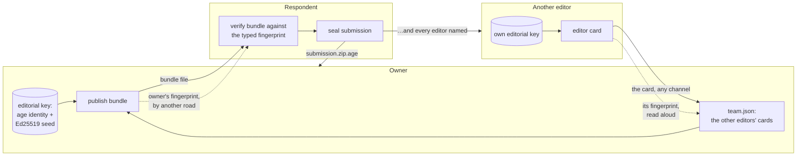

# OciDeck — Form intake: dossier for the external cryptographic review

> **Scope note (2026-10-04).** Since `FORM_INTAKE.md` revision 4 the work under
> review is the **offline transfer route** (`.zip.age`) — the same sealing,
> bundle, key and team code this dossier already scoped itself to ("the file
> route"). Every reference to "phase 4" or "the server" below concerns the
> superseded OciIntake direction and is void; the review scope itself is
> unchanged.
>
> **Status:** prepared for the external review that closes phase 3 of
> [`FORM_INTAKE.md`](FORM_INTAKE.md) (§12, D7) · **Status last reviewed:** 2026-10-03 · **Published by:** Stichting LibreKAT
>
> **A map for a reviewer, not a claim that the design is secure.** Everything here is a statement
> about what the code does, checked against the code on the date above; whether it is *enough* is
> the question this document exists to hand over. Where the design says "decided" it names the
> section; where something is a known weakness it is in §6, not softened elsewhere. The
> interoperability run against the reference `age` is in §5.4, with what it does and does not show.

---

## 1. What we ask of the reviewer

**In scope**

1. **The sealing layer** — how a submission is sealed to the organisers and opened again
   (`form_seal.dart`), and the one library under it (`dartage` 0.3.0): is the use of it correct,
   is what we *refuse* the right set, is the binding of a plaintext to its context sufficient?
2. **The bundle** — what a respondent believes about an organiser, signed with Ed25519 over
   canonical JSON, checked against a fingerprint that comes by another road (`form_bundle.dart`,
   `form_jcs.dart`, `form_base32.dart`): the construction, the order of the checks, the
   anti-rollback pins, and the identifiers (`kid`, fingerprint, `fid`).
3. **Key handling** — creation, storage, recovery and export of the organiser's editorial key
   (`form_keys.dart`, `form_key_file.dart`, `form_recovery_key.dart`, `form_bech32.dart`,
   `SecretStore`).
4. **The editor card and the team** — how a second editor is added so that every submission is not
   quietly sealed to someone else (`form_editor_card.dart`, `form_team.dart`).
5. **How the pieces are used by the app** — the respondent's side
   (`form_submission_seal.dart`) and the organiser's side (`form_import.dart`,
   `form_bundle_make.dart`, `form_team_actions.dart`): in particular what each refuses and in
   which order.

**Out of scope** (and why)

- The `age` file format itself — an external standard (C2SP) with a reference implementation and a
  public corpus of test vectors we run (§5.2). We ask whether *we use it correctly*, not whether
  `age` is sound.
- X25519, Ed25519, HKDF-SHA-256, HMAC-SHA-256, ChaCha20-Poly1305 and SHA-256 as primitives:
  `package:cryptography` and `package:crypto`, not ours. **No bespoke primitive and no new
  construction** is the red line of the design (§5.6); a reviewer who finds one has found a bug.
- The intake **server** and its protocol (phase 4, not built; `FORM_INTAKE.md` §6): this dossier
  covers the **file route** — a sealed `.zip.age` that travels by any means the people choose.
- The web respondent (phase 4). `dartage` does not run under dart2js (§6, item 1).
- The form markup, validation and the register: a correctness matter, not a cryptographic one.

**Suggested depth.** Roughly two thousand lines in the core package plus twelve hundred in the
app, nearly all of it plumbing around two libraries. The parts that decide the security are small:
`form_seal.dart` (379 lines), the verifier in `form_bundle.dart` (the function `verifyFormBundle`,
about 140 lines), `form_editor_card.dart` and the order of refusals in `form_team_actions.dart`.

---

## 2. The system on one page

Four artefacts travel between three kinds of people. Nothing here needs a server.

| Artefact | Made by | Read by | Protected by |
|---|---|---|---|
| **Form** (a Markdown file with HTML-comment markers) | the owner | the respondent | its SHA-256, inside the bundle |
| **Bundle** (`template.<lang>.bundle.json`) | the owner, signed with Ed25519 | the respondent | signature + a **fingerprint that arrives by another road** |
| **Sealed submission** (`<name>.zip.age`) | the respondent | every organiser the bundle names | `age` v1, X25519 recipients |
| **Editor card** (one line of JSON) | a new editor | the owner | a fingerprint over the whole card, read aloud |



**Roles of trust.** The respondent trusts one thing it was not handed by the same channel as the
rest: the **owner's fingerprint** (in an invitation, on a poster, said on the phone). Everything
else a respondent learns — who the organisers are, which keys to seal to — comes from the bundle
and is believed only after the signature checks against that fingerprint. The owner trusts a new
editor through the **card's fingerprint**, typed back after hearing it. There is no PKI, no server
identity and no trust-on-first-use of a key learned from the same place as the data.

---

## 3. What we are defending, against whom

**Assets.** (a) The *content* of a submission — text and photos — against everyone but the
organisers. (b) The *provenance* of the form — that the respondent seals to the people the
invitation names, not to whoever tampered with the bundle. (c) The organiser's *ability to read* —
a lost key loses every unfetched submission. (d) The *list of organisers* — a departed editor must
not stay readable-to by new submissions.

**Attackers considered.**

| Attacker | Can | We rely on |
|---|---|---|
| Whoever carries the files (mail, a shared folder, a server later) | read, copy, replace or drop any file | `age` encryption and authentication; the signature; the fingerprint arriving elsewhere |
| Someone who replaces the **bundle** | list their own key as the recipient | the Ed25519 signature checked against the fingerprint of the owner's key |
| Someone who replays an **older bundle** | list a departed organiser, or an older consent text | `bundle_seq` + the pins; `expires` (mandatory) |
| Someone who moves a **sealed file** to another form of the same organiser | have it accepted as an answer to the wrong form | the plaintext's `manifest` is compared with what the importer asked for (form id, version, `sid`) |
| Someone who swaps the **`age` recipient on an editor card** | have submissions sealed to themselves | the card's fingerprint covers the whole card (§4.5) |
| Someone with read access to the **owner's disk** | read the keychain item | the OS keychain; not defended further (§6, item 6) |
| A **malicious package** (zip bomb, path tricks, oversize header) | exhaust memory or write elsewhere | caps on the sealed file, the age header, recipients, the unzip (see §4.1) |

**Not defended:** the endpoint of either side — the design's threat table (`FORM_INTAKE.md` §9.1)
calls an organiser's compromised endpoint "outside this design's boundary"; metadata (who, when,
how big) is minimised, not hidden; and availability is mitigated, not guaranteed (a server that
withholds is accepted; the file route is the fallback). We also do not defend a person who is
socially engineered into typing a fingerprint they were shown on the same screen as the bundle (§6
item 8).

---

## 4. The constructions, one at a time

### 4.1 Sealing — `form_seal.dart`

A sealed submission is an **`age` v1 binary file with native X25519 recipients**, made by `dartage`
0.3.0 (MIT, pure Dart; pinned **exactly** in `packages/ocideck_form_core/pubspec.yaml`; decision
D9). It is the only file that imports `dartage`: `tool/check_packages.dart` (rule 10) refuses
`package:dartage`, `cryptography`, `pointycastle` and `pqcrypto` anywhere else in a package's
`lib/`, and a test of the tool pins that rule.

*What we do:*

- `sealFormPackage(zip, recipients:)` reads the zip **first** with our own reader (it will not seal
  what it would refuse to open), seals once per distinct recipient, at most `kFormMaxRecipients`
  = 64, and names the file `<sid>.zip.age`.
- `openSealedPackage(sealed, identities:, expectedSid:, expectedFormId:, expectedFormVersion:)`
  bounds the file **before** decrypting (`maxSealedBytes`: the header budget, the nonce and a
  16-byte tag per 64 KiB chunk over the package limit of 120 MiB), opens it, reads the package, and
  then requires `manifest.submission_id`, `form.id` and `form.version` to equal what the caller
  asked for.
- The age header is bounded at `kFormMaxAgeHeaderBytes` = 64 KiB (passed to `AgeDecrypter` as
  `maxHeaderBytes`).

*What we refuse, on purpose:* everything except the binary format with X25519 recipients — armor,
passphrases (scrypt), the hybrid post-quantum recipient and the tag recipient. They are refused, not
ignored: an armored file is `notAge`; a file with only a type we do not read is
`noIdentityMatched`. The `dartage` features we do not use (scrypt, armor, `pqcrypto`) are present in
the dependency but not used by this file: it passes only X25519 identities and recipients.

*Binding.* `age` has no associated data. A ciphertext a server moved from form A to form B of the
same organiser opens fine; the binding is the content, checked after opening (the three `expected…`
arguments). The importer also lands the plaintext through the same chain as a plain zip: the
answer-zone rules, the decode of every photo, a comparison of the text outside the answers against
the **published** form.

*Outcomes that fail closed* (`FormUnsealIssue`): `tooLarge`, `notAge`, `badIdentity`,
`noIdentityMatched`, `tampered`, `notAPackage`, `wrongSubmission`, `wrongForm`. A refusal never opens
part of a file.

### 4.2 The bundle — `form_bundle.dart`, `form_jcs.dart`, `form_base32.dart`

A bundle is JSON: `{v, fid, form:{id,version,rules}, template_sha256, organisers:[{name, age, sign,
kid}], policy:{closes?, max_package_bytes?, retain_unused?}, bundle_seq, expires, sig}`. The format
carries nothing server-shaped: the `api_host` member of the never-released intake server is gone,
and a bundle that still carries it is refused as malformed, not migrated.

**Signature.** Ed25519, by the **owner**, over the bytes
`"ocideck-intake-bundle-v1\n" ‖ canonical-JSON(bundle without sig)`. The canonical form is RFC 8785
(JCS) **restricted to a subset**: objects, arrays, strings, booleans, null and **integers** only —
a number with a fraction or an exponent is refused (`FormJcsError`), and so is an integer beyond
±(2⁵³−1). Rationale in the file: ECMAScript's number-to-string is a second implementation to get
wrong for no field that needs it. The keys, the signature, the `kid` and the fingerprint are **lower-case base32 without padding**; the template hash is lower-case hex.

**Who the owner is.** The organiser whose `sign` key hashes to the fingerprint the respondent holds.
The fingerprint is `base32(SHA-256(32-byte Ed25519 public key))`, 52 characters. A bundle without a
fingerprint is **refused** (`noFingerprint`) — the respondent is never asked to judge a name out of
the bundle itself.

**Order of the checks** in `verifyFormBundle` (each is a distinct `FormBundleIssue`, the first
failure wins, none has a "continue"):

1. size ≤ `kFormMaxBundleBytes` (256 KiB), JSON, an object (`notABundle`);
2. `v` equals 1 (`unsupportedVersion`);
3. a fingerprint is given, and is one (`noFingerprint`, `badFingerprint`);
4. some listed organiser's key hashes to it (`fingerprintMismatch`);
5. `sig` is 64 bytes and the Ed25519 signature verifies over the preimage above (`badSignature`);
6. **only now** the structure is judged strictly — keys, names, `age`, `sign`, `kid`, dates, caps
   (`badStructure`);
7. the template's SHA-256 equals `template_sha256`, and the template parses to the form id, version
   and rules the bundle names (`templateMismatch`);
8. the rules version is one this engine supports (`rulesTooNew`);
9. `expires` is not before today (UTC) (`expired`);
10. `bundle_seq` is not below the pin for (`fid`, owner fingerprint) (`rollback`).

*Nothing from the bundle is believed before step 5.* Step 4 reads only the `sign` members of the
`organisers` list to find the key. `createFormBundle` runs `verifyFormBundle` on what it just made,
against the owner's own fingerprint, **before returning it**: a bundle that would not pass what a
respondent does is not handed out.

**Pins.** `FormBundlePins` holds, per (`fid`, owner fingerprint), the highest `bundle_seq` the
client accepted; a lower one is a rollback, an equal one is fine. They are kept in the respondent's
preferences (`form_bundle_pins`, §6 item 5), as `<fid>@<fingerprint>` → the highest number.

### 4.3 Identifiers

| Name | Definition | Where |
|---|---|---|
| fingerprint | `base32(SHA-256(Ed25519 public key))`, 52 chars; shown in groups of four | `formKeyFingerprint` |
| `kid` | first 128 bits of `SHA-256` of the `age1…` recipient string, base32, 26 chars | `organiserKid` |
| `fid`, `sid` | 128 random bits, base32, 26 chars (`[a-z2-7]`) | `newFormId(Random.secure())` |
| template hash | `SHA-256` of the form text | `formTemplateHash` |

A bundle's organisers must not repeat a recipient, a signing key or a `kid` (checked in
`_parse`); the team and the card enforce the same three.

### 4.4 The organiser's key — `form_keys.dart`, `form_recovery_key.dart`, `form_key_file.dart`

*Contents.* An **`age` X25519 identity** (opens submissions) and an **Ed25519 seed** (signs
bundles), generated together in a visible step (never silently). Stored as one JSON text in the OS
keychain under `form_editorial_key` (`{v, identity, signing_seed (base32), created,
recovery_verified}`) via `SecretStore`.

*Never overwritten.* A keychain that cannot be read answers *unreadable*, not *absent*
(`SecretStore.readFormEditorialKey` rethrows where every other getter swallows); a stored text that
does not parse answers *damaged*. Neither offers to create a key. Creating reads the key back and
reports failure if it is not there.

*Recovery key* (`encodeFormRecoveryKey`). `version(1) ‖ purpose 'F'(1) ‖ ed25519 seed(32) ‖ age
scalar(32) ‖ CRC-16(2)` = 68 bytes, Crockford base32 in groups of four (109 characters). The `age`
identity travels as its 32 secret bytes, converted to and from `AGE-SECRET-KEY-1…` by our own bech32
(`form_bech32.dart`, BIP-173 vectors) because `dartage` keeps its bech32 private. The purpose byte
exists because the collaboration identity has a recovery key of the same kind with no purpose
byte, 67 bytes long: pasting one into the other's restore would pass a checksum and install the
wrong key. A collaboration key is the wrong length here and an editorial key the wrong length there
(`test/form_recovery_key_collab_test.dart` tests both directions). The CRC is a typo check, **not**
a security check.

*Restoring* fills an *empty* place only. *Verifying* the recovery key compares what was typed with
the stored key and sets `recovery_verified`; that flag is what the publishing rule asks for.

*Export.* As an `age` key file (`# created`, `# public key`, the identity line). `writeSecretFile`
creates a sibling temporary file **exclusively and empty**, `chmod 600` through `chmodPath` (the
app's one `chmod`; see §6 item 7), writes, then renames over the target; a failure removes the
temporary file and leaves an existing target intact.

### 4.5 The editor card and the team — `form_editor_card.dart`, `form_team.dart`

A card is `{v:1, name, age, sign, kid}` as canonical JSON on one line. **Its fingerprint is
`base32(SHA-256("ocideck-editor-card-v1\n" ‖ canonical-JSON))` over the whole card.** This is the
point of the construction: the owner checks it by another road and types it back; a fingerprint over
the signing key alone would let whoever carried the card swap the `age` recipient for their own,
keep the key, and have every submission sealed to the wrong person under a matching fingerprint.
(`form_team_actions_test.dart` has a test of exactly that swap.)

The card is **not signed**: it need not prove that its maker holds the keys; a card whose keys
nobody holds costs the owner a recipient that opens nothing. It is read strictly: only those keys,
`kid` must be `organiserKid(age)`, `sign` a lower-case base32 key of 32 bytes, and **no spaces
round the name** (the fingerprint is taken over what is written). A frozen card and its
fingerprint are in `test/fixtures/form_editor_card_vector.json`, checked independently with
Python's `hashlib` when it was made.

`addFormEditor` reads the card text **and the typed fingerprint itself** (what the window showed
does not count) in a fixed order: usable key → readable team → a text that is a card → a typed text
that is a fingerprint → **the fingerprint is this card's** → only then *is it the owner's own card /
a repeat / a full team* → saved. A wrong fingerprint is therefore reported before anything that
reveals who is already in the team. The window shows only the card's *name* before the fingerprint
is typed.

`team.json` (`{v:1, editors:[card…]}`) is read as strictly as a card is. A `team.json` that cannot
be read is never overwritten and stops publishing.

### 4.6 The respondent's side — `form_submission_seal.dart`

`sealFormSubmission` normalises the typed fingerprint (any case, with or without separators; 52
characters of base32 that decode to 32 bytes), runs `verifyFormBundle` against **the respondent's
own copy of the form**, then applies what the bundle says (`closes`: a form past its last day stops;
`max_package_bytes`: a larger package stops), and seals to **every** organiser the bundle names.
Pins are written when a bundle is believed, whether or not the file is then saved. What was typed
is remembered for the session only **after** a file was saved.

### 4.7 Randomness

Signing seeds: `Random.secure()` (`generateFormSigningKey`). `age` identities: `dartage`'s
`X25519Identity.generate()`; `dartage` takes its random bytes from `Random.secure` (read on
2026-10-03, see `FORM_INTAKE.md` §5.6). `fid`/`sid`: `newFormId(Random.secure())`. Tests use seeded
`Random` only to make fixtures deterministic.

---

## 5. What has been done to check it

### 5.1 Layout of the evidence

Each construction has its own test file in `packages/ocideck_form_core/test/` (platform-neutral
files also run in a browser) and the app code has widget and service tests in `test/`:

| Subject | Core tests | App tests |
|---|---|---|
| sealing | `form_seal_test.dart`, `form_seal_vectors_test.dart`, `form_seal_interop_test.dart` | `form_import_test.dart`, `form_submission_seal_test.dart`, `form_export_seal_test.dart` |
| bundle | `form_bundle_test.dart`, `form_bundle_vector_test.dart`, `form_jcs_test.dart`, `form_base32_test.dart` | `form_bundle_make_test.dart`, `form_bundle_dialog_test.dart` |
| keys | `form_recovery_key_test.dart`, `form_bech32_test.dart`; `test/form_recovery_key_collab_test.dart` | `form_keys_test.dart`, `form_keys_dialog_test.dart`, `form_key_file_test.dart` |
| card, team | `form_editor_card_test.dart`, `form_editor_card_vector_test.dart`, `form_team_test.dart` | `form_team_actions_test.dart`, `form_team_dialog_test.dart` |

### 5.2 Public vectors

The **complete** `age/testdata` corpus of the C2SP *Community Cryptography Test Vectors* — 143
vectors, commit `1e3d2860d46e94e777e1b17c7a6f2436387e3ecc` — is vendored byte for byte
(`packages/ocideck_form_core/test/fixtures/age_testkit/`, with `PROVENANCE.md` and `SHA256SUMS`;
`.gitattributes` marks it binary because two vectors have CRLF). `form_seal_vectors_test.dart` runs
every vector through `openAge`; vectors for what we do not implement (passphrases, armor, hybrid and
tag recipients) are skipped **as the corpus README allows**, but **every vector whose `expect` is
not `success` must be refused whatever its kind** — a refusal is never skipped.
`SHA256SUMS` is tested so a vector cannot be edited unnoticed.

### 5.3 Our own vectors

- `form_bundle_vector.json` (CC0): a seed, a template, the signed bundle, its canonical form and
  nine cases. Its signature was verified independently with Node's OpenSSL Ed25519 when made.
- `form_editor_card_vector.json` (CC0): one card, its canonical text, `kid` and fingerprint,
  verified with Python's `hashlib`.
- BIP-173 vectors in `form_bech32_test.dart`, and the CCTV identities as round-trip data for the
  `age` identity ↔ scalar conversion.

### 5.4 Interoperability with the reference `age` (phase 3 gate)

`form_seal_interop_test.dart` runs the sealing layer against the **reference `age` binary**
(`filippo.io/age`) in both directions. **Run on 2026-10-03 against `age` v1.3.2** (built from source
with Go; `make test-age-interop` repeats it at the pinned version): all cases pass.

| Case | What it shows |
|---|---|
| a 200 KiB package sealed here opens in the reference; one sealed by the reference opens here | the basic round trip over several 64 KiB chunks |
| two recipients: each opens a file sealed here, and one sealed by the reference to both | several recipients, both implementations |
| a key that is not a recipient opens nothing | `noIdentityMatched` here, a non-zero exit there |
| a payload bit, the last byte, a header bit, a file cut short, a file cut at a chunk boundary | **refused by both** — the failures agree |
| plaintexts of 0, 1, 65 535, 65 536, 65 537, 131 071, 131 072 and 131 073 bytes sealed by the reference | the chunk edges, opened here |

Two limits of what this shows. It is **one reference version on one machine**; and it does not run
inside `make check`, because the binary is not there — **without it the test reports "NOT RUN"**, and
`make check` shows those cases as skipped. A reviewer can run `make test-age-interop` (it needs Go and
the network) or point `AGE_BIN` at their own build.

### 5.5 Mutation testing

New code was checked with automated mutation (flipped comparisons, `&&`/`||`, off-by-one literals,
swapped constants, removed guards): every survivor was either turned into a test or judged
equivalent (for example masks, loop bounds over fixed lengths, `flush: true`, an operating-system
directory order). This repeatedly found gaps a hand-written list of cases missed (restbits, boundary
characters of an alphabet, a default parameter no caller used). It is evidence of test strength, not
of correctness.

### 5.6 Platforms

The core package's platform-neutral tests run on the VM and in Chrome. Under **dart2js** the sealing
and opening throw (see §6 item 1); under **dart2wasm** in Chrome the whole `form_seal_test.dart`
and `form_bundle_test.dart` pass.

### 5.7 Reproducing

```bash
cd packages/ocideck_form_core
dart pub get
dart test                                  # everything, VM
dart test -p chrome test/form_bundle_test.dart test/form_editor_card_test.dart
dart test -p chrome -c dart2wasm test/form_seal_test.dart
# the one that needs the reference binary (from the repository root: builds it, then runs):
make test-age-interop
```

From the repository root, `make check-packages` runs the static rules for the package (rule 10 is the
one that keeps the primitives in two files) and `make test-packages` the package tests with a
coverage floor. Versions at the time of writing: `dartage` 0.3.0, `cryptography` 2.9.0,
`crypto` 3.0.7 (from `pubspec.lock`).

---

## 6. Known limitations and accepted risks

1. **`dartage` 0.3.0 does not run under dart2js.** It builds the 64-bit chunk counter with
   `ByteData.setUint64`, which dart2js does not support; sealing and opening throw `Unsupported
   operation: Uint64 accessor not supported by dart2js`. The app therefore offers sealed export on
   desktop only, and the web respondent (phase 4) needs a wasm build or an upstream fix (two
   `setUint32` calls).
2. **A 0.x library with one maintainer, from July 2026.** Hence the exact pin, the full vector corpus
   on every `make check`, and this review. We read its `age.dart`, `header.dart`, `stream.dart`,
   `x25519*.dart` and `primitives.dart` before choosing it (the header MAC is checked before a byte
   of payload and compared without an early exit; an all-zero X25519 shared secret is refused; the
   header is bounded; the final-chunk flag is enforced) — a reading, not a proof.
3. **No revocation.** Removing an editor changes what the owner publishes *next*. A respondent who
   holds the old bundle keeps sealing to the departed editor until it expires or the new one is
   fetched; the pins protect against an *older* bundle, not this. What was already sealed for a
   person stays readable to them. Mitigation: `expires` is mandatory; the UI says so on removal.
4. **No forward secrecy and no sender authentication.** `age` to X25519 recipients seals to a static
   key; anyone with a recipient's identity can read everything ever sealed to it. A respondent is
   anonymous by design (the maker-check in `FORM_INTAKE.md` §7.4 is an integrity control, not
   authentication). A lost identity loses every unfetched submission — the reason for the recovery
   key and for the two-key publishing rule.
5. **The pins live in `SharedPreferences`** (`form_bundle_pins`: the bundle's `fid` and the owner's
   fingerprint → a number; no secret). Clearing the preferences clears the anti-rollback memory until the next
   bundle. An unreadable value is read as empty, because it cannot be known whether a bundle was
   seen.
6. **Key custody is the OS keychain's.** An attacker running as the user with keychain access reads
   the key. Dart cannot zeroise memory; the identity exists as a `String` and the seed as a
   `Uint8List` while the app uses them.
7. **One subprocess.** Setting `0600` on an exported key file needs `chmod`; Dart has no permission
   API. It is called from one place (`lib/utils/chmod.dart`), with a fixed argv, no shell, an octal
   mode validated before use and `--` before it; the app's subprocess guard names this file and the
   git layer and no other place.
8. **Typed fingerprints are a human step.** A respondent or owner who types what they are shown on
   the same screen checks nothing; the owner's window deliberately does not show the card's
   fingerprint before it is typed. The respondent's does not show the owner's at all. Nothing
   stops a user from copying it from the same channel as the bundle.
9. **The card is unsigned** (§4.5). The argument is above; a reviewer may disagree.
10. **The respondent's package is not a zero-knowledge object.** Its file name is
    `<form-id>-<six characters of the sid>.zip.age` — no personal data, but it names the form.
11. **We refuse what we do not use** rather than ignore it (§7 question 5). A file sealed with
    armor, a passphrase or only a hybrid recipient does not open here, by design — which also means
    an organiser who seals a test file with the reference `age` for a passphrase cannot open it in
    OciDeck.

---

## 7. Questions we would like answered

1. Is **JCS restricted to integers** safe against a *different* implementation that parses the same
   bundle text differently? In particular: the verifier takes `jsonDecode` of the **text** and
   canonicalises the **decoded map**. A bundle with a **duplicate member name** loses all but the
   last on decoding, so the signature is over what survives. Is there a downgrade or confusion we
   have not seen?
2. The signer key is **found by fingerprint among the listed `sign` keys** before the structure is
   judged. Is there any way for a crafted `organisers` list to make us pick a key that is not the
   owner's, given that the fingerprint is the SHA-256 of the whole 32-byte key?
3. Is the **plaintext binding** (compare `submission_id`, form id and version after opening)
   sufficient given that `age` has no associated data? What should a server that *replaces* a
   ciphertext with another valid one for the same recipient be able to achieve, short of the
   `replaced` flag we plan (phase 4)?
4. Is the **editor-card fingerprint** — SHA-256 over a domain tag and the canonical JSON, typed back
   from a spoken value — enough for the threat in §3, or should it be a signature as well?
5. Is it right to **refuse** every `age` feature we do not use, rather than ignore it? Does the
   refusal of a file with an unknown stanza type (`noIdentityMatched`) leak anything?
6. **Limits:** the sealed-file bound (`maxSealedBytes`), the header bound (64 KiB), 64 recipients and
   a 120 MiB package — any that invite a resource attack we missed?
7. Anything in **how the keychain item is created, read back, restored and exported** that you would
   change?
8. **The order of refusals** in `addFormEditor` and `sealFormSubmission`: does any early refusal leak
   what a later one should hide?

---

## 8. Pointers

- Design: [`FORM_INTAKE.md`](FORM_INTAKE.md) — §5.1 bundle and card, §5.6 sealing, §5.9 keys, §7.2
  import, §7.6 teams, §9 threats, §12 phases, §15 decisions D1–D9.
- Source map: [`../SOURCE_MAP.md`](../SOURCE_MAP.md) lists every file named here with its role.
- The dossier will be updated when the interoperability run is done (§5.4) and when the reviewer's
  findings are in; findings are handled one by one, each its own change.
