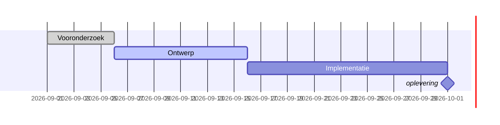

# OciDeck — Gantt-slidetype: product design

*The slide type that renders a project schedule as a Gantt chart — stored as a
plain Markdown table, rendered via Mermaid's gantt renderer that is already on
board.*

> **Status:** implemented in #1246 (2026-08-05) · **Status last reviewed:** 2026-08-04 · **Published by:** Stichting LibreKAT

> **This is a design doc, not shipping behaviour.** When implementation lands,
> the contributor docs ([`ARCHITECTURE.md`](../ARCHITECTURE.md),
> [`SOURCE_MAP.md`](../SOURCE_MAP.md), [`FILE_FORMAT.md`](../FILE_FORMAT.md),
> [`USER_GUIDE.md`](../USER_GUIDE.md)) and the [`CHANGELOG.md`](../../CHANGELOG.md)
> carry the truth. This document remains the *why* and the *format contract*.

> Sibling design docs: [`PROCESS_IMPROVEMENT.md`](PROCESS_IMPROVEMENT.md)
> (the module this type lives in), [`PENTEST_MIAUW.md`](PENTEST_MIAUW.md)
> (the module whose opt-in pattern is mirrored).

---

## 1. Purpose & scope

OciDeck should be able to render a **project schedule** as a Gantt chart —
duurbalken on a time axis, with dependencies, milestones and progress — while
keeping OciDeck's principles intact: *file = truth*, storage stays as plain
Markdown, and nothing leaves the machine.

The type lives in the **Procesverbetering** module
([`SlideCategory.procesverbetering`](../../lib/models/slide.dart)), alongside
`flow`, `tree`, `matrix`, `canvas` and `phase-gate`. A Gantt is a standard
project-management artefact that fits the DMAIC/DMADV *Control* phase and the
8D *Implementation* phase, but is also broadly useful beyond LSS — hence
`procesverbetering` (where the other planning artefacts live), not `general`.

### The decision: table storage, Mermaid render

Three approaches were considered:

| | A. Eigen Scene-renderer | B. Mermaid-DSL in `.md` | C. Table storage → Mermaid render |
|---|---|---|---|
| Storage | Markdown table | Mermaid gantt DSL | **Markdown table** |
| In plain Marp | renders as table | renders as code block | **renders as table** |
| Bewaker-toets | strong | weak (degrades to code) | **strong** |
| New code | ~260-line layout engine | ~0 (but no structured editor) | **~60-line table→DSL converter** |
| Dep/milestone/section | build from scratch | Mermaid has it | **Mermaid has it** |
| Render infra | new Scene backend | existing MermaidRenderService | **existing MermaidRenderService** |
| Structured editor | yes (like flow/tree) | no (raw DSL) | **yes (table editor, like scorecard)** |

**Chosen: C.** The table is the source of truth — human-readable and functional
in any Marp reader. The Mermaid gantt DSL is **derived at render time and never
stored**, the same way `flow` derives its roll-up strip ("PT 120 · LT 480 · PCE
25%") from bullets but never persists it. The DSL feeds the existing
[`MermaidRenderService`](../../lib/services/mermaid_render_service.dart), which
already renders Mermaid in slides, the presenter, the audience window, and
raster export (PDF/PPTX).

### Raw DSL is not a second choice — it is the other route

This type does not replace raw Mermaid; it sits beside it. A `freeMarkdown`
slide with a ` ```mermaid ` fenced block already renders any Mermaid diagram —
flowchart, sequence, gantt, whatever — and that route stays for the user who
writes DSL directly. The two routes serve different users:

- **Structured Gantt type** (this doc) — the professional who wants a table
  editor and a deck that degrades to a readable schedule in plain Marp.
- **Raw DSL in `freeMarkdown`** — the techneut who knows Mermaid's gantt
  syntax and wants full control, including Mermaid features the table does
  not model (SS/FF/SF deps, exclusion ranges, multi-day axis formats).

Neither is deprecated. The Gantt type exists because the table degrades
better in plain Marp — not because raw DSL is wrong. See §7 for the open
question of whether the Gantt type should also accept raw DSL as an input
mode within its own editor.

### Why not the Scene renderer (A)

The Scene model ([`lib/services/scene/scene.dart`](../../lib/services/scene/scene.dart))
is the right tool for the four existing procesverbetering types — they have
domain-specific layout logic (VA/NVA colouring, swimlanes, bottleneck
detection, LSS metric roll-ups). A Gantt is a standard diagram that Mermaid
already does well: dependencies (FS/SS/FF/SF), milestones, sections, progress
status. Building that from scratch in Scene is work that already exists in the
library we already ship. The right tool per job beats consistency for
consistency's sake.

### Why not raw Mermaid DSL in the `.md` (B)

The bewaker-toets in its sharpest form: *if OciDeck stops existing tomorrow,
can the user keep working with their decks?* With DSL storage, a user opening
the `.md` in plain Marp sees a code block — the visual is gone and the data is
not usable as a table without running Mermaid. With table storage, the user
sees a structured task list with dates — functional, not just readable. The
table is the form that upholds the exit.

---

## 2. The format

### 2.1 Storage shape

The slide is stored as a Markdown table with a `_class: gantt` token. The
heading is the title; the table has a fixed five-column shape:

```markdown
<!-- _class: gantt -->
# Projectplanning — migratie

| Taak | Start | Duur | Voortgang | Afhankelijk van |
| --- | --- | --- | --- | --- |
| Vooronderzoek | 2026-09-01 | 5d | done | |
| Ontwerp | 2026-09-08 | 10d | active | Vooronderzoek |
| Implementatie | 2026-09-22 | 15d | | Ontwerp |
| Testen | 2026-10-06 | 7d | | Implementatie |
| Oplevering | 2026-10-13 | 0d | | Testen |
```

In plain Marp this renders as a readable table — the schedule is legible even
without the Gantt visual. In OciDeck the converter reads the table and renders
a Gantt chart via Mermaid.

### 2.2 Column contract

| Column | Content | Required | Example |
| --- | --- | --- | --- |
| **Taak** | Task name. A row whose name starts with `Milestone:` is rendered as a milestone (zero-duration diamond). | yes | `Vooronderzoek` / `Milestone: oplevering` |
| **Start** | Start date (`YYYY-MM-DD`) or empty when the task depends on a predecessor (then the start is derived). | yes* | `2026-09-01` |
| **Duur** | Duration in Mermaid units: `Nd` (days), `Nw` (weeks), `Nh` (hours). `0d` for a milestone. | yes | `5d`, `2w` |
| **Voortgang** | One of: empty (not started), `active` (in progress), `done` (complete), `crit` (critical/at risk). | no | `done` |
| **Afhankelijk van** | Task name(s) from the Taak column, comma-separated. Resolved to Mermaid `after` references by the converter. | no | `Ontwerp, Testen` |

\* Start is required unless the task has a dependency — then the start is
derived from the predecessor's end date, and the Start column may be empty.

### 2.3 Optional per-slide comments

| Comment | Meaning | Default |
| --- | --- | --- |
| `<!-- ocideck_gantt_scale: week -->` | Axis granularity hint: `day`, `week`, `month`. The converter picks a Mermaid `axisFormat` accordingly. | auto (based on date span) |
| `<!-- ocideck_gantt_sections: true -->` | Group tasks by leading `## Heading` lines between table rows (see §2.4). | `false` (flat) |

### 2.4 Sections (optional)

When `ocideck_gantt_sections: true`, `## Heading` lines between table rows
become Mermaid `section` headers. Without the flag, `##` lines are ignored by
the Gantt renderer and render as ordinary Markdown (which Marp shows above the
table). This keeps the default simple — most decks have a flat task list —
while larger schedules can opt into grouping.

### 2.5 What is not stored

- **Mermaid DSL.** Never. The DSL is derived at render time.
- **Task IDs.** Mermaid needs short IDs (`t1`, `t2`) for `after` references;
  the converter generates them from row order and resolves dependency names
  to IDs. The user never sees or writes IDs.
- **Layout/animation options.** These would round-trip as extra `_class`
  tokens (like `timeline-horizontal`), but no such tokens are defined in v1.
  A Gantt is a static diagram; animation is not part of the first version.

---

## 3. The render pipeline

```
Markdown table (Slide.tableRows)
        │
        ▼
  gantt_dsl.dart          ← table → Mermaid gantt DSL (pure Dart, ~60 lines)
        │
        ▼
  Mermaid gantt source
        │
        ▼
  MermaidRenderService    ← existing: WebView (desktop) / JS-interop (web)
        │
        ▼
  SVG (cached by source)  ← existing LRU cache
        │
        ▼
  slide_preview / presenter / audience / raster export
```

### 3.1 The converter (`gantt_dsl.dart`)

A pure-Dart function, no Flutter imports — testable in isolation, like
`flow_slide.dart` and `tree_slide.dart`:

```dart
/// Converts a Gantt slide's table rows to Mermaid gantt DSL.
///
/// [rows] are the table rows (header excluded). [taskNames] maps row index
/// to the Taak column value, for dependency resolution. [scale] is the
/// optional axis granularity hint.
String ganttTableToMermaid({
  required List<TableRow> rows,
  required Map<int, String> taskNames,
  String scale = 'auto',
});
```

**Conversion rules:**

1. **ID assignment:** First pass over rows — `t1`, `t2`, … by row order. Build
   a `name → id` map (task names are unique within a slide; duplicates get a
   suffix).
2. **Date format:** `dateFormat YYYY-MM-DD` (fixed — the table stores
   ISO dates).
3. **Axis format:** From `scale` — `day` → `%Y-%m-%d`, `week` → `%Y-%m-%d`
   (Mermaid has no week-axis), `month` → `%Y-%m`. Auto: pick based on the span
   between earliest start and latest end (< 14 days → day, < 90 → week, else
   month).
4. **Task line:** `    <name> :<status>, <id>, <start>, <duration>` where
   `<status>` is `done`/`active`/`crit` or empty, `<start>` is the date or
   `after <dep-id>`.
5. **Milestone:** A row whose name starts with `Milestone:` → strip the
   prefix, render as `    <name> :milestone, <id>, <start>, 0d`.
6. **Dependencies:** The "Afhankelijk van" column contains task names. The
   converter resolves each to its ID via the name→id map. Multiple
   dependencies → `after t1, after t2` (Mermaid supports comma-separated
   `after` refs). If a name is not found, the dependency is silently dropped
   (the table is the truth; a dangling reference is a data error, not a
   render error — the Gantt still draws).
7. **Sections:** When `ocideck_gantt_sections: true`, a `## Heading` before a
   row emits `    section <heading>` before that row's task line.

### 3.2 Example conversion

Table:

| Taak | Start | Duur | Voortgang | Afhankelijk van |
| --- | --- | --- | --- | --- |
| Vooronderzoek | 2026-09-01 | 5d | done | |
| Ontwerp | 2026-09-08 | 10d | active | Vooronderzoek |
| Implementatie | 2026-09-22 | 15d | | Ontwerp |
| Milestone: oplevering | 2026-10-13 | 0d | | Implementatie |

Generated DSL:



### 3.3 Theming

Mermaid is initialised with `theme: 'neutral'`
([`mermaid_config.dart:28`](../../lib/services/mermaid_config.dart)) — a
fixed, theme-independent look in a white frame. The Gantt type inherits this
unchanged. **Deck-style-profile theming for Mermaid diagrams is not part of
v1.** It is a follow-up that affects all Mermaid-backed slides (not just
Gantt) and requires wiring `themeVariables` from the style profile into
`kMermaidInitConfig`. That is a separate, cross-cutting change; doing it
only for Gantt would create an inconsistency.

The `ponytail:` ceiling: a Gantt in a branded deck renders in Mermaid's
neutral theme, not the deck's accent colour. Upgrade path: wire
`themeVariables` into `kMermaidInitConfig` from the style profile, for all
Mermaid slides at once.

---

## 4. The nieuw-slidetype ketting

Adding `SlideType.gantt` touches ~16 places. The compiler finds ~11; the rest
fails silently. The full checklist, per the `nieuw-slidetype` skill:

### 4.1 Model
- `lib/models/slide.dart` — add `gantt` to the `SlideType` enum.
- `slideTypeMeta` — add entry with `backedByTable: true` (content lives in
  `Slide.tableRows`, like `scorecard`/`assets`/`discoveries`/`control-status`).
  `bulletColumns: BulletColumns.none` (no continuous bullet text).
  `marpClass: 'gantt'`. Category: `procesverbetering`.
- `slide_type_meta_test.dart` will fail until the entry exists — that is the
  guard.

### 4.2 Markdown round-trip (the contract)
- `markdown_service.dart` — the writer `switch` (compiler points this out).
- `markdown_service_serialize.dart` — write helper. Table-backed types
  serialize via the shared table writer; the `_class: gantt` token is the
  only type-specific part.
- `markdown_service_parse.dart` — **nothing**: type is inferred from
  `slideTypeByMarpClass` which reads `slideTypeMeta`, and the table content
  flows through `backedByTable`. This is the whole point of the registry
  refactor — a new table-backed type costs no parser code.
- `markdown_validator_vocabulary.dart` — add `gantt` to the known `_class`
  tokens, else the structure checker warns in Markdown mode.
- `ocideck_gantt_scale` and `ocideck_gantt_sections` comments must be added
  to the known-comment list in the validator.

### 4.3 Editing
- `lib/widgets/editors/slide_editor_registry.dart` — register the Gantt
  editor. Reuse the existing table editor (the same grid `scorecard` and
  `control-status` use), with a column-header preset for the five fixed
  columns.
- `lib/widgets/dialogs/add_slide_dialog.dart` and
  `lib/widgets/panels/slide_list_panel_add.dart` — offer the type in the
  Procesverbetering tab.
- `lib/widgets/editors/slide_type_help.dart` — the help text.
- `lib/widgets/panels/editor_panel_slide_settings.dart` — the scale and
  sections toggles live here.

### 4.4 Showing — all four surfaces
- `lib/widgets/slides/slide_preview.dart` — the preview. Calls
  `ganttTableToMermaid` → `MermaidRenderService` → SVG. Reuses the existing
  `MermaidDiagram` widget path (the same one `freeMarkdown` mermaid blocks
  use), including `scrollableMermaid` for large charts.
- `lib/widgets/slides/slide_thumbnail.dart` — the slide strip. A small Gantt
  renders the same SVG at thumbnail scale.
- `lib/widgets/presentation/parts/presenter_content.dart` — presenter mode.
- `lib/widgets/presentation/audience_window.dart` — beamer screen. No
  interactivity in v1 (a Gantt is static), so no `MermaidViewController`
  wiring beyond what the shared render path already does.

### 4.5 Export and storage
- `lib/services/export_service.dart` and PPTX/PDF/HTML paths — Mermaid
  diagrams already rasterize via `slide_rasterizer.dart`; no new work.
- `lib/services/git/deck_repo_serializer.dart` and
  `lib/services/parts/file_service_package.dart` — package storage. No new
  sidecar (the data is in the table, not a `.json`).
- `lib/services/slide_layout_metrics.dart`,
  `slide_quality_analyzer.dart` — add `gantt` to the type switch so it gets
  a quality judgement.

### 4.6 Words and paper
- `make add-l10n SPEC=…` for the 31 translations of every new interface
  string (type label, help text, column headers, scale/sections labels).
- `docs/USER_GUIDE.md` — the Gantt section under Procesverbetering.
- `docs/FILE_FORMAT.md` — the `gantt` token and the table contract (§5).
- `docs/SOURCE_MAP.md` — the new files.
- `docs/API_DOCUMENTATION.md` — the enum-value count.
- `CHANGELOG.md`.

### 4.7 Where you trip
- **Method length 150** — the writer/reader switches in
  `markdown_service_serialize.dart` and the editor registry. Split if needed.
- **File size 1000** — `markdown_service_parse.dart` sits at the limit; a
  new table-backed type should not add code there (and per §4.2, it doesn't).
- **Coverage** — `gantt_dsl.dart` is a new `lib/` file; it must appear in a
  test or the coverage gate falls. The converter is pure Dart and trivially
  testable (table in, DSL string out).

---

## 5. What is explicitly not done

- **No Mermaid DSL in the `.md`.** The table is the source of truth. The DSL
  is derived at render time and discarded — the same pattern as `flow`'s
  roll-up strip.
- **No deck-style-profile theming for Mermaid in v1.** The Gantt renders in
  Mermaid's `neutral` theme, like every other Mermaid diagram in the app.
  Theming is a cross-cutting follow-up that affects all Mermaid slides.
- **No live-sync or push-back to LibrePlan.** OciDeck renders snapshots, it
  does not plan. Editing allocations or writing back makes OciDeck a PM
  client with a server dependency — that is a different product and a lock-in.
- **No animation.** A Gantt is a static diagram. Reveal-on-enter or
  step-through animation is not part of v1; it would need `_class` subtokens
  (like `timeline-steps`) and presenter wiring.
- **No new dependency.** Mermaid is already on board
  ([`mermaid_config.dart`](../../lib/services/mermaid_config.dart),
  [`mermaid_render_service.dart`](../../lib/services/mermaid_render_service.dart),
  bundled in HTML export). The converter is pure Dart.

---

## 6. The LibrePlan connector (follow-up, separate scope)

The Gantt type is sovereign — it works with hand-typed data, CSV import, or a
LibrePlan snapshot. The LibrePlan connector is a **separate specialist module**
(off by default, under Settings → Extensions) that fetches a project via
LibrePlan's REST API and fills slides — including the Gantt type.

| LibrePlan data | OciDeck slide type | New type? |
| --- | --- | --- |
| Project schedule (WBS + dates + deps) | **Gantt** (this doc) | yes |
| WBS (order elements) | `tree` (existing) | no — import mapping |
| Resource load over time | `chart` heatmap (existing) | no — preset |
| Project status (progress/hours/cost) | `cockpit` (existing) | no — preset |
| Milestones with dates | `timeline` (existing) | no — import mapping |
| Timesheet / work report | `table` (existing) | no — preset |
| Cost planned-vs-actual | `scorecard` or `chart` (existing) | no — preset |
| RACI from allocations | `matrix` RACI template (existing) | no — template |
| Critical path | `flow` (existing) | no — preset |

LibrePlan's REST API is XML (`/ws/rest/`). XML parsing is not currently in the
codebase; adding a lightweight XML parser is justified because it unlocks other
integrations too. The connector's security review (outbound HTTPS,
user-pointed server, credentials in OS keystore, fail-closed) is covered by the
`security-architect` skill and is a prerequisite for that work, not for this
design doc.

**The connector is not part of this issue.** This issue is the Gantt type
only. The connector is a follow-up that depends on the type existing first.

---

## 7. Open questions

1. **Dependency types.** The table's "Afhankelijk van" column implies
   finish-to-start (FS) — the most common type. LibrePlan also supports
   SS (start-start), FF (finish-finish) and SF (start-finish). Mermaid gantt
   does not natively express these (only `after` = FS). **v1: FS only.**
   If SS/FF/SF are needed later, the column contract extends with a syntax
   like `Ontwerp (SS)` and the converter maps to Mermaid's limited support
   or falls back to a note. This is a known ceiling, not a blocker.

2. **Max tasks.** A pathological deck with 200 tasks makes the Gantt
   unreadable and the render slow. **Proposed bound: 30 tasks** (matching
   `timelineMaxEvents = 12` in spirit — a slide is a summary, not a plan
   file). The converter clamps and the editor warns. To be confirmed in
   implementation.

3. **Date parsing strictness.** The table stores `YYYY-MM-DD`. What happens
   with a malformed date? **Proposed:** the converter skips the row's start
   date and falls back to `after` if a dependency exists, or drops the task
   with a quality warning. The table is the truth; a bad date is a data
   error, not a crash.

4. **Raw DSL as an input mode in the Gantt editor.** The Gantt type uses a
   table editor, but a user who knows Mermaid's gantt syntax may want to
   type DSL directly — to use features the table does not model (SS/FF/SF
   deps, `excludes weekends`, custom `axisFormat`). Two options:
   - **v1: table only.** The user who wants raw DSL uses a `freeMarkdown`
     slide with a ` ```mermaid ` block instead — that route already works
     and degrades to a code block (acceptable for a techneut who chose it).
     The Gantt type stays simple: one editor, one storage form.
   - **Later: dual-mode editor.** The Gantt editor offers a "raw DSL" tab
     beside the table, stores whichever the user edited last, and converts
     table→DSL and DSL→table on switch. This is more work (a DSL parser,
     not just a generator) and risks data loss on DSL that uses features
     the table cannot represent. **Not in v1.** The `freeMarkdown` route
     covers the techneut today; a dual-mode editor is a follow-up if the
     demand is real.

---

## 8. The bewaker test, written out

> Open the `.md` in a text editor and in another Marp tool. Is it still
> readable and usable?

**Yes.** The schedule is a Markdown table with ISO dates and task names. A
reader sees a structured task list — start, duration, progress, dependencies —
and can edit it in Notepad.

> If OciDeck stops existing tomorrow, can the user keep working with their
> decks?

**Yes.** The table is plain Markdown. The Gantt visual is gone, but the data
is intact and functional as a table. The user can paste it into any
spreadsheet or Gantt tool. No OciDeck-specific format, no DSL, no sidecar.

> Who must you trust to make this work?

No new party. Mermaid is already bundled and vendored — it runs on the user's
device, in a WebView or in the page. No external service, no CDN, no API call.
The LibrePlan connector (follow-up) does add a trusted party (the user's
LibrePlan instance), but that is user-pointed and off by default.

---

## 9. The broader question: which Mermaid types fit the hybrid pattern?

The Gantt type uses a pattern that could apply to other Mermaid diagrams:
store a readable Markdown structure, derive the DSL at render time. But not
every Mermaid type has a natural Markdown form that round-trips losslessly.
The honest assessment, per type:

| Mermaid type | Natural Markdown form? | Lossless round-trip? | Verdict |
| --- | --- | --- | --- |
| **gantt** | table (task/start/duration/progress/dep) | yes | **this doc** |
| **pie** | table (label/value) | yes | covered by existing `chart` type |
| **er** | tables per entity + relation table | yes | candidate, if needed |
| **journey** | table (step/score/description) | yes | candidate, if needed |
| **mindmap** | nested bullets | yes | covered by existing `tree` type |
| **timeline (Mermaid's)** | list (period/event) | yes | covered by existing `timeline` type |
| **flowchart** | bullets with `→` or `::` | **no** — shapes, directions, subgraphs, styling lost | raw DSL only |
| **sequence** | table (from/message/to) | **no** — loops, alt/opt, notes, self-refs lost | raw DSL only |
| **state** | list (state/transition/state) | **no** — composite states, forks, concurrency lost | raw DSL only |
| **class** | table (class/attrs/methods) | partial — relationships unhandy | raw DSL preferred |

**The principle:** the hybrid pattern (structured Markdown → DSL) is worth it
only when the Markdown form is both readable in plain Marp *and* losslessly
convertible. For flowchart, sequence and state — the three richest Mermaid
types — a flat Markdown structure loses too much, and two non-equivalent
representations of the same data is worse than one honest one. Those stay as
raw DSL in `freeMarkdown`, and that is the right answer, not a compromise.

The types that do fit the pattern (gantt, pie, er, journey, mindmap,
timeline) are exactly the ones OciDeck already has structured types for, or
is adding (this doc). That is not a coincidence: a diagram whose data is a
table or a list is a diagram that belongs in a structured editor. A diagram
whose data is a graph with shapes and edges is a diagram that belongs in
DSL.
