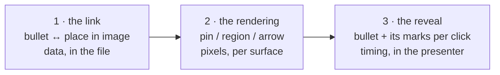
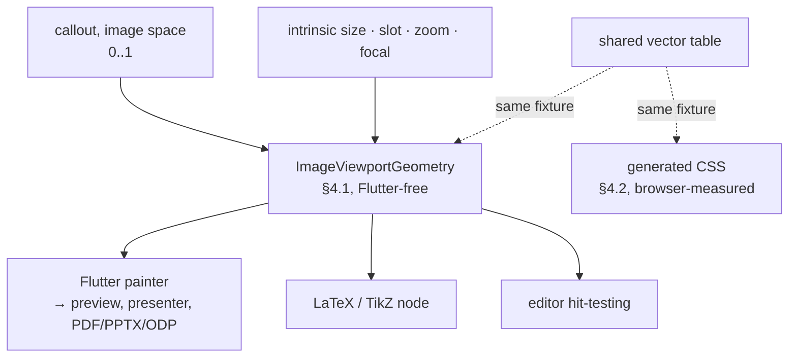

# OciDeck — Image callouts: product design

*Tying a bullet to a part of the picture beside it — as a numbered pin, a
highlighted region or an arrow — and optionally bringing the two up together.*

> **Status:** revision 5, implemented and under acceptance · **Status last reviewed:** 2026-08-29 · **Published by:** Stichting LibreKAT

> **This is a design doc, not shipping behaviour.** When implementation lands,
> the contributor docs ([`ARCHITECTURE.md`](../ARCHITECTURE.md),
> [`SOURCE_MAP.md`](../SOURCE_MAP.md), [`FILE_FORMAT.md`](../FILE_FORMAT.md),
> [`USER_GUIDE.md`](../USER_GUIDE.md)) and the [`CHANGELOG.md`](../../CHANGELOG.md)
> carry the truth. This document remains the *why* and the *format contract*.

> Origin: issue #1801. Sibling design docs:
> [`GANTT_SLIDETYPE.md`](GANTT_SLIDETYPE.md) (a format contract of the same
> shape), [`COLLABORATION.md`](COLLABORATION.md) (the field chain §5 depends on).

---

## 1. Purpose & scope

An author explaining a machine, a map or a schematic needs to say *this line of
text is about that part of the picture* — and, while presenting, to bring the
text and its mark up together.

`bulletsImage` already puts bullets beside a picture. What is missing is the
link between the two, and any way to draw it.

**In scope.** Callouts on `bulletsImage`. One bullet carries at most one
reference; a reference may have several targets. A target is a point or a
rectangle in the image. The slide picks one presentation over that data — pins,
region highlight, or arrows. Reveal is a separate option.

**Out of scope.** A new slide type, a general connector or diagram editor, manual
bend points, per-target presentation modes, author-chosen colours, line widths or
arrowhead sizes. **Rich-text bullets are out too**, and deliberately: the two
functions both want the trailing text of a bullet, and §6 makes that a blocked
transition rather than a silent loss.

**Three separable capabilities.** They are built in this order and each is useful
without the next:



---

## 2. Format contract (format version 2)

Two things are stored, and only two: the reference a human reads inside the
bullet, and the canonical data in the front matter. They are separate because
they have different survival requirements — the first has to survive being read
as prose, the second has to survive being rewritten by an older reader. Nothing
else about a callout is written to disk (§2.3). Every claim in this section was
measured against the released reader; the evidence is in [§10](#10-evidence).

### 2.1 In the bullet — the visible reference

```markdown
- controller board with display (A)
- printing head (B)
```

- Exactly one reference per bullet, at the **end**, preceded by a single space.
- `(` + `[A-Z]` + `)` — **one uppercase letter, never two.** Uppercase only, which
  is what keeps the reserved words `mode` and `reveal` in §2.2 from ever colliding
  with a reference; single-letter because the ceiling in §8 is 26 references and a
  grammar that accepts `ZZ` while the limit says `Z` is a contradiction waiting to
  be implemented twice.
- It is ordinary text. It survives any reader, it is hand-editable, and it is the
  fallback on every surface that cannot draw an overlay: a reader with only a
  text editor still sees which bullet refers to which mark.

Because it is ordinary text, `(A)` at the end of a bullet is also an ordinary
thing for prose to do. §2.6 defines when it means a callout and when it is just a
sentence.

### 2.2 In the front matter — the canonical data

```yaml
ocideck_callouts:
  <slide-anchor>:
    mode: pin
    reveal: steps
    A: point 0.402 0.251 | the controller board
    B: region 0.550 0.200 0.180 0.220 | the print head
    C: point 0.610 0.480; point 0.700 0.300 | the two mounting bolts
```

| Element | Rule |
| ------- | ---- |
| Nesting | Exactly two levels: anchor, then entries. No deeper. |
| `mode` | `pin` \| `region` \| `arrow`. Absent = `pin`. |
| `reveal` | `all` \| `steps`. Absent = `all`. |
| Entry key | The reference, `[A-Z]` — one letter — unique within the slide. |
| Entry value | `<geometry>[; <geometry>…] \| <description>` |
| `<geometry>` | `point <x> <y>` or `region <x> <y> <w> <h>` |
| Numbers | 0..1 in **image space**, three decimals. **Never clamped** — see §2.4 |
| Precision | The writer always emits exactly three decimals. A hand-written number with more is read as written and normalised on the next save, so the file heals itself rather than rejecting an honest edit |
| Region `<x> <y>` | The **top-left corner**, not the centre |
| Region `<w> <h>` | Strictly positive, and `x + w ≤ 1`, `y + h ≤ 1`. A rectangle is validated as a rectangle; four numbers each inside 0..1 is not the same test |
| `<description>` | Free text after the first ` \| `; later ` \| ` belong to it. It describes the **reference**, i.e. the whole target group — see §12.1 |
| Quoting | The value passes through the existing `markdownYamlScalar`, so a description containing `:` is quoted and the block stays valid YAML |

**Why the grammar is this flat.** `yaml` is a dev-dependency only (it serves
`tool/sbom_build.dart`), so `lib/` has no YAML parser and promoting the package
would trip the SBOM gate and a licence review. The grammar is therefore
restricted to what a twenty-line hand-rolled reader can parse — two levels, one
entry per line — while remaining valid YAML for anything else that reads the
front matter.

**Why three decimals.** `privacy_location_rules.dart` treats a number pair as a
coordinate only at **four or more** decimals on both sides, and
`isPlausibleCoordinate(0.62, 0.28)` is true. Four decimals would make every
callout a privacy finding; three cannot. It is also exactly what `_formatFocal`
already does for image focal points, so this follows an existing convention
rather than inventing a rule.

**Why image space, not slot space.** The slot shows a *crop* of the picture
(cover + focal + zoom). A slot-space coordinate slides off its feature the moment
the author re-crops. Image space is the only frame that survives.

**A callout requires a slide anchor.** `ocideck_slide_anchor` already exists and
round-trips; a slide receiving its first callout gets one via `uniqueAnchor`.

### 2.3 One representation, and where the overlay is allowed to live

**Nothing derived from §2.2 is persisted.** The saved project carries the
canonical block and the visible reference, and nothing else: no overlay markup in
the slide body, no per-callout position rules in the generated
`themes/<theme>.css`. Every positioned overlay — Flutter, HTML, LaTeX — is
produced at render or export time from §2.2 and thrown away with the frame.

Revision 3 had it the other way round, on the argument that the derived overlay
is no different from the existing `split-text` / `split-image` scaffolding. The
review that killed it is right, and the difference is exact: the split
scaffolding is *structure*, and there is no second place in the file that says
what the structure should be. A per-callout position rule is a **second copy of a
semantic fact that the front matter already states**. The two can disagree, and
one of them is not maintainable by hand:

1. an author edits `A: point 0.402 0.251` in a text editor;
2. never opens the file in OciDeck;
3. renders the project with Marp and the generated theme;
4. the stale rule draws the callout confidently in the old place.

**The guardian decision.** The value at stake is the one this whole design is
built on: the `.md` is the leading, hand-editable source. A file that renders a
*wrong* answer after an honest hand-edit is worse than a file that renders *no*
overlay — a wrong answer is indistinguishable from a right one, and it is the
author who gets blamed for it. Interchangeability wins again, and the price is
named in §5 and §11: `marp --theme-set` shows the layout, the text and `(A)`, and
no marks.

What the generated theme **may** carry is the *appearance* of a mark — size,
two-tone edge, the theme accent — because that is deck styling like every other
rule in that file, it is not derived from any callout, and it cannot go stale
relative to a coordinate. The line is not "generated versus hand-written"; it is
**"does this restate a fact the canonical block already states"**.

**What would reverse this.** A carrier in which the derived copy either cannot go
stale (the consuming tool computes it at read time) or can be *detected* as stale
by the consuming tool. CSS can do neither.

### 2.4 Version, invalid data and unknown data

`ocideck_format: 2` is written on the first save containing a callout, never
before.

There is exactly one rule, and it has no exceptions: **anything OciDeck cannot
read is preserved byte-for-byte, reported by the checker, and not rendered until
a human corrects it.** That covers an unknown `mode`/`reveal` value, an
unrecognised entry key, a malformed geometry, a coordinate outside 0..1, a region
with a non-positive side or one that runs past the edge, a duplicate entry key,
and a geometry token from a future version.

Revision 3 said both "clamped on read" (§2.2) and "never clamped into a different
meaning" (§2.4). Clamping loses: `point 1.4 0.2` is not a request to point at the
right-hand edge, it is a file whose meaning is unknown, and silently moving it
onto the edge invents an answer and hides the defect. **Not rendering is
recoverable; a plausible wrong mark is not.**

Orphans — a reference with no bullet, or an anchor with no slide — are **kept**,
reported by the checker, and removed only by an explicit cleanup action. Silent
deletion is the one behaviour this format must not have.

### 2.5 Owning the key removes the protection that made it safe

The preservation evidence in §10 says the released reader keeps the whole
`ocideck_callouts` block byte-for-byte. That is true **because that reader does
not own the key**: `mergeFrontMatter` copies every line of a key it does not own,
including the indented block, comments and quoting
(`lib/services/front_matter_merge.dart`).

The moment v2 adds `ocideck_callouts` to `kOwnedFrontMatterKeys`, that protection
is gone by construction: an owned key's line *and every continuation line under
it* are dropped and replaced by whatever the generator emits. A new reader would
then be the one destroying data that the old reader kept — which is the opposite
of the intended direction.

So owning the key comes with a **nested merge contract**, the same discipline
`mergeFrontMatter` applies one level up, applied inside the block:

- the parser keeps the block's **raw lines** alongside its typed view;
- the serialiser rewrites only the entries it actually edited, in place;
- every other line survives exactly: unknown entry keys, entries whose geometry
  it could not parse, `#` comments, blank lines, the original order, the original
  quoting, and a future geometry token it has never seen;
- the operation is **idempotent** — the seal leans on that (`front_matter_merge`
  documents why), and a callout block that reshuffles itself on every save would
  break it;
- a duplicate entry key is preserved as-is, not collapsed, and reported.

Tested through a **new-reader edit and save**, not only through an older reader:
change one entry in a block that also contains an unknown child, a comment, a
quoted description, a malformed known entry and a future token, and require that
only the edited entry differs.

### 2.6 When `(A)` means a callout

`(A)` at the end of a bullet is also something ordinary prose does. The binding
rule is deliberately narrow, and every case that is not exactly one-to-one
degrades to "preserve everything, render nothing, report it":

| Situation | Behaviour |
| --------- | --------- |
| Bullet ends with ` (X)`, exactly one entry `X` in this slide's block, and exactly one bullet on the slide ends with `(X)` | The link is made and drawn |
| No entry `X` exists | Ordinary prose. Nothing drawn, nothing stored, **no finding** — a deck without callouts must never be nagged about a sentence |
| Two or more bullets end with `(X)` — a duplicated or pasted bullet | Ambiguous: nothing drawn for `X`, everything preserved, checker finding |
| Entry `X` exists, no bullet carries it | Orphan (§2.4): preserved, checker finding |
| The block declares `X` twice | Malformed (§2.4/§2.5): preserved verbatim, nothing drawn for `X`, checker finding |

Copy/paste of a bullet therefore never silently steals or splits a mark; it
produces a visible, named finding, and the author decides.

**No escape character is introduced.** The collision only exists when a slide has
an entry whose letter also occurs as trailing prose on that same slide, so the
editor simply never allocates a letter that already appears that way, and an
author who hits it renames the reference. An escape would add format surface that
every reader, including third-party ones, would have to know about — for a case
that the allocator can avoid entirely.

---

## 3. The model

Callouts live on the **`Slide`**. The codec is the only code that knows they are
stored deck-side, keyed by anchor: *the front matter is a storage location, not a
model shape.*

This is load-bearing, not tidiness. Collaboration models only `SlideField`
(`lib/collab/deck_op.dart` has no `DeckField`), so a deck-level model would need
a new op class, diff path and capability negotiation. Keeping callouts on the
slide means reorder, delete, duplicate, undo, split runs, display windows and
collaboration all ride machinery that exists and is tested.

```dart
sealed class CalloutTarget { }                  // image space, 0..1
class CalloutPoint  extends CalloutTarget { final double x, y; }
class CalloutRegion extends CalloutTarget { final double x, y, w, h; }

class ImageCallout {
  final String reference;                       // 'A'
  final List<CalloutTarget> targets;            // >= 1
  final String description;                     // WCAG text equivalent
}                                               // …of the group, see §12.1

enum CalloutPresentation { pin, region, arrow }
enum BulletRevealMode { all, steps }
```

Geometry is data; presentation is not part of it. A region drawn as a spotlight
and the same region drawn as an outline are one datum and two renderings.

### 3.1 Mode against target: the whole matrix

`mode` is a slide-level *style*, not a promise that every target has that shape.
A slide may freely mix points and regions in any mode, and each target is drawn
by this table — decided once here so that Flutter, HTML and LaTeX cannot each
make a different reasonable choice:

| | **point target** | **region target** |
| - | ---------------- | ----------------- |
| **`pin`** | numbered marker centred on the point | numbered marker at the region's centre; the rectangle itself is not drawn |
| **`region`** | drawn as a pin, and that is the documented result — never an invented box | rectangle outlined and dimmed outside; the number sits inside its top-left corner |
| **`arrow`** | arrow ends at the point | rectangle outlined, and the arrow ends **on the rectangle's edge**, where the straight line from the rail to the region's centre crosses it |

The load-bearing principle in that table: **a renderer may reduce geometry, never
invent it.** A region has a centre, so `pin` over a region is a real answer. A
point has no area, so `region` over a point cannot conjure a default-sized box —
that box would be geometry the author never wrote, and it would be a different
box in every renderer.

For arrows the rail is fixed (§5) and the target end is fully determined by the
table, so the two ends of every arrow are computable without measuring text.

---

## 4. One geometry contract

A Flutter-free `ImageViewportGeometry` implements §4.1 exactly: it takes
intrinsic image size, slot, zoom and focal point and returns the painted image
rectangle, the mapped target geometry, and whether a target is clipped away.
Flutter, LaTeX and the editor's hit-testing call it. The CSS surface cannot call
it, so it is **checked against** it: the same vector table is the fixture on both
sides, and §4.2 records the run.



### 4.1 The transform, in full

Revision 3 gave the cover case only and left focal and zoom as "shifts the
translate and adds a scale". That was a promise, not a specification, and three
renderers cannot be built from it. This is the whole thing, taken from the two
places that render an image panel today — `focalAlignment`
(`lib/utils/image_focal.dart`) for cover, and `_zoomedImage`
(`lib/widgets/slides/previews/media_previews_image.dart`) for zoom:

```text
in:  W × H   intrinsic image size
     sw × sh slot size
     fx, fy  focal point, 0..1 (0.5 = centre)
     z       imageZoom from the file (0 = cover)

ze = clamp(z, 0, 400)                 ← every surface clamps identically

if ze == 0:                           cover
    s  = max(sw/W, sh/H)
    pw = W·s ;  ph = H·s
    px = (sw − pw)·fx ;  py = (sh − ph)·fy
else:                                 zoom: a box of ze% of the slot, image contained in it
    k  = ze/100
    bw = sw·k ;  bh = sh·k
    bx = (sw − bw)·fx ;  by = (sh − bh)·fy      ← focal moves the box
    s  = min(bw/W, bh/H)
    pw = W·s ;  ph = H·s
    px = bx + (bw − pw)/2 ;  py = by + (bh − ph)/2   ← contain is centred in the box

point  (u,v)     → ( px + u·pw , py + v·ph )
region (u,v,w,h) → ( px + u·pw , py + v·ph , w·pw , h·ph )
clipped ⟺ the mapped rectangle leaves 0..sw × 0..sh
```

Two asymmetries in there are easy to get wrong and are therefore part of the
contract, not of the implementation:

- **In cover the focal point moves the picture; in zoom it moves the box, and the
  picture is centred inside that box.** They are not the same operation and they
  do not commute.
- **Cover cannot push the image past its own edge** (`fx ∈ [0,1]` maps to an
  alignment in `[-1,1]`, and the overflow is `pw − sw`), **zoom can** — a small
  image in a large box with `fx = 0` sits against the left edge with empty space
  to its right. A CSS reimplementation that clamps would disagree with Flutter.

### 4.2 The CSS realisation, measured

The DOM nesting is fixed, so hit-testing, HTML export and the acceptance vectors
all mean the same thing by "the painted rectangle":

```html
<div class="ocideck-imgslot">        <!-- sw × sh · position:relative · overflow:hidden -->
  <div class="ocideck-imgzoom">      <!-- only when ze > 0 -->
    <div class="ocideck-imgbox">     <!-- the painted rectangle · position:relative -->
      
      <span class="ocideck-callout" style="left:40.2%; top:25.1%">A</span>
    </div>
  </div>
</div>
```

```css
/* --iw / --ih: intrinsic pixel size · --fx / --fy: focal 0..1 · --z: ze/100 */

/* cover (ze == 0): the box is a direct child of the slot */
.ocideck-imgslot > .ocideck-imgbox { position: absolute;
  left: calc(var(--fx) * 100%);   top: calc(var(--fy) * 100%);
  transform: translate(calc(var(--fx) * -100%), calc(var(--fy) * -100%));
  min-width: 100%; min-height: 100%; aspect-ratio: var(--iw) / var(--ih); }

/* zoom (ze > 0): the box sits inside the zoom box and is contained in it */
.ocideck-imgzoom { position: absolute;
  width: calc(var(--z) * 100%);   height: calc(var(--z) * 100%);
  left: calc(var(--fx) * 100%);   top: calc(var(--fy) * 100%);
  transform: translate(calc(var(--fx) * -100%), calc(var(--fy) * -100%));
  display: flex; align-items: center; justify-content: center; }
.ocideck-imgzoom > .ocideck-imgbox      { position: relative;
                                          aspect-ratio: var(--iw) / var(--ih); }
.ocideck-imgzoom > .ocideck-imgbox.wide { width: 100%;  height: auto; }  /* W/H ≥ sw/sh */
.ocideck-imgzoom > .ocideck-imgbox.tall { height: 100%; width: auto; }   /* W/H <  sw/sh */
```

The two `.ocideck-imgbox` rules are scoped by parent on purpose: written as one
bare selector, the zoom rule's `position: relative` would win over the cover
rule's `position: absolute` and quietly break the case that needs no zoom box at
all.

`left` percentages resolve against the slot and `translate` percentages against
the box's own size, so `left: fx·100%` + `translate: −fx·100%` **is** `(sw − pw)·fx`
— the cover line of §4.1, expressed without any layout number. The centred case
of revision 3 is the `--fx: 0.5` special case of it.

**Measured, not asserted** (Chrome headless, 486 cases: 3 intrinsic sizes
800×400, 400×800, 500×500 × 3 slots 20%, 40%, 70% of a 16:9 slide × zoom inputs
0, 100, 140, 400, −50 and 5000 × `fx, fy ∈ {0, 0.5, 1}`, each with 8 point
targets covering all four corners and all four edge midpoints plus a region with
width and height). Worst deviation from §4.1 across every case and every marker:
**0.03 px** — floating-point rounding.

Three findings came out of that run and all three are now contract:

- **Letting CSS pick the contain direction does not work.** `max-width: 100%;
  max-height: 100%; aspect-ratio: …` looks like it should produce `contain`; it
  is wrong by up to **2144 px**. The direction is therefore chosen when the CSS
  is generated, by comparing `W/H` against the slot ratio. That ratio is not a
  measured number: the slot is `--image-width` (already written into every split
  slide today) of a slide whose aspect the deck declares.
- **`position: relative` on `.ocideck-imgbox` is load-bearing.** Without it the
  marker percentages resolve against the zoom box instead of the picture —
  measured as a **1184 px** error, with the picture itself in exactly the right
  place. Silent, and only visible in the zoom cases.
- **Every surface clamps, and to the same bounds.** When this was measured,
  `ocideck_image_zoom` was parsed by a bare `int.tryParse` and only the renderer
  bounded it, so a generator that forwarded `5000` would have diverged from
  Flutter. The repair of §4.3 closed that too: parsing now clamps to `0..400`,
  the renderer still does, and a generated surface must do the same rather than
  trusting the value it is handed.

### 4.3 A defect the measurement uncovered, since repaired: zoom above 100% did nothing

Specifying §4.1 meant measuring the zoom branch against the real widget tree
(`flutter test`, the exact composition of `_zoomedImage` at slot 512×720), and the
renderer did not do what §4.1 says:

| `imageZoom` | box the code asked for | box Flutter laid out |
| ----------- | ---------------------- | -------------------- |
| 50 | 256 × 360 | 256 × 360 |
| 100 | 512 × 720 | 512 × 720 |
| 140 | 716.8 × 1008 | **512 × 720** |
| 200 | 1024 × 1440 | **512 × 720** |
| 400 | 2048 × 2880 | **512 × 720** |

`Align` lays its child out with `constraints.loosen()`, which keeps the slot as
the maximum, and `SizedBox` enforces its size *within* the constraints it is
given. The oversized box was silently clamped back to the slot, so **every zoom
from 101 to 400 rendered identically to 100** — the whole range the slider offers.
The `ClipRect` around it guarded an overflow that never happened.

It stayed invisible because the crop dialog's stage was built the same way
(`Align` → `SizedBox` inside a `StackFit.expand` stack) and clamped the same way,
so the editor and the slide agreed with each other while both disagreed with the
slider. Nothing in the suite rendered a zoomed panel.

**Repaired in #1813** (`14db05fdf`), before any callout work started: both
compositions now use `OverflowBox`, which lets a child exceed the parent's
constraints and — being a `RenderAligningShiftedBox` — positions it by exactly
the `(sw − bw)·fx` rule §4.1 states, so zoom below 100 keeps working unchanged.
Re-measured against the repaired composition rather than taken on trust: zoom
50, 100, 140 and 400 against focal 0, ½ and 1 on both axes, **0.0 px** deviation
from §4.1 in all twelve.
A `Transform.scale` was rejected for the reason `_zoomedImage` already recorded:
a transform layer captures unreliably in `RepaintBoundary.toImage`, which is how
every raster export is made. The regression test measures the laid-out size at
zoom 100 against 300 — the only kind of assertion that could have caught this,
since every test that merely checks `imageZoom` carries the right *value* stayed
green throughout.

**Why this section stays.** §4.1's zoom branch is only trustworthy because the
renderer was made to match it. Without this record the next reader cannot tell
whether the formula describes the code or merely hopes to.

Placement is allowed only on the currently visible crop. If a later recrop, zoom
or width change would strand a target, saving stops with a recovery choice:
adjust the image, zoom out, move the target, or remove it.

---

## 5. Renderer contract

| Surface | Pins / regions | Arrows |
| ------- | -------------- | ------ |
| Flutter preview, presenter, audience | overlay painted in the same layout-and-paint pass the rasteriser captures | same, on the fixed rail |
| PDF, PPTX, ODP | inherited from that verified raster; reveal is flattened | idem |
| OciDeck HTML export | its **own** callout markup and CSS, generated per export (§2.3) — `exportBaseCss()` composes `_structuralCss`/`_reportingCss`/`_menuCss` and never loads the bundled theme, so nothing arrives for free | drawn after fonts and images settle |
| LaTeX / Beamer | TikZ node over one image node; `tikz` and `pgfplots` are already in the beamer preamble | degrade to pin/region plus the textual reference |
| Plain Marp, any invocation | text, image and `(A)`. **No marks** — nothing derived is persisted for a third-party renderer to pick up (§2.3), and `--theme-set` changes only whether the split layout survives | not offered |
| Text editor, generic Markdown | bullet text with `(A)`, plus a readable YAML block | — |

Arrows come last and use a **fixed connection rail at the right edge of the
bullet row**, not the last glyph: no ragged tails, no wrapped-line ambiguity and
no fragile post-layout measurement. Crossing arrows raise a quality finding
suggesting pins instead. There is no manual route editor.

---

## 6. Author interaction

One `Callouts` section on the `Bullets + image` editor with an `Edit callouts…`
action, opening a stage that shows the real layout and crop.

1. Select a non-empty ordinary bullet; it receives the next free reference —
   skipping any letter that already occurs as trailing prose on that slide, so
   the allocator never manufactures the collision §2.6 has to report.
2. Click once to place the first target.
3. `Add another target` before a further click adds a second target to the same
   reference.
4. Drag to move; regions get keyboard-accessible handles; Delete removes the
   selected target and Undo restores it.
5. Reordering or deleting a bullet carries or removes its callout with it.
   Replacing or removing the image forces an explicit keep / reposition / remove
   choice.
6. Empty bullets, group headings and rich-text mode can neither own nor orphan a
   callout.
7. Duplicating a slide re-anchors it and copies the block under the new anchor.

Every function has a keyboard path and a non-drag path. Each target is focusable
and named by reference and target number.

Styling is theme-derived **plus a non-optional two-tone edge**: the pixels under
a mark are arbitrary, so a theme accent cannot be assumed to contrast with them.
**The two tones are one light and one dark** — a white ring around the accent
fill, a dark ring around that. Revision 4 said only "the edge is always dark",
and Flutter implemented exactly that; on a dark picture with the shipped profile
(accent `#003399`, edge `#111111`) the mark then measured 1.5:1 for the fill and
1.16:1 for the edge, against this app's own 3.5 floor, and greyscale left a
letter floating with no mark around it. An edge that is always dark cannot carry
a promise about arbitrary pixels; one of each tone can. The HTML export already
did it this way, which is how the divergence was found.

The radius is proportional to the slot **with a floor**. Without one, a mark on
the slide rail (~121 pt slot) came out at a 2.7 pt radius and vanished into the
picture: the rail then showed a slide with no sign that it carries references at
all. The letter is illegible at that size either way — a navigation strip is not
a reading surface — but the mark has to stay a mark.
A number reduces reliance on colour but does not say *which part* of a picture is
meant, so a description is what carries the meaning for a screen reader — the
mark is never "accessible by construction". The description is written once per
reference, for the whole group of targets; §12 says why, and what the renderers
owe on top of storing the prose.

**Rich text is a hard boundary, not a feature gap.** A `richText` bullet list and
per-bullet callouts want the same thing — the trailing text of a bullet — and
reconciling them would mean anchoring a reference inside a Quill document. The
editor therefore does not offer callouts in rich-text mode, and switching a slide
that has callouts into rich text is blocked with a named choice: remove the
callouts first, or stay. What it must never do is switch silently and drop
them.

---

## 7. Reveal

A headless `PresentationStepPlan`, shared by timelines and bullet callouts rather
than copying the timeline-only step state. With `reveal: steps`:

- the slide opens showing title and image;
- each next action reveals one bullet **and all of its targets** atomically;
- back hides the last revealed group before leaving the slide;
- re-entry resets to the defined initial step;
- jumps, remote control and auto-advance follow the same plan;
- static exports show every group;
- a group that is not yet revealed is **absent from the accessibility tree**, not
  merely invisible, and the step change is announced — §12.2.

**No Marp fragment marker is written to the saved deck**, and that is §2.3
applied to itself. Revision 3 wanted the serialiser to emit `*` / `1)` alongside
`reveal:` as a portable projection; that is a second copy of the same fact, and a
hand-edit turning `reveal: steps` into `reveal: all` would leave a foreign Marp
render still stepping. Smaller consequences than a mark in the wrong place, but
the same defect, and a rule with one convenient exception is not a rule.

So the front matter carries the intent and a foreign render shows every bullet at
once. `reveal:` has to be the durable carrier rather than the marker, because a
marker on its own is normalised back to `-` by any older save
(`markdown_service_helpers.dart`) — the loss the whole format contract exists to
avoid.

**Worth revisiting later**, because it would be strictly better: if OciDeck ever
round-trips `*` losslessly, the marker becomes plain Markdown expressing the
whole fact, `reveal:` can go, and the portable behaviour comes back for free.
That is a change to how lists are written, not to this feature, and it needs the
old-reader question answered first.

---

## 8. Limits

| Thing | Limit |
| ----- | ----- |
| References per slide | 26 (`A`–`Z`), matching the one-letter grammar of §2.1 |
| Targets per reference | 8 |
| Description | 200 characters, one per reference |
| Coordinates | 0..1, three decimals, out of range is invalid rather than clamped (§2.4) |
| Minimum region | 0.02 in each axis, and `x + w ≤ 1`, `y + h ≤ 1` |

Each is tested at the maximum and at maximum-plus-one. Descriptions are ordinary
scannable content for OciWacht. Geometry is excluded from the scan — **and** is
written at a precision the coordinate rule could not flag even if that exclusion
ever lapsed (§2.2). One of those two would have been enough today; both together
are what survives someone changing the other. A redacted slide
(`contentRedacted` / `mediaRedacted`) draws no overlay at all. A callout without a
description is a quality finding of the same class as an image without alt text —
reported, not blocked.

"Scannable" was implemented as scanning only until #1844: the scanner emitted
`calloutDescription` findings that the projection then ignored, so a slide set
to *redact* still shipped the sentence — in the `.md`, the HTML export and the
TikZ notes. The projection now redacts the field on the same fragment index the
scanner reports it on; the geometry is left alone. Scanning a field the
projection cannot reach is worse than not scanning it: it reports a problem and
hands the user a control that does nothing.

---

## 9. Order of work

1. **Two repairs that are not part of this feature**, each with its own issue,
   both landing before it:
   **(a)** collaboration parity — the missing `imageZoom` in `SlideField` and the
   diff, plus a registry parity gate (#1803);
   **(b)** zoom above 100% actually zooming (§4.3, #1813) — needed before any
   surface implements the zoom branch of §4.1, or that surface would place
   callouts where Flutter does not. **Both have landed.**
2. Format v2: the grammar of §2, the nested merge of §2.5, codec, checker rules,
   version bump, docs.
3. The typed model of §3 and the full collaboration chain.
4. `ImageViewportGeometry` and its shared vectors.
5. Pins end to end: editor, Flutter, HTML, LaTeX, raster exports.
6. Region highlight over the same model.
7. Generalised stepping and optional bullet reveal.
8. Arrows, on the fixed rail, with an explicit LaTeX fallback.

Each slice is independently green and must not expose an unfinished public
format.

**Acceptance gates.**

*Cross-version, executable.* A checked-in fixture deck containing every element
of the grammar — several targets, a region, a quoted and hostile description, an
unknown nested entry, a `#` comment inside the block, a malformed known entry and
a future geometry token — plus a `make` target that creates a worktree at the
**newest released tag** (today `v0.4.10`, see §10), runs parse → generate on the
fixture with *that* release's code, and diffs the result against the checked-in
expectation. No hand-recorded output, no throwaway probe: the proof re-runs, and
it re-runs against whatever is newest rather than against a version named in
prose. The same fixture is then edited and saved by the **new** reader to prove
§2.5.

*Escaping, at every boundary the same string reaches.* One description carrying
`"`, `'`, `#`, `:`, `<`, `&`, `</script>`, `\`, `{`, `}`, `%`, `$`, `_`, `^`, `~`
and a newline, driven through all four writers — `markdownYamlScalar` for the
block, `_escapeHtml` for the export markup, HTML *attribute* escaping for
`aria-label`, and `_escapeLatex` for TikZ. Each proves it escapes at its own
boundary; none of them is allowed to rely on an earlier one having done it.

*Geometry.* The §4.1 vector table against `ImageViewportGeometry`, against the
generated CSS in a real browser, and against a real Flutter render — landscape,
portrait and square, focal at 0, centre and 1 on both axes, zoom at 0, minimum,
normal and maximum, and targets on every edge and corner, including targets that
clip away.

*The rest.* Real Marp CLI DOM *and* screenshot for both invocations, asserting
that no mark appears in either (§2.3); same-frame raster capture including
consecutive slides with targets in opposite corners; headless HTML bounding boxes
and a real TeX compile with raster comparison; reorder, delete, duplicate, split
runs, display windows, image replace/remove, multiple targets, the blocked
rich-text transition, keyboard and Undo; every row of the §2.6 table, including
the pasted duplicate bullet and the prose `(A)` that must raise nothing;
two-client collaboration, reconnect and incompatible-client blocking; the §12
accessibility semantics under a real screen reader as well as in the DOM; privacy
scan and redaction of descriptions with no coordinate false positive at three
decimals; every limit of §8 at maximum and maximum-plus-one; visual checks at
full slide size and slide-rail width on light, dark, busy and greyscale images;
mutation tests on block preservation, coordinate arity, crop maths, reveal
boundaries and collaboration field registration.

---

## 10. Evidence

The carrier in §2 was chosen by measurement, not by preference.

**Which build is "the released reader".** Revision 3 said `v0.4.9`, on the
reasoning that `pubspec.yaml` reads `0.4.10+24` and 0.4.10 was therefore the
unreleased line. That was wrong twice over, and the review caught it:
**`v0.4.10` was published on 25 August 2026** (tag `d84463bb`, merge `faee0d64`,
a non-draft release carrying 12 assets), and **`v0.4.9` has no release at all** —
it is a tag whose release never happened, so it is not the reader in the field
either. Verified against the forge's release list, not against memory.

The conclusion survives the correction: `git diff` over `markdown_parse/`,
`markdown_service_parse.dart`, `markdown_service_serialize.dart` and
`front_matter_merge.dart` between **`v0.4.10`** and `main` is **empty**, so
measurements against the development line are measurements of the released
reader. What the error did invalidate is the claim that the newest released
reader had been tested *by name* — which is why §9 now names no version at all
and resolves "newest released tag" at gate time.

**Carriers that do not survive.** A new `ocideck_*` comment directive in a slide
block is dropped on save inside `split-text`, at the top of the block and at the
top of a plain bullets slide, and is converted into a presenter note at the
bottom of one. There is no position in a slide block where it survives intact.

**Carriers that do.** The visible `(A)` reference round-trips in every position
and renders as plain text — not a link — including after a real Markdown link,
after a stray `]`, and inside emphasis. The nested front-matter block returns
byte-for-byte, in place, under all six cases tested: unchanged save; an unrelated
slide edited; an owned key changed; the block first; the block last; and with
hand-written `#` comments and blank lines around it. No owned key is ever
appended inside the indented block. This is rule 1 of the format contract
([`FILE_FORMAT.md`](../FILE_FORMAT.md) §3.0) holding in practice.

**Geometry.** Rendered through a real Marp CLI against a calibration image: a pin
positioned in slot percentages misses its target by roughly 6% of slide width,
because `object-fit: cover` crops the picture; the same pin inside the
`aspect-ratio` box of §4 lands dead centre. The measured visible band matched the
predicted cover crop. Revision 4 extended that single centred case to the full
parameter space in headless Chrome — 486 combinations, worst deviation 0.03 px —
and to the real Flutter widget tree for the zoom branch; both runs are recorded
in §4.2 and §4.3, including the two formulations that turned out to be wrong.

**Plain Marp.** `theme: ocideck` does **not** load a neighbouring
`themes/ocideck.css`; the output carries `@theme default` and no split CSS.
`--theme-set` is required, and restores the layout — tracked as #1804. Raw
`div`/`span` and `class` survive; inline `style` is stripped, with or without
`--html`. That last fact is what made a persisted overlay need a generated CSS
*class* per callout in the first place, and §2.3 has since dropped the persisted
overlay altogether, so it now only matters as a constraint on anything that might
be proposed in its place: a coordinate can never travel in a `style` attribute
through Marp.

---

## 11. The trade-off, named

Interchangeability and a rich feature collide here, and pretending otherwise
would be the real mistake. Written down so the decision stays findable.

**The decisive test — if OciDeck stopped existing tomorrow, could the author
carry on?** Yes. The bullet says `controller board with display (A)`, and the
front matter says `A: point 0.402 0.251 | the controller board`. A person with a
text editor knows which line refers to which place and what is there, in prose.
Nothing is opaque, nothing is base64, nothing needs OciDeck to be decoded. The
overlay can be rebuilt in any tool from what the file already says.

**Interchangeability wins over the feature, and the way it wins is the split in
§2.** The arrow exists only inside OciDeck. It is allowed to, because it is a
*rendering* over data that is itself fully portable: someone who leaves keeps the
meaning and loses only the drawing.

**What would change this decision.** If the arrow ever needed geometry of its own
in the file — bend points, custom routing, a hand-placed tail — the stored data
would stop being portable meaning and become OciDeck-specific instructions. At
that point the answer flips and the feature does not get built. That is why §1
puts bend points and manual routing out of scope, and why §5 uses a computed rail
instead of an author-placed tail.

**The visible `(A)` is deliberate.** It is the one thing this design adds to the
prose a foreign reader sees. It is accepted because it is meaningful to a human —
a callout letter, exactly as a technical manual prints one — rather than machine
noise. A hidden carrier would have read more cleanly and would have failed the
test above.

**What honestly degrades.** A foreign Marp render shows the text, the picture and
the `(A)` references, and no marks — in *every* invocation, not only the one
without `--theme-set`. Revision 3 kept the marks alive for `marp --theme-set` by
persisting a generated position rule per callout; §2.3 gives up that one
invocation on purpose, because the price was a second copy of a coordinate that a
hand-edit can silently falsify. **A foreign tool drawing nothing is honest; a
foreign tool drawing the wrong thing is not.**

That render already loses the whole split layout as well, image overflowing the
slide — true today, before callouts exist, tracked separately as #1804 and
belonging in [`KNOWN_LIMITATIONS.md`](../KNOWN_LIMITATIONS.md) on its own
account. Nothing in this design improves or worsens it.

---

## 12. Accessibility contract

Storing a description and drawing a ring around a mark are necessary and not
sufficient. What makes a callout usable without sight is a **programmatic
relationship** between the bullet, its marks and the prose — and that has to be
specified, because each renderer would otherwise invent its own.

### 12.1 The description belongs to the reference

Revision 3 said both "every target needs its own description" (§6) and stored one
description per entry (§2.2, §3). One of the two had to go, and the entry wins:
a reference with several targets is one *idea* — `C: point 0.610 0.480; point
0.700 0.300 | the two mounting bolts` — and forcing a separate sentence per bolt
produces worse prose, not more access. An author who genuinely means two
different things uses two references; the editor's `Add another target` action
says so in its wording.

So: **one description per reference, describing the group.** Individual targets
are distinguished by ordinal, never by prose.

### 12.2 What each surface owes

**OciDeck HTML export.** This is the only HTML OciDeck emits with marks in it
— §2.3 leaves the plain-Marp file without an overlay, so there is no second
HTML surface to keep in step.

- The description is emitted once, in a visually hidden element with a stable id
  derived from anchor and reference.
- Each marker is `role="img"` with an accessible name of the form
  *reference, description* and, when the reference has more than one target,
  *target n of m*. A marker is never an unlabelled decorative shape.
- The bullet's `<li>` carries `aria-describedby` pointing at that hidden
  description, so reading the bullet reads the meaning once — the `(A)` in the
  visible text is the sighted reader's join key, and this is the equivalent one.
- Every string above passes the HTML **attribute** escaper, not the text escaper
  (§9).
- **One name per reference, per target.** In arrow mode the line and the rail
  badge point at the same thing; only one of them is named, and the other is
  `aria-hidden`. Two named nodes for one mark is the same defect as a marker
  that repeats its own letter — it reads correctly and says everything twice.
- **Nothing here is `hidden`, and there is no live region.** Revision 4 asked
  the export for both, and that contradicted §7: a static export shows every
  group, so there is no unrevealed state to keep out of the tree and no step to
  announce. A dead `aria-live` region is worse than none — it is markup that
  claims a behaviour the file does not have. Should the export ever step, both
  requirements come back with it; `callout_accessibility_test.dart` fails the
  moment it does, so the pair cannot be forgotten.

The visually hidden description uses the clip-rect idiom, not `display: none`
and not `visibility: hidden`. Those two remove the element from the
accessibility tree as well as from the page, which would silently cut the
`aria-describedby` it is the target of — the failure would be invisible in
every DOM assertion that only checks the attribute exists.

**Flutter — preview, presenter, audience.** The same shape in `Semantics`, and
**this is the surface that owes the reveal semantics**, because it is the only
one that steps. Each marker is a labelled node with the same name, each bullet
carries the same prose as its `hint` (Flutter has no `describedby`; the hint is
the equivalent that reads once, after the bullet), unrevealed groups are
excluded from the tree rather than merely transparent, and the step change goes
through `SemanticsService.sendAnnouncement`, which `presenter_navigation.dart`
already uses to announce a slide change.

"How many marks came with it" means the marks of the bullet that just appeared,
counted per *target* — not the references revealed so far. The two differ
wherever a reference has several targets, and they differ loudly on a bullet
with no reference at all: counting the running total there announces marks on a
step where nothing appeared. A bullet that brings no mark says only its
position.

The marker's *visible* reference letter is excluded from the tree. It is
already the first word of the composed name, and leaving it in made a screen
reader say it twice — "B, the inlet" and then "B".

**LaTeX / Beamer.** No accessibility tree exists and tagged PDF is out of scope.
The description therefore has to survive as *text*: it is emitted as a TikZ node
label sibling or, where that would collide with the picture, in the frame's
notes. Losing it silently is not an option.

**Raster exports — PDF, PPTX, ODP.** These are captured frames and remain **not
structurally accessible**; that pre-existing statement stands unchanged. What the
design does require is that the meaning is not thrown away where the target
format has somewhere to put it: where a picture carries an alt-text slot, the
callout descriptions are appended to the image's existing alt text. A raster PDF
has no such slot, and that is a limitation to state rather than to paper over.

Realised as `calloutAltText` (`image_callout.dart`), written to `descr` on the
PPTX shape and `<svg:desc>` in the ODP frame. The reference letter travels with
each description — the sighted reader has it on the picture, so a description
without it would be unattachable. A redacted slide contributes nothing, in step
with §8.

---

## 13. Revision history

| Rev | What changed |
| --- | ------------ |
| 1 | First proposal: comment directive in the slide block, pins inherit the crop, `〔A〕` reference. |
| 2 | Measured against a real reader and a real Marp CLI: the comment directive is destroyed in every position, the crop is *not* inherited, TikZ is already present, three decimals keep the privacy scanner quiet. Carrier split into visible reference + front-matter block. |
| 3 | Frozen: grammar, model, geometry contract, renderer table, reveal plan, limits, order of work, and §11's values trade-off. Derived overlay persisted alongside the canonical data. |
| 4 | This revision, after review: released reader corrected to `v0.4.10` and the gate made executable (§9, §10); persisted derived overlay dropped, with the guardian reasoning (§2.3); one preservation rule instead of two contradictory ones (§2.4); the nested merge contract that owning the key makes necessary (§2.5); when `(A)` is a callout and when it is prose (§2.6); mode-against-target matrix (§3.1); the complete transform, browser-measured (§4.1, §4.2); zoom above 100% found inert, made a prerequisite and since repaired (§4.3); rich text ruled a boundary (§6); accessibility contract (§12). |
| 5 | Accessibility gate (#1844), written against the built surfaces: §12.2's two reveal requirements moved from the HTML export — which is static by §7 and therefore has nothing to hide or announce — to the Flutter surface that actually steps; the marker's visible letter excluded from the tree, because it was being announced twice; the bullet's `aria-describedby` given its Flutter equivalent; the raster alt-text slot named (`descr`, `<svg:desc>`) and filled. |
