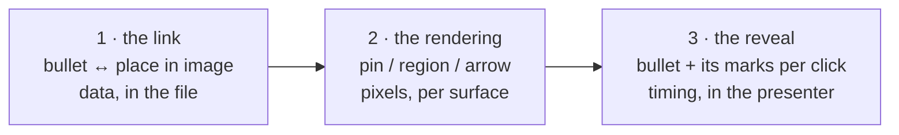
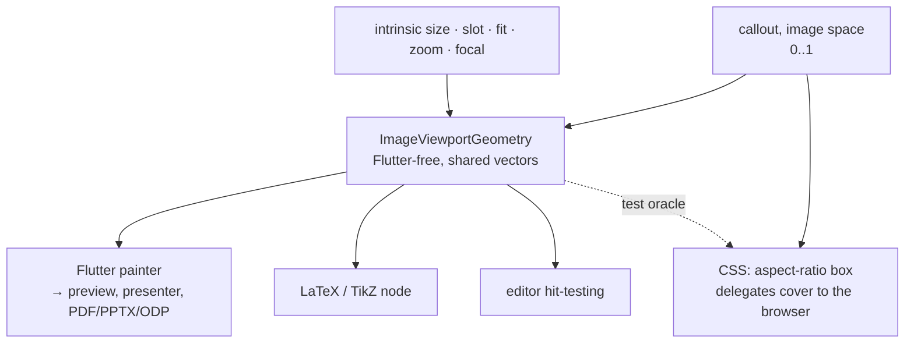

# OciDeck — Image callouts: product design

*Tying a bullet to a part of the picture beside it — as a numbered pin, a
highlighted region or an arrow — and optionally bringing the two up together.*

> **Status:** design frozen, not implemented · **Status last reviewed:** 2026-08-27 · **Published by:** Stichting LibreKAT

> **This is a design doc, not shipping behaviour.** When implementation lands,
> the contributor docs ([`ARCHITECTURE.md`](../ARCHITECTURE.md),
> [`SOURCE_MAP.md`](../SOURCE_MAP.md), [`FILE_FORMAT.md`](../FILE_FORMAT.md),
> [`USER_GUIDE.md`](../USER_GUIDE.md)) and the [`CHANGELOG.md`](../../CHANGELOG.md)
> carry the truth. This document remains the *why* and the *format contract*.

> Origin: issue #1801. Sibling design docs:
> [`GANTT_SLIDETYPE.md`](GANTT_SLIDETYPE.md) (a format contract of the same
> shape), [`COLLABORATION.md`](COLLABORATION.md) (the field chain §5 depends on).

---

## 1. Purpose & scope

An author explaining a machine, a map or a schematic needs to say *this line of
text is about that part of the picture* — and, while presenting, to bring the
text and its mark up together.

`bulletsImage` already puts bullets beside a picture. What is missing is the
link between the two, and any way to draw it.

**In scope.** Callouts on `bulletsImage`. One bullet carries at most one
reference; a reference may have several targets. A target is a point or a
rectangle in the image. The slide picks one presentation over that data — pins,
region highlight, or arrows. Reveal is a separate option.

**Out of scope.** A new slide type, a general connector or diagram editor, manual
bend points, per-target presentation modes, author-chosen colours, line widths or
arrowhead sizes.

**Three separable capabilities.** They are built in this order and each is useful
without the next:



---

## 2. Format contract (format version 2)

Storage is split by role, because the three roles have different survival
requirements. Every claim in this section was measured against the released
reader; the evidence is in [§10](#10-evidence).

### 2.1 In the bullet — the visible reference

```markdown
- controller board with display (A)
- printing head (B)
```

- Exactly one reference per bullet, at the **end**, preceded by a single space.
- `(` + `[A-Z]{1,2}` + `)`. Uppercase only, which is what keeps the reserved
  words `mode` and `reveal` in §2.2 from ever colliding with a reference.
- It is ordinary text. It survives any reader, it is hand-editable, and it is the
  fallback on every surface that cannot draw an overlay: a reader with only a
  text editor still sees which bullet refers to which mark.

### 2.2 In the front matter — the canonical data

```yaml
ocideck_callouts:
  <slide-anchor>:
    mode: pin
    reveal: steps
    A: point 0.402 0.251 | the controller board
    B: region 0.550 0.200 0.180 0.220 | the print head
    C: point 0.610 0.480; point 0.700 0.300 | the two mounting bolts
```

| Element | Rule |
| ------- | ---- |
| Nesting | Exactly two levels: anchor, then entries. No deeper. |
| `mode` | `pin` \| `region` \| `arrow`. Absent = `pin`. |
| `reveal` | `all` \| `steps`. Absent = `all`. |
| Entry key | The reference, `[A-Z]{1,2}`, unique within the slide. |
| Entry value | `<geometry>[; <geometry>…] \| <description>` |
| `<geometry>` | `point <x> <y>` or `region <x> <y> <w> <h>` |
| Numbers | 0..1 in **image space**, three decimals, clamped on read |
| `<description>` | Free text after the first ` \| `; later ` \| ` belong to it |
| Quoting | The value passes through the existing `markdownYamlScalar`, so a description containing `:` is quoted and the block stays valid YAML |

**Why the grammar is this flat.** `yaml` is a dev-dependency only (it serves
`tool/sbom_build.dart`), so `lib/` has no YAML parser and promoting the package
would trip the SBOM gate and a licence review. The grammar is therefore
restricted to what a twenty-line hand-rolled reader can parse — two levels, one
entry per line — while remaining valid YAML for anything else that reads the
front matter.

**Why three decimals.** `privacy_location_rules.dart` treats a number pair as a
coordinate only at **four or more** decimals on both sides, and
`isPlausibleCoordinate(0.62, 0.28)` is true. Four decimals would make every
callout a privacy finding; three cannot. It is also exactly what `_formatFocal`
already does for image focal points, so this follows an existing convention
rather than inventing a rule.

**Why image space, not slot space.** The slot shows a *crop* of the picture
(cover + focal + zoom). A slot-space coordinate slides off its feature the moment
the author re-crops. Image space is the only frame that survives.

**A callout requires a slide anchor.** `ocideck_slide_anchor` already exists and
round-trips; a slide receiving its first callout gets one via `uniqueAnchor`.

### 2.3 Derived output

The overlay markup in the slide body and the per-callout CSS classes in the
generated `themes/<theme>.css` are **derived**: regenerated from §2.2 on every
save, exactly like the existing `split-text` / `split-image` scaffolding. They
are never read back as a source of truth.

### 2.4 Version and unknown data

`ocideck_format: 2` is written on the first save containing a callout, never
before. An unknown `mode`/`reveal` value, an unrecognised entry key or a
malformed geometry is **ignored and preserved byte-for-byte** — never clamped
into a different meaning, never dropped.

Orphans — a reference with no bullet, or an anchor with no slide — are **kept**,
reported by the checker, and removed only by an explicit cleanup action. Silent
deletion is the one behaviour this format must not have.

---

## 3. The model

Callouts live on the **`Slide`**. The codec is the only code that knows they are
stored deck-side, keyed by anchor: *the front matter is a storage location, not a
model shape.*

This is load-bearing, not tidiness. Collaboration models only `SlideField`
(`lib/collab/deck_op.dart` has no `DeckField`), so a deck-level model would need
a new op class, diff path and capability negotiation. Keeping callouts on the
slide means reorder, delete, duplicate, undo, split runs, display windows and
collaboration all ride machinery that exists and is tested.

```dart
sealed class CalloutTarget { }                  // image space, 0..1
class CalloutPoint  extends CalloutTarget { final double x, y; }
class CalloutRegion extends CalloutTarget { final double x, y, w, h; }

class ImageCallout {
  final String reference;                       // 'A'
  final List<CalloutTarget> targets;            // >= 1
  final String description;                     // WCAG text equivalent
}

enum CalloutPresentation { pin, region, arrow }
enum BulletRevealMode { all, steps }
```

Geometry is data; presentation is not part of it. A region drawn as a spotlight
and the same region drawn as an outline are one datum and two renderings.

---

## 4. One geometry contract

A Flutter-free `ImageViewportGeometry` takes intrinsic image size, slot, fit,
zoom and focal point, and returns the painted image rectangle, the mapped target
geometry, and whether a target is clipped away. Flutter, LaTeX and the editor's
hit-testing read it; it ships with shared test vectors.



**The CSS surface delegates rather than reimplements**, which removes one of the
places that could silently drift apart:

```css
.ocideck-imgbox {
  position: absolute; top: 50%; left: 50%; transform: translate(-50%, -50%);
  min-width: 100%; min-height: 100%; aspect-ratio: <intrinsic W> / <intrinsic H>;
}
```

Pins are children of that box, placed in plain image-space percentages; the
browser computes `cover` itself. The only value emitted is the image's
**intrinsic aspect ratio** — a property of the picture, not a cached layout
number.

Placement is allowed only on the currently visible crop. If a later recrop, zoom
or width change would strand a target, saving stops with a recovery choice:
adjust the image, zoom out, move the target, or remove it.

---

## 5. Renderer contract

| Surface | Pins / regions | Arrows |
| ------- | -------------- | ------ |
| Flutter preview, presenter, audience | overlay painted in the same layout-and-paint pass the rasteriser captures | same, on the fixed rail |
| PDF, PPTX, ODP | inherited from that verified raster; reveal is flattened | idem |
| OciDeck HTML export | its **own** callout markup and CSS — `exportBaseCss()` composes `_structuralCss`/`_reportingCss`/`_menuCss` and never loads the bundled theme, so nothing arrives for free | drawn after fonts and images settle |
| LaTeX / Beamer | TikZ node over one image node; `tikz` and `pgfplots` are already in the beamer preamble | degrade to pin/region plus the textual reference |
| Plain Marp, with `--theme-set` | the derived markup of §2.3 plus one generated CSS class per callout. Marp keeps `class` but **strips `style`**, so a position must arrive as a class, never inline | not offered |
| Plain Marp, no flags | text, image and `(A)` only — this invocation already loses the whole split layout today, callouts aside | not offered |
| Text editor, generic Markdown | bullet text with `(A)`, plus a readable YAML block | — |

Arrows come last and use a **fixed connection rail at the right edge of the
bullet row**, not the last glyph: no ragged tails, no wrapped-line ambiguity and
no fragile post-layout measurement. Crossing arrows raise a quality finding
suggesting pins instead. There is no manual route editor.

---

## 6. Author interaction

One `Callouts` section on the `Bullets + image` editor with an `Edit callouts…`
action, opening a stage that shows the real layout and crop.

1. Select a non-empty ordinary bullet; it receives the next free reference.
2. Click once to place the first target.
3. `Add another target` before a further click adds a second target to the same
   reference.
4. Drag to move; regions get keyboard-accessible handles; Delete removes the
   selected target and Undo restores it.
5. Reordering or deleting a bullet carries or removes its callout with it.
   Replacing or removing the image forces an explicit keep / reposition / remove
   choice.
6. Empty bullets, group headings and rich-text mode can neither own nor orphan a
   callout.
7. Duplicating a slide re-anchors it and copies the block under the new anchor.

Every function has a keyboard path and a non-drag path. Each target is focusable
and named by reference and target number.

Styling is theme-derived **plus a non-optional two-tone edge**: the pixels under
a mark are arbitrary, so a theme accent cannot be assumed to contrast with them.
A number reduces reliance on colour but does not say *which part* of a picture is
meant, so a description is what carries the meaning for a screen reader — the
mark is never "accessible by construction".

---

## 7. Reveal

A headless `PresentationStepPlan`, shared by timelines and bullet callouts rather
than copying the timeline-only step state. With `reveal: steps`:

- the slide opens showing title and image;
- each next action reveals one bullet **and all of its targets** atomically;
- back hides the last revealed group before leaving the slide;
- re-entry resets to the defined initial step;
- jumps, remote control and auto-advance follow the same plan;
- static exports show every group.

The serialiser may additionally emit Marp `*` / `1)` fragment markers as a
portable HTML projection, but the durable intent is `reveal:` in §2.2 — a marker
alone is normalised back to `-` by any older save.

---

## 8. Limits

| Thing | Limit |
| ----- | ----- |
| References per slide | 26 (`A`–`Z`) |
| Targets per reference | 8 |
| Description | 200 characters |
| Coordinates | 0..1, three decimals |
| Minimum region | 0.02 in each axis |

Each is tested at the maximum and at maximum-plus-one. Descriptions are ordinary
scannable content for OciWacht; geometry is not scanned. A redacted slide
(`contentRedacted` / `mediaRedacted`) draws no overlay at all. A callout without a
description is a quality finding of the same class as an image without alt text —
reported, not blocked.

---

## 9. Order of work

1. **Collaboration parity** — the missing `imageZoom` in `SlideField` and the
   diff, plus a registry parity gate. Separate issue; lands first.
2. Format v2: the grammar of §2, codec, checker rules, version bump, docs.
3. The typed model of §3 and the full collaboration chain.
4. `ImageViewportGeometry` and its shared vectors.
5. Pins end to end: editor, Flutter, HTML, LaTeX, raster exports.
6. Region highlight over the same model.
7. Generalised stepping and optional bullet reveal.
8. Arrows, on the fixed rail, with an explicit LaTeX fallback.

Each slice is independently green and must not expose an unfinished public
format.

**Acceptance gates.** Cross-version round trip against the released **v0.4.9**
build; real Marp CLI DOM *and* screenshot for **both** invocations, with and
without `--theme-set`, because they differ; source-image → slot geometry for
landscape, portrait and square at crop, focal and zoom boundaries; same-frame
raster capture including consecutive slides with targets in opposite corners;
headless HTML bounding boxes and a real TeX compile with raster comparison;
reorder, delete, duplicate, split runs, display windows, image replace/remove,
multiple targets, rich text, keyboard and Undo; two-client collaboration,
reconnect and incompatible-client blocking; privacy scan and redaction of
descriptions with no coordinate false positive at three decimals; every limit of
§8 at maximum and maximum-plus-one; visual checks at full slide size and
slide-rail width on light, dark, busy and greyscale images; mutation tests on
directive preservation, coordinate arity, crop maths, reveal boundaries and
collaboration field registration.

---

## 10. Evidence

The carrier in §2 was chosen by measurement, not by preference. `git diff` over
`markdown_parse/`, `markdown_service_parse.dart`, `markdown_service_serialize.dart`
and `front_matter_merge.dart` between `v0.4.9` and the design commit is **empty**,
so measurements against the development line are measurements of the released
reader.

**Carriers that do not survive.** A new `ocideck_*` comment directive in a slide
block is dropped on save inside `split-text`, at the top of the block and at the
top of a plain bullets slide, and is converted into a presenter note at the
bottom of one. There is no position in a slide block where it survives intact.

**Carriers that do.** The visible `(A)` reference round-trips in every position
and renders as plain text — not a link — including after a real Markdown link,
after a stray `]`, and inside emphasis. The nested front-matter block returns
byte-for-byte, in place, under all six cases tested: unchanged save; an unrelated
slide edited; an owned key changed; the block first; the block last; and with
hand-written `#` comments and blank lines around it. No owned key is ever
appended inside the indented block. This is rule 1 of the format contract
([`FILE_FORMAT.md`](../FILE_FORMAT.md) §3.0) holding in practice.

**Geometry.** Rendered through a real Marp CLI against a calibration image: a pin
positioned in slot percentages misses its target by roughly 6% of slide width,
because `object-fit: cover` crops the picture; the same pin inside the
`aspect-ratio` box of §4 lands dead centre. The measured visible band matched the
predicted cover crop.

**Plain Marp.** `theme: ocideck` does **not** load a neighbouring
`themes/ocideck.css`; the output carries `@theme default` and no split CSS.
`--theme-set` is required, and then the layout and the generated callout classes
both work. Raw `div`/`span` and `class` survive; inline `style` is stripped, with
or without `--html`.

---

## 11. The trade-off, named

Interchangeability and a rich feature collide here, and pretending otherwise
would be the real mistake. Written down so the decision stays findable.

**The decisive test — if OciDeck stopped existing tomorrow, could the author
carry on?** Yes. The bullet says `controller board with display (A)`, and the
front matter says `A: point 0.402 0.251 | the controller board`. A person with a
text editor knows which line refers to which place and what is there, in prose.
Nothing is opaque, nothing is base64, nothing needs OciDeck to be decoded. The
overlay can be rebuilt in any tool from what the file already says.

**Interchangeability wins over the feature, and the way it wins is the split in
§2.** The arrow exists only inside OciDeck. It is allowed to, because it is a
*rendering* over data that is itself fully portable: someone who leaves keeps the
meaning and loses only the drawing.

**What would change this decision.** If the arrow ever needed geometry of its own
in the file — bend points, custom routing, a hand-placed tail — the stored data
would stop being portable meaning and become OciDeck-specific instructions. At
that point the answer flips and the feature does not get built. That is why §1
puts bend points and manual routing out of scope, and why §5 uses a computed rail
instead of an author-placed tail.

**The visible `(A)` is deliberate.** It is the one thing this design adds to the
prose a foreign reader sees. It is accepted because it is meaningful to a human —
a callout letter, exactly as a technical manual prints one — rather than machine
noise. A hidden carrier would have read more cleanly and would have failed the
test above.

**What honestly degrades.** Without `--theme-set`, a foreign Marp render shows no
overlay. It also already shows no split layout at all, image overflowing the
slide — that is true today, before callouts exist, and is worth recording in
[`KNOWN_LIMITATIONS.md`](../KNOWN_LIMITATIONS.md) on its own account. The derived
markup of §2.3 neither improves nor worsens that case; it pays off only in the
`--theme-set` invocation, where it is verified to work.
