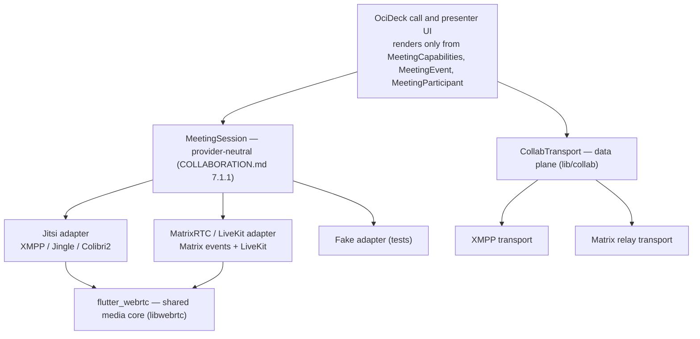

# OciDeck — Native Calls: one interface, Jitsi + Matrix backends (Design)

> **Status:** design proposal — partially built (F1–F3.4a landed; F3.4b next) · **Status last reviewed:** 2026-08-08 · **Published by:** Stichting LibreKAT

> **A design proposal — not yet implemented.**
> This document describes a *future* capability. It is kept separate from the
> current-state contributor docs ([`ARCHITECTURE.md`](../ARCHITECTURE.md),
> [`SOURCE_MAP.md`](../SOURCE_MAP.md)) so those keep describing what exists. When
> (parts of) this lands, fold the relevant sections into those docs and the
> [`USER_GUIDE.md`](../USER_GUIDE.md), and update the [`CHANGELOG.md`](../../CHANGELOG.md).
>
> It is written to be **picked up cold**: exact file paths, integration points,
> data shapes, invariants and open questions are spelled out.
>
> **Siblings.** [`COLLABORATION.md`](COLLABORATION.md) defines the transport-agnostic
> collaboration layer and the `MeetingProvider` seam (§7.1) that this document makes
> native. [`TEAMS_GUEST_CLIENT.md`](TEAMS_GUEST_CLIENT.md) fixes the one-shell
> invariant (T13/T14) every adapter obeys. [`SELF_ENCRYPTED_RELAY.md`](SELF_ENCRYPTED_RELAY.md)
> is the pure-Dart data-plane relay. This document is the **native media plane** and
> the **backend-neutral call interface** that unifies Jitsi and Matrix.
>
> **Gated.** This design does not authorise adding a dependency. Two chain reviews set
> the build-conditions and precede any code: the media-plane
> [`ketenkeuring-flutter-webrtc.md`](../../assurance/ketenkeuring-flutter-webrtc.md) and
> the spine [`ketenkeuring-xmpp-spine.md`](../../assurance/ketenkeuring-xmpp-spine.md).
> The **spine decision (§5) is taken** (2026-08-02): the single XMPP spine, with
> **backend exclusivity** (§1). The maintainer also gave **GO to build** (2026-08-02),
> with the sub-choices in §10: `lib/xmpp/` from scratch, and media E2EE uniform across
> platforms until the upstream fix. The dependencies landed only after the
> build-conditions. **F1–F3.4a have since landed** — the provider-neutral interface, the
> from-scratch XMPP core, MUC + companion pairing, and the `flutter_webrtc` media-core
> seam; the next slice is **F3.4b**, the real Jitsi media join. A dated status (what is
> built, what remains) is in **§7.1**.

---

## 1. Purpose & scope

OciDeck should let a user **join a video conference and present into it from
OciDeck's own interface** — not an embedded third-party UI — and, symmetrically,
**host** a conference/webinar of its own. Two families are in scope:

1. **Joining** an existing invitation (someone sends a Jitsi link — `meet.jit.si`
   or a self-hosted deployment).
2. **Hosting** an OciDeck-originated room on infrastructure the user brings (an org
   Jitsi, or a Matrix ecosystem via MatrixRTC/LiveKit).

Both are equally in scope. The through-line: **OciDeck is a client, never a server**
(COLLABORATION.md P1). It runs no SFU and no signalling server; it points at
deployments the user already has or freely creates, exactly as the WebDAV source
lets a user point at their own storage.

The deliberate choice made here is the **deep native** route: OciDeck speaks the
conference's signalling itself and renders raw media tracks in its own
presentation-centric layout. It does **not** embed the vendor's web client. Jitsi is
open source (Apache-2.0), so its client↔server conversation can be reimplemented in
Dart; that is what "native" means below.

---

## 2. Relationship to COLLABORATION.md

COLLABORATION.md §7 already reasoned about calls and §7.1 defines the
`MeetingProvider`/`MeetingSession` contract, with Jitsi listed as *"First proof of
concept"* and the note *"Official IFrame API for the first slice; evaluate
`lib-jitsi-meet` only for a fully native OciDeck layout."* This document **commits to
the fully-native layout** and specifies it. It does not replace §7.1's contract — it
implements it — and it adds two things §7 left open:

- a concrete **backend-neutral call interface** so Jitsi and Matrix calls are the
  same experience (§3); and
- the observation that a single **XMPP** spine can carry both the calls *and* the
  collaboration data plane (§5), which bears on the transport choice §6 of
  COLLABORATION.md decided (the self-encrypted Matrix relay).

The §7.1.6 hardening rules (self-hosted provider profiles, no probing, no blanket
claim, fragment stripping, vendor-SDK isolation, dual-session consent, meeting-media
≠ AI) apply unchanged and are treated as constraints in §8.

---

## 3. The unified interface (the heart of this design)

OciDeck gets **no** Jitsi screen and **no** Matrix screen. There is **one** call and
presenter interface that renders solely from provider-neutral abstractions. The
backend sits underneath and is invisible to the UI; switching backend changes no
pixel.

Two observations make this natural rather than forced:

1. **Both are WebRTC + SFU.** Jitsi (the videobridge, JVB) and MatrixRTC / Element
   Call (LiveKit) differ **only in signalling** — Jitsi: XMPP / Jingle / Colibri2;
   MatrixRTC: Matrix room events + LiveKit. The *media* (audio/video tracks over
   `flutter_webrtc`) is identical. **The media core is shared; only the signalling
   adapter differs.**
2. **The contract already exists.** COLLABORATION.md §7.1.1 specifies
   `MeetingProvider` / `MeetingSession` / `MeetingCapabilities` for exactly this
   ("one shell for every adapter", invariants T13/T14). An adapter supplies *facts*
   (capabilities, role, tracks, events), never its own screen.

**Two parallel provider-neutral seams** — the UI is agnostic on *both*:

| Plane | Seam | Implementations |
|---|---|---|
| **Data** — ops, locks, chat, presenter-sync (next/prev, pointer) | `CollabTransport` (exists, `lib/collab/collab_transport.dart`) | loopback + WebDAV-async (built); **XMPP** + Matrix-relay (planned) |
| **Media** — audio/video/screen/roster | `MeetingSession` (§7.1.1, new) | **Jitsi** (XMPP/Jingle/Colibri2), **MatrixRTC/LiveKit**, fake (tests) |



**Provider-neutral media model** (new, above `flutter_webrtc`). Both the Jitsi and
Matrix adapters fill exactly this; the UI renders tiles from the participant list and
controls from `MeetingCapabilities`:

```dart
class MeetingParticipant {
  final String id;
  final String displayName;
  final MeetingRole role;         // guest/attendee/presenter/moderator/... (§7.1.1)
  final MediaStreamTrack? audio;  // flutter_webrtc — same type for Jitsi and Matrix
  final MediaStreamTrack? video;
  final bool micMuted, camOff, isDominantSpeaker, isScreenShare;
}
```

The UI composes both seams: the **slide** (from the deck), the **participant tiles**
(from `MeetingSession`), driven by **presenter-sync** (from `CollabTransport`). One
coherent interface, backend-agnostic on both planes.

**Why this also settles the join-and-host choice.** Hosting is a backend choice *per
room*, not per UI. An OciDeck webinar runs on a Jitsi deployment the user controls
**or** on MatrixRTC (which reuses the self-encrypted-relay account). Joining someone
else's Jitsi uses the same interface. The user sees the same thing every time.

**One session, one backend family (invariant).** "Backend choice per room" is
*exclusive*: a session runs **entirely** on one family — **either** XMPP/Jitsi (calls
*and* data plane over one XMPP connection, §5) **or** Matrix (self-encrypted relay +
MatrixRTC). The two never intermingle: never Jitsi media with a Matrix data plane,
never XMPP data with MatrixRTC media. Hosting "via the Matrix backend" (F5) is a
wholly-Matrix session, separate from an XMPP/Jitsi session. The UI is identical across
both; the plumbing under any one session is single-family. This keeps the trust model
legible — you always know which single server sees a given session's ciphertext and
metadata, because per session there is exactly one.

---

## 4. What "reimplementing the protocol" means technically

Jitsi is not a single wire protocol you copy; it is a layered stack. The split is
what decides feasibility:

| Layer | What it does | Rebuildable in Dart? |
|---|---|---|
| **Media** — WebRTC (ICE/DTLS/SRTP; VP8/VP9/AV1/Opus), routed by the SFU | the audio/video bytes | **No, not in pure Dart.** libwebrtc is a very large C++ codebase. Route = `flutter_webrtc` (native libwebrtc, MIT) — **shared** by Jitsi and Matrix. |
| **Signalling (Jitsi)** — XMPP→Prosody, MUC (XEP-0045), Jingle (XEP-0166/0167/0176) from Jicofo, Colibri2 to the JVB | who is present, which tracks, SDP/ICE, muted-state, dominant speaker, lastN | **Yes** — this is what `lib-jitsi-meet` (JS) does; stanza plumbing, not cryptography. **This is the real work.** |
| **Signalling (Matrix)** — Matrix room events + LiveKit token/signalling | the same, via Matrix + LiveKit | **Yes** — REST / room events; ties into the relay route. |

A community effort is already rewriting `lib-jitsi-meet`'s XMPP module to Dart
(unfinished) — confirmation of both the decomposition and that it is non-trivial. The
official `jitsi-meet-flutter-sdk` is mobile-only, embeds Jitsi's *own* UI and has no
desktop target — unsuitable (OciDeck: own interface, macOS-primary). Jitsi itself is
**Apache-2.0**, so there is no AGPL obstacle of the kind the Matrix SDK raised (#976).

---

## 5. XMPP as the single spine (data + media) — decided

`lib/xmpp/` is **not** a Jitsi detail; it is standalone infrastructure. XMPP is open,
federated and bring-your-own-server — a match for **P1**. And because **Jitsi already
runs on XMPP (Prosody)**, one XMPP server can carry the call signalling *and* the
whole collaboration data plane of COLLABORATION.md §5–6. One connection, two
consumers:

- **Media plane** — the Jitsi adapter consumes the connection for
  Jingle/MUC/Colibri2 signalling (`MeetingSession`).
- **Data plane** — `XmppTransport implements CollabTransport` carries deck-ops, locks,
  chat, presence and presenter-sync — a **fourth transport** beside loopback,
  WebDAV-async and the Matrix relay. The authority/version logic in
  `collab_session.dart` is already transport-agnostic and is not rewritten.

Mapping onto the data-plane primitives:

| Data plane | Matrix (§6.1) | XMPP equivalent | Fit |
|---|---|---|---|
| Session = room | Matrix room | MUC (XEP-0045) | equal |
| Ops (ordered) | timeline event | MUC message / PubSub (XEP-0060) + MAM catch-up (XEP-0313) | slightly more self-assembly |
| Snapshot (large) | chunked/attachment | chunked / HTTP File Upload (XEP-0363) | equal |
| Locks / authority | room **state** | PubSub item per slide (last-wins) | Matrix more natural |
| Roles owner/editor/viewer | power levels | MUC affiliations/roles | **XMPP more natural** |
| Chat | `m.room.message` | XMPP message | XMPP is built for this |
| Presence / who-views-what | presence | XMPP presence + custom extensions (as Jitsi's muted/nick) | **XMPP more natural** |
| E2EE by default (P4) | Olm/Megolm (AGPL) → own minimal scheme | OMEMO = Double-Ratchet = **the red line** → the same own scheme | **equal** |

So **the Jitsi route with an XMPP server reaches substantially what the separate
Matrix relay does — on one spine instead of two.** Honest caveats (the real work, not
dealbreakers):

- **E2EE is no better.** OMEMO is also Double-Ratchet (libsignal) — exactly the red
  line from the relay chain review ("no own ratchet"). You therefore reuse the same
  minimal X25519→AES-GCM scheme over a private event type; E2EE is neither gained nor
  lost versus the relay.
- **Ordering/catch-up is more DIY** than Matrix's `/sync` (via MAM/PubSub), but the
  pure-Dart relay route requires that plumbing too (relay chain review, finding 4).
  Lateral, not worse.
- **Public Jitsi ≠ your XMPP server.** `meet.jit.si` / `8x8.vc` lock their Prosody
  down (anonymous auth, focus-only). "One server for both" holds fully for an
  **own/cooperating** deployment; against public Jitsi the data plane is a *separate*
  XMPP account. The client code (`lib/xmpp/`) is shared regardless.
- **An XMPP account is needed** (bring-your-own, P1 holds), creatable in-app via
  in-band registration (XEP-0077), the way COLLABORATION.md §8 describes for Matrix.

**When which spine.** *Co-authoring without calls* → the Matrix relay (`http` +
`cryptography`, no XMPP client) is lighter, and it is already **GO**
([`ketenkeuring-self-encrypted-relay.md`](../../assurance/ketenkeuring-self-encrypted-relay.md)).
*Also Jitsi calls* → XMPP is the spine you already have; a second Matrix stack beside
it is the detour. For "join and host equally", this favours **XMPP as the single
spine**.

**Decided (2026-08-02).** The maintainer chose the **single XMPP spine** as the primary
route; the chain review is
[`ketenkeuring-xmpp-spine.md`](../../assurance/ketenkeuring-xmpp-spine.md) (principled
GO, build-conditions pending). Consequences, all consistent with the §1 backend-
exclusivity invariant:

- **The relay is not overruled.** The self-encrypted relay stays the spine for the
  *Matrix mode*; XMPP becomes the primary spine for the *Jitsi mode*. They coexist as
  separate, non-mixing modes; which is built first is §7 phasing.
- **The crypto is shared, not new.** E2EE over XMPP is the *same* minimal
  X25519→AES-GCM scheme as the relay (`SELF_ENCRYPTED_RELAY.md`), carried on an XMPP
  event type instead of a Matrix event — no own ratchet, so **not OMEMO**. One
  `CollabCrypto`, two transports.
- **The interface of §3 is unaffected.** The spine choice changes which
  `CollabTransport` carries the data plane, not the call UI.

### 5.1 Companion channel — OciDeck's control plane rides a *separate* room (decided 2026-08-02)

OciDeck's data plane (presenter-sync, ops, chat, presence) does **not** go into
the Jitsi conference's own MUC. It rides a **separate companion MUC** on the same
XMPP server, paired with the conference. This keeps OciDeck's traffic out of the
call the rest of the participants are in:

- **Non-OciDeck participants are undisturbed.** They are in the Jitsi conference
  room only and never see OciDeck's `nl.ocideck.*` events, presence extensions or
  ops. A plain Jitsi/browser user in the same call notices nothing — no stray
  presence, no unknown messages.
- **OciDeck participants discover each other.** Presence in the companion room is
  exactly "who in this call also runs OciDeck." Presenter-sync, follow-mode and
  co-authoring run among *those* participants; everyone else just sees the shared
  screen/video like any Jitsi call.
- **The two streams stay apart.** Media and roster are the Jitsi conference
  (`MeetingSession`, §3); the OciDeck control plane is the companion room
  (`CollabTransport` over XMPP, §5). Same server, same connection, **two MUCs** —
  the two-seams model (§1) expressed as two rooms rather than one shared room.
- **Backend exclusivity holds (§8).** Both rooms are XMPP/Jitsi-mode; nothing
  crosses into a Matrix room. In Matrix mode the analogue is a separate Matrix
  room for the control plane alongside the MatrixRTC call — the same shape.

**Pairing — built (`lib/xmpp/companion_room.dart`, F3).** The companion room must
be findable without a central registry (P1). The default is a **deterministic
derivation from the already-shared conference URL**: `companionRoomLocalpart`
normalizes the URL (lowercase host, drop the ephemeral `#config`/query, strip
trailing slashes) and takes a **one-way SHA-256 hash behind a versioned salt** into
`ocideck-<hash>`, so two OciDeck clients that hold the same Jitsi link compute the
same companion room and meet there. Because it is a one-way hash, the room name
does not leak the conference identity to anyone who doesn't already hold the link;
the versioned salt lets the scheme rev without old and new clients silently
diverging. A later refinement can let the presenter announce/verify the companion
room explicitly. The companion room is joined over the same guarded session, so it
inherits the same `MeetingProviderProfile`/NetGuard posture as the signalling
origin (§8).

**Naming — the `.ocideck` side-channel (conceptual name; wire name stays opaque).**
Every Jitsi conference `<naam>` has exactly one paired steering channel, which we
call `<naam>.ocideck` in prose — "the `.ocideck` side-channel of `<naam>`", the
dedicated home for OciDeck's control traffic (ops, locks, presence, presenter-sync)
so it never crowds the conference or its chat. That readable name is a *label*, not
the wire identity: the actual MUC localpart stays the opaque `ocideck-<hash>` derived
above, **kept deliberately non-transparent (decided 2026-08-08)** so the room name
reveals neither the conference nor that it uses OciDeck. A transparent `<naam>.ocideck`
localpart was weighed and rejected — it would leak the conference↔OciDeck link to
anyone who can enumerate the server's rooms, whereas the one-way hash is a client-side
guarantee that needs no Prosody configuration. So: `<naam>.ocideck` is how we *talk*
about the channel; `ocideck-<hash>` is how clients *find* it.

### 5.2 Chat: end-to-end encryption is orthogonal to the room (both modes explicitly supported)

OciDeck's chat is sealed and signed at the app layer (`collab_crypto`; see
`matrix_chat.dart` for the Matrix-mode precedent): each message is encrypted to the
session's epoch key and signed, and the transport — Matrix today, XMPP next — carries
only ciphertext. E2E therefore travels with the *message*, not the *room*: chat is
end-to-end encrypted wherever it rides, companion room or conference room alike.

That turns the real question from "encrypted or not" into **who may read it**:

- **E2E** means only holders of the epoch key — the OciDeck session members — can read
  a message. That holds in any room.
- **Letting a plain Jitsi/browser participant read the chat** requires the message to
  be plaintext `<body>` groupchat in the conference MUC, because a vanilla client
  speaks nothing else. Hand that participant the epoch key and they are no longer an
  outsider but an OciDeck client.

These are mutually exclusive by definition: "E2E *and* readable by a vanilla browser
client" is a contradiction, not a missing feature.

**Both modes are explicitly supported — only the default is deferred.** The current
model is E2E, OciDeck-only chat in the companion room (sealed `nl.ocideck.chat`).
Interop chat with non-OciDeck participants is equally provided for: that thread is
deliberately plaintext in the conference MUC — an interop choice, not a technical
limit — and the two can coexist (an E2E OciDeck thread beside the plain Jitsi chat).
Only *which* one ships as the default is decided when the XMPP `CollabTransport` chat
path is built.

---

## 6. Design principles (inherited)

All COLLABORATION.md §2 invariants (P1 client-only, P2 room=transport/file=truth, P3
owner-authoritative, P4 E2EE-by-default *for OciDeck collaboration content*, P5 sync
the model, P6 transport-agnostic, P7 two modalities one session) apply. Three points
specific to external calls, from §7.1:

- A `MeetingProvider` joins a *separately operated* system that controls identity,
  admission, signalling, media and recording. OciDeck **must not inherit an E2EE
  claim** from the collaboration session for that media; it describes the provider's
  boundaries truthfully (`MeetingPreflight`, including an explicit `unknown` E2EE
  value).
- The external meeting session and the OciDeck collaboration room are **separate
  trust domains**; no membership crosses automatically (§8).
- The call UI renders controls **only** from live `MeetingCapabilities`; it never
  imitates a control the adapter cannot perform, and it removes lost controls
  immediately when role/capability changes arrive.
- **Backend exclusivity (§1).** A session runs on exactly one backend family; no code
  path pairs a `MeetingSession` of one family with a `CollabTransport` of another.
  XMPP/Jitsi mode and Matrix mode never intermingle within a session.

---

## 7. Phased delivery (native-first, interface-first)

Even the direct-native route builds the shared interface first (as `CollabTransport`
was built loopback-first), so Jitsi and Matrix share it. This is **not** an IFrame
proof-of-concept — the end state is the native client; no vendor UI ever appears.

| Phase | Content | Verified by |
|---|---|---|
| **F0 — Gate & design** | This document; the `flutter_webrtc` chain review (GO/NO-GO). **Maintainer knot** — a network dependency may not enter without the gate (§8). | the chain-review document; `make licenses` / `make sbom` dry-run |
| **F1 — Unified interface + media core + fake** | `MeetingProvider`/`MeetingSession`/`MeetingParticipant`, `MeetingLinkResolver`, typed events, `meeting_media_core.dart` (flutter_webrtc wrapper) + a **fake adapter**, no external SDK. Call UI already renders from capabilities/tracks. | resolver/contract unit tests; fake tiles in the UI |
| **F2 — XMPP core** | `lib/xmpp/`: connect, SASL (anon + token), MUC join, presence, chat. **Immediately usable standalone** as a channel (§5). | stanza parsers against vectors; integration test against a local `docker-jitsi-meet` |
| **F3 — Jitsi media** | Jingle + ICE + Colibri2 on `lib/xmpp/`; `MeetingSession` for Jitsi; receive remote tracks into OciDeck tiles; camera/mic uplink; **screen share**. Covers **joining**. | Docker room with a second client; functional test |
| **F4 — Presenting** | The **slide into the call** as an own video track via `SlideRasterizer` **through the projection boundary** (`AudienceDeck`, §8). Presenter layout (slide large + tiles); presenter-sync over the data plane (§5). Covers **presenting**. | image review of the layout; projection-boundary test |
| **F5 — Hosting + Matrix mode + E2EE** | Host an **XMPP/Jitsi-mode** session on a Jitsi deployment you control (`MeetingProviderProfile`, bring-your-own-URL), *or* a **wholly-Matrix-mode** session (self-encrypted relay + **MatrixRTC/LiveKit adapter** behind the same `MeetingSession`). Per §1 the two never mix; the UI is identical. Optional media E2EE (SFrame / frame cryptor) — **macOS caveat** (§10). Covers **hosting** in either mode. | host test; security review |

Native Jitsi covers both joining and hosting: hosting = point at a Jitsi deployment
you control. LiveKit/MatrixRTC remains the cleaner backend for a *pure* own SFU
(COLLABORATION.md §7 says so) and arrives in F5 behind the same contract.

### 7.1 Build status — landed vs. remaining (2026-08-08)

The table above is the plan; this is where it actually stands. **F1–F3.4a have
landed on `main`; the media join and everything after it are unbuilt.** The
`lib/xmpp/` core and the provider-neutral `lib/meetings/` interface exist and are
tested — but no real call has been joined yet, and the companion channel carries
nothing yet.

**Landed (on `main`, behind the default-off Videovergaderingen module):**

- **F1 — provider-neutral interface + fake + module** (#1104). `lib/meetings/`:
  `meeting_provider.dart` (`MeetingProvider`/`MeetingSession`/`MeetingPreflight` +
  enums), `meeting_participant.dart`, `meeting_event.dart`; `FakeMeetingProvider`
  in `test/`; `ModuleId.videoCalls` (default off), `CallPanel`.
- **F2 — XMPP core** (#1125). `xmpp_stanza.dart` (XXE-safe, DTDs refused),
  `xmpp_sasl.dart` (SCRAM-SHA-1/256 proven against RFC 5802, ANONYMOUS, PLAIN
  wss-gated), `xmpp_frame_transport*` (NetGuard-pinned, fail-closed).
- **F3.1 — persistent session + resource bind** (#1128). `xmpp_session.dart`
  (RFC 6120 §7). It **supersedes and removes** the F2 `xmpp_connection.dart` — one
  primitive, no duplicated auth.
- **F3.2 — MUC** (#1132). `xmpp_muc.dart` (XEP-0045: presence-driven join + a live
  occupant roster). Presence/roster only — no media, no OciDeck payload yet.
- **F3.3 — companion pairing** (#1135). `companion_room.dart` — deterministic
  one-way hash of the conference URL (§5.1), no central registry.
- **F3.4a — media-core seam** (#1138). `flutter_webrtc` (`^1.5.2`) cleared its chain
  review and is in `pubspec`; `meeting_media_core.dart` (the E2EE-fact seam) +
  `meeting_media_core_webrtc.dart` (the thin libwebrtc binding — `selfTest()`
  provably touches no network) + `MediaPreflightTile`. **Opens no real media** — it is
  the foundation under the join.
- Plus later XMPP hardening (#1316–1320, #1366–1370): bounded stanza sizes/counts and
  resource-exhaustion limits.

*(Heads-up for a cold reader: §9's "New files (proposed)" list predates this and is
partly stale — e.g. `xmpp_connection.dart` was built and then removed in F3.1. The
files listed here are the truth on disk.)*

**Remaining, as concrete buildable slices:**

1. **F3.4b — the real Jitsi media join** (the headline gap; nothing here exists yet —
   there is no `lib/meetings/providers/`). Build the Jitsi `MeetingSession` adapter
   (`lib/meetings/providers/jitsi/jitsi_signaling.dart` — Jingle + source signalling +
   Colibri2; `jitsi_presence.dart`) driving `meeting_media_core_webrtc`; receive remote
   tracks into OciDeck tiles; camera/mic uplink; **screen share**. Carry-over musts from
   the F3.4a reviews: **pin the `flutter_webrtc` log level** once the stack is driven for
   real; **derive unique nicks** (the test dialog's fixed `'ocideck'` nick makes two
   anonymous clients collide with a 409); **disco the MUC component (XEP-0030)** instead
   of hardcoding `conference.<domain>`. Testbed: `docker-jitsi-meet` + two clients.
   Covers **joining**.
2. **Companion data plane over XMPP — `XmppTransport implements CollabTransport`**
   (net-new; `CollabTransport` today has only loopback / WebDAV / Matrix-relay). Wire
   `xmpp_muc` + `companion_room` to actually carry ops/locks/presence/chat, so the
   collaboration data plane runs on the XMPP spine — the "immediately usable standalone
   channel" F2 promised but which is not yet connected to `CollabTransport`. This is also
   the swap-in that lets `MatrixRelayTransport` be parked: the two are interchangeable
   behind the seam. The chat-mode default (§5.2) is decided here.
3. **F4 — presenting.** The slide as an own video track via `SlideRasterizer`
   **through the projection boundary** (`AudienceDeck`; `tool/check_audience_boundary.dart`
   breaks the build until it does — §8). Presenter layout (slide large + tiles);
   presenter-sync over the data plane (slice 2).
4. **F5 — hosting + Matrix mode + media E2EE.** Host an XMPP/Jitsi-mode session on a
   Jitsi deployment you control (`meeting_provider_profile.dart`, bring-your-own-URL),
   *or* a wholly-Matrix-mode session (`lib/meetings/providers/matrixrtc/…` behind the
   same `MeetingSession`). **Media E2EE stays off until `flutter-webrtc#2135` is merged,
   released and verified on Apple hardware** (§10.2; a daily watcher signals the merge).
   Covers **hosting**.

**Gates that bite when these land (from §8), not after:** the projection boundary
(`check_audience_boundary`), NetGuard on the signalling origin + the documented
media-egress hole, the honest `ARCHITECTURE.md` update (a second network stack exists),
the two consent domains, and the usual ratchets + doc duty per shipped phase. Settled
since §5 was written: companion naming is the opaque hash (§5.1); the chat
interop-vs-E2E default is deferred to slice 2 (§5.2).

---

## 8. Hard constraints (existing gates that break the build)

- **Optional module, default off.** A **6th `ModuleEntry`** in
  `lib/state/module_registry.dart` (beside `infoSafety`, `ai`, `onlineStorage`,
  `imports`, `procesverbetering`), on the Uitbreidingen tab. *"Off means no shell
  action and no adapter code reached"* (COLLABORATION.md §7.1.1). Own prefs key,
  default `false`; follow the `info_safety_provider.dart` pattern.
- **Privacy projection boundary (the sharpest).** "The slide into the call" is by
  definition a **new `audience` output channel**. `tool/check_audience_boundary.dart`
  **breaks the build** until that channel takes an `AudienceDeck`
  (`PrivacyProjection.forAudience(...)`, `lib/services/privacy/privacy_projection.dart`),
  never a raw `Deck`. The slide therefore passes OciWacht redaction before it enters
  a track/screen-share. The audience window must not leak presenter notes or
  diagnostics (COLLABORATION.md §7.1.4).
- **Chain review + SBOM + promise.** `flutter_webrtc` must clear the GO/NO-GO gate
  ([`ketenkeuring-flutter-webrtc.md`](../../assurance/ketenkeuring-flutter-webrtc.md));
  it lands in `pubspec.lock` (no Cargo blind spot). The public promise in
  [`ARCHITECTURE.md`](../ARCHITECTURE.md) — *"the only HTTP client dependency is
  `http`"* and *"never phones home"* — must be **updated honestly**: a second network
  stack exists, behind a default-off module.
- **NetGuard boundary, explicit.** The signalling origin (Prosody/Matrix) goes
  through the same `NetGuard` / redirect-refusal / DNS-rebind posture as WebDAV, via
  `MeetingProviderProfile`. The **media (ICE/TURN/STUN, UDP) bypasses NetGuard** — an
  acknowledged, fundamental hole; document it in `SECURITY.md`/`assurance/` and bound
  egress to configured/approved TURN origins. Fragment strip: Jitsi honours
  `#config.…` overrides → `MeetingLinkResolver` removes the fragment (muted/camera-off
  come from OciDeck, not the sender — COLLABORATION.md §7.1.6).
- **Native means no vendor iframe.** A benefit of the native route: the vendor-SDK
  isolation of §7.1.6 (sandboxed iframe / postMessage bridge) largely falls away — no
  vendor JS runs in the page. On the **web build** a CSP `connect-src`/`media-src`
  delta for the signalling origin still applies (`tool/check_web_hardening.dart`).
- **Two consent domains.** Meeting media (audio/video/screen/roster) **never** enters
  AI Assist merely because AI is enabled; a meeting session **never** grants automatic
  access to a collaboration room (COLLABORATION.md §7.1.6). The meeting session is
  root-scoped (`lib/state/meeting_session_provider.dart`), deliberately outside the
  per-tab collab scope.
- **The usual ratchets.** l10n for every `l10n.d('…')` (all 30 non-NL languages, `make add-l10n`);
  files ≤ 1000 lines (`part`/`part-of`); methods ≤ 150; no `catch(_)`/`print`; atomic
  writes; every new `lib/` file referenced by a test (coverage gate); documentation
  duty (USER_GUIDE/SOURCE_MAP/FILE_FORMAT/CHANGELOG) per shipped phase.

---

## 9. Implementation reference (paths & integration points)

**Read/extend (existing):**

| Concern | Path | Anchor |
|---|---|---|
| Meeting contract (source) | `docs/design/COLLABORATION.md` | §7.1, §7.1.6 |
| Shell invariant | `docs/design/TEAMS_GUEST_CLIENT.md` | T13/T14 |
| Module register | `lib/state/module_registry.dart` | pattern `info_safety_provider.dart` |
| Projection boundary | `lib/services/privacy/privacy_projection.dart` · `tool/check_audience_boundary.dart` | `forAudience`, `SurfaceKind` |
| Slide → image | `lib/services/slide_rasterizer.dart` | `SlideRasterizer` (1280×720) |
| Presenter / dual-screen | `lib/widgets/presentation/fullscreen_presenter.dart` · `audience_window.dart` | sync model |
| Transport seam | `lib/collab/collab_transport.dart` · `collab_session.dart` | `CollabTransport` |
| BYO-server precedent | `lib/models/webdav_settings.dart` | `WebdavServer`, `trustedInternal`, `NetGuard` |
| Secret storage | `lib/services/secret_store.dart` | keychain (XMPP/Matrix token) |

**New files (proposed):**

```
lib/xmpp/xmpp_connection.dart       RFC 6120/6121: TCP/TLS or WebSocket, SASL
lib/xmpp/xmpp_muc.dart              XEP-0045 MUC, presence, roster
lib/xmpp/xmpp_stanza.dart           stanza (de)serialisation (IQ/message/presence)
lib/meetings/meeting_provider.dart  MeetingProvider / MeetingSession / MeetingPreflight
lib/meetings/meeting_participant.dart  the provider-neutral media model (§3)
lib/meetings/meeting_link_resolver.dart  local allowlisted URL recognition; no probing
lib/meetings/meeting_provider_profile.dart  bring-your-own-deployment (join + host)
lib/meetings/meeting_media_core.dart  shared flutter_webrtc wrapper (PC, tracks, screen)
lib/meetings/providers/jitsi/jitsi_signaling.dart  Jingle + source-signalling + Colibri2
lib/meetings/providers/jitsi/jitsi_presence.dart   Jitsi presence extensions
lib/meetings/providers/matrixrtc/…  Matrix/LiveKit adapter (F5)
lib/state/meeting_session_provider.dart  root-scoped meeting lifetime
```

**Dependency (after F0 GO):** `flutter_webrtc` (MIT); optionally a permissively
licensed XMPP core. Pin + SBOM; keep `make deps-check` (OSV) green.

**Security caps to mirror** (match `file_service.dart`/`webdav_service.dart`): bound
inbound stanza/event sizes and counts; reject oversized input; no signalling
redirects; keep the WebDAV `NetGuard`/SSRF stance for any new outbound signalling
host; run any crypto in an isolate with static helpers.

---

## 10. Open questions (decide in/before F0–F1)

0. **Spine — DECIDED (2026-08-02): the single XMPP spine.** See §5 and
   [`ketenkeuring-xmpp-spine.md`](../../assurance/ketenkeuring-xmpp-spine.md) (principled
   GO). The Matrix relay stays the Matrix-mode spine; the two modes never mix (§1
   backend exclusivity). Remaining build-conditions are in that chain review: XMPP-lib
   choice, shared crypto + external review, the exclusivity invariant as a test, and
   NetGuard on the signalling origin.
1. **XMPP library — DECIDED (2026-08-02): `lib/xmpp/` from scratch** (no fork),
   preferring own code over a dependency and keeping the trust/maintenance surface
   smallest. Jingle/Colibri2/Jitsi-presence are net-new regardless.
2. **Media E2EE — DECIDED (2026-08-02): uniform across all platforms until the upstream
   fix lands.** The `flutter_webrtc` frame cryptor crashes on iOS/macOS; rather than a
   per-platform split, media E2EE stays uniformly off (with honest `MeetingPreflight`
   disclosure everywhere) and flips on everywhere once the fix is merged **and** released
   **and** verified on Apple hardware (a two-peer call on a Mac + two devices with a
   forced decrypt failure). Upstream fix in flight: `flutter-webrtc/flutter-webrtc#2135`
   (a Darwin state-delivery/lifetime fix; not yet merged or live-verified).
3. **Web parity** — how much media on the web build (CSP, `flutter_webrtc` web
   maturity)? (COLLABORATION.md open question 6.)
4. **Signalling depth for v1** — simulcast/SVC/lastN/dominant-speaker as a later
   optimisation; v1 can start at a fixed quality.
5. **Default deployment/homeserver** — suggest a public Jitsi (`meet.jit.si`) for
   convenience vs. bring-your-own only? Must not become a de-facto OciDeck dependency
   (P1).

---

## 11. Verification

- **Testbed:** a local `docker-jitsi-meet` stack (Prosody + Jicofo + JVB); never a
  public service in the suite.
- **Unit:** stanza / Jingle / Colibri2 parsers against stored vectors; `make
  mutate-parsers` to prove the tests catch changes.
- **Integration:** F2 join + chat; F3 receive/send tracks; F4 slide track + presenter
  layout; the later MatrixRTC adapter against the *same* `MeetingSession` tests.
- **Interface-agnostic:** a test that runs the same UI layer against the fake, Jitsi
  and (later) Matrix adapters and asserts the UI knows nothing provider-specific.
- **Projection boundary:** a test that the slide→call channel demands an
  `AudienceDeck` (a raw `Deck` fails the build).
- **Gates:** `make check` green (l10n 31 languages, SBOM/licences, coverage,
  ratchets, docs); the chain-review document adopted.
