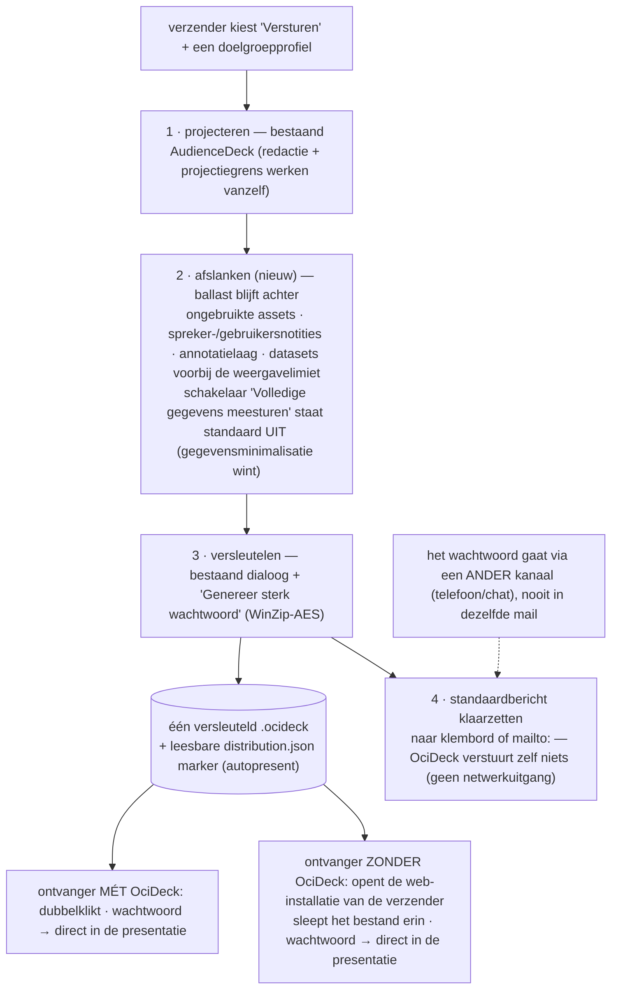

# OciDeck — Rapportagedistributie (ontwerp)

> **Status:** ontwerp; nog niets van dit document is gebouwd — de bouwstenen eronder bestaan wél al, §3 zegt welke · **Status laatst herzien:** 23-07-2026 · **Uitgever:** Stichting LibreKAT · **Language:** Nederlands

Een rapportage — in het bijzonder een uit OpenKAT gegenereerde rapportage —
versleuteld versturen naar een ontvanger die er zo min mogelijk voor hoeft te
doen: dubbelklikken en kijken. Heeft de ontvanger geen OciDeck, dan wijst het
begeleidende bericht naar een web-installatie van de **verzender**, waar het
bijgevoegde bestand ingesleept kan worden.

Dit document is de distributiekant van de OpenKAT-integratie. De importkant
(OpenKAT-gegevens inlezen en er een managementdeck van maken) en de
niet-destructieve weergavelimieten staan in issue #672 en vallen buiten dit
document.

## 1. Het scenario

1. De verzender kiest **Versturen** en een doelgroepprofiel, en krijgt één
   versleuteld `.ocideck`-bestand plus een kant-en-klaar begeleidend bericht.
2. De verzender mailt bestand en bericht, en geeft het wachtwoord door via een
   **ander kanaal** (telefoon, chat).
3. De ontvanger mét OciDeck dubbelklikt, typt het wachtwoord en zit direct in
   de presentatie.
4. De ontvanger zónder OciDeck opent de web-installatie uit het bericht, sleept
   het bestand erin, typt het wachtwoord en zit direct in de presentatie.

## 2. Beslispunten — vastgelegd 23-07-2026

| # | Besluit | Betekenis |
| --- | --- | --- |
| B1 | **We houden wat we hebben.** | De bestaande WinZip-AES-pakketversleuteling is de envelop. Geen nieuw formaat, geen nieuwe crypto. De vastgelegde PBKDF2-afwijking (`assurance/ASVS-5.0.0-afwijkingen.md`) geldt hier onverkort. |
| B2 | **Aansluiten bij bestaande distributiestandaarden.** | Een gewone e-mail met een gewone (versleutelde) zip-bijlage, plus een standaardbericht. Het pakket en het bericht zijn kanaalonafhankelijk; andere wegen (gedeelde opslag, downloadlink) komen later zonder het formaat te raken. |
| B3 | **Hosting is buiten scope.** | OciDeck is een opensourceproduct, geen dienst. De verzender wijst zijn eigen web-installatie aan (zie `HOSTING.md`); er is geen centrale viewer-URL en dus geen nieuwe te vertrouwen partij. |
| B4 | **Ballast gaat eruit.** | De distributie-export ontdoet het pakket van wat de ontvanger niet nodig heeft. OpenKAT-rapportages kunnen in distributie fors kleiner; bijlagelimieten van mailservers zijn daarmee geen blokkade. |

## 3. Wat er al ligt

Dit ontwerp is bewust een dunne laag over bestaande onderdelen:

| Bouwsteen | Waar |
| --- | --- |
| `.ocideck`-pakket (zip) met eigen UTI; dubbelklik-associatie op macOS (Owner) | `macos/Runner/Info.plist` |
| Windows-bestandsassociatie | `windows/file-associations.reg` |
| Pakketversleuteling (WinZip-AES) mét wachtwoordgenerator in het exportdialoog | `lib/utils/zip_encryption.dart`, `PackageEncryptDialog` |
| Import van versleutelde pakketten met wachtwoordprompt, ook op web (drag-drop, bestandskiezer) | `tabs_provider_import` (`OpenResult.passwordCancelled`, `openDeckFromBytes`) |
| Projectiegrens voor doelgroepprofielen (redactie, notities) | `ExportBundle` / `AudienceDeck` |
| Statische, zelfvoorzienende webbuild zonder backend | `HOSTING.md` |

Wat er dus **niet** komt: een nieuw envelopformaat, een tweede
renderimplementatie, een uploaddienst, of een sleutel-in-de-link.

## 4. De dunne laag

### 4.1 De distributie-export ("Versturen")

Eén actie die vier bestaande stappen bundelt en er één nieuwe aan toevoegt:

1. **Projecteren** volgens het gekozen doelgroepprofiel — het bestaande
   `AudienceDeck`-mechanisme; redactie en de projectiegrens werken dus vanzelf
   ook hier.
2. **Afslanken** (nieuw): ballast blijft achter. In elk geval: ongebruikte
   assets, sprekersnotities en gebruikersnotities, de annotatielaag, en —
   standaard — de volledige datasets voorbij de weergavelimiet: het
   distributie-exemplaar bevat wat de ontvanger te zien krijgt.
3. **Versleutelen** met het bestaande dialoog, inclusief de knop *Genereer
   sterk wachtwoord*.
4. **Bericht klaarzetten** (§4.2).

De spanning met de niet-destructieve weergavelimieten (issue #672) benoemen we
hardop: binnen het **project** van de verzender wordt nooit data weggegooid —
dat blijft de harde regel. Het **distributie-exemplaar** is een bewuste
projectie van de verzender, precies zoals een geredigeerd exemplaar dat al is;
éénrichting is hier de bedoeling, geen val. Wie de ontvanger wil laten
doorwerken met de volledige gegevens zet de schakelaar *Volledige gegevens
meesturen* aan. De standaard staat uit: gegevensminimalisatie wint
(veiligheid op 1), en de afweging is met deze paragraaf navolgbaar.

### 4.2 Het standaardbericht

De export levert naast het bestand een begeleidende tekst, in de door de
verzender gekozen taal:

- wat de bijlage is en van wie;
- "Heb je OciDeck: dubbelklik op de bijlage.";
- "Geen OciDeck? Open *(web-installatie van de verzender)* en sleep de bijlage
  in het venster." — deze regel verschijnt alleen als de verzender in de
  instellingen een web-installatie-URL heeft gezet, en vervalt anders;
- "Het wachtwoord ontvang je via een ander kanaal." — deze zin is niet
  optioneel; het bericht is tegelijk de instructie aan de verzender om het
  wachtwoord níet in dezelfde mail te zetten.

OciDeck verstuurt zelf niets: de tekst gaat naar het klembord of opent een
`mailto:`-koppeling met het bericht voorgevuld. Er komt geen mailverkeer, geen
SMTP-configuratie en geen netwerkuitgang bij — de bestaande netwerkbelofte
blijft onaangetast. Later kunnen andere kanalen dezelfde twee artefacten
(bestand + bericht) hergebruiken.

### 4.3 Direct presenteren: het distributiemarkertje

In de zip-root komt een klein, leesbaar `distribution.json`: formaatversie,
`autopresent`, optionele startdia, en de web-installatie-hint als platte tekst.
Het raakt het `.md` niet — een vreemde uitpakker ziet een onschuldig, leesbaar
sidecar-bestand en kan het straffeloos negeren of weggooien. OciDeck (desktop
én web) dat een pakket mét marker opent, gaat na ontsleutelen rechtstreeks de
presentatiemodus in; Escape brengt de ontvanger gewoon in de editor, want het
blijft een volwaardig deck.

### 4.4 Dubbelklik op alle drie de platforms

macOS is klaar; Windows heeft `file-associations.reg` (registratie hoort in de
installatie-instructie van de `USER_GUIDE`); Linux mist nog een `.desktop`-item
met MIME-koppeling plus een shared-mime-info-declaratie voor `.ocideck`. Dat
gat dichten hoort bij dit ontwerp.

### 4.5 Het webpad

Bestaat grotendeels al: de webbuild accepteert een pakket via drag-drop of
bestandskiezer en vraagt bij een versleuteld pakket om het wachtwoord. Erbij
komt alleen het honoreren van de marker (§4.3). Een PWA-bestandskoppeling
(zodat dubbelklik ook zonder desktop-app werkt, Chromium-only) is een
mogelijke latere verfijning, geen onderdeel van dit ontwerp.

## 5. De bewaker-toets

1. **Meenemen?** Ja. De envelop is een standaard versleutelde zip: elk
   zip-gereedschap met het wachtwoord opent hem, en binnenin zit het gewone
   pakket — `.md`, sidecars, assets.
2. **Wat komt er in het `.md`?** Niets. Autopresent en de viewer-hint zitten in
   een sidecar in de zip; het is verzendmetadata, geen deckdata.
3. **Wie moet je vertrouwen?** Niemand nieuw. Geen dienst, geen centrale URL,
   geen uploadpunt; de verzender host desgewenst zelf.
4. **Kan een ander dit overnemen?** Ja — formaat en bericht zijn hier
   gedocumenteerd, de crypto is een publieke specificatie.
5. **En als OciDeck stopt?** De ontvangen bijlagen blijven met alledaags
   gereedschap te openen; de uitgang is zo makkelijk als de ingang.

## 6. Beveiligingsafwegingen

- **Transportbescherming, geen kluis.** WinZip-AES met de vastgelegde
  PBKDF2-afwijking beschermt tegen meelezers onderweg en bij de mailprovider,
  niet tegen een aanvaller met het wachtwoord. Wie een sterkere waarborg nodig
  heeft, gebruikt een beveiligd kanaal voor het hele bestand; dat staat zo in
  de `USER_GUIDE` zodra dit gebouwd wordt.
- **Wachtwoord buiten de band.** Het standaardbericht dwingt de gewoonte af
  (§4.2); een sleutel-in-de-link is bewust afgewezen — wie de mail leest zou
  dan alles hebben.
- **Fail-closed.** Een fout wachtwoord toont niets, ook op web; de bestaande
  importafhandeling doet dit al.
- **Privacy-standaarden gelden.** De projectie (redactie, notities eruit) loopt
  door de bestaande `AudienceDeck`-grens; de export-gate van OciWacht blijft
  van kracht op distributie-exports.

## 7. Fasering

| Fase | Levert | Acceptatie |
| --- | --- | --- |
| F1 | Distributie-export: projectie + afslanken + versleutelen in één actie, plus het standaardbericht en de instelling voor de web-installatie-URL | Een OpenKAT-deck van vóór afslanken → distributiebestand aantoonbaar kleiner; notities/annotaties aantoonbaar afwezig; round-trip bij *Volledige gegevens meesturen* verliest niets |
| F2 | `distribution.json`-marker, gehonoreerd op desktop en web | Dubbelklik resp. drag-drop → wachtwoord → presentatiemodus, zonder verdere handeling; pakket zonder marker gedraagt zich als vandaag |
| F3 | Linux-associatie; installatie-instructies voor alle drie de platforms in de `USER_GUIDE` | Dubbelklik werkt op een verse machine per platform, of de handmatige stap staat beschreven |
| F4 (later) | Meer kanalen; eventueel PWA-bestandskoppeling | Buiten dit ontwerp; hergebruikt bestand + bericht ongewijzigd |

## 8. Open vragen

- **OQ-1** De precieze ballastlijst per bestandssoort (media, themabestanden,
  captions) — vaststellen bij de bouw van F1, met de regel uit §4.1 als
  maatstaf: wat de ontvanger ziet, reist mee.
- **OQ-2** Veldenlijst en versienummering van `distribution.json` — klein
  houden; alles erin moet voor een mens leesbaar en voor een vreemde lezer
  negeerbaar zijn.
- **OQ-3** De berichtsjabloon-teksten en hun taalkeuze (taal van de verzender
  of per ontvanger instelbaar) — beslissen bij F1, alle varianten via de
  gewone l10n-keten.
