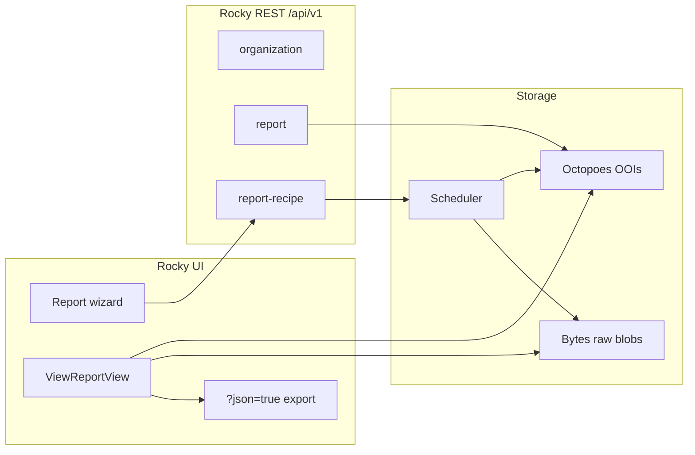

# OciDeck — OpenKAT Rocky report API

> **Status:** research / design contract for a later live integration; nothing built yet — OciDeck today only imports JSON files from disk · **Status last reviewed:** 2026-08-05 · **Published by:** Stichting LibreKAT · **Language:** English
>
> Dutch twin: [OPENKAT_ROCKY_REPORT_API.nl.md](OPENKAT_ROCKY_REPORT_API.nl.md)

This document describes how reports work in OpenKAT (Rocky), which API surfaces
exist, how the JSON export is produced, and what that means for a future live
link from OciDeck. Source: the upstream repository
[SSC-ICT-Innovatie/nl-kat-coordination](https://github.com/SSC-ICT-Innovatie/nl-kat-coordination)
(fork/mirror of OpenKAT / `minvws/nl-kat-coordination`), `main` branch around
August 2026.

The existing OciDeck import (folder of `.json` exports → management deck) stays
out of scope; see `lib/services/openkat/` and
[OPENKAT_DISTRIBUTIE.md](OPENKAT_DISTRIBUTIE.md) for the distribution side.

---

## 1. Builder summary

| What you want | How it works today |
|---|---|
| List / create organisations | Rocky REST `GET/POST /api/v1/organization/` |
| List reports for one org | Rocky REST `GET /api/v1/report/?organization_code=…` |
| PDF of a report | Rocky REST `GET /api/v1/report/{uuid}/pdf/?organization_code=…` → redirect to UI PDF |
| **Full report JSON** (what OciDeck reads from disk) | **No REST endpoint.** UI only: `GET /{org}/reports/view?report_id=Report\|{uuid}&json=true` (session + 2FA) |
| Generate reports on a schedule | Rocky REST CRUD `/api/v1/report-recipe/` + scheduler |
| Pull raw objects / findings yourself | Octopoes API (internal, usually not publicly reachable) |

**Core takeaway for OciDeck:** the JSON our adapters already understand is exactly
the Aggregate Report export from Rocky’s UI. The public Rocky REST API can
*find* reports and *schedule* recipes, but it does not return the payload.
A live integration must therefore either (a) use the UI JSON route with session
auth, (b) ask upstream for a REST JSON action, or (c) fetch Bytes raw through an
authorised intermediate layer.

---

## 2. Architecture: what is a “report” in OpenKAT?

OpenKAT splits reporting across several layers:



### 2.1 OOI models (`octopoes/models/ooi/reports.py`)

| Type | Role |
|---|---|
| `ReportRecipe` | Recipe: which objects, which parent type, which asset report types, cron |
| `AssetReport` | One input OOI × one report type; `data_raw_id` points at Bytes |
| `Report` / `HydratedReport` | Parent report (aggregate / concatenated / multi); points at recipe + input OOIs |
| `ReportData` | Standalone OOI for uploaded multi-report source data (`organization_code` + `data`) |

Important fields on `Report` / `AssetReport`:

- `name`, `report_type`, `template`
- `organization_code`, `organization_name`, `organization_tags`
- `data_raw_id` — key in Bytes
- `date_generated`, `reference_date`, `observed_at`
- `report_recipe` — reference `ReportRecipe|{uuid}`
- `input_oois` (parent) or `input_ooi` (asset)

Natural keys:

- `Report` / `HydratedReport`: based on `report_recipe`
- `AssetReport`: `input_ooi` + `report_type`
- `ReportRecipe`: `recipe_id` (UUID)
- Parent reference form: `Report|{recipe_id}` (retrieve via `pk` = recipe UUID in the API)

### 2.2 Bytes: where the content lives

On generation the runner uploads JSON to Bytes with mime type `openkat/report`.
Structure per blob:

**Asset report:**

```json
{
  "report_data": { /* type-specific payload */ },
  "input_data": {
    "input_oois": ["Hostname|internet|example.org"],
    "report_types": ["dns-report"],
    "plugins": { "required": ["…"], "optional": ["…"] }
  }
}
```

**Aggregate parent report:** `input_data` plus the *post-processed* aggregate
fields (`systems`, `findings`, `basic_security`, …) in one blob
(`mime: openkat/report`).

The UI JSON export re-reads those blob(s) and wraps metadata around them
(see §5).

### 2.3 Three report flows

| Flow | `report_type` id | UI | JSON export |
|---|---|---|---|
| Separate / concatenated | `concatenated-report` | multiple asset reports stacked | yes via `?json=true`, but shape = asset map (report-type → OOI) |
| Aggregate | `aggregate-organisation-report` | summarised overview | **yes — this is the OciDeck organisation-report shape** |
| Multi-organisation | `multi-organization-report` | comparison across orgs | yes; input is often uploaded `ReportData` |

OpenKAT docs position only Aggregate as a JSON export for sector comparison /
multi-report.

---

## 3. Rocky REST API (`/api/v1/`)

Registered in `rocky/rocky/urls.py` via DRF `SimpleRouter`:

```text
/api/v1/organization/
/api/v1/report/
/api/v1/report-recipe/
```

`GET /api/v1/` itself returns **404** (no API root). Go straight to a resource.

### 3.1 Authentication

From `rocky/settings.py`:

| Environment | Auth classes |
|---|---|
| Production (`BROWSABLE_API=false`, default) | **Knox** `TokenAuthentication` only |
| Debug / browsable | Knox + `SessionAuthentication` |

Header:

```http
Authorization: Token <knox-token>
```

Create tokens: Django admin → `AuthToken` (`account.AuthToken`). On create,
admin shows the full token **once** (`generate_new_token()`). Tokens have a
`name` (unique per user, case-insensitive) and optional `expiry`.

`AuthRequiredMiddleware` excludes `/api/` from login redirect and from 2FA
verification — API users need no TOTP. UI routes do.

Default DRF permission: `KATModelPermissions` (Django model perms, including
`view_*` for GET). **Report and ReportRecipe viewsets override this to
`IsAuthenticated`**, plus organisation membership via `OrganizationAPIMixin`.

### 3.2 Organisation scoping (Report & Recipe)

Query parameters (one of the two required):

| Param | Meaning |
|---|---|
| `organization_code` | Rocky org code (same as in URL `/nl/{code}/…`) |
| `organization_id` | Database PK of `Organization` |

Optional:

| Param | Default | Meaning |
|---|---|---|
| `valid_time` | now (UTC) | bitemporal moment; ISO-8601; no tz → UTC |

Membership: user must be an `OrganizationMember` of that org, or have
`tools.can_access_all_organizations`. Blocked members → 403. Missing
org/membership → 404 (no leak).

### 3.3 `organization`

`OrganizationViewSet` — full ModelViewSet.

| Method | Path | Notes |
|---|---|---|
| GET | `/api/v1/organization/` | **No pagination** (intentional; backwards compat) |
| POST | `/api/v1/organization/` | `code` writable on create |
| GET/PATCH/DELETE | `/api/v1/organization/{id}/` | `code` read-only after create |
| GET/POST | `…/{id}/indemnification/` | status / set |
| POST | `…/{id}/recalculate_bits/` | recalculate Octopoes bits |
| POST | `…/{id}/clone_katalogus_settings/` | body: `to_organization` |

Serializer fields: `id`, `name`, `code`, `tags`.

Permissions: model perms (`tools.view_organization`, etc.).

### 3.4 `report` (read-only)

`ReportViewSet` — `ReadOnlyModelViewSet`, `IsAuthenticated`.

| Method | Path | Behaviour |
|---|---|---|
| GET | `/api/v1/report/?organization_code=acme` | paginated list (`LimitOffsetPagination`, default page size 100) |
| GET | `/api/v1/report/{pk}/?organization_code=acme` | one report; `pk` = UUID part of `Report|{uuid}` |
| GET | `/api/v1/report/{pk}/pdf/?organization_code=acme` | **302** to UI `view_report_pdf` with `report_id` + `observed_at` |

**List response** (per item, via `ReportSerializer` on `EnrichedReport`):

```json
{
  "id": "Report|<uuid>",
  "valid_time": "2026-08-05T12:00:00+00:00",
  "name": "Aggregate Report for 16 objects",
  "report_type": "aggregate-organisation-report",
  "generated_at": "2026-08-05T12:00:00+00:00",
  "intput_oois": ["Hostname|internet|…", "…"]
}
```

Note the typo **`intput_oois`** in the serializer (`rocky/reports/serializers.py`) —
upstream bug; clients must expect that spelling until it is fixed.

**Missing from the REST response:** no `data`, no `systems`/`findings`, no Bytes
content, no JSON download URL.

**PDF action pitfall:** the redirect lands on a *session*-protected UI view. A
pure Knox client cannot usefully follow the redirect without a separate session
cookie / 2FA. For headless PDF download this path is weak.

### 3.5 `report-recipe` (CRUD)

`ReportRecipeViewSet` — `ModelViewSet`, `IsAuthenticated`.

| Method | Path | Behaviour |
|---|---|---|
| GET | `/api/v1/report-recipe/?organization_code=…` | list `ReportRecipe` OOIs from Octopoes (paginated) |
| POST | `/api/v1/report-recipe/?organization_code=…` | create recipe + schedule in scheduler |
| GET/PUT/PATCH/DELETE | `/api/v1/report-recipe/{recipe_id}/?organization_code=…` | retrieve / update / delete (+ schedule) |

**Body (create/update):**

```json
{
  "id": "optional-uuid-on-create-else-generated",
  "report_name_format": "${report_type} for ${oois_count} objects",
  "input_recipe": { },
  "report_type": "aggregate-organisation-report",
  "asset_report_types": [
    "systems-report",
    "open-ports-report",
    "vulnerability-report",
    "ipv6-report",
    "rpki-report",
    "mail-report",
    "web-system-report",
    "name-server-report",
    "safe-connections-report",
    "findings-report"
  ],
  "cron_expression": "0 6 * * 1",
  "start_date": "2026-08-06"
}
```

- `id` maps to `recipe_id` (UUID); optional on create.
- `start_date` is **write-only**; defaults to today (UTC) as scheduler deadline
  if omitted.
- `cron_expression` may be `null`/empty for “once”, depending on scheduler
  behaviour; the UI only sets cron when recurrence ≠ once.
- Existing `recipe_id` on create → update path (patch schedule instead of new).

**`input_recipe` — two shapes:**

1. Static selection:

```json
{ "input_oois": ["Hostname|internet|example.org", "IPAddressV4|internet|192.0.2.1"] }
```

2. Live query (filters as in the object list):

```json
{
  "query": {
    "ooi_types": ["Hostname", "IPAddressV4", "IPAddressV6"],
    "scan_level": [2, 3, 4],
    "scan_type": ["declared"],
    "search_string": "",
    "order_by": "object_type",
    "asc_desc": "asc"
  }
}
```

At run time (`LocalReportRunner`), `input_oois` wins if present; otherwise the
query runs against Octopoes at *now*.

Create side-effect: Octopoes OOI + `ScheduleRequest` on scheduler id `"report"`
with payload `{ organisation_id, report_recipe_id }`. Delete removes the schedule
(if found) and then the OOI.

---

## 4. Generation pipeline (behind the API)

1. Scheduler triggers `ReportTask` for an org + recipe id.
2. `LocalReportRunner` loads the recipe and resolves input OOIs.
3. Per asset report type: `collect_data` against Octopoes (bits/OOI graph).
4. For aggregate: `AggregateOrganisationReport.post_process_data` builds the
   summary (`systems`, `findings`, `basic_security`, …).
5. Bytes upload + `Report`/`AssetReport` OOIs in Octopoes (`create_ooi`).
6. Result appears in report history / `GET /api/v1/report/`.

Feature flag `ASSET_REPORTS` (env, default `true`): whether separate
`AssetReport` OOIs are created or only input references on the parent.

---

## 5. JSON export (what OciDeck consumes today)

### 5.1 Endpoint (UI, not `/api/v1`)

```http
GET /{organization_code}/reports/view?report_id=Report%7C{uuid}&json=true
```

Alternate path alias: `…/reports/view/json/` — the **same** view; still needs
`json=true` in the query string.

Implementation: `ViewReportView.get` in `rocky/reports/views/base.py`.

Response:

```http
200 OK
Content-Type: application/json
Content-Disposition: attachment; filename=report-{organization_code}.json
```

```json
{
  "organization_code": "acme",
  "organization_name": "Acme BV",
  "organization_tags": ["zorg", "sector-x"],
  "data": { }
}
```

`data` = reconstructed report_data from Bytes (depends on report type):

| Parent type | Shape of `data` | OciDeck adapter |
|---|---|---|
| `aggregate-organisation-report` | flat: `systems`, `findings`, `basic_security`, `summary`, `total_*`, `input_data`, … | **organisation report** |
| `concatenated-report` | `report-type-id` → `ooi-pk` → `{ data, template, report_name, … }` | **asset reports** |
| single asset / other | variant of the above | partial |

OOIs in JSON are serialised via a custom `JSONEncoder` to strings or
dataclass dicts.

### 5.2 Aggregate `data` — fields that matter

From `AggregateOrganisationReport.post_process_data` (+ `input_data`):

| Key | Content |
|---|---|
| `input_data` | `input_oois`, `report_types`, `plugins` |
| `systems` | `{ "services": { "IPAddressV4\|…": { "hostnames", "services" } } }` |
| `services` | grouped by system type (Web/Mail/DNS/…) |
| `findings` | `finding_types[]` + `summary` (totals per severity) |
| `vulnerabilities` | per IP, CVE-like groups |
| `basic_security` | `rpki`, `safe_connections`, `system_specific`, `summary` |
| `open_ports`, `ipv6` | overviews |
| `recommendations`, `recommendation_counts` | texts |
| `summary` | e.g. `critical_vulnerabilities`, `ips_scanned`, `hostnames_scanned` |
| `total_systems`, `total_hostnames`, `total_findings`, … | totals |
| `health`, `config_oois` | Rocky/Octopoes health + config OOIs |

This is the **same envelope** that
`lib/services/openkat/openkat_export_adapters.dart` recognises as
`openkat-organisatierapport` when `data` contains e.g. `findings` / `systems` /
`total_systems`.

### 5.3 Asset report type IDs

| id | Class | Typical input |
|---|---|---|
| `systems-report` | SystemReport | Hostname, IPv4, IPv6 |
| `open-ports-report` | OpenPortsReport | same |
| `vulnerability-report` | VulnerabilityReport | same |
| `ipv6-report` | IPv6Report | same |
| `rpki-report` | RPKIReport | same |
| `mail-report` | MailReport | same |
| `web-system-report` | WebSystemReport | same |
| `name-server-report` | NameServerSystemReport | same |
| `safe-connections-report` | SafeConnectionsReport | same |
| `findings-report` | FindingsReport | Hostname, IP, URL |
| `dns-report` | DNSReport | Hostname (normal flow) |
| `tls-report` | TLSReport | IPService |
| `aggregate-organisation-report` | AggregateOrganisationReport | parent |
| `concatenated-report` | ConcatenatedReport | parent |
| `multi-organization-report` | MultiOrganizationReport | parent / ReportData |

### 5.4 System labels

From `systems_report`: `Web`, `Mail`, `DNS`, `Dicom`, `Other` — mapped via open
ports / services (`http`→Web, `smtp`→Mail, `domain`→DNS, …).

---

## 6. Related (non-Rocky) APIs

### 6.1 Octopoes

Internal FastAPI (often port 8001). Includes e.g.:

- `GET /{org}/reports`, `GET /{org}/reports/{id}` — HydratedReport
- `GET /{org}/objects`, declarations, findings, query, …

**Not** intended as a public client API; usually reachable only inside the
OpenKAT network. Rocky is the intentional front door.

### 6.2 Bytes

Storage for raw blobs; Rocky fetches report JSON via `bytes_client.get_raws`.
Credentials: `BYTES_USERNAME` / `BYTES_PASSWORD` (service-to-service).

### 6.3 Scheduler (Mula)

Schedules for report recipes; Rocky finds schedules with filter
`data.report_recipe_id == {uuid}`.

### 6.4 KATalogus

Plugin catalogue / org config; relevant for “required plugins enabled?” but not
for fetching report payloads.

---

## 7. What OciDeck already handles

File import (desktop): folder → `.json` → adapters:

1. **Organisation report** — envelope + flat `data` (aggregate export).
2. **Asset reports** — envelope + `data[report-type][ooi]` with `template`.

No HTTP client, no Knox token, no NetGuard allowlist for Rocky. See
`openkat_export_adapters.dart` and tests for exact fields / finding shapes.

---

## 8. Build options for a live integration

### Option A — Knox + REST metadata, JSON via UI session (hybrid)

1. Token: list orgs, list reports, optionally schedule recipes.
2. For payload: separate session login (or remote-user) to
   `…/reports/view?json=true`.

**Problem:** 2FA, CSRF, cookie jar — fragile for a desktop app; clashes with a
“minimal network” stance.

### Option B — Extend upstream: `GET /api/v1/report/{pk}/json/`

Mirror of the existing `pdf` action, but `JsonResponse` with the same envelope
as `ViewReportView`. Fits Knox, pagination and org scoping.
**Recommended path** if we can collaborate with OpenKAT maintainers
(small, consistent addition).

### Option C — Recipes only + wait for export files

REST schedules aggregate recipes; an existing export/boefje or manual drop
folder keeps feeding OciDeck. Least Rocky API dependence; matches current
import.

### Option D — Direct Bytes/Octopoes

Technically possible on a private network, but bypasses Rocky authZ,
indemnification and product boundaries. Only for operators who host OpenKAT
themselves and consciously expose internal APIs — **not** as a default
OciDeck feature.

---

## 9. Recommended integration contract (OciDeck side)

When building, keep these boundaries (to be checked with security-architect +
guardian):

1. **One source shape:** keep normalising the existing JSON envelope; do not add
   a second parallel model for “live” vs “file”.
2. **Aggregate first:** live pull limited to
   `report_type == aggregate-organisation-report` (same data as today).
3. **Auth:** Knox token in OS keychain / existing secret store; never in
   Markdown/deck; NetGuard allowlist per host.
4. **Minimal calls:** `organization` → `report?organization_code=` filter by
   type → (future) `…/json/` or exported file.
5. **No Octopoes/Bytes from the app** unless an explicit product decision for
   “operator mode”.
6. **Fail closed:** timeout, cert pinning/policy like other OciDeck network
   paths; on auth failure, no half-imported deck.
7. **Re-import:** reuse existing provenance (`OpenKatSlideProvenance`) as if it
   were a folder import.

### Example flow (after Option B)

```http
Authorization: Token …

GET /api/v1/organization/
GET /api/v1/report/?organization_code=acme&limit=20
GET /api/v1/report/<uuid>/json/?organization_code=acme
```

Response body of the last call = byte-for-byte the same shape as the file the
user exports by hand today → existing `OpenKatImportService` with no adapter
change.

### Creating a recipe (optional, admin)

```http
POST /api/v1/report-recipe/?organization_code=acme
Content-Type: application/json

{
  "report_name_format": "OciDeck aggregate %Y-%m-%d",
  "report_type": "aggregate-organisation-report",
  "asset_report_types": [
    "systems-report",
    "findings-report",
    "vulnerability-report",
    "open-ports-report",
    "mail-report",
    "web-system-report",
    "name-server-report",
    "rpki-report",
    "safe-connections-report",
    "ipv6-report"
  ],
  "input_recipe": {
    "query": {
      "ooi_types": ["Hostname", "IPAddressV4", "IPAddressV6"],
      "scan_level": [2, 3, 4],
      "scan_type": ["declared"],
      "search_string": "",
      "order_by": "object_type",
      "asc_desc": "asc"
    }
  },
  "cron_expression": "0 5 * * 1",
  "start_date": "2026-08-11"
}
```

Then poll `GET /api/v1/report/` until a new
`aggregate-organisation-report` appears, then fetch JSON.

---

## 10. Security & privacy (checklist)

| Topic | Fact |
|---|---|
| AuthZ on reports | org membership (or all-orgs perm); no separate report perm on viewsets |
| Token scope | Knox token = full user rights; no fine-grained scopes |
| Report content | findings, hostnames, IPs, possible personal data / infra — GDPR-relevant |
| Logging | no tokens/report bodies in OciDeck logs |
| Network | Rocky is a new outbound destination; fits NetGuard + privacy promise |
| 2FA | API exempted; UI export is not |
| Upstream typo | `intput_oois` — do not “fix” client-side without version detection |

---

## 11. Source references (paths in nl-kat-coordination)

| Part | Path |
|---|---|
| URL routing API | `rocky/rocky/urls.py` |
| Report / Recipe viewsets | `rocky/reports/viewsets.py` |
| Serializers | `rocky/reports/serializers.py` |
| Org API mixin / valid_time | `rocky/account/mixins.py` (`OrganizationAPIMixin`) |
| JSON export UI | `rocky/reports/views/base.py` (`ViewReportView`) |
| Report URLs (UI) | `rocky/reports/urls.py` |
| Runner / Bytes save | `rocky/reports/runner/report_runner.py` |
| Aggregate post-process | `rocky/reports/report_types/aggregate_organisation_report/report.py` |
| Report-type registry | `rocky/reports/report_types/helpers.py` |
| OOI models | `octopoes/octopoes/models/ooi/reports.py` |
| Knox / DRF settings | `rocky/rocky/settings.py` |
| Token admin | `rocky/account/admin.py` |
| Design notes (partly outdated) | `rocky/docs/reports.md` |
| User docs | https://docs.openkat.nl/user-manual/navigation/reports.html |

Relevant upstream PRs (history): report list + PDF API (#3689), report-recipe
API (#3746), JSON download in UI (#3460).

---

## 12. Open questions before building

1. **Upstream JSON action:** do we contribute Option B upstream, or only
   consume what exists?
2. **Multi-org:** do we also pull `multi-organization-report` / uploaded
   `ReportData`, or keep that outside OciDeck (sector comparison already partly
   lives in our portfolio scenarios)?
3. **Recipe management in OciDeck:** read/pull only, or also create schedules
   from the app? (product + security)
4. **Token UX:** who creates Knox tokens (admin in Rocky admin) and how do we
   document that for users?
5. **Version pin:** which OpenKAT release do we support; how do we detect
   `intput_oois` vs a possible fix?

Until those are answered, the safe default remains: **file export from Rocky →
folder in OciDeck**, with this document as the contract for the next step.
