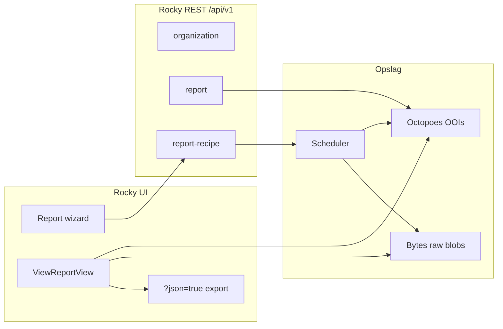

# OciDeck — OpenKAT Rocky rapportage-API

> **Status:** onderzoek / ontwerpcontract voor latere live-integratie; nog niets gebouwd — OciDeck importeert vandaag alleen JSON-bestanden van schijf · **Status laatst herzien:** 2026-08-05 · **Uitgever:** Stichting LibreKAT · **Language:** Nederlands
>
> Engelse tweeling: [OPENKAT_ROCKY_REPORT_API.md](OPENKAT_ROCKY_REPORT_API.md)

Dit document beschrijft hoe rapportages in OpenKAT (Rocky) werken, welke
API-oppervlakken er zijn, hoe de JSON-export tot stand komt, en wat dat betekent
voor een toekomstige live-koppeling vanuit OciDeck. Bron: de upstream-repo
[SSC-ICT-Innovatie/nl-kat-coordination](https://github.com/SSC-ICT-Innovatie/nl-kat-coordination)
(fork/spiegel van OpenKAT / `minvws/nl-kat-coordination`), branch `main` rond
augustus 2026.

De bestaande OciDeck-import (map met `.json`-exports → managementdeck) blijft
buiten scope; zie `lib/services/openkat/` en
[OPENKAT_DISTRIBUTIE.md](OPENKAT_DISTRIBUTIE.md) voor de distributiekant.

---

## 1. Samenvatting voor bouwers

| Wat je wilt | Hoe het vandaag kan |
|---|---|
| Organisaties opsommen / aanmaken | Rocky REST `GET/POST /api/v1/organization/` |
| Bestaande rapporten van één org tonen | Rocky REST `GET /api/v1/report/?organization_code=…` |
| PDF van een rapport | Rocky REST `GET /api/v1/report/{uuid}/pdf/?organization_code=…` → redirect naar UI-PDF |
| **Volledige rapport-JSON** (wat OciDeck nu van schijf leest) | **Geen REST-endpoint.** Alleen UI: `GET /{org}/reports/view?report_id=Report\|{uuid}&json=true` (sessie + 2FA) |
| Rapporten periodiek laten genereren | Rocky REST CRUD ` /api/v1/report-recipe/` + scheduler |
| Ruwe objecten / findings zelf ophalen | Octopoes-API (intern, meestal niet publiek bereikbaar) |

**Kerninslag voor OciDeck:** de JSON die onze adapters al begrijpen, is precies
de Aggregate-Report-export uit Rocky’s UI. De publieke Rocky REST-API kan
rapporten *vinden* en recipes *plannen*, maar levert de payload zelf niet.
Daarom moet een live-integratie óf (a) de UI-JSON-route met sessie-auth
gebruiken, óf (b) upstream om een REST-JSON-actie vragen, óf (c) de Bytes-raw
via een geautoriseerde tussenlaag ophalen.

---

## 2. Architectuur: wat is een “rapport” in OpenKAT?

OpenKAT splitst rapportage over meerdere lagen:



### 2.1 OOI-modellen (`octopoes/models/ooi/reports.py`)

| Type | Rol |
|---|---|
| `ReportRecipe` | Recept: welke objecten, welk parent-type, welke asset-report-types, cron |
| `AssetReport` | Één input-OOI × één report-type; `data_raw_id` wijst naar Bytes |
| `Report` / `HydratedReport` | Parent-rapport (aggregate / concatenated / multi); verwijst naar recipe + input-OOIs |
| `ReportData` | Los OOI voor geüploade multi-report brondata (`organization_code` + `data`) |

Belangrijke velden op `Report` / `AssetReport`:

- `name`, `report_type`, `template`
- `organization_code`, `organization_name`, `organization_tags`
- `data_raw_id` — sleutel in Bytes
- `date_generated`, `reference_date`, `observed_at`
- `report_recipe` — referentie `ReportRecipe|{uuid}`
- `input_oois` (parent) of `input_ooi` (asset)

Natural keys:

- `Report` / `HydratedReport`: gebaseerd op `report_recipe`
- `AssetReport`: `input_ooi` + `report_type`
- `ReportRecipe`: `recipe_id` (UUID)
- Referentie-vorm parent: `Report|{recipe_id}` (retrieve via pk = recipe UUID in de API)

### 2.2 Bytes: waar de inhoud leeft

Bij generatie uploadt de runner JSON naar Bytes met mime-type
`openkat/report`. Structuur per blob:

**Asset-rapport:**

```json
{
  "report_data": { /* type-specifieke payload */ },
  "input_data": {
    "input_oois": ["Hostname|internet|example.org"],
    "report_types": ["dns-report"],
    "plugins": { "required": ["…"], "optional": ["…"] }
  }
}
```

**Aggregate parent-rapport:** `input_data` plus de *post-processed*
aggregaatvelden (`systems`, `findings`, `basic_security`, …) in één blob
(`mime: openkat/report`).

De UI-JSON-export leest die blob(s) opnieuw en wikkelt er metadata omheen
(zie §5).

### 2.3 Drie rapportstromen

| Flow | `report_type` id | UI | JSON-export |
|---|---|---|---|
| Separate / concatenated | `concatenated-report` | meerdere asset-rapporten onder elkaar | ja via `?json=true`, maar vorm = asset-kaart (report-type → OOI) |
| Aggregate | `aggregate-organisation-report` | samengevat overzicht | **ja — dit is de OciDeck-organisatierapport-vorm** |
| Multi-organisation | `multi-organization-report` | vergelijking over orgs | ja; input is vaak geüploade `ReportData` |

Documentatie OpenKAT: alleen Aggregate is expliciet als JSON-export
gepositioneerd voor sectorvergelijking / multi-report.

---

## 3. Rocky REST-API (`/api/v1/`)

Geregistreerd in `rocky/rocky/urls.py` via DRF `SimpleRouter`:

```text
/api/v1/organization/
/api/v1/report/
/api/v1/report-recipe/
```

`GET /api/v1/` zelf geeft **404** (geen API-root). Ga direct naar een resource.

### 3.1 Authenticatie

Uit `rocky/settings.py`:

| Omgeving | Auth-classes |
|---|---|
| Productie (`BROWSABLE_API=false`, default) | alleen **Knox** `TokenAuthentication` |
| Debug / browsable | Knox + `SessionAuthentication` |

Header:

```http
Authorization: Token <knox-token>
```

Tokens aanmaken: Django-admin → `AuthToken` (`account.AuthToken`). Bij create
toont admin **één keer** het volledige token (`generate_new_token()`). Tokens
hebben een `name` (uniek per user, case-insensitive) en optionele `expiry`.

`AuthRequiredMiddleware` sluit `/api/` uit van login-redirect én van
2FA-verificatie — API-gebruikers hoeven geen TOTP. UI-routes wel.

Standaard DRF-permission: `KATModelPermissions` (Django model-perms, inclusief
`view_*` voor GET). **Report- en ReportRecipe-viewsets overschrijven dit naar
`IsAuthenticated`**, plus organisatielidmaatschap via `OrganizationAPIMixin`.

### 3.2 Organisatie-scoping (Report & Recipe)

Queryparameters (verplicht één van de twee):

| Param | Betekenis |
|---|---|
| `organization_code` | Rocky-orgcode (zelfde als in URL `/nl/{code}/…`) |
| `organization_id` | Database-PK van `Organization` |

Optioneel:

| Param | Default | Betekenis |
|---|---|---|
| `valid_time` | nu (UTC) | bitemporeel moment; ISO-8601; zonder tz → UTC |

Lidmaatschap: user moet `OrganizationMember` zijn van die org, óf
`tools.can_access_all_organizations` hebben. Geblokkeerde members → 403.
Ontbrekende org/lidmaatschap → 404 (geen leak).

### 3.3 `organization`

`OrganizationViewSet` — volledige ModelViewSet.

| Methode | Pad | Notities |
|---|---|---|
| GET | `/api/v1/organization/` | **Geen paginatie** (bewust; backwards compat) |
| POST | `/api/v1/organization/` | `code` schrijfbaar bij create |
| GET/PATCH/DELETE | `/api/v1/organization/{id}/` | `code` read-only na create |
| GET/POST | `…/{id}/indemnification/` | status / zetten |
| POST | `…/{id}/recalculate_bits/` | Octopoes bits herberekenen |
| POST | `…/{id}/clone_katalogus_settings/` | body: `to_organization` |

Serializer-velden: `id`, `name`, `code`, `tags`.

Permissions: model-perms (`tools.view_organization`, enz.).

### 3.4 `report` (read-only)

`ReportViewSet` — `ReadOnlyModelViewSet`, `IsAuthenticated`.

| Methode | Pad | Gedrag |
|---|---|---|
| GET | `/api/v1/report/?organization_code=acme` | gepagineerde lijst (`LimitOffsetPagination`, default page size 100) |
| GET | `/api/v1/report/{pk}/?organization_code=acme` | één rapport; `pk` = UUID-deel van `Report|{uuid}` |
| GET | `/api/v1/report/{pk}/pdf/?organization_code=acme` | **302** naar UI `view_report_pdf` met `report_id` + `observed_at` |

**List-response** (per item, via `ReportSerializer` op `EnrichedReport`):

```json
{
  "id": "Report|<uuid>",
  "valid_time": "2026-08-05T12:00:00+00:00",
  "name": "Aggregate Report for 16 objects",
  "report_type": "aggregate-organisation-report",
  "generated_at": "2026-08-05T12:00:00+00:00",
  "intput_oois": ["Hostname|internet|…", "…"]
}
```

Let op de typo **`intput_oois`** in de serializer (`rocky/reports/serializers.py`) —
upstream bug; clients moeten die spelling verwachten tot die gefixt is.

**Wat ontbreekt in de REST-response:** geen `data`, geen `systems`/`findings`,
geen Bytes-inhoud, geen download-URL voor JSON.

**PDF-actie-valkuil:** de redirect landt op een *sessie*-beveiligde UI-view.
Een pure Knox-client volgt de redirect niet bruikbaar zonder apart
sessie-cookie / 2FA. Voor headless PDF-download is dit pad dus zwak.

### 3.5 `report-recipe` (CRUD)

`ReportRecipeViewSet` — `ModelViewSet`, `IsAuthenticated`.

| Methode | Pad | Gedrag |
|---|---|---|
| GET | `/api/v1/report-recipe/?organization_code=…` | lijst `ReportRecipe`-OOIs uit Octopoes (gepagineerd) |
| POST | `/api/v1/report-recipe/?organization_code=…` | recipe aanmaken + schedule in scheduler |
| GET/PUT/PATCH/DELETE | `/api/v1/report-recipe/{recipe_id}/?organization_code=…` | ophalen / bijwerken / verwijderen (+ schedule) |

**Body (create/update):**

```json
{
  "id": "optional-uuid-on-create-else-generated",
  "report_name_format": "${report_type} for ${oois_count} objects",
  "input_recipe": { },
  "report_type": "aggregate-organisation-report",
  "asset_report_types": [
    "systems-report",
    "open-ports-report",
    "vulnerability-report",
    "ipv6-report",
    "rpki-report",
    "mail-report",
    "web-system-report",
    "name-server-report",
    "safe-connections-report",
    "findings-report"
  ],
  "cron_expression": "0 6 * * 1",
  "start_date": "2026-08-06"
}
```

- `id` mappt op `recipe_id` (UUID); optioneel bij create.
- `start_date` is **write-only**; default vandaag (UTC) als deadline voor de
  scheduler als weggelaten.
- `cron_expression` mag `null`/leeg betekenen “eenmalig” afhankelijk van
  scheduler-gedrag; UI zet cron alleen bij recurrence ≠ once.
- Bestaande `recipe_id` bij create → update-pad (patch schedule i.p.v. nieuw).

**`input_recipe` — twee vormen:**

1. Statische selectie:

```json
{ "input_oois": ["Hostname|internet|example.org", "IPAddressV4|internet|192.0.2.1"] }
```

2. Live query (filters zoals in de objectenlijst):

```json
{
  "query": {
    "ooi_types": ["Hostname", "IPAddressV4", "IPAddressV6"],
    "scan_level": [2, 3, 4],
    "scan_type": ["declared"],
    "search_string": "",
    "order_by": "object_type",
    "asc_desc": "asc"
  }
}
```

Bij uitvoering (`LocalReportRunner`) wint `input_oois` als aanwezig; anders
wordt de query tegen Octopoes uitgevoerd op *nu*.

Create-side-effect: Octopoes OOI + `ScheduleRequest` op scheduler-id `"report"`
met payload `{ organisation_id, report_recipe_id }`. Delete verwijdert schedule
(als gevonden) en daarna het OOI.

---

## 4. Generatiepipeline (achter de API)

1. Scheduler triggert `ReportTask` voor een org + recipe-id.
2. `LocalReportRunner` laadt recipe, bepaalt input-OOIs.
3. Per asset-report-type: `collect_data` tegen Octopoes (bits/OOI-graph).
4. Bij aggregate: `AggregateOrganisationReport.post_process_data` bouwt
   samenvatting (`systems`, `findings`, `basic_security`, …).
5. Bytes-upload + `Report`/`AssetReport`-OOIs in Octopoes
   (`create_ooi`).
6. Resultaat verschijnt in report history / `GET /api/v1/report/`.

Feature-flag `ASSET_REPORTS` (env, default `true`): of er aparte
`AssetReport`-OOIs worden aangemaakt of alleen input-referenties op de parent.

---

## 5. JSON-export (wat OciDeck vandaag consumeert)

### 5.1 Endpoint (UI, geen `/api/v1`)

```http
GET /{organization_code}/reports/view?report_id=Report%7C{uuid}&json=true
```

Alternatief pad-alias: `…/reports/view/json/` — **dezelfde** view; nog steeds
`json=true` nodig in de querystring.

Implementatie: `ViewReportView.get` in `rocky/reports/views/base.py`.

Response:

```http
200 OK
Content-Type: application/json
Content-Disposition: attachment; filename=report-{organization_code}.json
```

```json
{
  "organization_code": "acme",
  "organization_name": "Acme BV",
  "organization_tags": ["zorg", "sector-x"],
  "data": { }
}
```

`data` = gereconstrueerde report_data uit Bytes (afhankelijk van report_type):

| Parent-type | Vorm van `data` | OciDeck-adapter |
|---|---|---|
| `aggregate-organisation-report` | plat: `systems`, `findings`, `basic_security`, `summary`, `total_*`, `input_data`, … | **organisatierapport** |
| `concatenated-report` | `report-type-id` → `ooi-pk` → `{ data, template, report_name, … }` | **assetrapporten** |
| single asset / overig | variant van bovenstaande | deels |

OOIs in JSON worden via custom `JSONEncoder` naar strings of dataclass-dicts
geserialiseerd.

### 5.2 Aggregate `data` — velden die ertoe doen

Uit `AggregateOrganisationReport.post_process_data` (+ `input_data`):

| Sleutel | Inhoud |
|---|---|
| `input_data` | `input_oois`, `report_types`, `plugins` |
| `systems` | `{ "services": { "IPAddressV4\|…": { "hostnames", "services" } } }` |
| `services` | gegroepeerd per systeemtype (Web/Mail/DNS/…) |
| `findings` | `finding_types[]` + `summary` (totals per severity) |
| `vulnerabilities` | per IP, CVE-achtige groepen |
| `basic_security` | `rpki`, `safe_connections`, `system_specific`, `summary` |
| `open_ports`, `ipv6` | overzichten |
| `recommendations`, `recommendation_counts` | teksten |
| `summary` | o.a. `critical_vulnerabilities`, `ips_scanned`, `hostnames_scanned` |
| `total_systems`, `total_hostnames`, `total_findings`, … | totalen |
| `health`, `config_oois` | Rocky/Octopoes health + config-OOIs |

Dit is **dezelfde envelope** die
`lib/services/openkat/openkat_export_adapters.dart` herkent als
`openkat-organisatierapport` wanneer `data` o.a. `findings` / `systems` /
`total_systems` bevat.

### 5.3 Asset-report-type IDs

| id | Klasse | Typische input |
|---|---|---|
| `systems-report` | SystemReport | Hostname, IPv4, IPv6 |
| `open-ports-report` | OpenPortsReport | idem |
| `vulnerability-report` | VulnerabilityReport | idem |
| `ipv6-report` | IPv6Report | idem |
| `rpki-report` | RPKIReport | idem |
| `mail-report` | MailReport | idem |
| `web-system-report` | WebSystemReport | idem |
| `name-server-report` | NameServerSystemReport | idem |
| `safe-connections-report` | SafeConnectionsReport | idem |
| `findings-report` | FindingsReport | Hostname, IP, URL |
| `dns-report` | DNSReport | Hostname (normal flow) |
| `tls-report` | TLSReport | IPService |
| `aggregate-organisation-report` | AggregateOrganisationReport | parent |
| `concatenated-report` | ConcatenatedReport | parent |
| `multi-organization-report` | MultiOrganizationReport | parent / ReportData |

### 5.4 Systeemlabels

Uit `systems_report`: `Web`, `Mail`, `DNS`, `Dicom`, `Other` — gekoppeld via
open poorten / services (`http`→Web, `smtp`→Mail, `domain`→DNS, …).

---

## 6. Gerelateerde (niet-Rocky) APIs

### 6.1 Octopoes

Interne FastAPI (vaak poort 8001). Bevat o.a.:

- `GET /{org}/reports`, `GET /{org}/reports/{id}` — HydratedReport
- `GET /{org}/objects`, declarations, findings, query, …

**Niet** bedoeld als publieke klant-API; meestal alleen bereikbaar binnen het
OpenKAT-netwerk. Rocky is de intentional front door.

### 6.2 Bytes

Opslag van raw blobs; Rocky haalt report-JSON op via `bytes_client.get_raws`.
Credentials: `BYTES_USERNAME` / `BYTES_PASSWORD` (service-to-service).

### 6.3 Scheduler (Mula)

Schedules voor report-recipes; Rocky zoekt schedules met filter
`data.report_recipe_id == {uuid}`.

### 6.4 KATalogus

Plugin-catalogus / org-config; relevant voor “required plugins enabled?” maar
niet voor het ophalen van rapportpayloads.

---

## 7. Wat OciDeck vandaag al aankan

Bestandsimport (desktop): map → `.json` → adapters:

1. **Organisatierapport** — envelope + platte `data` (aggregate export).
2. **Assetrapporten** — envelope + `data[report-type][ooi]` met `template`.

Geen HTTP-client, geen Knox-token, geen NetGuard-allowlist voor Rocky.
Zie `openkat_export_adapters.dart` en tests voor exacte velden / finding-shapes.

---

## 8. Bouwopties voor live-integratie

### Optie A — Knox + REST metadata, JSON via UI-sessie (hybride)

1. Token: lijst orgs, lijst reports, optioneel recipes plannen.
2. Voor payload: aparte sessie-login (of remote-user) naar
   `…/reports/view?json=true`.

**Probleem:** 2FA, CSRF, cookie-jar, fragiel voor een desktop-app; botst met
“minimale netwerk”-houding.

### Optie B — Upstream uitbreiden: `GET /api/v1/report/{pk}/json/`

Spiegel van de bestaande `pdf`-action, maar `JsonResponse` met dezelfde
envelope als `ViewReportView`. Past bij Knox, paginatie en org-scoping.
**Aanbevolen pad** als we met OpenKAT-maintainers kunnen meedenken
(kleine, consistente toevoeging).

### Optie C — Alleen recipes + wachten op export-bestanden

REST plant aggregate recipes; een bestaande export/boefje of handmatige
drop-folder blijft OciDeck voeden. Minste Rocky-API-afhankelijkheid; sluit aan
bij huidige import.

### Optie D — Direct Bytes/Octopoes

Technisch mogelijk binnen een private netwerk, maar omzeilt Rocky-authZ,
indemnification en productgrenzen. Alleen voor operators die OpenKAT zelf
hosten en de interne APIs bewust openzetten — **niet** als default
OciDeck-feature.

---

## 9. Aanbevolen integratiecontract (OciDeck-kant)

Als we gaan bouwen, hou deze grenzen aan (af te toetsen met security-architect
+ bewaker):

1. **Eén bronvorm:** blijf de bestaande JSON-envelope normaliseren; voeg geen
   tweede parallel model toe voor “live” vs “bestand”.
2. **Aggregate eerst:** live-pull beperkt tot
   `report_type == aggregate-organisation-report` (zelfde data als nu).
3. **Auth:** Knox-token in OS-keychain / bestaande secret-store; nooit in
   Markdown/deck; NetGuard allowlist per host.
4. **Minimale calls:** `organization` → `report?organization_code=` filter op
   type → (toekomstig) `…/json/` of geëxporteerd bestand.
5. **Geen Octopoes/Bytes vanuit de app** tenzij expliciet productbesluit
   “operator mode”.
6. **Fail closed:** timeout, cert-pinning/policy zoals andere OciDeck-netwerkpaden;
   bij auth-fout geen half geïmporteerde deck.
7. **Re-import:** bestaande provenance (`OpenKatSlideProvenance`) hergebruiken
   alsof het een map-import was.

### Voorbeeldflow (na Optie B)

```http
Authorization: Token …

GET /api/v1/organization/
GET /api/v1/report/?organization_code=acme&limit=20
GET /api/v1/report/<uuid>/json/?organization_code=acme
```

Response body van de laatste call = byte-voor-byte dezelfde vorm als het
bestand dat de gebruiker nu handmatig exporteert → bestaande
`OpenKatImportService` zonder adapterwijziging.

### Recipe aanmaken (optioneel, beheer)

```http
POST /api/v1/report-recipe/?organization_code=acme
Content-Type: application/json

{
  "report_name_format": "OciDeck aggregate %Y-%m-%d",
  "report_type": "aggregate-organisation-report",
  "asset_report_types": [
    "systems-report",
    "findings-report",
    "vulnerability-report",
    "open-ports-report",
    "mail-report",
    "web-system-report",
    "name-server-report",
    "rpki-report",
    "safe-connections-report",
    "ipv6-report"
  ],
  "input_recipe": {
    "query": {
      "ooi_types": ["Hostname", "IPAddressV4", "IPAddressV6"],
      "scan_level": [2, 3, 4],
      "scan_type": ["declared"],
      "search_string": "",
      "order_by": "object_type",
      "asc_desc": "asc"
    }
  },
  "cron_expression": "0 5 * * 1",
  "start_date": "2026-08-11"
}
```

Daarna pollen op `GET /api/v1/report/` tot een nieuwe
`aggregate-organisation-report` verschijnt, dan JSON ophalen.

---

## 10. Beveiliging & privacy (checklist)

| Onderwerp | Feit |
|---|---|
| AuthZ op reports | lidmaatschap org (of all-orgs-perm); geen aparte report-perm op viewsets |
| Token scope | Knox-token = volledige user-rechten; geen fine-grained scopes |
| Rapportinhoud | findings, hostnames, IP’s, mogelijk persoonsgegevens / infra — AVG-relevant |
| Logging | geen tokens/rapportbodies in OciDeck-logs |
| Netwerk | Rocky is een nieuwe outbound-bestemming; past in NetGuard + privacybelofte |
| 2FA | API uitgezonderd; UI-export niet |
| Upstream typo | `intput_oois` — niet “fixen” client-side zonder versiedetectie |

---

## 11. Bronverwijzingen (paden in nl-kat-coordination)

| Onderdeel | Pad |
|---|---|
| URL-routing API | `rocky/rocky/urls.py` |
| Report / Recipe viewsets | `rocky/reports/viewsets.py` |
| Serializers | `rocky/reports/serializers.py` |
| Org API mixin / valid_time | `rocky/account/mixins.py` (`OrganizationAPIMixin`) |
| JSON-export UI | `rocky/reports/views/base.py` (`ViewReportView`) |
| Report URLs (UI) | `rocky/reports/urls.py` |
| Runner / Bytes save | `rocky/reports/runner/report_runner.py` |
| Aggregate post-process | `rocky/reports/report_types/aggregate_organisation_report/report.py` |
| Report-type registry | `rocky/reports/report_types/helpers.py` |
| OOI-modellen | `octopoes/octopoes/models/ooi/reports.py` |
| Knox / DRF settings | `rocky/rocky/settings.py` |
| Token admin | `rocky/account/admin.py` |
| Design notes (verouderd deels) | `rocky/docs/reports.md` |
| User docs | https://docs.openkat.nl/user-manual/navigation/reports.html |

Relevante upstream PRs (historie): report list + PDF API (#3689), report-recipe
API (#3746), JSON download in UI (#3460).

---

## 12. Open vragen vóór bouw

1. **Upstream JSON-action:** willen we Optie B upstream bijdragen, of alleen
   consumeren wat er is?
2. **Multi-org:** trekken we ook `multi-organization-report` / geüploade
   `ReportData`, of blijft dat buiten OciDeck (sectorvergelijking zit al deels
   in onze portfolio-scenario’s)?
3. **Recipe-beheer in OciDeck:** alleen lezen/pullen, of ook schedules
   aanmaken vanuit de app? (product + beveiliging)
4. **Token UX:** wie maakt Knox-tokens aan (beheerder in Rocky-admin) en hoe
   documenteren we dat voor gebruikers?
5. **Versiepin:** welke OpenKAT-release ondersteunen we; hoe detecteren we
   `intput_oois` vs eventuele fix?

Tot die vragen beantwoord zijn, blijft de veilige default: **bestandsexport uit
Rocky → map in OciDeck**, met dit document als contract voor de volgende stap.
