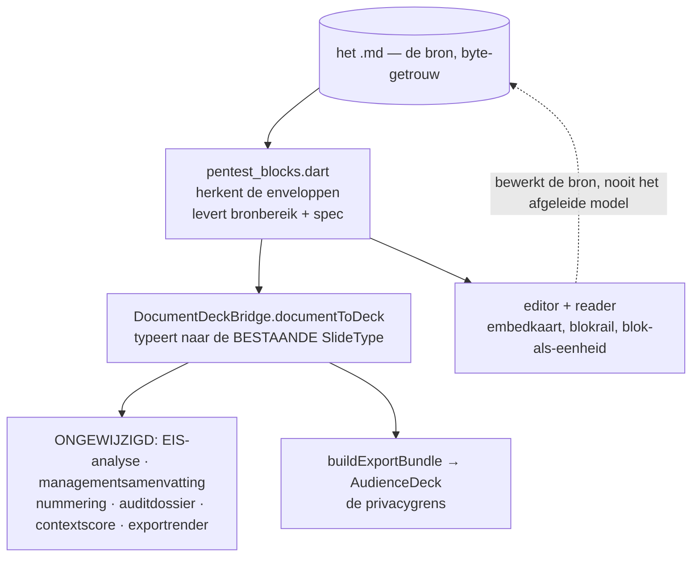
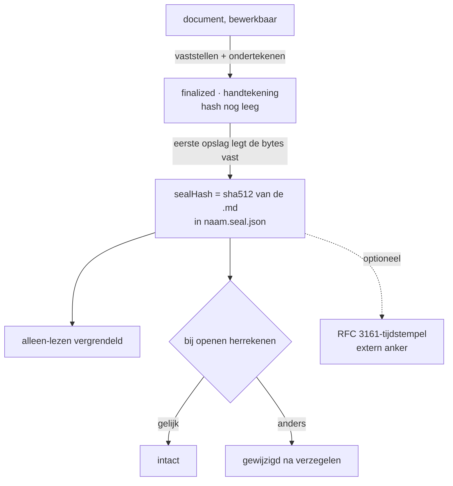

# OciDeck — De MIAUW-pentestrapportage als document (ontwerp)

> **Status:** ontwerp, Fase 0 · **Voor het laatst getoetst:** 2026-08-19 ·
> **Uitgegeven door:** Stichting LibreKAT · **In het Nederlands**, zoals
> [`OCIWACHT.md`](OCIWACHT.md) en [`VERIFICATION.md`](VERIFICATION.md)

> **Er is nog geen regel code voor geschreven.** Dit document is de
> Fase 0-oplevering: het legt het formaat, de afleiding, de vaststelling en de
> afgeleide presentaties vast *voordat* er gebouwd wordt, omdat de wijziging het
> bestandsformaat raakt.
>
> Het bouwt voort op twee bestaande ontwerpen en vervangt ze niet:
> [`PENTEST_MIAUW.md`](PENTEST_MIAUW.md) (de pentestmodule zoals hij draait, als
> presentatie) en [`DOCUMENT_MODE.md`](DOCUMENT_MODE.md) (de documentmodus en
> zijn rode lijnen). **Waar dit document en de code van elkaar verschillen, wint
> de code** — en dan hoort deze regel bijgewerkt te worden, niet genegeerd.
>
> Elke bewering over bestaande code in dit document is in de code nagekeken en
> draagt een vindplaats. Een bewering zonder vindplaats is een voorstel, geen
> beschrijving.

---

## 1. Aanleiding en opdracht

De pentestrapportage volgens **MIAUW** (Methodiek voor
Informatiebeveiligingsonderzoek met Auditwaarde) wordt in OciDeck vandaag
uitsluitend als **presentatie** geschreven. Een rapport is echter een document:
het wordt gelezen, geciteerd, ondertekend en door een auditor nagelopen.

De opdracht bestaat uit vier delen:

1. De MIAUW-rapportage wordt een **document**.
2. De losse elementen (`finding`, `findingsSummary`, `checklist`,
   `scopeMatrix`, `signOff`) **blijven bestaan voor presentaties**.
3. Een rapport met de status **ondertekend en af** kan een **presentatie van de
   hoogtepunten** opleveren: één voor management, één voor de IT'ers die de
   resultaten verwerken.
4. Dat derde punt moet doordacht zijn, niet mechanisch.

Deel 3 hangt volledig aan deel 1: de toestand "ondertekend en af" bestaat
vandaag niet voor documenten (§7). De volgorde ligt daarmee vast.

---

## 2. Uitgangspunt: dezelfde inhoud, een andere drager

Dit is de vraag die het hele ontwerp stuurt, dus hij staat vooraan.

### 2.1 De inhoud is hetzelfde

Een bevinding is in beide werelden dezelfde Markdown, met dezelfde velden,
dezelfde stabiele Engelse sectieankers en dezelfde afgeleide zwaarte.
`FindingSpec`, `ChecklistSpec` en `ScopeMatrixSpec` blijven ongewijzigd; de
EIS-analyse, de managementsamenvatting, de nummering en het auditdossier lezen
in beide werelden dezelfde gegevens.

**Dit ontwerp bouwt dus geen tweede inhoudsmodel.** Het bouwt een tweede
*drager* voor hetzelfde model. Zie §5 voor hoe.

### 2.2 Maar de drager brengt garanties mee

Drie verschillen, en geen van drieën is opmaak.

**De opslaggarantie.** Een deck wordt geserialiseerd *uit* een model —
normaliserend, en lossy op wat het niet kan voorstellen.
[`test/roundtrip_content_loss_test.dart`](../../test/roundtrip_content_loss_test.dart)
bestaat om vast te leggen wat daarbij stil verdween; de bestandskop zegt het
zelf: *"geen van deze gevallen gaf een foutmelding — dat is precies wat ze
gevaarlijk maakte"*. Een document *ís* de bytes
([`markdown_document.dart`](../../lib/models/markdown_document.dart)). Het zegel
hasht die bytes en de ontvanger controleert met `sha512sum`; op een deck betekent
opslaan dat OciDeck het bestand herschrijft. Voor een rapport met auditwaarde is
dat het verschil dat telt.

**Het apparaat.** Paginanummers om naar te verwijzen, voetnoten,
kruisverwijzingen, een inhoudsopgave, doorlopende kop en voet, wees- en
weduweregels. Een rapport wordt gelezen en geciteerd; dat zijn geen luxes. Ze
bestaan in de documentmodus en kunnen niet in een deck bestaan (§3).

**De volledigheid.** Dit weegt het zwaarst. De deckvorm ontmoedigde stilzwijgend
een deel van de *verplichte* MIAUW-inhoud: de bijlagen 4.8–4.13 (woordenlijst,
gereedschappen, ontvangen documenten met SHA1, accounts, scans, bewijsmateriaal,
checklists per norm, onbereikbare objecten) en documentbeheer, versiebeheer en
distributielijst (4.1.3–4.1.5). Als tabellen in een document zijn dat gewone
bijlagen; als dia's zijn ze onwerkbaar, dus ze werden niet gemaakt. **Het
document maakt het rapport niet anders — het maakt het compleet.**

### 2.3 De uitgebreide teksten zijn het bewijs

Een rapport is doorlopend proza, en het deckmodel draagt dat onder protest. Wat
daarvoor gebouwd moest worden:

| Wat | Waarom het bestaat |
|---|---|
| [`finding_pagination.dart`](../../lib/services/finding_pagination.dart) (334 regels) | één bronbevinding rendertijd over meerdere dia's splitsen |
| [`finding_header_metrics.dart`](../../lib/services/finding_header_metrics.dart) (341 regels) | inhoudsbewuste autofit met een leesbaarheidsvloer van 0,80 |
| `kFindingBaseFontScale` | een globale verkleining voor bevindingen (#1163) |
| [`slide_quality_analyzer_density.dart:117`](../../lib/services/slide_quality/slide_quality_analyzer_density.dart) | `finding` en `findingsSummary` zijn **vrijgesteld van de dichtheidsregels** |

Dat het model zijn eigen kwaliteitsregels moest uitzetten om het rapport niet af
te keuren, is het duidelijkste signaal: de inhoud is niet te dicht, de drager is
te klein.

**Die code verdwijnt niet.** Het gegenereerde IT-deck gebruikt echte
`finding`-dia's (§8.4) en de losse slidetypes blijven bestaan voor presentaties.
De machinerie houdt werk — ze is alleen niet langer het dragende pad voor een
rapport.

---

## 3. Afgewezen variant: één drager, meerdere weergaven

*Overwogen op 2026-08-19: laat het **maken** via dia's staan en maak alleen de
**weergave** variabel — een dia kan dan A4 zijn. Hier vastgelegd met de redenen,
zodat hij niet per ongeluk opnieuw wordt voorgesteld.*

**De beeldverhouding is niet het verschil.** Het verschil is of inhoud wordt
*geplaatst* of *stroomt*.
[`document_pagination.dart`](../../lib/services/document_pagination.dart) krijgt
gemeten blokhoogtes binnen en levert de posities waar elke pagina begint:
*"pagina k toont het venster `[offsets[k], offsets[k] + pageHeight)` van het
doorlopende document"*. Een pagina is een venster op een stroom; een dia is een
begrensde doos. Een A4-vormige doos blijft een doos.

Vier dingen blijven daardoor onbereikbaar:

1. **Doorlopen over paginagrenzen.** Een tabel hoger dan het tekstvlak loopt door
   over zoveel pagina's als nodig. Een dia schaalt of splitst — terug bij
   `finding_pagination` en de leesbaarheidsvloer van 0,80 (§2.3).
2. **Voetnoten op de pagina van hun verwijzing.** De gereserveerde ruimte hangt
   aan het blok dat de noot aanhaalt, zodat de noot meeschuift als dat blok
   opschuift. Dat vereist dat je weet waar de tekst landt — dus na het stromen.
3. **Paginanummers om naar te verwijzen** ("zie §4.7.3, p. 41"). Bij dia's is dat
   een dianummer, met een andere betekenis.
4. **Wees- en weduweregels en kop-blijft-bij-inhoud.** Alleen betekenisvol in een
   stroom.

**Bovendien is dit al beslist.** `DOCUMENT_MODE.md` §2 wijst *"a `Deck` with a
'document' boolean"* expliciet af, omdat zo'n vlag door tientallen
`switch`-plekken kruipt. De hele documentmodus staat op dat besluit.

**Wat er wél goed aan is, en wat wordt overgenomen:** het *maken* mag als dia's
voelen. Dat is iets anders dan het opslaan als deck. Zie §9, Fase 2 (A1/A2).

---

## 4. De blokgrammatica

### 4.1 Korte, draagbare markers

Vijf blokken krijgen een envelop, naar het model van de bestaande
`<!-- timeline -->`
([`document_timeline.dart:10`](../../lib/services/document_timeline.dart)) en
`<!-- toc -->`
([`table_of_contents.dart:23`](../../lib/services/table_of_contents.dart)):

| Blok | Envelop | Inhoud eronder |
|---|---|---|
| Bevinding | `<!-- finding -->` | kop + veldregels + sectiekoppen |
| Bevindingenoverzicht | `<!-- findings-summary -->` | GFM-tabel (afgeleid) |
| Checklist | `<!-- checklist -->` | GFM-tabel |
| Scopematrix | `<!-- scope -->` | GFM-tabel |
| Ondertekening | `<!-- sign-off -->` | leesbaar attestatieblok |

**Waarom een marker en geen vormherkenning.** Zonder marker zou een gewoon
document met een regel `**Scope object:** …` stil in een bevindingkaart
veranderen. Herkenning hoort een besluit van de auteur te zijn.

**Waarom een HTML-commentaar en geen Pandoc-`::: finding`.** Een fenced div staat
als letterlijke tekst in GitHub, Obsidian en elke gewone lezer; een
HTML-commentaar is overal onzichtbaar. Op de uitwisselbaarheidsladder van
`DOCUMENT_MODE.md` §4 wint het commentaar.

**Waarom geen `<!-- _class: finding -->`.** `DOCUMENT_MODE.md` §4.1 verbiedt een
document-eigen `_class`-token, en `_class` is Marps opmaakhaak — in een document
zonder Marp benoemt het iets dat er niet is. Wél: de lezer **accepteert**
`<!-- _class: … -->` als envelop, zodat een uit een deck geconverteerd rapport
meteen goed leest. Geschreven wordt altijd de korte vorm.

### 4.2 Wat er in een document verandert aan de bevinding

- **De bevindinggroep valt weg.** In een deck is een bevinding een groep dia's
  (header/detail/evidence, gekoppeld via `findingId`/`findingRole`,
  [`slide.dart:62`](../../lib/models/slide.dart)). In een document is het één
  doorlopende sectie; bewijsafbeeldingen zijn gewone `` daarbinnen. Dat is
  een vereenvoudiging, en het verklaart waarom een rapport als document logischer
  is.
- **Het kopniveau is vrij** (1–6). Een bevinding onder hoofdstuk 4.7 staat op
  `###`; de sectieankers schuiven één niveau mee. `FindingSpec.parse` moet
  daarvoor niveau-agnostisch worden — vandaag gaat hij uit van `# `.
- **De id blijft in de kop** (`F-03 · …`), zoals nu; `applyFindingPrefix` in
  [`finding_numbering.dart`](../../lib/services/finding_numbering.dart) bestaat
  al.

### 4.3 Byte-getrouwheid blijft de rode lijn

Auto-nummering en het verversen van het bevindingenoverzicht mogen in een
document **nooit stil schrijven**. Beide worden expliciete acties met een
zichtbare wijziging; de overzichtskaart toont "verouderd" wanneer de afgeleide
cijfers afwijken van wat er op schijf staat.

### 4.4 De keten van een nieuw documentblok

**Dit is de duurste alinea van dit ontwerp en de reden dat §4.5 het aantal
blokken beperkt.** Een marker is niet één regel code. De bestaande markers laten
zien wat erbij hoort, en de compiler noemt maar een deel ervan:

| # | Waar | Wat | Noemt de compiler het? |
|---|---|---|---|
| 1 | `lib/services/…` | het marker-patroon (`tocMarkerLinePattern`-achtig) | nee |
| 2 | `lib/utils/…_embed_syntax.dart` | een `md.BlockSyntax` die de marker parseert | nee |
| 3 | idem | een `Embeddable`/`BlockEmbed` met `fromMdSyntax`/`toMdSyntax` | nee |
| 4 | [`markdown_quill_codec.dart`](../../lib/utils/markdown_quill_codec.dart) | drie registraties: `blockSyntaxes`, `customElementToEmbeddable`, `customEmbedHandlers` | nee |
| 5 | [`wysiwyg_notes_field.dart`](../../lib/widgets/markdown_editor/wysiwyg_notes_field.dart) | een `EmbedBuilder` registreren | nee |
| 6 | [`markdown_visual_compatibility.dart`](../../lib/utils/markdown_visual_compatibility.dart) | een **uitzondering op `rawHtml`** | nee |
| 7 | [`document_markdown_view.dart`](../../lib/widgets/reader/document_markdown_view.dart) | een `_Kind` + parse-tak + render | deels |
| 8 | `paged_document_view` / `document_pagination` | pagineringsgegevens (hoogte, keep-with-next) | nee |
| 9 | [`document_deck_bridge.dart`](../../lib/services/document_deck_bridge.dart) | de envelop typeren (§5) | nee |
| 10 | [`privacy_scanner_fragments.dart`](../../lib/services/privacy/privacy_scanner_fragments.dart) | wat er gescand wordt | nee |

**Punt 6 is de val, en de repo is er al twee keer op gestruikeld.**
`markdownVisualLimitations` merkt élke regel met `<!--` aan als `rawHtml`, wat de
hele visuele modus terugwerpt naar brontekst. De uitzonderingen voor `<!-- toc -->`
en de tijdlijn staan er met de reden erbij: *"Zonder die uitzondering wierp één
ingevoegde inhoudsopgave het hele document terug in de brontekst"* en, over de
voetnoot, *"precies bij de functie waarvoor je hem het hardst nodig hebt"*. Een
MIAUW-rapport draagt tientallen markers. Zonder deze uitzonderingen is de
visuele editor voor het rapporttype permanent uit — het ergst denkbare stille
falen van dit ontwerp.

**Punt 2 heeft zijn eigen val**, gedocumenteerd in
[`toc_embed_syntax.dart:36`](../../lib/utils/toc_embed_syntax.dart): de embed moet
in een `p` gewikkeld worden, anders erft hij de blokopmaak van de volgende regel
— *"een marker vóór een `##`-kop werd dan zelf een kop"*.

### 4.5 Wat géén marker krijgt, en waarom

De bijlagen die MIAUW voorschrijft — gereedschappen (4.8), normen (4.3.2),
woordenlijst, accounts, scans, ontvangen documenten — worden **gewone GFM-tabellen
onder een gewone kop**. Ze krijgen geen envelop.

De reden is §4.4: een envelop kost tien aanraakpunten en bestaat alleen om
OciDeck iets met het blok te laten *doen* — een kaart tekenen, een telling
afleiden, een analyse voeden, het als eenheid verplaatsen. Een gereedschapsbijlage
hoeft alleen gedrukt te worden. Een tabel doet dat al.

**Openstaand punt.** De EIS-controles voor 4.8 en 4.3.2 lezen vandaag de
deck-front-matter (`tool`, `standards`). Zonder envelop is er niets om
machinaal te toetsen. Voorstel voor v1: die twee eisen lopen via het bestaande
**handmatige-bevestigingsmechanisme** (`miauwConfirmations`,
[`miauw_compliance_analyzer.dart`](../../lib/services/miauw_compliance_analyzer.dart)),
dat precies hiervoor bestaat — een eis die niet uit inhoud te bewijzen is, blijft
open tot een mens hem bevestigt. Blijkt dat in de praktijk te mager, dan komt er
alsnog een envelop bij. Zie §12.

---

## 5. Eén grammatica, twee consumenten

Een nieuwe zuivere service `lib/services/pentest_blocks.dart` (Flutter-vrij)
herkent de enveloppen in een documentbody en levert per blok het **bronbereik**
plus de gespecificeerde inhoud. Twee afnemers, één grammatica.

**Waarom via de bestaande `SlideType` en niet via een nieuw rapportmodel.** De
brug bestaat al en is de spil van het exportpad: de documentexport loopt vandaag
al via `documentToDeck` naar `buildExportBundle → AudienceDeck`
([`document_export_service.dart`](../../lib/services/document_export_service.dart)).
Typeren we de blokken daar, dan werken de EIS-analyse, de managementsamenvatting,
de nummering, het auditdossier en de HTML-render **ongewijzigd** — ze lezen
`Deck.slides` en krijgen precies wat ze verwachten.

**De invariant die dat veilig houdt.** De rauwe bron blijft in
`customMarkdown`/`tableRows` staan. De brug is het zero-loss-contract van de
OciWacht-projectie: élke niet-lege bronregel moet in een gescand dia-veld
belanden. Een getypeerd blok dat inhoud laat vallen, lekt stil. Daarom is de
pariteitstest (§10) niet optioneel.

**Toets bij oplevering van Fase 1:** is er een tweede `FindingSpec` ontstaan, dan
is het misgegaan.

**Eén ding past zich wél aan de drager aan: het kopniveau** (§4.2). Dat is geen
inhoudsverschil maar een gedefinieerde, omkeerbare herniveauering.

---

## 6. Rapportmetadata

Het deck legt normen en gereedschappen in de front matter vast. In een document
horen die als bijlagetabellen in het rapport zelf (§4.5) — MIAUW vraagt daar
letterlijk om, en het scheelt twee nieuwe eigen front-mattersleutels.

Wat metadata blijft, gaat naar de bestaande **vrije documentvelden**
(opdrachtgever, projectnummer, rapporteur, certificering, versie), plus `lang:`
voor de rapportagetaal — Pandoc-vocabulaire, geen eigen dialect. De
documentmodus kent vandaag vijf eigen sleutels en elke sleutel is er een die een
ander gereedschap al uitvoert
([`document_front_matter.dart:39`](../../lib/utils/document_front_matter.dart));
dat register groeit hier met hoogstens `lang`.

---

## 7. Vaststelling: ondertekenen, verzegelen, vergrendelen

### 7.1 Wat er nu niet kan

**Een document kan vandaag niet verzegeld of ondertekend worden.**
`SealRecord.of(Deck)` is deck-gebonden
([`seal_record.dart`](../../lib/models/seal_record.dart)); `DocumentState`
([`document_provider.dart`](../../lib/state/document_provider.dart)) kent geen
zegelvelden; `saveDocument`
([`file_service_open.dart:135`](../../lib/services/file/file_service_open.dart))
schrijft platte bytes zonder zegelboekhouding.

Dit is de ontbrekende schakel waar deel 3 van de opdracht op wacht.

### 7.2 Waarom het toch weinig formaatwerk is

Het zegel is **al bestandsgeoriënteerd**. De hash gaat over de bytes van de
`.md`, staat in `<naam>.seal.json` ernaast, en `sha512sum rapport.md`
reproduceert hem zonder OciDeck
([`document_integrity.dart`](../../lib/services/document_integrity.dart)). Een
document is een `.md`. Aan het formaat verandert niets; alleen aan wie het
aanroept.

`PENTEST_MIAUW.md` §8 belooft dit al als algemene OciDeck-capaciteit *"useful for
any deck"*. Die belofte is nooit voor documenten ingelost.

### 7.3 Wat er gebouwd wordt

Zegelvelden op `DocumentState`; de opslagroute die de geschreven bytes vastlegt;
de alleen-lezen-vergrendeling na vaststellen; een ondertekendialoog (de
`DocumentSignature`-modellaag is al generiek); `<naam>.seal.json` en
`<naam>.miauw.json` naast een document; het RFC 3161-pad hergebruikt; een
statusbalkbadge; en het nalevingspaneel op een documenttab, gevoed via §5.

**Poort vóór verzegelen:** geen onbeoordeelde AI-markeringen — de documentvariant
van `deckHasUnreviewedAiMarkers`. De attestatie van EIS 1.6 moet over door mensen
geverifieerde tekst gaan.

---

## 8. De afgeleide presentaties

### 8.1 Waar "dezelfde inhoud" ophoudt

§2 stelt dat document en presentatie dezelfde inhoud dragen. **Voor de
hoogtepunten-presentatie geldt dat niet.** Er ontstaan drie dingen die op elkaar
lijken:

| | Wat het is | Inhoud | Poort |
|---|---|---|---|
| **Omzetten naar presentatie** | dezelfde inhoud, andere drager | volledig, mechanisch | geen |
| **Presentatie van de hoogtepunten** | *geselecteerde* inhoud voor een doelgroep | redactionele daad | hard (§8.2) |
| Bestaand deck-rapport | oude drager, zelfde inhoud | volledig | n.v.t. |

De eerste is een verschijningsvorm: alles gaat mee, niemand kiest iets. De tweede
laat bewust dingen weg — en draagt daarom de herkomstregel (§8.6), de
privacyschakelaars (§8.7) en de harde poort.

**Gevolg voor de interface:** geen naburige menu-items met gelijkende namen, en
de omzetting krijgt **géén** "afgeleide samenvatting"-regel op de titeldia — die
is immers het volledige rapport.

### 8.2 De poort is hard

Drie condities, alle drie verplicht:

1. `finalized` — vastgesteld en vergrendeld;
2. een handtekening aanwezig en niet leeg — de waarheidsgetrouwe rapportage van
   MIAUW 1.6;
3. `IntegrityStatus.intact` — het zegel rekent daadwerkelijk uit tegen de bytes
   op schijf.

Conditie 3 is niet cosmetisch. `changed` betekent dat het bestand ná het
verzegelen is gewijzigd; daar een managementsamenvatting uit genereren zou die
wijziging witwassen. `notVerifiable` blokkeert net zo goed: een zegel dat niemand
kan narekenen draagt geen presentatie.

**Geen CONCEPT-variant en geen doorzetknop.** Een deck met "CONCEPT" erop
verliest die markering zodra iemand één dia in een andere presentatie plakt.

**Wat níet blokkeert: openstaande EIS.** Het nalevingspaneel is per ontwerp een
gatenanalyse en nooit een poort
([`miauw_compliance.dart`](../../lib/models/miauw_compliance.dart): *"A gap
analysis, never a hard gate"*). Het ondertekenen is de menselijke daad die de
verantwoordelijkheid draagt. Deze regel staat hier zodat het paneel niet
gaandeweg alsnog een slot wordt.

**Staat de knop uit**, dan zegt hij welke van de drie condities ontbreekt en hoe
je daar komt. Een uitgegrijsde knop zonder uitleg is een doodlopende weg.

### 8.3 Geen nieuwe slidetypes, geen taalmodel

De generator schrijft uitsluitend **bestaande** types: `title`, `section`,
`bullets`, `chart`, `scorecard`, `table`, `findingsSummary`, `timeline`,
`checklist` en — voor het IT-deck — gewone `finding`-dia's. Daarmee erft hij de
hele bestaande render-, paginerings- en exportketen.

De dia's **citeren** de secties van de rapporteur; ze herschrijven niets. Een
samenvatting die een taalmodel heeft geformuleerd, is niet meer wat de
ondertekenaar heeft ondertekend.

### 8.4 Managementdeck

Selectie, deterministisch en zichtbaar in de dialoog:

1. Alle **Kritiek** en **Hoog**, maximaal vijf op de voorgrond; wat afvalt komt
   op een verzameldia met de aantallen per zwaarte. **Nooit stil afkappen.**
2. Plus elke bevinding waarvan de **CIA-gewogen score hoger is dan de
   basisscore** — de klant heeft die weging zelf bij de intake opgegeven, dus dat
   is per definitie zakelijk relevant
   ([`finding_context_score.dart`](../../lib/services/finding_context_score.dart)
   levert dit al).
3. Na hertest opgeloste bevindingen gaan naar een eigen dia: goed nieuws hoort
   erin, maar niet in de top.
4. Zijn er geen kritieke of hoge bevindingen, dan toont het deck de zwaarste die
   er wél zijn én zegt dat expliciet. Nooit een lege dia.

Opbouw: titel met herkomstregel · **wat is onderzocht en wat niet** (zonder deze
dia is de conclusie niet te wegen, dus hij is niet optioneel) · zwaarteverdeling ·
wat dit betekent, geciteerd uit de *impact*-secties · top-N als kaarten zonder
vectorstrings of reproductie · grondoorzaken op CWE · wat er moet gebeuren ·
verantwoording met de narekenaanwijzing.

### 8.5 IT-deck

1. Alle bevindingen die **niet als opgelost zijn hertest**, op effectieve
   (CIA-gewogen) score, daarna op object.
2. Boven ~25 bevindingen: groeperen per grondoorzaak met een verzameldia per
   groep. Wat niet apart getoond wordt, wordt geteld en benoemd.
3. Plus checklist-afwijkingen die géén bevinding werden.
4. Plus niet-geteste en onbereikbare objecten.

Opbouw: titel · leeswijzer (het rapport is leidend, dit is de werklijst) ·
werklijst op zwaarte, één `finding`-dia per bevinding met object, CVSS 4.0,
CWE/MASWE, CVE, aanbeveling, hertest-status en de verwijzing naar het
rapportanker · grondoorzaak · object/eigenaar · checklist-afwijkingen ·
niet-getest · hertestafspraak.

Ordening is een **keuze** in de dialoog (zwaarte / grondoorzaak / object), want zo
verdelen teams het werk werkelijk.

### 8.6 Herkomst

Het gegenereerde deck wordt **nooit verzegeld** — dat zou een valse
integriteitsclaim zijn. In plaats daarvan: op de titeldia een zichtbare regel
*"Afgeleide samenvatting — het ondertekende rapport is leidend"* met
rapportversie, zegeldatum en een korte zegelhash; op de verantwoordingsdia de
volledige hash en het narekencommando. Zichtbare tekst, geen nieuwe
front-mattersleutel.

### 8.7 Privacy en classificatie

- Het afgeleide deck **erft de TLP** en kan niet lager.
- De terzijde gelegde privacybevindingen (`.dismissals.json`) reizen **niet** mee:
  "die naam hoort hier" is een oordeel over *dat* document.
- Na generatie draait de privacyscanner meteen op het nieuwe deck.
- Reproductiestappen en bewijsafbeeldingen staan **standaard uit**, met een
  expliciete schakelaar en een waarschuwing.

### 8.8 De curatiedialoog

Geen knop die stil iets uitkiest. De dialoog toont de doelgroep, de voorgestelde
selectie met per bevinding **waarom** hij is voorgesteld (aanpasbaar), de cap en
wat er dus op de verzameldia belandt, de schakelaars uit §8.7 en de ordening.
Uitkomst: één of twee **nieuwe tabbladen**; er wordt nooit een bestand
overschreven.

### 8.9 Wat er gratis bij komt

Omdat de generator op de afgeleide dekmodellaag werkt, werkt hij net zo goed op
een **bestaand deck-rapport**.

---

## 9. Fasering

Elke fase is los opleverbaar, eindigt groen en met bijgewerkte documentatie.

**Fase 0 — dit document.** Formaat, afleiding, vaststelling en generator
vastgelegd; poorttests gedefinieerd (§10); vijf rolblikken. Geen code.

**Fase 1 — grammatica en brug.** `pentest_blocks.dart`; `FindingSpec.parse`
niveau-agnostisch; `documentToDeck` uitgebreid; zero-loss- en
projectiepariteitstests; `make mutate-parsers` op de nieuwe parser.

**Fase 2 — bewerken.** De keten uit §4.4 voor vijf blokken; embedkaarten met
dubbelklik naar de **bestaande** editors; invoegmenugroep Informatieveiligheid;
de bevindingwizard levert een documentblok; expliciete acties "Bevindingen
hernummeren" en "Overzicht verversen". Plus:

- **A1 — blokrail.** Een strook links met de blokken van het rapport
  (hoofdstukken, bevindingen met id en zwaarte, checklists, scopematrix) —
  de documenttegenhanger van de diastrook, op `buildMarkdownOutline`.
- **A2 — een bevinding is een eenheid.** Verplaatsen, dupliceren en verwijderen
  over het hele blokbereik. Het bronbereik uit §5 levert de grenzen.

Let op de plafonds: `document_editor_screen.dart` staat op 943 regels,
`document_editor_toolbar.dart` op 872 — splitsen vóór de uitbreiding.

**Fase 3 — vaststelling.** §7.

**Fase 4 — render en export.** De blokken in de paginaweergave en de doorlopende
weergave; HTML via de bestaande `marp_html_service_reporting*`-render in
doorlopende modus (**geen tweede renderpad**); LaTeX; auditdossier en
auditpakket vanuit een documenttab.

**Fase 5 — sjabloon en migratie.** Documentsjabloonmechanisme (bestaat nog niet);
`miauwReport.<taal>.md` in documentvorm, 32 talen; het **deck**-sjabloon
ingetrokken; "zet dit rapport om naar een document".

De voetafdruk van het intrekken:

| Plek | Wijziging |
|---|---|
| [`deck_template.dart:706`](../../lib/models/deck_template.dart) | entry weg |
| [`new_deck_dialog.dart:158`](../../lib/widgets/dialogs/new_deck_dialog.dart) | icoonregel weg |
| `test/miauw_end_to_end_test.dart` | herschrijven naar het documentsjabloon |
| `test/deck_template_test.dart` | assertions verhuizen mee |
| `test/miauw_gating_test.dart` | gating toetsen op een ander `requiresInfoSafety`-sjabloon |
| `test/new_deck_dialog_test.dart` | modulebadge-voorbeeld wordt `dpia` |

De twaalf andere `requiresInfoSafety`-sjablonen blijven: RASCI, takenplan,
certificering, post-incident review, datalekbeoordeling, DPIA, risicoanalyse,
continuïteitstest, tabletop, auditopvolging, leveranciersbeoordeling en threat
modeling zijn sessies en overleggen — echt presentatiemateriaal.

Een deck-rapport dat ooit uit het sjabloon ontstond hangt er niet aan vast: het
opent, rendert, verifieert en exporteert ongewijzigd.

**Fase 6 — de afgeleide presentaties.** §8.

**Fase 7 — documentatie en keuring.** `USER_GUIDE(.nl)`, `FILE_FORMAT(.nl)`,
`SOURCE_MAP`, `CHANGELOG`, de statusregel van `PENTEST_MIAUW.md`; l10n voor alle
nieuwe teksten; beeldkeuring, gebruikerstest en functionele toets in meerdere
ronden.

---

## 10. Poorttests — de acceptatie van dit ontwerp

Gedefinieerd in Fase 0, geschreven in de fase waar ze bij horen.

1. **Verliesvrije rondgang per blok.** Open → geen bewerking → opslaan is
   byte-identiek, voor elk van de vijf enveloppen. Spiegelbeeld van
   `roundtrip_content_loss_test.dart`, dat documenteert wat het *deck*pad
   verliest.
2. **Een gewoon document wordt nooit een rapport.** Een `.md` zonder markers,
   inclusief een die `**Scope object:**` bevat, levert geen enkel getypeerd blok
   op.
3. **De visuele modus blijft aan.** Een document met alle vijf de enveloppen
   houdt `markdownVisualLimitations` leeg. Dit is de test die §4.4 punt 6
   bewaakt; zonder hem faalt het ontwerp stil.
4. **Projectiepariteit.** Voor elk nieuw blok: scanner, projectie en manifest
   dekken dezelfde velden — de drie lijsten die
   `privacy_scan_redact_parity_test` tegen elkaar houdt.
5. **Zero-loss van de brug.** Elke niet-lege bronregel van een rapportdocument
   belandt in een gescand dia-veld.
6. **Zegel over de bytes.** Vaststellen → opslaan → `sha512sum` van het bestand
   is gelijk aan `hash` in `<naam>.seal.json`; een bewerking daarna levert
   `changed`.
7. **De harde poort.** De generator is onbereikbaar bij elk van de drie
   ontbrekende condities uit §8.2, en bereikbaar zodra alle drie kloppen.
8. **Conversie leest de bron.** Een bevinding die rendertijd over meerdere
   pagina's splitst, levert bij conversie één documentsectie op — de conversie
   mag nooit over `expandFindingsForRender` lopen.
9. **Mutatietoets** op `pentest_blocks.dart` (`make mutate-parsers`), nul
   overlevenden.

---

## 11. Risico's

| Risico | Waarom het echt is | Wat het afvangt |
|---|---|---|
| De visuele modus valt uit | Elke `<!--`-regel telt als `rawHtml` (§4.4) | Poorttest 3 |
| Byte-getrouwheid sneuvelt | Stil hernummeren breekt het zegel én de rode lijn | §4.3; poorttest 1 |
| Zero-loss/privacy | Een getypeerd blok dat inhoud laat vallen, lekt stil | Poorttests 4 en 5 |
| Twee renderwerelden lopen uiteen | Widget-preview en HTML/SVG-export zijn aparte implementaties | Beide in dezelfde wijziging; beeldkeuring op beide |
| Conversie over de gerenderde dia's | Gedupliceerde bevindingfragmenten in het document | Poorttest 8 |
| Omzetting en hoogtepunten verward | Eén levert een onvolledig rapport bij de klant | Verschillende namen en plekken (§8.1) |
| l10n-last | 32 talen; de sjablonen alleen al zijn 32 bestanden | Per fase vertalen, niet aan het eind |
| Bestandsplafonds (1000 regels) | Drie betrokken bestanden zitten er tegenaan | Splitsen vóór de uitbreiding |
| Vals gevoel van naleving | Een documentrapport dat de EIS anders scoort dan het deck deed | EIS-checks expliciet hertoetsen tegen de nieuwe afleiding |

---

## 12. Openstaande punten

1. **EIS 4.8 en 4.3.2 zonder envelop** (§4.5): volstaat het handmatige
   bevestigingsmechanisme, of is een `<!-- tools -->`-envelop nodig?
2. **Kopniveau bij conversie** (§4.2): op welk niveau landt een bevinding uit een
   deck — vast op `###`, of afgeleid uit de hoofdstukstructuur van het sjabloon?
3. **`lang:` of `language:`** (§6): Pandoc schrijft `lang`, het deck gebruikt
   `language`. De EIS-controle moet er één lezen.
4. **De blokrail** (§9, A1): eigen strook of uitbreiding van de bestaande
   overzichtsrail?

---

## 13. Besluitenlogboek

| # | Besluit | Datum | Door |
|---|---|---|---|
| D1 | Het deck-sjabloon `miauwReport` wordt ingetrokken | 2026-08-19 | opdrachtgever |
| D2 | De poort op de afgeleide presentatie is hard; geen CONCEPT-variant | 2026-08-19 | opdrachtgever |
| D3 | De drager blijft gescheiden; §3 afgewezen | 2026-08-19 | opdrachtgever |
| D4 | Alleen blokken die OciDeck iets moet láten doen krijgen een envelop | 2026-08-19 | ontwerp, §4.5 |
