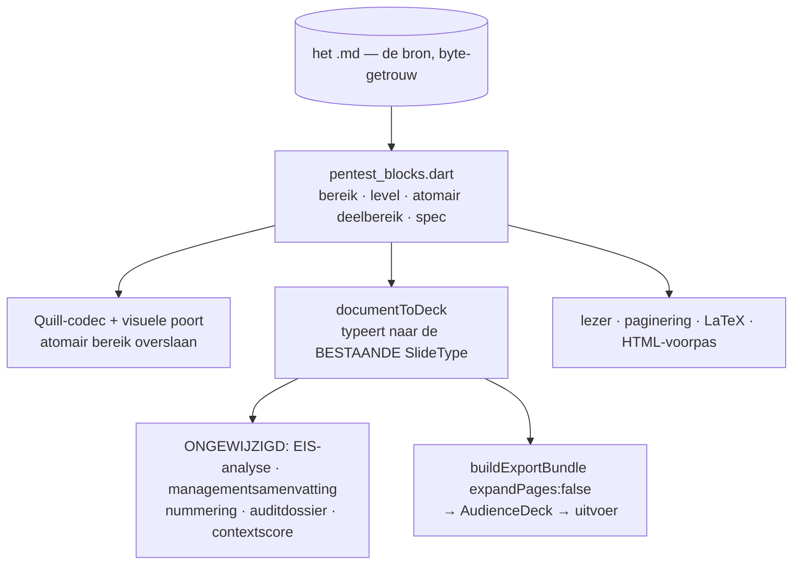

# OciDeck — De MIAUW-pentestrapportage als document (ontwerp)

> **Status:** ontwerp, Fase 0 · **Versie 2**, na een toetsingsronde ·
> **Voor het laatst getoetst:** 2026-08-19 · **Uitgegeven door:** Stichting
> LibreKAT · **In het Nederlands**, zoals [`OCIWACHT.md`](OCIWACHT.md) en
> [`VERIFICATION.md`](VERIFICATION.md)

> **Er is nog geen regel code voor geschreven.** Dit is de Fase 0-oplevering:
> formaat, afleiding, vaststelling en de afgeleide presentaties liggen vast
> *voordat* er gebouwd wordt, omdat de wijziging het bestandsformaat raakt.
>
> Bouwt voort op [`PENTEST_MIAUW.md`](PENTEST_MIAUW.md) (de module zoals hij
> draait, als presentatie) en [`DOCUMENT_MODE.md`](DOCUMENT_MODE.md) (de
> documentmodus en zijn rode lijnen). **Waar dit document en de code van elkaar
> verschillen, wint de code** — en dan hoort deze regel bijgewerkt te worden,
> niet genegeerd.
>
> Elke bewering over bestaande code is nagekeken tegen **main** en draagt een
> vindplaats. Een bewering zonder vindplaats is een voorstel.

> **Wat versie 2 veranderde.** Twaalf blikken (vijf feitentoetsers, vijf
> vakrollen, twee tegenspraakronden) leverden 161 bevindingen, waarvan 40
> blokkerend. De zes die het ontwerp echt hebben omgegooid:
>
> 1. Versie 1 las de codebase in een werkboom met ongecommit werk van een andere
>    sessie en nam aan dat TLP voor documenten bestond. Op main bestond het toen
>    niet. **Inmiddels wél**: `codex/document-tlp` is als #1585 geland terwijl
>    dit ontwerp werd geschreven. Zie §4.2 — de kloof is dicht, maar de
>    privacytriage (§4.3) staat nog open, en dat was in versie 1 helemaal niet
>    benoemd.
> 2. De handtekening stond in de sidecar, **buiten de gehashte bytes**. Naam,
>    rol en certificering waren dus te vervangen zonder dat `sha512sum` iets
>    merkte — terwijl versie 1 daar een harde poort op bouwde. Zie §8.3.
> 3. `ProvenanceSignature` (Ed25519) bestáát op main, met eigen dienst en eigen
>    ontwerpdoc. Versie 1 noemde het nergens. Zie §8.2.
> 4. De prozablokken hadden **geen eindgrens**. Zie §5.2.
> 5. De vrijstelling voor de visuele modus was te grof geformuleerd; overslaan
>    zonder atomiciteit is stille corruptie in plaats van een terugval. Zie §5.5.
> 6. De documentexport **klapt dia's uit**, dus de duplicatie die versie 1 bij
>    Fase 5 verwachtte, slaat al in Fase 1 toe. Zie §6.3.
>
> Twee bestaande fouten op main kwamen bovendrijven die los gemeld worden en
> niets met dit ontwerp te maken hebben. Zie §15.

---

## 1. Aanleiding en opdracht

De pentestrapportage volgens **MIAUW** (Methodiek voor
Informatiebeveiligingsonderzoek met Auditwaarde) wordt vandaag uitsluitend als
**presentatie** geschreven. Een rapport is echter een document: het wordt
gelezen, geciteerd, ondertekend en door een auditor nagelopen.

1. De MIAUW-rapportage wordt een **document**.
2. De losse elementen (`finding`, `findingsSummary`, `checklist`,
   `scopeMatrix`, `signOff`) **blijven bestaan voor presentaties**.
3. Een rapport met de status **ondertekend en af** kan een **presentatie van de
   hoogtepunten** opleveren: één voor management, één voor de IT'ers die de
   resultaten verwerken.
4. Dat derde punt moet doordacht zijn, niet mechanisch.

Deel 3 hangt volledig aan deel 1 én aan §4: de toestand "ondertekend en af"
bestaat vandaag niet voor documenten.

---

## 2. Uitgangspunt: dezelfde inhoud, een andere drager

### 2.1 De inhoud is hetzelfde

Een bevinding is in beide werelden dezelfde Markdown, met dezelfde velden,
dezelfde stabiele Engelse sectieankers en dezelfde afgeleide zwaarte.
`FindingSpec`, `ChecklistSpec` en `ScopeMatrixSpec` blijven het enige
inhoudsmodel; de EIS-analyse, de managementsamenvatting, de nummering en het
auditdossier lezen in beide werelden dezelfde gegevens.

**Dit ontwerp bouwt geen tweede inhoudsmodel.** Het bouwt een tweede *drager*.
Toets bij oplevering van Fase 1: is er een tweede `FindingSpec` ontstaan, dan is
het misgegaan.

### 2.2 Maar de drager brengt garanties mee

**De opslaggarantie.** Een deck wordt geserialiseerd *uit* een model —
normaliserend, en lossy op wat het niet kan voorstellen.
[`test/roundtrip_content_loss_test.dart`](../../test/roundtrip_content_loss_test.dart)
legt vast wat daarbij stil verdween; de bestandskop zegt het zelf: *"geen van
deze gevallen gaf een foutmelding — dat is precies wat ze gevaarlijk maakte"*.
Een document *ís* de bytes
([`markdown_document.dart`](../../lib/models/markdown_document.dart)). Het zegel
hasht die bytes en de ontvanger controleert met `sha512sum`.

**Het apparaat.** Paginanummers om naar te verwijzen, voetnoten,
kruisverwijzingen, een inhoudsopgave, doorlopende kop en voet, wees- en
weduweregels. Ze bestaan in de documentmodus en kunnen niet in een deck bestaan
(§3).

**De volledigheid.** Dit weegt het zwaarst. De deckvorm ontmoedigde stilzwijgend
een deel van de *verplichte* MIAUW-inhoud: de bijlagen 4.8–4.13 (woordenlijst,
gereedschappen, ontvangen documenten met SHA1, accounts, scans, bewijsmateriaal,
checklists per norm, onbereikbare objecten) en documentbeheer, versiebeheer en
distributielijst (4.1.3–4.1.5). Als tabellen in een document zijn dat gewone
bijlagen; als dia's zijn ze onwerkbaar, dus ze werden niet gemaakt. **Het
document maakt het rapport niet anders — het maakt het compleet.**

### 2.3 De uitgebreide teksten zijn het bewijs

Een rapport is doorlopend proza, en het deckmodel draagt dat onder protest:

| Wat | Waarom het bestaat |
|---|---|
| [`finding_pagination.dart`](../../lib/services/finding_pagination.dart) | één bronbevinding rendertijd over meerdere dia's splitsen |
| [`finding_header_metrics.dart`](../../lib/services/finding_header_metrics.dart) | inhoudsbewuste autofit met een leesbaarheidsvloer |
| `kFindingBaseFontScale` | een globale verkleining voor bevindingen (#1163) |
| [`slide_quality_analyzer_density.dart`](../../lib/services/slide_quality/slide_quality_analyzer_density.dart) | `finding` en `findingsSummary` zijn **vrijgesteld van de dichtheidsregels** |

Dat het model zijn eigen kwaliteitsregels moest uitzetten om het rapport niet af
te keuren, is het signaal: de inhoud is niet te dicht, de drager is te klein.

Die code verdwijnt niet — het gegenereerde IT-deck gebruikt echte
`finding`-dia's (§9.4) en de slidetypes blijven bestaan voor presentaties. Ze is
alleen niet langer het dragende pad voor een rapport.

---

## 3. Afgewezen variant: één drager, meerdere weergaven

*Overwogen op 2026-08-19: laat het **maken** via dia's staan en maak alleen de
**weergave** variabel — een dia kan dan A4 zijn. Hier vastgelegd met de redenen.*

**De beeldverhouding is niet het verschil.** Het verschil is of inhoud wordt
*geplaatst* of *stroomt*.
[`document_pagination.dart`](../../lib/services/document_pagination.dart) krijgt
gemeten blokhoogtes binnen en levert de posities waar elke pagina begint:
*"pagina k toont het venster `[offsets[k], offsets[k] + pageHeight)` van het
doorlopende document"*. Een pagina is een venster op een stroom; een dia is een
begrensde doos. Een A4-vormige doos blijft een doos.

Onbereikbaar in een doos: doorlopen over paginagrenzen; voetnoten op de pagina
van hun verwijzing (de gereserveerde ruimte hangt aan het blok dat de noot
aanhaalt, dus je moet weten waar de tekst landt); paginanummers om naar te
verwijzen; wees- en weduweregels.

**Bovendien is dit al beslist.** `DOCUMENT_MODE.md` §2 wijst *"a `Deck` with a
'document' boolean"* expliciet af, omdat zo'n vlag door tientallen
`switch`-plekken kruipt.

**Wat er wél goed aan is:** het *maken* mag als dia's voelen. Zie §10, Fase 2.

---

## 4. Wat een document vandaag níet kan

Versie 1 noemde hier alleen het zegel. Het waren er drie; §4.2 is inmiddels
gedicht door #1585, §4.1 en §4.3 staan nog open. Samen bepalen ze de volgorde
van de fasering. **Zolang §4.3 openstaat is het rapport als document op het punt
van privacybeheersing een verslechtering ten opzichte van vandaag** — dat is de
reden dat D1 (het deck-sjabloon intrekken) pas in Fase 5 landt en niet eerder,
en dat de exportpoort uiterlijk in Fase 4 moet staan.

### 4.1 Niet verzegeld of ondertekend worden

`SealRecord.of(Deck)` is deck-gebonden
([`seal_record.dart`](../../lib/models/seal_record.dart)); `DocumentState`
([`document_provider.dart`](../../lib/state/document_provider.dart)) kent geen
zegelvelden; `saveDocument`
([`file_service_open.dart`](../../lib/services/file/file_service_open.dart))
schrijft platte bytes zonder zegelboekhouding.

Erger dan versie 1 dacht: de opslagroute keert terug op `!state.isDirty`
([`document_save_actions.dart`](../../lib/widgets/shell/document_save_actions.dart)).
Verzegelen verandert géén bronbyte, dus de vlag blijft vals en er zou nooit iets
geschreven worden — geen `.seal.json`, `sealHash` eeuwig leeg, status eeuwig
`notVerifiable`. Zie §8.4.

### 4.2 TLP — inmiddels opgelost door #1585

*Deze paragraaf beschreef een gat. Het is gedicht terwijl dit ontwerp werd
geschreven, en hij blijft staan omdat de rest van het ontwerp erop leunt.*

Bij het schrijven van versie 1 telde `kDocumentOwnedKeys` vier sleutels en zat
`tlp` er niet bij; `buildDocumentExportBundle` had geen `tlp`- en geen
`fields`-parameter, dus front matter bereikte de afgeleide `Deck` niet.

Sinds #1585 (*Documentvelden en TLP in kop en voet*) is dat alle drie geregeld:
`tlp` is de vijfde documentsleutel
([`document_front_matter.dart`](../../lib/utils/document_front_matter.dart)),
`buildDocumentExportBundle` neemt `tlp` en `fields` aan
([`document_export_service.dart`](../../lib/services/document_export_service.dart)),
en de documentvelden worden gescand én geprojecteerd
([`privacy_scanner_fragments.dart`](../../lib/services/privacy/privacy_scanner_fragments.dart)).

TLP is een FIRST-standaard, geen OciDeck-vinding, dus de sleutel past binnen de
regel van `FILE_FORMAT.md` §14.1 dat OciDeck zich bij een bestaand vocabulaire
mag aansluiten maar er geen eigen mag verzinnen.

**Gevolg voor dit ontwerp:** de erfregel in §9.7 heeft nu een drager en is geen
voorwaardelijke belofte meer. §7 kan op de vrije documentvelden bouwen.

### 4.3 Geen privacytriage

De documentexportdialoog biedt wél het profiel (volledig / geredigeerd)
([`document_export_dialog.dart`](../../lib/widgets/dialogs/document_export_dialog.dart))
maar géén `PrivacyExportPolicy`-poort; het deckpad heeft die op twee plekken
([`app_shell_main_layout.dart`](../../lib/widgets/app_shell_main_layout.dart),
[`export_dialog.dart`](../../lib/widgets/dialogs/export_dialog.dart)). Het
privacypaneel, de per-dia dispositie en het terzijdeleggen dat
`.dismissals.json` vult hangen allemaal aan `deckProvider` en bestaan in de
documentmodus niet.

Netto zou dit ontwerp het artefact dat per definitie buitgemaakte gegevens
bevat, verhuizen naar de modus met de minste controle. **De exportpoort op de
documentdialoog is daarom niet onderhandelbaar vóór Fase 5.** Paneel en
dispositie volgen in Fase 3.

---

## 5. De blokgrammatica

### 5.1 Vijf enveloppen

Naar het model van `<!-- timeline -->`
([`document_timeline.dart`](../../lib/services/document_timeline.dart)) en
`<!-- toc -->` ([`table_of_contents.dart`](../../lib/services/table_of_contents.dart)):

| Blok | Envelop | Vorm | Begrenst zichzelf? |
|---|---|---|---|
| Bevinding | `<!-- finding -->` | kop + veldregels + secties | nee → §5.2 |
| Ondertekening | `<!-- sign-off -->` | kop + attestatievelden | nee → §5.2 |
| Bevindingenoverzicht | `<!-- findings-summary -->` | GFM-tabel | ja |
| Checklist | `<!-- checklist -->` | GFM-tabel | ja |
| Scopematrix | `<!-- scope -->` | GFM-tabel | ja |

**Waarom een marker en geen vormherkenning.** Zonder marker zou een gewoon
document met `**Scope object:** …` stil in een bevindingkaart veranderen.
Herkenning hoort een besluit van de auteur te zijn.

**Waarom een HTML-commentaar en geen Pandoc-`::: finding`.** Een fenced div
staat als letterlijke tekst in GitHub, Obsidian en elke gewone lezer.

**Waarom geen `<!-- _class: finding -->`.** `DOCUMENT_MODE.md` §4.1 verbiedt een
document-eigen `_class`-token, en `_class` is Marps opmaakhaak. De lezer
**accepteert** hem wel als envelop, zodat een uit een deck geconverteerd rapport
meteen goed leest; geschreven wordt altijd de korte vorm.

### 5.2 De eindgrens: kopniveau-begrensd

**Besluit D5.** De markerregel staat direct vóór een ATX-kop. Het blok loopt
vanaf die kopregel tot (exclusief) de eerstvolgende kop van **gelijk of hoger**
niveau, of tot het einde van de body. De marker draagt geen inhoud en heeft geen
partner: hij wijst de kop áán die eronder staat.

De drie tabelgedragen enveloppen hebben deze regel niet nodig — die begrenzen
zichzelf al, zoals de tijdlijn. Voor `sign-off` betekent hij één lichte eis: het
attestatieblok krijgt een kop.

**Waarom niet een sluitmarker `<!-- /finding -->`.** Omdat er dan iets is om
synchroon te houden, en in een gewone teksteditor loopt dat uit de pas. Vier
breukvlakken:

1. Een weesmarker (openingsmarker weg, sluiter blijft) zou de hele visuele modus
   uitzetten — het stille falen uit §5.5.
2. De Delta kent geen paar: één Backspace in de visuele editor kan de balans
   breken. Dat is precies waarom de tijdlijn atomair is.
3. De atomaire uitweg maakt de héle bevindingsectie een onbewerkbare blob.
4. De LaTeX- en HTML-voorpassen zouden onbalans kunnen doorgeven aan DOMPurify;
   een afgeleide eindgrens is per constructie totaal (een sectie eindigt altijd:
   bij de volgende kop, of bij EOF).

**En het past op wat er al staat.**
[`document_deck_bridge.dart`](../../lib/services/document_deck_bridge.dart)
splitst vandaag al op koppen: elke kop flusht de flow en begint een nieuwe
accumulator. De enveloptak komt vóór de koptak te staan, exact zoals de
tijdlijntak vandaag vóór de tabeltak staat. Geen botsing — de kopsplitsing is de
terugval die een specifiekere tak mag pre-empten.

**De eerlijke tegenwerping.** De grens is impliciet: een kop van gelijk niveau
binnen een bevinding sluit hem af. Dat is zichtbaar in de lezer en in de blokrail
(§10, A1), en elke handmatige verminking degradeert netjes in plaats van stil
kapot te gaan. Poorttest 2 bewaakt dat.

### 5.3 Het kopniveau reist mee — het wordt niet genormaliseerd

**Besluit D6.** Overwogen en **verworpen**: de grammatica elk blok naar
kopniveau 1 normaliseren zodat `FindingSpec.parse` ongewijzigd blijft. Dat loopt
stuk op de terugweg. `_slideBody` geeft de `customMarkdown` **verbatim** terug,
en juist die tekst is de geleverde body (`projectedDocumentBody` =
`deckToDocumentMarkdown(bundle.audience.deck)`). Zonder exacte inverse staat de
bevinding op `#` in de geëxporteerde `.md`, in de HTML, in de gegenereerde
inhoudsopgave en als `\section` in LaTeX, terwijl `buildMarkdownOutline` op de
bron het juiste niveau blijft tonen — twee waarheden over hetzelfde blok.

Dus: het niveau is een **gemeten eigenschap van de bron**, nergens opgeslagen.

- `pentest_blocks.dart` levert per blok bereik + `level`, gelezen uit de kopregel.
- `FindingSpec` krijgt één veld `level` met standaard `1`. `_reHeading` wordt
  `^(#{1,6})\s+(.*)$`; sectieherkenning wordt **relatief**: een kop dieper dan
  `level` is een sectiekop, een kop op `level` of ondieper beëindigt het blok —
  dezelfde regel als §5.2, één keer opgeschreven.
- `toMarkdown` schrijft `'#' * level` en `'#' * (level + 1)`.
- Standaard 1 betekent dat het hele deckpad **geen byte verandert**.
- `_repHeading` in de HTML-rapportagerender wordt verbreed naar `^#{1,6}\s+` —
  die leest alleen de titeltekst, dus dat is een verbreding zonder gevolg.
- **Geen niveauveld op `Slide`**: dat zou een documentgegeven door het deckmodel
  en de privacyprojectie laten kruipen.

Hieruit volgt het antwoord op een openstaand punt van versie 1: een bevinding die
uit een deck wordt omgezet krijgt het niveau van zijn *plek* — de diepte van de
kop waaronder hij landt, plus één.

### 5.4 De keten van een nieuw documentblok

Een marker is niet één regel code, en de compiler noemt geen van deze plekken:

| # | Waar | Wat |
|---|---|---|
| 1 | `lib/services/pentest_blocks.dart` | het marker-patroon en de grensregel |
| 2 | `lib/utils/pentest_block_embed_syntax.dart` | een `md.BlockSyntax` + `BlockEmbed` per marker |
| 3 | [`markdown_quill_codec.dart`](../../lib/utils/markdown_quill_codec.dart) | drie registraties: `blockSyntaxes` (vóór de HTML-blokregel), `customElementToEmbeddable`, `customEmbedHandlers` |
| 4 | [`wysiwyg_notes_field.dart`](../../lib/widgets/markdown_editor/wysiwyg_notes_field.dart) | een `EmbedBuilder` registreren |
| 5 | [`markdown_visual_compatibility.dart`](../../lib/utils/markdown_visual_compatibility.dart) | het atomaire bereik overslaan (§5.5) |
| 6 | [`document_markdown_view.dart`](../../lib/widgets/reader/document_markdown_view.dart) | een parse-tak + render |
| 7 | `paged_document_view` / `document_pagination` | pagineringsgegevens (hoogte, keep-with-next) |
| 8 | [`document_deck_bridge.dart`](../../lib/services/document_deck_bridge.dart) | de envelop typeren (§6) |
| 9 | [`privacy_scanner_fragments.dart`](../../lib/services/privacy/privacy_scanner_fragments.dart) | wat er gescand wordt |
| 10 | [`markdown_to_latex.dart`](../../lib/services/latex/markdown_to_latex.dart) + `marp_html_service_markup.dart` | de bron-voorpassen |

Punt 2 heeft een gedocumenteerde val: de embed moet in een `p` gewikkeld worden
([`toc_embed_syntax.dart`](../../lib/utils/toc_embed_syntax.dart)), anders erft
hij de blokopmaak van de volgende regel — *"een marker vóór een `##`-kop werd dan
zelf een kop"*. De marker staat hier per constructie vóór een kop, dus die val
is gegarandeerd raak.

### 5.5 De visuele modus: atomair gedragen, niet "envelop herkend"

**Besluit D7.** `markdownVisualLimitations` wordt blokbewust, met deze regel:
**een regelbereik dat de Quill-codec als één atomaire embed draagt wordt
overgeslagen; al het andere wordt gescand zoals nu.**

Dat is scherper dan "binnen een envelop niet scannen", en het verschil is het
hele punt. `DeltaToMarkdown` escapet standaard elk leesteken en
`_normalizeQuillOutput` haalt die escapes buiten tabelregels weer weg. Een
`\## Kop` uit `escapeSectionBody` komt er dus als `## Kop` uit, wordt bij het
herladen een échte sectiekop, en alles eronder verhuist naar een ander veld. Een
vrijstelling zonder atomiciteit verruilt een zichtbare terugval voor **stil
tekstverlies** — het ergste dat deze functie kan doen.

Wat er dus atomair reist, en wat niet:

| Blok | Atomair | Gewone bewerkbare Markdown |
|---|---|---|
| Bevinding | **de kop**: envelopregel + `#`-kop + de `**Veld:**`-regels tot de eerste sectiekop, als `x-embed-finding-head` met de rauwe bron in `data` | de vier sectieteksten — die moeten stromen, pagineren en afbeeldingen dragen |
| Ondertekening | het hele blok (het is een formulier, geen doorlopend proza) | — |
| De drie tabelblokken | het hele blok, tijdlijnmodel | — |

Daarmee valt de ` ` uit `_encodeInline` (de hertestnotitie) per constructie
binnen het atomaire kopbereik en is hij geen breker meer.

Voor de sectieteksten verdwijnt de ontsnapping in plaats van te worden
vrijgesteld: `escapeSectionBody` wordt niveaubewust en escapet alleen nog een
regel die op **precies** het ankerniveau staat én als bekend anker leest. Een
bevinding op `###` heeft ankers op `####`; een `#####`-kop in de beschrijving is
gewoon inhoud. In de praktijk wordt er in een document dus geen `\#` meer
geschreven. Typt een auteur toch letterlijk `#### Mogelijke impact` in zijn
beschrijving, dan valt de editor terug op brontekst — eerlijk en zonder schade.
`_unescapeSectionBody` blijft ruim, zodat bestaande bestanden gewoon inlezen.

**Twee dingen die hierbij horen en makkelijk vergeten worden.**

- De vrijstelling voor de markerregel is **onvoorwaardelijk per regel** (het
  toc-model), niet voorwaardelijk op welgevormdheid zoals bij de tijdlijn. Een
  half gesloopte envelop mag nooit alsnog de hele visuele modus uitzetten.
- `markdownVisualLimitations` draait **per toetsaanslag** over de hele
  documenttekst, vanuit meerdere plekken in de editor. Daarom een lineaire
  regelpas en geen `md.Document`-parse, en daarom moet de uitkomst gememoïseerd
  worden op de tekstidentiteit. Anders is dit een tikvertraging in plaats van een
  randgeval.

### 5.6 Byte-getrouwheid blijft de rode lijn

Auto-nummering en het verversen van het bevindingenoverzicht mogen **nooit stil
schrijven**. Beide worden expliciete acties met een zichtbare wijziging; de
overzichtskaart toont "verouderd" wanneer de afgeleide cijfers afwijken van wat
er op schijf staat.

**Let op wat hernummeren vandaag doet:** `renumberFindings` past niet de id aan
maar herserialiseert de bevinding volledig uit `toMarkdown()`. Alles wat de spec
niet kent verdwijnt daarbij — `unknownSectionTitles` bewaart alleen de titels,
niet de inhoud. In een deck was dat onwaarschijnlijk; in een document, waar dit
ontwerp de auteur juist uitnodigt vrij te schrijven, is een `## Notes` onder een
bevinding de normale schrijfwijze. **Besluit D8:** hernummeren in een document
raakt uitsluitend de kopregel (de `F-NN`-prefix), nooit de rest van het
bronbereik.

### 5.7 Wat géén envelop krijgt

De MIAUW-bijlagen — gereedschappen (4.8), normen (4.3.2), woordenlijst,
accounts, scans, ontvangen documenten — worden **gewone GFM-tabellen onder een
gewone kop**. Een envelop kost tien aanraakpunten (§5.4) en bestaat alleen om
OciDeck iets met het blok te laten *doen*. Een bijlage hoeft alleen gedrukt te
worden.

**Gevolg voor de EIS-controles.** 4.8 en 4.3.2 lezen vandaag de
deck-front-matter (`tool`, `standards`). Zonder envelop is er niets machinaals
te toetsen, dus die twee lopen via het bestaande
**handmatige-bevestigingsmechanisme** (`miauwConfirmations`), dat precies
hiervoor bestaat: een eis die niet uit inhoud te bewijzen is, blijft open tot
een mens hem bevestigt. Blijkt dat te mager, dan komt er alsnog een envelop bij.

---

## 6. Eén grammatica, meerdere consumenten

### 6.1 Het contract

`lib/services/pentest_blocks.dart` (zuiver, Flutter-vrij) levert per envelop:
`start`, `end` (de grens uit §5.2), `level` (§5.3), het **atomaire deelbereik**
(§5.5) en de gespecificeerde inhoud. Het is de **enige** plek met de grensregel;
alle tien afnemers uit §5.4 roepen hem aan in plaats van zelf te scannen.

Dat is geen nieuwe uitvinding maar het opschalen van wat er al staat:
`isDocumentTimelineEnvelope` wordt vandaag al gedeeld door de codec, de scanner
en de brug — alleen herhalen die drie de *extent*-lus elk apart, en dat is
precies de drift die deze functie wegneemt.

### 6.2 Wie bezit de markerregel

**Besluit D9.** De markerregel is **bronbezit** en blijft in `customMarkdown`,
zoals de tijdlijnmarker dat doet. De deckschrijver stript hem op het moment dat
hij een `_class`-token schrijft; de geprojecteerde `.md` houdt hem. Zonder deze
regel komen er bij "omzetten naar presentatie" twee enveloppen op elkaar te
staan. Poorttest 6 bewaakt het.

### 6.3 De dia-uitklap gaat uit op het documentpad

**Besluit D10.** `buildExportBundle` krijgt `required bool expandPages`, direct
naast het bestaande `includeDetail` — hetzelfde patroon in dezelfde vorm. Het
deckpad geeft `true`, het documentpad `false`. **Geen standaardwaarde:**
`required` dwingt de derde aanroeper die er ooit komt om de vraag te beantwoorden.

Waarom dit niet kan wachten: `_expandForExport` =
`expandRichTextForRender(expandFindingsForRender(...))` draait **onvoorwaardelijk
vóór de projectie**, en het documentpad loopt daar dwars doorheen. Zodra §6.1 een
blok als `SlideType.finding` typeert, splitst de export elke lange bevinding in N
dia's en naait `deckToDocumentMarkdown` ze achter elkaar — bevindingfragmenten
met `(i/N)`-koppen in de uitgeleverde `.md`, HTML én LaTeX. De duplicatie die
versie 1 bij Fase 5 verwachtte, slaat dus al in Fase 1 toe.

**Waarom een parameter en geen eigen bundelbouwer.** Een tweede bouwer zou de
projectiegrens dupliceren, en juist die grens is wat
`make check-audience-boundary` bewaakt. Een filter achteraf in
`deckToDocumentMarkdown` verhelpt alleen de zichtbare verdubbeling: de scan, het
redactiemanifest en de privacysamenvatting zouden nog over N identieke kopieën
lopen, met manifest-entries op dia-indexen die in het geëxporteerde document niet
bestaan.

### 6.4 De terugweg moet de tabelblokken kennen

`_slideBody` leest `tableRows` alleen voor `SlideType.table`. De drie
tabelgedragen enveloppen zijn `backedByTable` maar geen `table`, dus ze vallen in
de `default`-tak en verliezen hun tabel. **Besluit D11:** een pentestblok houdt
áltijd zijn rauwe bron in `customMarkdown` en `tableRows` is puur
schaduwstructuur — precies zoals de tijdlijn het doet. Dat is meteen de
duurzame vorm; de tak op `backedByTable` zou hetzelfde probleem bij het volgende
type terugbrengen.

*Dit raakt ook een bestaande fout op main — zie §15.*

### 6.5 De invariant

De rauwe bron blijft in `customMarkdown`. De brug is het zero-loss-contract van
de OciWacht-projectie: élke niet-lege bronregel moet in een gescand dia-veld
belanden. Een getypeerd blok dat inhoud laat vallen, lekt stil. Poorttests 4 en
5 zijn daarom niet optioneel.

---

## 7. Rapportmetadata

De bijlagen die MIAUW gedrukt wil zien, staan als tabellen in het rapport (§5.7).
Wat metadata blijft, gaat naar de vrije documentvelden (opdrachtgever,
projectnummer, rapporteur, certificering, versie) plus `lang:`
(Pandoc-vocabulaire) voor de rapportagetaal.

**Twee dingen die daarvoor eerst moesten bestaan** — dat
`buildDocumentExportBundle` de front matter meekrijgt, en dat de documentvelden
door scanner en projectie gaan zoals de deckvelden — **zijn geregeld door #1585**
(§4.2). Dit ontwerp bouwt daarop; het bouwt ze niet zelf.

---

## 8. Vaststelling

### 8.1 Wat het zegel bewijst — en wat niet

Dit is de belangrijkste paragraaf voor een rapport met auditwaarde, en versie 1
had hem niet. Drie gescheiden lagen:

| Laag | Wat het staaft | Wat het níet staaft |
|---|---|---|
| **Integriteit** — SHA-512 over de bytes van de `.md`, in `<naam>.seal.json` | dat dit bestand niet is gewijzigd sinds het verzegelen | wie het schreef |
| **Tijd** — RFC 3161-token van een tijdstempeldienst | dat de inhoud vóór dat moment bestond | de inhoud zelf, en OciDeck controleert alleen de imprint — geen CMS, geen certificaatketen |
| **Auteurschap** — `ProvenanceSignature`, Ed25519 over het zegel | dat de houder van een **vooraf vastgelegde** sleutel tekende | auteurschap bij een niet-vastgelegde sleutel; de sleutel reist zelf mee |

Wie de `.md` bewerkt en opnieuw verzegelt, krijgt een kloppend zegel. De
garantie is **tamper-evidence, geen tamper-proof**.

**Woordenlijst, bindend voor interface, sjabloontekst en gidsen.** Niet te
gebruiken: "onweerlegbaar", "bewijskracht", "rechtsgeldig", "non-repudiation",
en geen enkele suggestie van eIDAS. Dit spiegelt de eis die
[`PROVENANCE_SIGNATURE.md`](PROVENANCE_SIGNATURE.md) al stelt: een zelf
gegenereerde Ed25519-sleutel zonder identiteitsbinding door een derde is geen
geavanceerde en geen gekwalificeerde elektronische handtekening.

### 8.2 Herkomstbewijs voor documenten

**Besluit D12.** `ProvenanceSignature` bestaat op main met eigen dienst en
sidecarveld. Voor pentestdocumenten wordt hij **aangeboden, niet verplicht**:
verplichtstelling zou een sleutelbeheerproces eisen dat OciDeck niet heeft, en
zonder vooraf vastgelegde vingerafdruk voegt hij voor de ontvanger niets toe.
Het documentpad krijgt hem in Fase 3 langs dezelfde route als het deckpad.

### 8.3 De verklaring staat in de body, onder de hash

**Besluit D13, en dit is de zwaarste correctie op versie 1.** De
`<!-- sign-off -->`-blok ín de `.md` is de **dragende** vorm van de verklaring:
naam, rol, certificering, datum en verklaringstekst. De sidecar draagt hooguit
een kopie.

Waarom: `DocumentSignature` staat in `<naam>.seal.json`, dus **buiten de
gehashte bytes**, en ook het herkomstbewijs tekent hem niet mee. Naam, rol en
certificering waren daarmee te vervangen zonder dat één controle afgaat, terwijl
`sha512sum rapport.md` netjes blijft kloppen. Versie 1 bouwde daar een harde
poort op — dan is het een gat.

**Gevolg:** poortconditie 2 (§9.2) en de EIS 1.6-controle lezen het geparste
blok, niet het sidecarveld. En: het blok is **leesbare tekst, nooit een
afbeelding**. Een getekende handtekening als `data:`-URI in de `.md` zou base64
in het bestand zetten, en dat is uitgesloten — juist die grens is de reden dat
het zegel zonder canonicalisatiespec werkt.

### 8.4 De opslagroute wijkt af van de deckroute

Drie regels, en ze volgen alle drie uit §4.1:

1. **Verzegelen vereist een bestaand pad.** Anders eerst "Opslaan als…".
2. **De zegelhash wordt bij het verzegelen berekend**, uit `document.source` —
   niet ná het schrijven. Bij een deck kan dat niet (het opslaan verplaatst
   afbeeldingen en grafiekdata, dus de bytes op schijf zijn niet de bytes die je
   vooraf zou hashen); bij een document *is* de bron de bytes. Het
   "hash-bestaat-pas-na-opslaan"-venster hoeft voor documenten dus niet te
   bestaan.
3. **De sidecar schrijven is een eigen route**, niet gepoort op `isDirty` van de
   bron. "Bron gewijzigd" en "zijspan gewijzigd" worden expliciet gescheiden —
   anders liegt de vuil-vlag over de bytes, en dat raakt ook de autosave en de
   afsluitvraag.

Verder: `DocumentIntegrity` gaat van `Deck` naar de **zegeldrager** —
`seal`/`verify`/`recordWrittenBytes` werken op een `SealRecord` plus bytes, en
`Deck` en `DocumentState` projecteren daarin. Zonder dat wordt "zegelvelden op
DocumentState" acht velden dupliceren naast vier parallelle methoden, en dat
loopt stil uit elkaar bij de eerste die erbij komt.

De brug moet het zegelrecord op het afgeleide deck zetten, met een genoemde
toets per afnemer: exportmetadata, `RedactionManifest.derivedFrom`, auditdossier
en de exportpoort. Zonder die injectie is elk documentrapport in de export
onverzegeld — zonder foutmelding, gewoon lege velden.

### 8.5 De AI-poort heeft een drager nodig

`deckHasUnreviewedAiMarkers` leest `Slide.aiAssistedFields`, dat de brug nooit
vult; de markering reist in een document als `<!-- ocideck_ai_assisted: … -->`
binnen de bloktekst. De poort zou dus altijd "schoon" melden — een stille
faalwijze in precies de EIS 1.6-attestatie waar hij voor bestaat. **Besluit
D14:** de brug leest die commentaren terug naar `Slide.aiAssistedFields`, zodat
álle bestaande afnemers meteen kloppen.

---

## 9. De afgeleide presentaties

### 9.1 Waar "dezelfde inhoud" ophoudt

| | Wat het is | Inhoud | Poort |
|---|---|---|---|
| **Omzetten naar presentatie** | dezelfde inhoud, andere drager | volledig, mechanisch | geen |
| **Presentatie van de hoogtepunten** | *geselecteerde* inhoud voor een doelgroep | redactionele daad | hard (§9.2) |

Geen naburige menu-items met gelijkende namen, en de omzetting krijgt **géén**
"afgeleide samenvatting"-regel — die is immers het volledige rapport.

### 9.2 De poort is hard — vier condities

1. `finalized` — vastgesteld en vergrendeld.
2. Een **verklaring in het `<!-- sign-off -->`-blok** (§8.3), niet een leeg
   sidecarveld.
3. `IntegrityStatus.intact` **na een verse lezing van het bestand**. Versie 1
   zei "tegen de bytes op schijf" maar `verify()` vergelijkt twee waarden in het
   geheugen; `fileHash` is een momentopname van openen of opslaan. Een
   synchronisatieclient, een `git pull` of een tweede editor is daarna
   onzichtbaar. Voor documenten is herlezen goedkoop, dus de poort en de
   statusbalkbadge herlezen; lukt dat niet, dan `notVerifiable` en blijft de knop
   uit.
4. **De afleiding is volledig.** Een envelop die niet parseert verdwijnt stil, en
   bij nul herkende bevindingen zou de generator een dia produceren die actief
   verklaart dat er geen kritieke bevindingen zijn — op een deck dat een geldige
   zegelhash citeert. Fail-open op de enige plek waar dat niet mag. De generator
   weigert bij een niet-parseerbare envelop en toetst het aantal geparseerde
   bevindingen tegen het `<!-- findings-summary -->`-blok en de nummering in
   hetzelfde document.

**Wat níet blokkeert: openstaande EIS.** Het nalevingspaneel is per ontwerp een
gatenanalyse en nooit een poort
([`miauw_compliance.dart`](../../lib/models/miauw_compliance.dart): *"A gap
analysis, never a hard gate"*). Het ondertekenen is de menselijke daad die de
verantwoordelijkheid draagt. Deze regel staat hier zodat het paneel niet
gaandeweg alsnog een slot wordt.

**Geen CONCEPT-variant.** Een deck met "CONCEPT" erop verliest die markering
zodra iemand één dia in een andere presentatie plakt. Staat de knop uit, dan
zegt hij welke conditie ontbreekt en hoe je daar komt.

### 9.3 Geen nieuwe slidetypes, geen taalmodel

Uitsluitend bestaande types: `title`, `section`, `bullets`, `chart`,
`scorecard`, `table`, `findingsSummary`, `timeline`, `checklist` en — voor het
IT-deck — gewone `finding`-dia's. De dia's **citeren** de secties van de
rapporteur; ze herschrijven niets. Een samenvatting die een taalmodel heeft
geformuleerd, is niet meer wat de ondertekenaar heeft ondertekend.

### 9.4 Managementdeck

Selectie, deterministisch en zichtbaar in de dialoog:

1. Alle **Kritiek** en **Hoog**, maximaal vijf op de voorgrond; wat afvalt komt
   op een verzameldia met de aantallen per zwaarte. **Nooit stil afkappen.**
2. Plus elke bevinding waarvan de **CIA-gewogen score hoger is dan de
   basisscore** — de klant heeft die weging zelf bij de intake opgegeven
   ([`finding_context_score.dart`](../../lib/services/finding_context_score.dart)).
3. Na hertest opgeloste bevindingen op een eigen dia.
4. Geen kritieke of hoge bevindingen: toon de zwaarste die er wél zijn én zeg
   dat expliciet — maar alleen wanneer conditie 4 van §9.2 klopt.

Opbouw: titel met herkomstregel · **wat is onderzocht en wat niet** (niet
optioneel — zonder deze dia is de conclusie niet te wegen) · zwaarteverdeling ·
wat dit betekent, geciteerd uit de *impact*-secties · top-N als kaarten zonder
vectorstrings of reproductie · grondoorzaken op CWE · wat er moet gebeuren ·
verantwoording.

### 9.5 IT-deck

1. Alle bevindingen die **niet als opgelost zijn hertest**, op effectieve score,
   daarna op object.
2. Boven ~25 bevindingen groeperen per grondoorzaak; wat niet apart getoond
   wordt, wordt geteld en benoemd.
3. Plus checklist-afwijkingen die géén bevinding werden.
4. Plus niet-geteste en onbereikbare objecten.

Ordening is een keuze in de dialoog (zwaarte / grondoorzaak / object).

> **Naamgeving.** Het label "IT'ers die de resultaten verwerken" is de opdracht,
> maar "verwerker" is in de interface een AVG-rol die hier niet vaststaat. De
> zichtbare tekst wordt *"Voor de techniek"* of *"Voor wie het oplost"*.

### 9.6 Herkomst — en wat de afgeleide níet mag dragen

Het gegenereerde deck wordt **nooit** verzegeld en krijgt nooit `signature` of
`finalized`; de generator schrijft **nooit** een `signOff`-dia.

Rapporteur en certificering worden uitsluitend als **feit over de bron**
geformuleerd — *"het rapport is op \<datum\> ondertekend door \<naam\>
(\<certificering\>)"* — nooit als attestatieblok. Anders staat de naam plus
beroepscertificering van iemand die deze selectie nooit heeft gezien op een
onverzegeld, vrij bewerkbaar deck dat juist een bredere kring in gaat.

Daarnaast een eigen regel die het auteurschap van de **selectie** benoemt: wie
genereerde, wanneer, met welke doelgroep en welke selectieregels.

De titeldia draagt *"Afgeleide samenvatting — het vastgestelde rapport is
leidend"* met versie, zegeldatum en korte zegelhash; de verantwoordingsdia de
volledige hash. Het narekencommando staat er alleen bij wanneer de ontvanger het
rapport ook krijgt — anders is het een aanwijzing die niemand kan uitvoeren.

### 9.7 Privacy en classificatie

- Het afgeleide deck **erft de TLP** en kan niet lager. Sinds #1585 draagt een
  document een echte TLP (§4.2), dus dit is een regel met een drager en geen
  voorwaardelijke belofte meer.
- `.dismissals.json` reist **niet** mee: "die naam hoort hier" is een oordeel
  over *dat* document.
- Na generatie draait de privacyscanner meteen op het nieuwe deck.
- Reproductiestappen en bewijsafbeeldingen staan **standaard uit**.

### 9.8 Bewijsmateriaal — twee open randen, benoemd

1. **Inline bewijsafbeeldingen vallen buiten de gezichtscontrole.** Die kijkt
   alleen naar `imagePath`/`imagePath2` en draait alleen op een decktab. In de
   documentmodus is élke bewijsafbeelding inline. Fase 4 breidt de controle uit
   naar inline paden en naar de documenttab, of het ontwerp accepteert het gat
   en vertelt het de gebruiker. **Niet stil laten.**
2. **Het geredigeerde profiel wist álle media.** Dan is de vraag hoe een
   rapporteur een geredigeerd rapport mét bewijs levert (MIAUW 4.13). Voorstel:
   bewijs gaat als bijlage in het auditpakket, niet in de geredigeerde `.md`.

### 9.9 Wat er gratis bij komt

Omdat de generator op de afgeleide dekmodellaag werkt, werkt hij net zo goed op
een bestaand deck-rapport.

---

## 10. Fasering

**Fase 0 — dit document.** Geen code.

**Fase 1 — grammatica en brug.** `pentest_blocks.dart` (bereik, level, atomair
deelbereik); `FindingSpec` niveaubewust; `documentToDeck` uitgebreid;
`expandPages` (§6.3); `customMarkdown` als enige bron (§6.4); zero-loss- en
pariteitstests; `make mutate-parsers`.

**Fase 2 — bewerken.** De keten uit §5.4 voor vijf blokken; embedkaarten met
dubbelklik naar de bestaande editors; invoegmenugroep Informatieveiligheid; de
bevindingwizard levert een documentblok; expliciete acties voor hernummeren en
verversen. Plus:

- **A1 — blokrail.** Een strook links met de blokken (hoofdstukken, bevindingen
  met id en zwaarte, checklists, scopematrix), op `buildMarkdownOutline`. Tekent
  het afgeleide bereik, zodat de impliciete grens uit §5.2 zichtbaar is in
  plaats van geraden.
- **A2 — een bevinding is een eenheid.** Verplaatsen, dupliceren en verwijderen
  over het hele bronbereik.

**Fase 3 — vaststelling en privacytriage.** §8, plus het privacypaneel en de
dispositie op de documenttab (§4.3), plus het herkomstbewijs (§8.2).

**Fase 4 — render en export.** De blokken in de paginaweergave en de doorlopende
weergave; HTML via de bestaande rapportagerender — **maar per blokbereik
aangeroepen**, niet één keer over de hele body: die render vervangt de héle
invoer, verzamelt élke tabelregel eruit en gooit élke kop weg, dus in
doorlopende modus zou één blok het hele rapport opeten. LaTeX; auditdossier en
auditpakket vanuit een documenttab. **De exportpoort op de documentdialoog
(§4.3) landt uiterlijk hier.**

**Fase 5 — sjabloon en migratie (D1).** Documentsjabloonmechanisme;
`miauwReport.<taal>.md` in documentvorm; het deck-sjabloon ingetrokken; "zet dit
rapport om naar een document".

Voetafdruk van het intrekken:

| Plek | Wijziging |
|---|---|
| [`deck_template.dart`](../../lib/models/deck_template.dart) | entry weg |
| [`new_deck_dialog.dart`](../../lib/widgets/dialogs/new_deck_dialog.dart) | icoonregel weg |
| `test/miauw_end_to_end_test.dart` | herschrijven naar het documentsjabloon |
| `test/deck_template_test.dart` | assertions verhuizen; **plus de zwerfbestandtoets** — die faalt 31 keer zodra de entry weg is en de assetbestanden blijven staan |
| `test/miauw_gating_test.dart` | gating toetsen op een ander `requiresInfoSafety`-sjabloon |
| `test/new_deck_dialog_test.dart` | modulebadge-voorbeeld wordt `dpia` |
| **32 vertaaltabellen** | de titel- en omschrijvingssleutel worden **wees**; `l10n_orphan_check_test` is een ratchet die alleen mag dalen — dus hergebruiken in het documentsjabloonregister, of verwijderen |

**Besluit D15:** documentsjablonen krijgen een **eigen register** naast
`deckTemplates`, en de zwerfbestandtoets gaat toetsen tegen de unie van beide
id-verzamelingen. Zonder die keuze landt Fase 5 niet groen.

De twaalf andere `requiresInfoSafety`-sjablonen blijven: RASCI, takenplan,
certificering, post-incident review, datalekbeoordeling, DPIA, risicoanalyse,
continuïteitstest, tabletop, auditopvolging, leveranciersbeoordeling en threat
modeling zijn sessies en overleggen.

**Fase 6 — de afgeleide presentaties.** §9.

**Fase 7 — documentatie en keuring.** `USER_GUIDE(.nl)`, `FILE_FORMAT(.nl)`,
`SOURCE_MAP`, `CHANGELOG`, de statusregel van `PENTEST_MIAUW.md`; l10n; en
meerdere ronden beeldkeuring, gebruikerstest en functionele toets.

---

## 11. Poorttests

1. **Verliesvrije rondgang per blok.** Open → geen bewerking → opslaan is
   byte-identiek, voor elk van de vijf enveloppen.
2. **Verminkingstest.** Een rapport met `<!-- finding -->` en `<!-- sign-off -->`
   in vier handmatige verminkingen — markerregel weg, kopregel weg (weesmarker),
   halve sectie weg, en een vreemde kop van gelijk niveau middenin — en voor elk
   geval: byte-identieke opslag, `markdownVisualLimitations` leeg, en geen
   niet-lege bronregel die de brug laat vallen. **Geen enkele bewerking in een
   gewone teksteditor mag een toestand opleveren die stil kapot is.**
3. **Atomiciteit tegen een echte rondgang.** Elk regelbereik dat
   `pentest_blocks` als atomair meldt komt byte-identiek terug uit een échte
   `MarkdownQuillCodec`-rondgang, en `markdownVisualLimitations` is leeg precies
   dan wanneer het hele document die rondgang byte-identiek overleeft.
4. **Projectiepariteit** per nieuw blok: scanner, projectie en manifest dekken
   dezelfde velden.
5. **Zero-loss van de brug.** Elke niet-lege bronregel belandt in een gescand
   dia-veld.
6. **Bron → deck → bron.** Nooit twee enveloppen op elkaar, en de marker haalt
   de export-`.md` (§6.2).
7. **Geen uitklap op het documentpad.** Een documentexport van een body die over
   meerdere dia-pagina's zou lopen levert elke unieke alinea precies één keer, en
   élke dia in de bundel heeft `renderPage == 0`.
8. **Kopniveau reist.** Een bevinding op `###` met secties op `####` komt na
   projectie nog steeds op `###` in de geëxporteerde body en op niveau 3 in de
   inhoudsopgave; de standaard (niveau 1) levert byte-identiek dezelfde uitvoer
   als vandaag.
9. **Zegel over de bytes.** Vaststellen → opslaan → `sha512sum` is gelijk aan
   `hash` in de sidecar; een bewerking daarna levert `changed`; een wijziging
   **buiten de app** wordt bij de verse lezing gezien (§9.2 conditie 3).
10. **De handtekening valt onder het zegel.** Het sidecarveld wijzigen mag de
    verificatie niet ongemoeid laten (§8.3).
11. **De harde poort.** Onbereikbaar bij elk van de vier ontbrekende condities,
    bereikbaar zodra alle vier kloppen — inclusief het geval "envelop parseert
    niet".
12. **AI-markering.** Document met een onbeoordeelde markering: verzegelen
    geblokkeerd én de telling zichtbaar in de exportmetadata.
13. **Mutatietoets** op `pentest_blocks.dart`, nul overlevenden.

---

## 12. Risico's

| Risico | Waarom het echt is | Wat het afvangt |
|---|---|---|
| Stille corruptie binnen een envelop | Overslaan zonder atomiciteit laat de Quill-escapes de tekst herschikken | Poorttest 3 |
| De visuele modus valt uit | Elke `<!--`-regel telt als `rawHtml` | Poorttests 2 en 3 |
| Tikvertraging | `markdownVisualLimitations` draait per toetsaanslag over de hele tekst | Lineaire regelpas + memoïsatie (§5.5) |
| Byte-getrouwheid sneuvelt | Hernummeren herserialiseert vandaag de hele bevinding | D8; poorttest 1 |
| Zero-loss/privacy | Een getypeerd blok dat inhoud laat vallen, lekt stil | Poorttests 4 en 5 |
| Onverzegelde werkelijkheid in de export | De brug bouwt een synthetisch deck zonder zegel | §8.4; genoemde toets per afnemer |
| Twee renderwerelden lopen uiteen | Widget-preview en HTML/SVG-export zijn aparte implementaties | Beide in dezelfde wijziging; beeldkeuring op beide |
| De HTML-render eet het hele document op | Hij vervangt de héle invoer en gooit elke kop weg | Per blokbereik aanroepen (Fase 4) |
| Privacyregressie | Documentmodus mist paneel, dispositie en exportpoort | §4.3; poort uiterlijk in Fase 4 |
| Fase 5 landt rood | Zwerfbestandtoets + l10n-wezenpoort | D15 en de voetafdruktabel |
| l10n-last | 32 talen | Per fase vertalen |

---

## 13. Openstaande punten

1. **`lang:` of `language:`** — Pandoc schrijft `lang`, het deck gebruikt
   `language`. De EIS-controle moet er één lezen.
2. **EIS 4.5 (tijdlijn)** staat voor een documentrapport permanent open zolang
   de controle op een `timeline`-dia toetst; via de tijdlijn-envelop oplossen of
   naar handmatige bevestiging.
3. **De blokrail** — eigen strook of uitbreiding van de bestaande
   overzichtsrail.
4. **Bewijsmateriaal in het geredigeerde profiel** — §9.8 punt 2 heeft een
   voorstel, geen besluit.

---

## 14. Besluitenlogboek

| # | Besluit | Door |
|---|---|---|
| D1 | Het deck-sjabloon `miauwReport` wordt ingetrokken | opdrachtgever |
| D2 | De poort op de afgeleide presentatie is hard; geen CONCEPT-variant | opdrachtgever |
| D3 | De drager blijft gescheiden; §3 afgewezen | opdrachtgever |
| D4 | Alleen blokken waar OciDeck iets mee moet doen krijgen een envelop | ontwerp §5.7 |
| D5 | Eindgrens is kopniveau-begrensd; geen sluitmarker | ontwerp §5.2 |
| D6 | Het kopniveau reist mee als gemeten eigenschap; geen normalisatie | ontwerp §5.3 |
| D7 | De visuele poort slaat **atomair gedragen** bereiken over | ontwerp §5.5 |
| D8 | Hernummeren raakt in een document alleen de kopregel | ontwerp §5.6 |
| D9 | De markerregel is bronbezit | ontwerp §6.2 |
| D10 | `buildExportBundle` krijgt `required bool expandPages` | ontwerp §6.3 |
| D11 | Een pentestblok houdt altijd zijn rauwe bron in `customMarkdown` | ontwerp §6.4 |
| D12 | Herkomstbewijs voor documenten: aangeboden, niet verplicht | ontwerp §8.2 |
| D13 | De verklaring staat in de body, onder de hash | ontwerp §8.3 |
| D14 | De brug leest AI-markeringen terug naar `Slide.aiAssistedFields` | ontwerp §8.5 |
| D15 | Documentsjablonen krijgen een eigen register | ontwerp §10 |

---

## 15. Twee bestaande fouten die hier los van staan

Beide kwamen bovendrijven bij het toetsen van dit ontwerp, bestaan **vandaag op
main**, en zijn als eigen issue gemeld — niet meegenomen in dit ontwerp.

1. **Deck → document gooit elke tabel weg** (#1588). `convertDeckToDocument` roept
   `deckToDocumentMarkdown` aan, en `_slideBody` leest `tableRows` alleen voor
   `SlideType.table`. Elk `backedByTable`-type — `checklist`, `scopeMatrix`,
   `findingsSummary`, `scorecard`, `assets`, `discoveries`, `controlStatus`,
   `gantt` — heeft een lege `customMarkdown` en valt terug op `## titel` +
   bullets. De tabel verdwijnt stil, terwijl de code ernaast "zero-loss op
   tekst" belooft.
2. **Documentexport dupliceert lange secties** (#1589). `expandRichTextForRender` klapt
   ook `freeMarkdown` uit en elke kopie draagt de **héle** body; alleen
   `renderPage` verschilt. `deckToDocumentMarkdown` loopt over `deck.slides`
   zonder `renderPage`-filter, dus een lange doorlopende sectie komt N keer in de
   geëxporteerde `.md`, HTML en LaTeX. D10 lost dit als bijvangst op, maar de
   fout bestaat los van dit ontwerp.
