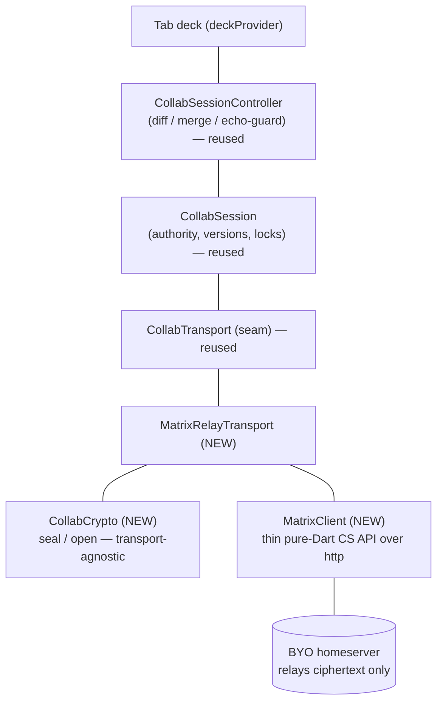

# OciDeck — Self-encrypted relay: realtime samenwerken in pure Dart (Design)

> **Status:** design proposal — unbuilt · **Status last reviewed:** 2026-07-31 · **Published by:** Stichting LibreKAT

> **A design proposal — not yet implemented.**
> This is the detailed, pick-up-cold implementation design for **real-time remote
> collaboration** ([issue #977], COLLABORATION Phase 1) along the route the
> foundation chose in
> [`assurance/ketenkeuring-self-encrypted-relay.md`](../../assurance/ketenkeuring-self-encrypted-relay.md)
> (GO, 2026-07-31): **the homeserver as an encrypted relay, with OciDeck's own
> minimal end-to-end encryption in pure Dart** — no AGPL, no Rust, EUPL-1.2 stays.
>
> It refines, and where noted supersedes, the Matrix parts of the parent design
> [`COLLABORATION.md`](COLLABORATION.md): its §6 (Matrix mapping) proposed the
> famedly `matrix` Dart SDK; the chain-review turned that down (#976, AGPL). This
> document replaces that mechanism while keeping every principle (§2) and every
> layer of the already-built transport-agnostic collab core intact.
>
> Written to be picked up cold: exact seams, data shapes, wire formats,
> invariants, the crypto contract, the test plan, and the open questions are all
> spelled out. Reference by **file + symbol name**, never a line number (line
> numbers drift).

---

## 1. The idea in one paragraph

A Matrix homeserver is, for our purposes, a federated, store-and-forward,
ordered **append-only event log with accounts and presence** — reachable over a
plain HTTP client-server (CS) API that is trivially spoken in pure Dart. The only
part of a "real" Matrix client that forced AGPL/Rust was **Matrix-native E2EE**
(Olm/Megolm via `vodozemac`). OciDeck does not need it: its operations travel in a
*private* event type (`nl.ocideck.op`) that no other Matrix client reads. So we
use the homeserver purely as a **relay** for opaque ciphertext, and encrypt the
payload ourselves with a **minimal** scheme built on vetted, permissive pure-Dart
primitives. The server relays bytes it cannot read (P4 preserved), the whole thing
is pure Dart (web included), and the existing licence/SBOM gates cover it because
the one new dependency lives in `pubspec.lock`.

**The binding discipline (the chain-review's condition 1):** the crypto stays
*minimal* — key agreement + a session key + rekey on membership change — and is
externally reviewed. **No re-implementation of a ratchet (Double Ratchet / Megolm).**
The moment the design drifts toward that, route #991 (matrix-rust-sdk's proven
crypto) is strictly better and should be taken instead. This document is written
to stay on the right side of that line.

---

## 2. What we build on — the already-shipped collab core (do not rebuild)

Phases 0 and 0.5 (#975, #989, #996, #1007) shipped a complete, network-agnostic
collaboration core. **Everything at or above the transport seam is reused
unchanged.** The self-encrypted relay is a new *transport* plus a new
transport-agnostic *crypto* seam plus *onboarding* — nothing more.

| Built piece (`lib/collab/`) | Symbol | Role | Reused as-is? |
|---|---|---|---|
| Transport seam | `CollabTransport` (`collab_transport.dart`) | The dumb pipe: `sendOp`/`ops`/`setLock`/`locks`/`dispose`/`participantId` | **Yes — we implement it** |
| In-process transport | `LoopbackTransport` / `LoopbackHub` | Tests + two-window case | Yes |
| Authority state machine | `CollabSession` (`collab_session.dart`) | Versioning (P3), lock table, `becomeAuthority`/`stepDown`/`rebaseTo` | **Yes, unchanged** |
| Op model + apply | `DeckOp` sealed family, `applyOp` (`deck_op.dart`) | Field-level typed ops (P5) | Yes |
| Wire codec | `deckOpToJson`/`FromJson`, `lockEventToJson`/`FromJson`, `slideToJson`/`FromJson` (`collab_codec.dart`) | JSON of the model | Yes |
| Deck→ops diff | `deckDiffToOps` (`collab_deck_diff.dart`) | Turns a local edit into ops | Yes |
| Baseline | `CollabSnapshot` (`collab_snapshot.dart`) | Slide-id space for joiners (§5.5) | **Yes — new delivery** |
| Tab bridge | `CollabSessionController` (`collab_session_controller.dart`) | Local edit ↔ session, echo-guard, merge | Yes, unchanged |
| Provider | `collabSessionProvider` / `CollabSessionNotifier` (`lib/state/collab_session_provider.dart`) | Per-tab lifecycle, `TabInfo.collabSession` | **Generalised (see §10)** |

Two built pieces are **WebDAV-specific and are deliberately *not* carried over**:

- `CollabLogStore` / `WebdavCollabLogStore` (`collab_log_store.dart`) — the numbered
  conditional-`PUT` log. Matrix assigns its own event ordering, so the relay
  transport implements `CollabTransport` **directly**, the way `LoopbackTransport`
  does, not over a `CollabLogStore`.
- `HandoverCoordinator` (`handover_coordinator.dart`) — its own header says it is
  WebDAV-specific (it reads `isCaughtUp`/`knownMaxSeq`) and that "the Matrix step
  (which brings real presence, §6.2) [can] throw this coordinator away without
  touching `CollabSession`." We take that offer: handover uses Matrix **presence**
  (§8), which is a better liveness signal than the WebDAV frozen-tick heuristic.

**The consequence that makes this cheap:** `CollabSession`, the op model, the diff,
the merge, the snapshot semantics and the controller are already unit-tested end to
end over `LoopbackHub`. Driving them over a networked transport adds no new
convergence logic — only plumbing and crypto, each of which is independently
testable.

---

## 3. Architecture — where the new code sits



Three new units, one small refactor:

1. **`CollabCrypto`** (`lib/collab/collab_crypto.dart`) — the E2EE seam. Turns a
   plaintext record envelope into a sealed blob and back. Transport-agnostic on
   purpose: the WebDAV transport can adopt it later for encrypted async
   co-authoring at near-zero extra cost.
2. **`MatrixClient`** (`lib/collab/matrix_client.dart`) — a thin, pure-Dart Matrix
   CS-API client: register, login, `/sync`, send/edit events, room create/invite/
   join, to-device messages, media upload. No SDK; just `http` + JSON. It knows
   nothing about ops or crypto.
3. **`MatrixRelayTransport`** (`lib/collab/matrix_relay_transport.dart`) —
   implements `CollabTransport` by composing `MatrixClient` (carriage) and
   `CollabCrypto` (confidentiality). This is the analogue of
   `WebdavAsyncTransport`, but over Matrix and encrypted.
4. **Refactor:** generalise the launch helpers and the provider so the transport is
   pluggable (§10). Today `hostCollabSession`/`joinCollabSession` and the provider
   are hard-wired to a `CollabLogStore`; the Matrix path gets sibling launch
   helpers and a presence-based coordinator.

---

## 4. The crypto design (the heart — chain-review condition 1)

This section is the one that must survive external review. It is written to be
**minimal and boring**: standard primitives, standard constructions, no invented
cryptography.

### 4.1 Threat model — what we defend against, and what we don't

**In scope (must hold):**

- The **homeserver and any federated server on the path** see only ciphertext for
  op/lock/chat/snapshot payloads. They learn no deck content.
- **Tamper-evidence:** a modified or forged payload is rejected (AEAD tag), not
  applied. The authority's ops are additionally *attributable* to the authority's
  device (signature), reinforcing P3.
- **Fail-closed:** an undecryptable or unknown-epoch event is surfaced and dropped,
  never applied as plaintext or guessed at.

**Explicitly out of scope (honest limits, stated to the user):**

- **Metadata.** The homeserver still sees who is in which room, when, and how much
  traffic flows — identical to Matrix-native E2EE (COLLABORATION §9.3). E2EE hides
  content, not the fact of collaboration.
- **Per-message forward secrecy via a ratchet.** We rekey **per epoch** (on
  membership change), not per message. A device key compromise exposes the current
  epoch's session key, hence that epoch's traffic — not a whole ratchet chain. This
  is the deliberate trade versus Megolm (see §4.7), acceptable because sessions are
  ephemeral (P2: room = transport, file = truth) and small (P3).
- **Deniability / post-compromise self-healing.** Not offered. Not needed for
  disposable co-authoring rooms.

### 4.2 Primitives — `package:cryptography` (Apache-2.0), nothing hand-rolled

| Purpose | Primitive | `package:cryptography` API |
|---|---|---|
| Device key agreement | X25519 ECDH | `X25519()` |
| Device identity / signing | Ed25519 | `Ed25519()` |
| Key derivation | HKDF-SHA-256 | `Hkdf(hmac: Hmac.sha256(), outputLength: 32)` |
| Payload AEAD | **XChaCha20-Poly1305** (preferred) or AES-256-GCM | `Xchacha20.poly1305Aead()` / `AesGcm.with256bits()` |
| Random | CSPRNG | library `SecretKeyData.random` / `Nonce` helpers |

**AEAD choice — a refinement of the chain-review.** The review said "X25519 →
AES-256-GCM" illustratively. We prefer **XChaCha20-Poly1305**: its 192-bit nonce
makes a *random* nonce per message safe (collision probability negligible), which
removes AES-GCM's sharp nonce-reuse footgun (GCM catastrophically fails if a
(key, 96-bit nonce) pair ever repeats). This stays inside the review's intent —
authenticated encryption under a per-session key on a vetted primitive — and is the
safer construction. AES-256-GCM remains a documented alternative where hardware
acceleration matters and a strict per-(device,epoch) nonce counter is enforced. The
choice is Open Question OQ-2.

All primitives are pure-Dart in `package:cryptography` (with platform-accelerated
paths where present) and run on **all four targets plus web** — the reason this
route dissolves the web problem that dogged #991.

### 4.3 Identities and keys

Each **device** (an OciDeck install) holds two long-term keypairs, generated on
first collaboration use and stored in `SecretStore` (keychain), mirroring the
existing `privacyOwnIdentityKey` pattern:

- **Ed25519 identity keypair** — signs ops/snapshots (authenticity, provenance
  §9.2) and anchors device verification (§8). The public key is the device's
  stable identity in a session.
- **X25519 agreement keypair** — receives wrapped session keys.

Public keys are published into the room as a per-device **state event**
`nl.ocideck.device` (keyed by device id), so every member can look up any member's
current public keys. **The X25519 agreement key is signed by the device's Ed25519
identity key** inside that event, so a relay cannot substitute an agreement key
without breaking the signature (see §5.3, homeserver key substitution). The private
keys never leave `SecretStore`.

A **session key** `K` is a random 256-bit AEAD key the *authority* generates. It is
scoped to an **epoch** (a monotonically increasing integer). `K` is never sent in
the clear: for each member the authority computes
`wrap = AEAD(HKDF(ECDH(authority_x25519_priv, member_x25519_pub)), K)` and posts it
as a targeted **to-device message** (or a per-recipient `nl.ocideck.keyshare`
event). Only that member can unwrap it.

```mermaid
sequenceDiagram
    participant O as Owner device (authority)
    participant HS as Homeserver (relay, sees ciphertext)
    participant G as Guest device
    O->>O: generate session key K for epoch e
    G->>HS: publish nl.ocideck.device (Ed25519 pub, X25519 pub)
    O->>HS: read guest device keys
    O->>O: shared = X25519(O_priv, G_pub); wrap = AEAD(HKDF(shared), K)
    O->>HS: to-device keyshare {epoch:e, wrap} → guest
    HS->>G: deliver keyshare
    G->>G: shared = X25519(G_priv, O_pub); K = open(HKDF(shared), wrap)
    Note over O,G: now both hold K for epoch e; ops travel AEAD(K, envelope)
```

### 4.4 The sealed envelope (message format)

The relay carries the **same record envelope** the WebDAV transport already uses —
`{kind: 'op'|'lock'|'chat', from: participantId, op|lock|chat: <codec json>}` — but
sealed. The Matrix event `content` is:

```json
{
  "v": 1,
  "epoch": 7,
  "alg": "xchacha20-poly1305",
  "nonce": "<base64 24 bytes>",
  "ct": "<base64 ciphertext+tag>",
  "sender_device": "<device id>",
  "sig": "<base64 Ed25519 over (aad || ct)>"
}
```

- **AEAD associated data (AAD)** binds context so a valid ciphertext cannot be
  replayed into another room/epoch/type: `AAD = room_id || event_type || epoch ||
  sender_device`. Any mismatch fails the tag.
- **`sig`** (Ed25519 over `AAD || ct`) is **required on authoritative ops** (proves
  the op came from the authority's device — P3 anti-impersonation) and optional on
  follower intents. It is verified against the sender's published `nl.ocideck.device`
  identity key.
- `open()` fails closed on: bad tag, unknown/rejected `sender_device`, AAD mismatch,
  or an `epoch` for which this device has no `K` (→ triggers a keyshare re-request,
  never a silent skip of the op stream).

### 4.5 The `CollabCrypto` Dart contract

```dart
/// Transport-agnostic session E2EE. Holds this device's keypairs and the set of
/// per-epoch session keys, seals outbound record envelopes and opens inbound ones.
/// Pure logic over primitives — no network, no Matrix — so it is driven in tests
/// with known-answer vectors and needs no server.
abstract interface class CollabCrypto {
  int get currentEpoch;
  DeviceId get deviceId;

  /// Seal a plaintext record envelope for the current epoch. [signed] forces the
  /// Ed25519 signature (authoritative ops set it true).
  SealedEnvelope seal(Map<String, Object?> envelope, {required bool signed});

  /// Open a sealed envelope. Throws [CryptoOpenException] fail-closed on any
  /// tag/AAD/sender/epoch failure; the caller drops the event and, on an
  /// unknown-epoch failure, requests a keyshare.
  Map<String, Object?> open(SealedEnvelope sealed, {required RoomId room});

  /// Authority side: start a new epoch with a fresh random session key and return
  /// the per-member wraps to distribute (called on membership change).
  RekeyResult rekey(List<DevicePublicKeys> members);

  /// Member side: install a session key unwrapped from a keyshare.
  void installEpochKey(int epoch, WrappedKey wrap);
}
```

`SealedEnvelope`, `WrappedKey`, `RekeyResult` are small value types with
`toContent()`/`fromContent()` matching §4.4. `CollabCrypto` is the **only** file
that touches `package:cryptography`; everything else sees value types.

### 4.6 Key lifecycle & epochs

```mermaid
stateDiagram-v2
    [*] --> Epoch0: owner starts session (rekey to founding members)
    Epoch0 --> EpochN: membership change (join / leave / forced removal)
    EpochN --> EpochN: new member → wrap current K to them (no epoch bump needed for a pure add*)
    EpochN --> [*]: session ends (K discarded; file is the durable truth, P2)
    note right of EpochN
        * Add-only MAY reuse the epoch (new member cannot read pre-join
          traffic anyway — it is not in the room timeline for them).
        Removal MUST bump the epoch so the removed device cannot read
        post-removal traffic ("forward secrecy on membership").
    end note
```



- **Join:** wrap the *current* epoch key to the newcomer. They read from the
  snapshot + ops posted after they hold the key. They cannot read pre-join
  ciphertext — acceptable and expected (P2).
- **Leave / forced removal:** bump the epoch, generate a fresh `K`, wrap to the
  remaining members only. The removed device keeps the old `K` but every new op is
  under the new one.
- **Rekey threshold (OQ-2):** optionally also rotate after N messages or T minutes,
  purely as hygiene. Not required for correctness.

### 4.7 Why this is *not* the DIY-crypto the chain-review forbade

The review forbade "re-building Olm/Megolm" — a ratchet, per-message key
derivation, out-of-order key material, key backup, cross-signing chains. This
design has **none** of that. It is a group **key-wrapping** scheme: standard
authenticated ECDH to hand each member one symmetric key, standard AEAD to use it,
standard signatures for authenticity, and a whole-key rotation on membership
change. Every construction is a documented, unremarkable use of a vetted library.
That is the difference between "acceptable minimal crypto" and "the big
security-critical undertaking" — and it is the line the implementation must hold.

**Red lines for the implementer (do not cross without a new chain-review):**
no bespoke primitives; no custom KDF beyond standard HKDF usage; no per-message
ratchet; no rolling your own AEAD/nonce scheme beyond §4.2/§4.4; keep `CollabCrypto`
the single crypto file so review has one surface.

---

## 5. Onboarding, credentials & device verification (COLLABORATION §8)

### 5.1 In-app account (pure-Dart REST)

`MatrixClient` speaks the CS API directly:

- **Register:** `POST /_matrix/client/v3/register` with the homeserver's UIA flow
  (username/password + whatever stages it demands: email/terms/recaptcha). No
  browser detour. A **default suggested homeserver** is offered, with the field to
  type your own (P1 — OQ-1: which default, and it must not become a de-facto OciDeck
  dependency).
- **Login:** `POST /_matrix/client/v3/login` (`m.login.password`), returns an
  access token + device id.

### 5.2 Credential storage (mirror WebDAV exactly)

- **Access token + Matrix device id** → `SecretStore` (new methods
  `writeMatrixSession`/`readMatrixSession`/`deleteMatrixSession`, keyed by
  homeserver + user id, alongside `writeWebdavPassword`).
- **Device Ed25519/X25519 private keys** → `SecretStore` (new
  `writeCollabDeviceKeys`/`read`/`delete`).
- **Homeserver URL + user id** → `shared_preferences` (secrets never; exactly the
  WebDAV split). A new `lib/models/matrix_settings.dart` (cf. `webdav_settings.dart`,
  `WebdavServer`) holds the non-secret config and the `trustedInternal` opt-in for
  `NetGuard` (§11).

### 5.3 Device verification — our own, because we don't use Matrix cross-signing

A fresh login is an **unverified device** to collaborators until verified. Since we
do not use Matrix's cross-signing, verification is our own, out-of-band:

- **SAS / fingerprint compare:** show a short fingerprint (or emoji SAS) derived
  from both devices' Ed25519 identity keys; users confirm they match over an
  existing trusted channel. On confirm, the peer's identity key is pinned
  (trust-on-first-use with an explicit, dismissible "unverified" banner until then).
- The **"unable to decrypt / unverified device" moment** is designed explicitly
  (COLLABORATION §8): a clear state and a one-tap "verify" flow, never a cryptic
  failure. An unverified author's ops still apply (the room admitted them) but the
  UI marks them unverified until pinned; a *mismatched* identity key (an attempted
  impersonation of a pinned device) is a hard, loud stop.

**The one attack this scheme must name: homeserver key substitution.** Device
public keys are published as room state, which the untrusted homeserver relays. A
malicious server could swap a joiner's `nl.ocideck.device` X25519 key for its own,
then unwrap any session key the authority wraps to it — a classic MITM on the key
exchange. Two defences, and the design commits to both:

- **Bind the wrap to a verified identity.** The X25519 agreement key is published
  *alongside* the Ed25519 identity key and **signed by it**; the authority verifies
  that signature before wrapping, so the server cannot present an agreement key that
  is not vouched for by the device's identity key.
- **Verify-before-share is the default policy.** The authority wraps the session key
  only to devices whose Ed25519 identity is **verified** (SAS/fingerprint) or
  explicitly accepted under TOFU with the unverified banner showing. Auto-sharing to
  an unverified device is an opt-in convenience, never the silent default — because
  it is exactly the window this attack needs. This policy choice (strict vs
  TOFU-with-warning) is a headline item for the external crypto review (§4).

---

## 6. Matrix mapping — relay, not client (refines COLLABORATION §6.1)

| Collab concept | Matrix mechanism (this design) |
|---|---|
| Session | one room (`m.room.create`; owner is creator) |
| Operation | timeline event `nl.ocideck.op`, `content` = sealed envelope (§4.4) |
| Lock | timeline event `nl.ocideck.lock`, sealed (slide id inside ciphertext — OQ-4) |
| Chat | timeline event `nl.ocideck.chat`, sealed (**not** `m.room.message` — keeps it E2EE and off other clients) |
| Snapshot | chunked sealed events `nl.ocideck.snapshot.chunk` + a small pointer state event (§9), or an encrypted media attachment |
| Device public keys | state event `nl.ocideck.device` keyed by device id |
| Key share | **to-device** message `nl.ocideck.keyshare` (preferred) or per-recipient event |
| Authority beacon | state event `nl.ocideck.authority` `{authority, epoch, isOwner}` |
| Presence / who-drops | Matrix presence + ephemeral `nl.ocideck.viewing` (OQ-5 granularity) |
| Roles | our own authority (P3); optionally mirror owner → power level 100 for room admin only |

**Deliberately unused:** `m.room.encryption` (Matrix E2EE), Olm/Megolm,
cross-signing, key backup/SSSS, secure secret storage. All replaced by §4. The
room is left *unencrypted at the Matrix level* — its events carry our ciphertext in
`content`, so the server stores opaque blobs regardless.

**Ordering comes from Matrix** (COLLABORATION §6.2): `/sync` delivers events in
canonical order with a resumable `since` token, so the WebDAV transport's
gap-detection and sequence bookkeeping are unnecessary. App-level `version`
(`CollabSession`) still governs authority/conflict — unchanged.

---

## 7. `MatrixRelayTransport` (the Dart shape)

```dart
/// A CollabTransport over a Matrix room used as an encrypted relay. Composes a
/// [MatrixClient] (carriage) and a [CollabCrypto] (confidentiality); the
/// authority/version/lock logic in CollabSession drives it unchanged, exactly as
/// it drives LoopbackTransport and WebdavAsyncTransport.
class MatrixRelayTransport implements CollabTransport {
  MatrixRelayTransport({
    required MatrixClient client,
    required CollabCrypto crypto,
    required this.roomId,
    required this.participantId, // "<matrixUserId>:<deviceId>"
  });

  @override Future<void> sendOp(DeckOp op) async {
    final sealed = crypto.seal(
      {'kind': 'op', 'from': participantId, 'op': deckOpToJson(op)},
      signed: /* authoritative op */ op.version > 0,
    );
    await client.sendEvent(roomId, 'nl.ocideck.op', sealed.toContent());
  }

  @override Stream<DeckOp> get ops => _ops.stream;   // fed by the /sync loop
  @override Stream<LockEvent> get locks => _locks.stream;
  @override Future<void> setLock(String slideId, {required bool held, bool forced = false}) { /* seal 'lock' */ }
  @override Future<void> dispose() { /* stop sync loop, close streams */ }
}
```

Internals:

- A **`/sync` loop** (long-poll, `since` token persisted per room) pulls new events,
  drops this device's own sends (match `sender_device`), `open()`s the rest, and
  dispatches to `_ops` / `_locks` / chat / presence. A single poison event is logged
  and skipped (mirroring `WebdavAsyncTransport._dispatch`), never wedging the stream.
- **Own-echo suppression:** the `CollabTransport` contract says a participant never
  hears its own sends; matched on `sender_device`.
- **Keyshare handling:** `nl.ocideck.keyshare` to-device messages install epoch keys
  (`crypto.installEpochKey`); an `open()` that fails with unknown-epoch triggers a
  keyshare re-request to the authority.
- **Chunked snapshot** (§9) delivered to a specific joiner.

### 7.1 `MatrixClient` — the thin CS surface (pure Dart)

Minimal endpoint set, all `http` + JSON, `Authorization: Bearer <token>`:

| Concern | Endpoint |
|---|---|
| Register / login | `POST /register`, `POST /login` |
| Sync | `GET /sync?since=&timeout=` (long-poll) |
| Send timeline event | `PUT /rooms/{roomId}/send/{type}/{txnId}` |
| Send state event | `PUT /rooms/{roomId}/state/{type}/{stateKey}` |
| To-device | `PUT /sendToDevice/{type}/{txnId}` |
| Create / invite / join | `POST /createRoom`, `POST /rooms/{id}/invite`, `POST /join/{idOrAlias}` |
| Media (snapshot attachment, optional) | `POST /media/v3/upload`, `GET /_matrix/media/...` |
| Logout | `POST /logout` |

`MatrixClient` knows nothing about ops, crypto, or authority. It is the one place
that touches the network, so `NetGuard` (§11) wraps its host resolution, and it is
tested against an in-Dart **fake homeserver** (a `MatrixClient` built over an
injectable HTTP handler), not a live server.

---

## 8. Handover with presence (replaces `HandoverCoordinator`)

Matrix has real presence and read-your-writes, so owner-drop handover is simpler
and more correct than the WebDAV frozen-tick heuristic:

- The authority is named in the `nl.ocideck.authority` state event.
- When the owner's **presence** goes `offline`/`unavailable` (and stays so past a
  grace window), the deterministic successor with the **highest observed `version`**
  claims authority by writing the `authority` state event and calling
  `session.becomeAuthority()`. Because Matrix delivers in canonical order and
  confirms writes, the WebDAV "sequence-steady" guard is unnecessary — the successor
  simply requires it has applied every event up to the room's latest.
- The returning owner reclaims (writes the state event, `session.becomeAuthority()`);
  the stand-in `stepDown()`s. Only the owner persists (`canPersist`, unchanged).
- Epoch rekey on the membership change is the authority's job (§4.6).

This lives in `lib/collab/matrix_handover.dart`, a sibling to
`HandoverCoordinator`, reading presence instead of `isCaughtUp`. `CollabSession`
(the mechanism) is untouched — exactly the seam its header promised.

---

## 9. Session lifecycle end to end (refines COLLABORATION §6.5)

**Begin (host).** Login → `createRoom` → `CollabCrypto.rekey([owner])` (epoch 0) →
publish `nl.ocideck.device` → capture `CollabSnapshot.capture(deck, 0, 0)`, seal and
send it as `nl.ocideck.snapshot.chunk` events (≤ ~48 KiB plaintext per chunk to stay
under the ~64 KiB event cap after base64 + AEAD overhead) with a pointer state event
recording chunk count + total hash → write `nl.ocideck.authority` → become
authority. Share the room (invite by Matrix id, or a shareable `matrix.to`/deep
link — OQ-6).

**Join (guest).** Login → `join` the room → publish `nl.ocideck.device` → receive
the keyshare (authority wraps current epoch `K` to the newcomer) → read + reassemble
+ `open()` the snapshot → `snapshot.applyTo(localDeck)` (adopt authority slide ids,
§5.5) → catch up on ops posted since → follow. Throws a typed `no-baseline` if no
snapshot exists yet (mirrors `joinCollabSession`).

**Live.** Ops/locks/chat/presence flow as sealed events; each device `open()`s and
feeds `CollabSession`. Field-level locks give local, round-trip-free editing while
held (§5.4).

**End.** Owner calls the existing save path (`FileService.saveDeck` /
`buildPackageBytes`), optionally **signs** the distributed deck with the device
Ed25519 key (provenance, §9.2, ties to the classification gate). The room may be
left/closed; discarding `K`. A gone room is never a lost deck (P2).

**Membership change.** Join → wrap current `K`; leave/removal → epoch bump + rekey
to remaining (§4.6).

---

## 10. Provider & launch wiring (COLLABORATION §5.7)

Today `collab_session_provider.dart` is WebDAV-only: `canCollaborate` checks
`_tab?.webdavOrigin`, and `_begin` builds a `WebdavCollabLogStore` and calls
`hostCollabSession`/`joinCollabSession` (both take a `CollabLogStore`). The Matrix
path is added **beside** it, sharing the controller/session/tab seam:

- **A transport-neutral launch.** Introduce `hostMatrixSession` / `joinMatrixSession`
  (`lib/collab/matrix_session_launch.dart`) that build a `MatrixRelayTransport` +
  `CollabCrypto` + `matrix_handover` and return a `CollabLaunch` (the same value type
  the WebDAV launch returns — `session` + a coordinator). The provider selects the
  launch by the tab's configured backend. The WebDAV `CollabLaunch` carries a
  `HandoverCoordinator`; generalise the field to a common
  `abstract interface class CollabCoordinator { void start(); Future<void> syncNow();
  Future<void> dispose(); Stream<void> get authorityChanged; }` that both coordinators
  implement (a tiny extraction — both already expose exactly these).
- **`TabInfo`.** Add a Matrix session context (homeserver + room id) beside
  `webdavOrigin` (cf. `TabInfo.collabSession`, `webdavOrigin`), so "resume/save from
  session" knows the backend. `canCollaborate` becomes "has a WebDAV origin **or** a
  configured Matrix account".
- **Backend choice.** When a deck lives on WebDAV *and* a Matrix account is
  configured, offer both: WebDAV-async (offline-tolerant) vs Matrix (realtime). The
  default and the wording are a UX decision (OQ-7); the provider just needs the two
  launch paths.
- **UI.** Start / share (invite link, QR) / join; a chat panel; presence; the
  device-verification prompt and unverified-device banner (§5.3); the existing
  temporary-authority indicator (`CollabSessionState.isTemporaryAuthority`) is reused.
  New `error` keys (`no-matrix`, `unverified`, `keyshare-timeout`) join the existing
  `not-webdav`/`no-baseline` set, each localised (§12).

---

## 11. Security caps & hardening (mirror the existing posture)

- **`NetGuard`/SSRF for the homeserver host.** Reuse the WebDAV stance
  (`webdav_service.dart`, `NetGuard`): no HTTP redirects, reject private-address
  ranges unless `trustedInternal` is an explicit opt-in, DNS-rebinding guard. The
  homeserver is BYO outbound host #2 after WebDAV; it goes through the same guard.
- **Bounded sizes & counts.** Cap event size (reject inbound > cap), snapshot chunk
  count and total, member count, and keyshare fan-out. Reject oversized inbound ops
  (as `file_service.dart` bounds untrusted input).
- **Isolate for heavy work.** Snapshot (de)serialise + AEAD of large payloads run in
  an isolate with **static** helpers (perf-patterns), like package build.
- **Web.** CSP `connect-src` must allow the homeserver **https** origin for `/sync`
  long-poll (no `wss:` needed unless a streaming/sliding-sync path is chosen —
  OQ-3), enforced via `make build-web` / `tool/check_web_hardening.dart`. **No
  self-built WASM**, so `tool/check_bundled_js.dart` / `MANIFEST.json` need no
  extension — a concrete win over #991.
- **Fail-closed everywhere.** Undecryptable/forged/unknown-epoch event → surfaced +
  dropped, never applied. Mismatched pinned identity key → hard stop. Unknown event
  type/version → skipped, not fatal (forward-compat, as the WebDAV `_dispatch` does).

---

## 12. Dependencies, gates & the standing checks

- **New dependency:** `package:cryptography` (Apache-2.0) — the *only* one. After
  `pub add`, run `make licenses` (its whole transitive Dart tree must pass — it
  lives in `pubspec.lock`, no `Cargo.lock` blind spot) and `make sbom` (commit
  `sbom/`; the SBOM dep-change gate requires it). This is chain-review bouwvoorwaarde 2.
- **No new toolchain, no Cargo/WASM gate** — the three costs #991 carried do not
  apply here.
- **Standing ratchets** (`docs/CHECKS.md`): files ≤ 1000 lines (split with
  `part`/`part-of` — `collab_codec.dart` / `deck_op.dart` already do), methods ≤ 150,
  class-size ratchet (use top-level helpers, as the collab core does), no
  `catch(_)`/`print` (use `logWarning`/`logError`), atomic writes only, UI-imports-in-
  services ratchet, coverage gate (**every new `lib/` file must appear in a test**),
  and the l10n gate (**every new `l10n.d('…')` needs all 31 languages, single string
  literal**; use `make add-l10n`).
- **External crypto review (bouwvoorwaarde 1)** before user-facing release — tracked
  as an assurance follow-up, not a code gate.

---

## 13. Phased delivery (implementation order)

Each phase stands alone, ships green, and is separately testable. Crypto first so
the reviewable surface exists before any network code leans on it.

1. **P-A — `CollabCrypto`.** Pure crypto, no network. Known-answer vectors, round-
   trip, tamper/wrong-key/epoch-mismatch fail-closed, rekey. Mutation-tested
   (`make mutate`). *This is the artefact external review reads.*
2. **P-B — `MatrixClient`.** Thin CS client against an in-Dart fake homeserver:
   register/login/sync ordering, `since` resume, txn-id idempotency, to-device.
3. **P-C — `MatrixRelayTransport`.** Compose P-A + P-B behind `CollabTransport`;
   drive `CollabSession` end to end over the fake server, mirroring the existing
   loopback session tests (reuse them via the seam).
4. **P-D — Onboarding + keys.** `SecretStore`/`matrix_settings` additions; in-app
   register/login; device keypairs + `nl.ocideck.device`; keyshare + epochs; snapshot
   chunking; device-verification UX.
5. **P-E — Presence handover + chat + presence UI.** `matrix_handover`; chat panel;
   `nl.ocideck.viewing`.
6. **P-F — Provenance signing.** Owner Ed25519 signature on the distributed deck,
   tied to the classification gate (COLLABORATION §9.2, Fase 2 / #978).

Provider/UI wiring (§10) lands incrementally with P-C…P-E.

---

## 14. Testing strategy

- **`CollabCrypto`** (`test/collab/collab_crypto_test.dart` + vectors): X25519/
  HKDF/AEAD/Ed25519 known-answer vectors; seal→open round-trip; a single flipped
  ciphertext byte → `open` throws; wrong recipient key → throws; AAD/epoch mismatch →
  throws; rekey isolates removed members. Mutation-tested — a green suite that would
  *not* catch a tampered payload is worse than none.
- **`MatrixClient`** (`test/collab/matrix_client_test.dart`): fake homeserver;
  `/sync` order + `since` resume + reconnect; own-echo suppression by
  `sender_device`; poison event skipped, stream survives; chunk reassembly + total-
  hash check.
- **`MatrixRelayTransport`** (`test/collab/matrix_relay_transport_test.dart`): run
  the existing `CollabSession` authority/version/lock scenarios over the relay on the
  fake server — proving the seam swap changed nothing above the transport.
- **`matrix_handover`**: deterministic presence fake; owner-drop → successor with
  highest version claims; owner returns → reclaims; no split-brain.
- **No live homeserver in CI** (P1 — OciDeck runs none). A dev doc explains pointing
  at a local Synapse/Dendrite/Conduit for manual end-to-end checks.

---

## 15. Open questions (decide before/while implementing)

- **OQ-1 Default homeserver.** Which one do we suggest, with its terms shown, so it
  never becomes a de-facto OciDeck dependency (P1)? (COLLABORATION OQ-3.)
- **OQ-2 AEAD + nonce + rekey hygiene.** XChaCha20-Poly1305 (random nonce, preferred)
  vs AES-256-GCM (counter nonce). Optional time/count rekey threshold.
- **OQ-3 Web sync transport.** Long-poll `/sync` (https, simplest CSP) vs sliding-
  sync/streaming (may need `wss:`). Pick the one that keeps the CSP tightest.
- **OQ-4 Encrypt lock slide ids?** Sealing locks hides deck structure but costs a
  little; plaintext slide ids are simpler. Default: seal, for consistency.
- **OQ-5 Presence granularity.** "Who views which slide" to everyone, or only the
  owner? (COLLABORATION OQ-4.)
- **OQ-6 Invite/link + first-key delivery.** Matrix invite vs shareable link vs QR,
  and exactly when the newcomer's device key is known so the authority can wrap `K`
  (device event before first read).
- **OQ-7 Backend choice UX.** When both WebDAV and Matrix are available, what is the
  default and how is the choice worded?
- **OQ-8 Snapshot carriage.** Chunked timeline events (simple, in-room) vs an
  encrypted media attachment (one object, but a media endpoint + server retention to
  reason about).

---

## 16. File map (new + changed) — pick-up-cold

**New (`lib/collab/`):**

- `collab_crypto.dart` — the E2EE seam (§4); the only file importing
  `package:cryptography`.
- `matrix_client.dart` — thin pure-Dart CS client (§7.1).
- `matrix_relay_transport.dart` — `CollabTransport` over the room (§7).
- `matrix_handover.dart` — presence-based handover (§8).
- `matrix_session_launch.dart` — `hostMatrixSession`/`joinMatrixSession` (§10).

**New (elsewhere):**

- `lib/models/matrix_settings.dart` — non-secret homeserver config + `trustedInternal`
  (cf. `webdav_settings.dart`).
- Tests under `test/collab/` (§14) incl. crypto vectors.

**Changed:**

- `lib/collab/collab.dart` — export the new files.
- `lib/services/secret_store.dart` — `writeMatrixSession`/`read`/`delete`,
  `writeCollabDeviceKeys`/`read`/`delete`.
- `lib/state/collab_session_provider.dart` — backend selection; `CollabCoordinator`
  interface extraction; Matrix launch path.
- `lib/state/tabs_provider*.dart` — Matrix session context on `TabInfo`.
- `lib/widgets/…` — start/share/join, chat, presence, verification UX, new error keys.
- `pubspec.yaml` — `cryptography` dependency; `sbom/` regenerated.

**Docs to fold in when phases ship** (per `document-every-package`): `USER_GUIDE.md`
(collaborate over Matrix), `ARCHITECTURE.md` + `SOURCE_MAP.md` (the new units),
`CHANGELOG.md`, and this file's status line. `FILE_FORMAT.md` is untouched — the room
is transient (P2); nothing new persists in the `.md`.

---

## 17. Summary

Realtime collaboration for OciDeck is buildable **in pure Dart with EUPL-1.2
intact**, because the only thing that ever required AGPL/Rust was Matrix-native
E2EE — which OciDeck does not need. We use the homeserver as an encrypted relay,
add one Apache-2.0 pure-Dart dependency, and layer a **minimal** session-crypto
(authenticated ECDH → per-epoch session key → AEAD, signatures for authority) that
is deliberately *not* a ratchet. The entire built collab core — authority,
versioning, locking, diff/merge, snapshot, controller, provider — is reused
unchanged behind the `CollabTransport` seam; the new code is one crypto seam, one
thin CS client, one transport, and presence-based handover. Web works, the SBOM and
licence gates cover it with no blind spot, and no second toolchain enters the build.
The one real cost — OciDeck owning its crypto — is contained by keeping that crypto
minimal, single-file, and externally reviewed (chain-review condition 1).

[issue #977]: https://pawprint.vigilis.online/LibreKAT/Ocideck/issues/977
