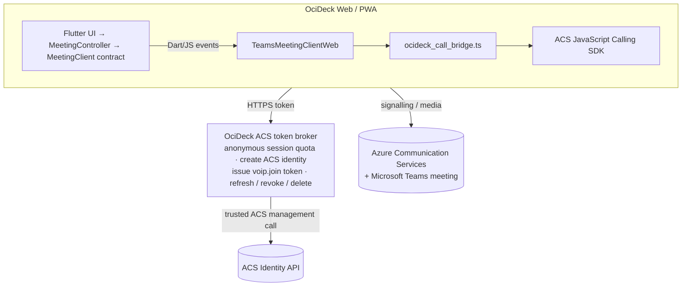
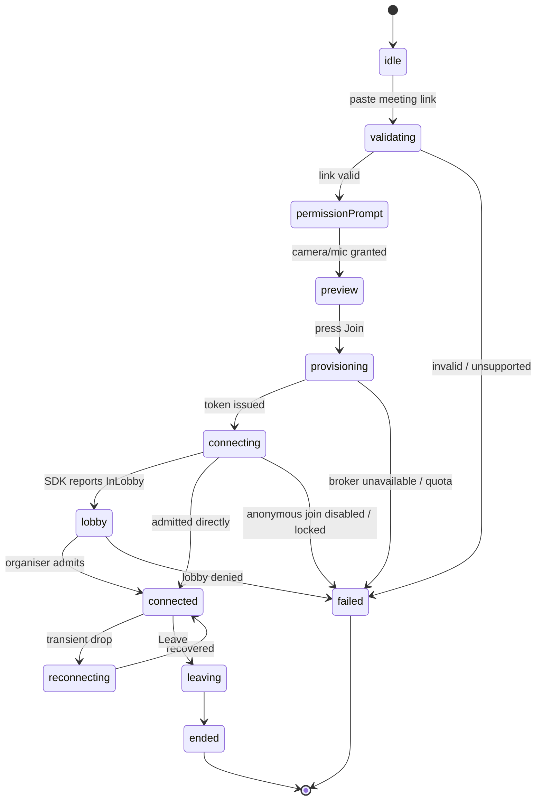
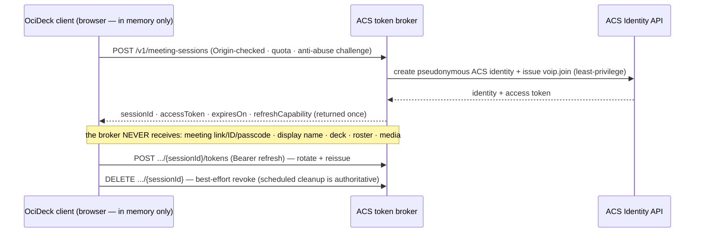

# OciDeck — Microsoft Teams Guest Client (Design)

> **Status:** design proposal — unbuilt · **Status last reviewed:** 2026-07-23 · **Published by:** Stichting LibreKAT

> **A design proposal, not current behaviour.**
> OciDeck cannot currently join a Microsoft Teams meeting. This document defines
> an implementation that a future contributor or coding agent can pick up cold.
> When a phase ships, move its current-state facts into the user, privacy,
> architecture, security and hosting documentation named in §22 and update this
> banner. Until then, the code and current-state documents remain authoritative.

> **Independent interoperability.**
> OciDeck is not affiliated with, endorsed by or sponsored by Microsoft. The
> proposed client uses Microsoft Azure Communication Services through Microsoft's
> documented interoperability surface. Product names are used only to describe
> compatibility.

Sibling design: [`COLLABORATION.md`](COLLABORATION.md) defines OciDeck-owned,
end-to-end encrypted collaboration over Matrix/WebRTC and, in §7.1, the common
`MeetingProvider` boundary and register for Teams, Webex, Zoom, Jitsi,
BigBlueButton, Nextcloud Talk and smaller/self-hosted systems. This document is
the first provider-specific design: a separate, explicitly Microsoft-operated
interoperability path. A Teams guest session is **not** a `CollabTransport`, does
not weaken the collaboration design's E2EE invariant and must never be presented
as providing OciDeck E2EE.

---

## 1. Outcome

A person who has a Microsoft Teams for work or school meeting link can:

1. open the installable OciDeck web app;
2. paste the meeting link;
3. enter a display name;
4. choose microphone and camera devices;
5. join as an external/anonymous participant without a Microsoft or Teams
   account;
6. use OciDeck as the call interface; and
7. share an OciDeck audience window into the meeting.

The meeting organiser and tenant remain authoritative. If anonymous join is
disabled, the meeting is locked, the participant is denied from the lobby or the
meeting type is unsupported, OciDeck says so and does not attempt a bypass.

### 1.1 Success criterion

The first end-to-end milestone is intentionally narrow:

> From a supported desktop browser, a user can paste an ordinary
> `teams.microsoft.com` work/school meeting link, join muted through OciDeck
> without a Microsoft account, wait in the lobby when required, hear the meeting,
> leave cleanly and receive a truthful reason when joining fails.

Video, device switching, screen sharing and hardening build on that verified
vertical slice. Chat does not.

---

## 2. Scope

### 2.1 In scope

- Microsoft Teams **work or school** scheduled meetings reached by join URL.
- Azure Communication Services (ACS) bring-your-own-identity/external-user
  interoperability.
- OciDeck web as an installable Progressive Web App (PWA).
- Pre-join device selection and local preview.
- Lobby, connected, reconnecting, denied, ended and failed states.
- Incoming and outgoing audio.
- Incoming and outgoing camera video.
- Participant roster and active remote video tiles.
- Browser-mediated screen/window sharing.
- A dedicated OciDeck audience window suitable for sharing.
- Recording and transcription status/consent UX required by Microsoft.
- A small token-provisioning service, operated either by the publisher or by the
  organisation using OciDeck.
- A configurable bring-your-own token-broker URL.
- Local, privacy-safe diagnostics without content telemetry.
- Accessibility, localisation, dependency, licence and SBOM work needed to ship
  the feature honestly.

### 2.2 Explicitly out of scope for the first release

- Microsoft Teams for personal use (`teams.live.com`).
- Webinars, town halls and live events.
- End-to-end encrypted Teams meetings, which ACS external users cannot join.
- Direct person-to-person Teams calls.
- Creating or scheduling Teams meetings.
- Microsoft Graph calendar access or discovery of meeting links.
- Authentication as a Microsoft 365/Teams user.
- Meeting chat, files, reactions, raised hands, polls, Q&A and breakout rooms.
- Teams background effects and Together mode.
- PSTN dial-in or dial-out.
- OciDeck recording, transcription or storage of call media.
- A calling bot or application-hosted raw-media bot.
- Native ACS integrations for each desktop operating system.
- Reverse engineering, embedding or automating the Microsoft Teams web client.
- Treating a Teams meeting as an OciDeck collaboration room.

These exclusions are product boundaries, not a claim that every item is
impossible. Each would require its own design and privacy review.

---

## 3. External constraints

The implementation must be designed around the service contract rather than an
imagined generic WebRTC endpoint.

1. **The supported client is ACS, not raw Teams WebRTC.** Join with the ACS
   Calling SDK and a `meetingLink` locator.
2. **The guest needs an ACS identity and short-lived access token.** Production
   tokens are issued by a trusted server; the ACS resource secret never enters
   OciDeck.
3. **Anonymous meeting policy still applies.** A tenant can prohibit the join,
   and lobby admission remains under the organiser's control.
4. **The meeting may not start with only the ACS guest present.** The UI must
   represent the lobby/waiting state without promising that joining succeeded.
5. **Feature parity is incomplete.** OciDeck must expose only capabilities
   reported by the SDK and must not imitate unsupported Teams controls.
6. **External ACS users cannot join an E2EE Teams meeting.** Transport encryption
   is not the same claim as end-to-end encryption.
7. **Browser support is narrower than Flutter web support.** Gate the feature on
   the runtime capability matrix and test supported browsers explicitly.
8. **Media needs enterprise-network access.** Signalling uses Microsoft/Azure
   endpoints; real-time media prefers UDP 3478–3481 and can fall back to TCP 443.
9. **Recording/transcription state is a user-facing obligation.** The client
   must display state changes immediately and collect explicit consent where a
   meeting policy requires it.
10. **Usage is billed to the ACS resource.** Abuse of an anonymous token broker
    has direct cost and availability impact.

Primary Microsoft references are collected in §25. Re-check them and the
installed SDK's release notes at implementation time; this is an integration
with a changing external service.

---

## 4. Architectural decisions and invariants

### T1 — Web/PWA first

The supported implementation is OciDeck's Flutter web build running as a normal
top-level browser application or installed PWA. The ACS JavaScript Calling SDK
is supported in desktop browsers; generic macOS/Linux/Windows desktop WebViews
are not a reliable cross-platform target.

The native OciDeck applications may offer an action that opens the hosted OciDeck
meeting surface in the default browser. They do not embed the call until a
separate native-platform design proves support on every promised target.

### T2 — ACS external identity, never a Microsoft account

The first release uses ACS bring-your-own identity. The display name is supplied
by the user to `createCallAgent`; it is not an authentication claim. OciDeck must
describe the participant as external/anonymous and must not imply Microsoft has
verified the name.

### T3 — Two components, one media path

There are exactly two OciDeck-owned components:

- the Flutter web/PWA client plus its local JavaScript bridge; and
- a token broker that provisions/revokes ACS identities and tokens.

The broker never proxies signalling, audio, video, screen sharing or the meeting
link. After token issuance, the client connects directly to ACS/Teams.

### T4 — Least-privilege join token

Request the narrowest token scope supported for an untrusted guest: `voip.join`,
not full `voip`. It permits joining existing calls without permission to start
new calls. Use the shortest lifetime compatible with a meeting and implement
refresh before expiry.

If the chosen stable ACS Identity SDK cannot issue `voip.join`, use the stable
REST API version that can, or stop and document the mismatch. Do not silently
fall back to a broader token.

### T5 — The meeting link stays on the device

The token broker does not need the meeting link, display name, deck, participant
list or device labels. Do not send them. This reduces both server trust and log
exposure. The link goes from the user's browser to the ACS Calling SDK only.

### T6 — Calling state is root-scoped

A call is application state, not deck state. `meetingSessionProvider` lives in
the root `ProviderScope`, outside `AppShell._tabScope`. Switching deck tabs must
not recreate the call agent or end a meeting.

### T7 — Dart owns product state; JavaScript owns SDK objects

No widget holds an ACS `Call`, `CallAgent`, renderer or device-manager object.
One bridge owns their lifecycle and emits serialisable events. Dart reduces the
events to immutable domain state and drives the interface.

### T8 — No background connection

Loading OciDeck must not contact Microsoft. The calling bridge may be bundled
locally, but `CallClient`, device permissions, token issuance and Microsoft
network activity begin only after the user opens the meeting flow, reads the
egress notice and performs an explicit action.

### T9 — No false E2EE claim

The UI and documentation say that the Teams path is operated through Microsoft
ACS and is encrypted according to that service's call topology. It does not use
OciDeck's planned Matrix/WebRTC E2EE session and cannot join an E2EE Teams
meeting as an ACS external user.

### T10 — Deployment choice is explicit

Support both:

- a publisher-operated default broker for low-friction use; and
- an organisation-configured broker endpoint and ACS resource.

The active broker origin is shown before joining and in meeting diagnostics.
Changing it is an administrative/settings action, not something encoded in an
untrusted meeting link.

### T11 — Failure is a typed state

No raw SDK exception reaches the user and no failure becomes a generic endless
spinner. Every terminal outcome maps to a stable `MeetingFailureKind`, a safe
localised explanation and optional privacy-safe diagnostic codes.

### T12 — Capability before control

Controls appear enabled only if the runtime and call capability say the action
is possible. A role, meeting policy, missing device or unsupported browser may
change that at any time.

---

## 5. System overview



*Audio/video never traverses the OciDeck broker; the broker only mints a
least-privilege join credential. No Microsoft Graph dependency is needed because
the user supplies the meeting link — do not add Graph permissions to the MVP.*

---

## 6. User experience

### 6.1 Entry

Add `Join online meeting…` as a root shell action. It is visible on native and
web builds:

- web/PWA opens the pre-join flow;
- native desktop explains that the supported client opens in the OciDeck web
  app, and offers an external HTTPS launch;
- unsupported mobile layouts say the feature is unavailable rather than
  attempting an untested call.

Do not hide the action behind an existing deck. Joining a meeting must work with
no presentation open.

### 6.2 Pre-join

Order the flow so no permission or network request is surprising:

1. Paste/type the meeting link.
2. Validate scheme and recognised meeting family locally.
3. Enter a display name; remember it locally only if the user opts in.
4. Show the egress notice:
   - broker origin receives a request for an anonymous call credential;
   - Microsoft receives network/device/media data when joining;
   - the display name and meeting link go to Microsoft;
   - the user is not authenticated as that name.
5. On `Set up devices`, request camera/microphone permission from the browser.
6. Enumerate devices and show a local camera preview.
7. Default to muted, camera off.
8. On `Join`, provision the token and call `join`.

Do not request device permission on initial page load. Browser permission prompts
must follow a clear user gesture.

### 6.3 Lobby

Show a real lobby view when the SDK reports `InLobby`:

- meeting title is unknown unless the service exposes a safe value; do not infer
  it from the URL;
- camera/microphone controls remain usable when the SDK permits;
- `Leave` is always present;
- say that an organiser must admit the participant;
- do not poll the token broker or reload the call to escape the lobby.

### 6.4 Connected workspace

Default layout:

```text
┌────────────────────────────────────────────────────────────────────┐
│ Recording/transcription/security banner (only when applicable)     │
├──────────────────────────────────────────────┬─────────────────────┤
│                                              │ Participant strip   │
│ OciDeck deck / active speaker / grid         │                     │
│                                              │                     │
├──────────────────────────────────────────────┴─────────────────────┤
│ Mic · Camera · Devices · Share deck · More · Leave                 │
└────────────────────────────────────────────────────────────────────┘
```

The central surface has three modes:

- `Deck`: current OciDeck presentation is primary;
- `Speaker`: one selected/active remote video is primary;
- `Grid`: visible remote videos are primary.

Changing local layout does not change what remote Teams participants receive.
Only camera and screen-share streams leave the client.

### 6.5 Leave and end

An external guest can leave, not end the meeting for everyone. `Leave` must:

1. stop screen sharing;
2. stop local video streams;
3. unsubscribe SDK events;
4. dispose every renderer/view;
5. call `hangUp`/leave;
6. destroy call agent/client bridge state;
7. best-effort revoke the broker session; and
8. clear credentials and capability handles from memory.

Make it idempotent so browser unload, user click and remote disconnect can race
without double-disposal errors.

---

## 7. Proposed repository changes

### 7.1 Dart domain and platform boundary

```text
lib/meetings/
  meeting_client.dart
  meeting_client_factory.dart
  meeting_client_web.dart
  meeting_client_stub.dart
  meeting_controller.dart
  meeting_event.dart
  meeting_failure.dart
  meeting_link.dart
  meeting_models.dart
  meeting_state.dart
  meeting_token_broker.dart

lib/state/
  meeting_session_provider.dart

lib/widgets/meetings/
  meeting_join_dialog.dart
  meeting_prejoin_view.dart
  meeting_lobby_view.dart
  meeting_workspace.dart
  meeting_controls.dart
  meeting_device_picker.dart
  meeting_participant_tile.dart
  meeting_recording_banner.dart
  meeting_diagnostics_dialog.dart
```

Use the same conditional-export pattern as `platform/presenter_fullscreen.dart`
and `utils/file_download.dart`. `meeting_client_stub.dart` must compile on every
non-web target and report `MeetingFailureKind.unsupportedPlatform`; it must not
import `dart:js_interop` or `package:web`.

Add a cheap feature flag to `platform/platform_features.dart`:

```dart
bool get supportsTeamsGuestClient => impl.supportsTeamsGuestClient;
```

This means **supported by OciDeck**, not merely `kIsWeb`. The web implementation
still performs an asynchronous browser/SDK capability check before enabling
devices or join.

### 7.2 JavaScript package and bridge

```text
web/calling/
  package.json
  package-lock.json
  tsconfig.json
  src/
    ocideck_call_bridge.ts
    call_events.ts
    call_renderers.ts
    call_devices.ts
  test/
    bridge_contract.test.ts

web/generated/
  ocideck_call_bridge.js
```

Use pinned npm dependencies:

- `@azure/communication-calling`;
- `@azure/communication-common`;
- a pinned build-only bundler/type checker; and
- no CDN runtime dependencies.

Choose one repository-wide policy before implementation:

- commit the reproducible generated bundle and verify its digest; or
- generate it during `make build-web` and require Node in `docs/BUILD.md`.

Do not hand-edit a minified bundle. Whichever policy is selected must be covered
by the dependency/SBOM checks and produce a first-party `script-src 'self'`
asset.

### 7.3 Token broker

```text
server/acs-token-broker/
  README.md
  openapi.yaml
  src/...
  test/...
  deployment/...
```

The existing fetch proxy is Python, but that is precedent rather than a language
mandate. Pick a runtime with a maintained stable ACS Identity SDK or use the
documented REST API. Keep this service independently deployable; do not add token
issuance to the static web host or the existing fetch proxy route.

### 7.4 Tests

```text
test/meeting_link_test.dart
test/meeting_controller_test.dart
test/meeting_event_contract_test.dart
test/meeting_failure_localization_test.dart
test/meeting_prejoin_view_test.dart
test/meeting_lobby_view_test.dart
test/meeting_workspace_test.dart
test/meeting_privacy_boundary_test.dart
test/meeting_log_redaction_test.dart
test/meeting_provider_scope_test.dart
```

Live-service verification belongs in a dated checklist (§19.5), not in the
deterministic unit suite.

---

## 8. Dart domain model

### 8.1 Stable session state

```dart
enum MeetingPhase {
  idle,
  validating,
  permissionPrompt,
  preview,
  provisioning,
  connecting,
  lobby,
  connected,
  reconnecting,
  leaving,
  ended,
  failed,
}

class MeetingState {
  final MeetingPhase phase;
  final bool isMuted;
  final bool isCameraEnabled;
  final bool isScreenSharing;
  final bool isRecordingActive;
  final bool isTranscriptionActive;
  final bool explicitConsentRequired;
  final List<MeetingParticipant> participants;
  final List<MeetingDevice> microphones;
  final List<MeetingDevice> cameras;
  final List<MeetingDevice> speakers;
  final MeetingCapabilities capabilities;
  final MeetingFailure? failure;
  final MeetingDiagnostic? diagnostic;
}
```

Do not store the meeting link, ACS token or refresh capability in Riverpod state:
provider state is inspectable and may accidentally enter diagnostics. Hold
credentials in private fields of the client/controller and erase references on
leave.



*Every phase is an explicit `MeetingPhase`; failure is a typed state
(`MeetingFailureKind`), never a raw exception. Credentials live in the client's
private fields, never in inspectable provider state.*

### 8.2 Client contract

```dart
abstract interface class MeetingClient {
  Stream<MeetingEvent> get events;

  Future<MeetingRuntimeCapabilities> probe();
  Future<void> requestPermissions({required bool audio, required bool video});
  Future<MeetingDevices> listDevices();
  Future<void> startLocalPreview({String? cameraId, required String viewId});
  Future<void> stopLocalPreview();

  Future<void> join({
    required Uri meetingLink,
    required String displayName,
    required MeetingCredential credential,
    required bool startMuted,
    required bool startWithVideo,
  });

  Future<void> setMuted(bool muted);
  Future<void> setCameraEnabled(bool enabled);
  Future<void> selectMicrophone(String deviceId);
  Future<void> selectCamera(String deviceId);
  Future<void> selectSpeaker(String deviceId);
  Future<void> attachRemoteVideo({
    required String participantId,
    required int streamId,
    required String viewId,
  });
  Future<void> detachRemoteVideo({
    required String participantId,
    required int streamId,
  });
  Future<void> startScreenShare();
  Future<void> stopScreenShare();
  Future<void> submitRecordingConsent(bool consent);
  Future<void> leave();
  Future<void> dispose();
}
```

The controller serialises state-changing operations. A second mute click while a
mute request is pending either coalesces to the latest desired value or queues
one follow-up; it does not run concurrent SDK mutations.

### 8.3 Typed events

Use a closed `sealed class MeetingEvent` hierarchy. Required events:

- `MeetingPhaseChanged`;
- `MeetingCapabilitiesChanged`;
- `LocalMuteChanged`;
- `LocalVideoChanged`;
- `ScreenShareChanged`;
- `ParticipantJoined` / `ParticipantUpdated` / `ParticipantLeft`;
- `RemoteVideoAdded` / `RemoteVideoAvailabilityChanged` /
  `RemoteVideoRemoved`;
- `DevicesChanged`;
- `RecordingChanged`;
- `TranscriptionChanged`;
- `ExplicitConsentChanged`;
- `DominantSpeakerChanged` when supported;
- `CallDiagnosticChanged`; and
- `MeetingDisconnected` with code/subcode but no raw exception string.

Events carry stable OciDeck DTOs, not dynamic ACS objects.

### 8.4 Failure taxonomy

```dart
enum MeetingFailureKind {
  invalidLink,
  unsupportedMeetingType,
  unsupportedPlatform,
  unsupportedBrowser,
  anonymousJoinDisabled,
  lobbyDenied,
  meetingLocked,
  e2eeMeetingUnsupported,
  permissionDenied,
  noMicrophone,
  noCamera,
  tokenBrokerUnavailable,
  tokenBrokerQuotaExceeded,
  credentialExpired,
  networkBlocked,
  meetingEnded,
  serviceUnavailable,
  unknown,
}
```

Mapping is conservative. Only say `anonymousJoinDisabled` when an SDK/service
code proves it; otherwise use a broader truthful category and include safe codes
in the diagnostics dialog.

---

## 9. JavaScript bridge contract

### 9.1 Ownership

The bridge is a singleton per browser document and owns:

- `CallClient`;
- `CallAgent`;
- `DeviceManager`;
- the active `Call`;
- local video stream/renderer;
- remote participant subscriptions;
- remote stream renderers/views;
- recording/transcription/capability feature objects; and
- all bound event callback functions needed for later `off()`.

It exposes a small stable surface to Dart. Do not mirror the full ACS API.

### 9.2 Example surface

```ts
export interface OciDeckCallBridge {
  probe(): Promise<RuntimeCapabilities>;
  requestPermissions(audio: boolean, video: boolean): Promise<void>;
  listDevices(): Promise<DeviceSnapshot>;
  startPreview(cameraId: string | null, viewId: string): Promise<void>;
  stopPreview(): Promise<void>;
  join(options: JoinOptions): Promise<void>;
  command(command: CallCommand): Promise<void>;
  attachRemoteVideo(key: RemoteStreamKey, viewId: string): Promise<void>;
  detachRemoteVideo(key: RemoteStreamKey): Promise<void>;
  leave(): Promise<void>;
  dispose(): Promise<void>;
  setEventSink(sink: (event: BridgeEvent) => void): void;
}
```

The implementation can be exposed through a typed `@JS()` binding or an ES
module loaded by the Flutter bootstrap. Prefer typed interop and generated/static
DTO conversion over calling arbitrary properties through `dynamic`.

### 9.3 Subscription discipline

For every `on(name, callback)` call, store the exact callback and guarantee one
matching `off(name, callback)` during participant removal, stream removal, leave
or dispose. Test this with a fake emitter. Failure here causes duplicate events,
stale participant tiles and media-resource leaks after rejoining.

### 9.4 Event transport

Events may cross the Dart/JS boundary as JS objects converted to validated Dart
DTOs. If JSON is used, parse against an explicit `schemaVersion`:

```json
{
  "schemaVersion": 1,
  "type": "phaseChanged",
  "phase": "lobby"
}
```

Reject unknown required fields safely. Ignore additive optional fields. A bad
bridge event becomes a local diagnostic, not an app crash.

---

## 10. Video rendering

ACS remote video rendering returns browser views; Flutter widgets cannot paint
those frames as ordinary Dart image bytes without waste and latency. Use an HTML
host per visible stream.

1. `MeetingParticipantTile` allocates a stable `viewId`.
2. Web-only code registers an `HTMLDivElement` for `HtmlElementView`.
3. Dart calls `attachRemoteVideo(participantId, streamId, viewId)`.
4. The bridge creates one `VideoStreamRenderer`, renders a view and appends the
   target element inside the registered host.
5. Availability or tile visibility controls whether a view is actively rendered.
6. Removal disposes the view and renderer before removing the host.

Maintain registries keyed by `(participantId, streamId)`, never participant
display name. Display names are neither unique nor authenticated.

Limit concurrently rendered incoming videos according to SDK/browser capability
and a product budget. A participant can remain in the roster without a live
rendered tile. Virtualise off-screen tiles rather than decoding every stream.

Every tile needs Flutter semantics independent of the embedded HTML view:

- participant display name;
- muted state when known;
- camera on/off;
- speaking/selected state; and
- an accessible action to select the tile.

---

## 11. Token broker



*`voip.join` rather than `voip`, short expiry with rotation: an open-source
client cannot keep a secret, so the broker constrains what a leaked token can do.*

### 11.1 API

Minimal versioned API:

```http
POST /v1/meeting-sessions
Origin: https://app.example.invalid
Content-Type: application/json

{
  "protocolVersion": 1,
  "challenge": "<optional-anti-abuse-proof>"
}
```

```json
{
  "protocolVersion": 1,
  "sessionId": "<opaque-id>",
  "acsIdentity": "<opaque-acs-identity>",
  "accessToken": "<opaque-token>",
  "expiresOn": "<rfc3339-time>",
  "refreshCapability": "<opaque-one-session-secret>"
}
```

```http
POST /v1/meeting-sessions/{sessionId}/tokens
Authorization: Bearer <refresh-capability>
```

```http
DELETE /v1/meeting-sessions/{sessionId}
Authorization: Bearer <refresh-capability>
```

All successful and error responses use `Cache-Control: no-store`. Never put
credentials in a URL/query parameter. The browser stores access and refresh
credentials in memory, not `localStorage`, `shared_preferences` or logs.

### 11.2 Provisioning

On session creation:

1. validate exact allowed `Origin` values;
2. enforce per-origin, per-network and global quotas;
3. validate/consume the optional anti-abuse challenge;
4. create a new pseudonymous ACS communication identity;
5. issue `voip.join` for the selected lifetime;
6. create an opaque server-side session record with expiry and a hash of the
   refresh capability;
7. return the credential exactly once; and
8. increment budget counters without storing meeting content.

On refresh, rotate the refresh capability and issue another least-privilege
token for the same ACS identity. Refresh early enough that a transient broker
failure does not interrupt a call immediately.

On delete/expiry, revoke tokens and delete the ACS identity where supported.
Deletion is best effort because closing a browser cannot guarantee delivery;
scheduled cleanup is authoritative.

### 11.3 Data the broker must not receive

- Teams meeting link, ID, passcode or tenant;
- participant display name;
- deck title, contents or file path;
- camera/microphone labels;
- participant roster;
- media or call diagnostics from ACS; or
- Microsoft chat content.

### 11.4 Abuse and cost controls

An open-source client cannot keep an application secret. CORS is not an
authentication mechanism and does not stop scripted clients. The broker needs:

- `voip.join` rather than `voip`;
- short expiry and refresh rotation;
- network and behavioural rate limits;
- concurrent-session ceilings;
- a hard daily/monthly spend circuit breaker;
- Azure resource quota alarms;
- optional privacy-preserving bot challenge after suspicious use;
- a denylist for compromised refresh sessions;
- uniform error responses that do not expose quota internals; and
- operational ability to disable the default broker without disabling BYO
  brokers.

An ACS access token cannot be assumed to be cryptographically bound to the
specific Teams link pasted in OciDeck. The design therefore does not claim that
the broker authorises a particular meeting.

### 11.5 Hosting model

Broker configuration:

```dart
class MeetingBrokerSettings {
  final Uri endpoint;
  final String? displayLabel;
  final bool publisherManaged;
}
```

Only HTTPS endpoints are accepted outside local development. Apply the same
internal-host/IP safety analysis used for other configurable network sources,
but remember the browser performs this request in the web build and is subject
to CORS. The default broker URL ships as public configuration, never as a secret.

---

## 12. Link handling

### 12.1 Accepted input

Accept:

- an HTTPS Teams work/school join URL documented as a meeting link; and
- later, only under a separate UI, meeting ID plus passcode if ACS support is
  verified and product need exists.

Reject locally:

- non-HTTPS schemes;
- credentials in the URL;
- `teams.live.com` personal meetings with a specific explanation;
- ordinary Teams navigation URLs that are not meeting join links;
- control characters or an unreasonably long value; and
- any app-config/broker override parameter embedded in the link.

Do not over-normalise or decode/re-encode the opaque meeting path. Preserve the
validated original URL when passing it to the SDK.

### 12.2 URL launch into OciDeck

A later convenience can register a safe OciDeck URL such as:

```text
https://app.example.invalid/meeting?join=<encoded-meeting-link>
```

This is **not** required for MVP and needs a separate leakage review: the Teams
link would otherwise appear in browser history, referrers, screenshots and web
server logs. Prefer paste-from-clipboard or an OS share target. Never put an ACS
token in a launch URL.

---

## 13. Call lifecycle and commands

### 13.1 Join

Client sequence:

1. validate link and form;
2. probe browser/SDK capabilities;
3. show/accept egress disclosure;
4. obtain a meeting credential;
5. construct `AzureCommunicationTokenCredential` with a refresh callback when
   supported;
6. create `CallClient` and `CallAgent` with the display name;
7. obtain `DeviceManager` and enumerate permitted devices;
8. call `callAgent.join({meetingLink: ...}, joinOptions)`;
9. subscribe to call state before relying on a connected state;
10. subscribe existing and newly added participants/streams; and
11. map `InLobby`, `Connected`, `Reconnecting` and `Disconnected` explicitly.

The `join()` future returning does not mean the participant is admitted. Only
SDK state drives `MeetingPhase`.

### 13.2 Audio

- Default muted.
- Represent desired state separately from confirmed SDK state while a command is
  pending.
- Disable unmute when capability/policy forbids it.
- Device labels may be blank until permission is granted; UI handles unnamed
  devices.
- Device removal selects the SDK/browser default and announces the change.
- Speaker selection is capability-gated because browsers differ.

### 13.3 Camera

- Local preview exists before the call and must be stopped/reused when joining.
- Start one outgoing camera stream maximum.
- Camera switching replaces or updates the stream through supported SDK methods;
  it must not create two outgoing streams.
- Turning video off disposes rendering resources that are no longer needed.
- Background effects are not offered.

### 13.4 Reconnection

On reconnecting:

- retain the call workspace;
- disable destructive duplicate join actions;
- show a non-modal reconnecting banner;
- keep local desired mute/video state;
- let the SDK reconnect; and
- time out only according to SDK terminal state or a documented OciDeck policy.

Never obtain a second identity and join a duplicate participant merely because
the media path is temporarily interrupted.

### 13.5 Token refresh

Schedule refresh from `expiresOn` with a safety margin and jitter. If the ACS
credential supports a refresh callback, centralise refresh there; otherwise
update the supported credential object according to the SDK contract. A refresh
failure becomes a warning while the old token remains usable and a terminal
failure only when continuation is no longer possible.

### 13.6 Capability changes

Capabilities can change after lobby admission or role/policy updates. Subscribe
and recompute controls. Never treat pre-join capability as permanent.

---

## 14. Presenting an OciDeck deck

### 14.1 MVP: browser screen sharing

Use the ACS screen-sharing API, which invokes browser display capture. The
browser must let the user select a tab/window/screen; OciDeck cannot suppress
that security chooser or silently capture another window.

### 14.2 Audience pop-out

Web presentation needs a share-safe pop-out:

1. User presses `Open audience window` from a direct gesture.
2. OciDeck opens a same-origin window containing only the audience view.
3. Presenter and audience window exchange typed messages through
   `BroadcastChannel` (with a random in-memory channel identifier).
4. Presenter remains authoritative for navigation and interactive slide state.
5. The audience window displays no notes, call controls, participant video,
   diagnostics or file paths.
6. User presses `Share deck` and selects that audience window in the browser
   chooser.

Reuse presentation payload concepts from `FullscreenPresenter` and
`AudienceWindow`, but do not assume `desktop_multi_window` exists on web. Define
a transport-neutral presenter sync DTO if the current window-channel payloads
cannot be reused without native types.

### 14.3 Privacy projection

The audience window and outgoing screen share show the same projected content
as an ordinary OciDeck presentation. Privacy disposition/TLP/export policy does
not automatically become a meeting access policy. Before sharing, show the
existing presentation/privacy warnings appropriate to live display.

OciDeck cannot redact participant video or another participant's screen share.
Do not route remote media through the deck privacy scanner.

### 14.4 No synthetic camera in MVP

Do not render slides into a fake camera stream to avoid the screen-share chooser.
That would reduce text quality, confuse camera semantics and add an unsupported
raw-media path. Revisit only with a separate accessibility and interoperability
design.

---

## 15. Recording, transcription and consent

Subscribe to recording and transcription features immediately after obtaining
the call object, including their current state before subscribing to changes.

When recording or transcription becomes active:

- show a persistent, high-contrast banner;
- announce it through an `aria-live`/Flutter semantics live region;
- state whether recording, transcription or both are active;
- never imply OciDeck controls or stores the recording;
- keep the banner visible after layout changes; and
- update immediately when state stops.

Where the meeting requires explicit consent:

- disable affected media participation as required by the SDK/service;
- show the exact consequence of accept/decline;
- call the supported explicit-consent API only after a direct user action;
- record no local evidence beyond current in-memory state unless a later legal
  design explicitly requires it; and
- leaving must remain possible without consenting.

This is a release blocker, not phase-two polish.

---

## 16. Security and privacy

### 16.1 Trust boundaries

| Boundary | Data crossing it | Control |
| --- | --- | --- |
| User → OciDeck | Meeting link, display name, device choice | Local validation; no content logs |
| OciDeck → token broker | Anonymous credential request, refresh capability | HTTPS, exact CORS, rate limit, no meeting link |
| Broker → ACS Identity | Identity/token management | Server credential in secret store; least privilege |
| OciDeck → ACS/Teams | Meeting link, display name, IP/service data, selected audio/video/share | Explicit egress disclosure; SDK; user controls |
| ACS/Teams → OciDeck | Participant metadata and media | Treat metadata as untrusted; bounded rendering |
| Flutter ↔ JS bridge | Commands/events/view identifiers | Typed schema; no raw SDK objects |

### 16.2 Threats and required mitigations

| Threat | Required mitigation |
| --- | --- |
| ACS resource secret extracted from app | Secret exists only in broker secret management |
| Public broker used as free calling credential mint | `voip.join`, quotas, challenge, spend circuit breaker, revocation |
| Meeting link leaks through server/log/referrer | Never send to broker; `no-referrer`; no URL launch in MVP; log guard |
| Token leaks into storage or diagnostics | Memory only; `no-store`; redaction tests; never interpolate credential objects |
| Forged participant name trusted as identity | Label guest as external/anonymous; key by opaque participant ID |
| Malicious display name affects UI | Render as text, length-bound, never HTML |
| Duplicate listeners retain participant data | Exact `on`/`off` registry and disposal contract tests |
| Hidden Microsoft traffic on app load | No SDK initialisation before explicit meeting action |
| User believes call is E2EE | Explicit Teams/ACS security copy; block unsupported E2EE join truthfully |
| Recording starts unnoticed | Current-state query + event subscription + persistent live banner |
| Unsupported control suggests policy bypass | Capability-gated controls and typed denial state |
| Clickjacking around device consent | Top-level PWA deployment; retain restrictive frame-ancestor policy |
| Dependency compromise | Lockfile, self-hosted bundle, digest/SBOM/licence/OSV checks |

### 16.3 CSP and hosting headers

The current web CSP is deliberately restrictive. Implementation must derive and
document the smallest tested additions for ACS signalling. Expected changes
include explicit HTTPS/WebSocket destinations and locally served bridge assets;
do not replace the policy with unrestricted `*`.

The static host must also set an intentional `Permissions-Policy`, for example
camera, microphone and display capture for the OciDeck origin only. Validate the
final syntax against supported browsers. Keep `frame-ancestors 'none'` for the
standalone call client; this is not a Teams meeting-stage iframe.

WebRTC media is also subject to network/firewall requirements outside CSP. Add a
troubleshooting check for blocked UDP/TURN without claiming OciDeck can inspect
the organisation's firewall.

### 16.4 Logging

Allowed local diagnostics:

- OciDeck phase;
- SDK call-end code and subcode;
- browser family/version class;
- capability booleans;
- whether UDP/TCP/network diagnostics report a problem; and
- counts of participants/rendered streams, never their names/IDs.

Forbidden:

- meeting link, ID, passcode or URL fragments;
- ACS identity/token/refresh capability;
- display or participant names;
- device labels;
- deck content/path/title;
- chat/media/transcript content; and
- raw exception objects whose message may embed any forbidden value.

Apply and extend `log_no_content_test.dart`/convention checks rather than relying
only on code review.

### 16.5 Privacy statement

Do **not** update the current privacy statement when merging only this design.
Update it in the implementation phase that first enables network use. It must
then say, in user language:

- calling is optional and starts only on the user's action;
- which broker is contacted and what it receives;
- Microsoft ACS/Teams receives the meeting link, display name and call media;
- OciDeck does not receive/store the call media on its broker;
- service-side operational processing remains governed by Microsoft/the meeting
  organisation; and
- OciDeck's local privacy scanner does not make the call E2EE or scan remote
  participant media.

---

## 17. Accessibility

The meeting client is keyboard- and screen-reader usable before video polish.

- Logical focus order: disclosure → link/name → devices → preview toggles → join.
- Every icon-only control has a localised name and current-state semantics.
- Mute/camera buttons expose pressed state, not only colour/icon changes.
- Lobby, reconnecting, participant join/leave, recording and transcription use
  restrained live announcements; participant churn must not flood speech.
- Remote video never carries essential information without participant name and
  state semantics.
- Captions are not promised when ACS Teams interoperability does not support
  them. The absence is disclosed, not hidden.
- Focus returns to a stable control after dialogs and device changes.
- `Leave` remains keyboard reachable in every phase.
- 200% UI scaling must not hide call controls or the recording banner.
- Reduced-motion settings apply to speaking indicators and layout transitions.
- Device error messages identify a recovery action without relying on codes.

Add semantics/widget tests plus manual screen-reader verification on at least one
supported browser/OS combination before release.

---

## 18. Localisation

All UI copy follows OciDeck's Dutch-source `l10n.d(...)` convention and must be
translated into every supported language in the same change. This includes:

- meeting action and pre-join fields;
- egress disclosure;
- permission/lobby/reconnection states;
- every `MeetingFailureKind` explanation;
- device and capability labels;
- recording/transcription/consent copy;
- audience-window instructions; and
- diagnostics labels.

Never display raw English ACS state names or exception messages. Codes may be
shown in an expandable diagnostic area, but the explanation is localised.

---

## 19. Verification strategy

### 19.1 Pure Dart tests

- Link validation accepts documented work/school links and rejects unsupported
  schemes/personal links without rewriting the opaque path.
- State reducer covers every legal phase transition and rejects stale events.
- Leave/dispose is idempotent under racing triggers.
- Command serialisation coalesces mute/camera intent correctly.
- Credential refresh scheduling respects expiry and safety margin.
- Root provider survives deck tab replacement.
- Failure mapping never overclaims a specific policy cause.
- No provider state or diagnostic object contains link/token/display name.

### 19.2 Bridge contract tests

With fake ACS emitters/objects:

- every subscription gets exactly one matching unsubscribe;
- existing participants and newly added participants follow the same path;
- video renderer/view disposal occurs on stream removal, participant removal,
  leave and bridge dispose;
- unknown/additive event fields are handled compatibly;
- call-end codes cross without raw error strings;
- a second join is refused while a call exists; and
- device-change and capability-change events propagate once.

### 19.3 Widget tests

- No permission/network action before explicit gesture.
- Join disabled until link/name/disclosure are valid.
- Muted/camera-off defaults are visible and semantic.
- Lobby never looks connected.
- Recording/transcription banner remains visible in every layout.
- Unsupported controls are absent/disabled with an explanation.
- Leave is present in connecting, lobby, connected and reconnecting states.
- 200% scale and narrow desktop viewport retain core controls.

### 19.4 Broker tests

- Exact origin allowlist and preflight behaviour.
- No meeting-link/display-name fields accepted or logged.
- Only `voip.join` requested.
- Token/refresh responses carry `no-store`.
- Refresh rotation invalidates the previous capability.
- Quotas and spend circuit breaker fail closed.
- Expired sessions revoke/delete through scheduled cleanup.
- ACS/service errors return stable, non-secret public errors.
- Structured logs contain correlation ID and category, never credential bodies.

### 19.5 Real-service verification matrix

Automated fakes cannot establish Teams interoperability. Before marking any
phase current, record a dated result in `docs/design/VERIFICATION.md` for:

- supported Chrome and Edge on Windows;
- supported Chrome on macOS/Linux where Microsoft lists support;
- Safari on macOS if the SDK capability matrix lists it;
- corporate network with UDP available;
- restricted network exercising TCP fallback;
- anonymous join allowed/disabled;
- lobby bypass and explicit admission;
- organiser denies admission;
- meeting locked/ended;
- microphone only, camera, camera switch, device unplug;
- network interruption/reconnect;
- screen share start/stop;
- recording/transcription starts before and after join;
- explicit consent required; and
- token refresh during a deliberately long test call.

Do not claim a platform from a one-off local success. Keep the supported matrix
in one current-state location when shipped.

---

## 20. Build, dependency and supply-chain integration

Adding the ACS JavaScript packages changes OciDeck's distribution and outbound
surface. The implementation phase must:

1. pin direct and transitive npm resolution in a lockfile;
2. document the Node/bundler toolchain or committed-bundle reproduction path;
3. add packages and licences to `THIRD_PARTY_NOTICES.md` and generated SBOMs;
4. extend vulnerability checks to the calling bundle dependency graph;
5. verify the generated bundle digest/reproducibility;
6. keep all runtime scripts first-party under CSP;
7. document that a self-contained offline HTML deck does **not** contain the ACS
   SDK or become a call client;
8. update `make build-web`, `make check-full` and release packaging; and
9. add a bundle-size measurement dated in `docs/PERFORMANCE_GUIDE.md`.

Do not reuse `assets/web_export/MANIFEST.json` blindly: that inventory describes
scripts in exported offline decks. Give the app runtime bundle its own manifest
or generalise the tooling with explicit bundle classes so export and app assets
cannot be confused.

---

## 21. Delivery phases

### Phase 0 — Service spike, no product claim

Deliver:

- test ACS resource and non-production broker;
- pinned JavaScript SDK sample outside product UI;
- join by meeting link as external user;
- audio-only, muted, lobby and leave;
- captured call-end codes for policy/unsupported cases; and
- dated verification notes.

Exit gate: two independently organised work/school meetings can be joined from a
supported browser without a Microsoft account, and anonymous-disabled behaviour
fails truthfully. No merge into user-visible UI if this fails.

### Phase 1 — Product skeleton and audio vertical slice

Deliver:

- repository module/file boundaries from §7;
- root-scoped controller and fake client;
- pre-join disclosure/link/name UI;
- production-shaped broker protocol with `voip.join`;
- web bridge join/lobby/connected/leave;
- incoming/outgoing audio and mute;
- typed failures and privacy-safe diagnostics;
- tests and documentation for the audio slice; and
- feature marked experimental/off by default.

Exit gate: the §1.1 success criterion passes the real-service matrix and all
local quality gates.

### Phase 2 — Devices, camera and participant video

Deliver:

- permission flow and device enumeration;
- local preview;
- camera start/stop/switch;
- roster and bounded remote-video rendering;
- device-change recovery;
- capability-gated controls;
- accessibility/semantics coverage; and
- renderer leak/stress tests.

Exit gate: repeated join/leave and participant churn show no duplicate events or
unbounded renderer/memory growth.

### Phase 3 — Compliance states and resilience

Deliver:

- recording/transcription state and explicit-consent handling;
- token refresh;
- network reconnect and terminal-code mapping;
- quota/spend circuit breaker;
- diagnostics/troubleshooting UI;
- CSP, Permissions-Policy and network deployment documentation; and
- full privacy/security documentation updates.

Exit gate: required consent and long-call refresh have passed real meetings;
privacy statement matches packet-level observed egress.

### Phase 4 — OciDeck presenting

Deliver:

- web audience pop-out;
- typed presenter/audience sync;
- browser screen-share integration;
- privacy/TLP live-display warnings;
- share-state recovery when user/browser stops capture; and
- cross-browser presentation verification.

Exit gate: only audience content is visible in the selected shared window and no
presenter notes/call controls leak.

### Phase 5 — Supported beta

Deliver:

- publisher and BYO broker setup;
- supported browser matrix and upgrade policy;
- translated user documentation;
- operational alerts/runbook/status handling for publisher broker;
- accessibility manual verification;
- cost/load test and abuse exercise; and
- remove experimental label only after tracked field use.

Chat or Teams-user authentication remains outside this phase plan.

---

## 22. Documentation changes when implementation lands

| Document | Required current-state update |
| --- | --- |
| `README.md` | Add feature only when its supported phase ships; name web/PWA boundary |
| `docs/USER_GUIDE.md` | Join, permissions, lobby, controls, sharing, limits, costs/broker choice |
| `docs/PRIVACY.md` | Exact broker/Microsoft egress, retention and no-media-through-broker claim |
| `docs/SECURITY_DESIGN.md` | Trust boundaries, token lifecycle, CSP, abuse controls, non-E2EE boundary |
| `docs/ARCHITECTURE.md` | Root meeting state, JS bridge and token broker runtime diagram |
| `docs/SOURCE_MAP.md` | Every new Dart service/state/widget and web bridge directory |
| `docs/HOSTING.md` | HTTPS, CSP, Permissions-Policy, signalling/media network requirements |
| `docs/BUILD.md` | Node/bundler/lockfile/reproducible bridge build |
| `docs/CHECKS.md` | Bridge, broker, privacy, dependency and live-verification gates |
| `docs/PERFORMANCE_GUIDE.md` | Bundle/media/rendering budgets and measured results |
| `docs/ACCESSIBILITY.md` | Meeting controls, media semantics and unsupported captions truth |
| `docs/KNOWN_LIMITATIONS.md` | Platform/meeting/feature parity and E2EE limitation |
| `docs/design/VERIFICATION.md` | Dated real Teams/browser/network matrix |
| `CHANGELOG.md` | Per phase, never announce a later phase early |
| `THIRD_PARTY_NOTICES.md` and SBOMs | ACS/npm dependency licences and versions |

The privacy statement changes in the same commit that enables the first external
call, never in advance and never later.

---

## 23. Operational design for a publisher broker

Operating the default broker is an ongoing service commitment. Before enabling
it by default, define:

- service owner and incident contact;
- deployment regions and ACS resource/data-location implications;
- availability target and maintenance communication;
- monthly budget, per-client quotas and emergency shutoff;
- secret rotation and ACS credential compromise procedure;
- dependency/security patch cadence;
- minimal retention periods for rate-limit/security logs;
- lawful/privacy basis for those operational logs;
- user-visible status when only the default broker is unavailable; and
- migration path to a BYO broker without exporting credentials.

The app remains usable for editing/presenting offline when the broker or
Microsoft is unavailable. Calling failure must not block ordinary OciDeck use.

---

## 24. Decisions still requiring a human owner

Implementation can start through Phase 1 with safe defaults, but release needs
explicit answers to:

1. **Who operates the default broker?** Stichting LibreKAT, another named
   operator or BYO-only.
2. **Who pays ACS usage?** Default broker budget/subsidy, organisational broker,
   or another transparent model.
3. **Which deployment region(s)?** Based on intended users, service availability
   and data-location statement.
4. **Which browser matrix is promised?** A tested subset of Microsoft's current
   support, not every Flutter web browser.
5. **How is anonymous abuse challenged?** Thresholded challenge mechanism and
   its privacy/accessibility trade-off.
6. **Is the generated JS bundle committed?** Reproducibility/reviewer experience
   versus repository size and Node requirement.
7. **When does the feature leave experimental status?** Define field evidence,
   not only passing unit tests.
8. **What is the maximum subsidised meeting duration?** Drives token lifetime,
   refresh and quotas.

Record decisions here with date and rationale; remove the question from this
section when decided.

---

## 25. Primary references

Verify these at implementation time and record the SDK/API versions selected.

- Microsoft Learn, *Join a Teams meeting* (ACS Calling SDK):
  <https://learn.microsoft.com/azure/communication-services/how-tos/calling-sdk/teams-interoperability>
- Microsoft Learn, *Communication as Teams external user*:
  <https://learn.microsoft.com/azure/communication-services/concepts/interop/guest/overview>
- Microsoft Learn, *Teams meeting capabilities for Teams external users*:
  <https://learn.microsoft.com/azure/communication-services/concepts/interop/guest/meeting-capabilities>
- Microsoft Learn, *Azure Communication Services Calling SDK overview*:
  <https://learn.microsoft.com/azure/communication-services/concepts/voice-video-calling/calling-sdk-features>
- Microsoft Learn, *Create and manage access tokens for end users*:
  <https://learn.microsoft.com/azure/communication-services/quickstarts/identity/access-tokens>
- Microsoft Learn, *Communication Identity — Issue Access Token*:
  <https://learn.microsoft.com/rest/api/communication/identity/communication-identity/issue-access-token>
- Microsoft Learn, *Subscribe to SDK events*:
  <https://learn.microsoft.com/azure/communication-services/how-tos/calling-sdk/events>
- Microsoft Learn, *Show call transcription state on the client*:
  <https://learn.microsoft.com/azure/communication-services/how-tos/calling-sdk/call-transcription>
- Microsoft Learn, *Network recommendations*:
  <https://learn.microsoft.com/azure/communication-services/concepts/voice-video-calling/network-requirements>
- Microsoft Learn, *Call flow topologies*:
  <https://learn.microsoft.com/azure/communication-services/concepts/detailed-call-flows>
- Microsoft Learn, *Pricing for Teams interop scenarios*:
  <https://learn.microsoft.com/azure/communication-services/concepts/pricing/teams-interop-pricing>

---

## 26. Definition of done

The Teams guest client is complete only when all of the following are true:

- A supported OciDeck PWA joins supported Teams work/school meetings without a
  Microsoft account.
- Anonymous-disabled, lobby-denied, locked, ended and unsupported meeting cases
  produce truthful typed outcomes.
- Broker uses only `voip.join`, rotates refresh capability, enforces quotas and
  has a spend circuit breaker.
- Meeting link, names, credentials and media are absent from broker requests and
  OciDeck logs as designed.
- No Microsoft network request or device permission occurs before explicit user
  action and disclosure.
- Audio, video, device switching, participant rendering, reconnection and leave
  pass the supported real-browser matrix.
- Recording/transcription and required explicit consent are visible and tested.
- Audience-window sharing leaks no presenter/call/private deck surface.
- Every renderer, event listener, stream and credential is disposed/revoked on
  leave; repeated calls show bounded resource use.
- Keyboard, screen-reader, 200% scaling and reduced-motion requirements pass.
- CSP, Permissions-Policy, network, privacy and hosting docs match observed
  behaviour.
- Dependencies are pinned, licensed, scanned and present in verified SBOMs.
- Current-state docs and translations listed in §22 are complete.
- `make check-full` passes, plus dated real-service verification is recorded.
- The UI never describes the Teams path as OciDeck E2EE or as a verified user
  identity.

Anything less is an experimental slice and must be labelled with the phase and
known limitations that actually shipped.
